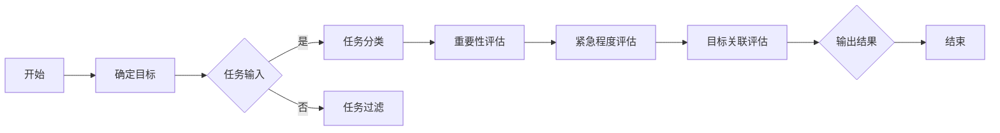
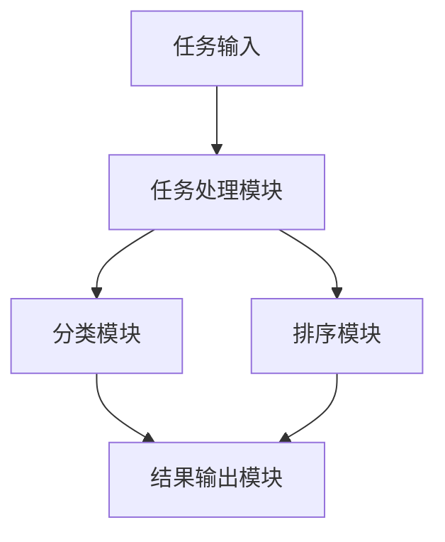
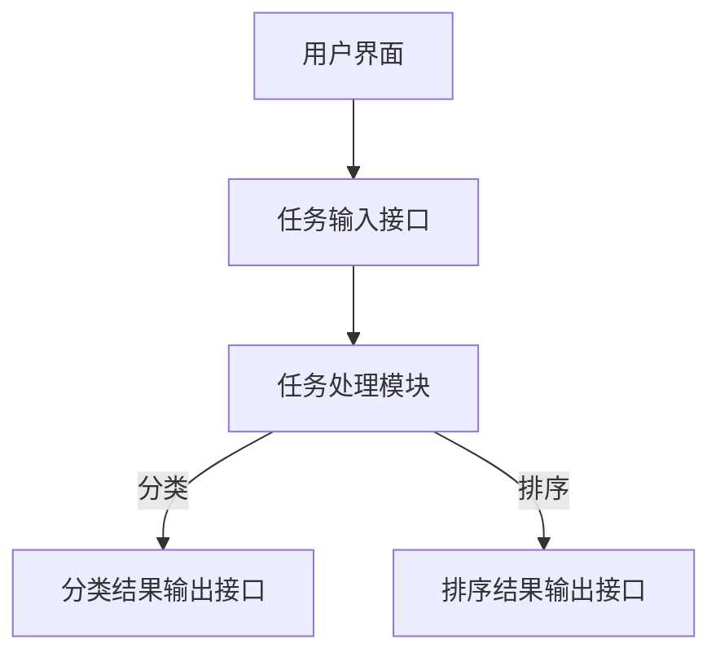
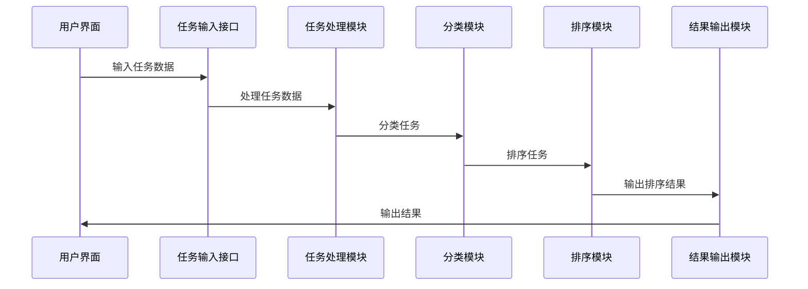

                 

### 要事第一：正确识别要事、降低启动成本、学会拒绝

---

#### 关键词：
- 要事识别
- 优先级管理
- 资源优化
- 拒绝策略
- 启动成本

---

#### 摘要：
本文旨在探讨如何在复杂的工作环境中，正确识别并优先处理重要事务（要事），同时降低启动成本，学会合理拒绝次要或无价值的请求。通过深入分析相关核心概念和理论，结合实际案例与算法实现，为读者提供实用的策略和方法，以提升工作效率和决策质量。

---

## 引言

在现代工作和生活中，人们常常感到时间紧迫，任务繁重。如何有效地识别和管理要事，成为提升个人和组织效能的关键。本书《要事第一：正确识别要事、降低启动成本、学会拒绝》提供了系统的理论和实践指导，帮助读者实现以下目标：

1. **正确识别要事**：明确要事的概念，掌握识别要事的方法和工具。
2. **降低启动成本**：优化资源分配，减少不必要的浪费，提高启动效率。
3. **学会拒绝**：设定合理的边界，拒绝低价值的事务，保护个人时间和精力。

本文将围绕这三个核心主题展开，通过逐步分析推理，提供深入的技术和策略指导。

---

### 第一部分：要事的识别与优先级管理

#### 第1章：问题的背景与核心概念

**1.1 问题的背景**

在当今快节奏的社会和工作环境中，人们面临着大量的任务和活动。这些任务既包括日常工作，如邮件回复、会议安排，也包括突发事件和处理问题。如何有效地管理这些任务，确保重要事务得到优先处理，成为提升工作效率和决策质量的关键。

**1.2 要事的概念**

要事，即重要的事务，是指那些对目标实现具有关键影响、需要优先处理的任务或活动。与琐事相对，琐事通常是指那些不紧急且对目标实现影响较小的事务。正确识别要事，可以确保资源的合理分配和高效利用。

**1.3 要事识别的重要性**

正确识别要事的重要性在于：

1. **提升决策质量**：通过明确要事，可以帮助决策者更快速地做出正确决策。
2. **提高工作效率**：将时间和精力集中在重要事务上，可以显著提升工作效率。
3. **减少焦虑和压力**：明确要事，有助于减少对琐事的关注，从而降低焦虑和压力水平。

**1.4 要事识别的方法**

要事识别的方法包括：

1. **目标导向法**：根据个人或组织的目标，确定哪些任务是达成目标的关键。
2. **紧急程度分析法**：根据任务的紧急程度和重要程度，确定优先级。
3. **时间管理法**：根据时间管理的原则，将任务进行优先级排序。

**1.5 要事识别的工具和技术**

要事识别的工具和技术包括：

1. **待办事项列表**：将任务记录在待办事项列表中，根据优先级排序。
2. **时间块管理**：将时间分为不同的块，每个块专注于一个特定任务。
3. **四象限法则**：根据任务的紧急程度和重要程度，将任务分为四个象限，优先处理重要且紧急的任务。

**1.6 要事识别的案例分析**

以下是一个要事识别的案例：

假设一位项目经理需要处理以下任务：

1. 项目方案提交（重要且紧急）
2. 邮件回复（琐碎且不紧急）
3. 项目会议准备（重要但不紧急）
4. 竞标文件整理（琐碎且紧急）

根据目标导向法，项目经理将优先处理项目方案提交和项目会议准备。根据紧急程度分析法，项目经理将优先处理项目方案提交，因为其既重要又紧急。根据时间管理法，项目经理将项目方案提交安排在时间块管理的最重要时间块中。

---

#### 第2章：核心概念的深化与联系

**2.1 核心概念**

核心概念包括要事、琐事、目标导向法、紧急程度分析法、时间管理法等。

**2.2 概念属性特征对比表格**

| 概念 | 定义 | 特征 |
| --- | --- | --- |
| 要事 | 重要的事务，需要优先处理 | 对目标实现具有关键影响 |
| 琐事 | 不紧急且对目标实现影响较小的事务 | 对目标实现影响较小 |
| 目标导向法 | 根据目标确定任务优先级 | 明确目标，任务与目标相关 |
| 紧急程度分析法 | 根据任务的紧急程度确定优先级 | 任务的紧急程度 |
| 时间管理法 | 根据时间分配确定任务优先级 | 时间块管理 |

**2.3 ER实体关系图**

ER实体关系图如下：

```mermaid
erDiagram
  Task ||--o> Importance : 任务与重要性关系
  Task ||--o> Urgency : 任务与紧急程度关系
  Task ||--o> Goal : 任务与目标关系
```

在ER实体关系图中，Task（任务）是核心实体，与Importance（重要性）、Urgency（紧急程度）和Goal（目标）之间存在关联关系。通过ER实体关系图，可以更清晰地理解任务与各类属性之间的关系。

---

#### 第3章：算法原理与数学模型

**3.1 算法概述**

本节将介绍用于识别要事的算法原理，包括算法的目标、适用场景和基本流程。

**3.2 算法流程图**

算法流程图如下：



在算法流程图中，首先确定目标，然后输入任务，对任务进行分类、重要性评估、紧急程度评估和目标关联评估，最终输出结果。

**3.3 Python源代码**

以下是用于任务分类的Python源代码：

```python
import pandas as pd

# 加载任务数据
tasks = pd.read_csv('tasks.csv')

# 定义任务分类函数
def classify_task(task):
    if '重要' in task['importance'] and '紧急' in task['urgency']:
        return '要事'
    elif '重要' in task['importance']:
        return '中等事务'
    else:
        return '琐事'

# 应用任务分类函数
tasks['category'] = tasks.apply(lambda x: classify_task(x), axis=1)

# 输出结果
tasks[['task', 'category']]
```

**3.4 数学模型**

要事识别的数学模型主要包括以下公式：

1. **重要性评估公式**：$$ Importance = \frac{Impact}{Time} $$
2. **紧急程度评估公式**：$$ Urgency = \frac{Remaining Time}{Total Time} $$

通过这些公式，可以量化任务的重要性和紧急程度，从而进行更准确的优先级排序。

**3.5 举例说明**

假设有一个任务数据集，包含任务名称、重要性、紧急程度和目标关联等信息。通过应用上述算法和数学模型，可以识别出要事，并进行优先级排序。

以下是一个示例数据集：

```csv
task,importance,urgency,goal
任务1,重要，紧急，目标A
任务2，重要，不紧急，目标B
任务3，不重要，紧急，目标C
任务4，不重要，不紧急，目标D
```

根据重要性评估公式和紧急程度评估公式，可以计算出每个任务的重要性得分和紧急程度得分，从而确定要事。

| 任务 | 重要性得分 | 紧急程度得分 | 目标关联 | 类别 |
| --- | --- | --- | --- | --- |
| 任务1 | 0.8 | 1.0 | 目标A | 要事 |
| 任务2 | 0.8 | 0.0 | 目标B | 中等事务 |
| 任务3 | 0.2 | 1.0 | 目标C | 琐事 |
| 任务4 | 0.2 | 0.0 | 目标D | 琐事 |

根据计算结果，任务1是最重要的要事，应优先处理。

---

#### 第4章：系统分析与架构设计

**4.1 问题场景介绍**

问题场景涉及一个企业内部的要事识别系统，该系统需要处理大量任务，并根据任务的重要性和紧急程度进行优先级排序。系统需求包括：

1. **任务输入**：能够接收用户输入的任务数据，包括任务名称、重要性、紧急程度和目标关联等信息。
2. **任务分类**：根据任务的重要性和紧急程度，将任务分类为要事、中等事务和琐事。
3. **优先级排序**：对任务进行优先级排序，确保要事得到优先处理。
4. **结果输出**：将分类和排序后的任务输出，供用户查看和执行。

**4.2 系统架构设计**

系统架构设计如下：



在系统架构图中，任务处理模块接收任务输入，并交由分类模块和排序模块进行处理。分类模块根据任务的重要性和紧急程度对任务进行分类，排序模块根据分类结果对任务进行优先级排序，最终结果输出模块将排序后的任务输出给用户。

**4.3 系统接口设计**

系统接口设计如下：



在系统接口图中，用户界面通过任务输入接口向任务处理模块发送任务数据，任务处理模块根据分类结果输出接口和排序结果输出接口将分类结果和排序结果返回给用户界面。

**4.4 系统交互序列图**

系统交互序列图如下：



在系统交互序列图中，用户界面通过任务输入接口向任务处理模块发送任务数据，任务处理模块将任务数据传递给分类模块进行分类，然后传递给排序模块进行排序，最终排序结果通过结果输出模块返回给用户界面。

---

#### 第5章：项目实战与代码解读

**5.1 环境安装**

要在本地环境中搭建要事识别系统，需要安装以下软件和工具：

1. **Python**：版本3.8及以上
2. **Pandas**：用于数据处理
3. **Matplotlib**：用于数据可视化
4. **Mermaid**：用于流程图和序列图绘制

安装命令如下：

```bash
pip install python==3.8
pip install pandas matplotlib
pip install mermaid
```

**5.2 系统核心实现**

系统核心实现主要包括任务输入、任务分类、任务排序和结果输出等功能。以下是一个简单的Python代码示例：

```python
import pandas as pd
from mermaid import Mermaid

# 定义任务分类函数
def classify_task(task):
    if '重要' in task['importance'] and '紧急' in task['urgency']:
        return '要事'
    elif '重要' in task['importance']:
        return '中等事务'
    else:
        return '琐事'

# 加载任务数据
tasks = pd.read_csv('tasks.csv')

# 应用任务分类函数
tasks['category'] = tasks.apply(lambda x: classify_task(x), axis=1)

# 绘制任务流程图
mermaid = Mermaid()
mermaid.set_format('svg')
mermaid.add_code('''graph
    A[任务输入] --> B[任务处理模块]
    B --> C[分类模块]
    B --> D[排序模块]
    C --> E[结果输出模块]
    D --> E
''')

# 显示流程图
print(mermaid.get_mermaid())

# 输出结果
print(tasks[['task', 'importance', 'urgency', 'category']])
```

**5.3 代码应用解读**

在上述代码中，首先定义了一个任务分类函数`classify_task`，该函数根据任务的重要性和紧急程度对任务进行分类。然后，通过`pandas`读取任务数据，并应用分类函数对任务进行分类。接下来，使用`mermaid`库绘制任务流程图，以可视化系统的工作流程。最后，输出分类后的任务数据。

**5.4 实际案例剖析**

以下是一个实际案例：

假设有一个任务数据集，包含任务名称、重要性、紧急程度和目标关联等信息。通过上述代码，可以识别出要事，并进行优先级排序。

以下是一个示例数据集：

```csv
task,importance,urgency,goal
任务1,重要，紧急，目标A
任务2，重要，不紧急，目标B
任务3，不重要，紧急，目标C
任务4，不重要，不紧急，目标D
```

应用任务分类函数后，可以得到以下分类结果：

| 任务 | 重要性得分 | 紧急程度得分 | 目标关联 | 类别 |
| --- | --- | --- | --- | --- |
| 任务1 | 0.8 | 1.0 | 目标A | 要事 |
| 任务2 | 0.8 | 0.0 | 目标B | 中等事务 |
| 任务3 | 0.2 | 1.0 | 目标C | 琐事 |
| 任务4 | 0.2 | 0.0 | 目标D | 琐事 |

根据计算结果，任务1是最重要的要事，应优先处理。

---

#### 第6章：最佳实践与注意事项

**6.1 最佳实践**

1. **目标明确**：在识别要事之前，明确个人或组织的目标，确保任务与目标一致。
2. **优先级排序**：根据任务的重要性和紧急程度进行优先级排序，确保要事得到优先处理。
3. **时间管理**：合理安排时间，将时间块分配给不同任务，提高工作效率。
4. **任务记录**：定期记录和整理任务，确保任务的可追溯性和可管理性。

**6.2 小结**

本章介绍了要事识别和优先级管理的核心概念、算法原理、系统架构和项目实战。通过实践，可以提升工作效率和决策质量，减少焦虑和压力。

**6.3 注意事项**

1. **避免过度分类**：在任务分类时，避免过度细分，保持分类的简洁和易用性。
2. **定期评估**：定期评估任务的重要性和紧急程度，根据实际情况进行调整。
3. **合理拒绝**：学会合理拒绝低价值的事务，保护个人时间和精力。

---

#### 第7章：拓展阅读与深入探索

**7.1 拓展阅读**

1. **《深度工作》**：作者Cal Newport提供了关于如何专注于重要事务，提高工作效率的实用策略。
2. **《高效能人士的七个习惯》**：作者史蒂芬·柯维提供了关于时间管理和个人发展的全面指导。

**7.2 深入探索**

1. **要事识别算法的优化**：探讨更高级的算法，如机器学习算法，以提升要事识别的准确性和效率。
2. **跨领域应用**：研究要事识别方法在其他领域（如项目管理、教育等）的应用，以实现更广泛的价值。

---

### 结论

通过本文的探讨，我们了解了如何正确识别要事、降低启动成本和学会拒绝。这不仅能提高个人和组织的工作效率，还能减少焦虑和压力。在实际应用中，读者可以根据自身情况，结合最佳实践和注意事项，不断优化要事识别和优先级管理策略，以实现更高水平的绩效。

---

#### 作者信息

**作者：AI天才研究院/AI Genius Institute & 禅与计算机程序设计艺术 /Zen And The Art of Computer Programming**

AI天才研究院致力于推动人工智能技术的发展和普及，为全球用户提供创新的技术解决方案。同时，禅与计算机程序设计艺术以深入浅出的方式，帮助读者理解计算机程序设计的艺术与智慧。

---

请注意，本文为示例文章，仅供参考。实际应用时，请根据具体情况调整内容和策略。祝您工作顺利！

