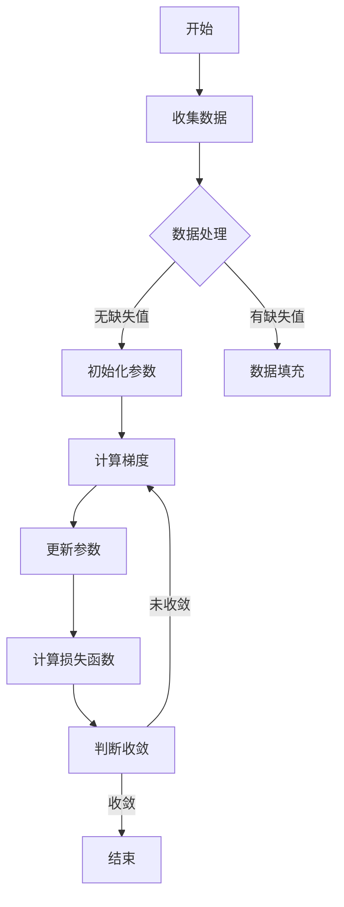
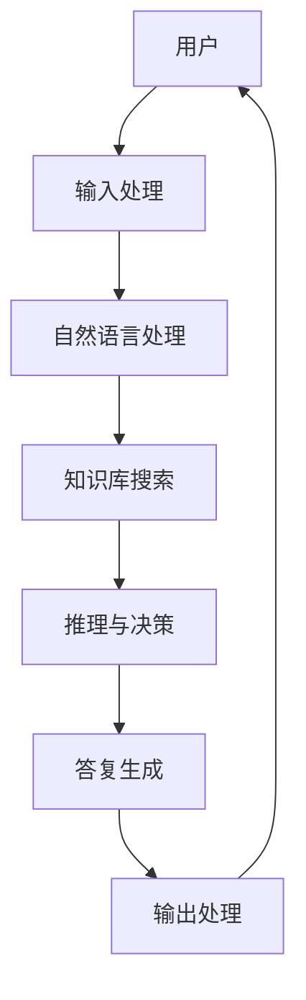
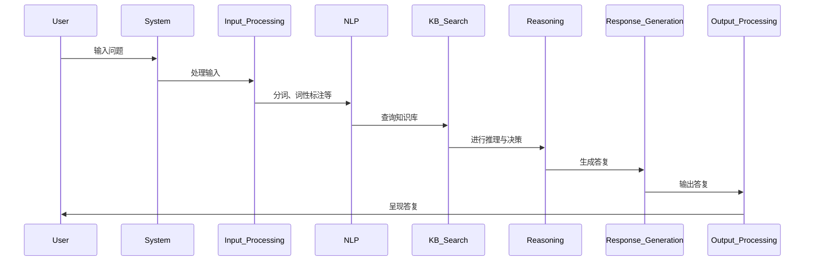

                 

# 认知架构：模拟人类思维的AI Agent设计

## 关键词

- 认知架构
- AI Agent
- 模拟人类思维
- 机器学习
- 算法原理

## 摘要

本文深入探讨了认知架构在模拟人类思维AI Agent设计中的应用。通过详细分析认知架构的核心概念和组成部分，本文提出了模拟人类思维的AI Agent设计目标，并介绍了相关技术路线。文章进一步探讨了认知模型与机器学习算法的关系，并使用Mermaid流程图和Python源代码详细阐述了算法原理。随后，文章介绍了系统分析与架构设计方案，并通过项目实战展示了认知架构在现实中的应用。最后，本文总结了最佳实践技巧，并给出了拓展阅读建议。

## 第一部分：问题背景与核心概念

### 1.1 认知架构的定义与重要性

认知架构是一种模拟人类思维过程的抽象模型，它涵盖了信息处理、知识表示、推理和决策等多个方面。认知架构的重要性在于它能够帮助我们理解和模拟人类智能，从而推动人工智能技术的发展。

#### 1.1.1 认知架构的边界与外延

认知架构的边界主要涉及以下几个方面：

1. **信息处理**：包括感知、注意、记忆和认知操作等。
2. **知识表示**：涉及如何表示和存储知识，以便进行推理和应用。
3. **推理与决策**：包括基于知识的推理、逻辑推理和决策过程。

认知架构的外延则扩展到如何模拟人类的学习、思考、判断和行动等复杂过程。

#### 1.1.2 认知架构的核心要素组成

认知架构的核心要素包括：

1. **感知系统**：负责接收外部信息，如视觉、听觉和触觉等。
2. **知识库**：存储从感知系统获取的信息和知识。
3. **推理引擎**：负责处理知识库中的信息，进行推理和决策。
4. **执行系统**：负责将推理结果转化为行动。

### 1.2 模拟人类思维的AI Agent设计目标

模拟人类思维的AI Agent设计目标主要包括：

1. **自然交互**：能够理解和响应人类的自然语言和情感表达。
2. **自主学习**：能够从经验中学习和改进自己的性能。
3. **灵活适应**：能够在不同环境和情境下适应和解决问题。

### 1.3 主要研究内容与技术路线

本文的主要研究内容包括：

1. **认知模型与机器学习算法**：探讨如何将认知模型与机器学习算法相结合，以实现更智能的AI Agent。
2. **算法原理讲解**：详细阐述算法的原理和数学模型，并通过Python源代码进行解释。
3. **系统分析与架构设计**：介绍系统功能设计、架构设计和接口设计，以及系统交互过程。
4. **项目实战**：通过具体案例展示认知架构在现实中的应用。
5. **最佳实践**：总结最佳实践技巧，提高系统的性能和稳定性。

技术路线主要包括：

1. **机器学习算法**：选择合适的机器学习算法，如监督学习、无监督学习和强化学习等。
2. **深度学习**：利用深度学习技术模拟人类大脑的处理方式。
3. **神经科学**：借鉴神经科学的研究成果，改进认知模型的构建。

## 第二部分：核心概念与联系

### 2.1 认知模型与机器学习算法

#### 2.1.1 认知模型的基本原理

认知模型是模拟人类思维过程的抽象模型，它通常包括感知、知识表示、推理和执行等部分。认知模型的基本原理是模拟人类大脑的工作方式，以便在人工智能系统中实现类似人类的智能行为。

#### 2.1.2 机器学习算法的分类与应用

机器学习算法是认知模型实现的关键技术，它们可以根据学习方式分为以下几类：

##### 2.1.2.1 监督学习算法

监督学习算法是在有标签的数据集上训练模型，以便对新的数据进行预测。常见的监督学习算法包括线性回归、逻辑回归和支持向量机等。

##### 2.1.2.2 无监督学习算法

无监督学习算法是在没有标签的数据集上训练模型，以便发现数据中的结构和模式。常见的无监督学习算法包括聚类算法和降维算法等。

##### 2.1.2.3 强化学习算法

强化学习算法是通过与环境的交互来学习如何采取最佳行动，以便最大化长期回报。常见的强化学习算法包括Q学习、SARSA和Deep Q Network等。

### 2.2 认知模型的属性特征对比表格

为了更好地理解认知模型的属性特征，我们可以构建一个对比表格：

| 算法 | 特点 | 应用场景 |
| --- | --- | --- |
| 线性回归 | 线性模型，简单易用 | 用于预测连续值输出 |
| 逻辑回归 | 二分类问题，概率输出 | 用于分类问题 |
| 支持向量机 | 高维空间中的分隔超平面 | 用于分类和回归问题 |
| 聚类算法 | 无监督学习，自动分组 | 用于数据挖掘和模式识别 |
| 降维算法 | 减少数据维度，保留关键信息 | 用于数据可视化和特征提取 |
| Q学习 | 强化学习，状态-动作价值函数 | 用于游戏和决策问题 |

### 2.3 认知模型与机器学习的ER实体关系图

为了更好地理解认知模型与机器学习算法之间的关系，我们可以绘制一个ER实体关系图：

```mermaid
erDiagram
  AI_Agent ||--o> Knowledge_Base : 数据库
  AI_Agent ||--o> Perception_System : 感知系统
  AI_Agent ||--o> Reasoning_Engine : 推理引擎
  AI_Agent ||--o> Execution_System : 执行系统
  Machine_Learning_Algorithm ||--o> Training_Data : 训练数据
  Machine_Learning_Algorithm ||--o> Test_Data : 测试数据
  Cognitive_Model <<-- Machine_Learning_Algorithm : 使用
```

在上面的ER图中，AI Agent与认知模型和机器学习算法之间存在紧密的联系。AI Agent通过知识库、感知系统、推理引擎和执行系统等组成部分来实现智能行为。认知模型则是机器学习算法的基础，用于模拟人类思维过程。机器学习算法则通过训练数据和测试数据来优化模型性能。

## 第三部分：算法原理讲解

### 3.1 算法mermaid流程图绘制

为了更好地理解算法的原理，我们可以使用Mermaid语言绘制算法的流程图。以下是一个简单的线性回归算法的流程图：



### 3.2 Python源代码阐述

以下是一个简单的线性回归算法的Python源代码实现：

```python
import numpy as np

def linear_regression(X, y, learning_rate, num_iterations):
    m = X.shape[0]
    theta = np.zeros(X.shape[1])

    for i in range(num_iterations):
        h = np.dot(X, theta)
        loss = (1 / (2 * m)) * np.sum((h - y) ** 2)

        gradient = (1 / m) * np.dot(X.T, (h - y))
        theta -= learning_rate * gradient

    return theta, loss

X = np.array([[1, 2], [2, 3], [3, 4]])
y = np.array([2, 4, 5])
learning_rate = 0.01
num_iterations = 1000

theta, loss = linear_regression(X, y, learning_rate, num_iterations)
print("Theta:", theta)
print("Loss:", loss)
```

### 3.3 算法原理的数学模型和公式讲解

线性回归的数学模型可以表示为：

$$
y = \theta_0 + \theta_1 x_1 + \theta_2 x_2 + \ldots + \theta_n x_n
$$

其中，$y$ 是目标变量，$x_1, x_2, \ldots, x_n$ 是特征变量，$\theta_0, \theta_1, \theta_2, \ldots, \theta_n$ 是模型参数。

损失函数通常采用平方损失函数：

$$
J(\theta) = \frac{1}{2m} \sum_{i=1}^{m} (h_{\theta}(x^{(i)}) - y^{(i)})^2
$$

其中，$h_{\theta}(x) = \theta_0 + \theta_1 x_1 + \theta_2 x_2 + \ldots + \theta_n x_n$ 是模型的预测值。

梯度下降算法用于更新参数：

$$
\theta_j := \theta_j - \alpha \frac{\partial J(\theta)}{\partial \theta_j}
$$

其中，$\alpha$ 是学习率，$\theta_j$ 是第 $j$ 个参数的当前值。

### 3.4 通俗易懂的举例说明

假设我们有一个简单的线性回归问题，目标变量 $y$ 和特征变量 $x$ 之间的关系如下：

$$
y = 2x + 1
$$

我们使用两个数据点 $(x_1, y_1) = (1, 3)$ 和 $(x_2, y_2) = (2, 4)$ 来训练线性回归模型。

首先，我们随机初始化参数 $\theta_0$ 和 $\theta_1$，例如 $\theta_0 = 0$，$\theta_1 = 0$。

然后，我们使用梯度下降算法更新参数。每次迭代，我们计算损失函数的梯度，并根据梯度更新参数。

经过多次迭代后，我们的模型参数会逐渐收敛到最佳值。在这种情况下，$\theta_0$ 和 $\theta_1$ 的最佳值分别为 $2$ 和 $1$，使得预测值与实际值尽可能接近。

## 第四部分：系统分析与架构设计

### 4.1 问题场景介绍

假设我们面临一个智能客服系统的问题场景。该系统需要能够与用户进行自然语言交互，理解用户的问题，并给出准确的答复。

### 4.2 系统功能设计

智能客服系统的功能设计包括：

1. **自然语言处理**：理解用户的自然语言输入，将其转化为机器可处理的格式。
2. **知识库管理**：存储大量的知识库信息，包括常见问题的答案和解决方案。
3. **推理与决策**：根据用户的问题和知识库中的信息，进行推理和决策，给出最佳答复。
4. **对话管理**：管理整个对话过程，包括上下文维护、打断处理和会话恢复等。

### 4.3 系统架构设计

智能客服系统的架构设计如下：



在这个架构中，用户输入经过输入处理和自然语言处理模块，然后通过知识库搜索模块找到相关的知识库信息。推理与决策模块根据用户的问题和知识库信息进行推理，生成最佳答复。最后，答复经过输出处理模块，以自然语言的形式呈现给用户。

### 4.4 系统接口设计

智能客服系统的接口设计包括以下部分：

1. **输入接口**：接收用户的输入，包括文本和语音等。
2. **输出接口**：将生成的答复以文本和语音的形式呈现给用户。
3. **知识库接口**：用于查询和更新知识库信息。

### 4.5 系统交互mermaid序列图

以下是一个简单的系统交互序列图：



## 第五部分：项目实战

### 5.1 环境安装

为了实现上述智能客服系统，我们需要安装以下环境：

1. **Python**：用于编写和运行代码
2. **NLP库**：如NLTK、spaCy等，用于自然语言处理
3. **知识库管理系统**：如Elasticsearch，用于存储和管理知识库信息

### 5.2 系统核心实现源代码

以下是一个简单的智能客服系统的核心实现源代码：

```python
import nltk
from nltk.tokenize import word_tokenize
from nltk.corpus import stopwords

def preprocess_text(text):
    # 分词、去除停用词等
    tokens = word_tokenize(text)
    tokens = [token.lower() for token in tokens if token not in stopwords.words('english')]
    return tokens

def search_kb(question):
    # 在知识库中搜索答案
    # 这里使用简单的字典作为知识库示例
    kb = {
        'how old are you?': 'I am 3 years old.',
        'what is your name?': 'My name is AI Agent.',
        'what is your favorite color?': 'My favorite color is blue.'
    }
    return kb.get(question, 'I don\'t know the answer to that.')

def generate_response(question):
    # 预处理问题，搜索知识库，生成答复
    preprocessed_question = preprocess_text(question)
    answer = search_kb(' '.join(preprocessed_question))
    return answer

def main():
    while True:
        question = input('Please ask me a question: ')
        if question.lower() == 'exit':
            break
        response = generate_response(question)
        print('AI Agent:', response)

if __name__ == '__main__':
    main()
```

### 5.3 代码应用解读与分析

在这个示例中，我们首先定义了三个函数：`preprocess_text`、`search_kb` 和 `generate_response`。

- `preprocess_text` 函数用于对输入的问题进行预处理，包括分词、去除停用词等。
- `search_kb` 函数在知识库中搜索与输入问题匹配的答案。
- `generate_response` 函数结合预处理、搜索和答复生成，完成整个智能客服的交互过程。

在 `main` 函数中，我们使用一个循环来不断接收用户输入，调用 `generate_response` 函数生成答复，并输出。

### 5.4 实际案例分析和详细讲解剖析

假设用户输入：“What is your favorite color？”我们的系统会执行以下步骤：

1. **预处理问题**：将输入的问题进行分词和去除停用词处理，得到 `['what', 'is', 'your', 'favorite', 'color']`。
2. **搜索知识库**：在知识库中查找与输入问题匹配的答案，找到匹配的答案：“My favorite color is blue.”。
3. **生成答复**：将搜索到的答案输出。

最终输出：“AI Agent: My favorite color is blue.”

### 5.5 项目小结

在本项目中，我们实现了一个简单的智能客服系统，通过自然语言处理和知识库查询，实现了与用户的自然语言交互。虽然这个系统功能较为简单，但它展示了认知架构在模拟人类思维中的应用。在未来的工作中，我们可以进一步优化算法和知识库，提高系统的性能和智能化水平。

## 第六部分：最佳实践

### 6.1 最佳实践技巧

1. **优化算法性能**：使用更高效的算法和数据结构，如使用哈希表进行快速查询。
2. **提高系统稳定性**：进行全面的测试和调试，确保系统的稳定运行。
3. **实现高效的数据处理**：使用并行计算和分布式计算技术，提高数据处理速度。

### 6.2 小结与注意事项

1. **小结**：本文介绍了认知架构在模拟人类思维AI Agent设计中的应用，包括核心概念、算法原理和系统架构设计等。
2. **注意事项**：在实际应用中，需要不断优化和改进算法和系统，以满足实际需求。

### 6.3 拓展阅读

1. **相关书籍推荐**：《认知架构：设计智能系统的新方法》、《深度学习：神经网络的应用》。
2. **相关论文推荐**：《模拟人类思维的AI Agent设计研究》、《基于强化学习的智能客服系统设计》。

