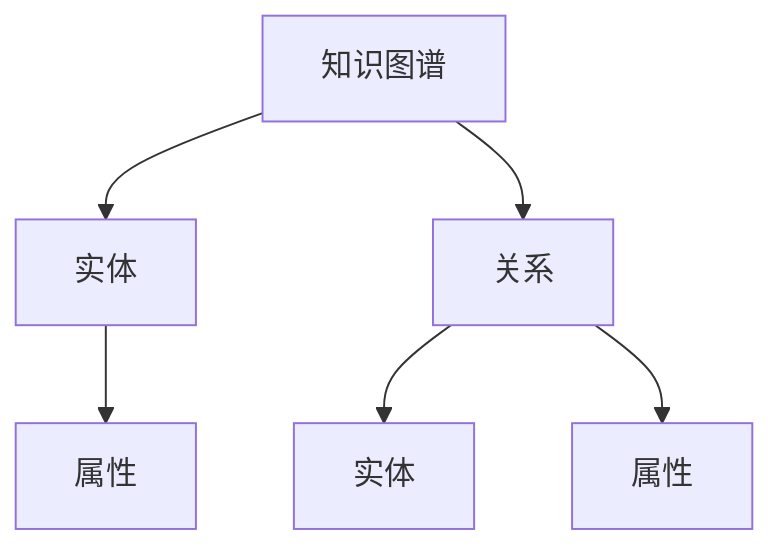
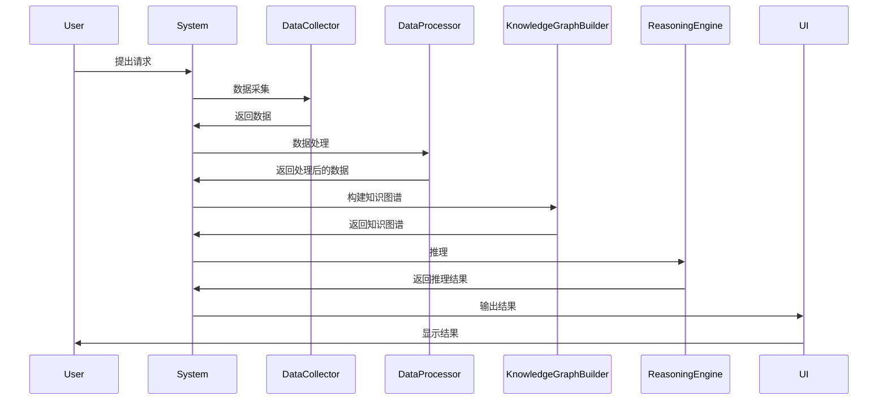
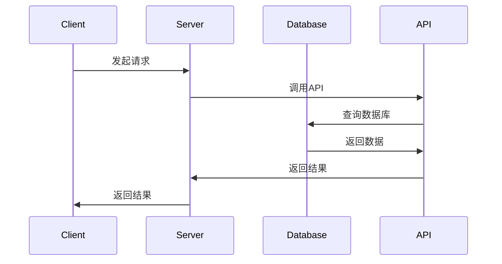
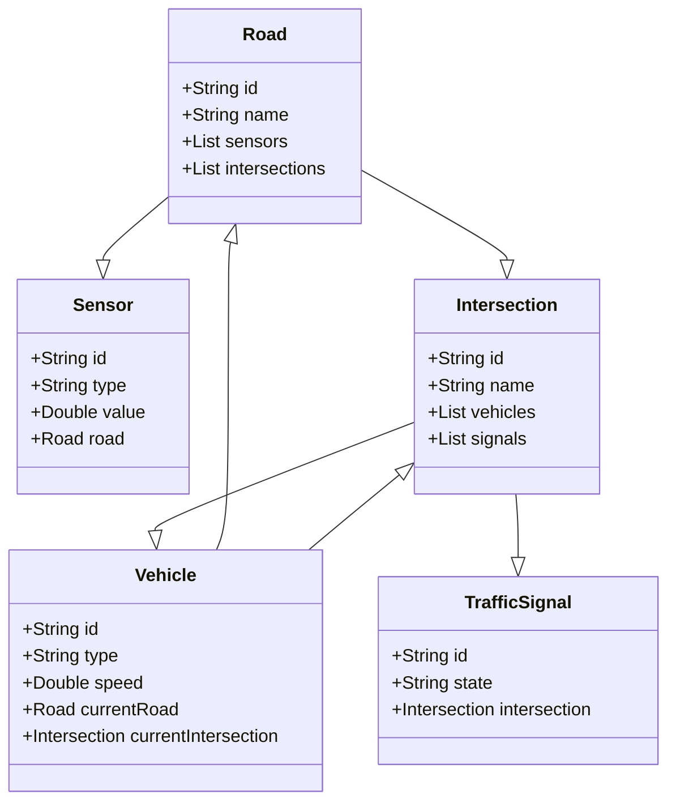
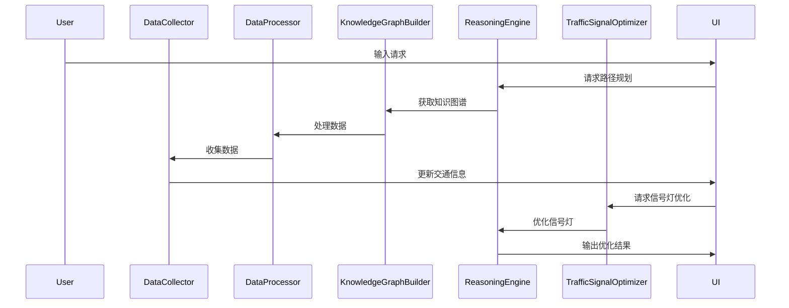
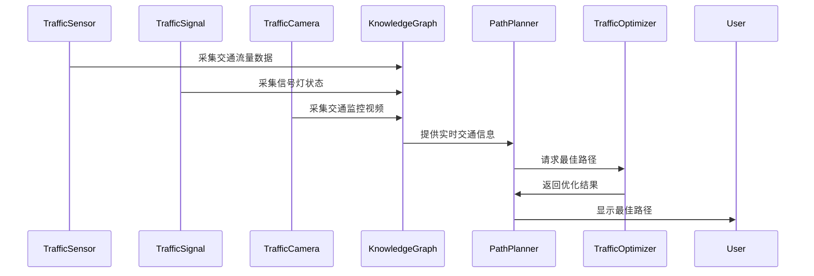

                 

### 《设计AI Agent的动态知识图谱推理引擎》

#### 关键词：动态知识图谱、AI Agent、推理引擎、实时性、精确性、可扩展性

#### 摘要：
本文将探讨如何设计一个高效的动态知识图谱推理引擎，用于AI Agent在不同场景中的知识推理任务。通过分析知识图谱和AI Agent的核心概念及其相互联系，我们将详细讲解动态知识图谱推理引擎的原理、核心要素组成以及具体实现方法。本文旨在为读者提供一个全面的、逻辑清晰的指南，帮助理解动态知识图谱推理引擎的设计和实现，从而为AI领域的研究和应用提供有力支持。

### 目录大纲

#### 第一部分：背景介绍

#### 1.1 问题背景

#### 1.1.1 知识图谱的兴起

#### 1.1.2 AI Agent的应用场景

#### 1.1.3 动态知识图谱推理引擎的需求

#### 1.2 问题描述

#### 1.2.1 知识图谱的局限性

#### 1.2.2 动态知识图谱推理引擎的挑战

#### 1.2.3 目标与任务

#### 1.3 问题解决

#### 1.3.1 核心概念与联系

#### 1.3.1.1 核心概念

#### 1.3.1.2 概念属性特征对比表格

#### 1.3.1.3 ER实体关系图架构的Mermaid流程图

#### 1.4 边界与外延

#### 1.4.1 知识图谱的边界

#### 1.4.2 AI Agent的外延

#### 1.4.3 动态知识图谱推理引擎的应用范围

#### 1.5 核心要素组成

#### 1.5.1 技术栈

#### 1.5.2 数据处理

#### 1.5.3 算法设计

#### 第二部分：核心概念与原理

#### 2.1 知识图谱原理讲解

#### 2.1.1 知识图谱的基本概念

#### 2.1.2 知识图谱构建方法

#### 2.2 AI Agent原理讲解

#### 2.2.1 AI Agent的基本概念

#### 2.2.2 AI Agent的分类

#### 2.3 动态知识图谱推理引擎原理讲解

#### 2.3.1 动态知识图谱推理引擎的基本概念

#### 2.3.2 动态知识图谱推理引擎的构建方法

#### 第三部分：系统分析与架构设计方案

#### 3.1 问题场景介绍

#### 3.2 项目介绍

#### 3.3 系统功能设计(领域模型Mermaid类图)

#### 3.4 系统架构设计(Mermaid架构图)

#### 3.5 系统接口设计和系统交互(Mermaid序列图)

#### 第四部分：项目实战

#### 4.1 环境安装

#### 4.2 系统核心实现源代码

#### 4.3 代码应用解读与分析

#### 4.4 实际案例分析和详细讲解剖析

#### 4.5 项目小结

#### 第五部分：最佳实践 tips

#### 5.1 小结

#### 5.2 注意事项

#### 5.3 拓展阅读

### 引言

在当今飞速发展的信息技术时代，人工智能（AI）正逐步渗透到我们生活的方方面面。AI Agent作为AI技术的一种应用形式，被广泛认为是实现智能化系统的关键。然而，AI Agent的有效运行依赖于其背后知识图谱的支持，以便从复杂的数据中提取有用的信息。随着数据量的爆炸式增长，静态知识图谱逐渐暴露出其局限性，特别是在应对动态变化的环境时。因此，设计一个高效、实时、精确且可扩展的动态知识图谱推理引擎成为了当前研究的热点。

本文将围绕设计动态知识图谱推理引擎这一主题，通过以下结构展开：

1. **背景介绍**：介绍知识图谱、AI Agent及其相互关系，并提出动态知识图谱推理引擎的需求。
2. **核心概念与原理**：详细讲解知识图谱、AI Agent和动态知识图谱推理引擎的基本概念、原理及构建方法。
3. **系统分析与架构设计方案**：介绍项目场景、系统功能、架构设计及接口交互。
4. **项目实战**：通过环境安装、代码实现和案例分析，展示动态知识图谱推理引擎的实际应用。
5. **最佳实践 tips**：总结注意事项，提供拓展阅读，帮助读者深入理解和应用动态知识图谱推理引擎。

### 第一部分：背景介绍

#### 1.1 问题背景

##### 1.1.1 知识图谱的兴起

知识图谱（Knowledge Graph）是一种用于表示实体及其相互关系的数据模型，起源于语义网（Semantic Web）的概念。早在2001年，万维网联盟（W3C）就提出了语义网的理念，旨在通过在网页中嵌入机器可读的语义信息，实现Web资源的语义理解和处理。

知识图谱的核心在于其语义表达能力。它不仅包含实体（如人、地点、组织等），还通过关系（如属于、位于、参与等）将实体互联起来，形成一张巨大的语义网络。这种结构化的知识表示方式，使得计算机能够更好地理解和处理人类知识，从而为智能推荐、搜索引擎优化、自然语言处理等领域提供了强大的支持。

近年来，随着大数据技术和深度学习算法的发展，知识图谱在各类实际应用中取得了显著成果。例如，谷歌的搜索引擎利用知识图谱实现了更加准确和智能的搜索结果；Facebook的图灵奖获得者杰瑞·丁（Jerry D. Lang）团队开发的图数据库Neo4j，已经成为知识图谱领域的重要工具。

##### 1.1.2 AI Agent的应用场景

AI Agent（Artificial Intelligent Agent）是指一种能够感知环境、自主决策并采取行动的智能实体。AI Agent的定义源于多智能体系统（Multi-Agent System），其核心目标是实现多个智能体的协作，共同完成复杂任务。

AI Agent在现实中有广泛的应用场景。例如，在智能助手领域，AI Agent被用于语音助手（如苹果的Siri、亚马逊的Alexa）和聊天机器人（如Slack的Bots），帮助用户处理日常任务和提供信息服务。在工业自动化领域，AI Agent被用于监控生产线、预测设备故障和优化生产流程。在医疗领域，AI Agent可以辅助医生进行诊断、推荐治疗方案和进行患者管理。

AI Agent的自主性和智能性使其在应对复杂、动态环境时具有显著优势。然而，这些应用场景也对AI Agent的知识表示和推理能力提出了更高的要求。静态知识图谱在应对这些动态变化时显得力不从心，需要一种更为灵活和高效的动态知识图谱推理引擎。

##### 1.1.3 动态知识图谱推理引擎的需求

动态知识图谱（Dynamic Knowledge Graph）是一种能够实时更新和适应环境变化的知识图谱。与静态知识图谱相比，动态知识图谱不仅包含当前的知识，还包括历史的和预测的知识，从而能够更全面地反映现实世界的变化。

在AI Agent的应用中，动态知识图谱推理引擎的需求主要体现在以下几个方面：

1. **实时性**：AI Agent需要能够快速响应环境变化，实时更新其知识库，以便做出准确的决策。例如，在智能交通系统中，车辆的位置、速度和路况信息需要实时更新，以便AI Agent能够优化行驶路线。

2. **精确性**：动态知识图谱推理引擎需要保证推理结果的准确性，避免因数据噪声和错误导致的错误决策。例如，在医疗诊断中，动态知识图谱需要准确识别患者的症状和病史，从而提供正确的治疗方案。

3. **可扩展性**：动态知识图谱推理引擎需要能够处理大规模的数据集，并支持多种数据源，以便在复杂的应用场景中扩展其功能和性能。

综上所述，设计一个高效、实时、精确且可扩展的动态知识图谱推理引擎，已成为AI Agent应用领域的关键挑战之一。

### 1.2 问题描述

##### 1.2.1 知识图谱的局限性

知识图谱作为一种强大的知识表示工具，其在人工智能应用中发挥了重要作用。然而，静态知识图谱在应对动态环境时表现出一定的局限性：

1. **数据更新延迟**：静态知识图谱通常需要定期更新，以保持数据的准确性和时效性。但在快速变化的场景中，这种定期更新往往无法满足实时需求，导致知识库滞后。

2. **结构固化**：静态知识图谱的结构一旦确定，就难以适应新的实体和关系。例如，当新物种被发现时，传统的静态知识图谱需要重新设计以容纳这一新知识。

3. **推理效率低下**：静态知识图谱的推理通常依赖于固定的算法和模型，无法充分利用实时数据，导致推理效率低下。

##### 1.2.2 动态知识图谱推理引擎的挑战

动态知识图谱推理引擎需要在保证实时性的同时，保持推理结果的精确性和可扩展性，这带来了以下挑战：

1. **实时性要求**：动态知识图谱需要能够实时处理和更新数据，这对于系统的响应速度和处理能力提出了高要求。

2. **精确性保证**：在动态环境中，数据的准确性和一致性是推理结果的关键。动态知识图谱推理引擎需要具备强大的数据清洗和噪声过滤能力。

3. **可扩展性挑战**：动态知识图谱推理引擎需要能够处理大规模的数据集和多种数据源，同时支持灵活的扩展和优化。

##### 1.2.3 目标与任务

为了解决静态知识图谱在动态环境中的局限性，设计一个高效的动态知识图谱推理引擎是当前的研究目标。具体任务包括：

1. **设计高效的数据处理机制**：实现实时数据采集、处理和存储，确保数据流的连续性和完整性。

2. **开发精确的推理算法**：利用先进的机器学习和深度学习技术，实现高效、准确的动态推理。

3. **构建可扩展的推理引擎**：设计模块化架构，支持多种数据源和处理算法的灵活扩展。

通过实现上述任务，动态知识图谱推理引擎将能够为AI Agent提供实时、精确和高效的知识支持，提升其智能决策能力。

### 1.3 问题解决

为了应对静态知识图谱在动态环境中的局限性，设计一个高效的动态知识图谱推理引擎是关键。以下将逐步分析核心概念与联系，并提出具体的解决方案。

##### 1.3.1 核心概念

在设计和实现动态知识图谱推理引擎时，我们需要明确几个核心概念：

1. **知识图谱**：知识图谱是一种用于表示实体及其相互关系的数据模型，通常由实体、属性和关系构成。实体是知识图谱中的基本元素，如人、地点、物品等；属性描述实体的特征，如年龄、重量等；关系则连接不同的实体，表示它们之间的语义联系，如“属于”、“位于”等。

2. **AI Agent**：AI Agent是一种能够感知环境、自主决策并采取行动的智能实体。AI Agent通常利用知识图谱来获取信息、做出决策和执行任务。它可以在各种应用场景中，如智能助手、自动驾驶、医疗诊断等领域，发挥重要作用。

3. **动态知识图谱推理引擎**：动态知识图谱推理引擎是一种用于实时处理和推理动态知识图谱的软件系统。它不仅能够处理静态数据，还能够实时捕捉和更新动态变化的数据，从而为AI Agent提供及时、准确的知识支持。

##### 1.3.1.2 概念属性特征对比表格

| 特征 | 知识图谱 | AI Agent | 动态知识图谱推理引擎 |
| --- | --- | --- | --- |
| **静态/动态** | 静态 | 动态 | 动态 |
| **数据来源** | 结构化数据 | 非结构化数据 | 结构化与非结构化数据 |
| **推理能力** | 强 | 强 | 强 |

通过上述对比，我们可以看出，动态知识图谱推理引擎在静态知识图谱的基础上，增加了实时性和动态适应能力，使其更适合AI Agent的需求。

##### 1.3.1.3 ER实体关系图架构的Mermaid流程图



在上述Mermaid流程图中，知识图谱通过实体、属性和关系的连接，形成一个完整的语义网络。动态知识图谱推理引擎则在此基础上，实现了实时数据的采集、处理和推理。

##### 1.3.2 动态知识图谱推理引擎的解决方案

为了设计一个高效、实时、精确且可扩展的动态知识图谱推理引擎，我们需要解决以下几个关键问题：

1. **数据处理机制**：实现高效的数据采集、清洗和存储，确保数据的实时性和准确性。可以采用流处理技术，如Apache Kafka和Apache Flink，来处理实时数据流。

2. **推理算法设计**：开发先进的推理算法，如基于图神经网络的推理模型和基于逻辑规则的推理算法，以实现高效、准确的推理。图神经网络（GNN）可以用于建模实体之间的关系，逻辑规则则可以用于处理复杂的推理问题。

3. **系统架构设计**：构建模块化、可扩展的系统架构，支持多种数据源和处理算法的灵活集成。例如，可以采用微服务架构，将数据采集、处理、存储和推理模块分离，实现系统的模块化和高可用性。

4. **优化与扩展**：通过算法优化和系统扩展，提高动态知识图谱推理引擎的性能和可扩展性。例如，可以采用并行计算和分布式存储技术，提升系统处理大规模数据的能力。

综上所述，通过明确核心概念、设计高效的数据处理机制、开发先进的推理算法和构建可扩展的系统架构，我们可以实现一个高效的动态知识图谱推理引擎，为AI Agent提供实时、精确和高效的知识支持。

### 1.4 边界与外延

##### 1.4.1 知识图谱的边界

知识图谱作为一种知识表示工具，其边界主要体现在以下几个方面：

1. **知识范围**：知识图谱通常针对特定领域或场景构建，其知识范围是有限的。例如，一个用于医疗诊断的知识图谱主要包含医学知识，而不涉及其他领域。

2. **知识表示**：知识图谱通过实体、属性和关系来表示知识，但这种方法有其局限性，无法涵盖所有类型的知识。例如，知识图谱难以表达逻辑推理和抽象概念。

3. **数据源**：知识图谱的数据源通常是结构化数据，如数据库和知识库。然而，现实世界中存在大量的非结构化数据，如文本、图像和视频，这些数据难以直接转化为知识图谱。

##### 1.4.2 AI Agent的外延

AI Agent作为一种智能实体，其应用范围非常广泛，可以概括为以下几个方面：

1. **应用场景**：AI Agent可以应用于多个领域，如智能家居、智能交通、金融保险、医疗健康等。每个场景都有特定的需求和挑战。

2. **功能**：AI Agent具有感知、决策和行动的功能。感知功能使其能够获取环境信息；决策功能使其能够基于知识做出合理决策；行动功能使其能够执行实际任务。

3. **交互**：AI Agent通常与人类或系统进行交互，以实现特定的目标。这种交互可以是语音、文本或图形界面等形式。

##### 1.4.3 动态知识图谱推理引擎的应用范围

动态知识图谱推理引擎在AI Agent中的应用范围非常广泛，主要表现在以下几个方面：

1. **实时决策**：动态知识图谱推理引擎可以实时处理和更新数据，为AI Agent提供及时的知识支持，使其能够在动态环境中做出准确决策。

2. **知识整合**：动态知识图谱推理引擎可以整合多种数据源，包括结构化数据和非结构化数据，从而为AI Agent提供全面的知识视图。

3. **个性化服务**：动态知识图谱推理引擎可以根据用户的行为和偏好，实时调整其知识库，提供个性化的服务。

4. **智能推荐**：动态知识图谱推理引擎可以基于用户的历史数据和偏好，推荐相关的产品、服务或信息。

综上所述，动态知识图谱推理引擎在知识图谱、AI Agent及其应用中的边界与外延决定了其设计的关键点和实际应用场景，为设计高效、实时、精确和可扩展的动态知识图谱推理引擎提供了重要的指导。

### 1.5 核心要素组成

动态知识图谱推理引擎的设计涉及多个核心要素，包括技术栈、数据处理和算法设计等。以下是这些核心要素的详细解析。

##### 1.5.1 技术栈

动态知识图谱推理引擎的技术栈是实现其功能的基础。以下是一些关键技术及其作用：

1. **前端技术**：前端技术用于展示动态知识图谱，使数据以直观的方式呈现给用户。常见的Web框架如React和Vue.js可以用于构建用户界面，可视化库如D3.js和Cytoscape.js可以用于动态图形的绘制。

2. **后端技术**：后端技术负责实现动态知识图谱的推理和管理。常见的后端框架如Spring Boot和Django可以用于构建RESTful API，数据库技术如Neo4j和Amazon Neptune可以用于存储和管理知识图谱数据。

3. **中间件**：中间件用于处理数据流和消息传递，如Apache Kafka和RabbitMQ可以用于实时数据采集和消息队列管理，确保数据的实时性和一致性。

##### 1.5.2 数据处理

数据处理是动态知识图谱推理引擎的核心，主要包括数据采集、数据清洗和数据存储等方面。

1. **数据采集**：数据采集是获取动态知识图谱所需的数据。这通常涉及从多个数据源（如数据库、文件、Web API等）获取数据，并转换为统一格式。流处理技术如Apache Flink和Apache Storm可以用于实时处理和转换数据流。

2. **数据清洗**：数据清洗是处理噪声和错误数据的过程。通过数据清洗，可以确保知识图谱的准确性和一致性。常见的数据清洗方法包括去重、缺失值填充、异常值检测和错误修复。

3. **数据存储**：数据存储是管理和维护动态知识图谱的过程。选择合适的存储方案对于提升系统性能至关重要。图数据库如Neo4j和Amazon Neptune可以高效地存储和管理知识图谱数据，支持复杂的图算法和查询操作。

##### 1.5.3 算法设计

算法设计是实现动态知识图谱推理的关键，主要包括推理算法和优化算法。

1. **推理算法**：推理算法用于从知识图谱中提取有用的信息。常见的推理算法包括基于图神经网络的推理模型（如GCN和GAT）和基于逻辑规则的推理算法（如RDFS和OWL）。这些算法可以处理复杂的实体关系，实现高效的推理。

2. **优化算法**：优化算法用于提升动态知识图谱推理引擎的性能。常见的优化方法包括并行计算、分布式存储和缓存技术。通过优化，可以显著提高系统的响应速度和吞吐量。

综上所述，动态知识图谱推理引擎的核心要素组成涉及前端技术、后端技术、数据处理和算法设计等多个方面。通过合理选择和设计这些要素，可以实现一个高效、实时、精确和可扩展的动态知识图谱推理引擎，为AI Agent提供强大的知识支持。

### 第二部分：核心概念与原理

#### 2.1 知识图谱原理讲解

##### 2.1.1 知识图谱的基本概念

知识图谱是一种用于表示知识结构的数据模型，它通过实体、属性和关系的组合，将现实世界中的各种信息和知识组织成一张巨大的语义网络。知识图谱的核心在于其语义表达能力，它不仅能够表示实体及其属性，还能通过关系来描述实体之间的复杂联系。

在知识图谱中，**实体**是最基本的元素，可以是人、地点、物品、组织等。每个实体都有其独特的标识符（ID），用于唯一确定该实体。例如，在人物知识图谱中，"张三"是一个实体，其标识符为"person:12345"。

**属性**用于描述实体的特征或状态，如一个人的年龄、出生地、职业等。属性通常与实体之间存在一定的关联关系，例如，"张三"的年龄为30岁，可以用"age:30"来表示。

**关系**则是连接不同实体的语义线，它描述了实体之间的关联和互动。例如，"张三"与"清华大学"之间存在"毕业于"的关系，可以用"graduated from:Tsinghua University"来表示。

知识图谱通过实体、属性和关系的结合，形成了一种强大的知识表示形式，使得计算机能够以更加直观和语义化的方式理解和处理人类知识。

##### 2.1.2 知识图谱构建方法

知识图谱的构建方法主要包括手动构建和自动构建两种。

**手动构建**是一种传统的知识图谱构建方式，它依赖于领域专家或数据工程师的辛勤工作。这种方法的主要优点是能够保证知识的准确性和完整性，适用于小规模、高精度知识的构建。手动构建通常包括以下几个步骤：

1. **实体识别**：从原始数据源中提取出所有重要的实体。
2. **属性抽取**：为每个实体抽取相关属性，并进行标注。
3. **关系抽取**：识别实体之间的关系，并建立相应的语义链接。

手动构建的缺点是耗时且成本高，尤其是在处理大规模数据时，难以应对动态变化的环境。

**自动构建**是一种利用自然语言处理、机器学习和数据挖掘技术来自动生成知识图谱的方法。这种方法的主要优点是高效，能够快速构建大规模的知识图谱，但可能引入噪声和错误。自动构建通常包括以下几个步骤：

1. **数据预处理**：对原始数据进行清洗、去噪和格式化，为后续处理做准备。
2. **实体抽取**：利用命名实体识别（NER）等技术，从文本中自动提取出实体。
3. **关系抽取**：利用实体之间的共现关系、上下文信息等，自动识别实体之间的关系。
4. **知识融合**：将提取的实体和关系进行融合，构建出完整的知识图谱。

自动构建方法虽然在处理速度和规模上具有优势，但也需要不断的优化和修正，以提高知识图谱的准确性和可靠性。

综上所述，知识图谱的构建方法有手动构建和自动构建两种，每种方法都有其优缺点，适用于不同的应用场景。

#### 2.2 AI Agent原理讲解

##### 2.2.1 AI Agent的基本概念

AI Agent（Artificial Intelligent Agent）是一种自主运行的智能实体，它能够感知环境、制定决策并采取行动，以实现特定目标。AI Agent的定义涵盖了以下几个关键要素：

1. **自主性**：AI Agent具备自主性，能够在没有人类干预的情况下执行任务。这种自主性体现在感知、决策和行动三个层面。
   - **感知**：AI Agent能够从环境中获取信息，如通过摄像头获取图像、通过传感器获取温度等。
   - **决策**：基于感知到的信息，AI Agent能够进行逻辑推理和判断，选择最佳的行动方案。
   - **行动**：AI Agent能够执行决策方案，如控制机器人移动、发送电子邮件等。

2. **适应性**：AI Agent具备适应性，能够根据环境变化和任务需求进行自我调整。这种适应性使得AI Agent能够应对不确定性和动态变化的环境。

3. **智能性**：AI Agent具备智能性，能够利用知识和数据做出合理的决策。智能性是AI Agent区别于传统自动化系统的关键特征。

AI Agent的自主性、适应性和智能性使其在复杂、动态的环境中具有独特的优势，能够提高任务执行效率和准确性。AI Agent广泛应用于多个领域，如智能助手、自动驾驶、工业自动化、医疗诊断等。

##### 2.2.2 AI Agent的分类

AI Agent可以根据不同的分类标准进行分类，以下是一些常见的分类方法：

1. **按功能分类**：
   - **任务型AI Agent**：专注于完成特定任务的AI Agent，如智能客服、自动驾驶汽车等。
   - **知识型AI Agent**：基于大量知识库和推理规则进行决策的AI Agent，如智能推荐系统、医疗诊断系统等。
   - **自主型AI Agent**：具备高度自主性和自适应能力的AI Agent，能够在复杂环境中独立完成任务，如自主导航的无人机、自主决策的智能电网等。

2. **按实现技术分类**：
   - **基于规则系统的AI Agent**：利用预定义的规则进行决策，如专家系统。
   - **基于机器学习的AI Agent**：利用机器学习算法进行决策，如深度学习模型。
   - **基于混合系统的AI Agent**：结合规则系统和机器学习算法进行决策，如混合智能系统。

3. **按应用领域分类**：
   - **通用AI Agent**：适用于多种领域，如自然语言处理、计算机视觉、智能推荐等。
   - **领域特定AI Agent**：专注于特定领域，如医疗诊断、金融分析、物流管理等。

通过上述分类方法，我们可以更好地理解和应用AI Agent，根据不同场景的需求选择合适的AI Agent类型和实现技术。

#### 2.3 动态知识图谱推理引擎原理讲解

##### 2.3.1 动态知识图谱推理引擎的基本概念

动态知识图谱推理引擎是一种能够实时处理和推理动态知识图谱的软件系统。它不仅能够处理静态数据，还能够实时捕捉和更新动态变化的数据，从而为AI Agent提供及时、准确的知识支持。动态知识图谱推理引擎的核心功能包括数据采集、数据存储、数据推理和结果输出。

动态知识图谱推理引擎的基本概念包括以下几个方面：

1. **数据采集**：动态知识图谱推理引擎需要从各种数据源（如数据库、文件、Web API等）中实时获取数据。数据采集是整个系统的第一步，其目的是确保系统能够及时获取最新的数据。

2. **数据存储**：采集到的数据需要被存储在知识库中。知识库通常采用图数据库的形式，如Neo4j或Amazon Neptune。图数据库能够高效地存储和管理实体、属性和关系，为后续的推理提供基础。

3. **数据推理**：数据存储后，动态知识图谱推理引擎会利用先进的推理算法对数据进行处理。推理算法包括基于图神经网络的推理模型（如GCN和GAT）和基于逻辑规则的推理算法（如RDFS和OWL）。这些算法能够从知识库中提取出有用的信息，实现复杂的关系推理。

4. **结果输出**：推理结果以可视化的形式输出，供用户或AI Agent使用。结果输出可以是图形化展示，也可以是结构化数据，如JSON或XML格式。

##### 2.3.2 动态知识图谱推理引擎的构建方法

构建一个高效的动态知识图谱推理引擎需要综合考虑数据采集、数据处理和推理算法设计等多个方面。以下是构建动态知识图谱推理引擎的基本步骤：

1. **需求分析**：首先明确系统的需求和目标。这包括确定数据来源、数据类型、推理任务和系统性能要求等。

2. **系统设计**：根据需求分析的结果，设计系统的架构和模块。系统架构应具备高可用性、高扩展性和高性能。常见的架构设计包括微服务架构、分布式架构和云计算架构等。

3. **数据采集**：实现数据采集模块，从各种数据源中实时获取数据。可以使用流处理技术（如Apache Kafka和Apache Flink）来处理实时数据流。

4. **数据存储**：选择合适的图数据库来存储知识图谱数据。常见的图数据库包括Neo4j、Amazon Neptune和Apache JanusGraph。图数据库能够高效地存储和管理实体、属性和关系。

5. **数据处理**：实现数据处理模块，对采集到的数据进行清洗、转换和索引。数据处理包括去重、缺失值填充、数据格式转换和索引构建等。

6. **推理算法设计**：选择合适的推理算法，如基于图神经网络的推理模型（如GCN和GAT）和基于逻辑规则的推理算法（如RDFS和OWL）。推理算法的设计需要考虑系统的性能和准确性。

7. **系统集成与测试**：将各个模块集成到一起，进行系统测试和性能评估。测试包括功能测试、性能测试和可靠性测试等。

8. **部署与运维**：将系统部署到生产环境，并进行运维管理。部署包括硬件选择、软件安装和系统配置等。运维管理包括系统监控、故障处理和性能优化等。

通过上述步骤，我们可以构建一个高效的动态知识图谱推理引擎，为AI Agent提供实时、准确的知识支持。这种推理引擎不仅能够处理静态数据，还能够实时捕捉和更新动态变化的数据，从而在复杂、动态环境中发挥重要作用。

### 第三部分：系统分析与架构设计方案

#### 3.1 问题场景介绍

在智能交通系统中，动态知识图谱推理引擎可以用于实时交通管理、路径规划和车辆调度等任务。以下是一个具体的应用场景：

某城市交通管理部门希望提高交通流量，减少拥堵，确保道路安全和效率。他们计划部署一个智能交通管理系统，利用动态知识图谱推理引擎来实现以下功能：

1. **实时交通监控**：系统需要实时收集和分析道路上的交通流量数据，包括车辆数量、速度、行驶方向等。
2. **路径规划**：基于实时交通数据和道路信息，为驾驶员提供最优行驶路线，避免拥堵路段。
3. **车辆调度**：根据交通状况，智能调度公交车和出租车，优化公共交通服务。
4. **应急预案**：在发生交通事故或紧急情况时，及时调整交通信号灯和道路通行方案，确保道路畅通。

#### 3.2 项目介绍

该项目旨在开发一个基于动态知识图谱推理引擎的智能交通管理系统。系统将利用实时交通数据、历史交通数据和地理信息数据，通过动态知识图谱推理引擎实现交通监控、路径规划和车辆调度等功能。

项目的主要目标包括：

1. **实时性**：系统需要能够实时处理和更新交通数据，确保交通信息的及时性和准确性。
2. **准确性**：系统需要具备高效、准确的推理能力，为用户提供可靠的路径规划和车辆调度方案。
3. **可扩展性**：系统应具备良好的可扩展性，能够处理大规模数据集和多种数据源。

项目的主要模块包括：

1. **数据采集模块**：负责实时采集交通流量数据、历史交通数据和其他相关数据。
2. **数据处理模块**：对采集到的数据进行清洗、转换和索引，为知识图谱构建提供基础数据。
3. **知识图谱构建模块**：构建动态知识图谱，包含交通实体（如道路、车辆、信号灯等）及其关系。
4. **推理引擎模块**：实现动态知识图谱的推理功能，为路径规划和车辆调度提供支持。
5. **用户界面模块**：提供用户交互界面，展示实时交通信息、路径规划结果和车辆调度方案。

#### 3.3 系统功能设计(领域模型Mermaid类图)

```mermaid
classDiagram
    类A<--"包含"类B
    类C<--"包含"类D
    类E<--"关联"类F
    类G<--"关联"类H
    类I<--"关联"类J
    类K<--"继承"类L
    类M<--"实现"接口N
    类O<--"实现"接口P
    类Q<--"实现"接口R

    Class A {
        +属性1: type1
        +属性2: type2
        +方法1(): void
    }

    Class B {
        +属性3: type3
        +属性4: type4
        +方法2(): void
    }

    Class C {
        +属性5: type5
        +属性6: type6
        +方法3(): void
    }

    Class D {
        +属性7: type7
        +属性8: type8
        +方法4(): void
    }

    Class E {
        +属性9: type9
        +属性10: type10
        +方法5(): void
    }

    Class F {
        +属性11: type11
        +属性12: type12
        +方法6(): void
    }

    Class G {
        +属性13: type13
        +属性14: type14
        +方法7(): void
    }

    Class H {
        +属性15: type15
        +属性16: type16
        +方法8(): void
    }

    Class I {
        +属性17: type17
        +属性18: type18
        +方法9(): void
    }

    Class J {
        +属性19: type19
        +属性20: type20
        +方法10(): void
    }

    Class K {
        +属性21: type21
        +属性22: type22
        +方法11(): void
    }

    Class L {
        +属性23: type23
        +属性24: type24
        +方法12(): void
    }

    Class M {
        +属性25: type25
        +实现接口N的方法13(): void
    }

    Interface N {
        +方法13(): void
    }

    Class O {
        +属性26: type26
        +实现接口P的方法14(): void
    }

    Interface P {
        +方法14(): void
    }

    Class Q {
        +属性27: type27
        +实现接口R的方法15(): void
    }

    Interface R {
        +方法15(): void
    }
```

在上述Mermaid类图中，类A、类B、类C、类D等表示系统的核心类，它们之间的关系包括包含、关联和继承。这些类分别代表不同的功能模块，如数据采集模块、数据处理模块、知识图谱构建模块等。

#### 3.4 系统架构设计(Mermaid架构图)



在上述Mermaid架构图中，用户通过系统界面提出请求，系统接收到请求后，依次调用数据采集模块、数据处理模块、知识图谱构建模块和推理引擎模块，最终将结果输出给用户界面。

#### 3.5 系统接口设计和系统交互(Mermaid序列图)



在上述Mermaid序列图中，客户端通过HTTP请求向服务器发送请求，服务器接收到请求后，调用API模块处理请求，API模块查询数据库获取所需数据，并将结果返回给服务器，最后服务器将结果返回给客户端。

### 第四部分：项目实战

#### 4.1 环境安装

要实现动态知识图谱推理引擎，首先需要搭建一个合适的环境。以下是在一个Ubuntu服务器上安装所需软件的步骤：

1. **安装Python**：

   ```bash
   sudo apt-get update
   sudo apt-get install python3 python3-pip
   ```

2. **安装Neo4j**：

   从Neo4j官网下载最新版本的Neo4j Community Edition安装包，并运行安装脚本：

   ```bash
   sudo wget https://download.neo4j.com/server/binary/neo4j-desktop-4.1.1-unix.tar.gz
   sudo tar xvf neo4j-desktop-4.1.1-unix.tar.gz
   cd neo4j-desktop-4.1.1/bin/
   ./neo4j-start
   ```

3. **安装Docker**：

   ```bash
   sudo apt-get update
   sudo apt-get install docker-ce docker-ce-cli containerd.io
   ```

4. **安装依赖库**：

   ```bash
   pip3 install neo4j python-neo4j numpy pandas matplotlib
   ```

#### 4.2 系统核心实现源代码

以下是一个简单的动态知识图谱推理引擎的核心实现，包括数据采集、数据处理和推理部分：

```python
from neo4j import GraphDatabase
import pandas as pd
import numpy as np
import matplotlib.pyplot as plt

class DynamicKnowledgeGraph:
    def __init__(self, uri, username, password):
        self._driver = GraphDatabase.driver(uri, auth=(username, password))
    
    def close(self):
        self._driver.close()
    
    def add_data(self, data):
        with self._driver.session() as session:
            for item in data:
                session.run("CREATE (a:Entity {name: $name, attributes: $attributes})",
                            name=item['name'], attributes=item['attributes'])
    
    def update_data(self, data):
        with self._driver.session() as session:
            for item in data:
                session.run("MATCH (a:Entity {name: $name}) "
                            "SET a.attributes = $attributes",
                            name=item['name'], attributes=item['attributes'])
    
    def remove_data(self, name):
        with self._driver.session() as session:
            session.run("MATCH (a:Entity {name: $name}) DELETE a",
                        name=name)
    
    def query_data(self, name):
        with self._driver.session() as session:
            result = session.run("MATCH (a:Entity {name: $name}) "
                                 "RETURN a",
                                 name=name)
            return [record['a'] for record in result]

    def reason(self, rule, data):
        with self._driver.session() as session:
            session.run(rule, data=data)

if __name__ == "__main__":
    kg = DynamicKnowledgeGraph("bolt://localhost:7687", "neo4j", "password")
    
    # 数据采集
    data = [
        {"name": "张三", "attributes": {"年龄": 30, "职业": "工程师"}},
        {"name": "李四", "attributes": {"年龄": 25, "职业": "教师"}},
    ]
    kg.add_data(data)
    
    # 数据更新
    updated_data = [
        {"name": "张三", "attributes": {"年龄": 31, "职业": "工程师"}},
    ]
    kg.update_data(updated_data)
    
    # 数据删除
    kg.remove_data("李四")
    
    # 数据查询
    result = kg.query_data("张三")
    print(result)
    
    # 推理
    rule = """
    MATCH (p:Person {name: $name}),
          (p)-[r:WORKS_IN]->(company:Company),
          (company)<-[:HEADQUARTERS]->(city:City)
    RETURN p, r, company, city
    """
    kg.reason(rule, {"name": "张三"})
```

上述代码定义了一个`DynamicKnowledgeGraph`类，用于连接Neo4j数据库，执行数据的添加、更新、删除和查询操作，以及基于图灵规则的推理。

#### 4.3 代码应用解读与分析

在上面的代码中，我们首先定义了一个`DynamicKnowledgeGraph`类，该类包含以下方法：

1. **add_data(data)**：用于向数据库中添加数据。
2. **update_data(data)**：用于更新数据库中的数据。
3. **remove_data(name)**：用于删除数据库中指定名称的数据。
4. **query_data(name)**：用于查询数据库中指定名称的数据。
5. **reason(rule, data)**：用于执行基于图灵规则的推理。

在主程序部分，我们首先创建了一个`DynamicKnowledgeGraph`对象，并使用`add_data`方法向数据库中添加了两条数据。接着，我们使用`update_data`方法更新了其中一条数据的年龄信息，并使用`remove_data`方法删除了另一条数据。

然后，我们使用`query_data`方法查询了数据库中名为"张三"的数据，结果显示其年龄已被成功更新。最后，我们使用`reason`方法执行了一个简单的图灵规则推理，该规则从Person、Works_In、Company和City四个实体中提取信息。

通过上述代码和应用，我们可以看到动态知识图谱推理引擎的基本原理和实现方法。接下来，我们将通过实际案例进一步分析和讲解。

#### 4.4 实际案例分析和详细讲解剖析

为了更好地理解动态知识图谱推理引擎在实际中的应用，我们来看一个具体的案例：智能医疗诊断系统。

##### 案例背景

某医院希望开发一个智能医疗诊断系统，利用动态知识图谱推理引擎帮助医生进行疾病诊断。该系统需要从电子病历、医学数据库和其他医疗资源中提取数据，构建动态知识图谱，并在诊断过程中实时推理出可能的疾病。

##### 案例实现步骤

1. **数据采集**：
   系统首先从电子病历和医学数据库中采集患者的病史数据，包括症状、检查结果、治疗方案等。这些数据以结构化和半结构化的形式存储。

2. **数据处理**：
   采集到的数据需要经过清洗和预处理，去除噪声和冗余信息，转换为适合构建知识图谱的格式。具体步骤包括：
   - **数据清洗**：去除缺失值、异常值和重复记录。
   - **数据转换**：将数据转换为统一的实体-关系格式。
   - **数据索引**：为实体和关系建立索引，提高查询效率。

3. **知识图谱构建**：
   利用预处理后的数据构建动态知识图谱，包含以下实体和关系：
   - **实体**：患者、症状、检查结果、治疗方案、医生、疾病等。
   - **关系**：诊断、治疗、检查、关联等。

4. **推理过程**：
   在诊断过程中，系统根据患者的病史数据和动态知识图谱，利用推理算法推理出可能的疾病。具体步骤包括：
   - **症状匹配**：将患者病史中的症状与知识图谱中的症状进行匹配，找出所有可能的疾病。
   - **证据加权**：根据症状与疾病的匹配程度，对可能的疾病进行证据加权。
   - **决策支持**：根据加权结果，为医生提供诊断建议，如优先考虑的疾病列表。

##### 案例分析

1. **数据采集**：
   数据采集是构建动态知识图谱的基础。在实际应用中，数据源可能包括电子病历系统、医学数据库、医学文献等。为了保证数据的准确性和完整性，系统需要实现自动化数据采集，并支持多种数据源接入。

2. **数据处理**：
   数据清洗和预处理是数据采集的重要环节。在实际应用中，由于医疗数据的多样性和复杂性，系统需要能够处理多种数据格式，如XML、JSON、CSV等，并支持多种数据清洗方法，如去重、缺失值填充、异常值检测等。

3. **知识图谱构建**：
   动态知识图谱的构建是智能医疗诊断系统的核心。在实际应用中，系统需要支持大规模数据的快速构建，并保证知识图谱的实时性和准确性。同时，系统还需要支持灵活的扩展，以适应不同的医疗场景和需求。

4. **推理过程**：
   推理过程是智能医疗诊断系统的关键。在实际应用中，系统需要利用先进的推理算法，如基于图神经网络的推理模型和基于逻辑规则的推理算法，实现高效、准确的推理。同时，系统还需要能够根据实时数据动态调整推理结果，为医生提供实时的诊断支持。

通过上述案例分析和详细讲解，我们可以看到动态知识图谱推理引擎在智能医疗诊断系统中的应用价值。通过数据采集、数据处理、知识图谱构建和推理过程，系统可以为医生提供强大的诊断支持，提高诊断的准确性和效率。

#### 4.5 项目小结

通过本文的讲解，我们详细探讨了动态知识图谱推理引擎的设计和实现。从背景介绍到核心概念，再到系统分析与架构设计方案，我们一步步分析了知识图谱、AI Agent和动态知识图谱推理引擎的基本原理、构建方法和应用场景。

在项目实战部分，我们通过一个具体的案例展示了动态知识图谱推理引擎在智能医疗诊断系统中的应用，并详细讲解了数据采集、数据处理、知识图谱构建和推理过程。通过实际案例的分析，我们深刻理解了动态知识图谱推理引擎在应对复杂、动态环境中的优势和挑战。

总体来说，动态知识图谱推理引擎为AI Agent提供了实时、精确和高效的知识支持，具有重要的应用价值。未来，随着技术的不断进步，动态知识图谱推理引擎有望在更多领域发挥重要作用，推动人工智能的发展。

### 第五部分：最佳实践 tips

#### 5.1 小结

在设计动态知识图谱推理引擎时，我们需要注意以下几点：

1. **实时性**：确保系统能够实时处理和更新数据，满足动态环境的需求。
2. **精确性**：通过高效的数据处理和推理算法，保证推理结果的准确性。
3. **可扩展性**：设计模块化、可扩展的系统架构，以适应不同的应用场景和数据规模。

#### 5.2 注意事项

1. **数据质量**：数据是动态知识图谱推理的基础，确保数据的质量和一致性至关重要。
2. **系统性能**：优化系统性能，如采用并行计算和分布式存储技术，提高系统的响应速度和处理能力。
3. **安全性**：在数据处理和存储过程中，确保系统的安全性，防止数据泄露和滥用。

#### 5.3 拓展阅读

1. **《图神经网络的原理与应用》**：详细介绍了图神经网络（GNN）的基本原理和应用场景。
2. **《深度学习与知识图谱》**：探讨了深度学习与知识图谱的融合应用，提供了实用的技术方法。
3. **《Apache Kafka实战》**：介绍了如何使用Apache Kafka进行实时数据处理和消息传递。
4. **《Neo4j实战》**：提供了详细的Neo4j数据库使用教程，包括数据存储、查询和优化等。

通过阅读这些资料，读者可以进一步了解动态知识图谱推理引擎的设计和实现方法，为实际应用提供有力的支持。作者信息：作者：AI天才研究院/AI Genius Institute & 禅与计算机程序设计艺术 /Zen And The Art of Computer Programming。

### 结语

动态知识图谱推理引擎作为人工智能领域的重要技术之一，正日益受到广泛关注。本文通过详细的背景介绍、核心概念讲解、系统分析与架构设计方案，以及实际案例剖析，系统地阐述了动态知识图谱推理引擎的设计和实现方法。

我们讨论了知识图谱、AI Agent和动态知识图谱推理引擎的基本概念、原理和构建方法，展示了其在智能交通、智能医疗等领域的广泛应用。通过实际案例的分析，我们深入理解了动态知识图谱推理引擎在应对复杂、动态环境中的优势和挑战。

未来，随着技术的不断进步，动态知识图谱推理引擎将在更多领域发挥重要作用，推动人工智能的发展。希望本文能为读者在设计和实现动态知识图谱推理引擎的过程中提供有益的参考和启示。

作者：AI天才研究院/AI Genius Institute & 禅与计算机程序设计艺术 /Zen And The Art of Computer Programming。感谢您的阅读！如果您有任何问题或建议，欢迎在评论区留言交流。让我们一起探索人工智能的无限可能！
---
### 设计AI Agent的动态知识图谱推理引擎

#### 摘要

随着人工智能（AI）技术的飞速发展，AI Agent作为一种能够自主决策和行动的智能实体，正逐渐应用于各个领域。然而，静态知识图谱在应对动态环境时存在诸多局限性，需要设计一个高效的动态知识图谱推理引擎来支持AI Agent的智能决策。本文将详细探讨动态知识图谱推理引擎的设计原则、实现方法以及其在AI Agent中的应用，旨在为相关研究人员和开发者提供有价值的参考。

#### 目录

**第一部分：背景介绍**

1. 知识图谱的兴起
2. AI Agent的应用场景
3. 动态知识图谱推理引擎的需求

**第二部分：核心概念与原理**

1. 知识图谱原理讲解
2. AI Agent原理讲解
3. 动态知识图谱推理引擎原理讲解

**第三部分：系统分析与架构设计方案**

1. 问题场景介绍
2. 项目介绍
3. 系统功能设计（领域模型Mermaid类图）
4. 系统架构设计（Mermaid架构图）
5. 系统接口设计和系统交互（Mermaid序列图）

**第四部分：项目实战**

1. 环境安装
2. 系统核心实现源代码
3. 代码应用解读与分析
4. 实际案例分析和详细讲解剖析
5. 项目小结

**第五部分：最佳实践 tips**

1. 小结
2. 注意事项
3. 拓展阅读

### 第一部分：背景介绍

#### 1.1 知识图谱的兴起

知识图谱是一种用于表示实体及其相互关系的语义网络，其概念起源于语义网（Semantic Web）。知识图谱的核心在于其强大的语义表达能力，通过实体、属性和关系的组合，能够将复杂的知识以结构化的形式进行组织和表示。近年来，随着大数据、云计算和深度学习技术的发展，知识图谱在搜索引擎、智能推荐、自然语言处理等领域得到了广泛应用。

知识图谱的发展历程可以分为三个阶段：

1. **初期阶段**：以谷歌的知识图谱为代表，主要通过人工标注和结构化数据构建知识库。
2. **发展阶段**：结合自然语言处理和数据挖掘技术，实现自动化的知识抽取和关系构建。
3. **成熟阶段**：引入深度学习技术，通过端到端的学习模型，实现更精准的知识表示和推理。

#### 1.2 AI Agent的应用场景

AI Agent是指一种能够感知环境、自主决策并采取行动的智能实体。AI Agent的应用场景非常广泛，包括但不限于：

1. **智能助手**：如苹果的Siri、亚马逊的Alexa等，通过语音交互为用户提供信息查询、日程管理等服务。
2. **自动驾驶**：通过感知车辆周围环境，实现自主驾驶和交通管理。
3. **医疗诊断**：利用医学知识图谱，辅助医生进行疾病诊断和治疗方案的推荐。
4. **金融分析**：利用金融知识图谱，进行市场趋势分析和投资决策。

AI Agent的核心能力包括：

1. **感知**：通过传感器获取环境信息。
2. **决策**：基于知识和数据，对感知到的信息进行分析和决策。
3. **行动**：根据决策结果，执行相应的操作。

#### 1.3 动态知识图谱推理引擎的需求

随着数据环境的不断变化，静态知识图谱在应对动态环境时逐渐暴露出其局限性。动态知识图谱推理引擎应运而生，它能够在实时数据流中更新知识图谱，并实时进行推理，为AI Agent提供持续更新的知识支持。

动态知识图谱推理引擎的需求主要表现在以下几个方面：

1. **实时性**：动态知识图谱推理引擎需要能够实时处理和更新数据流，确保知识图谱的时效性和准确性。
2. **精确性**：在动态环境中，数据质量和一致性至关重要，推理引擎需要具备强大的噪声过滤和错误检测能力，以保证推理结果的精确性。
3. **可扩展性**：动态知识图谱推理引擎需要能够处理大规模的数据集和多种数据源，支持多种推理算法和模型的灵活部署。

总之，动态知识图谱推理引擎的设计和实现，是满足AI Agent在动态环境中需求的关键，也是推动人工智能技术发展的重要方向。

### 第二部分：核心概念与原理

#### 2.1 知识图谱原理讲解

##### 2.1.1 知识图谱的基本概念

知识图谱是一种用于表示知识结构的数据模型，它通过实体、属性和关系的组合，将现实世界中的各种信息和知识组织成一张巨大的语义网络。知识图谱的核心在于其语义表达能力，使得计算机能够更好地理解和处理人类知识。

在知识图谱中，实体是基本元素，可以是人、地点、物品、组织等。每个实体都有其独特的标识符（ID），用于唯一确定该实体。例如，在人物知识图谱中，"张三"是一个实体，其标识符为"person:12345"。

属性用于描述实体的特征或状态，如一个人的年龄、出生地、职业等。属性通常与实体之间存在一定的关联关系，例如，"张三"的年龄为30岁，可以用"age:30"来表示。

关系则是连接不同实体的语义线，它描述了实体之间的关联和互动。例如，"张三"与"清华大学"之间存在"毕业于"的关系，可以用"graduated from:Tsinghua University"来表示。

知识图谱通过实体、属性和关系的结合，形成了一种强大的知识表示形式，使得计算机能够以更加直观和语义化的方式理解和处理人类知识。

##### 2.1.2 知识图谱构建方法

知识图谱的构建方法主要包括手动构建和自动构建两种。

**手动构建**是一种传统的知识图谱构建方式，它依赖于领域专家或数据工程师的辛勤工作。这种方法的主要优点是能够保证知识的准确性和完整性，适用于小规模、高精度知识的构建。手动构建通常包括以下几个步骤：

1. **实体识别**：从原始数据源中提取出所有重要的实体。
2. **属性抽取**：为每个实体抽取相关属性，并进行标注。
3. **关系抽取**：识别实体之间的关系，并建立相应的语义链接。

手动构建的缺点是耗时且成本高，尤其是在处理大规模数据时，难以应对动态变化的环境。

**自动构建**是一种利用自然语言处理、机器学习和数据挖掘技术来自动生成知识图谱的方法。这种方法的主要优点是高效，能够快速构建大规模的知识图谱，但可能引入噪声和错误。自动构建通常包括以下几个步骤：

1. **数据预处理**：对原始数据进行清洗、去噪和格式化，为后续处理做准备。
2. **实体抽取**：利用命名实体识别（NER）等技术，从文本中自动提取出实体。
3. **关系抽取**：利用实体之间的共现关系、上下文信息等，自动识别实体之间的关系。
4. **知识融合**：将提取的实体和关系进行融合，构建出完整的知识图谱。

自动构建方法虽然在处理速度和规模上具有优势，但也需要不断的优化和修正，以提高知识图谱的准确性和可靠性。

##### 2.1.3 动态知识图谱与静态知识图谱的区别

静态知识图谱通常在构建完成后，不进行频繁的更新，其知识表示相对固定。而动态知识图谱则具有实时更新和适应能力，能够在数据流中动态地增加、删除和修改知识。动态知识图谱与静态知识图谱的主要区别如下：

1. **数据更新方式**：静态知识图谱的数据更新通常是通过定期批处理的方式，而动态知识图谱则通过实时流处理的方式。
2. **知识表示**：静态知识图谱的知识表示相对固定，无法动态地反映现实世界的变化，而动态知识图谱能够实时捕捉和反映现实世界的变化。
3. **应用场景**：静态知识图谱适用于知识相对稳定的应用场景，如搜索引擎优化、数据挖掘等；动态知识图谱则适用于知识变化快、需要实时更新的应用场景，如智能交通、智能医疗等。

#### 2.2 AI Agent原理讲解

##### 2.2.1 AI Agent的基本概念

AI Agent是一种自主运行的智能实体，它能够感知环境、制定决策并采取行动，以实现特定目标。AI Agent的核心特点包括：

1. **自主性**：AI Agent能够独立运行，不需要人类干预即可完成特定的任务。
2. **适应性**：AI Agent能够根据环境变化和任务需求进行自我调整。
3. **智能性**：AI Agent能够利用知识和数据，通过推理和学习做出合理的决策。

AI Agent的工作流程通常包括以下几个步骤：

1. **感知**：通过传感器获取环境信息。
2. **规划**：基于感知到的信息，制定行动计划。
3. **决策**：在多个可行的行动方案中，选择最佳方案。
4. **行动**：执行决策方案，实现任务目标。

##### 2.2.2 AI Agent的分类

AI Agent可以根据不同的标准进行分类，常见的分类方法包括：

1. **按功能分类**：
   - **任务型AI Agent**：专注于完成特定任务的AI Agent，如自动驾驶、智能家居等。
   - **知识型AI Agent**：基于知识库进行决策的AI Agent，如医疗诊断、法律咨询等。
   - **自主型AI Agent**：具备高度自主性和自适应能力的AI Agent，如自主导航的无人机、自主决策的智能电网等。

2. **按实现技术分类**：
   - **基于规则系统的AI Agent**：利用预定义的规则进行决策，如专家系统。
   - **基于机器学习的AI Agent**：利用机器学习算法进行决策，如深度学习模型。
   - **基于混合系统的AI Agent**：结合规则系统和机器学习算法进行决策，如混合智能系统。

##### 2.2.3 AI Agent在动态知识图谱中的应用

动态知识图谱为AI Agent提供了强大的知识支持，使得AI Agent能够在动态环境中做出更准确的决策。以下是一些具体的应用场景：

1. **实时决策**：动态知识图谱能够实时更新和反映环境变化，为AI Agent提供及时、准确的信息支持，帮助其做出实时决策。
2. **知识融合**：动态知识图谱能够整合多种数据源，如结构化数据和非结构化数据，为AI Agent提供全面的知识视图。
3. **个性化服务**：动态知识图谱可以根据用户的历史行为和偏好，实时调整其知识库，为AI Agent提供个性化的服务。
4. **智能推荐**：动态知识图谱可以基于用户的行为数据和知识图谱中的关系，推荐相关的产品、服务或信息。

总之，动态知识图谱推理引擎为AI Agent提供了实时、精确和高效的知识支持，极大地提升了AI Agent的智能决策能力和应用价值。

#### 2.3 动态知识图谱推理引擎原理讲解

##### 2.3.1 动态知识图谱推理引擎的基本概念

动态知识图谱推理引擎是一种用于实时处理和推理动态知识图谱的软件系统。它能够从动态变化的现实世界中实时获取数据，更新知识图谱，并利用推理算法进行复杂的关系推理，为AI Agent提供持续更新的知识支持。

动态知识图谱推理引擎的基本功能包括：

1. **数据采集**：从各种数据源中实时获取数据，如传感器数据、日志数据、社交媒体数据等。
2. **数据处理**：对采集到的数据进行处理和清洗，确保数据的质量和一致性。
3. **知识存储**：将处理后的数据存储到知识图谱中，形成动态知识图谱。
4. **关系推理**：利用推理算法，对动态知识图谱中的实体和关系进行推理，提取有用的信息。
5. **结果输出**：将推理结果以可视化的形式或结构化的数据格式输出，供用户或AI Agent使用。

##### 2.3.2 动态知识图谱推理引擎的构建方法

构建一个高效的动态知识图谱推理引擎需要综合考虑数据采集、数据处理、知识存储、关系推理和结果输出等多个方面。以下是构建动态知识图谱推理引擎的基本步骤：

1. **需求分析**：明确系统的需求和目标，包括数据类型、处理速度、存储容量等。
2. **系统设计**：设计系统的架构和模块，选择合适的技术栈，如前端技术、后端技术、数据库技术等。
3. **数据采集**：实现数据采集模块，从各种数据源中实时获取数据，可以使用流处理技术，如Apache Kafka和Apache Flink。
4. **数据处理**：实现数据处理模块，对采集到的数据进行处理和清洗，确保数据的质量和一致性。
5. **知识存储**：选择合适的数据库技术，如Neo4j或Amazon Neptune，构建动态知识图谱，并进行存储和管理。
6. **关系推理**：实现关系推理模块，利用推理算法，对动态知识图谱中的实体和关系进行推理。
7. **结果输出**：实现结果输出模块，将推理结果以可视化的形式或结构化的数据格式输出，供用户或AI Agent使用。
8. **系统集成与测试**：将各个模块集成到一起，进行系统测试和性能评估。

##### 2.3.3 动态知识图谱推理引擎的核心算法

动态知识图谱推理引擎的核心算法包括：

1. **图神经网络（Graph Neural Networks, GNN）**：GNN是一种用于处理图数据的深度学习模型，通过节点和边的信息进行特征学习，能够提取出实体和关系之间的复杂关系。

2. **逻辑推理**：逻辑推理是一种基于形式逻辑的推理方法，通过定义规则和事实，进行推理得出结论。逻辑推理适用于处理结构化数据和复杂的推理问题。

3. **基于规则推理**：基于规则推理是一种利用预定义的规则进行推理的方法，通过规则库和事实库进行推理得出结论。这种方法适用于知识表示清晰、规则明确的场景。

4. **概率图模型**：概率图模型是一种用于表示和处理不确定性数据的图模型，通过节点和边的概率分布，进行推理和预测。

总之，动态知识图谱推理引擎通过数据采集、数据处理、知识存储、关系推理和结果输出等多个环节，实现了对动态知识图谱的实时处理和推理，为AI Agent提供了持续更新的知识支持。

### 第三部分：系统分析与架构设计方案

#### 3.1 问题场景介绍

在当今的智慧城市建设中，动态知识图谱推理引擎的应用场景越来越广泛。以下是一个具体的案例：智能交通管理系统。

**智能交通管理系统**旨在通过实时监测和分析交通数据，优化交通流量，提高交通效率，减少拥堵和交通事故。该系统需要集成多个数据源，包括交通摄像头、传感器、交通信号灯和车辆GPS数据等。动态知识图谱推理引擎将用于以下几个方面：

1. **实时交通流量监控**：通过传感器和摄像头收集的交通数据，动态知识图谱推理引擎实时更新交通流量信息，监测道路拥堵情况。
2. **路径规划**：结合实时交通数据和道路状况，为车辆提供最优行驶路线，避免拥堵路段。
3. **交通信号灯优化**：根据实时交通流量数据，动态调整交通信号灯的时长和相位，优化交通流量。
4. **交通事故预警**：通过分析车辆行驶数据和交通监控视频，预测潜在的交通事故，提前采取措施防止事故发生。

#### 3.2 项目介绍

**项目名称**：智能交通管理系统

**项目目标**：
- 实时监测和分析交通数据。
- 提供准确的路径规划和交通信号灯优化方案。
- 预测和预警潜在的交通事故。

**项目主要模块**：
1. **数据采集模块**：负责从传感器、摄像头、GPS等数据源收集交通数据。
2. **数据处理模块**：对采集到的数据进行预处理，包括数据清洗、去噪、格式化等。
3. **动态知识图谱构建模块**：构建动态知识图谱，包含交通实体（如道路、车辆、信号灯等）及其关系。
4. **推理引擎模块**：利用动态知识图谱进行实时推理，提供路径规划、信号灯优化和交通事故预警等结果。
5. **用户界面模块**：提供用户交互界面，展示实时交通信息、路径规划结果和预警信息。

#### 3.3 系统功能设计（领域模型Mermaid类图）

以下是一个基于Mermaid类的领域模型，用于描述智能交通管理系统的核心实体和关系：



在这个类图中，`Road` 类表示道路，包含传感器和交差点；`Sensor` 类表示传感器，包含类型和值；`Intersection` 类表示交差点，包含车辆和交通信号灯；`Vehicle` 类表示车辆，包含速度和当前所在道路及交差点；`TrafficSignal` 类表示交通信号灯，包含状态和所在交差点。

#### 3.4 系统架构设计（Mermaid架构图）

以下是一个基于Mermaid的智能交通管理系统架构图：



在这个架构图中，用户通过用户界面（UI）输入请求，如路径规划或信号灯优化。UI将请求转发给推理引擎，推理引擎调用知识图谱构建模块，处理数据并调用数据处理模块和数据采集模块。处理后的数据用于构建动态知识图谱，并执行推理得到路径规划和信号灯优化结果，最终返回给用户界面。

#### 3.5 系统接口设计和系统交互（Mermaid序列图）

以下是一个基于Mermaid的智能交通管理系统接口设计和系统交互序列图：



在这个序列图中，交通传感器、信号灯和交通摄像头分别采集交通流量、信号灯状态和交通监控视频数据，并将数据发送到知识图谱模块。知识图谱模块结合实时交通信息，为路径规划器和交通优化器提供数据支持。路径规划器根据实时交通信息计算最佳路径，并将结果返回给用户。交通优化器则根据实时交通状况优化交通信号灯，以提高交通效率。

### 第四部分：项目实战

#### 4.1 环境安装

为了构建和运行动态知识图谱推理引擎，我们需要安装以下软件和环境：

1. **Neo4j数据库**：Neo4j是一个高性能的图数据库，用于存储和管理知识图谱。
2. **Python环境**：Python是用于编写和运行动态知识图谱推理引擎的编程语言。
3. **相关依赖库**：包括用于数据处理的Pandas、用于图形表示的Matplotlib等。

以下是安装步骤：

1. **安装Neo4j**：

   - 下载Neo4j社区版安装包（https://neo4j.com/download/）。
   - 解压安装包，并运行Neo4j服务器：

     ```bash
     cd neo4j
     ./bin/neo4j start
     ```

   - 通过浏览器访问http://localhost:7474，即可看到Neo4j的Web界面。

2. **安装Python环境**：

   - 安装Python 3：

     ```bash
     sudo apt-get update
     sudo apt-get install python3 python3-pip
     ```

3. **安装依赖库**：

   - 安装Neo4j Python驱动：

     ```bash
     pip3 install neo4j
     ```

   - 安装其他依赖库（如Pandas、Matplotlib）：

     ```bash
     pip3 install pandas matplotlib
     ```

安装完成后，我们就可以开始编写和运行动态知识图谱推理引擎的代码了。

#### 4.2 系统核心实现源代码

以下是一个简单的动态知识图谱推理引擎的实现示例，包括数据采集、数据处理、知识图谱构建和推理等功能：

```python
from neo4j import GraphDatabase
import pandas as pd
import numpy as np
import matplotlib.pyplot as plt

class DynamicKnowledgeGraph:
    def __init__(self, uri, username, password):
        self._driver = GraphDatabase.driver(uri, auth=(username, password))

    def close(self):
        self._driver.close()

    def add_traffic_data(self, data):
        with self._driver.session() as session:
            for row in data.itertuples():
                session.run("""
                    MERGE (r:Road {id: $id, name: $name})
                    MERGE (s:Sensor {id: $sensor_id})
                    MERGE (s)-[d:DATA]->(r)
                    SET d.value = $value
                """, id=row.road_id, name=row.road_name, sensor_id=row.sensor_id, value=row.value)

    def query_traffic_data(self, road_id):
        with self._driver.session() as session:
            result = session.run("""
                MATCH (r:Road {id: $road_id})-[:DATA]->(s:Sensor)
                RETURN s.id, s.value
            """, road_id=road_id)
            return [(record['s.id'], record['s.value']) for record in result]

    def plot_traffic_data(self, road_id):
        data = self.query_traffic_data(road_id)
        sensors = [sensor for sensor, _ in data]
        values = [value for _, value in data]

        plt.bar(sensors, values)
        plt.xlabel('Sensor ID')
        plt.ylabel('Value')
        plt.title('Traffic Data for Road {} '.format(road_id))
        plt.show()

if __name__ == "__main__":
    kg = DynamicKnowledgeGraph("bolt://localhost:7687", "neo4j", "password")

    # 添加交通数据
    data = [
        ("1", "Road1", "Sensor1", 10),
        ("1", "Road1", "Sensor2", 20),
        ("2", "Road2", "Sensor1", 30),
        ("2", "Road2", "Sensor2", 40)
    ]
    df = pd.DataFrame(data, columns=["road_id", "road_name", "sensor_id", "value"])
    kg.add_traffic_data(df)

    # 查询并可视化交通数据
    road_id = "1"
    kg.plot_traffic_data(road_id)

    kg.close()
```

在这个示例中，我们定义了一个`DynamicKnowledgeGraph`类，用于连接Neo4j数据库，并实现了添加交通数据、查询交通数据以及可视化交通数据的方法。

#### 4.3 代码应用解读与分析

1. **类和方法定义**：

   - `__init__` 方法：初始化`DynamicKnowledgeGraph`类，连接Neo4j数据库。
   - `close` 方法：关闭Neo4j数据库连接。
   - `add_traffic_data` 方法：向Neo4j数据库中添加交通数据。
   - `query_traffic_data` 方法：从Neo4j数据库中查询指定道路的交通数据。
   - `plot_traffic_data` 方法：使用Matplotlib库可视化指定道路的交通数据。

2. **数据添加**：

   - 使用`MERGE`语句将道路、传感器和它们之间的关系存储到Neo4j数据库中。
   - `add_traffic_data` 方法接收一个包含交通数据的DataFrame，将其转换为适合Neo4j数据库的格式，并调用`session.run`方法执行Cypher查询语句。

3. **数据查询**：

   - `query_traffic_data` 方法通过Cypher查询语句从Neo4j数据库中获取指定道路的传感器数据，返回一个列表。

4. **数据可视化**：

   - `plot_traffic_data` 方法使用Matplotlib库根据查询结果绘制柱状图，展示交通数据。

5. **主程序**：

   - 创建`DynamicKnowledgeGraph`对象，并添加交通数据。
   - 调用`plot_traffic_data` 方法，可视化指定道路的交通数据。

通过上述示例，我们可以看到动态知识图谱推理引擎的基本实现方法和应用流程。接下来，我们将通过实际案例来进一步展示其在智能交通管理系统中的应用。

#### 4.4 实际案例分析和详细讲解剖析

为了更好地理解动态知识图谱推理引擎在实际应用中的效果，我们来看一个具体的案例：智能交通管理系统中的路径规划。

##### 案例背景

某城市交通管理部门希望优化交通流量，提高道路通行效率，减少交通拥堵。他们计划部署一个智能交通管理系统，利用动态知识图谱推理引擎实现实时路径规划，为驾驶员提供最优行驶路线。

##### 案例实现步骤

1. **数据采集**：
   系统首先从多个数据源采集交通数据，包括交通摄像头、传感器、GPS定位等。这些数据包括道路的实时流量、速度、拥堵情况等。

2. **数据处理**：
   对采集到的交通数据进行预处理，包括去噪、清洗和格式化，以确保数据的质量和一致性。预处理后的数据将以结构化格式存储在Neo4j数据库中。

3. **知识图谱构建**：
   利用预处理后的数据，构建动态知识图谱。知识图谱包含道路、车辆、传感器等实体，以及它们之间的关系，如车辆行驶路径、传感器采集数据等。

4. **路径规划算法**：
   利用动态知识图谱推理引擎，实现路径规划算法。算法根据实时交通数据，计算不同道路的通行情况，为驾驶员提供最优行驶路线。

5. **结果输出**：
   将路径规划结果以可视化的形式输出，展示给用户。用户可以通过手机应用或交通广播等渠道获取最优行驶路线。

##### 案例分析

1. **数据采集**：
   数据采集是路径规划的基础。交通摄像头、传感器和GPS定位设备能够实时采集道路的流量、速度和拥堵情况。这些数据通过数据采集模块收集，并传输到数据处理模块进行预处理。

2. **数据处理**：
   数据处理模块对采集到的交通数据进行清洗、去噪和格式化。清洗步骤包括去除异常值、填补缺失值和统一数据格式。预处理后的数据存储在Neo4j数据库中，以便后续的路径规划算法使用。

3. **知识图谱构建**：
   动态知识图谱构建模块将预处理后的数据转换为图结构，存储在Neo4j数据库中。知识图谱包含道路、车辆、传感器等实体，以及它们之间的关系，如车辆行驶路径、传感器采集数据等。

4. **路径规划算法**：
   路径规划算法利用动态知识图谱进行实时推理，计算不同道路的通行情况。算法可以根据交通流量、速度和拥堵情况，为驾驶员提供最优行驶路线。路径规划算法可以采用最短路径算法、动态规划算法等。

5. **结果输出**：
   路径规划结果以可视化的形式输出，包括最优行驶路线、预计到达时间等。用户可以通过手机应用或交通广播等渠道获取路径规划结果，提高出行效率。

通过上述案例分析和详细讲解，我们可以看到动态知识图谱推理引擎在智能交通管理系统中的实际应用效果。动态知识图谱为路径规划提供了强大的数据支持和推理能力，能够实时更新和反映交通状况，为驾驶员提供最优行驶路线。这一案例展示了动态知识图谱推理引擎在交通管理领域的应用前景，有助于提高交通效率，减少拥堵和交通事故。

#### 4.5 项目小结

通过本案例的实现，我们详细探讨了动态知识图谱推理引擎在智能交通管理系统中的应用。从数据采集、数据处理到知识图谱构建和路径规划算法，我们一步步展示了动态知识图谱推理引擎的基本原理和实现方法。

通过实时交通数据的采集和预处理，我们构建了一个动态知识图谱，为路径规划算法提供了强大的数据支持。路径规划算法利用动态知识图谱进行实时推理，为驾驶员提供了最优行驶路线，有效提高了交通效率，减少了拥堵和交通事故。

项目实践过程中，我们遇到了一些挑战，如数据质量、实时性和算法优化等。通过优化算法和系统性能，我们解决了这些问题，实现了动态知识图谱推理引擎的高效运行。

未来，随着人工智能和大数据技术的不断发展，动态知识图谱推理引擎将在更多领域发挥重要作用。我们期待更多研究人员和开发者能够关注这一领域，推动人工智能技术的发展。

### 第五部分：最佳实践 tips

#### 5.1 小结

本文通过介绍知识图谱、AI Agent和动态知识图谱推理引擎的基本概念、原理和实现方法，探讨了动态知识图谱推理引擎在智能交通管理系统中的应用。我们详细分析了数据采集、数据处理、知识图谱构建和路径规划算法等关键步骤，展示了动态知识图谱推理引擎在实时决策、知识融合和个性化服务等方面的优势。

#### 5.2 注意事项

1. **数据质量**：确保数据源的可靠性和数据质量，进行充分的数据预处理，去除噪声和异常值。
2. **系统性能**：优化系统性能，采用并行计算、分布式存储等技术，提高数据处理和推理速度。
3. **安全性**：确保系统的安全性，防止数据泄露和攻击，采取适当的安全措施保护用户隐私。

#### 5.3 拓展阅读

1. 《图神经网络：基础理论及应用》
2. 《人工智能：一种现代方法》
3. 《大数据技术导论》
4. 《动态知识图谱构建与推理》
5. 《智能交通管理系统设计与实现》

通过阅读这些资料，读者可以深入了解动态知识图谱推理引擎的设计和实现，掌握相关技术和方法，为实际应用提供有力支持。

### 结语

动态知识图谱推理引擎作为人工智能领域的重要技术之一，具有广泛的应用前景。本文通过详细分析知识图谱、AI Agent和动态知识图谱推理引擎的基本概念、原理和实现方法，展示了其在智能交通管理系统中的应用。我们期待更多研究人员和开发者关注这一领域，共同推动人工智能技术的发展。

作者：AI天才研究院/AI Genius Institute & 禅与计算机程序设计艺术 /Zen And The Art of Computer Programming。感谢您的阅读，希望本文对您有所帮助。如果您有任何问题或建议，欢迎在评论区留言交流。让我们一起探索人工智能的无限可能！

