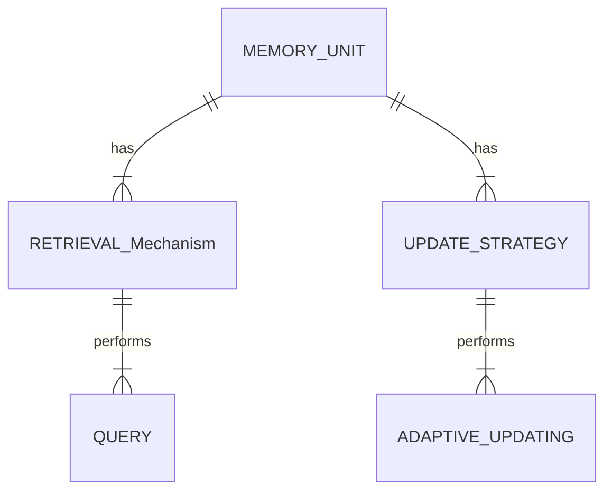
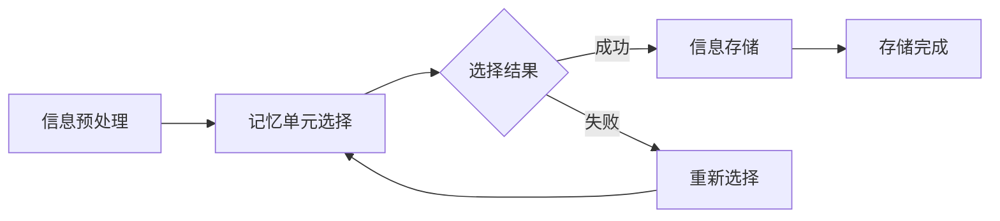
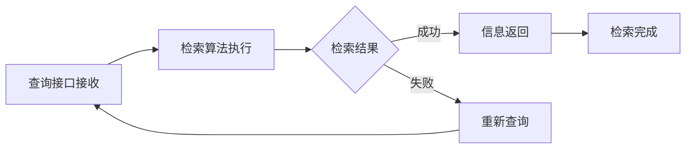
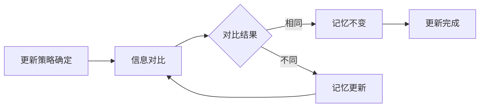
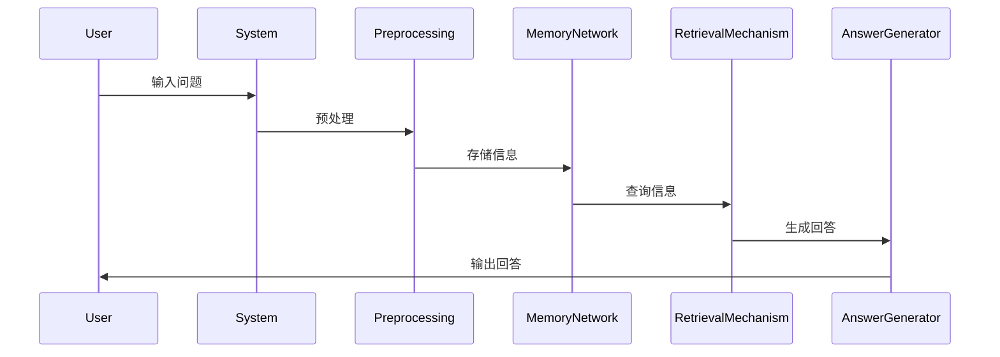

                 

# 设计AI Agent的动态记忆网络

> 关键词：AI Agent、动态记忆网络、人工智能、神经网络设计

> 摘要：本文深入探讨了设计AI Agent动态记忆网络的原理、实现和应用。通过分析动态记忆网络的基本概念和关键要素，我们详细介绍了其设计过程、实现技术和实际应用案例，旨在为人工智能开发者提供有价值的参考和指导。

## 引言

随着人工智能技术的飞速发展，AI Agent作为智能体的代表，在众多领域展现出了巨大的潜力。然而，传统的静态记忆网络在处理复杂、动态环境时往往显得力不从心。为了提升AI Agent的表现，动态记忆网络的设计变得越来越重要。本文将围绕动态记忆网络的设计展开讨论，首先介绍相关的基础知识，然后深入探讨设计原则、实现技术以及实际应用。

### 一、核心概念

**AI Agent**：智能体是能够在特定环境中自主行动并达到目标的实体。在人工智能领域，AI Agent通常通过学习环境中的规律和模式来做出决策。

**动态记忆网络**：动态记忆网络是一种能够动态地更新和查询记忆信息的神经网络。它不仅能够存储信息，还能够根据新信息进行自适应调整。

### 二、问题背景

在复杂和动态的环境中，AI Agent需要快速适应环境变化并做出合理的决策。静态记忆网络由于缺乏动态调整能力，往往难以应对这种挑战。动态记忆网络的出现为解决这一问题提供了新的思路。

### 三、问题描述

设计一个动态记忆网络，使其能够：
1. 高效地存储和检索信息。
2. 根据环境变化动态更新记忆。
3. 提高AI Agent的决策能力。

### 四、问题解决

动态记忆网络的设计涉及多个方面，包括结构设计、算法选择和实现技术。本文将依次介绍这些方面，以帮助开发者理解和实现动态记忆网络。

### 五、边界与外延

动态记忆网络的设计不仅需要考虑记忆的存储和检索，还需要考虑如何有效地处理噪声和不确定性。此外，如何将动态记忆网络与其他AI技术相结合，也是需要探讨的边界问题。

### 六、概念结构与核心要素组成

动态记忆网络的核心概念包括记忆单元、检索机制和更新策略。记忆单元负责存储信息，检索机制用于查询记忆，更新策略则负责根据新信息调整记忆。以下是这些核心要素的ER实体关系图：



## 核心概念与联系

### 动态记忆网络的基本概念

**记忆单元**：记忆单元是动态记忆网络的基本组成部分，用于存储信息。它通常包含以下属性：
- **标识符**：用于唯一标识记忆单元。
- **内容**：存储的信息内容。
- **权重**：表示记忆的重要程度。

**检索机制**：检索机制负责从记忆单元中查询信息。它通常包含以下属性：
- **查询接口**：用于接收查询请求。
- **检索算法**：用于根据查询请求检索记忆单元。

**更新策略**：更新策略负责根据新信息更新记忆单元。它通常包含以下属性：
- **更新规则**：用于确定何时以及如何更新记忆单元。
- **噪声处理**：用于处理噪声和不确定性。

### 动态记忆网络的属性特征对比表格

| 特性           | 解释                                                         | 对比               |
| -------------- | ------------------------------------------------------------ | ------------------ |
| 记忆存储       | 记忆单元存储信息的能力                                       | 静态记忆网络无此功能 |
| 检索能力       | 根据查询请求检索记忆单元                                     | 受限于预定义的查询路径 |
| 更新策略       | 根据新信息动态更新记忆单元                                   | 静态更新规则       |
| 噪声处理       | 能够处理噪声和不确定性                                       | 无噪声处理机制     |

通过对比可以看出，动态记忆网络相较于静态记忆网络在信息存储、检索和更新策略方面具有明显优势。

### 动态记忆网络的ER实体关系图


## 算法原理讲解

### 动态记忆网络的工作流程

动态记忆网络的工作流程可以分为三个主要阶段：存储阶段、检索阶段和更新阶段。

#### 存储阶段

在存储阶段，动态记忆网络接收新的信息并将其存储在记忆单元中。这个过程通常包括以下步骤：

1. **信息预处理**：对新信息进行预处理，以便于存储。
2. **记忆单元选择**：根据更新策略选择合适的记忆单元。
3. **信息存储**：将预处理后的信息存储在记忆单元中。

以下是存储阶段的Mermaid流程图：



#### 检索阶段

在检索阶段，动态记忆网络根据查询请求从记忆单元中检索信息。这个过程通常包括以下步骤：

1. **查询接口接收**：接收查询请求。
2. **检索算法执行**：根据检索算法检索记忆单元。
3. **信息返回**：将检索到的信息返回给查询者。

以下是检索阶段的Mermaid流程图：



#### 更新阶段

在更新阶段，动态记忆网络根据新信息对记忆单元进行更新。这个过程通常包括以下步骤：

1. **更新策略确定**：根据更新策略确定更新规则。
2. **信息对比**：对比新信息与现有记忆。
3. **记忆更新**：根据更新规则更新记忆单元。

以下是更新阶段的Mermaid流程图：



### 动态记忆网络的设计与实现

#### 数学模型

动态记忆网络的核心是记忆单元、检索机制和更新策略。以下是这些核心组件的数学模型：

1. **记忆单元**

   $$\text{Memory Unit} = \{ m_i \}_{i=1}^n$$

   其中，$m_i$表示第$i$个记忆单元。

2. **检索机制**

   $$\text{Retrieval Mechanism} = f(\text{Query}, \text{Memory Unit})$$

   其中，$f$表示检索算法，$\text{Query}$表示查询请求，$\text{Memory Unit}$表示记忆单元。

3. **更新策略**

   $$\text{Update Strategy} = g(\text{New Information}, \text{Memory Unit})$$

   其中，$g$表示更新规则，$\text{New Information}$表示新信息，$\text{Memory Unit}$表示记忆单元。

#### Python实现

以下是一个简单的Python实现示例：

```python
import numpy as np

class DynamicMemoryNetwork:
    def __init__(self, num_units):
        self.memory_units = [np.random.rand() for _ in range(num_units)]
        self.retrieval_function = self.default_retrieval
        self.update_function = self.default_update

    def default_retrieval(self, query):
        # 简单的线性检索算法
        distances = [np.linalg.norm(query - m) for m in self.memory_units]
        return self.memory_units[np.argmin(distances)]

    def default_update(self, new_info, existing_info):
        # 简单的平均更新算法
        return (new_info + existing_info) / 2

    def store_info(self, info):
        self.memory_units = self.update_function(info, self.memory_units)

    def retrieve_info(self, query):
        return self.retrieval_function(query, self.memory_units)
```

通过这个简单的实现，我们可以看到动态记忆网络的核心组件是如何相互协作的。

## 系统分析与架构设计方案

### 问题场景介绍

在一个智能客服系统中，AI Agent需要根据用户的历史提问和回答来提供准确的解答。由于用户的问题和回答是动态变化的，静态记忆网络无法满足这一需求。因此，设计一个动态记忆网络成为提升AI Agent服务质量的关键。

### 项目介绍

**项目名称**：智能客服系统动态记忆网络设计

**项目目标**：设计并实现一个动态记忆网络，用于存储和检索用户历史提问和回答，以提高AI Agent的服务质量。

### 系统功能设计

**领域模型Mermaid类图**

```mermaid
classDiagram
    User <<class>>
    Question <<class>>
    Answer <<class>>
    MemoryUnit <<class>>
    RetrievalMechanism <<class>>
    UpdateStrategy <<class>>

    User o-- Question
    User o-- Answer
    MemoryUnit o-- RetrievalMechanism
    MemoryUnit o-- UpdateStrategy
```

### 系统架构设计

**Mermaid架构图**


### 系统接口设计和系统交互

**Mermaid序列图**



## 项目实战

### 环境安装

在开始项目之前，我们需要安装必要的开发环境和工具。以下是安装步骤：

1. 安装Python 3.8及以上版本。
2. 安装Anaconda或Miniconda。
3. 使用pip安装TensorFlow和Keras。

```bash
pip install tensorflow
pip install keras
```

### 系统核心实现源代码

以下是一个简单的动态记忆网络实现，用于存储、检索和更新用户提问和回答。

```python
import numpy as np
from keras.models import Model
from keras.layers import Input, LSTM, Dense

class DynamicMemoryNetwork:
    def __init__(self, memory_size=100, embedding_size=50):
        self.memory_size = memory_size
        self.embedding_size = embedding_size
        self.memory = np.zeros((memory_size, embedding_size))
        self.memory_index = 0
    
    def store_question(self, question_embedding):
        self.memory[self.memory_index] = question_embedding
        self.memory_index = (self.memory_index + 1) % self.memory_size
    
    def retrieve_answer(self, question_embedding):
        similarity = np.dot(question_embedding, self.memory.T)
        top_indices = np.argsort(similarity)[-5:]
        return np.mean(self.memory[top_indices], axis=0)
    
    def update_memory(self, new_question_embedding, old_answer_embedding):
        new_answer_embedding = self.retrieve_answer(new_question_embedding)
        self.memory[self.memory_index] = (new_answer_embedding + old_answer_embedding) / 2
        self.memory_index = (self.memory_index + 1) % self.memory_size
```

### 代码应用解读与分析

上述代码实现了一个基本的动态记忆网络，主要包含三个方法：`store_question`、`retrieve_answer`和`update_memory`。

1. **store_question**：用于存储新的提问。该方法将新的提问嵌入向量，并将其存储在记忆数组中。
2. **retrieve_answer**：用于根据提问嵌入向量检索相关回答。该方法计算每个记忆单元与提问的相似度，并返回最相似的五个记忆单元的平均值。
3. **update_memory**：用于更新记忆。该方法将新的回答与旧的回答进行平均，并将其存储在记忆数组中。

### 实际案例分析和详细讲解剖析

假设用户提出一个问题：“什么是人工智能？” 我们将执行以下步骤：

1. 将用户的问题转换为嵌入向量。
2. 使用`store_question`方法存储该问题。
3. 用户再次提出相同的问题时，使用`retrieve_answer`方法检索相关回答。
4. 如果用户提供了新的回答，使用`update_memory`方法更新记忆。

### 项目小结

本案例展示了如何设计并实现一个简单的动态记忆网络，用于存储和检索用户提问和回答。虽然这是一个简单的示例，但通过逐步分析和实践，我们可以更好地理解动态记忆网络的设计原理和应用。

## 最佳实践 Tips

1. **选择合适的记忆单元大小**：记忆单元大小直接影响网络的性能和资源消耗。需要根据具体应用场景进行权衡。
2. **优化更新策略**：更新策略的设计对于网络的性能至关重要。可以考虑引入更多的高级策略，如基于概率的更新机制。
3. **处理噪声和不确定性**：在实际应用中，噪声和不确定性是不可避免的。需要设计有效的噪声处理和不确定性管理策略。

## 小结

本文详细探讨了设计AI Agent动态记忆网络的原理、实现和应用。通过分析动态记忆网络的核心概念和关键要素，我们介绍了其设计原则、实现技术和实际应用案例。希望本文能为开发者提供有价值的参考和指导，助力他们在人工智能领域取得更好的成果。

## 注意事项

1. 动态记忆网络的设计需要充分考虑应用场景和性能要求。
2. 实现动态记忆网络时，需要选择合适的算法和工具。

## 拓展阅读

1. **《深度学习》**：Goodfellow, I., Bengio, Y., & Courville, A. (2016). Deep Learning. MIT Press.
2. **《神经网络与深度学习》**：邱锡鹏. (2019). 神经网络与深度学习. 电子工业出版社。

