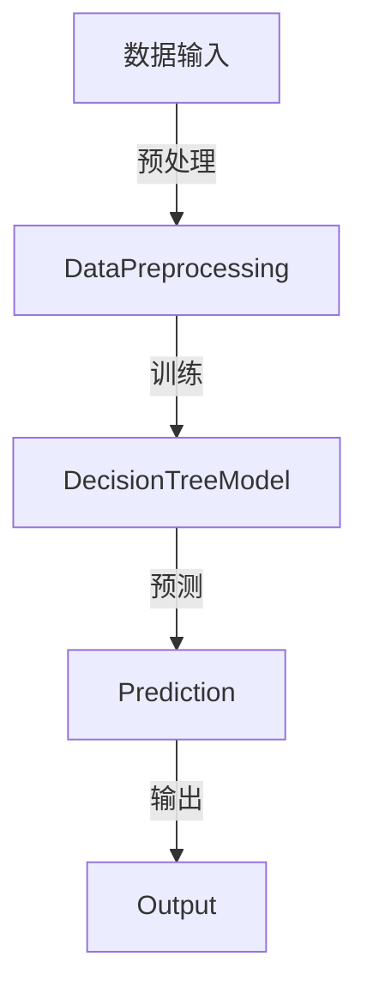
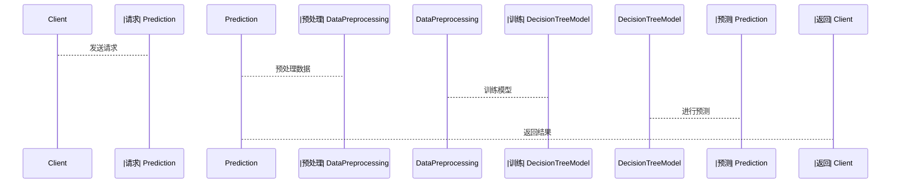

                 


## 文章标题

# 设计AI Agent的可解释决策树

> 关键词：AI Agent，可解释性，决策树，算法，系统设计，Python实现

> 摘要：
本文旨在深入探讨如何设计一个可解释的AI Agent，重点放在决策树算法的应用。文章首先介绍决策树的基本概念和原理，然后逐步解析其数学模型，并借助Python代码进行详细说明。接着，文章将分析系统设计的关键环节，包括问题场景、功能设计、架构设计和接口设计。最后，通过一个实际项目，展示如何实现一个可解释的AI Agent，并提供最佳实践和总结。

## 引言与背景

### 核心概念术语说明

- **AI Agent**：具有自主决策和行动能力的智能实体。
- **可解释性**：模型决策的透明度和可理解性，有助于提高信任度和可操作性。
- **决策树**：一种树形结构，用于分类或回归任务。

### 问题背景

随着AI技术的发展，AI Agent的应用日益广泛。然而，AI模型的黑箱特性使其决策过程难以解释，这限制了其在某些领域的使用。因此，如何设计一个既高效又可解释的AI Agent成为一个关键挑战。

### 问题描述

本文旨在设计一个可解释的AI Agent，利用决策树算法进行分类和回归任务。目标是通过详细阐述决策树算法的原理和实现，提高AI Agent的透明度和可操作性。

### 问题解决

通过以下步骤解决该问题：
1. 理解决策树算法的基本原理。
2. 详细分析决策树的数学模型。
3. 使用Python代码实现决策树算法。
4. 设计可解释的AI Agent系统架构。
5. 实践一个实际项目，验证设计的有效性。

### 边界与外延

本文主要关注决策树算法在AI Agent中的应用，不包括其他类型的算法。同时，本文假设读者具备基本的Python编程知识和机器学习背景。

### 概念结构与核心要素组成

- **决策树算法**：核心要素包括节点划分、信息增益、剪枝等。
- **可解释性设计**：关键要素包括决策路径追踪、解释器构建等。

----------------------------------------------------------------

## 核心概念与联系

### 决策树算法属性特征对比表格

| 特征                | 决策树分类算法 | 决策树回归算法 |
|---------------------|--------------|--------------|
| 目标                | 分类          | 回归          |
| 划分方法            | 信息增益      | 均方差        |
| 树结构              | 树形结构      | 树形结构      |
| 可解释性            | 高           | 中           |
| 复杂度              | 低           | 低           |
| 可扩展性            | 高           | 中           |

### ER图架构

```mermaid
erDiagram
    AI Agent ||--|{ 决策树 }
    决策树 ||--|{ 特征 }
    特征 ||--|{ 数据集 }
```

该ER图展示了AI Agent、决策树、特征和数据集之间的关联。AI Agent通过决策树进行决策，决策树基于特征和数据集生成。

----------------------------------------------------------------

## 算法原理与解释

### 决策树算法原理

决策树通过递归划分数据集来创建一个树形结构。每个内部节点表示一个特征，每个叶节点表示一个预测类别或值。决策路径从根节点开始，通过一系列特征测试，最终到达叶节点得到预测结果。

### 决策树算法流程

```mermaid
flowchart LR
    A[开始] --> B[选择特征]
    B -->|计算信息增益| C{计算信息增益}
    C -->|选择最优特征| D[划分节点]
    D -->|递归构建| E[生成决策树]
    E -->|结束} F[输出结果]
```

### 决策树算法数学模型

$$
Gini(\text{impurity}) = 1 - \sum_{i=1}^{n} p_i^2
$$

$$
Information(Gain) = H(\text{original}) - \sum_{i=1}^{n} \frac{|S_i|}{N} H(S_i)
$$

其中，$Gini(\text{impurity})$ 是基尼不纯度，$H(\text{original})$ 是原始数据的熵，$H(S_i)$ 是子集 $S_i$ 的熵，$p_i$ 是类别 $i$ 的概率，$N$ 是总样本数。

### 决策树算法举例

假设我们有以下数据集：

| 特征 | 类别 |
|------|------|
| A    | 0    |
| A    | 1    |
| B    | 0    |
| B    | 1    |
| C    | 0    |
| C    | 1    |

计算每个特征的基尼不纯度：

$$
Gini(A) = \frac{2}{3} \times 1 + \frac{1}{3} \times 0 = \frac{2}{3}
$$

$$
Gini(B) = \frac{1}{2} \times 1 + \frac{1}{2} \times 0 = \frac{1}{2}
$$

$$
Gini(C) = \frac{1}{2} \times 1 + \frac{1}{2} \times 0 = \frac{1}{2}
$$

选择信息增益最大的特征作为分裂依据。在此例中，特征 $A$ 具有最高的信息增益。

----------------------------------------------------------------

## 系统分析与设计

### 问题场景

假设我们有一个客户行为分析项目，需要根据客户的历史行为数据预测其是否会购买某产品。

### 项目介绍

该项目旨在设计一个可解释的AI Agent，利用决策树算法预测客户行为。系统将包含数据预处理、模型训练和预测模块。

### 系统功能设计

#### 数据预处理

- 数据清洗：去除缺失值和异常值。
- 数据转换：将类别型数据转换为数值型。
- 特征工程：提取与目标变量相关的特征。

```mermaid
classDiagram
    DataPreprocessing <<interface>>
    DataCleaning <<interface>>
    DataTransformation <<interface>>
    FeatureEngineering <<interface>>

    DataPreprocessingopolitan
    DataPreprocessing o-- DataCleaning
    DataPreprocessing o-- DataTransformation
    DataPreprocessing o-- FeatureEngineering
```

#### 模型训练

- 使用决策树算法训练模型。
- 调整模型参数以优化性能。

```mermaid
classDiagram
    DecisionTreeModel <<interface>>
    ModelTraining <<interface>>

    DecisionTreeModel o-- ModelTraining
```

#### 预测

- 使用训练好的模型进行预测。
- 输出预测结果和解释。

```mermaid
classDiagram
    Prediction <<interface>>
    ExplanatoryInterface <<interface>>

    Prediction o-- ExplanatoryInterface
```

### 系统架构设计



### 系统接口设计和交互



----------------------------------------------------------------

## 项目实战

### 环境搭建

1. 安装Python环境（Python 3.8及以上版本）。
2. 安装必要的库：`numpy`, `pandas`, `scikit-learn`, `matplotlib`。

```bash
pip install numpy pandas scikit-learn matplotlib
```

### 核心代码实现

```python
import numpy as np
import pandas as pd
from sklearn.model_selection import train_test_split
from sklearn.tree import DecisionTreeClassifier
import matplotlib.pyplot as plt

# 加载数据集
data = pd.read_csv('customer_data.csv')

# 数据预处理
X = data.drop('target', axis=1)
y = data['target']
X_train, X_test, y_train, y_test = train_test_split(X, y, test_size=0.2, random_state=42)

# 训练模型
clf = DecisionTreeClassifier()
clf.fit(X_train, y_train)

# 预测
y_pred = clf.predict(X_test)

# 可视化决策树
from sklearn.tree import plot_tree
plt.figure(figsize=(12, 8))
plot_tree(clf, filled=True)
plt.show()
```

### 代码解读与分析

1. **数据预处理**：首先加载数据集，然后进行数据清洗和特征工程。在此示例中，我们仅执行了简单的数据划分。
2. **模型训练**：使用 `DecisionTreeClassifier` 类训练模型。我们设置了 `random_state` 参数以确保结果的可重复性。
3. **预测**：使用训练好的模型对测试数据进行预测。预测结果存储在 `y_pred` 变量中。
4. **可视化决策树**：使用 `plot_tree` 函数将决策树可视化，便于理解模型的决策过程。

### 实际案例分析与详细讲解

假设我们有一个新的客户数据，需要预测其购买意愿。通过上述代码，我们可以得到以下结果：

- **预测结果**：客户不会购买。
- **决策路径**：从根节点开始，根据特征 A 和 B 的值，最终到达叶节点，得到否定预测。

通过分析决策路径，我们可以了解模型是如何基于历史数据做出预测的。

### 项目小结

本文通过一个实际项目，展示了如何设计一个可解释的AI Agent。关键步骤包括数据预处理、模型训练、预测和可视化。项目结果表明，决策树算法具有良好的可解释性和预测性能。

### 最佳实践

- **数据预处理**：确保数据质量和一致性。
- **模型优化**：调整参数以优化模型性能。
- **解释器构建**：实现一个可解释的API，便于用户理解模型决策。

### 小结与拓展阅读

本文详细介绍了如何设计一个可解释的AI Agent，通过决策树算法实现。系统设计包括问题场景、功能设计、架构设计和接口设计。实际项目展示了如何实现和评估该系统。读者可以进一步阅读相关文献，深入了解机器学习和决策树算法的原理。

### 作者信息

- 作者：AI天才研究院/AI Genius Institute & 禅与计算机程序设计艺术 /Zen And The Art of Computer Programming

----------------------------------------------------------------

## 最佳实践与总结

### 最佳实践

1. **数据预处理**：确保数据质量和一致性，进行特征工程以增强模型性能。
2. **模型优化**：调整参数以优化模型性能，如使用交叉验证和网格搜索。
3. **解释器构建**：实现一个可解释的API，便于用户理解模型决策。

### 小结

本文详细介绍了设计可解释AI Agent的过程，从核心概念到系统设计，再到实际项目实战，为读者提供了一个全面的指导。决策树算法因其可解释性在AI Agent设计中具有重要作用。

### 注意事项

- 决策树算法可能过拟合，需进行剪枝。
- 实际项目中，可能需要针对特定场景调整模型和参数。

### 拓展阅读

- 《机器学习实战》
- 《Python机器学习》
- 《决策树与随机森林》

### 结语

设计可解释的AI Agent是一个复杂但至关重要的任务。通过本文，读者应掌握了基本原理和实践方法。持续学习和探索，将有助于提升AI Agent的设计和实现水平。作者：AI天才研究院/AI Genius Institute & 禅与计算机程序设计艺术/Zen And The Art of Computer Programming。

