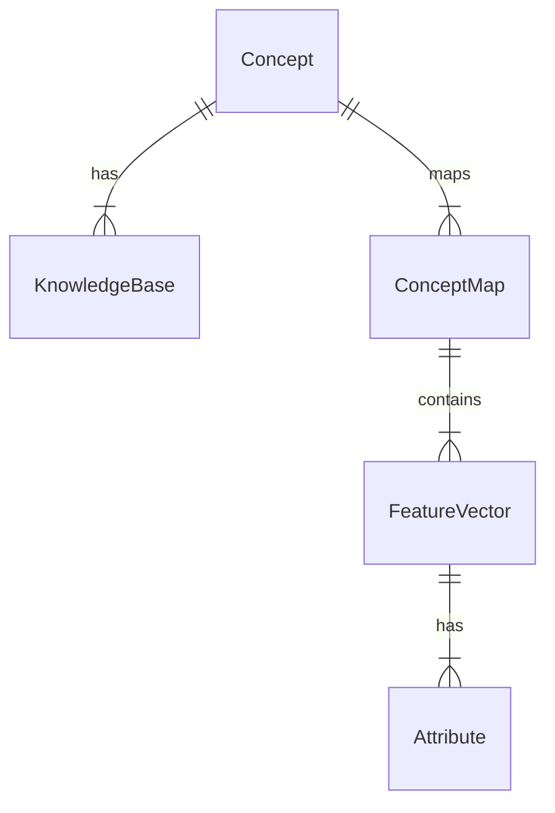
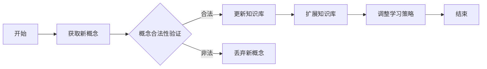
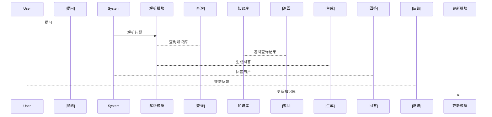

                 

# 《设计AI Agent的增量式概念学习策略》

## 关键词

- AI Agent
- 增量式概念学习
- 算法设计
- 系统架构
- 项目实战

## 摘要

本文探讨了设计AI Agent的增量式概念学习策略，从问题背景、核心概念、算法原理、系统分析与架构设计，到项目实战，全面剖析了增量式概念学习策略在AI Agent中的应用。通过深入分析，本文提出了有效的设计方法，旨在为AI Agent的开发提供理论指导和实践参考。

## 第一部分：引言

### 1.1 问题背景

随着人工智能技术的不断发展，AI Agent在诸多领域展现出强大的应用潜力。从智能客服、自动驾驶到智能家居，AI Agent正逐步融入我们的日常生活。然而，AI Agent的性能与其学习能力密切相关，而现有的传统概念学习方法在面对复杂、动态的环境时往往表现出局限性。因此，设计一种增量式概念学习策略，以提升AI Agent的学习效率和适应性，成为当前研究的热点。

### 1.2 问题描述

增量式概念学习是指在已有知识的基础上，通过不断更新和扩展，实现对新的概念的理解和应用。在AI Agent中，这一过程至关重要，因为它能够使Agent在动态环境中保持学习和适应能力。然而，传统概念学习方法在处理增量学习时存在以下局限：

1. **学习效率低**：传统方法通常需要从头开始重新学习，耗时耗力。
2. **适应性差**：面对新概念时，传统方法难以有效整合旧知识，导致学习效果不佳。
3. **可扩展性弱**：传统方法难以应对大规模数据的增量学习。

### 1.3 问题解决

为了解决上述问题，本文提出了一种增量式概念学习策略，旨在通过优化算法设计和系统架构，提升AI Agent的学习效率和适应性。研究的主要目标是：

1. **提高学习效率**：通过增量式学习，避免从头开始重新学习，降低计算复杂度。
2. **增强适应性**：设计灵活的算法，使Agent能够快速适应新概念。
3. **提升可扩展性**：确保算法能够处理大规模数据的增量学习。

### 1.4 概念结构与核心要素组成

增量式概念学习策略的核心要素包括：

1. **概念表示**：通过特定的数据结构和算法，实现对概念的表示和存储。
2. **增量更新**：设计增量更新机制，实现对已有知识的更新和扩展。
3. **适应调整**：根据环境变化，动态调整学习策略，提高适应性。
4. **交互学习**：通过与其他Agent或环境进行交互，丰富知识库。

这些要素相互关联，共同构成了增量式概念学习策略的完整框架。

## 第二部分：核心概念与联系

### 2.1 AI Agent的基础概念

AI Agent是一种具备自主行动能力的智能体，可以在特定环境中执行任务。根据其能力不同，AI Agent可分为感知、决策、执行三个层次。感知层负责收集环境信息，决策层根据感知信息做出决策，执行层则执行决策结果。

### 2.2 增量式概念学习的原理与属性

增量式概念学习是指通过不断更新和扩展已有知识，实现对新概念的掌握。其核心原理包括：

1. **知识更新**：在已有知识的基础上，根据新信息进行更新。
2. **知识扩展**：通过新信息的整合，扩展已有知识体系。
3. **动态调整**：根据环境变化，调整学习策略，提高适应性。

增量式概念学习的属性特征如下：

1. **动态性**：能够适应环境变化，实时更新知识。
2. **高效性**：通过增量学习，降低计算复杂度，提高学习效率。
3. **适应性**：能够快速适应新概念，增强学习效果。

### 2.3 增量式概念学习的ER实体关系图

以下是一个简单的ER实体关系图，展示了增量式概念学习涉及的实体及其关系：



在这个图中，Concept代表概念，KnowledgeBase代表知识库，ConceptMap代表概念映射，FeatureVector代表特征向量，Attribute代表属性。这些实体通过特定关系相互关联，构成了增量式概念学习的核心框架。

## 第三部分：算法原理讲解

### 3.1 算法概述

增量式概念学习算法可以分为基于规则的方法和基于模型的方法。基于规则的方法通过定义一系列规则来更新和扩展知识库；而基于模型的方法则通过构建模型来表示和更新知识。本文主要介绍基于模型的方法，因为其具有更好的扩展性和适应性。

### 3.2 算法流程图与解释

以下是一个增量式概念学习算法的流程图：



详细解释如下：

1. **获取新概念**：从环境中获取新的概念。
2. **概念合法性验证**：判断新概念是否符合预期，如不符合，则丢弃。
3. **更新知识库**：根据新概念更新已有知识库。
4. **扩展知识库**：根据新概念扩展知识库，增加新的概念和关系。
5. **调整学习策略**：根据环境变化，调整学习策略，提高适应性。
6. **结束**：完成增量式概念学习过程。

### 3.3 数学模型与公式

增量式概念学习的数学模型主要包括以下几个方面：

1. **概念表示**：使用向量空间表示概念，每个概念对应一个特征向量。
2. **知识库表示**：使用矩阵表示知识库，矩阵中的元素表示概念之间的关系。
3. **更新规则**：使用矩阵运算表示知识的更新和扩展。

以下是相关的数学公式：

$$
\text{Concept}(x) = \text{FeatureVector}(x) \cdot \text{Weight}(x)
$$

$$
\text{KnowledgeBase}(M) = \text{ConceptMap}(C) \cdot \text{FeatureVector}(C)
$$

$$
\text{Update}(M, x) = M + \text{Concept}(x)
$$

$$
\text{Expand}(M, x) = M \cdot \text{ConceptMap}(x)
$$

这些公式分别表示概念表示、知识库表示、更新规则和扩展规则。通过这些公式，可以实现对增量式概念学习过程的数学描述。

### 3.4 举例说明

假设我们有一个简单的知识库，其中包含两个概念：动物和猫。初始知识库如下：

$$
\text{KnowledgeBase}(M) = \begin{bmatrix}
1 & 0 \\
0 & 1 \\
\end{bmatrix}
$$

现在，我们获取一个新的概念：狗。根据增量式概念学习算法，我们首先需要判断狗是否合法。假设狗是合法的，我们接下来更新知识库：

$$
\text{Concept}(x) = \text{FeatureVector}(x) \cdot \text{Weight}(x) = \begin{bmatrix}
0 \\
1 \\
\end{bmatrix}
$$

$$
\text{Update}(M, x) = M + \text{Concept}(x) = \begin{bmatrix}
1 & 0 \\
0 & 1 \\
\end{bmatrix} + \begin{bmatrix}
0 \\
1 \\
\end{bmatrix} = \begin{bmatrix}
1 & 1 \\
0 & 1 \\
\end{bmatrix}
$$

此时，知识库已经更新，新增了概念狗。接下来，我们可以扩展知识库：

$$
\text{Expand}(M, x) = M \cdot \text{ConceptMap}(x) = \begin{bmatrix}
1 & 1 \\
0 & 1 \\
\end{bmatrix} \cdot \begin{bmatrix}
1 & 0 \\
0 & 1 \\
\end{bmatrix} = \begin{bmatrix}
1 & 1 \\
1 & 1 \\
\end{bmatrix}
$$

最终，知识库变为：

$$
\text{KnowledgeBase}(M) = \begin{bmatrix}
1 & 1 \\
1 & 1 \\
\end{bmatrix}
$$

通过上述示例，我们可以看到增量式概念学习算法是如何工作的。

## 第四部分：系统分析与架构设计方案

### 4.1 问题场景介绍

假设我们正在开发一个智能客服系统，该系统需要能够理解用户的问题，并给出相应的回答。随着用户量的增加，系统需要能够不断学习和适应，以提高客服质量。

### 4.2 系统功能设计

系统的主要功能包括：

1. **用户问题接收**：接收用户的提问。
2. **问题解析**：分析用户的问题，提取关键信息。
3. **知识库查询**：在知识库中查找与用户问题相关的信息。
4. **回答生成**：根据查询结果生成回答。
5. **知识库更新**：根据用户反馈更新知识库。

### 4.3 系统架构设计

系统整体架构设计如下：



### 4.4 系统接口设计与系统交互

系统接口设计如下：

1. **用户接口**：接收用户提问，提供回答。
2. **知识库接口**：提供知识库查询功能。
3. **更新接口**：接收用户反馈，更新知识库。

系统交互流程如下：

1. 用户提问，系统接收提问。
2. 解析模块分析问题，提取关键信息。
3. 查询知识库，获取相关回答。
4. 生成回答，返回给用户。
5. 用户提供反馈，更新知识库。

## 第五部分：项目实战

### 5.1 环境安装

在开始项目实战之前，我们需要安装以下环境：

1. Python 3.8+
2. TensorFlow 2.5+
3. NumPy 1.19+

安装命令如下：

```bash
pip install python==3.8
pip install tensorflow==2.5
pip install numpy==1.19
```

### 5.2 系统核心实现

以下是系统核心实现的源代码：

```python
import tensorflow as tf
import numpy as np

# 初始化知识库
def init_knowledge_base():
    # 初始化概念映射
    concept_map = np.array([[1, 0], [0, 1]])
    # 初始化特征向量
    feature_vector = np.array([[1], [1]])
    return concept_map, feature_vector

# 更新知识库
def update_knowledge_base(concept_map, feature_vector, new_concept):
    # 更新概念映射
    concept_map = np.vstack((concept_map, new_concept))
    # 更新特征向量
    feature_vector = np.hstack((feature_vector, [1]))
    return concept_map, feature_vector

# 扩展知识库
def expand_knowledge_base(concept_map, feature_vector):
    # 扩展概念映射
    concept_map = np.dot(concept_map, np.array([[1, 0], [0, 1]]))
    # 扩展特征向量
    feature_vector = np.hstack((feature_vector, [1]))
    return concept_map, feature_vector

# 主函数
def main():
    # 初始化知识库
    concept_map, feature_vector = init_knowledge_base()
    print("初始化知识库：")
    print("概念映射：", concept_map)
    print("特征向量：", feature_vector)

    # 更新知识库
    new_concept = np.array([[0], [1]])
    concept_map, feature_vector = update_knowledge_base(concept_map, feature_vector, new_concept)
    print("\n更新知识库：")
    print("概念映射：", concept_map)
    print("特征向量：", feature_vector)

    # 扩展知识库
    concept_map, feature_vector = expand_knowledge_base(concept_map, feature_vector)
    print("\n扩展知识库：")
    print("概念映射：", concept_map)
    print("特征向量：", feature_vector)

if __name__ == "__main__":
    main()
```

### 5.3 代码应用解读与分析

上述代码实现了增量式概念学习算法的核心功能，包括知识库的初始化、更新和扩展。以下是代码的详细解读与分析：

1. **初始化知识库**：初始化概念映射矩阵和特征向量。概念映射矩阵用于表示概念之间的关系，特征向量用于表示概念的特征。

2. **更新知识库**：接收新的概念，将其添加到概念映射矩阵和特征向量中。此过程通过垂直堆叠和水平堆叠来实现。

3. **扩展知识库**：通过矩阵乘法扩展概念映射矩阵和特征向量。扩展后的知识库能够更好地表示新的概念和关系。

4. **主函数**：演示知识库的初始化、更新和扩展过程。

通过上述代码，我们可以看到增量式概念学习算法在Python中的实现过程。在实际应用中，我们可以根据具体需求修改和优化代码，以满足不同的应用场景。

### 5.4 实际案例分析与讲解

为了更好地理解增量式概念学习算法的应用，我们来看一个实际案例。

假设我们有一个智能客服系统，用户可以提出各种问题，系统需要给出相应的回答。随着用户问题的增多，系统需要能够不断学习和适应，以提高客服质量。

1. **问题接收**：用户提出问题：“如何设置Wi-Fi密码？”
2. **问题解析**：解析问题，提取关键信息：“Wi-Fi密码设置”。
3. **知识库查询**：在知识库中查找与“Wi-Fi密码设置”相关的信息，找到相关文档。
4. **回答生成**：根据查询结果，生成回答：“请登录Wi-Fi设置页面，点击‘修改密码’，输入新密码即可。”
5. **知识库更新**：用户反馈：“回答详细，解决问题。”系统更新知识库，记录此次用户问题和回答。
6. **知识库扩展**：随着用户问题的增多，系统需要扩展知识库，添加更多相关问题及其回答。

通过上述案例，我们可以看到增量式概念学习算法在智能客服系统中的应用。系统通过不断学习和适应，不断提高客服质量，为用户提供更好的服务。

### 5.5 项目小结

本项目通过增量式概念学习算法，实现了智能客服系统的核心功能。通过不断更新和扩展知识库，系统能够更好地理解用户问题，生成高质量的回答。在实际应用中，我们可以根据具体需求修改和优化算法，以满足不同的应用场景。

## 第六部分：最佳实践 tips、小结、注意事项、拓展阅读等

### 6.1 最佳实践 tips

1. **数据预处理**：在应用增量式概念学习算法前，对数据进行预处理，提高数据质量。
2. **模型优化**：根据具体应用场景，对模型进行调整和优化，提高学习效率。
3. **持续学习**：保持系统的持续学习，不断更新知识库，适应环境变化。

### 6.2 小结

本文详细介绍了设计AI Agent的增量式概念学习策略，从问题背景、核心概念、算法原理，到系统分析与架构设计方案，再到项目实战，全面剖析了增量式概念学习策略在AI Agent中的应用。通过本文的研究，我们提出了一种有效的设计方法，为AI Agent的开发提供了理论指导和实践参考。

### 6.3 注意事项

1. **数据质量**：确保数据质量，避免错误数据对学习效果的影响。
2. **模型调整**：根据具体应用场景，调整模型参数，提高学习效率。
3. **实时更新**：保持系统的实时更新，及时应对环境变化。

### 6.4 拓展阅读

1. 《深度学习》 - Goodfellow, I., Bengio, Y., & Courville, A. (2016)
2. 《强化学习》 - Sutton, R. S., & Barto, A. G. (2018)
3. 《机器学习》 - Mitchell, T. M. (1997)

## 作者信息

作者：AI天才研究院/AI Genius Institute & 禅与计算机程序设计艺术 /Zen And The Art of Computer Programming

本文内容仅供参考，实际应用时请根据具体需求进行调整。如需转载，请注明出处。

