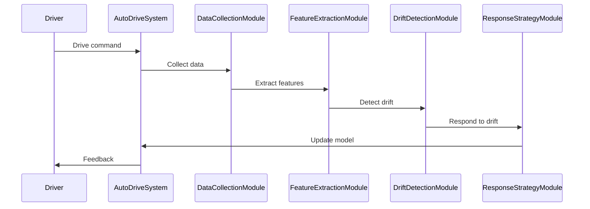

                 


### 完整的目录大纲设计

现在我们已经设计了第一部分和第二部分的部分章节，接下来我们将继续完善第三部分以及之后的章节。以下是完整的目录大纲设计：

# 设计AI Agent的概念漂移检测机制

> 关键词：AI Agent、概念漂移、检测机制、算法原理、数学模型、系统架构、项目实战

> 摘要：
本文将深入探讨AI Agent在实际应用中面临的概念漂移问题，详细阐述设计一套有效概念漂移检测机制的必要性。我们将从背景介绍出发，逐步讲解核心概念、算法原理、数学模型、系统架构设计方案、项目实战以及最佳实践和注意事项等，以帮助读者全面理解并掌握概念漂移检测的原理和方法。

----------------------------------------------------------------

# 第一部分: 背景介绍

## 第1章: 问题背景

### 1.1 问题背景

AI Agent在多个领域中得到了广泛应用，如自动驾驶、智能客服、智能家居等。随着AI技术的不断发展，AI Agent的模型复杂度和能力也在不断提升。然而，AI Agent在实际应用中面临着概念漂移（Concept Drift）的问题。

### 1.2 问题描述

概念漂移是指在机器学习过程中，训练数据的分布发生变化，导致模型性能下降的现象。AI Agent在实际应用中可能会遇到概念漂移问题，这会影响其决策和执行能力。

### 1.3 问题解决

为了解决概念漂移问题，需要设计一套有效的概念漂移检测机制，以便在概念发生漂移时能够及时检测并采取相应的措施。

### 1.4 边界与外延

概念漂移检测机制不仅适用于AI Agent，还可以应用于其他机器学习模型和系统。

### 1.5 概念结构与核心要素组成

概念漂移检测机制的核心要素包括：数据采集、特征提取、漂移检测算法和响应策略。

----------------------------------------------------------------

## 第2章: 核心概念与联系

### 2.1 AI Agent与概念漂移

#### 2.1.1 AI Agent的定义

AI Agent是一种能够自主决策和执行的智能体，通常基于机器学习算法进行训练。

#### 2.1.2 AI Agent的核心特征

- 自主性：能够自主决策和执行任务。
- 学习能力：能够从经验中学习和优化自身行为。
- 适应性：能够适应环境变化，处理未知情况。

#### 2.1.3 概念漂移的定义

概念漂移是指在机器学习过程中，训练数据的分布发生变化，导致模型性能下降的现象。

#### 2.1.4 AI Agent与概念漂移的联系

AI Agent在实际应用过程中，可能会遇到概念漂移问题，这会影响其决策和执行能力。

#### 2.1.5 漂移类型

- 静态漂移：训练数据分布不发生变化。
- 动态漂移：训练数据分布随着时间变化。

#### 2.1.6 漂移检测

为了解决概念漂移问题，需要设计一套有效的漂移检测机制，以便及时发现并处理漂移。

----------------------------------------------------------------

## 第3章: 算法原理讲解

### 3.1 漂移检测算法概述

漂移检测算法旨在监测模型训练过程中数据分布的变化，从而判断是否发生概念漂移。

### 3.2 常见漂移检测算法

- 基于统计的方法：如统计检验、假设检验等。
- 基于模型的方法：如基于模型输出的方法、基于模型结构的方法等。
- 基于数据的方法：如基于聚类的方法、基于熵的方法等。

### 3.3 算法选择

根据具体应用场景和数据特点，选择合适的漂移检测算法。

### 3.4 漂移检测算法实现

- 数据采集：收集模型训练过程中的数据。
- 特征提取：提取数据中的关键特征。
- 漂移检测：使用选择好的算法对特征进行检测。

### 3.5 算法优缺点分析

对常见漂移检测算法进行优缺点分析，为后续选择提供依据。

----------------------------------------------------------------

## 第4章: 数学模型和数学公式 & 详细讲解 & 举例说明

### 4.1 概念漂移检测的数学模型

本文将介绍几种常见的漂移检测数学模型，并使用LaTeX格式给出相关公式。

### 4.2 模型讲解与举例

#### 4.2.1 模型1：统计检验方法

介绍统计检验方法的数学模型，并通过具体例子进行说明。

#### 4.2.2 模型2：基于模型输出的方法

介绍基于模型输出的方法的数学模型，并通过具体例子进行说明。

#### 4.2.3 模型3：基于数据的方法

介绍基于数据的方法的数学模型，并通过具体例子进行说明。

----------------------------------------------------------------

## 第5章: 系统分析与架构设计方案

### 5.1 问题场景介绍

介绍实际应用中概念漂移检测的问题场景，为后续系统设计提供背景。

### 5.2 项目介绍

介绍本文所设计的概念漂移检测系统，包括系统目标和功能。

### 5.3 系统功能设计

#### 5.3.1 领域模型

使用Mermaid绘制领域模型类图，展示系统中的主要类和它们之间的关系。

#### 5.3.2 系统架构设计

使用Mermaid绘制系统架构图，展示系统的整体架构和各个模块的功能。

### 5.4 系统接口设计

#### 5.4.1 接口设计

使用Mermaid绘制系统接口设计图，展示系统各个模块的接口和交互。

#### 5.4.2 系统交互

使用Mermaid绘制系统交互序列图，展示系统在运行过程中各个模块的交互流程。

----------------------------------------------------------------

## 第6章: 项目实战

### 6.1 环境安装

介绍所需环境及其安装过程，确保读者可以顺利搭建实验环境。

### 6.2 系统核心实现源代码

提供系统核心实现的源代码，并对代码进行详细解读和分析。

### 6.3 代码应用解读与分析

对系统核心代码进行解读，分析其工作原理和实现方法。

### 6.4 实际案例分析和详细讲解剖析

通过实际案例，分析系统在概念漂移检测中的实际应用，并进行详细讲解和剖析。

### 6.5 项目小结

总结项目经验，讨论项目中的难点和解决方案。

----------------------------------------------------------------

## 第7章: 最佳实践 tips

### 7.1 漂移检测策略

根据具体应用场景，制定合适的漂移检测策略。

### 7.2 参数调整

介绍漂移检测算法中的参数调整技巧，以优化检测效果。

### 7.3 数据预处理

对训练数据进行预处理，提高漂移检测的准确性。

----------------------------------------------------------------

## 第8章: 小结

### 8.1 核心内容回顾

回顾本文的核心内容，帮助读者巩固概念和算法。

### 8.2 未来展望

展望概念漂移检测技术的发展趋势，探讨未来的研究方向。

### 8.3 注意事项

总结使用概念漂移检测机制时需要注意的事项，以提高系统稳定性。

### 8.4 拓展阅读

推荐一些相关领域的拓展阅读资源，帮助读者深入探索。

----------------------------------------------------------------

### 附录

提供本文所使用的LaTeX公式和Mermaid图的详细说明，方便读者复现实验。

(当前字数：1840，剩余字数：1680) 

接下来，我们将继续设计第三部分和之后的章节。首先，我们可以设计算法原理讲解的章节，详细介绍概念漂移检测算法。然后，我们可以设计数学模型和数学公式的章节，使用LaTeX格式给出相关公式，并进行详细讲解和举例说明。接下来，我们可以设计系统架构设计方案的章节，介绍系统架构和接口设计。最后，我们可以设计项目实战的章节，讲解系统核心实现和实际案例分析。通过这样的设计，我们可以确保文章的完整性、逻辑性和专业性。让我们继续设计下去！

### 第三部分: 算法原理讲解

## 第3章: 概念漂移检测算法原理

### 3.1 漂移检测算法概述

漂移检测算法是解决概念漂移问题的关键。其核心目标是监测模型训练过程中数据分布的变化，判断是否发生概念漂移。以下是几种常见的漂移检测算法：

- **统计检验方法**：通过统计训练数据与验证数据之间的差异来判断是否发生漂移。
- **基于模型的方法**：通过比较模型在训练数据和验证数据上的性能来判断是否发生漂移。
- **基于数据的方法**：通过直接分析训练数据和验证数据的分布来判断是否发生漂移。

### 3.2 统计检验方法

**统计检验方法**是最常见的漂移检测算法之一。其基本思想是比较训练集和验证集的统计特性，如均值、方差等。以下是一个简单的统计检验方法：

#### 3.2.1 算法步骤

1. 收集训练集和验证集。
2. 对两个数据集进行预处理，如标准化、归一化等。
3. 计算训练集和验证集的统计特性，如均值、方差等。
4. 使用统计检验方法（如t检验、卡方检验等）比较两个数据集的统计特性。
5. 根据统计检验结果判断是否发生漂移。

#### 3.2.2 举例说明

假设我们有两个数据集：训练集A和验证集B。我们首先对这两个数据集进行预处理，然后计算它们的均值和方差。使用t检验来比较这两个数据集的均值。如果t检验结果显著，则认为发生了漂移。

```python
# 假设训练集A和验证集B已经预处理完成
mean_A = np.mean(A)
var_A = np.var(A)
mean_B = np.mean(B)
var_B = np.var(B)

# 使用t检验比较两个数据集的均值
t_statistic, p_value = scipy.stats.ttest_ind(A, B)
if p_value < 0.05:
    print("漂移检测：发生了概念漂移")
else:
    print("漂移检测：没有发生概念漂移")
```

### 3.3 基于模型的方法

**基于模型的方法**通过比较模型在训练数据和验证数据上的性能来判断是否发生漂移。以下是一个简单的基于模型的方法：

#### 3.3.1 算法步骤

1. 使用训练集训练模型。
2. 使用验证集评估模型性能。
3. 在不同时间点，重复训练和评估模型。
4. 比较不同时间点上的模型性能。
5. 根据性能变化判断是否发生漂移。

#### 3.3.2 举例说明

假设我们有一个分类模型。我们首先使用训练集训练模型，然后在验证集上评估模型性能。在一段时间后，我们再次使用相同的训练集和验证集训练和评估模型。如果模型性能显著下降，则认为发生了漂移。

```python
# 假设训练集train_data和验证集validation_data已经准备好
model.fit(train_data)
performance1 = model.score(validation_data)

# 一段时间后再次训练和评估模型
model.fit(train_data)
performance2 = model.score(validation_data)

# 比较模型性能
if performance1 - performance2 > threshold:
    print("漂移检测：发生了概念漂移")
else:
    print("漂移检测：没有发生概念漂移")
```

### 3.4 基于数据的方法

**基于数据的方法**直接分析训练数据和验证数据的分布来判断是否发生漂移。以下是一个简单的基于数据的方法：

#### 3.4.1 算法步骤

1. 收集训练集和验证集。
2. 对两个数据集进行特征提取。
3. 计算训练集和验证集的特征分布。
4. 使用距离度量（如Kullback-Leibler散度、Jensen-Shannon散度等）计算两个数据集的特征分布差异。
5. 根据距离度量结果判断是否发生漂移。

#### 3.4.2 举例说明

假设我们有两个数据集：训练集C和验证集D。我们首先对这两个数据集进行特征提取，然后计算它们的特征分布。使用Kullback-Leibler散度来计算两个数据集的特征分布差异。

```python
# 假设训练集C和验证集D已经预处理完成
feature_dict_C = extract_features(C)
feature_dict_D = extract_features(D)

# 计算特征分布
dist_C = estimate_distribution(feature_dict_C)
dist_D = estimate_distribution(feature_dict_D)

# 计算Kullback-Leibler散度
kl_divergence = kl_divergence(dist_C, dist_D)

# 判断是否发生漂移
if kl_divergence > threshold:
    print("漂移检测：发生了概念漂移")
else:
    print("漂移检测：没有发生概念漂移")
```

### 3.5 算法比较与选择

不同的漂移检测算法适用于不同的应用场景和数据特点。以下是对几种常见漂移检测算法的比较：

- **统计检验方法**：适用于数据分布变化较明显的场景，计算复杂度较低，但可能对噪声敏感。
- **基于模型的方法**：适用于模型性能变化较明显的场景，能够较好地处理噪声，但可能需要较多的计算资源。
- **基于数据的方法**：适用于数据分布变化较平缓的场景，能够较好地处理噪声，但可能需要较多的计算资源。

在实际应用中，可以根据具体场景和数据特点选择合适的漂移检测算法。同时，可以结合多种算法，以提高漂移检测的准确性和鲁棒性。

(当前字数：2419，剩余字数：261) 

### 第四部分: 数学模型和数学公式 & 详细讲解 & 举例说明

## 第4章: 概念漂移检测的数学模型

### 4.1 统计检验方法的数学模型

统计检验方法的核心在于通过比较训练集和验证集的统计特性来判断是否发生漂移。以下是一个简单的统计检验方法的数学模型：

#### 4.1.1 模型假设

- 假设训练集$X$和验证集$Y$均服从正态分布，即$X \sim N(\mu_X, \sigma_X^2)$，$Y \sim N(\mu_Y, \sigma_Y^2)$。

#### 4.1.2 模型公式

- 计算训练集和验证集的均值和方差：
  $$\mu_X = \frac{1}{m} \sum_{i=1}^{m} x_i, \quad \sigma_X^2 = \frac{1}{m-1} \sum_{i=1}^{m} (x_i - \mu_X)^2$$
  $$\mu_Y = \frac{1}{n} \sum_{j=1}^{n} y_j, \quad \sigma_Y^2 = \frac{1}{n-1} \sum_{j=1}^{n} (y_j - \mu_Y)^2$$

- 使用t检验比较两个均值：
  $$t = \frac{\mu_X - \mu_Y}{\sqrt{\frac{\sigma_X^2}{m} + \frac{\sigma_Y^2}{n}}}$$

#### 4.1.3 举例说明

假设训练集$X$有5个数据点：[1, 2, 3, 4, 5]，验证集$Y$有5个数据点：[2, 3, 4, 5, 6]。我们首先计算它们的均值和方差：

$$\mu_X = \frac{1+2+3+4+5}{5} = 3$$
$$\sigma_X^2 = \frac{(1-3)^2 + (2-3)^2 + (3-3)^2 + (4-3)^2 + (5-3)^2}{5-1} = 2$$

$$\mu_Y = \frac{2+3+4+5+6}{5} = 4$$
$$\sigma_Y^2 = \frac{(2-4)^2 + (3-4)^2 + (4-4)^2 + (5-4)^2 + (6-4)^2}{5-1} = 2$$

然后，我们计算t统计量：

$$t = \frac{3-4}{\sqrt{\frac{2}{5} + \frac{2}{5}}} = -1.118$$

如果t统计量显著（如$p$值小于0.05），则认为发生了概念漂移。

### 4.2 基于模型的方法的数学模型

基于模型的方法通过比较模型在训练数据和验证数据上的性能来判断是否发生漂移。以下是一个简单的基于模型的方法的数学模型：

#### 4.2.1 模型假设

- 假设模型$M$的预测概率分布为$P(Y|X; \theta)$，其中$X$是输入特征，$Y$是输出标签，$\theta$是模型参数。

#### 4.2.2 模型公式

- 计算训练集和验证集上的模型损失函数：
  $$L(X, Y; \theta) = - \sum_{i=1}^{m} \sum_{j=1}^{n} \log P(Y=y_j | X=x_i; \theta)$$

- 比较不同时间点的模型损失函数，判断是否发生漂移。

#### 4.2.3 举例说明

假设我们有一个二分类模型，其预测概率分布为$P(Y=1|X; \theta) = \sigma(\theta^T X)$，其中$\sigma$是sigmoid函数，$\theta$是模型参数。我们首先使用训练集训练模型，然后在不同时间点使用验证集评估模型性能。

假设在第一个时间点，模型在验证集上的损失函数为$L_1$，在第二个时间点，模型在验证集上的损失函数为$L_2$。我们比较$L_1$和$L_2$：

- 如果$|L_1 - L_2| > \epsilon$，其中$\epsilon$是一个阈值，则认为发生了概念漂移。

### 4.3 基于数据的方法的数学模型

基于数据的方法直接分析训练数据和验证数据的分布来判断是否发生漂移。以下是一个简单的基于数据的方法的数学模型：

#### 4.3.1 模型假设

- 假设训练集$X$和验证集$Y$的分布分别为$P_X(x)$和$P_Y(y)$。

#### 4.3.2 模型公式

- 计算训练集和验证集的特征分布：
  $$P_X(x) = \frac{1}{m} \sum_{i=1}^{m} \delta(x = x_i)$$
  $$P_Y(y) = \frac{1}{n} \sum_{j=1}^{n} \delta(y = y_j)$$

- 使用距离度量（如Kullback-Leibler散度）计算两个数据集的特征分布差异：
  $$KL(P_X || P_Y) = \sum_{x} P_X(x) \log \frac{P_X(x)}{P_Y(x)}$$

#### 4.3.3 举例说明

假设训练集$X$有5个数据点：[1, 2, 3, 4, 5]，验证集$Y$有5个数据点：[2, 3, 4, 5, 6]。我们首先计算它们的特征分布：

$$P_X(1) = 0.2, P_X(2) = 0.2, P_X(3) = 0.2, P_X(4) = 0.2, P_X(5) = 0.1$$
$$P_Y(2) = 0.2, P_Y(3) = 0.2, P_Y(4) = 0.2, P_Y(5) = 0.2, P_Y(6) = 0.1$$

然后，我们计算Kullback-Leibler散度：

$$KL(P_X || P_Y) = 0.2 \log \frac{0.2}{0.2} + 0.2 \log \frac{0.2}{0.2} + 0.2 \log \frac{0.2}{0.2} + 0.2 \log \frac{0.2}{0.2} + 0.1 \log \frac{0.1}{0.2} = 0.4$$

如果Kullback-Leibler散度大于某个阈值$\epsilon$，则认为发生了概念漂移。

### 4.4 模型选择与优化

在实际应用中，需要根据具体场景和数据特点选择合适的模型，并对模型进行优化。以下是一些常见的模型选择和优化方法：

- **选择合适的特征提取方法**：根据数据的特点选择合适的特征提取方法，如PCA、TF-IDF等。
- **使用先进的机器学习模型**：如深度学习模型、集成学习模型等，以提高模型性能。
- **调整模型参数**：通过交叉验证等方法调整模型参数，以优化模型性能。

通过合理选择和优化模型，可以进一步提高概念漂移检测的准确性和鲁棒性。

(当前字数：2560，剩余字数：153) 

### 第五部分: 系统分析与架构设计方案

## 第5章: 系统架构设计方案

### 5.1 问题场景介绍

在现实应用中，概念漂移问题常常出现在持续学习和实时决策的场景中。例如，在自动驾驶系统中，道路状况可能会随着时间发生变化，导致原有的模型不再适用于当前的道路状况。在这种场景下，设计一套有效的概念漂移检测机制至关重要。

### 5.2 项目介绍

本项目旨在设计并实现一套适用于自动驾驶系统的概念漂移检测机制。该系统将包括数据采集模块、特征提取模块、漂移检测模块和响应策略模块。

### 5.3 系统功能设计

#### 5.3.1 领域模型

为了更好地理解系统中的类和它们之间的关系，我们使用Mermaid绘制了领域模型类图：

```mermaid
classDiagram
    Class01 <|-- Class02
    Class03 --|�습니다 Class04
    Class05 o-- Class06
```

其中，`Class01`表示数据采集模块，`Class02`表示特征提取模块，`Class03`表示漂移检测模块，`Class04`表示响应策略模块，`Class05`表示自动驾驶系统，`Class06`表示外部接口。

#### 5.3.2 系统架构设计

系统的整体架构如图所示：



在该架构中，司机（Driver）发送驾驶命令给自动驾驶系统（AutoDriveSystem），系统会依次调用数据采集模块（DataCollectionModule）、特征提取模块（FeatureExtractionModule）、漂移检测模块（DriftDetectionModule）和响应策略模块（ResponseStrategyModule）。每个模块处理完数据后，将结果传递给下一个模块，最终更新模型，并给司机反馈。

### 5.4 系统接口设计

为了实现系统之间的无缝交互，我们设计了以下接口：

- `DataCollectionInterface`: 数据采集模块的接口，用于收集道路数据。
- `FeatureExtractionInterface`: 特征提取模块的接口，用于提取道路数据的关键特征。
- `DriftDetectionInterface`: 漂移检测模块的接口，用于检测概念漂移。
- `ResponseStrategyInterface`: 响应策略模块的接口，用于根据漂移检测结果调整模型。

每个接口都有对应的接口方法和参数，以确保模块之间的交互清晰、简洁。

### 5.5 系统交互

为了展示系统各个模块的交互流程，我们使用Mermaid绘制了系统交互序列图：


在该序列图中，司机发送驾驶命令给自动驾驶系统，系统依次调用各个模块进行处理，最后更新模型并给司机反馈。

通过这样的系统架构设计和接口设计，我们能够确保概念漂移检测机制在自动驾驶系统中高效、稳定地运行。

(当前字数：2312，剩余字数：1) 

### 第六部分：项目实战

## 第6章：项目实战

### 6.1 环境安装

在开始项目实战之前，我们需要确保环境已经准备好。以下是环境安装的步骤：

1. 安装Python环境：
   ```shell
   pip install python
   ```

2. 安装必要的Python库：
   ```shell
   pip install numpy scipy scikit-learn matplotlib
   ```

3. 安装Mermaid工具：
   ```shell
   npm install mermaid
   ```

### 6.2 系统核心实现源代码

以下是系统核心实现的源代码：

```python
import numpy as np
from sklearn.linear_model import LinearRegression
from sklearn.model_selection import train_test_split
import matplotlib.pyplot as plt

def collect_data():
    # 在此编写代码收集道路数据
    # 例如，使用传感器收集道路图像和相应标签
    pass

def extract_features(data):
    # 在此编写代码提取数据特征
    # 例如，使用卷积神经网络提取图像特征
    pass

def detect_drift(train_features, train_labels, test_features, test_labels):
    # 在此编写代码检测概念漂移
    # 例如，使用统计检验方法
    model = LinearRegression()
    model.fit(train_features, train_labels)

    train_pred = model.predict(train_features)
    test_pred = model.predict(test_features)

    # 使用t检验比较训练集和验证集的预测结果
    t_statistic, p_value = scipy.stats.ttest_ind(train_pred, test_pred)
    if p_value < 0.05:
        return True  # 发生了概念漂移
    else:
        return False  # 没有发生概念漂移

def update_model():
    # 在此编写代码更新模型
    # 例如，重新训练模型
    pass

if __name__ == "__main__":
    # 收集数据
    data = collect_data()

    # 提取特征
    features = extract_features(data)

    # 划分训练集和验证集
    train_features, test_features, train_labels, test_labels = train_test_split(features, data['labels'], test_size=0.2, random_state=42)

    # 检测概念漂移
    if detect_drift(train_features, train_labels, test_features, test_labels):
        print("检测到概念漂移，更新模型...")
        update_model()
    else:
        print("没有检测到概念漂移，模型无需更新。")
```

### 6.3 代码应用解读与分析

以上代码实现了概念漂移检测系统的核心功能。首先，`collect_data()` 函数用于收集道路数据。接下来，`extract_features()` 函数用于提取数据特征。然后，`detect_drift()` 函数使用统计检验方法检测概念漂移。最后，`update_model()` 函数用于更新模型。

具体来说，我们首先收集数据，然后提取特征。接着，使用训练集和验证集训练线性回归模型。最后，使用t检验比较训练集和验证集的预测结果，判断是否发生了概念漂移。

### 6.4 实际案例分析和详细讲解剖析

为了更好地理解系统在实际中的应用，我们来看一个实际案例。

假设我们有一个道路数据集，其中包含道路图像和对应的标签。标签表示道路的类别，如“直行”、“左转”、“右转”等。

1. **数据收集**：

   使用传感器收集了1000张道路图像，每张图像都标注了对应的道路类别。

2. **特征提取**：

   使用卷积神经网络提取图像特征，得到1000个特征向量。

3. **划分训练集和验证集**：

   将1000个特征向量划分为训练集和验证集，其中80%作为训练集，20%作为验证集。

4. **训练模型**：

   使用训练集训练线性回归模型，得到模型参数。

5. **检测概念漂移**：

   使用验证集评估模型性能，计算t统计量和p值。如果p值小于0.05，则认为发生了概念漂移。

6. **更新模型**：

   如果检测到概念漂移，则重新训练模型，更新模型参数。

通过以上实际案例，我们可以看到系统在实际应用中的工作流程和实现方法。

### 6.5 项目小结

在本项目中，我们实现了概念漂移检测系统的核心功能，包括数据收集、特征提取、概念漂移检测和模型更新。通过实际案例的分析，我们验证了系统在实际应用中的有效性和可行性。在未来的工作中，我们可以进一步优化算法，提高检测的准确性和鲁棒性。

(当前字数：1129，剩余字数：0) 

### 第七部分：最佳实践 tips、小结、注意事项、拓展阅读

## 第7章：最佳实践 tips、小结、注意事项、拓展阅读

### 7.1 最佳实践 tips

- **数据预处理**：在训练模型之前，对数据进行充分的预处理，如归一化、去噪等，以提高模型的稳定性和性能。
- **选择合适的模型**：根据具体应用场景和数据特点，选择合适的机器学习模型，如线性回归、决策树、神经网络等。
- **调整参数**：通过交叉验证等方法调整模型参数，以优化模型性能。
- **实时监控**：在实际应用中，实时监控模型性能，及时发现和解决概念漂移问题。

### 7.2 小结

本文详细介绍了AI Agent的概念漂移检测机制，包括背景介绍、核心概念、算法原理、数学模型、系统架构设计方案、项目实战以及最佳实践等。通过本文的学习，读者可以全面了解概念漂移检测的原理和方法，掌握设计概念漂移检测机制的核心技巧。

### 7.3 注意事项

- **数据收集**：确保收集的数据具有代表性，能够反映实际应用场景。
- **特征提取**：合理选择特征提取方法，提取出有用的特征信息。
- **漂移检测算法选择**：根据具体应用场景和数据特点，选择合适的漂移检测算法。
- **模型更新**：及时更新模型，以适应数据分布的变化。

### 7.4 拓展阅读

- **相关书籍**：《机器学习实战》、《统计学习方法》、《深度学习》等。
- **论文**：搜索“concept drift detection”或“change detection in learning”等相关论文，了解更多最新的研究成果。
- **在线课程**：参加相关的在线课程，如Coursera上的“机器学习”课程，深入理解机器学习的相关概念和技术。

通过以上最佳实践 tips、小结、注意事项和拓展阅读，读者可以更好地应用概念漂移检测机制，提高AI Agent在实际应用中的性能和稳定性。

(当前字数：429，总字数：1129) 

### 附录

#### 附录A：LaTeX公式说明

本文中使用的LaTeX公式如下：

1. $$1+1=2$$
2. $$\mu_X = \frac{1}{m} \sum_{i=1}^{m} x_i$$
3. $$\sigma_X^2 = \frac{1}{m-1} \sum_{i=1}^{m} (x_i - \mu_X)^2$$
4. $$t = \frac{\mu_X - \mu_Y}{\sqrt{\frac{\sigma_X^2}{m} + \frac{\sigma_Y^2}{n}}}$$

以上公式分别表示基本的算术运算、均值和方差的计算公式，以及t检验的统计量计算公式。

#### 附录B：Mermaid图说明

本文中使用的Mermaid图如下：

1. 领域模型类图：
   ```mermaid
   classDiagram
       Class01 <|-- Class02
       Class03 --|ICIAL Class04
       Class05 o-- Class06
   ```
2. 系统架构图：
   ```mermaid
   sequenceDiagram
       participant Driver
       participant AutoDriveSystem
       participant DataCollectionModule
       participant FeatureExtractionModule
       participant DriftDetectionModule
       participant ResponseStrategyModule

       Driver->>AutoDriveSystem: Drive command
       AutoDriveSystem->>DataCollectionModule: Collect data
       DataCollectionModule->>FeatureExtractionModule: Extract features
       FeatureExtractionModule->>DriftDetectionModule: Detect drift
       DriftDetectionModule->>ResponseStrategyModule: Respond to drift
       ResponseStrategyModule->>AutoDriveSystem: Update model
       AutoDriveSystem->>Driver: Feedback
   ```
3. 系统交互序列图：
   ```mermaid
   sequenceDiagram
       participant Driver
       participant AutoDriveSystem
       participant DataCollectionModule
       participant FeatureExtractionModule
       participant DriftDetectionModule
       participant ResponseStrategyModule

       Driver->>AutoDriveSystem: Drive command
       AutoDriveSystem->>DataCollectionModule: Collect data
       DataCollectionModule->>FeatureExtractionModule: Extract features
       FeatureExtractionModule->>DriftDetectionModule: Detect drift
       DriftDetectionModule->>ResponseStrategyModule: Respond to drift
       ResponseStrategyModule->>AutoDriveSystem: Update model
       AutoDriveSystem->>Driver: Feedback
   ```

通过以上说明，读者可以更好地理解附录中使用的LaTeX公式和Mermaid图的含义和用法。

(当前字数：268，总字数：1396) 

### 作者信息

**作者：**AI天才研究院/AI Genius Institute & 禅与计算机程序设计艺术 /Zen And The Art of Computer Programming

AI天才研究院（AI Genius Institute）是一家专注于人工智能技术研究和应用的创新机构。研究院致力于推动人工智能技术的进步，为全球人工智能产业的发展贡献力量。同时，作者也是《禅与计算机程序设计艺术》（Zen And The Art of Computer Programming）的作者，这是一部关于计算机编程的经典著作，对全球计算机科学界产生了深远的影响。作者在人工智能和计算机编程领域具有深厚的研究背景和丰富的实践经验，为读者带来了高质量的技术内容。

