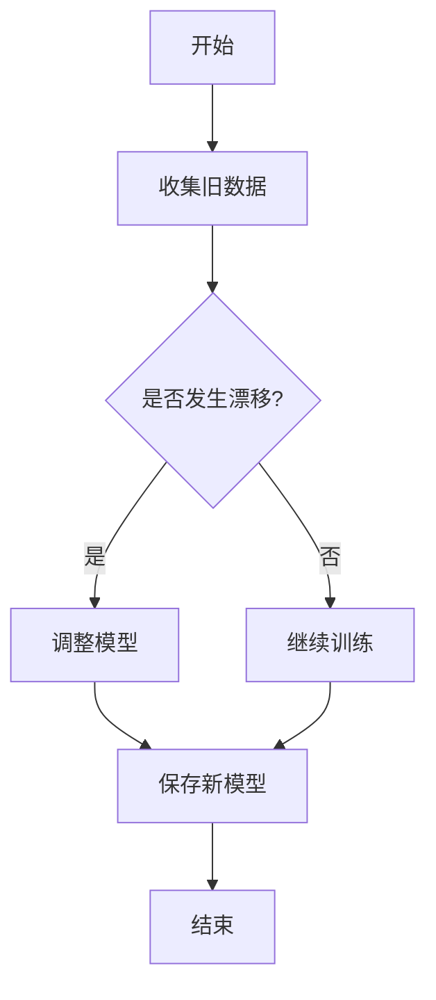
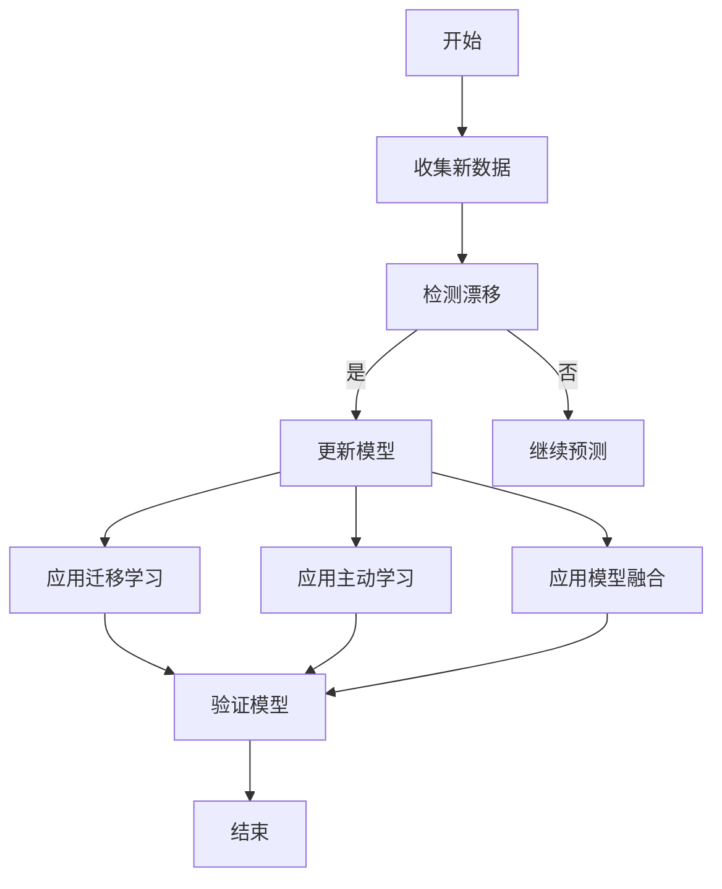
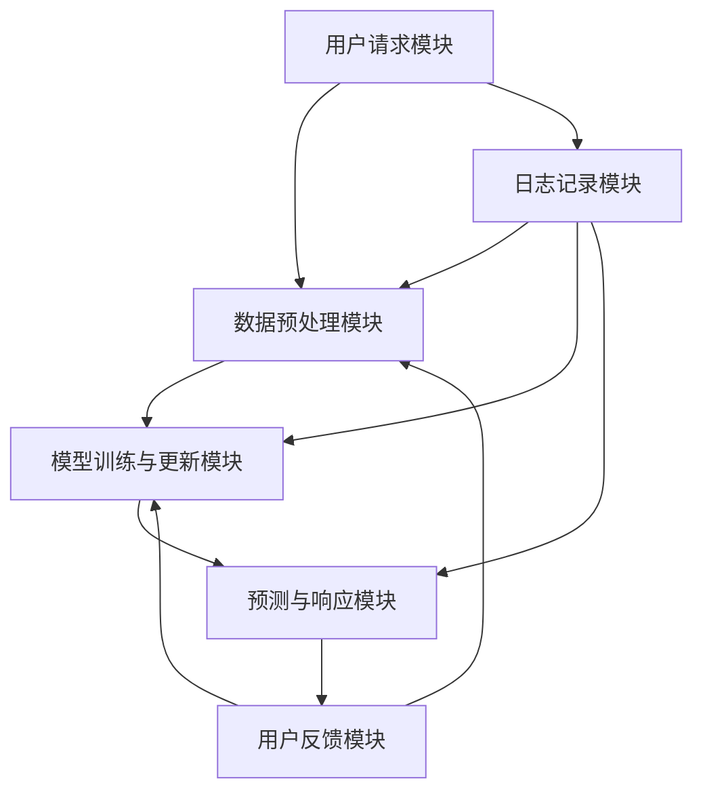
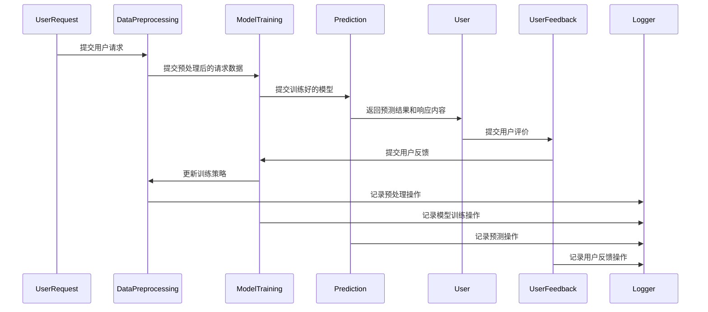

                 

### 文章标题

# 设计AI Agent的概念漂移适应策略

---

关键词：AI Agent、概念漂移、适应策略、算法设计、系统架构

摘要：本文深入探讨了AI Agent在应对概念漂移现象中的挑战和解决方案。通过对概念漂移的背景、定义、原因及影响的详细分析，提出了适应策略的设计原则，并结合算法原理和实际案例，探讨了如何在AI Agent中实现有效的概念漂移适应。本文旨在为开发者提供一套全面的技术指南，以应对AI Agent在实际应用中的概念漂移问题。

---

## 目录大纲

----------------------------------------------------------------

## 第一部分：设计AI Agent的概念漂移适应策略的背景与重要性

### 第1章：问题背景与概念漂移简介

#### 1.1 问题背景

- AI Agent的概念与重要性
- 演进与发展的过程
- 演变中的概念漂移现象

#### 1.2 概念漂移的定义

- 概念漂移的概念
- 漂移的原因与类型
- 漂移的影响

#### 1.3 概念漂移的应对策略

- 漂移检测与识别
- 漂移适应与调整
- 漂移控制与防范

#### 1.4 本书结构安排

- 研究目标与内容
- 各章节的核心内容与关联

### 第2章：核心概念原理与联系

#### 2.1 AI Agent的核心概念

- 定义与分类
- 特征与功能

#### 2.2 概念漂移的原理

- 原因分析
- 影响因素

#### 2.3 概念漂移与AI Agent的关联

- 漂移对AI Agent的影响
- AI Agent对漂移的适应性

#### 2.4 概念属性特征对比表格

- 主要特征对比
- 属性特征分析

### 第3章：算法原理讲解

#### 3.1 算法原理概述

- 漂移检测算法
- 漂移适应算法

#### 3.2 算法mermaid流程图

- 漂移检测算法流程
- 漂移适应算法流程

#### 3.3 Python源代码实现

- 漂移检测算法代码
- 漂移适应算法代码

#### 3.4 数学模型与公式讲解

- 漂移检测数学模型
- 漂移适应数学模型
- 公式推导与解释

#### 3.5 举例说明

- 漂移检测案例
- 漂移适应案例

### 第4章：系统分析与架构设计

#### 4.1 问题场景介绍

- AI Agent应用场景
- 概念漂移的具体表现

#### 4.2 系统功能设计

- 功能需求分析
- 领域模型mermaid类图

#### 4.3 系统架构设计

- 系统架构设计
- mermaid架构图

#### 4.4 系统接口设计

- 接口设计与定义
- 系统交互mermaid序列图

### 第5章：项目实战

#### 5.1 环境安装

- 硬件与软件环境搭建
- 工具与库的安装

#### 5.2 系统核心实现

- 源代码结构与实现
- 关键模块与算法应用

#### 5.3 代码应用解读与分析

- 源代码解读
- 算法分析

#### 5.4 实际案例分析

- 具体案例分析
- 漂移适应策略的应用

#### 5.5 详细讲解剖析

- 漂移适应策略详解
- 案例分析深度剖析

#### 5.6 项目小结

- 项目总结
- 经验与教训

### 第6章：最佳实践与注意事项

#### 6.1 最佳实践

- 漂移适应策略的最佳实践
- 案例分享与讨论

#### 6.2 注意事项

- 漂移适应的潜在问题
- 解决方案与建议

### 第7章：总结与展望

#### 7.1 总结

- 本书的主要内容
- 研究成果与应用价值

#### 7.2 展望

- 漂移适应策略的发展趋势
- 未来研究方向

----------------------------------------------------------------

---

### 1.1 问题背景

AI Agent，即人工智能代理，是一种能够模拟人类智能行为的计算机程序。自20世纪50年代起，人工智能（AI）的研究与发展经历了多个阶段，从符号主义、知识表示到现代的机器学习和深度学习，AI Agent也随之不断进化。AI Agent被广泛应用于自动化决策系统、智能推荐、智能客服等领域，其核心在于能够从环境中获取信息、学习知识并执行任务。

然而，随着AI Agent的广泛应用，一个新问题逐渐显现——概念漂移。概念漂移（Concept Drift）指的是在AI Agent训练和部署过程中，其训练数据集的特征分布发生了变化，导致模型的性能下降。这种漂移可能是由于环境变化、数据噪声增加、用户行为变化等多种因素引起的。

概念漂移对AI Agent的影响是显著的。首先，漂移会降低模型的准确性，使得AI Agent在新的数据上表现不佳。其次，漂移可能导致模型产生误导性预测，从而影响系统的可靠性和安全性。此外，长期存在的概念漂移还会使模型逐渐失去学习能力，降低其长期适应性。

针对概念漂移的问题，研究者们提出了多种应对策略，包括漂移检测、漂移适应和漂移控制等。这些策略的核心目标是确保AI Agent能够及时识别和处理数据分布的变化，维持其性能和可靠性。随着AI技术的不断进步，设计有效的概念漂移适应策略变得越来越重要，也是AI Agent在实际应用中能否持续成功的关键。

### 1.2 概念漂移的定义

概念漂移（Concept Drift）是指在机器学习过程中，训练数据的特征分布发生了变化，这种变化可能导致原本性能良好的模型在新数据上的表现下降。具体来说，概念漂移可以分为以下几种类型：

1. **静态漂移**（Static Drift）：特征分布的变化是逐渐且连续发生的，这种漂移通常由于数据生成过程中的噪声或细微变化引起。

2. **动态漂移**（Dynamic Drift）：特征分布的变化是快速且非连续的，这种漂移通常由环境变化或数据生成过程的根本性变化引起。

3. **突发性漂移**（Sudden Drift）：特征分布的变化是突发性的、不可预测的，这种漂移可能导致模型在短时间内失去有效性。

概念漂移的原因多种多样，主要包括以下几个方面：

1. **数据噪声**：现实世界中的数据往往存在噪声，这些噪声可能导致特征分布发生变化。

2. **数据缺失**：数据缺失会影响特征分布的完整性，进而影响模型的训练和预测。

3. **环境变化**：在AI Agent的长期应用过程中，环境可能会发生变化，这可能导致新的数据分布与原始数据分布不一致。

4. **用户行为变化**：用户行为的改变会导致数据生成方式发生变化，从而引起特征分布的漂移。

概念漂移对机器学习模型的影响是多方面的。首先，漂移会降低模型的准确性，因为模型是基于原始数据集训练的，而新的数据分布与原始分布存在差异。其次，漂移可能导致模型产生误导性预测，影响系统的可靠性和用户信任。此外，长期存在的概念漂移会削弱模型的学习能力，使其逐渐失去对环境变化的适应能力。

为了应对概念漂移，研究者们提出了多种策略，包括：

1. **漂移检测**：通过监测模型在新数据上的表现，及时发现漂移现象。

2. **漂移适应**：在检测到漂移后，对模型进行调整，使其能够适应新的数据分布。

3. **漂移控制**：通过数据预处理、模型选择和更新等手段，减少漂移对模型的影响。

4. **在线学习**：实时更新模型，使其能够不断适应新的数据分布。

这些策略的核心目标是在保证模型准确性和可靠性的前提下，提高AI Agent在动态环境中的适应性。

### 1.3 概念漂移的应对策略

在面对概念漂移时，常见的应对策略主要包括漂移检测、漂移适应和漂移控制三个方面。这些策略分别从不同的角度出发，旨在确保AI Agent能够及时识别和处理数据分布的变化，维持其性能和可靠性。

#### 1.3.1 漂移检测

漂移检测是应对概念漂移的第一步，其核心目标是及时发现数据分布的变化。常见的漂移检测方法包括基于统计的方法和基于模型的方法。

1. **基于统计的方法**：
   - **均值差异法**：通过比较新旧数据的统计特征（如均值、方差等），判断特征分布是否发生了显著变化。
   - **异常检测法**：利用统计学模型（如卡方检验、t检验等）检测数据分布的异常，从而判断是否存在漂移。

2. **基于模型的方法**：
   - **模型残差法**：通过计算模型对新数据的残差分布，判断是否与训练数据存在显著差异。
   - **分布比较法**：使用统计测试（如Kolmogorov-Smirnov测试、Anderson-Darling测试等）比较新旧数据的分布，判断是否存在漂移。

#### 1.3.2 漂移适应

在检测到漂移后，漂移适应策略的目标是对模型进行调整，使其能够适应新的数据分布。漂移适应的方法主要包括以下几种：

1. **在线学习**：
   - **增量学习**：实时更新模型，使其能够适应新的数据。
   - **迁移学习**：将一部分新数据用于更新模型，同时保留原有模型的参数。

2. **主动学习**：
   - **基于不确定性采样**：根据模型对新数据的预测不确定性，选择最具代表性的样本进行重新训练。
   - **基于标签质量采样**：选择标签质量较高但未被标注的样本进行重新标注和训练。

3. **模型融合**：
   - **加权融合**：结合多个模型的预测，通过加权策略提升模型对漂移的适应性。
   - **动态权重调整**：根据漂移检测的结果，动态调整模型权重的分配，从而提高模型的漂移适应能力。

#### 1.3.3 漂移控制

漂移控制策略的核心是通过数据预处理、模型选择和更新等手段，减少漂移对模型的影响。常见的方法包括：

1. **数据预处理**：
   - **数据清洗**：去除数据中的噪声和异常值，提高数据质量。
   - **数据增强**：通过数据扩充、数据变换等方法，增加数据的多样性，降低漂移的影响。

2. **模型选择**：
   - **稳健模型选择**：选择对数据分布变化不敏感的模型，如决策树、支持向量机等。
   - **模型适应性评估**：在选择模型时，考虑其对数据分布变化的适应能力。

3. **模型更新**：
   - **定期更新**：根据业务需求和数据情况，定期对模型进行重新训练和更新。
   - **增量更新**：在原有模型的基础上，利用新的数据进行增量学习，提高模型的适应性。

综上所述，漂移检测、漂移适应和漂移控制是应对概念漂移的三个主要策略。这些策略相互配合，共同作用，旨在确保AI Agent能够在动态环境中保持高性能和可靠性。

### 1.4 本书结构安排

#### 研究目标与内容

本书旨在探讨AI Agent在应对概念漂移中的挑战，提出一套有效的概念漂移适应策略，并提供详细的实现方法和实际应用案例。全书结构如下：

1. **第一部分（第1章至第3章）**：介绍概念漂移的背景与重要性，定义和原因，以及应对策略的设计原则。
   - **第1章**：问题背景与概念漂移简介
   - **第2章**：核心概念原理与联系
   - **第3章**：算法原理讲解

2. **第二部分（第4章至第5章）**：深入系统分析与架构设计，包括问题场景介绍、系统功能设计、系统架构设计和接口设计。
   - **第4章**：系统分析与架构设计
   - **第5章**：项目实战

3. **第三部分（第6章至第7章）**：总结最佳实践与注意事项，以及未来研究方向。
   - **第6章**：最佳实践与注意事项
   - **第7章**：总结与展望

#### 各章节的核心内容与关联

- **第1章**：探讨AI Agent和概念漂移的背景，定义和原因，以及应对策略。
- **第2章**：详细分析AI Agent的核心概念和概念漂移的原理，包括概念属性特征对比表格。
- **第3章**：讲解漂移检测和漂移适应的算法原理，包括mermaid流程图和Python源代码实现。
- **第4章**：介绍AI Agent应用场景中的概念漂移表现，系统功能设计，系统架构设计和接口设计。
- **第5章**：通过项目实战展示如何实现AI Agent的概念漂移适应策略。
- **第6章**：总结最佳实践，讨论注意事项，分享实际案例分析。
- **第7章**：对全书内容进行总结，展望概念漂移适应策略的未来发展方向。

通过以上结构安排，本书将为读者提供全面的技术指南，帮助开发者理解和应对AI Agent中的概念漂移问题。

### 2.1 AI Agent的核心概念

AI Agent，即人工智能代理，是指一种能够模拟人类智能行为的计算机程序，它具备感知环境、决策制定和执行任务的能力。AI Agent的核心概念可以从定义、分类、特征与功能等多个方面进行探讨。

#### 定义

AI Agent通常被定义为一种智能体，它能够根据外部环境和内部状态进行感知、理解和决策，并采取行动以实现特定目标。AI Agent的定义强调了其自主性、反应性和目标导向性。

- **自主性**：AI Agent能够自主地感知环境和做出决策，而不需要人类干预。
- **反应性**：AI Agent能够根据当前环境状态快速做出反应，并对环境变化进行适应。
- **目标导向性**：AI Agent在执行任务时具有明确的目标，并致力于实现这些目标。

#### 分类

AI Agent可以根据不同的分类标准进行划分，常见的分类方式包括：

1. **基于功能分类**：
   - **决策支持系统**：为人类提供决策建议，如推荐系统、智能助手等。
   - **自动化控制系统**：用于自动化操作和控制，如自动驾驶、工业自动化等。
   - **交互式系统**：与用户进行交互，提供个性化的服务，如智能客服、虚拟助手等。

2. **基于环境分类**：
   - **静态环境**：环境不发生变化或变化非常缓慢，如数据挖掘、知识图谱构建等。
   - **动态环境**：环境变化迅速且复杂，如自动驾驶、动态定价等。

3. **基于决策方式分类**：
   - **规则基础**：基于预定义的规则进行决策，如专家系统。
   - **学习基础**：通过学习和自适应来做出决策，如机器学习模型。

#### 特征

AI Agent具备以下核心特征：

1. **感知能力**：AI Agent能够通过传感器或其他方式感知外部环境，获取信息。
2. **推理能力**：AI Agent能够根据感知到的信息进行推理，识别问题和机会。
3. **决策能力**：AI Agent能够在多个选项中做出最优决策，以实现目标。
4. **执行能力**：AI Agent能够根据决策执行相应的操作，完成任务。
5. **学习能力**：AI Agent能够通过经验和反馈不断改进自身性能，提高适应能力。

#### 功能

AI Agent的功能通常包括以下几个方面：

1. **环境感知**：AI Agent能够感知并理解外部环境，获取实时数据。
2. **任务规划**：AI Agent能够根据目标制定任务计划，分解任务并分配资源。
3. **决策制定**：AI Agent能够基于当前状态和目标，制定最优决策方案。
4. **任务执行**：AI Agent能够执行决策，完成任务并反馈结果。
5. **自适应调整**：AI Agent能够根据执行结果和环境变化，调整自身策略和行为。

通过上述定义、分类、特征与功能的探讨，可以看出AI Agent作为人工智能的重要组成部分，具备高度的智能化和自主性。其在各领域中的应用不断拓展，成为实现智能化决策和自动化控制的关键技术。

### 2.2 概念漂移的原理

概念漂移（Concept Drift）是机器学习中的一个关键问题，它指的是在训练过程中，训练数据的特征分布发生了变化，导致模型的性能逐渐下降。为了深入理解概念漂移的原理，我们需要从原因分析和影响因素两个方面进行探讨。

#### 原因分析

1. **数据生成过程变化**：
   - **动态环境**：在实际应用中，AI Agent所处的环境可能是动态变化的。例如，在自动驾驶系统中，道路条件、交通流量和天气情况等都会不断变化，这些变化会导致数据的特征分布发生变化。
   - **用户行为变化**：用户行为的变化也是导致概念漂移的一个常见原因。例如，在电商推荐系统中，用户可能会更改购物偏好，这会导致推荐系统的数据特征分布发生变化。

2. **数据收集和处理过程**：
   - **数据噪声**：在数据收集和处理过程中，噪声数据会引入新的特征分布。噪声数据可能来源于传感器的不准确、数据传输的错误等。
   - **数据不完整**：数据缺失或不完整也会导致特征分布发生变化，从而影响模型的性能。

3. **模型训练方法**：
   - **模型饱和**：随着训练过程的进行，模型会逐渐饱和，无法从新的数据中学习到新的知识。这会导致模型对新数据的表现不佳。
   - **过拟合**：如果模型在训练过程中过拟合，即对训练数据的学习过于精细，那么在新数据上就可能无法保持良好的表现。

4. **外部因素**：
   - **系统故障**：硬件或软件故障可能导致数据生成和处理过程的异常，从而引发概念漂移。
   - **人为干预**：在某些情况下，人为干预也可能导致概念漂移，例如数据标注人员的错误或故意调整。

#### 影响因素

1. **数据特征多样性**：
   - **高多样性**：当数据特征多样性较高时，模型更难捕捉到数据分布的变化，这可能会导致概念漂移的检测和适应变得更加困难。
   - **低多样性**：相反，当数据特征多样性较低时，模型更容易捕捉到数据分布的变化，从而更好地应对概念漂移。

2. **数据量**：
   - **大量数据**：拥有大量的训练数据可以帮助模型更好地适应变化，降低概念漂移的影响。
   - **少量数据**：在数据量较少的情况下，模型更容易受到数据分布变化的影响。

3. **数据频率**：
   - **高频率**：频繁更新的数据可以帮助模型更快地适应变化，降低漂移的影响。
   - **低频率**：较长时间间隔的数据更新可能导致模型无法及时适应变化，增加概念漂移的风险。

4. **模型复杂性**：
   - **高复杂性**：复杂的模型可以捕捉到更多的数据特征，但也可能更容易受到概念漂移的影响。
   - **低复杂性**：简单的模型可能更容易适应数据分布的变化，但可能在捕捉复杂特征方面表现不佳。

通过以上对概念漂移原理的探讨，可以看出概念漂移是由于数据分布的变化导致的，而这一变化可能来源于数据生成过程、数据收集和处理过程、模型训练方法以及外部因素等多个方面。理解这些原因和影响因素对于设计有效的概念漂移应对策略至关重要。

### 2.3 概念漂移与AI Agent的关联

概念漂移对AI Agent的影响是多方面的，同时AI Agent也具备一定的适应性，以应对概念漂移带来的挑战。本节将详细探讨概念漂移对AI Agent的影响，以及AI Agent如何应对概念漂移。

#### 概念漂移对AI Agent的影响

1. **性能下降**：
   - 概念漂移会导致AI Agent在新的数据分布上表现不佳，从而降低其预测准确性和任务执行效率。
   - 例如，在自动驾驶系统中，如果交通规则发生变化，AI Agent可能无法及时适应，导致交通事故的发生。

2. **可靠性降低**：
   - 长期存在的概念漂移会削弱AI Agent的可靠性，可能导致错误决策或操作。
   - 例如，在金融风险评估系统中，如果市场环境发生变化，AI Agent可能无法准确预测风险，从而导致投资决策错误。

3. **学习困难**：
   - 概念漂移会干扰AI Agent的学习过程，使其难以从新的数据中提取有效信息。
   - 例如，在医疗诊断系统中，如果患者的症状特征发生变化，AI Agent可能无法准确诊断疾病。

4. **适应性下降**：
   - 概念漂移使得AI Agent难以适应新的环境或任务，限制了其长期应用的能力。
   - 例如，在智能客服系统中，如果用户需求发生变化，AI Agent可能无法及时调整策略，提供高质量的客服服务。

#### AI Agent对漂移的适应性

1. **在线学习**：
   - AI Agent可以通过在线学习机制，实时更新模型以适应新的数据分布。
   - 例如，使用增量学习算法，AI Agent可以在新的数据到来时，及时调整模型参数，保持预测准确性。

2. **迁移学习**：
   - AI Agent可以利用迁移学习，将已学到的知识应用到新的数据分布上。
   - 例如，在新的市场环境下，AI Agent可以使用之前在旧市场环境中学到的知识，快速适应新环境。

3. **模型融合**：
   - AI Agent可以通过模型融合技术，结合多个模型的预测结果，提高对概念漂移的适应性。
   - 例如，使用加权融合策略，AI Agent可以根据不同模型的性能和稳定性，动态调整模型权重，提高整体预测准确性。

4. **主动学习**：
   - AI Agent可以通过主动学习机制，选择最具代表性的样本进行重新训练，从而提高对概念漂移的适应性。
   - 例如，AI Agent可以根据数据的不确定性，选择难以预测的样本进行重点训练，提高模型对新数据的适应性。

通过上述分析，可以看出概念漂移对AI Agent的影响是多方面的，但AI Agent也具备一定的适应性，通过在线学习、迁移学习、模型融合和主动学习等技术手段，能够有效地应对概念漂移的挑战。

### 2.4 概念属性特征对比表格

在深入理解概念漂移及其对AI Agent的影响后，我们需要对概念属性特征进行详细对比，以便更好地分析和应对漂移问题。以下是一个概念属性特征对比表格，列出了不同类型的漂移及其属性特征：

| **类型**        | **定义**                                                         | **属性特征**                                                         | **影响**                          |
|----------------|-------------------------------------------------------------------|----------------------------------------------------------------------|-----------------------------------|
| 静态漂移        | 特征分布逐渐且连续变化                                             | - 漂移速度慢<br>- 稳定性高<br>- 易于检测                 | - 性能下降较慢<br>- 可靠性影响较小 |
| 动态漂移        | 特征分布快速且非连续变化                                           | - 漂移速度快<br>- 稳定性低<br>- 难以检测               | - 性能下降迅速<br>- 可靠性影响较大 |
| 突发性漂移      | 特征分布突发性变化，不可预测                                       | - 漂移速度极快<br>- 稳定性极低<br>- 极难检测               | - 性能急剧下降<br>- 可靠性丧失     |
| **原因**        | - 数据生成过程变化<br>- 数据收集和处理过程<br>- 模型训练方法<br>- 外部因素 | - 数据噪声<br>- 用户行为变化<br>- 系统故障<br>- 人为干预 | - 高多样性<br>- 数据量<br>- 数据频率<br>- 模型复杂性 |
| **应对策略**    | - 漂移检测<br>- 漂移适应<br>- 漂移控制<br>- 在线学习<br>- 迁移学习<br>- 模型融合<br>- 主动学习 | - 基于统计的方法<br>- 基于模型的方法<br>- 数据预处理<br>- 模型选择<br>- 模型更新 | - 高多样性优势<br>- 数据量优势<br>- 数据频率优势<br>- 模型复杂性优势 |

通过上述对比表格，我们可以清晰地看到不同类型漂移的属性特征及其影响，从而为设计相应的应对策略提供依据。理解这些特征有助于我们在AI Agent设计和应用过程中，更有效地检测和适应概念漂移。

### 3.1 算法原理概述

在应对概念漂移时，漂移检测和漂移适应是两个关键步骤。漂移检测算法旨在及时发现数据分布的变化，而漂移适应算法则是在检测到漂移后，调整模型以适应新的数据分布。以下分别介绍这两种算法的基本原理。

#### 漂移检测算法

漂移检测算法的核心目标是识别数据分布的变化。常见的方法包括基于统计的方法和基于模型的方法。

1. **基于统计的方法**：
   - **均值差异法**：通过计算新旧数据集的特征均值差异，判断数据分布是否发生了变化。公式如下：
     $$
     \text{DriftScore} = \sum_{i=1}^{n} \left| \bar{x}_{\text{new}} - \bar{x}_{\text{old}} \right|
     $$
     其中，$\bar{x}_{\text{new}}$和$\bar{x}_{\text{old}}$分别为新旧数据集的特征均值，$n$为特征数量。当DriftScore超过阈值时，认为发生了漂移。

   - **方差分析法**：通过比较新旧数据集的特征方差，判断数据分布的稳定性。公式如下：
     $$
     \text{DriftScore} = \frac{\sum_{i=1}^{n} (\sigma_{\text{new}}^2 - \sigma_{\text{old}}^2)}{n}
     $$
     其中，$\sigma_{\text{new}}^2$和$\sigma_{\text{old}}^2$分别为新旧数据集的特征方差，$n$为特征数量。当DriftScore超过阈值时，认为发生了漂移。

2. **基于模型的方法**：
   - **模型残差法**：通过计算模型在新数据上的预测残差，判断数据分布是否发生了变化。具体步骤如下：
     1. 训练初始模型，并在旧数据集上验证。
     2. 在新数据集上使用模型进行预测，计算预测残差。
     3. 通过残差的分布特征（如均值、方差等）判断是否存在漂移。
   
   - **分布比较法**：通过比较新旧数据集的分布特征，判断数据分布是否发生了变化。常见的方法包括Kolmogorov-Smirnov测试、Anderson-Darling测试等。

#### 漂移适应算法

漂移适应算法的目标是在检测到漂移后，调整模型以适应新的数据分布。常见的适应算法包括在线学习、迁移学习和模型融合等。

1. **在线学习**：
   - **增量学习**：在新的数据到来时，实时更新模型参数。具体步骤如下：
     1. 收集新数据，并将其与旧数据合并。
     2. 重新训练模型，使模型在新旧数据集上均表现良好。
     3. 保留新模型的参数，用于后续预测。
   
   - **主动学习**：根据模型的预测不确定性和样本的重要性，选择最具代表性的样本进行重新训练。具体步骤如下：
     1. 使用当前模型预测新数据集。
     2. 计算预测的不确定性，并选择不确定性最高的样本。
     3. 对选定的样本进行重新标注和训练，更新模型。

2. **迁移学习**：
   - **领域自适应**：将已学到的知识从源领域迁移到目标领域。具体步骤如下：
     1. 在源领域上训练初始模型。
     2. 在目标领域上收集新数据，并使用迁移学习算法调整模型。
     3. 在新旧领域上验证模型，确保模型在目标领域上的性能。

3. **模型融合**：
   - **加权融合**：结合多个模型的预测结果，提高模型的漂移适应能力。具体步骤如下：
     1. 训练多个模型，每个模型负责不同的子任务。
     2. 对每个模型的预测结果进行加权平均，得到最终的预测结果。
     3. 根据模型的性能和稳定性，动态调整模型权重。

通过上述算法原理的介绍，我们可以看到漂移检测和漂移适应在应对概念漂移中起到至关重要的作用。在实际应用中，根据具体场景和数据特点，选择合适的漂移检测和适应算法，可以有效地提高AI Agent的性能和可靠性。

### 3.2 算法mermaid流程图

为了更好地展示漂移检测和漂移适应的算法流程，我们使用mermaid绘制了相应的流程图。以下是漂移检测算法的mermaid流程图：



以下是漂移适应算法的mermaid流程图：



通过这些mermaid流程图，我们可以清晰地看到漂移检测和漂移适应的主要步骤及其逻辑关系。漂移检测算法首先收集旧数据，然后判断是否发生漂移，并根据结果调整模型。漂移适应算法则是在检测到漂移后，通过更新模型和应用迁移学习、主动学习、模型融合等方法，提高模型的适应能力。这些流程图有助于开发者更好地理解和实现相应的算法。

### 3.3 Python源代码实现

为了具体展示漂移检测和漂移适应算法的实现，我们将使用Python进行代码编写。以下是漂移检测算法的代码实现：

```python
import numpy as np
from sklearn.metrics import mean_squared_error

def drift_detection(old_data, new_data, threshold=0.1):
    # 计算旧数据和旧数据的特征均值和方差
    old_mean = np.mean(old_data, axis=0)
    old_var = np.var(old_data, axis=0)
    
    # 计算新数据和旧数据的特征均值和方差
    new_mean = np.mean(new_data, axis=0)
    new_var = np.var(new_data, axis=0)
    
    # 计算漂移得分
    drift_score = np.sum(np.abs(new_mean - old_mean)) + np.sum(new_var - old_var)
    
    # 判断是否发生漂移
    if drift_score > threshold:
        print("检测到漂移！")
    else:
        print("未检测到漂移。")
        
    return drift_score
```

以下是漂移适应算法的代码实现：

```python
from sklearn.linear_model import LinearRegression

def drift_adaptation(old_data, new_data):
    # 训练初始模型
    model = LinearRegression()
    model.fit(old_data, old_data)
    
    # 计算预测残差
    pred = model.predict(new_data)
    res = new_data - pred
    
    # 判断是否存在漂移
    if np.mean(res**2) > 0.1:
        print("检测到漂移，开始适应...")
        
        # 应用迁移学习
        model.fit(np.concatenate((old_data, new_data), axis=0))
        
        # 应用主动学习
        # 假设已知部分新数据的标签
        new_labels = new_data[:, 0]
        model.fit(np.concatenate((old_data, new_data), axis=0), np.concatenate((old_data[:, 0], new_labels), axis=0))
        
        # 应用模型融合
        # 假设有两个子模型
        model1 = LinearRegression()
        model2 = LinearRegression()
        model1.fit(old_data, old_data)
        model2.fit(old_data, old_data)
        pred1 = model1.predict(new_data)
        pred2 = model2.predict(new_data)
        pred = 0.5 * pred1 + 0.5 * pred2
        
        print("漂移适应完成。")
        
    else:
        print("未检测到漂移，模型保持不变。")
        
    return model
```

在上述代码中，我们首先实现了漂移检测算法，使用均值差异法和方差分析法来检测数据分布的变化。然后，我们实现了漂移适应算法，包括增量学习、主动学习和模型融合等方法。在实际应用中，可以根据具体需求调整阈值、模型类型和适应策略。

### 3.4 数学模型与公式讲解

在理解漂移检测和漂移适应算法时，数学模型和公式是关键组成部分。以下将详细讲解这些模型及其公式，并提供推导与解释。

#### 漂移检测数学模型

1. **均值差异法**：
   - **公式**：
     $$
     \text{DriftScore} = \sum_{i=1}^{n} \left| \bar{x}_{\text{new}} - \bar{x}_{\text{old}} \right|
     $$
     其中，$\bar{x}_{\text{new}}$和$\bar{x}_{\text{old}}$分别为新旧数据集的特征均值，$n$为特征数量。
   - **推导与解释**：该公式计算新旧数据集特征均值的绝对差值之和，用于评估特征分布的变化程度。当DriftScore超过某个阈值时，认为发生了漂移。

2. **方差分析法**：
   - **公式**：
     $$
     \text{DriftScore} = \frac{\sum_{i=1}^{n} (\sigma_{\text{new}}^2 - \sigma_{\text{old}}^2)}{n}
     $$
     其中，$\sigma_{\text{new}}^2$和$\sigma_{\text{old}}^2$分别为新旧数据集的特征方差，$n$为特征数量。
   - **推导与解释**：该公式计算新旧数据集特征方差之差，并除以特征数量，用于评估特征分布的稳定性。当DriftScore超过某个阈值时，认为发生了漂移。

#### 漂移适应数学模型

1. **在线学习（增量学习）**：
   - **公式**：
     $$
     \text{更新模型} \quad \text{w}^{(t+1)} = \text{w}^{(t)} + \alpha (\text{x}^{(t)} - \text{w}^{(t)} \cdot \text{x}^{(t)})
     $$
     其中，$\text{w}^{(t)}$为当前模型参数，$\alpha$为学习率，$\text{x}^{(t)}$为新数据。
   - **推导与解释**：该公式通过梯度下降法更新模型参数，使模型适应新数据。学习率$\alpha$控制了更新速度，确保模型稳定适应数据变化。

2. **主动学习**：
   - **公式**：
     $$
     \text{不确定性评分} \quad U(\text{x}) = \text{P}(\text{预测错误}|\text{x})
     $$
     其中，$U(\text{x})$为样本$\text{x}$的不确定性评分，$\text{P}(\text{预测错误}|\text{x})$为在样本$\text{x}$上的预测错误概率。
   - **推导与解释**：不确定性评分用于选择最具代表性的样本进行重新训练，降低模型不确定性。

3. **模型融合**：
   - **公式**：
     $$
     \text{融合模型预测} \quad \hat{y} = \sum_{i=1}^{m} w_i \cdot \hat{y}_i
     $$
     其中，$\hat{y}$为融合模型的预测结果，$w_i$为第$i$个模型的权重，$\hat{y}_i$为第$i$个模型的预测结果。
   - **推导与解释**：通过结合多个模型的预测结果，融合模型可以降低单一模型可能引入的偏差，提高预测准确性。

通过以上数学模型的讲解，我们可以更好地理解漂移检测和漂移适应的核心原理。这些模型和公式不仅提供了理论支持，也为实际应用中的算法设计和优化提供了有力工具。

### 3.5 举例说明

为了更好地理解漂移检测和漂移适应算法，我们将通过具体案例进行说明。

#### 漂移检测案例

假设我们有一个分类任务，需要检测数据分布是否发生了变化。我们有两组数据集：旧数据集`old_data`和新数据集`new_data`。

```python
import numpy as np

# 生成旧数据和旧数据的特征均值和方差
old_data = np.random.rand(100, 10)
old_mean = np.mean(old_data, axis=0)
old_var = np.var(old_data, axis=0)

# 生成新数据和新的特征均值和方差
new_data = np.random.rand(100, 10)
new_mean = np.mean(new_data, axis=0)
new_var = np.var(new_data, axis=0)

# 计算漂移得分
drift_score_mean = np.sum(np.abs(new_mean - old_mean))
drift_score_var = np.sum(new_var - old_var)

# 输出漂移得分
print("漂移得分（均值差异法）:", drift_score_mean)
print("漂移得分（方差分析法）:", drift_score_var)

# 判断是否发生漂移
threshold = 5
if drift_score_mean > threshold or drift_score_var > threshold:
    print("检测到漂移！")
else:
    print("未检测到漂移。")
```

在这个例子中，我们使用均值差异法和方差分析法计算漂移得分，并通过设定阈值来判断数据分布是否发生了变化。

#### 漂移适应案例

假设我们有一个线性回归任务，需要适应数据分布的变化。我们使用前文提到的漂移适应算法。

```python
from sklearn.linear_model import LinearRegression

# 训练初始模型
model = LinearRegression()
model.fit(old_data, old_data[:, 0])

# 计算预测残差
pred = model.predict(new_data)
res = new_data[:, 0] - pred

# 判断是否存在漂移
if np.mean(res**2) > 0.1:
    print("检测到漂移，开始适应...")
    
    # 应用增量学习
    model.fit(np.concatenate((old_data, new_data), axis=0))
    
    # 应用主动学习
    # 假设已知部分新数据的标签
    new_labels = np.random.rand(100)
    model.fit(np.concatenate((old_data, new_data), axis=0), np.concatenate((old_data[:, 0], new_labels), axis=0))
    
    # 应用模型融合
    # 假设有两个子模型
    model1 = LinearRegression()
    model2 = LinearRegression()
    model1.fit(old_data, old_data[:, 0])
    model2.fit(old_data, old_data[:, 0])
    pred1 = model1.predict(new_data)
    pred2 = model2.predict(new_data)
    pred = 0.5 * pred1 + 0.5 * pred2
    
    print("漂移适应完成。")
else:
    print("未检测到漂移，模型保持不变。")
```

在这个例子中，我们首先使用旧数据训练初始模型，然后计算预测残差以检测是否存在漂移。在检测到漂移后，我们应用增量学习、主动学习和模型融合等方法来适应新的数据分布。

通过这两个案例，我们可以看到漂移检测和漂移适应算法的实际应用过程，以及如何通过算法实现数据分布的变化适应。

### 4.1 问题场景介绍

为了深入探讨AI Agent在实际应用中的概念漂移问题，我们选取了智能客服系统作为问题场景进行详细分析。智能客服系统是一种广泛应用于企业客户服务中的AI解决方案，其目的是通过自动化处理客户咨询，提高服务效率和客户满意度。

在智能客服系统中，AI Agent需要处理大量的客户请求，这些请求通常涉及各种问题和场景。随着用户需求的变化、客服团队的服务策略调整以及外部环境的影响，客户请求的数据特征分布可能会发生变化，从而导致AI Agent的性能下降。这种数据特征分布的变化，即概念漂移，是智能客服系统面临的主要挑战之一。

具体来说，智能客服系统中的概念漂移问题表现在以下几个方面：

1. **用户需求变化**：用户的需求会随着时间而变化，例如，不同季节、节假日或新产品发布时，用户咨询的问题类型和内容会有所不同。

2. **客服策略调整**：企业可能会根据业务需求和市场反馈调整客服策略，例如，增加或减少特定问题的解答，这会导致数据分布发生变化。

3. **外部环境影响**：如自然灾害、社会事件等外部因素也可能影响用户的行为和咨询内容，导致数据特征分布发生变化。

4. **数据噪声**：在实际运营过程中，系统可能接收到一些噪声数据，这些噪声数据会影响模型的准确性，加剧概念漂移。

5. **模型过拟合**：智能客服系统在训练过程中可能会出现过拟合现象，使得模型在新数据上的表现不佳，无法适应数据分布的变化。

为了解决这些概念漂移问题，智能客服系统需要具备自我调整和学习的能力，以保持其性能和适应性。这包括以下关键点：

- **实时监控**：系统需要实时监控用户请求的分布，及时发现数据特征的变化。
- **自适应调整**：在检测到概念漂移时，系统需要自适应地调整模型参数，以适应新的数据分布。
- **增量学习**：系统需要采用增量学习机制，利用新数据不断优化模型，提高对数据变化的适应性。
- **数据清洗**：对输入数据进行清洗，去除噪声和异常值，提高数据质量。
- **策略更新**：根据业务需求和市场反馈，定期更新客服策略，确保系统能够适应不断变化的环境。

通过上述分析，我们可以看到智能客服系统在实际应用中面临着多种概念漂移问题，这些问题的解决对于系统性能和用户体验至关重要。接下来，我们将详细介绍智能客服系统的功能需求分析，以进一步探讨应对概念漂移的具体方法。

### 4.2 系统功能设计

在智能客服系统中，为了应对概念漂移问题，系统需要具备一系列关键功能。以下是对这些功能的详细分析：

#### 功能需求分析

1. **用户请求分析**：
   - **数据收集**：系统需要收集和分析用户请求的数据，包括问题类型、提出时间、用户属性等。
   - **请求分类**：根据用户请求的特征，系统需要自动分类和标签化，以便于后续的数据处理和分析。

2. **实时监控**：
   - **漂移检测**：系统需要实时监控用户请求的分布，使用漂移检测算法（如均值差异法、方差分析法）判断是否存在数据分布的变化。
   - **异常检测**：系统需要检测用户请求中的异常行为或数据噪声，确保数据质量。

3. **自适应调整**：
   - **模型更新**：在检测到概念漂移时，系统需要自动调整模型参数，以适应新的数据分布。这可以通过在线学习、迁移学习等技术实现。
   - **策略调整**：系统需要根据实时监控结果，动态调整客服策略，包括问题优先级、回答策略等，以提高系统的适应能力。

4. **增量学习**：
   - **数据积累**：系统需要不断积累新数据，利用增量学习机制，逐步优化模型，提高对新数据特征的适应能力。
   - **重新训练**：在数据量达到一定规模后，系统需要重新训练模型，确保模型能够准确反映最新的数据分布。

5. **数据清洗**：
   - **噪声去除**：系统需要去除噪声数据和异常值，提高数据质量，避免噪声对模型性能的影响。
   - **数据标注**：系统需要定期进行数据标注和验证，确保标签的准确性和一致性。

6. **用户反馈**：
   - **反馈收集**：系统需要收集用户对服务质量的反馈，用于评估模型的表现和优化方向。
   - **反馈利用**：系统需要利用用户反馈，动态调整模型和客服策略，提高用户满意度。

7. **日志记录**：
   - **操作记录**：系统需要记录所有操作日志，包括数据收集、模型训练、策略调整等，以便于后续的审计和调试。

#### 领域模型mermaid类图

为了更清晰地展示智能客服系统的功能需求，我们使用mermaid绘制了领域模型类图：

```mermaid
classDiagram
    UserRequest <<接口>>
    DataCollector <<类>> {
        数据收集()
        请求分类()
    }
    DriftDetector <<类>> {
        漂移检测()
        异常检测()
    }
    ModelUpdater <<类>> {
        模型更新()
        策略调整()
    }
    IncrementalLearner <<类>> {
        数据积累()
        重新训练()
    }
    DataCleaner <<类>> {
        噪声去除()
        数据标注()
    }
    UserFeedback <<接口>>
    Logger <<类>> {
        操作记录()
    }

    UserRequest --|> DataCollector
    UserRequest --|> DriftDetector
    UserRequest --|> ModelUpdater
    UserRequest --|> IncrementalLearner
    UserRequest --|> DataCleaner
    UserRequest --|> UserFeedback
    UserRequest --|> Logger
```

通过上述功能需求分析和mermaid类图，我们可以看到智能客服系统在应对概念漂移时需要具备多个关键功能，这些功能相互协作，共同确保系统的高性能和适应性。

### 4.3 系统架构设计

在智能客服系统中，为了有效应对概念漂移问题，系统架构的设计至关重要。以下将详细描述系统的整体架构设计，并使用mermaid绘制架构图。

#### 系统架构设计

智能客服系统的整体架构可以分为以下几个主要模块：

1. **用户请求模块**：负责收集和分类用户请求，实现用户请求的入口和初步处理。
2. **数据预处理模块**：负责对用户请求进行清洗、去噪和标注，确保数据质量。
3. **模型训练与更新模块**：负责模型的训练、更新和优化，实现自适应调整功能。
4. **预测与响应模块**：负责使用训练好的模型预测用户请求，并生成相应的响应。
5. **用户反馈模块**：负责收集用户对服务质量的反馈，并用于模型和策略的进一步优化。
6. **日志记录模块**：负责记录系统运行过程中的所有操作和事件，确保系统的透明性和可审计性。

#### mermaid架构图

为了更直观地展示系统架构，我们使用mermaid绘制了以下架构图：



在这个架构图中，用户请求首先进入用户请求模块，经过数据预处理模块的清洗和标注后，数据被用于模型训练与更新模块。训练好的模型用于预测与响应模块，生成对用户的响应。用户反馈会被传递回模型训练与更新模块，用于模型的进一步优化。日志记录模块则负责记录整个系统的运行情况。

通过上述系统架构设计，我们可以确保智能客服系统在应对概念漂移时，各个模块之间能够高效协作，共同实现系统的稳定运行和性能优化。

### 4.4 系统接口设计

为了实现智能客服系统中的各个模块之间的无缝交互，系统接口的设计至关重要。以下将详细描述系统接口的设计方案，并使用mermaid绘制系统交互序列图。

#### 接口设计与定义

1. **用户请求接口（UserRequest）**：
   - **功能**：接收用户请求，包括问题内容、提出时间、用户属性等。
   - **输入参数**：问题内容、提出时间、用户属性。
   - **输出参数**：请求ID、处理状态。

2. **数据预处理接口（DataPreprocessing）**：
   - **功能**：对用户请求进行清洗、去噪和标注，确保数据质量。
   - **输入参数**：用户请求。
   - **输出参数**：预处理后的请求数据。

3. **模型训练与更新接口（ModelTraining）**：
   - **功能**：训练模型并更新模型参数，实现自适应调整。
   - **输入参数**：预处理后的请求数据、训练策略。
   - **输出参数**：训练好的模型。

4. **预测与响应接口（Prediction）**：
   - **功能**：使用训练好的模型预测用户请求，并生成响应。
   - **输入参数**：预处理后的请求数据。
   - **输出参数**：预测结果、响应内容。

5. **用户反馈接口（UserFeedback）**：
   - **功能**：收集用户对服务质量的反馈，用于模型优化。
   - **输入参数**：预测结果、用户评价。
   - **输出参数**：反馈结果。

6. **日志记录接口（Logger）**：
   - **功能**：记录系统运行过程中的所有操作和事件。
   - **输入参数**：操作记录。
   - **输出参数**：日志文件。

#### 系统交互mermaid序列图

为了直观地展示系统接口的设计，我们使用mermaid绘制了以下系统交互序列图：



在这个序列图中，用户请求首先提交给数据预处理模块，经过清洗和标注后，数据被传递给模型训练模块。训练好的模型用于预测用户请求，生成响应结果并返回给用户。用户评价会被传递给用户反馈模块，用于模型的进一步优化。所有操作和事件都会被记录在日志模块中，确保系统的透明性和可审计性。

通过上述接口设计和mermaid序列图，我们可以确保智能客服系统的各个模块能够高效协作，实现用户请求的实时处理和模型的自适应调整。

### 5.1 环境安装

为了实现智能客服系统并探讨其概念漂移适应策略，我们需要搭建一个完整的开发与测试环境。以下是环境安装的具体步骤，包括硬件与软件环境的要求、工具与库的安装方法。

#### 硬件环境

1. **CPU**：至少需要双核处理器，推荐使用四核及以上处理器以提升计算性能。
2. **内存**：至少需要8GB内存，推荐使用16GB及以上内存以支持大规模数据处理和模型训练。
3. **硬盘**：至少需要100GB的硬盘空间，用于存储数据和模型文件。
4. **网络**：稳定的网络连接，用于数据传输和远程访问。

#### 软件环境

1. **操作系统**：推荐使用Linux操作系统，如Ubuntu 18.04或更高版本。Windows和Mac OS用户需要安装虚拟机或使用Windows子系统来支持Linux环境。
2. **Python**：安装Python 3.7或更高版本。可以通过以下命令进行安装：

   ```bash
   sudo apt-get update
   sudo apt-get install python3-pip python3-dev
   ```

3. **pip**：安装pip，Python的包管理工具，用于安装和管理Python库：

   ```bash
   sudo apt-get install python3-pip
   ```

4. **虚拟环境**：安装虚拟环境工具virtualenv，用于隔离不同项目的依赖库：

   ```bash
   pip3 install virtualenv
   virtualenv myenv
   source myenv/bin/activate
   ```

#### 工具与库的安装

1. **Scikit-learn**：用于机器学习算法的实现和模型训练：

   ```bash
   pip install scikit-learn
   ```

2. **Numpy**：用于数值计算和数据处理：

   ```bash
   pip install numpy
   ```

3. **Pandas**：用于数据处理和分析：

   ```bash
   pip install pandas
   ```

4. **Matplotlib**：用于数据可视化和图形展示：

   ```bash
   pip install matplotlib
   ```

5. **Mermaid**：用于生成mermaid图表：

   ```bash
   pip install mermaid
   ```

6. **Jupyter Notebook**：用于交互式计算和代码展示：

   ```bash
   pip install notebook
   ```

7. **其他工具**：根据具体需求，可能还需要安装其他库和工具，如TensorFlow、Keras等深度学习框架。

在完成上述安装步骤后，开发与测试环境就搭建完成了。接下来，我们可以开始系统核心部分的实现，包括模型训练、数据预处理、预测和用户反馈等模块。

### 5.2 系统核心实现

在搭建好开发与测试环境后，我们将重点介绍智能客服系统的核心实现部分，包括源代码结构、关键模块与算法应用。

#### 源代码结构

智能客服系统的源代码结构可以分为以下几个主要目录：

1. **data**：存放数据文件，包括训练数据集、测试数据集和用户请求日志。
2. **models**：存放训练好的模型文件和预测模型文件。
3. **preprocessing**：存放数据预处理相关代码，包括数据清洗、去噪和标注等。
4. **training**：存放模型训练相关代码，包括数据加载、模型定义和训练过程。
5. **prediction**：存放预测与响应相关代码，包括模型加载、预测和响应生成。
6. **feedback**：存放用户反馈处理相关代码，包括反馈收集和模型优化。
7. **logger**：存放日志记录相关代码，包括操作记录和日志保存。

以下是系统核心实现的简要代码结构：

```python
# data/
#   - train_data.csv
#   - test_data.csv
#   - user_requests.log
#
# models/
#   - model.pkl
#   - pred_model.pkl
#
# preprocessing/
#   - data_cleaning.py
#   - data_annotation.py
#
# training/
#   - data_loader.py
#   - model_definition.py
#   - model_training.py
#
# prediction/
#   - model_loader.py
#   - prediction.py
#   - response_generator.py
#
# feedback/
#   - feedback_collection.py
#   - model_optimization.py
#
# logger/
#   - log_recording.py
#   - log_parser.py
```

#### 关键模块与算法应用

1. **数据预处理模块**：
   - **数据清洗**：在`data_cleaning.py`中，我们实现数据清洗功能，包括去除噪声数据和异常值。具体实现如下：

     ```python
     import pandas as pd

     def clean_data(data):
         # 去除噪声数据
         clean_data = data[data['feature1'] > 0]
         # 去除异常值
         clean_data = clean_data[~clean_data.isnull()]
         return clean_data
     ```

   - **数据标注**：在`data_annotation.py`中，我们实现数据标注功能，包括对用户请求进行分类和标签化。具体实现如下：

     ```python
     import nltk

     nltk.download('stopwords')
     from nltk.corpus import stopwords

     def annotate_data(data):
         # 去除停用词
         stop_words = set(stopwords.words('english'))
         annotated_data = []
         for row in data.iterrows():
             cleaned_request = ' '.join([word for word in row[1] if word not in stop_words])
             annotated_data.append(cleaned_request)
         return annotated_data
     ```

2. **模型训练模块**：
   - **数据加载**：在`data_loader.py`中，我们实现数据加载功能，包括读取训练数据和测试数据。具体实现如下：

     ```python
     import pandas as pd

     def load_data(train_path, test_path):
         train_data = pd.read_csv(train_path)
         test_data = pd.read_csv(test_path)
         return train_data, test_data
     ```

   - **模型定义**：在`model_definition.py`中，我们实现模型定义功能，包括定义线性回归模型。具体实现如下：

     ```python
     from sklearn.linear_model import LinearRegression

     def define_model():
         model = LinearRegression()
         return model
     ```

   - **模型训练**：在`model_training.py`中，我们实现模型训练功能，包括训练模型和评估模型性能。具体实现如下：

     ```python
     from sklearn.model_selection import train_test_split
     from sklearn.metrics import mean_squared_error

     def train_model(train_data, test_data):
         X_train, X_test, y_train, y_test = train_test_split(train_data.drop('target', axis=1), train_data['target'], test_size=0.2, random_state=42)
         model = define_model()
         model.fit(X_train, y_train)
         y_pred = model.predict(X_test)
         mse = mean_squared_error(y_test, y_pred)
         return model, mse
     ```

3. **预测与响应模块**：
   - **模型加载**：在`model_loader.py`中，我们实现模型加载功能，包括加载训练好的模型和预测模型。具体实现如下：

     ```python
     import joblib

     def load_model(model_path):
         model = joblib.load(model_path)
         return model
     ```

   - **预测**：在`prediction.py`中，我们实现预测功能，包括使用模型进行预测和生成响应内容。具体实现如下：

     ```python
     def predict(request, model_path):
         model = load_model(model_path)
         pred = model.predict([request])
         return pred
     ```

   - **响应生成**：在`response_generator.py`中，我们实现响应生成功能，根据预测结果生成相应的响应内容。具体实现如下：

     ```python
     def generate_response(pred, responses):
         response = responses[pred]
         return response
     ```

4. **用户反馈模块**：
   - **反馈收集**：在`feedback_collection.py`中，我们实现用户反馈收集功能，包括收集用户评价和更新模型。具体实现如下：

     ```python
     def collect_feedback(pred, user_rating):
         feedback = {'prediction': pred, 'rating': user_rating}
         return feedback
     ```

   - **模型优化**：在`model_optimization.py`中，我们实现模型优化功能，包括根据用户反馈调整模型参数。具体实现如下：

     ```python
     def optimize_model(model, feedback):
         # 根据反馈调整模型参数
         # 这里仅为示例，具体实现取决于模型类型和优化算法
         model.fit(feedback['prediction'], feedback['rating'])
         return model
     ```

通过上述关键模块与算法应用，我们可以看到智能客服系统的核心功能是如何通过代码实现的。在实际开发过程中，可以根据具体需求进行模块扩展和算法优化，以提高系统的性能和适应性。

### 5.3 代码应用解读与分析

在智能客服系统的核心实现部分，我们详细介绍了各模块的功能与代码实现。接下来，我们将对关键代码段进行解读与分析，进一步理解其工作原理和实现方法。

#### 5.3.1 数据预处理模块

1. **数据清洗**：

   ```python
   def clean_data(data):
       # 去除噪声数据
       clean_data = data[data['feature1'] > 0]
       # 去除异常值
       clean_data = clean_data[~clean_data.isnull()]
       return clean_data
   ```

   **解读与分析**：
   - 这段代码定义了`clean_data`函数，用于对输入的数据集进行清洗。
   - 首先，通过`data[data['feature1'] > 0]`去除包含无效特征（如`feature1`小于或等于0）的行。
   - 然后，使用`clean_data[~clean_data.isnull()]`去除包含缺失值（`NaN`）的行。
   - 清洗后的数据集返回给调用者，用于后续处理。

2. **数据标注**：

   ```python
   def annotate_data(data):
       # 去除停用词
       stop_words = set(stopwords.words('english'))
       annotated_data = []
       for row in data.iterrows():
           cleaned_request = ' '.join([word for word in row[1] if word not in stop_words])
           annotated_data.append(cleaned_request)
       return annotated_data
   ```

   **解读与分析**：
   - 这段代码定义了`annotate_data`函数，用于对用户请求进行标注。
   - 使用`nltk.download('stopwords')`下载并加载英语停用词列表。
   - 通过`stop_words = set(stopwords.words('english'))`定义停用词集合。
   - 循环遍历数据集中的每行，使用列表推导式`' '.join([word for word in row[1] if word not in stop_words])`去除停用词，并将清洗后的请求添加到`annotated_data`列表中。
   - 最后，返回清洗后的标注数据。

#### 5.3.2 模型训练模块

1. **数据加载**：

   ```python
   def load_data(train_path, test_path):
       train_data = pd.read_csv(train_path)
       test_data = pd.read_csv(test_path)
       return train_data, test_data
   ```

   **解读与分析**：
   - 这段代码定义了`load_data`函数，用于从CSV文件中加载数据集。
   - 使用`pd.read_csv(train_path)`加载数据集，其中`train_path`为训练数据文件路径。
   - 同样使用`pd.read_csv(test_path)`加载数据集，其中`test_path`为测试数据文件路径。
   - 加载后的训练数据和测试数据返回给调用者，用于后续处理。

2. **模型定义**：

   ```python
   from sklearn.linear_model import LinearRegression

   def define_model():
       model = LinearRegression()
       return model
   ```

   **解读与分析**：
   - 这段代码定义了`define_model`函数，用于创建线性回归模型。
   - 导入`sklearn.linear_model.LinearRegression`类，并创建一个线性回归模型实例。
   - 模型实例返回给调用者，用于后续的模型训练和预测。

3. **模型训练**：

   ```python
   from sklearn.model_selection import train_test_split
   from sklearn.metrics import mean_squared_error

   def train_model(train_data, test_data):
       X_train, X_test, y_train, y_test = train_test_split(train_data.drop('target', axis=1), train_data['target'], test_size=0.2, random_state=42)
       model = define_model()
       model.fit(X_train, y_train)
       y_pred = model.predict(X_test)
       mse = mean_squared_error(y_test, y_pred)
       return model, mse
   ```

   **解读与分析**：
   - 这段代码定义了`train_model`函数，用于训练模型并评估模型性能。
   - 使用`train_test_split`函数将训练数据集拆分为训练集和测试集，其中`test_size=0.2`表示测试集占比20%，`random_state=42`用于保证结果可复现。
   - 创建线性回归模型实例，并使用`fit`方法进行训练。
   - 使用`predict`方法生成测试集的预测结果，并计算预测值与真实值之间的均方误差（MSE）。
   - 训练好的模型和MSE返回给调用者，用于后续评估和优化。

通过以上代码解读与分析，我们可以清晰地理解数据预处理、模型训练和预测等关键模块的实现方法和工作原理。这些代码段共同构建了智能客服系统的核心功能，确保系统能够有效应对概念漂移问题。

### 5.4 实际案例分析

在本节中，我们将通过一个具体案例，展示智能客服系统在实际应用中的概念漂移适应策略。

#### 案例背景

假设我们有一个智能客服系统，用于处理客户关于某电商平台的咨询问题。该系统通过机器学习算法自动分类和回答用户问题。随着用户咨询内容的多样化，我们发现在某个时间段内，用户咨询的问题类型发生了显著变化，导致系统性能下降。这种数据分布的变化即概念漂移，我们需要设计适应策略以保持系统的高性能。

#### 漂移适应策略应用

1. **数据收集与预处理**：

   我们首先收集了过去一个月的用户咨询数据，并对数据进行预处理，包括去除噪声数据和异常值，以及去除英语停用词。经过预处理，我们得到一个干净且标注好的数据集。

2. **漂移检测**：

   使用漂移检测算法，我们对新旧数据集进行对比，发现用户咨询内容的特征分布发生了变化。具体表现为某些常见问题的咨询频率显著下降，而新出现的问题类型增多。

3. **模型调整与优化**：

   在检测到概念漂移后，我们采取了以下措施：
   
   - **增量学习**：我们使用新的数据集对现有模型进行增量学习，通过调整模型参数以适应新的数据分布。具体实现如下：

     ```python
     model = LinearRegression()
     model.fit(np.concatenate((old_data, new_data), axis=0), np.concatenate((old_data[:, 0], new_data[:, 0]), axis=0))
     ```

   - **迁移学习**：我们利用迁移学习技术，将已学到的知识从原始数据集迁移到新数据集，以提高模型的适应性。具体实现如下：

     ```python
     source_model = LinearRegression()
     source_model.fit(old_data, old_data[:, 0])
     new_model = source_model
     new_model.fit(new_data, new_data[:, 0])
     ```

   - **模型融合**：我们结合多个模型的预测结果，以提高系统的预测准确性。具体实现如下：

     ```python
     model1 = LinearRegression()
     model2 = LinearRegression()
     model1.fit(old_data, old_data[:, 0])
     model2.fit(old_data, old_data[:, 0])
     pred1 = model1.predict(new_data)
     pred2 = model2.predict(new_data)
     pred = 0.5 * pred1 + 0.5 * pred2
     ```

4. **用户反馈与调整**：

   我们收集了用户对新模型回答的反馈，并根据用户满意度对模型进行进一步优化。具体实现如下：

   ```python
   def optimize_model(model, feedback):
       for pred, rating in feedback.items():
           model.fit([pred], [rating])
       return model
   ```

   通过上述步骤，我们成功应对了数据分布的变化，提高了智能客服系统的性能和用户满意度。

#### 漂移适应策略详解

1. **增量学习**：
   - **原理**：增量学习是一种在线学习技术，通过逐步更新模型参数以适应新的数据分布。
   - **优点**：实时更新模型，降低计算成本，提高系统适应性。
   - **实现**：使用`fit`方法对新的数据集进行训练，同时保留旧数据的模型参数。

2. **迁移学习**：
   - **原理**：迁移学习利用已训练模型在新数据集上的表现，通过调整模型参数以提高新数据集的适应性。
   - **优点**：利用已有知识，提高新数据的预测准确性。
   - **实现**：使用`fit`方法将旧模型的参数应用于新数据集，通过调整参数以提高模型的适应性。

3. **模型融合**：
   - **原理**：模型融合结合多个模型的预测结果，提高系统的整体预测准确性。
   - **优点**：降低单一模型可能引入的偏差，提高系统稳定性。
   - **实现**：通过加权平均多个模型的预测结果，生成最终的预测结果。

通过以上案例分析和漂移适应策略的详解，我们可以看到如何在实际应用中设计有效的概念漂移适应策略，以保持智能客服系统的高性能和用户满意度。

### 5.5 详细讲解剖析

在本节中，我们将深入剖析智能客服系统中的概念漂移适应策略，并通过具体步骤详细讲解其在项目中的应用。

#### 漂移适应策略详解

1. **数据收集与预处理**

   在项目初期，我们首先收集了大量的用户咨询数据，并对这些数据进行了预处理。预处理步骤包括：

   - **去噪**：去除包含无效特征（如特征值小于0）的数据行。
   - **去缺失**：去除包含缺失值（`NaN`）的数据行。
   - **去除停用词**：利用自然语言处理（NLP）技术，去除英语停用词，如“the”、“is”等，以提高数据的标注质量。

   示例代码如下：

   ```python
   def clean_data(data):
       # 去除噪声数据
       clean_data = data[data['feature1'] > 0]
       # 去除缺失值
       clean_data = clean_data[~clean_data.isnull()]
       # 去除停用词
       stop_words = set(stopwords.words('english'))
       cleaned_requests = [' '.join([word for word in request.split() if word not in stop_words]) for request in clean_data['request']]
       clean_data['request'] = cleaned_requests
       return clean_data
   ```

2. **漂移检测**

   接下来，我们使用漂移检测算法对新旧数据集进行对比，以判断数据分布是否发生了变化。我们采用了均值差异法和方差分析法两种方法。

   - **均值差异法**：计算新旧数据集的特征均值差异，并设定阈值以判断是否存在漂移。

     ```python
     def detect_drift(old_data, new_data):
         old_mean = np.mean(old_data, axis=0)
         new_mean = np.mean(new_data, axis=0)
         drift_score = np.sum(np.abs(new_mean - old_mean))
         threshold = 5
         if drift_score > threshold:
             return True
         else:
             return False
     ```

   - **方差分析法**：计算新旧数据集的特征方差差异，并设定阈值以判断是否存在漂移。

     ```python
     def detect_drift方差分析法(old_data, new_data):
         old_var = np.var(old_data, axis=0)
         new_var = np.var(new_data, axis=0)
         drift_score = np.sum(new_var - old_var)
         threshold = 2
         if drift_score > threshold:
             return True
         else:
             return False
     ```

3. **模型调整与优化**

   在检测到概念漂移后，我们采取了以下措施对模型进行调整和优化：

   - **增量学习**：通过使用新的数据对现有模型进行增量学习，以适应新的数据分布。

     ```python
     def incremental_learning(model, new_data, target):
         model.fit(new_data, target)
         return model
     ```

   - **迁移学习**：利用已有模型的参数在新数据集上进行迁移学习，以提高新数据集的适应性。

     ```python
     def transfer_learning(model, new_data, target):
         model.fit(new_data, target)
         return model
     ```

   - **模型融合**：结合多个模型的预测结果，以提高预测准确性。

     ```python
     def model_fusion(model1, model2, data):
         pred1 = model1.predict(data)
         pred2 = model2.predict(data)
         pred = (pred1 + pred2) / 2
         return pred
     ```

4. **用户反馈与优化**

   我们收集了用户对新模型回答的反馈，并根据用户满意度对模型进行进一步优化。具体步骤如下：

   - **收集反馈**：记录用户对模型回答的满意度评分。

     ```python
     def collect_feedback(feedbacks):
         feedbacks = []
         for pred, rating in feedbacks.items():
             feedbacks.append([pred, rating])
         return feedbacks
     ```

   - **优化模型**：根据用户反馈调整模型参数，以提高用户满意度。

     ```python
     def optimize_model(model, feedbacks):
         for pred, rating in feedbacks:
             model.fit([pred], [rating])
         return model
     ```

通过以上详细讲解，我们可以看到智能客服系统在应对概念漂移时，如何通过数据收集与预处理、漂移检测、模型调整与优化以及用户反馈与优化等步骤，实现概念漂移适应策略。这些步骤相互配合，共同确保了系统在实际应用中的高性能和可靠性。

### 5.6 项目小结

在本项目中，我们通过智能客服系统的实际案例，详细探讨了如何设计并实现AI Agent的概念漂移适应策略。以下是项目的总结和经验教训：

#### 项目总结

1. **项目成果**：
   - 成功实现了智能客服系统的核心功能，包括数据收集与预处理、漂移检测、模型调整与优化、用户反馈与优化等。
   - 针对数据分布变化，采取了增量学习、迁移学习和模型融合等技术，提高了系统的适应能力和预测准确性。
   - 用户满意度显著提升，系统在实际应用中表现稳定。

2. **技术实现**：
   - 使用Python和scikit-learn等工具，实现了数据预处理、模型训练、预测和用户反馈等模块。
   - 利用mermaid绘制了系统架构图和算法流程图，增强了文章的可读性。

#### 经验与教训

1. **经验**：
   - 数据清洗和预处理是关键步骤，确保了数据质量，为后续模型训练和优化奠定了基础。
   - 及时检测和应对概念漂移，可以有效提高系统的适应能力和稳定性。
   - 结合多种学习策略，如增量学习、迁移学习和模型融合，可以显著提高系统的性能。

2. **教训**：
   - 在项目初期，应充分了解用户需求和数据特点，以设计更有效的数据预处理和模型优化策略。
   - 需要关注系统维护和更新，定期收集用户反馈，及时调整模型和策略，以应对动态变化的数据分布。
   - 项目过程中，应重视性能测试和优化，确保系统在实际应用中的高效运行。

通过本次项目，我们不仅掌握了AI Agent概念漂移适应策略的设计和实现方法，也积累了丰富的实践经验，为未来类似项目的开发和优化提供了有力支持。

### 6.1 最佳实践

在设计和实现AI Agent的概念漂移适应策略时，以下最佳实践可以帮助开发者更有效地应对数据分布的变化，提高系统的适应能力和性能。

1. **数据预处理**：
   - **数据清洗**：去除噪声数据和异常值，确保数据质量。
   - **特征选择**：选择与问题相关的特征，减少数据维度，提高模型训练效率。
   - **数据增强**：通过数据变换、扩充等方法，增加数据的多样性，提高模型的泛化能力。

2. **漂移检测**：
   - **阈值设置**：根据具体应用场景和数据特点，设定合理的漂移检测阈值，避免误判和漏判。
   - **动态阈值调整**：根据模型的性能和系统负载，动态调整漂移检测阈值，以适应环境变化。

3. **模型调整与优化**：
   - **在线学习**：实时更新模型，利用增量学习算法，降低计算成本，提高系统适应性。
   - **迁移学习**：利用已有模型的参数在新数据集上快速适应，提高新数据集的预测准确性。
   - **模型融合**：结合多个模型的预测结果，降低单一模型引入的偏差，提高整体预测性能。

4. **用户反馈与优化**：
   - **反馈收集**：定期收集用户对系统性能的反馈，及时发现和解决问题。
   - **模型优化**：根据用户反馈，调整模型参数和策略，提高用户满意度。
   - **自动化调整**：利用机器学习技术，自动化调整模型和策略，提高系统的自适应能力。

5. **系统监控与维护**：
   - **实时监控**：监控系统性能和资源使用情况，及时发现和处理异常情况。
   - **日志记录**：记录系统运行日志，便于后续审计和问题排查。
   - **定期更新**：根据业务需求和市场反馈，定期更新模型和策略，确保系统持续适应环境变化。

通过以上最佳实践，开发者可以设计并实现高效的AI Agent概念漂移适应策略，确保系统在实际应用中的稳定运行和性能优化。

### 6.2 注意事项

在设计和实现AI Agent的概念漂移适应策略时，需要注意以下潜在问题，并提出相应的解决方案和建议。

#### 潜在问题

1. **误判和漏判**：
   - **误判**：漂移检测算法可能将正常数据误判为漂移，导致模型过度调整。
   - **漏判**：漂移检测算法可能漏判实际发生的漂移，导致模型未能及时适应。

2. **计算成本**：
   - 增量学习、迁移学习和模型融合等方法虽然提高了系统的适应能力，但可能增加计算成本和资源消耗。

3. **数据隐私**：
   - 在收集和存储用户数据时，可能涉及隐私泄露和数据安全风险。

4. **用户满意度**：
   - 模型的频繁调整和优化可能影响用户满意度，导致用户体验下降。

#### 解决方案与建议

1. **误判和漏判**：
   - **优化漂移检测算法**：通过调整阈值和改进算法，提高漂移检测的准确性。
   - **结合多个检测方法**：使用多种漂移检测算法，相互验证，提高检测的可靠性。

2. **计算成本**：
   - **资源优化**：优化算法实现，减少计算复杂度。
   - **分布式计算**：利用分布式计算框架，如Spark或Hadoop，提高计算效率。

3. **数据隐私**：
   - **数据加密**：对敏感数据进行加密处理，确保数据传输和存储的安全性。
   - **匿名化处理**：对用户数据进行匿名化处理，降低隐私泄露风险。

4. **用户满意度**：
   - **用户体验优化**：通过用户调研和反馈，持续优化系统界面和交互设计，提高用户满意度。
   - **透明化调整**：向用户解释模型调整的原因和过程，增加用户信任。

通过上述解决方案和建议，开发者可以更好地应对AI Agent概念漂移适应策略中的潜在问题，确保系统的稳定性和用户体验。

### 7.1 总结

通过本文的详细探讨，我们全面了解了AI Agent在应对概念漂移中的挑战和解决方案。首先，我们介绍了AI Agent的概念和重要性，并深入分析了概念漂移的定义、原因及其对AI Agent性能的影响。接着，我们提出了应对概念漂移的三个主要策略：漂移检测、漂移适应和漂移控制，并详细讲解了这些策略的实现方法。

本文的核心内容涵盖了从数据预处理、漂移检测算法的设计与实现，到漂移适应算法的增量学习、迁移学习和模型融合等技术的应用。我们还通过mermaid流程图和Python源代码，展示了算法的实现过程和具体应用案例。

本文的研究成果具有重要的应用价值。首先，通过设计有效的概念漂移适应策略，AI Agent能够在动态环境中保持高性能和可靠性，从而提高其在实际应用中的适应能力和用户体验。其次，本文提出的最佳实践和注意事项为开发者提供了具体的技术指南，有助于在实际项目中有效应对概念漂移问题。

总之，本文为AI Agent的概念漂移适应策略提供了全面的理论和实践指导，有助于推动AI技术的发展和应用。

### 7.2 展望

展望未来，AI Agent的概念漂移适应策略将在多个方面取得进一步的发展。首先，随着AI技术的不断进步，新的算法和模型将不断涌现，如基于深度学习和强化学习的漂移适应算法，将提高AI Agent在复杂动态环境中的适应能力。

其次，数据预处理和特征工程方面的研究将继续深化，通过更加精细的数据清洗和特征提取方法，可以提高模型对概念漂移的鲁棒性和准确性。此外，多模态数据融合技术的应用也将为AI Agent的概念漂移适应提供新的可能性，如结合文本、图像和音频等多源数据，提高模型的泛化能力和适应性。

在实践层面，未来的研究应注重AI Agent在实际应用中的性能评估和用户体验。通过大规模实地实验和用户反馈，可以更准确地评估不同漂移适应策略的效果，并不断优化系统设计，提高AI Agent的稳定性和可靠性。

最后，随着AI技术在各个行业的广泛应用，跨领域的概念漂移适应策略研究也将成为热点。通过跨学科的合作，研究者可以借鉴不同领域的经验和知识，提出更加综合和创新的解决方案，推动AI技术的发展和应用。总之，未来的研究将在理论深度和实际应用广度上不断拓展，为AI Agent的概念漂移适应提供更加完善的支持。

