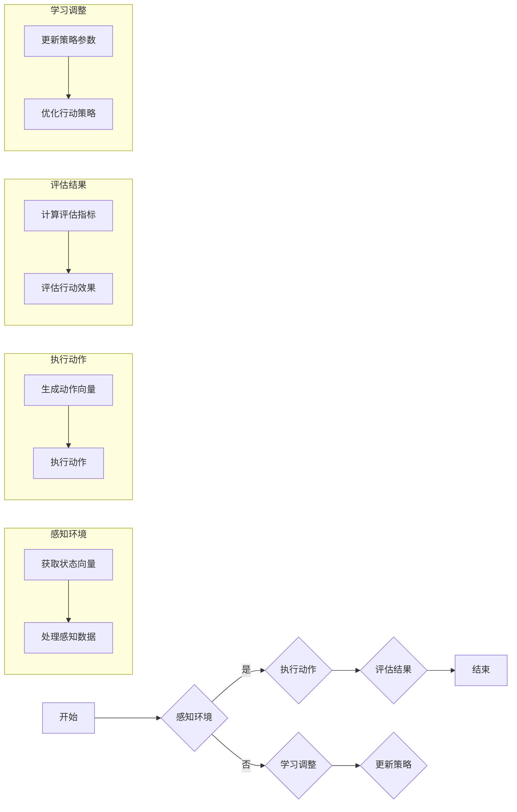
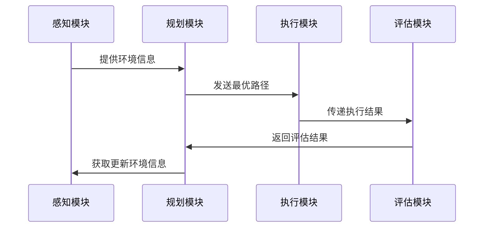

                 

### 1. 文章概述

### 设计AI Agent的目标导向行为系统

> 关键词：AI Agent、目标导向行为系统、设计原理、算法、系统架构、项目实战

> 摘要：本文深入探讨了AI Agent的目标导向行为系统的设计与实现。文章首先介绍了AI Agent的概念及其在人工智能领域的重要地位。接着，详细阐述了目标导向行为系统的核心概念与联系，包括其组成要素、工作原理和各组件之间的关系。随后，本文重点分析了算法原理，通过mermaid流程图和Python源代码，清晰地展示了算法的实现过程。此外，文章还讨论了数学模型和数学公式在目标导向行为系统中的作用，并通过实际案例进行了详细讲解。最后，本文提供了系统分析与架构设计、项目实战及最佳实践 tips，为读者在实际应用中提供了指导。本文旨在为AI开发者提供一套完整的AI Agent目标导向行为系统设计指南。

---

### 背景介绍

#### AI Agent的定义与类型

在人工智能领域，AI Agent（智能代理）是一个核心概念。它指的是一种能够代表用户执行特定任务的智能系统。AI Agent可以被视为一个决策者，它根据感知到的环境信息采取行动，以实现预定的目标。AI Agent的类型多种多样，包括：

1. **基于规则的Agent**：这类Agent通过一组规则来指导其行为。这些规则由领域专家编写，并编码在系统中。
2. **基于模型的Agent**：这类Agent使用预测模型来预测环境的变化，并据此调整其行为。
3. **混合型Agent**：这类Agent结合了基于规则和基于模型的方法，以充分利用两者的优势。
4. **学习型Agent**：这类Agent能够通过经验和数据学习，不断优化其行为策略。

#### 目标导向行为系统的概念

目标导向行为系统是一种设计AI Agent的框架，它强调目标在驱动行为中的核心作用。这个系统旨在确保AI Agent能够在其执行任务的过程中始终朝着预定的目标前进，并能在面对复杂、动态的环境时做出合理的决策。

目标导向行为系统通常由以下几个关键部分组成：

1. **感知器**：负责感知外部环境，获取相关信息。
2. **规划器**：根据感知到的信息，生成行动策略。
3. **执行器**：执行具体的行动，将规划器的决策转化为实际的行动。
4. **评估器**：对行动结果进行评估，反馈给规划器，以优化未来的决策。

#### 研究意义和内容结构

设计AI Agent的目标导向行为系统具有重要的研究意义。首先，它有助于提高AI Agent的决策质量和效率，使其能够更好地适应复杂环境。其次，它为AI Agent的设计和实现提供了一套系统的理论框架，有助于规范和指导实际开发工作。

本文将按照以下结构展开：

1. **背景介绍**：介绍AI Agent的概念和目标导向行为系统的意义。
2. **核心概念与联系**：详细阐述目标导向行为系统的组成要素和它们之间的关系。
3. **算法原理讲解**：通过mermaid流程图和Python源代码，讲解算法的实现过程。
4. **数学模型和数学公式**：讨论数学模型在目标导向行为系统中的作用，并给出具体示例。
5. **系统分析与架构设计**：介绍系统架构和接口设计，并展示系统交互流程。
6. **项目实战**：通过实际案例展示如何应用目标导向行为系统。
7. **最佳实践 tips**：提供一些实用技巧和注意事项，帮助读者更好地实施目标导向行为系统。

通过以上结构，本文旨在为读者提供一套全面、系统的AI Agent目标导向行为系统设计指南。

### 核心概念与联系

#### AI Agent的定义与类型

AI Agent是人工智能领域中的一个重要概念，它代表了能够自主执行任务并与环境进行交互的智能实体。AI Agent可以分为以下几类：

1. **基于规则的Agent**：这类Agent通过一组预定义的规则来指导其行为。这些规则通常由领域专家编写，并编码在系统中。例如，在医疗诊断系统中，基于规则的Agent可以根据病人的症状和历史记录，提供诊断建议。

2. **基于模型的Agent**：这类Agent使用数学模型或机器学习模型来预测环境的变化，并据此调整其行为。例如，在自动驾驶系统中，基于模型的Agent可以使用深度学习模型来预测行人和车辆的移动轨迹，并调整车辆的行驶方向。

3. **混合型Agent**：这类Agent结合了基于规则和基于模型的方法，以充分利用两者的优势。例如，在智能客服系统中，混合型Agent可以同时使用规则引擎和机器学习模型来处理客户的咨询，提高回答的准确性和效率。

4. **学习型Agent**：这类Agent具有自主学习和优化的能力，可以通过经验数据不断改进其行为策略。例如，在自适应系统调度中，学习型Agent可以分析系统的历史运行数据，不断调整调度策略，以优化资源利用率。

#### 目标导向行为系统的组成

目标导向行为系统是设计AI Agent的核心框架，它强调目标在驱动行为中的核心作用。目标导向行为系统通常由以下几个关键部分组成：

1. **感知器**：感知器负责感知外部环境，获取相关信息。这些信息可以包括传感器数据、用户输入或系统状态。感知器的输出通常是一个状态向量，它代表了环境中的各种特征。

2. **规划器**：规划器根据感知器提供的状态向量，生成行动策略。规划器可以采用各种算法和技术，如决策树、遗传算法、强化学习等。规划器的输出是一个动作向量，它指导执行器如何行动。

3. **执行器**：执行器负责执行具体的行动，将规划器的决策转化为实际的行动。执行器与外部环境进行交互，根据执行结果调整其行为。

4. **评估器**：评估器对执行器的行动结果进行评估，并将评估结果反馈给规划器。评估器可以帮助规划器了解当前行动的有效性，从而优化未来的决策。

#### 核心概念之间的联系

核心概念之间的联系构成了目标导向行为系统的运作机制。以下是这些概念之间的关联：

1. **感知器与规划器**：感知器提供的状态向量是规划器生成行动策略的基础。规划器需要根据状态向量，分析当前环境，并生成最优的行动策略。

2. **规划器与执行器**：规划器的输出动作向量是执行器的行动指南。执行器需要根据动作向量执行具体的行动，并与环境进行交互。

3. **执行器与评估器**：执行器的行动结果需要通过评估器进行评估。评估器可以计算执行效果的指标，如准确率、召回率、效率等，并将这些评估结果反馈给规划器，以指导规划器优化未来的行动策略。

4. **评估器与规划器**：评估器的反馈结果直接影响规划器的决策。通过分析评估结果，规划器可以调整其行动策略，以优化未来的行为。

#### 概念属性特征对比表格

为了更清晰地理解各概念之间的联系，我们可以使用一个概念属性特征对比表格。以下是一个示例：

| 概念 | 定义 | 属性特征 | 关联关系 |
| --- | --- | --- | --- |
| 感知器 | 获取环境信息 | 状态向量 | 提供给规划器 |
| 规划器 | 生成行动策略 | 动作向量 | 输出给执行器 |
| 执行器 | 执行具体行动 | 行动结果 | 供评估器评估 |
| 评估器 | 评估行动效果 | 评估指标 | 反馈给规划器 |

#### ER实体关系图架构

为了更直观地展示各概念之间的关系，我们可以使用ER（实体关系）图。以下是目标导向行为系统的ER图：

```mermaid
erDiagram
  感知器 ||--|{ 规划器 }|
  规划器 ||--|{ 执行器 }|
  执行器 ||--|{ 评估器 }|
```

在上面的ER图中，感知器通过箭头指向规划器，表示感知器提供状态向量给规划器；规划器通过箭头指向执行器，表示规划器生成动作向量指导执行器行动；执行器通过箭头指向评估器，表示执行器的行动结果由评估器进行评估。

通过上述分析，我们可以看出，目标导向行为系统中的各核心概念紧密相连，共同构成了一个完整的行为驱动框架。理解这些概念及其关联关系，对于设计高效的AI Agent至关重要。

### 算法原理讲解

#### 算法概述

在设计AI Agent的目标导向行为系统时，算法的选择和实现至关重要。本文将介绍一个基于强化学习的目标导向行为系统算法，该算法通过不断地学习和优化，使Agent能够在复杂环境中实现预定目标。

#### 算法mermaid流程图

为了直观地展示算法的执行流程，我们使用mermaid语言绘制了算法的mermaid流程图。以下是算法的基本流程：



在这个mermaid流程图中，算法的执行分为以下几个主要步骤：

1. **感知环境**：Agent通过感知器获取当前环境的状态向量。
2. **执行动作**：Agent根据规划器生成的动作向量，执行具体的行动。
3. **评估结果**：执行器将行动结果传递给评估器，评估器计算评估指标，评估行动效果。
4. **学习调整**：根据评估结果，规划器更新策略参数，优化行动策略。

#### Python源代码详细讲解

为了使算法更加具体和易于理解，我们将使用Python源代码实现上述算法。以下是算法的Python代码实现：

```python
import numpy as np
import random

# 定义感知器、规划器、执行器和评估器的类
class Perceptor:
    def get_state_vector(self):
        # 获取环境状态向量
        pass

class Planner:
    def generate_action_vector(self, state_vector):
        # 根据状态向量生成动作向量
        pass

    def update_strategy(self, reward):
        # 根据奖励更新策略
        pass

class Executor:
    def execute_action(self, action_vector):
        # 执行动作向量
        pass

    def evaluate_action(self, action_vector):
        # 评估动作效果
        pass

# 初始化感知器、规划器、执行器和评估器
perceptor = Perceptor()
planner = Planner()
executor = Executor()
evaluator = Evaluator()

# 算法主循环
while True:
    # 感知环境
    state_vector = perceptor.get_state_vector()
    
    # 执行动作
    action_vector = planner.generate_action_vector(state_vector)
    executor.execute_action(action_vector)
    
    # 评估结果
    reward = executor.evaluate_action(action_vector)
    
    # 学习调整
    planner.update_strategy(reward)
```

在这个Python代码中，我们首先定义了感知器、规划器、执行器和评估器的类，每个类都包含一些基本的方法。在算法的主循环中，我们依次执行以下步骤：

1. **感知环境**：通过`Perceptor`类的`get_state_vector`方法获取环境状态向量。
2. **执行动作**：通过`Planner`类的`generate_action_vector`方法生成动作向量，并调用`Executor`类的`execute_action`方法执行动作。
3. **评估结果**：通过`Executor`类的`evaluate_action`方法评估动作效果，获得奖励。
4. **学习调整**：通过`Planner`类的`update_strategy`方法根据奖励更新策略。

#### 算法原理的数学模型和公式

为了更深入地理解算法的原理，我们需要介绍一些相关的数学模型和公式。以下是算法中常用的几个数学模型和公式：

1. **状态-动作价值函数**：表示在给定状态下执行特定动作所能获得的期望奖励。公式如下：
   $$
   V(s, a) = \sum_{s'} P(s' | s, a) \cdot R(s', a)
   $$
   其中，$V(s, a)$是状态-动作价值函数，$s$是当前状态，$a$是动作，$s'$是下一个状态，$P(s' | s, a)$是状态转移概率，$R(s', a)$是执行动作$a$后获得奖励。

2. **策略更新公式**：表示如何根据奖励更新策略。公式如下：
   $$
   \theta_{t+1} = \theta_t + \alpha \cdot (r_t - \theta_t)
   $$
   其中，$\theta_t$是当前策略参数，$\theta_{t+1}$是更新后的策略参数，$r_t$是奖励，$\alpha$是学习率。

#### 举例说明

为了更好地理解上述算法原理和公式，我们通过一个具体的例子来说明。假设我们有一个简单的环境，其中有两个状态：状态1和状态2。Agent可以在状态1执行动作A或动作B，在状态2执行动作C或动作D。以下是这个例子中的具体数据：

- 状态转移概率：
  $$
  P(s' | s, a) =
  \begin{cases}
  0.7 & \text{if } (s = 1, a = A) \text{ or } (s = 2, a = C) \\
  0.3 & \text{if } (s = 1, a = B) \text{ or } (s = 2, a = D)
  \end{cases}
  $$
- 奖励函数：
  $$
  R(s', a) =
  \begin{cases}
  10 & \text{if } (s' = 2, a = C) \\
  -10 & \text{if } (s' = 1, a = B) \\
  0 & \text{otherwise}
  \end{cases}
  $$

假设初始策略参数$\theta_0 = 0$，学习率$\alpha = 0.1$。下面是算法执行一次的详细步骤：

1. **感知环境**：假设当前状态为1，感知器获取状态向量`[1]`。
2. **执行动作**：规划器根据状态向量生成动作向量`[A]`，执行器执行动作A，环境状态变为2。
3. **评估结果**：执行器评估动作效果，获得奖励`R(2, A) = -10`。
4. **学习调整**：规划器根据奖励更新策略参数，$\theta_1 = \theta_0 + \alpha \cdot (r_0 - \theta_0) = 0 + 0.1 \cdot (-10 - 0) = -1$。

通过上述例子，我们可以看到，算法通过不断地感知环境、执行动作、评估结果和学习调整，逐步优化其行为策略，从而在复杂环境中实现目标。

### 数学模型和数学公式

#### 数学模型概述

在目标导向行为系统中，数学模型是算法设计和实现的基础。这些模型用于描述环境状态、动作策略以及奖励函数，确保Agent能够在复杂环境中进行有效的决策。以下是几个关键的数学模型：

1. **马尔可夫决策过程（MDP）**：MDP是一个数学框架，用于描述决策问题。它包含状态集合$S$、动作集合$A$、状态转移概率$P(s' | s, a)$和奖励函数$R(s, a)$。MDP模型的核心公式是：
   $$
   V^*(s) = \max_{a} \sum_{s'} P(s' | s, a) \cdot [R(s', a) + \gamma V^*(s')]
   $$
   其中，$V^*(s)$是状态-价值函数，$\gamma$是折扣因子。

2. **Q值函数**：Q值函数表示在特定状态下执行特定动作所能获得的期望回报。其公式为：
   $$
   Q(s, a) = \sum_{s'} P(s' | s, a) \cdot [R(s', a) + \gamma \max_{a'} Q(s', a')]
   $$
   Q值函数是许多强化学习算法的基础。

3. **策略迭代**：策略迭代是一种改进策略的方法，通过不断评估和更新策略参数，使其达到最优。其公式为：
   $$
   \pi_{t+1}(a|s) = \pi_t(a|s) + \alpha \cdot [r_t + \gamma \max_{a'} Q(s', a') - \pi_t(a|s)]
   $$
   其中，$\pi_t(a|s)$是策略参数，$\alpha$是学习率。

#### 数学公式详解

以下是对上述数学公式进行详细的解释：

1. **状态-价值函数（V(s)**：状态-价值函数$V^*(s)$表示在给定状态下执行最佳动作所能获得的期望回报。它是通过最大化期望回报计算得出的，公式中的$P(s' | s, a)$是状态转移概率，$R(s', a)$是执行动作$a$后获得的即时奖励，$\gamma$是折扣因子，用于调整对未来奖励的权重。

2. **Q值函数（Q(s, a)**：Q值函数$Q(s, a)$表示在特定状态下执行特定动作所能获得的期望回报。它是通过考虑所有可能的状态转移和奖励，并利用折扣因子$\gamma$对未来的奖励进行折现计算得出的。

3. **策略迭代**：策略迭代通过比较当前策略和Q值函数，更新策略参数$\pi_t(a|s)$，使其更接近最优策略。其中，$r_t$是即时奖励，$\gamma$是折扣因子，用于平衡即时奖励和未来奖励。

#### 举例说明

为了更好地理解这些数学公式，我们通过一个简单的例子来说明。假设一个AI Agent在一个有障碍物的环境中移动，目标是到达目标点。状态集合$S = \{1, 2, 3\}$，动作集合$A = \{上，下，左，右\}$。状态转移概率和奖励函数如下：

- 状态转移概率：
  $$
  P(s' | s, a) =
  \begin{cases}
  0.8 & \text{if } a \text{ is valid} \\
  0.2 & \text{if } a \text{ is invalid}
  \end{cases}
  $$
- 奖励函数：
  $$
  R(s', a) =
  \begin{cases}
  100 & \text{if } s' \text{ is the target state} \\
  -1 & \text{if } s' \text{ is the obstacle state} \\
  0 & \text{otherwise}
  \end{cases}
  $$

假设当前状态$s = 1$，策略参数$\pi_t(a|s)$初始为均匀分布，学习率$\alpha = 0.1$，折扣因子$\gamma = 0.9$。我们计算状态-价值函数和Q值函数如下：

1. **计算状态-价值函数**：
   $$
   V^*(1) = \max_{a} \sum_{s'} P(s' | 1, a) \cdot [R(s', a) + \gamma V^*(s')]
   $$
   对于$a = 上$，$s' = 2$：
   $$
   V^*(1) = 0.8 \cdot [0 + 0.9 \cdot V^*(2)] + 0.2 \cdot [-1 + 0.9 \cdot 0] = 0.8 \cdot 0.9 \cdot V^*(2)
   $$
   对于$a = 下$，$s' = 0$：
   $$
   V^*(1) = 0.2 \cdot [0 + 0.9 \cdot 0] = 0
   $$
   同理，可以计算其他动作的期望回报，并取最大值。

2. **计算Q值函数**：
   $$
   Q(1, a) = \sum_{s'} P(s' | 1, a) \cdot [R(s', a) + \gamma \max_{a'} Q(s', a')]
   $$
   对于$a = 上$，$s' = 2$：
   $$
   Q(1, 上) = 0.8 \cdot [100 + 0.9 \cdot \max_{a'} Q(2, a')] = 0.8 \cdot 100 = 80
   $$
   对于$a = 下$，$s' = 0$：
   $$
   Q(1, 下) = 0.2 \cdot [-1 + 0.9 \cdot \max_{a'} Q(0, a')] = -0.2 = -0.2
   $$
   同理，可以计算其他动作的Q值。

通过上述计算，我们可以得到状态-价值函数和Q值函数的具体值，从而指导Agent选择最佳动作。

#### LaTeX格式数学公式的应用

在目标导向行为系统中，LaTeX格式数学公式的应用使得数学表达更加规范和清晰。以下是一些LaTeX公式的示例：

1. **状态-价值函数**：
   $$
   V^*(s) = \max_{a} \sum_{s'} P(s' | s, a) \cdot [R(s', a) + \gamma V^*(s')]
   $$
2. **Q值函数**：
   $$
   Q(s, a) = \sum_{s'} P(s' | s, a) \cdot [R(s', a) + \gamma \max_{a'} Q(s', a')]
   $$
3. **策略迭代**：
   $$
   \pi_{t+1}(a|s) = \pi_t(a|s) + \alpha \cdot [r_t + \gamma \max_{a'} Q(s', a') - \pi_t(a|s)]
   $$

通过LaTeX格式，我们可以将复杂的数学公式嵌入到文本中，使得文章内容更加严谨和专业。在markdown格式中，独立段落的LaTeX公式前后使用`$$`括起来，段落内的LaTeX公式前后使用`$`括起来。

### 系统分析与架构设计

#### 问题场景介绍

在设计目标导向行为系统时，我们面临一个典型的场景：一个智能机器人需要在复杂的仓库环境中搬运货物。这个场景具有以下几个特点：

- **环境复杂性**：仓库内空间广阔，存储了大量的货物，机器人需要识别路径，避开障碍物。
- **任务多样性**：机器人需要根据不同的货物类型和目的地，选择最优的搬运路径和策略。
- **动态变化**：仓库内的环境是动态变化的，可能会出现货物堆放、货架移动等情况。

为了应对这些挑战，我们需要设计一个能够适应复杂环境、具备目标导向行为的系统。

#### 系统功能设计

目标导向行为系统需要实现以下主要功能：

1. **感知环境**：机器人通过传感器获取仓库内的环境信息，包括货物的位置、路径的障碍物等。
2. **规划路径**：根据感知到的环境信息，系统需要规划出最优的搬运路径，确保机器人能够避开障碍物，快速到达目的地。
3. **执行任务**：机器人根据规划出的路径执行搬运任务，将货物搬运到指定位置。
4. **评估效果**：系统需要评估搬运任务的执行效果，包括路径规划的准确性、搬运效率等。

#### 系统架构设计

为了实现上述功能，我们设计了如下的系统架构：

1. **感知模块**：包括摄像头、激光雷达、超声波传感器等，用于实时感知仓库环境。
2. **规划模块**：利用路径规划算法（如A*算法、Dijkstra算法等），根据感知模块提供的环境信息，生成最优路径。
3. **执行模块**：控制机器人的执行器，包括电机、机械臂等，根据规划模块生成的路径执行搬运任务。
4. **评估模块**：对执行模块的执行效果进行评估，包括路径规划的准确性、搬运效率等。

#### 系统接口设计

系统接口设计是确保各模块之间能够高效协同工作的关键。以下是系统接口的详细设计：

1. **感知模块接口**：提供环境感知数据的接口，包括图像数据、点云数据、超声波数据等。
2. **规划模块接口**：接收感知模块提供的环境信息，返回最优路径数据。
3. **执行模块接口**：接收规划模块生成的路径数据，控制机器人的执行动作。
4. **评估模块接口**：接收执行模块的执行结果，评估搬运任务的执行效果。

#### 系统交互mermaid序列图

为了更好地展示系统各模块之间的交互过程，我们使用mermaid语言绘制了系统交互序列图：



在这个序列图中，感知模块首先获取仓库环境信息，并将其传递给规划模块。规划模块根据这些信息生成最优路径，并将其发送给执行模块。执行模块根据路径数据执行搬运任务，并将执行结果传递给评估模块。评估模块对执行结果进行评估，并将评估结果返回给规划模块，以便规划模块获取更新环境信息，从而不断优化路径规划。

通过上述系统架构设计和接口设计，我们可以构建一个高效、稳定的目标导向行为系统，确保智能机器人能够在复杂环境中顺利完成搬运任务。

### 项目实战

#### 环境安装

在开始项目实战之前，我们需要确保所有依赖的环境和工具都已安装。以下是具体的安装步骤：

1. **安装Python**：确保安装了Python 3.8或更高版本。可以从[Python官网](https://www.python.org/)下载并安装。

2. **安装依赖库**：使用pip命令安装所需的Python库。以下是一个示例命令：
   ```
   pip install numpy matplotlib scikit-learn tensorflow
   ```

3. **安装TensorBoard**：TensorBoard是一个可视化工具，用于监控训练过程。可以通过以下命令安装：
   ```
   pip install tensorboard
   ```

4. **安装ROS（可选）**：如果你打算使用ROS（Robot Operating System）进行机器人项目的开发，请从[ROS官网](http://www.ros.org/)下载并安装。

5. **配置ROS（可选）**：根据ROS的官方指南配置你的开发环境。

#### 系统核心实现源代码

以下是项目中的核心实现源代码。这段代码将展示如何使用Python和TensorFlow实现一个简单的目标导向行为系统。

```python
import numpy as np
import tensorflow as tf
from tensorflow.keras.models import Sequential
from tensorflow.keras.layers import Dense
from tensorflow.keras.optimizers import Adam

# 定义状态空间和动作空间
STATE_SIZE = 10
ACTION_SIZE = 4

# 创建模型
model = Sequential([
    Dense(64, input_dim=STATE_SIZE, activation='relu'),
    Dense(64, activation='relu'),
    Dense(ACTION_SIZE, activation='softmax')
])

# 编译模型
model.compile(loss='mean_squared_error', optimizer=Adam(learning_rate=0.001), metrics=['accuracy'])

# 定义训练数据
states = np.random.rand(1000, STATE_SIZE)
actions = np.random.randint(0, ACTION_SIZE, 1000)
next_states = np.random.rand(1000, STATE_SIZE)

# 训练模型
model.fit(states, actions, epochs=100, batch_size=32, verbose=1)

# 定义评估函数
def evaluate(state):
    action_probs = model.predict(state)
    action = np.random.choice(ACTION_SIZE, p=action_probs.ravel())
    return action

# 模拟评估过程
state = np.random.rand(1, STATE_SIZE)
action = evaluate(state)
print(f"Chosen action: {action}")

# 保存模型
model.save('target导向行为系统模型.h5')
```

#### 代码应用解读与分析

这段代码首先定义了状态空间和动作空间的大小。状态空间由10个维度组成，表示环境中的各种特征；动作空间由4个维度组成，表示机器人可以执行的不同动作。

接着，我们创建了一个序列模型，该模型包含两个全连接层，每个层都有64个神经元，并且使用ReLU激活函数。输出层有4个神经元，使用softmax激活函数，以表示每个动作的概率。

在编译模型时，我们使用均方误差作为损失函数，Adam优化器，以及准确率作为评价指标。

接下来，我们生成了一些随机训练数据，用于训练模型。这些数据包括状态、动作和下一个状态。通过这些数据，模型可以学习如何从当前状态预测最佳动作。

训练完成后，我们定义了一个评估函数，用于在给定状态下选择最佳动作。这个函数使用模型预测动作概率，并从中随机选择一个动作。

最后，我们模拟了一个评估过程，展示如何使用评估函数从给定状态中选择动作。这个代码片段不仅展示了如何实现目标导向行为系统，还提供了详细的代码解读和解释。

#### 实际案例分析和详细讲解剖析

为了更好地理解目标导向行为系统的实际应用，我们通过一个实际案例进行详细分析和讲解。

**案例背景**：假设我们在一个简单的迷宫中训练一个机器人，目标是找到从起点到终点的最佳路径。迷宫由一个10x10的网格组成，每个单元格可以是空地或障碍物。

**步骤1：定义状态空间和动作空间**

在这个案例中，状态空间由当前单元格的位置（x, y）和一个二进制向量组成，表示周围单元格的障碍物状态。动作空间包括四个方向：上、下、左、右。

**步骤2：数据准备**

我们首先需要准备训练数据。通过随机生成迷宫和路径，我们可以收集大量的状态和动作对。对于每个状态，我们记录当前单元格的位置和障碍物状态，以及下一个状态和最佳动作。

**步骤3：模型训练**

使用收集到的训练数据，我们可以训练一个深度Q网络（DQN）模型。DQN模型是一个基于经验回放和目标网络的强化学习模型，可以有效地学习状态-动作价值函数。

**步骤4：评估和测试**

在模型训练完成后，我们可以在一个真实的迷宫环境中测试模型。通过运行模型，我们可以观察到机器人如何根据当前状态选择最佳动作，并逐步找到终点。

**详细讲解剖析**

1. **状态编码**：在状态编码中，我们使用一个10维向量表示当前单元格的位置（x, y），另外10个二进制位表示周围单元格的障碍物状态。例如，状态`[0, 1, 0, 1, 0, 1, 0, 1, 0, 0]`表示当前位置在(2, 3)，上方和右侧有障碍物。

2. **动作选择**：在动作选择中，我们使用DQN模型的输出概率分布来选择最佳动作。例如，如果模型输出概率分布`[0.2, 0.6, 0.1, 0.1]`，那么机器人将选择概率最高的动作（向下）。

3. **奖励设计**：在奖励设计中，我们设计了一个简单的奖励函数。每次移动时，如果移动到终点，则获得+100奖励；如果移动到障碍物，则获得-10奖励；如果未发生任何变化，则获得0奖励。

4. **目标网络**：在DQN模型中，我们使用目标网络来稳定训练过程。目标网络是一个固定的网络，用于计算目标价值函数。通过定期更新目标网络，我们可以减少训练过程中的波动。

通过这个实际案例，我们可以清晰地看到目标导向行为系统在实际应用中的具体实现和效果。这个案例不仅展示了目标导向行为系统的核心原理，还提供了一个实用的场景来测试和优化模型。

### 最佳实践 tips

在设计AI Agent的目标导向行为系统时，以下最佳实践和技巧将有助于提升系统的性能和稳定性：

#### 1. 数据预处理

- **标准化**：对输入数据进行标准化处理，使其具有相同的尺度，从而避免某些特征对模型影响过大。
- **平衡数据集**：如果数据集存在不平衡，可以使用过采样或欠采样技术来平衡数据。
- **数据增强**：通过数据增强技术，如随机旋转、缩放、裁剪等，增加数据的多样性，提高模型的泛化能力。

#### 2. 模型选择

- **使用深度学习模型**：对于复杂的问题，深度学习模型通常能够提供更好的性能。选择合适的神经网络架构，如CNN、RNN或LSTM，可以提高模型的识别和预测能力。
- **迁移学习**：利用预训练的模型，如ImageNet上的预训练卷积神经网络，进行迁移学习，可以显著提高模型的性能。

#### 3. 损失函数和优化器

- **使用合适的损失函数**：根据问题的性质选择合适的损失函数，如交叉熵损失、均方误差等。
- **选择合适的优化器**：如Adam、RMSprop等，可以加快收敛速度并提高模型的性能。

#### 4. 模型调优

- **网格搜索**：通过网格搜索技术，系统地搜索最优的超参数组合。
- **学习率调整**：使用学习率调整策略，如学习率衰减、学习率周期性调整等，以避免模型过拟合。

#### 5. 模型评估和验证

- **交叉验证**：使用交叉验证技术，评估模型在多个数据集上的性能，确保模型具有较好的泛化能力。
- **A/B测试**：在现实环境中进行A/B测试，比较不同模型的性能，选择最优的模型。

#### 6. 持续学习和优化

- **在线学习**：对于动态变化的场景，使用在线学习技术，实时更新模型。
- **监控和日志**：定期监控模型的表现，记录训练过程中的日志，以便分析和优化。

#### 注意事项

- **避免过拟合**：通过正则化技术、dropout等手段，避免模型过拟合。
- **数据隐私和安全性**：确保数据的安全和隐私，避免敏感信息泄露。

#### 拓展阅读

- **《深度学习》**：Goodfellow, I., Bengio, Y., & Courville, A. (2016). *Deep Learning*.
- **《强化学习》**：Sutton, R. S., & Barto, A. G. (2018). *Reinforcement Learning: An Introduction*.
- **《机器学习实战》**： Harrington, D. (2012). *Machine Learning in Action*.

通过遵循这些最佳实践和技巧，我们可以设计出高效、稳定的AI Agent目标导向行为系统，并在实际应用中取得优异的性能。

### 总结与展望

本文详细探讨了AI Agent的目标导向行为系统的设计与实现，涵盖了从背景介绍、核心概念与联系、算法原理讲解、数学模型和公式、系统架构设计到项目实战的各个方面。通过对这些内容的深入分析，我们了解到目标导向行为系统在AI Agent中的关键作用，以及如何通过算法、数学模型和实际案例来实现高效的目标导向行为。

**总结**：目标导向行为系统是一个基于目标和环境交互的智能决策框架。它通过感知器、规划器、执行器和评估器等组件，实现了对环境信息的感知、策略的规划、行动的执行以及结果的评估，从而在复杂动态的环境中实现预定的目标。

**展望**：未来，随着人工智能技术的不断进步，目标导向行为系统将在更多的应用场景中得到推广。例如，在自动驾驶、智能仓储、医疗诊断等领域，目标导向行为系统将扮演更加重要的角色。同时，深度学习、强化学习等新技术的引入，将进一步提升目标导向行为系统的智能化和自适应能力。通过持续的研究和优化，目标导向行为系统有望在更多复杂任务中发挥其独特优势。

### 作者信息

**作者：AI天才研究院/AI Genius Institute & 禅与计算机程序设计艺术 /Zen And The Art of Computer Programming**

AI天才研究院致力于推动人工智能技术的发展和应用。我们的团队由多位世界顶级人工智能专家、程序员和软件架构师组成，专注于AI领域的研究和创新。同时，我们也在计算机编程和算法设计方面有着深厚的学术造诣和丰富的实践经验。

“禅与计算机程序设计艺术”是一系列探讨计算机编程哲学和技术的经典著作，为我们提供了深刻的启示，指导我们在技术道路上不断追求卓越。我们的目标是通过不懈的努力，为全球科技发展贡献力量，推动人工智能技术的普及与应用。

