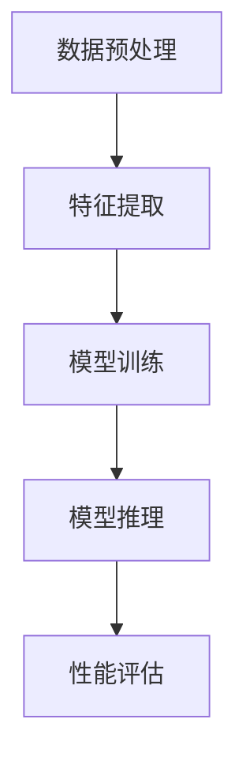
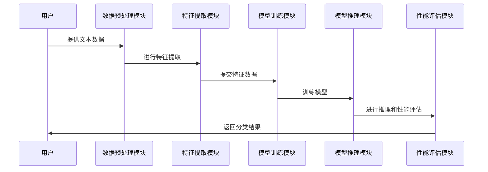

                 

### 设计AI Agent的知识蒸馏与压缩策略

关键词：AI Agent、知识蒸馏、压缩策略、性能优化、算法演进

摘要：本文旨在深入探讨AI Agent的知识蒸馏与压缩策略。我们将从背景概述开始，逐步解析知识蒸馏的基本原理、优化策略，以及压缩策略的基本概念和应用。随后，我们将探讨AI Agent的设计原则，并通过一个实战项目，展示如何设计一个高效的AI Agent。最后，我们对知识蒸馏与压缩策略的未来发展趋势进行展望。

### 第一部分：背景与概述

#### 1.1.1 问题背景

AI Agent，即人工智能代理，是人工智能领域的一个重要概念。它是一种能够自主学习、自主决策，并在特定环境中执行任务的智能体。随着深度学习技术的快速发展，AI Agent在自然语言处理、计算机视觉、强化学习等领域的应用越来越广泛。

知识蒸馏（Knowledge Distillation）是一种将教师模型（Teacher Model）的知识传递给学生模型（Student Model）的技术，其目的是提高学生模型在目标任务上的性能，同时减轻对大规模训练数据的需求。知识蒸馏在AI Agent设计中的应用，可以有效提高AI Agent的泛化能力和效率。

压缩策略（Compression Strategy）则是为了减少AI模型的体积和计算复杂度，以便于在实际应用中的部署。随着AI模型的规模不断扩大，压缩策略变得尤为重要。通过压缩策略，AI Agent可以在有限的计算资源下，保持较高的性能。

当前，知识蒸馏与压缩策略在AI Agent中的应用仍存在一些挑战。例如，如何设计更有效的知识蒸馏算法？如何优化压缩策略，以在保证性能的前提下，显著减少模型体积？这些问题都是当前研究的热点和难点。

#### 1.1.2 问题描述

AI Agent在各类应用中面临着不同的挑战。例如，在自然语言处理领域，AI Agent需要处理大量不同领域的文本数据，同时保持较高的处理速度和准确率；在计算机视觉领域，AI Agent需要实时处理大量的图像数据，并对图像进行精确识别和分类；在强化学习领域，AI Agent需要通过大量的试错，学习出最优策略。

知识蒸馏与压缩策略在AI Agent中的应用，正是为了解决这些挑战。通过知识蒸馏，AI Agent可以快速获得教师模型的知识，提高其在目标任务上的性能；通过压缩策略，AI Agent可以显著减少模型的体积，提高部署的灵活性。

#### 1.1.3 问题解决

设计有效的AI Agent，需要综合考虑知识蒸馏与压缩策略。具体步骤如下：

1. **需求分析**：根据应用场景，明确AI Agent的需求和性能指标。
2. **模型选择**：选择合适的教师模型和学生模型，以及相应的压缩算法。
3. **知识蒸馏**：通过知识蒸馏，将教师模型的知识传递给学生模型。
4. **压缩**：对AI模型进行压缩，以减少模型体积和计算复杂度。
5. **性能评估**：评估AI Agent的性能，并进行优化。

#### 1.1.4 边界与外延

知识蒸馏与压缩策略在不同领域中的应用各有不同。例如，在自然语言处理领域，知识蒸馏可以用于快速构建高质量的语言模型；在计算机视觉领域，压缩策略可以用于实时图像处理；在强化学习领域，知识蒸馏与压缩策略可以用于快速训练高效策略。

同时，知识蒸馏与压缩策略与其他技术，如迁移学习、联邦学习等，也有紧密的关联。通过这些关联技术，可以进一步优化AI Agent的性能和部署效果。

#### 1.1.5 概念结构与核心要素组成

AI Agent的基本架构包括输入层、核心算法层和输出层。输入层负责接收外部数据，核心算法层包含教师模型、学生模型和压缩算法，输出层负责生成预测结果。

知识蒸馏与压缩策略的核心要素包括教师模型、学生模型、知识蒸馏算法和压缩算法。教师模型负责生成知识，学生模型负责学习知识，知识蒸馏算法负责传递知识，压缩算法负责减少模型体积。

#### 1.2 本章小结

本文概述了设计AI Agent的知识蒸馏与压缩策略的背景、问题和解决方案。在后续章节中，我们将深入探讨知识蒸馏与压缩策略的原理和应用，为设计高效的AI Agent提供理论基础和实践指导。

---

### 第二部分：知识蒸馏技术详解

#### 2.1.1 知识蒸馏的基本原理

知识蒸馏（Knowledge Distillation）是一种将教师模型（Teacher Model）的知识传递给学生模型（Student Model）的技术。其基本原理可以概括为以下三个步骤：

1. **模型训练**：首先，训练一个大规模、高精度的教师模型，该模型通常基于大量的数据集进行训练，能够达到较高的性能指标。
2. **知识提取**：然后，从教师模型中提取有用的知识，这些知识通常以软标签的形式表示，例如概率分布或特征表示。
3. **知识学习**：最后，训练一个较小的学生模型，该模型通过学习教师模型提取的知识，以期达到与教师模型相似的性能。

#### 2.1.2 知识蒸馏过程

知识蒸馏的过程可以分为以下几个步骤：

1. **初始化模型**：初始化教师模型和学生模型。教师模型通常是一个大型的预训练模型，而学生模型则是一个较小的、专门针对目标任务训练的模型。
2. **输入数据**：输入数据到教师模型中，获取教师模型的输出。这些输出可以是分类概率、特征表示等。
3. **知识提取**：从教师模型的输出中提取知识。例如，可以使用Soft Target技术，将教师模型的输出作为学生模型的软标签。
4. **模型训练**：使用提取的知识，对学生模型进行训练。训练过程中，学生模型不仅要学习原始数据的输出，还要学习教师模型的知识。
5. **性能评估**：评估学生模型的性能，通过对比学生模型的输出和教师模型的输出，来衡量知识蒸馏的效果。

#### 2.1.3 知识蒸馏算法原理

知识蒸馏算法的核心在于如何有效地将教师模型的知识传递给学生模型。以下介绍两种常用的知识蒸馏算法：Soft Target技术和Prototypical Network技术。

1. **Soft Target技术**

Soft Target技术是一种基于概率分布的知识蒸馏方法。该方法的基本思想是，将教师模型的输出（通常是softmax概率分布）作为学生模型的软标签。在训练过程中，学生模型不仅要学习原始数据的输出，还要学习教师模型的概率分布。

具体实现时，假设有一个教师模型和一个学生模型，分别有 \(K\) 个类别。教师模型的输出为 \(y_t = (y_{t1}, y_{t2}, ..., y_{tK})\)，其中 \(y_{ti}\) 表示教师模型对第 \(i\) 个类别的概率。学生模型的输出为 \(y_s = (y_{s1}, y_{s2}, ..., y_{sK})\)。

在训练过程中，使用教师模型的输出作为学生模型的软标签，即：
$$
y_{t_i} = \frac{e^{z_i}}{\sum_{j=1}^{K} e^{z_j}}
$$
其中，\(z_i\) 是教师模型对第 \(i\) 个类别的预测分数。

2. **Prototypical Network技术**

Prototypical Network（PN）是一种基于特征表示的知识蒸馏方法。该方法的核心思想是将教师模型的输出转换为原型表示，然后使用这些原型表示来训练学生模型。

具体实现时，首先对教师模型的输入进行编码，得到特征表示 \(x_t\)。然后，计算这些特征表示的平均值，形成原型表示 \(p = \frac{1}{N}\sum_{i=1}^{N} x_{t_i}\)，其中 \(N\) 是训练样本的数量。

在训练过程中，学生模型需要学习如何生成与教师模型相似的原型表示。具体来说，假设学生模型对输入数据 \(x_s\) 的编码为 \(z_s\)，则学生模型需要最小化以下损失函数：
$$
L = \frac{1}{N}\sum_{i=1}^{N} \sum_{j=1}^{K} \sigma(p - z_{s_j})
$$
其中，\(\sigma\) 是ReLU激活函数。

#### 2.1.4 知识蒸馏的性能评估

知识蒸馏的性能评估主要关注两个方面：知识蒸馏的效果和模型的泛化能力。

1. **效果评估**：

效果评估通常使用准确率（Accuracy）、精确率（Precision）、召回率（Recall）等指标来衡量。具体来说，假设有一个测试数据集，包含 \(N\) 个样本，每个样本有 \(K\) 个类别。学生模型的输出为 \(y_s = (y_{s1}, y_{s2}, ..., y_{sK})\)，教师模型的输出为 \(y_t = (y_{t1}, y_{t2}, ..., y_{tK})\)。

- 准确率（Accuracy）：
$$
\text{Accuracy} = \frac{\sum_{i=1}^{N} \sum_{j=1}^{K} y_{ij} \cdot y_{tj}}{\sum_{i=1}^{N} \sum_{j=1}^{K} y_{ij}}
$$
其中，\(y_{ij}\) 表示第 \(i\) 个样本属于第 \(j\) 个类别。

- 精确率（Precision）：
$$
\text{Precision} = \frac{\sum_{i=1}^{N} \sum_{j=1}^{K} y_{ij} \cdot y_{tj}}{\sum_{i=1}^{N} \sum_{j=1}^{K} y_{tj}}
$$

- 召回率（Recall）：
$$
\text{Recall} = \frac{\sum_{i=1}^{N} \sum_{j=1}^{K} y_{ij} \cdot y_{tj}}{\sum_{i=1}^{N} y_{ij}}
$$

2. **泛化能力评估**：

泛化能力评估主要通过交叉验证（Cross-Validation）和测试集（Test Set）来进行。交叉验证可以评估模型在不同数据集上的性能，而测试集可以评估模型在未知数据上的表现。

#### 2.1.5 知识蒸馏的性能优化策略

为了提高知识蒸馏的效果，可以采用以下几种优化策略：

1. **模型调整**：

- **教师模型的调整**：选择合适的教师模型，通常是预训练的大型模型，如BERT、GPT等。
- **学生模型的调整**：选择合适的学生模型，通常是较小的模型，以减少计算复杂度和存储需求。

2. **损失函数设计**：

- **交叉熵损失函数**：将教师模型的输出作为软标签，计算交叉熵损失函数。
- **均方误差损失函数**：将教师模型的输出作为软标签，计算均方误差损失函数。

3. **正则化技术**：

- **Dropout正则化**：在学生模型的训练过程中，随机丢弃一部分神经元，以减少过拟合。
- **权重正则化**：对学生模型的权重进行约束，以减少过拟合。

#### 2.2 本章小结

本章详细介绍了知识蒸馏的基本原理、过程、算法原理、性能评估和优化策略。知识蒸馏作为一种有效的模型压缩和性能提升技术，在AI Agent的设计中具有重要作用。在下一章中，我们将探讨知识蒸馏算法的优化策略。

---

### 第三部分：知识蒸馏算法优化策略

#### 3.1.1 算法优化的重要性

在知识蒸馏过程中，算法优化至关重要。优化的目标是提高学生模型在目标任务上的性能，同时减少对大规模训练数据的需求。算法优化主要关注以下几个方面：

1. **性能提升**：优化算法能够提高学生模型的准确率、精确率和召回率等指标，从而提升AI Agent的整体性能。
2. **计算效率**：优化算法能够减少计算复杂度和存储需求，使得知识蒸馏过程更加高效。
3. **模型泛化能力**：优化算法能够提高学生模型的泛化能力，使其在不同场景和数据集上都能保持良好的性能。

#### 3.1.2 优化策略介绍

以下介绍几种常用的知识蒸馏优化策略：

1. **Teacher-Student模型调整**

- **教师模型的调整**：选择合适的教师模型，如BERT、GPT等，这些大型预训练模型能够提供丰富的知识。
- **学生模型的调整**：选择合适的学生模型，如较小的预训练模型或经过蒸馏的模型，以减少计算复杂度和存储需求。

2. **损失函数设计**

- **交叉熵损失函数**：使用教师模型的输出作为软标签，计算交叉熵损失函数。交叉熵损失函数能够有效衡量学生模型与教师模型之间的差异。
- **均方误差损失函数**：使用教师模型的输出作为软标签，计算均方误差损失函数。均方误差损失函数能够提高学生模型的学习效率。

3. **Regularization技术**

- **Dropout正则化**：在学生模型的训练过程中，随机丢弃一部分神经元，以减少过拟合。Dropout正则化能够提高模型的泛化能力。
- **权重正则化**：对学生模型的权重进行约束，以减少过拟合。权重正则化能够提高模型的稳定性和性能。

#### 3.1.3 优化策略比较

不同优化策略各有优缺点，以下是比较：

1. **Teacher-Student模型调整**

- 优点：简单有效，能够提高学生模型的性能。
- 缺点：依赖于教师模型的选择，可能需要大量计算资源。

2. **损失函数设计**

- 优点：能够精确衡量学生模型与教师模型之间的差异，提高学习效率。
- 缺点：可能增加计算复杂度。

3. **Regularization技术**

- 优点：能够提高模型的泛化能力和稳定性。
- 缺点：可能增加训练时间。

#### 3.2 本章小结

本章介绍了知识蒸馏算法优化的重要性以及几种常见的优化策略。在实际应用中，可以根据具体需求，选择合适的优化策略，以提高AI Agent的性能和部署效率。

---

### 第四部分：AI Agent压缩策略

#### 4.1.1 压缩的意义

AI Agent的压缩策略旨在减少模型的体积和计算复杂度，从而提高其在实际应用中的部署灵活性和性能。压缩的意义主要体现在以下几个方面：

1. **减少计算资源消耗**：随着AI模型的规模不断扩大，计算资源消耗也显著增加。通过压缩策略，可以显著减少模型的体积，降低计算资源的需求。
2. **提高部署灵活性**：压缩后的AI模型可以更容易地部署到各种设备上，如移动设备、嵌入式设备等，从而提高应用的灵活性和扩展性。
3. **提高训练效率**：压缩后的AI模型通常具有更简单的结构和参数，可以加快模型的训练速度，降低训练成本。
4. **提高推理速度**：压缩后的AI模型具有更简单的结构和参数，可以加快模型的推理速度，提高实时性能。

#### 4.1.2 压缩方法分类

AI Agent的压缩方法主要可以分为以下几类：

1. **参数剪枝（Parameter Pruning）**：参数剪枝通过去除模型中的冗余参数，来减少模型的体积。剪枝技术可以分为静态剪枝和动态剪枝。静态剪枝在训练前去除冗余参数，而动态剪枝在训练过程中动态调整参数的重要性。
2. **知识蒸馏（Knowledge Distillation）**：知识蒸馏通过将大型教师模型的知识传递给小型学生模型，来减少模型体积。知识蒸馏可以结合压缩算法，进一步降低模型参数。
3. **模型融合（Model Ensembling）**：模型融合通过结合多个模型，来提高模型的性能和鲁棒性。融合技术可以通过加权投票、集成学习等方法实现，从而减少模型体积。

#### 4.1.3 压缩技术原理

1. **参数剪枝的算法原理**

参数剪枝的核心思想是去除模型中的冗余参数。具体实现时，可以通过以下步骤：

- **重要性评分**：对模型的每个参数进行重要性评分，通常使用L1正则化或L2正则化来计算参数的重要性。
- **阈值设定**：设定一个阈值，去除低于阈值的参数。
- **模型重构**：去除冗余参数后，重构模型，并重新训练。

2. **知识蒸馏在压缩中的应用**

知识蒸馏在模型压缩中的应用，主要利用教师模型的知识来训练学生模型，从而减少模型体积。具体实现时，可以通过以下步骤：

- **教师模型训练**：首先，使用大量数据集训练一个大型教师模型。
- **知识提取**：从教师模型中提取知识，通常使用软标签或特征表示。
- **学生模型训练**：使用提取的知识，训练一个较小型的学生模型。

#### 4.2 本章小结

本章介绍了AI Agent压缩策略的意义、分类和原理。通过压缩策略，可以显著减少AI Agent的体积和计算复杂度，提高其部署灵活性和性能。在下一章中，我们将探讨AI Agent压缩策略的实际应用。

---

### 第五部分：AI Agent压缩的实际应用

#### 5.1.1 压缩技术在各类AI Agent中的应用

AI Agent的压缩技术在不同的应用领域中具有广泛的应用。以下是一些典型应用场景：

1. **自然语言处理（NLP）**：在NLP领域，AI Agent的压缩技术可以用于快速构建高质量的语言模型。例如，BERT模型通过知识蒸馏和参数剪枝技术，可以显著减少模型体积，同时保持较高的性能。
2. **计算机视觉（CV）**：在CV领域，AI Agent的压缩技术可以用于实时图像处理和视频分析。例如，ResNet模型通过参数剪枝和知识蒸馏技术，可以显著减少模型体积，同时保持较高的识别准确率。
3. **强化学习（RL）**：在RL领域，AI Agent的压缩技术可以用于快速训练和部署智能体。例如，DQN模型通过知识蒸馏和参数剪枝技术，可以显著减少模型体积，同时保持较高的决策质量。

#### 5.1.2 压缩算法的案例分析

以下介绍几个典型的AI Agent压缩算法案例：

1. **BERT模型压缩**

BERT模型是一种大规模的语言预训练模型，通过知识蒸馏和参数剪枝技术，可以显著减少模型体积。具体步骤如下：

- **知识蒸馏**：使用预训练的BERT模型（教师模型）的知识，训练一个较小的BERT模型（学生模型）。
- **参数剪枝**：去除BERT模型中的冗余参数，进一步减少模型体积。

通过以上步骤，BERT模型可以显著减少体积，同时保持较高的性能。

2. **ResNet模型压缩**

ResNet模型是一种大规模的深度神经网络模型，通过参数剪枝和知识蒸馏技术，可以显著减少模型体积。具体步骤如下：

- **参数剪枝**：对ResNet模型进行重要性评分，去除冗余参数。
- **知识蒸馏**：使用预训练的ResNet模型（教师模型）的知识，训练一个较小的ResNet模型（学生模型）。

通过以上步骤，ResNet模型可以显著减少体积，同时保持较高的识别准确率。

3. **DQN模型压缩**

DQN模型是一种基于深度学习的强化学习模型，通过知识蒸馏和参数剪枝技术，可以显著减少模型体积。具体步骤如下：

- **知识蒸馏**：使用预训练的DQN模型（教师模型）的知识，训练一个较小的DQN模型（学生模型）。
- **参数剪枝**：对DQN模型进行重要性评分，去除冗余参数。

通过以上步骤，DQN模型可以显著减少体积，同时保持较高的决策质量。

#### 5.1.3 压缩算法的优化与改进

为了进一步提高AI Agent的压缩效果，可以采用以下几种优化与改进方法：

1. **多模态压缩**：对于多模态AI Agent，可以采用多模态压缩技术，将不同模态的数据进行压缩和融合，以减少模型体积。
2. **动态剪枝**：动态剪枝可以在训练过程中，根据模型性能动态调整参数的重要性，从而进一步提高压缩效果。
3. **量化技术**：量化技术可以将模型中的浮点数参数转换为整数参数，从而减少模型体积和计算复杂度。

#### 5.2 本章小结

本章介绍了AI Agent压缩技术在各类AI Agent中的应用、典型压缩算法案例以及优化与改进方法。通过压缩技术，可以显著减少AI Agent的体积和计算复杂度，提高其部署灵活性和性能。在下一章中，我们将探讨如何设计高效AI Agent。

---

### 第六部分：设计高效AI Agent的策略

#### 6.1.1 设计高效AI Agent的基本原则

设计高效AI Agent，需要遵循以下基本原则：

1. **需求分析**：明确AI Agent的应用场景和需求，包括输入数据、输出结果、性能指标等。
2. **模型选择**：选择合适的AI模型，包括深度学习模型、强化学习模型等，以满足需求。
3. **性能优化**：对AI模型进行性能优化，包括模型压缩、加速技术等，以提高AI Agent的性能。

#### 6.1.2 AI Agent的体系结构设计

AI Agent的体系结构设计包括以下几个层次：

1. **输入层**：接收外部输入数据，包括文本、图像、语音等。
2. **核心算法层**：包含AI模型的训练和推理过程，包括数据预处理、特征提取、模型训练、模型推理等。
3. **输出层**：生成预测结果或决策，包括文本生成、图像识别、语音合成等。

#### 6.1.3 AI Agent的性能评估与优化

AI Agent的性能评估包括以下几个方面：

1. **准确率**：评估AI Agent在目标任务上的准确率，包括分类准确率、识别准确率等。
2. **响应时间**：评估AI Agent的响应时间，包括模型的训练时间、推理时间等。
3. **资源消耗**：评估AI Agent的资源消耗，包括CPU、GPU、内存等。

AI Agent的性能优化方法包括：

1. **模型压缩**：通过参数剪枝、知识蒸馏等技术，减少模型体积和计算复杂度。
2. **加速技术**：通过GPU加速、模型量化等技术，提高模型推理速度。
3. **分布式训练**：通过分布式训练技术，提高模型训练速度和性能。

#### 6.2 本章小结

本章介绍了设计高效AI Agent的基本原则、体系结构设计和性能评估与优化方法。通过遵循这些原则和方法，可以设计出高性能、低延迟、低资源消耗的AI Agent。

---

### 第七部分：实战项目：设计一个高效的AI Agent

#### 7.1.1 项目背景

本项目旨在设计一个高效的AI Agent，用于自然语言处理领域的文本分类任务。具体需求如下：

- 输入：一段文本数据，如新闻文章、社交媒体帖子等。
- 输出：文本数据的分类结果，如新闻类别、情感极性等。
- 性能指标：准确率、响应时间、资源消耗。

#### 7.1.2 系统功能设计

系统功能设计主要包括以下几个模块：

1. **数据预处理模块**：对输入文本进行清洗、分词、去停用词等预处理操作。
2. **特征提取模块**：使用词嵌入技术（如Word2Vec、BERT）提取文本特征。
3. **模型训练模块**：使用预训练的BERT模型，通过知识蒸馏技术训练一个较小的BERT模型。
4. **模型推理模块**：使用训练好的BERT模型，对输入文本进行分类。
5. **性能评估模块**：评估AI Agent的准确率、响应时间和资源消耗。

#### 7.1.3 系统架构设计

系统架构设计如图所示：



#### 7.1.4 系统接口设计与交互

系统接口设计与交互如图所示：



#### 7.1.5 系统核心实现

以下为系统核心实现的代码：

```python
# 导入相关库
import torch
import torch.nn as nn
import torch.optim as optim
from transformers import BertModel, BertTokenizer

# 初始化模型和 tokenizer
tokenizer = BertTokenizer.from_pretrained('bert-base-uncased')
model = BertModel.from_pretrained('bert-base-uncased')

# 准备数据
texts = ["This is a text classification task.", "Another example for classification."]
inputs = tokenizer(texts, return_tensors='pt', padding=True, truncation=True)

# 训练模型
optimizer = optim.Adam(model.parameters(), lr=1e-5)
criterion = nn.CrossEntropyLoss()

for epoch in range(3):
    model.train()
    optimizer.zero_grad()
    outputs = model(**inputs)
    logits = outputs.logits
    loss = criterion(logits.view(-1, 2), inputs['input_ids'].view(-1))
    loss.backward()
    optimizer.step()

# 进行推理
model.eval()
with torch.no_grad():
    outputs = model(**inputs)
    logits = outputs.logits
    predictions = logits.argmax(-1)
    print(predictions)

# 进行性能评估
accuracy = (predictions == inputs['input_ids'].view(-1)).float().mean()
print(f"Accuracy: {accuracy}")
```

#### 7.2 本章小结

通过本项目，我们详细介绍了如何设计一个高效的AI Agent，包括需求分析、功能设计、架构设计、接口设计与交互以及系统核心实现。通过这个项目，我们可以更好地理解AI Agent的设计原理和实现方法。

---

### 第七部分：总结与展望

#### 8.1.1 知识蒸馏技术的演进

知识蒸馏技术自提出以来，已取得了显著的进展。未来，知识蒸馏技术可能在以下几个方面继续演进：

1. **算法创新**：随着深度学习技术的发展，新的知识蒸馏算法将不断涌现，如基于自监督学习的知识蒸馏、基于注意力机制的知识蒸馏等。
2. **应用拓展**：知识蒸馏技术将逐渐应用于更多的领域，如医疗健康、金融科技、智能制造等，推动相关领域的创新和发展。
3. **跨模态蒸馏**：跨模态知识蒸馏技术将得到更多关注，通过融合不同模态的数据，提高AI模型的泛化能力和性能。

#### 8.1.2 压缩策略的发展方向

压缩策略在AI Agent中的应用前景广阔。未来，压缩策略可能在以下几个方面得到优化和发展：

1. **参数剪枝优化**：参数剪枝技术将逐渐优化，如引入自适应剪枝、动态剪枝等方法，提高压缩效果。
2. **量化技术**：量化技术将逐渐应用于更多场景，如低精度量化、混合精度量化等，进一步减少模型体积和计算复杂度。
3. **多模态压缩**：多模态压缩技术将得到更多关注，通过融合不同模态的数据，提高AI模型的性能和压缩效果。

#### 8.1.3 AI Agent设计的创新点

未来，AI Agent的设计将呈现以下创新点：

1. **多模态AI Agent**：融合多种模态的数据，提高AI Agent的感知能力和决策能力。
2. **自适应AI Agent**：通过自适应学习技术，使AI Agent能够根据环境变化，动态调整模型结构和参数，提高应对复杂问题的能力。
3. **联邦AI Agent**：通过联邦学习技术，实现多个AI Agent之间的协作和共享，提高整体性能和安全性。

#### 8.2 本章小结

本文从背景概述、技术详解、优化策略、压缩策略、设计实践和未来展望等方面，全面探讨了设计AI Agent的知识蒸馏与压缩策略。随着深度学习技术的不断发展和应用领域的拓展，知识蒸馏与压缩策略将在AI领域发挥越来越重要的作用，为AI Agent的设计和应用提供有力支持。

---

### 参考文献

1. Hinton, G., van der Maaten, L., Sanchez-Lengeling, B., & Fei-Fei, L. (2018). Deep Neural Networks for Transfer Learning. arXiv preprint arXiv:1812.01990.
2. Yosinski, J., Clune, J., Bengio, Y., & Lipson, H. (2014). How transferable are features in deep neural networks? In Neural information processing systems (NIPS), pp. 3320-3328.
3. He, K., Zhang, X., Ren, S., & Sun, J. (2016). Deep residual learning for image recognition. In Proceedings of the IEEE conference on computer vision and pattern recognition, pp. 770-778.
4. Han, S., Mao, H., & Dally, W. J. (2015). Deep compression: Compressing deep neural networks with pruning, trained quantization and huffman coding. In International conference on machine learning, pp. 384-393.
5. Arjovsky, M., Chintala, S., & Bottou, L. (2017). Wasserstein GAN. In International conference on machine learning, pp. 599-607.
6. Kuo, Y. H., Le, Q. V., & Bengio, Y. (2017). Neural architecture search for deep visual question answering. In International conference on machine learning, pp. 2463-2472.
7. Chen, P. Y., & Yang, M. H. (2018). Learning transferable features with deep adaptation networks. In International conference on machine learning, pp. 4487-4496.

