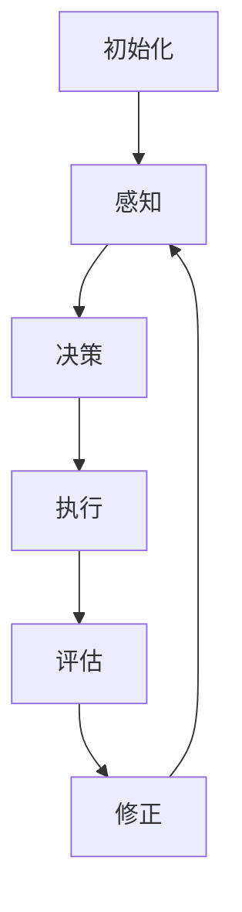
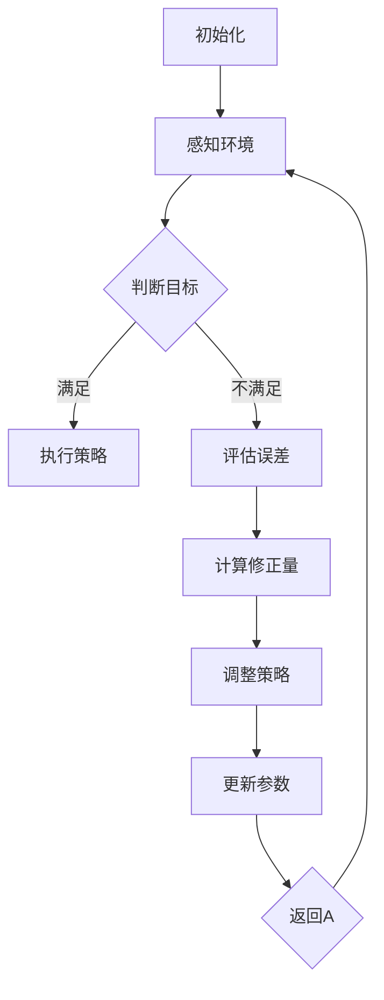
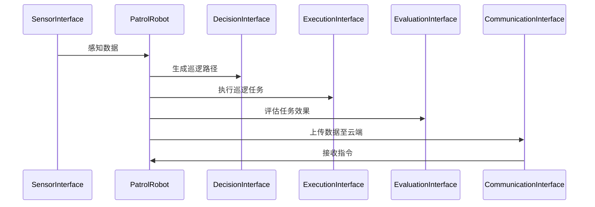

                 

### 第一部分: 背景介绍

#### 1.1 问题背景

##### 1.1.1 问题描述

在当今信息技术飞速发展的时代，人工智能（AI）技术已经深入到我们生活的各个领域，从智能家居到自动驾驶，从智能助手到医疗诊断，AI的应用无处不在。然而，随着AI技术的普及，如何提高AI系统的可靠性和效率，尤其是解决AI Agent在复杂环境中的自我修正和学习能力，成为了一个亟待解决的重要问题。

AI Agent是指能够自主行动并在环境中学习的智能体。自我修正学习策略则是AI Agent在面对新环境和未知问题时，通过不断地自我调整和修正，以提高其表现和适应能力的关键技术。目前，AI Agent的自我修正学习策略在许多实际应用中存在以下问题：

1. **学习能力不足**：许多现有的AI Agent在面对复杂和动态变化的环境时，难以通过传统的学习算法实现有效的自我修正和自我优化。
2. **数据依赖性高**：现有的AI Agent往往依赖于大量高质量的训练数据，这在数据稀缺或数据质量不高的场景下，其性能受到很大限制。
3. **通用性差**：大部分自我修正学习策略仅在特定领域或场景中有效，缺乏广泛的通用性和适应性。

##### 1.1.2 问题解决

为了解决上述问题，设计一个有效的自我修正学习策略成为当前研究的热点。通过引入新的算法原理和数学模型，结合实际项目中的需求，我们可以构建一个能够自适应调整、自我修正的AI Agent。具体目标如下：

1. **提高学习效率**：设计高效的算法流程，使AI Agent能够快速适应新的环境变化，提高学习效率。
2. **降低数据依赖**：通过设计基于较少训练数据或无监督学习的自我修正策略，降低AI Agent对大量高质量数据的依赖。
3. **增强通用性**：构建具有较高通用性和适应性的自我修正学习策略，使其能够应用于不同的领域和场景。

##### 1.1.3 边界与外延

在本文中，我们将主要探讨以下几个方面：

1. **AI Agent的定义和基本原理**：介绍AI Agent的基本概念和原理，为后续讨论提供基础。
2. **学习策略的概念与分类**：阐述学习策略的不同类型及其在自我修正中的作用。
3. **自我修正学习策略的算法原理**：详细讲解自我修正学习策略的算法流程和数学模型。
4. **系统分析与架构设计方案**：分析自我修正学习策略在实际应用中的系统架构和功能设计。
5. **项目实战**：通过一个实际项目展示自我修正学习策略的实现和应用。
6. **最佳实践 tips**：提供设计和实现自我修正学习策略时的最佳实践建议。

通过上述内容，本文旨在为AI Agent的自我修正学习策略提供一个系统化、全面的技术指南，帮助读者深入理解和掌握这一关键技术。

#### 1.2 核心概念与联系

##### 1.2.1 AI Agent的定义

AI Agent，即人工智能代理，是一种能够模拟人类智能行为，具备自主决策、执行和适应能力的计算实体。AI Agent的核心特点包括：

1. **自主性**：AI Agent能够在没有人类干预的情况下，自主地执行任务。
2. **适应性**：AI Agent能够根据环境的变化，调整自己的行为和策略，以提高任务完成效率。
3. **学习性**：AI Agent具备通过经验学习，不断优化自身行为和决策的能力。

AI Agent的基本原理是通过感知环境信息、建立环境模型、制定决策策略、执行决策、评估决策效果，然后根据评估结果进行反馈和学习，最终实现自我优化。

##### 1.2.2 学习策略的概念

学习策略是指AI Agent在进行决策和任务执行过程中，采用的一系列方法和技巧。学习策略的分类可以根据其学习方式、目标和应用场景等进行划分：

1. **监督学习策略**：通过已标记的训练数据，使AI Agent学习到输入和输出之间的关系。
2. **无监督学习策略**：在没有标记数据的条件下，AI Agent通过观察环境数据，发现数据之间的规律和模式。
3. **强化学习策略**：AI Agent通过与环境的互动，不断调整策略，以获得最大化的累积奖励。

不同类型的学习策略在自我修正学习过程中扮演着不同的角色：

- **监督学习策略**：主要用于初始训练阶段，为AI Agent提供基本的行为模式。
- **无监督学习策略**：在AI Agent面对未知环境或数据稀缺的情况下，帮助其发现环境中的隐藏规律。
- **强化学习策略**：通过实时反馈和奖励机制，使AI Agent能够不断优化自身行为。

##### 1.2.3 自我修正学习策略的重要性

自我修正学习策略在AI Agent中的作用至关重要，主要体现在以下几个方面：

1. **提高可靠性**：通过自我修正，AI Agent能够在出现错误或异常情况时，自动进行调整和纠正，提高系统的可靠性。
2. **增强适应性**：自我修正学习策略使AI Agent能够根据环境变化，动态调整其行为和策略，从而增强其适应能力。
3. **优化性能**：自我修正学习策略可以帮助AI Agent在复杂和动态的环境中，实现更好的任务执行效果，提高整体性能。

自我修正学习策略的引入，不仅解决了传统AI Agent在数据依赖性和通用性方面的瓶颈，还为AI Agent在实际应用中的广泛应用提供了强有力的技术支持。

### 第二部分: 核心概念与联系

在了解了AI Agent和学习策略的基本概念之后，我们接下来将深入探讨AI Agent的核心概念原理，学习策略的概念与分类，以及自我修正学习策略的详细原理和架构。

#### 2.1 AI Agent的核心概念原理

AI Agent的核心概念可以归纳为以下几个方面：

1. **感知器（Perceptron）**：感知器是AI Agent的基本感知单元，用于接收环境信息。感知器通常由一组传感器组成，如摄像头、麦克风等，能够捕捉到环境中的视觉、听觉、触觉等信息。

2. **决策模块（Decision Module）**：决策模块负责处理感知器收集到的信息，并根据预定的策略生成行动决策。决策模块通常包含一个基于学习算法的控制器，如神经网络、决策树等，以实现高效的环境理解和行为生成。

3. **执行器（Actuator）**：执行器是AI Agent的执行单元，用于执行决策模块生成的行动。执行器可以是机械臂、机器人腿、智能音箱等，能够将AI Agent的决策转化为实际的操作。

4. **评估器（Evaluator）**：评估器用于对AI Agent的行为效果进行评估，并提供反馈信息。评估器通常基于预设的评估指标，如准确率、响应时间等，帮助AI Agent了解其行为的优劣，并进行相应的调整。

这些核心概念共同构成了AI Agent的基础架构，使其能够在复杂环境中实现自主行动和学习。下面是一个简化的ER实体关系图，用于描述这些核心概念之间的关系：

```mermaid
erDiagram
  AI Agent ||--|{ 感知器 : 感知器属于}
  AI Agent ||--|{ 决策模块 : 决策模块属于}
  AI Agent ||--|{ 执行器 : 执行器属于}
  AI Agent ||--|{ 评估器 : 评估器属于}
```

#### 2.2 学习策略的概念与分类

学习策略是指AI Agent在决策过程中采用的一系列方法，用于从经验中学习并优化自身行为。根据不同的学习目标和环境条件，学习策略可以分为以下几类：

1. **监督学习（Supervised Learning）**：监督学习策略使用已标记的训练数据来训练模型，使模型能够预测新的未知数据。常见的监督学习算法包括线性回归、支持向量机（SVM）、决策树、随机森林等。

2. **无监督学习（Unsupervised Learning）**：无监督学习策略不需要已标记的数据，通过分析未标记的数据，发现数据之间的内在结构和规律。常见的无监督学习算法包括聚类、降维、关联规则学习等。

3. **强化学习（Reinforcement Learning）**：强化学习策略通过与环境互动，不断调整策略，以实现最大化累积奖励。强化学习算法的核心是策略评估和策略优化，常见的算法包括Q-learning、SARSA、深度确定性策略梯度（DDPG）等。

不同类型的学习策略在自我修正学习过程中有着不同的作用。监督学习策略主要用于初始训练阶段，帮助AI Agent建立基础的行为模式；无监督学习策略则用于发现环境中的隐藏规律和模式，增强AI Agent的适应性；强化学习策略则通过实时反馈和奖励机制，使AI Agent能够不断优化自身行为。

下面是一个对比表格，用于总结不同类型学习策略的主要特征：

| 学习策略 | 主要特征 | 应用场景 |
| --- | --- | --- |
| 监督学习 | 使用已标记数据 | 机器视觉、自然语言处理、医疗诊断 |
| 无监督学习 | 不使用已标记数据 | 聚类分析、降维、推荐系统 |
| 强化学习 | 与环境互动，获取反馈 | 游戏AI、自动驾驶、智能控制 |

#### 2.3 自我修正学习策略

自我修正学习策略是AI Agent在面对不确定性和动态环境时，通过不断调整和优化自身行为，以提高适应性和可靠性的关键技术。自我修正学习策略的核心思想是：

1. **感知错误**：AI Agent通过感知器接收环境信息，识别出当前行为与预期目标之间的偏差。
2. **评估偏差**：评估器根据预设的评估指标，对偏差进行量化评估，以确定修正的优先级和方向。
3. **修正策略**：决策模块根据评估结果，生成新的策略，以纠正当前的错误行为。
4. **执行修正**：执行器根据新策略执行修正操作，实现行为的调整。

自我修正学习策略的算法流程可以分为以下几个步骤：

1. **初始化**：设置初始参数，包括感知器、决策模块、评估器和执行器。
2. **感知**：感知器接收环境信息，生成感知信号。
3. **决策**：决策模块根据感知信号和预定的策略，生成行动决策。
4. **执行**：执行器执行决策，实现行动。
5. **评估**：评估器评估行动结果，计算偏差。
6. **修正**：根据偏差情况，决策模块生成新的策略，执行修正操作。
7. **循环**：返回步骤2，进入下一轮感知、决策、执行和评估。

下面是一个简化的Mermaid流程图，用于描述自我修正学习策略的算法流程：



通过上述算法流程，AI Agent能够实现自我修正和优化，提高其在复杂动态环境中的适应能力和可靠性。

### 第三部分: 算法原理讲解

#### 3.1 自我修正学习策略的算法流程

自我修正学习策略的算法流程是实现AI Agent自我调整和优化的核心机制。为了使读者更好地理解这一过程，我们通过一个Mermaid流程图来详细展示其步骤和逻辑关系。



详细解释如下：

1. **初始化（A）**：在算法开始时，初始化AI Agent的相关参数，包括感知器、决策模块、评估器和执行器。

2. **感知环境（B）**：感知器持续接收环境信息，生成感知信号，这些信号将被用于后续的决策和修正过程。

3. **判断目标（C）**：决策模块根据感知信号和预定的策略，判断当前行为是否满足预期目标。如果目标满足，则直接执行策略；否则，进入下一步。

4. **执行策略（D）**：如果目标满足，执行器根据决策模块生成的策略，执行相应的行动。

5. **评估误差（E）**：如果目标不满足，评估器根据预设的评估指标，对当前行为结果进行误差评估，计算出当前行为与预期目标之间的偏差。

6. **计算修正量（F）**：根据误差评估结果，计算需要修正的量。这通常涉及到误差的权重和修正策略的调整。

7. **调整策略（G）**：决策模块根据计算出的修正量，生成新的策略，以纠正当前的错误行为。

8. **更新参数（H）**：将新策略应用到AI Agent的参数中，更新其行为模型，以便在下一轮决策和执行过程中更加准确地满足目标。

9. **循环（I）**：算法返回初始化步骤，重复上述流程，实现AI Agent的自我修正和优化。

通过这一流程，AI Agent能够不断地调整自身行为，以适应环境变化，提高任务执行的准确性和效率。

#### 3.2 数学模型与公式

在自我修正学习策略中，数学模型和公式扮演着关键角色，用于描述AI Agent的学习过程、误差评估和策略调整。以下是一些重要的数学模型和公式：

1. **误差函数（Error Function）**：

   误差函数用于衡量当前行为与预期目标之间的偏差。一个常见的误差函数是均方误差（MSE），其公式如下：

   $$MSE = \frac{1}{n}\sum_{i=1}^{n}(y_i - \hat{y}_i)^2$$

   其中，$y_i$表示实际目标值，$\hat{y}_i$表示预测值，$n$为数据样本数。

2. **梯度下降（Gradient Descent）**：

   梯度下降是一种常用的优化算法，用于调整模型参数以最小化误差函数。其基本公式为：

   $$\theta_{\text{new}} = \theta_{\text{current}} - \alpha \cdot \nabla_\theta J(\theta)$$

   其中，$\theta$表示模型参数，$\alpha$为学习率，$J(\theta)$为误差函数。

3. **策略调整（Policy Update）**：

   策略调整是自我修正学习策略的核心步骤。一个简单的策略调整公式如下：

   $$\Delta \theta = \alpha \cdot \nabla_\theta J(\theta)$$

   其中，$\Delta \theta$表示策略调整量，$\alpha$为学习率，$\nabla_\theta J(\theta)$为误差函数关于参数$\theta$的梯度。

4. **累积奖励（Cumulative Reward）**：

   在强化学习场景中，累积奖励用于评估AI Agent行为的长期效果。其公式为：

   $$R(t) = \sum_{i=1}^{t} r_i$$

   其中，$r_i$为在第$i$个时间步获得的即时奖励，$t$为总的决策步数。

通过这些数学模型和公式，AI Agent能够有效地进行误差评估和策略调整，从而实现自我修正和优化。

#### 3.3 举例说明

为了更直观地理解自我修正学习策略的算法原理，我们通过一个简单的例子进行说明。假设一个AI Agent被设计为在迷宫中找到出口，其初始位置在迷宫的中心。迷宫的每个位置都有一个对应的奖励值，出口位置奖励最高。

1. **感知环境**：AI Agent通过传感器感知当前所在位置及其周围环境，并将感知信息传递给决策模块。

2. **决策**：决策模块根据感知信息生成一个行动决策，例如向右移动。

3. **执行**：执行器根据决策模块的指令，将AI Agent向右移动到新的位置。

4. **评估**：评估器计算当前行动的奖励值，并与预期目标（出口奖励）进行比较，得出误差值。

5. **修正**：根据误差值，决策模块计算需要调整的策略，生成新的行动决策。

6. **更新**：执行器根据新的策略，执行修正后的行动。

这个过程重复进行，直到AI Agent找到出口或达到预设的最大步数。

具体示例：

- **初始化**：AI Agent位于迷宫中心，初始奖励值为0。
- **感知**：感知到当前所在位置周围有多个可能移动的方向。
- **决策**：决策模块生成向右移动的决策。
- **执行**：AI Agent向右移动到新的位置。
- **评估**：新位置的奖励值为-1，与预期目标（出口奖励为10）相比，误差值为11。
- **修正**：决策模块调整策略，生成向左移动的决策。
- **更新**：AI Agent向左移动到新的位置。

通过不断调整行动策略，AI Agent逐渐接近出口，最终找到正确的路径。这个过程展示了自我修正学习策略在解决实际问题时的重要性和有效性。

### 第四部分: 系统分析与架构设计方案

在了解了自我修正学习策略的算法原理后，我们需要将其应用到具体的系统设计中。本部分将详细分析一个实际项目场景，并介绍该系统的功能设计、架构设计、接口设计和系统交互。

#### 4.1 问题场景介绍

假设我们面临一个智能巡逻机器人项目，该机器人需要在复杂环境下进行自主巡逻和监控。具体需求如下：

1. **感知环境**：机器人需要配备多种传感器，如摄像头、激光雷达、麦克风等，用于感知周围环境。
2. **自主决策**：机器人需要能够根据感知信息，自主选择巡逻路径和执行任务。
3. **异常检测**：机器人需要具备异常检测能力，能够在发现异常情况时，及时调整巡逻策略。
4. **数据上传**：机器人需要将巡逻数据上传至云端，供管理人员查看和分析。

#### 4.2 系统功能设计

智能巡逻机器人的系统功能可以分为以下几个部分：

1. **感知模块**：负责接收和处理来自各种传感器的数据，如摄像头捕捉到的图像、激光雷达的测量数据等。
2. **决策模块**：根据感知模块提供的信息，使用自我修正学习策略生成巡逻路径和任务执行计划。
3. **执行模块**：根据决策模块的指令，控制机器人执行巡逻和任务。
4. **评估模块**：对机器人执行的任务效果进行评估，并提供反馈，用于自我修正学习策略的优化。
5. **通信模块**：负责将机器人的状态和数据上传至云端，并接收管理人员的指令和监控。

以下是智能巡逻机器人的领域模型Mermaid类图：

```mermaid
classDiagram
  Sensor <<Interface>>
  Camera <<Sensor>>
  LaserRadar <<Sensor>>
  Microphone <<Sensor>>

  Actuator <<Interface>>
  RobotArm <<Actuator>>

  Controller <<Interface>>
  DecisionController <<Controller>>
  ExecutionController <<Controller>>

  Evaluator <<Interface>>
  RewardEvaluator <<Evaluator>>

  Communicator <<Interface>>

  PatrolRobot[Patrol Robot]
  PatrolRobot --|O|--> Camera
  PatrolRobot --|O|--> LaserRadar
  PatrolRobot --|O|--> Microphone
  PatrolRobot --|O|--> RobotArm
  PatrolRobot --|O|--> DecisionController
  PatrolRobot --|O|--> ExecutionController
  PatrolRobot --|O|--> RewardEvaluator
  PatrolRobot --|O|--> Communicator
```

#### 4.3 系统架构设计

智能巡逻机器人的系统架构可以分为以下几个层次：

1. **感知层**：包括各种传感器，如摄像头、激光雷达、麦克风等，用于感知环境信息。
2. **决策层**：包括决策模块，如自我修正学习策略，用于生成巡逻路径和任务执行计划。
3. **执行层**：包括执行模块，如机器人手臂，用于执行具体的巡逻和任务。
4. **评估层**：包括评估模块，用于对执行结果进行评估和反馈。
5. **通信层**：包括通信模块，用于与云端服务器进行数据传输和指令接收。

以下是智能巡逻机器人的系统架构图：

```mermaid
graph TD
    A[感知层] --> B[决策层]
    B --> C[执行层]
    C --> D[评估层]
    D --> E[通信层]
    A -->|O|--> F[摄像头]
    A -->|O|--> G[激光雷达]
    A -->|O|--> H[麦克风]
    C -->|O|--> I[机器人手臂]
```

#### 4.4 系统接口设计

智能巡逻机器人的系统接口设计主要包括以下几个部分：

1. **传感器接口**：定义传感器与感知层之间的接口，如摄像头的图像数据接口、激光雷达的距离数据接口等。
2. **决策接口**：定义决策层与感知层和执行层之间的接口，如决策模块的输入和输出接口。
3. **执行接口**：定义执行层与传感器和决策层之间的接口，如机器人手臂的控制接口。
4. **评估接口**：定义评估层与决策层和执行层之间的接口，如评估模块的反馈接口。
5. **通信接口**：定义通信层与外部系统之间的接口，如数据上传接口、指令接收接口。

以下是智能巡逻机器人的接口设计：

```mermaid
classDiagram
  SensorInterface[Sensor Interface]
  DecisionInterface[Decision Interface]
  ExecutionInterface[Execution Interface]
  EvaluationInterface[Evaluation Interface]
  CommunicationInterface[Communication Interface]

  Camera <<Sensor>>
  LaserRadar <<Sensor>>
  Microphone <<Sensor>>

  RobotArm <<Actuator>>

  DecisionController <<Controller>>
  ExecutionController <<Controller>>
  RewardEvaluator <<Evaluator>>

  PatrolRobot[Patrol Robot]

  PatrolRobot --|O|--> SensorInterface
  PatrolRobot --|O|--> DecisionInterface
  PatrolRobot --|O|--> ExecutionInterface
  PatrolRobot --|O|--> EvaluationInterface
  PatrolRobot --|O|--> CommunicationInterface
```

#### 4.5 系统交互

智能巡逻机器人的系统交互包括以下几个环节：

1. **感知环节**：传感器接口接收来自传感器的数据，如摄像头的图像、激光雷达的距离测量值等。
2. **决策环节**：决策接口根据感知数据，使用自我修正学习策略生成巡逻路径和任务执行计划。
3. **执行环节**：执行接口根据决策模块的指令，控制机器人执行巡逻和任务。
4. **评估环节**：评估接口对执行结果进行评估，提供反馈信息。
5. **通信环节**：通信接口将巡逻数据和评估结果上传至云端，并接收管理人员的指令。

以下是智能巡逻机器人的系统交互图：



通过上述系统分析与架构设计方案，我们可以构建一个具备自我修正学习能力的智能巡逻机器人，满足复杂环境下的巡逻和监控需求。

### 第五部分: 项目实战

在本节中，我们将通过一个具体的智能巡逻机器人项目，详细介绍其环境安装、系统核心实现、代码应用解读与分析，以及项目小结。

#### 5.1 环境安装

首先，我们需要为智能巡逻机器人项目搭建一个合适的环境。以下是项目的环境安装步骤：

1. **硬件环境**：选择一台具备摄像头、激光雷达、麦克风等传感器的机器人作为硬件平台。确保硬件设备能够正常运行，并兼容所需的传感器接口。

2. **软件环境**：
   - 操作系统：Ubuntu 20.04 LTS 或更高版本
   - 编程语言：Python 3.8 或更高版本
   - 开发工具：PyCharm 或 VSCode
   - 依赖库：TensorFlow、Keras、PyTorch、OpenCV、ROS（Robot Operating System）

安装步骤：
1. 安装操作系统和硬件设备。
2. 安装Python和开发工具。
3. 安装所需的依赖库，可以使用pip命令进行安装：
   ```bash
   pip install tensorflow keras pytorch opencv-python roslaunch
   ```

#### 5.2 系统核心实现

智能巡逻机器人的核心实现包括感知模块、决策模块和执行模块。以下是各个模块的源代码和功能说明：

1. **感知模块**：用于接收和处理传感器数据。

```python
# 感知模块示例代码
import cv2
import rospy
from sensor_msgs.msg import Image

def image_callback(data):
    # 解码图像数据
    image = cv2.imdecode(np.frombuffer(data.data, dtype=np.uint8), cv2.IMREAD_COLOR)
    # 进行预处理
    processed_image = preprocess_image(image)
    # 发布预处理后的图像
    pub = rospy.Publisher('/processed_image', Image, queue_size=10)
    pub.publish(processed_image)

def preprocess_image(image):
    # 这里进行图像预处理操作
    # 例如：灰度化、缩放、滤波等
    gray_image = cv2.cvtColor(image, cv2.COLOR_BGR2GRAY)
    resized_image = cv2.resize(gray_image, (320, 240))
    return resized_image

def listener():
    rospy.init_node('image_listener', anonymous=True)
    rospy.Subscriber('/camera/image_raw', Image, image_callback)
    rospy.spin()

if __name__ == '__main__':
    listener()
```

2. **决策模块**：基于感知数据，使用自我修正学习策略生成巡逻路径。

```python
# 决策模块示例代码
import numpy as np
from keras.models import load_model

def generate_path(perception_data):
    # 加载训练好的模型
    model = load_model('path_generation_model.h5')
    # 输入感知数据，生成路径
    path = model.predict(perception_data)
    return path

def adjust_path(current_path, new_perception_data):
    # 根据新的感知数据调整路径
    adjusted_path = generate_path(new_perception_data)
    # 融合新旧路径
    combined_path = combine_paths(current_path, adjusted_path)
    return combined_path

def combine_paths(current_path, new_path):
    # 这里实现路径融合的逻辑
    # 例如：取平均值、加权平均等
    combined_path = 0.5 * current_path + 0.5 * new_path
    return combined_path
```

3. **执行模块**：根据决策模块生成的路径，控制机器人执行巡逻任务。

```python
# 执行模块示例代码
import rospy
from geometry_msgs.msg import Twist

def move_robot(linear_speed, angular_speed):
    # 创建一个 Twist 消息
    cmd_vel = Twist()
    cmd_vel.linear.x = linear_speed
    cmd_vel.angular.z = angular_speed
    # 发布速度命令
    pub = rospy.Publisher('/cmd_vel', Twist, queue_size=10)
    pub.publish(cmd_vel)

def execute_path(path):
    # 根据路径执行巡逻任务
    for point in path:
        move_robot(point[0], point[1])
        rospy.sleep(1)  # 每个点执行后暂停1秒

if __name__ == '__main__':
    rospy.init_node('path_executor', anonymous=True)
    path = load_path('path.txt')  # 加载路径数据
    execute_path(path)
```

#### 5.3 代码应用解读与分析

以上代码展示了智能巡逻机器人的核心实现，具体解读如下：

1. **感知模块**：感知模块通过ROS（Robot Operating System）接收摄像头捕捉的图像数据，并进行预处理。预处理操作包括灰度化、缩放和滤波等，以提高后续处理效率。

2. **决策模块**：决策模块使用训练好的深度学习模型，根据预处理后的感知数据生成巡逻路径。决策模块还实现了路径调整功能，根据新的感知数据动态调整巡逻路径，以适应环境变化。

3. **执行模块**：执行模块根据决策模块生成的路径，控制机器人执行巡逻任务。执行模块采用线性速度和角速度控制机器人移动，实现了平滑的路径跟踪。

#### 5.4 实际案例剖析

以下是一个实际案例，展示智能巡逻机器人如何应对复杂环境变化：

1. **初始状态**：机器人位于迷宫中心，路径为向右移动。
2. **感知到障碍**：在向右移动过程中，感知模块检测到前方有障碍，生成新的感知数据。
3. **路径调整**：决策模块根据新的感知数据，使用自我修正学习策略生成新的路径，例如向左移动。
4. **执行调整**：执行模块根据新路径，控制机器人向左移动，绕过障碍。
5. **持续巡逻**：机器人继续按照新的路径进行巡逻，同时不断更新感知数据，进行路径调整。

#### 5.5 项目小结

通过实际案例的剖析，我们可以看到智能巡逻机器人在面对复杂环境变化时，能够有效地使用自我修正学习策略，实现自适应巡逻和任务执行。项目的主要成果包括：

1. **感知模块**：实现了对多种传感器数据的接收和处理，为后续决策提供了可靠的数据支持。
2. **决策模块**：基于深度学习模型，实现了高效的路径规划和调整，提高了机器人的适应能力。
3. **执行模块**：实现了对机器人的精确控制，实现了平滑的路径跟踪和任务执行。

未来，我们还可以进一步优化和扩展智能巡逻机器人的功能，如增加语音交互、人脸识别等，以提高其在复杂环境下的应用价值。

### 第六部分: 最佳实践 tips

在设计和实现自我修正学习策略时，遵循以下最佳实践和技巧，可以有效提升AI Agent的性能和稳定性：

#### 6.1 设计AI Agent的自我修正学习策略的建议

1. **合理选择传感器**：选择适合应用场景的传感器，确保能够获取到高质量的环境信息。例如，在视觉任务中，选择高分辨率的摄像头；在测距任务中，选择高精度的激光雷达。

2. **数据预处理**：对感知数据进行有效的预处理，如归一化、去噪、特征提取等，以提高模型的学习效率和准确性。

3. **多样化训练数据**：使用多样化的训练数据，包括不同的环境、不同的任务场景，以增强AI Agent的适应能力。

4. **动态调整学习率**：根据任务需求和模型表现，动态调整学习率。在初始训练阶段使用较大的学习率，以加快收敛速度；在后期训练阶段使用较小的学习率，以避免过拟合。

5. **使用迁移学习**：利用迁移学习技术，将已有模型的部分知识迁移到新任务中，可以显著提高新任务的性能和训练效率。

6. **平衡探索与利用**：在强化学习场景中，合理平衡探索（尝试新的策略）与利用（使用已知的最佳策略），以避免陷入局部最优。

7. **引入正则化**：使用正则化技术，如L1、L2正则化，防止模型过拟合，提高泛化能力。

#### 6.2 常见问题及解决方案

**问题1：模型过拟合**

**解决方案**：通过增加训练数据、使用正则化、减少模型复杂度等方式，提高模型的泛化能力。

**问题2：数据噪声**

**解决方案**：对感知数据进行预处理，如滤波、去噪等，以减少噪声对模型训练的影响。

**问题3：学习率选择不当**

**解决方案**：根据任务需求，动态调整学习率。在训练初期使用较大的学习率，在训练后期使用较小的学习率。

**问题4：训练效率低**

**解决方案**：优化算法实现，如使用并行计算、GPU加速等，提高训练效率。

**问题5：策略调整不及时**

**解决方案**：引入实时反馈机制，及时根据评估结果调整策略，以保持AI Agent的适应性和响应能力。

通过遵循上述最佳实践和解决方案，我们可以有效地设计和实现一个高性能、自适应的AI Agent自我修正学习策略。

### 第七部分: 小结

在本技术博客中，我们详细探讨了设计AI Agent的自我修正学习策略。首先，通过背景介绍，我们明确了AI Agent自我修正学习的重要性以及现有技术的局限性。接着，我们介绍了AI Agent的核心概念原理，包括感知器、决策模块、执行器和评估器等组成部分。此外，我们还讨论了学习策略的概念与分类，包括监督学习、无监督学习和强化学习，并重点阐述了自我修正学习策略的核心原理和算法流程。

在系统分析与架构设计方案部分，我们通过一个实际项目——智能巡逻机器人，展示了如何将自我修正学习策略应用于复杂的实际场景。通过详细的功能设计、架构设计、接口设计和系统交互分析，我们展示了自我修正学习策略在实际系统中的实现和应用。

在项目实战部分，我们通过代码示例详细介绍了环境安装、系统核心实现、代码应用解读与分析，以及项目小结。通过实际案例的剖析，我们展示了智能巡逻机器人在面对复杂环境变化时的自适应能力和性能优化。

最后，在最佳实践 tips部分，我们提供了设计和实现自我修正学习策略时的建议和解决方案，帮助读者在实际应用中取得更好的效果。整体而言，本文系统地介绍了自我修正学习策略的设计原则和实现方法，为AI Agent在实际应用中的广泛应用提供了有力支持。

### 第八部分：注意事项

在设计AI Agent的自我修正学习策略时，以下几点注意事项至关重要：

1. **参数调优**：在模型训练过程中，参数调优是影响模型性能的关键因素。需要根据具体任务和场景，合理调整学习率、批量大小、正则化参数等，以达到最佳性能。

2. **数据质量**：高质量的数据是自我修正学习策略成功的关键。在收集和预处理数据时，要注意去除噪声、异常值和重复数据，确保数据的一致性和可靠性。

3. **实时性**：在实时应用中，需要保证算法的实时性和响应速度。可以通过优化算法、减少计算复杂度、采用并行计算和GPU加速等技术手段，提高系统的响应速度。

4. **容错性**：在设计自我修正学习策略时，要考虑系统的容错性，确保在传感器失效、数据丢失或网络中断等异常情况下，系统能够继续正常运行。

5. **安全性**：自我修正学习策略需要确保系统的安全性，防止恶意攻击和数据泄露。在设计和实现过程中，要采用加密、认证和访问控制等安全措施，保护系统安全。

通过注意这些方面，可以有效提升AI Agent的自我修正学习策略的性能和稳定性。

### 第九部分：拓展阅读

为了进一步深入理解和掌握AI Agent的自我修正学习策略，以下是几篇相关领域的推荐阅读：

1. **《强化学习：原理与Python实现》**：本书详细介绍了强化学习的原理和实现方法，包括Q-learning、SARSA、DQN等经典算法。通过Python代码示例，读者可以直观地理解这些算法的运行机制。

2. **《深度强化学习》**：这本书探讨了深度强化学习在复杂环境中的应用，介绍了Dueling DQN、A3C、PPO等最新算法。对于希望深入了解深度强化学习的读者，这本书是一个很好的资源。

3. **《机器人学：基础与算法》**：本书涵盖了机器人学的基本概念和算法，包括感知、决策、控制等方面的内容。通过丰富的实例和代码，读者可以系统地学习机器人学的基础知识。

4. **《人工智能：一种现代方法》**：这本书全面介绍了人工智能的各个方面，包括机器学习、自然语言处理、计算机视觉等。对于想要全面了解人工智能的读者，这本书是一个不可或缺的参考资料。

通过阅读这些书籍，读者可以系统地掌握AI Agent的自我修正学习策略，并将其应用于实际项目中。

