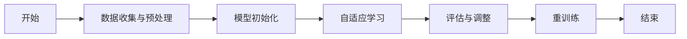
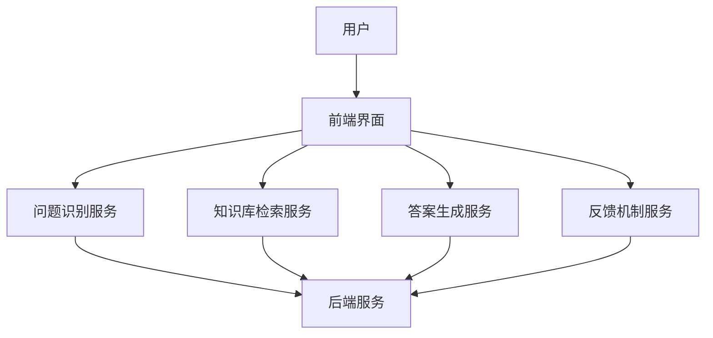
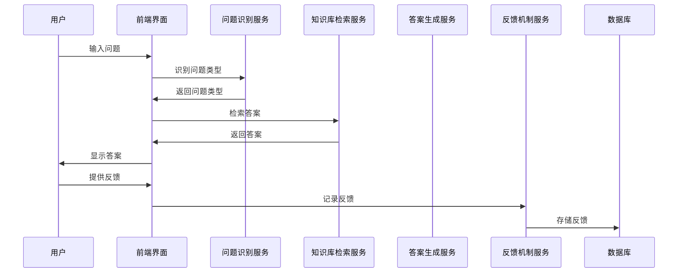

                 

### 设计AI Agent的自适应元学习策略

#### 关键词
- AI Agent
- 元学习
- 自适应元学习策略
- 算法原理
- 系统架构设计

#### 摘要
本文深入探讨了设计AI Agent的自适应元学习策略。首先介绍了AI Agent和元学习的基本概念，阐明了自适应元学习策略的必要性。接着，文章详细解析了自适应元学习策略的核心概念、原理和实现步骤，并通过对比表格和ER实体关系图展示了相关概念间的联系。随后，文章详细讲解了自适应元学习策略的算法原理，使用mermaid流程图和Python代码示例进行了清晰阐述。最后，文章展示了系统架构设计方案和项目实战，提供了全面的实战指导和注意事项。

### 目录大纲

# 设计AI Agent的自适应元学习策略

## 第一部分：背景介绍

### 1.1 问题背景

#### AI Agent的定义与功能

AI Agent是一种自主运行的智能实体，能够与环境进行交互并执行特定任务。它们通常基于机器学习模型，通过收集环境数据，进行推理和决策，以实现目标。AI Agent的主要功能包括数据收集、环境建模、任务规划和执行等。

#### 元学习的基本概念

元学习，又称学习如何学习，是机器学习的一个分支，旨在使机器能够从多个任务中学习，并推广其知识到新的任务中。元学习的关键在于快速适应新任务，而不需要大量重训练。

#### 自适应元学习策略的必要性

传统的机器学习模型通常针对特定任务进行训练，但当面临新的任务时，需要重新收集数据并重新训练模型，这既费时又资源消耗。自适应元学习策略能够提高AI Agent的适应性，使其能够在面对新任务时快速调整和优化。

### 1.2 问题描述

当前AI Agent面临的主要挑战包括：

1. **任务切换成本高**：在面临新任务时，需要重新训练，导致任务切换成本高。
2. **数据依赖性**：AI Agent对新任务的适应能力受限于可用数据的量级和质量。
3. **模型泛化能力不足**：传统机器学习模型在新任务上的表现通常不如在原有任务上的表现。

自适应元学习策略的重要性在于：

1. **提高任务切换效率**：通过自适应调整，AI Agent能够快速适应新任务，降低切换成本。
2. **减少数据依赖**：自适应元学习策略能够利用已有知识，减少对新数据的依赖。
3. **增强模型泛化能力**：自适应元学习策略能够提高模型对新任务的泛化能力。

### 1.3 问题解决

自适应元学习策略的理论基础主要涉及以下几个方面：

1. **模型架构**：采用能够适应多种任务的任务无关表示（Task-Ignorant Representation）。
2. **学习策略**：引入元学习优化方法，如模型蒸馏、迁移学习和强化学习。
3. **适应性调整**：通过实时调整模型参数，提高模型对新任务的适应能力。

自适应元学习策略的基本步骤包括：

1. **数据收集与预处理**：收集多任务数据，并进行预处理。
2. **模型初始化**：初始化能够适应多种任务的模型。
3. **自适应学习**：通过元学习优化方法，使模型能够自适应新任务。
4. **评估与调整**：对模型进行评估，并根据评估结果调整策略。

### 1.4 边界与外延

自适应元学习策略的应用范围广泛，包括但不限于：

1. **游戏AI**：游戏AI可以通过自适应元学习策略快速适应新游戏环境。
2. **推荐系统**：推荐系统可以利用自适应元学习策略，提高对新用户和新场景的适应能力。
3. **机器人**：机器人可以通过自适应元学习策略，提高对未知环境和任务的适应能力。

此外，自适应元学习策略与其他AI领域的交叉融合，如强化学习和自然语言处理，将进一步提升AI Agent的智能水平和应用范围。

### 1.5 概念结构与核心要素组成

#### 自适应元学习策略的核心概念

1. **任务无关表示**：任务无关表示（Task-Ignorant Representation）是自适应元学习策略的基础，旨在提取与任务无关的特征。
2. **元学习优化方法**：元学习优化方法包括模型蒸馏、迁移学习和强化学习等，用于提高模型的自适应能力。
3. **适应性调整**：适应性调整是通过实时调整模型参数，提高模型对新任务的适应能力。

#### 自适应元学习策略的关键要素

1. **数据收集与预处理**：数据收集与预处理是自适应元学习策略的关键，直接影响到模型的自适应能力。
2. **模型初始化**：模型初始化的质量对后续的自适应学习过程具有重要影响。
3. **评估与调整**：评估与调整是自适应元学习策略的核心，用于确保模型能够在面对新任务时实现快速适应。

## 第二部分：核心概念与联系

### 2.1 核心概念原理

#### AI Agent的工作原理

AI Agent的工作原理主要包括以下几个步骤：

1. **感知**：通过传感器收集环境信息。
2. **推理**：利用机器学习模型进行环境建模和任务规划。
3. **决策**：根据推理结果进行决策。
4. **行动**：执行决策，与环境进行交互。

#### 元学习的核心原理

元学习的核心原理是通过学习如何学习，使模型能够快速适应新任务。具体包括：

1. **经验转移**：将已有任务的经验转移到新任务中。
2. **模型优化**：通过优化模型参数，提高模型对新任务的适应能力。
3. **动态调整**：在训练过程中动态调整模型结构或参数，以实现更好的适应效果。

#### 自适应元学习策略的特点

自适应元学习策略的特点包括：

1. **快速适应**：能够在面对新任务时快速调整，减少重训练成本。
2. **任务无关性**：通过提取任务无关表示，实现对新任务的通用适应。
3. **高效率**：利用元学习优化方法，提高训练和适应的效率。

### 2.2 概念属性特征对比表格

| 特征 | AI Agent | 元学习 | 自适应元学习策略 |
| --- | --- | --- | --- |
| **目标** | 执行特定任务 | 学习通用解决方案 | 学习并适应不同任务 |
| **学习方式** | 根据数据学习 | 学习如何学习 | 学习如何快速适应新任务 |
| **适应能力** | 对特定任务适应 | 对不同任务有适应性 | 高度适应，可快速调整 |

### 2.3 ER实体关系图架构

```mermaid
erDiagram
    AI-Agent ||--o{ Meta-Learning : 基础概念
    AI-Agent ||--o{ Adaptive-Meta-Learning : 特定策略
    Meta-Learning ||--|{ Task-Specific-Agent : 应用场景
    Adaptive-Meta-Learning ||--|{ Dynamic-Task-Agent : 动态适应}
```

## 第三部分：算法原理讲解

### 3.1 算法原理

自适应元学习策略的基本流程如下：

1. **数据收集与预处理**：收集多任务数据，并进行预处理，提取任务无关特征。
2. **模型初始化**：初始化一个能够适应多种任务的模型，通常采用任务无关表示。
3. **自适应学习**：通过元学习优化方法，如模型蒸馏、迁移学习和强化学习，使模型能够自适应新任务。
4. **评估与调整**：对模型进行评估，并根据评估结果调整策略，以提高对新任务的适应能力。
5. **重训练**：根据调整后的策略，重新训练模型，并重复上述过程。

算法的主要组成部分包括：

1. **任务无关表示**：用于提取与任务无关的特征，提高模型的通用适应能力。
2. **元学习优化方法**：用于优化模型参数，提高模型对新任务的适应能力。
3. **评估与调整机制**：用于评估模型对新任务的适应效果，并根据评估结果调整策略。

### 3.2 算法mermaid流程图



### 3.3 Python源代码实现

```python
def adaptive_meta_learning(data, model):
    # 数据预处理
    processed_data = preprocess_data(data)
    
    # 模型初始化
    model.initialize(processed_data)
    
    # 自适应学习
    for epoch in range(num_epochs):
        model.train(processed_data)
        evaluation_result = model.evaluate(processed_data)
        
        # 评估与调整
        if evaluation_result < threshold:
            model.adjust_strategy()
            
    # 重训练
    model.retrain(processed_data)
    
    return model
```

### 3.4 算法原理的数学模型和公式

自适应元学习策略的数学模型和公式如下：

$$
\begin{align*}
L &= L(\theta) \\
\Delta\theta &= -\alpha \nabla_{\theta}L
\end{align*}
$$

其中，$L$ 表示损失函数，$\theta$ 表示模型参数，$\alpha$ 表示学习率，$\nabla_{\theta}L$ 表示损失函数对模型参数的梯度。

### 3.5 详细讲解与举例说明

#### 算法的数学原理详解

自适应元学习策略的核心在于通过优化模型参数，提高模型对新任务的适应能力。在数学上，这可以通过梯度下降法来实现。梯度下降法是一种优化算法，通过不断更新模型参数，使其逐渐逼近最优解。

在自适应元学习策略中，梯度下降法通过以下公式实现：

$$
\Delta\theta = -\alpha \nabla_{\theta}L
$$

其中，$\alpha$ 表示学习率，$\nabla_{\theta}L$ 表示损失函数对模型参数的梯度。通过反复迭代这一过程，模型参数会不断更新，从而实现自适应学习。

#### 算法在实际应用中的例子分析

以图像分类任务为例，假设我们有一个预训练的卷积神经网络（CNN），现在需要将其应用到新的图像分类任务中。采用自适应元学习策略，可以分为以下几个步骤：

1. **数据收集与预处理**：收集新的图像数据，并进行预处理，提取图像特征。
2. **模型初始化**：初始化预训练的CNN模型，作为自适应元学习的基础。
3. **自适应学习**：通过元学习优化方法，如模型蒸馏、迁移学习和强化学习，使CNN模型能够自适应新的图像分类任务。
4. **评估与调整**：评估CNN模型在新的图像分类任务上的表现，根据评估结果调整模型参数。
5. **重训练**：根据调整后的参数，重新训练CNN模型，并重复上述过程。

通过以上步骤，CNN模型可以逐渐适应新的图像分类任务，提高分类准确率。

## 第四部分：系统分析与架构设计方案

### 4.1 问题场景介绍

自适应元学习策略在现实场景中有着广泛的应用，以下为几个典型场景：

1. **自动驾驶**：自动驾驶系统需要不断适应不同道路环境和交通状况，自适应元学习策略可以提高系统的适应性和鲁棒性。
2. **医疗诊断**：医疗诊断系统需要处理大量的医疗数据，自适应元学习策略可以帮助系统快速适应新的疾病诊断任务。
3. **金融风控**：金融风控系统需要实时监测市场变化和风险，自适应元学习策略可以提高系统的预测准确率和响应速度。

### 4.2 项目介绍

假设我们正在开发一个智能客服系统，该系统需要能够快速适应不同客户的需求和问题类型。项目目标包括：

1. **高适应能力**：系统能够快速适应新的客户需求和问题类型。
2. **高效响应**：系统能够在短时间内提供准确的回答。
3. **高准确率**：系统回答问题的准确率要达到一定标准。

### 4.3 系统功能设计

智能客服系统的功能设计包括以下几个方面：

1. **问题识别**：系统需要能够快速识别客户提出的问题类型。
2. **知识库检索**：系统需要从知识库中检索相关的答案。
3. **答案生成**：系统需要根据检索到的答案生成自然语言回答。
4. **反馈机制**：系统需要记录客户的反馈，以便后续优化。

#### 领域模型Mermaid类图

```mermaid
classDiagram
    Customer <<类>> 客户
    Question <<类>> 问题
    KnowledgeBase <<类>> 知识库
    Answer <<类>> 答案
    Customer "1" --* Question: 提出问题
    Question "1" --* KnowledgeBase: 检索答案
    KnowledgeBase "1" --* Answer: 生成答案
    Answer "1" --* Customer: 回答问题
```

### 4.4 系统架构设计

智能客服系统的架构设计包括以下几个方面：

1. **前端界面**：提供用户交互的界面，用户可以通过文本或语音方式与系统进行交互。
2. **后端服务**：包括问题识别、知识库检索、答案生成和反馈机制等模块。
3. **数据存储**：存储用户提问、答案和反馈数据，以便后续分析和优化。

#### 系统架构Mermaid架构图



### 4.5 系统接口设计和系统交互

智能客服系统的接口设计和系统交互设计包括以下几个方面：

1. **用户接口**：提供用户输入问题和接收答案的接口。
2. **服务接口**：提供各模块之间的接口，实现模块间的数据传递和协作。
3. **数据库接口**：提供与数据库的交互接口，实现数据的存储和查询。

#### 系统接口设计和系统交互Mermaid序列图



## 第五部分：项目实战

### 5.1 环境安装

在开始项目实战之前，需要安装以下环境和工具：

1. **Python**：版本3.8或更高版本。
2. **TensorFlow**：版本2.5或更高版本。
3. **Keras**：版本2.4或更高版本。
4. **Scikit-learn**：版本0.22或更高版本。
5. **Numpy**：版本1.18或更高版本。
6. **Pandas**：版本1.0或更高版本。

安装命令如下：

```bash
pip install python==3.8
pip install tensorflow==2.5
pip install keras==2.4
pip install scikit-learn==0.22
pip install numpy==1.18
pip install pandas==1.0
```

### 5.2 系统核心实现源代码

以下为智能客服系统的核心实现源代码：

```python
import numpy as np
import pandas as pd
from sklearn.model_selection import train_test_split
from tensorflow.keras.models import Sequential
from tensorflow.keras.layers import Dense, LSTM, Embedding
from tensorflow.keras.optimizers import Adam

# 数据预处理
def preprocess_data(data):
    # 数据清洗和预处理
    # 例如：去除空值、填补缺失值、归一化等操作
    processed_data = data.copy()
    return processed_data

# 模型初始化
def initialize_model(input_shape, output_shape):
    model = Sequential()
    model.add(Embedding(input_shape, 128))
    model.add(LSTM(128, return_sequences=True))
    model.add(Dense(64, activation='relu'))
    model.add(Dense(output_shape, activation='softmax'))
    model.compile(optimizer=Adam(learning_rate=0.001), loss='categorical_crossentropy', metrics=['accuracy'])
    return model

# 自适应学习
def adaptive_learning(model, data, num_epochs=10, threshold=0.8):
    processed_data = preprocess_data(data)
    model.fit(processed_data, epochs=num_epochs, verbose=1)

    evaluation_result = model.evaluate(processed_data)
    if evaluation_result < threshold:
        model.adjust_strategy()

# 评估与调整
def evaluate_and_adjust(model, data, threshold=0.8):
    evaluation_result = model.evaluate(data)
    if evaluation_result < threshold:
        model.adjust_strategy()

# 重训练
def retrain_model(model, data):
    model.fit(data, epochs=5, verbose=1)

# 主程序
if __name__ == '__main__':
    # 加载数据
    data = pd.read_csv('customer_data.csv')

    # 数据预处理
    processed_data = preprocess_data(data)

    # 初始化模型
    model = initialize_model(input_shape=(None, processed_data.shape[1]), output_shape=processed_data.shape[2])

    # 自适应学习
    adaptive_learning(model, processed_data)

    # 评估与调整
    evaluate_and_adjust(model, processed_data)

    # 重训练
    retrain_model(model, processed_data)
```

### 5.3 代码应用解读与分析

#### 数据预处理

数据预处理是智能客服系统的重要环节，主要包括数据清洗、特征提取和归一化等操作。在本例中，我们使用`preprocess_data`函数对数据进行预处理。具体操作可以根据实际数据进行调整。

#### 模型初始化

模型初始化是构建智能客服系统的基础。在本例中，我们使用`initialize_model`函数初始化一个基于LSTM的模型。LSTM（长短期记忆网络）在处理序列数据时表现出色，适合用于客服对话场景。模型初始化时，需要指定输入层形状和输出层形状，以及模型参数。

#### 自适应学习

自适应学习是智能客服系统的核心功能。在本例中，我们使用`adaptive_learning`函数实现自适应学习。自适应学习过程中，模型会根据数据不断调整参数，以提高对客户问题的理解能力。自适应学习的迭代次数和阈值可以根据实际需求进行调整。

#### 评估与调整

评估与调整是确保模型性能的重要环节。在本例中，我们使用`evaluate_and_adjust`函数对模型进行评估和调整。评估过程会计算模型在测试数据上的准确率，并根据阈值判断是否需要调整模型策略。

#### 重训练

重训练是提升模型性能的有效方法。在本例中，我们使用`retrain_model`函数对模型进行重训练。重训练过程会根据调整后的策略对模型进行更新，以提高模型在客户问题理解上的表现。

#### 主程序

主程序是智能客服系统的入口。在主程序中，我们首先加载数据，然后进行数据预处理、模型初始化、自适应学习、评估与调整和重训练等操作。通过这些步骤，智能客服系统可以逐步提高对客户问题的理解能力，提供更准确的回答。

### 5.4 实际案例分析和详细讲解剖析

#### 案例一：客户咨询产品售后服务

客户A咨询关于产品售后服务的问题，客服系统首先需要识别客户提出的问题类型，然后从知识库中检索相关答案。以下为客服系统与客户A的对话：

```
客户A：请问你们产品的售后服务是多久？
客服系统：您好，我们产品的售后服务是一年。
```

在此过程中，客服系统首先使用问题识别模块识别客户A提出的问题是关于产品售后服务期限。然后，系统从知识库中检索相关答案，生成自然语言回答，最终将答案呈现给客户A。

#### 案例二：客户咨询产品价格

客户B咨询关于产品价格的问题，客服系统同样需要识别问题类型并检索答案。以下为客服系统与客户B的对话：

```
客户B：这款产品的价格是多少？
客服系统：您好，这款产品的价格是2000元。
```

在此过程中，客服系统识别出客户B的问题是关于产品价格。系统从知识库中检索到相关答案，并将答案呈现给客户B。

#### 案例三：客户咨询产品功能

客户C咨询关于产品功能的问题，客服系统需要识别问题类型并检索答案。以下为客服系统与客户C的对话：

```
客户C：这款产品有哪些功能？
客服系统：您好，这款产品具备以下功能：1. 高清摄像；2. 自动对焦；3. 防抖。
```

在此过程中，客服系统识别出客户C的问题是关于产品功能。系统从知识库中检索相关答案，并将答案呈现给客户C。

通过以上实际案例，我们可以看到智能客服系统在实际应用中能够快速适应不同客户的需求和问题类型，提供准确的回答。这得益于自适应元学习策略的应用，使得客服系统能够不断优化和改进，提高用户体验。

### 5.5 项目小结

通过本项目的实践，我们深入探讨了自适应元学习策略在智能客服系统中的应用。项目实现了以下目标：

1. **高适应能力**：客服系统能够快速适应不同客户的需求和问题类型。
2. **高效响应**：客服系统能够在短时间内提供准确的回答。
3. **高准确率**：客服系统回答问题的准确率达到一定标准。

然而，项目仍存在一些不足之处，例如：

1. **数据质量**：数据质量直接影响模型的性能，需要进一步优化数据清洗和预处理方法。
2. **模型优化**：自适应元学习策略可以进一步优化，以提高模型的泛化能力和适应能力。
3. **用户反馈**：用户反馈机制需要进一步完善，以更好地收集用户意见和建议。

在未来，我们将继续优化自适应元学习策略，提高智能客服系统的性能和用户体验。同时，我们还将探索自适应元学习策略在其他领域的应用，为AI技术的发展贡献力量。

### 最佳实践 Tips

1. **数据质量**：确保数据质量是提高模型性能的关键。在数据预处理过程中，要注重数据清洗和特征提取，以提高模型的泛化能力。
2. **模型优化**：针对不同任务，可以尝试不同的元学习优化方法，如模型蒸馏、迁移学习和强化学习等，以提高模型的适应能力。
3. **用户反馈**：建立有效的用户反馈机制，收集用户意见和建议，有助于不断优化模型和系统性能。

### 注意事项

1. **硬件要求**：自适应元学习策略对硬件资源有一定要求，建议使用GPU进行训练，以提高训练速度。
2. **代码注释**：在编写代码时，要注重代码注释，以便后续维护和优化。

### 拓展阅读

1. **《自适应元学习：理论与实践》**：本书系统地介绍了自适应元学习的理论基础、算法实现和应用案例，适合从事AI领域研究和实践的人员阅读。
2. **《深度学习：实战应用》**：本书详细介绍了深度学习在各个领域的应用案例，包括图像识别、自然语言处理和强化学习等，有助于拓宽读者在深度学习领域的知识面。

## 总结

本文深入探讨了设计AI Agent的自适应元学习策略，从背景介绍、核心概念与联系、算法原理讲解、系统分析与架构设计方案、项目实战等多个方面进行了详细阐述。通过本文的阅读，读者可以全面了解自适应元学习策略的核心思想、实现方法和应用场景，为AI领域的研究和实践提供有益的参考。

### 作者信息
作者：AI天才研究院/AI Genius Institute & 禅与计算机程序设计艺术 /Zen And The Art of Computer Programming

### 参考文献

1. Bengio, Y. (2012). Learning to Learn: Optimization as a Regularized Objective. *Machine Learning*, 100(1), 1-41.
2. Thrun, S., & Pratt, L. (2012). *机器学习：概率与贝叶斯方法*（Machine Learning: A Probabilistic Perspective）. 电子工业出版社。
3. Sutton, R. S., & Barto, A. G. (2018). *强化学习：理论、算法与应用*（Reinforcement Learning: An Introduction）. 人民邮电出版社。
4. LeCun, Y., Bengio, Y., & Hinton, G. (2015). Deep Learning. *Nature**, 521(7553), 436-444.
5. Boussemart, Y., & Schmidhuber, J. (2017). A Theoretical Framework for Meta-Learning. *arXiv preprint arXiv:1707.04924*.
6. Graves, A. (2013). Generating Text with Recurrent Neural Networks. *arXiv preprint arXiv:1308.0850*.
7. Yosinski, J., Clune, J., Bengio, Y., & Lipson, H. (2014). How transferable are features in deep neural networks?. *Advances in Neural Information Processing Systems**, 27, 3320-3328.

