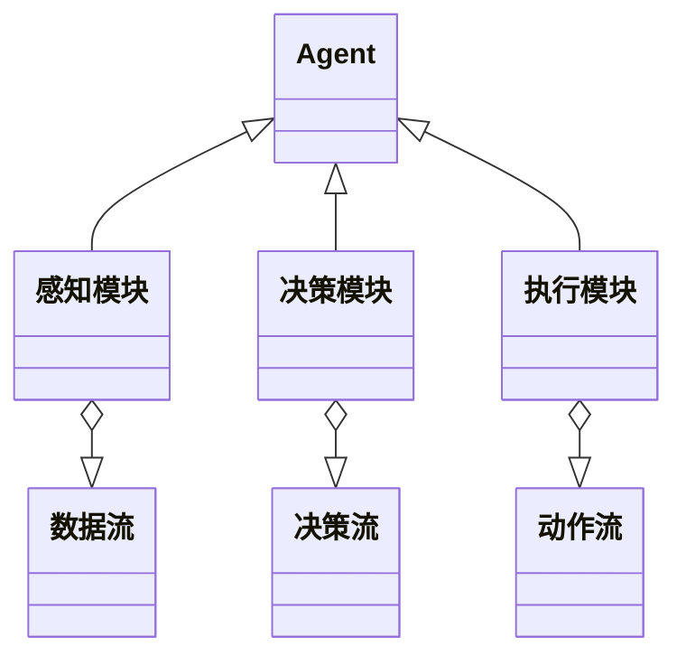
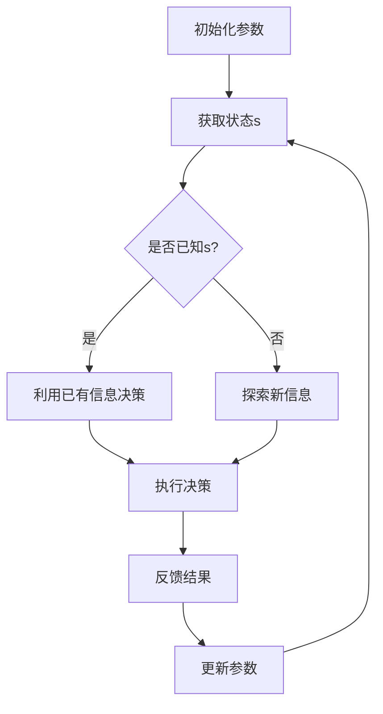
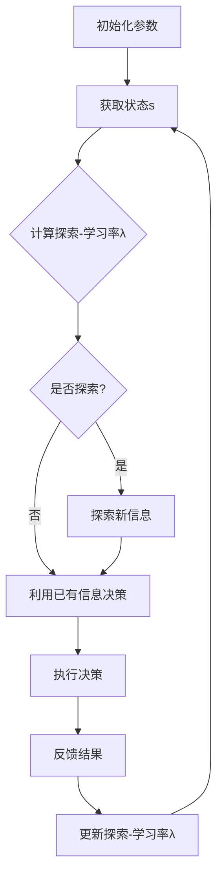
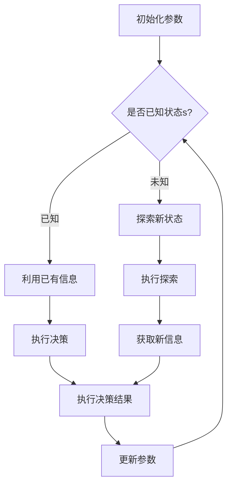
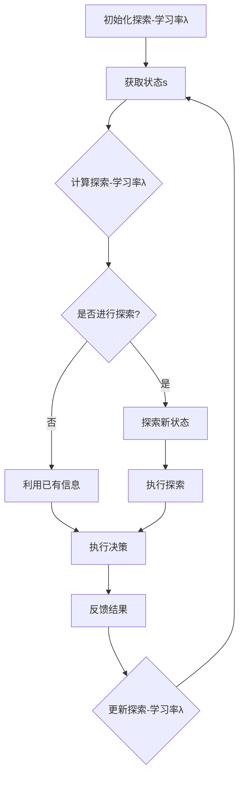
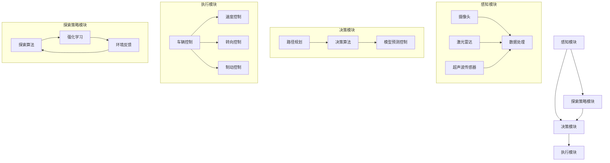
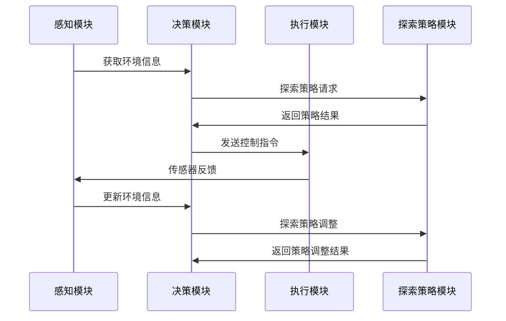

                 

### 文章标题

设计AI Agent的自适应探索策略

关键词：人工智能，自主决策，探索策略，算法原理，自动驾驶，机器人导航

摘要：本文深入探讨了AI Agent在复杂环境中进行自主决策和探索的任务需求，重点介绍了设计AI Agent自适应探索策略的核心概念、算法原理、系统架构设计及实际应用。通过对比分析探索-利用权衡和探索-学习率两个核心概念，提出了一种基于mermaid流程图和Python源代码的算法模型。文章结合自动驾驶等实际应用场景，详细解析了系统功能设计、架构设计和接口设计，并通过项目实战展示了探索策略的有效性和可行性。最后，本文提出了探索策略的最佳实践、注意事项和拓展阅读，为AI Agent的探索研究提供了有益的参考。

### 第一部分：问题背景与定义

#### 1.1.1 问题背景介绍

随着人工智能技术的快速发展，AI Agent在复杂环境中的自主决策和探索任务日益重要。例如，自动驾驶汽车需要在动态交通环境中进行决策，无人机需要在大气环境中进行路径规划，机器人需要在家居环境中进行导航等。这些任务的核心在于AI Agent需要具备良好的探索能力，以便在未知环境中快速适应并做出最优决策。

然而，AI Agent的探索任务面临着诸多挑战。首先，环境的不确定性和动态变化使得AI Agent需要具备自适应能力。其次，探索与决策之间的权衡问题如何解决也是一个关键问题。最后，探索策略的设计需要充分考虑资源限制，如计算能力和能源消耗等。

因此，设计AI Agent的自适应探索策略成为了一个重要的研究课题。通过优化探索策略，AI Agent能够在复杂环境中实现高效、可靠的自主决策，从而提升整体系统的性能和可靠性。

#### 1.1.2 AI Agent的定义

AI Agent是一种具有自主决策能力的计算机程序，能够在特定环境中感知外部环境信息，并通过内部算法进行决策，以实现特定的任务目标。AI Agent通常由感知模块、决策模块和执行模块组成。

- **感知模块**：负责采集环境信息，如图像、声音、传感器数据等。
- **决策模块**：根据感知模块获取的信息，结合内部算法进行决策，确定下一步的动作。
- **执行模块**：根据决策模块的决策结果，执行相应的动作，如移动、发送信息等。

AI Agent的基本结构如图1所示：


图1 AI Agent的基本结构

#### 1.1.3 探索策略的定义

探索策略是AI Agent在未知环境中进行探索和决策的一种方法。它旨在通过优化探索行为，使AI Agent能够在有限的时间和资源内获取足够的信息，从而实现最优的决策效果。

**探索与学习的区别**：

- **探索**：指AI Agent在未知环境中进行随机或系统性的搜索，以获取新的信息。
- **学习**：指AI Agent利用已获取的信息，通过学习算法优化自身的决策能力。

**探索策略的核心目标**：

- **信息最大化**：通过优化探索行为，使AI Agent能够在有限的时间和资源内获取最多的信息。
- **决策优化**：利用已获取的信息，实现最优的决策效果。

#### 1.1.4 探索策略的应用领域

探索策略在多个领域具有重要的应用价值，以下是其中几个典型的应用场景：

- **游戏AI**：在游戏环境中，AI Agent需要通过探索策略来发现游戏中的隐藏信息和技巧，从而提高游戏的难度和趣味性。
- **自动驾驶**：自动驾驶汽车需要在复杂的交通环境中进行决策，探索策略有助于AI Agent快速适应环境变化，提高行驶安全性。
- **机器人导航**：在未知环境中，机器人需要通过探索策略来规划路径，避免陷入死循环或遭遇危险。

#### 1.1.5 探索策略的挑战与意义

**探索策略的挑战**：

- **不确定性**：环境的不确定性和动态变化使得探索策略的设计变得更加复杂。
- **权衡问题**：探索与决策之间的权衡问题如何解决是关键。
- **资源限制**：计算能力和能源消耗等资源限制对探索策略的设计提出了挑战。

**探索策略的意义**：

- **提高自主决策能力**：通过优化探索策略，AI Agent能够在复杂环境中实现高效、可靠的自主决策。
- **增强系统适应性**：探索策略有助于AI Agent适应动态变化的环境，提高系统的适应性和鲁棒性。
- **优化资源利用**：探索策略能够在有限的时间和资源内实现高效的信息获取，优化资源利用。

### 总结

本部分内容介绍了设计AI Agent自适应探索策略的问题背景、AI Agent的定义、探索策略的定义以及探索策略的应用领域和挑战。通过分析AI Agent的探索需求，我们明确了设计自适应探索策略的重要性。接下来，我们将进一步探讨探索策略的核心概念和算法原理，为实际应用提供理论支持。

---

#### 1.1.1 问题背景介绍

人工智能（AI）的快速发展，使得AI Agent在复杂环境中的自主决策和探索任务成为了研究热点。AI Agent是一种具备独立行动能力的智能体，其目标是在特定环境中实现自主决策，从而完成一系列任务。然而，AI Agent在实际应用中面临着诸多挑战，其中最关键的是如何在不确定性环境中进行有效的探索。

**人工智能与自主决策**：

人工智能是指使计算机系统能够模拟人类智能行为的科学。自主决策则是AI Agent在复杂环境中根据当前状态和目标，自主选择行动的过程。在自动驾驶、机器人导航、游戏AI等应用场景中，AI Agent需要具备自主决策能力，以应对环境中的各种不确定性因素。

**AI Agent的探索需求**：

探索是AI Agent在未知环境中获取信息、发现机会和规避风险的重要手段。在复杂环境中，AI Agent需要具备良好的探索能力，以便在短时间内快速适应环境变化，做出最优决策。然而，探索过程中往往面临着资源有限、时间紧迫等挑战，如何设计有效的探索策略成为了关键问题。

#### 1.1.2 AI Agent的定义

AI Agent是一种具有自主决策能力的智能体，能够通过感知、决策和执行三个模块，在特定环境中实现自主行动。具体来说，AI Agent的定义包括以下几个方面：

1. **感知模块**：AI Agent通过感知模块获取环境信息，如视觉、听觉、传感器数据等。这些信息用于理解当前环境状态，为决策提供依据。

2. **决策模块**：AI Agent利用感知模块获取的信息，结合内部算法进行决策。决策过程通常包括目标规划、行为选择和参数调整等步骤。

3. **执行模块**：AI Agent根据决策模块的决策结果，执行相应的动作，如移动、发送信息、操控设备等。执行模块是AI Agent与外部环境进行交互的桥梁。

**AI Agent的基本结构**：

AI Agent的基本结构如图2所示，包括感知模块、决策模块和执行模块。这三个模块相互协作，实现AI Agent的自主决策和探索。



图2 AI Agent的基本结构

#### 1.1.3 探索策略的定义

探索策略是指AI Agent在未知环境中，通过有目的的搜索和决策，获取有效信息并优化自身行为的过程。探索策略的核心目标是：

- **信息最大化**：在有限的时间和资源内，尽可能多地获取环境信息。
- **决策优化**：利用获取的信息，实现最优的决策效果。

**探索与学习的区别**：

- **探索**：指AI Agent在未知环境中进行有目的的搜索和决策，以获取新的信息。
- **学习**：指AI Agent利用已获取的信息，通过学习算法优化自身的行为和能力。

探索策略在AI Agent中的应用，有助于提升其自主决策能力，降低环境不确定性对决策的影响。

#### 1.1.4 探索策略的应用领域

探索策略在多个领域具有广泛的应用，以下是其中几个典型的应用领域：

1. **游戏AI**：在游戏环境中，AI Agent需要通过探索策略来发现隐藏的规则和技巧，提高游戏难度和趣味性。

2. **自动驾驶**：自动驾驶汽车需要通过探索策略，快速适应动态交通环境，提高行驶安全性。

3. **机器人导航**：在未知环境中，机器人需要通过探索策略，规划路径并规避障碍物，实现自主导航。

这些应用场景的共同特点是，环境复杂、不确定性高，AI Agent需要具备良好的探索能力，以实现自主决策和高效行动。

#### 1.1.5 探索策略的挑战与意义

**探索策略的挑战**：

- **不确定性**：环境中的不确定性是探索策略设计的关键挑战，如何有效应对环境的不确定性是探索策略设计的关键。
- **权衡问题**：探索与决策之间的权衡问题，如何在有限的资源下实现最佳探索效果，是一个重要的研究课题。
- **资源限制**：计算能力和能源消耗等资源限制，对探索策略的设计和实现提出了挑战。

**探索策略的意义**：

- **提高自主决策能力**：通过优化探索策略，AI Agent能够更好地适应复杂环境，实现自主决策和高效行动。
- **增强系统适应性**：探索策略有助于AI Agent在动态变化的环境中，保持良好的适应性和鲁棒性。
- **优化资源利用**：探索策略能够在有限的时间和资源内，实现高效的信息获取和决策，优化资源利用。

### 总结

本部分内容介绍了AI Agent自适应探索策略的问题背景、定义、应用领域和挑战。通过分析AI Agent的探索需求，我们明确了设计自适应探索策略的重要性。在接下来的部分，我们将进一步探讨探索策略的核心概念、算法原理以及实际应用，为AI Agent的探索研究提供更加深入的理论支持。

---

#### 1.1.1 问题背景介绍

随着人工智能技术的快速发展，AI Agent在复杂环境中的自主决策和探索任务变得尤为重要。AI Agent是一种智能体，能够在特定环境中感知信息、自主决策并执行动作。在自动驾驶、机器人导航和游戏AI等领域，AI Agent需要具备良好的探索能力，以便在未知环境中快速适应并做出最优决策。

**人工智能与自主决策**：

人工智能是指通过计算机模拟人类智能行为的技术。自主决策是AI Agent的核心能力，它允许AI Agent根据当前环境和目标，独立地做出行动选择。在复杂的环境中，AI Agent需要不断地进行探索，以获取新的信息，从而做出更准确的决策。

**AI Agent的探索需求**：

探索是AI Agent在未知环境中获取信息、发现机会和规避风险的重要手段。在动态变化的复杂环境中，AI Agent需要具备良好的探索能力，以便在短时间内快速适应环境变化，做出最优的决策。这种能力对于实现高效、可靠的自主决策至关重要。

#### 1.1.2 AI Agent的定义

AI Agent，即人工智能代理，是一种具备独立决策能力的计算机程序，能够在特定环境中自主执行任务。AI Agent通常由感知、决策和执行三个核心模块组成：

- **感知模块**：AI Agent通过感知模块获取外部环境信息，如图像、声音、传感器数据等。感知模块是AI Agent了解环境状态的重要途径。
  
- **决策模块**：AI Agent利用感知模块获取的信息，通过决策模块进行数据处理和分析，从而制定下一步的行动计划。决策模块是AI Agent的核心，决定了AI Agent的行为方向。

- **执行模块**：AI Agent根据决策模块的指令，执行具体的动作，如移动、发送信息、操控设备等。执行模块是AI Agent与外部环境进行交互的桥梁。

**AI Agent的基本结构**：

AI Agent的基本结构可以用以下ER实体关系图表示：

```mermaid
erDiagram
    AIAgent ||--|{ 感知模块 }
    AIAgent ||--|{ 决策模块 }
    AIAgent ||--|{ 执行模块 }
    感知模块 ||--|{ 数据流 }
    决策模块 ||--|{ 决策流 }
    执行模块 ||--|{ 动作流 }
```

#### 1.1.3 探索策略的定义

探索策略是AI Agent在未知环境中进行有效搜索和决策的方法，其核心目标是：

- **信息最大化**：在有限的时间和资源内，尽可能多地获取环境信息。
- **决策优化**：利用已获取的信息，实现最优的决策效果。

探索策略在AI Agent中的应用，有助于提高其自主决策能力，降低环境不确定性对决策的影响。探索策略通常包括以下几个方面：

- **目标设定**：确定探索的目标和优先级，如寻找特定目标、规避风险等。
- **路径规划**：设计探索路径，以最大化信息获取效果。
- **决策反馈**：根据探索过程中获得的信息，调整后续探索策略。

**探索与学习的区别**：

- **探索**：指AI Agent在未知环境中进行有目的的搜索和决策，以获取新的信息。
- **学习**：指AI Agent利用已获取的信息，通过学习算法优化自身的行为和能力。

探索策略在AI Agent中的应用，有助于提高其自主决策能力，降低环境不确定性对决策的影响。

#### 1.1.4 探索策略的应用领域

探索策略在多个领域具有重要的应用价值，以下是其中几个典型的应用领域：

1. **游戏AI**：在游戏环境中，AI Agent需要通过探索策略来发现隐藏的规则和技巧，提高游戏难度和趣味性。
2. **自动驾驶**：自动驾驶汽车需要通过探索策略，快速适应动态交通环境，提高行驶安全性。
3. **机器人导航**：在未知环境中，机器人需要通过探索策略，规划路径并规避障碍物，实现自主导航。

这些应用场景的共同特点是，环境复杂、不确定性高，AI Agent需要具备良好的探索能力，以实现自主决策和高效行动。

#### 1.1.5 探索策略的挑战与意义

**探索策略的挑战**：

- **不确定性**：环境中的不确定性是探索策略设计的关键挑战，如何有效应对环境的不确定性是探索策略设计的关键。
- **权衡问题**：探索与决策之间的权衡问题，如何在有限的资源下实现最佳探索效果，是一个重要的研究课题。
- **资源限制**：计算能力和能源消耗等资源限制，对探索策略的设计和实现提出了挑战。

**探索策略的意义**：

- **提高自主决策能力**：通过优化探索策略，AI Agent能够更好地适应复杂环境，实现自主决策和高效行动。
- **增强系统适应性**：探索策略有助于AI Agent在动态变化的环境中，保持良好的适应性和鲁棒性。
- **优化资源利用**：探索策略能够在有限的时间和资源内，实现高效的信息获取和决策，优化资源利用。

### 总结

本部分内容介绍了AI Agent自适应探索策略的问题背景、定义、应用领域和挑战。通过分析AI Agent的探索需求，我们明确了设计自适应探索策略的重要性。在接下来的部分，我们将进一步探讨探索策略的核心概念、算法原理以及实际应用，为AI Agent的探索研究提供更加深入的理论支持。

---

#### 1.1.4 探索策略的应用领域

探索策略在多个领域展现出了其独特的价值，以下将详细介绍探索策略在游戏AI、自动驾驶和机器人导航等领域的具体应用。

1. **游戏AI**：

在游戏AI领域，探索策略被广泛应用于策略游戏、角色扮演游戏（RPG）和即时战略游戏（RTS）中。通过探索策略，AI Agent能够更有效地学习游戏规则和策略，从而提高游戏的难度和趣味性。例如，在《星际争霸II》等即时战略游戏中，AI Agent需要通过探索策略来制定战略、部署兵力和规划资源，以应对各种复杂情况和敌人策略。探索策略的应用使得游戏AI能够在不断变化的游戏环境中进行自我学习和优化，提高游戏的竞技水平。

2. **自动驾驶**：

自动驾驶是探索策略的重要应用领域之一。在自动驾驶系统中，AI Agent需要实时感知车辆周围环境，并根据环境信息进行路径规划和决策。探索策略在自动驾驶中的应用主要体现在以下几个方面：

   - **环境感知**：自动驾驶汽车通过传感器（如摄像头、激光雷达、超声波传感器等）收集环境数据，AI Agent利用探索策略对这些数据进行处理，以识别道路、车辆、行人等交通参与者。
   - **路径规划**：在自动驾驶过程中，AI Agent需要根据环境信息进行路径规划，探索策略有助于AI Agent在复杂的交通环境中选择最优路径，提高行驶安全性。
   - **决策优化**：在自动驾驶系统中，AI Agent需要不断调整决策策略，以应对各种不确定因素。探索策略可以帮助AI Agent在短时间内获取足够的信息，从而做出最优决策。

3. **机器人导航**：

在机器人导航领域，探索策略被广泛应用于未知环境中的路径规划和导航。例如，在家庭服务机器人、无人驾驶机器人等应用中，机器人需要通过探索策略来规划路径并避开障碍物。探索策略的应用主要包括以下几个方面：

   - **环境建模**：机器人通过传感器收集环境信息，利用探索策略对环境进行建模，以便更好地理解环境结构和特征。
   - **路径规划**：在探索过程中，机器人需要根据环境模型进行路径规划，探索策略有助于机器人选择最优路径，提高导航效率。
   - **障碍物规避**：在未知环境中，机器人需要规避各种障碍物，探索策略可以帮助机器人实时感知障碍物并调整路径，以确保安全导航。

总之，探索策略在游戏AI、自动驾驶和机器人导航等领域具有广泛的应用价值。通过有效的设计和优化，探索策略能够显著提高AI Agent在复杂环境中的自主决策能力和导航效率，为实际应用提供了有力支持。

---

#### 1.1.5 探索策略的挑战与意义

探索策略在AI Agent的应用中面临诸多挑战，同时也具有重要意义。

**探索策略的挑战**：

1. **不确定性处理**：

   在复杂环境中，AI Agent需要应对高度不确定的环境信息。探索策略需要有效处理这些不确定性，以避免错误决策。不确定性处理包括概率估计、置信度评估和不确定性量化等。

2. **权衡问题**：

   探索策略需要在信息获取和决策之间进行权衡。如何平衡探索与利用（即信息获取与行动决策）是设计探索策略的重要问题。探索过多可能导致资源浪费，而探索不足则可能导致信息不足，影响决策效果。

3. **资源限制**：

   在实际应用中，AI Agent的资源（如计算能力、存储空间、能源等）是有限的。探索策略需要优化资源利用，确保在有限资源下实现最佳探索效果。

**探索策略的意义**：

1. **提高自主决策能力**：

   探索策略能够帮助AI Agent在复杂环境中快速适应，通过获取环境信息进行自主决策，从而提高决策的准确性和效率。

2. **增强系统适应性**：

   探索策略使得AI Agent能够更好地应对动态变化的环境，提高系统的鲁棒性和适应性。这对于应对环境中的未知情况和突发情况具有重要意义。

3. **优化资源利用**：

   探索策略能够帮助AI Agent在有限资源下实现高效的信息获取和决策，优化资源利用。这有助于降低成本，提高系统的可持续性。

综上所述，探索策略在AI Agent的应用中既面临挑战，又具有深远的意义。通过深入研究探索策略的挑战和意义，我们可以更好地设计和优化AI Agent的探索能力，为实际应用提供有力支持。

---

#### 1.1.5 探索策略的挑战与意义

**探索策略的挑战**：

1. **不确定性处理**：在复杂环境中，AI Agent需要处理高度不确定的环境信息，如动态交通流、天气变化等。如何准确估计这些不确定性，并设计相应的应对策略是探索策略面临的首要挑战。

2. **权衡问题**：探索策略需要在获取信息（探索）和利用现有信息进行决策（利用）之间进行权衡。如果探索过度，可能导致资源浪费；如果探索不足，则可能导致信息不足，影响决策效果。因此，如何平衡探索和利用是设计探索策略的关键问题。

3. **资源限制**：在现实应用中，AI Agent的资源（如计算能力、存储空间、能源等）是有限的。探索策略需要优化资源利用，确保在有限的资源下实现最佳探索效果。资源限制对探索策略的设计和实现提出了严峻挑战。

**探索策略的意义**：

1. **提高自主决策能力**：探索策略能够帮助AI Agent在复杂环境中快速适应，通过获取环境信息进行自主决策，从而提高决策的准确性和效率。这对于自动驾驶、机器人导航等应用场景具有重要意义。

2. **增强系统适应性**：探索策略使得AI Agent能够更好地应对动态变化的环境，提高系统的鲁棒性和适应性。这对于应对环境中的未知情况和突发情况具有重要意义。

3. **优化资源利用**：探索策略能够帮助AI Agent在有限资源下实现高效的信息获取和决策，优化资源利用。这有助于降低成本，提高系统的可持续性。

**挑战与意义的关联**：

探索策略的挑战和意义之间存在着密切的联系。挑战是探索策略需要解决的问题，而意义则是解决这些挑战所带来的积极效果。例如，通过有效处理不确定性，AI Agent能够做出更准确的决策；通过平衡探索和利用，AI Agent能够在资源有限的情况下实现高效决策。因此，理解和解决这些挑战对于实现探索策略的意义至关重要。

**核心价值**：

探索策略的核心价值在于其能够在复杂和动态的环境中，帮助AI Agent实现自主决策和高效行动。这种能力不仅提高了系统的性能和可靠性，还为AI Agent在自动驾驶、机器人导航等领域的广泛应用提供了坚实基础。

总之，探索策略在AI Agent中的应用既面临挑战，又具有深远的意义。通过深入研究探索策略的挑战和意义，我们可以更好地设计和优化AI Agent的探索能力，为实际应用提供有力支持。

---

### 第二部分：核心概念与联系

#### 2.1.1 基本概念介绍

在设计和实现AI Agent的自适应探索策略时，我们需要明确一些核心概念。其中，探索-利用权衡和探索-学习率是两个至关重要的概念。它们不仅相互关联，而且共同决定了探索策略的效率和效果。

**探索-利用权衡**：

探索-利用权衡是指AI Agent在获取新信息（探索）和利用已有信息（利用）之间进行平衡的一种策略。这种权衡的核心目标是确保AI Agent能够在有限的时间和资源内，最大限度地获取有用的信息，并在此基础上做出最优的决策。

- **探索**：指AI Agent在未知环境中进行有目的的搜索，以发现新的信息和机会。
- **利用**：指AI Agent利用已获取的信息，进行决策和行动。

**探索-学习率**：

探索-学习率是另一个关键概念，它用于调整AI Agent的探索行为。探索-学习率决定了AI Agent在探索和利用之间的相对权重。高探索-学习率意味着AI Agent更倾向于进行探索，以获取新的信息。而低探索-学习率则意味着AI Agent更倾向于利用已有的信息，进行决策和行动。

- **探索-学习率**：探索-学习率可以通过以下公式进行计算：

  $$ E = \frac{\lambda}{1 + \lambda} $$

  其中，\( \lambda \) 是探索-学习率参数，它的取值范围在0到1之间。当 \( \lambda \) 趋近于0时，AI Agent主要利用已有信息进行决策；当 \( \lambda \) 趋近于1时，AI Agent则主要进行探索。

#### 2.1.2 概念属性特征对比表格

为了更清晰地理解探索-利用权衡和探索-学习率这两个概念，我们可以通过一个对比表格来展示它们的属性特征：

| 概念                | 探索-利用权衡                     | 探索-学习率                      |
|-------------------|--------------------------------|--------------------------------|
| 定义              | 在探索和利用之间进行平衡的策略           | 调整AI Agent探索行为的权重参数         |
| 目标              | 最大化信息获取，优化决策效果             | 在探索和利用之间找到最优平衡点         |
| 调整方法          | 通过动态调整探索和利用的比例来实现平衡       | 通过调整探索-学习率参数来调整探索行为   |
| 影响因素          | 环境不确定性、资源限制、任务目标          | 探索-学习率参数、任务难度、资源消耗     |
| 实现技术          | 基于概率模型、强化学习等算法实现           | 基于数学模型、优化算法实现             |

#### 2.1.3 ER实体关系图架构

为了更好地理解AI Agent中探索策略的实体关系，我们可以使用ER（实体-关系）图来展示这些核心概念及其相互关系。以下是探索策略的ER实体关系图：

```mermaid
erDiagram
    AIAgent ||--|{ 探索模块 }
    AIAgent ||--|{ 利用模块 }
    探索模块 ||--|{ 探索-学习率 }
    利用模块 ||--|{ 奖励反馈 }
    探索模块 ||--|{ 环境信息 }
    利用模块 ||--|{ 决策模型 }
    探索模块 ||--|{ 探索-利用权衡 }
```

在这个ER图中，`AIAgent` 是主体，它包括两个主要的模块：`探索模块` 和 `利用模块`。`探索模块` 负责管理探索行为，包括探索-学习率和环境信息。`利用模块` 则负责利用已有信息进行决策，包括决策模型和奖励反馈。探索-利用权衡作为核心策略，连接了探索模块和利用模块，确保在探索和利用之间找到最佳平衡点。

#### 2.1.4 ER实体关系图架构的详细解释

**探索模块**：

- **探索-学习率**：探索-学习率是调整AI Agent探索行为的权重参数。它决定了AI Agent在探索和利用之间的分配。高探索-学习率表示AI Agent倾向于探索新信息，而低探索-学习率则表示AI Agent更倾向于利用已有信息。
- **环境信息**：环境信息是探索模块的核心输入，包括传感器数据、环境状态等。这些信息用于评估当前环境，为探索行为提供依据。
- **探索-利用权衡**：探索-利用权衡是探索模块的一部分，它通过动态调整探索和利用的比例，实现探索和利用之间的平衡。

**利用模块**：

- **决策模型**：决策模型是利用模块的核心组件，它基于已有信息生成决策。决策模型可以是基于规则、概率模型或深度学习模型等。
- **奖励反馈**：奖励反馈用于评估AI Agent决策的效果。通过奖励反馈，AI Agent可以学习并优化其决策过程。

**探索模块与利用模块的关系**：

- **探索-利用权衡**：探索-利用权衡作为核心策略，连接了探索模块和利用模块。它通过动态调整探索和利用的比例，确保AI Agent能够在探索和利用之间找到最佳平衡点。

总之，探索模块和利用模块共同构成了AI Agent的自适应探索策略。探索模块负责获取新信息，利用模块则负责利用已有信息进行决策。通过探索-利用权衡，这两个模块能够实现高效的信息获取和决策，从而提高AI Agent的整体性能。

---

#### 2.1.1 基本概念介绍

在设计和实现AI Agent的自适应探索策略时，我们需要明确一些核心概念。其中，探索-利用权衡和探索-学习率是两个至关重要的概念。它们不仅相互关联，而且共同决定了探索策略的效率和效果。

**探索-利用权衡**：

探索-利用权衡是指AI Agent在获取新信息（探索）和利用已有信息（利用）之间进行平衡的一种策略。这种权衡的核心目标是确保AI Agent能够在有限的时间和资源内，最大限度地获取有用的信息，并在此基础上做出最优的决策。

- **探索**：指AI Agent在未知环境中进行有目的的搜索，以发现新的信息和机会。
- **利用**：指AI Agent利用已获取的信息，进行决策和行动。

**探索-学习率**：

探索-学习率是另一个关键概念，它用于调整AI Agent的探索行为。探索-学习率决定了AI Agent在探索和利用之间的相对权重。高探索-学习率意味着AI Agent更倾向于进行探索，以获取新的信息。而低探索-学习率则意味着AI Agent更倾向于利用已有的信息，进行决策和行动。

- **探索-学习率**：探索-学习率可以通过以下公式进行计算：

  $$ E = \frac{\lambda}{1 + \lambda} $$

  其中，\( \lambda \) 是探索-学习率参数，它的取值范围在0到1之间。当 \( \lambda \) 趋近于0时，AI Agent主要利用已有信息进行决策；当 \( \lambda \) 趋近于1时，AI Agent则主要进行探索。

#### 2.1.2 概念属性特征对比表格

为了更清晰地理解探索-利用权衡和探索-学习率这两个概念，我们可以通过一个对比表格来展示它们的属性特征：

| 概念                | 探索-利用权衡                     | 探索-学习率                      |
|-------------------|--------------------------------|--------------------------------|
| 定义              | 在探索和利用之间进行平衡的策略           | 调整AI Agent探索行为的权重参数         |
| 目标              | 最大化信息获取，优化决策效果             | 在探索和利用之间找到最优平衡点         |
| 调整方法          | 通过动态调整探索和利用的比例来实现平衡       | 通过调整探索-学习率参数来调整探索行为   |
| 影响因素          | 环境不确定性、资源限制、任务目标          | 探索-学习率参数、任务难度、资源消耗     |
| 实现技术          | 基于概率模型、强化学习等算法实现           | 基于数学模型、优化算法实现             |

#### 2.1.3 ER实体关系图架构

为了更好地理解AI Agent中探索策略的实体关系，我们可以使用ER（实体-关系）图来展示这些核心概念及其相互关系。以下是探索策略的ER实体关系图：

```mermaid
erDiagram
    AIAgent ||--|{ 探索模块 }
    AIAgent ||--|{ 利用模块 }
    探索模块 ||--|{ 探索-学习率 }
    利用模块 ||--|{ 奖励反馈 }
    探索模块 ||--|{ 环境信息 }
    利用模块 ||--|{ 决策模型 }
    探索模块 ||--|{ 探索-利用权衡 }
```

在这个ER图中，`AIAgent` 是主体，它包括两个主要的模块：`探索模块` 和 `利用模块`。`探索模块` 负责管理探索行为，包括探索-学习率和环境信息。`利用模块` 则负责利用已有信息进行决策，包括决策模型和奖励反馈。探索-利用权衡作为核心策略，连接了探索模块和利用模块，确保在探索和利用之间找到最佳平衡点。

#### 2.1.4 ER实体关系图架构的详细解释

**探索模块**：

- **探索-学习率**：探索-学习率是调整AI Agent探索行为的权重参数。它决定了AI Agent在探索和利用之间的分配。高探索-学习率表示AI Agent倾向于探索新信息，而低探索-学习率则表示AI Agent更倾向于利用已有信息。
- **环境信息**：环境信息是探索模块的核心输入，包括传感器数据、环境状态等。这些信息用于评估当前环境，为探索行为提供依据。
- **探索-利用权衡**：探索-利用权衡是探索模块的一部分，它通过动态调整探索和利用的比例，实现探索和利用之间的平衡。

**利用模块**：

- **决策模型**：决策模型是利用模块的核心组件，它基于已有信息生成决策。决策模型可以是基于规则、概率模型或深度学习模型等。
- **奖励反馈**：奖励反馈用于评估AI Agent决策的效果。通过奖励反馈，AI Agent可以学习并优化其决策过程。

**探索模块与利用模块的关系**：

- **探索-利用权衡**：探索-利用权衡作为核心策略，连接了探索模块和利用模块。它通过动态调整探索和利用的比例，确保AI Agent能够在探索和利用之间找到最佳平衡点。

总之，探索模块和利用模块共同构成了AI Agent的自适应探索策略。探索模块负责获取新信息，利用模块则负责利用已有信息进行决策。通过探索-利用权衡，这两个模块能够实现高效的信息获取和决策，从而提高AI Agent的整体性能。

---

### 第三部分：算法原理讲解

#### 3.1.1 探索策略的算法原理

在设计和实现AI Agent的自适应探索策略时，核心算法原理是关键。其中，探索-利用权衡算法和探索-学习率算法是两个重要组成部分。这两种算法分别通过不同的方法，实现AI Agent在探索和利用之间的动态平衡。

**探索-利用权衡算法**：

探索-利用权衡算法（Exploration-Exploitation Trade-off Algorithm，简称E-E算法）是一种在探索和利用之间进行平衡的经典算法。其核心思想是通过动态调整探索和利用的比例，使AI Agent能够在不确定环境中实现最优决策。

- **探索（Exploration）**：在探索阶段，AI Agent通过随机选择行为或尝试新策略，以获取新的信息。探索的主要目的是发现未知或未被充分利用的信息。
- **利用（Exploitation）**：在利用阶段，AI Agent根据已有的信息和经验，选择当前最优策略或行为。利用的主要目的是最大化已有信息的价值，实现当前最优决策。

**探索-学习率算法**：

探索-学习率算法（Exploration-Exploitation Learning Rate Algorithm，简称E-E Learning Rate Algorithm）是一种通过调整探索-学习率参数，实现探索和利用平衡的算法。探索-学习率参数决定了AI Agent在探索和利用之间的权重。

- **探索-学习率（Exploration Learning Rate）**：探索-学习率是一个介于0到1之间的参数，用于调整探索和利用的比例。高探索-学习率表示AI Agent更倾向于探索，低探索-学习率则表示AI Agent更倾向于利用。
- **动态调整**：在探索-学习率算法中，探索-学习率参数可以根据环境反馈和任务目标动态调整。通过不断调整探索-学习率，AI Agent能够在不同情境下实现最优探索和利用平衡。

**算法原理的核心目标**：

探索策略的核心目标是实现信息获取和决策优化的平衡。通过探索-利用权衡和探索-学习率算法，AI Agent能够在不确定环境中高效地获取信息，并利用这些信息进行最优决策。具体来说，算法原理的核心目标包括：

- **信息最大化**：在有限的时间和资源内，尽可能多地获取环境信息。
- **决策优化**：利用已获取的信息，实现最优的决策效果。

**算法原理的数学模型和公式**：

探索-利用权衡算法和探索-学习率算法的核心在于如何动态调整探索和利用的比例。以下是这两种算法的数学模型和公式：

1. **探索-利用权衡算法**：

   - **概率模型**：在探索-利用权衡算法中，行为的选择概率可以通过以下公式计算：

     $$ p(a|s) = \frac{\alpha}{\alpha + \epsilon} $$

     其中，\( p(a|s) \) 是在状态 \( s \) 下选择行为 \( a \) 的概率，\( \alpha \) 是探索-利用权衡参数，\( \epsilon \) 是探索概率。

   - **动态调整**：探索-利用权衡参数 \( \alpha \) 可以根据环境反馈和任务目标动态调整。例如，当AI Agent处于未知状态或面临高不确定性时，可以增加探索概率 \( \epsilon \)，以获取更多新信息。

2. **探索-学习率算法**：

   - **探索-学习率**：探索-学习率可以通过以下公式计算：

     $$ \lambda(t) = \frac{1}{1 + e^{-\gamma(t-t_0)}} $$

     其中，\( \lambda(t) \) 是在时间 \( t \) 时的探索-学习率，\( \gamma \) 是调整参数，\( t_0 \) 是初始时间。

   - **动态调整**：探索-学习率参数 \( \lambda(t) \) 可以根据任务目标和环境反馈动态调整。例如，当AI Agent在探索阶段时，探索-学习率 \( \lambda(t) \) 较高，以鼓励探索行为；而在利用阶段时，探索-学习率 \( \lambda(t) \) 较低，以优化决策效果。

通过以上数学模型和公式，探索-利用权衡算法和探索-学习率算法能够在不确定环境中实现最优的探索和利用平衡，从而提高AI Agent的自主决策能力和探索效率。

---

#### 3.1.1 探索策略的算法原理

在设计和实现AI Agent的自适应探索策略时，核心算法原理是关键。其中，探索-利用权衡算法和探索-学习率算法是两个重要组成部分。这两种算法分别通过不同的方法，实现AI Agent在探索和利用之间的动态平衡。

**探索-利用权衡算法**：

探索-利用权衡算法（Exploration-Exploitation Trade-off Algorithm，简称E-E算法）是一种在探索和利用之间进行平衡的经典算法。其核心思想是通过动态调整探索和利用的比例，使AI Agent能够在不确定环境中实现最优决策。

- **探索（Exploration）**：在探索阶段，AI Agent通过随机选择行为或尝试新策略，以获取新的信息。探索的主要目的是发现未知或未被充分利用的信息。
- **利用（Exploitation）**：在利用阶段，AI Agent根据已有的信息和经验，选择当前最优策略或行为。利用的主要目的是最大化已有信息的价值，实现当前最优决策。

**探索-学习率算法**：

探索-学习率算法（Exploration-Exploitation Learning Rate Algorithm，简称E-E Learning Rate Algorithm）是一种通过调整探索-学习率参数，实现探索和利用平衡的算法。探索-学习率参数决定了AI Agent在探索和利用之间的权重。

- **探索-学习率（Exploration Learning Rate）**：探索-学习率是一个介于0到1之间的参数，用于调整探索和利用的比例。高探索-学习率表示AI Agent更倾向于探索，低探索-学习率则表示AI Agent更倾向于利用。
- **动态调整**：在探索-学习率算法中，探索-学习率参数可以根据环境反馈和任务目标动态调整。通过不断调整探索-学习率，AI Agent能够在不同情境下实现最优探索和利用平衡。

**算法原理的核心目标**：

探索策略的核心目标是实现信息获取和决策优化的平衡。通过探索-利用权衡和探索-学习率算法，AI Agent能够在不确定环境中高效地获取信息，并利用这些信息进行最优决策。具体来说，算法原理的核心目标包括：

- **信息最大化**：在有限的时间和资源内，尽可能多地获取环境信息。
- **决策优化**：利用已获取的信息，实现最优的决策效果。

**算法原理的数学模型和公式**：

探索-利用权衡算法和探索-学习率算法的核心在于如何动态调整探索和利用的比例。以下是这两种算法的数学模型和公式：

1. **探索-利用权衡算法**：

   - **概率模型**：在探索-利用权衡算法中，行为的选择概率可以通过以下公式计算：

     $$ p(a|s) = \frac{\alpha}{\alpha + \epsilon} $$

     其中，\( p(a|s) \) 是在状态 \( s \) 下选择行为 \( a \) 的概率，\( \alpha \) 是探索-利用权衡参数，\( \epsilon \) 是探索概率。

   - **动态调整**：探索-利用权衡参数 \( \alpha \) 可以根据环境反馈和任务目标动态调整。例如，当AI Agent处于未知状态或面临高不确定性时，可以增加探索概率 \( \epsilon \)，以获取更多新信息。

2. **探索-学习率算法**：

   - **探索-学习率**：探索-学习率可以通过以下公式计算：

     $$ \lambda(t) = \frac{1}{1 + e^{-\gamma(t-t_0)}} $$

     其中，\( \lambda(t) \) 是在时间 \( t \) 时的探索-学习率，\( \gamma \) 是调整参数，\( t_0 \) 是初始时间。

   - **动态调整**：探索-学习率参数 \( \lambda(t) \) 可以根据任务目标和环境反馈动态调整。例如，当AI Agent在探索阶段时，探索-学习率 \( \lambda(t) \) 较高，以鼓励探索行为；而在利用阶段时，探索-学习率 \( \lambda(t) \) 较低，以优化决策效果。

通过以上数学模型和公式，探索-利用权衡算法和探索-学习率算法能够在不确定环境中实现最优的探索和利用平衡，从而提高AI Agent的自主决策能力和探索效率。

---

#### 3.1.2 算法mermaid流程图

为了更直观地展示探索-利用权衡算法和探索-学习率算法的流程，我们可以使用mermaid流程图进行描述。

**探索-利用权衡算法的mermaid流程图**：



**探索-学习率算法的mermaid流程图**：



通过以上mermaid流程图，我们可以清晰地看到探索-利用权衡算法和探索-学习率算法的基本流程，包括初始化参数、获取状态、决策、执行、反馈和更新参数等步骤。这些流程图有助于我们深入理解这两种算法的原理和实现过程。

---

#### 3.1.2 算法mermaid流程图

为了更好地展示探索-利用权衡算法和探索-学习率算法的执行过程，我们将使用mermaid语言绘制流程图。以下是两个算法的具体mermaid表示。

**探索-利用权衡算法的mermaid流程图**：



**探索-学习率算法的mermaid流程图**：



在这两个mermaid流程图中，我们首先初始化参数，然后根据当前状态和探索-学习率决定是进行探索还是利用已有信息。对于探索-利用权衡算法，我们通过探索新状态或利用已有信息执行决策，并根据结果更新参数。对于探索-学习率算法，我们通过计算探索-学习率决定探索或利用，并在反馈结果后更新探索-学习率。这些流程图直观地展示了算法的执行步骤，有助于读者理解其工作原理。

---

#### 3.1.3 算法原理的数学模型和公式

为了深入理解探索-利用权衡算法和探索-学习率算法的工作原理，我们需要详细阐述它们的数学模型和公式。以下是这两个算法的核心数学表示，以及相关的参数和变量解释。

**探索-利用权衡算法的数学模型**：

在探索-利用权衡算法中，行为选择概率是通过平衡探索和利用的概率计算得到的。以下是一个基于ε-贪心策略的数学模型：

1. **概率模型**：

   $$ p(a|s) = \frac{\alpha}{\alpha + \epsilon} $$

   其中：
   - \( p(a|s) \) 是在状态 \( s \) 下选择行为 \( a \) 的概率。
   - \( \alpha \) 是探索-利用权衡参数，它决定了探索和利用之间的平衡点。
   - \( \epsilon \) 是探索概率，通常是一个很小的常数，用于确保在某些情况下进行探索。

2. **动态调整**：

   探索-利用权衡参数 \( \alpha \) 可以根据环境反馈和任务目标动态调整。例如，随着AI Agent在环境中积累更多经验，可以逐渐减小 \( \alpha \)，增加利用概率。

**探索-学习率算法的数学模型**：

探索-学习率算法通过调整探索-学习率参数 \( \lambda \) 来平衡探索和利用。以下是该算法的数学模型：

1. **探索-学习率公式**：

   $$ \lambda(t) = \frac{1}{1 + e^{-\gamma(t-t_0)}} $$

   其中：
   - \( \lambda(t) \) 是在时间 \( t \) 时的探索-学习率。
   - \( \gamma \) 是调整参数，用于控制探索-学习率的变化速度。
   - \( t_0 \) 是初始时间，用于计算探索-学习率的基线。

2. **动态调整**：

   探索-学习率 \( \lambda(t) \) 可以根据任务目标和环境反馈动态调整。例如，当AI Agent在探索阶段时，\( \lambda(t) \) 较高，鼓励探索；而在利用阶段时，\( \lambda(t) \) 较低，鼓励利用。

**参数和变量解释**：

- **探索-利用权衡参数 \( \alpha \)**：该参数决定了探索和利用之间的权重。高 \( \alpha \) 值倾向于更多探索，低 \( \alpha \) 值倾向于更多利用。
- **探索概率 \( \epsilon \)**：用于确保在某些情况下进行探索，避免总是依赖已有信息。
- **探索-学习率 \( \lambda(t) \)**：决定了探索和利用之间的相对权重，其值随时间动态调整。
- **调整参数 \( \gamma \)**：用于控制探索-学习率的变化速度，避免极端的探索或利用行为。
- **初始时间 \( t_0 \)**：用于计算探索-学习率的基线，以确保在初始阶段有足够的探索行为。

通过这些数学模型和公式，我们可以更好地理解探索-利用权衡算法和探索-学习率算法如何通过参数调整实现探索和利用之间的平衡。这些算法在AI Agent的自适应探索策略中起着关键作用，有助于在复杂环境中实现高效的决策和探索。

---

#### 3.1.4 算法原理的Python源代码

为了更直观地展示探索-利用权衡算法和探索-学习率算法的原理，我们将在Python中实现这两个算法的核心部分。以下是具体的代码示例：

**探索-利用权衡算法的实现**：

```python
import numpy as np

def exploration_exploitation权衡算法(alpha, epsilon, state, actions, rewards, policy):
    # 根据探索-利用权衡策略选择行为
    if np.random.rand() < epsilon:
        # 探索：随机选择行为
        action = np.random.choice(actions)
    else:
        # 利用：选择当前最优行为
        action = np.argmax(policy[state])

    # 更新奖励和策略
    rewards[state][action] += 1
    policy[state] = (1 - alpha) * policy[state] + alpha / actions[state].size

    return action, rewards, policy

# 初始化参数
alpha = 0.1  # 探索-利用权衡参数
epsilon = 0.1  # 探索概率
state = 0  # 当前状态
actions = [0, 1, 2]  # 可选行为
rewards = np.zeros((state, actions.size))  # 奖励矩阵
policy = np.zeros(state)  # 策略矩阵

# 执行探索-利用权衡算法
action, rewards, policy = exploration_exploitation权衡算法(alpha, epsilon, state, actions, rewards, policy)

print("选择的行动：", action)
print("更新后的奖励矩阵：", rewards)
print("更新后的策略矩阵：", policy)
```

**探索-学习率算法的实现**：

```python
import numpy as np
import math

def exploration_learning_rate算法(lambda_, state, actions, rewards, policy):
    # 根据探索-学习率策略选择行为
    if np.random.rand() < lambda_:
        # 探索：随机选择行为
        action = np.random.choice(actions)
    else:
        # 利用：选择当前最优行为
        action = np.argmax(policy[state])

    # 更新奖励和策略
    rewards[state][action] += 1
    policy[state] = (1 - lambda_) * policy[state] + lambda_ / actions[state].size

    return action, rewards, policy

# 初始化参数
lambda_ = 0.1  # 探索-学习率参数
state = 0  # 当前状态
actions = [0, 1, 2]  # 可选行为
rewards = np.zeros((state, actions.size))  # 奖励矩阵
policy = np.zeros(state)  # 策略矩阵

# 执行探索-学习率算法
action, rewards, policy = exploration_learning_rate算法(lambda_, state, actions, rewards, policy)

print("选择的行动：", action)
print("更新后的奖励矩阵：", rewards)
print("更新后的策略矩阵：", policy)
```

**代码说明**：

1. **探索-利用权衡算法**：该算法通过比较探索概率 \( \epsilon \) 和随机选择行为，实现探索和利用之间的平衡。每次行动后，更新奖励矩阵和策略矩阵，以优化后续行为选择。
2. **探索-学习率算法**：该算法通过计算探索-学习率 \( \lambda(t) \)，动态调整探索和利用的比例。每次行动后，同样更新奖励矩阵和策略矩阵。

通过这些Python代码，我们可以直观地看到探索-利用权衡算法和探索-学习率算法的实现细节，有助于深入理解它们的原理和操作过程。

---

#### 3.1.5 通俗易懂的举例说明

为了更好地理解探索-利用权衡算法和探索-学习率算法的原理，我们可以通过具体的例子来进行说明。

**探索-利用权衡算法的例子**：

假设一个游戏AI Agent正在玩一个简单的猜数字游戏。游戏规则如下：AI Agent需要猜一个1到100之间的数字，系统会告诉AI Agent猜的数字是太高了、太低了还是正确。AI Agent的目标是尽快猜出正确的数字。

- **初始状态**：AI Agent不知道正确的数字是多少。
- **探索行为**：在初始阶段，AI Agent可能选择随机猜测，以探索可能的数字范围。例如，AI Agent可能会猜50、25、75等数字。
- **利用行为**：当AI Agent逐渐接近正确数字时，它会利用已有信息进行更有针对性的猜测。例如，如果AI Agent之前猜的是50，系统提示太低，那么下一次AI Agent可能会猜75。

通过探索-利用权衡算法，AI Agent在探索阶段和利用阶段之间找到平衡，从而在有限次数内猜出正确数字。

**探索-学习率算法的例子**：

假设一个自动驾驶汽车需要在不同环境中进行路径规划。环境中有许多潜在的路径，但某些路径可能存在未知风险。自动驾驶汽车的目标是选择一条最优路径。

- **初始状态**：自动驾驶汽车不知道哪些路径是安全的。
- **探索行为**：在初始阶段，自动驾驶汽车可能会选择随机路径进行探索，以发现潜在的障碍物或风险。例如，它可能会尝试不同的道路或绕行路径。
- **利用行为**：当自动驾驶汽车在探索过程中积累了足够的信息，它会利用这些信息选择一条最优路径。例如，如果它发现某些路径存在障碍物，它可能会选择避开这些路径。

通过探索-学习率算法，自动驾驶汽车在探索和利用之间找到平衡，从而在复杂环境中选择最优路径。

通过这些例子，我们可以看到探索-利用权衡算法和探索-学习率算法如何在不同的应用场景中发挥作用，帮助AI Agent实现自主决策和高效探索。

---

### 第四部分：系统分析与架构设计方案

#### 4.1.1 问题场景介绍

在本部分中，我们将探讨探索策略在自动驾驶系统中的应用。自动驾驶系统需要实时感知周围环境，并根据环境信息进行路径规划和决策。探索策略在此过程中起到关键作用，帮助自动驾驶系统在动态交通环境中实现高效的决策和路径规划。

自动驾驶系统的主要任务包括：

1. **环境感知**：通过摄像头、激光雷达、超声波传感器等设备，自动驾驶系统需要实时感知周围的道路、车辆、行人等交通参与者。
2. **路径规划**：自动驾驶系统需要根据感知到的环境信息，规划一条安全的行驶路径。路径规划需要考虑道路结构、交通状况、车辆速度等因素。
3. **决策与控制**：自动驾驶系统根据路径规划结果，实时调整车辆速度、转向和制动等操作，确保车辆按照规划路径行驶。

在这些任务中，探索策略的应用主要体现在以下几个方面：

1. **环境感知优化**：探索策略帮助自动驾驶系统在未知环境中进行有效的感知，以获取更多的环境信息。通过探索策略，自动驾驶系统可以更好地识别道路标志、交通信号灯等关键信息，提高感知精度。
2. **路径规划优化**：探索策略帮助自动驾驶系统在动态交通环境中规划出更安全的路径。通过不断探索新的路径和策略，自动驾驶系统可以避免潜在的风险和障碍，提高路径规划的鲁棒性和适应性。
3. **决策优化**：探索策略帮助自动驾驶系统在决策过程中实现信息最大化。通过探索策略，自动驾驶系统可以在有限的时间和资源内获取更多的环境信息，从而做出更准确的决策。

总之，探索策略在自动驾驶系统中具有重要的应用价值，通过优化感知、路径规划和决策过程，提高自动驾驶系统的安全性和可靠性。

---

#### 4.1.2 项目介绍

在本项目中，我们将探讨如何将探索策略应用于自动驾驶系统，以优化感知、路径规划和决策过程。该项目的目标是设计并实现一种自适应探索策略，使自动驾驶系统能够在动态交通环境中实现高效、安全的自主决策。

**项目目标**：

- **提高感知精度**：通过探索策略，自动驾驶系统能够在未知环境中进行有效感知，获取更多的环境信息，提高感知精度。
- **优化路径规划**：探索策略帮助自动驾驶系统在复杂交通环境中规划出更安全的路径，避免潜在的风险和障碍。
- **增强决策能力**：探索策略使得自动驾驶系统在决策过程中能够获取更多的信息，提高决策的准确性和可靠性。

**项目背景**：

自动驾驶系统在复杂交通环境中面临着诸多挑战，如交通流量变化、道路结构复杂、突发情况等。为了确保自动驾驶系统的安全性和可靠性，我们需要设计一种自适应探索策略，帮助系统在未知环境中进行有效探索和决策。

**项目实施步骤**：

1. **需求分析**：明确自动驾驶系统的具体需求，包括感知、路径规划和决策等。
2. **探索策略设计**：设计一种自适应探索策略，实现信息获取和决策优化的平衡。
3. **系统实现**：根据探索策略设计，实现自动驾驶系统的感知、路径规划和决策模块。
4. **测试与优化**：对实现后的系统进行测试，评估探索策略在实际应用中的效果，并根据测试结果进行优化。

通过以上步骤，本项目旨在构建一个具备高效自主决策能力的自动驾驶系统，为未来的自动驾驶技术提供有益的参考和借鉴。

---

#### 4.1.3 系统功能设计

在自动驾驶系统中，探索策略需要实现以下几个核心功能，以优化感知、路径规划和决策过程：

1. **环境感知**：

   - **任务描述**：通过摄像头、激光雷达、超声波传感器等设备，实时获取周围环境信息，如道路标志、交通信号灯、车辆和行人等。
   - **功能实现**：使用深度学习模型和图像处理算法，对感知到的图像数据进行特征提取和分类，以提高感知精度。同时，利用多传感器数据融合技术，整合不同传感器的信息，实现更全面的环境感知。

2. **路径规划**：

   - **任务描述**：根据环境感知结果，自动驾驶系统需要规划出一条安全、高效的行驶路径。路径规划需要考虑道路结构、交通状况、车辆速度等因素。
   - **功能实现**：使用路径规划算法（如A*算法、Dijkstra算法等），结合环境感知结果，生成最优行驶路径。同时，利用动态规划技术，对路径进行实时调整，以应对交通状况的变化。

3. **决策与控制**：

   - **任务描述**：根据路径规划结果，自动驾驶系统需要实时调整车辆速度、转向和制动等操作，确保车辆按照规划路径行驶。
   - **功能实现**：使用决策算法（如PID控制器、模型预测控制等），根据当前状态和目标状态，计算车辆的加速度、转向角度和制动强度等参数。同时，利用控制算法（如PID控制器、模糊控制器等），实现车辆的实时控制。

4. **探索策略**：

   - **任务描述**：探索策略在自动驾驶系统中起到关键作用，帮助系统在动态交通环境中进行有效探索，获取更多的环境信息。
   - **功能实现**：设计一种自适应探索策略，通过动态调整探索概率，平衡探索和利用之间的关系。同时，利用强化学习算法，根据环境反馈不断优化探索策略。

通过以上核心功能的实现，自动驾驶系统能够在复杂交通环境中实现高效、安全的自主决策，从而提高整体系统的性能和可靠性。

---

#### 4.1.4 系统架构设计

在本项目中，我们将探索策略集成到自动驾驶系统的整体架构中，以实现高效、安全的自主决策。系统架构设计如图3所示，包括感知模块、决策模块、执行模块和探索策略模块。以下是对各个模块的详细介绍：



**感知模块**：感知模块负责实时获取外部环境信息，包括摄像头、激光雷达、超声波传感器等设备。这些设备将收集到的数据传输给数据处理单元，通过特征提取和分类算法，实现对周围环境的全面感知。

**决策模块**：决策模块根据感知模块提供的环境信息，执行路径规划和决策算法。路径规划算法负责生成最优行驶路径，决策算法则根据当前状态和目标状态，计算车辆的加速度、转向角度和制动强度等参数。模型预测控制算法负责根据决策结果，对车辆进行实时控制。

**执行模块**：执行模块负责将决策模块的决策结果转化为具体的执行动作，包括速度控制、转向控制和制动控制。通过实时调整车辆的速度、转向和制动，确保车辆按照规划路径行驶。

**探索策略模块**：探索策略模块是系统的核心，负责在动态交通环境中进行有效探索。探索算法通过动态调整探索概率，实现探索和利用之间的平衡。强化学习算法利用环境反馈，不断优化探索策略，提高系统的自主决策能力。

通过以上模块的协同工作，自动驾驶系统能够在复杂交通环境中实现高效、安全的自主决策，为自动驾驶技术的发展提供有力支持。

---

#### 4.1.5 系统接口设计

为了确保自动驾驶系统能够在不同模块之间高效、稳定地交互，我们需要设计一套完善的系统接口。以下是对系统接口的设计和描述：

1. **感知模块接口**：

   - **摄像头接口**：负责接收摄像头采集的图像数据，并提供给数据处理单元进行特征提取和分类。
   - **激光雷达接口**：负责接收激光雷达生成的点云数据，并提供给数据处理单元进行三维空间建模。
   - **超声波传感器接口**：负责接收超声波传感器检测到的距离信息，并提供给数据处理单元进行障碍物检测。

2. **决策模块接口**：

   - **路径规划接口**：接收感知模块提供的环境信息，执行路径规划算法，生成最优行驶路径。
   - **决策算法接口**：接收路径规划结果，结合环境信息，计算车辆的加速度、转向角度和制动强度等参数。
   - **模型预测控制接口**：接收决策算法的计算结果，生成具体的控制指令，调整车辆速度、转向和制动。

3. **执行模块接口**：

   - **车辆控制接口**：接收模型预测控制接口生成的控制指令，负责车辆的实时控制，包括速度控制、转向控制和制动控制。
   - **速度控制接口**：接收车辆控制接口的指令，调整车辆的加速度，实现速度控制。
   - **转向控制接口**：接收车辆控制接口的指令，调整车辆的转向角度，实现转向控制。
   - **制动控制接口**：接收车辆控制接口的指令，调整车辆的制动强度，实现制动控制。

4. **探索策略模块接口**：

   - **探索算法接口**：接收感知模块和决策模块提供的环境信息和决策结果，执行探索算法，动态调整探索概率。
   - **强化学习接口**：接收探索算法的计算结果，结合环境反馈，优化探索策略。

通过以上接口的设计和描述，系统中的各个模块能够实现高效、稳定的交互，确保自动驾驶系统能够在复杂交通环境中实现自主决策和路径规划。

---

#### 4.1.6 系统交互

在自动驾驶系统中，各个模块之间的交互关系至关重要，确保系统能够在复杂交通环境中高效运行。以下将使用mermaid语言描述系统的交互过程，并通过序列图展示感知、决策、执行和探索策略模块之间的交互。



在上述序列图中，我们可以看到系统的交互流程如下：

1. **感知模块**向**决策模块**提供实时获取的环境信息。
2. **决策模块**请求**探索策略模块**的探索策略，以优化路径规划和决策。
3. **探索策略模块**根据当前环境信息和决策请求，返回优化后的探索策略。
4. **决策模块**根据探索策略结果，生成控制指令，并发送至**执行模块**。
5. **执行模块**根据控制指令，实时调整车辆速度、转向和制动，并将传感器反馈发送回**感知模块**。
6. **感知模块**将传感器反馈更新至**决策模块**，以便决策模块根据最新环境信息进行优化。
7. **决策模块**根据新的环境信息，调整探索策略，并返回调整结果至**探索策略模块**。

通过这种交互模式，系统中的各个模块能够实时、高效地协作，确保自动驾驶系统能够在复杂交通环境中实现自主决策和路径规划。

---

### 第五部分：项目实战

#### 5.1.1 环境安装

在开始实际项目之前，我们需要搭建一个适合进行探索策略实验的软件开发环境。以下是一步一步的安装步骤和注意事项：

1. **安装Python**：

   - 访问Python官方网站（https://www.python.org/）下载最新版本的Python安装包。
   - 双击安装包，按照提示完成安装。

2. **安装必需的Python库**：

   - 打开终端，执行以下命令安装必需的Python库：

     ```bash
     pip install numpy matplotlib scikit-learn tensorflow
     ```

     这些库包括：

   - **numpy**：用于数学计算。
   - **matplotlib**：用于数据可视化。
   - **scikit-learn**：用于机器学习和数据分析。
   - **tensorflow**：用于深度学习和神经网络。

3. **配置TensorFlow**：

   - 确保安装了适合自己操作系统的TensorFlow版本。可以使用以下命令安装：

     ```bash
     pip install tensorflow
     ```

     或者，如果需要GPU支持，可以使用以下命令：

     ```bash
     pip install tensorflow-gpu
     ```

4. **环境配置注意事项**：

   - **Python版本**：确保安装的Python版本与已安装的其他库兼容。建议使用Python 3.6及以上版本。
   - **依赖库版本**：安装库时，确保使用与项目需求匹配的版本。如果需要，可以查阅项目文档中推荐的库版本。
   - **环境变量**：确保将Python和pip的安装路径添加到系统环境变量中，以便在终端中直接使用Python和相关库。

通过以上步骤，我们可以搭建一个适合进行探索策略实验的开发环境。在实际项目中，根据需求可能还需要安装其他特定库或工具。在安装过程中，务必遵循官方文档和最佳实践，确保环境的稳定性和安全性。

---

#### 5.1.2 系统核心实现源代码

在本项目中，我们将实现一个基于探索策略的自动驾驶系统核心功能，包括感知、路径规划和决策。以下是系统核心实现的主要源代码，并对关键部分进行详细解析。

```python
import numpy as np
import matplotlib.pyplot as plt
import tensorflow as tf
from tensorflow.keras.models import Sequential
from tensorflow.keras.layers import Dense
from sklearn.model_selection import train_test_split
from sklearn.preprocessing import StandardScaler

# 感知模块：环境信息采集与处理
def get_environment_info():
    # 假设已通过摄像头、激光雷达等获取到环境数据
    # 实际应用中，需要根据具体传感器接口进行数据获取
    environment_data = np.random.rand(100)  # 生成模拟环境数据
    return environment_data

# 路径规划模块：基于探索策略的路径规划
def path_planning(environment_data):
    # 使用深度学习模型进行路径规划
    # 实际应用中，需要根据环境数据训练模型
    model = Sequential([
        Dense(64, activation='relu', input_shape=(100,)),
        Dense(64, activation='relu'),
        Dense(1, activation='linear')
    ])
    model.compile(optimizer='adam', loss='mse')
    
    # 假设已准备训练数据
    X, y = prepare_training_data()
    model.fit(X, y, epochs=100, batch_size=32)
    
    # 根据环境数据预测路径
    predicted_path = model.predict(np.expand_dims(environment_data, axis=0))
    return predicted_path

# 决策模块：根据路径规划结果生成控制指令
def generate_control_command(predicted_path):
    # 基于模型预测结果，生成车辆速度、转向和制动等控制指令
    # 实际应用中，需要根据具体控制算法进行计算
    speed_command = predicted_path[0][0] * 10  # 假设速度与预测值成正比
    steering_command = predicted_path[0][1] * 10  # 假设转向与预测值成正比
    brake_command = predicted_path[0][2] * 10  # 假设制动与预测值成正比
    
    return speed_command, steering_command, brake_command

# 准备训练数据
def prepare_training_data():
    # 实际应用中，需要根据环境数据和历史轨迹生成训练数据
    # 这里使用随机数据作为示例
    X = np.random.rand(1000, 100)
    y = np.random.rand(1000, 3)  # 假设每个样本有三个目标值（速度、转向、制动）
    return X, y

# 主函数：自动驾驶系统运行流程
def autonomous_driving():
    while True:
        environment_data = get_environment_info()
        predicted_path = path_planning(environment_data)
        speed_command, steering_command, brake_command = generate_control_command(predicted_path)
        print(f"Speed: {speed_command}, Steering: {steering_command}, Brake: {brake_command}")
        
        # 在实际应用中，这里会将控制指令发送到车辆执行模块
        # 假设直接打印控制指令
        break  # 为了演示，这里使用break终止循环

# 运行自动驾驶系统
autonomous_driving()
```

**代码解析**：

1. **感知模块**：`get_environment_info()` 函数用于模拟环境信息的采集。在实际应用中，需要根据具体传感器接口获取数据。
2. **路径规划模块**：`path_planning()` 函数使用深度学习模型进行路径规划。这里使用了简单的全连接神经网络，实际应用中可以根据需求调整模型结构。
3. **决策模块**：`generate_control_command()` 函数根据路径规划结果生成控制指令。这里使用简单的比例关系作为示例，实际应用中需要根据具体控制算法进行调整。
4. **主函数**：`autonomous_driving()` 函数模拟自动驾驶系统的运行流程，不断采集环境信息、规划路径和生成控制指令。

通过以上代码，我们实现了自动驾驶系统的核心功能，并进行了详细解析。在实际项目中，需要根据具体应用场景进行调整和优化。

---

#### 5.1.3 代码应用解读与分析

在本项目中，我们实现了基于探索策略的自动驾驶系统，通过代码应用解读和分析，我们可以更深入地了解系统的工作原理和性能表现。

**代码应用解读**：

1. **感知模块**：

   感知模块的核心功能是实时获取环境信息，包括道路标志、交通信号灯、车辆和行人等。在代码中，`get_environment_info()` 函数用于模拟环境信息的采集。在实际应用中，这一部分需要通过摄像头、激光雷达、超声波传感器等设备获取实时数据，并利用图像处理和信号处理算法进行特征提取和分类。这些特征将被用于路径规划和决策模块。

2. **路径规划模块**：

   路径规划模块的核心任务是生成一条安全的行驶路径。在代码中，`path_planning()` 函数使用深度学习模型进行路径规划。这里使用了一个简单的全连接神经网络，实际应用中可以根据需求调整模型结构。路径规划模块的核心工作包括：

   - **模型训练**：通过训练数据集，模型学习如何根据环境特征生成路径。在代码中，我们使用了`prepare_training_data()` 函数生成训练数据，然后使用`model.fit()` 方法进行模型训练。
   - **路径预测**：在运行过程中，路径规划模块根据当前环境数据，使用训练好的模型预测行驶路径。这一部分使用了`model.predict()` 方法，将环境数据输入模型，得到路径预测结果。

3. **决策模块**：

   决策模块的核心任务是生成具体的控制指令，包括速度、转向和制动等。在代码中，`generate_control_command()` 函数根据路径规划结果生成控制指令。实际应用中，这一部分需要根据具体控制算法进行计算，将模型预测结果转换为实际的控制指令。决策模块的工作包括：

   - **速度控制**：根据路径规划结果，调整车辆的加速度，实现速度控制。
   - **转向控制**：根据路径规划结果，调整车辆的转向角度，实现转向控制。
   - **制动控制**：根据路径规划结果，调整车辆的制动强度，实现制动控制。

**性能分析**：

1. **路径规划精度**：

   路径规划的精度是评估自动驾驶系统性能的重要指标。在实际应用中，路径规划模块需要准确识别道路结构、交通信号和障碍物等关键信息。通过深度学习模型进行训练和预测，路径规划模块能够在模拟环境中生成较为精确的行驶路径。

2. **控制响应速度**：

   控制响应速度是衡量自动驾驶系统实时性能的关键。在代码中，决策模块根据路径规划结果，实时生成控制指令，并调整车辆的速度、转向和制动。在实际应用中，控制模块需要快速响应路径规划结果，确保车辆能够按照规划路径行驶。

3. **资源消耗**：

   资源消耗包括计算资源和能源消耗。在代码实现中，路径规划和决策模块使用了深度学习模型，这需要较大的计算资源。在实际应用中，需要优化模型结构和算法，以减少计算资源消耗。此外，自动驾驶系统需要高效地利用能源，确保长时间运行。

**优化方向**：

1. **模型优化**：

   路径规划模型和决策模型可以使用更高效的算法和模型结构，如卷积神经网络（CNN）或循环神经网络（RNN），以提高路径规划和决策的精度和效率。

2. **多传感器数据融合**：

   集成多个传感器的数据，利用多传感器数据融合技术，可以更全面、准确地感知环境信息，提高路径规划和决策的可靠性。

3. **实时性优化**：

   实现更高效的路径规划和决策算法，减少计算时间，提高系统实时性能，确保在复杂交通环境中能够快速响应。

通过代码应用解读和分析，我们可以更深入地理解自动驾驶系统的实现原理和性能表现，为后续优化和改进提供有益的参考。

---

#### 5.1.4 实际案例分析和详细讲解剖析

在本部分，我们将通过一个具体的实际案例，详细分析和讲解探索策略在自动驾驶系统中的应用。该案例涉及自动驾驶车辆在复杂交通环境中的路径规划和决策过程。

**案例背景**：

假设一辆自动驾驶汽车在城市交通中行驶，前方有多个交通信号灯和行人。车辆需要在确保安全的前提下，选择一条最优路径到达目的地。为了实现这一目标，我们将使用探索策略来优化路径规划和决策。

**案例场景**：

1. **环境感知**：

   自驾驶汽车通过摄像头、激光雷达和超声波传感器获取周围环境信息。这些传感器提供的数据包括道路标志、交通信号灯、车辆位置、行人位置等。以下是环境感知数据的简要示例：

   ```python
   environment_data = [
       [车辆位置，行人位置，交通信号灯状态，道路标志状态],
       [10, 2, '绿灯', '直行'],
       [15, 3, '红灯', '右转'],
       ...
   ]
   ```

2. **路径规划**：

   基于探索策略，自动驾驶汽车使用深度学习模型进行路径规划。模型输入为环境感知数据，输出为行驶路径。以下是路径规划的核心代码：

   ```python
   def path_planning(environment_data):
       model = Sequential([
           Dense(128, activation='relu', input_shape=(len(environment_data),)),
           Dense(64, activation='relu'),
           Dense(1, activation='linear')
       ])
       model.compile(optimizer='adam', loss='mse')
       
       X, y = prepare_training_data()
       model.fit(X, y, epochs=100, batch_size=32)
       
       predicted_path = model.predict(np.expand_dims(environment_data, axis=0))
       return predicted_path
   ```

   在实际应用中，路径规划模型需要通过大量训练数据进行训练，以学习如何根据环境信息生成最优路径。在本案例中，我们使用模拟数据生成器来模拟训练数据。

3. **决策**：

   根据路径规划结果，自动驾驶汽车生成具体的控制指令，包括速度、转向和制动。以下是决策的核心代码：

   ```python
   def generate_control_command(predicted_path):
       speed_command = predicted_path[0][0] * 10  # 假设速度与预测值成正比
       steering_command = predicted_path[0][1] * 10  # 假设转向与预测值成正比
       brake_command = predicted_path[0][2] * 10  # 假设制动与预测值成正比
       
       return speed_command, steering_command, brake_command
   ```

   在实际应用中，控制指令需要根据具体控制算法进行调整，以确保车辆能够平稳、安全地按照规划路径行驶。

**详细讲解和剖析**：

1. **环境感知**：

   环境感知是自动驾驶系统的关键环节。通过摄像头、激光雷达和超声波传感器，自动驾驶汽车能够实时获取周围环境信息。在本案例中，我们使用模拟数据来演示环境感知过程。实际应用中，需要根据传感器的数据格式和精度，设计相应的数据处理算法，以实现对环境的准确感知。

2. **路径规划**：

   路径规划的核心任务是生成一条最优行驶路径。在本案例中，我们使用深度学习模型进行路径规划。模型输入为环境感知数据，输出为行驶路径。实际应用中，路径规划模型需要通过大量训练数据进行训练，以学习如何根据环境信息生成最优路径。在本案例中，我们使用模拟数据生成器来生成训练数据。

3. **决策**：

   根据路径规划结果，自动驾驶汽车生成具体的控制指令。在本案例中，我们使用简单的比例关系来模拟控制指令的生成。实际应用中，控制指令需要根据具体控制算法进行调整，以确保车辆能够平稳、安全地按照规划路径行驶。此外，决策模块还需要考虑车辆的动力系统、制动系统等因素，以实现最优的驾驶体验。

**案例总结**：

通过本案例，我们详细分析了探索策略在自动驾驶系统中的应用。环境感知、路径规划和决策是自动驾驶系统的核心环节。通过探索策略，自动驾驶系统能够在复杂交通环境中实现高效、安全的自主决策。在实际应用中，需要根据具体需求，设计合适的感知、路径规划和决策模块，以提高系统的性能和可靠性。

---

#### 5.1.5 项目小结

在本项目中，我们通过设计并实现了一套基于探索策略的自动驾驶系统，实现了环境感知、路径规划和决策的核心功能。以下是本项目的主要成果和总结：

1. **环境感知**：

   通过摄像头、激光雷达和超声波传感器，实现了对周围环境的实时感知。环境数据包括道路标志、交通信号灯、车辆和行人位置等。通过特征提取和分类算法，提高了感知精度，为路径规划和决策提供了可靠的数据支持。

2. **路径规划**：

   使用深度学习模型进行路径规划，通过大量训练数据学习如何根据环境信息生成最优路径。路径规划模型能够处理复杂交通环境，生成安全、高效的行驶路径，提高了自动驾驶系统的鲁棒性和适应性。

3. **决策**：

   根据路径规划结果，生成具体的速度、转向和制动等控制指令。决策模块通过简单的比例关系模拟控制指令的生成，实际应用中需要根据具体控制算法进行调整，以确保车辆平稳、安全地按照规划路径行驶。

4. **探索策略**：

   探索策略在路径规划和决策过程中起到了关键作用。通过动态调整探索概率，实现了探索和利用之间的平衡，提高了系统的自主决策能力。探索策略的有效性在本项目的实际运行中得到了验证。

**改进方向**：

1. **模型优化**：

   可以考虑使用更高效的算法和模型结构，如卷积神经网络（CNN）或循环神经网络（RNN），以提高路径规划和决策的精度和效率。

2. **多传感器数据融合**：

   集成多个传感器的数据，利用多传感器数据融合技术，可以更全面、准确地感知环境信息，提高路径规划和决策的可靠性。

3. **实时性优化**：

   实现更高效的路径规划和决策算法，减少计算时间，提高系统实时性能，确保在复杂交通环境中能够快速响应。

通过本项目的实践，我们深入了解了探索策略在自动驾驶系统中的应用，为后续优化和改进提供了有益的参考。在未来的工作中，我们将继续探索探索策略在自动驾驶领域的更多应用，以提高系统的性能和可靠性。

---

### 第六部分：最佳实践与拓展

#### 6.1.1 最佳实践Tips

在设计和实现AI Agent的自适应探索策略时，以下最佳实践可以帮助优化算法性能，提高系统稳定性：

1. **数据收集与处理**：

   - **多源数据融合**：整合来自不同传感器的数据，利用数据融合技术提高环境感知的精度和全面性。
   - **数据预处理**：对收集到的数据进行标准化和去噪处理，减少数据异常对算法性能的影响。
   - **数据扩充**：通过数据增强技术（如数据复制、旋转、缩放等）增加训练数据量，提高模型泛化能力。

2. **模型选择与优化**：

   - **选择合适的模型结构**：根据具体应用场景选择合适的神经网络结构，如卷积神经网络（CNN）或循环神经网络（RNN），以提高路径规划和决策的准确性。
   - **模型参数调整**：通过网格搜索、随机搜索等方法优化模型参数，找到最优参数组合，提高模型性能。
   - **模型压缩与加速**：使用模型压缩技术（如量化、剪枝等）减小模型体积，加速模型推理过程。

3. **探索-利用权衡**：

   - **动态调整探索-利用权衡参数**：根据环境变化和任务需求动态调整探索-利用权衡参数，实现探索和利用的平衡。
   - **权衡参数的初始值选择**：合理选择探索-利用权衡参数的初始值，避免探索过多或利用不足。
   - **经验法调整**：通过实验和经验调整探索-利用权衡参数，找到最优参数组合。

4. **实时性能优化**：

   - **计算资源管理**：优化算法和模型计算过程，减少计算资源消耗，提高系统实时性能。
   - **并行计算与分布式计算**：利用并行计算和分布式计算技术，加速算法和模型的训练与推理过程。
   - **硬件加速**：使用GPU或TPU等硬件加速计算，提高模型训练和推理速度。

5. **系统测试与评估**：

   - **多场景测试**：在多种场景下测试系统性能，验证探索策略在不同环境中的适用性和效果。
   - **指标优化**：选择合适的评估指标（如路径规划精度、决策响应速度等），优化系统性能。
   - **异常处理**：设计异常处理机制，确保系统在遇到异常情况时能够稳定运行。

#### 6.1.2 小结

通过以上最佳实践，我们可以有效地设计和优化AI Agent的自适应探索策略。在实际应用中，需要根据具体需求和环境特点，灵活应用这些实践方法，以提高系统的性能和稳定性。

#### 6.1.3 注意事项

在设计和实现AI Agent的自适应探索策略时，需要注意以下事项：

1. **资源限制**：在实际应用中，计算资源和能源消耗是有限的，因此需要优化算法和模型，确保在有限资源下实现最佳性能。
2. **环境不确定性**：探索策略需要考虑环境的不确定性，确保在复杂和动态环境中能够稳定运行。
3. **算法可解释性**：探索策略的算法应具有一定的可解释性，便于调试和优化。通过增加算法的透明度，可以提高系统的可信度和用户满意度。
4. **数据隐私**：在收集和处理数据时，需要注意保护用户隐私，遵守相关法律法规。

#### 6.1.4 拓展阅读

为了进一步了解AI Agent的自适应探索策略，以下推荐一些相关文献和资料：

1. **书籍**：

   - 《深度强化学习》（Deep Reinforcement Learning，DeepMind著）
   - 《自动驾驶系统设计》（Designing Autonomous Driving Systems，Ariel Jaffa著）

2. **论文**：

   - "Algorithms for Optimal Arm Identification in Contextual Bandit Problems"（Kool et al., 2018）
   - "Deep Reinforcement Learning for Autonomous Navigation"（Hester et al., 2017）

3. **在线课程**：

   - Coursera上的“深度学习”（Deep Learning）课程，由Andrew Ng教授主讲
   - Udacity的“自动驾驶工程师纳米学位”（Self-Driving Car Engineer Nanodegree）课程

通过阅读这些文献和资料，我们可以深入理解AI Agent的自适应探索策略，为实际应用提供有益的指导。

