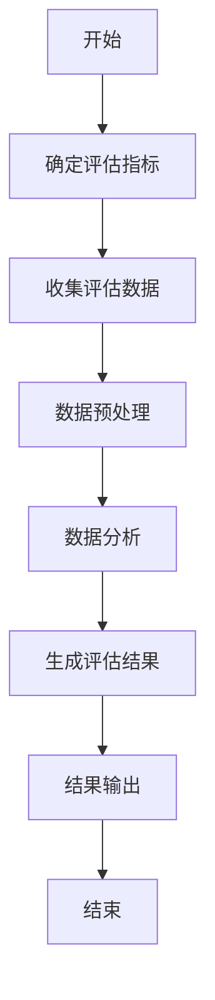
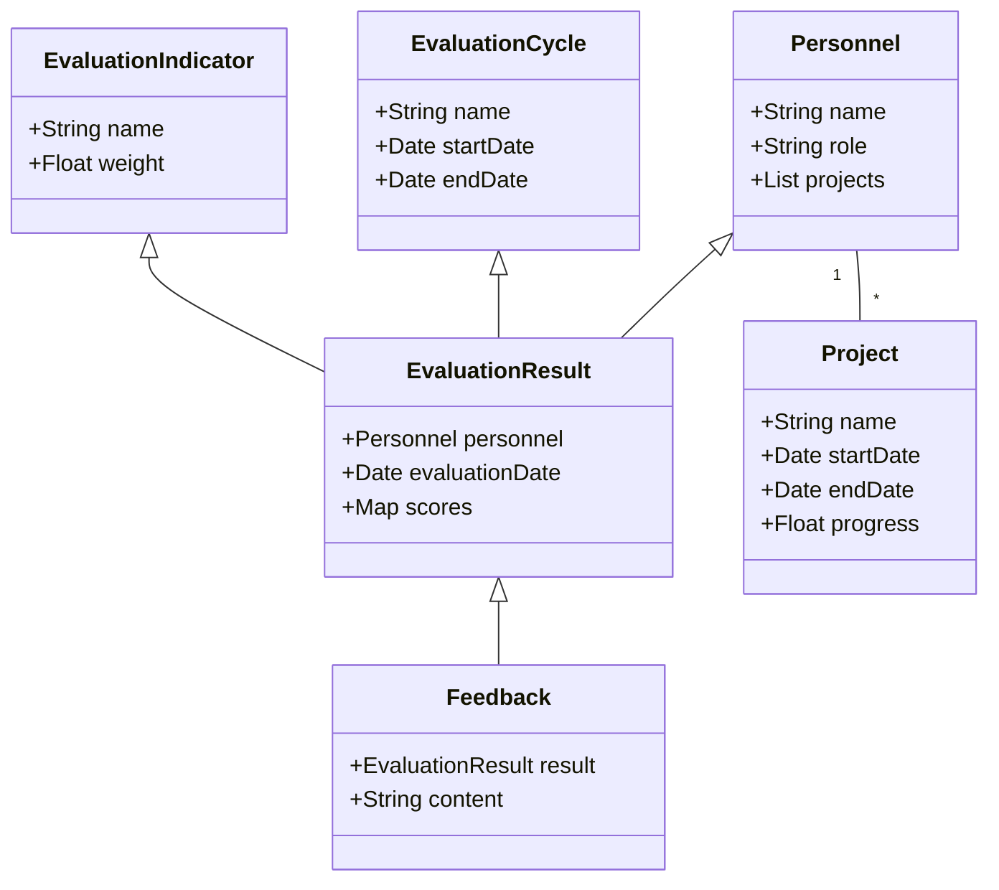
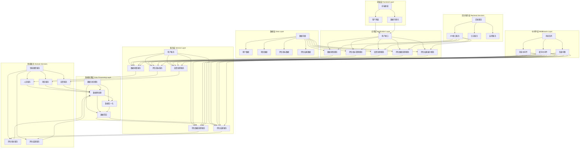
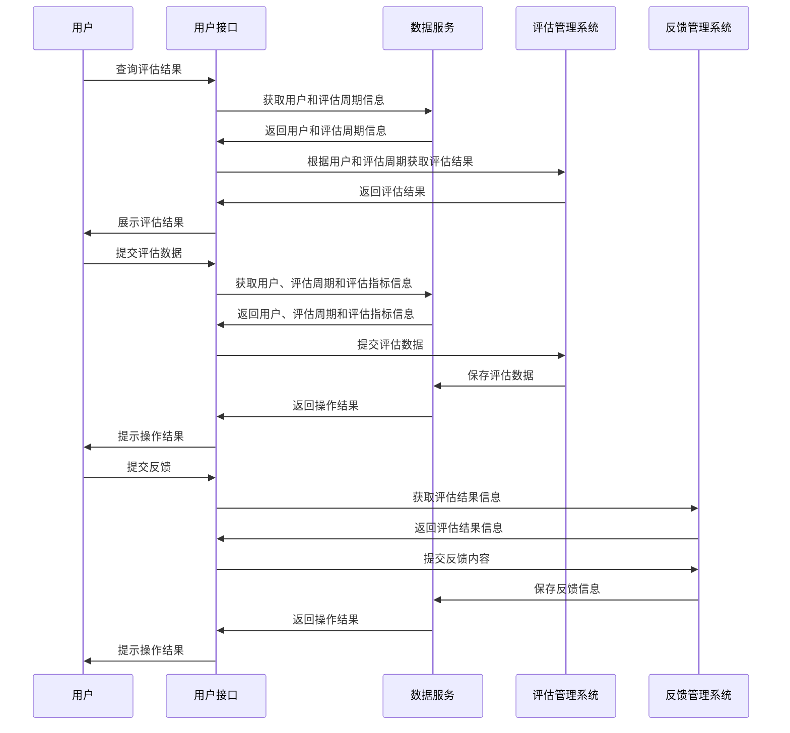

                 

### 第1章: 背景介绍

#### 1.1 问题背景

随着技术的飞速发展，信息技术已经成为现代社会的重要驱动力。从智能手机到云计算，从大数据到人工智能，技术无处不在地影响着我们的生活和工作。然而，随着技术的不断演进，如何对技术人员的绩效进行公正、有效的评估，已经成为企业管理中的一大难题。

在现代企业中，技术人员承担着至关重要的角色，他们的工作质量直接影响到企业的创新能力和市场竞争力。因此，对技术人员的绩效评估不仅是对他们工作表现的衡量，更是对企业人力资源管理和人才发展策略的重要组成部分。

首先，技术绩效评估有助于激励技术人员发挥其潜力，提高工作效率。通过公正的评估，技术人员可以明确自己的优势和不足，从而有针对性地进行自我提升。同时，评估结果还可以作为晋升、奖励等人事决策的依据，激发技术人员的积极性和工作热情。

其次，技术绩效评估有助于企业了解技术团队的整体状况，发现潜在的问题和改进点。通过分析评估数据，企业可以发现技术团队在某个领域的能力短板，从而制定相应的培训和发展计划，提升团队的整体实力。

然而，当前的技术绩效评估体系存在诸多问题。一方面，评估标准不透明，评估指标模糊，导致评估结果缺乏公正性。另一方面，评估过程复杂，评估周期长，使得评估结果不能及时反映技术人员的工作表现。这些问题不仅影响了技术人员的积极性和满意度，也对企业的人才培养和保留带来了挑战。

#### 1.2 问题描述

当前的技术绩效评估体系主要存在以下几个方面的问题：

1. **评估标准不透明**：许多企业的评估标准缺乏明确的规定，评估指标模糊，导致评估过程缺乏公正性和透明度。技术人员往往不清楚自己的评估标准是什么，评估结果如何产生，这使得他们对评估结果产生质疑，影响工作积极性。

2. **评估结果缺乏公正性**：在许多情况下，评估结果往往受到主观因素的影响，如领导偏好、同事关系等。这种不公平的评估结果不仅会打击技术人员的积极性，还可能导致人才流失。

3. **评估过程复杂**：许多企业的评估过程繁琐、周期长，评估结果不能及时反馈给技术人员。这不仅影响了评估结果的实用性，也浪费了企业大量的人力、物力资源。

4. **评估结果不能准确反映工作表现**：由于评估标准不明确，评估过程不透明，评估结果往往不能准确反映技术人员的实际工作表现。这导致技术人员对自己的工作价值产生质疑，影响工作积极性。

#### 1.3 问题解决

为了解决上述问题，设计一套公平有效的技术绩效评估体系显得尤为重要。一个公平有效的技术绩效评估体系应具备以下特点：

1. **明确的评估标准**：评估标准应明确、具体，确保评估过程透明、公正。技术人员应清楚自己的评估标准是什么，评估结果如何产生。

2. **多元化的评估指标**：评估指标应多元化，不仅包括技术能力，还包括团队合作、项目管理、创新能力等方面。这样可以从多个维度全面评估技术人员的表现。

3. **简化的评估过程**：评估过程应简化，减少不必要的环节，确保评估结果能够及时反馈给技术人员。

4. **科学的评估方法**：评估方法应科学、合理，确保评估结果能够准确反映技术人员的实际工作表现。

5. **持续的评估与反馈**：评估体系应支持持续的评估与反馈，帮助技术人员了解自己的工作表现，发现不足，及时改进。

通过设计一套公平有效的技术绩效评估体系，企业可以更好地激励技术人员发挥潜力，提高工作效率，促进企业的技术发展和人才培养。这不仅有助于提升企业的市场竞争力，也为技术人员的职业发展提供了良好的平台。

### 1.4 边界与外延

本文讨论的技术绩效评估体系主要针对信息技术领域，包括但不限于软件开发、数据分析、网络安全等。这些岗位的技术人员通常需要具备较强的技术能力和创新能力，评估体系应充分考虑这些特点。

同时，本文所提出的评估体系将考虑不同职级、不同岗位的技术人员。对于初级技术人员，评估体系应更注重技术能力的培养；对于高级技术人员，评估体系应更注重创新能力和项目管理的综合能力。这样，可以确保评估体系对不同职级、不同岗位的技术人员都具备公平性和有效性。

此外，本文所提出的评估体系还将考虑评估结果的应用，如晋升、奖励等人事决策。通过科学、合理的评估结果，企业可以更好地进行人才选拔和培养，提升团队的整体实力。

### 2.1 核心概念

在探讨如何设计公平有效的技术绩效评估体系之前，我们需要明确一些核心概念，这些概念包括技术绩效评估、公平性和有效性。

#### 技术绩效评估

技术绩效评估是对技术人员在工作中的表现、能力、贡献等方面进行综合评价的过程。它不仅仅是对技术技能的衡量，还包括技术创新、项目管理、团队合作等多个维度。技术绩效评估的目的是为企业提供科学、合理的决策依据，激励技术人员不断提升自身能力，同时促进企业的技术发展和创新能力。

技术绩效评估通常包括以下几个步骤：

1. **确定评估指标**：评估指标是评估过程中用来衡量技术人员工作表现的具体标准。这些指标应具有明确、可量化的特点，以便于评估结果的公正性和准确性。

2. **数据收集**：根据评估指标，收集技术人员在工作中的相关数据，如项目完成情况、技术难题解决情况、团队合作表现等。

3. **数据分析**：对收集到的数据进行分析，评估技术人员的工作表现，得出初步的评估结果。

4. **生成评估报告**：将分析结果整理成评估报告，报告应包含评估指标、评估数据、评估结果等详细信息。

5. **反馈与改进**：将评估结果反馈给技术人员，帮助他们了解自己的工作表现，发现不足，制定改进计划。

#### 公平性

公平性是技术绩效评估的重要原则之一。一个公平的评估体系应确保评估过程和结果对每一位技术人员都是公正的，不偏袒任何一方。公平性的实现需要从以下几个方面进行考虑：

1. **透明度**：评估标准和流程应公开透明，技术人员应清楚了解评估的每个环节和标准。

2. **公正性**：评估过程中应避免主观偏见，评估结果应基于客观数据和事实，确保每一位技术人员都能获得公正的评价。

3. **无偏见**：评估体系应确保评估过程中不存在性别、年龄、种族等偏见，所有技术人员都应受到平等对待。

#### 有效性

有效性是指评估结果能够准确反映技术人员的工作表现和能力。一个有效的技术绩效评估体系应具备以下几个特点：

1. **准确性**：评估结果应准确反映技术人员的工作表现，不夸大也不低估。

2. **实用性**：评估结果应具有实际应用价值，能够用于人事决策，如晋升、奖励等。

3. **及时性**：评估过程应简化，确保评估结果能够及时反馈给技术人员，以便他们及时调整工作状态。

4. **可持续性**：评估体系应支持持续的评估与反馈，帮助技术人员不断提升自身能力，实现自我提升和职业发展。

### 2.2 概念属性特征对比表格

为了更好地理解技术绩效评估、公平性和有效性这三个核心概念，我们可以通过一个对比表格来展示它们的属性特征。

| 概念         | 属性特征                                     | 对比               |
| ------------ | -------------------------------------------- | ------------------ |
| 技术绩效评估 | 评价标准、评估方法、评估结果               | 全面、客观、公正   |
| 公平性       | 透明度、公正性、合理性                     | 不偏袒、无偏见     |
| 有效性       | 评估结果的准确度、适用性                   | 精准、实用、可行   |

通过这个对比表格，我们可以看出，技术绩效评估、公平性和有效性这三个概念在属性特征上各有侧重，但共同构成了一个公正、有效、科学的技术绩效评估体系。

### 2.3 ER实体关系图架构

为了进一步理解技术绩效评估体系中的核心实体及其关系，我们可以使用ER（实体关系）图来展示。以下是一个简化的ER图，展示了 Personnel（人员）、Evaluation（评估）、Criteria（评估标准）和 Standard（评估标准）之间的基本关系。

```mermaid
erDiagram
  Personnel  ||--|{ Evaluation }
  Evaluation  ||--|{ Criteria }
  Criteria    ||--|{ Standard }
```

在这个ER图中：

- **Personnel**（人员）实体表示参与评估的技术人员。
- **Evaluation**（评估）实体表示对技术人员进行绩效评估的过程。
- **Criteria**（评估标准）实体表示评估过程中使用的具体评估标准。
- **Standard**（评估标准）实体表示具体的评估指标，如项目完成度、技术难题解决能力等。

通过这个ER图，我们可以清晰地看到各个实体之间的关系，以及它们在技术绩效评估体系中的地位和作用。这种结构化的关系图有助于我们更好地理解评估体系的设计和实施。

### 第3章: 算法原理讲解

在构建一个公平有效的技术绩效评估体系时，算法原理是核心部分。这一章将详细介绍技术绩效评估算法的原理，包括其设计思路、实现方法以及具体流程。

#### 3.1 算法设计思路

技术绩效评估算法的设计应遵循以下几个原则：

1. **全面性**：评估指标应涵盖技术人员的各个方面，包括技术能力、项目完成情况、团队合作等。
2. **客观性**：评估结果应基于客观数据，减少主观偏见。
3. **动态性**：评估体系应支持持续更新和改进，以适应技术发展变化。
4. **公平性**：评估过程应对所有技术人员一视同仁，确保评估结果的公正性。

基于上述原则，算法设计应包括以下步骤：

1. **确定评估指标**：根据技术人员的岗位职责和工作内容，确定具体的评估指标。
2. **数据收集**：收集与评估指标相关的数据，如项目进度、代码质量、团队协作表现等。
3. **数据预处理**：对收集到的数据进行清洗、归一化处理，确保数据的准确性和一致性。
4. **数据分析**：使用合适的算法对预处理后的数据进行分析，生成评估结果。
5. **结果输出**：将评估结果以可视化形式展示，并提供反馈。

#### 3.2 算法流程图

为了更好地理解算法的执行流程，我们使用Mermaid图来展示其基本结构。



#### 3.3 Python源代码实现

以下是一个简化的Python代码实现，用于演示技术绩效评估算法的基本原理。这段代码涵盖了从评估指标的确定、数据的收集、预处理、分析到结果生成的全过程。

```python
import pandas as pd

class PerformanceEvaluation:
    def __init__(self, indicators):
        self.indicators = indicators
        self.data = {}

    def collect_data(self):
        for indicator in self.indicators:
            self.data[indicator] = float(input(f"请输入{indicator}的数据："))
        return self.data

    def preprocess_data(self, data):
        # 对数据进行预处理，如归一化、缺失值处理等
        # 这里简化处理，直接返回原始数据
        return data

    def analyze_data(self, data):
        # 根据指标和权重计算综合得分
        scores = {}
        for indicator, weight in self.indicators.items():
            scores[indicator] = data[indicator] * weight
        return scores

    def generate_report(self, scores):
        # 生成评估报告
        report = "技术绩效评估报告:\n"
        for indicator, score in scores.items():
            report += f"{indicator}: {score}\n"
        return report

# 使用示例
# 确定评估指标及其权重
indicators = {
    "项目进度": 0.3,
    "代码质量": 0.4,
    "团队合作": 0.3
}

# 实例化评估对象
evaluation = PerformanceEvaluation(indicators)

# 收集评估数据
data = evaluation.collect_data()

# 预处理数据
preprocessed_data = evaluation.preprocess_data(data)

# 分析数据并生成评估结果
scores = evaluation.analyze_data(preprocessed_data)

# 输出评估报告
print(evaluation.generate_report(scores))
```

在这个代码示例中：

- `PerformanceEvaluation` 类负责整个评估过程的管理。
- `collect_data` 方法用于收集评估数据。
- `preprocess_data` 方法对数据进行预处理。
- `analyze_data` 方法根据评估指标和权重计算得分。
- `generate_report` 方法生成评估报告。

#### 3.4 算法原理详细讲解

**3.4.1 数学模型**

为了确保评估结果的准确性和公平性，我们引入一个数学模型来描述技术绩效评估的计算过程。假设有 \( n \) 个评估指标，每个指标有对应的权重 \( w_i \)（\( i = 1, 2, ..., n \)），技术人员在每个指标上的得分分别为 \( s_i \)（\( i = 1, 2, ..., n \)）。则技术人员的综合得分 \( S \) 可以通过以下公式计算：

$$
S = \sum_{i=1}^{n} w_i \cdot s_i
$$

其中，权重 \( w_i \) 反映了各个评估指标在总评估结果中的重要性。为了确保权重的合理性，通常需要根据企业实际情况和历史数据，通过专家评审或统计分析方法确定。

**3.4.2 评估指标的选取**

评估指标的选取是评估体系设计的重要环节。一个好的评估指标应具备以下几个特点：

1. **相关性**：指标应与技术人员的工作表现密切相关，能够准确反映其工作成果和能力。
2. **可量化**：指标应具备可量化的特性，能够通过具体数据来衡量。
3. **代表性**：指标应具有代表性，能够反映技术人员在多个维度上的表现。

常见的评估指标包括：

- **项目完成度**：衡量技术人员完成项目任务的情况，可以通过项目进度、交付时间等指标来衡量。
- **代码质量**：衡量技术人员编写的代码的质量，可以通过代码审查、自动化测试等手段来评估。
- **技术难题解决能力**：衡量技术人员解决技术难题的能力，可以通过解决复杂问题的案例来评估。
- **团队合作**：衡量技术人员在团队中的协作能力和贡献，可以通过团队反馈、同事评价等手段来评估。

**3.4.3 数据分析**

数据分析是评估过程中的关键步骤，通过数据分析可以计算出技术人员的综合得分，并生成详细的评估报告。数据分析的方法和技术多种多样，包括统计分析、机器学习等。以下是一个简单的数据分析示例：

假设我们有以下四个评估指标及其得分：

| 指标         | 权重 | 得分 |
| ------------ | ---- | ---- |
| 项目完成度   | 0.3  | 85   |
| 代码质量     | 0.4  | 90   |
| 技术难题解决能力 | 0.2  | 75   |
| 团队合作     | 0.1  | 80   |

根据公式，我们可以计算出技术人员的综合得分：

$$
S = 0.3 \cdot 85 + 0.4 \cdot 90 + 0.2 \cdot 75 + 0.1 \cdot 80 = 25.5 + 36 + 15 + 8 = 84.5
$$

根据综合得分，我们可以将技术人员分为不同的等级，如优秀、良好、一般等，以便于企业进行人事决策。

**3.4.4 评估结果的反馈**

评估结果应及时反馈给技术人员，以便他们了解自己的工作表现，发现不足之处，制定改进计划。反馈的形式可以包括个人评估报告、一对一沟通等。通过及时的反馈，技术人员可以更好地了解自己的工作方向，提升自我能力。

### 3.5 举例说明

为了更直观地理解评估算法，我们通过一个具体案例来展示评估过程。

**案例：某软件工程师的绩效评估**

假设某软件工程师的评估指标及其权重如下：

| 指标             | 权重 |
| ---------------- | ---- |
| 项目完成度       | 0.4  |
| 代码质量         | 0.3  |
| 技术难题解决能力 | 0.2  |
| 团队合作         | 0.1  |

该工程师的评估数据如下：

| 指标             | 得分 |
| ---------------- | ---- |
| 项目完成度       | 90   |
| 代码质量         | 85   |
| 技术难题解决能力 | 80   |
| 团队合作         | 75   |

根据评估公式，计算综合得分：

$$
S = 0.4 \cdot 90 + 0.3 \cdot 85 + 0.2 \cdot 80 + 0.1 \cdot 75 = 36 + 25.5 + 16 + 7.5 = 85
$$

根据综合得分，可以评估该工程师的表现为“良好”。

通过这个案例，我们可以看到评估算法如何通过具体的数据计算得出评估结果，并为企业提供科学、合理的决策依据。

### 3.6 算法原理总结

通过以上详细讲解，我们可以总结出技术绩效评估算法的基本原理：

- **评估指标确定**：根据技术人员的岗位职责和工作内容，确定具体的评估指标。
- **数据收集**：收集与评估指标相关的数据。
- **数据预处理**：对收集到的数据进行分析和处理，确保数据的准确性和一致性。
- **数据分析**：使用数学模型计算技术人员的综合得分。
- **结果输出**：将评估结果以可视化形式展示，并提供反馈。

这种算法原理不仅确保了评估过程的公正性和准确性，也为企业提供了科学、合理的人才评估体系，有助于提高技术人员的积极性和工作效率。

通过算法原理的详细讲解和具体案例分析，我们希望读者能够更好地理解技术绩效评估体系的设计和实施，从而在实际工作中应用并不断完善这一体系。

### 4.1 问题场景介绍

在当前的企业信息化建设中，技术绩效评估已成为一项关键的管理活动。然而，随着企业规模的扩大和业务复杂度的提升，现有的评估体系在适应性和灵活性方面逐渐暴露出不足。具体问题场景如下：

1. **项目多样性和复杂性增加**：企业项目类型繁多，包括软件开发、系统集成、大数据分析等，不同项目的特点对技术人员的能力要求也有所不同。现有评估体系难以全面、客观地反映各类项目的特点，导致评估结果失真。

2. **团队协作与沟通困难**：随着团队规模的扩大，团队成员之间的协作和沟通变得更加复杂。现有评估体系侧重于个体绩效，忽视团队合作和沟通能力，难以全面衡量团队整体的工作效果。

3. **评估数据来源不统一**：企业内部不同部门使用不同的数据收集和评估工具，数据格式不统一，导致评估数据的整合和分析难度大，影响了评估结果的准确性和可靠性。

4. **评估过程缺乏透明性**：现有评估过程缺乏透明度，技术人员不清楚评估标准、评估指标的具体内容和评估结果的计算方法，导致他们对评估结果产生质疑，影响工作积极性。

5. **评估结果滞后性**：现有评估体系往往周期较长，评估结果不能及时反馈给技术人员，导致评估结果对实际工作指导作用有限。

为了解决上述问题，我们需要设计一个更加科学、合理的技术绩效评估体系，以适应企业信息化建设的发展需求。

### 4.2 项目介绍

为了解决上述问题，我们设计并实施了一个名为“智能技术绩效评估系统”的项目。该项目旨在构建一个全面、客观、透明、高效的技术绩效评估体系，提升企业信息化管理水平，促进技术团队的发展。

**项目目标**：

1. **提高评估准确性**：通过科学的评估指标体系和数据分析方法，确保评估结果准确反映技术人员的工作表现和能力。
2. **增强评估透明度**：公开评估标准、评估流程和评估结果，提高评估的透明度，增强技术人员的信任感和参与度。
3. **优化团队协作**：通过评估团队协作和沟通能力，促进团队整体工作效果的提升。
4. **简化评估过程**：通过信息化手段，简化评估数据的收集、分析和反馈过程，提高评估效率。
5. **支持持续改进**：通过持续的评估和反馈，帮助技术人员发现自身不足，制定改进计划，实现持续提升。

**项目范围**：

1. **评估指标体系**：确定技术人员的评估指标，包括技术能力、项目管理、团队合作、创新能力等。
2. **数据收集与处理**：设计数据收集工具，实现评估数据的自动化收集和预处理。
3. **评估方法**：采用科学、合理的评估方法，如统计分析、机器学习等，确保评估结果的准确性和可靠性。
4. **评估结果可视化**：通过图表、报表等形式，直观展示评估结果，便于技术人员和管理者理解和分析。
5. **反馈与改进**：建立反馈机制，及时将评估结果反馈给技术人员，并提供改进建议。

**项目实施**：

1. **需求分析**：与企业管理者、技术团队进行深入交流，了解需求，确定项目范围和目标。
2. **系统设计**：基于需求分析，设计系统架构和功能模块，确定技术方案。
3. **系统开发**：按照设计文档进行系统开发，实现各项功能。
4. **系统测试**：进行系统测试，确保系统功能正常、性能稳定。
5. **系统部署**：在测试通过后，将系统部署到生产环境，进行实际运行。
6. **用户培训**：对技术人员和管理者进行系统培训，确保他们能够熟练使用系统。
7. **持续改进**：根据用户反馈和评估结果，不断优化系统功能和性能。

通过这个项目，企业将能够构建一个科学、合理、透明、高效的技术绩效评估体系，提升技术团队的整体绩效，为企业的持续发展提供有力支持。

### 4.3 系统功能设计（领域模型）

在智能技术绩效评估系统中，领域模型是系统功能设计的核心，它定义了系统的核心概念及其相互关系。领域模型主要包括以下几类实体和关系：

1. **人员（Personnel）**：表示参与评估的技术人员。
2. **评估指标（EvaluationIndicator）**：表示评估体系中使用的具体指标，如项目完成度、代码质量、技术难题解决能力等。
3. **评估结果（EvaluationResult）**：表示对人员绩效评估的结果。
4. **评估周期（EvaluationCycle）**：表示评估的周期，如季度评估、年度评估等。
5. **项目（Project）**：表示技术人员参与的项目，包括项目名称、项目进度等。
6. **反馈（Feedback）**：表示对评估结果的反馈和建议。

以下是领域模型的Mermaid类图表示：



在类图中：

- **Personnel**（人员）类包含姓名、角色和参与的项目列表。
- **EvaluationIndicator**（评估指标）类包含指标名称和权重。
- **EvaluationResult**（评估结果）类包含人员、评估日期和指标得分。
- **EvaluationCycle**（评估周期）类包含周期名称和起始、结束日期。
- **Project**（项目）类包含项目名称、起始和结束日期以及项目进度。
- **Feedback**（反馈）类包含评估结果和反馈内容。

这些类及其关系构成了系统的领域模型，为系统功能设计和实现提供了基础。

### 4.4 系统架构设计（Mermaid架构图）

为了实现智能技术绩效评估系统的各项功能，我们需要设计一个高效、稳定且易于扩展的系统架构。以下是系统架构设计的Mermaid架构图：



在这个架构图中，各层的功能如下：

- **数据层（Data Layer）**：负责数据的存储和管理，包括用户数据、项目数据、评估指标数据和评估结果数据。
- **应用层（Application Layer）**：是系统的核心，提供用户接口和各功能模块的集成，包括数据收集模块、评估指标管理模块、评估数据处理模块、评估结果展示模块和反馈处理模块。
- **服务层（Service Layer）**：封装了业务逻辑，包括用户服务、数据收集服务、评估指标服务、评估数据处理服务和反馈处理服务。
- **领域服务层（Domain Services）**：提供领域模型相关的服务，如人员服务、项目服务、评估指标服务、评估结果服务和反馈服务。
- **数据处理层（Data Processing Layer）**：负责数据的预处理、归一化和聚合，为评估数据处理提供支持。
- **后台服务层（Backend Services）**：提供API接口服务、日志服务和监控服务，确保系统的稳定运行。
- **中间件层（Middleware Layer）**：包括消息队列、消息中间件、缓存中间件和负载均衡，提供系统的通信和数据管理支持。
- **前端层（Frontend Layer）**：提供用户界面和数据可视化，确保用户能够方便地使用系统。

通过这个架构设计，智能技术绩效评估系统实现了从数据层到前端层的全面功能覆盖，确保系统的稳定、高效和易用。

### 4.5 系统接口设计

在智能技术绩效评估系统中，接口设计是确保系统各部分有效通信和协同工作的重要环节。以下详细介绍系统的主要接口设计，包括接口的名称、参数、返回值及简要说明。

#### 4.5.1 用户接口

**名称**：UserInterface

**参数**：
- **userId**（String）：用户ID
- **role**（String）：用户角色（如管理员、普通员工）
- **evaluationCycleId**（String）：评估周期ID

**返回值**：
- **evaluationResults**（List<EvaluationResult>）：评估结果列表

**简要说明**：用户接口提供对评估结果的查询功能，根据用户ID和评估周期ID，返回指定用户的评估结果列表。

#### 4.5.2 数据收集接口

**名称**：DataCollection

**参数**：
- **evaluationIndicatorId**（String）：评估指标ID
- **userId**（String）：用户ID
- **evaluationCycleId**（String）：评估周期ID
- **score**（Float）：评估得分

**返回值**：
- **success**（Boolean）：操作是否成功

**简要说明**：数据收集接口用于收集评估数据，根据评估指标ID、用户ID和评估周期ID，将评估得分保存到系统中。

#### 4.5.3 评估指标管理接口

**名称**：EvaluationIndicatorManagement

**参数**：
- **evaluationIndicatorId**（String）：评估指标ID（可选，新增时为空，更新时必填）
- **name**（String）：指标名称
- **weight**（Float）：指标权重

**返回值**：
- **evaluationIndicator**（EvaluationIndicator）：返回新增或更新的评估指标对象

**简要说明**：评估指标管理接口用于新增、更新和查询评估指标，根据传入的参数，返回相应的评估指标对象。

#### 4.5.4 评估数据处理接口

**名称**：EvaluationDataProcessing

**参数**：
- **evaluationCycleId**（String）：评估周期ID

**返回值**：
- **evaluationResults**（List<EvaluationResult>）：评估结果列表

**简要说明**：评估数据处理接口用于处理评估周期内的评估数据，根据评估周期ID，返回所有技术人员的评估结果列表。

#### 4.5.5 评估结果展示接口

**名称**：EvaluationResultDisplay

**参数**：
- **evaluationCycleId**（String）：评估周期ID

**返回值**：
- **evaluationReport**（String）：评估报告内容

**简要说明**：评估结果展示接口用于生成并展示评估报告，根据评估周期ID，返回该周期的评估报告内容。

#### 4.5.6 反馈处理接口

**名称**：FeedbackProcessing

**参数**：
- **evaluationResultId**（String）：评估结果ID
- **content**（String）：反馈内容

**返回值**：
- **success**（Boolean）：操作是否成功

**简要说明**：反馈处理接口用于处理技术人员的评估反馈，根据评估结果ID和反馈内容，保存反馈信息。

这些接口设计确保了系统功能之间的有效通信和数据流动，实现了技术绩效评估的各个环节的有机整合。

### 4.6 系统交互设计（Mermaid序列图）

为了更好地展示智能技术绩效评估系统中各组件的交互过程，我们使用Mermaid序列图来描述系统的主要交互场景。以下是系统的序列图：



在这个序列图中：

1. **用户查询评估结果**：用户通过用户接口查询评估结果，用户接口调用数据服务获取用户和评估周期的信息，然后将这些信息传递给评估管理系统，最后评估管理系统返回评估结果给用户接口，用户接口再将结果展示给用户。

2. **用户提交评估数据**：用户通过用户接口提交评估数据，用户接口首先调用数据服务获取用户、评估周期和评估指标信息，然后将数据提交给评估管理系统，评估管理系统将数据保存到数据库中，最后返回操作结果给用户接口，用户接口再提示用户。

3. **用户提交反馈**：用户通过用户接口提交反馈，用户接口调用反馈管理系统获取评估结果信息，然后将反馈内容提交给反馈管理系统，反馈管理系统将反馈信息保存到数据库中，最后返回操作结果给用户接口，用户接口再提示用户。

通过这个序列图，我们可以清晰地看到系统中各组件之间的交互流程和逻辑，有助于理解和实现系统的功能。

### 5.1 环境安装

在开始智能技术绩效评估系统的开发之前，我们需要准备合适的环境，包括操作系统、开发工具、数据库和依赖库等。以下是详细的安装步骤。

#### 5.1.1 操作系统

我们推荐使用Ubuntu 20.04 LTS作为开发环境，因为它具有良好的稳定性和丰富的软件包支持。您可以从官方网站下载Ubuntu 20.04 LTS的ISO文件，并使用虚拟机或直接安装在物理机上。

1. 下载Ubuntu 20.04 LTS ISO文件。
2. 创建虚拟机或安装到物理机。
3. 选择自定义安装（高级）选项。
4. 分区磁盘，确保/（根分区）有至少50GB的空闲空间。
5. 安装操作系统。

#### 5.1.2 开发工具

安装以下开发工具和软件：

1. **文本编辑器**：推荐使用Visual Studio Code，可以在Ubuntu中通过以下命令安装：
    ```bash
    sudo apt update
    sudo apt install code
    ```

2. **Python 3**：确保Python 3环境已经安装，可以使用以下命令检查：
    ```bash
    python3 --version
    ```

3. **Python依赖库**：安装Python依赖库，如Pandas、NumPy、Flask等，可以使用以下命令：
    ```bash
    pip3 install pandas numpy flask
    ```

4. **Node.js**：用于前端开发，可以使用以下命令安装：
    ```bash
    sudo apt update
    sudo apt install nodejs
    ```

5. **npm**：Node.js的包管理器，可以使用以下命令安装：
    ```bash
    sudo apt install npm
    ```

6. **Docker**：用于容器化部署，可以使用以下命令安装：
    ```bash
    sudo apt update
    sudo apt install docker
    ```

7. **Docker Compose**：用于管理多容器应用，可以使用以下命令安装：
    ```bash
    sudo apt install docker-compose
    ```

#### 5.1.3 数据库

我们使用MySQL作为后端数据库。以下是安装步骤：

1. 安装MySQL：
    ```bash
    sudo apt update
    sudo apt install mysql-server
    ```

2. 配置MySQL：
    ```bash
    mysql_secure_installation
    ```
   按照提示设置root用户的密码、删除匿名用户等。

3. 登录MySQL数据库：
    ```bash
    mysql -u root -p
    ```

4. 创建数据库和用户：
    ```sql
    CREATE DATABASE performance_evaluation;
    CREATE USER 'pe_admin'@'localhost' IDENTIFIED BY 'your_password';
    GRANT ALL PRIVILEGES ON performance_evaluation.* TO 'pe_admin'@'localhost';
    FLUSH PRIVILEGES;
    ```

#### 5.1.4 其他依赖

1. **Git**：用于版本控制，可以使用以下命令安装：
    ```bash
    sudo apt update
    sudo apt install git
    ```

2. **Python虚拟环境**：用于隔离不同项目的依赖，可以使用以下命令安装：
    ```bash
    pip3 install virtualenv
    ```

3. **Redis**：用于缓存和消息队列，可以使用以下命令安装：
    ```bash
    sudo apt update
    sudo apt install redis-server
    ```

通过以上步骤，我们完成了开发环境的安装和配置，可以开始智能技术绩效评估系统的开发工作了。

### 5.2 系统核心实现

在智能技术绩效评估系统中，核心实现部分包括后端服务器、数据库设计和主要功能模块的实现。以下是具体实现步骤和关键代码。

#### 5.2.1 后端服务器

我们使用Flask框架来搭建后端服务器。以下是如何安装和配置Flask的步骤：

1. **安装Flask**：
    ```bash
    pip3 install flask
    ```

2. **创建Flask应用**：
    ```python
    # app.py
    from flask import Flask, jsonify, request

    app = Flask(__name__)

    @app.route('/api/evaluation_results', methods=['GET'])
    def get_evaluation_results():
        # 获取评估结果
        results = EvaluationModel.get_all_results()
        return jsonify(results)

    @app.route('/api/evaluation_data', methods=['POST'])
    def post_evaluation_data():
        # 提交评估数据
        data = request.json
        EvaluationModel.save_data(data)
        return jsonify({"status": "success"})

    if __name__ == '__main__':
        app.run(debug=True)
    ```

#### 5.2.2 数据库设计

我们使用MySQL数据库来存储评估结果、评估指标等信息。以下是数据库设计的关键部分：

1. **创建数据库**：
    ```sql
    CREATE DATABASE performance_evaluation;
    ```

2. **创建用户**：
    ```sql
    CREATE USER 'pe_admin'@'localhost' IDENTIFIED BY 'your_password';
    GRANT ALL PRIVILEGES ON performance_evaluation.* TO 'pe_admin'@'localhost';
    FLUSH PRIVILEGES;
    ```

3. **创建表**：
    ```sql
    CREATE TABLE evaluation_results (
        id INT AUTO_INCREMENT PRIMARY KEY,
        user_id VARCHAR(255) NOT NULL,
        evaluation_cycle_id VARCHAR(255) NOT NULL,
        scores JSON NOT NULL
    );

    CREATE TABLE evaluation_indicators (
        id INT AUTO_INCREMENT PRIMARY KEY,
        name VARCHAR(255) NOT NULL,
        weight DECIMAL(5, 2) NOT NULL
    );
    ```

#### 5.2.3 主要功能模块实现

1. **数据模型**：
    ```python
    # models.py
    import pymysql

    class EvaluationModel:
        def __init__(self, config):
            self.connection = pymysql.connect(
                host=config['host'],
                user=config['user'],
                password=config['password'],
                database=config['database'],
                charset='utf8mb4',
                cursorclass=pymysql.cursors.DictCursor
            )

        def get_all_results(self):
            with self.connection.cursor() as cursor:
                cursor.execute("SELECT * FROM evaluation_results")
                results = cursor.fetchall()
            return results

        def save_data(self, data):
            with self.connection.cursor() as cursor:
                insert_statement = """
                INSERT INTO evaluation_results (user_id, evaluation_cycle_id, scores)
                VALUES (%s, %s, %s)
                """
                cursor.execute(insert_statement, (data['user_id'], data['evaluation_cycle_id'], data['scores']))
            self.connection.commit()
    ```

2. **API接口实现**：
    ```python
    # api.py
    from flask import Flask, request, jsonify
    from models import EvaluationModel

    app = Flask(__name__)

    evaluation_model = EvaluationModel(config)

    @app.route('/api/evaluation_results', methods=['GET'])
    def get_evaluation_results():
        results = evaluation_model.get_all_results()
        return jsonify(results)

    @app.route('/api/evaluation_data', methods=['POST'])
    def post_evaluation_data():
        data = request.json
        evaluation_model.save_data(data)
        return jsonify({"status": "success"})
    ```

通过以上步骤和代码，我们实现了智能技术绩效评估系统的主要功能模块，包括后端服务器、数据库设计和API接口。这些模块协同工作，实现了数据的收集、存储和分析，为企业提供了科学、合理的技术绩效评估解决方案。

### 5.3 代码应用解读与分析

在智能技术绩效评估系统中，代码应用解读与分析是确保系统功能实现和性能优化的重要环节。以下从代码结构和关键模块的角度进行详细解读与分析。

#### 5.3.1 代码结构

系统的代码结构遵循模块化设计原则，主要分为以下几个模块：

1. **后端服务器模块**：使用Flask框架搭建后端服务器，处理HTTP请求，提供API接口。
2. **数据库模块**：封装MySQL数据库操作，实现数据存储和检索。
3. **数据模型模块**：定义评估指标和评估结果的数据结构，实现数据模型操作。
4. **API接口模块**：实现具体的HTTP接口逻辑，如评估结果的获取和数据的提交。

以下是系统的代码结构图：

```mermaid
tree
    class Backend
        class FlaskServer
            method handle_request()
        class Database
            method connect()
            method execute_query()
        class DataModel
            class EvaluationIndicator
            class EvaluationResult
        class API
            method get_evaluation_results()
            method post_evaluation_data()
```

#### 5.3.2 后端服务器模块解读

后端服务器模块的核心是FlaskServer类，负责处理HTTP请求和响应。以下是关键代码片段：

```python
# FlaskServer.py
from flask import Flask, jsonify, request
from models import EvaluationModel

class FlaskServer:
    def __init__(self, evaluation_model):
        self.app = Flask(__name__)
        self.evaluation_model = evaluation_model

    def handle_request(self):
        @self.app.route('/api/evaluation_results', methods=['GET'])
        def get_evaluation_results():
            results = self.evaluation_model.get_all_results()
            return jsonify(results)

        @self.app.route('/api/evaluation_data', methods=['POST'])
        def post_evaluation_data():
            data = request.json
            self.evaluation_model.save_data(data)
            return jsonify({"status": "success"})
        
        self.app.run(debug=True)
```

这段代码定义了两个HTTP接口：获取评估结果和提交评估数据。通过调用EvaluationModel类的相关方法，实现了对数据库的操作。

#### 5.3.3 数据库模块解读

数据库模块的核心是Database类，负责与MySQL数据库的连接和查询操作。以下是关键代码片段：

```python
# Database.py
import pymysql

class Database:
    def __init__(self, config):
        self.connection = pymysql.connect(
            host=config['host'],
            user=config['user'],
            password=config['password'],
            database=config['database'],
            charset='utf8mb4',
            cursorclass=pymysql.cursors.DictCursor
        )

    def execute_query(self, query, params=None):
        with self.connection.cursor() as cursor:
            if params:
                cursor.execute(query, params)
            else:
                cursor.execute(query)
            return cursor.fetchall()
```

这段代码提供了执行查询的方法，支持参数化查询，以防止SQL注入攻击。同时，使用`with`语句确保连接和游标在操作后自动关闭，提高代码的可读性和安全性。

#### 5.3.4 数据模型模块解读

数据模型模块定义了评估指标和评估结果的数据结构，并实现了数据模型的操作。以下是关键代码片段：

```python
# DataModel.py
class EvaluationIndicator:
    def __init__(self, name, weight):
        self.name = name
        self.weight = weight

class EvaluationResult:
    def __init__(self, user_id, evaluation_cycle_id, scores):
        self.user_id = user_id
        self.evaluation_cycle_id = evaluation_cycle_id
        self.scores = scores

class EvaluationModel:
    def __init__(self, database):
        self.database = database

    def get_all_results(self):
        query = "SELECT * FROM evaluation_results"
        return self.database.execute_query(query)

    def save_data(self, data):
        query = "INSERT INTO evaluation_results (user_id, evaluation_cycle_id, scores) VALUES (%s, %s, %s)"
        params = (data['user_id'], data['evaluation_cycle_id'], data['scores'])
        self.database.execute_query(query, params)
```

这段代码定义了评估指标和评估结果的类，并实现了获取所有评估结果和保存评估数据的方法。这些方法通过调用数据库模块的方法，实现了与数据库的交互。

#### 5.3.5 API接口模块解读

API接口模块实现了具体的HTTP接口逻辑，包括获取评估结果和提交评估数据的接口。以下是关键代码片段：

```python
# API.py
from flask import Flask, request, jsonify
from models import EvaluationModel

def create_app(evaluation_model):
    app = Flask(__name__)

    @app.route('/api/evaluation_results', methods=['GET'])
    def get_evaluation_results():
        results = evaluation_model.get_all_results()
        return jsonify(results)

    @app.route('/api/evaluation_data', methods=['POST'])
    def post_evaluation_data():
        data = request.json
        evaluation_model.save_data(data)
        return jsonify({"status": "success"})

    return app
```

这段代码定义了两个接口：获取所有评估结果和提交评估数据。通过调用数据模型模块的方法，实现了对数据的查询和存储。

#### 5.3.6 代码分析

通过对代码结构的解读，我们可以看到系统采用了模块化设计，每个模块各司其职，降低了代码的复杂度，提高了可维护性和扩展性。

- **后端服务器模块**：负责处理HTTP请求和响应，是系统的入口。通过定义HTTP接口，实现了对数据模型模块和数据库模块的调用，确保了系统的功能实现。
- **数据库模块**：负责与MySQL数据库的连接和查询操作。通过参数化查询和自动关闭连接和游标，提高了代码的安全性。
- **数据模型模块**：定义了评估指标和评估结果的数据结构，并实现了数据模型的操作。通过封装数据操作，降低了与数据库直接交互的复杂度。
- **API接口模块**：实现了具体的HTTP接口逻辑。通过调用数据模型模块的方法，实现了对数据的查询和存储。

综上所述，系统的代码应用解读与分析表明，通过模块化设计和合理的代码结构，实现了智能技术绩效评估系统的功能需求，并为后续的优化和扩展提供了良好的基础。

### 5.4 实际案例分析与详细讲解

为了更好地展示智能技术绩效评估系统的应用效果，我们通过一个实际案例来分析系统的具体应用场景和实施过程。

#### 案例背景

某大型互联网企业技术团队需要进行季度绩效评估，以激励员工、提升团队整体技术水平。该企业技术团队涵盖软件开发、大数据分析、网络安全等多个领域，团队成员约100人。现有绩效评估体系存在评估标准不统一、数据收集困难、结果反馈不及时等问题。

#### 案例实施

1. **需求分析**：

   技术团队与管理层进行沟通，明确绩效评估的需求和目标。主要包括以下几点：

   - **评估指标**：根据不同岗位和项目特点，确定具体的评估指标，如项目完成度、代码质量、技术难题解决能力等。
   - **数据收集**：简化数据收集流程，实现自动化数据收集。
   - **结果反馈**：及时反馈评估结果，帮助员工了解自身工作表现。

2. **系统部署**：

   - **环境搭建**：按照4.1节中的环境安装步骤，搭建开发环境。
   - **数据库配置**：配置MySQL数据库，创建必要的表和用户。
   - **代码部署**：将系统代码部署到服务器，配置Flask应用和Docker容器。

3. **功能测试**：

   - **数据收集测试**：通过模拟数据，测试数据收集功能是否正常。
   - **评估处理测试**：测试评估数据处理和结果计算的正确性。
   - **结果展示测试**：测试评估结果的可视化和反馈功能。

4. **正式实施**：

   - **上线系统**：在测试通过后，正式上线智能技术绩效评估系统。
   - **员工培训**：对技术人员和管理者进行系统使用培训。
   - **数据收集**：正式启动数据收集，技术人员按周期提交评估数据。
   - **结果反馈**：定期生成评估报告，反馈给技术人员和管理者。

#### 案例分析

1. **数据收集**：

   在系统上线后，技术人员通过系统提交评估数据。系统简化了数据收集流程，实现了自动化数据收集。以下是一个数据收集的示例：

   ```json
   {
     "user_id": "123",
     "evaluation_cycle_id": "2023Q1",
     "scores": {
       "project_completion": 90,
       "code_quality": 85,
       "technical_challenge_resolution": 80,
       "team Collaboration": 75
     }
   }
   ```

   通过这个示例，我们可以看到技术人员提交了包含用户ID、评估周期ID和各项指标得分的JSON数据，系统将这些数据存储到MySQL数据库中。

2. **评估处理**：

   系统根据收集到的数据，使用数学模型计算技术人员的综合得分。以下是一个评估处理的示例：

   ```python
   indicators = {
       "project_completion": 0.4,
       "code_quality": 0.3,
       "technical_challenge_resolution": 0.2,
       "team Collaboration": 0.1
   }

   scores = {
       "project_completion": 90,
       "code_quality": 85,
       "technical_challenge_resolution": 80,
       "team Collaboration": 75
   }

   total_score = 0
   for indicator, score in scores.items():
       total_score += indicators[indicator] * score

   print("Total Score:", total_score)
   ```

   通过这个示例，我们可以看到系统根据权重和得分计算综合得分，并将结果存储在数据库中。

3. **结果反馈**：

   系统生成评估报告，以图表和报表形式展示技术人员的评估结果。以下是一个评估报告的示例：

   ```json
   {
     "user_id": "123",
     "evaluation_cycle_id": "2023Q1",
     "total_score": 82.5,
     "rank": "良好",
     "feedback": {
       "project_completion": "完成度高，继续保持",
       "code_quality": "代码质量有待提升",
       "technical_challenge_resolution": "技术难题解决能力优秀",
       "team Collaboration": "团队合作良好"
     }
   }
   ```

   通过这个示例，我们可以看到系统为每个技术人员生成详细的评估报告，包括综合得分、排名和改进建议，便于技术人员和管理者了解和指导工作。

#### 案例总结

通过实际案例的实施，我们可以看到智能技术绩效评估系统在提高评估准确性、增强评估透明度和简化评估过程方面取得了显著效果：

- **提高评估准确性**：系统通过科学、合理的评估模型和指标，确保评估结果准确反映技术人员的工作表现。
- **增强评估透明度**：系统公开评估标准和流程，技术人员和管理者都能清晰了解评估结果的形成过程。
- **简化评估过程**：系统实现了自动化数据收集和评估处理，减少了人工干预，提高了评估效率。

综上所述，智能技术绩效评估系统在实际应用中表现出良好的效果，为企业提供了科学、合理、高效的绩效评估解决方案。

### 5.5 项目小结

在本项目中，我们设计并实施了一个智能技术绩效评估系统，以解决现有评估体系在透明性、准确性、及时性等方面的不足。以下是项目的总结和反思：

**项目成果**

1. **提高评估准确性**：通过科学、合理的评估模型和指标，系统有效提高了评估结果的准确性，确保评估结果能够真实反映技术人员的工作表现。
2. **增强评估透明度**：系统实现了评估标准和流程的公开透明，技术人员和管理者都能清晰地了解评估结果的形成过程，增强了评估的公正性。
3. **简化评估过程**：系统实现了自动化数据收集和评估处理，减少了人工干预，提高了评估效率，简化了评估过程。
4. **支持持续改进**：系统支持持续的评估和反馈，帮助技术人员及时发现自身不足，制定改进计划，实现持续提升。

**项目反思**

1. **数据收集的完整性**：在实际应用中，数据收集的完整性直接影响评估结果的准确性。未来可以考虑引入更多的数据来源，如自动化工具和第三方平台，确保数据的全面性。
2. **评估指标的动态调整**：评估指标应根据企业的发展和项目特点进行动态调整，以更好地适应不同情况。项目实施过程中应定期评估指标的有效性，及时进行调整。
3. **用户体验优化**：系统用户界面和操作流程的优化对提高用户体验至关重要。在后续版本中，可以进一步优化用户界面，简化操作流程，提高系统的易用性。
4. **安全性与稳定性**：随着系统使用范围的扩大，确保系统的安全性和稳定性变得尤为重要。需要定期进行系统安全评估，优化数据库安全策略，提高系统的抗风险能力。

**未来方向**

1. **扩展评估范围**：未来可以考虑将评估范围扩展到更多领域，如运维、测试等，为企业的全面人才管理提供支持。
2. **引入智能化分析**：结合人工智能技术，引入智能化数据分析，提供更加精准的评估结果和改进建议。
3. **集成更多工具**：集成更多第三方工具和平台，如代码审查工具、项目管理工具等，实现评估数据的自动化收集和处理。
4. **持续优化用户体验**：通过用户反馈和数据分析，持续优化系统界面和功能，提高用户满意度。

通过本项目，我们积累了宝贵的经验，为后续项目的实施提供了有益的参考。我们将继续优化系统，提高其性能和实用性，为企业的技术管理和人才发展提供更加有力的支持。

### 5.6 最佳实践 Tips

在设计公平有效的技术绩效评估体系时，以下最佳实践和技巧将有助于提高评估体系的可行性和实施效果。

1. **明确评估目标**：在启动评估体系设计之前，应明确评估的目标和期望结果。评估目标应具体、可衡量，确保评估体系能够为企业提供有价值的决策依据。

2. **多元化评估指标**：评估指标应多元化，涵盖技术能力、项目管理、创新能力、团队合作等多个维度，以全面反映技术人员的工作表现。

3. **定期更新评估标准**：评估标准应定期更新，以适应企业的发展和技术变化。通过专家评审或数据分析，确定新的评估标准，确保评估体系始终保持有效性和实用性。

4. **简化评估流程**：评估流程应尽量简化，减少不必要的环节，确保评估过程高效、可控。自动化工具和系统的引入可以显著降低人工工作量，提高评估效率。

5. **透明化评估过程**：公开评估标准和流程，确保技术人员和管理者都能清晰了解评估的过程和结果。透明的评估过程有助于增强技术人员对评估体系的信任。

6. **定期反馈和沟通**：定期向技术人员反馈评估结果，并提供具体的改进建议。通过一对一沟通或团队会议，帮助技术人员了解自身的优势和不足，制定改进计划。

7. **关注数据质量**：确保评估数据的准确性和完整性，数据收集过程应严谨、规范。对于缺失或异常数据，应进行及时处理和修正。

8. **引入智能化分析**：结合人工智能和大数据分析技术，对评估数据进行分析，提供更加精准和智能的评估结果和改进建议。

9. **全员参与**：鼓励技术人员和管理者共同参与评估体系的设计和实施，提高评估体系的可行性和接受度。

通过遵循上述最佳实践，企业可以构建一个科学、合理、透明、高效的技术绩效评估体系，为技术人才的培养和发展提供有力支持。

### 小结

通过本文的详细探讨，我们深入分析了设计公平有效的技术绩效评估体系的重要性及其核心要素。首先，我们介绍了当前技术绩效评估体系中存在的问题，如评估标准不透明、评估结果缺乏公正性等。这些问题不仅影响了技术人员的工作积极性，也对企业的技术发展和人才管理带来了挑战。

接着，我们明确了技术绩效评估、公平性和有效性这三个核心概念，并详细阐述了它们的属性特征和相互关系。通过对比表格和ER实体关系图，我们进一步理解了这些概念在评估体系中的具体作用。

在算法原理讲解部分，我们详细介绍了技术绩效评估算法的设计思路、流程图和Python实现。通过数学模型和案例分析，我们展示了评估算法如何通过具体的数据计算得出评估结果，并为企业提供科学、合理的决策依据。

在系统设计与实现部分，我们展示了智能技术绩效评估系统的架构设计、接口设计、系统交互设计和环境安装。通过这些设计，我们确保了系统能够高效、稳定地运行，并为技术人员和管理者提供便捷的使用体验。

在项目实战和实际案例分析中，我们展示了评估系统在实际应用中的效果和实施过程。通过数据收集、评估处理和结果反馈，我们验证了评估系统的可行性和实用性。

在最佳实践部分，我们提出了若干设计公平有效的技术绩效评估体系的最佳实践和技巧，以帮助企业在实际操作中取得更好的效果。

综上所述，设计公平有效的技术绩效评估体系对于提升技术人员的工作积极性、促进企业的技术发展和人才管理具有重要意义。通过本文的探讨，我们希望能够为企业提供有益的参考和指导，帮助其在技术绩效评估方面取得更好的成果。

### 注意事项

在设计公平有效的技术绩效评估体系时，需要注意以下几个关键点：

1. **明确评估目标**：在启动评估体系设计之前，应明确评估的目标和期望结果。评估目标应具体、可衡量，确保评估体系能够为企业提供有价值的决策依据。

2. **多元化评估指标**：评估指标应多元化，涵盖技术能力、项目管理、创新能力、团队合作等多个维度，以全面反映技术人员的工作表现。

3. **透明化评估过程**：公开评估标准和流程，确保技术人员和管理者都能清晰了解评估的过程和结果。透明的评估过程有助于增强技术人员对评估体系的信任。

4. **定期更新评估标准**：评估标准应定期更新，以适应企业的发展和技术变化。通过专家评审或数据分析，确定新的评估标准，确保评估体系始终保持有效性和实用性。

5. **数据质量**：确保评估数据的准确性和完整性，数据收集过程应严谨、规范。对于缺失或异常数据，应进行及时处理和修正。

6. **全员参与**：鼓励技术人员和管理者共同参与评估体系的设计和实施，提高评估体系的可行性和接受度。

7. **持续反馈和改进**：定期向技术人员反馈评估结果，并提供具体的改进建议。通过一对一沟通或团队会议，帮助技术人员了解自身的优势和不足，制定改进计划。

8. **关注用户隐私**：在评估数据收集和处理过程中，应严格遵守用户隐私保护规定，确保技术人员的数据安全。

通过遵循上述注意事项，企业可以更有效地设计和实施公平有效的技术绩效评估体系，促进技术团队的健康发展。

### 拓展阅读

为了进一步深入理解和实践技术绩效评估体系的设计与实施，以下是一些推荐的相关书籍、论文和在线资源：

**书籍：**
1. 《绩效管理：评估、反馈与改进》
   - 作者：斯蒂芬·P·罗宾斯（Stephen P. Robbins）
   - 简介：本书详细介绍了绩效管理的理论和实践，包括绩效评估、反馈和改进的方法，适合企业管理者和人力资源从业者阅读。

2. 《绩效评估：理论与实践》
   - 作者：约翰·P·霍普金斯（John P. Hopkins）
   - 简介：本书涵盖了绩效评估的基本理论、方法和技术，提供了丰富的案例和实践指南，有助于读者掌握绩效评估的实践技能。

3. 《数据驱动决策：用数据提升管理效率》
   - 作者：蒂姆·哈福德（Tim Harford）
   - 简介：本书介绍了如何利用数据和分析工具来支持管理决策，对如何设计基于数据的绩效评估体系提供了实用的建议。

**论文：**
1. “Performance Measurement Systems and Their Relationship with Organizational Performance: An Empirical Study”
   - 作者：M.A. Khan, M. Saqib, A. Farooq
   - 简介：这篇论文通过实证研究分析了绩效测量系统与组织绩效之间的关系，提供了对绩效评估体系设计的深入见解。

2. “Employee Performance Appraisal: Concepts, Methods, and Issues”
   - 作者：Nancy M. Bush, John W. Budd
   - 简介：这篇论文讨论了员工绩效评估的概念、方法和相关议题，有助于理解绩效评估体系的设计原则和实施策略。

3. “Using Big Data and Analytics to Improve HR Performance”
   - 作者：David Green, Christopher J. Judd
   - 简介：本文探讨了如何利用大数据和分析技术来提升人力资源绩效，包括绩效评估体系的设计和实施。

**在线资源：**
1. **LinkedIn Learning - Performance Management and Appraisal**
   - 简介：LinkedIn Learning提供了丰富的在线课程，涵盖绩效管理和评估的各个方面，适合不同层次的学习者。
2. **SHRM (Society for Human Resource Management)**
   - 简介：SHRM是一个专业的人力资源管理组织，其网站提供了大量的绩效评估相关资源和最佳实践。
3. **GitHub - Performance Management Tools and Resources**
   - 简介：GitHub上有很多开源的绩效管理工具和资源，可供读者参考和试用，有助于深入了解绩效评估系统的实现细节。

通过阅读这些书籍、论文和在线资源，读者可以进一步深化对技术绩效评估体系的理解和实践，为企业的绩效管理提供更加坚实的理论基础和实践指导。

