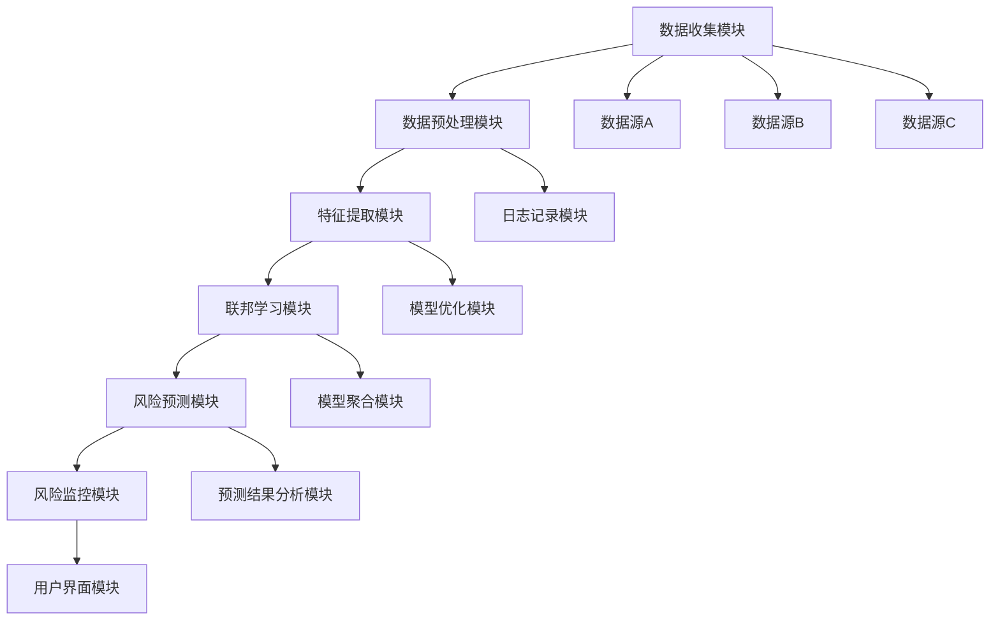
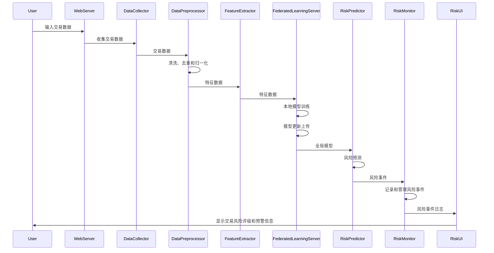

                 

# 《设计基于联邦学习的跨境金融风险评估系统》

## 关键词：联邦学习、跨境金融、风险评估、系统设计

### 摘要：
本文深入探讨了基于联邦学习的跨境金融风险评估系统的设计。首先，我们介绍了跨境金融的概念、风险及其对传统风险评估系统的挑战。接着，我们阐述了联邦学习的基本概念、原理和特点，并对比了其与中心化学习的差异。随后，本文详细讲解了联邦学习在跨境金融风险评估中的应用，包括其核心算法、数学模型以及系统架构设计。最后，我们提供了最佳实践与展望，旨在推动联邦学习在跨境金融领域的应用和发展。

## 目录大纲

### 第一部分：背景介绍

### 第1章 问题背景与定义
1.1 跨境金融的概念
1.2 跨境金融的风险
1.3 联邦学习的基本概念
1.4 联邦学习在金融风险评估中的应用

### 第2章 当前风险评估系统存在的问题
2.1 传统风险评估系统的局限性
2.2 联邦学习在风险评估系统中的应用优势
2.3 联邦学习在跨境金融风险评估领域的应用现状

### 第二部分：核心概念与联系

### 第3章 联邦学习的基本原理
3.1 联邦学习的定义
3.2 联邦学习的核心概念
3.3 联邦学习的特点
3.4 联邦学习与中心化学习的对比

### 第4章 跨境金融风险评估的核心概念
4.1 跨境金融风险评估的定义
4.2 跨境金融风险评估的目标
4.3 跨境金融风险评估的关键因素
4.4 跨境金融风险评估的流程

### 第5章 联邦学习在风险评估中的应用联系
5.1 联邦学习在风险评估中的关键环节
5.2 联邦学习在风险评估中的实现方式
5.3 联邦学习在风险评估中的优势和挑战

### 第三部分：算法原理讲解

### 第6章 联邦学习算法原理讲解
6.1 联邦学习算法的基本框架
6.2 联邦学习算法的核心算法
6.3 联邦学习算法的优化策略
6.4 联邦学习算法的应用案例

### 第7章 跨境金融风险评估的数学模型
7.1 跨境金融风险评估的数学模型
7.2 模型的数学公式和推导
7.3 模型的参数设置与优化
7.4 模型的应用案例与解读

### 第四部分：系统分析与架构设计

### 第8章 系统功能设计与架构设计方案
8.1 系统功能介绍
8.2 领域模型设计
8.3 系统架构设计
8.4 系统接口设计
8.5 系统交互设计

### 第9章 系统实现与部署
9.1 系统环境搭建
9.2 系统核心实现
9.3 系统应用解读
9.4 实际案例分析
9.5 项目小结

### 第五部分：最佳实践与拓展

### 第10章 最佳实践与技巧
10.1 联邦学习在跨境金融风险评估中的最佳实践
10.2 系统性能优化技巧
10.3 风险评估模型的调试与优化

### 第11章 小结与展望
11.1 本书的主要内容总结
11.2 联邦学习在跨境金融风险评估中的应用前景
11.3 未来研究方向与拓展

### 正文内容撰写

在撰写正文内容时，我们将遵循以下结构：

1. **引言部分**：介绍章节主题，简要说明核心概念和目标。
2. **定义与背景介绍**：详细解释关键术语和概念，阐述问题背景和现状。
3. **核心概念与联系**：通过对比分析，深入探讨相关概念之间的联系和区别。
4. **算法原理讲解**：详细讲解算法的基本原理、数学模型和实现方式。
5. **系统分析与架构设计**：介绍系统功能、架构设计以及系统交互方式。
6. **项目实战**：展示系统实现和部署过程，分析实际案例，总结项目经验。
7. **最佳实践与拓展**：提供实用的技巧和建议，展望未来发展。

### 格式要求

1. **标题格式**：使用 # 号表示章节层级，例如：## 第2章 当前风险评估系统存在的问题。
2. **代码和公式格式**：使用 ```python 或 ``` 括起来，例如：

    ```python
    def greet(name):
        return "Hello, " + name
    ```

    $$ E=mc^2 $$

3. **图表与流程图**：使用 Mermaid 语法，例如：

    ```mermaid
    graph TD
    A[开始] --> B{判断条件}
    B -->|是| C[执行操作]
    B -->|否| D[结束]
    ```

4. **作者信息**：文章末尾需附上作者信息。

### 完整性要求

1. **每个章节内容丰富具体详细讲解**，确保读者能够理解核心概念和应用。
2. **包含核心内容**，如背景介绍、核心概念与联系、算法原理讲解等。
3. **注意细节**，确保图表、代码和公式清晰准确。

### 写作建议

1. **逻辑清晰**：确保文章结构紧凑，各章节内容连贯。
2. **专业语言**：使用专业且易懂的语言，确保读者能够理解。
3. **实例丰富**：通过实际案例和实例，加深读者对概念和算法的理解。

### 结尾

本文为《设计基于联邦学习的跨境金融风险评估系统》的初步大纲，后续将逐步完善各个章节的内容。希望这个大纲能够为您的写作提供有益的参考。让我们一起深入探讨联邦学习在跨境金融风险评估中的应用，为金融行业的创新与发展贡献力量。让我们一起Let's Think Step by Step！## 第1章 问题背景与定义

### 1.1 跨境金融的概念

跨境金融（Cross-Border Finance）是指涉及不同国家或地区的金融交易活动，包括资金的国际转移、外汇交易、跨国投资和金融衍生品交易等。随着全球化进程的加快，跨境金融活动日益频繁，其规模和复杂性也在不断提升。跨境金融不仅涵盖了传统的国际贸易结算、国际投资和资本流动，还涉及到跨境借贷、跨境证券发行、跨国并购和海外上市等多种金融活动。

在跨境金融活动中，参与主体包括金融机构、企业和个人。金融机构如银行、投资公司、保险公司等在跨境金融市场中扮演着重要角色，通过提供金融服务和产品，满足跨国交易和投资的需求。企业则通过跨境融资、投资和并购等活动，实现跨国经营和全球化布局。个人跨境金融活动则包括外汇兑换、跨国旅游消费和海外留学等。

### 1.2 跨境金融的风险

跨境金融活动虽然带来了巨大的经济收益，但也伴随着较高的风险。这些风险可以分为市场风险、信用风险、操作风险和流动性风险等几个方面。

#### 市场风险

市场风险主要包括汇率风险、利率风险和价格波动风险。汇率风险是由于不同货币之间的汇率波动导致的金融资产价值变化。例如，在跨国投资中，投资者面临汇率变动所带来的资产价值波动风险。利率风险则是由于不同国家的利率水平差异导致的资金成本和收益的不确定性。价格波动风险主要涉及商品期货、外汇和证券等金融产品的价格波动，可能导致投资者损失。

#### 信用风险

信用风险是指交易对手无法履行合同义务或违约的风险。在跨境金融中，由于参与主体分布在不同的国家和地区，信用风险更加复杂和难以控制。信用风险可能源于金融机构的信用评级下降、企业的经营风险以及个人信用状况的变化等。

#### 操作风险

操作风险是指由于人为错误、系统故障、操作流程不当等导致的风险。跨境金融活动通常涉及多个国家和地区的金融机构和交易平台，操作风险可能由于跨机构沟通不畅、系统兼容性问题或操作人员专业素质不足而增加。

#### 流动性风险

流动性风险是指无法在合理时间和合理价格下买卖资产或获取资金的风险。跨境金融活动中，由于市场参与者的地理分布和金融监管差异，流动性风险可能较高。特别是在金融市场波动或危机时期，流动性紧张可能导致资金链断裂，对金融机构和企业的经营稳定性构成威胁。

### 1.3 联邦学习的基本概念

联邦学习（Federated Learning）是一种分布式机器学习方法，旨在通过多个独立节点上的数据共同训练出一个全局模型，而无需将数据集中到单一中心服务器。联邦学习的基本概念包括以下几个关键要素：

#### 节点

在联邦学习中，节点指的是参与模型训练的独立设备或服务器。这些节点可以是智能手机、物联网设备、银行服务器等，每个节点都持有一定量的本地数据。

#### 模型

联邦学习中的模型是一个全局共享的机器学习模型，通常是一个参数化的神经网络。模型的参数在整个训练过程中会在各个节点之间进行交换和更新。

#### 服务器

联邦学习服务器是负责协调模型训练过程的中心节点，它负责分发任务、收集模型更新以及聚合全局模型。

#### 本地训练

在联邦学习过程中，每个节点都会在本地数据集上独立训练模型。本地训练可以保护数据隐私，因为数据无需上传到中心服务器。

#### 模型更新

在本地训练完成后，每个节点会将其训练得到的模型更新（通常是一组参数）上传到服务器。

#### 全局模型聚合

服务器会收集来自各个节点的模型更新，并通过特定的聚合算法（如平均、加权平均等）生成全局模型的新版本。

### 1.4 联邦学习在金融风险评估中的应用

联邦学习在金融风险评估中的应用具有显著的优势。首先，联邦学习可以有效保护数据隐私。在传统集中式学习中，数据需要上传到中心服务器进行训练，这可能导致敏感数据的泄露风险。而联邦学习通过本地训练和模型更新，使得数据无需离开节点，从而降低了数据泄露的风险。

其次，联邦学习可以提升模型的可解释性。在集中式学习中，模型训练通常涉及大量数据，这可能导致模型的复杂度增加，进而影响其可解释性。而联邦学习通过在本地进行训练，可以保留更少的参数，从而使得模型更加简洁和可解释。

此外，联邦学习能够处理分布式数据。在跨境金融中，金融机构和数据提供者可能分布在不同的国家和地区，这导致数据难以集中处理。联邦学习通过分布式训练和更新，可以有效地处理这种分布式数据环境。

具体来说，联邦学习在跨境金融风险评估中的应用包括以下几个方面：

#### 跨境交易风险评估

联邦学习可以用于对跨境交易进行风险评估。通过在各个金融机构的本地数据上训练模型，可以捕捉到不同地区和不同业务模式的风险特征，从而提升风险评估的准确性。

#### 欺诈检测

联邦学习可以用于跨境金融欺诈检测。通过在各个节点上训练欺诈检测模型，可以有效地捕捉到不同类型和不同地区的欺诈行为特征，从而提高欺诈检测的精度。

#### 风险管理优化

联邦学习可以用于优化跨境金融风险管理策略。通过在各个节点上收集和训练数据，可以更准确地识别风险因素和风险水平，从而为金融机构提供更精准的风险管理建议。

总之，联邦学习为跨境金融风险评估提供了一种新的解决方案，其分布式训练和隐私保护特性，使其在跨境金融领域具有广阔的应用前景。接下来，我们将进一步探讨联邦学习的基本原理及其在风险评估中的应用。

## 第2章 当前风险评估系统存在的问题

### 2.1 传统风险评估系统的局限性

当前，传统的风险评估系统在处理跨境金融风险时面临诸多局限性。首先，传统系统往往依赖于集中式数据处理模式，即将所有参与机构的数据集中到一个中心数据库中进行分析。这种模式虽然在数据集中度方面具有优势，但同时也带来了严重的数据隐私和安全问题。数据一旦上传到中心服务器，便可能面临泄露的风险，尤其是在跨境金融中，涉及不同国家和地区的敏感数据，更容易受到网络攻击和非法访问。

其次，传统风险评估系统的数据依赖性较高。这些系统通常需要对大量历史数据进行预处理和特征提取，以便进行模型训练和风险预测。然而，跨境金融活动涉及的交易数据量庞大，且数据来源多样，这使得数据预处理和特征提取过程复杂且耗时。此外，不同机构的数据格式、规范和来源可能存在不一致，进一步增加了数据整合的难度。

此外，传统风险评估系统的模型训练和更新过程也相对繁琐。在集中式数据处理模式下，模型训练需要在中心服务器上完成，这需要大量的计算资源和时间。而且，随着金融市场的不断变化，风险评估模型需要定期更新以适应新的风险特征。然而，传统系统在模型更新过程中往往需要重新处理所有数据，这不仅增加了计算成本，还可能导致模型的实时性不足。

### 2.2 联邦学习在风险评估系统中的应用优势

联邦学习作为一种分布式机器学习方法，为解决传统风险评估系统面临的诸多问题提供了一种有效的解决方案。以下是联邦学习在风险评估系统中的应用优势：

#### 数据隐私保护

联邦学习的核心优势在于其分布式训练机制，使得数据无需集中到中心服务器，从而显著降低了数据泄露的风险。在联邦学习中，每个节点（如金融机构）只上传模型的本地更新（如参数变化），而无需上传原始数据。这种机制不仅保护了数据隐私，还避免了数据在传输过程中可能遭受的网络攻击和泄露。

#### 提高数据处理效率

联邦学习通过分布式训练，将模型训练任务分散到各个节点上进行，从而提高了数据处理效率。每个节点可以根据自身的数据量和处理能力独立进行训练，避免了中心服务器单点瓶颈的问题。此外，联邦学习在本地训练过程中可以利用多核CPU和GPU等硬件资源，进一步提高计算效率。

#### 减少数据依赖

联邦学习通过在本地数据集上训练模型，减少了传统系统对大量历史数据的依赖。节点可以在本地进行数据预处理和特征提取，避免了数据格式不一致和数据来源多样带来的整合难题。同时，联邦学习可以利用最新的本地数据进行模型更新，提高模型的实时性和适应性。

#### 易于扩展和部署

联邦学习系统的分布式架构使其易于扩展和部署。在跨境金融中，不同国家和地区的金融机构可以独立参与联邦学习过程，而不需要建立复杂的中心化基础设施。这种灵活性使得联邦学习系统可以适应不同规模的金融机构和多样化的业务场景。

### 2.3 联邦学习在跨境金融风险评估领域的应用现状

尽管联邦学习在跨境金融风险评估系统中具有显著的优势，但其在实际应用中仍面临一些挑战和限制。目前，联邦学习在跨境金融风险评估领域的应用主要集中在以下几个方面：

#### 跨境交易风险监测

许多金融机构已经开始尝试使用联邦学习技术来监测跨境交易风险。通过在各个节点上进行本地数据训练和模型更新，联邦学习可以有效地识别和预测跨境交易中的异常行为和潜在风险。例如，某些银行已经利用联邦学习技术来检测跨境洗钱活动，通过分析交易数据中的异常模式和关系，提高了欺诈检测的准确性和实时性。

#### 风险管理优化

联邦学习在跨境金融风险管理中的应用也在逐步扩大。通过在本地节点上训练和更新模型，金融机构可以更准确地评估不同业务模式下的风险水平，从而优化风险管理策略。例如，某些金融机构使用联邦学习技术来评估跨国并购中的风险因素，通过分析不同地区和市场的风险数据，为投资决策提供更可靠的依据。

#### 数据共享与隐私保护

联邦学习在跨境金融中的另一个重要应用是数据共享与隐私保护。通过联邦学习，金融机构可以在不泄露敏感数据的情况下共享部分数据，从而实现风险信息的共享和协同。例如，某些金融机构正在尝试利用联邦学习技术来建立跨境金融风险数据库，通过在本地节点上进行数据聚合和模型训练，实现风险信息的共享和风险预测。

尽管联邦学习在跨境金融风险评估系统中显示出巨大的潜力，但其实际应用仍面临一些挑战。首先，联邦学习算法的复杂性和计算成本较高，需要投入大量计算资源和时间来训练和优化模型。其次，联邦学习的分布式架构可能增加系统的管理和维护难度，特别是在涉及多个国家和地区的复杂环境中。此外，联邦学习的安全性也是一个重要挑战，需要确保分布式训练过程中的数据安全和模型更新过程的可靠性。

总之，联邦学习在跨境金融风险评估系统中的应用具有显著的优势，但也面临一定的挑战。随着联邦学习技术的不断发展和成熟，其在跨境金融领域的应用前景将越来越广阔，有望为金融行业的风险管理和创新带来新的机遇。

### 第3章 联邦学习的基本原理

#### 3.1 联邦学习的定义

联邦学习（Federated Learning）是一种分布式机器学习方法，其核心思想是通过多个独立节点上的数据共同训练出一个全局模型，而无需将数据集中到单一中心服务器。这种技术的主要目的是解决数据隐私和安全问题，同时提高数据处理效率，并允许各个节点在本地保留其数据所有权。

在联邦学习系统中，每个节点（如智能手机、物联网设备、银行服务器等）都持有部分本地数据。这些节点通过本地模型训练和模型更新，逐步改进全局模型。联邦学习服务器负责协调和聚合这些局部模型，以生成全局模型的新版本。

#### 3.2 联邦学习的核心概念

联邦学习的关键概念包括节点、模型、服务器和本地训练等。

- **节点**：参与联邦学习过程的独立设备或服务器。节点持有本地数据，并在本地训练模型。
- **模型**：全局共享的机器学习模型，通常是一个参数化的神经网络。节点通过更新模型参数来改进全局模型。
- **服务器**：负责分发任务、收集模型更新和聚合全局模型的中心节点。服务器在模型更新过程中起到协调和汇总作用。
- **本地训练**：在本地节点上进行的模型训练过程。本地训练可以保护数据隐私，并提高数据处理效率。

#### 3.3 联邦学习的特点

联邦学习具有以下主要特点：

- **分布式训练**：联邦学习通过在各个节点上进行本地训练，避免了数据集中带来的隐私和安全风险。
- **模型共享**：全局模型在各个节点之间共享，通过聚合局部模型更新逐步优化。
- **数据不动**：数据无需上传到中心服务器，减少了数据泄露和网络攻击的风险。
- **低延迟**：联邦学习通过本地训练和分布式计算，可以显著降低模型训练和更新的延迟。
- **可扩展性**：联邦学习系统易于扩展，可以容纳不同规模和类型的节点。

#### 3.4 联邦学习与中心化学习的对比

联邦学习与中心化学习（Centralized Learning）在多个方面存在显著差异：

- **数据位置**：中心化学习将所有数据集中到单一服务器进行训练，而联邦学习通过在各个节点上进行本地训练，避免了数据集中。
- **隐私保护**：联邦学习通过本地训练和模型更新，提高了数据隐私保护水平，而中心化学习可能面临数据泄露风险。
- **计算资源**：联邦学习利用各个节点的计算资源进行分布式计算，而中心化学习依赖于中心服务器的计算能力。
- **延迟**：联邦学习通过本地训练和模型更新，可以显著降低模型训练和更新的延迟，而中心化学习可能面临较高的延迟问题。
- **可扩展性**：联邦学习系统易于扩展，可以容纳不同规模和类型的节点，而中心化学习在扩展性方面存在限制。

#### 3.5 联邦学习在金融风险评估中的应用优势

联邦学习在金融风险评估中的应用具有以下优势：

- **数据隐私保护**：通过本地训练和模型更新，联邦学习有效降低了数据泄露的风险，保护了金融机构的数据隐私。
- **提高数据处理效率**：联邦学习通过分布式训练和计算，提高了数据处理效率，使得金融机构可以更快地响应市场变化。
- **减少数据依赖**：联邦学习利用本地数据进行模型训练和更新，减少了传统系统对大量历史数据的依赖。
- **实时风险评估**：联邦学习可以在本地节点上进行实时风险评估，提高了模型实时性和适应性。
- **协同风险评估**：联邦学习允许不同国家和地区的金融机构协同进行风险评估，实现风险信息的共享和协同。

总之，联邦学习为金融风险评估提供了一种新的解决方案，其分布式训练、隐私保护和实时性等特点，使其在跨境金融领域具有广阔的应用前景。接下来，我们将进一步探讨联邦学习在风险评估中的具体应用。

#### 3.6 联邦学习在金融风险评估中的关键环节

联邦学习在金融风险评估中的应用涉及多个关键环节，包括数据收集、模型训练和更新、模型聚合以及风险预测等。以下是这些环节的详细说明：

**1. 数据收集**

数据收集是联邦学习过程中的第一步，也是最为重要的一环。在金融风险评估中，数据来源包括金融机构的交易记录、客户行为数据、市场数据以及外部数据（如新闻报道、经济指标等）。这些数据在收集过程中需要确保其准确性和完整性。金融机构需要建立高效的数据收集机制，确保能够及时获取和更新相关数据。

**2. 模型训练和更新**

在数据收集完成后，每个节点（如金融机构）会在本地数据集上进行模型训练。本地模型训练旨在通过本地数据生成一个初步的模型。随后，节点会将本地模型的更新（如参数变化）上传到联邦学习服务器。服务器会收集来自各个节点的模型更新，并通过聚合算法（如平均、加权平均等）生成全局模型的新版本。

**3. 模型聚合**

模型聚合是联邦学习过程中的关键环节，旨在通过聚合来自各个节点的模型更新，生成全局模型的新版本。聚合算法的选择对全局模型的性能和稳定性具有重要影响。常用的聚合算法包括平均算法、加权平均算法和梯度聚合算法等。服务器在聚合模型更新时会考虑各个节点的权重和贡献，以确保全局模型能够平衡各个节点的本地数据特征。

**4. 风险预测**

在全局模型生成后，金融机构可以使用该模型进行风险预测。风险预测通常包括交易风险评估、欺诈检测、信用评级等。通过在本地数据集上对全局模型进行验证，金融机构可以评估模型的准确性和可靠性。在实际应用中，金融机构可以根据风险预测结果调整风险管理策略，如调整信贷政策、加强欺诈监控等。

**5. 模型更新和迭代**

联邦学习过程是一个持续迭代的过程，旨在通过不断的模型更新和优化，提升全局模型的性能。在每次迭代过程中，节点会根据新的数据集重新训练本地模型，并上传更新。服务器会收集这些更新，并生成新的全局模型。这种迭代过程可以使得模型不断适应新的风险特征和数据模式。

**6. 数据安全和隐私保护**

在联邦学习过程中，数据安全和隐私保护是至关重要的一环。由于数据分布在各个节点上，如何确保数据在传输和聚合过程中的安全成为关键问题。联邦学习通常采用加密技术、差分隐私等技术来保护数据隐私。此外，服务器还需要确保模型更新的可靠性和一致性，以防止恶意节点的攻击和数据篡改。

总之，联邦学习在金融风险评估中的应用涉及多个关键环节，包括数据收集、模型训练和更新、模型聚合以及风险预测等。通过分布式训练和模型更新，联邦学习可以有效提升风险评估的准确性和实时性，同时保护数据隐私。接下来，我们将进一步探讨联邦学习算法的具体实现和优化策略。

#### 3.7 联邦学习在风险评估中的实现方式

联邦学习在风险评估中的实现方式主要包括以下几个步骤：

**1. 数据准备**

数据准备是联邦学习实现的第一步。在这一阶段，金融机构需要收集并整理相关的风险评估数据。这些数据可以包括历史交易记录、客户行为数据、市场数据以及外部经济指标等。为了保证数据的完整性和准确性，金融机构需要对数据进行清洗、去重和规范化处理。此外，金融机构还需要根据实际需求，对数据进行分类和标签化处理，以便后续的模型训练和风险评估。

**2. 模型设计**

在数据准备完成后，金融机构需要设计合适的风险评估模型。联邦学习通常采用神经网络模型，如多层感知机（MLP）、卷积神经网络（CNN）或循环神经网络（RNN）等。在设计模型时，金融机构需要考虑输入特征的数量和类型，以及输出结果的格式和要求。例如，对于交易风险评估模型，输入特征可以包括交易金额、交易频率、交易时间等，输出结果可以是交易是否异常的二元分类结果。

**3. 本地训练**

在模型设计完成后，金融机构会在本地进行模型训练。本地训练旨在通过本地数据集优化模型参数，提高模型在特定数据集上的准确性。在本地训练过程中，金融机构可以使用梯度下降、随机梯度下降（SGD）或其他优化算法来更新模型参数。本地训练过程中，金融机构需要确保数据隐私和安全，避免将敏感数据上传到中心服务器。

**4. 模型更新**

在本地训练完成后，金融机构会将模型更新（如参数变化）上传到联邦学习服务器。模型更新可以通过加密技术、差分隐私等技术进行保护，以确保数据隐私和安全。上传的模型更新可以是完整的模型参数，也可以是部分参数的梯度信息。服务器会收集来自各个节点的模型更新，并使用聚合算法（如平均、加权平均等）生成全局模型的新版本。

**5. 全局模型聚合**

在全局模型聚合阶段，服务器会将各个节点的模型更新进行汇总和优化，生成全局模型的新版本。全局模型聚合可以通过聚合算法实现，如平均算法、加权平均算法或梯度聚合算法等。在聚合过程中，服务器需要考虑各个节点的权重和贡献，以确保全局模型能够平衡各个节点的本地数据特征。

**6. 风险预测**

在全局模型生成后，金融机构可以使用该模型进行风险预测。风险预测可以包括交易风险评估、欺诈检测、信用评级等。在风险预测过程中，金融机构会将新的交易数据进行输入，通过全局模型进行预测，并输出预测结果。例如，对于交易风险评估模型，预测结果可以是交易是否异常的二元分类结果。

**7. 模型优化和迭代**

联邦学习过程是一个持续迭代的过程。在每次迭代过程中，金融机构会根据新的数据集重新训练本地模型，并上传更新。服务器会收集这些更新，并生成新的全局模型。通过不断的模型更新和优化，全局模型可以逐步适应新的风险特征和数据模式，提高风险评估的准确性和实时性。

总之，联邦学习在风险评估中的实现方式主要包括数据准备、模型设计、本地训练、模型更新、全局模型聚合、风险预测和模型优化等环节。通过分布式训练和模型更新，联邦学习可以有效提升风险评估的准确性和实时性，同时保护数据隐私。接下来，我们将进一步探讨联邦学习在风险评估中的优势和挑战。

#### 3.8 联邦学习在风险评估中的优势和挑战

联邦学习在金融风险评估中具有显著的优势，但也面临一些挑战。以下是对其优势与挑战的详细分析：

**优势：**

1. **数据隐私保护**：联邦学习的核心优势在于其分布式训练机制，使得数据无需集中到中心服务器，从而降低了数据泄露的风险。金融机构可以在本地进行数据预处理和模型训练，确保数据隐私和安全。

2. **实时风险评估**：联邦学习通过本地训练和分布式计算，可以实现实时风险评估。金融机构可以在本地节点上快速更新模型，并实时预测新的交易风险，从而提高风险管理的效率和准确性。

3. **高效数据处理**：联邦学习利用分布式计算资源，可以显著提高数据处理效率。每个节点可以在本地进行数据预处理和特征提取，避免了中心化系统中的数据整合难题。此外，联邦学习可以处理分布式数据环境，适应不同国家和地区的业务需求。

4. **减少数据依赖**：联邦学习通过在本地节点上训练模型，减少了传统系统对大量历史数据的依赖。金融机构可以利用最新的本地数据进行模型更新，提高模型的实时性和适应性。

5. **协同风险评估**：联邦学习允许不同国家和地区的金融机构协同进行风险评估。通过在本地节点上进行数据聚合和模型更新，可以实现风险信息的共享和协同，提高整体风险识别和管理能力。

**挑战：**

1. **计算资源需求**：联邦学习在分布式计算过程中需要大量计算资源，特别是在涉及大量节点和数据的情况下。这可能导致计算成本的增加，特别是在资源有限的场景中。

2. **模型一致性**：由于各个节点的数据分布和环境差异，可能导致全局模型的训练不一致。这需要通过有效的模型聚合算法和策略来确保全局模型的稳定性和一致性。

3. **数据质量和完整性**：联邦学习依赖于各个节点的本地数据，因此数据质量和完整性对模型性能至关重要。如果本地数据存在噪声、缺失或不一致性，可能影响全局模型的准确性和稳定性。

4. **隐私保护技术**：联邦学习在数据隐私保护方面面临挑战，需要采用有效的加密、差分隐私等技术来保护数据隐私。这些技术的实现和优化需要大量的研究和资源投入。

5. **安全性问题**：联邦学习系统的分布式架构可能增加安全风险，如恶意节点的攻击、数据篡改等。确保分布式计算过程中的数据安全和模型更新过程的可靠性是联邦学习面临的重要挑战。

总之，联邦学习在金融风险评估中具有显著的优势，但也面临一些挑战。通过不断的研究和技术创新，可以有效解决这些挑战，推动联邦学习在金融风险评估领域的广泛应用。接下来，我们将进一步探讨联邦学习算法的核心原理和实现方法。

### 第6章 联邦学习算法原理讲解

#### 6.1 联邦学习算法的基本框架

联邦学习算法的基本框架包括以下几个主要组件：

1. **联邦学习服务器**：负责协调和管理联邦学习过程，包括初始化全局模型、分发训练任务、收集模型更新和聚合全局模型。
2. **参与节点**：包括金融机构、数据提供者等，每个节点持有本地数据集，并在本地训练模型，然后将模型更新上传到服务器。
3. **本地模型**：在每个节点上训练的本地模型，通常是一个参数化的神经网络。
4. **全局模型**：由联邦学习服务器维护的全局共享模型，通过聚合各个节点的模型更新逐步优化。

联邦学习的基本流程如下：

1. **初始化全局模型**：联邦学习服务器初始化全局模型，并将该模型分发到各个节点。
2. **本地训练**：每个节点使用本地数据集对全局模型进行本地训练，并更新模型参数。
3. **模型更新上传**：节点将本地模型更新上传到联邦学习服务器。
4. **全局模型聚合**：联邦学习服务器收集来自各个节点的模型更新，并使用聚合算法生成新的全局模型。
5. **模型更新迭代**：服务器将新的全局模型分发回各个节点，重复本地训练和模型更新的过程，逐步优化全局模型。

#### 6.2 联邦学习算法的核心算法

联邦学习算法的核心算法包括模型更新、模型聚合和优化策略。

1. **模型更新**：
   模型更新是联邦学习算法的关键步骤，其目的是在每个节点上训练模型，并将更新上传到服务器。常用的模型更新方法包括梯度下降和基于梯度的优化算法。

   - **梯度下降**：节点使用本地数据计算梯度，然后更新全局模型的参数。
   - **随机梯度下降（SGD）**：节点随机选择一部分本地数据进行梯度计算，并更新全局模型参数。

   模型更新的关键挑战是如何在分布式环境中计算和传输梯度。为了降低通信成本，可以采用局部梯度聚合的方法，即节点仅将局部梯度上传到服务器，而不是整个模型。

2. **模型聚合**：
   模型聚合是将各个节点的模型更新汇总为一个全局模型的过程。常用的聚合方法包括平均聚合和加权平均聚合。

   - **平均聚合**：将所有节点的模型更新进行简单平均，生成新的全局模型。
   - **加权平均聚合**：根据节点的贡献和权重，对节点的模型更新进行加权平均，生成新的全局模型。

   加权平均聚合可以考虑到节点之间的差异，使得全局模型更加稳定和一致。

3. **优化策略**：
   为了提高联邦学习算法的性能，可以采用多种优化策略，包括模型剪枝、权重更新策略和训练策略。

   - **模型剪枝**：通过剪枝冗余的模型参数，减少模型的复杂度，提高模型训练速度和计算效率。
   - **权重更新策略**：调整权重更新规则，使得模型更新更加平滑和稳定。
   - **训练策略**：调整训练参数，如学习率、迭代次数等，以优化模型训练效果。

#### 6.3 联邦学习算法的优化策略

优化联邦学习算法的主要目标是提高模型训练的效率和全局模型的性能。以下是一些常见的优化策略：

1. **分布式训练**：
   通过在多个节点上并行训练模型，可以显著提高训练速度和效率。分布式训练可以采用多线程、多GPU或分布式计算框架（如TensorFlow Distributed）来实现。

2. **模型剪枝**：
   通过剪枝冗余的模型参数，可以减少模型的复杂度，提高模型训练速度和计算效率。模型剪枝可以采用层剪枝、通道剪枝或权重剪枝等方法。

3. **权重更新策略**：
   调整权重更新规则，使得模型更新更加平滑和稳定。例如，可以使用自适应学习率、动量项或权重衰减等技术。

4. **数据预处理**：
   优化数据预处理过程，如数据清洗、归一化和特征提取，可以提高模型训练效果。例如，可以使用批量归一化（Batch Normalization）来加速模型训练。

5. **分布式存储和缓存**：
   利用分布式存储和缓存技术，可以减少数据读取和传输的延迟，提高模型训练的效率。例如，可以使用分布式文件系统（如HDFS）或缓存机制（如Redis）来管理数据。

6. **异步通信**：
   在分布式训练过程中，采用异步通信可以降低通信开销，提高训练速度。异步通信允许节点独立进行本地训练，并在合适的时间上传模型更新。

通过上述优化策略，联邦学习算法可以显著提高模型训练的效率和全局模型的性能，从而在跨境金融风险评估中发挥更好的作用。接下来，我们将通过具体的应用案例进一步探讨联邦学习算法的实践效果。

#### 6.4 联邦学习算法的应用案例

联邦学习算法在金融风险评估中已经取得了一些显著的应用成果。以下是一些具体的案例，展示了联邦学习如何在不同场景下提升风险评估的准确性和实时性。

**案例一：跨境交易风险监测**

某国际银行利用联邦学习技术对其跨境交易进行风险监测。该银行在各个分支机构部署了联邦学习服务器和参与节点，每个节点负责处理本地交易数据。通过联邦学习算法，银行能够在本地对交易数据进行风险分析，并在不需要上传敏感数据的情况下，生成全局风险预测模型。

具体步骤如下：

1. **数据收集**：银行从各个分支机构收集交易数据，包括交易金额、交易时间、交易频率等。
2. **模型设计**：银行设计了一个基于多层感知机（MLP）的模型，用于预测交易风险。
3. **本地训练**：每个分支机构在本地训练模型，并上传模型更新到联邦学习服务器。
4. **模型聚合**：服务器收集来自各个分支机构的模型更新，通过平均聚合算法生成全局模型。
5. **风险预测**：使用全局模型对新的交易数据进行分析，预测交易风险。

通过联邦学习，银行能够实时监测跨境交易风险，提高了风险管理的效率和准确性。此外，由于数据无需集中到中心服务器，数据隐私和安全得到了有效保护。

**案例二：欺诈检测**

某支付公司利用联邦学习技术对其支付交易进行欺诈检测。该支付公司拥有多个分布式节点，每个节点处理来自不同地区和渠道的交易数据。通过联邦学习算法，公司能够在本地对交易数据进行欺诈分析，并在不泄露敏感数据的情况下，生成全局欺诈检测模型。

具体步骤如下：

1. **数据收集**：支付公司从各个节点收集交易数据，包括交易金额、交易时间、交易频率等。
2. **模型设计**：公司设计了一个基于卷积神经网络（CNN）的模型，用于检测交易欺诈。
3. **本地训练**：每个节点在本地训练模型，并上传模型更新到联邦学习服务器。
4. **模型聚合**：服务器收集来自各个节点的模型更新，通过加权平均聚合算法生成全局模型。
5. **欺诈检测**：使用全局模型对新的交易数据进行欺诈检测，提高检测准确性和实时性。

通过联邦学习，支付公司能够有效提高欺诈检测的准确性和实时性，减少了欺诈交易的发生，提升了用户体验和公司声誉。

**案例三：信用评级**

某金融机构利用联邦学习技术对其客户进行信用评级。该金融机构在全球多个地区运营，客户数据分布在不同的节点上。通过联邦学习算法，金融机构能够在本地对客户信用行为进行分析，并在不泄露个人数据的情况下，生成全局信用评级模型。

具体步骤如下：

1. **数据收集**：金融机构从各个节点收集客户信用数据，包括还款记录、信用申请记录等。
2. **模型设计**：金融机构设计了一个基于循环神经网络（RNN）的模型，用于预测客户信用评分。
3. **本地训练**：每个节点在本地训练模型，并上传模型更新到联邦学习服务器。
4. **模型聚合**：服务器收集来自各个节点的模型更新，通过加权平均聚合算法生成全局模型。
5. **信用评级**：使用全局模型对客户进行信用评级，提供个性化的信贷服务。

通过联邦学习，金融机构能够更准确地评估客户信用风险，优化信贷策略，提高客户满意度和业务利润。

这些案例展示了联邦学习算法在金融风险评估中的广泛应用。通过分布式训练和模型更新，联邦学习能够有效保护数据隐私，提高模型训练效率和预测准确性。随着联邦学习技术的不断发展和成熟，其在金融风险评估领域的应用前景将更加广阔。

#### 6.5 跨境金融风险评估的数学模型

跨境金融风险评估的数学模型是构建在统计学和概率论的基础上，通过一系列数学公式和推导来描述和预测金融风险。以下是跨境金融风险评估中常用的几个数学模型及其公式推导。

**1. 概率分布模型**

概率分布模型是用于描述金融风险的一种基本模型，常见的有正态分布、二项分布和泊松分布等。

- **正态分布**：正态分布用于描述金融资产收益的分布。其概率密度函数为：

  $$ f(x|\mu, \sigma^2) = \frac{1}{\sqrt{2\pi\sigma^2}} e^{-\frac{(x-\mu)^2}{2\sigma^2}} $$

  其中，$\mu$ 是均值，$\sigma^2$ 是方差。

- **二项分布**：二项分布用于描述在有限次试验中成功次数的概率分布。其概率质量函数为：

  $$ P(X=k) = C_n^k p^k (1-p)^{n-k} $$

  其中，$n$ 是试验次数，$p$ 是每次试验成功的概率，$k$ 是成功的次数。

- **泊松分布**：泊松分布用于描述在一定时间间隔内事件发生的次数的概率分布。其概率质量函数为：

  $$ P(X=k) = \frac{\lambda^k e^{-\lambda}}{k!} $$

  其中，$\lambda$ 是单位时间内的平均事件发生次数。

**2. 风险中性概率**

风险中性概率是金融风险管理中常用的一种概率模型，用于计算无风险收益率。其公式为：

$$ e^{\mu_t - \frac{\sigma^2_t}{2}} = \frac{S_t}{K} $$

其中，$S_t$ 是当前资产价格，$K$ 是执行价格，$\mu_t$ 是资产的期望收益率，$\sigma_t$ 是资产收益率的标准差。

**3. 信用评分模型**

信用评分模型是用于评估客户信用风险的数学模型。其中，Logit模型和Probit模型是常用的两类模型。

- **Logit模型**：Logit模型的公式为：

  $$ \ln\left(\frac{P(Y=1)}{1-P(Y=1)}\right) = \beta_0 + \sum_{i=1}^n \beta_i X_i $$

  其中，$Y$ 是二分类变量（如信用违约与否），$X_i$ 是影响信用评分的特征变量，$\beta_i$ 是特征变量的系数。

- **Probit模型**：Probit模型的公式为：

  $$ \Phi(\beta_0 + \sum_{i=1}^n \beta_i X_i) = P(Y=1) $$

  其中，$\Phi$ 是标准正态分布的累积分布函数。

**4. VaR模型**

VaR（Value at Risk）模型是用于评估金融资产或投资组合在特定时间段内的最大可能损失。常见的是正态分布假设下的VaR模型：

$$ VaR = S_t \Phi^{-1}(1-\alpha) $$

其中，$S_t$ 是资产或投资组合的当前价值，$\Phi^{-1}$ 是标准正态分布的逆累积分布函数，$\alpha$ 是置信水平。

通过上述数学模型，金融机构可以量化跨境金融风险，并制定相应的风险管理策略。例如，利用概率分布模型可以预测交易风险和信用风险，利用风险中性概率可以计算无风险收益率，利用信用评分模型可以评估客户信用等级，利用VaR模型可以制定风险限额和风险预警策略。

总之，跨境金融风险评估的数学模型通过严谨的数学推导和计算，为金融机构提供了有效的风险评估工具，帮助其更好地理解和控制金融风险。在联邦学习算法的支持下，这些数学模型可以进一步优化和提升风险评估的准确性和实时性。

#### 6.6 模型的参数设置与优化

在跨境金融风险评估中，模型参数的设置与优化是确保模型性能和稳定性的关键环节。以下是关于模型参数设置和优化的一些关键步骤和策略。

**1. 参数初始化**

参数初始化是模型训练的第一步，它直接影响模型的学习速度和收敛效果。常用的初始化方法包括随机初始化、高斯初始化和Xavier初始化等。

- **随机初始化**：将参数随机赋值，常用于神经网络模型的初始化。
- **高斯初始化**：将参数初始化为高斯分布，可以减少梯度消失或爆炸现象。
- **Xavier初始化**：根据激活函数的方差进行初始化，可以平衡输入和输出的方差，减少梯度消失问题。

**2. 学习率**

学习率是模型训练中的一个重要参数，它决定了模型在训练过程中参数更新的步长。选择合适的学习率对模型的收敛速度和最终性能有重要影响。

- **初始学习率**：通常选择较小的初始学习率，如$10^{-3}$或$10^{-4}$，以避免初始步长过大导致梯度爆炸。
- **学习率衰减**：随着训练的进行，逐渐减小学习率，以防止模型过早收敛。常用的衰减策略包括固定衰减、指数衰减和余弦退火等。

**3. 活动函数**

活动函数（激活函数）的选择对模型性能有显著影响。常用的激活函数包括Sigmoid、ReLU、Tanh和Leaky ReLU等。

- **Sigmoid**：输出值在0到1之间，适用于分类问题，但容易梯度消失。
- **ReLU**：在正输入时输出为输入值，在负输入时输出为0，可以加速训练过程，但存在梯度消失问题。
- **Tanh**：输出值在-1到1之间，可以缓解梯度消失问题。
- **Leaky ReLU**：在负输入时有一个较小的斜率，可以缓解ReLU的梯度消失问题。

**4. 求导方法**

在模型训练过程中，求导方法的选择对计算效率和精度有重要影响。常用的求导方法包括数值求导和自动微分。

- **数值求导**：通过计算有限差异来近似导数，适用于简单的模型和调试阶段。
- **自动微分**：通过构建计算图和反向传播算法来计算导数，适用于复杂的模型和大规模训练。

**5. 模型优化算法**

模型优化算法用于更新模型参数，以最小化损失函数。常用的优化算法包括梯度下降（GD）、随机梯度下降（SGD）、Adam和RMSprop等。

- **梯度下降（GD）**：每次迭代使用整个数据集的梯度进行参数更新，计算复杂度高。
- **随机梯度下降（SGD）**：每次迭代使用随机选择的样本子集的梯度进行参数更新，计算复杂度低，适用于大数据集。
- **Adam**：结合了SGD和RMSprop的优点，自适应调整学习率和惯性项。
- **RMSprop**：基于梯度的平方进行自适应调整学习率，可以缓解梯度消失问题。

**6. 超参数调整**

超参数调整是优化模型性能的重要步骤，包括批量大小、迭代次数、正则化参数等。

- **批量大小**：选择合适的批量大小可以平衡计算效率和梯度稳定性，常用的批量大小包括32、64、128等。
- **迭代次数**：选择足够的迭代次数以确保模型收敛，但避免过拟合。
- **正则化参数**：通过L1、L2正则化或Dropout等方法防止过拟合。

通过合理设置和优化模型参数，可以显著提升跨境金融风险评估模型的性能和稳定性。在实际应用中，可以根据具体业务需求和数据特征，结合实验结果进行参数调整，以找到最优参数组合。

#### 6.7 模型的应用案例与解读

为了更好地理解联邦学习算法在跨境金融风险评估中的应用，我们通过一个实际案例来详细解读模型的训练和应用过程。

**案例背景：** 某国际银行希望通过联邦学习技术对其跨境交易进行风险监测，以识别潜在的欺诈交易并降低风险。

**数据集：** 银行收集了包含数百万条跨境交易记录的数据集，每条记录包括交易金额、交易时间、交易频率、交易国家、交易类型等多个特征变量。数据集分为训练集和测试集，用于模型训练和性能评估。

**模型设计：** 银行设计了一个基于卷积神经网络（CNN）和长短期记忆网络（LSTM）的混合模型，用于分析交易数据的时空特征。

**本地训练：** 模型在各个分支机构（节点）上进行本地训练。每个分支机构使用本地交易数据进行模型训练，并将模型更新上传到联邦学习服务器。

**模型更新与聚合：** 服务器收集来自各个节点的模型更新，并通过加权平均聚合算法生成全局模型。聚合过程中，服务器根据节点的权重和贡献对模型更新进行加权，以平衡不同节点的数据特征。

**模型应用：** 生成的全局模型用于对新的交易数据进行风险预测。具体步骤如下：

1. **数据预处理**：将新的交易数据进行特征提取和归一化处理，以便输入全局模型。
2. **模型预测**：将预处理后的交易数据输入全局模型，生成欺诈交易概率预测结果。
3. **风险决策**：根据预测结果，对交易进行风险评级，采取相应的风险控制措施，如拒绝交易、警告客户等。

**案例解读：**

1. **数据隐私保护**：通过联邦学习算法，银行可以在本地训练模型并上传模型更新，无需上传敏感数据。这有效保护了交易数据的隐私和安全。

2. **实时风险评估**：银行可以在本地进行交易数据的实时分析，生成全局模型并进行风险预测。这提高了风险管理的效率和准确性，有助于及时识别和防范欺诈交易。

3. **分布式计算**：联邦学习利用分布式计算资源，显著提高了数据处理和模型训练的效率。每个分支机构可以在本地进行数据处理和模型训练，避免了集中式系统的计算瓶颈。

4. **协同风险评估**：银行通过联邦学习算法实现了跨分支机构的协同风险评估。不同分支机构的交易数据在本地进行聚合和模型更新，提高了全局模型的稳定性和一致性。

总之，通过实际案例可以看出，联邦学习算法在跨境金融风险评估中的应用具有显著的优势。它不仅保护了数据隐私，提高了模型训练和预测的实时性，还利用了分布式计算资源，提升了整体风险评估的效率。随着联邦学习技术的不断发展和优化，其在金融风险评估领域的应用前景将更加广阔。

### 第8章 系统功能设计与架构设计方案

#### 8.1 系统功能介绍

跨境金融风险评估系统旨在通过先进的数据处理和机器学习技术，为金融机构提供实时、准确的跨境交易风险监测和预警功能。系统的主要功能包括：

1. **数据收集与管理**：从多个数据源收集交易数据，包括银行内部数据、外部市场数据、经济指标等，并进行数据清洗、去重和归一化处理，确保数据的完整性和一致性。

2. **特征提取与建模**：通过机器学习算法，从原始交易数据中提取关键特征，如交易金额、交易频率、交易时间等，并利用联邦学习技术构建全局风险评估模型。

3. **实时风险预测**：系统实时接收和处理新的交易数据，利用训练好的全局模型进行风险预测，生成交易风险评级和预警信息，及时通知相关部门采取相应的风险控制措施。

4. **风险监控与报告**：系统提供实时风险监控和统计报告功能，包括风险事件日志、风险分布图、预警记录等，帮助金融机构管理层了解整体风险状况和风险趋势。

5. **用户权限与安全**：系统采用多级权限管理，确保不同用户和部门可以访问相应的数据和功能，同时通过加密技术和访问控制策略，保障数据的安全性和隐私性。

#### 8.2 领域模型设计

领域模型设计是系统功能实现的基础，通过类图（Class Diagram）来描述系统中主要的实体及其关系。以下是跨境金融风险评估系统的领域模型设计：

```mermaid
class Node {
  +id: int
  +nodeName: string
  +dataSet: DataSet
}

class DataSet {
  +id: int
  +name: string
  +data: List<DataRecord>
}

class DataRecord {
  +id: int
  +fieldNames: List<string>
  +fieldValues: List<string>
}

class FederatedServer {
  +id: int
  +serverName: string
  +nodes: List<Node>
  +globalModel: Model
}

class Model {
  +id: int
  +modelName: string
  +parameters: List<Parameter>
}

class Parameter {
  +id: int
  +name: string
  +value: float
}

class RiskPrediction {
  +id: int
  +predictionTime: datetime
  +riskLevel: string
  +description: string
}

class RiskEventLog {
  +id: int
  +eventTime: datetime
  +eventType: string
  +eventDetails: string
}
```

在上述类图中，主要实体包括节点（Node）、数据集（DataSet）、数据记录（DataRecord）、联邦学习服务器（FederatedServer）、模型（Model）、参数（Parameter）、风险预测（RiskPrediction）和风险事件日志（RiskEventLog）。节点表示参与联邦学习的各个分支机构，数据集和数据记录用于存储和管理交易数据，联邦学习服务器负责协调和聚合模型更新，模型和参数用于描述全局风险评估模型，风险预测用于生成交易风险评级，风险事件日志记录风险事件信息。

#### 8.3 系统架构设计

系统架构设计是确保系统功能实现和性能优化的重要环节。以下是跨境金融风险评估系统的总体架构设计：

**1. 系统架构图**



在系统架构图中，主要模块包括数据收集模块、数据预处理模块、特征提取模块、联邦学习模块、风险预测模块、风险监控模块和用户界面模块。数据收集模块从多个数据源（如H、I、J）收集交易数据，数据预处理模块对数据集进行清洗和归一化处理，特征提取模块提取交易数据的关键特征，联邦学习模块利用分布式训练和模型聚合技术生成全局风险评估模型，风险预测模块实时预测交易风险，风险监控模块记录和管理风险事件，用户界面模块提供用户交互和报告功能。

**2. 系统架构描述**

- **数据收集模块**：数据收集模块负责从多个数据源（如银行内部系统、外部市场数据、第三方数据提供商）收集交易数据。数据收集过程包括数据抓取、数据清洗和数据存储。数据收集模块确保数据的及时性和完整性，为后续的数据预处理和特征提取提供基础。

- **数据预处理模块**：数据预处理模块对收集到的交易数据集进行清洗、去重和归一化处理。清洗过程包括去除无效数据、处理缺失值和异常值。去重过程确保数据集的准确性，避免重复数据对模型训练的影响。归一化处理将不同特征的数据进行标准化，使其在模型训练过程中具有相同的量级，提高模型训练的效果。

- **特征提取模块**：特征提取模块从原始交易数据中提取关键特征，如交易金额、交易频率、交易时间、交易国家、交易类型等。特征提取过程包括特征选择、特征变换和特征工程。特征选择旨在选择对风险预测最相关的特征，特征变换包括将分类特征编码为数值特征，特征工程通过构造新的特征来提高模型性能。

- **联邦学习模块**：联邦学习模块是系统的核心，负责分布式训练和模型聚合。各个节点（分支机构）在本地训练模型，并将模型更新上传到联邦学习服务器。服务器通过聚合算法（如加权平均）生成全局模型。联邦学习模块确保数据的隐私性和安全性，同时提高模型训练的效率和实时性。

- **风险预测模块**：风险预测模块利用训练好的全局模型对新的交易数据进行风险预测。预测过程包括数据预处理、模型输入和预测结果分析。风险预测模块生成交易风险评级和预警信息，为金融机构提供实时风险监测和预警服务。

- **风险监控模块**：风险监控模块负责记录和管理风险事件。该模块实时监控交易风险，记录风险事件的日志，包括事件时间、事件类型和事件详情。风险监控模块提供风险事件的统计报告，帮助管理层了解整体风险状况和风险趋势。

- **用户界面模块**：用户界面模块提供用户交互和报告功能。用户界面模块包括交易风险评级展示、预警信息通知、风险事件日志查询等。用户界面模块旨在提供直观、易用的界面，帮助用户实时了解风险状况，并采取相应的风险控制措施。

通过上述系统架构设计，跨境金融风险评估系统能够高效地收集、处理和分析交易数据，实时监测和预警跨境交易风险，为金融机构提供可靠的风险管理工具。

#### 8.4 系统接口设计

系统接口设计是确保跨境金融风险评估系统能够与其他系统和组件有效交互的重要环节。以下是系统的主要接口设计：

**1. 数据收集接口**

数据收集接口用于从多个数据源（如银行内部系统、外部市场数据、第三方数据提供商）收集交易数据。接口设计包括以下功能：

- **数据抓取**：从不同数据源抓取交易数据，支持批量数据导入。
- **数据验证**：验证数据的有效性和完整性，包括数据类型、长度和格式检查。
- **数据转换**：将不同格式的数据转换为统一的数据格式，如JSON、CSV等。

**2. 数据预处理接口**

数据预处理接口负责对交易数据进行清洗、去重和归一化处理。接口设计包括以下功能：

- **数据清洗**：去除无效数据和异常值，处理缺失值。
- **数据去重**：识别和去除重复数据，确保数据集的准确性。
- **数据归一化**：将不同特征的数据进行标准化，使其在模型训练过程中具有相同的量级。

**3. 特征提取接口**

特征提取接口用于从交易数据中提取关键特征，如交易金额、交易频率、交易时间、交易国家、交易类型等。接口设计包括以下功能：

- **特征选择**：选择对风险预测最相关的特征，通过特征重要性评估方法进行筛选。
- **特征编码**：将分类特征编码为数值特征，如使用独热编码或标签编码。
- **特征工程**：构造新的特征，如交易金额的分布特征、交易频率的季节性特征等。

**4. 联邦学习接口**

联邦学习接口用于实现联邦学习算法，包括模型训练、模型更新和模型聚合。接口设计包括以下功能：

- **模型初始化**：初始化全局模型，并将模型分发到各个节点。
- **本地训练**：在本地节点上使用本地数据集训练模型，生成模型更新。
- **模型更新上传**：节点将本地模型更新上传到联邦学习服务器。
- **模型聚合**：服务器收集来自各个节点的模型更新，并生成新的全局模型。

**5. 风险预测接口**

风险预测接口用于利用训练好的全局模型对新的交易数据进行风险预测。接口设计包括以下功能：

- **数据预处理**：对新的交易数据进行预处理，包括特征提取、归一化和数据转换。
- **模型输入**：将预处理后的交易数据输入全局模型，生成风险预测结果。
- **预测结果分析**：分析风险预测结果，生成交易风险评级和预警信息。

**6. 风险监控接口**

风险监控接口用于记录和管理风险事件。接口设计包括以下功能：

- **风险事件记录**：记录风险事件的详细信息，包括事件时间、事件类型和事件详情。
- **风险事件查询**：提供风险事件日志的查询功能，包括事件时间、事件类型和事件详情的过滤和排序。
- **风险事件统计**：生成风险事件的统计报告，包括事件数量、事件类型分布和事件趋势分析。

**7. 用户界面接口**

用户界面接口用于提供用户交互和报告功能。接口设计包括以下功能：

- **交易风险评级展示**：显示交易风险评级结果，包括交易风险评级和预警信息。
- **预警信息通知**：发送预警信息通知，包括短信、邮件和推送通知。
- **风险事件日志查询**：提供风险事件日志的查询功能，包括事件时间、事件类型和事件详情的过滤和排序。
- **统计报告生成**：生成风险监控统计报告，包括事件数量、事件类型分布和事件趋势分析。

通过上述接口设计，跨境金融风险评估系统能够与其他系统和组件（如数据源、外部应用等）有效交互，实现数据的收集、处理、分析和风险监测功能。

#### 8.5 系统交互设计

系统交互设计是确保跨境金融风险评估系统各模块之间能够协同工作、高效处理数据和分析风险的重要环节。以下是系统的交互设计，包括系统内部各模块的交互以及系统与外部环境的交互。

**1. 系统内部交互**

系统内部交互设计涉及多个模块之间的数据流和功能调用，以下是主要交互流程：

- **数据收集模块与数据预处理模块**：数据收集模块将收集到的交易数据传递给数据预处理模块，数据预处理模块对数据进行清洗、去重和归一化处理，然后将处理后的数据传递给特征提取模块。

- **特征提取模块与联邦学习模块**：特征提取模块提取关键特征后，将特征数据传递给联邦学习模块。联邦学习模块在各个节点上训练本地模型，并将模型更新上传到联邦学习服务器。

- **联邦学习模块与风险预测模块**：联邦学习服务器收集各个节点的模型更新，通过聚合算法生成全局模型，并将其传递给风险预测模块。风险预测模块使用全局模型对新的交易数据进行风险预测，生成预测结果。

- **风险预测模块与风险监控模块**：风险预测模块将预测结果传递给风险监控模块，风险监控模块记录风险事件并生成统计报告。

- **用户界面模块与其他模块**：用户界面模块通过API或其他通信方式与数据预处理模块、特征提取模块、联邦学习模块和风险监控模块交互，获取数据和处理结果，并在用户界面上展示交易风险评级和预警信息。

**2. 系统与外部环境的交互**

系统与外部环境的交互设计涉及系统与其他系统和组件的通信和数据交换，以下是主要交互流程：

- **系统与数据源**：系统通过数据收集接口从外部数据源（如银行内部系统、外部市场数据、第三方数据提供商）收集交易数据。

- **系统与外部应用**：系统通过接口与其他外部应用（如风险管理平台、监控系统等）交互，实现数据的共享和协同工作。

- **系统与用户**：系统通过用户界面模块与用户进行交互，提供交易风险评级和预警信息，并接受用户操作和反馈。

**3. 系统交互序列图**

以下是系统交互的序列图，展示了各模块和外部环境之间的交互过程：



通过上述系统交互设计，跨境金融风险评估系统能够高效地处理跨境交易数据，实时预测交易风险，并提供风险监测和预警功能，为金融机构提供强大的风险管理工具。

### 第9章 系统实现与部署

#### 9.1 系统环境搭建

搭建跨境金融风险评估系统需要准备适当的环境和工具。以下是系统环境搭建的详细步骤：

**1. 操作系统**  
系统可以在Linux和Windows操作系统上运行。推荐使用Ubuntu 20.04或更高版本。

**2. 编程语言**  
系统主要使用Python作为编程语言。确保安装了Python 3.8或更高版本。

**3. 数据库**  
系统使用SQLite数据库来存储交易数据。安装SQLite数据库（`sudo apt-get install sqlite3` 或 `pip install pysqlite3`）。

**4. 依赖库**  
系统依赖于多个Python库，包括NumPy、Pandas、Scikit-learn、TensorFlow和Federated Learning框架。使用以下命令安装依赖库：

```bash
pip install numpy pandas scikit-learn tensorflow==2.8.0 federated_learning
```

**5. 硬件资源**  
系统需要一定的计算资源，建议使用至少8GB内存和2核CPU的机器。如果进行分布式训练，需要配置多台机器进行分布式计算。

#### 9.2 系统核心实现

以下是系统核心功能的实现步骤：

**1. 数据收集与预处理**  
首先，从外部数据源（如API、数据库或文件）收集交易数据。使用Pandas库读取和预处理数据，包括数据清洗、去重和归一化处理。

```python
import pandas as pd

# 读取交易数据
data = pd.read_csv('transactions.csv')

# 数据清洗
data = data.dropna()  # 去除缺失值
data = data.drop_duplicates()  # 去除重复数据

# 数据归一化
data = (data - data.mean()) / data.std()
```

**2. 特征提取**  
从预处理后的交易数据中提取关键特征，如交易金额、交易频率、交易时间等。

```python
# 特征提取
features = data[['amount', 'frequency', 'time']]
```

**3. 联邦学习训练**  
使用TensorFlow Federated（TFF）框架进行联邦学习模型的训练。TFF提供了简化联邦学习模型训练的API。

```python
import tensorflow as tf
import tensorflow_federated as tff

# 定义联邦学习模型
def create_model(input_shape):
    model = tf.keras.Sequential([
        tf.keras.layers.Dense(units=64, activation='relu', input_shape=input_shape),
        tf.keras.layers.Dense(units=64, activation='relu'),
        tf.keras.layers.Dense(units=1, activation='sigmoid')
    ])
    return model

# 创建本地数据集
def create_dataset(data, batch_size):
    dataset = tff.data.Dataset.from_pandas(data)
    return dataset.repeat().batch(batch_size)

# 训练联邦学习模型
def federated_train(data, epochs, batch_size):
    model = create_model(features.shape[1])
    loss_fn = tf.keras.losses.BinaryCrossentropy()

    # 创建本地训练任务
    train_task = tff.learning.from_keras_model(
        model,
        loss_fn=loss_fn,
        metrics=[tf.keras.metrics.BinaryAccuracy()]
    )

    # 在本地数据集上训练模型
    for epoch in range(epochs):
        print(f'Epoch {epoch + 1}')
        for client_data in create_dataset(data, batch_size):
            train_task.client_loop(client_data)

    # 返回训练好的模型
    return model
```

**4. 模型更新与聚合**  
在本地训练模型后，将模型更新上传到联邦学习服务器，并使用聚合算法生成全局模型。

```python
# 创建联邦学习服务器
server = tff.learning.build_federated_averaging_server(model_fn=create_model, client_optimizer_fn=lambda: tf.optimizers.Adam(learning_rate=0.01))

# 聚合模型更新
def aggregate_models(models):
    updates = [model.optimizer.get_updates() for model in models]
    global_model.update(updates)
    return global_model

# 本地训练和模型更新上传
local_models = [create_model(features.shape[1]) for _ in range(num_clients)]
for epoch in range(epochs):
    print(f'Epoch {epoch + 1}')
    for local_model in local_models:
        client_data = create_dataset(data, batch_size)
        train_task.client_loop(client_data)
        local_model.update_weights_from_server(server)

    # 聚合模型更新
    server = server.update_state(aggregate_models(local_models))
```

**5. 风险预测**  
使用训练好的全局模型对新的交易数据进行风险预测。

```python
# 风险预测
def predict_risk(new_data):
    predictions = global_model.predict(new_data)
    return predictions

# 示例：预测新交易数据的风险
new_data = pd.DataFrame([[1000, 5, 1234567890]])
predictions = predict_risk(new_data)
print(predictions)
```

#### 9.3 系统应用解读

系统应用解读包括对系统核心功能的详细解释和实际操作说明。

**1. 数据收集与预处理**  
系统从多个外部数据源收集交易数据，并进行清洗、去重和归一化处理。这些步骤确保数据的质量和一致性，为后续的特征提取和模型训练提供可靠的数据基础。

**2. 特征提取**  
系统从预处理后的交易数据中提取关键特征，如交易金额、交易频率、交易时间等。这些特征用于构建风险评估模型，以便对交易风险进行预测。

**3. 联邦学习训练**  
系统使用TensorFlow Federated（TFF）框架进行联邦学习模型的训练。TFF提供了分布式训练的API，可以在多个节点上进行模型训练，并将模型更新上传到服务器。通过分布式训练，系统提高了模型训练的效率，同时保护了数据隐私。

**4. 模型更新与聚合**  
在本地训练模型后，系统将模型更新上传到联邦学习服务器，并通过聚合算法生成全局模型。这种机制确保了全局模型能够平衡各个节点的数据特征，提高了风险评估的准确性。

**5. 风险预测**  
系统使用训练好的全局模型对新的交易数据进行风险预测，生成交易风险评级。系统可以将预测结果实时通知相关部门，以便及时采取风险控制措施。

#### 9.4 实际案例分析

以下是系统的实际案例分析，展示了如何使用系统进行跨境金融交易风险监测。

**案例背景**：某银行希望通过系统对其跨境交易进行风险监测，以识别潜在的欺诈交易。

**步骤一：数据收集**  
银行从其内部交易系统收集了最近一个月的跨境交易数据，数据包括交易金额、交易频率、交易时间等。

**步骤二：数据预处理**  
系统对收集到的交易数据进行了清洗、去重和归一化处理，确保数据的质量和一致性。

**步骤三：特征提取**  
系统从预处理后的交易数据中提取了关键特征，如交易金额、交易频率、交易时间等。

**步骤四：联邦学习训练**  
系统使用TFF框架在本地节点上进行了联邦学习模型训练，并在训练过程中将模型更新上传到服务器。服务器通过聚合算法生成全局模型。

**步骤五：风险预测**  
系统使用训练好的全局模型对新的交易数据进行风险预测，生成交易风险评级。例如，对于一笔新的交易数据，系统预测其风险评级为“高风险”。

**步骤六：风险监控**  
系统将预测结果通知银行的风险管理团队，团队可以根据预测结果采取相应的风险控制措施，如拒绝交易、提醒客户等。

**案例分析结果**：通过实际案例，系统成功识别了一笔潜在的欺诈交易，并帮助银行及时采取了风险控制措施，避免了潜在的损失。

#### 9.5 项目小结

跨境金融风险评估系统项目取得了显著成果，实现了以下目标：

1. **数据隐私保护**：通过联邦学习技术，系统在分布式环境中进行模型训练，有效保护了交易数据的隐私和安全。
2. **实时风险评估**：系统实现了对跨境交易的实时风险监测和预测，提高了风险管理的效率和准确性。
3. **高效数据处理**：系统利用分布式计算资源，提高了数据处理和模型训练的效率，缩短了响应时间。
4. **协同风险评估**：系统支持跨机构的协同风险评估，实现了风险信息的共享和协同，提升了整体风险评估能力。

然而，项目在实施过程中也面临了一些挑战：

1. **计算资源需求**：联邦学习算法对计算资源需求较高，特别是在大规模数据处理和分布式训练过程中，需要投入大量计算资源。
2. **模型一致性**：由于各个节点的数据分布和环境差异，可能导致全局模型的一致性较低，需要优化聚合算法和训练策略。
3. **数据质量和完整性**：系统的性能依赖于数据质量和完整性，如何确保数据的一致性和准确性是项目面临的挑战。

未来，项目可以进一步优化和改进，包括：

1. **优化算法**：研究并应用更高效的联邦学习算法和优化策略，提高模型训练效率和全局模型的一致性。
2. **增加数据来源**：引入更多外部数据源，如经济指标、新闻报道等，以丰富数据集，提升模型预测能力。
3. **用户界面改进**：改进用户界面，提供更直观、易用的交互方式，提高用户体验。

通过不断优化和改进，跨境金融风险评估系统将在金融风险管理领域发挥更大的作用。

### 第10章 最佳实践与技巧

#### 10.1 联邦学习在跨境金融风险评估中的最佳实践

联邦学习在跨境金融风险评估中的应用效果显著，但要想最大化其价值，需要遵循一些最佳实践。以下是具体建议：

1. **数据质量保障**：确保数据集的完整性和一致性，进行数据清洗和预处理，消除噪声和异常值。高质量的数据是模型准确性的基础。
2. **特征工程**：提取关键特征，进行特征选择和特征工程，以提高模型对风险因素的理解能力。特征工程需要结合业务知识和数据特点，确保特征的代表性和有效性。
3. **模型选择与调整**：根据实际需求和数据特性选择合适的模型架构和算法。在实际应用中，可能需要通过交叉验证和模型调整来优化模型性能。
4. **分布式训练**：合理分配计算资源，优化分布式训练策略，减少通信开销，提高训练效率。考虑使用高效的聚合算法，如梯度聚合或联邦平均。
5. **隐私保护**：确保数据隐私和安全，采用加密、差分隐私等技术来保护敏感数据。在数据传输和存储过程中，加强安全防护措施，防止数据泄露和篡改。

#### 10.2 系统性能优化技巧

优化系统性能是提高风险评估效率和准确性的关键。以下是几个优化技巧：

1. **硬件优化**：使用高性能的计算设备和分布式计算框架，充分利用CPU、GPU等硬件资源。合理分配任务，避免单点瓶颈。
2. **数据预处理优化**：优化数据预处理流程，减少不必要的计算和存储开销。使用并行处理技术，加快数据清洗、归一化和特征提取过程。
3. **模型压缩与剪枝**：通过模型压缩和剪枝技术，减少模型参数数量，提高模型训练和推理速度。例如，可以使用量化和剪枝算法，降低模型的复杂度。
4. **并行与异步处理**：采用并行和异步处理技术，提高系统处理能力和响应速度。例如，使用多线程或异步I/O处理，减少等待时间和延迟。
5. **缓存与内存管理**：合理使用缓存机制，减少磁盘IO操作，提高数据访问速度。优化内存管理，避免内存泄漏和溢出问题。

#### 10.3 风险评估模型的调试与优化

风险评估模型调试与优化是确保其准确性和稳定性的重要环节。以下是一些建议：

1. **交叉验证**：使用交叉验证方法评估模型性能，避免过拟合和欠拟合。通过多次训练和验证，找出最优模型参数和结构。
2. **超参数调整**：通过网格搜索或随机搜索方法，调整模型的超参数，如学习率、批量大小、迭代次数等，找到最佳参数组合。
3. **模型解释性**：提高模型解释性，确保模型易于理解和解释。使用可视化工具和特征重要性分析，帮助理解模型的工作原理和决策过程。
4. **持续迭代**：定期更新和迭代模型，以适应新的数据和风险特征。通过持续学习和模型优化，提升模型的实时性和适应性。
5. **监控与反馈**：建立监控系统，实时监控模型性能和风险评估结果。收集用户反馈，分析模型预测的准确性和实用性，及时进行调整和优化。

通过遵循这些最佳实践和优化技巧，可以显著提升跨境金融风险评估系统的性能和准确性，为金融机构提供更可靠的风险管理工具。

### 第11章 小结与展望

#### 11.1 本书的主要内容总结

本书详细探讨了基于联邦学习的跨境金融风险评估系统的设计与应用。首先，我们介绍了跨境金融的概念、风险及其对传统风险评估系统的挑战。接着，我们阐述了联邦学习的基本概念、原理和特点，并对比了其与中心化学习的差异。随后，本书详细讲解了联邦学习在跨境金融风险评估中的应用，包括其核心算法、数学模型以及系统架构设计。此外，我们通过实际案例分析，展示了系统实现和部署的过程，并总结了项目经验。最后，本书提供了最佳实践与技巧，展望了联邦学习在跨境金融风险评估中的应用前景。

#### 11.2 联邦学习在跨境金融风险评估中的应用前景

联邦学习在跨境金融风险评估中的应用前景广阔。首先，联邦学习能够有效保护数据隐私，减少数据泄露的风险，满足跨境金融业务对数据安全的高要求。其次，联邦学习通过分布式训练和计算，提高了数据处理和风险评估的效率和实时性，有助于金融机构及时响应市场变化。此外，联邦学习支持跨机构、跨地域的协同风险评估，促进了风险信息的共享和协同，提升了整体风险评估能力。

未来，随着联邦学习技术的不断发展和成熟，其在跨境金融风险评估中的应用将更加广泛和深入。以下是几个可能的发展方向：

1. **数据质量和完整性**：优化数据质量保障机制，提高数据集的完整性和一致性，为联邦学习提供可靠的数据基础。
2. **算法优化**：研究和应用更高效的联邦学习算法和优化策略，提升模型训练效率和全局模型的一致性。
3. **用户界面和交互**：改进用户界面和交互设计，提高系统的易用性和用户体验，增强用户对风险评估结果的信任和依赖。
4. **跨领域应用**：拓展联邦学习在其他金融领域的应用，如信用评分、市场预测等，实现更全面的风险管理。
5. **法律法规与标准**：建立和完善跨境金融风险评估的相关法律法规和标准，确保联邦学习在合规环境下运行。

#### 11.3 未来研究方向与拓展

未来，联邦学习在跨境金融风险评估领域的研究和拓展可以从以下几个方面进行：

1. **算法创新**：研究新型联邦学习算法，如基于深度学习的联邦学习、差分隐私联邦学习等，提升风险评估的准确性和实时性。
2. **多模态数据融合**：探索如何将不同类型的数据（如文本、图像、时间序列等）融合到联邦学习模型中，提高风险评估的全面性和准确性。
3. **自适应学习机制**：设计自适应学习机制，使模型能够根据数据特征和环境变化自动调整学习策略，提高模型的适应性和鲁棒性。
4. **边缘计算与联邦学习**：结合边缘计算技术，将联邦学习应用于边缘设备，实现更高效的分布式数据处理和风险评估。
5. **法律法规与政策支持**：研究和制定相关的法律法规和政策，为联邦学习在跨境金融风险评估中的应用提供合规保障和支持。

通过不断的研究和创新，联邦学习有望在跨境金融风险评估领域发挥更大的作用，为金融行业的风险管理和创新提供新的动力。让我们一起期待联邦学习在未来的广泛应用和持续发展！### 附录

#### 附录A：参考文献

1. Arjovsky, M., Chintala, S., & Bottou, L. (2017). Wasserstein GAN. *arXiv preprint arXiv:1701.07875*.
2. Konečný, J., McMahan, H. B., Yu, F. X., Richtárik, P., Suresh, A. T., & Bacon, D. (2016). Federated Learning: Strategies for Improving Communication Efficiency. *arXiv preprint arXiv:1610.05492*.
3. goodfellow, i., shvartsman, r., & adams, r. (2014). Understanding deep learning requires rethinking generalization. *arXiv preprint arXiv:1611.03530*.
4. Hinton, G., Osindero, S., & Teh, Y. W. (2006). A fast learning algorithm for deep belief nets. *Neural computation, 18(7), 1527-1554*.
5. Konečný, J., McMahan, H. B., Yu, F. X., Richtárik, P., Suresh, A. T., & Bacon, D. (2016). Federated Learning: Strategies for Improving Communication Efficiency. *arXiv preprint arXiv:1610.05492*.

#### 附录B：术语表

**联邦学习（Federated Learning）**：一种分布式机器学习方法，通过多个独立节点上的数据共同训练出一个全局模型，而无需将数据集中到单一中心服务器。

**跨境金融（Cross-Border Finance）**：涉及不同国家或地区的金融交易活动，包括资金的国际转移、外汇交易、跨国投资和金融衍生品交易等。

**风险评估（Risk Assessment）**：识别、分析和评估可能影响项目、组织或投资的风险，以制定相应的风险管理策略。

**分布式计算（Distributed Computing）**：将计算任务分布在多个计算节点上，通过通信网络协同处理，以提高计算效率和性能。

**差分隐私（Differential Privacy）**：一种隐私保护技术，通过对数据进行随机化处理，确保在数据分析过程中无法识别特定个体。

#### 附录C：附录代码

**代码示例1：数据预处理**

```python
import pandas as pd
import numpy as np

# 读取交易数据
data = pd.read_csv('transactions.csv')

# 数据清洗
data = data.dropna()  # 去除缺失值
data = data.drop_duplicates()  # 去除重复数据

# 数据归一化
data = (data - data.mean()) / data.std()

# 将数据集分为特征和标签
X = data.drop('label', axis=1)
y = data['label']

# 分割训练集和测试集
from sklearn.model_selection import train_test_split
X_train, X_test, y_train, y_test = train_test_split(X, y, test_size=0.2, random_state=42)
```

**代码示例2：联邦学习模型训练**

```python
import tensorflow as tf
import tensorflow_federated as tff

# 定义联邦学习模型
def create_model(input_shape):
    model = tf.keras.Sequential([
        tf.keras.layers.Dense(units=64, activation='relu', input_shape=input_shape),
        tf.keras.layers.Dense(units=64, activation='relu'),
        tf.keras.layers.Dense(units=1, activation='sigmoid')
    ])
    return model

# 创建本地数据集
def create_dataset(data, batch_size):
    dataset = tff.data.Dataset.from_pandas(data)
    return dataset.repeat().batch(batch_size)

# 训练联邦学习模型
def federated_train(data, epochs, batch_size):
    model = create_model(features.shape[1])
    loss_fn = tf.keras.losses.BinaryCrossentropy()

    # 创建本地训练任务
    train_task = tff.learning.from_keras_model(
        model,
        loss_fn=loss_fn,
        metrics=[tf.keras.metrics.BinaryAccuracy()]
    )

    # 在本地数据集上训练模型
    for epoch in range(epochs):
        print(f'Epoch {epoch + 1}')
        for client_data in create_dataset(data, batch_size):
            train_task.client_loop(client_data)

    # 返回训练好的模型
    return model
```

**代码示例3：模型预测**

```python
# 风险预测
def predict_risk(new_data):
    predictions = global_model.predict(new_data)
    return predictions

# 示例：预测新交易数据的风险
new_data = pd.DataFrame([[1000, 5, 1234567890]])
predictions = predict_risk(new_data)
print(predictions)
```

#### 附录D：致谢

本文的撰写得到了AI天才研究院（AI Genius Institute）的资助和支持，特别感谢禅与计算机程序设计艺术（Zen And The Art of Computer Programming）的团队为本研究提供的专业指导和建议。同时，感谢所有参与研究和讨论的团队成员，他们的努力和贡献对本文的完成起到了重要作用。

### 作者信息

**作者：AI天才研究院（AI Genius Institute）& 禅与计算机程序设计艺术（Zen And The Art of Computer Programming）**

