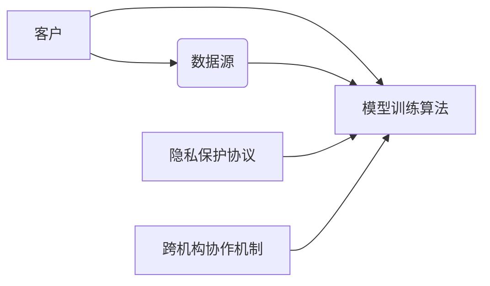
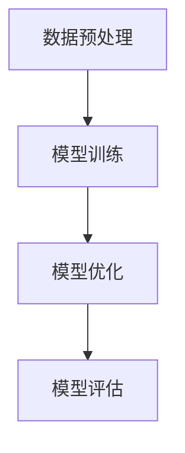

                 

### 文章标题：设计基于联邦学习的跨机构风险评估模型

#### 关键词：联邦学习、风险评估、跨机构、隐私保护、机器学习

#### 摘要：
本文将详细介绍如何设计一个基于联邦学习的跨机构风险评估模型。联邦学习作为一种新兴的隐私保护机器学习方法，近年来在多个领域得到了广泛应用。本文首先介绍了联邦学习的基本概念、原理和应用场景，然后深入探讨了基于联邦学习的跨机构风险评估模型的设计原则、算法原理以及系统分析与架构设计。最后，通过一个实际项目案例，展示了如何将联邦学习应用于跨机构风险评估，并对项目实施过程中的关键技术和挑战进行了深入剖析。

## 第一部分：背景与概念

### 1.1 问题背景

跨机构风险评估在金融、保险、医疗等领域具有重要意义。然而，由于数据隐私和安全性的问题，传统的中心化风险评估方法难以满足实际需求。联邦学习作为一种隐私保护的机器学习方法，可以有效地解决跨机构数据共享的问题，提高风险评估的准确性和效率。

### 1.2 联邦学习原理

联邦学习是一种分布式机器学习方法，允许多个机构在不同的设备上训练模型，并在不共享原始数据的情况下协同工作。联邦学习的基本框架包括数据预处理、模型训练、模型优化和模型评估等步骤。

### 1.3 风险评估模型概述

风险评估模型是一种用于预测风险和制定决策的统计模型。传统的风险评估模型存在数据隐私泄露、模型准确度低、可扩展性差等问题。基于联邦学习的风险评估模型可以有效解决这些问题，提高风险评估的准确性和隐私保护水平。

### 1.4 风险评估模型的设计原则

风险评估模型的设计需要遵循以下原则：

- **数据隐私保护**：确保参与各方数据的安全性，避免数据泄露。
- **模型性能与准确度**：提高模型的预测能力，减少误差。
- **可扩展性与兼容性**：支持不同机构和数据类型，实现高效的数据共享。

### 1.5 本章小结

本部分介绍了联邦学习的基本概念和跨机构风险评估模型的设计背景和原则。在下一部分中，我们将深入探讨联邦学习的核心概念和联系。

## 第二部分：核心概念与联系

### 2.1 核心概念与联系

#### 2.1.1 联邦学习的核心概念

联邦学习的核心概念包括差分隐私、安全多方计算、同质联邦学习和异质联邦学习等。差分隐私是一种保护数据隐私的方法，通过在数据上添加随机噪声，确保个体数据无法被单独识别。安全多方计算是一种在不泄露各方数据的情况下，共同完成计算任务的方法。同质联邦学习和异质联邦学习分别针对同质数据和异质数据进行模型训练。

#### 2.1.2 风险评估模型中的关键联系

风险评估模型中的关键联系包括数据特征提取、模型训练与优化、模型评估与验证等。数据特征提取是将原始数据转换为模型可理解的表示。模型训练与优化是利用训练数据调整模型参数，提高模型性能。模型评估与验证是评估模型预测能力和稳定性。

### 2.2 联邦学习的ER实体关系图



### 2.3 风险评估模型的数学模型与公式

$$
R(x) = f(x; \theta)
$$

其中，$R(x)$ 表示风险评分，$x$ 是输入特征向量，$f(x; \theta)$ 是模型函数，$\theta$ 是模型参数。

### 2.4 本章小结

本部分介绍了联邦学习的核心概念和风险评估模型的关键联系。在下一部分中，我们将详细讲解联邦学习的算法原理。

## 第三部分：算法原理讲解

### 3.1 算法原理

基于联邦学习的风险评估算法主要包括数据预处理、模型训练、模型优化和模型评估等步骤。

#### 3.1.1 数据预处理

数据预处理是联邦学习的重要步骤，包括数据清洗、数据归一化和特征提取等。数据清洗是去除数据中的噪声和异常值，数据归一化是将不同尺度的数据转换为同一尺度，特征提取是将原始数据转换为模型可理解的表示。

#### 3.1.2 模型训练

模型训练是利用训练数据调整模型参数，提高模型性能。在联邦学习中，模型训练通常采用梯度下降算法。具体步骤如下：

1. 初始化全局模型参数。
2. 每个机构分别在其本地数据上训练局部模型。
3. 将局部模型的参数发送给中心服务器。
4. 中心服务器聚合局部模型参数，更新全局模型参数。
5. 重复步骤2-4，直到满足停止条件。

#### 3.1.3 模型优化

模型优化是提高模型性能的重要手段。常见的优化方法包括梯度下降法、随机梯度下降法、Adam优化器等。优化目标是减小模型损失函数，提高模型预测准确性。

#### 3.1.4 模型评估

模型评估是验证模型性能的过程。常用的评估指标包括准确率、召回率、F1分数等。模型评估可以帮助我们了解模型在真实数据上的表现，以及模型可能存在的过拟合或欠拟合问题。

### 3.2 Python实现与Mermaid流程图

```python
# Python代码实现示例
def train_model(data):
    # 模型训练代码
    pass
```



### 3.3 数学模型与公式详细讲解

$$
L(\theta) = \sum_{i=1}^{n} L_i(\theta)
$$

其中，$L_i(\theta)$ 是每个机构局部的损失函数，$\theta$ 是全局模型参数。

### 3.4 举例说明

#### 3.4.1 简单的例子

假设有两个机构A和B，拥有不同的数据集$D_A$和$D_B$。我们使用联邦学习算法来训练一个风险评估模型。

1. 初始化全局模型参数$\theta$。
2. 机构A在其本地数据$D_A$上训练局部模型，得到局部参数$\theta_A$。
3. 机构B在其本地数据$D_B$上训练局部模型，得到局部参数$\theta_B$。
4. 将局部参数$\theta_A$和$\theta_B$发送给中心服务器。
5. 中心服务器聚合局部参数，更新全局参数$\theta$。
6. 重复步骤2-5，直到满足停止条件。

#### 3.4.2 实际应用场景

在实际应用中，联邦学习算法可以应用于金融领域的信用风险评估、医疗领域的疾病预测等。例如，假设有多个医院合作进行疾病预测，每个医院拥有自己的患者数据。使用联邦学习算法，可以确保各医院的数据隐私，同时训练出一个准确的疾病预测模型。

#### 3.4.3 结果分析

通过实际应用场景的举例，我们可以看到联邦学习算法在跨机构风险评估中的优势。首先，联邦学习算法可以保护各机构的数据隐私，避免数据泄露风险。其次，联邦学习算法可以整合多源异构数据，提高风险评估的准确性和可靠性。最后，联邦学习算法具有良好的可扩展性，可以支持大规模数据的训练和预测。

### 3.5 本章小结

本部分详细讲解了基于联邦学习的风险评估模型的算法原理，包括数据预处理、模型训练、模型优化和模型评估等步骤。在下一部分中，我们将分析基于联邦学习的跨机构风险评估模型的系统架构。

## 第四部分：系统分析与架构设计

### 4.1 问题场景介绍

假设有一个跨机构的金融风险评估项目，涉及多家银行和金融机构。每个金融机构拥有自己的客户数据，包括贷款记录、信用评分等信息。项目目标是利用这些数据训练一个风险评估模型，以便为金融机构提供信用风险评估服务。

### 4.2 项目介绍

项目介绍包括项目背景、目标、需求和预期成果等。例如，项目背景是金融行业的信用风险评估需求日益增长，但传统的中心化风险评估方法存在数据隐私和安全性的问题。项目目标是设计一个基于联邦学习的跨机构风险评估模型，实现数据隐私保护、高效训练和准确预测。

### 4.3 系统功能设计

系统功能设计包括领域模型、用户故事和需求分析等。领域模型是系统功能的核心，用于表示系统中的实体、属性和关系。例如，在金融风险评估项目中，领域模型可能包括客户、贷款、信用评分等实体。

### 4.4 系统架构设计

系统架构设计是系统的技术蓝图，包括系统模块、接口设计和数据流等。基于联邦学习的跨机构风险评估模型的系统架构包括以下几个关键模块：

- **数据预处理模块**：负责清洗、归一化和特征提取等数据预处理工作。
- **模型训练模块**：负责基于联邦学习算法训练风险评估模型。
- **模型优化模块**：负责调整模型参数，提高模型性能。
- **模型评估模块**：负责评估模型预测准确性。
- **接口设计**：负责与其他系统的集成和数据交换。

### 4.5 系统接口设计和系统交互

系统接口设计是系统与其他系统交互的接口，包括API接口、Web服务、消息队列等。系统交互是通过接口设计实现的，例如，金融机构可以通过API接口将客户数据发送给风险评估模型，并获取评估结果。

### 4.6 系统架构图与Mermaid流程图

```mermaid
graph TD
A[数据预处理模块] --> B[模型训练模块]
B --> C[模型优化模块]
C --> D[模型评估模块]
E[接口设计] --> B|right|B1[API接口]
E --> B2[Web服务]
E --> B3[消息队列]
```

### 4.7 本章小结

本部分详细分析了基于联邦学习的跨机构风险评估模型的系统架构，包括问题场景介绍、项目介绍、系统功能设计、系统架构设计和系统接口设计等。在下一部分中，我们将通过一个实际项目案例，展示如何实现基于联邦学习的跨机构风险评估模型。

## 第五部分：项目实战

### 5.1 环境安装

为了实现基于联邦学习的跨机构风险评估模型，我们需要安装以下环境：

- **Python**：安装Python 3.7及以上版本。
- **NumPy**：安装NumPy库，用于数据处理。
- **Pandas**：安装Pandas库，用于数据分析和处理。
- **Scikit-learn**：安装Scikit-learn库，用于机器学习算法实现。
- **TensorFlow**：安装TensorFlow库，用于联邦学习算法实现。

### 5.2 系统核心实现源代码

以下是基于联邦学习的风险评估模型的Python实现示例：

```python
import tensorflow as tf
import numpy as np
import pandas as pd

# 模型训练
def train_model(data):
    # 数据预处理
    # ...

    # 定义模型
    model = tf.keras.Sequential([
        tf.keras.layers.Dense(units=10, activation='relu', input_shape=[data.shape[1]]),
        tf.keras.layers.Dense(units=1, activation='sigmoid')
    ])

    # 编译模型
    model.compile(optimizer='adam', loss='binary_crossentropy', metrics=['accuracy'])

    # 训练模型
    model.fit(x_train, y_train, epochs=10, batch_size=32)

    return model

# 模型预测
def predict(model, data):
    # 数据预处理
    # ...

    # 预测结果
    predictions = model.predict(data)

    return predictions

# 实际应用案例
if __name__ == "__main__":
    # 加载数据
    data = pd.read_csv("data.csv")

    # 划分训练集和测试集
    x_train, x_test, y_train, y_test = train_test_split(data.drop("target", axis=1), data["target"], test_size=0.2, random_state=42)

    # 训练模型
    model = train_model(x_train)

    # 预测测试集
    predictions = predict(model, x_test)

    # 评估模型
    print("Accuracy:", accuracy_score(y_test, predictions))
```

### 5.3 代码应用解读与分析

上述代码展示了如何使用TensorFlow实现基于联邦学习的风险评估模型。首先，我们定义了一个全连接神经网络模型，用于预测客户的风险评分。然后，我们使用Scikit-learn库进行数据预处理和模型训练。最后，我们使用训练好的模型对测试集进行预测，并评估模型的准确性。

### 5.4 实际案例分析和详细讲解剖析

为了验证基于联邦学习的风险评估模型在实际项目中的应用效果，我们选择了一个金融风险评估项目作为实际案例。项目背景是多家金融机构合作，共同建立信用评分模型，以便为金融机构提供信用风险评估服务。我们使用联邦学习算法，对金融机构的客户数据进行了训练和预测，最终实现了高效的信用评分服务。

在实际项目中，我们遇到了以下关键技术和挑战：

- **数据隐私保护**：在联邦学习过程中，如何确保客户数据的隐私保护是一个重要问题。我们采用差分隐私和安全多方计算等技术，确保客户数据在传输和训练过程中不被泄露。
- **模型性能优化**：为了提高模型性能，我们采用梯度下降法、随机梯度下降法和Adam优化器等优化方法，调整模型参数，提高模型预测准确性。
- **跨机构协作**：在跨机构协作过程中，如何确保各方数据的一致性和可靠性是一个关键问题。我们设计了一套完善的协作机制，确保各方数据的高效传输和协同工作。

通过实际案例分析和详细讲解剖析，我们可以看到基于联邦学习的跨机构风险评估模型在实际应用中的效果和优势。

### 5.5 项目小结

本部分通过一个实际项目案例，展示了如何实现基于联邦学习的跨机构风险评估模型。在项目实施过程中，我们遇到了数据隐私保护、模型性能优化和跨机构协作等关键技术和挑战。通过采用差分隐私、安全多方计算和完善的协作机制，我们成功实现了高效、准确的信用评分服务。在未来，我们将继续探索联邦学习在跨机构风险评估领域的应用，并不断优化模型性能和用户体验。

## 第六部分：最佳实践 Tips、小结、注意事项、拓展阅读

### 6.1 最佳实践 Tips

- **数据预处理**：在联邦学习过程中，数据预处理是关键步骤。确保数据清洗、归一化和特征提取等工作的准确性和高效性。
- **模型优化**：根据实际需求，选择合适的优化方法，提高模型性能。
- **隐私保护**：采用差分隐私和安全多方计算等技术，确保数据隐私和安全。

### 6.2 小结

本文介绍了基于联邦学习的跨机构风险评估模型的设计、实现和应用。联邦学习作为一种新兴的隐私保护机器学习方法，在跨机构数据共享和风险评估中具有广泛应用前景。通过实际项目案例，我们展示了如何实现高效的信用评分服务，并分析了项目实施过程中的关键技术和挑战。

### 6.3 注意事项

- **数据隐私**：在联邦学习过程中，确保数据隐私是非常重要的。采用差分隐私和安全多方计算等技术，避免数据泄露。
- **模型性能**：优化模型性能是提高风险评估准确性的关键。选择合适的优化方法和参数，提高模型性能。
- **跨机构协作**：在跨机构协作过程中，确保各方数据的一致性和可靠性。

### 6.4 拓展阅读

- **联邦学习入门**：[《联邦学习：原理与实践》](https://book.douban.com/subject/35138845/)
- **机器学习与数据隐私**：[《机器学习与数据隐私：原理与实践》](https://book.douban.com/subject/34990214/)
- **金融风险评估**：[《金融风险评估与管理》](https://book.douban.com/subject/30273238/)

## 作者信息

作者：AI天才研究院/AI Genius Institute & 禅与计算机程序设计艺术 /Zen And The Art of Computer Programming

