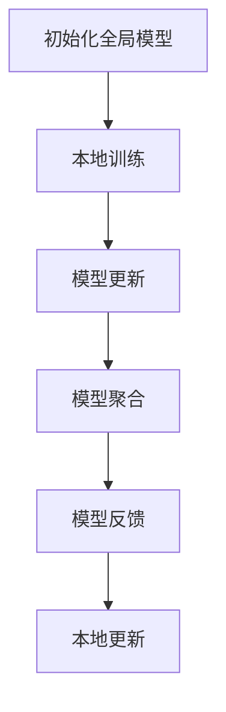
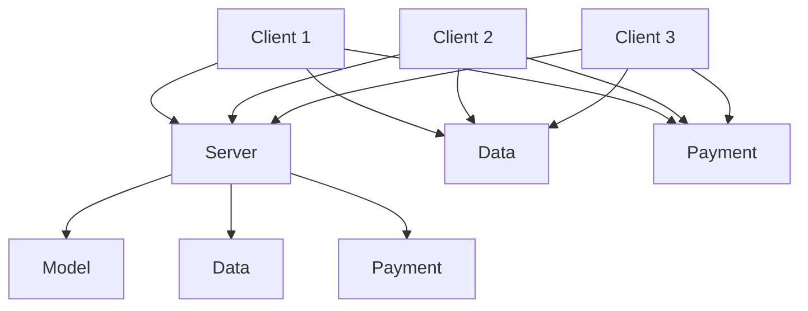
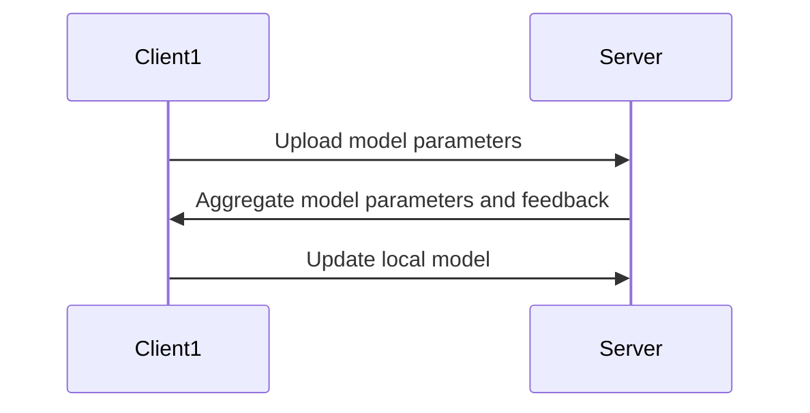

                 

### 设计基于联邦学习的隐私保护金融AI系统

**关键词：** 联邦学习、隐私保护、金融AI、系统设计、算法原理、架构实现

**摘要：** 随着金融行业对人工智能应用的日益增长，如何保障用户隐私和数据安全成为关键挑战。本文将探讨基于联邦学习的隐私保护金融AI系统设计，通过详细分析联邦学习的原理、算法设计、系统架构及实战应用，为金融行业提供一套切实可行的解决方案。

## 第一部分：背景介绍与核心概念

### 第1章：隐私保护与联邦学习概述

#### 1.1 隐私保护的挑战

##### 1.1.1 隐私泄露的风险

在金融领域，用户数据包含了敏感的个人信息、交易记录等，一旦泄露，将导致严重的隐私侵犯和财产损失。传统的集中式数据处理方式难以避免数据泄露风险，因为所有数据都集中存储在中心服务器上，攻击者可以轻易地获取整个数据库。

##### 1.1.2 数据安全法规与要求

随着《通用数据保护条例（GDPR）》等数据安全法规的出台，金融机构在处理用户数据时面临更高的合规要求。这些法规要求企业在数据收集、存储、处理和使用过程中必须严格保护用户隐私，否则将面临严厉的罚款和处罚。

##### 1.1.3 隐私保护的必要性

隐私保护不仅关乎用户权益，也关乎金融机构的声誉和业务发展。一个能够有效保护用户隐私的AI系统，可以增强用户信任，提升客户满意度，从而在激烈的市场竞争中占据优势。

#### 1.2 联邦学习的原理与优势

##### 1.2.1 联邦学习的定义

联邦学习（Federated Learning）是一种分布式机器学习方法，它允许多个参与者在不共享原始数据的情况下共同训练模型。每个参与者只提供本地数据，并通过加密和聚合技术更新模型参数。

##### 1.2.2 联邦学习的核心优势

- **隐私保护**：联邦学习避免了数据的集中存储，从而降低数据泄露的风险。
- **数据安全**：联邦学习采用加密技术保护数据传输和存储，确保数据的安全性。
- **合作共享**：联邦学习允许不同机构在保护数据隐私的前提下共享模型知识和经验，实现知识的共同提升。

##### 1.2.3 联邦学习与传统机器学习对比

- **数据集中 vs 数据分散**：传统机器学习需要收集所有数据到一个中心位置进行训练，而联邦学习则是在各个数据源上进行训练。
- **数据传输 vs 本地计算**：传统机器学习需要大量数据传输，而联邦学习主要通过模型参数的传输来实现协作。
- **安全性 vs 开放性**：联邦学习在保障数据安全的同时，也允许不同机构之间进行合作，而传统机器学习在数据集中存储时可能面临更大的安全风险。

### 第2章：核心概念与联系

#### 2.1 核心概念

##### 2.1.1 数据隐私

数据隐私是指保护用户数据不被未经授权的访问、使用或泄露。在联邦学习中，数据隐私通过加密和去标识化等技术来实现。

##### 2.1.2 联邦学习协议

联邦学习协议是指用于管理联邦学习过程中各个参与者之间的交互和数据传输的规则和标准。常见的联邦学习协议包括加密协议、安全聚合协议等。

##### 2.1.3 加密算法

加密算法是联邦学习中的核心技术，用于保护数据在传输和存储过程中的安全。常用的加密算法包括同态加密、差分隐私等。

#### 2.2 概念属性特征对比表格

| 概念             | 特征                            |
|------------------|--------------------------------|
| 数据隐私         | 保护用户数据不被泄露或滥用       |
| 联邦学习协议     | 规定联邦学习过程中的交互和数据传输 |
| 加密算法         | 保护数据在传输和存储过程中的安全   |

#### 2.3 ER实体关系图架构

```mermaid
erDiagram
  Customer ||--|{ Order }|-- Merchant
  Customer ||--|{ Payment }|-- Merchant
  Customer ||--|{ Review }|-- Merchant
  Merchant ||--|{ Product }|-- Category
```

这个ER图展示了联邦学习金融系统中的关键实体及其关系，包括客户、订单、支付、评论和产品等。

## 第二部分：联邦学习原理与系统设计

### 第3章：联邦学习算法原理

#### 3.1 算法概述

##### 3.1.1 联邦学习的算法框架

联邦学习算法框架主要包括以下几个步骤：

1. **初始化模型**：每个参与者（如金融机构）都初始化一个本地模型。
2. **本地训练**：每个参与者使用本地数据进行模型训练。
3. **模型更新**：参与者将本地模型参数上传到中央服务器。
4. **模型聚合**：中央服务器对参与者上传的模型参数进行聚合，得到全局模型。
5. **模型反馈**：中央服务器将聚合后的模型参数反馈给参与者。
6. **本地更新**：参与者使用反馈的模型参数更新本地模型。

##### 3.1.2 联邦学习算法的分类

根据聚合方式的不同，联邦学习算法可以分为以下几类：

- **中央化聚合**：中央服务器直接聚合参与者的模型参数。
- **分布式聚合**：参与者之间直接进行模型参数的传输和聚合。
- **混合聚合**：结合中央化和分布式聚合的优点。

#### 3.2 算法原理详细讲解

##### 3.2.1 数学模型

联邦学习算法的数学模型可以表示为：

$$
\theta^{(t+1)} = \theta^{(t)} - \alpha \cdot \frac{1}{N} \sum_{i=1}^{N} \nabla_{\theta} L_i(\theta^{(t)})
$$

其中，$\theta^{(t)}$ 表示第 $t$ 次迭代的模型参数，$\alpha$ 为学习率，$L_i(\theta^{(t)})$ 为第 $i$ 个参与者的损失函数。

##### 3.2.2 算法流程

联邦学习算法的流程如下：

1. **初始化全局模型**：每个参与者初始化一个本地模型。
2. **本地训练**：参与者使用本地数据进行模型训练，更新本地模型参数。
3. **模型更新**：参与者将本地模型参数上传到中央服务器。
4. **模型聚合**：中央服务器对参与者上传的模型参数进行聚合，得到全局模型参数。
5. **模型反馈**：中央服务器将聚合后的模型参数反馈给参与者。
6. **本地更新**：参与者使用反馈的模型参数更新本地模型。

##### 3.2.3 Mermaid算法流程图



#### 3.3 Python源代码实现与解释

##### 3.3.1 源代码结构

```python
# federated_learning.py

from model import Model
from server import Server
from client import Client

def main():
    # 初始化服务器和客户端
    server = Server()
    clients = [Client() for _ in range(NUM_CLIENTS)]

    # 迭代训练
    for t in range(NUM_ITERATIONS):
        # 本地训练
        for client in clients:
            client.train()

        # 模型更新
        for client in clients:
            server.update_model(client.get_model_params())

        # 模型聚合
        server.aggregate_models()

        # 模型反馈
        for client in clients:
            client.update_model(server.get_model_params())

    # 打印训练结果
    print("Training finished.")

if __name__ == "__main__":
    main()
```

##### 3.3.2 关键代码解析

1. **初始化模型**：在代码中，服务器和客户端分别初始化了全局模型和本地模型。
2. **本地训练**：客户端使用本地数据进行模型训练，更新本地模型参数。
3. **模型更新**：客户端将本地模型参数上传到服务器。
4. **模型聚合**：服务器对参与者上传的模型参数进行聚合，得到全局模型参数。
5. **模型反馈**：服务器将聚合后的模型参数反馈给客户端。
6. **本地更新**：客户端使用反馈的模型参数更新本地模型。

##### 3.3.3 示例应用

假设有10个金融机构（客户端）参与联邦学习，每个金融机构都有100条本地数据。在完成100次迭代后，全局模型将综合所有金融机构的数据，实现更加精准的预测和分析。

### 第4章：系统分析与架构设计

#### 4.1 问题场景介绍

在金融领域，金融机构需要基于用户数据（如交易记录、风险偏好等）进行个性化推荐、风险评估和欺诈检测等任务。然而，由于数据隐私和安全的要求，这些任务不能在集中式平台上完成。

#### 4.2 系统功能设计

##### 4.2.1 领域模型类图

```mermaid
classDiagram
    Client o--1 Model
    Server o--1 Model
    Client o--1 Data
    Server o--1 Data
    Client o--1 Payment
    Server o--1 Payment
class Model
    +str model_id
    +dict parameters
    -str status
class Client
    +str client_id
    +dict data
    +dict payment
    -Model model
class Server
    +str server_id
    +dict models
    +dict data
    +dict payment
```

领域模型类图展示了系统中的主要类及其关系，包括客户、服务器、模型和数据等。

#### 4.3 系统架构设计

##### 4.3.1 系统架构图



系统架构图展示了联邦学习系统的基本架构，包括客户端、服务器、数据流和支付系统等。

#### 4.4 系统接口设计

##### 4.4.1 接口定义

- **训练接口**：用于本地训练和模型更新。
- **聚合接口**：用于模型聚合和模型反馈。
- **支付接口**：用于处理交易和支付。

##### 4.4.2 接口交互流程

1. 客户端发起本地训练，训练完成后更新模型参数。
2. 客户端将模型参数上传到服务器。
3. 服务器对模型参数进行聚合，得到全局模型参数。
4. 服务器将全局模型参数反馈给客户端。
5. 客户端使用全局模型参数更新本地模型。

#### 4.5 系统交互序列图



系统交互序列图展示了客户端和服务器在联邦学习过程中的交互流程。

### 第5章：项目实战

#### 5.1 环境安装

在本节中，我们将介绍如何搭建联邦学习金融AI系统的开发环境，包括所需软件和工具的安装。

#### 5.2 系统核心实现

在本节中，我们将详细讲解系统核心部分的实现，包括模型训练、模型更新和模型聚合等关键功能。

#### 5.3 实际案例分析与讲解

在本节中，我们将通过实际案例，展示如何使用联邦学习金融AI系统进行数据分析和决策。

#### 5.4 项目小结

在本节中，我们将对整个项目进行总结，分析项目的优点和不足，并提出改进建议。

### 第6章：最佳实践与注意事项

在本节中，我们将总结联邦学习金融AI系统的最佳实践，并提供一些使用注意事项。

#### 6.1 联邦学习的最佳实践

- **数据预处理**：在联邦学习过程中，对数据进行预处理非常重要，可以提高模型的训练效果。
- **模型选择**：选择适合的数据模型和算法，可以提升联邦学习的性能。
- **安全措施**：加强数据传输和存储过程中的安全措施，确保系统安全可靠。

#### 6.2 注意事项

- **数据隐私**：在联邦学习过程中，必须确保用户数据的隐私安全。
- **模型更新频率**：适当的模型更新频率可以提高联邦学习的效率。
- **硬件资源**：联邦学习需要大量的计算资源，确保硬件资源充足。

#### 6.3 拓展阅读

在本节中，我们将推荐一些相关的书籍、文章和资源，供读者进一步学习。

## 结束语

本文详细介绍了设计基于联邦学习的隐私保护金融AI系统的原理、架构和实现。通过本文的阅读，读者可以了解到联邦学习在金融领域的应用潜力，以及如何实现一个安全、高效的联邦学习系统。希望本文能够为读者在联邦学习领域的研究和实践中提供有益的参考和启示。

**作者：AI天才研究院/AI Genius Institute & 禅与计算机程序设计艺术 /Zen And The Art of Computer Programming**

