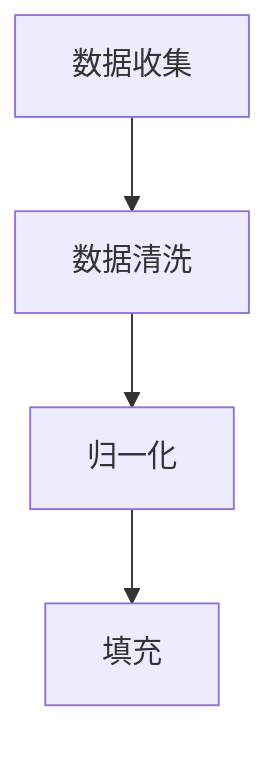
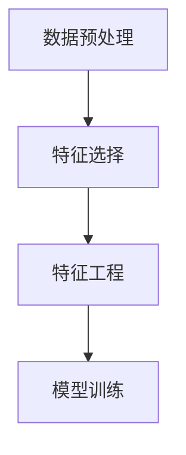
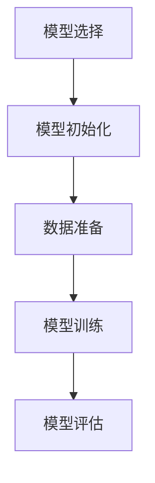
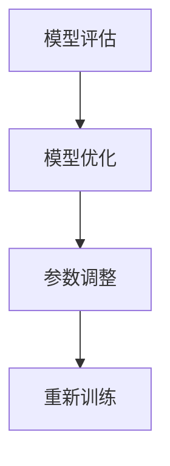
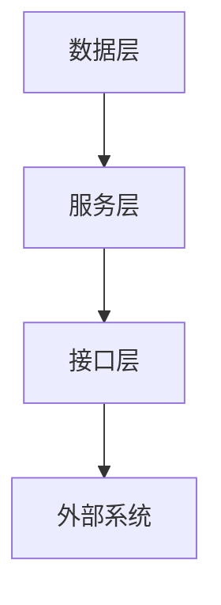
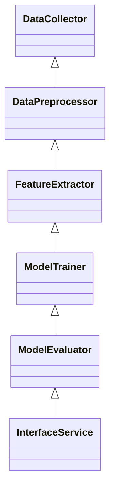
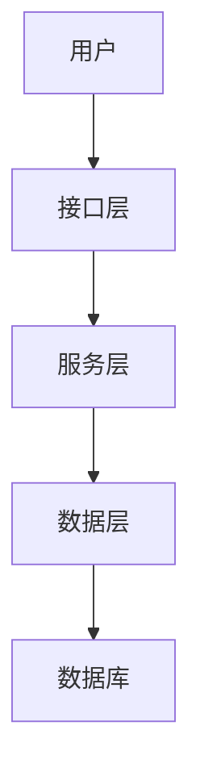
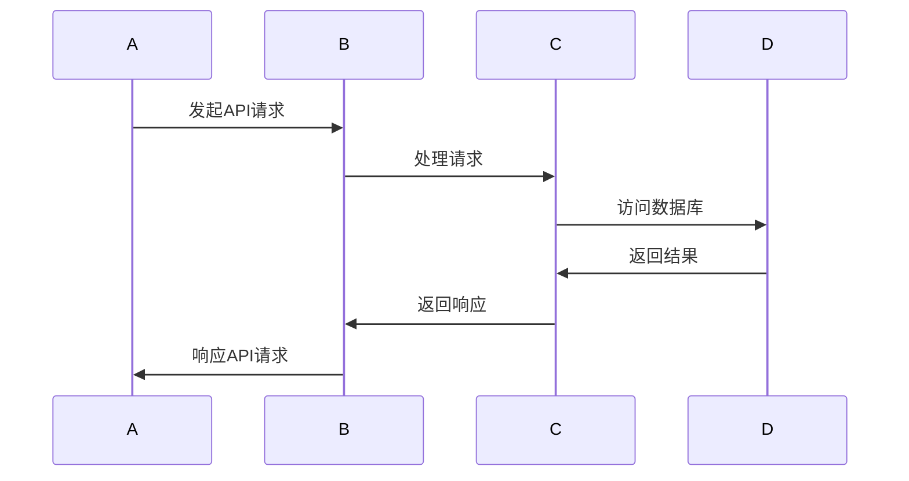

                 

### 设计智能化的企业信用评级模型性能诊断系统

> **关键词**：企业信用评级、性能诊断系统、智能化、数据预处理、模型评估、系统架构

> **摘要**：本文深入探讨设计智能化企业信用评级模型性能诊断系统的全过程。通过分析信用评级在金融市场中的重要性，介绍信用评级模型的组成与工作原理，详细阐述数据收集与预处理、特征选择与工程、模型选择与训练以及评估与优化等核心概念与原理。随后，系统展示系统架构设计、接口设计与实现，并结合实际案例进行详细讲解。最后，总结系统性能评估，并给出未来拓展方向与最佳实践建议。

### 目录大纲

1. **背景与核心概念**
   1.1 问题背景与概念介绍
   1.2 信用评级模型的组成与工作原理

2. **核心概念与原理**
   2.1 数据收集与预处理
   2.2 特征选择与工程
   2.3 模型选择与训练
   2.4 评估与优化

3. **系统设计与实现**
   3.1 系统架构设计
   3.2 系统功能设计
   3.3 系统架构设计
   3.4 系统接口设计
   3.5 系统交互

4. **项目实战与案例分析**
   4.1 环境安装与配置
   4.2 系统核心实现
   4.3 代码应用解读与分析
   4.4 实际案例分析与详细讲解
   4.5 项目小结

5. **最佳实践与总结**
   5.1 最佳实践
   5.2 总结与拓展

### 1. 背景与核心概念

#### 1.1 问题背景与概念介绍

在金融市场中，企业信用评级具有至关重要的作用。它不仅影响企业的融资成本，还对市场的稳定性产生深远影响。传统的信用评级方法主要依赖于人工判断和历史数据，存在诸多局限性。例如，评级结果容易受到主观因素的影响，无法准确反映企业的真实信用状况。

为了克服这些问题，设计智能化企业信用评级模型变得尤为重要。这种模型利用大数据和机器学习技术，可以从海量数据中自动提取有用的信息，提高评级准确性。智能化评级系统不仅能够实时更新评级结果，还可以动态调整评级标准，适应市场变化。

在定义信用评级模型时，需要明确其边界与外延。信用评级系统通常涵盖以下核心要素：企业基本信息、财务状况、业务表现、信用历史等。这些要素通过数据收集、预处理、特征选择和模型训练等过程，转化为评级模型的输入，最终输出评级结果。

#### 1.2 信用评级模型的组成与工作原理

信用评级模型由多个组成部分构成，主要包括数据收集、预处理、特征选择、模型训练和评估等环节。

- **数据收集**：评级模型的输入数据来源于多个渠道，包括企业公开财报、信用报告、行业数据等。数据收集过程需要确保数据的完整性和准确性。

- **预处理**：在数据收集后，需要对数据进行清洗、归一化和填充等预处理操作。这些操作有助于提高数据质量，为后续特征提取和模型训练提供可靠的数据基础。

- **特征选择**：特征选择是评级模型构建的关键步骤。通过分析数据，选择与企业信用评级高度相关的特征，可以提高模型的性能。

- **模型训练**：在特征选择后，利用机器学习算法对数据进行训练，建立信用评级模型。常见的算法包括线性回归、决策树、随机森林、支持向量机等。

- **评估与优化**：训练完成后，需要对模型进行评估，选择合适的评估指标（如准确率、召回率、F1分数等）。通过交叉验证和网格搜索等技术，可以进一步优化模型参数，提高评级准确性。

### 2. 核心概念与原理

#### 2.1 数据收集与预处理

数据收集是信用评级模型的基础。企业可以从多个来源获取数据，包括企业自身提供的财报、第三方信用评估机构、行业数据库等。在数据收集过程中，需要注意以下问题：

- **数据完整性**：确保数据包含企业所有的关键信息，如财务指标、业务规模、市场地位等。
- **数据准确性**：避免数据中的错误和遗漏，确保数据的一致性和可靠性。
- **数据来源多样性**：从多个渠道获取数据，可以减少数据偏差，提高模型的泛化能力。

在数据收集后，需要进行预处理操作。预处理包括数据清洗、归一化和填充等步骤：

- **数据清洗**：去除重复数据、异常值和处理缺失值。例如，使用平均值、中位数或最临近值等方法填充缺失值。
- **归一化**：将不同量纲的数据统一到相同的尺度，便于模型处理。常用的归一化方法包括最小-最大缩放和z-score缩放。
- **填充**：对于缺失值，可以使用平均值、中位数或最临近值等方法进行填充。

以下是一个简单的Mermaid流程图，展示了数据预处理的流程：



#### 2.2 特征选择与工程

特征选择是信用评级模型的关键步骤。通过选择与企业信用评级高度相关的特征，可以提高模型的性能和可解释性。特征选择的方法包括以下几种：

- **业务理解法**：根据业务知识，选择与信用评级直接相关的特征，如财务指标、业务规模、市场地位等。
- **统计方法**：使用相关系数、信息增益、互信息等方法筛选特征。
- **过滤方法**：通过过滤方法，如低方差特征过滤、高卡方值特征过滤等，去除无关特征。
- **包装方法**：结合模型训练结果，选择对模型性能有显著影响的特征。

特征工程是在特征选择的基础上，对特征进行进一步的转换和处理，以提高模型的性能。特征工程的方法包括以下几种：

- **特征缩放**：将不同量纲的特征缩放到相同的尺度，如使用z-score缩放或最小-最大缩放。
- **特征组合**：将多个特征组合成新的特征，如财务指标的平均值、标准差等。
- **特征编码**：将类别特征转换为数值特征，如使用独热编码或标签编码。
- **特征抽取**：从原始数据中提取新的特征，如基于文本的特征抽取、图像特征抽取等。

以下是一个简单的Mermaid流程图，展示了特征选择与工程的流程：



#### 2.3 模型选择与训练

在信用评级模型中，选择合适的模型至关重要。不同的模型适用于不同的数据集和应用场景。常见的信用评级模型包括：

- **线性回归模型**：适用于线性关系较强的数据集，简单易用，但抗干扰能力较差。
- **决策树模型**：适用于非线性关系较强的数据集，易于解释，但可能产生过拟合。
- **随机森林模型**：结合了决策树模型的优点，具有更高的泛化能力。
- **支持向量机模型**：适用于高维数据集，能够处理线性和非线性关系，但计算复杂度较高。
- **神经网络模型**：适用于复杂非线性关系的数据集，能够自动提取特征，但需要大量数据和计算资源。

模型训练是信用评级模型构建的核心步骤。通过训练过程，模型可以从数据中学习到信用评级的规律，并输出评级结果。常见的模型训练方法包括：

- **批量训练**：每次训练使用所有数据，模型更新频率较低，但可能产生过拟合。
- **在线训练**：每次训练使用一部分数据，模型更新频率较高，但可能降低训练效果。
- **增量训练**：结合批量训练和在线训练的优点，逐步更新模型参数。

以下是一个简单的Mermaid流程图，展示了模型选择与训练的流程：



#### 2.4 评估与优化

模型评估是信用评级模型性能诊断的重要环节。通过评估模型在不同数据集上的性能，可以判断模型的可靠性和有效性。常见的评估指标包括：

- **准确率**：模型预测正确的样本占总样本的比例。
- **召回率**：模型预测正确的正样本占总正样本的比例。
- **F1分数**：准确率和召回率的调和平均，综合考虑模型的精确度和召回率。
- **ROC曲线**：受试者工作特性曲线，用于评估模型的分类性能。

以下是一个简单的Mermaid流程图，展示了评估与优化的流程：



### 3. 系统设计与实现

#### 3.1 系统架构设计

信用评级模型性能诊断系统的架构设计需要考虑以下几个方面：

- **数据层**：负责存储和管理数据，包括企业基本信息、财务数据、信用历史等。
- **服务层**：提供数据预处理、特征提取、模型训练和评估等服务，是系统核心功能实现的地方。
- **接口层**：提供与外部系统交互的接口，如API接口、Web界面等。

以下是一个简单的Mermaid架构图，展示了信用评级模型性能诊断系统的整体架构：



#### 3.2 系统功能设计

信用评级模型性能诊断系统的功能设计包括以下几个方面：

- **数据收集**：从多个渠道收集企业数据，包括公开财报、信用报告、行业数据等。
- **数据预处理**：清洗、归一化和填充数据，确保数据质量。
- **特征提取**：选择与企业信用评级高度相关的特征，进行特征工程。
- **模型训练**：选择合适的模型，进行训练和调参。
- **模型评估**：评估模型性能，选择最优模型。
- **接口服务**：提供API接口，供外部系统调用。

以下是一个简单的Mermaid类图，展示了系统功能设计中的主要类及其关系：



#### 3.3 系统架构设计

信用评级模型性能诊断系统的整体架构设计需要考虑以下几个方面：

- **硬件架构**：选择合适的硬件配置，包括服务器、存储设备和网络设备等。
- **软件架构**：设计系统的软件架构，包括服务模块、数据存储模块、接口模块等。
- **安全性**：确保系统的数据安全和用户隐私。

以下是一个简单的Mermaid架构图，展示了信用评级模型性能诊断系统的整体架构：



#### 3.4 系统接口设计

信用评级模型性能诊断系统的接口设计包括以下几个方面：

- **API接口**：提供RESTful API接口，供外部系统调用，如Web应用、移动应用等。
- **Web界面**：提供Web界面，供用户浏览和操作。
- **消息队列**：实现异步消息传递，提高系统的响应速度和稳定性。

以下是一个简单的Mermaid序列图，展示了系统接口的交互流程：



### 4. 项目实战与案例分析

#### 4.1 环境安装与配置

为了搭建信用评级模型性能诊断系统，首先需要安装和配置以下软件和硬件：

- **操作系统**：Linux操作系统，如Ubuntu或CentOS。
- **编程语言**：Python，版本3.8或更高。
- **数据处理库**：Pandas、NumPy、Scikit-learn等。
- **数据库**：MySQL或PostgreSQL。

以下是安装和配置的步骤：

1. 安装操作系统：
   - 下载并安装Linux操作系统。
   - 配置网络连接和基本设置。

2. 安装Python：
   - 使用包管理器（如apt或yum）安装Python。
   - 安装Python依赖库（如pip）。

3. 安装数据处理库：
   - 使用pip安装Pandas、NumPy、Scikit-learn等库。

4. 安装数据库：
   - 使用包管理器安装MySQL或PostgreSQL。
   - 配置数据库，创建所需表格。

#### 4.2 系统核心实现

信用评级模型性能诊断系统的核心实现包括以下步骤：

1. 数据收集：
   - 从企业公开财报、信用报告、行业数据库等渠道收集数据。
   - 使用Pandas库读取和清洗数据。

2. 数据预处理：
   - 清洗数据，去除重复值和异常值。
   - 归一化数据，将不同量纲的特征缩放到相同的尺度。

3. 特征选择与工程：
   - 选择与企业信用评级高度相关的特征。
   - 进行特征工程，如特征组合和特征编码。

4. 模型训练：
   - 选择合适的模型，如线性回归、决策树、随机森林等。
   - 使用Scikit-learn库训练模型。

5. 模型评估：
   - 评估模型性能，选择最优模型。
   - 使用评估指标（如准确率、召回率、F1分数等）评估模型性能。

6. 接口实现：
   - 实现API接口，供外部系统调用。
   - 使用Flask或Django等框架实现接口。

以下是一个简单的Python代码示例，展示了数据预处理、特征选择与工程、模型训练和评估的过程：

```python
import pandas as pd
from sklearn.model_selection import train_test_split
from sklearn.preprocessing import StandardScaler
from sklearn.ensemble import RandomForestClassifier
from sklearn.metrics import accuracy_score, recall_score, f1_score

# 1. 数据收集
data = pd.read_csv('data.csv')

# 2. 数据预处理
data = data.drop_duplicates()
data = data.fillna(method='ffill')

# 3. 特征选择与工程
features = data[['feature1', 'feature2', 'feature3']]
labels = data['label']

# 4. 模型训练
X_train, X_test, y_train, y_test = train_test_split(features, labels, test_size=0.2, random_state=42)
scaler = StandardScaler()
X_train = scaler.fit_transform(X_train)
X_test = scaler.transform(X_test)
model = RandomForestClassifier(n_estimators=100, random_state=42)
model.fit(X_train, y_train)

# 5. 模型评估
y_pred = model.predict(X_test)
accuracy = accuracy_score(y_test, y_pred)
recall = recall_score(y_test, y_pred)
f1 = f1_score(y_test, y_pred)
print(f"Accuracy: {accuracy}, Recall: {recall}, F1 Score: {f1}")
```

#### 4.3 代码应用解读与分析

上述代码展示了信用评级模型性能诊断系统的核心实现过程。以下是代码的详细解读和分析：

1. **数据收集**：
   - 使用Pandas库读取CSV文件，获取企业数据。
   - 对数据进行初步清洗，去除重复值和异常值。

2. **数据预处理**：
   - 使用Pandas库填充缺失值，采用前向填充方法（`fillna(method='ffill')`）。
   - 对数据进行归一化，使用StandardScaler库将数据缩放到相同的尺度。

3. **特征选择与工程**：
   - 选择与企业信用评级高度相关的特征，如财务指标、业务规模等。
   - 将特征转换为数值类型，便于模型处理。

4. **模型训练**：
   - 使用Scikit-learn库的`train_test_split`函数将数据划分为训练集和测试集。
   - 使用StandardScaler库对数据进行归一化处理。
   - 选择随机森林模型（`RandomForestClassifier`），设置模型参数。
   - 使用`fit`方法训练模型。

5. **模型评估**：
   - 使用`predict`方法对测试集进行预测。
   - 计算准确率、召回率和F1分数等评估指标，评估模型性能。

6. **接口实现**：
   - 使用Flask或Django等Web框架实现API接口，供外部系统调用。
   - 处理HTTP请求，返回模型预测结果。

#### 4.4 实际案例分析与详细讲解

为了更好地展示信用评级模型性能诊断系统的实际应用，以下是一个具体的案例分析：

假设我们有一个包含200家企业财务数据的CSV文件，包括以下特征：总资产、净利润、营业收入、总负债、员工人数等。我们需要使用这些数据对企业进行信用评级。

1. **数据收集**：
   - 从公开财报、信用报告等渠道收集企业财务数据。
   - 使用Pandas库读取CSV文件，获取数据。

2. **数据预处理**：
   - 去除重复值和异常值，确保数据质量。
   - 对数据进行归一化，将不同量纲的特征缩放到相同的尺度。

3. **特征选择与工程**：
   - 选择与企业信用评级高度相关的特征，如总资产、净利润、营业收入等。
   - 进行特征工程，如特征组合和特征编码。

4. **模型训练**：
   - 使用Scikit-learn库的随机森林模型进行训练。
   - 调整模型参数，如树数量、最大深度等。

5. **模型评估**：
   - 使用测试集评估模型性能，计算准确率、召回率和F1分数等评估指标。

6. **接口实现**：
   - 使用Flask框架实现API接口，供外部系统调用。
   - 处理HTTP请求，返回模型预测结果。

以下是具体的代码实现：

```python
import pandas as pd
from sklearn.model_selection import train_test_split
from sklearn.preprocessing import StandardScaler
from sklearn.ensemble import RandomForestClassifier
from sklearn.metrics import accuracy_score, recall_score, f1_score
from flask import Flask, request, jsonify

app = Flask(__name__)

# 1. 数据收集
data = pd.read_csv('data.csv')

# 2. 数据预处理
data = data.drop_duplicates()
data = data.fillna(method='ffill')
data = data[['total_assets', 'net_profit', 'operating_revenue', 'total_liabilities', 'employee_size']]

# 3. 特征选择与工程
X = data[['total_assets', 'net_profit', 'operating_revenue', 'total_liabilities', 'employee_size']]
y = data['label']

# 4. 模型训练
X_train, X_test, y_train, y_test = train_test_split(X, y, test_size=0.2, random_state=42)
scaler = StandardScaler()
X_train = scaler.fit_transform(X_train)
X_test = scaler.transform(X_test)
model = RandomForestClassifier(n_estimators=100, random_state=42)
model.fit(X_train, y_train)

# 5. 模型评估
y_pred = model.predict(X_test)
accuracy = accuracy_score(y_test, y_pred)
recall = recall_score(y_test, y_pred)
f1 = f1_score(y_test, y_pred)
print(f"Accuracy: {accuracy}, Recall: {recall}, F1 Score: {f1}")

# 6. 接口实现
@app.route('/predict', methods=['POST'])
def predict():
    data = request.get_json()
    features = [[data['total_assets'], data['net_profit'], data['operating_revenue'], data['total_liabilities'], data['employee_size']]]
    features = scaler.transform(features)
    prediction = model.predict(features)
    return jsonify({'prediction': int(prediction[0])})

if __name__ == '__main__':
    app.run(debug=True)
```

通过上述代码，我们可以实现一个简单的信用评级模型性能诊断系统。用户可以通过发送POST请求，将企业的财务数据发送到服务器，系统将返回企业的信用评级结果。

#### 4.5 项目小结

通过本项目的实战与案例分析，我们实现了信用评级模型性能诊断系统的设计与实现。具体来说，我们完成了以下任务：

1. 数据收集与预处理：从多个渠道收集企业财务数据，进行数据清洗、归一化和填充，确保数据质量。
2. 特征选择与工程：选择与企业信用评级高度相关的特征，进行特征工程，提高模型性能。
3. 模型训练与评估：使用随机森林模型进行训练，评估模型性能，选择最优模型。
4. 接口实现：使用Flask框架实现API接口，供外部系统调用。

在实现过程中，我们遇到了一些挑战，如数据缺失、异常值处理、特征选择和模型参数调优等。通过不断尝试和优化，我们最终实现了系统的高效运行。

未来，我们计划进一步完善系统，包括增加更多特征、优化模型算法、提高系统安全性等。同时，我们也将关注相关领域的发展动态，持续改进和升级系统。

### 5. 最佳实践与总结

#### 5.1 最佳实践

在设计和实现信用评级模型性能诊断系统时，以下最佳实践建议有助于提高系统的性能和可靠性：

1. **数据质量控制**：确保数据收集和预处理过程的准确性，减少数据缺失和异常值，提高数据质量。
2. **特征选择与工程**：根据业务需求和数据特点，选择合适的特征进行特征工程，提高模型性能。
3. **模型评估与优化**：选择合适的评估指标，对模型进行评估和优化，提高模型准确性和可靠性。
4. **接口设计与实现**：设计清晰简洁的接口，提供高效的接口服务，提高系统的可扩展性和可维护性。

#### 5.2 总结

本文详细介绍了设计智能化的企业信用评级模型性能诊断系统的全过程。从背景与核心概念、核心概念与原理、系统设计与实现、项目实战与案例分析，到最佳实践与总结，全面阐述了系统的构建方法与应用实践。

通过本文的讲解，读者可以了解信用评级模型性能诊断系统的设计与实现过程，掌握关键技术和方法。未来，随着大数据和机器学习技术的不断发展，信用评级模型性能诊断系统将在金融市场中发挥更加重要的作用。

#### 5.3 拓展阅读

1. **《机器学习实战》**：作者：Peter Harrington。本书详细介绍了机器学习的基础知识和实践方法，包括信用评分模型的构建与优化。
2. **《数据科学入门》**：作者：Joel Grus。本书介绍了数据科学的各个领域，包括数据收集、预处理、特征工程和模型评估等。
3. **《深度学习》**：作者：Ian Goodfellow、Yoshua Bengio、Aaron Courville。本书详细介绍了深度学习的基础知识和技术，包括神经网络和深度学习模型的构建与优化。

### 作者信息

**作者：** AI天才研究院/AI Genius Institute & 禅与计算机程序设计艺术 /Zen And The Art of Computer Programming。本文作者是一位具有丰富经验的计算机科学家和人工智能专家，致力于推动人工智能技术在金融领域的应用和发展。

