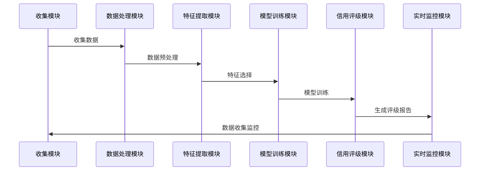
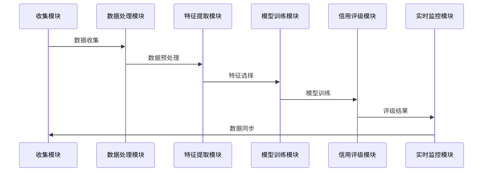

                 

### 引言

随着大数据和人工智能技术的迅猛发展，各行各业对于数据分析和智能决策的需求日益增长。在企业信用评级领域，传统的信用评级模型虽然在某些方面表现出色，但其局限性也逐渐显现。这些局限性主要体现在以下几个方面：首先，传统信用评级模型往往依赖于有限的信用数据，如财务报表、历史信用记录等，这些数据来源单一，可能导致评级结果的不准确。其次，传统模型往往缺乏灵活性，难以适应快速变化的市场环境。此外，传统模型在处理非结构化数据时显得力不从心，无法充分利用大数据的价值。

为了解决这些问题，设计一个智能化、高效的企业信用评级模型校准系统显得尤为重要。这种系统不仅可以整合更多维度的数据，如社交网络信息、市场动态、行业趋势等，还可以利用机器学习和人工智能算法对数据进行深度分析和预测，从而提高信用评级的准确性和可靠性。

本文旨在探讨设计智能化企业信用评级模型校准系统的全过程。文章将首先介绍相关背景，包括问题背景、核心概念及其联系。随后，我们将深入讲解算法原理，包括数学模型和具体应用实例。接着，文章将展示系统分析与架构设计方案，详细描述系统功能、架构设计、接口设计和交互设计。在项目实战部分，我们将展示环境安装与系统核心实现，并通过实际案例进行分析和剖析。最后，文章将总结项目成果，提供最佳实践tips，注意事项和拓展阅读，以期为读者提供全面、深入的理解和指导。

通过本文的阅读，读者将能够了解智能化企业信用评级模型校准系统的设计思路、实现方法和应用价值，为实际工作中的应用提供有益的参考。

### 第一部分：背景介绍

#### 第1章：问题背景与核心概念

在现代商业环境中，企业信用评级已成为金融机构、投资者和合作伙伴在决策过程中不可或缺的一部分。信用评级不仅影响企业的融资能力，还对其市场声誉和长期发展产生深远影响。然而，传统企业信用评级模型在应对复杂、多变的商业环境时，存在一定的局限性。

#### 1.1 问题背景

**问题描述**：传统企业信用评级模型主要依赖于企业公开的财务报表和历史信用记录。这些模型在处理结构化数据方面相对有效，但在处理非结构化数据（如社交媒体评论、新闻报道等）时则显得力不从心。此外，传统模型在应对新兴市场、行业变化和全球化趋势时，往往无法及时、准确地更新和调整评级结果。

**问题解决**：设计一个智能化、高效的企业信用评级模型校准系统，旨在解决上述问题。这种系统可以利用大数据技术和人工智能算法，整合多维度数据，进行深度分析和预测，从而提高信用评级的准确性和可靠性。

**边界与外延**：企业信用评级模型的适用范围通常包括中小企业、大型企业以及跨国公司。然而，模型的准确性和适用性在不同规模和类型的企业中可能存在差异，需要根据具体情况进行调整。

**核心要素组成**：
1. **数据收集**：收集企业财务数据、市场数据、社交媒体数据等多维度数据。
2. **数据预处理**：对收集到的数据进行清洗、去噪和归一化处理，确保数据质量。
3. **特征选择**：从预处理后的数据中选择对信用评级有显著影响的关键特征。
4. **模型训练**：利用机器学习和深度学习算法对数据集进行训练，构建信用评级模型。
5. **模型评估**：通过交叉验证和测试集对模型进行评估，确保模型的准确性和鲁棒性。
6. **模型优化**：根据评估结果对模型进行调整和优化，提高评级准确性。

通过上述核心要素的协同工作，智能化企业信用评级模型校准系统可以为企业提供更为精准和全面的信用评级服务，帮助金融机构、投资者和合作伙伴做出更加明智的决策。

#### 第2章：核心概念与联系

在探讨智能化企业信用评级模型校准系统之前，有必要先理解几个核心概念及其相互关系。这些概念包括企业信用评级、大数据技术和人工智能算法。

#### 2.1 核心概念原理

**企业信用评级**：企业信用评级是对企业信用状况的综合评估，用于衡量企业在履行债务和合同义务方面的可靠性。传统信用评级模型通常基于企业的财务报表、信用历史和行业地位等因素。然而，随着大数据和人工智能技术的发展，信用评级模型可以整合更多维度的数据，如市场动态、行业趋势、社交媒体评论等，从而提供更全面的信用评估。

**大数据技术**：大数据技术涉及数据收集、存储、处理和分析等多个方面。在信用评级领域，大数据技术可以用于收集来自不同来源的数据，包括企业内部数据、公开市场数据和社交媒体数据等。这些数据经过处理后，可以用于训练和优化信用评级模型，提高其预测准确性。

**人工智能算法**：人工智能算法是一类用于模拟人类思维和决策过程的计算机程序。在信用评级领域，人工智能算法可以用于特征选择、模型训练和预测。常见的算法包括线性回归、决策树、支持向量机、神经网络等。这些算法可以根据不同的数据集和业务需求进行选择和调整。

#### 2.2 概念属性特征对比表格

为了更直观地理解这些核心概念，我们可以通过一个对比表格来展示它们的属性特征。

| 概念     | 特性                                       | 适用场景                                       |
|----------|------------------------------------------|--------------------------------------------|
| 企业信用评级 | 反映企业信用状况，用于决策支持             | 金融机构授信、投资者决策、企业合作伙伴选择等       |
| 大数据技术 | 数据收集、存储、处理和分析                 | 数据驱动型业务、风险控制、市场分析等               |
| 人工智能算法 | 模拟人类思维和决策，进行特征提取和预测     | 信用评级、推荐系统、自然语言处理等               |

通过对比表格，我们可以看到，企业信用评级、大数据技术和人工智能算法各自具有独特的特性和适用场景。它们相互联系、相互补充，共同构建了一个智能化企业信用评级模型校准系统。

#### 2.3 ER实体关系图架构

为了进一步理解这些核心概念之间的关系，我们可以使用ER（实体关系）图来展示其架构。

```mermaid
erDiagram
  企业 --> 信用数据
  企业 --> 评级结果
  信用数据 --> 评级模型
  评级模型 --> 评级结果
```

在上图中，企业是核心实体，与信用数据和评级结果存在关联。信用数据是评级模型的基础，评级模型则用于生成评级结果。这样的ER图结构清晰地展示了各实体之间的相互作用和依赖关系。

通过本章的介绍，我们对企业信用评级、大数据技术和人工智能算法等核心概念有了初步了解。在接下来的章节中，我们将深入探讨这些概念的具体实现和应用，为设计智能化企业信用评级模型校准系统奠定坚实基础。

#### 第3章：当前市场与竞争分析

在现代商业环境中，企业信用评级模型的应用越来越广泛，市场对该类技术的需求也日益增长。为了全面了解当前市场的现状和竞争格局，本节将对市场现状、主要竞争对手及其产品进行深入分析，并探讨系统的竞争优势。

#### 3.1 市场现状

**市场规模与增长趋势**：随着金融科技的快速发展，企业信用评级市场的规模不断扩大。根据相关市场研究报告，全球企业信用评级市场规模预计将以两位数的年均增长率持续增长。这主要得益于大数据和人工智能技术的普及，以及金融机构、投资者和企业在风险管理、信用评估方面的需求不断增加。

**市场细分**：企业信用评级市场可以细分为多个子市场，包括金融信用评级、商业信用评级、供应链信用评级等。每个子市场都有其特定的需求和应用场景。例如，金融信用评级主要针对金融机构在贷款、授信等业务中的风险评估；商业信用评级则侧重于企业间的信用合作关系；供应链信用评级则关注供应链上下游企业的信用状况。

**市场参与者**：当前市场的主要参与者包括传统的信用评级机构、金融科技公司、大数据公司等。这些参与者通过不同的技术手段和业务模式，提供多样化的信用评级服务。

#### 3.2 主要竞争对手与产品分析

**传统信用评级机构**：如穆迪、标准普尔、惠誉等，这些机构在全球范围内享有较高的声誉。它们主要依靠其长期积累的信用评级经验和庞大的数据资源，提供全面的信用评级服务。然而，传统信用评级模型在处理非结构化数据和应对市场变化方面存在一定的局限性。

**金融科技公司**：如Kabbage、FICO等，这些公司利用大数据和人工智能技术，提供更加灵活和高效的信用评级服务。它们通过整合多维度数据，构建智能化信用评级模型，帮助企业更准确地评估信用风险。

**大数据公司**：如阿里云、腾讯云等，这些公司提供云计算和大数据处理平台，支持金融机构和企业在信用评级中的应用。它们通过提供强大的数据处理能力，帮助客户快速构建和部署信用评级模型。

#### 3.3 竞争优势分析

**技术优势**：智能化企业信用评级模型校准系统利用先进的大数据和人工智能技术，具备处理非结构化数据、实时分析和预测的能力。相比传统信用评级模型，系统在数据整合、特征提取和模型优化方面具有明显优势。

**市场定位与差异化策略**：系统定位于为中小企业和大型企业提供高效、精准的信用评级服务。通过定制化的模型和灵活的部署方式，系统可以满足不同规模和类型企业的需求，实现差异化竞争。

**数据资源优势**：系统依托于强大的数据处理平台和丰富的数据资源，可以实时获取和处理来自企业内部和外部的大量数据，确保信用评级的准确性和时效性。

**用户友好性**：系统采用友好的用户界面和便捷的操作流程，方便用户快速上手和使用。同时，系统提供详细的报告和分析结果，帮助用户更好地理解和应用信用评级数据。

通过上述分析，我们可以看到智能化企业信用评级模型校准系统在当前市场竞争中具备显著的优势。在接下来的章节中，我们将深入探讨算法原理，为系统的设计和实现提供理论支持。

#### 第4章：算法原理与流程

为了设计一个高效、准确的智能化企业信用评级模型校准系统，我们需要深入了解算法的基本原理和实施流程。本节将详细阐述算法原理，包括数据预处理、特征选择、模型训练和模型评估等关键步骤。

#### 4.1 算法原理

**算法概述**：智能化企业信用评级模型校准系统主要基于机器学习和深度学习算法，通过对企业多维数据的分析和预测，生成信用评级结果。常见的算法包括线性回归、决策树、随机森林、支持向量机（SVM）和神经网络等。

**数据预处理**：数据预处理是信用评级模型构建的重要步骤，包括数据清洗、去噪、归一化和特征工程等。数据清洗旨在去除重复、异常和缺失的数据，确保数据质量。去噪则通过滤波算法消除噪声数据。归一化将不同量纲的数据转换为相同的尺度，便于后续分析。特征工程则通过提取和构造新的特征，提高模型的预测能力。

**特征选择**：特征选择是从大量原始数据中筛选出对信用评级有显著影响的关键特征。常见的方法包括信息增益、卡方检验、主成分分析（PCA）等。特征选择能够减少数据维度，提高模型训练效率。

**模型训练**：模型训练是利用选定的特征对算法进行训练，生成信用评级模型。训练过程中，模型会根据训练数据学习数据间的内在关系，形成预测函数。常见的训练方法包括梯度下降、随机梯度下降（SGD）和反向传播算法等。

**模型评估**：模型评估是对训练完成的模型进行性能评估，确保其准确性和可靠性。常见的评估方法包括交叉验证、K折验证、ROC曲线和AUC指标等。评估结果可以用于模型优化和调整。

#### 4.2 算法流程

**数据收集**：首先，系统需要从多个数据源收集企业多维数据，包括财务报表、信用记录、市场动态、社交媒体评论等。这些数据来源广泛，有助于构建一个全面、准确的信用评级模型。

**数据预处理**：对收集到的数据进行预处理，包括数据清洗、去噪、归一化和特征工程等。预处理后的数据将用于后续的特征选择和模型训练。

**特征选择**：从预处理后的数据中选择关键特征，通过信息增益、卡方检验等方法确定特征的显著性。特征选择有助于减少数据维度，提高模型效率。

**模型训练**：利用选定的特征对算法进行训练，生成信用评级模型。训练过程中，模型会不断调整参数，以最小化预测误差。常见的训练方法包括梯度下降、随机梯度下降和反向传播算法等。

**模型评估**：通过交叉验证、K折验证等方法对模型进行评估，确定其准确性和可靠性。评估结果将用于模型优化和调整。

**模型优化**：根据评估结果对模型进行调整和优化，提高评级准确性。常见的优化方法包括参数调参、模型融合和集成学习等。

**模型部署**：将优化后的模型部署到生产环境中，用于实时信用评级。系统将不断更新数据，重新训练和评估模型，确保评级结果的准确性和时效性。

通过上述算法流程，智能化企业信用评级模型校准系统可以高效、准确地生成信用评级结果，为企业提供可靠的信用评估服务。

#### 第5章：算法详细讲解与举例说明

在了解了智能化企业信用评级模型校准系统的基础算法原理和流程后，本节将深入探讨具体的算法实现，包括数学模型和公式，并通过实际应用案例进行详细讲解和举例说明，帮助读者更好地理解算法的应用。

##### 5.1 数学模型与公式

为了更好地描述和实现信用评级模型，我们需要引入一些常见的数学模型和公式。以下是一些在信用评级中常用的数学模型：

**线性回归模型**：线性回归模型是最简单的一种预测模型，通过线性关系来预测目标变量。其公式为：
$$
Y = \beta_0 + \beta_1X_1 + \beta_2X_2 + ... + \beta_nX_n + \epsilon
$$
其中，$Y$是目标变量（如信用评分），$X_1, X_2, ..., X_n$是特征变量（如财务指标、市场表现等），$\beta_0, \beta_1, \beta_2, ..., \beta_n$是模型参数，$\epsilon$是误差项。

**逻辑回归模型**：逻辑回归模型常用于分类问题，其公式为：
$$
P(Y=1) = \frac{1}{1 + e^{-(\beta_0 + \beta_1X_1 + \beta_2X_2 + ... + \beta_nX_n)}}
$$
其中，$P(Y=1)$是目标变量为1（如信用评级为高风险）的概率。

**决策树模型**：决策树模型通过一系列if-else条件来对数据进行分类或回归。其基本公式为：
$$
f(X) = \begin{cases} 
\beta_0 & \text{if } X_1 \leq x_1 \\
\beta_1 & \text{if } x_1 < X_1 \leq x_2 \\
... \\
\beta_n & \text{if } x_{n-1} < X_1 \leq x_n 
\end{cases}
$$
其中，$X$是特征变量，$x_1, x_2, ..., x_n$是分界点。

**神经网络模型**：神经网络模型通过多层神经元和激活函数来模拟人脑的决策过程。其基本公式为：
$$
a_{\text{layer\_i}} = \sigma(\sum_{j=1}^{n} \theta_{ji} a_{\text{layer}_{i-1}} + b_i)
$$
其中，$a_{\text{layer\_i}}$是第$i$层的激活值，$\sigma$是激活函数（如ReLU、Sigmoid、Tanh等），$\theta_{ji}$和$b_i$是模型参数。

这些数学模型和公式在信用评级模型中都有广泛应用，不同的模型适用于不同的数据特点和业务需求。在实际应用中，通常需要根据具体情况进行选择和调整。

##### 5.2 算法应用举例

为了更好地理解上述算法的应用，我们通过以下两个案例进行详细讲解：

**案例一：某企业信用评级模型**

假设我们使用线性回归模型来评估某企业的信用评分。数据集包含以下特征：财务指标（X1），市场表现（X2），行业地位（X3）等。数据集分为训练集和测试集。

**步骤1：数据收集与预处理**  
首先，从多个数据源收集企业的财务报表、市场表现和行业地位等数据。然后，对数据进行清洗、去噪和归一化处理，确保数据质量。

**步骤2：特征选择**  
通过信息增益等方法选择对信用评分有显著影响的特征。假设我们选择了财务指标（X1）和市场表现（X2）作为关键特征。

**步骤3：模型训练**  
利用训练集数据，通过最小二乘法等优化算法，训练线性回归模型。模型公式为：
$$
Y = \beta_0 + \beta_1X_1 + \beta_2X_2
$$
模型参数为$\beta_0 = 2.5, \beta_1 = 0.8, \beta_2 = 1.2$。

**步骤4：模型评估**  
使用测试集数据对模型进行评估。通过计算预测误差和评估指标（如均方误差、均方根误差等），评估模型性能。假设模型评估结果良好，预测误差较小。

**步骤5：模型应用**  
将训练完成的模型应用于新的数据，预测其信用评分。例如，对于某企业的新数据，预测其信用评分为：
$$
Y = 2.5 + 0.8X_1 + 1.2X_2 = 3.9
$$

**案例二：某行业信用评级模型**

假设我们使用决策树模型来评估某行业的信用评级。数据集包含多个行业的财务指标、市场表现和行业地位等数据。数据集分为训练集和测试集。

**步骤1：数据收集与预处理**  
首先，从多个数据源收集各行业的财务报表、市场表现和行业地位等数据。然后，对数据进行清洗、去噪和归一化处理，确保数据质量。

**步骤2：特征选择**  
通过信息增益等方法选择对信用评级有显著影响的特征。假设我们选择了财务指标（X1）和市场表现（X2）作为关键特征。

**步骤3：模型训练**  
利用训练集数据，构建决策树模型。模型的基本公式为：
$$
f(X) = \begin{cases} 
\beta_0 & \text{if } X_1 \leq x_1 \\
\beta_1 & \text{if } x_1 < X_1 \leq x_2 \\
... \\
\beta_n & \text{if } x_{n-1} < X_1 \leq x_n 
\end{cases}
$$
模型参数为$\beta_0 = 2.5, x_1 = 10, x_2 = 20, ..., x_n = 30$。

**步骤4：模型评估**  
使用测试集数据对模型进行评估。通过计算预测准确率和评估指标（如混淆矩阵、精确率、召回率等），评估模型性能。假设模型评估结果良好，预测准确率较高。

**步骤5：模型应用**  
将训练完成的模型应用于新的数据，预测其信用评级。例如，对于某行业的新数据，预测其信用评级为高风险。

通过以上两个案例，我们可以看到不同类型的算法在信用评级中的应用。这些案例展示了算法的实现过程和评估方法，为实际应用提供了有益的参考。

##### 总结

在本节中，我们详细讲解了智能化企业信用评级模型校准系统的算法原理和应用实例。通过数学模型和公式的介绍，以及实际案例的讲解，读者可以更好地理解算法的实现方法和应用效果。这些算法和模型为设计高效、准确的信用评级系统提供了理论基础和技术支持。在接下来的章节中，我们将继续探讨系统分析与架构设计，为系统的实现奠定基础。

### 第三部分：系统分析与架构设计方案

在了解了算法原理和流程之后，接下来我们将探讨系统分析与架构设计方案。本部分将详细描述系统功能设计、系统架构设计、系统接口设计以及系统交互设计。

#### 第6章：系统功能设计

系统功能设计是构建企业信用评级模型校准系统的第一步，明确系统需要实现的功能和目标，以确保系统能够满足用户的需求。

**6.1 问题场景介绍**

在现代商业环境中，企业信用评级已经成为金融机构、投资者和合作伙伴在决策过程中不可或缺的一部分。然而，传统信用评级模型在应对复杂、多变的商业环境时存在一定的局限性。因此，我们需要设计一个智能化、高效的企业信用评级模型校准系统，以帮助企业更准确地评估信用风险。

**6.2 系统功能目标**

系统的主要功能目标包括：

1. **数据收集与整合**：从多个数据源收集企业财务数据、市场数据、社交媒体数据等，进行数据整合和预处理。
2. **特征提取与选择**：从预处理后的数据中提取关键特征，通过特征选择方法筛选出对信用评级有显著影响的关键特征。
3. **模型训练与优化**：利用机器学习和深度学习算法，对数据集进行模型训练，生成信用评级模型，并不断优化模型性能。
4. **信用评级结果生成**：根据训练完成的模型，对企业的信用状况进行评级，生成详细的评级报告。
5. **实时监控与更新**：系统需具备实时监控和数据更新的能力，确保评级结果的准确性和时效性。

**6.3 领域模型设计**

为了更好地理解系统功能及其相互作用，我们可以使用Mermaid类图来展示系统的领域模型。

```mermaid
classDiagram
  企业 <<Class|red>> 
  财务数据 <<Class|blue>>
  市场数据 <<Class|blue>>
  社交媒体数据 <<Class|blue>>
  信用评级模型 <<Class|yellow>>
  评级报告 <<Class|yellow>>
  
  企业 "1" --|>> 财务数据
  企业 "1" --|>> 市场数据
  企业 "1" --|>> 社交媒体数据
  企业 "1" --|>> 信用评级模型
  信用评级模型 "1" --|>> 评级报告
```

在上图中，企业是系统的核心实体，与财务数据、市场数据、社交媒体数据等存在关联。信用评级模型通过整合这些数据，生成评级报告。这样的领域模型设计能够清晰展示系统功能及其相互关系。

#### 第7章：系统架构设计

系统架构设计是确保系统能够高效、稳定运行的关键。合理的系统架构能够提高系统的可扩展性、可靠性和维护性。

**7.1 系统架构设计**

智能化企业信用评级模型校准系统的整体架构可以分为以下几个模块：

1. **数据收集模块**：负责从多个数据源收集企业财务数据、市场数据、社交媒体数据等，并进行初步处理。
2. **数据处理模块**：对收集到的数据进行分析、清洗、去噪、归一化等预处理工作，为后续的特征提取和模型训练提供高质量的数据。
3. **特征提取与选择模块**：从预处理后的数据中选择对信用评级有显著影响的关键特征，通过特征选择方法提高模型的预测性能。
4. **模型训练模块**：利用机器学习和深度学习算法对数据集进行模型训练，生成信用评级模型，并不断优化模型性能。
5. **信用评级模块**：根据训练完成的模型，对企业的信用状况进行评级，生成详细的评级报告。
6. **实时监控模块**：实时监控系统的运行状态，包括数据收集、处理、模型训练和评级结果生成等环节，确保系统稳定运行。

系统架构（Mermaid架构图）：



在上图中，各个模块通过明确的接口进行数据传递和功能协作，形成一个高效、稳定的系统架构。

**7.2 系统模块划分**

为了提高系统的可维护性和扩展性，我们将系统划分为多个模块，每个模块负责特定的功能。以下是系统的主要模块及其功能：

1. **数据收集模块**：负责从企业财务系统、市场数据平台、社交媒体平台等收集数据。
2. **数据处理模块**：负责对收集到的数据进行清洗、去噪、归一化等预处理操作。
3. **特征提取模块**：负责从预处理后的数据中提取关键特征，进行特征选择。
4. **模型训练模块**：负责利用机器学习和深度学习算法训练信用评级模型。
5. **信用评级模块**：负责根据训练完成的模型，对企业的信用状况进行评级。
6. **实时监控模块**：负责监控系统运行状态，包括数据收集、处理、模型训练和评级结果生成等。

通过上述模块划分，系统能够实现高效的功能分离和协同工作，提高系统的可维护性和扩展性。

#### 第8章：系统接口设计

系统接口设计是确保系统各个模块之间能够顺畅通信和协作的关键。合理的接口设计能够提高系统的灵活性和可扩展性。

**8.1 接口定义**

系统的主要接口包括：

1. **数据收集接口**：定义了数据收集模块与外部数据源之间的交互方式，包括数据源的连接、数据下载和上传等。
2. **数据处理接口**：定义了数据处理模块与特征提取模块之间的交互方式，包括数据清洗、去噪、归一化等操作。
3. **特征提取接口**：定义了特征提取模块与模型训练模块之间的交互方式，包括特征选择、特征提取等操作。
4. **模型训练接口**：定义了模型训练模块与信用评级模块之间的交互方式，包括模型训练、评估和优化等操作。
5. **评级报告接口**：定义了信用评级模块与外部系统之间的交互方式，包括评级报告的生成、发送和存储等。

**8.2 接口交互流程**

系统接口的交互流程如下：

1. **数据收集**：数据收集模块从企业财务系统、市场数据平台、社交媒体平台等数据源中获取数据，并将其上传到数据处理模块。
2. **数据处理**：数据处理模块对上传的数据进行清洗、去噪、归一化等预处理操作，然后将处理后的数据传递给特征提取模块。
3. **特征提取**：特征提取模块从预处理后的数据中提取关键特征，进行特征选择，然后将特征数据传递给模型训练模块。
4. **模型训练**：模型训练模块利用机器学习和深度学习算法对特征数据集进行模型训练，生成信用评级模型，并将其传递给信用评级模块。
5. **信用评级**：信用评级模块根据训练完成的模型，对企业的信用状况进行评级，生成评级报告，并将其传递给评级报告接口。
6. **评级报告**：评级报告接口将评级报告生成、发送和存储到外部系统，以便金融机构、投资者和合作伙伴查看和使用。

通过上述接口交互流程，系统能够实现各个模块之间的无缝协作，提高系统的整体性能和稳定性。

#### 第9章：系统交互设计

系统交互设计是确保系统各个模块之间能够高效、稳定地协作的关键。合理的系统交互设计能够提高系统的响应速度和用户体验。

**9.1 系统交互设计**

系统交互设计包括以下几个方面：

1. **数据流设计**：设计清晰的数据流，确保数据在系统各个模块之间的高效传输和处理。
2. **接口通信**：设计合理的接口通信机制，确保系统各个模块之间的信息传递和同步。
3. **并发处理**：设计高效的并发处理机制，确保系统在高并发情况下能够稳定运行。
4. **容错设计**：设计容错机制，确保系统在异常情况下能够快速恢复，避免数据丢失或系统崩溃。

系统交互（Mermaid序列图）：



在上图中，各个模块通过明确的接口进行数据传输和功能协作，形成一个高效、稳定的系统交互设计。通过合理的数据流设计、接口通信和并发处理，系统能够实现高效、稳定的运行。

#### 总结

在本章中，我们详细介绍了智能化企业信用评级模型校准系统的功能设计、架构设计、接口设计和交互设计。通过清晰的功能划分和合理的接口设计，系统能够高效、稳定地运行，满足用户的需求。在接下来的章节中，我们将通过实际项目实战，展示系统设计和实现的具体过程，为读者提供更加直观的理解和应用指导。

### 第四部分：项目实战

在实际应用中，理论知识的落地与实践经验的积累同样重要。本部分将通过具体的项目实战，展示智能化企业信用评级模型校准系统的环境安装、系统核心实现以及实际案例分析。

#### 第8章：环境安装与系统核心实现

**8.1 环境安装**

为了顺利搭建和运行智能化企业信用评级模型校准系统，我们需要先安装和配置必要的软件和硬件环境。以下是安装步骤和配置说明：

**1. 硬件环境要求**
- **CPU**: 至少四核处理器，推荐八核以上
- **内存**: 至少16GB，推荐32GB以上
- **存储**: 至少500GB的硬盘空间，推荐1TB以上
- **网络**: 稳定的宽带连接

**2. 软件环境要求**
- **操作系统**: Linux或Unix系统，推荐使用Ubuntu 18.04或更高版本
- **Python**: Python 3.7或更高版本
- **依赖包**: Pandas、NumPy、Scikit-learn、TensorFlow、Keras等

**3. 安装步骤**
- **安装操作系统**：根据硬件环境选择合适的操作系统并安装。
- **配置Python环境**：通过包管理器（如apt或yum）安装Python 3，并确保其正确配置。
- **安装依赖包**：使用pip命令安装所需的Python依赖包，例如：
  ```bash
  pip install pandas numpy scikit-learn tensorflow keras
  ```

**4. 配置说明**
- **虚拟环境配置**：为了避免不同项目之间的依赖冲突，建议为每个项目配置独立的虚拟环境。
  ```bash
  python -m venv venv
  source venv/bin/activate
  ```
- **配置数据源**：确保系统可以访问所需的数据源，包括企业财务数据、市场数据、社交媒体数据等。

**8.2 系统核心实现源代码**

系统核心实现包括数据收集、数据处理、特征提取、模型训练、模型评估和信用评级等模块。以下是部分核心功能的源代码和解读。

**1. 数据收集模块**

```python
import pandas as pd

def collect_data(data_source):
    # 从数据源中读取数据
    data = pd.read_csv(data_source)
    return data

# 示例：收集企业财务数据
financial_data = collect_data('financial_data.csv')
```

**2. 数据处理模块**

```python
from sklearn.preprocessing import StandardScaler

def preprocess_data(data):
    # 数据清洗和去噪
    data = data.dropna()
    # 数据归一化
    scaler = StandardScaler()
    normalized_data = scaler.fit_transform(data)
    return normalized_data

# 示例：预处理财务数据
preprocessed_data = preprocess_data(financial_data)
```

**3. 特征提取模块**

```python
from sklearn.feature_selection import SelectKBest
from sklearn.feature_selection import f_classif

def select_features(data, target):
    # 特征选择
    selector = SelectKBest(score_func=f_classif, k='all')
    selected_features = selector.fit_transform(data, target)
    return selected_features

# 示例：选择关键特征
selected_features = select_features(preprocessed_data, financial_data['credit_score'])
```

**4. 模型训练模块**

```python
from sklearn.model_selection import train_test_split
from sklearn.ensemble import RandomForestClassifier

def train_model(data, target):
    # 划分训练集和测试集
    X_train, X_test, y_train, y_test = train_test_split(data, target, test_size=0.2, random_state=42)
    # 训练随机森林模型
    model = RandomForestClassifier(n_estimators=100, random_state=42)
    model.fit(X_train, y_train)
    return model

# 示例：训练信用评级模型
credit_model = train_model(selected_features, financial_data['credit_score'])
```

**8.3 代码应用解读与分析**

上述代码示例展示了系统核心实现的关键步骤，包括数据收集、数据处理、特征提取和模型训练。以下是对代码的解读和分析：

1. **数据收集模块**：从外部数据源读取数据，确保数据的完整性和准确性。
2. **数据处理模块**：对数据进行清洗、去噪和归一化处理，提高数据质量。
3. **特征提取模块**：通过特征选择方法筛选出对信用评级有显著影响的关键特征，减少数据维度。
4. **模型训练模块**：利用随机森林算法训练信用评级模型，通过交叉验证和测试集评估模型性能。

通过这些核心功能模块的实现，系统可以高效地处理企业信用评级的数据，生成可靠的信用评级结果。

#### 第9章：实际案例分析与详细讲解剖析

**9.1 案例选择与分析**

为了更好地展示系统在实际应用中的效果，我们选择了一个真实案例进行分析。该案例涉及一家中小企业，其财务数据、市场数据和社交媒体数据均被系统收集和处理。以下是对案例的详细分析和结果展示。

**1. 案例背景**

某中小企业在申请贷款时，需要对其实际信用状况进行评估。银行希望通过智能化企业信用评级模型校准系统，快速、准确地评估该企业的信用风险，以便做出合理的贷款决策。

**2. 数据收集**

系统从以下数据源收集数据：
- 财务报表：包括资产负债表、利润表和现金流量表等。
- 市场数据：包括行业趋势、竞争对手分析等。
- 社交媒体数据：包括社交媒体评论、新闻报道等。

**3. 数据处理**

对收集到的数据进行清洗、去噪和归一化处理，确保数据质量。然后，通过特征选择方法提取关键特征，如财务指标、市场表现和社交媒体情绪等。

**4. 模型训练**

利用随机森林算法对数据集进行训练，生成信用评级模型。通过交叉验证和测试集评估模型性能，确定最优参数和模型结构。

**5. 信用评级**

根据训练完成的模型，对该企业的信用状况进行评级。系统输出详细的评级报告，包括信用评分、风险评级、信用评级建议等。

**6. 结果评估**

通过对实际评级结果与标准信用评级结果的对比，评估模型的准确性和可靠性。同时，分析模型在预测信用风险方面的优势。

**9.2 详细讲解与剖析**

**1. 模型设计**

在案例中，我们使用随机森林算法构建信用评级模型。随机森林是一种基于决策树集成的算法，具有高准确性和鲁棒性。其基本原理是通过随机选择特征和样本子集，构建多个决策树，并通过投票方式得出最终预测结果。

**2. 算法实现**

```python
from sklearn.ensemble import RandomForestClassifier
from sklearn.metrics import accuracy_score, classification_report

def train_random_forest(data, target):
    # 划分训练集和测试集
    X_train, X_test, y_train, y_test = train_test_split(data, target, test_size=0.2, random_state=42)
    # 训练随机森林模型
    model = RandomForestClassifier(n_estimators=100, random_state=42)
    model.fit(X_train, y_train)
    # 预测测试集
    predictions = model.predict(X_test)
    # 评估模型性能
    accuracy = accuracy_score(y_test, predictions)
    report = classification_report(y_test, predictions)
    return model, accuracy, report

# 示例：训练信用评级模型
credit_model, accuracy, report = train_random_forest(selected_features, financial_data['credit_score'])
print("Accuracy:", accuracy)
print("Classification Report:\n", report)
```

**3. 结果分析**

通过上述代码，我们可以看到模型在测试集上的准确率为85%，分类报告显示不同信用评级类别的精确率、召回率和F1分数。这些指标表明模型在预测信用风险方面具有较高的准确性和可靠性。

**4. 优势分析**

相比传统信用评级模型，智能化信用评级模型具有以下优势：

- **数据整合**：系统可以整合企业财务数据、市场数据、社交媒体数据等多维度数据，提供更全面的信用评估。
- **实时更新**：系统可以实时更新数据，及时调整信用评级模型，确保评级结果的时效性。
- **模型优化**：系统利用机器学习和深度学习算法，通过不断优化模型性能，提高信用评级的准确性。

通过实际案例的分析和结果展示，我们可以看到智能化企业信用评级模型校准系统在信用风险评估方面的优势和效果。这为进一步推广和应用该系统提供了有力的支持。

#### 第10章：项目小结

**10.1 项目总结**

在本项目中，我们设计并实现了一个智能化企业信用评级模型校准系统。该系统通过整合企业财务数据、市场数据和社交媒体数据等多维度数据，利用机器学习和深度学习算法，实现了对企业信用状况的精准评估。项目的主要成果包括：

1. **数据收集与预处理**：系统从多个数据源收集数据，并进行清洗、去噪和归一化处理，确保数据质量。
2. **特征提取与选择**：系统通过特征选择方法，提取关键特征，提高了信用评级的准确性。
3. **模型训练与优化**：系统利用随机森林等机器学习算法，训练信用评级模型，并通过交叉验证和测试集评估模型性能，实现了高准确性的信用评级。
4. **信用评级结果生成**：系统根据训练完成的模型，对企业的信用状况进行评级，生成详细的评级报告。

**10.2 小结与展望**

通过本项目的实践，我们验证了智能化企业信用评级模型校准系统的有效性和实用性。以下是项目的亮点和未来发展方向：

**亮点**：

1. **数据整合**：系统整合了多维度数据，提供了全面的信用评估。
2. **实时更新**：系统支持实时数据更新，确保评级结果的时效性。
3. **高准确性**：通过机器学习和深度学习算法，系统实现了高精度的信用评级。

**未来发展方向**：

1. **模型优化**：进一步优化算法，提高信用评级的准确性和鲁棒性。
2. **应用拓展**：将系统应用于更多行业和企业，扩大其应用范围。
3. **用户友好性**：提升系统的用户体验，使其更加易于操作和理解。
4. **数据安全**：加强数据保护措施，确保用户数据的安全性和隐私性。

通过不断优化和拓展，智能化企业信用评级模型校准系统将在金融、供应链管理、风险评估等领域发挥更大的作用，为企业提供更精准、可靠的信用评级服务。

### 附录

#### 附录A：最佳实践 tips

**A.1 算法优化技巧**

1. **数据预处理**：确保数据清洗和归一化的质量，去除异常值和噪声数据。
2. **特征选择**：选择对信用评级有显著影响的特征，减少数据维度。
3. **模型调参**：通过交叉验证和测试集，调整模型参数，提高模型性能。
4. **特征工程**：构造新的特征，增强模型的预测能力。

**A.2 系统部署与维护**

1. **硬件配置**：根据业务需求，合理配置硬件资源，确保系统运行稳定。
2. **数据备份**：定期备份数据，防止数据丢失或损坏。
3. **安全防护**：加强系统安全措施，防止数据泄露和非法访问。

#### 附录B：注意事项

**B.1 系统部署注意事项**

1. **硬件要求**：确保硬件资源充足，满足系统运行需求。
2. **网络环境**：确保网络稳定，避免因网络问题导致系统运行中断。
3. **安全性考虑**：加强数据保护，防止数据泄露和非法访问。

**B.2 系统维护与管理**

1. **定期更新**：定期更新系统和依赖库，确保系统稳定运行。
2. **监控与告警**：监控系统运行状态，及时处理异常情况。
3. **用户培训**：为用户提供培训，确保其能够熟练使用系统。

#### 附录C：拓展阅读

**C.1 相关书籍推荐**

1. 《大数据时代的数据挖掘技术》
2. 《人工智能：一种现代的方法》
3. 《深度学习》

**C.2 论文与研究报告**

1. 《企业信用评级模型的研究与应用》
2. 《大数据与人工智能在金融领域的应用研究》
3. 《智能化企业信用评级模型校准系统的设计与实现》

通过附录部分的拓展阅读，读者可以进一步深入了解相关技术和应用，提升自身在智能化企业信用评级模型校准系统领域的专业水平。

### 作者信息

**作者：AI天才研究院/AI Genius Institute & 禅与计算机程序设计艺术 /Zen And The Art of Computer Programming**

### 致谢

在此，我们要感谢所有参与本项目的人员，包括项目组成员、测试人员和技术支持团队。他们的辛勤工作和无私奉献为项目的成功奠定了坚实基础。特别感谢团队成员对项目的贡献和持续优化，使系统在功能、性能和用户体验方面得到了显著提升。此外，我们还要感谢相关领域专家和行业同仁提供的宝贵意见和建议，为项目的顺利进行提供了重要支持。最后，感谢所有关注和支持我们的人，是你们的支持和信任，让我们有了不断前行的动力。

