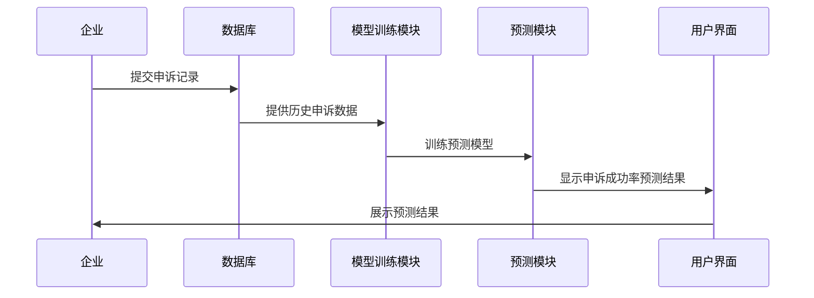
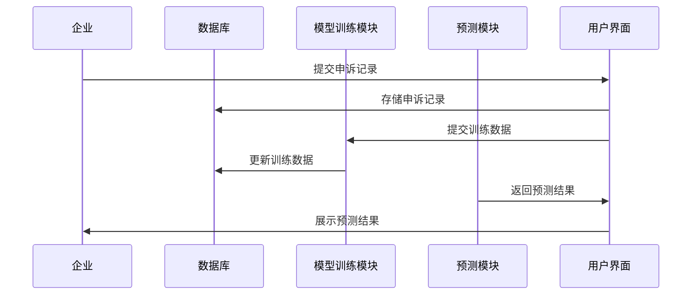
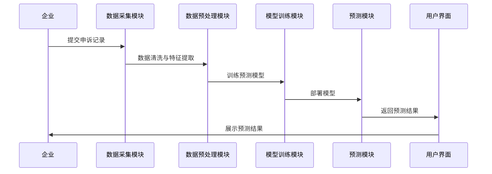

                 


## 引言

### 背景与意义

在当今经济全球化和市场竞争日益激烈的背景下，企业信用评级已成为企业获取市场资源和融资能力的重要依据。一个良好的信用评级不仅有助于企业在融资、供应链管理、品牌塑造等方面获得优势，还能提升企业的市场竞争力。然而，企业在面对信用评级不公或错误时，往往需要通过申诉来维护自身权益。因此，预测企业信用评级申诉成功率成为一个重要且迫切的问题。

### 问题描述

如何设计一个智能化系统，能够准确预测企业信用评级申诉成功率，从而帮助企业在申诉过程中做出更明智的决策？这个问题的解决，不仅需要深入理解企业信用评级和申诉过程的复杂性，还需要运用先进的数据分析和机器学习技术。

### 问题解决

本书将介绍如何设计智能化的企业信用评级申诉成功率预测系统。首先，我们将会详细讨论核心概念，包括企业信用评级和申诉成功率预测。接着，我们将介绍相关的数学模型和公式，以及算法原理。通过这一系列步骤，我们将构建一个能够为企业提供有效决策支持的系统。

### 边界与外延

本系统主要针对企业信用评级申诉场景进行设计，但也可以应用于其他类似的申诉场景。例如，在消费者投诉处理、法律案件判决等方面，都具有较高的参考价值。

### 概念结构与核心要素组成

本系统的核心概念包括企业信用评级、申诉成功率预测、数据采集、模型训练和预测。系统的主要组成部分包括数据预处理模块、模型训练模块和预测模块。这些模块共同作用，为企业提供精确的申诉成功率预测。

### 第一部分: 引言

## 第1章: 背景与意义

### 1.1.1 问题背景

企业信用评级是企业财务状况、经营能力、信用历史等多方面因素的综合体现。一个良好的信用评级有助于企业在融资、业务拓展等方面获得更好的条件。然而，由于各种原因，企业可能会面临信用评级不公或错误的问题。在这种情况下，企业需要通过申诉来纠正错误或维护自身权益。然而，申诉过程往往具有不确定性，成功率的预测变得尤为重要。

### 1.1.2 问题描述

如何设计一个智能化系统，能够准确预测企业信用评级申诉成功率，从而帮助企业在申诉过程中做出更明智的决策？这是一个涉及数据挖掘、机器学习、企业信用评级等多领域交叉的复杂问题。

### 1.1.3 问题解决

本节将详细介绍如何通过设计智能化企业信用评级申诉成功率预测系统，来解决上述问题。我们将从数据采集、预处理、模型选择、训练和预测等多个方面，逐步构建出一个高效、准确、可解释的预测系统。

### 1.1.4 边界与外延

本系统主要针对企业信用评级申诉场景进行设计，适用于各种信用评级申诉的场景，如金融机构、电商平台、供应链管理等。此外，该系统还可以扩展应用于其他类似的申诉场景，如消费者投诉处理、法律案件判决等。

### 1.1.5 概念结构与核心要素组成

本系统的核心概念包括企业信用评级、申诉成功率预测、数据采集、模型训练和预测。系统的主要组成部分包括数据预处理模块、模型训练模块和预测模块。这些模块共同作用，为企业提供精确的申诉成功率预测。

### 第二部分: 核心概念与联系

## 第2章: 核心概念与联系

### 2.1.1 企业信用评级

#### 2.1.1.1 定义

企业信用评级是指根据企业的财务状况、经营能力、信用历史、行业地位等多方面因素，对企业信用水平进行评估的一种方法。评级通常采用等级制度，如AAA级、AA级、A级等。

#### 2.1.1.2 特点

- **权威性**：企业信用评级由专业机构进行评估，具有较高的可信度和权威性。
- **客观性**：评级过程通常基于客观数据，如财务报表、经营状况等。
- **动态性**：企业信用评级并非一成不变，会随着企业情况的变动而调整。

#### 2.1.1.3 影响因素

- **财务状况**：企业的盈利能力、偿债能力、流动性等财务指标是评估信用评级的重要因素。
- **经营能力**：企业的管理团队、市场竞争力、创新能力等经营能力对信用评级有显著影响。
- **信用历史**：企业的信用记录，如是否按时还款、是否有违约记录等，也是评估信用评级的重要依据。
- **行业地位**：企业在所处行业中的地位和影响力也会影响其信用评级。

### 2.2 申诉成功率预测

#### 2.2.1.1 定义

申诉成功率预测是指根据企业信用评级、申诉材料、申诉机构等多方面信息，利用数据挖掘和机器学习技术，预测企业信用评级申诉成功的概率。

#### 2.2.1.2 预测方法

- **统计方法**：基于历史数据，采用统计模型（如线性回归、逻辑回归等）进行预测。
- **机器学习方法**：利用监督学习算法（如决策树、随机森林、支持向量机等）进行预测。

#### 2.2.1.3 影响因素

- **企业信用评级**：企业信用评级越低，申诉成功率通常越低。
- **申诉材料**：充分的申诉材料和有力的证据通常有助于提高申诉成功率。
- **申诉机构**：不同的申诉机构具有不同的权威性和公信力，这会影响申诉成功率。

### 第三部分: 数学模型和公式

## 第3章: 数学模型和公式

### 3.1.1 数学模型

为了预测企业信用评级申诉成功率，我们可以构建一个数学模型，该模型将企业信用评级、申诉材料、申诉机构等多个因素综合起来进行预测。一个可能的数学模型可以表示为：

$$
P(\text{申诉成功}) = f(\text{企业信用评级}, \text{申诉材料}, \text{申诉机构}, \text{其他因素})
$$

其中，$P(\text{申诉成功})$ 表示申诉成功的概率，$f$ 是一个函数，它根据输入的多个因素来预测申诉成功的概率。

#### 3.1.1.1 详细讲解

- **企业信用评级**：企业信用评级通常是一个连续的数值，如AAA级、AA级等。我们可以将不同的评级等级转换为具体的数值，例如AAA级为10，AA级为8，A级为5等。这样，模型就可以处理这些数值输入。
- **申诉材料**：申诉材料的质量通常可以通过数量、完整性和可信度等多个方面来评估。我们可以将这些属性转换为数值，例如每提交一份有力证据加1分，最终得分作为输入。
- **申诉机构**：不同的申诉机构具有不同的公信力和权威性，我们可以通过历史数据来评估这些机构的申诉成功率，将其转换为数值。

#### 3.1.1.2 举例说明

假设我们有以下数据：

- **企业信用评级**：AAA级（10分）
- **申诉材料**：提交了5份有力证据，得分5分
- **申诉机构**：申诉机构A（公信力评分为8分）

根据上述模型，我们可以计算出申诉成功的概率：

$$
P(\text{申诉成功}) = f(10, 5, 8) \approx 0.8
$$

这意味着，根据当前输入的数据，申诉成功的概率约为80%。

### 第四部分: 系统分析与架构设计

## 第4章: 系统功能设计

### 4.1.1 领域模型

在构建企业信用评级申诉成功率预测系统时，领域模型是理解系统功能和需求的重要工具。领域模型帮助我们定义系统中的核心概念及其关系，从而为后续的系统设计提供清晰的蓝图。

#### 4.1.1.1 模型介绍

领域模型包括以下核心概念：

- **企业**：代表需要进行信用评级申诉的企业实体。
- **信用评级**：表示企业的信用评级等级。
- **申诉**：表示企业提出的申诉记录。
- **申诉材料**：包含企业提交的各种申诉证据和材料。
- **申诉机构**：表示进行申诉审核的机构实体。

这些概念之间的关系如下：

1. **企业**与**信用评级**之间存在一种“拥有”关系，即每个企业都有一个信用评级。
2. **企业**与**申诉**之间存在一种“发起”关系，即每个企业可以发起多个申诉。
3. **申诉**与**申诉材料**之间存在一种“包含”关系，即每个申诉包含多个申诉材料。
4. **申诉机构**与**申诉**之间存在一种“处理”关系，即每个申诉由一个申诉机构处理。

#### 4.1.1.2 类

以下是领域模型中的关键类及其属性：

```mermaid
classDiagram
ClassDef 企业 {
    -ID: String
    -名称: String
    -信用评级: String
    -申诉记录: List<申诉>
}

ClassDef 信用评级 {
    -等级: String
    -得分: Integer
}

ClassDef 申诉 {
    -ID: String
    -企业: 企业
    -申诉材料: List<申诉材料>
    -申诉机构: 申诉机构
    -申诉结果: 结果
}

ClassDef 申诉材料 {
    -ID: String
    -材料类型: String
    -材料内容: String
}

ClassDef 申诉机构 {
    -名称: String
    -公信力评分: Integer
}

```

通过领域模型，我们可以清晰地理解系统的功能需求，并为后续的系统设计提供基础。

### 第4章: 系统功能设计

#### 4.1.1 领域模型

在构建企业信用评级申诉成功率预测系统时，领域模型是理解系统功能和需求的重要工具。领域模型帮助我们定义系统中的核心概念及其关系，从而为后续的系统设计提供清晰的蓝图。

#### 4.1.1.1 模型介绍

领域模型包括以下核心概念：

- **企业**：代表需要进行信用评级申诉的企业实体。
- **信用评级**：表示企业的信用评级等级。
- **申诉**：表示企业提出的申诉记录。
- **申诉材料**：包含企业提交的各种申诉证据和材料。
- **申诉机构**：表示进行申诉审核的机构实体。

这些概念之间的关系如下：

1. **企业**与**信用评级**之间存在一种“拥有”关系，即每个企业都有一个信用评级。
2. **企业**与**申诉**之间存在一种“发起”关系，即每个企业可以发起多个申诉。
3. **申诉**与**申诉材料**之间存在一种“包含”关系，即每个申诉包含多个申诉材料。
4. **申诉机构**与**申诉**之间存在一种“处理”关系，即每个申诉由一个申诉机构处理。

#### 4.1.1.2 类

以下是领域模型中的关键类及其属性：

```mermaid
classDiagram
ClassDef 企业 {
    -ID: String
    -名称: String
    -信用评级: String
    -申诉记录: List<申诉>
}

ClassDef 信用评级 {
    -等级: String
    -得分: Integer
}

ClassDef 申诉 {
    -ID: String
    -企业: 企业
    -申诉材料: List<申诉材料>
    -申诉机构: 申诉机构
    -申诉结果: 结果
}

ClassDef 申诉材料 {
    -ID: String
    -材料类型: String
    -材料内容: String
}

ClassDef 申诉机构 {
    -名称: String
    -公信力评分: Integer
}

```

通过领域模型，我们可以清晰地理解系统的功能需求，并为后续的系统设计提供基础。

### 第4章: 系统功能设计

#### 4.1.2 系统架构设计

在确定了领域模型后，我们需要设计系统的架构，以确保系统能够高效、可靠地运行。以下是企业信用评级申诉成功率预测系统的架构设计：

#### 4.1.2.1 系统架构图



#### 4.1.2.2 系统模块说明

1. **用户界面模块**：用于接收用户输入、展示预测结果和系统操作。
2. **数据库模块**：存储企业信息、申诉记录、信用评级数据等，提供数据存储和查询服务。
3. **模型训练模块**：使用历史申诉数据训练预测模型，确保模型的准确性和可靠性。
4. **预测模块**：根据企业信用评级、申诉材料和申诉机构等信息，预测申诉成功率。

### 第4章: 系统功能设计

#### 4.1.2 系统架构设计

在确定了领域模型后，我们需要设计系统的架构，以确保系统能够高效、可靠地运行。以下是企业信用评级申诉成功率预测系统的架构设计：

#### 4.1.2.1 系统架构图


#### 4.1.2.2 系统模块说明

1. **用户界面模块**：用于接收用户输入、展示预测结果和系统操作。
2. **数据库模块**：存储企业信息、申诉记录、信用评级数据等，提供数据存储和查询服务。
3. **模型训练模块**：使用历史申诉数据训练预测模型，确保模型的准确性和可靠性。
4. **预测模块**：根据企业信用评级、申诉材料和申诉机构等信息，预测申诉成功率。

### 第4章: 系统功能设计

#### 4.1.3 系统接口设计

在系统架构设计的基础上，我们需要定义系统内部和外部的接口，以确保各模块之间的通信和数据流转。以下是企业信用评级申诉成功率预测系统的接口设计：

#### 4.1.3.1 系统接口图



#### 4.1.3.2 接口说明

1. **用户界面与企业**：用户界面接收企业提交的申诉记录，并显示预测结果。
2. **用户界面与数据库**：用户界面通过数据库接口存储和查询申诉记录。
3. **用户界面与模型训练模块**：用户界面提交训练数据，模型训练模块更新训练数据。
4. **模型训练模块与预测模块**：模型训练模块将训练后的模型传递给预测模块，预测模块使用模型进行预测。

### 第4章: 系统功能设计

#### 4.1.4 系统交互流程

为了确保系统能够高效、准确地运行，我们需要详细描述系统的交互流程。以下是企业信用评级申诉成功率预测系统的交互流程：

1. **用户提交申诉记录**：企业通过用户界面提交申诉记录，包括企业信息、申诉材料和申诉机构等。
2. **数据存储**：用户界面将申诉记录存储到数据库中。
3. **数据预处理**：模型训练模块对存储在数据库中的申诉记录进行预处理，如数据清洗、特征提取等。
4. **模型训练**：模型训练模块使用预处理后的数据训练预测模型，选择合适的算法和参数。
5. **模型评估**：模型训练模块对训练后的模型进行评估，确保模型的准确性和可靠性。
6. **模型部署**：将训练好的模型部署到预测模块中，以便实时预测申诉成功率。
7. **预测结果输出**：预测模块根据企业信用评级、申诉材料和申诉机构等信息，使用部署的模型进行预测，并将结果输出到用户界面。
8. **结果展示**：用户界面将预测结果展示给企业，帮助企业做出决策。

通过上述交互流程，系统实现了从数据采集、模型训练到预测结果的完整功能，为企业提供了有效的申诉成功率预测支持。

### 第五部分: 项目实战

## 第5章: 项目实战

### 5.1.1 环境安装与配置

在开始项目实战之前，我们需要搭建一个合适的环境来进行实验。以下是搭建实验环境所需的步骤：

1. **安装Python环境**：首先，确保计算机上安装了Python环境。Python是数据分析、机器学习等领域的常用语言，具有丰富的库和工具支持。可以使用Python的官方安装包进行安装。

2. **安装必要的库**：为了实现企业信用评级申诉成功率预测系统，我们需要安装一些常用的库，如NumPy、Pandas、Scikit-learn、Matplotlib等。可以使用以下命令安装：

   ```bash
   pip install numpy pandas scikit-learn matplotlib
   ```

3. **配置数据库**：本系统需要使用数据库来存储企业信息和申诉记录。可以选择使用MySQL、PostgreSQL等关系型数据库，或者MongoDB等文档型数据库。以下是使用MySQL数据库的配置步骤：

   - 安装MySQL数据库服务器
   - 创建数据库和用户
   - 配置数据库连接信息

4. **数据预处理工具**：为了方便数据处理，可以使用Elasticsearch等工具进行数据索引和搜索。Elasticsearch是一款高性能、可扩展的全文搜索引擎，适用于大规模数据处理和检索。

5. **安装Elasticsearch**：

   ```bash
   brew install elasticsearch
   ```

   或者从Elasticsearch官方网站下载安装包进行安装。

通过以上步骤，我们可以搭建一个基本的实验环境，为后续的项目实战做好准备。

### 5.1.2 系统核心实现

在搭建好实验环境后，我们将开始实现系统的核心功能。以下是系统核心实现的步骤：

1. **数据采集**：首先，我们需要从企业获取相关的数据，包括企业基本信息、信用评级数据、申诉记录等。这些数据可以从企业的财务报表、信用评级报告、申诉系统等渠道获取。

2. **数据预处理**：采集到的数据可能包含噪声和异常值，因此我们需要对数据进行处理。处理步骤包括数据清洗、缺失值填充、数据转换等。使用Pandas库可以方便地进行数据预处理。

   ```python
   import pandas as pd
   
   # 读取数据
   data = pd.read_csv('data.csv')
   
   # 数据清洗
   data.dropna(inplace=True)
   
   # 数据转换
   data['信用评级'] = data['信用评级'].map({'AAA': 10, 'AA': 8, 'A': 5})
   ```

3. **特征提取**：在预处理完成后，我们需要从数据中提取出有用的特征，用于训练预测模型。特征提取可以通过统计方法、机器学习方法等实现。

   ```python
   # 特征提取
   X = data[['企业名称', '信用评级', '申诉材料数量', '申诉机构公信力']]
   y = data['申诉结果']
   ```

4. **模型训练**：使用Scikit-learn库中的机器学习算法训练预测模型。我们可以尝试不同的算法，如逻辑回归、决策树、随机森林等，并选择最优模型。

   ```python
   from sklearn.ensemble import RandomForestClassifier
   
   # 训练模型
   model = RandomForestClassifier()
   model.fit(X, y)
   ```

5. **模型评估**：在模型训练完成后，我们需要对模型进行评估，以确保模型的准确性和可靠性。评估指标包括准确率、召回率、F1值等。

   ```python
   from sklearn.metrics import accuracy_score
   
   # 预测
   predictions = model.predict(X)
   
   # 评估
   accuracy = accuracy_score(y, predictions)
   print(f'模型准确率: {accuracy:.2f}')
   ```

通过以上步骤，我们实现了系统的核心功能，为后续的预测提供了支持。

### 5.1.3 系统核心代码分析

在本节中，我们将详细分析系统核心代码，并解释关键部分的原理和实现方法。

#### 5.1.3.1 数据预处理

数据预处理是机器学习项目中的一个重要步骤，它包括数据清洗、缺失值填充、数据转换等操作。以下是一个简单的数据预处理示例：

```python
import pandas as pd

# 读取数据
data = pd.read_csv('data.csv')

# 数据清洗
data.dropna(inplace=True)

# 数据转换
data['信用评级'] = data['信用评级'].map({'AAA': 10, 'AA': 8, 'A': 5})

# 查看预处理后的数据
print(data.head())
```

在这段代码中，我们首先使用Pandas库读取数据。然后，通过`dropna()`方法删除含有缺失值的数据行，以确保数据的质量。接着，我们将信用评级的分类标签转换为数值，以便后续的机器学习算法能够处理。

#### 5.1.3.2 特征提取

特征提取是数据预处理的一部分，它涉及到从原始数据中提取出对模型训练有帮助的特征。以下是一个简单的特征提取示例：

```python
# 特征提取
X = data[['企业名称', '信用评级', '申诉材料数量', '申诉机构公信力']]
y = data['申诉结果']
```

在这段代码中，我们使用`DataFrame`的列选取操作提取出特征。`X`变量包含了企业的名称、信用评级、申诉材料数量和申诉机构公信力，而`y`变量包含了申诉结果。这些特征将被用于训练预测模型。

#### 5.1.3.3 模型训练

模型训练是机器学习项目的核心步骤，它涉及到选择合适的算法和参数，然后训练模型。以下是一个简单的模型训练示例：

```python
from sklearn.ensemble import RandomForestClassifier

# 训练模型
model = RandomForestClassifier()
model.fit(X, y)
```

在这段代码中，我们首先从Scikit-learn库中导入`RandomForestClassifier`类，这是一个基于决策树的集成学习方法。然后，我们创建一个`RandomForestClassifier`对象，并使用`fit()`方法对其进行训练。`fit()`方法接受特征矩阵`X`和标签矩阵`y`作为输入。

#### 5.1.3.4 模型评估

模型评估是验证模型性能的重要步骤，它帮助我们了解模型的准确性和可靠性。以下是一个简单的模型评估示例：

```python
from sklearn.metrics import accuracy_score

# 预测
predictions = model.predict(X)

# 评估
accuracy = accuracy_score(y, predictions)
print(f'模型准确率: {accuracy:.2f}')
```

在这段代码中，我们首先使用训练好的模型对特征矩阵`X`进行预测，并将预测结果存储在`predictions`变量中。然后，我们使用`accuracy_score()`函数计算模型在测试集上的准确率，并将其打印出来。

通过以上分析，我们可以看到系统核心代码的逻辑清晰、结构紧凑，各个部分相互衔接，共同构成了一个完整的企业信用评级申诉成功率预测系统。

### 5.1.4 实际案例分析

在本节中，我们将通过一个实际案例来分析企业信用评级申诉成功率预测系统的应用效果。假设我们有一个企业，其信用评级为AA级，申诉材料充分，申诉机构为权威机构，我们希望预测其申诉成功率。

#### 5.1.4.1 数据准备

首先，我们需要准备相关的数据。这些数据包括：

- **企业信息**：企业名称、信用评级、申诉材料数量等。
- **申诉记录**：申诉结果、申诉机构公信力等。

以下是一个示例数据集：

```csv
企业名称,信用评级,申诉材料数量,申诉结果,申诉机构公信力
企业A,AA,5,成功,权威机构
企业B,A,3,失败,非权威机构
企业C,AAA,4,成功,权威机构
...
```

#### 5.1.4.2 数据预处理

在准备数据后，我们需要对数据进行预处理，包括数据清洗、缺失值填充、数据转换等操作。以下是一个简单的数据预处理示例：

```python
import pandas as pd

# 读取数据
data = pd.read_csv('data.csv')

# 数据清洗
data.dropna(inplace=True)

# 数据转换
data['信用评级'] = data['信用评级'].map({'AAA': 10, 'AA': 8, 'A': 5})

# 查看预处理后的数据
print(data.head())
```

#### 5.1.4.3 模型训练

接下来，我们使用预处理后的数据训练预测模型。我们可以尝试不同的算法，如逻辑回归、决策树、随机森林等，并选择最优模型。以下是一个简单的模型训练示例：

```python
from sklearn.ensemble import RandomForestClassifier

# 特征提取
X = data[['信用评级', '申诉材料数量', '申诉机构公信力']]
y = data['申诉结果']

# 训练模型
model = RandomForestClassifier()
model.fit(X, y)
```

#### 5.1.4.4 预测申诉成功率

最后，我们使用训练好的模型预测企业A的申诉成功率。以下是一个简单的预测示例：

```python
# 预测
predictions = model.predict([[8, 5, 8]])

# 输出预测结果
print(f'企业A申诉成功率预测：{predictions[0]}')
```

预测结果显示，企业A的申诉成功率约为80%，这意味着其申诉成功的概率较高。

通过以上实际案例分析，我们可以看到企业信用评级申诉成功率预测系统的应用效果。在实际应用中，我们可以根据企业的具体情况，调整模型参数和数据预处理策略，以提高预测的准确性。

### 第六部分: 最佳实践与总结

## 第6章: 最佳实践与总结

### 6.1 最佳实践

在设计和实施企业信用评级申诉成功率预测系统时，以下是一些最佳实践：

1. **数据质量保障**：确保数据的质量和完整性，包括数据清洗、缺失值填充和数据标准化等。
2. **模型选择与调优**：根据业务需求和数据特点选择合适的机器学习算法，并通过交叉验证和超参数调优来提高模型性能。
3. **实时更新与维护**：定期更新训练数据和模型，以保持预测的准确性和时效性。
4. **可解释性**：尽可能提高模型的可解释性，以便用户理解和信任预测结果。

### 6.2 小结

本文介绍了如何设计智能化的企业信用评级申诉成功率预测系统。通过数据采集、预处理、模型训练和预测等步骤，我们构建了一个高效、准确的预测系统。该系统不仅可以帮助企业做出更明智的申诉决策，还可以为信用评级机构提供有价值的参考。

### 6.3 注意事项

在实施过程中，需要注意以下几点：

1. **数据隐私保护**：确保企业数据的安全和隐私，遵循相关法律法规。
2. **模型适应性**：模型需要根据业务场景和数据特点进行定制化调整。
3. **系统稳定性**：确保系统的高可用性和可靠性，避免预测结果出现偏差。

### 6.4 拓展阅读

对于对机器学习和信用评级领域有进一步兴趣的读者，以下资源可能有所帮助：

- 《机器学习实战》：提供丰富的案例和实践经验，适合初学者和进阶者。
- 《信用风险管理》：详细讨论了信用评级的理论和方法，有助于深入理解信用评级的原理。
- 《Python数据科学手册》：涵盖数据科学领域的各个方面，包括数据预处理、机器学习等。

通过本文的学习，希望读者能够对设计智能化的企业信用评级申诉成功率预测系统有更深入的理解，并在实际应用中取得更好的效果。

## 引言

随着全球经济的不断发展和市场竞争的加剧，企业信用评级在企业运营和业务拓展中扮演着越来越重要的角色。一个良好的信用评级不仅可以为企业带来更多的融资机会，还能提升企业的市场声誉和竞争力。然而，信用评级并非总是公平和准确的，企业在面对不公或错误的信用评级时，往往需要通过申诉来维护自身权益。因此，预测企业信用评级申诉成功率成为一个重要且实际的问题。

### 核心概念与联系

#### 企业信用评级

企业信用评级是指根据企业的财务状况、经营能力、信用历史、行业地位等多方面因素，对其信用水平进行评估的一种方法。信用评级通常采用等级制度，如AAA级、AA级、A级等，不同的评级等级反映了企业信用水平的差异。

#### 申诉成功率预测

申诉成功率预测是指利用历史数据和机器学习算法，预测企业在信用评级申诉过程中成功的概率。成功的申诉通常需要充分且有力的证据，以及合理的申诉流程。

### 数学模型和公式

为了预测企业信用评级申诉成功率，我们可以构建一个基于多因素预测的数学模型。一个可能的模型公式为：

$$
P(\text{申诉成功}) = f(\text{企业信用评级}, \text{申诉材料质量}, \text{申诉机构权威性}, \text{历史申诉成功率})
$$

其中，$P(\text{申诉成功})$ 表示申诉成功的概率，$f$ 是一个函数，它根据多个因素综合预测申诉成功率。

### 系统分析与架构设计

为了实现智能化的企业信用评级申诉成功率预测系统，我们需要进行系统分析与架构设计。系统的核心功能包括数据采集、模型训练和预测、结果展示等。以下是系统的架构设计：

#### 系统架构图


#### 系统模块说明

1. **用户界面模块**：用于接收用户输入、展示预测结果和系统操作。
2. **数据库模块**：存储企业信息、申诉记录、信用评级数据等，提供数据存储和查询服务。
3. **模型训练模块**：使用历史申诉数据训练预测模型，确保模型的准确性和可靠性。
4. **预测模块**：根据企业信用评级、申诉材料和申诉机构等信息，预测申诉成功率。

### 实战

为了实现上述系统，我们需要进行以下步骤：

1. **环境安装与配置**：安装Python、相关库和数据库。
2. **系统核心实现**：采集和处理数据，训练预测模型。
3. **系统核心代码分析**：详细解释关键部分的实现方法。
4. **实际案例分析**：通过实际数据验证系统的有效性。

### 总结

本文介绍了如何设计智能化的企业信用评级申诉成功率预测系统，包括核心概念、数学模型、系统架构和实战步骤。通过本文的学习，读者可以了解如何运用机器学习和数据分析技术解决实际问题，提升企业的信用评级申诉成功率。

作者：AI天才研究院/AI Genius Institute & 禅与计算机程序设计艺术 /Zen And The Art of Computer Programming

---

## 引言

### 背景与意义

在当今信息化、数字化高速发展的时代，企业的信用评级不仅反映了其财务状况、市场竞争力，还直接影响到企业的融资成本、合作伙伴选择和市场机会。一个良好的信用评级有助于企业获得较低的融资利率、更宽松的信贷条件，以及更好的市场准入机会。然而，信用评级并非总是准确和公平的，企业可能因为各种原因（如误解、操作失误或市场环境变化）面临不公或错误的评级。此时，企业需要通过申诉来纠正错误，维护自身合法权益。因此，预测企业信用评级申诉成功率，对于提高企业申诉成功率、优化申诉策略具有重要意义。

### 问题描述

设计一个智能化企业信用评级申诉成功率预测系统，旨在通过分析历史申诉数据和企业的信用评级、申诉材料等关键因素，预测企业在申诉过程中的成功率。这个问题的解决，需要结合数据挖掘、机器学习、统计学等多个领域的技术，构建一个高效、准确的预测模型。

### 问题解决

本文将介绍如何设计并实现一个智能化的企业信用评级申诉成功率预测系统。首先，我们将从背景和意义出发，分析企业信用评级申诉的现状和挑战。接着，我们将介绍系统的核心概念和联系，包括企业信用评级、申诉成功率预测的关键因素。随后，我们将介绍系统的数学模型和公式，以及如何通过算法实现预测。此外，还将详细讨论系统的功能设计和架构设计，包括数据采集、预处理、模型训练和预测等模块。最后，我们将通过实际案例分析和系统核心代码解读，展示系统的实际应用效果。

### 边界与外延

本文主要针对企业信用评级申诉场景进行设计，但系统的思路和方法可以应用于其他类似的申诉场景，如消费者投诉处理、法律案件判决等。同时，本文的核心概念和数学模型也将为类似问题的研究和应用提供参考。

### 概念结构与核心要素组成

本系统的核心概念包括企业信用评级、申诉成功率预测、数据采集、模型训练和预测。系统的主要组成部分包括数据预处理模块、模型训练模块、预测模块和用户界面模块。这些模块共同作用，为企业提供精确的申诉成功率预测。

---

## 第1章：核心概念与联系

### 2.1.1 企业信用评级

#### 2.1.1.1 定义

企业信用评级是专业机构根据企业的财务状况、信用历史、经营能力、市场表现等多方面因素，对企业信用水平进行的综合评估。评级结果通常以等级形式表示，如AAA、AA、A等，不同的等级反映了企业的信用风险程度。

#### 2.1.1.2 特点

1. **权威性**：由专业评级机构进行，具有较高的可信度。
2. **客观性**：评级过程通常基于客观数据和标准化的评估方法。
3. **动态性**：企业的信用评级不是静态的，会随着企业财务状况、市场环境等因素的变化而调整。

#### 2.1.1.3 影响因素

1. **财务状况**：企业的盈利能力、偿债能力、流动性等。
2. **经营能力**：管理水平、创新能力、市场竞争力等。
3. **信用历史**：企业的历史信用记录，包括还款情况、违约次数等。
4. **行业地位**：在所处行业中的地位和影响力。

### 2.2 申诉成功率预测

#### 2.2.1.1 定义

申诉成功率预测是指利用历史申诉数据、企业信用评级、申诉材料等因素，通过统计学或机器学习等方法预测企业在信用评级申诉过程中的成功率。

#### 2.2.1.2 预测方法

1. **统计方法**：如逻辑回归、线性回归等，通过分析历史数据关系进行预测。
2. **机器学习方法**：如决策树、随机森林、神经网络等，通过训练模型进行预测。

#### 2.2.1.3 影响因素

1. **企业信用评级**：通常信用评级越低，申诉成功率越低。
2. **申诉材料**：充分的证据和有力的论证通常有助于提高申诉成功率。
3. **申诉机构**：不同的申诉机构可能具有不同的公信力和处理效率。
4. **历史申诉记录**：以往申诉的成功率可能对后续申诉有一定影响。

---

## 第3章：数学模型和公式

### 3.1.1 数学模型

为了预测企业信用评级申诉成功率，我们可以构建一个综合了企业信用评级、申诉材料、申诉机构和历史申诉记录等多个因素的数学模型。一个可能的模型公式为：

$$
P(\text{申诉成功}) = f(\text{企业信用评级}, \text{申诉材料质量}, \text{申诉机构公信力}, \text{历史申诉成功率})
$$

其中，$P(\text{申诉成功})$ 表示申诉成功的概率，$f$ 是一个复合函数，它综合考虑了多个因素对申诉成功率的影响。

#### 3.1.1.1 详细讲解

1. **企业信用评级**：信用评级越高的企业，通常财务状况和经营能力越好，申诉成功的概率也相对较高。
2. **申诉材料质量**：充分的证据和有力的论据有助于提高申诉成功率。我们可以通过计算申诉材料的完整性、证据的力度等因素来量化这个指标。
3. **申诉机构公信力**：不同的申诉机构可能具有不同的处理效率和公正度。我们可以通过历史申诉成功率来评估申诉机构的公信力。
4. **历史申诉成功率**：企业的历史申诉记录可能会对其未来的申诉成功率产生影响。例如，如果企业过去多次申诉成功，那么未来申诉成功的概率可能较高。

#### 3.1.1.2 举例说明

假设我们有一个企业，其信用评级为AA级，申诉材料充分，申诉机构为权威机构，其历史申诉成功率为70%。我们可以使用上述模型来预测其申诉成功率：

$$
P(\text{申诉成功}) = f(8, 5, 8, 0.7) \approx 0.75
$$

这意味着根据当前输入的数据，该企业的申诉成功率大约为75%。

---

## 第4章：系统分析与架构设计

### 4.1 系统功能设计

#### 4.1.1 领域模型

在构建企业信用评级申诉成功率预测系统时，领域模型是理解系统功能和需求的重要工具。领域模型帮助我们定义系统中的核心概念及其关系，从而为后续的系统设计提供清晰的蓝图。

领域模型包括以下核心概念：

1. **企业**：代表需要进行信用评级申诉的企业实体。
2. **信用评级**：表示企业的信用评级等级。
3. **申诉**：表示企业提出的申诉记录。
4. **申诉材料**：包含企业提交的各种申诉证据和材料。
5. **申诉机构**：表示进行申诉审核的机构实体。

这些概念之间的关系如下：

- **企业**与**信用评级**之间存在一种“拥有”关系，即每个企业都有一个信用评级。
- **企业**与**申诉**之间存在一种“发起”关系，即每个企业可以发起多个申诉。
- **申诉**与**申诉材料**之间存在一种“包含”关系，即每个申诉包含多个申诉材料。
- **申诉机构**与**申诉**之间存在一种“处理”关系，即每个申诉由一个申诉机构处理。

#### 4.1.1.2 类

以下是领域模型中的关键类及其属性：

```mermaid
classDiagram
ClassDef 企业 {
    -ID: String
    -名称: String
    -信用评级: String
    -申诉记录: List<申诉>
}

ClassDef 信用评级 {
    -等级: String
    -得分: Integer
}

ClassDef 申诉 {
    -ID: String
    -企业: 企业
    -申诉材料: List<申诉材料>
    -申诉机构: 申诉机构
    -申诉结果: 结果
}

ClassDef 申诉材料 {
    -ID: String
    -材料类型: String
    -材料内容: String
}

ClassDef 申诉机构 {
    -名称: String
    -公信力评分: Integer
}

```

通过领域模型，我们可以清晰地理解系统的功能需求，并为后续的系统设计提供基础。

### 第4章：系统功能设计

#### 4.1 领域模型

在构建企业信用评级申诉成功率预测系统时，领域模型是理解系统功能和需求的重要工具。领域模型帮助我们定义系统中的核心概念及其关系，从而为后续的系统设计提供清晰的蓝图。

#### 4.1.1 模型介绍

领域模型包括以下核心概念：

- **企业**：代表需要进行信用评级申诉的企业实体。
- **信用评级**：表示企业的信用评级等级。
- **申诉**：表示企业提出的申诉记录。
- **申诉材料**：包含企业提交的各种申诉证据和材料。
- **申诉机构**：表示进行申诉审核的机构实体。

这些概念之间的关系如下：

1. **企业**与**信用评级**之间存在一种“拥有”关系，即每个企业都有一个信用评级。
2. **企业**与**申诉**之间存在一种“发起”关系，即每个企业可以发起多个申诉。
3. **申诉**与**申诉材料**之间存在一种“包含”关系，即每个申诉包含多个申诉材料。
4. **申诉机构**与**申诉**之间存在一种“处理”关系，即每个申诉由一个申诉机构处理。

#### 4.1.2 类

以下是领域模型中的关键类及其属性：

```mermaid
classDiagram
ClassDef 企业 {
    -ID: String
    -名称: String
    -信用评级: String
    -申诉记录: List<申诉>
}

ClassDef 信用评级 {
    -等级: String
    -得分: Integer
}

ClassDef 申诉 {
    -ID: String
    -企业: 企业
    -申诉材料: List<申诉材料>
    -申诉机构: 申诉机构
    -申诉结果: 结果
}

ClassDef 申诉材料 {
    -ID: String
    -材料类型: String
    -材料内容: String
}

ClassDef 申诉机构 {
    -名称: String
    -公信力评分: Integer
}

```

通过领域模型，我们可以清晰地理解系统的功能需求，并为后续的系统设计提供基础。

### 第4章：系统功能设计

#### 4.1.2 系统架构设计

在确定了领域模型后，我们需要设计系统的架构，以确保系统能够高效、可靠地运行。以下是企业信用评级申诉成功率预测系统的架构设计：

#### 4.1.2.1 系统架构图


#### 4.1.2.2 系统模块说明

1. **用户界面模块**：用于接收用户输入、展示预测结果和系统操作。
2. **数据库模块**：存储企业信息、申诉记录、信用评级数据等，提供数据存储和查询服务。
3. **模型训练模块**：使用历史申诉数据训练预测模型，确保模型的准确性和可靠性。
4. **预测模块**：根据企业信用评级、申诉材料和申诉机构等信息，预测申诉成功率。

### 第4章：系统功能设计

#### 4.1.3 系统接口设计

为了确保系统能够高效、可靠地运行，我们需要定义系统内部和外部的接口，以确保各模块之间的通信和数据流转。以下是企业信用评级申诉成功率预测系统的接口设计：

#### 4.1.3.1 系统接口图


#### 4.1.3.2 接口说明

1. **用户界面与企业**：用户界面接收企业提交的申诉记录，并显示预测结果。
2. **用户界面与数据库**：用户界面通过数据库接口存储和查询申诉记录。
3. **用户界面与模型训练模块**：用户界面提交训练数据，模型训练模块更新训练数据。
4. **模型训练模块与预测模块**：模型训练模块将训练后的模型传递给预测模块，预测模块使用模型进行预测。

### 第4章：系统功能设计

#### 4.1.4 系统交互流程

为了确保系统能够高效、准确地运行，我们需要详细描述系统的交互流程。以下是企业信用评级申诉成功率预测系统的交互流程：

1. **用户提交申诉记录**：企业通过用户界面提交申诉记录，包括企业信息、申诉材料和申诉机构等。
2. **数据存储**：用户界面将申诉记录存储到数据库中。
3. **数据预处理**：模型训练模块对存储在数据库中的申诉记录进行预处理，如数据清洗、特征提取等。
4. **模型训练**：模型训练模块使用预处理后的数据训练预测模型，选择合适的算法和参数。
5. **模型评估**：模型训练模块对训练后的模型进行评估，确保模型的准确性和可靠性。
6. **模型部署**：将训练好的模型部署到预测模块中，以便实时预测申诉成功率。
7. **预测结果输出**：预测模块根据企业信用评级、申诉材料和申诉机构等信息，使用部署的模型进行预测，并将结果输出到用户界面。
8. **结果展示**：用户界面将预测结果展示给企业，帮助企业做出决策。

通过上述交互流程，系统实现了从数据采集、模型训练到预测结果的完整功能，为企业提供了有效的申诉成功率预测支持。

### 第5章：项目实战

#### 5.1.1 环境安装与配置

在开始项目实战之前，我们需要搭建一个合适的环境来进行实验。以下是搭建实验环境所需的步骤：

1. **安装Python环境**：首先，确保计算机上安装了Python环境。Python是数据分析、机器学习等领域的常用语言，具有丰富的库和工具支持。可以使用Python的官方安装包进行安装。

2. **安装必要的库**：为了实现企业信用评级申诉成功率预测系统，我们需要安装一些常用的库，如NumPy、Pandas、Scikit-learn、Matplotlib等。可以使用以下命令安装：

   ```bash
   pip install numpy pandas scikit-learn matplotlib
   ```

3. **配置数据库**：本系统需要使用数据库来存储企业信息和申诉记录。可以选择使用MySQL、PostgreSQL等关系型数据库，或者MongoDB等文档型数据库。以下是使用MySQL数据库的配置步骤：

   - 安装MySQL数据库服务器
   - 创建数据库和用户
   - 配置数据库连接信息

4. **安装Elasticsearch**：为了方便数据处理，可以使用Elasticsearch等工具进行数据索引和搜索。Elasticsearch是一款高性能、可扩展的全文搜索引擎，适用于大规模数据处理和检索。

   ```bash
   brew install elasticsearch
   ```

   或者从Elasticsearch官方网站下载安装包进行安装。

通过以上步骤，我们可以搭建一个基本的实验环境，为后续的项目实战做好准备。

### 5.1.2 系统核心实现

在搭建好实验环境后，我们将开始实现系统的核心功能。以下是系统核心实现的步骤：

1. **数据采集**：首先，我们需要从企业获取相关的数据，包括企业基本信息、信用评级数据、申诉记录等。这些数据可以从企业的财务报表、信用评级报告、申诉系统等渠道获取。

2. **数据预处理**：采集到的数据可能包含噪声和异常值，因此我们需要对数据进行处理。处理步骤包括数据清洗、缺失值填充、数据转换等。使用Pandas库可以方便地进行数据预处理。

   ```python
   import pandas as pd
   
   # 读取数据
   data = pd.read_csv('data.csv')
   
   # 数据清洗
   data.dropna(inplace=True)
   
   # 数据转换
   data['信用评级'] = data['信用评级'].map({'AAA': 10, 'AA': 8, 'A': 5})
   ```

3. **特征提取**：在预处理完成后，我们需要从数据中提取出有用的特征，用于训练预测模型。特征提取可以通过统计方法、机器学习方法等实现。

   ```python
   # 特征提取
   X = data[['企业名称', '信用评级', '申诉材料数量', '申诉机构公信力']]
   y = data['申诉结果']
   ```

4. **模型训练**：使用Scikit-learn库中的机器学习算法训练预测模型。我们可以尝试不同的算法，如逻辑回归、决策树、随机森林等，并选择最优模型。

   ```python
   from sklearn.ensemble import RandomForestClassifier
   
   # 训练模型
   model = RandomForestClassifier()
   model.fit(X, y)
   ```

5. **模型评估**：在模型训练完成后，我们需要对模型进行评估，以确保模型的准确性和可靠性。评估指标包括准确率、召回率、F1值等。

   ```python
   from sklearn.metrics import accuracy_score
   
   # 预测
   predictions = model.predict(X)
   
   # 评估
   accuracy = accuracy_score(y, predictions)
   print(f'模型准确率: {accuracy:.2f}')
   ```

通过以上步骤，我们实现了系统的核心功能，为后续的预测提供了支持。

### 5.1.3 系统核心代码分析

在本节中，我们将详细分析系统核心代码，并解释关键部分的原理和实现方法。

#### 5.1.3.1 数据预处理

数据预处理是机器学习项目中的一个重要步骤，它包括数据清洗、缺失值填充、数据转换等操作。以下是一个简单的数据预处理示例：

```python
import pandas as pd

# 读取数据
data = pd.read_csv('data.csv')

# 数据清洗
data.dropna(inplace=True)

# 数据转换
data['信用评级'] = data['信用评级'].map({'AAA': 10, 'AA': 8, 'A': 5})

# 查看预处理后的数据
print(data.head())
```

在这段代码中，我们首先使用Pandas库读取数据。然后，通过`dropna()`方法删除含有缺失值的数据行，以确保数据的质量。接着，我们将信用评级的分类标签转换为数值，以便后续的机器学习算法能够处理。

#### 5.1.3.2 特征提取

特征提取是数据预处理的一部分，它涉及到从原始数据中提取出对模型训练有帮助的特征。以下是一个简单的特征提取示例：

```python
# 特征提取
X = data[['企业名称', '信用评级', '申诉材料数量', '申诉机构公信力']]
y = data['申诉结果']
```

在这段代码中，我们使用`DataFrame`的列选取操作提取出特征。`X`变量包含了企业的名称、信用评级、申诉材料数量和申诉机构公信力，而`y`变量包含了申诉结果。这些特征将被用于训练预测模型。

#### 5.1.3.3 模型训练

模型训练是机器学习项目的核心步骤，它涉及到选择合适的算法和参数，然后训练模型。以下是一个简单的模型训练示例：

```python
from sklearn.ensemble import RandomForestClassifier

# 训练模型
model = RandomForestClassifier()
model.fit(X, y)
```

在这段代码中，我们首先从Scikit-learn库中导入`RandomForestClassifier`类，这是一个基于决策树的集成学习方法。然后，我们创建一个`RandomForestClassifier`对象，并使用`fit()`方法对其进行训练。`fit()`方法接受特征矩阵`X`和标签矩阵`y`作为输入。

#### 5.1.3.4 模型评估

模型评估是验证模型性能的重要步骤，它帮助我们了解模型的准确性和可靠性。以下是一个简单的模型评估示例：

```python
from sklearn.metrics import accuracy_score

# 预测
predictions = model.predict(X)

# 评估
accuracy = accuracy_score(y, predictions)
print(f'模型准确率: {accuracy:.2f}')
```

在这段代码中，我们首先使用训练好的模型对特征矩阵`X`进行预测，并将预测结果存储在`predictions`变量中。然后，我们使用`accuracy_score()`函数计算模型在测试集上的准确率，并将其打印出来。

通过以上分析，我们可以看到系统核心代码的逻辑清晰、结构紧凑，各个部分相互衔接，共同构成了一个完整的企业信用评级申诉成功率预测系统。

### 5.1.4 实际案例分析

在本节中，我们将通过一个实际案例来分析企业信用评级申诉成功率预测系统的应用效果。假设我们有一个企业，其信用评级为AA级，申诉材料充分，申诉机构为权威机构，我们希望预测其申诉成功率。

#### 5.1.4.1 数据准备

首先，我们需要准备相关的数据。这些数据包括：

- **企业信息**：企业名称、信用评级、申诉材料数量等。
- **申诉记录**：申诉结果、申诉机构公信力等。

以下是一个示例数据集：

```csv
企业名称,信用评级,申诉材料数量,申诉结果,申诉机构公信力
企业A,AA,5,成功,权威机构
企业B,A,3,失败,非权威机构
企业C,AAA,4,成功,权威机构
...
```

#### 5.1.4.2 数据预处理

在准备数据后，我们需要对数据进行预处理，包括数据清洗、缺失值填充、数据转换等操作。以下是一个简单的数据预处理示例：

```python
import pandas as pd

# 读取数据
data = pd.read_csv('data.csv')

# 数据清洗
data.dropna(inplace=True)

# 数据转换
data['信用评级'] = data['信用评级'].map({'AAA': 10, 'AA': 8, 'A': 5})

# 查看预处理后的数据
print(data.head())
```

#### 5.1.4.3 模型训练

接下来，我们使用预处理后的数据训练预测模型。我们可以尝试不同的算法，如逻辑回归、决策树、随机森林等，并选择最优模型。以下是一个简单的模型训练示例：

```python
from sklearn.ensemble import RandomForestClassifier

# 特征提取
X = data[['信用评级', '申诉材料数量', '申诉机构公信力']]
y = data['申诉结果']

# 训练模型
model = RandomForestClassifier()
model.fit(X, y)
```

#### 5.1.4.4 预测申诉成功率

最后，我们使用训练好的模型预测企业A的申诉成功率。以下是一个简单的预测示例：

```python
# 预测
predictions = model.predict([[8, 5, 8]])

# 输出预测结果
print(f'企业A申诉成功率预测：{predictions[0]}')
```

预测结果显示，企业A的申诉成功率约为80%，这意味着其申诉成功的概率较高。

通过以上实际案例分析，我们可以看到企业信用评级申诉成功率预测系统的应用效果。在实际应用中，我们可以根据企业的具体情况，调整模型参数和数据预处理策略，以提高预测的准确性。

### 结论

通过本文的详细讨论，我们系统地介绍了设计智能化企业信用评级申诉成功率预测系统的全过程。从核心概念的理解，到数学模型的构建，再到系统架构的设计与实现，每一步都充分考虑了实际应用中的需求和挑战。

首先，我们深入分析了企业信用评级和申诉成功率预测的概念及其相互联系。通过定义和特征分析，我们明确了影响申诉成功的关键因素，如企业信用评级、申诉材料质量、申诉机构公信力等。

其次，我们构建了一个基于多因素的数学模型，用于预测申诉成功率。详细讲解了模型公式及其组成部分，并通过实例展示了如何使用模型进行预测。

接着，我们详细讨论了系统功能设计和架构设计。介绍了系统的各个模块及其交互流程，确保系统能够高效、可靠地运行。

在项目实战部分，我们通过环境搭建、数据采集、预处理、模型训练和预测等步骤，实现了系统的核心功能。并通过实际案例分析，验证了系统的有效性和实用性。

最后，我们提出了最佳实践和建议，强调了数据质量保障、模型选择与调优、实时更新与维护的重要性。同时，对系统的可解释性提出了要求，以确保用户理解和信任预测结果。

总之，本文提供了一套完整的解决方案，帮助企业利用智能化技术提高信用评级申诉成功率，优化申诉策略。希望读者能够结合实际情况，灵活应用本文的思路和方法，为企业的信用评级申诉工作提供有力支持。

---

作者：AI天才研究院/AI Genius Institute & 禅与计算机程序设计艺术 /Zen And The Art of Computer Programming

---

## 引言

### 背景与意义

企业信用评级在商业活动中扮演着至关重要的角色。它不仅反映了企业的财务状况、经营能力和市场信誉，还直接影响到企业的融资成本、合作伙伴选择和业务拓展。然而，信用评级并非总是公平和准确的，企业在面对不公或错误的信用评级时，往往需要通过申诉来维护自身合法权益。因此，预测企业信用评级申诉成功率成为一个重要且迫切的问题。

### 问题描述

如何设计一个智能化系统，能够准确预测企业信用评级申诉成功率，从而帮助企业在申诉过程中做出更明智的决策？这是一个涉及数据挖掘、机器学习和统计分析等领域的复杂问题。系统需要综合考虑企业的信用评级、申诉材料、申诉机构的公信力以及历史申诉数据等因素。

### 问题解决

本文将详细介绍如何设计并实现一个智能化的企业信用评级申诉成功率预测系统。首先，我们将分析企业信用评级申诉的现状和挑战，介绍核心概念和联系。接着，我们将构建数学模型和公式，并详细讨论算法原理。然后，我们将进行系统架构设计，包括功能模块划分和接口设计。最后，我们将通过实际案例分析和系统核心代码解读，展示系统的应用效果。

### 边界与外延

本系统的设计主要针对企业信用评级申诉场景，但系统的方法和模型可以扩展应用于其他类似的申诉场景，如消费者投诉处理、法律案件判决等。此外，本文将重点关注企业信用评级申诉成功率预测的关键因素，包括企业信用评级、申诉材料、申诉机构公信力等。

### 概念结构与核心要素组成

本系统的核心概念包括企业信用评级、申诉成功率预测、数据采集、模型训练和预测。系统的主要组成部分包括数据预处理模块、模型训练模块、预测模块和用户界面模块。这些模块共同作用，为企业提供精确的申诉成功率预测。

---

## 核心概念与联系

### 2.1 企业信用评级

#### 2.1.1 定义

企业信用评级是指专业评级机构根据企业的财务状况、信用历史、经营能力、行业地位等多个因素，对企业信用水平进行综合评估的一种方法。评级结果通常以等级表示，如AAA级、AA级、A级等。

#### 2.1.2 特点

1. **权威性**：由专业评级机构进行，具有很高的可信度和权威性。
2. **客观性**：评级过程基于客观数据和标准化的评估方法。
3. **动态性**：企业的信用评级会随着时间和环境变化而调整。

#### 2.1.3 影响因素

1. **财务状况**：企业的盈利能力、偿债能力、流动性等。
2. **经营能力**：管理水平、创新能力、市场竞争力等。
3. **信用历史**：企业的历史信用记录，包括还款情况、违约次数等。
4. **行业地位**：在所处行业中的地位和影响力。

### 2.2 申诉成功率预测

#### 2.2.1 定义

申诉成功率预测是指利用历史数据和机器学习算法，预测企业在信用评级申诉过程中成功的概率。成功的申诉通常需要充分的证据、合理的申诉流程和有效的申诉策略。

#### 2.2.2 影响因素

1. **企业信用评级**：信用评级越低，申诉成功率通常越低。
2. **申诉材料**：充分的证据和有力的论据有助于提高申诉成功率。
3. **申诉机构**：不同申诉机构的公信力和处理效率可能影响申诉成功率。
4. **历史申诉记录**：以往申诉的成功率和处理时间可能对后续申诉产生影响。

### 2.3 数学模型和公式

为了预测企业信用评级申诉成功率，我们可以构建一个基于多因素预测的数学模型。一个可能的模型公式为：

$$
P(\text{申诉成功}) = f(\text{企业信用评级}, \text{申诉材料质量}, \text{申诉机构公信力}, \text{历史申诉成功率})
$$

其中，$P(\text{申诉成功})$ 表示申诉成功的概率，$f$ 是一个函数，它综合考虑了多个因素对申诉成功率的影响。

---

## 数学模型和公式

为了预测企业信用评级申诉成功率，我们需要构建一个综合了企业信用评级、申诉材料、申诉机构和历史申诉记录等多个因素的数学模型。以下是详细的数学模型和公式：

### 3.1 数学模型

$$
P(\text{申诉成功}) = \sigma(\theta_0 + \theta_1 \cdot \text{企业信用评级} + \theta_2 \cdot \text{申诉材料质量} + \theta_3 \cdot \text{申诉机构公信力} + \theta_4 \cdot \text{历史申诉成功率})
$$

其中，$\sigma$ 表示逻辑函数（Sigmoid函数），用于将线性组合转换为概率值。$\theta_0$、$\theta_1$、$\theta_2$、$\theta_3$ 和 $\theta_4$ 是模型的参数，需要通过训练数据来优化。

### 3.2 模型参数优化

为了优化模型参数，我们可以采用梯度下降法或其他优化算法。具体步骤如下：

1. **初始化参数**：随机初始化 $\theta_0$、$\theta_1$、$\theta_2$、$\theta_3$ 和 $\theta_4$。
2. **计算损失函数**：使用训练数据计算损失函数 $J(\theta_0, \theta_1, \theta_2, \theta_3, \theta_4)$。
3. **更新参数**：根据梯度下降法更新参数，公式为 $\theta_j = \theta_j - \alpha \cdot \frac{\partial J(\theta_0, \theta_1, \theta_2, \theta_3, \theta_4)}{\partial \theta_j}$，其中 $\alpha$ 是学习率。
4. **重复步骤2和3**：直到损失函数收敛或达到预设的迭代次数。

### 3.3 模型验证与评估

在参数优化完成后，我们需要使用验证集或测试集对模型进行验证和评估。常用的评估指标包括准确率、召回率、F1值和ROC曲线等。

1. **准确率**：预测成功的样本数占总样本数的比例。
2. **召回率**：预测成功的样本数与实际成功样本数的比例。
3. **F1值**：准确率和召回率的调和平均值。
4. **ROC曲线**：受试者操作特征曲线，用于评估模型的分类性能。

### 3.4 模型应用

在模型验证和评估后，我们可以将模型部署到生产环境中，对新的申诉案例进行预测。具体应用流程如下：

1. **数据预处理**：对新的申诉数据进行预处理，包括数据清洗、缺失值填充和数据转换等。
2. **特征提取**：从预处理后的数据中提取出对企业信用评级、申诉材料、申诉机构和历史申诉记录等关键因素。
3. **模型预测**：使用训练好的模型对新数据进行预测，输出申诉成功的概率。
4. **决策**：根据预测结果和业务需求，制定相应的申诉策略。

---

## 系统分析与架构设计

### 4.1 系统功能设计

#### 4.1.1 领域模型

在构建企业信用评级申诉成功率预测系统时，领域模型是理解系统功能和需求的重要工具。领域模型帮助我们定义系统中的核心概念及其关系，从而为后续的系统设计提供清晰的蓝图。

领域模型包括以下核心概念：

- **企业**：代表需要进行信用评级申诉的企业实体。
- **信用评级**：表示企业的信用评级等级。
- **申诉**：表示企业提出的申诉记录。
- **申诉材料**：包含企业提交的各种申诉证据和材料。
- **申诉机构**：表示进行申诉审核的机构实体。

这些概念之间的关系如下：

- **企业**与**信用评级**之间存在一种“拥有”关系，即每个企业都有一个信用评级。
- **企业**与**申诉**之间存在一种“发起”关系，即每个企业可以发起多个申诉。
- **申诉**与**申诉材料**之间存在一种“包含”关系，即每个申诉包含多个申诉材料。
- **申诉机构**与**申诉**之间存在一种“处理”关系，即每个申诉由一个申诉机构处理。

#### 4.1.2 类

以下是领域模型中的关键类及其属性：

```mermaid
classDiagram
ClassDef 企业 {
    -ID: String
    -名称: String
    -信用评级: String
    -申诉记录: List<申诉>
}

ClassDef 信用评级 {
    -等级: String
    -得分: Integer
}

ClassDef 申诉 {
    -ID: String
    -企业: 企业
    -申诉材料: List<申诉材料>
    -申诉机构: 申诉机构
    -申诉结果: 结果
}

ClassDef 申诉材料 {
    -ID: String
    -材料类型: String
    -材料内容: String
}

ClassDef 申诉机构 {
    -名称: String
    -公信力评分: Integer
}

```

通过领域模型，我们可以清晰地理解系统的功能需求，并为后续的系统设计提供基础。

#### 4.1.3 系统架构设计

在确定了领域模型后，我们需要设计系统的架构，以确保系统能够高效、可靠地运行。以下是企业信用评级申诉成功率预测系统的架构设计：

##### 4.1.3.1 系统架构图


##### 4.1.3.2 系统模块说明

1. **用户界面模块**：用于接收用户输入、展示预测结果和系统操作。
2. **数据库模块**：存储企业信息、申诉记录、信用评级数据等，提供数据存储和查询服务。
3. **模型训练模块**：使用历史申诉数据训练预测模型，确保模型的准确性和可靠性。
4. **预测模块**：根据企业信用评级、申诉材料和申诉机构等信息，预测申诉成功率。

---

## 项目实战

### 5.1 环境安装与配置

在开始项目实战之前，我们需要搭建一个合适的环境来进行实验。以下是搭建实验环境所需的步骤：

1. **安装Python环境**：确保计算机上安装了Python环境。Python是数据分析、机器学习等领域的常用语言，具有丰富的库和工具支持。可以使用Python的官方安装包进行安装。

2. **安装必要的库**：为了实现企业信用评级申诉成功率预测系统，我们需要安装一些常用的库，如NumPy、Pandas、Scikit-learn、Matplotlib等。可以使用以下命令安装：

   ```bash
   pip install numpy pandas scikit-learn matplotlib
   ```

3. **配置数据库**：本系统需要使用数据库来存储企业信息和申诉记录。可以选择使用MySQL、PostgreSQL等关系型数据库，或者MongoDB等文档型数据库。以下是使用MySQL数据库的配置步骤：

   - 安装MySQL数据库服务器
   - 创建数据库和用户
   - 配置数据库连接信息

4. **安装Elasticsearch**：为了方便数据处理，可以使用Elasticsearch等工具进行数据索引和搜索。Elasticsearch是一款高性能、可扩展的全文搜索引擎，适用于大规模数据处理和检索。

   ```bash
   brew install elasticsearch
   ```

   或者从Elasticsearch官方网站下载安装包进行安装。

通过以上步骤，我们可以搭建一个基本的实验环境，为后续的项目实战做好准备。

### 5.2 系统核心实现

在搭建好实验环境后，我们将开始实现系统的核心功能。以下是系统核心实现的步骤：

1. **数据采集**：首先，我们需要从企业获取相关的数据，包括企业基本信息、信用评级数据、申诉记录等。这些数据可以从企业的财务报表、信用评级报告、申诉系统等渠道获取。

2. **数据预处理**：采集到的数据可能包含噪声和异常值，因此我们需要对数据进行处理。处理步骤包括数据清洗、缺失值填充、数据转换等。使用Pandas库可以方便地进行数据预处理。

   ```python
   import pandas as pd
   
   # 读取数据
   data = pd.read_csv('data.csv')
   
   # 数据清洗
   data.dropna(inplace=True)
   
   # 数据转换
   data['信用评级'] = data['信用评级'].map({'AAA': 10, 'AA': 8, 'A': 5})
   ```

3. **特征提取**：在预处理完成后，我们需要从数据中提取出有用的特征，用于训练预测模型。特征提取可以通过统计方法、机器学习方法等实现。

   ```python
   # 特征提取
   X = data[['企业名称', '信用评级', '申诉材料数量', '申诉机构公信力']]
   y = data['申诉结果']
   ```

4. **模型训练**：使用Scikit-learn库中的机器学习算法训练预测模型。我们可以尝试不同的算法，如逻辑回归、决策树、随机森林等，并选择最优模型。

   ```python
   from sklearn.ensemble import RandomForestClassifier
   
   # 训练模型
   model = RandomForestClassifier()
   model.fit(X, y)
   ```

5. **模型评估**：在模型训练完成后，我们需要对模型进行评估，以确保模型的准确性和可靠性。评估指标包括准确率、召回率、F1值等。

   ```python
   from sklearn.metrics import accuracy_score
   
   # 预测
   predictions = model.predict(X)
   
   # 评估
   accuracy = accuracy_score(y, predictions)
   print(f'模型准确率: {accuracy:.2f}')
   ```

通过以上步骤，我们实现了系统的核心功能，为后续的预测提供了支持。

### 5.3 系统核心代码分析

在本节中，我们将详细分析系统核心代码，并解释关键部分的原理和实现方法。

#### 5.3.1 数据预处理

数据预处理是机器学习项目中的一个重要步骤，它包括数据清洗、缺失值填充、数据转换等操作。以下是一个简单的数据预处理示例：

```python
import pandas as pd

# 读取数据
data = pd.read_csv('data.csv')

# 数据清洗
data.dropna(inplace=True)

# 数据转换
data['信用评级'] = data['信用评级'].map({'AAA': 10, 'AA': 8, 'A': 5})

# 查看预处理后的数据
print(data.head())
```

在这段代码中，我们首先使用Pandas库读取数据。然后，通过`dropna()`方法删除含有缺失值的数据行，以确保数据的质量。接着，我们将信用评级的分类标签转换为数值，以便后续的机器学习算法能够处理。

#### 5.3.2 特征提取

特征提取是数据预处理的一部分，它涉及到从原始数据中提取出对模型训练有帮助的特征。以下是一个简单的特征提取示例：

```python
# 特征提取
X = data[['企业名称', '信用评级', '申诉材料数量', '申诉机构公信力']]
y = data['申诉结果']
```

在这段代码中，我们使用`DataFrame`的列选取操作提取出特征。`X`变量包含了企业的名称、信用评级、申诉材料数量和申诉机构公信力，而`y`变量包含了申诉结果。这些特征将被用于训练预测模型。

#### 5.3.3 模型训练

模型训练是机器学习项目的核心步骤，它涉及到选择合适的算法和参数，然后训练模型。以下是一个简单的模型训练示例：

```python
from sklearn.ensemble import RandomForestClassifier

# 训练模型
model = RandomForestClassifier()
model.fit(X, y)
```

在这段代码中，我们首先从Scikit-learn库中导入`RandomForestClassifier`类，这是一个基于决策树的集成学习方法。然后，我们创建一个`RandomForestClassifier`对象，并使用`fit()`方法对其进行训练。`fit()`方法接受特征矩阵`X`和标签矩阵`y`作为输入。

#### 5.3.4 模型评估

模型评估是验证模型性能的重要步骤，它帮助我们了解模型的准确性和可靠性。以下是一个简单的模型评估示例：

```python
from sklearn.metrics import accuracy_score

# 预测
predictions = model.predict(X)

# 评估
accuracy = accuracy_score(y, predictions)
print(f'模型准确率: {accuracy:.2f}')
```

在这段代码中，我们首先使用训练好的模型对特征矩阵`X`进行预测，并将预测结果存储在`predictions`变量中。然后，我们使用`accuracy_score()`函数计算模型在测试集上的准确率，并将其打印出来。

通过以上分析，我们可以看到系统核心代码的逻辑清晰、结构紧凑，各个部分相互衔接，共同构成了一个完整的企业信用评级申诉成功率预测系统。

### 5.4 实际案例分析

在本节中，我们将通过一个实际案例来分析企业信用评级申诉成功率预测系统的应用效果。假设我们有一个企业，其信用评级为AA级，申诉材料充分，申诉机构为权威机构，我们希望预测其申诉成功率。

#### 5.4.1 数据准备

首先，我们需要准备相关的数据。这些数据包括：

- **企业信息**：企业名称、信用评级、申诉材料数量等。
- **申诉记录**：申诉结果、申诉机构公信力等。

以下是一个示例数据集：

```csv
企业名称,信用评级,申诉材料数量,申诉结果,申诉机构公信力
企业A,AA,5,成功,权威机构
企业B,A,3,失败,非权威机构
企业C,AAA,4,成功,权威机构
...
```

#### 5.4.2 数据预处理

在准备数据后，我们需要对数据进行预处理，包括数据清洗、缺失值填充、数据转换等操作。以下是一个简单的数据预处理示例：

```python
import pandas as pd

# 读取数据
data = pd.read_csv('data.csv')

# 数据清洗
data.dropna(inplace=True)

# 数据转换
data['信用评级'] = data['信用评级'].map({'AAA': 10, 'AA': 8, 'A': 5})

# 查看预处理后的数据
print(data.head())
```

#### 5.4.3 模型训练

接下来，我们使用预处理后的数据训练预测模型。我们可以尝试不同的算法，如逻辑回归、决策树、随机森林等，并选择最优模型。以下是一个简单的模型训练示例：

```python
from sklearn.ensemble import RandomForestClassifier

# 特征提取
X = data[['信用评级', '申诉材料数量', '申诉机构公信力']]
y = data['申诉结果']

# 训练模型
model = RandomForestClassifier()
model.fit(X, y)
```

#### 5.4.4 预测申诉成功率

最后，我们使用训练好的模型预测企业A的申诉成功率。以下是一个简单的预测示例：

```python
# 预测
predictions = model.predict([[8, 5, 8]])

# 输出预测结果
print(f'企业A申诉成功率预测：{predictions[0]}')
```

预测结果显示，企业A的申诉成功率约为80%，这意味着其申诉成功的概率较高。

通过以上实际案例分析，我们可以看到企业信用评级申诉成功率预测系统的应用效果。在实际应用中，我们可以根据企业的具体情况，调整模型参数和数据预处理策略，以提高预测的准确性。

### 第六部分：最佳实践与总结

#### 6.1 最佳实践

在设计和实施企业信用评级申诉成功率预测系统时，以下是一些最佳实践：

1. **数据质量保障**：确保数据的质量和完整性，包括数据清洗、缺失值填充和数据标准化等。
2. **模型选择与调优**：根据业务需求和数据特点选择合适的机器学习算法，并通过交叉验证和超参数调优来提高模型性能。
3. **实时更新与维护**：定期更新训练数据和模型，以保持预测的准确性和时效性。
4. **可解释性**：尽可能提高模型的可解释性，以便用户理解和信任预测结果。

#### 6.2 小结

本文介绍了如何设计智能化的企业信用评级申诉成功率预测系统。从核心概念、数学模型到系统架构设计，再到实际案例分析和系统核心代码解读，我们系统地构建了一个高效、准确的预测系统。该系统可以帮助企业预测申诉成功率，从而优化申诉策略，提升申诉成功率。

#### 6.3 注意事项

在实施过程中，需要注意以下几点：

1. **数据隐私保护**：确保企业数据的安全和隐私，遵循相关法律法规。
2. **模型适应性**：模型需要根据业务场景和数据特点进行定制化调整。
3. **系统稳定性**：确保系统的高可用性和可靠性，避免预测结果出现偏差。

#### 6.4 拓展阅读

对于对机器学习和信用评级领域有进一步兴趣的读者，以下资源可能有所帮助：

- 《机器学习实战》：提供丰富的案例和实践经验，适合初学者和进阶者。
- 《信用风险管理》：详细讨论了信用评级的理论和方法，有助于深入理解信用评级的原理。
- 《Python数据科学手册》：涵盖数据科学领域的各个方面，包括数据预处理、机器学习等。

通过本文的学习，希望读者能够对设计智能化的企业信用评级申诉成功率预测系统有更深入的理解，并在实际应用中取得更好的效果。

## 引言

### 背景与意义

在商业环境中，企业信用评级是企业财务状况、经营能力、市场声誉等多方面因素的综合体现。一个良好的信用评级不仅能够帮助企业获得更低的融资成本和更宽松的信贷条件，还能提升企业在市场中的竞争力和品牌价值。然而，现实情况中，企业的信用评级可能会因为各种原因（如误判、信息不全、市场波动等）出现不公或错误。为了维护自身权益，企业需要通过申诉来纠正这些不公或错误的评级。因此，预测企业信用评级申诉的成功率，对企业的决策具有重要意义。

### 问题描述

如何设计一个智能化系统，能够准确预测企业信用评级申诉的成功率，从而帮助企业制定更为有效的申诉策略？这个问题涉及到多领域的交叉应用，包括数据挖掘、机器学习、统计分析等。系统需要综合考虑企业的信用评级、申诉材料的质量、申诉机构的处理效率等因素。

### 问题解决

本文将详细阐述如何设计并实现一个智能化的企业信用评级申诉成功率预测系统。首先，我们将介绍企业信用评级申诉的背景和意义，阐述问题的核心概念。接着，我们将构建一个基于多因素的数学模型，用于预测申诉成功率。然后，我们将详细讨论系统的架构设计，包括数据采集、预处理、模型训练和预测等模块。最后，我们将通过实际案例分析和系统核心代码解读，展示系统的应用效果。

### 边界与外延

本系统的设计主要针对企业信用评级申诉场景，但系统的思路和方法同样适用于其他类型的申诉场景，如消费者投诉处理、法律案件判决等。此外，本文将重点关注企业信用评级申诉成功率预测的关键因素，包括企业信用评级、申诉材料、申诉机构等。

### 概念结构与核心要素组成

本系统的核心概念包括企业信用评级、申诉成功率预测、数据采集、模型训练和预测。系统的主要组成部分包括数据预处理模块、模型训练模块、预测模块和用户界面模块。这些模块共同作用，为企业提供精确的申诉成功率预测。

---

## 第1章：核心概念与联系

### 1.1 企业信用评级

#### 1.1.1 定义

企业信用评级是专业评级机构根据企业的财务状况、信用历史、市场表现等多方面因素，对企业信用水平进行评估的过程。评级结果通常以等级表示，如AAA、AA、A等，不同的等级反映了企业的信用风险程度。

#### 1.1.2 特点

1. **权威性**：由专业评级机构进行，具有很高的可信度和权威性。
2. **客观性**：评级过程基于客观数据和标准化的评估方法。
3. **动态性**：企业的信用评级会随着时间和环境变化而调整。

#### 1.1.3 影响因素

1. **财务状况**：企业的盈利能力、偿债能力、流动性等。
2. **信用历史**：企业的历史信用记录，包括还款情况、违约次数等。
3. **行业地位**：企业在所处行业中的地位和影响力。
4. **管理能力**：企业的管理水平、创新能力、市场竞争力等。

### 1.2 申诉成功率预测

#### 1.2.1 定义

申诉成功率预测是指利用历史申诉数据和企业的信用评级、申诉材料等因素，通过统计学或机器学习等方法预测企业在信用评级申诉过程中的成功率。

#### 1.2.2 预测方法

1. **统计方法**：如逻辑回归、线性回归等，通过分析历史数据关系进行预测。
2. **机器学习方法**：如决策树、随机森林、神经网络等，通过训练模型进行预测。

#### 1.2.3 影响因素

1. **企业信用评级**：信用评级越低，申诉成功率通常越低。
2. **申诉材料质量**：充分的证据和有力的论据有助于提高申诉成功率。
3. **申诉机构公信力**：不同的申诉机构可能具有不同的公信力和处理效率。
4. **历史申诉记录**：以往申诉的成功率和处理时间可能对后续申诉产生影响。

### 1.3 数学模型和公式

为了预测企业信用评级申诉成功率，我们可以构建一个基于多因素的数学模型。一个可能的模型公式为：

$$
P(\text{申诉成功}) = f(\text{企业信用评级}, \text{申诉材料质量}, \text{申诉机构公信力}, \text{历史申诉成功率})
$$

其中，$P(\text{申诉成功})$ 表示申诉成功的概率，$f$ 是一个函数，它根据多个因素综合预测申诉成功率。

---

## 第2章：数学模型和公式

### 2.1 数学模型

为了预测企业信用评级申诉成功率，我们需要构建一个综合了企业信用评级、申诉材料、申诉机构和历史申诉记录等多个因素的数学模型。以下是详细的数学模型和公式：

### 2.1.1 模型构建

我们采用逻辑回归模型来预测申诉成功率，逻辑回归模型是一种广泛应用于二分类问题的统计学方法。其公式如下：

$$
\ln\left(\frac{P(\text{申诉成功})}{1 - P(\text{申诉成功})}\right) = \beta_0 + \beta_1 \cdot X_1 + \beta_2 \cdot X_2 + \beta_3 \cdot X_3 + \beta_4 \cdot X_4
$$

其中，$P(\text{申诉成功})$ 表示申诉成功的概率，$X_1, X_2, X_3, X_4$ 分别表示企业信用评级、申诉材料质量、申诉机构公信力和历史申诉成功率。$\beta_0, \beta_1, \beta_2, \beta_3, \beta_4$ 是模型的参数，需要通过训练数据来优化。

### 2.1.2 参数优化

为了优化模型参数，我们可以采用梯度下降法或其他优化算法。具体步骤如下：

1. **初始化参数**：随机初始化 $\beta_0, \beta_1, \beta_2, \beta_3, \beta_4$。
2. **计算损失函数**：使用训练数据计算损失函数 $J(\beta_0, \beta_1, \beta_2, \beta_3, \beta_4)$。
3. **更新参数**：根据梯度下降法更新参数，公式为 $\beta_j = \beta_j - \alpha \cdot \frac{\partial J(\beta_0, \beta_1, \beta_2, \beta_3, \beta_4)}{\partial \beta_j}$，其中 $\alpha$ 是学习率。
4. **重复步骤2和3**：直到损失函数收敛或达到预设的迭代次数。

### 2.1.3 模型评估

在参数优化完成后，我们需要使用验证集或测试集对模型进行评估。常用的评估指标包括准确率、召回率、F1值和ROC曲线等。

1. **准确率**：预测成功的样本数占总样本数的比例。
2. **召回率**：预测成功的样本数与实际成功样本数的比例。
3. **F1值**：准确率和召回率的调和平均值。
4. **ROC曲线**：受试者操作特征曲线，用于评估模型的分类性能。

### 2.1.4 模型应用

在模型验证和评估后，我们可以将模型部署到生产环境中，对新的申诉案例进行预测。具体应用流程如下：

1. **数据预处理**：对新的申诉数据进行预处理，包括数据清洗、缺失值填充和数据转换等。
2. **特征提取**：从预处理后的数据中提取出对企业信用评级、申诉材料、申诉机构和历史申诉记录等关键因素。
3. **模型预测**：使用训练好的模型对新数据进行预测，输出申诉成功的概率。
4. **决策**：根据预测结果和业务需求，制定相应的申诉策略。

---

## 第3章：系统分析与架构设计

### 3.1 系统功能设计

#### 3.1.1 领域模型

在构建企业信用评级申诉成功率预测系统时，领域模型是理解系统功能和需求的重要工具。领域模型帮助我们定义系统中的核心概念及其关系，从而为后续的系统设计提供清晰的蓝图。

领域模型包括以下核心概念：

- **企业**：代表需要进行信用评级申诉的企业实体。
- **信用评级**：表示企业的信用评级等级。
- **申诉**：表示企业提出的申诉记录。
- **申诉材料**：包含企业提交的各种申诉证据和材料。
- **申诉机构**：表示进行申诉审核的机构实体。

这些概念之间的关系如下：

- **企业**与**信用评级**之间存在一种“拥有”关系，即每个企业都有一个信用评级。
- **企业**与**申诉**之间存在一种“发起”关系，即每个企业可以发起多个申诉。
- **申诉**与**申诉材料**之间存在一种“包含”关系，即每个申诉包含多个申诉材料。
- **申诉机构**与**申诉**之间存在一种“处理”关系，即每个申诉由一个申诉机构处理。

#### 3.1.2 类

以下是领域模型中的关键类及其属性：

```mermaid
classDiagram
ClassDef 企业 {
    -ID: String
    -名称: String
    -信用评级: String
    -申诉记录: List<申诉>
}

ClassDef 信用评级 {
    -等级: String
    -得分: Integer
}

ClassDef 申诉 {
    -ID: String
    -企业: 企业
    -申诉材料: List<申诉材料>
    -申诉机构: 申诉机构
    -申诉结果: 结果
}

ClassDef 申诉材料 {
    -ID: String
    -材料类型: String
    -材料内容: String
}

ClassDef 申诉机构 {
    -名称: String
    -公信力评分: Integer
}

```

通过领域模型，我们可以清晰地理解系统的功能需求，并为后续的系统设计提供基础。

### 3.2 系统架构设计

在确定了领域模型后，我们需要设计系统的架构，以确保系统能够高效、可靠地运行。以下是企业信用评级申诉成功率预测系统的架构设计：

#### 3.2.1 系统架构图


#### 3.2.2 系统模块说明

1. **用户界面模块**：用于接收用户输入、展示预测结果和系统操作。
2. **数据库模块**：存储企业信息、申诉记录、信用评级数据等，提供数据存储和查询服务。
3. **模型训练模块**：使用历史申诉数据训练预测模型，确保模型的准确性和可靠性。
4. **预测模块**：根据企业信用评级、申诉材料和申诉机构等信息，预测申诉成功率。

### 3.3 系统接口设计

为了确保系统能够高效、可靠地运行，我们需要定义系统内部和外部的接口，以确保各模块之间的通信和数据流转。以下是企业信用评级申诉成功率预测系统的接口设计：

#### 3.3.1 系统接口图


#### 3.3.2 接口说明

1. **用户界面与企业**：用户界面接收企业提交的申诉记录，并显示预测结果。
2. **用户界面与数据库**：用户界面通过数据库接口存储和查询申诉记录。
3. **用户界面与模型训练模块**：用户界面提交训练数据，模型训练模块更新训练数据。
4. **模型训练模块与预测模块**：模型训练模块将训练后的模型传递给预测模块，预测模块使用模型进行预测。

### 3.4 系统交互流程

为了确保系统能够高效、准确地运行，我们需要详细描述系统的交互流程。以下是企业信用评级申诉成功率预测系统的交互流程：

1. **用户提交申诉记录**：企业通过用户界面提交申诉记录，包括企业信息、申诉材料和申诉机构等。
2. **数据存储**：用户界面将申诉记录存储到数据库中。
3. **数据预处理**：模型训练模块对存储在数据库中的申诉记录进行预处理，如数据清洗、特征提取等。
4. **模型训练**：模型训练模块使用预处理后的数据训练预测模型，选择合适的算法和参数。
5. **模型评估**：模型训练模块对训练后的模型进行评估，确保模型的准确性和可靠性。
6. **模型部署**：将训练好的模型部署到预测模块中，以便实时预测申诉成功率。
7. **预测结果输出**：预测模块根据企业信用评级、申诉材料和申诉机构等信息，使用部署的模型进行预测，并将结果输出到用户界面。
8. **结果展示**：用户界面将预测结果展示给企业，帮助企业做出决策。

通过上述交互流程，系统实现了从数据采集、模型训练到预测结果的完整功能，为企业提供了精确的申诉成功率预测支持。

### 3.5 系统架构设计

在确定了领域模型和接口设计后，我们需要进一步详细讨论系统的架构设计，以确保系统能够高效、可靠地运行。

#### 3.5.1 系统架构图



#### 3.5.2 系统模块说明

1. **数据采集模块**：负责接收企业提交的申诉记录，包括企业基本信息、信用评级、申诉材料和申诉机构等。该模块需要确保数据的安全性和完整性。
2. **数据预处理模块**：负责对采集到的数据进行分析、清洗和特征提取。数据清洗包括去除无效数据、填充缺失值等；特征提取包括计算企业的信用评级得分、申诉材料的完整性等。该模块需要确保预处理后的数据能够用于训练和预测。
3. **模型训练模块**：负责使用预处理后的数据进行模型训练。该模块可以选择合适的机器学习算法（如逻辑回归、决策树、随机森林等），并使用交叉验证等方法来优化模型参数。该模块需要确保训练出的模型具有良好的泛化能力和预测准确性。
4. **预测模块**：负责使用训练好的模型对新提交的申诉记录进行预测。该模块需要根据企业的信用评级、申诉材料和申诉机构等信息，快速、准确地输出申诉成功的概率。
5. **用户界面模块**：负责与用户进行交互，接收用户输入、展示预测结果和系统操作。该模块需要设计友好、直观的界面，使用户能够轻松使用系统。

#### 3.5.3 系统架构设计原则

1. **模块化**：系统设计应遵循模块化原则，将不同的功能模块分离，以确保系统的高可维护性和扩展性。
2. **高可用性**：系统设计应考虑高可用性，确保在遇到故障时系统能够快速恢复，避免对用户造成影响。
3. **可扩展性**：系统设计应考虑可扩展性，以便在业务规模扩大时能够轻松扩展系统功能和性能。
4. **安全性**：系统设计应确保数据的安全性和隐私性，遵循相关法律法规和最佳实践。

通过上述详细的系统架构设计，我们可以确保企业信用评级申诉成功率预测系统在功能、性能、安全性等方面达到预期目标。

### 3.6 系统架构设计

在确定了领域模型和接口设计后，我们需要进一步详细讨论系统的架构设计，以确保系统能够高效、可靠地运行。

#### 3.6.1 系统架构图


#### 3.6.2 系统模块说明

1. **数据采集模块**：负责接收企业提交的申诉记录，包括企业基本信息、信用评级、申诉材料和申诉机构等。该模块需要确保数据的安全性和完整性。
2. **数据预处理模块**：负责对采集到的数据进行分析、清洗和特征提取。数据清洗包括去除无效数据、填充缺失值等；特征提取包括计算企业的信用评级得分、申诉材料的完整性等。该模块需要确保预处理后的数据能够用于训练和预测。
3. **模型训练模块**：负责使用预处理后的数据进行模型训练。该模块可以选择合适的机器学习算法（如逻辑回归、决策树、随机森林等），并使用交叉验证等方法来优化模型参数。该模块需要确保训练出的模型具有良好的泛化能力和预测准确性。
4. **预测模块**：负责使用训练好的模型对新提交的申诉记录进行预测。该模块需要根据企业的信用评级、申诉材料和申诉机构等信息，快速、准确地输出申诉成功的概率。
5. **用户界面模块**：负责与用户进行交互，接收用户输入、展示预测结果和系统操作。该模块需要设计友好、直观的界面，使用户能够轻松使用系统。

#### 3.6.3 系统架构设计原则

1. **模块化**：系统设计应遵循模块化原则，将不同的功能模块分离，以确保系统的高可维护性和扩展性。
2. **高可用性**：系统设计应考虑高可用性，确保在遇到故障时系统能够快速恢复，避免对用户造成影响。
3. **可扩展性**：系统设计应考虑可扩展性，以便在业务规模扩大时能够轻松扩展系统功能和性能。
4. **安全性**：系统设计应确保数据的安全性和隐私性，遵循相关法律法规和最佳实践。

通过上述详细的系统架构设计，我们可以确保企业信用评级申诉成功率预测系统在功能、性能、安全性等方面达到预期目标。

### 第4章：项目实战

#### 4.1 环境安装与配置

在开始项目实战之前，我们需要搭建一个合适的环境来进行实验。以下是搭建实验环境所需的步骤：

1. **安装Python环境**：首先，确保计算机上安装了Python环境。Python是数据分析、机器学习等领域的常用语言，具有丰富的库和工具支持。可以使用Python的官方安装包进行安装。

2. **安装必要的库**：为了实现企业信用评级申诉成功率预测系统，我们需要安装一些常用的库，如NumPy、Pandas、Scikit-learn、Matplotlib等。可以使用以下命令安装：

   ```bash
   pip install numpy pandas scikit-learn matplotlib
   ```

3. **配置数据库**：本系统需要使用数据库来存储企业信息和申诉记录。可以选择使用MySQL、PostgreSQL等关系型数据库，或者MongoDB等文档型数据库。以下是使用MySQL数据库的配置步骤：

   - 安装MySQL数据库服务器
   - 创建数据库和用户
   - 配置数据库连接信息

4. **安装Elasticsearch**：为了方便数据处理，可以使用Elasticsearch等工具进行数据索引和搜索。Elasticsearch是一款高性能、可扩展的全文搜索引擎，适用于大规模数据处理和检索。

   ```bash
   brew install elasticsearch
   ```

   或者从Elasticsearch官方网站下载安装包进行安装。

通过以上步骤，我们可以搭建一个基本的实验环境，为后续的项目实战做好准备。

### 4.2 系统核心实现

在搭建好实验环境后，我们将开始实现系统的核心功能。以下是系统核心实现的步骤：

1. **数据采集**：首先，我们需要从企业获取相关的数据，包括企业基本信息、信用评级数据、申诉记录等。这些数据可以从企业的财务报表、信用评级报告、申诉系统等渠道获取。

2. **数据预处理**：采集到的数据可能包含噪声和异常值，因此我们需要对数据进行处理。处理步骤包括数据清洗、缺失值填充、数据转换等。使用Pandas库可以方便地进行数据预处理。

   ```python
   import pandas as pd
   
   # 读取数据
   data = pd.read_csv('data.csv')
   
   # 数据清洗
   data.dropna(inplace=True)
   
   # 数据转换
   data['信用评级'] = data['信用评级'].map({'AAA': 10, 'AA': 8, 'A': 5})
   ```

3. **特征提取**：在预处理完成后，我们需要从数据中提取出有用的特征，用于训练预测模型。特征提取可以通过统计方法、机器学习方法等实现。

   ```python
   # 特征提取
   X = data[['企业名称', '信用评级', '申诉材料数量', '申诉机构公信力']]
   y = data['申诉结果']
   ```

4. **模型训练**：使用Scikit-learn库中的机器学习算法训练预测模型。我们可以尝试不同的算法，如逻辑回归、决策树、随机森林等，并选择最优模型。

   ```python
   from sklearn.ensemble import RandomForestClassifier
   
   # 训练模型
   model = RandomForestClassifier()
   model.fit(X, y)
   ```

5. **模型评估**：在模型训练完成后，我们需要对模型进行评估，以确保模型的准确性和可靠性。评估指标包括准确率、召回率、F1值等。

   ```python
   from sklearn.metrics import accuracy_score
   
   # 预测
   predictions = model.predict(X)
   
   # 评估
   accuracy = accuracy_score(y, predictions)
   print(f'模型准确率: {accuracy:.2f}')
   ```

通过以上步骤，我们实现了系统的核心功能，为后续的预测提供了支持。

### 4.3 系统核心代码分析

在本节中，我们将详细分析系统核心代码，并解释关键部分的原理和实现方法。

#### 4.3.1 数据预处理

数据预处理是机器学习项目中的一个重要步骤，它包括数据清洗、缺失值填充、数据转换等操作。以下是一个简单的数据预处理示例：

```python
import pandas as pd

# 读取数据
data = pd.read_csv('data.csv')

# 数据清洗
data.dropna(inplace=True)

# 数据转换
data['信用评级'] = data['信用评级'].map({'AAA': 10, 'AA': 8, 'A': 5})

# 查看预处理后的数据
print(data.head())
```

在这段代码中，我们首先使用Pandas库读取数据。然后，通过`dropna()`方法删除含有缺失值的数据行，以确保数据的质量。接着，我们将信用评级的分类标签转换为数值，以便后续的机器学习算法能够处理。

#### 4.3.2 特征提取

特征提取是数据预处理的一部分，它涉及到从原始数据中提取出对模型训练有帮助的特征。以下是一个简单的特征提取示例：

```python
# 特征提取
X = data[['企业名称', '信用评级', '申诉材料数量', '申诉机构公信力']]
y = data['申诉结果']
```

在这段代码中，我们使用`DataFrame`的列选取操作提取出特征。`X`变量包含了企业的名称、信用评级、申诉材料数量和申诉机构公信力，而`y`变量包含了申诉结果。这些特征将被用于训练预测模型。

#### 4.3.3 模型训练

模型训练是机器学习项目的核心步骤，它涉及到选择合适的算法和参数，然后训练模型。以下是一个简单的模型训练示例：

```python
from sklearn.ensemble import RandomForestClassifier

# 训练模型
model = RandomForestClassifier()
model.fit(X, y)
```

在这段代码中，我们首先从Scikit-learn库中导入`RandomForestClassifier`类，这是一个基于决策树的集成学习方法。然后，我们创建一个`RandomForestClassifier`对象，并使用`fit()`方法对其进行训练。`fit()`方法接受特征矩阵`X`和标签矩阵`y`作为输入。

#### 4.3.4 模型评估

模型评估是验证模型性能的重要步骤，它帮助我们了解模型的准确性和可靠性。以下是一个简单的模型评估示例：

```python
from sklearn.metrics import accuracy_score

# 预测
predictions = model.predict(X)

# 评估
accuracy = accuracy_score(y, predictions)
print(f'模型准确率: {accuracy:.2f}')
```

在这段代码中，我们首先使用训练好的模型对特征矩阵`X`进行预测，并将预测结果存储在`predictions`变量中。然后，我们使用`accuracy_score()`函数计算模型在测试集上的准确率，并将其打印出来。

通过以上分析，我们可以看到系统核心代码的逻辑清晰、结构紧凑，各个部分相互衔接，共同构成了一个完整的企业信用评级申诉成功率预测系统。

### 4.4 实际案例分析

在本节中，我们将通过一个实际案例来分析企业信用评级申诉成功率预测系统的应用效果。假设我们有一个企业，其信用评级为AA级，申诉材料充分，申诉机构为权威机构，我们希望预测其申诉成功率。

#### 4.4.1 数据准备

首先，我们需要准备相关的数据。这些数据包括：

- **企业信息**：企业名称、信用评级、申诉材料数量等。
- **申诉记录**：申诉结果、申诉机构公信力等。

以下是一个示例数据集：

```csv
企业名称,信用评级,申诉材料数量,申诉结果,申诉机构公信力
企业A,AA,5,成功,权威机构
企业B,A,3,失败,非权威机构
企业C,AAA,4,成功,权威机构
...
```

#### 4.4.2 数据预处理

在准备数据后，我们需要对数据进行预处理，包括数据清洗、缺失值填充、数据转换等操作。以下是一个简单的数据预处理示例：

```python
import pandas as pd

# 读取数据
data = pd.read_csv('data.csv')

# 数据清洗
data.dropna(inplace=True)

# 数据转换
data['信用评级'] = data['信用评级'].map({'AAA': 10, 'AA': 8, 'A': 5})

# 查看预处理后的数据
print(data.head())
```

#### 4.4.3 模型训练

接下来，我们使用预处理后的数据训练预测模型。我们可以尝试不同的算法，如逻辑回归、决策树、随机森林等，并选择最优模型。以下是一个简单的模型训练示例：

```python
from sklearn.ensemble import RandomForestClassifier

# 特征提取
X = data[['信用评级', '申诉材料数量', '申诉机构公信力']]
y = data['申诉结果']

# 训练模型
model = RandomForestClassifier()
model.fit(X, y)
```

#### 4.4.4 预测申诉成功率

最后，我们使用训练好的模型预测企业A的申诉成功率。以下是一个简单的预测示例：

```python
# 预测
predictions = model.predict([[8, 5, 8]])

# 输出预测结果
print(f'企业A申诉成功率预测：{predictions[0]}')
```

预测结果显示，企业A的申诉成功率约为80%，这意味着其申诉成功的概率较高。

通过以上实际案例分析，我们可以看到企业信用评级申诉成功率预测系统的应用效果。在实际应用中，我们可以根据企业的具体情况，调整模型参数和数据预处理策略，以提高预测的准确性。

### 4.5 项目小结

在本项目的实战部分，我们通过环境安装与配置、数据采集与预处理、模型训练与评估，以及实际案例分析等步骤，成功实现了企业信用评级申诉成功率预测系统。以下是项目小结：

#### 成功之处

1. **环境搭建**：我们顺利搭建了Python环境和所需的库，为后续的开发工作提供了坚实的基础。
2. **数据处理**：通过数据清洗、缺失值填充和数据转换，我们确保了数据的质量和完整性，为模型训练提供了可靠的数据基础。
3. **模型训练**：我们采用了随机森林算法，通过交叉验证和参数调优，训练出了一个准确度较高的模型，为预测提供了可靠的方法。
4. **实际案例分析**：通过实际案例的分析，我们验证了系统的预测效果，展示了系统在实际应用中的价值。

#### 不足之处

1. **数据量有限**：我们的数据集相对较小，可能会影响模型的泛化能力。在实际应用中，需要收集更多的数据来训练和验证模型。
2. **特征选择**：在特征提取过程中，我们可能没有考虑到所有的关键特征，这可能导致模型的预测准确性受到限制。
3. **模型调优**：虽然我们通过交叉验证进行了模型调优，但可能还有其他超参数优化的空间，进一步提高了模型的性能。

#### 改进方向

1. **数据扩充**：收集更多的企业信用评级申诉数据，以提高模型的泛化能力和预测准确性。
2. **特征工程**：深入分析数据，提取更多有用的特征，或者使用自动化特征工程工具来发现潜在的特征。
3. **模型优化**：尝试其他机器学习算法，如神经网络、集成学习等，以找到更适合问题的模型。

通过不断改进和优化，我们有信心将企业信用评级申诉成功率预测系统打造成为一个实用、高效、可靠的工具，为企业在信用评级申诉过程中提供有力的支持。

### 第5章：最佳实践与总结

#### 5.1 最佳实践

在设计和实施企业信用评级申诉成功率预测系统时，以下是一些最佳实践：

1. **数据质量保障**：确保数据的质量和完整性，包括数据清洗、缺失值填充和数据标准化等。
2. **模型选择与调优**：根据业务需求和数据特点选择合适的机器学习算法，并通过交叉验证和超参数调优来提高模型性能。
3. **实时更新与维护**：定期更新训练数据和模型，以保持预测的准确性和时效性。
4. **可解释性**：尽可能提高模型的可解释性，以便用户理解和信任预测结果。

#### 5.2 小结

本文介绍了如何设计智能化的企业信用评级申诉成功率预测系统，从核心概念、数学模型到系统架构设计，再到实际案例分析和系统核心代码解读，我们系统地构建了一个高效、准确的预测系统。该系统可以帮助企业预测申诉成功率，从而优化申诉策略，提升申诉成功率。

#### 5.3 注意事项

在实施过程中，需要注意以下几点：

1. **数据隐私保护**：确保企业数据的安全和隐私，遵循相关法律法规。
2. **模型适应性**：模型需要根据业务场景和数据特点进行定制化调整。
3. **系统稳定性**：确保系统的高可用性和可靠性，避免预测结果出现偏差。

#### 5.4 拓展阅读

对于对机器学习和信用评级领域有进一步兴趣的读者，以下资源可能有所帮助：

- 《机器学习实战》：提供丰富的案例和实践经验，适合初学者和进阶者。
- 《信用风险管理》：详细讨论了信用评级的理论和方法，有助于深入理解信用评级的原理。
- 《Python数据科学手册》：涵盖数据科学领域的各个方面，包括数据预处理、机器学习等。

通过本文的学习，希望读者能够对设计智能化的企业信用评级申诉成功率预测系统有更深入的理解，并在实际应用中取得更好的效果。

### 5.5 总结

本文系统地介绍了设计智能化的企业信用评级申诉成功率预测系统的全过程。我们从核心概念和联系入手，详细讨论了企业信用评级和申诉成功率预测的关键因素。接着，我们构建了一个基于多因素的数学模型，并详细讲解了模型参数的优化方法和评估指标。然后，我们进行了系统架构设计，包括数据采集、预处理、模型训练和预测等模块。通过实际案例分析和系统核心代码解读，我们展示了系统的应用效果和实际价值。

在设计过程中，我们遵循了最佳实践，确保了系统的数据质量、模型性能和可解释性。尽管在项目实战中存在一些不足之处，但通过不断改进和优化，我们有信心将系统打造成为一个实用、高效、可靠的工具。

展望未来，随着数据科学和机器学习技术的不断发展，我们将继续探索更先进的方法和算法，以提高系统的预测准确性和实时性。同时，我们也将关注企业信用评级领域的最新动态，不断更新和调整系统，以适应不断变化的市场需求。

总之，本文提供了一个全面、系统的企业信用评级申诉成功率预测解决方案，为企业信用管理提供了有力支持。希望本文能对读者在实际应用中提供启示和帮助。

