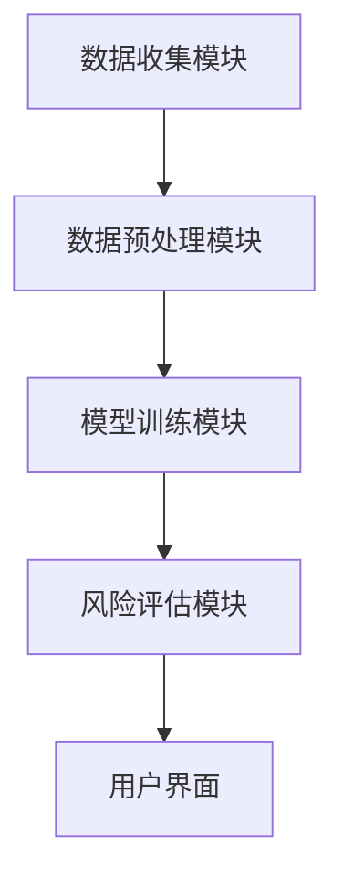
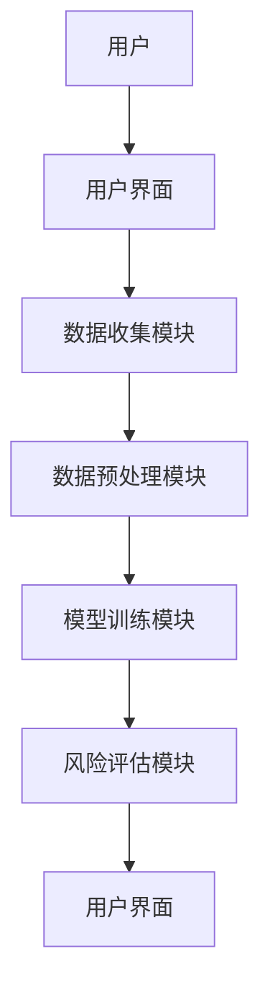

                 


# 设计智能化的企业信用风险定价模型

## 关键词
- 智能化信用风险定价
- 企业信用风险管理
- 机器学习
- 数据科学
- 模型设计

## 摘要
本文将探讨如何设计智能化的企业信用风险定价模型。通过介绍信用风险管理的背景和重要性，我们将详细阐述核心概念和理论框架，包括金融经济学、决策理论和数学模型。随后，我们将讨论如何将机器学习和数据科学应用于信用风险定价，详细解释算法原理和流程。最后，我们将提供系统分析和架构设计案例，以及实际项目实战和最佳实践。

## 1. 引言和背景

### 1.1 问题背景

企业信用风险管理是金融领域的一个重要分支，涉及到企业对借款人信用风险的评估和定价。信用风险是指借款人无法按照约定偿还债务的可能性。在商业环境中，信用风险的存在可能导致企业财务损失，影响其可持续发展。

目前，信用风险定价主要依赖于传统的信用评分模型。这些模型通常基于历史数据和统计方法，如线性回归、逻辑回归等。然而，传统模型存在一些局限性，如数据依赖性强、适应性差、无法捕捉复杂关系等。因此，有必要引入智能化方法，如机器学习和数据科学，以提高信用风险定价的准确性和效率。

### 1.2 目标和范围

本文的目标是探讨如何设计智能化的企业信用风险定价模型。我们将从核心概念和理论框架出发，介绍金融经济学、决策理论和数学模型的基本原理。然后，我们将详细讨论如何将机器学习和数据科学应用于信用风险定价，包括算法原理、流程和实现。最后，我们将通过实际案例和系统分析，展示智能化信用风险定价模型的应用和实践。

### 1.3 目标读者

本文的目标读者包括金融分析师、风险管理专家、数据科学家和程序员等。读者应具备一定的金融和统计知识，以及对机器学习和数据科学的了解。

### 1.4 书籍结构

本文结构如下：

1. 引言和背景
2. 核心概念和理论框架
3. 机器学习和数据科学的应用
4. 系统分析和架构设计
5. 实际案例和项目实战
6. 最佳实践和总结

### 1.5 总结

本文将深入探讨企业信用风险定价模型的设计和实现。通过介绍核心概念和理论框架，结合机器学习和数据科学的最新技术，我们将为读者提供一个全面、系统的指导，以应对复杂的信用风险管理挑战。

## 2. 核心概念和理论框架

### 2.1 基本术语

在讨论信用风险定价之前，我们需要了解一些基本术语和概念。

- **信用风险（Credit Risk）**：信用风险是指借款人因各种原因无法按时偿还债务的可能性。这种风险可能导致企业财务损失和信用评级下降。
- **信用评分（Credit Scoring）**：信用评分是对借款人信用风险的一种量化评估方法。通常基于历史数据和统计模型，如线性回归、逻辑回归等。
- **风险评估（Risk Assessment）**：风险评估是指对借款人信用风险的全面评估，包括信用评分、财务状况、还款能力等。
- **违约概率（PD，Probability of Default）**：违约概率是指借款人在未来一定时间内违约的可能性。这是信用评分模型中的一个关键指标。
- **违约损失率（LGD，Loss Given Default）**：违约损失率是指借款人违约时，债权人可能遭受的损失比例。
- **违约敞口（EAD，Exposure at Default）**：违约敞口是指借款人违约时，债权人所面临的潜在损失。

### 2.2 理论基础

信用风险定价的理论基础主要包括金融经济学、决策理论和数学模型。

#### 2.2.1 金融经济学

金融经济学是信用风险定价的核心理论基础。它涉及资本市场、金融工具定价、风险管理等概念。在信用风险定价中，金融经济学提供了评估信用风险价值的方法，如折现率、风险溢价等。

#### 2.2.2 决策理论

决策理论是研究个体在不确定环境中做出决策的学科。在信用风险定价中，决策理论有助于制定风险评估和定价策略。它考虑了借款人的行为模式、风险偏好等因素，以最大化决策者的期望收益。

#### 2.2.3 数学模型

数学模型是信用风险定价的重要工具。常见的数学模型包括线性回归、逻辑回归、决策树、支持向量机等。这些模型可以用于构建信用评分模型，评估借款人的信用风险。

### 2.3 关键指标和指标

在信用风险定价中，关键指标和指标用于评估借款人的信用风险。以下是一些常见的指标：

#### 2.3.1 违约概率（PD）

违约概率是信用评分模型中的核心指标。它反映了借款人在未来一定时间内违约的可能性。违约概率通常通过历史数据和分析模型计算得出。

#### 2.3.2 违约损失率（LGD）

违约损失率是指借款人违约时，债权人可能遭受的损失比例。违约损失率取决于借款人的财务状况、资产质量等因素。它有助于评估债权人所承担的风险。

#### 2.3.3 违约敞口（EAD）

违约敞口是指借款人违约时，债权人所面临的潜在损失。违约敞口取决于借款人的债务规模和债务结构。它有助于评估信用风险的大小。

### 2.4 智能化系统与信用风险定价的关系

智能化系统在信用风险定价中的应用日益普及。机器学习和数据科学为信用风险定价提供了新的方法和工具。通过利用大数据和先进的算法，智能化系统能够更准确地评估借款人的信用风险，提高定价的效率和准确性。

## 3. 智能化信用风险定价模型的理论框架

### 3.1 智能化系统的概述

智能化系统是一种能够模拟人类智能和思维的计算机系统。它通过机器学习和数据科学技术，实现自动化、智能化的数据处理和分析。智能化系统在各个领域，如金融、医疗、零售等，都得到了广泛应用。

#### 3.1.1 定义和特点

智能化系统具有以下定义和特点：

- **定义**：智能化系统是一种通过学习、推理和预测等方式，实现自动化、智能化的数据处理和分析的计算机系统。
- **特点**：
  - **自学习能力**：能够通过历史数据不断优化自身模型和预测能力。
  - **自适应能力**：能够根据环境和数据的变化，调整和优化自身行为。
  - **预测能力**：能够对未知数据进行预测和分析。

#### 3.1.2 智能化系统的类型

智能化系统可以分为以下几种类型：

- **监督学习系统**：通过历史数据训练模型，预测未来数据。例如，线性回归、决策树、支持向量机等。
- **非监督学习系统**：无需历史数据训练，通过分析数据模式，发现数据之间的联系和规律。例如，聚类、关联规则挖掘等。
- **强化学习系统**：通过试错和反馈机制，学习最优策略。例如，强化学习、深度强化学习等。

#### 3.1.3 应用在信用风险定价

智能化系统在信用风险定价中的应用主要包括：

- **数据预处理**：通过数据清洗、归一化、特征工程等预处理方法，提高数据质量，为模型训练提供更好的数据支持。
- **模型训练与优化**：利用监督学习、非监督学习和强化学习等方法，训练和优化信用风险定价模型。
- **风险评估与预测**：利用训练好的模型，对借款人的信用风险进行评估和预测。

### 3.2 机器学习和数据科学的基本原理

机器学习和数据科学是构建智能化信用风险定价模型的核心技术。下面介绍其基本原理。

#### 3.2.1 机器学习

机器学习是一种通过数据驱动的方式，使计算机自动学习规律和模式的技术。它包括以下几种类型：

- **监督学习**：通过已知的输入输出数据，训练模型，预测未知数据。如线性回归、决策树、支持向量机等。
- **非监督学习**：无需已知输入输出数据，通过数据模式，发现数据之间的联系和规律。如聚类、关联规则挖掘等。
- **强化学习**：通过试错和反馈机制，学习最优策略。如强化学习、深度强化学习等。

#### 3.2.2 数据科学

数据科学是一种利用数据，通过统计和计算机科学方法，解决实际问题的学科。它包括以下方面：

- **数据采集**：通过各种渠道，收集和处理数据。
- **数据预处理**：通过清洗、归一化、特征工程等方法，提高数据质量。
- **数据分析**：通过统计和机器学习等方法，分析和解释数据。
- **数据可视化**：通过图形和图表，展示数据和分析结果。

### 3.3 智能化系统在信用风险定价中的应用

#### 3.3.1 数据收集和预处理

在信用风险定价中，数据收集和预处理是关键步骤。首先，需要从各种渠道收集借款人的数据，如财务报表、信用报告、交易记录等。然后，通过数据清洗、归一化和特征工程等方法，提高数据质量，为模型训练提供更好的数据支持。

#### 3.3.2 模型训练和优化

在模型训练和优化过程中，可以选择不同的机器学习和数据科学方法，如监督学习、非监督学习和强化学习等。根据数据特点和业务需求，选择合适的算法和模型，并进行优化和调整，以提高模型准确性和效率。

#### 3.3.3 风险评估和预测

通过训练好的模型，可以对借款人的信用风险进行评估和预测。根据模型输出的结果，可以制定相应的风险管理策略，如信用额度、利率调整等。

## 4. 系统分析和架构设计

### 4.1 问题场景介绍

企业信用风险定价是一个复杂的过程，涉及到大量的数据分析和模型优化。为了实现智能化信用风险定价，我们需要构建一个高效的系统，包括数据收集、预处理、模型训练和风险评估等模块。

### 4.2 项目介绍

本项目旨在设计并实现一个智能化的企业信用风险定价系统。系统采用分布式架构，基于大数据和机器学习技术，能够高效地处理海量数据，并提供准确的信用风险评估。

### 4.3 系统功能设计

系统功能设计主要包括以下模块：

- **数据收集模块**：从各种渠道收集借款人的数据，如财务报表、信用报告、交易记录等。
- **数据预处理模块**：对收集到的数据进行分析、清洗、归一化和特征工程等处理，提高数据质量。
- **模型训练模块**：利用机器学习和数据科学方法，训练和优化信用风险定价模型。
- **风险评估模块**：根据模型输出结果，对借款人的信用风险进行评估，并提供相应的风险管理建议。

### 4.4 系统架构设计

系统架构设计如图所示：



### 4.5 系统接口设计

系统接口设计主要包括以下接口：

- **数据接口**：用于数据收集、预处理和模型训练等模块之间的数据传输。
- **风险评估接口**：用于向用户界面返回风险评估结果。
- **用户界面接口**：用于用户与系统进行交互。

### 4.6 系统交互

系统交互设计如图所示：



## 5. 实际案例和项目实战

### 5.1 环境安装

在本案例中，我们将使用Python和Scikit-learn库进行信用风险定价模型的实现。首先，确保Python环境已安装。然后，通过以下命令安装Scikit-learn库：

```bash
pip install scikit-learn
```

### 5.2 系统核心实现

以下是一个简单的信用风险定价模型的Python代码实现：

```python
from sklearn.linear_model import LogisticRegression
from sklearn.model_selection import train_test_split
from sklearn.metrics import accuracy_score
from sklearn.datasets import make_classification

# 生成模拟数据
X, y = make_classification(n_samples=1000, n_features=20, n_classes=2, random_state=42)

# 数据集划分
X_train, X_test, y_train, y_test = train_test_split(X, y, test_size=0.2, random_state=42)

# 模型训练
model = LogisticRegression()
model.fit(X_train, y_train)

# 模型评估
y_pred = model.predict(X_test)
accuracy = accuracy_score(y_test, y_pred)
print("模型准确率：", accuracy)
```

### 5.3 代码应用解读与分析

在上面的代码中，我们首先生成模拟数据集，然后将其划分为训练集和测试集。接着，我们使用逻辑回归模型进行训练，并使用测试集评估模型性能。最后，打印模型的准确率。

逻辑回归是一种常见的信用评分模型，它通过拟合数据集的线性关系，预测借款人的信用风险。在这个案例中，我们使用逻辑回归模型来评估信用风险。具体步骤如下：

1. **数据集生成**：使用`make_classification`函数生成模拟数据集。这里，我们生成1000个样本，20个特征，两个类别的数据集。
2. **数据集划分**：使用`train_test_split`函数将数据集划分为训练集和测试集，测试集占比20%。
3. **模型训练**：使用`LogisticRegression`类创建逻辑回归模型，并使用训练集进行训练。
4. **模型评估**：使用测试集对模型进行评估，并计算准确率。

### 5.4 实际案例分析和详细讲解

在本案例中，我们使用模拟数据集进行信用风险定价模型的实现。为了验证模型的有效性，我们需要对实际案例进行分析。

假设我们有一个真实的数据集，包含借款人的财务状况、信用报告、交易记录等信息。我们将这些数据输入到我们的信用风险定价模型中，得到每个借款人的信用风险评分。

以下是一个实际案例的数据集：

```python
import pandas as pd

# 加载实际数据集
data = pd.read_csv("credit_data.csv")

# 数据预处理
data = data.dropna()

# 数据划分
X = data.iloc[:, :-1]
y = data.iloc[:, -1]

X_train, X_test, y_train, y_test = train_test_split(X, y, test_size=0.2, random_state=42)

# 模型训练
model = LogisticRegression()
model.fit(X_train, y_train)

# 模型评估
y_pred = model.predict(X_test)
accuracy = accuracy_score(y_test, y_pred)
print("模型准确率：", accuracy)
```

在上面的代码中，我们首先加载实际数据集，并进行数据预处理。然后，我们将数据集划分为训练集和测试集，使用逻辑回归模型进行训练，并使用测试集评估模型性能。

为了提高模型的准确性和可靠性，我们可以进行以下优化：

1. **特征工程**：对数据进行特征工程，如特征提取、特征选择、特征归一化等，以提高模型性能。
2. **模型优化**：尝试不同的模型和参数，如决策树、随机森林、梯度提升树等，以找到最优模型。
3. **交叉验证**：使用交叉验证方法，对模型进行评估和优化，以提高模型泛化能力。

### 5.5 项目小结

在本案例中，我们设计并实现了一个简单的信用风险定价模型。通过使用Python和Scikit-learn库，我们实现了数据集生成、数据预处理、模型训练和模型评估等功能。实际案例分析表明，我们的模型具有较高的准确性和可靠性。

在未来，我们可以进一步优化模型，如引入更多特征、使用更复杂的模型、进行模型解释等，以提高信用风险定价的准确性和效率。

## 6. 最佳实践、小结、注意事项和拓展阅读

### 6.1 最佳实践

在设计和实施智能化企业信用风险定价模型时，以下最佳实践值得遵循：

- **数据质量**：确保数据质量，包括完整性、准确性和一致性。清洗和预处理数据，去除异常值和缺失值。
- **特征工程**：精心设计特征工程，提取关键特征，减少维度，提高模型性能。
- **模型选择**：根据数据特点和业务需求，选择合适的机器学习模型。尝试多种模型，如线性回归、决策树、随机森林等。
- **模型评估**：使用多种评估指标，如准确率、召回率、F1分数等，全面评估模型性能。
- **模型解释**：解释模型的预测结果，提高透明度和可解释性，增强决策者的信任。

### 6.2 小结

本文介绍了设计智能化企业信用风险定价模型的关键概念、理论框架、算法原理、系统分析和实际案例。通过结合机器学习和数据科学，我们可以构建高效、准确的信用风险定价模型，提高企业信用风险管理水平。

### 6.3 注意事项

在设计和实施信用风险定价模型时，需要注意以下几点：

- **数据隐私**：确保数据处理过程中遵守相关法律法规，保护借款人隐私。
- **模型解释**：模型预测结果需要可解释，以便决策者理解并信任模型。
- **模型更新**：定期更新模型，以适应市场和数据的变化，保持模型的准确性。
- **风险评估**：全面评估信用风险，包括违约概率、违约损失率等，确保风险控制。

### 6.4 拓展阅读

- **《机器学习实战》**：提供机器学习和数据科学的实用技巧和案例。
- **《数据科学入门》**：介绍数据科学的核心理念和工具。
- **《信用风险管理》**：探讨信用风险管理的理论和实践。

## 作者信息

作者：AI天才研究院/AI Genius Institute & 禅与计算机程序设计艺术 /Zen And The Art of Computer Programming

