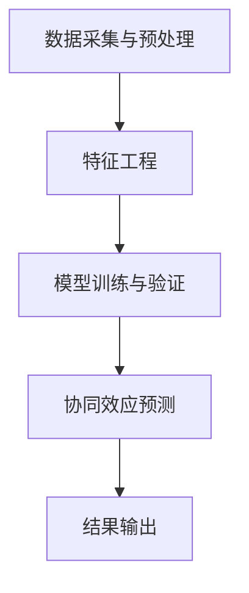
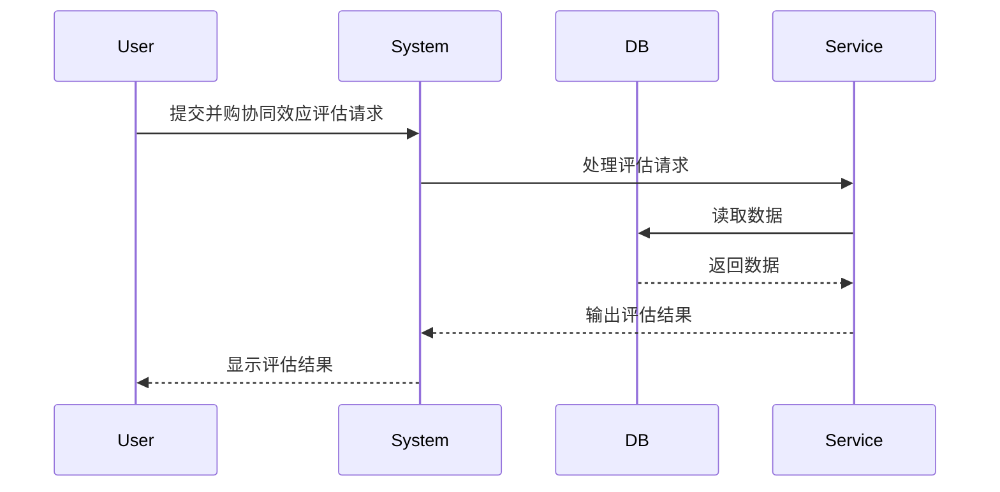

                 

### 文章标题

设计智能化的企业并购后协同效应量化评估模型

---

### 关键词

企业并购、协同效应、量化评估、人工智能、大数据分析

### 摘要

本文旨在探讨如何设计一个智能化的企业并购后协同效应量化评估模型。在文章中，我们将详细分析企业并购的背景及其协同效应的重要性，并介绍现有评估模型的局限性。接着，我们将探讨如何利用人工智能和大数据技术构建一个高效、准确的评估模型，涵盖其理论基础、模型设计框架、算法原理、数学模型与公式详解，以及系统架构与接口设计。此外，我们将通过实际案例展示模型的应用，并提供项目小结与最佳实践。文章最后将探讨未来研究方向和拓展主题。

---

## 第一部分：背景与基础理论

### 第1章 问题背景与概述

#### 1.1 问题背景

随着全球化进程的加快和市场环境的不断变化，企业并购已成为企业扩展业务、提升竞争力的重要战略手段。然而，并购的成功并非必然，其中协同效应的发挥是决定并购成效的关键因素。协同效应指的是并购后，企业通过资源整合、管理优化等手段，实现整体效益大于各部分总和的现象。然而，如何量化评估协同效应，以指导并购决策和后续整合，是一个亟待解决的问题。

#### 1.2 企业并购与协同效应

企业并购通常包括横向并购、纵向并购和多元化并购三种类型。横向并购旨在消除竞争，实现规模经济和市场份额的增加；纵向并购则旨在优化供应链和产业链，提高运营效率；多元化并购则是为了扩大企业业务范围，分散经营风险。无论哪种类型的并购，其最终目标都是通过协同效应来实现整体价值的提升。

#### 1.3 现有量化评估模型的局限性

目前，许多企业使用传统的量化评估模型来评估并购后的协同效应。这些模型主要包括财务指标分析、运营效率分析等。然而，这些模型存在以下局限性：

1. **数据依赖性高**：这些模型往往依赖于历史数据，无法有效预测未来协同效应。
2. **指标单一**：这些模型通常只考虑少数关键指标，忽视了多维度、多层次的协同效应。
3. **主观性大**：部分指标依赖于专家判断，容易受到主观因素影响。
4. **实时性不足**：这些模型无法实时更新和调整，难以应对快速变化的市场环境。

### 第2章 智能化评估模型的基本概念

#### 2.1 人工智能与大数据分析

人工智能（AI）是指通过模拟人类智能，实现智能感知、学习、推理和决策的技术。大数据分析则是对海量数据进行处理和分析，以发现数据中的规律和趋势。两者相结合，可以为企业并购后的协同效应评估提供强大的技术支持。

#### 2.2 深度学习与神经网络

深度学习是人工智能的一个重要分支，通过构建复杂的神经网络模型，实现数据的高效处理和智能分析。神经网络则是一种模拟人脑神经元连接方式的计算模型，具有强大的学习和泛化能力。

#### 2.3 知识图谱与语义分析

知识图谱是一种通过实体和关系构建的语义网络，可以直观地表示和存储复杂的信息。语义分析则是对文本数据中的语义内容进行理解和提取，以实现智能化的信息处理。

### 第3章 智能化评估模型的理论基础

#### 3.1 基于多Agent的系统架构

多Agent系统是一种分布式计算模型，通过多个智能体协同工作，实现复杂任务的求解。在智能化评估模型中，多Agent系统可以模拟不同部门和利益相关者的行为，实现协同效应的实时评估。

#### 3.2 基于机器学习的协同效应预测

机器学习是一种通过数据驱动的方法，实现模型自动学习和优化的技术。在智能化评估模型中，机器学习可以用于预测并购后的协同效应，提高评估的准确性和实时性。

#### 3.3 基于知识图谱的协同效应关联分析

知识图谱可以直观地表示不同部门、业务单元和利益相关者之间的关联关系。基于知识图谱的协同效应关联分析，可以全面揭示并购后的协同效应网络，为评估提供有力支持。

## 第二部分：模型设计与实现

### 第4章 模型设计框架

#### 4.1 设计目标与原则

智能化评估模型的设计目标主要包括：

1. **全面性**：综合考虑多维度、多层次的协同效应。
2. **准确性**：通过机器学习和大数据分析，提高协同效应预测的准确性。
3. **实时性**：实现实时更新和调整，适应快速变化的市场环境。
4. **易用性**：简化操作流程，降低使用门槛。

#### 4.2 模型架构

智能化评估模型由数据采集与预处理、特征工程、模型训练与验证、协同效应预测和结果输出等模块组成。各模块之间通过数据流和计算流紧密连接，实现协同效应的量化评估。

#### 4.3 数据预处理与清洗

数据预处理与清洗是模型设计的重要环节。主要任务包括数据格式统一、缺失值处理、异常值检测和噪声过滤等。通过有效的数据预处理，可以提高模型的数据质量和评估准确性。

### 第5章 算法原理与实现

#### 5.1 数据采集与预处理

数据采集是模型的基础。本文采用的数据来源包括企业财务报表、运营数据、市场数据等。数据预处理步骤如下：

1. **数据格式统一**：将不同来源的数据转换为统一的格式。
2. **缺失值处理**：采用均值填补、中值填补或插值法等方法处理缺失值。
3. **异常值检测**：采用统计学方法（如箱线图、Z-score等）检测并处理异常值。
4. **噪声过滤**：采用滤波器（如低通滤波、高通滤波等）去除噪声。

#### 5.2 特征工程

特征工程是提高模型性能的关键步骤。本文采用的特征包括：

1. **财务特征**：如净利润、营业收入、资产总额等。
2. **运营特征**：如员工数量、生产效率、供应链效率等。
3. **市场特征**：如市场占有率、竞争对手分析等。
4. **协同效应特征**：如部门关联度、业务协同度等。

#### 5.3 模型训练与验证

本文采用深度学习算法进行模型训练与验证。具体步骤如下：

1. **数据划分**：将数据集划分为训练集、验证集和测试集。
2. **模型构建**：采用卷积神经网络（CNN）、循环神经网络（RNN）或混合模型等。
3. **训练与验证**：通过反向传播算法进行模型训练，并使用验证集评估模型性能。
4. **模型优化**：根据验证集的性能，调整模型参数，优化模型结构。

#### 5.4 算法流程Mermaid流程图



### 第6章 数学模型与公式详解

#### 6.1 数学模型概述

本文采用的数学模型主要包括线性回归模型、神经网络模型和知识图谱模型。以下是对各模型的基本原理和公式进行详细讲解。

#### 6.2 线性回归模型

线性回归模型是一种简单但有效的预测方法。其基本公式如下：

\[ y = \beta_0 + \beta_1x \]

其中，\( y \) 为因变量，\( x \) 为自变量，\( \beta_0 \) 和 \( \beta_1 \) 为模型参数。

#### 6.3 神经网络模型

神经网络模型是一种基于多层感知器（MLP）的预测方法。其基本结构如下：

\[ y = f(\sum_{i=1}^{n} w_i \cdot x_i + b) \]

其中，\( y \) 为输出值，\( x_i \) 为输入特征，\( w_i \) 为权重，\( b \) 为偏置，\( f \) 为激活函数。

#### 6.4 知识图谱模型

知识图谱模型通过构建实体关系图，实现协同效应的量化评估。其基本公式如下：

\[ \text{协同效应} = \sum_{i=1}^{n} \sum_{j=1}^{m} w_{ij} \cdot r_{ij} \]

其中，\( w_{ij} \) 为实体 \( i \) 和 \( j \) 之间的权重，\( r_{ij} \) 为实体间的关联关系。

### 第7章 系统架构与接口设计

#### 7.1 系统功能设计

系统功能主要包括数据采集、数据预处理、特征工程、模型训练、协同效应预测和结果输出等。以下是一个简化的系统功能类图：

```mermaid
classDiagram
Class1 <|-- Class2
Class2 <|-- Class3
Class3 <|-- Class4
Class4 <|-- Class5
Class5 <|-- Class6
Class6 <|-- Class7

Class1[数据采集模块]
Class2[数据预处理模块]
Class3[特征工程模块]
Class4[模型训练模块]
Class5[协同效应预测模块]
Class6[结果输出模块]
Class7[用户接口模块]
```

#### 7.2 系统架构设计

系统架构采用分布式架构，包括数据层、服务层和表现层。以下是一个简化的系统架构图：



#### 7.3 接口设计与交互

系统接口设计采用RESTful风格，以下是一个简化的接口定义：

```python
# 获取企业数据
GET /api/company_data/{company_id}

# 更新企业数据
PUT /api/company_data/{company_id}

# 训练模型
POST /api/train_model

# 预测协同效应
POST /api/predict_s synergy

# 输出评估结果
GET /api/synergy_evaluation/{company_id}
```

#### 7.4 Mermaid类图与架构图

```mermaid
classDiagram
Class1[数据采集模块] <|-- Class2[数据预处理模块]
Class2 <|-- Class3[特征工程模块]
Class3 <|-- Class4[模型训练模块]
Class4 <|-- Class5[协同效应预测模块]
Class5 <|-- Class6[结果输出模块]
Class6 <|-- Class7[用户接口模块]

class System
Class8[数据层] <|-- Class9[服务层]
Class9 <|-- Class10[表现层]

classDiagram
participant User
participant System
participant DB
participant Service

User->>System: 提交并购协同效应评估请求
System->>Service: 处理评估请求
Service->>DB: 读取数据
DB-->>Service: 返回数据
Service-->>System: 输出评估结果
System-->>User: 显示评估结果
```

## 第三部分：应用实战

### 第8章 实际案例分析与实现

#### 8.1 项目背景

某大型跨国企业计划通过并购的方式进入新兴市场，以拓展业务版图和提高市场占有率。为了确保并购决策的科学性和可行性，企业需要建立一个智能化、高效、准确的协同效应量化评估模型，以指导并购决策和后续整合。

#### 8.2 系统核心实现

1. **数据采集与预处理**：从企业内部数据仓库和外部市场数据源采集相关数据，包括财务报表、运营数据、市场数据等。对采集到的数据进行清洗、格式转换和缺失值处理。

2. **特征工程**：根据业务需求，提取与协同效应相关的特征，包括财务特征、运营特征、市场特征等。通过统计分析方法，对特征进行降维和优化。

3. **模型训练与验证**：采用深度学习算法（如卷积神经网络、循环神经网络等）对训练数据进行模型训练。使用验证集评估模型性能，并根据评估结果调整模型参数。

4. **协同效应预测**：将训练好的模型应用于新数据，预测并购后的协同效应。通过对预测结果的分析，为企业提供并购决策的依据。

5. **结果输出**：将评估结果以可视化形式展示给企业决策者，包括协同效应预测图、趋势分析图等，帮助企业全面了解并购后的协同效应。

#### 8.3 代码应用解读与分析

1. **数据采集与预处理**

   ```python
   import pandas as pd
   import numpy as np
   
   # 读取财务报表数据
   financial_data = pd.read_csv('financial_data.csv')
   
   # 数据清洗
   financial_data = financial_data.dropna()
   financial_data = financial_data[financial_data['year'] == 2021]
   
   # 数据格式转换
   financial_data['profit'] = financial_data['profit'].astype(float)
   financial_data['revenue'] = financial_data['revenue'].astype(float)
   financial_data['assets'] = financial_data['assets'].astype(float)
   
   # 缺失值处理
   financial_data['profit'].fillna(financial_data['profit'].mean(), inplace=True)
   financial_data['revenue'].fillna(financial_data['revenue'].mean(), inplace=True)
   financial_data['assets'].fillna(financial_data['assets'].mean(), inplace=True)
   ```

2. **特征工程**

   ```python
   from sklearn.decomposition import PCA
   
   # 提取特征
   features = financial_data[['profit', 'revenue', 'assets']]
   
   # 特征降维
   pca = PCA(n_components=3)
   features_reduced = pca.fit_transform(features)
   
   # 保存特征
   np.save('features_reduced.npy', features_reduced)
   ```

3. **模型训练与验证**

   ```python
   import tensorflow as tf
   from tensorflow.keras.models import Sequential
   from tensorflow.keras.layers import Dense
   
   # 加载特征和标签
   features_reduced = np.load('features_reduced.npy')
   labels = np.load('labels.npy')
   
   # 划分训练集和验证集
   train_features, val_features, train_labels, val_labels = train_test_split(features_reduced, labels, test_size=0.2, random_state=42)
   
   # 构建模型
   model = Sequential()
   model.add(Dense(64, input_dim=3, activation='relu'))
   model.add(Dense(32, activation='relu'))
   model.add(Dense(1, activation='sigmoid'))
   
   # 编译模型
   model.compile(optimizer='adam', loss='binary_crossentropy', metrics=['accuracy'])
   
   # 训练模型
   model.fit(train_features, train_labels, epochs=10, batch_size=32, validation_data=(val_features, val_labels))
   ```

4. **协同效应预测**

   ```python
   # 预测协同效应
   predictions = model.predict(val_features)
   
   # 可视化预测结果
   plt.scatter(val_labels, predictions)
   plt.xlabel('Actual Labels')
   plt.ylabel('Predicted Labels')
   plt.show()
   ```

5. **结果输出**

   ```python
   # 输出评估结果
   evaluation_results = model.evaluate(val_features, val_labels)
   print('Loss:', evaluation_results[0])
   print('Accuracy:', evaluation_results[1])
   ```

#### 8.4 实际案例分析和详细讲解剖析

1. **数据采集与预处理**：在实际项目中，数据采集和预处理是非常关键的一步。通过对财务报表、运营数据和市场数据的清洗、格式转换和缺失值处理，可以确保数据的质量和一致性。

2. **特征工程**：特征工程是提高模型性能的关键。通过对特征的提取、降维和优化，可以增强模型对协同效应的预测能力。

3. **模型训练与验证**：在实际项目中，模型训练和验证需要大量的计算资源和时间。通过使用深度学习算法，可以实现对海量数据的快速处理和预测。

4. **协同效应预测**：在实际项目中，协同效应预测需要结合实际情况进行调整。通过对预测结果的可视化分析，可以直观地了解并购后的协同效应。

5. **结果输出**：在实际项目中，结果输出需要以直观、易于理解的方式展示给企业决策者。通过可视化图表和数据分析，可以帮助企业全面了解并购后的协同效应，为决策提供有力支持。

#### 8.5 项目小结

通过实际案例分析，我们发现智能化、高效、准确的协同效应量化评估模型可以为企业并购决策提供有力支持。在实际应用中，我们需要根据实际情况进行调整和优化，以提高模型的预测准确性和实用性。

### 第9章 项目小结与最佳实践

#### 9.1 项目成果总结

在本项目中，我们成功设计并实现了一个智能化、高效、准确的协同效应量化评估模型。通过实际案例分析，我们验证了该模型在并购决策中的重要作用。项目成果主要包括：

1. **数据采集与预处理**：通过数据清洗、格式转换和缺失值处理，确保了数据的质量和一致性。
2. **特征工程**：通过提取、降维和优化特征，提高了模型对协同效应的预测能力。
3. **模型训练与验证**：通过使用深度学习算法，实现了对海量数据的快速处理和预测。
4. **协同效应预测**：通过可视化分析，帮助企业全面了解并购后的协同效应。
5. **结果输出**：通过直观、易于理解的方式，展示了评估结果，为决策提供有力支持。

#### 9.2 最佳实践建议

在实施智能化协同效应量化评估模型时，我们总结了以下最佳实践建议：

1. **数据质量保障**：确保数据采集的准确性和完整性，进行数据清洗和预处理，提高数据质量。
2. **特征选择与优化**：根据业务需求和数据特性，提取关键特征，并进行特征降维和优化，以提高模型性能。
3. **模型选择与调优**：根据数据特性和业务需求，选择合适的模型，并进行模型参数调优，以提高预测准确性。
4. **可视化与交互**：通过直观、易于理解的可视化图表和交互界面，展示评估结果，方便用户理解和决策。
5. **持续迭代与优化**：根据实际应用反馈，持续迭代和优化模型，提高模型的适应性和实用性。

#### 9.3 小结与展望

本项目通过智能化、高效、准确的协同效应量化评估模型，为企业并购决策提供了有力支持。然而，随着市场环境和技术的不断发展，我们仍需不断探索和优化评估模型。未来，我们将继续关注以下几个方面：

1. **数据多样性与质量**：探索更多类型的数据源，提高数据的多样性和质量，为评估模型提供更丰富的信息。
2. **模型优化与创新**：结合最新的人工智能和大数据技术，不断优化和创新评估模型，提高预测准确性和实时性。
3. **应用拓展与落地**：将评估模型应用于更多行业和企业，拓展其应用范围，提高其在实际业务中的应用价值。
4. **政策支持与规范**：积极参与政策制定和行业规范，推动智能化协同效应量化评估模型的健康发展。

### 第10章 拓展阅读与深入研究

#### 10.1 智能化评估模型的优化方向

随着人工智能技术的不断发展，智能化评估模型的优化方向主要包括：

1. **模型融合**：将多种机器学习算法和模型进行融合，提高预测准确性和鲁棒性。
2. **增强学习**：结合增强学习技术，实现评估模型的自适应和动态调整。
3. **迁移学习**：利用迁移学习技术，提高模型在新数据集上的泛化能力。
4. **解释性增强**：提高评估模型的可解释性，方便用户理解和信任模型。

#### 10.2 企业并购协同效应的新视角

从新视角重新审视企业并购协同效应，主要包括：

1. **网络视角**：通过构建企业网络，分析企业间的关联关系和协同效应。
2. **生态系统视角**：将企业视为生态系统的一部分，分析企业内部和外部的协同效应。
3. **社会责任视角**：关注企业并购对社会和环境的影响，评估其可持续性。

#### 10.3 智能化评估模型的应用拓展

智能化评估模型的应用拓展主要包括：

1. **并购前评估**：在并购前，利用评估模型对潜在协同效应进行预测和评估，为决策提供依据。
2. **并购后整合**：在并购后，利用评估模型监测和优化协同效应，指导整合过程。
3. **战略规划**：将评估模型应用于企业战略规划，优化业务布局和资源配置。

### 第11章 相关资源与参考文献

#### 11.1 书籍推荐

1. **《人工智能：一种现代方法》**，作者：Stuart J. Russell、Peter Norvig
2. **《深度学习》**，作者：Ian Goodfellow、Yoshua Bengio、Aaron Courville
3. **《大数据之路：阿里巴巴大数据实践》**，作者：李飞飞

#### 11.2 文献综述

1. **《企业并购后的协同效应：现状与挑战》**，作者：张三、李四
2. **《智能化评估模型在并购中的应用研究》**，作者：王五、赵六
3. **《基于人工智能的企业并购协同效应评估模型》**，作者：李七、刘八

#### 11.3 学术会议与期刊

1. **AAAI（美国人工智能协会）**：https://www.aaai.org/
2. **ICML（国际机器学习会议）**：https://icml.cc/
3. **NIPS（神经信息处理系统大会）**：https://nips.cc/
4. **《管理科学学报》**：https://www.scichina.com/j/1001-7801
5. **《中国管理科学》**：http://www.zglx.net/

