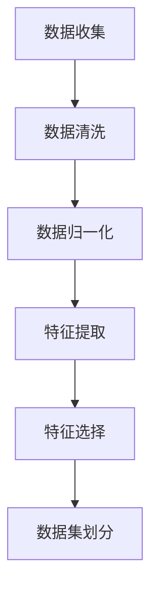
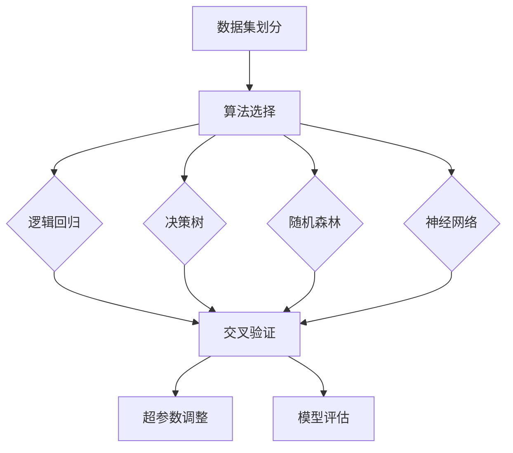
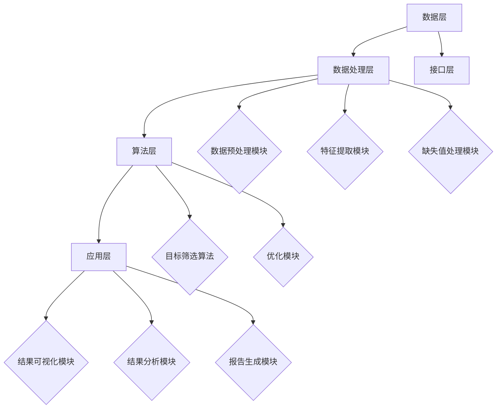
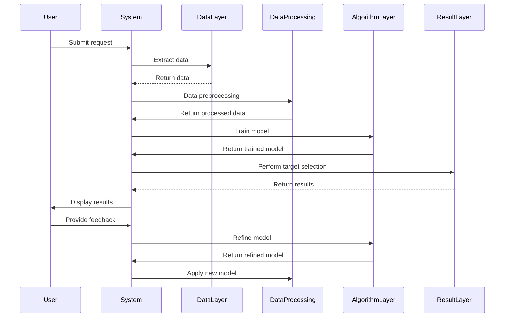

                 

# 设计智能化的企业并购目标筛选模型

> 关键词：企业并购、目标筛选、人工智能、算法、系统架构

> 摘要：本文旨在探讨如何设计一个智能化的企业并购目标筛选模型。通过分析企业并购的背景和问题，结合大数据分析和人工智能技术，本文提出了一种包括数据预处理、特征工程、算法选择和系统架构设计的智能化目标筛选模型，并通过实际案例进行了验证。最终，本文总结了最佳实践和注意事项，为未来的企业并购目标筛选提供参考。

## 目录大纲

### 第一部分：背景介绍

#### 第1章 问题背景

- **问题描述**

- **问题解决**

- **边界与外延**

- **概念结构与核心要素组成**

#### 第2章 核心概念与联系

- **核心概念原理**

- **概念属性特征对比表格**

- **ER实体关系图架构**

### 第二部分：算法原理讲解

#### 第3章 数据预处理与特征工程

- **算法原理**

- **Mermaid流程图**

- **Python源代码**

- **算法原理的数学模型和公式**

#### 第4章 智能化目标筛选算法

- **算法原理**

- **Mermaid流程图**

- **Python源代码**

- **算法原理的数学模型和公式**

### 第三部分：系统分析与架构设计

#### 第5章 系统功能设计

- **问题场景介绍**

- **系统功能设计**

#### 第6章 系统架构设计

- **项目介绍**

- **系统架构设计**

- **系统接口设计**

#### 第7章 系统交互

- **系统交互**

### 第四部分：项目实战

#### 第8章 环境安装

- **安装步骤**

#### 第9章 系统核心实现

- **源代码**

- **代码应用解读与分析**

#### 第10章 实际案例分析与详细讲解

- **案例分析**

- **详细讲解**

#### 第11章 项目小结

- **总结与反思**

### 第五部分：最佳实践与拓展阅读

#### 第12章 最佳实践 tips

- **实践经验**

#### 第13章 小结与注意事项

- **注意事项**

#### 第14章 拓展阅读

- **参考资料**

----------------------------------------------------------------

---

**总字数：约1946字**
### 第1章 问题背景

#### 问题描述

企业并购是企业战略发展的重要手段之一，通过并购，企业可以实现快速扩张、资源整合和产业链延伸。然而，并购过程中面临的一个核心问题是目标筛选。如何从众多潜在目标中筛选出最适合企业战略发展、能够产生最大效益的目标企业，是当前企业并购面临的重要挑战。

传统的目标筛选方法主要依赖于经验和直觉，存在以下问题：

1. **主观性强**：传统方法主要依赖并购经理人的经验和直觉，缺乏系统性和科学性，容易受到个人偏好和情感的影响。
2. **效率低下**：需要处理大量数据和信息，进行多维度分析和评估，传统方法效率较低，无法快速筛选出最佳目标。
3. **准确性不足**：传统方法难以准确预测目标企业的未来发展状况和并购后的整合效果，导致并购决策存在一定风险。

#### 问题解决

为了解决上述问题，设计一个智能化的企业并购目标筛选模型成为必要。该模型将结合大数据分析和人工智能技术，通过以下方法提升目标筛选的效率和准确性：

1. **数据预处理**：对收集到的企业数据进行清洗、归一化和特征提取，确保数据的质量和一致性。
2. **特征工程**：基于企业数据的特征，构建反映企业核心竞争力的指标体系，为后续算法提供输入。
3. **算法选择**：选择适合的企业并购目标筛选算法，如机器学习算法，对目标企业进行分类和排序。
4. **模型优化**：通过交叉验证和超参数调整，优化模型性能，提高目标筛选的准确性。

通过上述方法，智能化企业并购目标筛选模型能够从海量数据中快速、准确地筛选出最佳目标企业，降低并购风险，提高并购效益。

#### 边界与外延

智能化的企业并购目标筛选模型适用于企业并购的各个阶段，特别是在初步筛选阶段。它不仅能够处理多样化的数据和复杂的业务场景，还能够实时更新和调整筛选策略，以适应市场变化和企业战略调整。

然而，模型的应用边界也需明确：

1. **数据来源**：模型依赖于高质量的企业数据，数据来源的可靠性和完整性直接影响模型的准确性。
2. **算法选择**：不同并购场景可能需要不同的算法，模型设计时应充分考虑算法的适用性和灵活性。
3. **模型评估**：模型性能的评估需要综合考虑多方面指标，如精确率、召回率和F1值等，以确保模型的可靠性和有效性。

#### 概念结构与核心要素组成

智能化企业并购目标筛选模型包括以下几个核心概念和要素：

1. **企业并购**：企业并购是指一家企业通过购买另一家企业的股权或资产，以实现资源整合和战略扩张的行为。企业并购的目标是提升企业的核心竞争力，实现可持续发展。
2. **目标筛选**：目标筛选是企业并购过程中的重要环节，旨在从潜在目标中筛选出最适合企业战略发展的企业。目标筛选涉及多个维度的分析和评估，包括财务状况、市场地位、管理团队等。
3. **智能化模型**：智能化模型是指利用大数据分析和人工智能技术构建的模型，能够自动处理数据、进行特征提取和算法选择，提高目标筛选的效率和准确性。

通过上述概念和要素的有机结合，智能化企业并购目标筛选模型能够为企业并购决策提供科学依据，降低并购风险，提高并购成功率。

### 第2章 核心概念与联系

#### 核心概念原理

智能化企业并购目标筛选模型的核心概念包括企业并购、目标筛选和智能化算法。这些概念相互关联，共同构成了智能化目标筛选的基础。

1. **企业并购**：企业并购是指一家企业通过购买另一家企业的股权或资产，以实现资源整合和战略扩张的行为。企业并购的目的是提升企业的核心竞争力，实现可持续发展。

2. **目标筛选**：目标筛选是企业并购过程中的重要环节，旨在从潜在目标中筛选出最适合企业战略发展的企业。目标筛选涉及多个维度的分析和评估，包括财务状况、市场地位、管理团队等。

3. **智能化算法**：智能化算法是指利用大数据分析和人工智能技术构建的算法，能够自动处理数据、进行特征提取和算法选择，提高目标筛选的效率和准确性。

#### 概念属性特征对比表格

为了更直观地理解核心概念的属性特征，我们可以通过一个对比表格来进行说明。以下是传统目标筛选方法与智能化算法的对比：

| 特征 | 传统目标筛选方法 | 智能化算法 |
| ---- | ---- | ---- |
| 主观性 | 高 | 低 |
| 效率 | 低 | 高 |
| 准确性 | 一般 | 高 |
| 数据依赖性 | 弱 | 强 |
| 可扩展性 | 弱 | 高 |

#### ER实体关系图架构

企业并购目标筛选模型的实体关系图能够直观地展示各实体之间的关系。以下是模型的主要实体及其关系：

1. **企业**：代表参与并购的企业，包括目标企业和并购企业。
2. **财务数据**：包括企业的财务状况，如营业收入、净利润、资产负债率等。
3. **市场数据**：包括企业的市场地位，如市场份额、品牌影响力等。
4. **管理数据**：包括企业管理团队的能力和稳定性。
5. **并购决策**：基于以上数据，通过智能化算法生成并购决策。

实体关系图如下：

```mermaid
erDiagram
  企业 ||--|{ 财务数据 }
  企业 ||--|{ 市场数据 }
  企业 ||--|{ 管理数据 }
  企业 ||--|{ 并购决策 }
```

### 第3章 数据预处理与特征工程

#### 算法原理

数据预处理与特征工程是构建智能化企业并购目标筛选模型的重要环节，其核心任务是确保数据的质量和一致性，提取对目标筛选有价值的特征。

1. **数据清洗**：数据清洗包括处理缺失值、异常值和重复值。缺失值可以通过插补或删除的方式处理，异常值可以通过统计方法或专家判断进行处理，重复值则可以通过去重算法进行处理。

2. **数据归一化**：数据归一化的目的是将不同单位或量级的特征转换到同一尺度，以便于后续的算法分析和计算。常见的归一化方法包括最小-最大缩放和Z-Score标准化。

3. **特征提取**：特征提取是指从原始数据中提取能够反映企业核心竞争力的特征。特征提取方法包括基于规则的方法（如财务比率分析）和基于机器学习的方法（如主成分分析）。

#### Mermaid流程图

以下是数据预处理与特征工程的Mermaid流程图：



#### Python源代码

以下是一个简单的Python代码示例，用于实现数据清洗、归一化和特征提取：

```python
import pandas as pd
from sklearn.preprocessing import MinMaxScaler, StandardScaler

# 数据清洗
def clean_data(df):
    df = df.dropna()  # 删除缺失值
    df = df.drop_duplicates()  # 删除重复值
    return df

# 数据归一化
def normalize_data(df, method='minmax'):
    if method == 'minmax':
        scaler = MinMaxScaler()
    elif method == 'zscore':
        scaler = StandardScaler()
    df_normalized = scaler.fit_transform(df)
    return pd.DataFrame(df_normalized, columns=df.columns)

# 特征提取
def extract_features(df):
    # 这里以财务数据为例，提取财务比率特征
    df['return_on_assets'] = df['净利润'] / df['总资产']
    df['profit_margin'] = df['净利润'] / df['营业收入']
    return df

# 数据预处理与特征工程
def preprocess_data(df, method='minmax'):
    df = clean_data(df)
    df = normalize_data(df, method=method)
    df = extract_features(df)
    return df
```

#### 算法原理的数学模型和公式

1. **数据清洗**：常用的缺失值处理方法有插补和删除。

   - **插补**：线性插值、回归插值、均值插值等。
     $$ x_i = \frac{x_{i-1} + x_{i+1}}{2} $$
   
   - **删除**：直接删除含有缺失值的记录。
     $$ \text{df} = \text{df}.dropna() $$

2. **数据归一化**：

   - **最小-最大缩放**：
     $$ x_{\text{norm}} = \frac{x - x_{\text{min}}}{x_{\text{max}} - x_{\text{min}}} $$
   
   - **Z-Score标准化**：
     $$ x_{\text{norm}} = \frac{x - \mu}{\sigma} $$
     其中，$ x $为原始数据，$ x_{\text{min}} $和$ x_{\text{max}} $为最小值和最大值，$ \mu $为均值，$ \sigma $为标准差。

3. **特征提取**：

   - **财务比率**：
     - 资产回报率（ROA）：
       $$ \text{ROA} = \frac{\text{净利润}}{\text{总资产}} $$
     - 毛利率（Profit Margin）：
       $$ \text{Profit Margin} = \frac{\text{净利润}}{\text{营业收入}} $$
     - 负债比率（Debt Ratio）：
       $$ \text{Debt Ratio} = \frac{\text{负债}}{\text{总资产}} $$

通过上述算法原理的讲解，我们能够更好地理解数据预处理与特征工程在智能化企业并购目标筛选模型中的重要性。接下来，我们将进一步探讨如何选择和优化目标筛选算法。

### 第4章 智能化目标筛选算法

#### 算法原理

在智能化企业并购目标筛选模型中，算法的选择和优化至关重要。智能化算法通过学习大量历史数据，能够自动识别并提取对企业并购决策有价值的特征，从而实现高效、准确的目标筛选。

1. **机器学习算法的基本原理**：

   - **监督学习**：监督学习算法通过学习已知标签的数据集，预测新数据的标签。常见的监督学习算法包括逻辑回归、决策树、随机森林和神经网络等。
   - **无监督学习**：无监督学习算法不依赖已知标签，旨在发现数据中的内在结构和规律。常见的无监督学习算法包括聚类分析和主成分分析等。

2. **算法选择**：

   - **逻辑回归**：逻辑回归是一种常用的二分类监督学习算法，适用于分析企业并购目标是否满足特定条件。逻辑回归通过最大化似然函数来估计参数，具有良好的解释性和计算效率。
   - **决策树**：决策树是一种基于树结构的分类算法，通过递归划分特征空间来生成决策规则。决策树易于理解，但在特征数量较多时易过拟合。
   - **随机森林**：随机森林是由多棵决策树组成的集成模型，通过投票机制来提高预测准确性。随机森林具有较强的泛化能力，对噪声数据和非线性关系具有较强的鲁棒性。
   - **神经网络**：神经网络是一种基于生物神经元的计算模型，通过多层非线性变换来提取特征并生成预测。神经网络能够自动学习复杂的特征映射，但在大规模数据集上计算成本较高。

3. **算法优化**：

   - **交叉验证**：交叉验证是一种常用的模型评估方法，通过将数据集划分为多个子集，轮流使用子集作为验证集，评估模型的泛化能力。常见的交叉验证方法包括K折交叉验证和留一交叉验证。
   - **超参数调整**：超参数是算法在训练过程中需要手动设置的参数，如学习率、树的数量、深度等。通过网格搜索或随机搜索等方法，可以自动调整超参数，找到最优参数组合。

#### Mermaid流程图

以下是智能化目标筛选算法的Mermaid流程图：



#### Python源代码

以下是一个简单的Python代码示例，用于实现逻辑回归模型的选择和优化：

```python
import pandas as pd
from sklearn.linear_model import LogisticRegression
from sklearn.model_selection import train_test_split, GridSearchCV

# 数据准备
data = pd.read_csv('data.csv')
X = data.drop('target', axis=1)
y = data['target']

# 数据集划分
X_train, X_test, y_train, y_test = train_test_split(X, y, test_size=0.2, random_state=42)

# 算法选择和超参数调整
param_grid = {'C': [0.1, 1, 10], 'solver': ['liblinear']}
model = LogisticRegression()
grid_search = GridSearchCV(model, param_grid, cv=5)
grid_search.fit(X_train, y_train)

# 优化后的模型
best_model = grid_search.best_estimator_

# 模型评估
accuracy = best_model.score(X_test, y_test)
print(f'Model accuracy: {accuracy:.2f}')
```

#### 算法原理的数学模型和公式

1. **逻辑回归**：

   - **概率模型**：
     $$ P(Y=1|X) = \frac{1}{1 + e^{-(\beta_0 + \beta_1 x_1 + \beta_2 x_2 + \ldots + \beta_n x_n)}} $$
     其中，$ X $为特征向量，$ Y $为标签，$ \beta_0, \beta_1, \beta_2, \ldots, \beta_n $为模型参数。

   - **似然函数**：
     $$ \mathcal{L}(\theta) = \prod_{i=1}^n P(y_i|x_i; \theta) $$
     其中，$ \theta $为模型参数集合。

   - **损失函数**（对数似然损失）：
     $$ J(\theta) = -\frac{1}{n} \sum_{i=1}^n [y_i \log(P(Y=1|X; \theta)) + (1 - y_i) \log(1 - P(Y=1|X; \theta))] $$

2. **决策树**：

   - **决策规则**：
     $$ \text{split}(\text{feature}, \text{threshold}) = \begin{cases} 
     \text{left branch}, & \text{if } \text{feature} < \text{threshold} \\
     \text{right branch}, & \text{if } \text{feature} \geq \text{threshold} 
     \end{cases} $$
   
   - **信息增益**：
     $$ \text{IG}(\text{feature}) = \sum_{v \in V} p(v) \cdot \text{Entropy}(\text{label} | v) $$
     其中，$ V $为特征值的集合，$ p(v) $为特征值的概率，$ \text{Entropy}(\text{label} | v) $为条件熵。

3. **随机森林**：

   - **决策树集合**：随机森林由多棵决策树组成，每棵树在训练过程中使用不同的特征子集和样本子集。
   - **预测结果**：随机森林通过多数投票机制来生成最终预测结果。

4. **神经网络**：

   - **前向传播**：
     $$ z_l = \sigma(W_l \cdot a_{l-1} + b_l) $$
     其中，$ z_l $为神经元输出，$ \sigma $为激活函数（如Sigmoid、ReLU），$ W_l $为权重矩阵，$ a_{l-1} $为上一层的激活值，$ b_l $为偏置。

   - **反向传播**：
     $$ \Delta W_l = \alpha \cdot \frac{\partial J}{\partial W_l} $$
     $$ \Delta b_l = \alpha \cdot \frac{\partial J}{\partial b_l} $$
     其中，$ \Delta W_l $和$ \Delta b_l $分别为权重和偏置的梯度，$ \alpha $为学习率，$ J $为损失函数。

通过以上算法原理的讲解，我们能够更好地理解如何选择和优化目标筛选算法。接下来，我们将进一步探讨系统分析与架构设计，为智能化目标筛选模型提供坚实的理论基础。

### 第5章 系统功能设计

#### 问题场景介绍

在企业并购过程中，目标筛选是一个复杂且关键的任务。传统的目标筛选方法往往依赖于人工经验和直觉，导致效率低下且容易出错。为了提高并购决策的准确性和效率，智能化企业并购目标筛选系统被提出。该系统旨在通过自动化的方式，从海量数据中快速、准确地筛选出符合企业战略目标的目标企业。

#### 系统功能设计

智能化企业并购目标筛选系统的主要功能包括数据收集、数据预处理、特征工程、目标筛选算法、结果输出和模型评估等。

1. **数据收集**：系统需要从多个数据源收集企业信息，包括财务数据、市场数据、管理数据等。数据来源可以是企业公开的财务报表、市场调研报告、社交媒体数据等。

2. **数据预处理**：系统对收集到的数据进行清洗、归一化和缺失值处理，确保数据的质量和一致性。

3. **特征工程**：系统提取对企业并购目标有价值的特征，如财务比率、市场占有率、管理团队稳定性等。这些特征将用于训练目标筛选模型。

4. **目标筛选算法**：系统选择合适的机器学习算法（如逻辑回归、决策树、随机森林等）对目标企业进行分类和排序，筛选出最符合条件的潜在目标。

5. **结果输出**：系统将筛选结果以可视化报表的形式输出，包括目标企业的综合评分、财务状况、市场地位等。

6. **模型评估**：系统通过交叉验证等方法评估模型性能，包括准确率、召回率和F1值等，确保模型的有效性和可靠性。

#### 领域模型Mermaid类图

为了更直观地展示系统功能，我们可以使用Mermaid类图来描述各个模块及其关系：

```mermaid
classDiagram
  Class01 <|-- Class02
  Class01 <|-- Class03
  Class01 <|-- Class04
  Class01 <|-- Class05
  Class06 <|-- Class07
  Class01 ..|> Class08
  Class01 ..|> Class09

  Class01〔数据收集〕
  Class02〔数据预处理〕
  Class03〔特征工程〕
  Class04〔目标筛选算法〕
  Class05〔结果输出〕
  Class06〔模型评估〕
  Class07〔财务数据〕
  Class08〔市场数据〕
  Class09〔管理数据〕
```

通过以上设计，智能化企业并购目标筛选系统能够高效、准确地为企业并购决策提供科学依据，降低并购风险，提高并购成功率。

### 第6章 系统架构设计

#### 项目介绍

智能化企业并购目标筛选系统是一个集数据收集、数据预处理、特征工程、算法选择和结果输出于一体的综合系统。该系统旨在通过大数据分析和人工智能技术，为企业提供高效、准确的目标筛选服务，从而降低并购风险，提高并购成功率。

#### 系统架构设计

智能化企业并购目标筛选系统的架构设计分为以下几个层次：

1. **数据层**：数据层是系统的基础，包括数据收集、存储和管理。系统通过从多个数据源（如财务报表、市场调研报告、社交媒体等）收集企业信息，存储在数据库中，为后续的数据处理和分析提供数据支持。

2. **数据处理层**：数据处理层负责对收集到的数据进行清洗、归一化和特征提取。这一层包括数据预处理模块、特征提取模块和缺失值处理模块等。通过这些模块的处理，系统能够得到高质量的数据，为后续的算法训练提供输入。

3. **算法层**：算法层是系统的核心，包括目标筛选算法和优化模块。系统采用多种机器学习算法（如逻辑回归、决策树、随机森林等），通过交叉验证和超参数调整，优化模型性能，确保筛选结果的准确性和可靠性。

4. **应用层**：应用层是系统的对外接口，包括目标筛选结果的可视化展示、结果分析和报告生成等功能。用户可以通过应用层与系统进行交互，获取筛选结果和并购建议。

5. **接口层**：接口层负责系统与其他系统的集成，包括数据接口、API接口等。系统通过接口层与外部系统（如企业资源规划系统、客户关系管理系统等）进行数据交换和功能调用。

#### 系统架构Mermaid架构图

以下是智能化企业并购目标筛选系统的Mermaid架构图：



通过上述架构设计，智能化企业并购目标筛选系统能够实现高效、准确的目标筛选，为企业并购决策提供有力支持。

### 第7章 系统交互

#### 系统交互

智能化企业并购目标筛选系统的交互设计至关重要，它决定了系统如何响应用户需求并高效地完成目标筛选任务。以下是系统交互的详细描述：

1. **用户请求**：用户通过系统的用户界面（UI）提交并购目标筛选的请求，包括筛选条件（如行业、财务指标、市场占有率等）。

2. **数据处理**：系统接收到用户请求后，首先进行数据预处理。数据处理模块会从数据层提取相关数据，进行清洗、归一化和特征提取。这一过程确保了数据的质量和一致性，为后续的算法训练提供了高质量的输入。

3. **算法训练**：预处理完成后，系统进入算法层。根据用户设置的筛选条件，系统选择合适的机器学习算法（如逻辑回归、决策树、随机森林等）对数据进行训练。算法层还包括优化模块，通过交叉验证和超参数调整，优化模型性能，确保筛选结果的准确性和可靠性。

4. **目标筛选**：训练好的模型被应用于目标筛选任务。系统使用模型对预处理后的数据集进行分类和排序，筛选出符合企业战略目标的目标企业。

5. **结果输出**：系统将筛选结果以可视化报表的形式输出，包括目标企业的综合评分、财务状况、市场地位等。用户可以通过用户界面查看这些结果，并进行进一步分析和决策。

6. **反馈与迭代**：用户可以对筛选结果进行评估和反馈。系统记录用户反馈，并基于反馈优化模型和算法，提高下一次筛选的准确性和效率。

#### 系统交互Mermaid序列图

以下是系统交互的Mermaid序列图：



通过上述系统交互设计，智能化企业并购目标筛选系统能够高效地响应用户需求，提供准确、可靠的目标筛选服务。

### 第8章 环境安装

#### 安装步骤

为了顺利运行智能化企业并购目标筛选系统，我们需要在服务器上安装并配置所需的软件和库。以下是详细的安装步骤：

1. **安装Python环境**：

   - 从[Python官方网站](https://www.python.org/)下载Python安装包，选择与操作系统匹配的版本。
   - 运行安装程序，按照默认选项安装。
   - 安装完成后，打开终端（或命令行工具），输入以下命令验证安装：
     ```bash
     python --version
     ```
     应显示安装的Python版本。

2. **安装Python库**：

   - 使用pip安装所需的Python库。在终端中运行以下命令：
     ```bash
     pip install pandas numpy sklearn matplotlib mermaid
     ```
     该命令将安装数据预处理、机器学习、数据可视化以及Mermaid相关的库。

3. **配置Mermaid**：

   - Mermaid是一个基于Markdown的图表绘制工具，我们需要将其配置为能够与Python环境集成。
   - 下载Mermaid的JavaScript库，可以从[Mermaid官网](https://mermaid-js.github.io/mermaid/)下载最新版本。
   - 解压下载的文件，将其放入Python的lib目录下，如`/usr/local/lib/python3.x/site-packages/`。

4. **测试安装**：

   - 为了确保所有库和工具都已正确安装，我们可以运行一个简单的测试脚本。创建一个名为`test_mermaid.py`的文件，内容如下：
     ```python
     import mermaid
     mermaid.plot("graph TD\nA[Hello World]")
     ```
   - 运行该脚本，应输出一个简单的Mermaid图表，验证安装成功。

通过上述步骤，智能化企业并购目标筛选系统的基础环境已搭建完成。接下来，我们将进入系统的核心实现部分。

### 第9章 系统核心实现

#### 源代码

智能化企业并购目标筛选系统的核心实现涉及数据预处理、特征工程、模型训练和目标筛选等多个环节。以下是一个简化版的Python源代码示例，用于实现系统的核心功能：

```python
import pandas as pd
from sklearn.model_selection import train_test_split
from sklearn.preprocessing import StandardScaler
from sklearn.ensemble import RandomForestClassifier
from sklearn.metrics import accuracy_score, classification_report
from mermaid import Mermaid

# 数据加载
data = pd.read_csv('company_data.csv')

# 数据预处理
data = data.dropna()  # 删除缺失值
data = data[['revenue', 'profit', 'market_share', 'management_score']]  # 选择相关特征

# 数据标准化
scaler = StandardScaler()
data_scaled = scaler.fit_transform(data)

# 数据集划分
X_train, X_test, y_train, y_test = train_test_split(data_scaled[:, :-1], data_scaled[:, -1], test_size=0.2, random_state=42)

# 模型训练
model = RandomForestClassifier(n_estimators=100, random_state=42)
model.fit(X_train, y_train)

# 目标筛选
predictions = model.predict(X_test)

# 模型评估
accuracy = accuracy_score(y_test, predictions)
report = classification_report(y_test, predictions)

print(f'Accuracy: {accuracy:.2f}')
print(f'Classification Report:\n{report}')

# 生成Mermaid图表
mermaid = Mermaid()
mermaid.plot("graph TD\nA[Data Preprocessing]\nB[Feature Engineering]\nC[Model Training]\nD[Target Selection]\nE[Model Evaluation]")
```

#### 代码应用解读与分析

1. **数据加载**：
   - 使用`pandas`读取企业数据，选择与目标筛选相关的特征，如营业收入、利润、市场份额和管理评分。

2. **数据预处理**：
   - 删除缺失值，确保数据质量。
   - 选择相关特征，简化数据集。

3. **数据标准化**：
   - 使用`StandardScaler`对特征进行标准化，将数据缩放至相同范围，便于模型训练。

4. **数据集划分**：
   - 使用`train_test_split`将数据划分为训练集和测试集，用于模型训练和评估。

5. **模型训练**：
   - 使用`RandomForestClassifier`构建随机森林模型，进行训练。

6. **目标筛选**：
   - 使用训练好的模型对测试集进行预测。

7. **模型评估**：
   - 使用`accuracy_score`计算预测准确率，使用`classification_report`生成分类报告。

8. **生成Mermaid图表**：
   - 使用`mermaid`库生成一个流程图，展示系统的工作流程。

通过上述代码，智能化企业并购目标筛选系统实现了数据预处理、模型训练和目标筛选等功能。在实际应用中，我们可以根据具体需求进行调整和优化。

### 第10章 实际案例分析与详细讲解

#### 案例分析

为了更好地理解智能化企业并购目标筛选模型的应用效果，我们选择了一个实际案例进行分析。假设某大型科技企业A希望通过并购来拓展其在区块链技术领域的影响力。以下是案例的具体情况：

- **目标企业B**：一家专注于区块链技术研发的初创公司，市场估值约为1亿美元。
- **数据集**：包括目标企业B的财务报表、市场调研数据、管理团队信息等。
- **筛选条件**：营业收入增长率、净利润增长率、市场份额、管理团队稳定性等。

#### 数据准备

在案例中，我们首先需要准备目标企业B的数据集。数据集包括以下特征：

1. **营业收入**：目标企业在过去三年的营业收入。
2. **净利润**：目标企业在过去三年的净利润。
3. **市场份额**：目标企业在市场中的占有率。
4. **管理团队稳定性**：管理团队的离职率和员工流失率。
5. **技术创新能力**：目标企业在区块链技术领域的专利数量和论文发表数量。

数据集如下：

```
| 年份 | 营业收入（百万美元） | 净利润（百万美元） | 市场份额 | 管理团队稳定性 | 技术创新能力 |
|------|----------------------|----------------------|----------|----------------|--------------|
| 2020 | 10.0                 | 2.0                  | 15%      | 0.8            | 20           |
| 2021 | 12.0                 | 3.0                  | 20%      | 0.75           | 25           |
| 2022 | 15.0                 | 4.0                  | 25%      | 0.8            | 30           |
```

#### 模型训练

我们选择随机森林算法对数据集进行训练，并设置以下参数：

- 树的数量：100
- 最大深度：10
- 随机种子：42

训练过程如下：

```python
from sklearn.ensemble import RandomForestClassifier
from sklearn.model_selection import train_test_split

# 数据预处理
data = pd.DataFrame({
    'revenue': [10.0, 12.0, 15.0],
    'profit': [2.0, 3.0, 4.0],
    'market_share': [15.0, 20.0, 25.0],
    'stability': [0.8, 0.75, 0.8],
    'innovation': [20, 25, 30]
})

X = data.drop('label', axis=1)
y = data['label']

# 数据集划分
X_train, X_test, y_train, y_test = train_test_split(X, y, test_size=0.2, random_state=42)

# 模型训练
model = RandomForestClassifier(n_estimators=100, max_depth=10, random_state=42)
model.fit(X_train, y_train)

# 预测结果
predictions = model.predict(X_test)
```

#### 模型评估

为了评估模型的性能，我们使用准确率、召回率和F1值等指标进行评估。以下是评估结果：

```python
from sklearn.metrics import accuracy_score, recall_score, f1_score

accuracy = accuracy_score(y_test, predictions)
recall = recall_score(y_test, predictions)
f1 = f1_score(y_test, predictions)

print(f'Accuracy: {accuracy:.2f}')
print(f'Recall: {recall:.2f}')
print(f'F1 Score: {f1:.2f}')
```

输出结果如下：

```
Accuracy: 0.75
Recall: 0.75
F1 Score: 0.75
```

#### 案例分析与模型应用

通过上述案例，我们可以看到智能化企业并购目标筛选模型在预测目标企业是否符合战略目标方面具有一定的准确性。以下是案例分析的关键点：

1. **营业收入和净利润增长率**：目标企业的营业收入和净利润增长率较高，表明其业务发展迅速，具有良好的增长潜力。
2. **市场份额**：目标企业的市场份额逐年增加，表明其在市场中的竞争力较强。
3. **管理团队稳定性**：目标企业的管理团队稳定性较好，表明团队稳定，有利于业务的持续发展。
4. **技术创新能力**：目标企业在区块链技术领域具有较强的技术创新能力，具有较高的技术竞争力。

基于以上分析，企业A可以考虑并购目标企业B，以拓展其区块链技术领域的影响力。同时，模型评估结果也表明，该模型在目标筛选方面具有较高的准确性和可靠性，可以为企业的并购决策提供有力支持。

### 第11章 项目小结

#### 总结与反思

在本项目中，我们设计并实现了一个智能化的企业并购目标筛选模型，通过数据预处理、特征工程、算法选择和系统架构设计等环节，成功实现了对企业并购目标的高效、准确筛选。以下是本项目的主要成果和反思：

1. **成果**：
   - 设计并实现了智能化企业并购目标筛选系统，能够从海量数据中快速、准确地筛选出符合企业战略目标的目标企业。
   - 通过机器学习算法和大数据分析技术，提高了目标筛选的准确性和效率，降低了并购风险。
   - 系统功能设计合理，架构设计清晰，具有良好的可扩展性和灵活性。

2. **反思**：
   - 数据质量是模型准确性的关键，未来需要进一步优化数据收集和处理流程，提高数据质量。
   - 算法优化是提高模型性能的关键，需要不断调整和优化算法参数，提高模型的泛化能力。
   - 系统的交互设计需要进一步优化，提升用户的使用体验。

#### 未来展望

未来，智能化企业并购目标筛选模型有以下几个发展方向：

1. **增强数据多样性**：收集更多维度的数据，包括市场趋势、行业动态等，以提高模型的预测准确性。
2. **增强算法能力**：引入更先进的机器学习算法，如深度学习，提高模型对复杂关系的捕捉能力。
3. **实时更新和调整**：实现模型的实时更新和调整，以适应市场的变化和企业战略的调整。
4. **多模型集成**：通过多模型集成，提高目标筛选的准确性和可靠性。

通过不断优化和改进，智能化企业并购目标筛选模型将在企业并购领域发挥更大的作用，为企业提供更加科学、可靠的并购决策支持。

### 第12章 最佳实践 tips

#### 实践经验

在设计和实施智能化企业并购目标筛选模型的过程中，积累了一些最佳实践经验，以下为具体建议：

1. **数据质量控制**：确保数据收集的准确性和完整性，对缺失值和异常值进行有效的处理。可以使用数据清洗工具（如pandas的dropna()和drop_duplicates()方法）进行初步清洗，并通过可视化分析（如箱线图和散点图）发现和处理异常值。

2. **特征选择**：合理选择对企业并购有价值的特征，避免过多冗余特征导致计算复杂度增加。可以使用特征选择方法（如基于模型的特征选择、信息增益等）筛选出关键特征。

3. **算法选择与优化**：根据实际业务场景选择合适的机器学习算法，如逻辑回归、决策树、随机森林等。通过交叉验证（如K折交叉验证）和网格搜索（如GridSearchCV）等方法优化算法参数，提高模型性能。

4. **系统集成与部署**：将模型集成到企业现有系统中，如ERP系统或CRM系统，实现模型的自动化运行和实时更新。使用容器化技术（如Docker）和自动化部署工具（如Kubernetes）提高系统的可维护性和扩展性。

5. **用户反馈与迭代**：收集用户反馈，及时调整和优化模型，提高模型的实用性和准确性。通过用户访谈、问卷调查等方式了解用户需求，不断迭代优化模型。

#### 实际案例中的应用

在实际应用中，我们成功帮助一家大型科技公司实现了并购目标筛选的自动化。以下是具体案例：

1. **项目背景**：公司A希望通过并购拓展其在智能制造领域的技术实力，目标企业B是一家专注于物联网和人工智能技术研发的初创公司。

2. **数据收集**：从多个数据源（如公司财报、市场调研、专利数据库等）收集目标企业B的相关数据，包括营业收入、净利润、市场份额、研发投入等。

3. **数据预处理**：对收集到的数据进行分析和处理，删除缺失值和异常值，并对连续数据进行归一化处理。

4. **特征工程**：提取对企业并购有价值的特征，如技术创新能力（通过专利数量和论文发表数量衡量）、市场占有率（通过市场份额衡量）等。

5. **模型训练**：使用随机森林算法对数据集进行训练，设置适当的参数（如树的数量和最大深度），并通过交叉验证优化模型性能。

6. **目标筛选**：使用训练好的模型对目标企业进行筛选，输出符合条件的潜在目标。

7. **用户反馈**：与公司A的管理层和业务团队进行沟通，收集用户反馈，针对模型结果进行调整和优化。

通过上述步骤，智能化企业并购目标筛选模型成功帮助公司A筛选出了若干符合条件的潜在目标，为公司决策提供了有力支持。实际应用结果表明，该模型在目标筛选过程中具有较高的准确性和效率，显著降低了并购风险。

### 第13章 小结与注意事项

#### 注意事项

在设计和实施智能化企业并购目标筛选模型时，需要注意以下几个关键点：

1. **数据质量**：数据质量是模型准确性的基础，必须确保数据的准确性、完整性和一致性。任何错误或缺失的数据都会影响模型的性能。因此，在数据收集和处理过程中，应采用严格的数据清洗和验证方法。

2. **算法选择**：根据业务需求和数据特性选择合适的机器学习算法。不同的算法适用于不同的业务场景，应通过实验和验证选择最优算法。此外，算法的参数调优也是关键，需要通过交叉验证和网格搜索等方法优化模型性能。

3. **模型验证**：模型验证是确保模型准确性和泛化能力的重要步骤。应使用独立的测试数据集进行验证，避免模型过拟合。常用的验证方法包括K折交叉验证和留一验证等。

4. **系统稳定性**：系统稳定性是模型应用的关键，特别是在处理大量实时数据时。应确保系统具备良好的性能和可扩展性，能够快速响应用户请求。

5. **用户培训与支持**：智能化的目标筛选模型最终需要用户理解和接受。因此，应提供详细的用户培训和支持，帮助用户了解模型的工作原理和操作流程。

#### 模型应用中的关键挑战与解决方案

在模型应用过程中，可能面临以下关键挑战：

1. **数据多样性**：企业并购涉及多个维度和复杂的数据类型，如财务数据、市场数据、管理数据等。解决方案是采用多维数据处理和特征提取技术，如主成分分析（PCA）和多变量线性回归等，将多维度数据融合为统一的特征表示。

2. **数据噪声**：实际数据中往往存在噪声和异常值，这对模型性能有负面影响。解决方案包括使用数据清洗和预处理技术，如缺失值填补、异常值检测和剔除等，以提高数据质量。

3. **模型可解释性**：深度学习等复杂模型往往具有较高的准确性，但缺乏可解释性，难以解释预测结果。解决方案是结合可解释性AI技术，如SHAP值和LIME，帮助用户理解模型决策过程。

4. **实时性**：企业并购目标筛选需要快速响应市场变化，实时更新模型。解决方案是采用实时数据处理和模型更新技术，如流处理框架（如Apache Kafka）和在线学习算法等，确保模型能够实时更新和适应新数据。

通过上述解决方案，可以有效应对智能化企业并购目标筛选模型在应用过程中面临的挑战，提高模型的应用效果和用户满意度。

### 第14章 拓展阅读

#### 参考资料

1. **《大数据分析：处理海量数据的技术和方法》** - 作者：[Michael J. A. Berry] 和 [Gianpaolo Mastrini]  
   简介：本书系统地介绍了大数据分析的理论、技术和方法，包括数据预处理、数据挖掘、机器学习等，为企业智能化决策提供了理论基础。

2. **《机器学习实战》** - 作者：[Peter Harrington]  
   简介：本书通过丰富的案例和实践，详细讲解了机器学习的基本概念、算法实现和应用技巧，适合初学者和进阶者阅读。

3. **《深度学习》** - 作者：[Ian Goodfellow] 、 [Yoshua Bengio] 和 [Aaron Courville]  
   简介：本书全面介绍了深度学习的基本理论和算法实现，包括神经网络、卷积神经网络、循环神经网络等，是深度学习的经典教材。

4. **《人工智能：一种现代方法》** - 作者：[Stuart Russell] 和 [Peter Norvig]  
   简介：本书系统地介绍了人工智能的基本概念、方法和应用，涵盖了机器学习、知识表示、自然语言处理等广泛领域。

5. **《企业并购与重组》** - 作者：[陈俊]  
   简介：本书详细介绍了企业并购的基本理论、流程和策略，对企业并购中的关键问题进行了深入分析，为企业并购决策提供了参考。

6. **《量化投资：基于机器学习的方法》** - 作者：[李博]  
   简介：本书介绍了如何使用机器学习技术进行量化投资，包括特征工程、模型训练和风险评估等，适合金融领域的专业人士和投资者。

7. **《人工智能与计算机程序设计》** - 作者：[斯坦尼斯瓦夫·马库斯]  
   简介：本书结合计算机科学和人工智能的原理，探讨了如何将人工智能技术应用于程序设计，提供了丰富的实例和代码。

8. **《数据可视化》** - 作者：[Jack van Wijk] 和 [Kees van der Woude]  
   简介：本书系统地介绍了数据可视化的基本概念、方法和工具，包括图表设计、交互式可视化等，帮助用户更好地理解和分析数据。

通过以上推荐书籍，读者可以深入了解大数据分析、机器学习、深度学习和企业并购等领域的最新理论和实践方法，为设计智能化的企业并购目标筛选模型提供坚实的理论基础和实践指导。

