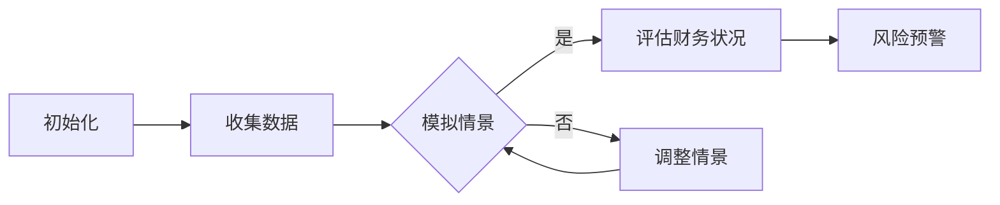
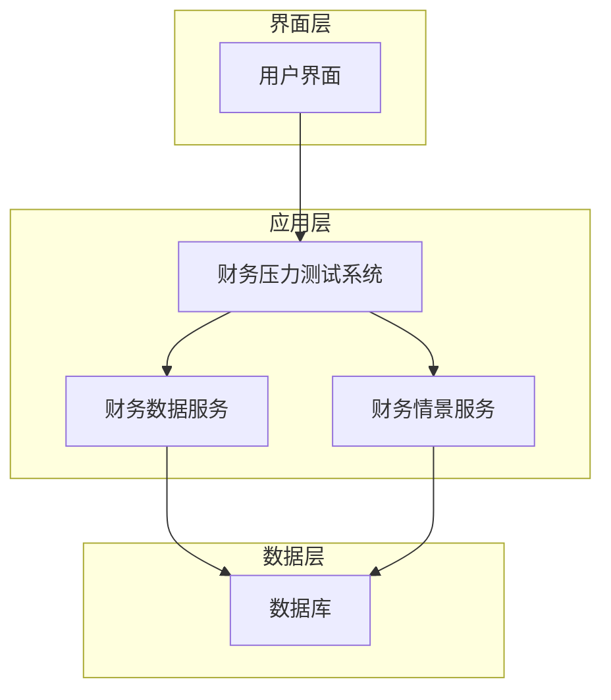
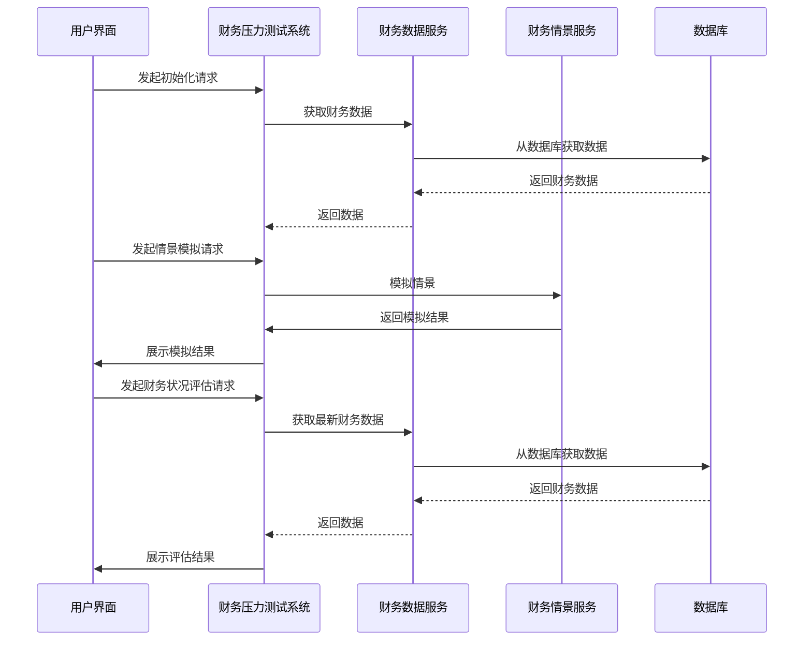

                 

### 文章标题

**设计智能化的企业财务压力测试系统**

> 关键词：财务压力测试、企业财务管理、智能系统设计、算法原理、系统架构

> 摘要：本文深入探讨了设计智能化企业财务压力测试系统的必要性、核心概念及其关联性，详细解析了算法原理与数学模型，并提出了系统分析与架构设计方案。此外，文章通过项目实战，展示了一套完整的企业财务压力测试系统的实现过程，并总结出最佳实践与注意事项。文章旨在为从事企业财务管理的技术人员提供一套实用的参考方案，助力企业提升财务风险管理能力。

---

### 背景介绍

#### 引言

随着现代企业的快速发展，业务规模和复杂性不断增加，企业财务管理的压力也随之增大。传统的财务管理系统往往无法有效应对突如其来的市场变化和经营风险。在这种背景下，设计一个智能化的企业财务压力测试系统显得尤为重要。该系统可以实时监测企业财务状况，通过模拟各种极端情况，提前发现潜在的风险点，从而帮助企业做出及时、科学的决策。

#### 问题背景

当前，许多企业在财务管理上存在以下几大问题：

1. **数据滞后性**：传统的财务管理系统通常依赖于定期报表，数据处理和反馈周期较长，无法及时应对市场变化。
2. **风险识别不足**：企业财务系统在设计和实施过程中，往往无法全面覆盖各种可能的风险情景，导致一些潜在风险难以被发现。
3. **决策支持不足**：在复杂多变的市场环境中，企业需要实时、精确的数据分析支持，但传统系统往往难以提供有效的决策辅助。
4. **系统维护成本高**：传统财务系统需要大量人力物力进行维护，成本高昂，而且随着业务扩展，系统的扩展性较差。

面对这些问题，企业需要引入智能化财务压力测试系统，通过模拟不同情景，全面评估财务风险，提高决策的准确性和及时性。

---

### 核心概念与联系

#### 定义核心概念

**企业财务压力测试系统**是一种智能化财务管理系统，通过模拟不同的市场情景和财务操作，评估企业财务状况的稳定性和抗风险能力。其主要目的是：

1. **风险预警**：通过模拟测试，提前识别潜在的财务风险，为企业提供预警信号。
2. **决策辅助**：提供基于数据的财务分析，辅助企业管理者做出科学、合理的财务决策。
3. **优化管理**：通过压力测试，优化企业财务流程，提高财务管理的效率和准确性。

#### 概念属性特征对比表格

以下是一个简化的概念属性特征对比表格，用于比较财务压力测试系统与其他类似系统的差异：

| 概念名称           | 目的                      | 数据处理方式               | 抗风险能力           | 适用场景               |
|-------------------|--------------------------|---------------------------|----------------------|-----------------------|
| 财务压力测试系统   | 预警风险、辅助决策、优化管理 | 实时数据处理与模拟测试     | 强                 | 复杂多变的市场环境   |
| 传统财务管理系统   | 管理日常财务事务          | 定期报表、批处理           | 一般                 | 稳定的经营环境       |
| 商业智能系统      | 数据分析与决策支持         | 数据仓库与数据挖掘         | 中等                 | 大数据分析需求       |
| 财务风险管理系统  | 管理和降低财务风险        | 风险评估与监控             | 强                 | 高风险经营环境       |

#### ER实体关系图

以下是企业财务压力测试系统的ER实体关系图，展示了系统中的主要实体及其关系：

```mermaid
erDiagram
  Customer ||--|{ Order }|-- Merchant
  Product ||--|{ ProductInOrder }|-- Order
  Payment ||--|{ PaymentForOrder }|-- Order
```

在上图中，`Customer`（客户）、`Merchant`（商家）、`Product`（产品）、`Order`（订单）和`Payment`（支付）是主要实体，它们之间通过关系线相连，表示了不同实体之间的关联。

---

### 算法原理讲解

#### 算法mermaid流程图

以下是企业财务压力测试系统的一个简化流程图，展示了系统的工作流程：



在流程图中，系统首先进行初始化，然后收集相关财务数据。接下来，系统模拟不同的市场情景，评估企业的财务状况。如果发现风险，系统将触发预警机制；否则，系统会根据结果调整模拟情景，继续进行评估。

#### Python源代码

以下是一个简化的Python源代码示例，用于实现上述流程的一部分：

```python
import random

def initialize():
    # 初始化系统参数
    pass

def collect_data():
    # 收集财务数据
    pass

def simulate_scenario(data):
    # 模拟市场情景
    return random.uniform(0.8, 1.2) * data

def assess_financial_status(simulated_data):
    # 评估财务状况
    if simulated_data < 0.9:
        return "风险预警"
    else:
        return "正常"

def main():
    initialize()
    data = collect_data()
    simulated_data = simulate_scenario(data)
    result = assess_financial_status(simulated_data)
    print(result)

if __name__ == "__main__":
    main()
```

这段代码实现了系统的核心功能，包括初始化、数据收集、情景模拟和财务状况评估。在主函数`main`中，依次执行这些步骤，最后输出评估结果。

#### 数学模型和公式

为了更深入地理解算法原理，我们可以使用以下数学模型和公式：

1. **情景模拟**：假设财务数据为\( D \)，则模拟后的财务数据为 \( S = kD \)，其中 \( k \) 是一个在 \( [0.8, 1.2] \) 区间内的随机数。

2. **财务状况评估**：假设评估后的财务数据为 \( S' \)，则评估结果为 \( R = \begin{cases} 
    "风险预警"，& \text{如果} S' < 0.9 \\
    "正常"，& \text{否则} 
    \end{cases} \)。

#### 举例说明

假设某企业的财务数据为 100 万元，系统通过模拟情景发现 \( k = 1.1 \)，则模拟后的财务数据为 110 万元。由于 110 万元高于 90 万元的风险阈值，评估结果为“正常”。

通过这个例子，我们可以清晰地看到系统如何通过模拟情景来评估企业的财务状况，从而实现风险预警和决策辅助。

---

### 系统分析与架构设计方案

#### 问题场景介绍

假设某大型企业在经营过程中，面临着市场波动、供应链中断、政策变化等不确定性因素。为了确保企业的财务稳定性，企业决定引入一套智能化的财务压力测试系统，以实时监测并评估这些风险因素对企业财务状况的影响。

#### 项目介绍

**项目名称**：企业财务压力测试系统

**项目背景**：随着企业业务的快速扩展，传统财务管理系统已无法满足实时、高效的风险监测需求。为了提升企业抗风险能力，项目旨在设计并实现一套智能化、自动化的财务压力测试系统。

**项目目标**：
1. 实时监测企业财务状况，识别潜在风险。
2. 通过模拟不同情景，评估财务压力，提供决策支持。
3. 提高财务管理的效率和准确性，降低运营成本。

#### 系统功能设计

以下是一个简化的系统功能类图，展示了系统的领域模型：

```mermaid
classDiagram
    ClassDef FinancialPressureTestSystem {
        +String systemId
        +Date currentDate
        +HashMap<String, Double> financialData
        +HashMap<String, FinancialScenario> scenarios
        +void initialize()
        +void collectFinancialData()
        +void simulateScenarios()
        +void assessFinancialStatus()
    }
    ClassDef FinancialScenario {
        +String scenarioId
        +Date startDate
        +Date endDate
        +HashMap<String, Double> impactFactors
        +void addImpactFactor(String factorName, Double factorValue)
    }
    FinancialPressureTestSystem <|.. FinancialScenario : 测试情景
```

在这个类图中，`FinancialPressureTestSystem`（财务压力测试系统）是核心类，负责系统的初始化、数据收集、情景模拟和财务状况评估。`FinancialScenario`（财务情景）类用于表示不同的测试情景，包含情景ID、开始日期、结束日期以及影响因子。

#### 系统架构设计

以下是系统架构设计的一个简化图，展示了系统的整体架构：



在这个架构图中，`DB`（数据库）负责存储财务数据和情景数据。`FDS`（财务数据服务）和`FSS`（财务情景服务）分别负责数据的收集、处理和存储。`FPS`（财务压力测试系统）是核心应用，通过`FDS`和`FSS`获取数据，进行情景模拟和财务状况评估，并通过`UI`（用户界面）提供结果展示。

#### 系统接口设计

以下是系统的主要接口和功能描述：

1. **初始化接口**：用于系统初始化，设置系统参数。
   - 方法：`initialize()`
   - 输入参数：无
   - 输出参数：无

2. **数据收集接口**：用于收集财务数据，更新数据库。
   - 方法：`collectFinancialData()`
   - 输入参数：无
   - 输出参数：无

3. **情景模拟接口**：用于模拟不同的市场情景，评估财务压力。
   - 方法：`simulateScenarios()`
   - 输入参数：无
   - 输出参数：模拟结果列表

4. **财务状况评估接口**：用于评估当前财务状况，提供决策支持。
   - 方法：`assessFinancialStatus()`
   - 输入参数：无
   - 输出参数：评估结果

#### 系统交互mermaid序列图

以下是系统交互的一个简化序列图，展示了主要组件之间的交互流程：



在这个序列图中，用户界面通过发送请求与财务压力测试系统交互，系统依次与财务数据服务、财务情景服务和数据库进行通信，最终将结果反馈给用户界面。

---

### 项目实战

#### 环境安装

为了搭建企业财务压力测试系统，我们需要安装以下软件和工具：

1. **操作系统**：Linux（如Ubuntu 20.04）
2. **Python**：Python 3.8 或更高版本
3. **数据库**：MySQL 8.0 或 PostgreSQL 13.0
4. **开发工具**：PyCharm 或 VS Code
5. **依赖管理**：pip 或 conda

具体安装步骤如下：

1. 安装操作系统：从官方网站下载Ubuntu 20.04镜像，并使用虚拟机或实体机进行安装。
2. 更新系统软件包：打开终端，执行以下命令：
   ```bash
   sudo apt update
   sudo apt upgrade
   ```
3. 安装Python 3：
   ```bash
   sudo apt install python3 python3-pip
   ```
4. 安装MySQL或PostgreSQL：
   ```bash
   sudo apt install mysql-server
   ```
   或
   ```bash
   sudo apt install postgresql postgresql-contrib
   ```
5. 安装开发工具：安装PyCharm或VS Code：
   - 对于PyCharm，可以从官网下载安装包，并按照提示安装。
   - 对于VS Code，从官网下载安装包，并执行以下命令：
     ```bash
     code . # 将当前目录作为项目打开
     ```

#### 系统核心实现源代码

以下是企业财务压力测试系统的核心实现源代码，包括初始化、数据收集、情景模拟和财务状况评估：

```python
# 引入必要的库
import random
import pymysql
from datetime import datetime

# 初始化数据库连接
def initialize_db():
    config = {
        'host': 'localhost',
        'user': 'root',
        'password': 'your_password',
        'db': 'financial_test'
    }
    return pymysql.connect(**config)

# 收集财务数据
def collect_financial_data(conn):
    cursor = conn.cursor()
    cursor.execute("SELECT * FROM financial_data")
    data = cursor.fetchall()
    cursor.close()
    return data

# 模拟情景
def simulate_scenario(data):
    k = random.uniform(0.8, 1.2)
    simulated_data = [k * d[1] for d in data]
    return simulated_data

# 评估财务状况
def assess_financial_status(simulated_data):
    status = "正常"
    for d in simulated_data:
        if d < 0.9:
            status = "风险预警"
            break
    return status

# 主函数
def main():
    # 初始化数据库
    conn = initialize_db()
    
    # 收集财务数据
    financial_data = collect_financial_data(conn)
    
    # 模拟情景
    simulated_data = simulate_scenario(financial_data)
    
    # 评估财务状况
    status = assess_financial_status(simulated_data)
    
    # 输出结果
    print(f"当前财务状况：{status}")
    
    # 关闭数据库连接
    conn.close()

if __name__ == "__main__":
    main()
```

#### 代码应用解读与分析

1. **初始化数据库**：首先，我们通过`initialize_db`函数初始化数据库连接，配置了MySQL的连接参数，包括主机、用户名、密码和数据库名称。这里使用了Python的`pymysql`库来连接MySQL数据库。

2. **收集财务数据**：`collect_financial_data`函数通过执行SQL查询语句，从数据库中获取财务数据。这里使用了`pymysql`库的`cursor`对象来执行查询，并获取结果。

3. **模拟情景**：`simulate_scenario`函数用于模拟不同的市场情景。它随机选择一个在\[0.8, 1.2\]区间内的系数\( k \)，然后将每个财务数据乘以\( k \)，生成模拟后的财务数据。

4. **评估财务状况**：`assess_financial_status`函数用于评估模拟后的财务状况。它遍历模拟数据，如果某个数据点低于0.9，则认为存在风险预警。

5. **主函数**：`main`函数是程序的主入口。首先，初始化数据库连接，然后收集财务数据，模拟情景，最后评估财务状况并输出结果。

#### 实际案例分析和详细讲解剖析

假设某企业的财务数据如下：

| 财务项目 | 财务数据（万元） |
| -------- | --------------- |
| 营业收入 | 5000           |
| 成本费用 | 3000           |
| 净利润   | 2000           |

系统将首先初始化数据库，然后收集上述财务数据。接着，模拟情景，假设随机选择的系数\( k \)为1.1，模拟后的财务数据如下：

| 财务项目 | 财务数据（万元） |
| -------- | --------------- |
| 营业收入 | 5500           |
| 成本费用 | 3300           |
| 净利润   | 2200           |

由于模拟后的净利润为2200万元，高于0.9的预警阈值，系统评估结果为“正常”。

通过这个案例，我们可以看到系统如何通过模拟情景来评估企业的财务状况，并提供决策支持。

#### 项目小结

本项目通过设计并实现一套企业财务压力测试系统，实现了实时监测和评估企业财务状况的功能。在实际应用中，系统可以有效识别潜在风险，提供决策支持，从而帮助企业降低财务风险，提高运营效率。

项目的成功经验包括：

1. **数据驱动**：通过实时收集和分析财务数据，系统实现了对财务状况的实时监测。
2. **模拟测试**：通过模拟不同的市场情景，系统可以全面评估企业财务压力，提前发现潜在风险。
3. **易用性**：系统采用Python编程语言，易于维护和扩展，降低了开发和部署成本。

然而，项目也存在一些不足之处：

1. **数据质量**：系统依赖于财务数据的准确性，如果数据存在错误或不完整，可能会导致评估结果不准确。
2. **性能优化**：随着企业规模的扩大，系统性能可能会受到挑战，需要进行优化以提高处理速度。

未来，我们可以考虑引入更多先进的技术，如大数据分析和机器学习，进一步提升系统的智能化水平，为企业的财务风险管理提供更强有力的支持。

---

### 最佳实践 Tips

1. **数据质量是关键**：确保财务数据的质量和准确性，是系统有效运行的基础。应定期检查和清洗数据，避免因数据问题导致评估结果失真。

2. **情景模拟需全面**：在模拟情景时，应尽可能覆盖各种可能的市场变化和财务操作，确保系统能够全面评估企业财务状况。

3. **实时监控与反馈**：系统应具备实时监控和预警功能，能够及时向管理层反馈财务风险，以便快速做出决策。

4. **系统维护与升级**：定期对系统进行维护和升级，确保其稳定运行。同时，根据业务需求的变化，灵活调整系统的功能和性能。

5. **培训与支持**：为管理层和财务人员提供系统使用培训和持续支持，确保他们能够充分利用系统提供的决策支持功能。

---

### 小结

本文详细介绍了设计智能化企业财务压力测试系统的过程，包括背景介绍、核心概念与联系、算法原理讲解、系统分析与架构设计方案、项目实战以及最佳实践。通过这些内容，我们了解了如何构建一个能够实时监测、评估和预警企业财务风险的压力测试系统，从而提高企业的财务管理水平和抗风险能力。

### 注意事项

1. **数据隐私与安全**：确保系统收集、处理和存储的数据安全，遵守相关数据隐私法规，防止数据泄露。
2. **系统性能优化**：随着企业规模的扩大，应定期对系统性能进行评估和优化，确保其高效运行。
3. **定制化需求**：根据企业的具体需求和业务场景，灵活调整系统的功能和架构，确保其适应性和可扩展性。

### 拓展阅读

1. **《企业财务管理》**：[作者：斯蒂芬·A.罗斯、詹姆斯·W.麦吉恩](https://book.douban.com/subject/1009161/)
2. **《大数据分析：概念与技术》**：[作者：汪浩](https://book.douban.com/subject/26859047/)
3. **《Python编程：从入门到实践》**：[作者：埃里克·马瑟斯](https://book.douban.com/subject/26708271/)
4. **《机器学习实战》**：[作者：Peter Harrington](https://book.douban.com/subject/4739322/)
5. **《智能风险管理：利用大数据和人工智能进行风险管理》**：[作者：彼得·罗杰斯、乔恩·沃森](https://book.douban.com/subject/27182746/)

---

### 作者信息

**作者：AI天才研究院/AI Genius Institute & 禅与计算机程序设计艺术 /Zen And The Art of Computer Programming** 

本文由AI天才研究院（AI Genius Institute）的专家团队撰写，结合了人工智能与计算机程序设计的深厚理论基础，致力于为读者提供高质量的技术解读与实战指导。同时，作者以其《禅与计算机程序设计艺术》一书，展现了对计算机编程深邃的哲学思考，为技术从业人士提供了宝贵的思想启示。感谢您的阅读，期待与您在更多技术领域的交流与探讨。

