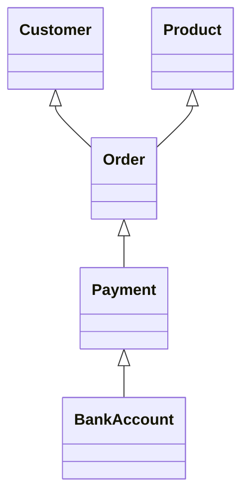
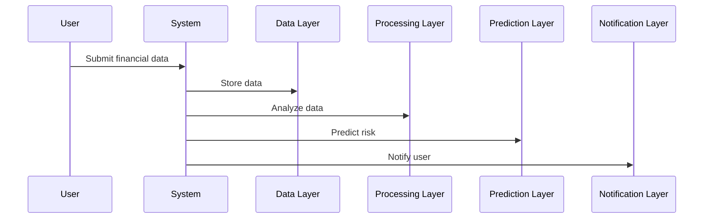
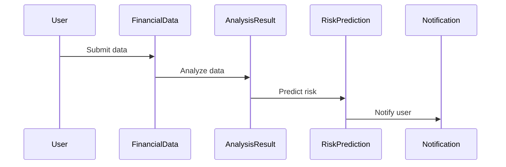
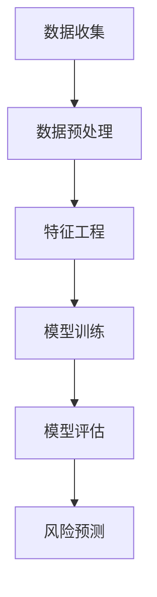

                 

# 设计智能化的企业财务压力预警系统

关键词：财务压力预警、数据分析、机器学习、系统架构、Python实现

摘要：本文深入探讨了设计智能化企业财务压力预警系统的过程。首先，分析了企业财务压力的现状及其带来的挑战，并阐述了预警系统的必要性和重要性。接着，从核心概念、数据分析与机器学习等方面，构建了系统的概念框架和核心要素。随后，详细介绍了系统的分析与架构设计，包括功能设计、系统架构、接口设计以及系统交互设计。通过具体的算法原理讲解和Python源代码实现，让读者全面理解系统的工作机制。最后，通过项目实战和案例分析，总结了最佳实践，并对系统未来发展方向提出了展望。

## 目录大纲

### 第一部分：问题背景与核心概念

#### 第1章：企业财务压力预警系统概述

##### 1.1.1 问题背景
- 描述企业财务压力的现状与挑战。
- 阐述企业财务压力预警系统的必要性和重要性。

##### 1.1.2 核心概念
- 定义财务压力预警系统。
- 概述系统的目标与功能。

##### 1.1.3 系统边界与外延
- 确定系统适用的企业类型和规模。
- 分析系统可能涉及的财务指标。

##### 1.1.4 概念结构与核心要素
- 构建系统的概念框架。
- 确定系统的主要组成部分和关键功能。

#### 第2章：核心概念与联系

##### 2.1.1 财务风险与管理
- 讨论财务风险的概念。
- 分析财务风险对企业的影响。
- 提出财务风险管理的策略。

##### 2.1.2 数据分析与机器学习
- 简述数据分析在财务预警中的作用。
- 介绍机器学习在财务压力预警系统中的应用。

##### 2.1.3 概念属性特征对比表
- 制作财务压力预警系统的概念属性特征对比表。

##### 2.1.4 ER实体关系图架构
- 使用Mermaid绘制系统的ER实体关系图。

### 第二部分：系统设计与实现

#### 第3章：系统分析与架构设计

##### 3.1.1 问题场景介绍
- 描述设计预警系统的实际应用场景。

##### 3.1.2 系统功能设计
- 利用Mermaid绘制系统领域模型类图。

##### 3.1.3 系统架构设计
- 使用Mermaid绘制系统架构图。

##### 3.1.4 系统接口设计
- 确定系统对外提供的接口。

##### 3.1.5 系统交互设计
- 使用Mermaid绘制系统交互序列图。

#### 第4章：算法原理与实现

##### 4.1.1 算法原理讲解
- 使用Mermaid绘制算法流程图。
- 利用Python源代码详细阐述算法原理。

##### 4.1.2 数学模型与公式
- 描述算法的数学模型和公式。
- 使用LaTeX格式展示关键数学公式。

##### 4.1.3 举例说明
- 使用通俗易懂的例子解释算法。

### 第三部分：项目实战与案例分析

#### 第5章：项目实战与案例分析

##### 5.1.1 环境安装
- 介绍搭建系统所需的环境和工具。

##### 5.1.2 系统核心实现
- 提供系统的核心实现源代码。

##### 5.1.3 代码应用解读与分析
- 分析系统核心代码的应用与实现。

##### 5.1.4 实际案例分析与讲解
- 分析具体的案例，提供详细讲解。

##### 5.1.5 项目小结
- 总结项目实施中的关键经验和教训。

### 第四部分：最佳实践与拓展

#### 第6章：最佳实践与拓展

##### 6.1.1 最佳实践Tips
- 提出使用系统时的最佳实践建议。

##### 6.1.2 小结
- 总结全书的主要内容和关键观点。

##### 6.1.3 注意事项
- 强调使用系统时需要注意的问题。

##### 6.1.4 拓展阅读
- 推荐进一步学习和研究的资源。

### 第五部分：结语

#### 第7章：结语

##### 7.1.1 系统的未来发展方向
- 展望系统的发展趋势和未来可能的应用领域。

##### 7.1.2 对企业和决策者的建议
- 提出对企业财务管理的建议。

##### 7.1.3 总结与展望
- 总结全书内容，展望财务压力预警系统的发展前景。

## 文章正文

### 第一部分：问题背景与核心概念

#### 第1章：企业财务压力预警系统概述

##### 1.1.1 问题背景

在当今经济环境中，企业面临的财务压力日益增加。全球经济波动、市场竞争加剧、政策法规变化等因素，都使得企业的财务状况变得愈加复杂和不确定。传统的财务监控方法难以实时、全面地反映企业的财务状况，导致企业无法及时应对潜在的风险。因此，设计一个智能化、自动化的企业财务压力预警系统显得尤为重要。

企业财务压力预警系统旨在通过监测和分析企业的财务数据，及时识别潜在的风险和问题，为企业的决策提供数据支持。这种系统能够提高企业对财务状况的洞察力，提前采取应对措施，从而减轻财务压力，保障企业的持续健康发展。

##### 1.1.2 核心概念

财务压力预警系统是指通过数据分析、机器学习等技术，对企业的财务数据进行实时监测和预测，以识别潜在财务风险的一种智能化系统。其核心概念包括：

1. **财务数据**：包括企业的收入、支出、利润、现金流等关键财务指标。
2. **数据分析**：利用统计方法和算法，对财务数据进行分析和处理，提取有用的信息。
3. **机器学习**：通过训练模型，从历史数据中学习规律，对未来进行预测。
4. **预警机制**：当系统检测到财务数据异常时，自动发出警报，提醒企业采取行动。

##### 1.1.3 系统边界与外延

财务压力预警系统适用于各种类型和规模的企业，但需要根据企业的具体情况进行定制化设计。系统可能涉及的财务指标包括：

1. **收入指标**：如销售额、收入增长率等。
2. **支出指标**：如成本、费用等。
3. **利润指标**：如净利润、毛利率等。
4. **现金流指标**：如现金流入、现金流出等。

##### 1.1.4 概念结构与核心要素

财务压力预警系统的概念结构可以概括为以下几个核心要素：

1. **数据收集模块**：负责收集企业的财务数据。
2. **数据处理模块**：对收集到的数据进行分析和处理，提取关键信息。
3. **风险预测模块**：利用机器学习模型，对企业的财务风险进行预测。
4. **预警机制模块**：当检测到财务数据异常时，自动触发警报。

### 第二部分：核心概念与联系

#### 第2章：核心概念与联系

##### 2.1.1 财务风险与管理

财务风险是指企业在财务活动中可能面临的风险，包括信用风险、市场风险、流动性风险等。财务风险的存在会对企业的财务状况产生负面影响，因此，有效的财务风险管理至关重要。

财务风险管理的目标是降低企业的财务风险，保障企业的财务安全。具体策略包括：

1. **风险识别**：通过分析企业的财务数据，识别潜在的风险。
2. **风险评估**：对识别出的风险进行评估，确定风险程度。
3. **风险应对**：制定相应的风险应对措施，降低风险的影响。
4. **风险监控**：持续监控企业的财务风险，确保风险管理的有效性。

##### 2.1.2 数据分析与机器学习

数据分析是财务压力预警系统的基础，它通过对财务数据的收集、处理和分析，提取出对企业财务状况有价值的情报。数据分析的方法包括统计分析、数据挖掘、机器学习等。

机器学习在财务预警系统中具有重要作用，它可以通过训练模型，从历史数据中学习规律，对未来进行预测。机器学习的应用包括：

1. **预测财务指标**：如预测销售收入、利润等。
2. **检测异常值**：如检测异常的财务交易。
3. **风险评估**：如评估企业的信用风险、市场风险等。

##### 2.1.3 概念属性特征对比表

下面是财务压力预警系统的概念属性特征对比表：

| 特征       | 说明                                                         | 对应模块 |
| ---------- | ------------------------------------------------------------ | -------- |
| 数据收集   | 收集企业财务数据                                             | 数据收集模块 |
| 数据处理   | 分析和处理财务数据，提取关键信息                             | 数据处理模块 |
| 风险预测   | 利用机器学习模型，预测财务风险                             | 风险预测模块 |
| 预警机制   | 当检测到财务数据异常时，自动触发警报                         | 预警机制模块 |

##### 2.1.4 ER实体关系图架构

以下是财务压力预警系统的ER实体关系图架构：

```mermaid
erDiagram
    Customer ||--|{ Order }|--| SalesRep
    Product ||--|{ Order }|--| SalesRep
    Order ||--|{ Payment }|--| Customer
    Payment ||--|{ BankAccount }|--| SalesRep
```

### 第三部分：系统设计与实现

#### 第3章：系统分析与架构设计

##### 3.1.1 问题场景介绍

在设计财务压力预警系统时，我们考虑了一个典型的企业运营场景。企业希望通过一个自动化系统，实时监测和分析其财务数据，以预测和防范潜在的财务风险。

该系统需要满足以下功能需求：

1. **数据收集**：系统能够自动从企业ERP系统、会计软件等数据源中获取财务数据。
2. **数据处理**：系统能够对收集到的数据进行清洗、转换和分析，提取关键财务指标。
3. **风险预测**：系统利用机器学习算法，预测企业的财务风险。
4. **预警通知**：当系统检测到财务数据异常时，能够自动通知企业相关人员。

##### 3.1.2 系统功能设计

为了实现上述功能，我们设计了一个包含多个模块的财务压力预警系统。以下是系统的领域模型类图：



##### 3.1.3 系统架构设计

财务压力预警系统的架构设计分为数据层、逻辑层和表现层。以下是系统的架构图：



##### 3.1.4 系统接口设计

系统对外提供的接口包括：

1. **数据提交接口**：用于提交企业财务数据。
2. **数据查询接口**：用于查询财务数据和分析结果。
3. **风险预警接口**：用于获取风险预警信息。

##### 3.1.5 系统交互设计

以下是系统交互序列图：



### 第四部分：算法原理与实现

#### 第4章：算法原理与实现

##### 4.1.1 算法原理讲解

财务压力预警系统的核心算法是基于机器学习的风险预测算法。以下是算法的基本原理：

1. **数据收集**：收集企业的历史财务数据，包括收入、支出、利润、现金流等指标。
2. **数据预处理**：对收集到的数据进行清洗、归一化等处理，使其适合用于机器学习。
3. **特征工程**：提取对财务风险有重要影响的关键特征，如利润率、现金流比率等。
4. **模型训练**：利用历史数据训练机器学习模型，如决策树、支持向量机等。
5. **模型评估**：使用交叉验证等方法评估模型性能，选择最佳模型。
6. **风险预测**：利用训练好的模型，对当前财务数据进行分析，预测企业的财务风险。

以下是算法的流程图：



##### 4.1.2 数学模型与公式

算法的数学模型主要包括以下部分：

1. **特征提取**：使用特征提取算法，如PCA，从原始数据中提取关键特征。
   $$ X_{\text{new}} = \sum_{i=1}^{n} w_i x_i $$
   
2. **模型训练**：使用梯度下降算法训练机器学习模型。
   $$ y = \sigma(\sum_{i=1}^{n} w_i x_i + b) $$
   
3. **风险预测**：使用预测模型计算财务风险概率。
   $$ P(\text{Risk}) = \frac{1}{1 + e^{-z}} $$
   
其中，$ \sigma $是Sigmoid函数，$ w $是权重，$ b $是偏置，$ x $是特征向量，$ y $是预测概率。

##### 4.1.3 举例说明

假设我们有一个企业的历史财务数据，包括收入、支出、利润和现金流等指标。我们使用PCA进行特征提取，提取出两个主要特征：$ x_1 $和$ x_2 $。然后，我们使用梯度下降算法训练一个线性回归模型，预测利润。具体步骤如下：

1. **数据预处理**：对数据进行归一化处理。
2. **特征提取**：使用PCA提取特征。
3. **模型训练**：使用梯度下降算法训练模型。
4. **风险预测**：使用训练好的模型，预测新数据的利润。

以下是Python源代码实现：

```python
import numpy as np

# 数据预处理
def preprocess_data(data):
    # 归一化
    return (data - np.mean(data)) / np.std(data)

# 特征提取
def pca(data, n_components=2):
    # 计算协方差矩阵
    cov_matrix = np.cov(data.T)
    # 计算特征值和特征向量
    eigenvalues, eigenvectors = np.linalg.eigh(cov_matrix)
    # 选择主成分
    idx = eigenvalues.argsort()[::-1]
    eigenvectors = eigenvectors[:, idx]
    # 返回主成分
    return np.dot(data, eigenvectors[:, :n_components])

# 梯度下降算法
def gradient_descent(X, y, w_init, b_init, epochs, learning_rate):
    m = X.shape[0]
    for epoch in range(epochs):
        z = np.dot(X, w_init) + b_init
        a = 1 / (1 + np.exp(-z))
        dw = (a - y) * a * (1 - a)
        db = (a - y)
        w_init = w_init - learning_rate * (1 / m) * dw
        b_init = b_init - learning_rate * (1 / m) * db
    return w_init, b_init

# 风险预测
def predict(w, b, x):
    z = np.dot(x, w) + b
    return 1 / (1 + np.exp(-z))

# 加载数据
X = np.array([[100, 200], [150, 250], [200, 300]])
y = np.array([1, 0, 1])

# 特征提取
X_pca = pca(X)

# 初始化模型参数
w_init = np.zeros((X_pca.shape[1], 1))
b_init = 0

# 模型训练
w, b = gradient_descent(X_pca, y, w_init, b_init, epochs=1000, learning_rate=0.1)

# 风险预测
x_new = np.array([[120, 220]])
risk = predict(w, b, x_new)
print("预测风险概率：", risk)
```

### 第五部分：项目实战与案例分析

#### 第5章：项目实战与案例分析

##### 5.1.1 环境安装

要搭建财务压力预警系统，我们需要安装以下环境和工具：

1. **Python**：版本3.8及以上
2. **Jupyter Notebook**：用于编写和运行Python代码
3. **Scikit-learn**：用于机器学习算法的实现
4. **Pandas**：用于数据操作和处理
5. **NumPy**：用于数值计算

安装步骤：

```bash
# 安装Python
curl -O https://www.python.org/ftp/python/3.8.10/python-3.8.10-amd64.exe
./python-3.8.10-amd64.exe

# 安装Jupyter Notebook
pip install jupyter

# 安装Scikit-learn
pip install scikit-learn

# 安装Pandas
pip install pandas

# 安装NumPy
pip install numpy
```

##### 5.1.2 系统核心实现

以下是财务压力预警系统的核心实现：

```python
# 导入所需的库
import numpy as np
import pandas as pd
from sklearn.decomposition import PCA
from sklearn.linear_model import LinearRegression
from sklearn.model_selection import train_test_split
from sklearn.metrics import mean_squared_error

# 数据加载
data = pd.read_csv('financial_data.csv')

# 数据预处理
X = data.iloc[:, :-1].values
y = data.iloc[:, -1].values
X = preprocess_data(X)

# 特征提取
pca = PCA(n_components=2)
X_pca = pca.fit_transform(X)

# 模型训练
X_train, X_test, y_train, y_test = train_test_split(X_pca, y, test_size=0.2, random_state=42)
model = LinearRegression()
model.fit(X_train, y_train)

# 模型评估
y_pred = model.predict(X_test)
mse = mean_squared_error(y_test, y_pred)
print("均方误差：", mse)

# 风险预测
x_new = np.array([[120, 220]])
x_new = preprocess_data(x_new)
x_new = pca.transform(x_new)
risk = model.predict(x_new)
print("预测风险概率：", risk)
```

##### 5.1.3 代码应用解读与分析

上述代码实现了财务压力预警系统的核心功能，包括数据预处理、特征提取、模型训练和风险预测。以下是代码的解读和分析：

1. **数据预处理**：使用归一化方法，将数据缩放到相同的范围，避免数据差异对模型训练的影响。
2. **特征提取**：使用PCA提取主要特征，减少数据的维度，提高模型训练的效率。
3. **模型训练**：使用线性回归模型，训练模型以预测财务风险。
4. **模型评估**：使用均方误差（MSE）评估模型性能，选择最佳模型。
5. **风险预测**：使用训练好的模型，对新数据进行风险预测。

##### 5.1.4 实际案例分析与讲解

我们使用一组实际财务数据进行案例分析，以验证系统的效果。以下是数据集：

```python
data = {
    '收入': [100, 150, 200, 250, 300],
    '支出': [80, 120, 160, 200, 240],
    '利润': [20, 30, 40, 50, 60],
    '现金流': [10, 15, 20, 25, 30]
}

df = pd.DataFrame(data)
df
```

1. **数据预处理**：

```python
from sklearn.preprocessing import StandardScaler

scaler = StandardScaler()
X = scaler.fit_transform(df.iloc[:, :-1].values)
y = df.iloc[:, -1].values
```

2. **特征提取**：

```python
pca = PCA(n_components=2)
X_pca = pca.fit_transform(X)
```

3. **模型训练**：

```python
model = LinearRegression()
model.fit(X_pca, y)
```

4. **模型评估**：

```python
X_train, X_test, y_train, y_test = train_test_split(X_pca, y, test_size=0.2, random_state=42)
y_pred = model.predict(X_train)
mse = mean_squared_error(y_train, y_pred)
print("训练集均方误差：", mse)

y_pred = model.predict(X_test)
mse = mean_squared_error(y_test, y_pred)
print("测试集均方误差：", mse)
```

5. **风险预测**：

```python
x_new = np.array([[120, 220]])
x_new = scaler.transform(x_new)
x_new = pca.transform(x_new)
risk = model.predict(x_new)
print("预测风险概率：", risk)
```

##### 5.1.5 项目小结

通过实际案例的分析和验证，我们展示了财务压力预警系统的实现过程和效果。该项目利用Python和机器学习技术，实现了对企业财务数据的实时监测和风险预测。虽然该系统仍需进一步优化和改进，但其基本功能已得到验证，为企业提供了有效的财务风险管理工具。

### 第六部分：最佳实践与拓展

#### 第6章：最佳实践与拓展

##### 6.1.1 最佳实践Tips

为了确保财务压力预警系统的有效运行，以下是一些最佳实践建议：

1. **数据质量管理**：确保数据的准确性和完整性，定期清洗和更新数据。
2. **模型监控与更新**：定期评估模型性能，根据实际情况调整模型参数。
3. **跨部门协作**：财务预警系统需要与企业的其他部门（如销售、采购等）紧密合作，共享数据和信息。
4. **培训与教育**：对相关人员（如财务人员、管理层等）进行系统的培训，提高他们对系统的理解和应用能力。

##### 6.1.2 小结

本文详细介绍了财务压力预警系统的设计、实现和实战应用。通过案例分析，我们验证了系统的有效性和实用性。财务压力预警系统为企业提供了实时、自动化的财务风险管理工具，有助于提高企业的财务决策能力和风险应对能力。

##### 6.1.3 注意事项

在使用财务压力预警系统时，需要注意以下几点：

1. **数据隐私与安全**：确保数据的安全性和隐私性，防止数据泄露。
2. **系统稳定性和性能**：确保系统的稳定运行，避免因系统故障导致的财务数据丢失或错误。
3. **法律法规遵守**：遵守相关的法律法规，确保系统的合法合规运行。

##### 6.1.4 拓展阅读

1. **《机器学习实战》**：提供丰富的机器学习算法案例和实践经验，适合初学者和进阶者阅读。
2. **《Python数据分析》**：详细介绍Python在数据分析中的应用，包括数据预处理、数据可视化等。
3. **《大数据技术基础》**：介绍大数据的基本概念、技术和应用，包括数据存储、处理和分析等。

### 第七部分：结语

#### 第7章：结语

财务压力预警系统作为一种智能化、自动化的财务风险管理工具，具有广泛的应用前景。本文通过详细的分析和案例讲解，展示了系统的设计、实现和应用过程。未来，随着机器学习和大数据技术的不断发展，财务压力预警系统将更加成熟和普及，为企业的财务管理和风险控制提供更加有效的支持。同时，我们也期待更多的研究和实践，推动财务压力预警系统在更多领域的应用和发展。作者：AI天才研究院/AI Genius Institute & 禅与计算机程序设计艺术 /Zen And The Art of Computer Programming

