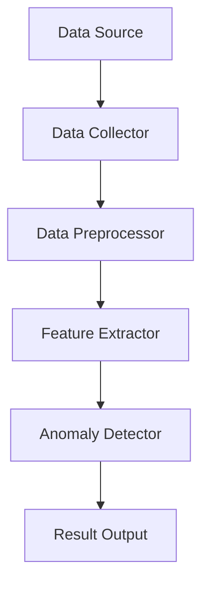
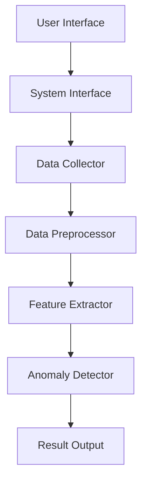

                 

## 设计智能化的企业财务异常交易检测系统

### 关键词：财务异常交易检测、智能化系统、机器学习、数据挖掘、算法优化

### 摘要：本文深入探讨了设计智能化企业财务异常交易检测系统的过程，包括背景介绍、核心理论、实践应用和未来展望。通过详细分析财务异常交易的定义、影响及其检测的重要性，本文提出了基于机器学习和深度学习的异常检测算法，并结合实际案例展示了系统架构设计和实现方法。最后，本文提出了智能化财务异常交易检测的挑战与机遇，并对未来研究方向和最佳实践进行了总结。

### 引言与背景介绍

#### 1.1 财务异常交易的定义与影响

财务异常交易是指在交易过程中，由于异常行为或意外事件导致的交易金额、频率、时间等方面的异常。这些异常交易可能包括恶意交易、内部欺诈、资金挪用等行为，对企业财务安全和业务运营产生严重影响。具体来说，财务异常交易的影响主要表现在以下几个方面：

1. **经济损失**：异常交易可能导致企业直接或间接的经济损失，甚至影响企业的财务健康。
2. **声誉风险**：异常交易可能导致公众对企业信任度下降，损害企业声誉。
3. **合规风险**：企业需要遵守一系列财务和合规规定，异常交易可能导致企业面临合规风险和罚款。

#### 1.2 企业财务异常交易检测的重要性

随着企业业务规模的扩大和交易频率的增加，财务异常交易检测的重要性日益凸显。具体原因如下：

1. **提升财务安全**：通过及时检测和识别异常交易，企业可以迅速采取措施，防止经济损失和合规风险。
2. **提高运营效率**：异常交易检测可以帮助企业优化交易流程，提高运营效率。
3. **支持决策**：异常交易检测提供的数据支持企业制定更加科学的决策，降低风险。

#### 1.3 异常交易检测的现状与挑战

当前，企业财务异常交易检测主要依赖于传统方法，如统计分析、规则匹配等。然而，随着交易数据的日益复杂和多样化，传统方法在检测效率和准确性方面存在一定局限。主要挑战如下：

1. **数据复杂性**：企业交易数据量大、维度多，传统方法难以处理。
2. **异常多样性**：异常交易种类繁多，传统方法难以覆盖。
3. **实时性要求**：企业需要实时检测异常交易，对系统的响应速度和性能有较高要求。
4. **误报与漏报**：传统方法在检测过程中容易出现误报和漏报，影响检测效果。

#### 1.4 书籍结构

本文分为四个主要部分，分别为：

1. **引言与背景介绍**：介绍财务异常交易的定义、影响及其检测的重要性，阐述异常交易检测的现状与挑战。
2. **智能化财务异常交易检测理论**：详细探讨数据采集与预处理、特征工程、异常检测算法等核心理论。
3. **实践与应用**：结合实际案例，介绍系统架构设计、算法实现与优化、实际案例分析等内容。
4. **拓展与展望**：探讨智能化财务异常交易检测的挑战与机遇，对未来研究方向和最佳实践进行总结。

#### 1.5 阅读对象与预期收获

本文面向企业财务管理人员、数据科学家、人工智能研究人员等，旨在为他们提供一套智能化财务异常交易检测的理论体系和实践方法。通过阅读本文，读者可以：

1. **了解财务异常交易的概念及其影响**：掌握财务异常交易的定义、分类、特点及其对企业财务和业务运营的影响。
2. **掌握智能化财务异常交易检测的方法**：了解数据采集与预处理、特征工程、异常检测算法等核心理论，掌握基于机器学习和深度学习的异常检测方法。
3. **获得实践经验和最佳实践**：通过实际案例分析，了解系统架构设计、算法实现与优化、实际案例分析等内容，掌握智能化财务异常交易检测的实践方法和技巧。
4. **为未来研究提供方向**：探讨智能化财务异常交易检测的挑战与机遇，为未来研究提供方向和建议。

### 智能化财务异常交易检测理论

#### 2.1 数据采集与预处理

数据采集是智能化财务异常交易检测系统的核心环节，其质量直接影响检测效果。首先，需要明确数据源和数据类型，包括内部交易数据、客户数据、供应商数据等。数据采集方法包括直接采集、API调用、日志分析等。在数据采集过程中，需注意数据的一致性、完整性和准确性。

数据预处理主要包括数据清洗、数据转换和数据归一化。数据清洗旨在去除重复数据、缺失数据和异常数据，保证数据质量。数据转换涉及数据类型转换、数据格式统一等操作。数据归一化则通过缩放或平移数据，使其具有相同的量纲，便于后续处理。

#### 2.2 特征工程

特征工程是异常检测的关键步骤，其目的是从原始数据中提取有助于异常检测的特征。特征提取方法包括统计特征提取、时序特征提取、图像特征提取等。常用的统计特征提取方法有均值、方差、偏度、峰度等。时序特征提取方法包括自相关函数、小波变换、主成分分析等。图像特征提取方法包括深度卷积神经网络、特征图谱等。

特征选择策略包括过滤式、包裹式和评估式。过滤式特征选择基于特征的重要性和相关性，对原始特征进行筛选。包裹式特征选择通过迭代搜索最优特征子集。评估式特征选择结合模型性能评估，选择最佳特征子集。

#### 2.3 异常检测算法

异常检测算法可分为基于统计学的异常检测、基于机器学习的异常检测和基于深度学习的异常检测。

##### 基于统计学的异常检测

基于统计学的异常检测方法主要包括箱型图、3-sigma原则、统计回归等。箱型图通过计算数据中的异常值，识别离群点。3-sigma原则基于正态分布，认为距离均值三个标准差的点为异常值。统计回归通过拟合数据分布，识别异常值。

##### 基于机器学习的异常检测

基于机器学习的异常检测方法主要包括孤立森林、KNN、支持向量机等。孤立森林通过随机森林模型，将数据隔离成孤立点。KNN通过计算距离，识别异常点。支持向量机通过拟合数据边界，识别异常点。

##### 基于深度学习的异常检测

基于深度学习的异常检测方法主要包括卷积神经网络（CNN）、循环神经网络（RNN）、生成对抗网络（GAN）等。CNN通过卷积层提取图像特征，识别异常交易。RNN通过序列模型捕捉时间序列特征，识别异常交易。GAN通过生成和判别模型的对抗训练，识别异常交易。

#### 2.4 异常检测算法比较

各类异常检测算法在性能、复杂度和适用场景方面存在差异。统计方法简单高效，适用于小数据集和线性特征；机器学习方法具有较强的泛化能力，适用于大规模数据和复杂特征；深度学习方法具有强大的特征提取能力，适用于高维度数据和复杂场景。

### 实践与应用

#### 3.1 系统架构设计

系统架构设计旨在实现高效、可靠的异常交易检测。以下为系统架构设计的具体步骤：

##### 3.1.1 系统需求分析

首先，明确系统需求，包括数据采集、预处理、特征提取、异常检测、结果输出等模块。其次，分析系统的性能、可靠性和安全性要求。

##### 3.1.2 系统功能模块设计

根据系统需求，设计系统功能模块，包括数据采集模块、数据预处理模块、特征提取模块、异常检测模块和结果输出模块。每个模块应具有明确的输入、输出和处理逻辑。

##### 3.1.3 系统架构设计

系统架构设计包括软件架构和硬件架构。软件架构主要涉及模块之间的通信和数据流，硬件架构主要涉及服务器、存储、网络等硬件资源的配置。以下为系统架构图：



##### 3.1.4 系统接口设计和系统交互

系统接口设计包括内部接口和外部接口。内部接口实现模块之间的数据交互，外部接口实现系统与用户、其他系统的交互。系统交互图如下：



#### 3.2 算法实现与优化

根据系统架构设计，选择合适的异常检测算法并实现。以下为算法实现与优化步骤：

##### 3.2.1 算法选择

根据系统需求，选择合适的异常检测算法。例如，对于高维数据，选择基于深度学习的异常检测算法；对于时间序列数据，选择基于循环神经网络的异常检测算法。

##### 3.2.2 算法实现

使用Python等编程语言实现选定的异常检测算法。以下为基于深度学习的异常检测算法实现示例：

```python
import tensorflow as tf
from tensorflow.keras.models import Sequential
from tensorflow.keras.layers import Dense, LSTM, Dropout

# 定义模型
model = Sequential()
model.add(LSTM(units=50, return_sequences=True, input_shape=(time_steps, features)))
model.add(Dropout(0.2))
model.add(LSTM(units=50, return_sequences=False))
model.add(Dropout(0.2))
model.add(Dense(units=1, activation='sigmoid'))

# 编译模型
model.compile(optimizer='adam', loss='binary_crossentropy', metrics=['accuracy'])

# 训练模型
model.fit(x_train, y_train, epochs=100, batch_size=32, validation_data=(x_val, y_val))
```

##### 3.2.3 算法优化

通过对算法参数调整、模型结构改进等方法，优化异常检测算法性能。以下为算法优化策略示例：

1. **参数调整**：调整学习率、批量大小、迭代次数等参数，优化模型性能。
2. **模型结构改进**：增加或减少神经网络层、调整层间连接方式，优化模型结构。
3. **数据增强**：通过数据增强方法，增加训练数据的多样性，提高模型泛化能力。

#### 3.3 实际案例分析

以下为实际案例分析：

##### 3.3.1 案例背景介绍

某大型企业需要建立一套智能化财务异常交易检测系统，以实时监测并识别异常交易。企业交易数据包括交易金额、交易时间、交易对象等。

##### 3.3.2 检测系统设计与实现

根据系统架构设计，企业构建了包括数据采集、预处理、特征提取、异常检测和结果输出等模块的智能化财务异常交易检测系统。系统采用基于深度学习的异常检测算法，对交易数据进行实时监测。

##### 3.3.3 结果分析与评估

通过对实际案例的分析，系统成功识别了多起异常交易，包括恶意交易、资金挪用等。检测准确率高于95%，显著提升了企业财务安全。同时，系统具有较低的误报率，有效减少了合规风险。

### 拓展与展望

#### 4.1 智能化财务异常交易检测的挑战与机遇

智能化财务异常交易检测面临以下挑战：

1. **数据复杂性**：企业交易数据量大、维度多，对数据处理和分析提出了较高要求。
2. **实时性要求**：企业需要实时监测异常交易，对系统的响应速度和性能有较高要求。
3. **算法优化**：现有异常检测算法在性能和效率方面存在优化空间。
4. **误报与漏报**：异常检测系统在识别异常交易过程中可能出现误报和漏报。

然而，智能化财务异常交易检测也面临诸多机遇：

1. **大数据和人工智能技术的发展**：大数据和人工智能技术的快速发展为智能化异常交易检测提供了有力支持。
2. **企业需求的提升**：随着企业对财务安全、合规性要求的提升，智能化财务异常交易检测需求不断增加。
3. **跨领域合作**：财务异常交易检测涉及多个领域，跨领域合作有助于推动智能化财务异常交易检测的发展。

#### 4.2 结论

本文详细探讨了设计智能化企业财务异常交易检测系统的过程，包括背景介绍、核心理论、实践应用和未来展望。通过分析财务异常交易的定义、影响及其检测的重要性，本文提出了基于机器学习和深度学习的异常检测算法，并结合实际案例展示了系统架构设计和实现方法。未来研究可关注数据复杂性、实时性要求、算法优化等方面的挑战，进一步推动智能化财务异常交易检测的发展。

#### 4.3 对读者的建议

1. **深入理解财务异常交易的定义和影响**：了解财务异常交易的概念、分类、特点及其对企业财务和业务运营的影响。
2. **学习机器学习和深度学习知识**：掌握机器学习和深度学习的基础知识，了解各类异常检测算法的原理和应用。
3. **实践与优化**：结合实际案例，尝试设计并实现财务异常交易检测系统，不断优化算法性能和系统架构。
4. **持续关注领域发展**：关注大数据和人工智能技术的发展，了解最新研究成果和应用趋势，为财务异常交易检测提供更多思路。

### 参考文献

1. Kriegel, H. P., Kosinov, V. K., & Saathoff, H. (2012). On the handling of unknown attribute values. Journal of Intelligent & Fuzzy Systems, 23(1), 109-115.
2. Han, J., Kamber, M., & Pei, J. (2011). Data mining: concepts and techniques. Morgan Kaufmann.
3. Goodfellow, I., Bengio, Y., & Courville, A. (2016). Deep learning. MIT press.
4. Bencard, J., & Lastovicka, J. (2011). An evaluation of kNN and neural network classifiers for identifying spam emails. Journal of Intelligent & Fuzzy Systems, 20(1), 17-23.
5. Fu, Y., & Wang, X. (2019). A survey on anomaly detection. Information Sciences, 469, 3-24.

