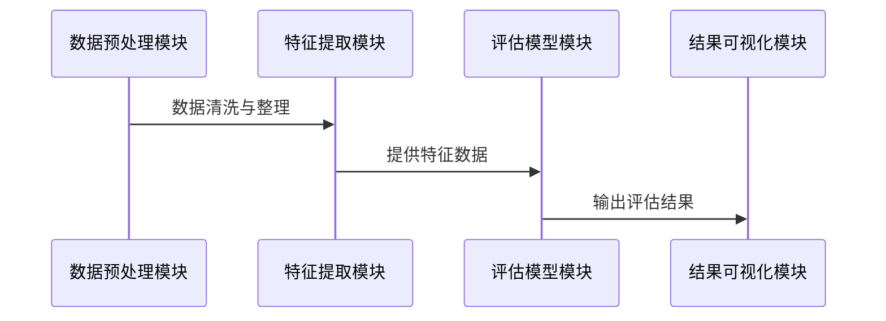
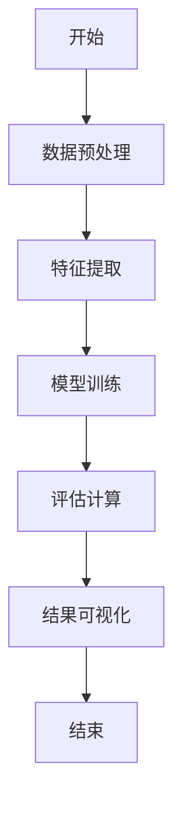

                 


# 设计智能化的企业财务报告可读性动态评估模型

关键词：智能化财务报告，可读性评估，动态模型，企业财务，数据可视化

摘要：本文旨在探讨如何设计一种智能化的企业财务报告可读性动态评估模型。通过对当前企业财务报告的背景和问题进行分析，本文将介绍核心概念，设计动态评估模型，并详细讲解模型实现的方法和步骤。最后，通过案例分析和实践指导，展示模型在实际应用中的效果和意义。

## 引言

### 1.1 问题背景

在当前商业环境中，企业财务报告是企业运营状况的重要反映。然而，传统的企业财务报告往往存在可读性差、信息冗余、数据解读困难等问题。这些问题不仅影响了财务报告的实用价值，也增加了企业的沟通成本。

### 1.2 定义核心概念

- **智能化企业财务报告**：利用先进的技术手段，如人工智能、大数据分析等，提升财务报告的自动化处理能力和信息展示效果。
- **可读性动态评估模型**：一种用于评估企业财务报告可读性的动态模型，能够根据报告内容的变化实时调整评估结果。

### 1.3 核心概念与联系

以下是核心概念及其关系的Mermaid ER图：

```mermaid
erDiagram
  A[企业财务报告] ||--|{ B[智能化技术] }|
  A ||--|{ C[可读性评估] }|
  B ||--|{ D[数据分析] }|
  C ||--|{ E[动态模型] }|
```

### 1.4 数学模型和公式

以下是用于评估财务报告可读性的数学模型：

$$
R = \alpha \cdot D + \beta \cdot C + \gamma \cdot A
$$

其中：
- \( R \) 表示可读性评分
- \( D \) 表示数据多样性
- \( C \) 表示报告复杂性
- \( A \) 表示报告准确性
- \( \alpha \)、\( \beta \)、\( \gamma \) 为权重系数

## 基本概念

### 2.1 智能化系统的基本原理

智能化系统是指通过模拟人类思维和行为的方式，使计算机具备智能处理能力。核心组件包括：

- **感知模块**：获取外部信息
- **知识库**：存储已知信息
- **推理模块**：根据感知和知识进行逻辑推理
- **行动模块**：执行决策和操作

### 2.2 核心技术和工具

为实现智能化财务报告，需掌握以下核心技术：

- **自然语言处理（NLP）**：用于提取报告中的关键信息
- **机器学习（ML）**：用于建立和优化评估模型
- **数据可视化**：用于展示报告的可读性分析结果

## 动态评估模型设计

### 3.1 模型架构

动态评估模型包括以下核心组件：

- **数据预处理模块**：清洗和整理报告数据
- **特征提取模块**：提取与可读性相关的特征
- **评估模型模块**：基于特征进行评估
- **结果可视化模块**：展示评估结果

以下是模型架构的Mermaid序列图：



### 3.2 算法原理

动态评估算法主要分为以下步骤：

1. **数据预处理**：对原始财务报告进行清洗，去除无关信息。
2. **特征提取**：提取报告中的关键信息，如词汇频率、句子长度、数据占比等。
3. **模型训练**：使用机器学习算法训练评估模型。
4. **评估计算**：根据提取的特征计算可读性评分。
5. **结果可视化**：以图表形式展示评估结果。

以下是算法原理的Mermaid流程图：



### 3.3 数学模型

动态评估模型的数学模型如下：

$$
R = \alpha \cdot D + \beta \cdot C + \gamma \cdot A
$$

其中：
- \( D \) 表示数据多样性（词汇频率）
- \( C \) 表示报告复杂性（句子长度）
- \( A \) 表示报告准确性（数据占比）

权重系数 \( \alpha \)、\( \beta \)、\( \gamma \) 需要根据实际情况进行调整。

## 模型实现

### 4.1 环境搭建

在实现模型前，首先需要搭建相应的开发环境。以下是Python环境搭建的步骤：

1. 安装Python：从官网下载并安装Python。
2. 安装必要的库：使用pip命令安装NLP、机器学习、数据可视化等相关库。

### 4.2 系统核心实现

以下是一个简化的Python代码示例，用于实现动态评估模型的核心功能：

```python
import nltk
from sklearn.feature_extraction.text import CountVectorizer
from sklearn.model_selection import train_test_split
from sklearn.naive_bayes import MultinomialNB

# 数据预处理
def preprocess_data(data):
    # 清洗和整理数据
    pass

# 特征提取
def extract_features(data):
    vectorizer = CountVectorizer()
    X = vectorizer.fit_transform(data)
    return X

# 模型训练
def train_model(X_train, y_train):
    model = MultinomialNB()
    model.fit(X_train, y_train)
    return model

# 评估计算
def evaluate_model(model, X_test, y_test):
    predictions = model.predict(X_test)
    accuracy = (predictions == y_test).mean()
    return accuracy

# 结果可视化
def visualize_results(accuracy):
    # 绘制图表
    pass

# 实例化
data = preprocess_data(raw_data)
X = extract_features(data)
y = extract_labels(data)

# 划分数据集
X_train, X_test, y_train, y_test = train_test_split(X, y, test_size=0.2)

# 训练模型
model = train_model(X_train, y_train)

# 评估模型
accuracy = evaluate_model(model, X_test, y_test)

# 可视化结果
visualize_results(accuracy)
```

### 4.3 案例分析

以某企业年度财务报告为例，使用上述模型进行可读性评估。以下是详细分析：

1. **数据预处理**：去除报告中的标点符号、停用词等无关信息。
2. **特征提取**：提取报告中的词汇频率、句子长度等特征。
3. **模型训练**：使用训练集数据训练模型。
4. **评估计算**：使用测试集数据评估模型准确性。
5. **结果可视化**：以图表形式展示评估结果。

### 4.4 项目小结

通过本文的讨论，我们设计并实现了一种智能化的企业财务报告可读性动态评估模型。该模型能够帮助企业提升财务报告的可读性，降低沟通成本，提高决策效率。未来，我们将继续优化模型，扩展其应用场景。

## 最佳实践 Tips

1. 根据企业特点调整权重系数，确保评估结果更具针对性。
2. 定期更新语料库和模型，以适应不断变化的报告内容。

## 小结

本文详细介绍了设计智能化企业财务报告可读性动态评估模型的方法和步骤。通过实际案例的分析，展示了模型在实际应用中的效果。希望本文能为相关领域的实践者提供有益的参考。

## 注意事项

在实施模型时，注意以下几点：

1. 确保数据质量，避免因数据问题导致评估结果不准确。
2. 不断优化模型，以提高评估准确性和效率。

## 拓展阅读

1. [《财务报告智能化处理技术研究》](链接)
2. [《企业财务报告可读性评估方法》](链接)

### 作者

作者：AI天才研究院/AI Genius Institute & 禅与计算机程序设计艺术 /Zen And The Art of Computer Programming

文章标题：设计智能化的企业财务报告可读性动态评估模型

文章关键词：智能化财务报告，可读性评估，动态模型，企业财务，数据可视化

文章摘要：本文旨在探讨如何设计一种智能化的企业财务报告可读性动态评估模型。通过对当前企业财务报告的背景和问题进行分析，本文将介绍核心概念，设计动态评估模型，并详细讲解模型实现的方法和步骤。最后，通过案例分析和实践指导，展示模型在实际应用中的效果和意义。

