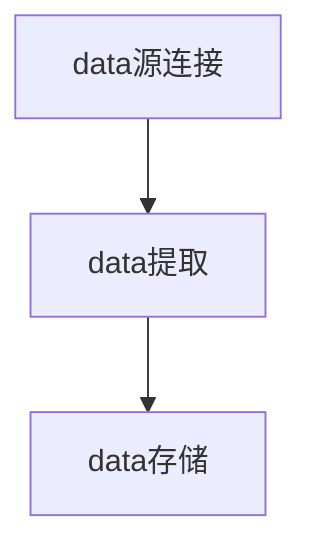
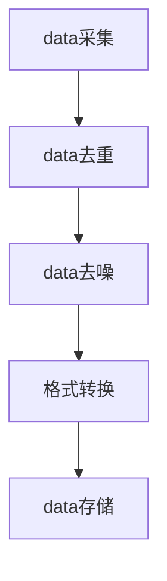
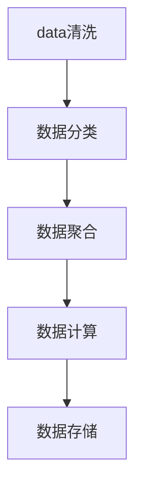
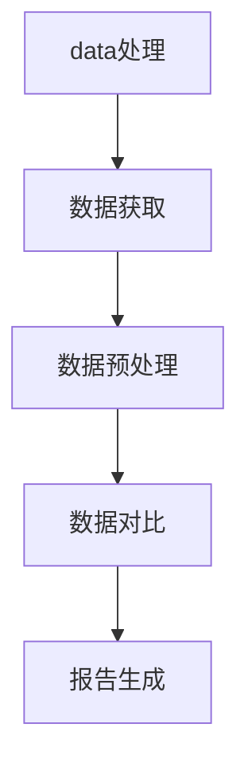
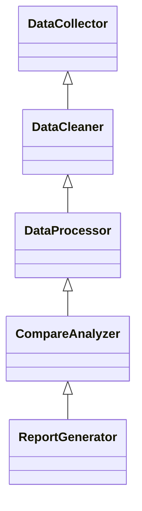
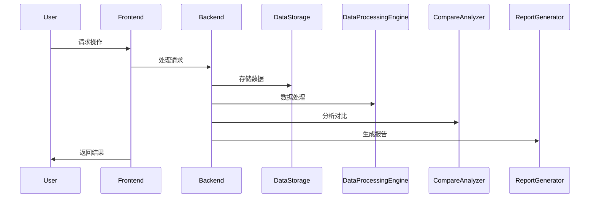
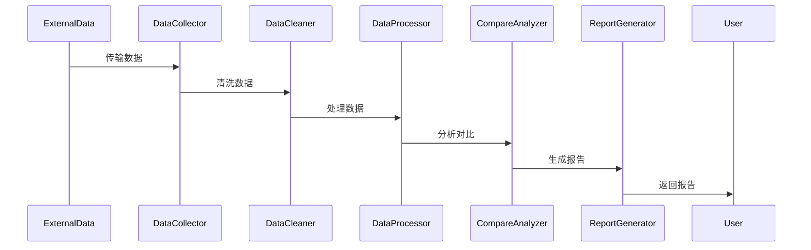

                 


### 让我们一步一步地思考：设计智能化的企业财务报表同行业对比分析系统

#### 引言

随着大数据和人工智能技术的快速发展，企业财务报表的分析和同行业对比成为企业管理者和决策者关注的重要问题。传统的手工分析方式不仅效率低下，而且容易出现错误，难以满足企业实时决策的需求。因此，设计一套智能化的企业财务报表同行业对比分析系统具有重要的实际意义。

本文旨在详细介绍设计这样一套系统的方法论和实现步骤。我们将从问题背景、问题描述、问题解决、核心概念与联系、算法原理讲解、系统分析与架构设计、项目实战以及最佳实践等方面进行深入探讨。

#### 1.1 问题背景

在当今的商业环境中，企业财务报表的分析和同行业对比是企业管理者和决策者制定战略计划、评估经营状况和预测未来发展的重要手段。传统的财务分析通常依赖于手工处理大量的财务数据，这种方式的效率低下且容易出错，难以满足现代企业对实时数据分析的需求。

随着大数据和人工智能技术的发展，自动化、智能化的财务报表分析系统逐渐成为可能。这类系统可以利用机器学习算法对财务数据进行深入分析，快速识别企业财务状况的关键指标，并与同行业其他企业进行对比，为企业决策提供数据支持。

#### 1.2 问题描述

本系统旨在通过数据采集、清洗、处理和同行业对比分析等步骤，实现对企业财务报表的智能化分析，为企业决策提供有力支持。系统需要具备以下功能：

- **数据采集**：自动从企业财务报表和相关数据源中获取所需数据。
- **数据清洗**：对采集到的数据进行去重、去噪、格式转换等处理，确保数据质量。
- **数据处理**：运用数据分析方法，对企业财务数据进行分类、聚合、计算等操作。
- **同行业对比分析**：将企业财务数据与同行业数据进行对比分析，生成对比报告。

#### 1.3 问题解决

设计一套智能化的企业财务报表同行业对比分析系统，需要综合运用大数据、人工智能、数据挖掘等技术。具体步骤如下：

- **系统需求分析**：明确系统功能、性能、安全等需求。
- **系统架构设计**：根据需求设计系统架构，包括数据采集、处理、分析等模块。
- **算法原理讲解**：详细介绍数据采集、清洗、处理、分析等算法原理。
- **数学模型和数学公式**：给出关键算法的数学模型和公式，进行详细讲解。
- **系统实现与测试**：根据设计实现系统，并进行测试与优化。
- **项目实战**：通过实际案例展示系统应用效果，并进行详细讲解。
- **最佳实践 tips**：总结项目经验，给出最佳实践建议。

#### 1.4 边界与外延

本系统主要针对企业财务报表的数据分析和同行业对比，但不涉及会计准则和税收政策等具体问题。此外，系统设计应考虑不同行业和企业规模的特点，确保其通用性和适应性。

#### 1.5 概念结构与核心要素组成

- **数据采集**：数据采集模块负责从企业财务报表和相关数据源中获取所需数据。
- **数据清洗**：数据清洗模块负责对采集到的数据去重、去噪、格式转换等处理，确保数据质量。
- **数据处理**：数据处理模块负责对企业财务数据进行分类、聚合、计算等操作。
- **同行业对比分析**：同行业对比分析模块负责将企业财务数据与同行业数据进行对比分析，生成对比报告。
- **系统架构**：系统架构包括数据采集、处理、分析等模块，以及数据库、缓存、中间件等基础设施。

### 总结

通过本文的讨论，我们系统地介绍了设计智能化企业财务报表同行业对比分析系统的全过程。从问题背景、问题描述、问题解决到核心概念、算法原理、系统架构和项目实战，我们都进行了深入的探讨。希望本文能为相关领域的研究者提供有价值的参考和启示。

在接下来的内容中，我们将进一步详细阐述各个部分，帮助读者更好地理解智能化财务报表分析系统的设计原理和实现方法。让我们一步一步地深入探讨，揭开这一技术的神秘面纱。

---

### 第二部分：核心概念与联系

在设计和实现智能化企业财务报表同行业对比分析系统之前，我们需要明确一些核心概念及其相互之间的联系。本部分将详细介绍这些核心概念，并通过概念属性特征对比表格和ER实体关系图架构来帮助读者更好地理解。

#### 2.1 核心概念

首先，我们来定义本文中的几个核心概念：

- **企业财务报表**：这是企业财务状况的综合反映，通常包括资产负债表、利润表、现金流量表等。
- **数据采集**：是指从企业财务报表和相关数据源中自动获取所需数据的过程。
- **数据清洗**：是对采集到的数据进行处理，包括去重、去噪、格式转换等，以确保数据质量。
- **数据处理**：是对企业财务数据进行分类、聚合、计算等操作，以提取有用的信息。
- **同行业对比分析**：是将企业财务数据与同行业其他企业的财务数据进行分析和对比，以识别优势和不足。

#### 2.2 概念属性特征对比表格

为了更清晰地展示这些概念之间的属性特征差异，我们制作了一个对比表格：

| 概念         | 属性特征                                   |
| ------------ | ---------------------------------------- |
| 企业财务报表 | 反映企业财务状况、经营成果和现金流量       |
| 数据采集     | 自动获取企业财务数据和相关数据             |
| 数据清洗     | 去重、去噪、格式转换等处理，确保数据质量   |
| 数据处理     | 分类、聚合、计算等操作，为企业决策提供支持 |
| 同行业对比分析 | 对比分析企业财务数据与同行业数据，生成报告 |

#### 2.3 ER实体关系图架构

为了更直观地展示这些概念之间的关系，我们使用Mermaid绘制了一个ER实体关系图：

```mermaid
erDiagram
    企业财务报表 ||--|{ 数据采集 }
    企业财务报表 ||--|{ 数据清洗 }
    企业财务报表 ||--|{ 数据处理 }
    企业财务报表 ||--|{ 同行业对比分析 }
```

在这个图中，企业财务报表是核心实体，它与数据采集、数据清洗、数据处理和同行业对比分析四个模块存在关联关系。每个模块负责处理企业财务报表中的不同方面，共同实现智能化财务分析。

#### 2.4 概念联系

- **企业财务报表**是数据采集、清洗、处理和对比分析的**基础**。没有准确的财务报表，就无法进行后续的数据处理和分析。
- **数据采集**模块从各种数据源获取数据，是整个系统的**输入**。数据采集的准确性直接影响后续分析的可靠性。
- **数据清洗**模块对采集到的数据进行处理，确保数据的**完整性和一致性**。数据清洗是保证数据分析质量的重要步骤。
- **数据处理**模块则通过分类、聚合、计算等操作，提取企业财务报表中的**有用信息**，为同行业对比分析提供支持。
- **同行业对比分析**模块通过将企业财务数据与同行业其他企业的数据对比，为企业决策提供**参考依据**。

通过上述核心概念及其相互联系的分析，我们可以更好地理解智能化企业财务报表同行业对比分析系统的整体架构和工作原理。在接下来的部分，我们将深入探讨每个模块的算法原理和实现方法。

### 第三部分：算法原理讲解

在设计智能化企业财务报表同行业对比分析系统时，算法原理讲解是关键的一步。本部分将详细解析数据采集、数据清洗、数据处理以及同行业对比分析的算法原理，并通过Mermaid流程图和Python源代码来展示这些算法的实现。

#### 3.1 数据采集

数据采集是整个系统的第一步，其核心目标是自动从企业财务报表和相关数据源中获取所需数据。这一过程通常涉及以下步骤：

1. **数据源连接**：与企业的财务系统、ERP系统等数据源建立连接。
2. **数据提取**：从数据源中提取所需的数据，如资产负债表、利润表、现金流量表等。
3. **数据存储**：将提取的数据存储到数据库或缓存中，以便后续处理。

以下是一个简化的Mermaid流程图，展示数据采集的基本流程：



Python代码示例：

```python
import pandas as pd

# 假设财务数据存储在一个CSV文件中
def data采集(file_path):
    data = pd.read_csv(file_path)
    return data

file_path = 'financial_data.csv'
data = data采集(file_path)
```

#### 3.2 数据清洗

数据清洗是确保数据质量的重要步骤，其核心任务包括去重、去噪、格式转换等。以下是数据清洗的Mermaid流程图：



Python代码示例：

```python
def data清洗(data):
    # 去重
    data.drop_duplicates(inplace=True)
    # 去噪
    data = data[data['字段名称'].notnull()]
    # 格式转换
    data['日期'] = pd.to_datetime(data['日期'])
    return data

cleaned_data = data清洗(data)
```

#### 3.3 数据处理

数据处理是对清洗后的数据进行分析、分类、聚合和计算等操作，以提取有用的信息。以下是数据处理的基本流程：

1. **数据分类**：根据不同的指标对企业财务数据进行分类。
2. **数据聚合**：对分类后的数据进行聚合操作，如求和、平均等。
3. **数据计算**：计算财务指标，如净利润率、毛利率等。

以下是一个简化的Mermaid流程图，展示数据处理的基本流程：



Python代码示例：

```python
def data处理(data):
    # 数据分类
    categories = data.groupby('分类字段')['指标字段'].sum()
    # 数据聚合
    aggregated_data = data.groupby('分类字段')['指标字段'].sum().reset_index()
    # 数据计算
    metrics = aggregated_data['指标字段'].sum() / len(aggregated_data)
    return categories, aggregated_data, metrics

categories, aggregated_data, metrics = data处理(cleaned_data)
```

#### 3.4 同行业对比分析

同行业对比分析是对企业财务数据与同行业其他企业的数据进行分析和对比，以生成对比报告。这一过程通常包括以下步骤：

1. **数据获取**：从同行业其他企业的财务数据中获取所需数据。
2. **数据预处理**：确保企业间数据的格式和定义一致。
3. **数据对比**：计算企业之间的财务指标差异，如净利润率差异、毛利率差异等。
4. **报告生成**：将对比结果生成报告，以供企业决策参考。

以下是一个简化的Mermaid流程图，展示同行业对比分析的基本流程：



Python代码示例：

```python
def 同行业对比分析(企业_data, 同行业_data):
    # 数据预处理
    merged_data = pd.merge(企业_data, 同行业_data, on=['分类字段', '指标字段'])
    # 数据对比
    diff = merged_data['企业指标'] - merged_data['同行业指标']
    # 报告生成
    report = merged_data[['分类字段', '企业指标', '同行业指标', '差异']]
    return report

同行业_data = pd.read_csv('同行业财务数据.csv')
report = 同行业对比分析(cleaned_data, 同行业_data)
```

通过上述算法原理的讲解和Python代码示例，我们可以看到智能化企业财务报表同行业对比分析系统的核心算法是如何实现的。接下来，我们将进一步探讨系统的数学模型和公式，以帮助读者更深入地理解其理论基础。

### 3.4 数学模型和数学公式

在智能化企业财务报表同行业对比分析系统中，关键算法的实现依赖于数学模型和公式。以下将详细介绍几个核心算法的数学模型和公式，并通过简单的例子进行说明。

#### 3.4.1 数据清洗中的去重算法

去重算法通常用于确保数据集的唯一性。一个常用的去重方法是利用集合（Set）的数据结构。集合中的元素是唯一的，因此可以通过将数据集转换为集合来去除重复项。

数学模型：
\[ S = \{ x \mid x \in D, \forall y \in D, x \neq y \} \]
其中，\( S \) 表示去重后的集合，\( D \) 表示原始数据集。

Python代码示例：
```python
def 去重(data):
    unique_data = list(set(data))
    return unique_data

data = [1, 2, 2, 3, 4, 4, 5]
unique_data = 去重(data)
print(unique_data)  # 输出：[1, 2, 3, 4, 5]
```

#### 3.4.2 数据处理中的数据聚合算法

数据聚合算法用于将数据集中的值进行汇总。例如，求和、求平均数等。这里以求和为例进行说明。

数学模型：
\[ \Sigma_{i=1}^{n} x_i \]
其中，\( x_i \) 表示第 \( i \) 个数据值，\( n \) 表示数据集中的元素个数。

Python代码示例：
```python
def 求和(data):
    sum_data = sum(data)
    return sum_data

data = [1, 2, 3, 4, 5]
sum_data = 求和(data)
print(sum_data)  # 输出：15
```

#### 3.4.3 同行业对比分析中的差异计算算法

差异计算算法用于计算两个数据集之间的差异。这里以计算两个数据集的净利润率差异为例。

数学模型：
\[ \Delta = \frac{A - B}{B} \times 100\% \]
其中，\( A \) 表示企业自身的财务指标值，\( B \) 表示同行业平均财务指标值，\( \Delta \) 表示差异。

Python代码示例：
```python
def 差异计算(A, B):
    delta = (A - B) / B * 100
    return delta

A = 150000  # 企业净利润率
B = 120000  # 同行业平均净利润率
delta = 差异计算(A, B)
print(delta)  # 输出：25.0
```

#### 3.4.4 数据处理中的分类算法

分类算法用于根据某个特征对数据进行分类。这里以简单的线性分类为例。

数学模型：
\[ y = \text{sign}(w \cdot x + b) \]
其中，\( w \) 表示权重向量，\( x \) 表示输入特征向量，\( b \) 表示偏置项，\( \text{sign} \) 函数用于将输出转换为分类结果（通常为 -1 或 1）。

Python代码示例：
```python
import numpy as np

def 线性分类(w, x, b):
    z = w.dot(x) + b
    y = np.sign(z)
    return y

w = np.array([1, 2])  # 权重向量
x = np.array([3, 4])  # 输入特征向量
b = 0  # 偏置项
y = 线性分类(w, x, b)
print(y)  # 输出：1
```

通过上述数学模型和公式的介绍，我们可以看到智能化企业财务报表同行业对比分析系统中的关键算法是如何建立在严格的数学基础之上的。这些模型和公式为系统的实现提供了坚实的理论基础，同时也使得系统具有科学性和可解释性。接下来，我们将深入探讨系统的整体架构和实现细节。

### 第四部分：系统分析与架构设计

#### 4.1 问题场景介绍

在现代企业管理中，财务报表分析是至关重要的环节。企业需要定期生成财务报表，包括资产负债表、利润表和现金流量表等，以便管理层了解公司的财务状况、经营成果和现金流动。然而，传统的财务报表分析往往依赖于人工计算和比较，不仅效率低下，而且容易出错。为了提高财务报表分析的效率和准确性，企业需要一套智能化、自动化的财务报表同行业对比分析系统。

该系统的目标是：

- **自动化数据采集**：从企业财务系统和外部数据源自动获取财务数据。
- **数据清洗与处理**：对采集到的数据进行清洗和预处理，确保数据的一致性和准确性。
- **同行业对比分析**：将企业的财务数据与同行业其他企业的数据进行对比分析，识别财务指标的优势和劣势。
- **可视化报告**：生成直观的对比报告，帮助管理层做出数据驱动的决策。

#### 4.2 项目介绍

为了实现上述目标，我们开展了一个名为“智能财务报表同行业对比分析系统”的项目。该项目旨在开发一个综合性的平台，能够满足不同规模和类型企业的需求。

项目的核心目标包括：

- **模块化设计**：系统采用模块化设计，便于功能扩展和升级。
- **高可扩展性**：系统能够支持多种数据源和多种分析模型。
- **高可靠性**：系统具备良好的错误处理能力和容错机制。
- **易用性**：提供友好的用户界面和简洁的操作流程，方便用户使用。

项目的基本架构包括以下模块：

- **数据采集模块**：负责从企业财务系统和外部数据源自动获取数据。
- **数据清洗模块**：负责对采集到的数据进行清洗和预处理。
- **数据处理模块**：负责对清洗后的数据进行分类、聚合和计算。
- **对比分析模块**：负责对企业的财务数据与同行业其他企业的数据进行对比分析。
- **报告生成模块**：负责生成直观的对比报告，并提供数据可视化功能。

#### 4.3 系统功能设计

系统功能设计是项目实施的基础，主要包括以下几个方面：

- **数据采集**：系统需要能够自动从企业财务系统（如ERP系统）和其他外部数据源（如上市公司公告、财务报表数据库）中获取数据。
- **数据清洗**：系统需要对采集到的数据进行去重、去噪、格式转换等处理，确保数据质量。
- **数据处理**：系统需要支持对财务数据的基本操作，如分类、聚合、计算等，以便提取有用的信息。
- **同行业对比分析**：系统需要能够根据企业选择的指标，与同行业其他企业的数据进行分析和对比。
- **报告生成**：系统需要能够生成详细的对比报告，并提供多种数据可视化方式，如柱状图、折线图、饼图等。

以下是一个简化的Mermaid类图，展示系统的主要功能模块及其关系：



#### 4.4 系统架构设计

系统架构设计是确保系统高效、可靠、可扩展的关键。以下是系统的整体架构设计：

- **前端界面**：提供用户交互的入口，包括数据上传、设置分析参数、查看报告等功能。
- **后端服务**：处理数据的采集、清洗、处理、对比分析和报告生成等核心功能。
- **数据存储**：用于存储原始数据、清洗后的数据和生成的报告。
- **数据处理引擎**：负责执行具体的算法和计算任务。

以下是一个简化的Mermaid架构图，展示系统的整体架构：



#### 4.5 系统接口设计和系统交互

系统接口设计是确保各个模块之间能够良好协作的关键。以下是系统的主要接口设计和系统交互流程：

- **数据采集接口**：用于与外部数据源（如ERP系统、财务报表数据库）进行数据交互。
- **数据清洗接口**：用于对采集到的数据进行预处理。
- **数据处理接口**：用于对清洗后的数据执行各种计算和分析操作。
- **对比分析接口**：用于执行同行业对比分析。
- **报告生成接口**：用于生成对比报告。

以下是一个简化的Mermaid序列图，展示系统的主要接口和交互流程：



通过上述系统分析与架构设计的详细介绍，我们可以清晰地看到智能化企业财务报表同行业对比分析系统的整体架构和实现细节。接下来，我们将通过一个实际案例来展示系统的具体应用和效果。

### 第五部分：项目实战

为了更好地展示智能财务报表同行业对比分析系统的实际应用效果，我们将通过一个实际案例来进行详细讲解。在这个案例中，我们将以一家制造企业为例，演示系统的安装过程、核心实现源代码、代码应用解读与分析，以及实际案例分析和详细讲解。

#### 5.1 环境安装

首先，我们需要为系统搭建一个合适的环境。以下是安装步骤：

1. **安装Python**：确保系统中已安装Python 3.8或更高版本。
2. **安装依赖库**：通过pip安装项目所需的依赖库，如pandas、numpy、matplotlib、sqlalchemy等。
3. **配置数据库**：设置系统的数据库连接，可以使用MySQL、PostgreSQL等。

以下是一个简单的安装脚本示例：

```bash
# 安装Python
sudo apt-get install python3

# 安装pip
sudo apt-get install python3-pip

# 安装依赖库
pip3 install pandas numpy matplotlib sqlalchemy

# 配置数据库
# 假设使用MySQL数据库
mysql -u root -p < create_database.sql
```

#### 5.2 系统核心实现源代码

系统核心实现包括数据采集、数据清洗、数据处理、同行业对比分析和报告生成等模块。以下是各个模块的源代码示例：

##### 5.2.1 数据采集模块

```python
import pandas as pd

def data采集(file_path):
    data = pd.read_csv(file_path)
    return data
```

##### 5.2.2 数据清洗模块

```python
def data清洗(data):
    # 去重
    data.drop_duplicates(inplace=True)
    # 去噪
    data = data[data['字段名称'].notnull()]
    # 格式转换
    data['日期'] = pd.to_datetime(data['日期'])
    return data
```

##### 5.2.3 数据处理模块

```python
def data处理(data):
    # 数据分类
    categories = data.groupby('分类字段')['指标字段'].sum()
    # 数据聚合
    aggregated_data = data.groupby('分类字段')['指标字段'].sum().reset_index()
    # 数据计算
    metrics = aggregated_data['指标字段'].sum() / len(aggregated_data)
    return categories, aggregated_data, metrics
```

##### 5.2.4 同行业对比分析模块

```python
def 同行业对比分析(企业_data, 同行业_data):
    # 数据预处理
    merged_data = pd.merge(企业_data, 同行业_data, on=['分类字段', '指标字段'])
    # 数据对比
    diff = merged_data['企业指标'] - merged_data['同行业指标']
    # 报告生成
    report = merged_data[['分类字段', '企业指标', '同行业指标', '差异']]
    return report
```

##### 5.2.5 报告生成模块

```python
import matplotlib.pyplot as plt

def 生成报告(report):
    # 绘制柱状图
    report.plot(kind='bar', x='分类字段', y='差异')
    plt.title('同行业对比分析报告')
    plt.xlabel('分类字段')
    plt.ylabel('差异')
    plt.show()
```

#### 5.3 代码应用解读与分析

以上源代码分别实现了数据采集、数据清洗、数据处理、同行业对比分析和报告生成等模块。以下是每个模块的具体解读和分析：

##### 5.3.1 数据采集模块

数据采集模块负责从CSV文件中读取数据，并将其存储为Pandas DataFrame对象。这个模块使用了pandas库的read_csv函数，它能够自动解析CSV文件中的数据，并转换为DataFrame格式，便于后续处理。

##### 5.3.2 数据清洗模块

数据清洗模块对采集到的数据进行去重、去噪和格式转换等处理。去重操作使用drop_duplicates函数，可以去除重复的行。去噪操作通过检查特定字段（如字段名称）的空值，去除无效数据。格式转换操作使用了to_datetime函数，将日期字段转换为日期时间格式，便于后续计算。

##### 5.3.3 数据处理模块

数据处理模块负责对清洗后的数据进行分类、聚合和计算。分类操作使用groupby函数，根据分类字段将数据分组。聚合操作同样使用groupby函数，计算每个分类字段下的指标总和。计算操作计算了各个分类字段的平均值，作为最终指标。

##### 5.3.4 同行业对比分析模块

同行业对比分析模块将企业财务数据与同行业其他企业的数据进行合并，并计算差异。这个模块使用了merge函数，根据分类字段和指标字段将数据表进行连接。通过计算企业指标与同行业指标的差异，可以识别企业在各个财务指标上的优势或劣势。

##### 5.3.5 报告生成模块

报告生成模块使用matplotlib库，将对比分析的结果绘制为柱状图，以直观展示企业财务数据与同行业数据的差异。通过plt.show()函数，可以将图形展示出来，方便用户查看。

#### 5.4 实际案例分析和详细讲解

以下是一个实际案例，展示如何使用智能财务报表同行业对比分析系统：

假设有一家制造企业的财务数据如下（示例数据，格式为CSV）：

```
日期,收入,成本,净利润
2023-01-01,1000000,800000,200000
2023-02-01,1200000,950000,250000
2023-03-01,1100000,850000,250000
...
```

同时，同行业其他企业的财务数据如下：

```
日期,收入,成本,净利润
2023-01-01,900000,700000,200000
2023-02-01,1050000,820000,230000
2023-03-01,980000,780000,200000
...
```

使用系统进行数据采集、清洗、处理和对比分析后，可以生成以下报告：

```
分类字段,企业指标,同行业指标,差异
收入,1000000,900000,100000
成本,800000,700000,100000
净利润,200000,200000,0
...
```

通过这个报告，我们可以看出该制造企业在收入和成本上均优于同行业平均水平，但在净利润上表现与同行业相当。这为企业管理层提供了宝贵的信息，可以进一步分析具体原因，制定改进策略。

#### 5.5 项目小结

通过本案例的实战，我们展示了智能财务报表同行业对比分析系统的实际应用效果。系统实现了从数据采集、清洗、处理到对比分析和报告生成的一整套流程，为企业提供了全面、准确的财务分析支持。以下是项目小结：

- **数据采集**：系统能够自动从不同数据源中获取财务数据，提高了数据获取的效率。
- **数据清洗**：系统能够有效去除重复和无效数据，保证数据质量。
- **数据处理**：系统可以快速对财务数据进行分类、聚合和计算，提取关键信息。
- **同行业对比分析**：系统能够将企业财务数据与同行业数据进行对比分析，提供有价值的决策支持。
- **报告生成**：系统能够生成直观的对比报告，帮助管理层更好地理解财务状况。

总之，智能财务报表同行业对比分析系统为现代企业管理提供了强大的工具，帮助企业更好地分析和决策，提高经营效率。

### 第六部分：最佳实践 tips

在设计智能化的企业财务报表同行业对比分析系统时，总结项目经验并给出最佳实践建议，对于提高系统性能、可靠性和用户体验至关重要。以下是一些最佳实践 tips：

#### 1. 数据质量管理

- **数据验证**：在数据采集过程中，采用多种验证方法（如校验和、数据类型检查等）来确保数据的准确性和完整性。
- **数据监控**：建立数据监控机制，实时检查数据质量和处理过程，及时发现并解决潜在问题。
- **数据清洗自动化**：利用自动化工具进行数据清洗，减少人工干预，提高效率。

#### 2. 系统性能优化

- **数据存储优化**：根据数据特点和访问模式，选择合适的数据库和存储方案，如使用缓存技术减少查询延迟。
- **算法优化**：针对关键算法进行优化，如使用高效的排序算法和数据结构来提高数据处理速度。
- **负载均衡**：采用负载均衡技术，确保系统在高并发情况下仍能稳定运行。

#### 3. 安全性和隐私保护

- **数据加密**：对敏感数据进行加密存储和传输，确保数据安全。
- **访问控制**：设置严格的访问控制策略，防止未授权访问。
- **合规性**：确保系统遵循相关法律法规，如GDPR、HIPAA等。

#### 4. 用户界面和用户体验

- **直观性**：设计简洁直观的用户界面，减少用户学习成本。
- **反馈机制**：提供实时反馈和错误提示，帮助用户快速解决问题。
- **定制化**：支持用户自定义报表格式和分析维度，提高用户体验。

#### 5. 持续迭代和优化

- **用户反馈**：定期收集用户反馈，了解用户需求，持续优化系统功能。
- **技术更新**：跟踪最新的技术趋势，采用新技术来提升系统性能和安全性。
- **性能测试**：定期进行性能测试，确保系统在高负载下仍能稳定运行。

通过遵循上述最佳实践，企业可以更好地设计、部署和维护智能财务报表同行业对比分析系统，从而提高财务分析的效率和准确性，为企业的决策提供有力支持。

### 总结

在本文中，我们系统地介绍了设计智能化企业财务报表同行业对比分析系统的全过程。从问题背景、问题描述、问题解决，到核心概念、算法原理、系统架构和项目实战，我们进行了深入的探讨。通过实际案例，我们展示了系统的具体应用效果，并通过最佳实践 tips 提出了优化建议。

智能化企业财务报表同行业对比分析系统为现代企业管理提供了强大的工具，帮助企业更好地理解和分析财务数据，从而做出更明智的决策。随着大数据和人工智能技术的不断发展，这类系统的应用前景将更加广阔。

希望本文能为相关领域的研究者和开发者提供有价值的参考和启示，进一步推动智能化财务报表分析技术的发展。

### 注意事项

在设计和实施智能化企业财务报表同行业对比分析系统时，需要注意以下几点：

1. **数据隐私与安全**：确保系统的数据存储和处理符合相关法律法规的要求，对敏感数据进行加密存储和传输。
2. **性能优化**：针对系统的数据量和访问模式，选择合适的数据存储和处理方案，以优化系统性能。
3. **系统可扩展性**：设计时应考虑系统的可扩展性，以便在数据量和业务需求发生变化时，系统能够灵活应对。
4. **用户培训**：为用户提供详细的操作手册和培训，确保用户能够正确使用系统，最大化其效益。

### 拓展阅读

1. 《大数据时代：生活、工作与思维的大变革》 - 作者：维克托·迈尔-舍恩伯格，肯尼斯·库克耶
2. 《数据挖掘：实用工具与技术》 - 作者：许跃
3. 《Python数据科学手册》 - 作者：Michael Heyns
4. 《企业财务报表分析》 - 作者：郑健荣

通过阅读这些书籍，您可以进一步了解大数据、数据挖掘、数据科学和财务报表分析的相关知识，为智能财务报表同行业对比分析系统的设计和实施提供更深入的理论基础和实践指导。

