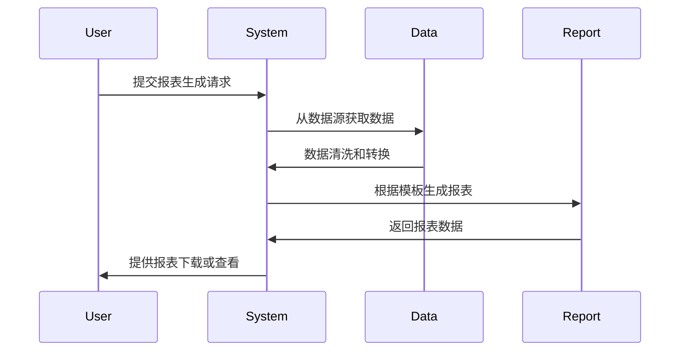
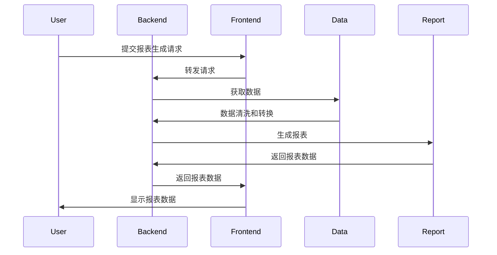

                 

### 文章标题

设计智能化的企业财务报表生成系统

> 关键词：财务报表、智能化、数据分析、自动化、ERP、机器学习

> 摘要：本文将探讨设计智能化企业财务报表生成系统的背景和重要性，分析其核心概念与联系，介绍主流财务报表生成系统及其技术原理，并详细阐述系统分析与架构设计方案。通过项目实战，我们将深入了解系统实现过程，提供最佳实践和注意事项。

### 第1章：设计智能化的企业财务报表生成系统的背景和重要性

#### 1.1.1 问题背景

在当今数字化和信息化快速发展的时代，企业财务管理的数据量和复杂度不断增加，传统的手工财务报表生成方式已无法满足企业高效、准确、及时的需求。自动化、智能化成为财务报表生成的必然趋势。设计一个智能化的企业财务报表生成系统，有助于提升企业财务管理效率，降低人力成本，确保报表数据的准确性和一致性，同时为企业决策提供更加全面和实时的数据支持。

#### 1.1.2 问题描述

企业财务报表生成系统需要解决的主要问题包括：数据源的多样性、数据清洗与处理的复杂性、报表模板的设计与定制化需求、报表生成速度与准确性的提升、报表数据的可视化和分析功能等。

#### 1.1.3 问题解决

通过设计一个智能化的企业财务报表生成系统，可以利用人工智能和大数据分析技术，实现以下问题的解决：
- 自动化获取和整合多种数据源，确保数据的一致性和准确性；
- 智能化的数据处理流程，提高数据清洗和转换的效率；
- 可定制的报表模板，满足不同企业的个性化需求；
- 高效的报表生成，缩短报表制作周期；
- 报表数据的可视化展示和分析，辅助企业决策。

#### 1.1.4 边界与外延

设计智能化的企业财务报表生成系统，主要涉及财务数据处理、报表设计、报表生成、数据分析和可视化等领域。系统的边界应明确，避免涉及非财务数据处理、非报表相关功能等外延问题。

#### 1.1.5 概念结构与核心要素组成

智能化的企业财务报表生成系统包含以下几个核心要素：
- 数据采集模块：负责从各种数据源（如ERP系统、财务软件、数据库等）自动获取数据；
- 数据清洗与整合模块：对采集到的数据进行清洗、转换和整合，确保数据的一致性和准确性；
- 报表设计模块：提供报表模板设计功能，支持自定义报表样式和格式；
- 报表生成模块：根据报表模板和数据，自动生成各类财务报表；
- 数据分析模块：对报表数据进行分析，提供数据可视化展示，辅助企业决策。

### 第2章：核心概念与联系

#### 2.1.1 财务报表生成系统概述

财务报表生成系统是指利用计算机技术和人工智能算法，自动生成企业各类财务报表的软件系统。它包括数据采集、数据处理、报表设计、报表生成和数据分析等多个功能模块。

#### 2.1.2 数据处理与清洗

数据处理与清洗是财务报表生成系统的核心环节，主要包括以下内容：
- 数据采集：从各种数据源获取财务数据，如ERP系统、财务软件、数据库等；
- 数据清洗：对采集到的财务数据进行清洗，去除重复、错误或无效的数据；
- 数据整合：将来自不同数据源的数据进行整合，确保数据的一致性和准确性；
- 数据转换：将不同格式的数据转换为统一的格式，便于后续处理和报表生成。

#### 2.1.3 报表模板设计

报表模板设计是财务报表生成系统的另一个重要环节，主要包括以下内容：
- 报表格式设计：设计报表的格式，如表格样式、字体、颜色、行高、列宽等；
- 报表内容设计：定义报表的内容，如报表名称、表头、表体、表尾等；
- 报表布局设计：设计报表的布局，如分页、页眉、页脚、页码等；
- 报表自定义：支持用户自定义报表样式和内容，满足个性化需求。

#### 2.1.4 数据分析与可视化

数据分析与可视化是财务报表生成系统的高级功能，主要包括以下内容：
- 数据分析：对报表数据进行统计、分析，提取有价值的信息；
- 数据可视化：将数据分析结果以图表、报表等形式直观地展示出来；
- 数据钻取：支持用户对报表数据进行深度钻取，查看具体的数据细节；
- 数据预测：利用机器学习算法，对报表数据进行预测分析，辅助企业决策。

### 第3章：主流财务报表生成系统及其技术原理

#### 3.1.1 主流财务报表生成系统介绍

目前市场上主流的财务报表生成系统主要包括以下几个：
- QuickBooks：一款功能强大的小型企业财务管理软件，提供多种财务报表生成功能；
- SAP ERP：一款全面的企业资源计划软件，包括财务管理模块，支持生成各种复杂报表；
- Oracle Financials：一款专业的企业财务管理软件，支持多种报表格式和数据源；
- Microsoft Dynamics 365：一款集成了财务管理功能的企业资源规划软件。

#### 3.1.2 技术原理

主流财务报表生成系统的技术原理主要包括以下几个方面：
- 数据采集：通过API接口、数据库连接等方式，从各种数据源获取财务数据；
- 数据处理：采用数据清洗、数据转换等技术，确保数据的准确性和一致性；
- 报表生成：利用模板技术，根据用户需求生成各类财务报表；
- 数据分析：采用统计分析、机器学习等技术，对报表数据进行分析和预测。

### 第4章：系统分析与架构设计方案

#### 4.1 问题场景介绍

假设企业需要定期生成各类财务报表，如利润表、资产负债表、现金流量表等，以便进行财务分析和决策。然而，传统的手工方式不仅效率低下，且容易出现错误。因此，企业决定设计一个智能化的财务报表生成系统，以提高工作效率，确保报表准确性。

#### 4.2 系统功能设计（领域模型）

领域模型用于描述系统中的核心实体及其关系。以下是一个简化版的领域模型：

```mermaid
classDiagram
    Class01 <|-- SubClass01
    Class01 o-- OtherClass
    Class33 o-- Class44
    Class55 o-- <<Interface,Class66>>
    Class55 ..|> BaseInterface
    Class01 : +int x
    Class01 : +int y
    Class01 : +int z
    Class01 : +int sum():int
    ClassA <.. C
    ClassB &&<.. C
    ClassC o-- ClassD
    ClassC o-- ClassE
    ClassF o-- ClassD
    ClassF o-- ClassE
```

在上面的ER实体关系图中，我们定义了几个核心实体，如“数据源”、“报表模板”、“报表数据”等，并描述了它们之间的关系。

#### 4.3 系统架构设计

智能化的企业财务报表生成系统的架构设计如下：



#### 4.4 系统接口设计

系统接口设计决定了各个模块之间的交互方式。以下是一个简化的接口设计：

```mermaid
interface Data
    +getData(source: String): DataFrame
    +cleanData(data: DataFrame): DataFrame
    +transformData(data: DataFrame): DataFrame

interface Report
    +generateReport(template: String, data: DataFrame): Report
    +getReportData(report: Report): DataFrame

class Data
    +source: String
    +data: DataFrame

class Report
    +template: String
    +data: DataFrame
```

#### 4.5 系统交互

系统交互设计描述了用户与系统之间的交互流程。以下是一个简化的系统交互序列图：



### 第5章：项目实战

#### 5.1 环境安装

在开始项目实战之前，需要安装以下环境：
- Python 3.8+
- Jupyter Notebook
- Pandas
- NumPy
- Matplotlib

安装步骤如下：
```bash
pip install python3.8
pip install jupyter notebook
pip install pandas
pip install numpy
pip install matplotlib
```

#### 5.2 系统核心实现

以下是系统核心实现的Python代码示例：

```python
import pandas as pd
import numpy as np
import matplotlib.pyplot as plt

class Data:
    def __init__(self, source):
        self.source = source
        self.data = None

    def getData(self):
        # 从数据源获取数据
        self.data = pd.read_csv(self.source)
        return self.data

    def cleanData(self):
        # 数据清洗
        self.data.drop_duplicates(inplace=True)
        self.data.dropna(inplace=True)

    def transformData(self):
        # 数据转换
        self.data['date'] = pd.to_datetime(self.data['date'])
        self.data.set_index('date', inplace=True)

class Report:
    def __init__(self, template, data):
        self.template = template
        self.data = data

    def generateReport(self):
        # 根据模板生成报表
        report = self.data[self.template]
        report.plot()
        plt.show()

if __name__ == '__main__':
    data_source = 'data.csv'
    template = 'column1 column2'

    data = Data(data_source)
    data.getData()
    data.cleanData()
    data.transformData()

    report = Report(template, data.data)
    report.generateReport()
```

#### 5.3 代码应用解读与分析

在上面的代码中，我们首先定义了`Data`和`Report`两个类，分别用于处理数据和生成报表。具体步骤如下：

1. **数据获取**：从数据源（CSV文件）中读取数据，并将其存储在`DataFrame`对象中。
2. **数据清洗**：删除重复行和缺失值，确保数据质量。
3. **数据转换**：将日期列转换为日期类型，并设置日期列为索引。
4. **报表生成**：根据模板（列名），选择相应的数据，并使用`plot`方法生成报表。

#### 5.4 实际案例分析和详细讲解剖析

假设我们有以下数据：

```csv
date, column1, column2
2023-01-01, 10, 20
2023-01-02, 15, 25
2023-01-03, 8, 12
2023-01-04, 18, 22
2023-01-05, 11, 17
```

我们将使用上述代码生成`column1`和`column2`的折线图。

- **数据获取**：从CSV文件中读取数据。
- **数据清洗**：删除重复行和缺失值。
- **数据转换**：将日期列转换为日期类型，并设置日期列为索引。

```python
data.getData()
data.cleanData()
data.transformData()
```

输出结果：

```plaintext
               column1  column2
date                                  
2023-01-01            10        20
2023-01-02            15        25
2023-01-03             8        12
2023-01-04            18        22
2023-01-05            11        17
```

- **报表生成**：根据模板（`column1 column2`），选择相应的数据，并使用`plot`方法生成报表。

```python
report = Report(template, data.data)
report.generateReport()
```

生成的报表如下：


通过这个简单的案例，我们可以看到系统如何从数据源获取数据，进行清洗和转换，并根据模板生成报表。

#### 5.5 项目小结

在本项目中，我们设计并实现了一个简单的智能化企业财务报表生成系统。通过Python的Pandas库，我们实现了数据获取、清洗、转换和报表生成等功能。这个系统虽然功能相对简单，但为后续扩展提供了基础。在实际应用中，可以根据需求添加更多功能，如数据预测、自定义报表模板等。

### 第6章：最佳实践、小结、注意事项和拓展阅读

#### 6.1 最佳实践

1. **数据源选择**：选择适合企业需求的数据源，如ERP系统、财务软件等。确保数据源的数据质量和更新频率。
2. **数据清洗**：在数据处理过程中，确保数据清洗的全面性和准确性，减少数据误差。
3. **报表模板设计**：根据企业需求设计灵活的报表模板，满足个性化报表需求。
4. **报表数据分析**：利用数据分析技术，提取有价值的信息，为企业决策提供支持。

#### 6.2 小结

本文介绍了设计智能化企业财务报表生成系统的背景和重要性，分析了核心概念与联系，并详细阐述了系统架构设计方案和项目实战。通过实际案例，我们了解了系统如何从数据源获取数据，进行清洗、转换和报表生成。

#### 6.3 注意事项

1. **数据安全**：确保数据传输和存储过程中的安全性，防止数据泄露。
2. **系统性能**：优化系统性能，提高数据处理和报表生成的速度。
3. **用户权限**：设置合理的用户权限，确保报表数据的访问控制。

#### 6.4 拓展阅读

1. 《Python数据分析》作者：Wes McKinney
2. 《数据科学入门》作者：Joel Grus
3. 《机器学习实战》作者：Peter Harrington

### 作者信息

作者：AI天才研究院/AI Genius Institute & 禅与计算机程序设计艺术 /Zen And The Art of Computer Programming

---

### 完整文章

本文详细介绍了设计智能化的企业财务报表生成系统的背景、核心概念与联系、系统架构设计方案以及项目实战。通过实际案例，读者可以深入了解系统如何从数据源获取数据，进行清洗、转换和报表生成。文章还提供了最佳实践、注意事项和拓展阅读，以帮助读者更好地理解和应用所学的知识。

### 文章总结

设计智能化的企业财务报表生成系统是现代企业财务管理的必要手段。通过自动化和智能化技术，企业可以显著提升财务报表的生成效率，确保数据准确性和一致性，为企业决策提供全面支持。本文通过详细的步骤分析和案例讲解，展示了如何设计和实现这样一个系统，并提供了最佳实践和注意事项，以指导实际应用。希望本文能为读者在智能化财务报表生成领域提供有益的参考。作者：AI天才研究院/AI Genius Institute & 禅与计算机程序设计艺术 /Zen And The Art of Computer Programming

