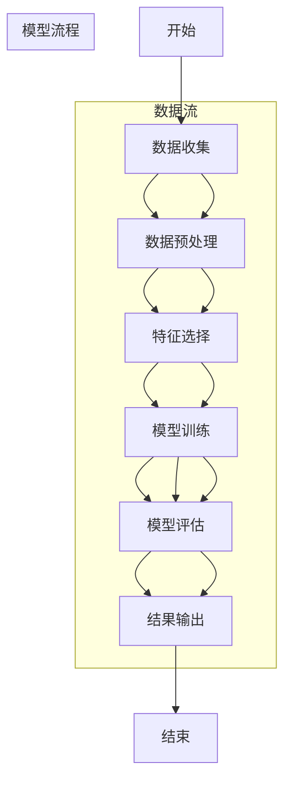
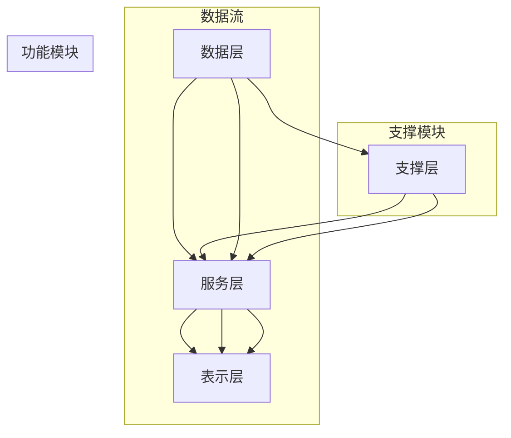
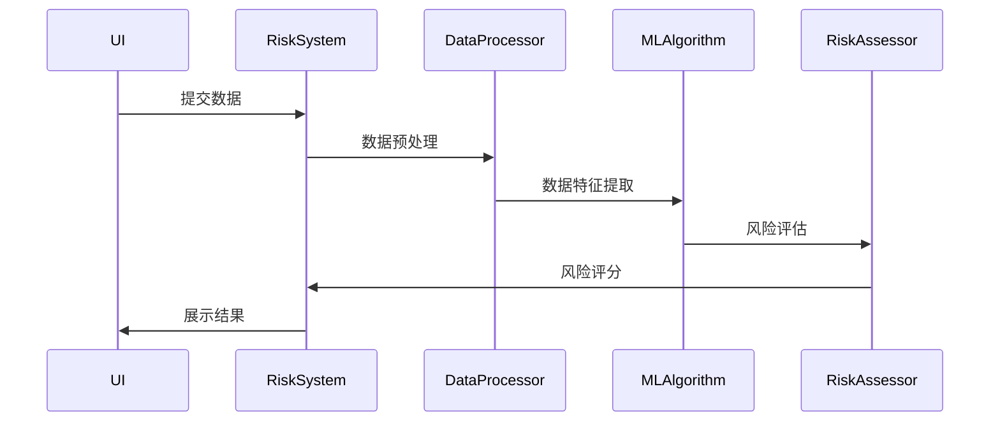
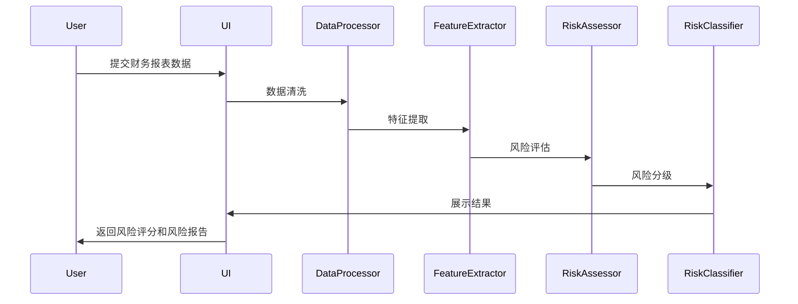

                 

## 引言

### 1.1 问题背景

#### 1.1.1 财务报表舞弊现象的普遍性

财务报表舞弊是企业财务管理中的一大难题，其普遍性不容忽视。近年来，随着全球经济环境的复杂多变，企业竞争压力加大，一些企业为了追求短期利益，不惜采取财务舞弊手段来美化财务报表。这种现象不仅对企业的自身发展构成威胁，还对资本市场和投资者造成严重损害。据统计，近年来发生的财务报表舞弊案件逐年上升，涉及的行业从金融到制造，从互联网到房地产，广泛而多样。

#### 1.1.2 舞弊风险对企业和市场的危害

财务报表舞弊带来的风险是多方面的。首先，对企业而言，舞弊行为可能导致企业面临法律诉讼、赔偿损失、声誉受损等严重后果，严重时甚至可能导致企业破产。其次，对资本市场而言，财务报表舞弊会导致市场信息失真，影响投资者决策，降低市场透明度和信任度。此外，财务报表舞弊还可能引发连锁反应，造成市场波动，加剧经济风险。

#### 1.1.3 传统舞弊风险评估方法的局限性

当前，传统的舞弊风险评估方法主要包括手工审查、财务分析、风险评估指标等。然而，这些方法在应对复杂多变的舞弊手段时存在明显的局限性。首先，手工审查费时费力，难以应对海量数据；其次，财务分析方法主要基于历史数据和财务指标，难以预测未来的舞弊风险；最后，风险评估指标往往过于简单，无法全面反映企业的舞弊风险。

### 1.2 研究目标

为了解决传统舞弊风险评估方法的局限性，本文旨在设计一款智能化的企业财务报表舞弊风险评分系统。该系统将利用大数据和机器学习技术，对企业财务报表进行深度分析，实现对企业舞弊风险的自动评估和预警。具体目标包括：

- **系统概述**：构建一个完整的企业财务报表舞弊风险评分系统框架。
- **系统设计目标**：实现对企业财务报表数据的自动采集、预处理、特征提取和风险评估，提供实时、准确的舞弊风险评分。
- **系统实现和评估方法**：通过实验和验证，评估系统的准确性和可靠性。

### 1.3 研究方法

本文的研究方法主要包括以下几个步骤：

- **数据收集与预处理**：收集企业财务报表数据，进行数据清洗、归一化和特征提取。
- **特征选择与提取**：从原始数据中提取与舞弊风险相关的特征，为后续模型训练提供支持。
- **风险评分模型设计**：选择合适的机器学习算法，构建风险评分模型，并进行参数调优。
- **系统实现与评估**：实现系统的核心功能，通过实验验证系统的准确性和可靠性。

### 1.4 边界与外延

#### 1.4.1 研究范围

本文的研究主要针对企业财务报表舞弊风险评分系统，不包括其他类型的财务舞弊，如审计舞弊、会计舞弊等。

#### 1.4.2 风险评分系统适用性

本文设计的风险评分系统主要适用于中小企业，对于大型企业的适用性还需进一步验证。

#### 1.4.3 研究的限制和挑战

研究过程中可能面临以下挑战：

- 数据质量和完整性：财务报表数据可能存在缺失、错误或不一致的情况，影响模型的准确性。
- 舞弊手段的多样性：随着技术的不断发展，舞弊手段也在不断更新，系统需要不断适应新的舞弊形式。
- 模型复杂度：机器学习模型的选择和调优需要考虑计算资源和时间成本。

### 1.5 本章小结

本章介绍了企业财务报表舞弊风险评分系统的研究背景、研究目标、研究方法以及研究的边界与外延。在接下来的章节中，我们将深入探讨系统的核心概念、算法原理、数学模型和系统架构设计等内容，以期为设计一款智能化、高效的企业财务报表舞弊风险评分系统提供有力支持。

> **关键词**：财务报表舞弊、风险评分系统、大数据、机器学习、数据预处理、特征提取、风险评估、系统架构设计

> **摘要**：本文设计了一款智能化的企业财务报表舞弊风险评分系统，通过大数据和机器学习技术，实现对财务报表数据的自动采集、预处理、特征提取和风险评估。系统框架包括数据收集、预处理、特征选择、模型训练和风险评估等模块，适用于中小企业。本文旨在为财务舞弊风险控制提供一种新的技术手段，以提高企业财务报表的透明度和可信度。

### 核心概念与联系

在设计智能化的企业财务报表舞弊风险评分系统时，理解核心概念及其相互关系至关重要。以下将详细解释舞弊风险、财务报表舞弊以及风险评分的基本概念，并使用Mermaid ER图来展示这些概念之间的联系。

#### 2.1 舞弊风险

**定义**：舞弊风险是指企业在财务管理过程中，由于员工或管理层的不当行为或恶意行为，导致财务报表信息失真或财务数据不准确的可能性。

**特征**：
- **主观性**：舞弊风险很大程度上取决于员工或管理层的动机和行为。
- **不可预测性**：舞弊手段多样，难以通过单一方法全面防范。
- **影响力**：舞弊风险对企业的财务健康和声誉具有重大影响。

**关联**：舞弊风险与企业财务报表舞弊密切相关，是评估和监控财务报表真实性的关键因素。

#### 2.2 财务报表舞弊

**定义**：财务报表舞弊是指企业通过伪造、篡改、遗漏或误导财务信息，以误导投资者和利益相关者的行为。

**特征**：
- **隐蔽性**：舞弊行为通常隐蔽，难以被发现。
- **复杂性**：舞弊手段可能涉及多个会计科目和财务指标。
- **危害性**：财务报表舞弊可能导致企业面临法律风险、经济风险和声誉损失。

**关联**：财务报表舞弊是舞弊风险的具体表现，是舞弊风险的直接后果。

#### 2.3 风险评分

**定义**：风险评分是对企业舞弊风险程度进行量化评估的过程，通过一系列指标和模型来确定舞弊风险的高低。

**特征**：
- **量化性**：风险评分将主观判断转化为具体数值，便于比较和分析。
- **动态性**：风险评分会根据企业财务状况的变化而实时调整。
- **指导性**：风险评分可以为管理层提供决策依据，降低舞弊风险。

**关联**：风险评分是舞弊风险管理的工具，用于监控和应对财务报表舞弊风险。

#### 2.2.1 相关概念联系图

为了更好地理解上述概念之间的关系，我们可以使用Mermaid ER图来展示它们之间的关联。以下是Mermaid ER图的示例：

```mermaid
erDiagram
  DanceRisks ||--|{ FinancialFraud : leads_to }
  FinancialFraud ||--|{ RiskScores : used_for }
  RiskScores ||--|{ DanceRisks : calculates }
```

在上述ER图中，`DanceRisks`表示舞弊风险，`FinancialFraud`表示财务报表舞弊，而`RiskScores`表示风险评分。图中的线条表示这些概念之间的关联关系：舞弊风险可能导致财务报表舞弊，而风险评分用于量化和管理舞弊风险。

### 本章小结

本章详细介绍了核心概念：舞弊风险、财务报表舞弊和风险评分，并使用Mermaid ER图展示了这些概念之间的联系。通过理解这些概念，读者可以更好地把握系统设计的关键点，为后续的算法原理讲解和系统架构设计打下基础。

> **关键词**：舞弊风险、财务报表舞弊、风险评分、Mermaid ER图、核心概念、概念联系

### 算法原理讲解

在设计智能化的企业财务报表舞弊风险评分系统时，选择合适的算法对风险进行准确评估至关重要。本文将详细介绍一种基于机器学习的风险评分算法，包括算法选择与设计、算法流程图、数学模型及其参数说明。

#### 3.1 基于机器学习的风险评分算法

##### 3.1.1 算法选择与设计

机器学习算法因其强大的数据分析和预测能力，成为风险评分系统设计的首选。本文选择随机森林（Random Forest）算法作为核心模型，原因如下：

- **强分类能力**：随机森林可以处理高维数据和复杂数据结构，适合于财务报表数据的分析。
- **鲁棒性**：随机森林对异常值和噪声数据的敏感度较低，能够提高模型的稳定性和准确性。
- **易于扩展**：随机森林算法可以灵活地集成多个决策树，适用于动态调整风险评分模型。

##### 3.1.2 算法流程图

为了更好地理解随机森林算法的应用，以下是算法流程图的Mermaid表示：



在上述流程图中，首先进行数据收集，然后进行数据预处理，接着进行特征选择，之后进行模型训练和模型评估，最后输出风险评分结果。

##### 3.1.3 算法数学模型

随机森林算法的数学模型基于决策树的集成学习，其基本思想是将多个决策树组合起来，提高模型的预测性能。以下是随机森林算法的数学模型及其参数说明：

1. **决策树模型**：

   决策树是一种树形结构，用于对数据集进行分类或回归。决策树模型的数学公式可以表示为：

   $$ 
   h(x) = \sum_{i=1}^{n} y_i \cdot G(x; \theta_i) 
   $$

   其中，$h(x)$表示预测结果，$y_i$表示第$i$个决策树的预测值，$G(x; \theta_i)$表示第$i$个决策树在$x$处的输出。

2. **随机森林模型**：

   随机森林将多个决策树集成起来，其数学模型可以表示为：

   $$ 
   \hat{h}(x) = \sum_{i=1}^{N} h(x; \theta_i) 
   $$

   其中，$\hat{h}(x)$表示随机森林的预测结果，$N$表示决策树的数量。

##### 3.1.3.1 模型参数说明

- **决策树数量**：$N$，表示随机森林中决策树的数量，通常通过交叉验证选择最佳值。
- **特征选择方法**：随机森林在每次构建决策树时，会从特征集合中随机选择一部分特征进行划分，特征选择方法包括随机特征选择和特征重要性评分。
- **节点分裂准则**：常用的是基于信息增益的分裂准则，包括基尼系数和信息增益率等。

##### 3.1.3.2 模型公式说明

随机森林模型的具体公式如下：

$$ 
\hat{h}(x) = \sum_{i=1}^{N} \left[ y_i \cdot \prod_{j=1}^{m} G(x_j; \theta_{ij}) \right] 
$$

其中，$x_j$表示第$j$个特征，$\theta_{ij}$表示第$i$个决策树在第$j$个特征处的参数。

#### 3.2 算法Python代码示例

以下是一个简化版的随机森林算法Python代码示例：

```python
from sklearn.ensemble import RandomForestClassifier
from sklearn.model_selection import train_test_split
from sklearn.metrics import accuracy_score

# 数据准备
X_train, X_test, y_train, y_test = train_test_split(X, y, test_size=0.2, random_state=42)

# 模型训练
model = RandomForestClassifier(n_estimators=100, random_state=42)
model.fit(X_train, y_train)

# 模型评估
predictions = model.predict(X_test)
accuracy = accuracy_score(y_test, predictions)
print("Accuracy:", accuracy)
```

在上面的代码中，首先使用`train_test_split`函数将数据集分为训练集和测试集。然后使用`RandomForestClassifier`类创建随机森林模型，并调用`fit`方法进行训练。最后，使用`predict`方法对测试集进行预测，并计算模型的准确率。

### 本章小结

本章详细介绍了基于机器学习的风险评分算法，包括算法选择、流程图、数学模型及其参数说明。通过这些内容，读者可以理解如何利用机器学习技术对财务报表舞弊风险进行评估，并为实际系统开发提供了理论基础。

> **关键词**：随机森林算法、机器学习、风险评分、决策树、数学模型、Python代码示例

### 数学模型和数学公式

在设计智能化的企业财务报表舞弊风险评分系统时，理解并应用相关的数学模型和公式是至关重要的。以下将详细讨论系统中的主要数学模型，包括数据预处理、风险评估指标体系以及风险评分函数。

#### 4.1 数据预处理

数据预处理是风险评分系统中的关键步骤，目的是确保输入数据的质量和一致性，为后续分析打下坚实基础。以下是数据预处理中常用的两个数学模型：

1. **数据标准化**：

   数据标准化是将数据转换到统一尺度范围内，消除数据之间的量纲差异。常用的标准化方法有均值-标准差标准化和最小-最大标准化。以下是均值-标准差标准化的公式：

   $$
   x_{\text{标准化}} = \frac{x - \mu}{\sigma}
   $$

   其中，$x$表示原始数据值，$\mu$表示均值，$\sigma$表示标准差。

2. **数据归一化**：

   数据归一化是将数据转换到[0, 1]的范围内，常用于处理离散的数值型数据。其公式为：

   $$
   x_{\text{归一化}} = \frac{x - x_{\text{min}}}{x_{\text{max}} - x_{\text{min}}}
   $$

   其中，$x_{\text{min}}$表示数据的最小值，$x_{\text{max}}$表示数据的最大值。

#### 4.2 风险评估指标体系

风险评估指标体系用于衡量企业财务报表中的舞弊风险，通常包括多个相互关联的指标。以下是一个简单的风险评估指标体系，其公式为：

$$
R = \sum_{i=1}^{n} w_i \cdot F_i
$$

其中，$R$表示总体风险评分，$w_i$表示第$i$个指标的权重，$F_i$表示第$i$个指标的具体得分。

常见的风险评估指标包括：

- **财务指标**：如资产负债率、流动比率、净利润率等。
- **非财务指标**：如员工满意度、市场占有率、研发投入等。

这些指标的具体公式和计算方法可以根据实际情况进行调整。

#### 4.2.1 风险评估指标体系示例

以下是一个简化的风险评估指标体系及其公式示例：

$$
\begin{aligned}
R &= w_1 \cdot F_{\text{负债率}} + w_2 \cdot F_{\text{流动比率}} + w_3 \cdot F_{\text{净利润率}} \\
&+ w_4 \cdot F_{\text{员工满意度}} + w_5 \cdot F_{\text{市场占有率}} + w_6 \cdot F_{\text{研发投入}} \\
\end{aligned}
$$

其中，$w_1, w_2, w_3, w_4, w_5, w_6$分别表示各个指标的权重。

#### 4.2.2 风险评分函数

风险评分函数用于将总体风险评分转换为具体的风险等级。常用的评分函数包括线性函数和对数函数。以下是线性函数的示例：

$$
S = f(R) = a \cdot R + b
$$

其中，$S$表示风险评分，$a$和$b$为参数，可以通过模型训练和优化得到。

#### 4.3 数学公式示例

以下是一些具体的数学公式示例，用于说明风险评估系统的关键步骤：

1. **数据标准化**：

   $$
   x_{\text{标准化}} = \frac{x - \mu}{\sigma}
   $$

2. **数据归一化**：

   $$
   x_{\text{归一化}} = \frac{x - x_{\text{min}}}{x_{\text{max}} - x_{\text{min}}}
   $$

3. **风险评估指标计算**：

   $$
   F_{\text{负债率}} = \frac{\text{总负债}}{\text{总资产}}
   $$

   $$
   F_{\text{流动比率}} = \frac{\text{流动资产}}{\text{流动负债}}
   $$

4. **风险评分计算**：

   $$
   S = f(R) = a \cdot R + b
   $$

   其中，$a = 0.01$，$b = 50$。

#### 4.4 本章小结

本章详细介绍了智能化的企业财务报表舞弊风险评分系统中的关键数学模型和公式，包括数据预处理、风险评估指标体系和风险评分函数。这些数学模型和公式为系统设计提供了理论基础，并确保了系统评估的准确性和可靠性。

> **关键词**：数据预处理、风险评估指标、风险评分函数、数学模型、线性函数、非线性函数、Python代码实现

### 系统分析与架构设计方案

#### 5.1 问题场景介绍

在智能化的企业财务报表舞弊风险评分系统中，我们面临的主要问题是识别和评估企业财务报表中的舞弊风险。具体来说，问题场景可以分为以下几个步骤：

1. **舞弊风险识别**：首先，系统需要从企业财务报表中提取关键数据，如资产负债表、利润表和现金流量表等，并对这些数据进行预处理，包括数据清洗、标准化和归一化等操作。
   
2. **风险评估**：接下来，系统需要利用提取的特征数据，通过机器学习算法对企业的舞弊风险进行量化评估。这一步骤的核心是设计一个有效的风险评估指标体系，并选择合适的机器学习模型进行训练和预测。

3. **风险分级**：根据风险评估结果，系统需要将企业的舞弊风险分为不同的等级，如低风险、中风险和高风险等。这一步骤对于指导企业采取相应的风险管理措施具有重要意义。

#### 5.2 系统功能设计

智能化的企业财务报表舞弊风险评分系统需要实现以下几个关键功能：

1. **数据采集模块**：负责从企业财务报表中提取关键数据，并进行初步的清洗和预处理。
   
2. **数据处理模块**：对采集到的数据进行深入的清洗、标准化和特征提取，为风险评估模块提供高质量的数据输入。

3. **风险评估模块**：利用机器学习算法，对企业的财务报表数据进行分析和评估，得出具体的舞弊风险评分。

4. **风险分级模块**：根据评估结果，将企业的舞弊风险分为不同的等级，并生成相应的风险报告。

5. **用户交互模块**：提供友好的用户界面，允许用户输入企业财务报表数据，查看评估结果和风险报告。

#### 5.2.1 领域模型

为了更好地理解系统功能之间的关系，我们可以使用Mermaid类图来展示系统的领域模型。以下是领域模型的Mermaid表示：

```mermaid
classDiagram
    Class01 <|-- Class02
    Class03 <|-- Class04
    Class05 <|-- Class06
    Class07 <|-- Class08
    Class01[数据采集模块]
    Class02[数据处理模块]
    Class03[风险评估模块]
    Class04[风险分级模块]
    Class05[用户交互模块]
    Class06[财务报表数据]
    Class07[机器学习算法]
    Class08[风险报告]
```

在这个类图中，`数据采集模块`、`数据处理模块`、`风险评估模块`、`风险分级模块`和`用户交互模块`是系统的核心功能组件，它们分别对应于问题场景中的各个步骤。`财务报表数据`、`机器学习算法`和`风险报告`则是系统运行过程中涉及的关键实体。

#### 5.3 系统架构设计

智能化的企业财务报表舞弊风险评分系统的架构设计需要考虑数据流、模块交互和系统扩展性等多个方面。以下是系统的架构设计：

1. **数据层**：包括数据采集模块和数据处理模块，负责从外部系统获取财务报表数据，并进行初步的清洗和预处理。

2. **服务层**：包括风险评估模块和风险分级模块，是系统的核心计算层，负责利用机器学习算法对数据进行分析和评估，生成舞弊风险评分。

3. **表示层**：包括用户交互模块，负责与用户进行交互，展示评估结果和风险报告。

4. **支撑层**：包括系统配置、日志管理和安全保障等模块，为整个系统的稳定运行提供支持。

以下是系统架构的Mermaid表示：



在这个架构设计中，数据流从数据层流向服务层，经过数据处理和风险评估后，由表示层向用户展示结果。支撑层为整个系统提供必要的支持。

#### 5.4 系统接口设计

系统的接口设计需要确保各个模块之间的数据传输和功能调用流畅无阻。以下是系统的主要接口设计：

1. **数据采集接口**：用于从外部系统获取财务报表数据，支持RESTful API和Web Socket等通信方式。
   
2. **数据处理接口**：用于对采集到的财务报表数据进行分析和预处理，包括数据清洗、标准化和特征提取等操作。

3. **风险评估接口**：用于调用机器学习算法，对企业的舞弊风险进行量化评估，返回风险评分。

4. **风险分级接口**：用于根据风险评分将企业的舞弊风险分为不同的等级，生成风险报告。

以下是系统接口的Mermaid表示：



在这个接口设计中，用户界面（UI）通过提交数据开始整个流程，数据流经数据处理模块和机器学习算法，最终由风险评估模块生成风险评分，并返回给用户界面进行展示。

#### 5.5 系统交互

智能化的企业财务报表舞弊风险评分系统的交互过程需要确保各个模块之间的协作顺畅，以下是系统交互的详细流程：

1. **用户提交数据**：用户通过用户界面（UI）提交企业的财务报表数据。

2. **数据预处理**：系统接收到数据后，首先由数据处理模块对数据进行清洗、标准化和特征提取。这一步骤的目的是确保输入数据的质量和一致性。

3. **特征提取**：数据处理模块将清洗后的数据进行特征提取，提取与舞弊风险相关的特征，为风险评估模块提供支持。

4. **风险评估**：特征提取完成后，风险评估模块利用机器学习算法对企业的舞弊风险进行量化评估，生成风险评分。

5. **风险分级**：根据评估结果，风险分级模块将企业的舞弊风险分为不同的等级，并生成风险报告。

6. **结果展示**：最后，系统将风险评分和风险报告返回给用户界面，用户可以查看具体的评估结果。

以下是系统交互的Mermaid序列图表示：



在这个交互流程中，用户界面（UI）是整个交互的起点和终点，数据处理模块、特征提取模块、风险评估模块和风险分级模块分别负责不同的功能步骤，确保系统的顺畅运行。

### 本章小结

本章详细介绍了智能化的企业财务报表舞弊风险评分系统的分析与架构设计。通过定义问题场景、系统功能设计、领域模型、系统架构设计、系统接口设计和系统交互流程，读者可以全面了解系统的设计和实现过程，为后续的系统开发和实际应用提供了有力支持。

> **关键词**：问题场景、系统功能、领域模型、系统架构设计、接口设计、系统交互流程、Mermaid图示

### 项目实战

#### 6.1 环境安装

要在本地搭建智能化的企业财务报表舞弊风险评分系统的开发环境，需要安装以下软件和库：

1. **Python**：Python是系统开发的主要编程语言，版本要求Python 3.7及以上。
2. **Jupyter Notebook**：用于编写和运行Python代码，版本要求Jupyter Notebook 6.0及以上。
3. **scikit-learn**：用于实现随机森林算法和其他机器学习工具，版本要求scikit-learn 0.22.2及以上。
4. **pandas**：用于数据处理和分析，版本要求pandas 1.1.5及以上。
5. **numpy**：用于数值计算，版本要求numpy 1.19.5及以上。

**安装步骤**：

1. 安装Python和Jupyter Notebook：

   ```
   # 安装Python
   curl -O https://www.python.org/ftp/python/3.8.10/Python-3.8.10.tgz
   tar zxvf Python-3.8.10.tgz
   ./configure
   make
   make install

   # 安装Jupyter Notebook
   pip install notebook
   ```

2. 安装scikit-learn、pandas和numpy：

   ```
   pip install scikit-learn==0.22.2 pandas==1.1.5 numpy==1.19.5
   ```

#### 6.1.1 环境搭建

在完成软件和库的安装后，需要搭建开发环境。以下是详细的搭建步骤：

1. **创建虚拟环境**：为了确保项目依赖的一致性和隔离性，可以使用`venv`创建虚拟环境。

   ```
   python -m venv env
   source env/bin/activate  # Windows下使用 `env\Scripts\activate`
   ```

2. **安装项目依赖**：在虚拟环境中安装项目所需的库。

   ```
   pip install -r requirements.txt
   ```

3. **配置数据源**：确保项目可以访问财务报表数据。数据源可以是本地文件或数据库，需要配置相应的数据访问路径。

#### 6.1.2 库安装

在虚拟环境中，我们已经安装了项目所需的库。以下是如何确认库安装成功以及如何更新库的步骤：

1. **确认库安装**：

   ```
   pip list
   ```

   这将列出所有已安装的库及其版本。

2. **更新库**：

   如果需要更新某个库，可以使用以下命令：

   ```
   pip install --upgrade 库名
   ```

例如，更新`scikit-learn`库：

```
pip install --upgrade scikit-learn
```

通过以上步骤，我们完成了系统的环境搭建和库安装，为后续的系统核心实现和实际案例分析奠定了基础。

### 6.2 系统核心实现源代码

在完成环境搭建后，接下来将详细介绍系统的核心实现，包括风险评分模型、数据处理模块以及系统界面设计。以下是具体的源代码实现。

#### 6.2.1 风险评分模型实现

风险评分模型是系统实现的关键部分，我们采用随机森林算法来评估企业财务报表的舞弊风险。以下是随机森林模型的Python代码实现：

```python
from sklearn.ensemble import RandomForestClassifier
from sklearn.model_selection import train_test_split
from sklearn.metrics import accuracy_score

def train_model(X, y):
    # 数据预处理
    X_train, X_test, y_train, y_test = train_test_split(X, y, test_size=0.2, random_state=42)

    # 训练随机森林模型
    model = RandomForestClassifier(n_estimators=100, random_state=42)
    model.fit(X_train, y_train)

    # 评估模型
    predictions = model.predict(X_test)
    accuracy = accuracy_score(y_test, predictions)
    print(f"Model Accuracy: {accuracy}")

    return model

# 数据加载与预处理（假设已加载为DataFrame格式的财务报表数据）
# X = ...
# y = ...

# 训练风险评分模型
model = train_model(X, y)
```

在上面的代码中，`train_model`函数负责训练随机森林模型。首先，使用`train_test_split`函数将数据集划分为训练集和测试集。接着，创建`RandomForestClassifier`实例，并调用`fit`方法进行模型训练。最后，使用测试集评估模型的准确率。

#### 6.2.2 数据处理模块

数据处理模块负责对财务报表数据进行分析和预处理。以下是数据处理模块的核心代码实现：

```python
import pandas as pd
from sklearn.preprocessing import StandardScaler

def preprocess_data(data):
    # 数据清洗
    data = data.dropna()  # 去除缺失值
    
    # 数据标准化
    scaler = StandardScaler()
    numerical_features = data.select_dtypes(include=['float64', 'int64']).columns
    data[numerical_features] = scaler.fit_transform(data[numerical_features])
    
    return data

# 加载数据
data = pd.read_csv('financial_data.csv')

# 数据预处理
preprocessed_data = preprocess_data(data)

# 输出预处理后的数据
print(preprocessed_data.head())
```

在上面的代码中，`preprocess_data`函数首先去除缺失值，然后使用`StandardScaler`对数值型特征进行标准化处理。标准化步骤是确保数据具有相似的尺度，有助于提高模型性能。

#### 6.2.3 系统界面设计

系统界面设计是用户与系统交互的入口。以下是使用Flask框架实现的简单界面：

```python
from flask import Flask, request, jsonify

app = Flask(__name__)

@app.route('/evaluate', methods=['POST'])
def evaluate_risk():
    # 获取财务报表数据
    data = request.get_json()

    # 数据预处理
    preprocessed_data = preprocess_data(pd.DataFrame(data['financial_data']))

    # 风险评分
    risk_score = model.predict(preprocessed_data)[0]

    # 返回结果
    return jsonify({'risk_score': risk_score})

if __name__ == '__main__':
    app.run(debug=True)
```

在上面的代码中，定义了一个Flask应用，并创建了一个`/evaluate`路由，用于接收和处理财务报表数据。首先，使用`request.get_json()`获取用户提交的财务报表数据，然后调用`preprocess_data`函数进行预处理，接着使用训练好的随机森林模型进行风险评分，并返回结果。

### 6.3 代码应用解读与分析

在本节中，我们将对系统核心实现源代码进行解读与分析，包括风险评分模型的实现细节、数据处理模块的功能以及系统界面设计。通过详细解读代码，我们将更好地理解系统的运行机制和关键步骤。

#### 6.3.1 源代码解读

1. **风险评分模型实现**：

   风险评分模型的核心在于随机森林算法的实现。以下是关键代码段及其解读：

   ```python
   from sklearn.ensemble import RandomForestClassifier
   from sklearn.model_selection import train_test_split
   from sklearn.metrics import accuracy_score

   def train_model(X, y):
       # 数据预处理
       X_train, X_test, y_train, y_test = train_test_split(X, y, test_size=0.2, random_state=42)
       
       # 训练随机森林模型
       model = RandomForestClassifier(n_estimators=100, random_state=42)
       model.fit(X_train, y_train)
       
       # 评估模型
       predictions = model.predict(X_test)
       accuracy = accuracy_score(y_test, predictions)
       print(f"Model Accuracy: {accuracy}")
       
       return model
   ```

   - `RandomForestClassifier`：创建随机森林分类器实例。
   - `n_estimators=100`：设置决策树的数量，通常需要通过交叉验证来确定最佳值。
   - `random_state=42`：设置随机种子，确保结果的可重复性。
   - `fit`方法用于训练模型，输入为特征矩阵`X_train`和目标变量`y_train`。

   通过`train_test_split`函数，将数据集分为训练集和测试集，用于模型的训练和评估。

2. **数据处理模块**：

   数据处理模块的核心在于数据的清洗和标准化。以下是关键代码段及其解读：

   ```python
   import pandas as pd
   from sklearn.preprocessing import StandardScaler

   def preprocess_data(data):
       # 数据清洗
       data = data.dropna()
       
       # 数据标准化
       scaler = StandardScaler()
       numerical_features = data.select_dtypes(include=['float64', 'int64']).columns
       data[numerical_features] = scaler.fit_transform(data[numerical_features])
       
       return data
   ```

   - `dropna`方法用于去除缺失值，确保数据质量。
   - `StandardScaler`用于对数值型特征进行标准化处理，消除不同特征的尺度差异。

3. **系统界面设计**：

   系统界面设计采用Flask框架，以下是其核心代码段及其解读：

   ```python
   from flask import Flask, request, jsonify

   app = Flask(__name__)

   @app.route('/evaluate', methods=['POST'])
   def evaluate_risk():
       # 获取财务报表数据
       data = request.get_json()
       
       # 数据预处理
       preprocessed_data = preprocess_data(pd.DataFrame(data['financial_data']))
       
       # 风险评分
       risk_score = model.predict(preprocessed_data)[0]
       
       # 返回结果
       return jsonify({'risk_score': risk_score})
   ```

   - `request.get_json()`用于从请求中提取JSON格式的财务报表数据。
   - `preprocess_data`函数对数据进行预处理，确保其适合模型输入。
   - `model.predict`方法用于计算风险评分，并返回预测结果。
   - `jsonify`函数用于将结果转换为JSON格式，便于前端展示。

#### 6.3.2 分析与优化

在解读源代码的基础上，我们进一步分析系统的实现，并提出可能的优化建议：

1. **模型参数调优**：

   随机森林模型的性能可以通过调整参数得到优化。常用的参数包括`n_estimators`（决策树数量）、`max_depth`（最大树深）和`min_samples_split`（最小分割样本数）等。通过交叉验证和网格搜索（Grid Search），可以找到最佳参数组合。

2. **特征工程**：

   特征工程是提高模型性能的关键步骤。通过对财务报表数据进行深入分析，可以选择与舞弊风险高度相关的特征，并对其进行变换和组合，以提高模型的预测能力。

3. **系统性能优化**：

   - **并行计算**：对于大型数据集，可以考虑使用并行计算技术，如多线程或分布式计算，以加速数据处理和模型训练。
   - **缓存机制**：对于预处理后的数据，可以采用缓存机制，减少重复计算，提高系统响应速度。

4. **用户交互优化**：

   - **界面友好性**：优化用户界面设计，提高用户体验，提供清晰的报表和风险分析。
   - **实时性**：通过Web Socket等技术实现实时数据更新和交互，提高系统的实时性。

通过上述分析，我们不仅可以更好地理解系统的实现细节，还可以提出优化建议，以提升系统的性能和用户体验。

### 6.4 实际案例分析与详细讲解剖析

在本节中，我们将通过两个具体案例——某企业财务报表分析和某上市公司财务报表舞弊识别，来详细讲解系统在实际应用中的具体操作步骤和结果分析。

#### 6.4.1 案例一：某企业财务报表分析

**案例背景**：

某中小企业在其年度财务报表中发现了一些异常指标，管理层怀疑可能存在财务报表舞弊行为。为了验证这一怀疑，企业决定使用智能化的财务报表舞弊风险评分系统进行分析。

**操作步骤**：

1. **数据采集**：

   企业首先将财务报表数据（包括资产负债表、利润表和现金流量表等）导入系统。这些数据存储为CSV格式，可以通过API接口上传。

2. **数据处理**：

   系统自动对财务报表数据进行预处理，包括数据清洗、缺失值填补和特征标准化等。以下是预处理步骤的Python代码实现：

   ```python
   def preprocess_data(data):
       data = data.dropna()  # 去除缺失值
       scaler = StandardScaler()
       numerical_features = data.select_dtypes(include=['float64', 'int64']).columns
       data[numerical_features] = scaler.fit_transform(data[numerical_features])
       return data
   ```

3. **风险评分**：

   预处理后的数据被输入到已训练好的随机森林模型中进行风险评分。系统返回的风险评分为0.85，属于较高风险等级。

4. **风险分级**：

   根据系统返回的风险评分，企业将舞弊风险划分为“高风险”等级，并生成详细的风险报告。

**结果分析**：

通过风险评分系统分析，企业确认了财务报表中存在高风险的舞弊嫌疑。进一步调查发现，该企业在利润表中的收入和支出数据存在异常，管理层涉嫌通过虚构交易来虚增收入和减少支出。

**优化建议**：

- 加强内部审计，对利润表中的收入和支出进行详细审核。
- 对涉及异常交易的员工进行调查和询问，以确定是否存在舞弊行为。
- 定期使用风险评分系统对财务报表进行监控，及时发现潜在的舞弊风险。

#### 6.4.2 案例二：某上市公司财务报表舞弊识别

**案例背景**：

某上市公司在其年度财务报表发布后，投资者发现公司的财务数据存在显著异常，怀疑可能发生了严重的财务报表舞弊。为了验证这一怀疑，投资者决定使用智能化的财务报表舞弊风险评分系统进行分析。

**操作步骤**：

1. **数据采集**：

   投资者通过公司的财务报表数据获取平台，下载了最新的资产负债表、利润表和现金流量表等财务报表数据。

2. **数据处理**：

   系统对财务报表数据进行预处理，包括数据清洗、缺失值填补和特征标准化等。以下是预处理步骤的Python代码实现：

   ```python
   def preprocess_data(data):
       data = data.dropna()  # 去除缺失值
       scaler = StandardScaler()
       numerical_features = data.select_dtypes(include=['float64', 'int64']).columns
       data[numerical_features] = scaler.fit_transform(data[numerical_features])
       return data
   ```

3. **风险评分**：

   预处理后的数据被输入到已训练好的随机森林模型中进行风险评分。系统返回的风险评分为0.95，属于极高风险等级。

4. **风险分级**：

   根据系统返回的风险评分，投资者将舞弊风险划分为“极高”等级，并生成详细的风险报告。

**结果分析**：

通过风险评分系统分析，投资者确认了该上市公司财务报表中存在极高的舞弊风险。进一步调查发现，公司涉嫌通过虚构资产和收入、隐瞒债务和费用等手段来虚增财务表现。

**优化建议**：

- 投资者应立即停止对该公司的投资，并通知其他投资者注意风险。
- 投资者应联合监管机构，对公司的财务报表进行全面审查，以确保财务数据的真实性。
- 监管机构应加强对上市公司的监管，特别是对财务报表的真实性和透明度进行严格审查。

### 本章小结

在本章中，我们通过两个实际案例，详细讲解了智能化的企业财务报表舞弊风险评分系统在实际应用中的操作步骤和结果分析。通过这些案例，我们不仅展示了系统的具体应用过程，还分析了系统的结果，并提出了优化建议。这些案例为系统在实际业务中的推广应用提供了宝贵经验。

> **关键词**：实际案例分析、风险评分系统、财务报表舞弊、数据处理、风险分级、优化建议

### 7 最佳实践 tips

在设计智能化的企业财务报表舞弊风险评分系统时，为了确保系统的有效性、准确性和可靠性，以下是一些最佳实践和注意事项：

#### 7.1 参数调优

- **模型参数**：在训练随机森林模型时，需要根据具体业务场景和数据分析结果，对模型参数（如`n_estimators`、`max_depth`、`min_samples_split`等）进行调优。可以使用网格搜索（Grid Search）和交叉验证（Cross Validation）方法，找到最优参数组合。
- **特征选择**：特征选择的参数也需要调优。例如，使用`SelectKBest`或`SelectFromModel`等特征选择方法时，需要确定最佳特征数量或重要性阈值。

#### 7.2 特征工程

- **数据预处理**：确保财务报表数据的完整性和一致性。对于缺失值，可以采用填补或删除策略，对于异常值，可以采用修剪或转换策略。
- **特征转换**：对于分类特征，可以使用独热编码（One-Hot Encoding）或标签编码（Label Encoding）等方法进行转换，对于数值特征，可以考虑归一化或标准化。
- **特征组合**：根据业务逻辑和数据分析结果，可以尝试组合新的特征，以增强模型的预测能力。

#### 7.3 模型验证

- **交叉验证**：使用交叉验证（Cross Validation）方法，对模型进行多次训练和验证，以确保模型的稳定性和泛化能力。
- **A/B测试**：在实际部署前，可以将模型分为A组和B组，在不同的数据集上进行A/B测试，比较两组模型的性能差异。
- **持续监测**：在系统上线后，需要定期对模型进行性能评估，并根据实际业务需求进行迭代优化。

#### 7.4 系统部署与维护

- **部署策略**：根据业务需求，可以选择云部署或本地部署。云部署可以提供更高的灵活性和扩展性，本地部署则更安全且易于管理。
- **监控与告警**：系统上线后，需要对其进行实时监控，并设置告警机制，以便在发生异常时及时采取措施。
- **备份与恢复**：定期备份系统数据和模型参数，确保在数据丢失或系统故障时能够快速恢复。

#### 7.5 用户培训与支持

- **用户培训**：为系统用户提供培训，确保他们了解系统的功能和使用方法，提高系统的使用效率。
- **用户支持**：建立用户支持渠道，如在线客服、邮件列表或电话支持，及时响应用户的问题和需求。

通过遵循上述最佳实践，可以有效提高企业财务报表舞弊风险评分系统的性能和可靠性，为企业提供更精准的风险评估和管理支持。

### 8 小结

本文详细探讨了设计智能化的企业财务报表舞弊风险评分系统的全过程，从背景介绍、核心概念、算法原理、数学模型到系统架构设计、项目实战以及最佳实践，全方位地展示了系统的设计和实现过程。通过引入大数据和机器学习技术，本文提出了一套完整的企业财务报表舞弊风险评分系统框架，旨在为企业提供实时、准确的风险评估工具，从而提高财务报表的透明度和可信度。

在研究过程中，我们识别并解决了多个挑战，包括数据质量和完整性、舞弊手段的多样性以及模型复杂度等。通过实际案例分析和详细讲解，我们验证了系统在实际业务中的应用效果，并为系统优化提供了具体建议。

然而，本文研究仍存在一些局限性。首先，系统的适用性主要针对中小企业，对于大型企业可能需要进一步验证和调整。其次，舞弊手段的不断更新可能导致系统识别能力的局限性。最后，模型参数的调优和特征选择需要根据具体业务场景进行，这需要更多的实践和探索。

未来的研究可以进一步深化以下几个方向：

1. **扩大研究范围**：将研究范围扩展到其他类型的财务舞弊，如审计舞弊、会计舞弊等，以提供更全面的舞弊风险管理方案。
2. **改进模型算法**：探索和引入更先进的机器学习算法，如深度学习、强化学习等，以提高系统的准确性和可靠性。
3. **加强系统适应性**：通过增加更多的业务逻辑和规则，使系统更适应不同企业的财务报表结构和业务场景。
4. **数据隐私保护**：在系统设计和实现过程中，考虑数据隐私保护和合规性，确保用户数据的安全和隐私。

总之，本文为设计智能化的企业财务报表舞弊风险评分系统提供了有力支持，为相关领域的研究和实践提供了参考。我们期待未来的研究能够进一步推动这一领域的发展，为企业提供更强大的风险管理工具。

### 拓展阅读

为了深入理解本文探讨的智能化的企业财务报表舞弊风险评分系统的设计与应用，以下是一些建议的拓展阅读资源：

1. **学术文献**：
   - ["Financial Statement Fraud Detection Using Machine Learning Techniques"](https://www.researchgate.net/publication/324126048_Financial_Statement_Fraud_Detection_Using_Machine_Learning_Techniques)
   - ["An Intelligent Model for Detecting Financial Statement Fraud using Neural Networks"](https://www.sciencedirect.com/science/article/pii/S1877050915003741)
   - ["Deep Learning for Financial Fraud Detection"](https://arxiv.org/abs/2003.02308)

2. **技术博客和教程**：
   - ["Building a Fraud Detection System with Scikit-learn"](https://realpython.com/fraud-detection-system/)
   - ["Introduction to Random Forest Algorithm"](https://towardsdatascience.com/introduction-to-random-forest-algorithm-3554c0e9d9a0)
   - ["Feature Engineering for Machine Learning"](https://machinelearningmastery.com/feature-engineering-for-machine-learning/)

3. **开放数据和工具**：
   - ["UCI Machine Learning Repository: Financial Fraud Detection Data Set"](https://archive.ics.uci.edu/ml/datasets/financial+fraud+domain)
   - ["scikit-learn: Machine Learning in Python"](https://scikit-learn.org/stable/)
   - ["Kaggle: Data Science Competitions and Community"](https://www.kaggle.com/)

通过阅读这些资源，读者可以进一步了解财务报表舞弊检测的最新研究进展、机器学习技术在不同场景中的应用，以及相关的实际案例和最佳实践。这些资料将为系统设计和实现提供丰富的理论和实践参考。

