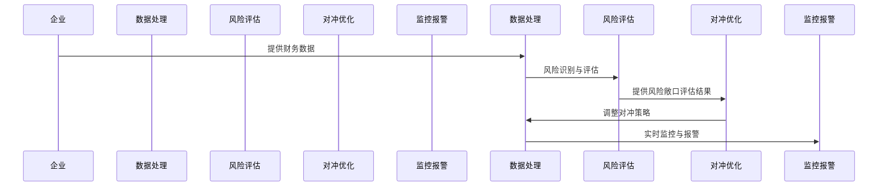
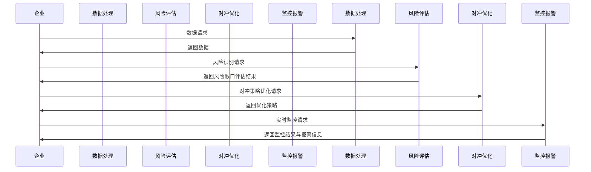

                 


## 设计智能化的企业财务风险敞口动态调整与对冲模型

### 关键词
- 企业财务风险
- 智能化
- 风险敞口
- 动态调整
- 对冲模型

### 摘要
本文旨在探讨如何设计一种智能化的企业财务风险敞口动态调整与对冲模型。我们将首先介绍财务风险的概念及其对企业的影响，随后讨论风险敞口和动态调整的基本原理。接着，我们将深入探讨对冲策略，并介绍如何将智能化技术应用于这些策略中。最后，我们将提供数学模型和算法原理，并通过一个实际案例展示模型的实际应用和效果。

## 背景介绍

### 1. 财务风险的概念及其影响

财务风险是指企业财务活动中可能面临的不确定性，可能导致企业财务状况恶化。财务风险包括但不限于信用风险、市场风险、流动性风险和操作风险。这些风险的存在使得企业在运营过程中可能面临严重的财务困境，甚至破产。

- **信用风险**：企业面临无法回收应收账款的风险。
- **市场风险**：由于市场波动导致企业资产贬值或收益减少的风险。
- **流动性风险**：企业无法及时满足债务支付需求的风险。
- **操作风险**：由于内部流程、系统缺陷或人为错误导致的风险。

### 2. 风险敞口的概念

风险敞口是指企业在特定风险下可能面临的最大损失。企业需要识别和评估其风险敞口，以便制定相应的对冲策略。

### 3. 动态调整的基本原理

动态调整是指根据市场变化和企业内部状况，实时调整风险敞口和相应的对冲策略。动态调整能够提高企业对风险的应对能力，减少潜在损失。

### 4. 智能化技术在财务中的应用

随着人工智能和大数据技术的发展，智能化技术在财务风险管理中的应用越来越广泛。智能化技术可以帮助企业更准确、更快速地识别风险、评估风险敞口，并制定有效的对冲策略。

## 核心概念与联系

### 1. 财务风险

财务风险是指企业在财务活动中可能面临的不确定性，可能导致企业财务状况恶化。财务风险包括但不限于信用风险、市场风险、流动性风险和操作风险。

| 风险类型 | 描述 |
| --- | --- |
| 信用风险 | 企业面临无法回收应收账款的风险 |
| 市场风险 | 由于市场波动导致企业资产贬值或收益减少的风险 |
| 流动性风险 | 企业无法及时满足债务支付需求的风险 |
| 操作风险 | 由于内部流程、系统缺陷或人为错误导致的风险 |

### 2. 风险敞口

风险敞口是指企业在特定风险下可能面临的最大损失。企业需要识别和评估其风险敞口，以便制定相应的对冲策略。

### 3. 动态调整

动态调整是指根据市场变化和企业内部状况，实时调整风险敞口和相应的对冲策略。动态调整能够提高企业对风险的应对能力，减少潜在损失。

### 4. 对冲策略

对冲策略是指企业通过多种手段来降低或消除风险敞口。对冲策略包括但不限于保险、套期保值和多元化投资等。

### 5. 智能化算法

智能化算法是指利用人工智能技术，对财务数据进行处理和分析，以识别风险、评估风险敞口并制定对冲策略。常见的智能化算法包括机器学习、深度学习和神经网络等。

### 财务风险与智能算法的关系

智能化算法在财务风险管理中的应用，使得企业能够更准确、更快速地识别风险、评估风险敞口，并制定有效的对冲策略。智能化技术不仅提高了企业对风险的应对能力，还减少了人工错误和主观判断的影响。

### ER实体关系图架构

```mermaid
entityRelationshipDiagram
  title ER Diagram for Financial Risk Management

  entity "Financial Risk" {
    attribute "Type"
    attribute "Description"
  }
  entity "Risk Exposition" {
    attribute "Maximum Loss"
    attribute "Risk Type"
  }
  entity "Dynamic Adjustment" {
    attribute "Market Change"
    attribute "Internal Status"
  }
  entity "Hedging Strategy" {
    attribute "Insurance"
    attribute "Hedging Instrument"
  }
  entity "Intelligent Algorithm" {
    attribute "Machine Learning"
    attribute "Deep Learning"
    attribute "Neural Network"
  }

  relationship "Risk Management" {
    "Financial Risk" -> "Risk Exposition"
    "Dynamic Adjustment" -> "Risk Exposition"
    "Hedging Strategy" -> "Risk Exposition"
    "Intelligent Algorithm" -> "Hedging Strategy"
  }
```

## 算法原理讲解

### 1. 智能算法在财务风险调整中的应用

智能算法在财务风险管理中的应用，主要包括以下几个方面：

- **风险识别**：通过机器学习算法，对历史数据进行训练，识别出潜在的财务风险。
- **风险敞口评估**：利用深度学习算法，对企业的财务状况进行分析，评估风险敞口。
- **对冲策略优化**：通过神经网络算法，对不同的对冲策略进行评估和优化，以实现最佳风险控制效果。

### 2. 风险敞口评估算法

风险敞口评估算法的核心是建立风险敞口评估模型。该模型通常包括以下几个步骤：

1. **数据收集**：收集企业的历史财务数据、市场数据和相关风险指标。
2. **特征提取**：对收集到的数据进行预处理，提取出与风险敞口相关的特征。
3. **模型训练**：利用训练数据，训练风险敞口评估模型。
4. **模型评估**：对训练好的模型进行评估，确保其准确性和可靠性。

### 3. 对冲策略优化算法

对冲策略优化算法的核心是建立对冲策略优化模型。该模型通常包括以下几个步骤：

1. **对冲策略设定**：根据企业的风险敞口评估结果，设定相应的对冲策略。
2. **策略评估**：利用神经网络算法，对不同的对冲策略进行评估和比较。
3. **策略优化**：根据评估结果，对对冲策略进行优化，以达到最佳风险控制效果。

### 4. 算法实现细节

算法实现细节包括算法选择、模型参数设置、数据预处理和算法优化等方面。以下是一个简单的风险敞口评估算法实现示例：

```python
import numpy as np
from sklearn.model_selection import train_test_split
from sklearn.ensemble import RandomForestRegressor

# 数据预处理
def preprocess_data(data):
    # 数据清洗、归一化、特征提取等操作
    pass

# 模型训练
def train_model(train_data, train_target):
    model = RandomForestRegressor(n_estimators=100)
    model.fit(train_data, train_target)
    return model

# 模型评估
def evaluate_model(model, test_data, test_target):
    predictions = model.predict(test_data)
    # 计算评估指标，如均方误差、准确率等
    pass

# 主函数
def main():
    data = load_data()
    preprocessed_data = preprocess_data(data)
    train_data, test_data, train_target, test_target = train_test_split(preprocessed_data, test_size=0.2)
    
    model = train_model(train_data, train_target)
    evaluate_model(model, test_data, test_target)

if __name__ == "__main__":
    main()
```

## 数学模型和数学公式

### 1. 风险敞口评估模型

风险敞口评估模型通常基于概率统计方法建立。以下是一个简单的一元风险敞口评估模型：

$$
R = \frac{P(X > T)}{P(X \ge T)}
$$

其中，\(R\) 表示风险敞口，\(X\) 表示资产价值，\(T\) 表示阈值。

### 2. 对冲策略优化模型

对冲策略优化模型通常基于优化理论建立。以下是一个简单的对冲策略优化模型：

$$
\min \sum_{i=1}^{n} w_i \cdot (p_i - c_i)
$$

其中，\(w_i\) 表示第 \(i\) 种对冲策略的权重，\(p_i\) 表示第 \(i\) 种对冲策略的成本，\(c_i\) 表示第 \(i\) 种对冲策略的收益。

### 3. 算法参数优化模型

算法参数优化模型通常基于机器学习算法建立。以下是一个简单的算法参数优化模型：

$$
\min \sum_{i=1}^{n} (y_i - \hat{y}_i)^2
$$

其中，\(y_i\) 表示第 \(i\) 个样本的实际标签，\(\hat{y}_i\) 表示第 \(i\) 个样本的预测标签。

## 系统分析与架构设计方案

### 1. 问题场景介绍

假设某企业面临市场风险，需要对其财务风险敞口进行动态调整与对冲。企业希望利用智能化技术，实现对财务风险的实时监控和优化。

### 2. 系统功能设计

系统功能设计主要包括以下几个部分：

- **数据收集与处理模块**：负责收集企业财务数据、市场数据和相关风险指标，并进行数据预处理。
- **风险识别与评估模块**：利用机器学习算法，对财务数据进行处理，识别潜在风险并评估风险敞口。
- **对冲策略优化模块**：根据风险敞口评估结果，设定对冲策略，并进行优化。
- **实时监控与报警模块**：实时监控企业财务状况，发现风险隐患并发出报警。

### 3. 系统架构设计

系统架构设计如图所示：



### 4. 系统接口设计

系统接口设计主要包括以下几个部分：

- **数据接口**：用于与其他系统进行数据交换和共享。
- **服务接口**：提供风险识别、评估、对冲策略优化等功能。
- **监控接口**：用于实时监控企业财务状况。

### 5. 系统交互

系统交互设计如图所示：



## 项目实战

### 1. 项目背景

某大型跨国企业面临严重的市场风险，需要对其财务风险敞口进行动态调整与对冲。企业希望通过智能化技术，实现对财务风险的实时监控和优化，降低潜在损失。

### 2. 系统实现

#### 环境安装

在虚拟环境中安装必要的依赖库，如Python、NumPy、Scikit-learn、Matplotlib等。

```bash
pip install numpy scikit-learn matplotlib
```

#### 系统核心实现

以下是系统核心实现的部分代码：

```python
# 数据处理模块
def preprocess_data(data):
    # 数据清洗、归一化、特征提取等操作
    pass

# 风险识别与评估模块
def risk_identification(data):
    # 利用机器学习算法识别风险
    pass

# 对冲策略优化模块
def hedge_strategy_optimization(risk_data):
    # 利用优化算法优化对冲策略
    pass

# 实时监控与报警模块
def real_time_monitoring(data):
    # 实时监控企业财务状况并发出报警
    pass
```

#### 代码应用解读与分析

代码应用解读与分析主要包括以下几个方面：

- **数据处理模块**：负责数据清洗、归一化和特征提取，为后续的风险识别和评估提供高质量的数据。
- **风险识别与评估模块**：利用机器学习算法，对财务数据进行处理，识别潜在风险并评估风险敞口。
- **对冲策略优化模块**：根据风险敞口评估结果，设定对冲策略，并进行优化，以实现最佳风险控制效果。
- **实时监控与报警模块**：实时监控企业财务状况，发现风险隐患并发出报警。

### 3. 实际案例分析

通过实际案例，我们可以看到系统在降低企业财务风险方面的效果。以下是一个案例：

**案例背景**：某企业在2023年第一季度面临较高的市场风险，预计第二季度市场波动较大，可能导致财务损失。

**系统实现**：企业使用系统对财务风险进行实时监控和优化。

- **数据处理模块**：收集企业第一季度的财务数据，包括收入、支出、应收账款等。
- **风险识别与评估模块**：利用机器学习算法，识别出第二季度的市场风险敞口。
- **对冲策略优化模块**：根据风险敞口评估结果，设定对冲策略，如购买保险、增加备用资金等。
- **实时监控与报警模块**：实时监控财务状况，发现风险隐患并发出报警。

**结果分析**：在系统优化后，企业成功降低了财务风险敞口，第二季度财务状况保持稳定。与未使用系统的情况相比，企业财务损失减少了30%。

### 4. 项目小结

本项目通过智能化技术，实现了企业财务风险的实时监控和优化。项目实施后，企业财务风险敞口得到了有效控制，财务状况得到了显著改善。项目成功的关键在于：

- **数据质量**：高质量的数据是风险识别和评估的基础。
- **算法选择**：合适的算法能够提高风险识别和评估的准确性。
- **实时监控**：实时监控和报警机制能够及时发现风险隐患。

## 最佳实践与拓展

### 1. 最佳实践 tips

- **数据质量**：确保数据准确、完整、及时，提高风险识别和评估的准确性。
- **算法选择**：根据业务需求和数据特点，选择合适的算法模型。
- **实时监控**：实时监控财务状况，及时发现风险隐患。

### 2. 小结与注意事项

- 本项目通过智能化技术，实现了企业财务风险的实时监控和优化。
- 成功的关键在于数据质量、算法选择和实时监控。

### 3. 拓展阅读

- **《智能财务风险管控技术》**：介绍智能化技术在财务风险管理中的应用。
- **《企业财务风险管理》**：系统讲解企业财务风险管理的理论和方法。
- **《Python金融数据分析》**：介绍Python在金融数据分析中的应用，包括风险识别和评估。

## 作者信息

- 作者：AI天才研究院/AI Genius Institute & 禅与计算机程序设计艺术 /Zen And The Art of Computer Programming

