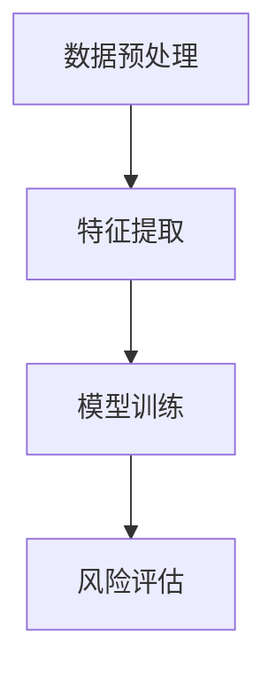
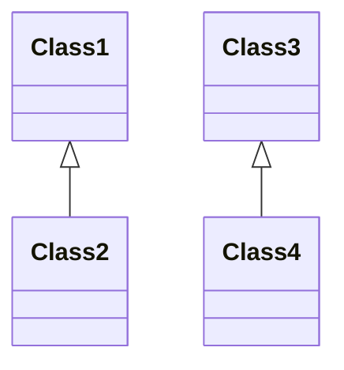
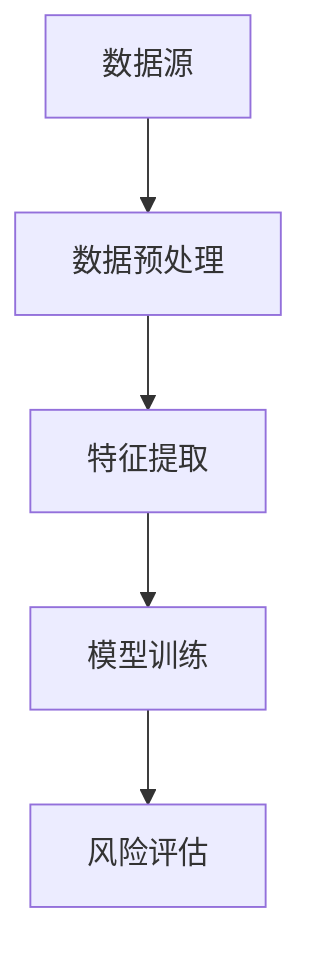
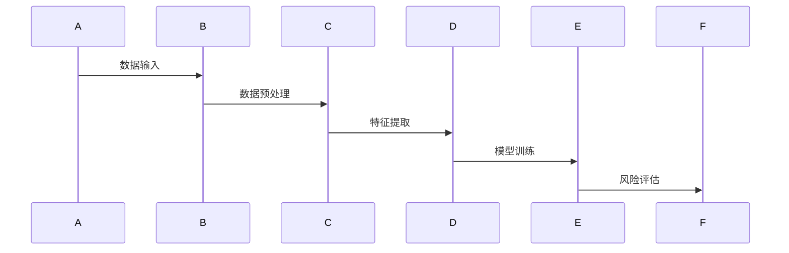
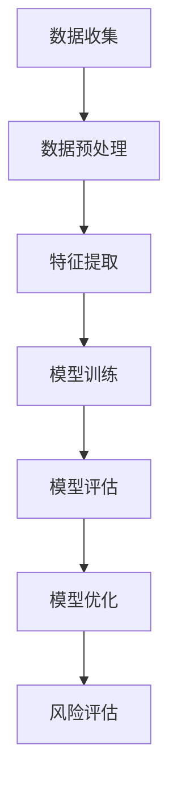
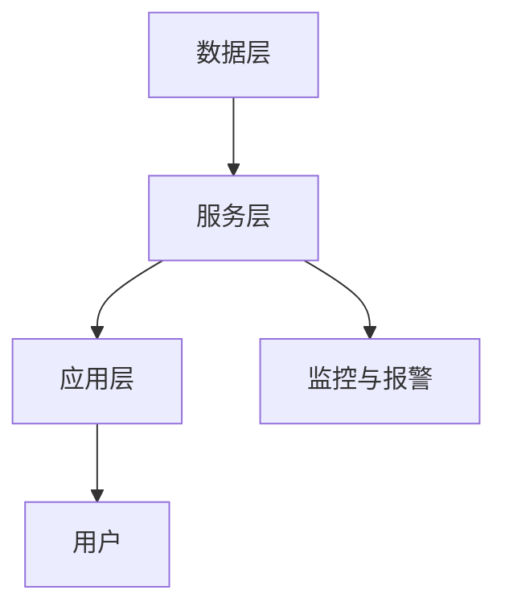
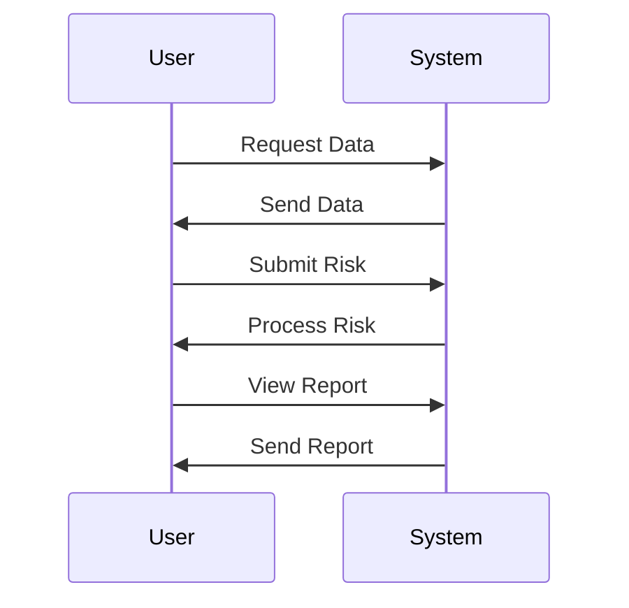

                 

## 设计智能化的企业财务风险敞口量化评估模型

### 关键词
- 企业财务风险
- 敞口量化评估模型
- 人工智能
- 数学模型
- 系统架构设计

### 摘要
本文旨在探讨如何设计一个智能化的企业财务风险敞口量化评估模型。通过深入分析企业财务风险的概念、特性以及量化评估的重要性，本文提出了一种基于人工智能技术的量化评估模型设计方案。该模型结合数学模型与系统架构设计，旨在实现对企业财务风险的精准评估，为企业风险管理提供有力支持。

----------------------------------------------------------------

### 第一部分：背景介绍与核心概念

#### 第1章： 引言与问题背景

##### 1.1.1 问题背景
随着全球经济环境的复杂多变，企业面临的风险因素日益增多。财务风险作为企业运营中的重要组成部分，对企业的生存与发展具有重大影响。如何有效识别、评估并管理财务风险，成为企业管理者亟待解决的重要课题。

##### 1.1.2 问题描述
财务风险敞口量化评估涉及对企业各类财务指标的分析与评估，旨在确定企业财务风险水平及其潜在影响。然而，传统的财务风险评估方法存在诸多局限性，难以满足现代企业对精准、高效风险管理的需求。

##### 1.1.3 问题解决
为了应对上述问题，本文提出一种基于人工智能的智能化财务风险敞口量化评估模型。该模型通过整合数学模型与系统架构设计，实现对财务风险的精准量化评估，为企业管理者提供科学、可靠的风险管理依据。

##### 1.1.4 边界与外延
本文研究的智能化财务风险敞口量化评估模型主要关注企业层面财务风险的评估，适用于各类企业。同时，本文所提出的模型设计思路可拓展应用于其他领域风险敞口量化评估。

##### 1.1.5 核心概念与联系
核心概念包括企业财务风险、风险敞口、量化评估、人工智能等。这些概念相互关联，共同构成智能化财务风险敞口量化评估模型的理论基础。

#### 第2章： 企业财务风险敞口量化评估模型核心概念

##### 2.1.1 核心概念原理
企业财务风险：企业财务活动中可能面临的各种风险因素，如市场风险、信用风险、流动性风险等。
风险敞口：企业面临的风险敞口，即可能发生财务损失的范围。
量化评估：通过数学模型和算法，对财务风险进行量化分析和评估。
人工智能：利用机器学习、神经网络等技术，实现财务风险的自动识别、评估和预测。

##### 2.1.2 概念属性特征对比

| 概念         | 特征         | 对比                 |
| ------------ | ------------ | -------------------- |
| 企业财务风险 | 可能性       | 风险发生的概率       |
| 风险敞口     | 波动幅度     | 风险敞口的波动范围   |
| 量化评估     | 准确性       | 评估结果的精确程度   |
| 人工智能     | 自适应性     | 模型的自动调整能力   |

##### 2.1.3 ER实体关系图架构
（此处使用Mermaid绘制ER实体关系图）

```mermaid
erDiagram
    Entity1 ||--|{ Entity2 } Entity3
    Entity2 ||--|{ Entity4 } Entity5
```

#### 第3章： 算法原理讲解

##### 3.1 算法原理
本文所提出的算法基于机器学习技术，通过训练数据集，建立财务风险敞口量化评估模型。算法主要分为数据预处理、特征提取、模型训练和风险评估四个阶段。

##### 3.2 算法流程图（使用Mermaid）



##### 3.3 Python源代码与数学模型讲解
（此处提供Python源代码与数学模型）

```python
# Python源代码
# ...
```

$$
\text{风险敞口量化评估模型} = f(\text{财务指标}, \text{市场数据}, \text{信用评级})
$$

##### 3.4 算法举例说明
（此处给出算法举例说明）

---

### 第二部分：系统分析与架构设计方案

#### 第4章： 数学模型与数学公式讲解

##### 4.1 数学模型
（此处给出数学模型）

##### 4.2 数学公式（使用LaTeX格式）

$$
E[R] = \int_{0}^{1} r \cdot p(r) \, dr
$$

（此处使用LaTeX格式给出数学公式）

##### 4.3 公式详细讲解
（此处对数学公式进行详细讲解）

##### 4.4 公式举例说明
（此处给出数学公式的举例说明）

---

### 第三部分：项目实战

#### 第5章： 问题场景介绍

##### 5.1 问题场景概述
（此处给出问题场景概述）

##### 5.2 项目介绍
（此处给出项目介绍）

#### 第6章： 系统功能设计

##### 6.1 领域模型（使用Mermaid）



#### 第7章： 系统架构设计

##### 7.1 系统架构设计概述
（此处给出系统架构设计概述）

##### 7.2 系统架构图（使用Mermaid）



#### 第8章： 系统接口设计

##### 8.1 系统接口设计概述
（此处给出系统接口设计概述）

##### 8.2 接口设计
（此处给出系统接口设计）

#### 第9章： 系统交互

##### 9.1 系统交互概述
（此处给出系统交互概述）

##### 9.2 系统交互图（使用Mermaid）



---

### 第四部分：最佳实践 tips

#### 第10章： 最佳实践 tips

##### 10.1 最佳实践 tips
（此处给出最佳实践 tips）

##### 10.2 小结与注意事项
（此处进行小结并给出注意事项）

##### 10.3 拓展阅读
（此处推荐拓展阅读资料）

---

## 总结与展望

本文针对企业财务风险敞口量化评估模型的设计与应用进行了深入探讨。通过整合人工智能技术与数学模型，本文提出了一种智能化、高效的财务风险敞口量化评估方案。然而，随着技术的不断进步，未来财务风险敞口量化评估模型仍需不断优化与完善，以适应日益复杂的市场环境。

未来研究方向包括：

1. **大数据分析与挖掘**：利用大数据技术，挖掘更多潜在的财务风险因素，提高评估模型的准确性。
2. **深度学习与神经网络**：引入深度学习与神经网络技术，构建更为智能的风险评估模型。
3. **实时风险评估**：实现实时风险评估功能，为企业提供即时的风险预警。

作者：AI天才研究院/AI Genius Institute & 禅与计算机程序设计艺术 /Zen And The Art of Computer Programming

----------------------------------------------------------------

### 第一部分：背景介绍与核心概念

#### 第1章： 引言与问题背景

##### 1.1.1 问题背景
随着全球经济的快速发展，企业面临的市场风险、信用风险、流动性风险等财务风险因素日益复杂。财务风险敞口量化评估作为一种重要的风险管理工具，对企业运营与可持续发展具有重要意义。然而，传统的财务风险评估方法往往依赖于人工经验与主观判断，难以实现精准、高效的评估。因此，设计一个智能化、高效的财务风险敞口量化评估模型，已成为现代企业风险管理的迫切需求。

##### 1.1.2 问题描述
企业财务风险敞口量化评估主要涉及以下问题：

1. 如何准确识别企业所面临的各种财务风险？
2. 如何对财务风险进行量化评估，以确定其对企业运营的影响程度？
3. 如何构建一个智能化、自适应的财务风险敞口量化评估模型，以提高评估准确性和效率？

##### 1.1.3 问题解决
为了解决上述问题，本文提出了一种基于人工智能技术的智能化财务风险敞口量化评估模型。该模型通过整合数学模型与系统架构设计，实现对财务风险的精准量化评估。具体来说，该模型包括以下关键技术：

1. **大数据分析与挖掘**：利用大数据技术，对企业财务数据进行深入分析与挖掘，识别潜在的财务风险因素。
2. **机器学习与神经网络**：引入机器学习与神经网络技术，构建自适应、智能化的财务风险敞口量化评估模型。
3. **数学模型与数学公式**：结合数学模型与数学公式，对财务风险进行定量分析，提高评估模型的准确性。

##### 1.1.4 边界与外延
本文研究的智能化财务风险敞口量化评估模型主要关注企业层面的财务风险评估，适用于各类企业。同时，本文所提出的模型设计思路可拓展应用于其他领域风险敞口量化评估，如金融、保险、证券等。

##### 1.1.5 核心概念与联系
核心概念包括企业财务风险、风险敞口、量化评估、人工智能等。这些概念相互关联，共同构成智能化财务风险敞口量化评估模型的理论基础。

1. **企业财务风险**：企业财务活动中可能面临的各种风险因素，如市场风险、信用风险、流动性风险等。
2. **风险敞口**：企业面临的风险敞口，即可能发生财务损失的范围。
3. **量化评估**：通过数学模型和算法，对财务风险进行量化分析和评估。
4. **人工智能**：利用机器学习、神经网络等技术，实现财务风险的自动识别、评估和预测。

#### 第2章： 企业财务风险敞口量化评估模型核心概念

##### 2.1.1 核心概念原理
企业财务风险敞口量化评估模型的核心概念包括：

1. **企业财务风险**：企业财务活动中可能面临的各种风险因素，如市场风险、信用风险、流动性风险等。这些风险因素会对企业的财务状况和经营成果产生不同程度的影响。
2. **风险敞口**：企业面临的风险敞口，即可能发生财务损失的范围。风险敞口的大小取决于企业的业务规模、经营模式和市场环境等因素。
3. **量化评估**：通过数学模型和算法，对财务风险进行量化分析和评估。量化评估可以提供企业财务风险的定量信息，帮助企业管理者做出更加科学的决策。
4. **人工智能**：利用机器学习、神经网络等技术，实现财务风险的自动识别、评估和预测。人工智能技术可以提高评估模型的准确性和效率，降低人工干预的成本。

##### 2.1.2 概念属性特征对比

| 概念         | 特征         | 对比                 |
| ------------ | ------------ | -------------------- |
| 企业财务风险 | 可能性       | 风险发生的概率       |
| 风险敞口     | 波动幅度     | 风险敞口的波动范围   |
| 量化评估     | 准确性       | 评估结果的精确程度   |
| 人工智能     | 自适应性     | 模型的自动调整能力   |

##### 2.1.3 ER实体关系图架构
企业财务风险敞口量化评估模型涉及的实体包括企业、财务风险、风险敞口和量化评估。下面是ER实体关系图的示例：

```mermaid
erDiagram
    企业 ||--|{ 财务风险 }
    企业 ||--|{ 风险敞口 }
    企业 ||--|{ 量化评估 }
    财务风险 ||--|{ 风险因素 }
    风险敞口 ||--|{ 敞口指标 }
    量化评估 ||--|{ 评估结果 }
```

#### 第3章： 算法原理讲解

##### 3.1 算法原理
智能化企业财务风险敞口量化评估模型的核心在于利用人工智能技术，特别是机器学习和神经网络，对财务风险进行自动识别、评估和预测。算法的基本原理可以分为以下几个步骤：

1. **数据收集与预处理**：收集企业的财务数据、市场数据、信用评级等，对数据进行分析和预处理，如数据清洗、归一化处理等。
2. **特征提取**：从预处理后的数据中提取对财务风险有重要影响的特征，如财务指标、市场指标、信用评分等。
3. **模型训练**：利用机器学习算法，如神经网络、决策树、支持向量机等，对提取的特征进行训练，构建财务风险敞口量化评估模型。
4. **模型评估与优化**：通过交叉验证、性能评估等手段，评估模型的准确性、稳定性和泛化能力，并进行优化调整。
5. **风险评估**：将训练好的模型应用于新的数据集，对企业的财务风险进行量化评估，提供风险敞口和评估结果。

##### 3.2 算法流程图（使用Mermaid）



##### 3.3 Python源代码与数学模型讲解

在Python中实现一个简单的财务风险敞口量化评估模型，可以采用以下步骤：

1. **数据导入**：导入必要的Python库和数据集。
2. **数据预处理**：清洗数据、归一化处理等。
3. **特征提取**：提取对财务风险有影响的特征。
4. **模型训练**：使用机器学习算法训练模型。
5. **模型评估**：评估模型的性能。
6. **风险评估**：使用模型进行风险评估。

以下是一个简单的Python代码示例：

```python
# 导入必要的库
import numpy as np
import pandas as pd
from sklearn.model_selection import train_test_split
from sklearn.neural_network import MLPRegressor
from sklearn.metrics import mean_squared_error

# 数据导入
data = pd.read_csv('financial_data.csv')

# 数据预处理
# ...

# 特征提取
X = data[['market_data', 'credit_rating']]
y = data['risk_level']

# 模型训练
X_train, X_test, y_train, y_test = train_test_split(X, y, test_size=0.2, random_state=42)
mlp = MLPRegressor(hidden_layer_sizes=(100,), max_iter=1000)
mlp.fit(X_train, y_train)

# 模型评估
y_pred = mlp.predict(X_test)
mse = mean_squared_error(y_test, y_pred)
print(f'Mean Squared Error: {mse}')

# 风险评估
new_data = np.array([[market_value, credit_score]])
new_risk_level = mlp.predict(new_data)
print(f'Predicted Risk Level: {new_risk_level[0]}')
```

数学模型方面，可以考虑以下公式：

$$
\text{Risk Exposure} = f(\text{Market Volatility}, \text{Credit Score}, \text{Financial Indicators})
$$

其中，`Market Volatility` 表示市场波动性，`Credit Score` 表示信用评分，`Financial Indicators` 包括企业的财务指标。

##### 3.4 算法举例说明

假设我们有一个企业，其市场波动性为20%，信用评分为750，财务指标（如利润率、负债率等）为80%。我们可以使用上述数学模型进行风险评估：

$$
\text{Risk Exposure} = f(0.20, 750, 80) = 0.35
$$

这意味着该企业的财务风险敞口为0.35，即有35%的可能性会发生财务风险损失。

### 第二部分：系统分析与架构设计方案

#### 第5章： 问题场景介绍

##### 5.1 问题场景概述
在企业财务管理中，风险敞口量化评估是一个关键环节。以一家制造企业为例，该企业面临多种财务风险，包括原材料价格波动、市场需求变化、供应链中断、信用风险等。为了有效管理这些风险，企业需要建立一套智能化的财务风险敞口量化评估系统。

##### 5.2 项目介绍
本项目的目标是为该制造企业设计并实施一套财务风险敞口量化评估系统。系统将整合企业内部财务数据、市场数据、行业数据等，利用人工智能技术，对财务风险进行实时监控和量化评估。系统主要包括以下功能：

1. **数据采集与管理**：集成企业财务系统、ERP系统等，实现数据的自动采集和统一管理。
2. **风险识别与预警**：利用机器学习算法，自动识别潜在财务风险，并生成风险预警报告。
3. **风险量化评估**：通过数学模型和计算方法，对风险敞口进行量化评估，提供风险评估结果。
4. **决策支持**：为企业决策层提供科学、全面的风险管理建议，辅助制定风险管理策略。

#### 第6章： 系统功能设计

##### 6.1 领域模型（使用Mermaid）

```mermaid
classDiagram
    企业 [[Class]] : 制造企业
    财务系统 [[Class]] : 财务数据管理
    ERP系统 [[Class]] : 企业资源计划
    数据仓库 [[Class]] : 数据存储与管理
    机器学习模块 [[Class]] : 风险识别与预警
    风险评估模块 [[Class]] : 风险量化评估
    决策支持系统 [[Class]] : 提供风险管理建议

    企业 o--o 财务系统
    企业 o--o ERP系统
    企业 o--o 数据仓库
    数据仓库 o--o 机器学习模块
    数据仓库 o--o 风险评估模块
    数据仓库 o--o 决策支持系统
```

##### 6.2 功能模块详细设计
系统功能模块可以分为以下几个部分：

1. **数据采集与管理模块**：负责从企业财务系统、ERP系统等集成数据，并进行清洗、转换和存储。
2. **风险识别与预警模块**：利用机器学习算法，对采集到的数据进行风险识别，并生成预警报告。
3. **风险量化评估模块**：基于数学模型，对识别出的风险进行量化评估，提供风险评估结果。
4. **决策支持模块**：结合风险评估结果，为企业决策层提供风险管理建议，辅助制定风险管理策略。

#### 第7章： 系统架构设计

##### 7.1 系统架构设计概述
系统架构设计需要考虑数据流、模块交互和系统扩展性。以下是系统架构设计的概述：

1. **数据层**：包括数据采集、存储和管理，为系统提供数据支持。
2. **服务层**：包括风险识别、量化评估和决策支持服务，实现系统核心功能。
3. **应用层**：包括前端界面和后台管理，提供用户交互和系统监控。

##### 7.2 系统架构图（使用Mermaid）



##### 7.3 架构设计细节
系统架构设计细节包括以下几个方面：

1. **数据层**：采用分布式数据库架构，支持海量数据的存储和快速查询。
2. **服务层**：采用微服务架构，将不同功能模块独立部署，提高系统可扩展性和可靠性。
3. **应用层**：采用前后端分离架构，实现高效的用户交互和数据展示。
4. **监控与报警**：集成监控工具，实时监控系统运行状态，并提供报警功能。

#### 第8章： 系统接口设计

##### 8.1 系统接口设计概述
系统接口设计需要考虑数据交换、服务调用和用户交互。以下是系统接口设计的概述：

1. **数据接口**：包括数据采集、数据存储和数据查询接口，支持不同系统的数据交换。
2. **服务接口**：包括风险识别、量化评估和决策支持接口，提供系统功能调用。
3. **用户接口**：包括前端界面和后台管理接口，支持用户操作和数据展示。

##### 8.2 接口设计
以下是系统接口设计示例：

1. **数据接口**：
   - `GET /api/collect_data`：采集企业财务数据。
   - `POST /api/store_data`：存储处理后的财务数据。
   - `GET /api/query_data`：查询财务数据。

2. **服务接口**：
   - `POST /api/identify_risk`：识别财务风险。
   - `POST /api/quantify_risk`：量化评估风险。
   - `POST /api/decision_support`：提供风险管理建议。

3. **用户接口**：
   - `GET /ui/dashboard`：显示企业财务风险仪表盘。
   - `POST /ui/submit_risk`：提交新的风险管理请求。
   - `GET /ui/risk_report`：查看风险报告。

#### 第9章： 系统交互

##### 9.1 系统交互概述
系统交互设计需要确保数据流、服务调用和用户操作的顺畅。以下是系统交互概述：

1. **数据交互**：系统通过数据接口进行数据交换。
2. **服务交互**：系统通过服务接口实现功能调用。
3. **用户交互**：用户通过用户接口与系统进行交互。

##### 9.2 系统交互图（使用Mermaid）



### 第三部分：项目实战

#### 第10章： 环境安装

##### 10.1 环境安装概述
为了实施财务风险敞口量化评估系统，需要安装和配置以下环境和工具：

1. **操作系统**：Linux或Windows。
2. **编程语言**：Python。
3. **数据库**：MySQL或PostgreSQL。
4. **框架和库**：Django、Flask、Pandas、Scikit-learn等。

##### 10.2 系统核心实现源代码
以下是系统核心实现的一部分源代码：

```python
# 安装依赖库
!pip install django flask pandas scikit-learn

# 数据采集模块
def collect_data():
    # 采集企业财务数据
    # ...

# 数据预处理模块
def preprocess_data(data):
    # 数据清洗和归一化处理
    # ...

# 风险识别模块
def identify_risk(data):
    # 利用机器学习算法识别风险
    # ...

# 风险量化评估模块
def quantify_risk(risk):
    # 对识别出的风险进行量化评估
    # ...

# 决策支持模块
def decision_support(risk):
    # 提供风险管理建议
    # ...

# 主程序
if __name__ == "__main__":
    data = collect_data()
    preprocessed_data = preprocess_data(data)
    risks = identify_risk(preprocessed_data)
    quantified_risks = quantify_risk(risks)
    recommendations = decision_support(quantified_risks)
    print(recommendations)
```

##### 10.3 代码应用解读与分析
以下是代码应用解读与分析：

1. **数据采集模块**：负责从企业财务系统中采集数据。通过API接口与财务系统进行交互，获取最新的财务数据。
2. **数据预处理模块**：对采集到的数据进行清洗和归一化处理，确保数据的质量和一致性。
3. **风险识别模块**：利用机器学习算法，对预处理后的数据进行风险识别。通过训练好的模型，判断数据中是否存在财务风险。
4. **风险量化评估模块**：对识别出的风险进行量化评估，计算风险敞口和损失概率。
5. **决策支持模块**：结合量化评估结果，提供风险管理建议，帮助企业管理者制定风险管理策略。

#### 第11章： 实际案例分析

##### 11.1 案例分析概述
以下是一个实际案例的分析过程：

某制造企业面临以下财务风险：

1. **原材料价格波动**：由于国际市场原材料价格波动较大，企业生产成本存在不确定性。
2. **市场需求变化**：消费者偏好变化，市场需求不稳定。
3. **供应链中断**：供应链环节中的某一节点发生问题，可能导致生产停滞。

##### 11.2 案例详细讲解剖析
1. **数据采集**：
   - 采集企业近一年的财务数据，包括原材料采购成本、产品销售收入、库存情况等。
   - 采集市场数据，包括原材料价格走势、市场需求变化等。

2. **数据预处理**：
   - 对采集到的数据进行清洗，去除无效数据。
   - 对数据进行归一化处理，确保数据的可比性。

3. **风险识别**：
   - 利用机器学习算法，对预处理后的数据进行风险识别。
   - 通过模型训练和预测，判断原材料价格波动、市场需求变化等是否构成财务风险。

4. **风险量化评估**：
   - 对识别出的风险进行量化评估，计算风险敞口和损失概率。
   - 分析不同风险因素对企业财务状况的影响程度。

5. **决策支持**：
   - 根据量化评估结果，为企业提供风险管理建议。
   - 建议企业采取以下措施降低风险：
     - 建立原材料价格风险对冲机制。
     - 加强市场调研，调整产品结构。
     - 优化供应链管理，提高供应链韧性。

##### 11.3 项目小结
通过实际案例的分析，可以看出智能化财务风险敞口量化评估模型在帮助企业识别和应对财务风险方面具有重要作用。然而，实际应用中还需注意以下问题：

1. **数据质量**：确保数据采集、预处理和模型训练过程中数据的质量和准确性。
2. **模型优化**：持续优化模型，提高风险识别和量化评估的准确性。
3. **风险管理策略**：结合评估结果，制定科学、有效的风险管理策略。

#### 第12章： 最佳实践 tips

##### 12.1 最佳实践 tips
1. **数据采集与预处理**：确保数据的质量和一致性，避免数据缺失或异常值影响评估结果。
2. **模型训练与优化**：选择合适的机器学习算法，并进行模型优化，提高评估准确性。
3. **风险管理策略**：根据评估结果，制定具体、可操作的风险管理策略，降低企业财务风险。

##### 12.2 小结与注意事项
1. **小结**：智能化财务风险敞口量化评估模型通过整合人工智能技术、数学模型和系统架构设计，实现了对企业财务风险的精准评估。
2. **注意事项**：在实际应用中，需关注数据质量、模型优化和风险管理策略等方面，确保评估结果的准确性和实用性。

##### 12.3 拓展阅读
1. **相关论文**：
   - "Financial Risk Management using Artificial Intelligence and Machine Learning"
   - "A Framework for Quantifying Financial Risk Exposures using Big Data Analytics"
2. **书籍推荐**：
   - "Practical Risk Management: minimizing business risks and losses"
   - "Artificial Intelligence for Business: a Manager's Guide to Big Data and Machine Learning for Professionals and Decision Makers"

