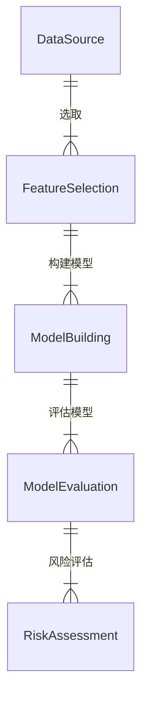

                 

## 设计智能化的企业财务风险量化评估模型

关键词：财务风险、量化评估、智能化模型、数据预处理、特征选择、概率模型、统计模型、系统架构、环境安装、代码解读

摘要：本文旨在探讨设计一个智能化的企业财务风险量化评估模型。通过深入分析财务风险的内涵及其量化评估的重要性，本文将介绍智能化评估模型的基本概念和原理，详细讲解算法步骤、数学模型及公式，并展示系统架构设计与实战应用。最后，本文将提供最佳实践建议，并对未来发展方向进行展望。

## 第一部分：背景与概述

### 1. 引言

#### 1.1 问题背景

在全球化经济环境下，企业面临的市场风险日益增加，财务风险成为企业生存和发展的关键因素。财务风险量化评估是企业风险管理的重要环节，它有助于企业提前识别潜在风险，采取有效措施降低风险损失。然而，传统的财务风险评估方法往往依赖于人工判断，存在主观性和局限性。

#### 1.2 问题描述

如何设计一个智能化、自动化的财务风险量化评估模型，以实现高效、准确的风险评估？该模型需要具备以下特点：

- 数据驱动的风险评估
- 自动化的特征提取和模型构建
- 高效的模型评估与优化

#### 1.3 问题解决思路

为了解决上述问题，本文提出以下解决思路：

- 研究财务风险的内涵及其量化方法
- 设计智能化评估模型，包括数据预处理、特征选择、模型构建与评估
- 结合实际企业场景，实现模型落地应用

#### 1.4 边界与外延

本文研究的财务风险量化评估模型主要针对中小企业，其适用范围包括财务报表分析、现金流预测、债务违约风险评估等。模型的设计考虑了行业特性，具有一定的通用性，但具体应用时需要根据企业实际情况进行调整。

#### 1.5 概念结构与核心要素组成

财务风险量化评估模型主要由以下核心要素组成：

- 数据源：包括财务报表、市场数据、行业数据等
- 数据预处理：数据清洗、缺失值处理、异常值检测
- 特征选择：关键指标提取、特征工程技术
- 模型构建：选择合适的机器学习算法构建预测模型
- 模型评估：评估模型性能、优化模型参数
- 应用场景：将模型应用于企业财务风险管理

## 第二部分：核心概念与联系

### 2.1 财务风险量化评估

财务风险量化评估是指通过量化方法对企业财务风险进行评估，以衡量企业面临的风险程度。量化评估方法主要包括概率模型、统计模型和组合模型等。

### 2.2 智能化评估模型

智能化评估模型是指利用机器学习和人工智能技术，实现财务风险的自动评估和预测。智能化评估模型的核心包括数据预处理、特征选择、模型构建和模型评估等步骤。

### 2.3 关键概念对比表格

| 概念               | 定义                                                         | 特点                                                         |
|------------------|------------------------------------------------------------|------------------------------------------------------------|
| 财务风险          | 企业在财务活动中可能遭受的损失和不确定性。                         | 主体是财务活动，表现形式为损失和不确定性。                    |
| 量化评估          | 使用数学模型和方法对财务风险进行评估。                             | 侧重于通过数学模型实现风险的量化。                          |
| 智能化评估模型    | 利用机器学习和人工智能技术实现财务风险的自动评估和预测。                | 结合了大数据和人工智能技术，具有高效、准确的特点。            |

### 2.4 ER实体关系图架构

下面是财务风险量化评估模型的ER实体关系图：

## 第三部分：算法原理讲解

### 3.1 数据预处理

数据预处理是财务风险量化评估的基础步骤，主要包括数据清洗、缺失值处理和异常值检测。

### 3.2 特征选择

特征选择是提高模型性能的关键步骤，主要包括关键指标提取和特征工程技术。

### 3.3 模型构建

模型构建是财务风险量化评估的核心步骤，主要包括选择合适的机器学习算法和构建预测模型。

### 3.4 模型评估

模型评估是确保模型性能的重要环节，主要包括评估模型性能和优化模型参数。

## 第四部分：系统分析与架构设计

### 4.1 问题场景介绍

企业财务风险量化评估问题场景主要涉及财务报表分析、现金流预测和债务违约风险评估等方面。

### 4.2 系统功能设计

系统功能设计包括领域模型和类图设计，旨在清晰描述系统功能和模块之间的关系。

### 4.3 系统架构设计

系统架构设计包括整体架构设计和模块分解，确保系统的高效性和可维护性。

### 4.4 系统接口设计和系统交互

系统接口设计和系统交互涉及系统模块之间的接口定义和交互流程，确保系统的稳定性和灵活性。

## 第五部分：项目实战

### 5.1 环境安装

环境安装包括Python环境搭建和所需依赖库的安装。

### 5.2 系统核心实现源代码

系统核心实现源代码包括数据预处理、特征选择、模型构建和模型评估等模块的代码实现。

### 5.3 代码应用解读与分析

代码应用解读与分析旨在深入理解系统实现原理，分析代码应用的具体细节和技巧。

### 5.4 实际案例分析和详细讲解剖析

实际案例分析和详细讲解剖析包括具体案例的展示和分析，深入剖析模型在实际应用中的效果和不足。

### 5.5 项目小结

项目小结对项目的整体成果进行总结，分析项目的经验和启示。

## 第六部分：最佳实践与拓展

### 6.1 最佳实践 Tips

最佳实践 Tips 提供具体的操作建议和注意事项，帮助读者在实际应用中更好地使用模型。

### 6.2 小结

小结对全文内容进行回顾，总结核心要点，并对未来研究方向进行展望。

### 6.3 拓展阅读

拓展阅读包括相关文献和知识拓展，为读者提供更深入的阅读资源。

## 结尾

作者：AI天才研究院/AI Genius Institute & 禅与计算机程序设计艺术 /Zen And The Art of Computer Programming

本文深入探讨了设计智能化的企业财务风险量化评估模型，包括核心概念、算法原理、系统架构和实际应用。通过本文的阅读，读者可以全面了解财务风险量化评估的智能化设计方法，为企业的财务风险管理提供有力支持。希望本文能对读者的研究和实践有所帮助。

