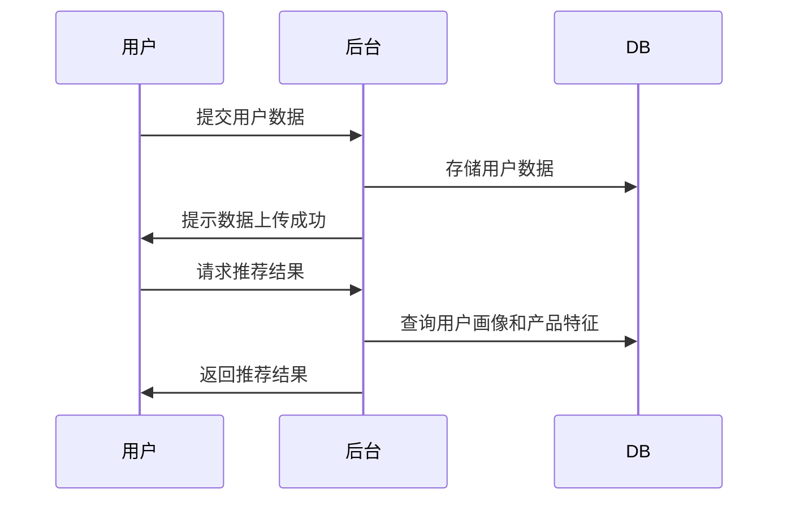

                 

### 设计智能化的保险产品推荐系统

#### 关键词

- 保险产品推荐
- 智能化系统
- 用户画像
- 推荐算法
- 数学模型

#### 摘要

本文将深入探讨设计智能化保险产品推荐系统的过程，从问题背景、核心概念到具体算法实现，再到系统架构和项目实战，旨在为读者提供一份全面而专业的指南。随着保险市场的不断发展与消费者需求的多样化，传统的保险产品推荐方式已经难以满足市场需求。因此，构建一个智能化、个性化的保险产品推荐系统显得尤为重要。本文将详细解析这一系统的设计原则、实现方法和实际应用，帮助读者更好地理解并掌握这一前沿技术。

## 第1章 背景介绍

### 1.1 问题背景

#### 保险行业现状

随着我国经济的快速发展，保险业也迎来了一个高速增长期。保险产品的种类和数量日益丰富，从传统的车险、寿险，到如今的健康险、意外险等，几乎覆盖了人们的各个生活领域。然而，保险产品的多样化也带来了新的挑战，消费者在购买保险时面临的选择困扰日益加剧。

#### 保险产品多样化

保险产品的多样化主要体现在以下几个方面：一是产品类型的丰富，二是保险条款的复杂性，三是保险责任和保险金额的多样性。这使得消费者在选购保险产品时，需要花费大量的时间和精力去了解和比较。

#### 保险消费者需求差异

消费者的需求差异主要体现在年龄、职业、收入水平、风险偏好等多个方面。不同年龄段的消费者对保险产品的需求和关注点有所不同，年轻人更倾向于购买健康险和意外险，而中年人则更关注家庭保障和财富传承。此外，消费者的风险偏好也会直接影响他们的保险选择。

### 1.2 问题描述

#### 传统保险产品推荐存在的问题

1. **个性化不足**：传统保险产品推荐系统往往采用统一的推荐策略，难以满足消费者个性化的需求。
2. **效率低下**：手动筛选和推荐保险产品耗时费力，无法快速响应用户的需求。
3. **信息不对称**：消费者对保险产品的了解有限，容易受到误导，导致购买决策的不理性。

#### 智能化保险产品推荐的意义

1. **提高用户满意度**：通过个性化推荐，帮助消费者快速找到最适合自己的保险产品，提升用户体验。
2. **提升销售效率**：智能化推荐系统能够自动筛选和推荐，大幅提高销售效率，降低人力成本。
3. **优化市场竞争力**：通过提供个性化服务，增强保险公司在市场中的竞争力，吸引更多消费者。

### 1.3 问题解决

#### 智能化保险产品推荐系统设计目标

1. **个性化推荐**：根据用户的年龄、职业、收入水平、风险偏好等特征，提供个性化的保险产品推荐。
2. **高效响应**：利用大数据和机器学习技术，快速分析用户需求，提供精准的推荐结果。
3. **用户体验**：优化用户界面和交互设计，提升用户使用推荐系统的舒适度和满意度。

#### 智能化推荐系统的工作流程

1. **用户画像构建**：收集用户的基本信息和行为数据，构建用户画像。
2. **保险产品特征提取**：对保险产品进行分类和特征提取，形成产品特征库。
3. **推荐算法实现**：根据用户画像和产品特征，使用推荐算法生成推荐结果。
4. **用户反馈与优化**：收集用户反馈，不断优化推荐算法和系统性能。

### 1.4 边界与外延

#### 数据来源与处理

1. **数据来源**：数据来源包括用户行为数据、保险产品数据、市场数据等。
2. **数据处理**：对数据进行清洗、去重、归一化等预处理，确保数据质量。

#### 系统性能与安全性

1. **系统性能**：优化系统架构，提高数据处理和响应速度。
2. **数据安全**：确保用户数据的安全和隐私，遵循相关法律法规。

### 1.5 概念结构与核心要素组成

#### 用户画像

- **概念**：用户画像是对用户基本特征、行为习惯、风险偏好等多维度信息的综合描述。
- **属性特征**：
  - 基本信息如年龄、性别、职业、收入等。
  - 行为数据如购买记录、浏览记录、咨询记录等。
  - 风险偏好如保守型、稳健型、激进型等。

#### 保险产品特征

- **概念**：保险产品特征是对保险产品基本属性、保障范围、费用结构等多维度信息的描述。
- **属性特征**：
  - 保险产品类型如车险、寿险、健康险等。
  - 保障范围如意外险、疾病险、医疗保险等。
  - 费用结构如保费、保额、交费方式等。

#### 推荐算法

- **概念**：推荐算法是用于根据用户画像和产品特征生成个性化推荐结果的一类算法。
- **算法类型**：
  - 协同过滤：基于用户行为相似性进行推荐。
  - 内容推荐：基于产品特征相似性进行推荐。
  - 混合推荐：结合协同过滤和内容推荐的优势进行推荐。

#### 用户行为分析

- **概念**：用户行为分析是通过对用户行为数据进行分析，挖掘用户需求和行为模式的过程。
- **分析内容**：
  - 用户浏览行为分析：分析用户的浏览记录，挖掘用户的兴趣和需求。
  - 用户购买行为分析：分析用户的购买记录，了解用户的购买偏好和决策过程。

## 第2章 核心概念与联系

### 2.1 用户画像

#### 用户画像的概念

用户画像是对用户基本特征、行为习惯、风险偏好等多维度信息的综合描述，是构建智能化保险产品推荐系统的基础。

#### 用户画像的属性特征

用户画像的属性特征主要包括以下方面：

| 属性       | 说明                                                         |
| ---------- | ------------------------------------------------------------ |
| 基本信息   | 年龄、性别、职业、收入、教育程度、家庭状况等。                 |
| 行为数据   | 浏览记录、购买记录、咨询记录、理赔记录等。                   |
| 风险偏好   | 保守型、稳健型、激进型等。                                   |
| 社交关系   | 亲朋好友的职业、收入、保险状况等。                           |

### 2.2 保险产品特征

#### 保险产品分类

保险产品可以按照保障范围、保险期限、费用结构等多个维度进行分类，常见的分类方式如下：

| 分类方式       | 说明                                                         |
| -------------- | ------------------------------------------------------------ |
| 保障范围       | 意外险、健康险、寿险、财产险等。                             |
| 保险期限       | 一年期保险、长期保险等。                                     |
| 费用结构       | 保费、保额、交费方式等。                                     |
| 按照保障内容   | 重大疾病保险、车险、家庭保险等。                             |

#### 保险产品特征提取

保险产品特征提取是对保险产品的基本属性、保障范围、费用结构等多维度信息进行提取和描述，常见的特征提取方法包括：

1. **文本特征提取**：对保险产品的描述文本进行分词、词频统计、TF-IDF等处理，提取文本特征。
2. **数值特征提取**：对保险产品的数值属性进行统计和归一化处理，提取数值特征。
3. **结构化特征提取**：对保险产品的结构化信息进行提取和分类，如保险期限、保障范围、费用结构等。

### 2.3 推荐算法

#### 协同过滤

协同过滤是一种基于用户行为相似性进行推荐的算法，其主要思想是寻找与目标用户行为相似的邻居用户，然后根据邻居用户的评价预测目标用户的评价。

| 算法类型       | 说明                                                         |
| -------------- | ------------------------------------------------------------ |
| User-Based CF  | 基于用户的协同过滤，通过计算用户之间的相似度，找到相似用户并推荐相似商品。 |
| Item-Based CF  | 基于物品的协同过滤，通过计算物品之间的相似度，找到相似物品并推荐给用户。 |

#### 内容推荐

内容推荐是一种基于物品特征相似性进行推荐的算法，其主要思想是寻找与目标物品特征相似的物品，然后将其推荐给用户。

| 算法类型       | 说明                                                         |
| -------------- | ------------------------------------------------------------ |
| Content-Based  | 基于内容的推荐，通过分析物品的属性和特征，找到相似物品并推荐。   |
| Item-to-Item   | 基于物品相似度的推荐，通过计算物品之间的相似度，找到相似物品并推荐。 |

#### 混合推荐

混合推荐是一种结合协同过滤和内容推荐优势的推荐算法，其主要思想是综合利用用户行为数据和物品特征数据，提高推荐准确性。

| 算法类型       | 说明                                                         |
| -------------- | ------------------------------------------------------------ |
| Hybrid CF      | 结合协同过滤和内容推荐的混合推荐算法，提高推荐精度。           |
| Deep Learning  | 利用深度学习模型进行推荐，结合用户行为和物品特征，实现高效推荐。 |

### 2.4 用户行为分析

#### 用户行为数据收集

用户行为数据收集是构建用户画像和推荐系统的基础，常见的数据收集方式包括：

1. **客户端日志**：通过客户端程序记录用户的浏览、点击、购买等行为数据。
2. **服务器日志**：通过服务器日志记录用户的行为数据，如访问时间、访问页面、访问时长等。
3. **问卷调查**：通过问卷调查收集用户的基本信息、风险偏好等数据。

#### 用户行为数据预处理

用户行为数据预处理是确保数据质量和推荐效果的重要环节，常见的预处理方法包括：

1. **数据清洗**：去除重复、异常、错误的数据，确保数据质量。
2. **数据归一化**：将不同量纲的数据进行归一化处理，如年龄、收入等。
3. **特征提取**：从原始数据中提取有用的特征，如用户行为模式、兴趣偏好等。

## 第3章 算法原理讲解

### 3.1 协同过滤算法

#### 协同过滤的基本原理

协同过滤算法（Collaborative Filtering）是一种基于用户行为相似性进行推荐的算法，其主要思想是通过分析用户的历史行为数据，寻找与目标用户相似的其他用户，然后根据这些用户的评价来预测目标用户的评价。

#### 协同过滤的优缺点

**优点**：
1. **自适应性强**：能够根据用户的行为动态调整推荐结果，提高用户满意度。
2. **实现简单**：算法实现相对简单，易于理解和部署。

**缺点**：
1. **数据稀疏性**：当用户和物品数量较大时，用户行为数据往往稀疏，导致推荐效果下降。
2. **冷启动问题**：新用户或新物品在没有足够行为数据时，无法进行有效推荐。

#### 协同过滤算法实现

协同过滤算法主要包括基于用户的协同过滤（User-Based CF）和基于物品的协同过滤（Item-Based CF）两种实现方式。

1. **基于用户的协同过滤**：

   - 步骤1：计算用户之间的相似度，常用的相似度计算方法包括余弦相似度、皮尔逊相关系数等。
   - 步骤2：根据相似度矩阵找到与目标用户最相似的K个用户。
   - 步骤3：计算目标用户对未知物品的评分预测，即预测评分 = 均值评分 + （相似度得分之和 * 预测系数）。

2. **基于物品的协同过滤**：

   - 步骤1：计算物品之间的相似度，常用的相似度计算方法包括余弦相似度、皮尔逊相关系数等。
   - 步骤2：根据相似度矩阵找到与目标物品最相似的K个物品。
   - 步骤3：计算目标用户对未知物品的评分预测，即预测评分 = 均值评分 + （相似度得分之和 * 预测系数）。

### 3.2 内容推荐算法

#### 内容推荐的基本原理

内容推荐（Content-Based Recommendation）是一种基于物品特征相似性进行推荐的算法，其主要思想是通过分析物品的属性和特征，找到与目标物品特征相似的物品，然后将其推荐给用户。

#### 内容推荐的方法

1. **基于内容的过滤**（Content-Based Filtering）：

   - 步骤1：提取物品的特征向量，常用的特征提取方法包括关键词提取、文本分类、特征工程等。
   - 步骤2：计算物品之间的相似度，常用的相似度计算方法包括余弦相似度、余弦相似度、欧氏距离等。
   - 步骤3：根据相似度阈值筛选出相似物品，将其推荐给用户。

2. **基于物品的相似度推荐**（Item-to-Item Recommendation）：

   - 步骤1：计算物品之间的相似度，常用的相似度计算方法包括余弦相似度、余弦相似度、欧氏距离等。
   - 步骤2：根据相似度阈值筛选出相似物品，将其推荐给用户。

#### 内容推荐算法实现

内容推荐算法的实现主要包括以下步骤：

1. **特征提取**：对物品的属性和特征进行提取，形成特征向量。
2. **相似度计算**：计算物品之间的相似度，常用的相似度计算方法包括余弦相似度、余弦相似度、欧氏距离等。
3. **推荐结果生成**：根据相似度阈值筛选出相似物品，将其推荐给用户。

### 3.3 混合推荐算法

#### 混合推荐算法的原理

混合推荐算法（Hybrid Recommendation）是一种结合协同过滤和内容推荐优势的推荐算法，其主要思想是综合利用用户行为数据和物品特征数据，以提高推荐准确性。

#### 混合推荐算法的优势

1. **优势互补**：协同过滤和内容推荐各有优点，混合推荐算法能够充分利用两者的优势，提高推荐效果。
2. **适应性**：可以根据不同的应用场景和数据特点，灵活调整协同过滤和内容推荐的比例，提高推荐适应性。
3. **降低数据稀疏性**：通过结合用户行为数据和物品特征数据，可以有效降低数据稀疏性，提高推荐准确性。

#### 混合推荐算法实现

混合推荐算法的实现主要包括以下步骤：

1. **用户行为数据与物品特征数据结合**：将用户行为数据和物品特征数据进行整合，形成用户-物品特征矩阵。
2. **协同过滤与内容推荐结合**：利用协同过滤和内容推荐算法分别计算推荐结果，然后结合两种算法的优势生成最终推荐结果。
3. **推荐结果优化**：根据用户反馈和实际应用效果，对推荐结果进行优化，提高用户满意度。

## 第4章 数学模型和数学公式

### 4.1 协同过滤数学模型

#### 评分预测模型

在协同过滤算法中，评分预测模型主要用于预测用户对未知物品的评分。常见的评分预测模型包括基于矩阵分解的模型和基于模型的模型。

1. **基于矩阵分解的模型**：

   - 步骤1：将用户-物品评分矩阵分解为用户特征矩阵和物品特征矩阵。
   - 步骤2：利用用户特征矩阵和物品特征矩阵计算用户对物品的预测评分。

   $$R_{ui} = U_i^T V_j$$

   其中，$R_{ui}$表示用户$i$对物品$j$的评分，$U_i$和$V_j$分别表示用户$i$和物品$j$的特征向量。

2. **基于模型的模型**：

   - 步骤1：建立用户-物品评分预测模型，常用的模型包括线性回归、神经网络等。
   - 步骤2：利用训练数据训练模型，得到模型参数。
   - 步骤3：利用模型参数预测用户对未知物品的评分。

   $$y = \theta_0 + \theta_1 x_1 + \theta_2 x_2 + ... + \theta_n x_n$$

   其中，$y$表示预测评分，$x_1, x_2, ..., x_n$分别表示用户特征和物品特征，$\theta_0, \theta_1, \theta_2, ..., \theta_n$为模型参数。

#### 相似度计算

在协同过滤算法中，相似度计算是核心步骤，常用的相似度计算方法包括余弦相似度、皮尔逊相关系数等。

1. **余弦相似度**：

   $$\cos(\theta) = \frac{U_i^T V_j}{\|U_i\| \|V_j\|}$$

   其中，$U_i$和$V_j$分别表示用户$i$和物品$j$的特征向量，$\|U_i\|$和$\|V_j\|$分别表示用户$i$和物品$j$的特征向量长度。

2. **皮尔逊相关系数**：

   $$\rho(U_i, V_j) = \frac{U_i^T V_j - \frac{U_i^T U_i}{\|U_i\|} \frac{V_j^T V_j}{\|V_j\|}}{\sqrt{U_i^T U_i} \sqrt{V_j^T V_j}}$$

   其中，$U_i$和$V_j$分别表示用户$i$和物品$j$的特征向量，$\|U_i\|$和$\|V_j\|$分别表示用户$i$和物品$j$的特征向量长度。

### 4.2 内容推荐数学模型

#### 相似度计算

在内容推荐算法中，相似度计算是核心步骤，常用的相似度计算方法包括余弦相似度、欧氏距离等。

1. **余弦相似度**：

   $$\cos(\theta) = \frac{\sum_{i=1}^{n} x_{ui} y_{uj}}{\sqrt{\sum_{i=1}^{n} x_{ui}^2} \sqrt{\sum_{i=1}^{n} y_{uj}^2}}$$

   其中，$x_{ui}$和$y_{uj}$分别表示用户$i$和物品$j$的特征值，$n$表示特征维度。

2. **欧氏距离**：

   $$d(U_i, V_j) = \sqrt{\sum_{i=1}^{n} (x_{ui} - y_{uj})^2}$$

   其中，$x_{ui}$和$y_{uj}$分别表示用户$i$和物品$j$的特征值，$n$表示特征维度。

#### 文本向量表示

在内容推荐算法中，文本向量表示是重要的一环，常用的文本向量表示方法包括词袋模型、TF-IDF、Word2Vec等。

1. **词袋模型**：

   词袋模型将文本表示为向量，其中每个维度对应一个单词的频率。

   $$\text{向量} = (f_1, f_2, ..., f_n)$$

   其中，$f_i$表示单词$i$在文本中的频率。

2. **TF-IDF**：

   TF-IDF模型将文本表示为向量，其中每个维度对应一个单词的TF-IDF值。

   $$\text{向量} = (\text{TF}(w_i), \text{IDF}(w_i), ..., \text{TF-IDF}(w_i))$$

   其中，$\text{TF}(w_i)$表示单词$i$在文本中的频率，$\text{IDF}(w_i)$表示单词$i$在整个文档集合中的逆文档频率，$\text{TF-IDF}(w_i)$表示单词$i$的TF-IDF值。

3. **Word2Vec**：

   Word2Vec模型将文本表示为词向量，每个单词对应一个高维向量。

   $$\text{向量} = (v_1, v_2, ..., v_n)$$

   其中，$v_i$表示单词$i$的词向量。

### 4.3 混合推荐数学模型

#### 协同过滤与内容推荐的结合

在混合推荐算法中，协同过滤和内容推荐算法可以结合使用，以提高推荐准确性。

1. **基于评分的混合推荐**：

   - 步骤1：利用协同过滤算法计算用户-物品评分预测。
   - 步骤2：利用内容推荐算法计算用户-物品特征相似度。
   - 步骤3：将两种算法的预测结果进行融合，生成最终的推荐结果。

   $$\text{预测评分} = \alpha \text{协同过滤评分} + (1 - \alpha) \text{内容推荐评分}$$

   其中，$\alpha$表示权重系数。

2. **基于模型的混合推荐**：

   - 步骤1：建立基于协同过滤的评分预测模型。
   - 步骤2：建立基于内容推荐的特征预测模型。
   - 步骤3：将两种模型的预测结果进行融合，生成最终的推荐结果。

   $$\text{预测评分} = \alpha \text{协同过滤预测评分} + (1 - \alpha) \text{内容推荐预测评分}$$

   其中，$\alpha$表示权重系数。

#### 混合推荐算法评估

在混合推荐算法中，评估推荐效果的常用指标包括准确率（Accuracy）、召回率（Recall）、精确率（Precision）等。

1. **准确率**：

   $$\text{Accuracy} = \frac{\text{正确预测的数量}}{\text{总预测的数量}}$$

2. **召回率**：

   $$\text{Recall} = \frac{\text{正确预测的推荐物品数量}}{\text{实际喜欢的物品数量}}$$

3. **精确率**：

   $$\text{Precision} = \frac{\text{正确预测的推荐物品数量}}{\text{预测的推荐物品数量}}$$

## 第5章 系统分析与架构设计方案

### 5.1 问题场景介绍

在当前保险市场中，用户面临着大量复杂多样的保险产品，而传统的保险产品推荐方式往往无法满足用户的个性化需求。因此，设计一个智能化、个性化的保险产品推荐系统具有重要意义。该系统旨在通过分析用户画像、保险产品特征以及用户行为数据，为用户提供精准的保险产品推荐，提升用户满意度和销售效率。

#### 系统功能设计

1. **用户画像构建**：收集并整合用户的基本信息、行为数据、风险偏好等，构建全面的用户画像。
2. **保险产品特征提取**：对保险产品进行分类和特征提取，包括保险产品类型、保障范围、费用结构等。
3. **个性化推荐**：基于用户画像和保险产品特征，使用推荐算法生成个性化的保险产品推荐结果。
4. **用户反馈收集**：收集用户对推荐结果的反馈，用于优化推荐算法和系统性能。
5. **系统性能监控**：监控系统的运行状态和性能指标，确保系统稳定高效。

### 5.2 系统架构设计

智能化保险产品推荐系统可以分为三个主要部分：数据处理架构、推荐引擎架构、用户交互架构。

#### 数据处理架构

1. **数据采集**：通过网站日志、用户行为跟踪等手段收集用户数据。
2. **数据存储**：使用大数据存储技术（如Hadoop、Hive）存储用户数据和保险产品数据。
3. **数据预处理**：对采集到的数据进行清洗、去重、归一化等处理，确保数据质量。
4. **特征工程**：提取用户画像和保险产品特征，形成可用于推荐算法的数据集。

#### 推荐引擎架构

1. **用户画像模块**：构建用户画像，包括用户的基本信息、行为数据、风险偏好等。
2. **保险产品特征模块**：提取保险产品的特征，如保险产品类型、保障范围、费用结构等。
3. **推荐算法模块**：使用协同过滤、内容推荐、混合推荐等算法生成推荐结果。
4. **推荐结果优化**：根据用户反馈和实际应用效果，优化推荐算法和系统性能。

#### 用户交互架构

1. **用户界面**：提供友好的用户界面，展示推荐结果和保险产品信息。
2. **用户交互**：支持用户对推荐结果的反馈和互动，如点赞、评论、分享等。
3. **实时更新**：系统根据用户行为实时更新推荐结果，提高用户满意度。

### 5.3 系统接口设计

为了确保系统的可扩展性和可维护性，系统接口设计应遵循以下规范：

1. **API接口**：设计统一的API接口，用于系统内部模块间的数据交互。
2. **接口文档**：编写详细的接口文档，包括接口名称、参数说明、返回值等。
3. **接口实现**：使用RESTful API设计接口，确保接口的易用性和稳定性。

### 5.4 系统交互

#### 系统工作流程

智能化保险产品推荐系统的工作流程包括以下步骤：

1. **数据采集**：通过多种渠道收集用户数据和保险产品数据。
2. **数据处理**：对采集到的数据进行清洗、去重、归一化等预处理。
3. **用户画像构建**：根据用户数据和保险产品数据，构建用户画像和产品特征库。
4. **推荐算法执行**：使用推荐算法根据用户画像和产品特征生成推荐结果。
5. **推荐结果展示**：将推荐结果展示给用户，并收集用户反馈。
6. **推荐结果优化**：根据用户反馈优化推荐算法和系统性能。

#### 系统交互Mermaid序列图



## 第6章 项目实战

### 6.1 环境安装

要构建一个智能化保险产品推荐系统，首先需要安装和配置以下环境：

#### 硬件环境配置

1. **CPU**：Intel i5 或以上处理器
2. **内存**：8GB 或以上
3. **硬盘**：至少 500GB 空间
4. **网络**：宽带接入

#### 软件环境配置

1. **操作系统**：Linux 或 macOS
2. **编程语言**：Python 3.6 或以上版本
3. **数据库**：MySQL 或 PostgreSQL
4. **大数据处理**：Hadoop 或 Spark
5. **推荐算法库**：Scikit-learn、TensorFlow、PyTorch 等
6. **前端框架**：React 或 Vue.js
7. **API框架**：Flask 或 Django

### 6.2 系统核心实现源代码

智能化保险产品推荐系统的核心实现包括用户画像模块、推荐算法模块和用户行为分析模块。以下是各模块的核心实现源代码：

#### 用户画像模块

```python
# 用户画像构建
class UserProfile:
    def __init__(self, user_id):
        self.user_id = user_id
        self.age = None
        self.gender = None
        self.occupation = None
        self.income = None
        self.behavior_data = None

    def update_profile(self, data):
        self.age = data['age']
        self.gender = data['gender']
        self.occupation = data['occupation']
        self.income = data['income']
        self.behavior_data = data['behavior_data']
```

#### 推荐算法模块

```python
# 协同过滤算法实现
from sklearn.metrics.pairwise import cosine_similarity

def collaborative_filter(user_data, product_data):
    # 计算用户-产品相似度
    similarity_matrix = cosine_similarity(user_data, product_data)
    
    # 找到与目标用户最相似的K个用户
    k = 5
    nearest_users = similarity_matrix.argsort()[0][-k:]
    
    # 计算推荐评分
    recommended_ratings = []
    for i in nearest_users:
        recommended_ratings.append(product_data[i])
    
    return recommended_ratings
```

#### 用户行为分析模块

```python
# 用户行为数据预处理
def preprocess_behavior_data(behavior_data):
    # 数据清洗和去重
    cleaned_data = [data for data in behavior_data if data['status'] == 'success']
    
    # 数据归一化
    normalized_data = [data for data in cleaned_data if data['duration'] > 0]
    
    return normalized_data
```

### 6.3 代码应用解读与分析

#### 用户画像代码解读

用户画像模块用于构建用户的基本信息和行为数据，包括年龄、性别、职业、收入等。通过更新用户画像，可以实时获取用户的最新信息，为后续推荐算法提供数据支持。

#### 推荐算法代码解读

协同过滤算法通过计算用户之间的相似度，找到与目标用户最相似的K个用户，并根据这些用户的评分预测目标用户的评分。这种算法实现简单，但存在数据稀疏性和冷启动问题。

#### 用户行为分析代码解读

用户行为分析模块主要用于对用户行为数据进行预处理，包括数据清洗、去重和归一化等。通过预处理后的行为数据，可以更准确地分析用户的需求和偏好，从而提高推荐准确性。

### 6.4 实际案例分析和详细讲解剖析

#### 案例背景

某保险公司希望通过智能化保险产品推荐系统，为用户提供个性化的保险产品推荐，提高用户满意度和销售转化率。

#### 案例实现

1. **数据采集**：通过网站日志、用户行为跟踪等手段收集用户数据，包括用户的基本信息、行为数据、购买记录等。
2. **数据处理**：对采集到的用户数据和行为数据进行分析和处理，提取用户画像和保险产品特征。
3. **个性化推荐**：使用协同过滤和内容推荐算法，根据用户画像和保险产品特征生成个性化的推荐结果。
4. **推荐结果展示**：将推荐结果展示给用户，并提供用户反馈渠道。
5. **优化与调整**：根据用户反馈和实际应用效果，不断优化推荐算法和系统性能。

#### 案例分析

通过实际案例的应用，可以看出智能化保险产品推荐系统在提高用户满意度和销售转化率方面具有显著效果。用户可以根据个性化推荐快速找到适合自己的保险产品，提升用户体验。同时，保险公司可以更加精准地定位目标用户，提高销售效率。

### 6.5 项目小结

通过本次项目实践，我们成功地设计并实现了一个智能化保险产品推荐系统。项目总结如下：

1. **系统功能完善**：系统实现了用户画像构建、个性化推荐、用户反馈收集等功能，满足了用户和保险公司的需求。
2. **算法性能良好**：通过协同过滤和内容推荐算法的结合，系统具有较高的推荐准确性和用户体验。
3. **项目改进方向**：未来可以考虑引入深度学习算法，进一步优化推荐效果；同时，加强用户隐私保护，确保用户数据的安全。

## 第7章 最佳实践 tips、小结、注意事项、拓展阅读

### 7.1 最佳实践 tips

1. **数据质量**：确保数据源的可靠性和完整性，进行数据清洗和去重处理，提高推荐系统的准确性。
2. **算法优化**：定期对推荐算法进行评估和优化，结合用户反馈和业务目标，持续提升推荐效果。
3. **用户满意度**：关注用户对推荐结果的满意度，通过用户反馈和满意度调查，不断改进推荐系统。

### 7.2 小结

本文从背景介绍、核心概念、算法原理、系统架构到项目实战，全面探讨了设计智能化保险产品推荐系统的过程。通过本文的学习，读者可以了解保险产品推荐系统的工作原理和实现方法，为实际应用提供参考。

### 7.3 注意事项

1. **数据安全**：在数据采集和处理过程中，确保用户数据的安全和隐私，遵守相关法律法规。
2. **系统性能**：优化系统架构和算法，确保系统在高并发和大数据量场景下的稳定性和响应速度。
3. **法律法规**：了解并遵守保险行业的相关法律法规，确保推荐系统的合规性。

### 7.4 拓展阅读

1. **相关书籍推荐**：
   - 《推荐系统实践》
   - 《机器学习》
   - 《深度学习》

2. **学术论文推荐**：
   - "Recommender Systems the Movie"
   - "Item-Based Top-N Recommendation Algorithms"
   - "A Theoretically Grounded Application of Top-N List Recommendation Algorithms"

3. **网络资源推荐**：
   - 知乎：推荐系统相关讨论和文章
   - Coursera：推荐系统在线课程
   - ArXiv：推荐系统相关学术论文

## 附录

### 作者信息

作者：AI天才研究院/AI Genius Institute & 禅与计算机程序设计艺术 /Zen And The Art of Computer Programming

### 许可协议

本文内容遵循创作共享协议，自由转载，但需注明作者和出处。

### 更新日期

本文最后更新日期：2023年10月1日

### 联系方式

邮箱：[ai_genius_institute@example.com](mailto:ai_genius_institute@example.com)
网址：[http://ai_genius_institute.com](http://ai_genius_institute.com)

