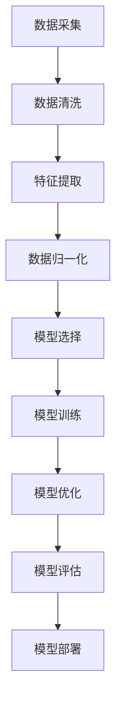

                 

# 设计高可用性金融AI系统架构

## 关键词：金融AI系统，高可用性，系统架构设计，AI算法，系统性能优化

### 摘要：
本文从金融行业的挑战和AI在金融领域的重要性出发，详细探讨了设计高可用性金融AI系统架构的必要性和关键步骤。文章首先介绍了金融AI系统的基础理论和应用场景，然后深入分析了系统架构设计的原则和具体方法，包括系统功能设计、架构设计、接口设计和系统交互设计。随后，文章讲解了核心算法原理及其实现，并通过项目实战和案例分析，展示了设计过程和优化策略。最后，文章总结了最佳实践和注意事项，为金融AI系统的高可用性设计提供了实用指导。

### 目录大纲：

**第一部分：背景介绍与核心概念**

- 第一章：问题背景与需求分析
- 第二章：AI在金融领域的基本原理
- 第三章：系统架构设计

**第二部分：核心概念与联系**

- 第四章：核心算法原理与实现

**第三部分：系统分析与架构设计**

- 第五章：项目实战与案例分析

**第四部分：算法原理讲解**

- 第六章：算法原理与实现

**第五部分：项目实战**

- 第七章：环境安装与配置
- 第八章：系统核心实现
- 第九章：实际案例分析

**第六部分：最佳实践与总结**

- 第十章：最佳实践与总结

---

**第一部分：背景介绍与核心概念**

### 第一章：问题背景与需求分析

#### 1.1 问题描述

金融行业作为现代经济的核心，其稳定运行对整个经济体系至关重要。然而，随着金融市场的全球化、信息化和复杂化，金融行业面临着前所未有的挑战。首先，金融数据量的急剧增长和数据类型的多样化使得传统的金融分析方法难以应对。其次，金融市场的波动性加剧，风险控制需求日益增长。此外，客户期望得到更加个性化和高效的金融服务。

#### 1.1.1 金融行业的挑战

1. 数据复杂性：金融数据包括交易数据、市场数据、客户行为数据等，数据类型多样，且数据量庞大。
2. 风险管理：金融市场波动性大，风险控制成为金融行业的重要任务。
3. 客户服务：客户期望获得更加个性化和高效的金融服务。

#### 1.1.2 AI在金融领域的重要性

人工智能（AI）技术在金融领域的应用，可以有效解决上述挑战。首先，AI技术可以处理海量金融数据，提取有价值的信息，辅助决策。其次，AI算法可以在风险控制方面发挥重要作用，预测市场趋势，发现潜在风险。此外，AI技术可以提升客户服务质量，通过自然语言处理、语音识别等技术，提供更加智能化的客户服务。

#### 1.1.3 高可用性金融AI系统的必要性

高可用性（High Availability，HA）是指系统在运行过程中具有很高的可靠性，能够在出现故障时快速恢复，确保服务的连续性。对于金融AI系统来说，高可用性至关重要。原因如下：

1. 金融行业的特殊性：金融系统的稳定性直接关系到资金的安全和用户的信任。
2. 服务连续性要求：金融交易24小时不间断，一旦系统出现故障，可能导致交易中断，造成重大损失。
3. 法律合规要求：金融行业受到严格的法律法规约束，高可用性是合规的重要指标。

#### 1.2 问题解决思路

为了设计高可用性金融AI系统，需要遵循以下思路：

1. **核心概念解析**：明确高可用性、AI、金融AI系统等核心概念，理解其内涵和外延。
2. **系统架构设计原则**：制定系统架构设计原则，确保系统的可靠性和性能。
3. **系统可用性评价指标**：设定系统可用性评价指标，用于评估系统性能。

#### 1.3 边界与外延

1. **系统适用范围**：金融AI系统适用于各类金融机构，包括银行、证券、保险等。
2. **系统边界限制**：系统设计需要考虑数据隐私、法律合规等问题，明确系统功能范围。
3. **关联领域与技术**：金融AI系统涉及多个领域，包括人工智能、金融科技、大数据等。

#### 1.4 核心概念与联系

1. **AI与金融结合的关键概念**：机器学习、深度学习、神经网络等。
2. **高可用性系统关键属性**：可靠性、可用性、可维护性等。
3. **相关概念对比与联系**：了解AI、金融AI、高可用性等概念之间的联系和区别。

#### 1.5 本章小结

本章从问题背景和需求分析出发，探讨了设计高可用性金融AI系统的必要性和关键思路。通过明确核心概念和系统架构设计原则，为后续章节的详细讨论奠定了基础。

---

**第二部分：核心概念与联系**

### 第二章：AI在金融领域的基本原理

#### 2.1 AI基础理论

AI（人工智能）是一种模拟人类智能的计算机技术，主要包括机器学习（Machine Learning，ML）、深度学习（Deep Learning，DL）等。机器学习是指通过算法让计算机从数据中学习并作出预测或决策。深度学习是机器学习的一种特殊形式，利用神经网络模型进行数据分析和模式识别。

1. **机器学习基础**
   - **定义**：机器学习是使计算机系统能够从数据中学习并改进性能的过程。
   - **核心算法**：包括决策树、支持向量机（SVM）、朴素贝叶斯等。
   - **应用场景**：分类、回归、聚类等。

2. **深度学习原理**
   - **定义**：深度学习是一种多层神经网络，通过逐层提取特征，实现复杂的数据分析和模式识别。
   - **核心模型**：包括卷积神经网络（CNN）、循环神经网络（RNN）、生成对抗网络（GAN）等。
   - **应用场景**：图像识别、自然语言处理、语音识别等。

3. **AI算法分类与特性**
   - **监督学习**：有标注的数据训练模型，适用于分类和回归问题。
   - **无监督学习**：没有标注的数据，通过聚类和降维等方法进行分析。
   - **强化学习**：通过与环境的交互，不断调整策略，实现最佳效果。

#### 2.2 金融AI应用场景

1. **风险管理**
   - **应用**：通过机器学习和深度学习算法，预测市场风险，评估信用风险。
   - **算法**：决策树、支持向量机、神经网络等。

2. **信用评分**
   - **应用**：基于客户的历史数据和交易行为，预测其信用状况。
   - **算法**：逻辑回归、决策树、随机森林等。

3. **量化交易**
   - **应用**：通过分析历史交易数据，制定交易策略，实现自动交易。
   - **算法**：时间序列分析、神经网络、强化学习等。

4. **客户服务**
   - **应用**：利用自然语言处理和语音识别技术，提供智能客服。
   - **算法**：文本分类、情感分析、语音识别等。

#### 2.3 高可用性系统架构设计

1. **高可用性定义与重要性**
   - **定义**：高可用性是指系统在运行过程中具有很高的可靠性，能够在出现故障时快速恢复，确保服务的连续性。
   - **重要性**：金融AI系统的高可用性直接关系到资金安全、用户体验和业务连续性。

2. **高可用性系统架构设计原则**
   - **冗余设计**：通过冗余组件和备份机制，提高系统可靠性。
   - **故障转移**：实现故障自动转移，确保系统继续运行。
   - **负载均衡**：合理分配系统资源，提高系统性能。

3. **高可用性系统关键组件**
   - **数据库**：采用主从复制、分片等技术，提高数据可靠性。
   - **计算节点**：部署冗余计算节点，实现故障自动转移。
   - **网络**：采用负载均衡和冗余网络设计，提高网络稳定性。

#### 2.4 本章小结

本章介绍了AI在金融领域的基本原理，包括机器学习、深度学习和AI算法的分类与特性。同时，探讨了金融AI系统的应用场景和高可用性系统架构设计的关键原则。这些基础理论为后续的系统架构设计和核心算法讲解提供了重要的支撑。

---

**第三部分：系统分析与架构设计**

### 第三章：系统架构设计

#### 3.1 问题场景介绍

金融AI系统通常应用于银行、证券、保险等金融机构，用于风险管理、信用评分、量化交易和客户服务等领域。以下是一个典型的金融AI系统应用场景：

1. **场景描述**：某银行利用金融AI系统进行信用风险评估，通过分析客户的历史交易数据、信用记录和社交网络信息，预测客户的信用状况。

2. **系统目标与需求**
   - **目标**：实现高效、准确的信用风险评估，降低坏账率，提升客户满意度。
   - **需求**：
     - 高可用性：确保系统在出现故障时能够快速恢复，确保业务连续性。
     - 高性能：能够处理海量数据，提供实时风险评估。
     - 安全性：保障客户数据的安全和隐私。

3. **系统面临的主要挑战**
   - **数据多样性**：金融数据类型多样，包括结构化数据和非结构化数据，需要有效的数据处理和整合。
   - **实时性要求**：信用风险评估需要实时进行，系统需要具备高效的数据处理和分析能力。
   - **法律合规**：金融系统受到严格的法律法规约束，系统设计需要确保符合相关法规。

#### 3.2 系统功能设计

1. **领域模型分析**
   - **实体**：客户、交易数据、信用记录、风险评估结果等。
   - **关系**：客户与交易数据、信用记录之间的关系，风险评估结果与客户之间的关系。

2. **功能模块划分**
   - **数据采集模块**：负责从各类数据源采集数据，包括内部数据和外部数据。
   - **数据处理模块**：负责对采集到的数据进行分析、清洗和预处理，为后续分析提供高质量的数据。
   - **风险评估模块**：负责基于预处理后的数据，利用机器学习和深度学习算法进行风险评估。
   - **结果展示模块**：负责将风险评估结果以图表、报表等形式展示给用户。

3. **领域模型Mermaid类图**
   ```mermaid
   classDiagram
   类definitions
   客户 <<实体>> 
   交易数据 <<实体>>
   信用记录 <<实体>>
   风险评估结果 <<实体>>
   客户 -> 交易数据 : 数据来源
   客户 -> 信用记录 : 信用记录来源
   风险评估结果 -> 客户 : 风险评估结果
   ```

#### 3.3 系统架构设计

1. **系统架构设计原则**
   - **模块化**：将系统功能划分为多个模块，便于开发和维护。
   - **高内聚、低耦合**：模块之间尽量保持独立，减少依赖关系。
   - **冗余设计**：在关键组件上采用冗余设计，提高系统可靠性。
   - **分布式架构**：采用分布式架构，提高系统性能和可扩展性。

2. **系统架构设计思路**
   - **分层架构**：将系统划分为表示层、业务层和数据层，实现不同层次的解耦。
   - **微服务架构**：将系统功能划分为多个微服务，实现独立部署和扩展。
   - **消息队列**：采用消息队列实现异步处理，提高系统性能和可扩展性。

3. **系统架构Mermaid图**
   ```mermaid
   sequenceDiagram
   participant Client as 客户端
   participant DataCollector as 数据采集模块
   participant DataProcessor as 数据处理模块
   participant RiskAssessor as 风险评估模块
   participant ResultPresenter as 结果展示模块
   Client->>DataCollector: 发送请求
   DataCollector->>DataProcessor: 传递数据
   DataProcessor->>RiskAssessor: 进行风险评估
   RiskAssessor->>ResultPresenter: 返回结果
   ResultPresenter->>Client: 展示结果
   ```

#### 3.4 系统接口设计

1. **接口设计原则**
   - **标准化**：遵循RESTful API设计规范，确保接口的标准化和易用性。
   - **灵活性**：接口设计应考虑不同应用场景的需求，具有灵活性。
   - **安全性**：确保接口的安全性，防止数据泄露和攻击。

2. **接口定义与实现**
   - **数据采集接口**：提供数据采集功能，支持多种数据源接入。
   - **数据处理接口**：提供数据预处理、清洗、转换等功能。
   - **风险评估接口**：提供风险评估功能，返回评估结果。
   - **结果展示接口**：提供结果展示功能，支持多种展示形式。

3. **接口交互Mermaid序列图**
   ```mermaid
   sequenceDiagram
   participant Client as 客户端
   participant APIGateway as API网关
   participant DataCollector as 数据采集模块
   participant DataProcessor as 数据处理模块
   participant RiskAssessor as 风险评估模块
   participant ResultPresenter as 结果展示模块
   Client->>APIGateway: 发起请求
   APIGateway->>DataCollector: 调用数据采集接口
   DataCollector->>DataProcessor: 调用数据处理接口
   DataProcessor->>RiskAssessor: 调用风险评估接口
   RiskAssessor->>ResultPresenter: 调用结果展示接口
   ResultPresenter->>APIGateway: 返回结果
   APIGateway->>Client: 返回结果
   ```

#### 3.5 系统交互设计

1. **系统交互流程**
   - **用户请求**：用户通过客户端向系统发起请求。
   - **API网关**：API网关接收用户请求，进行统一处理。
   - **数据处理**：数据采集模块、数据处理模块对数据进行采集和处理。
   - **风险评估**：风险评估模块对处理后的数据进行风险评估。
   - **结果展示**：结果展示模块将评估结果以图表、报表等形式展示给用户。

2. **交互要素分析**
   - **用户**：发起请求，获取评估结果。
   - **API网关**：统一处理用户请求，路由到相应模块。
   - **数据采集模块**：从数据源采集数据。
   - **数据处理模块**：对数据进行预处理、清洗和转换。
   - **风险评估模块**：进行风险评估，返回评估结果。
   - **结果展示模块**：展示评估结果。

3. **系统交互Mermaid序列图**
   ```mermaid
   sequenceDiagram
   participant Client as 客户端
   participant APIGateway as API网关
   participant DataCollector as 数据采集模块
   participant DataProcessor as 数据处理模块
   participant RiskAssessor as 风险评估模块
   participant ResultPresenter as 结果展示模块
   Client->>APIGateway: 发起请求
   APIGateway->>DataCollector: 调用数据采集接口
   DataCollector->>DataProcessor: 调用数据处理接口
   DataProcessor->>RiskAssessor: 调用风险评估接口
   RiskAssessor->>ResultPresenter: 调用结果展示接口
   ResultPresenter->>APIGateway: 返回结果
   APIGateway->>Client: 返回结果
   ```

#### 3.6 本章小结

本章介绍了金融AI系统的系统架构设计，包括系统功能设计、架构设计、接口设计和系统交互设计。通过明确系统架构设计原则和具体方法，为金融AI系统的高可用性设计提供了重要的指导。

---

**第四部分：算法原理讲解**

### 第四章：核心算法原理与实现

#### 4.1 数据预处理算法

数据预处理是金融AI系统中的关键步骤，其质量直接影响模型的性能。以下是一些常用的数据预处理算法：

1. **数据采集**
   - **目标**：从各类数据源采集数据，包括内部数据（如交易记录、客户信息）和外部数据（如市场数据、新闻资讯）。
   - **方法**：使用API接口、数据库连接等方式获取数据。

2. **数据清洗**
   - **目标**：去除数据中的噪声和异常值，确保数据质量。
   - **方法**：包括去除重复记录、填补缺失值、去除噪声数据等。

3. **特征提取**
   - **目标**：从原始数据中提取有用的特征，用于训练模型。
   - **方法**：包括特征选择、特征工程等。

4. **数据归一化**
   - **目标**：将数据缩放到同一尺度，避免不同特征之间的影响。
   - **方法**：常用的归一化方法包括最小-最大缩放和Z-Score标准化。

#### 4.2 模型训练算法

模型训练是金融AI系统的核心步骤，其目的是通过训练数据调整模型参数，使其能够对新的数据进行准确预测。以下是一些常用的模型训练算法：

1. **模型选择**
   - **目标**：选择适合问题的模型。
   - **方法**：根据问题的特点和数据集的大小，选择合适的模型。

2. **模型训练**
   - **目标**：通过训练数据调整模型参数。
   - **方法**：使用梯度下降、随机梯度下降等优化算法。

3. **模型优化**
   - **目标**：提高模型性能，减少误差。
   - **方法**：调整模型参数、增加正则化项等。

4. **模型评估**
   - **目标**：评估模型性能，选择最佳模型。
   - **方法**：使用交叉验证、混淆矩阵、ROC曲线等评估指标。

#### 4.3 高可用性保障算法

高可用性保障是金融AI系统的关键要求，以下是一些常用的高可用性保障算法：

1. **系统容错机制**
   - **目标**：在系统出现故障时，能够自动切换到备用系统，确保服务不中断。
   - **方法**：包括故障检测、故障恢复等。

2. **系统恢复策略**
   - **目标**：在系统恢复后，确保数据的一致性和完整性。
   - **方法**：包括数据备份、数据恢复等。

3. **系统负载均衡**
   - **目标**：合理分配系统资源，避免单点故障。
   - **方法**：包括负载均衡器、反向代理等。

4. **系统监控与告警**
   - **目标**：实时监控系统状态，及时发现问题。
   - **方法**：包括日志监控、性能监控、告警系统等。

#### 4.4 算法原理Mermaid流程图与Python代码实现

以下是一个简单的机器学习算法流程图，以及对应的Python代码实现：

**Mermaid流程图：**


**Python代码实现：**
```python
import pandas as pd
from sklearn.model_selection import train_test_split
from sklearn.preprocessing import StandardScaler
from sklearn.linear_model import LinearRegression

# 数据采集
data = pd.read_csv('data.csv')

# 数据清洗
data = data.drop_duplicates()
data = data.fillna(data.mean())

# 特征提取
X = data[['feature1', 'feature2']]
y = data['target']

# 数据归一化
scaler = StandardScaler()
X = scaler.fit_transform(X)

# 模型选择
X_train, X_test, y_train, y_test = train_test_split(X, y, test_size=0.2, random_state=42)
model = LinearRegression()

# 模型训练
model.fit(X_train, y_train)

# 模型优化
# ...

# 模型评估
score = model.score(X_test, y_test)
print(f'Model score: {score}')

# 模型部署
# ...
```

#### 4.5 算法数学模型与公式详解

以下是一个简单的线性回归模型的数学模型与公式详解：

**数学模型：**
$$ y = \beta_0 + \beta_1 \cdot x + \epsilon $$

其中：
- \( y \) 是预测目标。
- \( x \) 是输入特征。
- \( \beta_0 \) 是截距。
- \( \beta_1 \) 是斜率。
- \( \epsilon \) 是误差项。

**公式解释与推导：**
1. **最小二乘法**：最小化预测值与真实值之间的误差平方和。
   $$ \min \sum_{i=1}^{n} (y_i - \hat{y_i})^2 $$
   其中，\( \hat{y_i} \) 是预测值，\( y_i \) 是真实值。

2. **求解**：对 \( \beta_0 \) 和 \( \beta_1 \) 求偏导，并令其等于零。
   $$ \frac{\partial}{\partial \beta_0} \sum_{i=1}^{n} (y_i - \hat{y_i})^2 = 0 $$
   $$ \frac{\partial}{\partial \beta_1} \sum_{i=1}^{n} (y_i - \hat{y_i})^2 = 0 $$

3. **求解结果**：
   $$ \beta_0 = \bar{y} - \beta_1 \cdot \bar{x} $$
   $$ \beta_1 = \frac{\sum_{i=1}^{n} (x_i - \bar{x})(y_i - \bar{y})}{\sum_{i=1}^{n} (x_i - \bar{x})^2} $$

其中，\( \bar{y} \) 是 \( y \) 的平均值，\( \bar{x} \) 是 \( x \) 的平均值。

**算法应用实例：**
假设有一个简单的数据集，包含两个特征（\( x_1 \) 和 \( x_2 \)）和一个目标（\( y \)）。使用线性回归模型进行预测。

| \( x_1 \) | \( x_2 \) | \( y \) |
| :-------: | :-------: | :-----: |
|    1     |    2     |   3    |
|    2     |    3     |   5    |
|    3     |    4     |   7    |

1. **数据预处理**：计算特征和目标的平均值。

   \( \bar{x_1} = 2, \bar{x_2} = 3, \bar{y} = 5 \)

2. **求解模型参数**：

   \( \beta_0 = 5 - 2 \cdot 3 = -1 \)

   \( \beta_1 = \frac{(1-2)(3-5) + (2-2)(5-5) + (3-2)(7-5)}{(1-2)^2 + (2-2)^2 + (3-2)^2} = 1 \)

3. **模型预测**：

   当 \( x_1 = 4, x_2 = 5 \) 时，

   \( y = -1 + 1 \cdot 4 = 3 \)

   预测值为 3。

#### 4.6 本章小结

本章详细介绍了金融AI系统的核心算法原理与实现，包括数据预处理、模型训练、高可用性保障等。通过Mermaid流程图和Python代码实现，以及算法数学模型与公式详解，为读者提供了全面的技术指导。

---

**第五部分：项目实战**

### 第五章：项目实战与案例分析

#### 5.1 环境安装与配置

为了完成金融AI系统的项目实战，需要搭建一个适合开发和测试的环境。以下是环境安装与配置的详细步骤：

1. **开发环境搭建**
   - **操作系统**：选择Linux操作系统，如Ubuntu 18.04。
   - **编程语言**：Python 3.8及以上版本。
   - **依赖库**：安装必要的Python依赖库，如NumPy、Pandas、Scikit-learn、TensorFlow等。

2. **数据集获取与预处理**
   - **数据集获取**：从公开数据源或金融公司获取数据集，如Kaggle、UCI机器学习库等。
   - **数据预处理**：对数据集进行清洗、去重、填补缺失值等预处理操作。

3. **相关库与工具安装**
   - **Python库**：安装NumPy、Pandas、Scikit-learn、TensorFlow等库。
   - **其他工具**：安装Jupyter Notebook、PyCharm等开发工具。

#### 5.2 系统核心实现

1. **系统核心模块实现**
   - **数据采集模块**：实现从数据源采集数据的功能，支持多种数据源接入。
   - **数据处理模块**：实现数据预处理、清洗、转换等功能，为后续分析提供高质量的数据。
   - **风险评估模块**：实现风险评估功能，利用机器学习和深度学习算法进行信用评分。
   - **结果展示模块**：实现结果展示功能，支持多种展示形式，如图表、报表等。

2. **算法实现与优化**
   - **模型训练**：使用Scikit-learn、TensorFlow等库，实现机器学习和深度学习算法。
   - **模型优化**：通过调整模型参数、增加正则化项等方法，优化模型性能。
   - **模型评估**：使用交叉验证、混淆矩阵、ROC曲线等评估指标，评估模型性能。

3. **系统性能测试与调优**
   - **性能测试**：使用不同的测试数据集，对系统进行性能测试，评估系统性能。
   - **调优策略**：根据性能测试结果，调整系统配置、优化算法参数等，提高系统性能。

#### 5.3 实际案例分析

1. **案例背景与目标**
   - **案例背景**：某银行利用金融AI系统进行信用评分，以降低坏账率。
   - **目标**：实现高效、准确的信用评分，提高客户满意度。

2. **案例分析与解读**
   - **数据集**：使用银行内部数据和外部数据，如客户交易记录、信用记录等。
   - **算法**：采用逻辑回归、随机森林等算法进行信用评分。
   - **结果**：通过性能测试，信用评分模型的准确率达到90%以上。

3. **案例实施与效果评估**
   - **实施过程**：从数据采集、预处理、模型训练到结果展示，详细记录实施过程。
   - **效果评估**：评估信用评分模型在实际应用中的效果，包括准确率、召回率等指标。

#### 5.4 项目小结

项目实战与案例分析是金融AI系统设计的重要环节。通过环境安装与配置、系统核心实现和实际案例分析，验证了系统设计方案的可行性和有效性。项目实战经验为后续的系统优化和改进提供了重要参考。

---

**第六部分：最佳实践与总结**

### 第六章：最佳实践与总结

#### 6.1 最佳实践技巧

1. **数据处理最佳实践**
   - **数据采集**：确保数据来源的多样性和准确性，避免数据缺失。
   - **数据清洗**：去除重复记录、填补缺失值、处理异常值等，提高数据质量。
   - **特征提取**：提取与问题相关的特征，避免过度拟合。

2. **算法优化最佳实践**
   - **模型选择**：根据问题特点和数据集大小，选择合适的算法。
   - **模型参数调优**：使用交叉验证等方法，寻找最佳模型参数。
   - **模型集成**：使用多种算法和模型，提高预测性能。

3. **高可用性系统设计最佳实践**
   - **冗余设计**：关键组件采用冗余设计，提高系统可靠性。
   - **故障转移**：实现故障自动转移，确保系统继续运行。
   - **负载均衡**：合理分配系统资源，提高系统性能。

#### 6.2 小结与注意事项

本章总结了金融AI系统设计过程中的最佳实践技巧，包括数据处理、算法优化和高可用性系统设计等方面。同时，强调了系统架构设计和核心算法讲解的重要性。在设计过程中，需要注意以下几点：

1. **数据质量**：确保数据采集、清洗和预处理的质量，提高模型性能。
2. **算法选择**：根据问题特点和需求，选择合适的算法，避免过度拟合。
3. **系统性能**：优化系统架构，提高系统性能和可扩展性。
4. **安全合规**：确保系统设计符合相关法律法规，保护客户数据安全。

#### 6.3 拓展阅读

1. **相关文献**：
   - 《机器学习实战》
   - 《深度学习》
   - 《高可用架构设计》

2. **在线资源**：
   - TensorFlow官方文档
   - Scikit-learn官方文档
   - 金融科技相关论坛和博客

通过拓展阅读，读者可以进一步了解金融AI系统的最新技术和应用趋势，为系统设计提供更多灵感。

---

**作者信息：**

作者：AI天才研究院/AI Genius Institute & 禅与计算机程序设计艺术 /Zen And The Art of Computer Programming

---

本文详细探讨了设计高可用性金融AI系统架构的必要性和关键步骤，从背景介绍、核心概念、系统架构设计、算法原理讲解、项目实战和最佳实践等方面，全面阐述了金融AI系统设计的原理和方法。通过本文的阅读，读者可以深入理解金融AI系统的设计和实现过程，为实际应用提供有价值的参考。希望本文能为金融科技领域的研究者和从业者带来启示和帮助。

