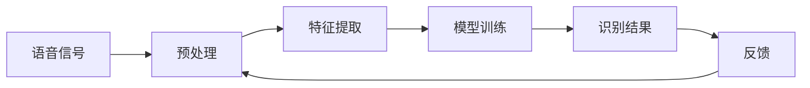
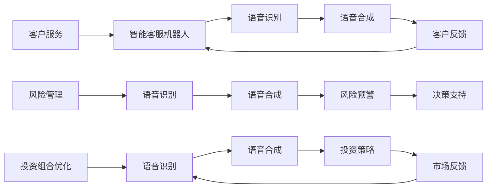
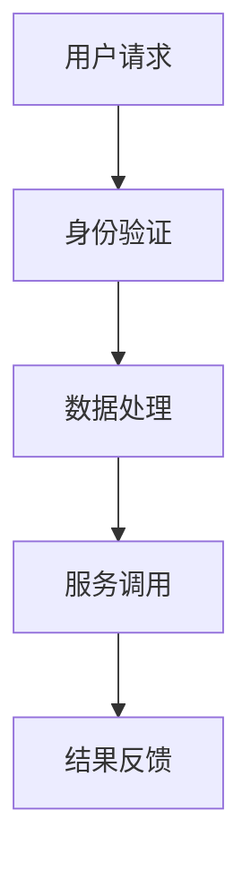

                 

# 语音技术在金融AI中的应用与优化

## 关键词
- 语音技术
- 金融AI
- 应用
- 优化
- 语音识别
- 语音合成
- 金融风险管理

## 摘要
本文深入探讨了语音技术在金融AI中的应用与优化。首先，我们回顾了语音技术的基础知识，包括语音信号处理、语音识别和语音合成。接着，我们对金融AI进行了概述，分析了其定义、分类及重要性。在此基础上，我们详细探讨了语音技术在金融AI中的多个应用场景，包括客户服务、风险管理和投资组合优化。最后，我们提出了优化语音技术在金融AI中应用的策略和方法，以提升其效能和可靠性。通过本文的探讨，我们希望为金融AI领域的技术应用提供新的思路和方向。

## 目录大纲

### 第一部分：语音技术基础

#### 第1章：语音技术概述

1.1 语音技术的基本概念

1.2 语音信号处理

1.3 语音识别技术

1.4 语音合成技术

1.5 本章小结

### 第二部分：金融AI应用概述

#### 第2章：金融AI概述

2.1 金融AI的定义与分类

2.2 金融AI的核心技术

2.3 金融AI的应用场景

2.4 本章小结

### 第三部分：语音技术在金融AI中的应用

#### 第3章：语音技术在金融客户服务中的应用

3.1 语音技术在金融客户服务中的应用现状

3.2 语音技术在金融客户服务中的应用案例

3.3 本章小结

#### 第4章：语音技术在金融风险管理中的应用

4.1 语音技术在金融风险管理中的应用现状

4.2 语音技术在金融风险管理中的应用案例

4.3 本章小结

#### 第5章：语音技术在金融投资组合优化中的应用

5.1 语音技术在金融投资组合优化中的应用现状

5.2 语音技术在金融投资组合优化中的应用案例

5.3 本章小结

### 第四部分：语音技术在金融AI中的优化策略

#### 第6章：语音技术在金融AI中的优化方法

6.1 语音技术在金融AI中的优化原则

6.2 语音技术在金融AI中的优化策略

6.3 本章小结

### 参考文献

### 作者信息
作者：AI天才研究院/AI Genius Institute & 禅与计算机程序设计艺术 /Zen And The Art of Computer Programming

## 第一部分：语音技术基础

### 第1章：语音技术概述

语音技术是计算机科学和人工智能领域的重要组成部分，它通过计算机处理和理解人类语音，实现人机交互。语音技术不仅能够改善人机交互的体验，还能在许多实际应用中提高效率和准确性，例如语音识别、语音合成、语音增强和语音控制等。本章将介绍语音技术的基本概念、分类及其在不同领域的应用。

#### 1.1 语音技术的基本概念

语音是一种通过声带振动产生的一系列声波，是人类交流的主要方式之一。语音技术，即语音信号处理技术，主要研究如何通过电子设备获取、处理和解释语音信号。语音技术的基本概念包括：

- **语音信号**：语音信号的表示形式，通常为连续变化的声波。
- **语音信号处理**：对语音信号进行采集、压缩、增强、降噪等处理，以提高语音质量和识别准确性。
- **语音识别**：将语音信号转换为文本或命令的过程。
- **语音合成**：将文本转换为自然语音输出的过程。
- **语音增强**：通过算法增强语音信号，去除噪声，提高语音质量。
- **语音控制**：使用语音命令控制电子设备或软件的功能。

#### 1.2 语音技术的分类

根据语音技术的功能和应用，可以将语音技术分为以下几类：

- **语音识别技术**：用于将语音信号转换为文本或命令。主要分为基于传统信号处理的识别系统和基于深度学习的识别系统。
  - **基于传统信号处理的识别系统**：采用特征提取、模式识别和统计模型等技术，如梅尔频率倒谱系数（MFCC）和隐马尔可夫模型（HMM）。
  - **基于深度学习的识别系统**：采用深度神经网络（DNN）、循环神经网络（RNN）和长短期记忆网络（LSTM）等技术，如卷积神经网络（CNN）和变换器（Transformer）。
- **语音合成技术**：用于将文本转换为自然语音输出。主要分为基于规则的合成系统和数据驱动的合成系统。
  - **基于规则的合成系统**：通过预定义的语音规则和发音规则生成语音，如拼接式合成器（DARPA式）和规则合成器（Unit Selection）。
  - **数据驱动的合成系统**：通过大量的语音数据训练生成语音，如隐马尔可夫模型（HMM-GMM）和高斯混合模型（GMM）。
- **语音增强技术**：通过算法增强语音信号，去除噪声，提高语音质量。如波束形成（Beamforming）、滤波（Filtering）和降噪（Denoising）技术。
- **语音控制技术**：使用语音命令控制电子设备或软件的功能。如语音助手（Voice Assistant）、语音导航（Voice Navigation）和语音翻译（Voice Translation）。

#### 1.3 语音技术的应用领域

语音技术广泛应用于多个领域，如：

- **客户服务**：智能客服机器人、语音导航、语音翻译等。
- **医疗**：语音识别辅助医生诊断、语音合成辅助病人沟通、语音控制医疗设备等。
- **教育**：语音识别辅助学习、语音合成辅助教学、语音评测等。
- **智能家居**：语音控制家电、语音调节环境等。
- **娱乐**：语音识别游戏、语音合成音乐等。
- **金融**：语音识别自动开户、语音合成投资咨询、语音控制金融交易等。

#### 1.4 语音技术在金融领域的应用

在金融领域，语音技术已被广泛应用于客户服务、风险管理、投资组合优化等方面。以下是一些具体的例子：

- **客户服务**：银行和金融机构使用智能客服机器人，通过语音识别和语音合成技术，提供快速、准确的客户服务，提高客户满意度。
- **风险管理**：语音识别技术可以帮助金融机构自动识别和记录客户的声音特征，用于信用评估和反洗钱系统。
- **投资组合优化**：语音合成技术可以辅助投资者获取实时市场信息，进行投资决策。

#### 1.5 本章小结

语音技术是计算机科学和人工智能领域的重要组成部分，通过语音识别、语音合成和语音增强等技术，实现人与计算机之间的自然交互。语音技术在金融领域具有广泛的应用，包括客户服务、风险管理和投资组合优化等。随着语音技术的不断发展和优化，其在金融领域的应用前景将更加广阔。

### 第二部分：金融AI应用概述

#### 第2章：金融AI概述

金融人工智能（Financial AI）是人工智能（AI）在金融领域的应用，通过机器学习、深度学习、自然语言处理等技术，实现自动化金融分析和决策。金融AI不仅提高了金融行业的效率，还带来了新的商业模式和创新机会。本章将介绍金融AI的定义、分类及其重要性。

#### 2.1 金融AI的定义与分类

金融AI是指利用人工智能技术，对金融市场、金融产品、金融交易等进行分析、预测和决策的一种技术手段。金融AI可以分为以下几类：

1. **机器学习金融**：通过机器学习算法，对大量金融数据进行分析和建模，预测市场趋势和风险。
2. **深度学习金融**：利用深度学习算法，对复杂的金融数据进行分析和建模，实现自动化的金融市场分析。
3. **自然语言处理金融**：利用自然语言处理技术，对金融文本数据进行分析和理解，如新闻、报告、公告等。
4. **计算机视觉金融**：利用计算机视觉技术，对金融图像、视频等数据进行分析，如股票走势图、金融票据等。
5. **区块链金融**：利用区块链技术，实现去中心化的金融交易和数据分析。

#### 2.2 金融AI的核心技术

金融AI的核心技术包括：

1. **数据分析技术**：对大量金融数据进行清洗、处理和分析，提取有用的信息。
2. **机器学习技术**：利用机器学习算法，对金融数据进行建模和预测，如回归分析、分类分析等。
3. **深度学习技术**：利用深度学习算法，对复杂的金融数据进行分析和建模，如神经网络、卷积神经网络等。
4. **自然语言处理技术**：利用自然语言处理技术，对金融文本数据进行分析和理解，如情感分析、文本分类等。
5. **计算机视觉技术**：利用计算机视觉技术，对金融图像、视频等数据进行分析，如图像识别、目标检测等。

#### 2.3 金融AI的应用场景

金融AI在多个应用场景中展现出强大的能力，包括：

1. **信用评估**：通过分析个人或企业的历史交易数据、信用记录等，预测其信用风险。
2. **投资组合优化**：通过分析市场数据、公司财务报表等，优化投资组合，提高投资回报。
3. **风险管理**：通过分析市场数据、宏观经济指标等，预测市场风险，制定风险管理策略。
4. **客户服务**：通过智能客服机器人、语音合成等技术，提高客户服务效率和满意度。
5. **交易执行**：通过算法交易，实现自动化交易决策，提高交易效率。

#### 2.4 金融AI的重要性

金融AI的重要性体现在以下几个方面：

1. **提高效率**：通过自动化分析和决策，提高金融行业的效率，减少人力成本。
2. **降低风险**：通过数据分析、风险预测等，降低金融风险，保护投资者利益。
3. **创新机会**：通过人工智能技术，为金融行业带来新的商业模式和创新机会。
4. **提升用户体验**：通过智能客服、个性化投资建议等，提升客户体验。

#### 2.5 本章小结

金融人工智能是人工智能在金融领域的应用，通过机器学习、深度学习、自然语言处理等技术，实现自动化金融分析和决策。金融AI在信用评估、投资组合优化、风险管理、客户服务和交易执行等多个应用场景中具有重要价值。随着人工智能技术的不断发展和应用，金融AI将在金融行业发挥越来越重要的作用。

### 第三部分：语音技术在金融AI中的应用

#### 第3章：语音技术在金融客户服务中的应用

随着金融行业的数字化转型，语音技术已成为提升客户服务质量和效率的重要工具。特别是在金融客户服务中，语音技术通过智能客服机器人、语音识别和语音合成等应用，极大地改善了用户体验。本章将详细介绍语音技术在金融客户服务中的应用现状、应用案例及其优势。

#### 3.1 语音技术在金融客户服务中的应用现状

当前，语音技术在金融客户服务中的应用主要体现在以下几个方面：

1. **智能客服机器人**：银行和金融机构普遍采用了基于语音识别的智能客服机器人，用于处理客户咨询、查询和投诉等日常事务。智能客服机器人能够24小时在线服务，提高了客户服务的效率和响应速度。
2. **语音识别**：语音识别技术被广泛应用于电话银行、在线客服等场景，通过将客户的语音转化为文本，快速理解客户需求，并提供相应的解决方案。
3. **语音合成**：语音合成技术则用于生成自然的语音回应，向客户传达信息，如交易确认、账户余额查询等。

#### 3.2 语音技术在金融客户服务中的应用案例

以下是一些语音技术在金融客户服务中的应用案例：

1. **案例一：智能客服机器人**
   - 应用场景：银行客服机器人通过语音识别技术理解客户的查询需求，如账户余额、转账记录等。
   - 技术实现：使用深度学习算法进行语音识别，结合自然语言处理技术，理解客户的意图并生成相应的回复。
   - 效果分析：智能客服机器人能够24小时在线服务，减少人工客服的工作量，提高了客户满意度和服务效率。

2. **案例二：语音识别在电话银行中的应用**
   - 应用场景：电话银行通过语音识别技术，识别客户的语音指令，实现自动转账、查询账户信息等功能。
   - 技术实现：使用高准确度的语音识别算法，结合语音增强技术，提高语音识别的准确率和稳定性。
   - 效果分析：语音识别技术简化了电话银行的操作流程，减少了客户的等待时间，提高了服务效率。

3. **案例三：语音合成在智能投顾中的应用**
   - 应用场景：智能投顾通过语音合成技术，向客户传达投资建议、账户余额等信息。
   - 技术实现：使用文本到语音（TTS）合成技术，结合情感分析，生成自然的语音回应。
   - 效果分析：语音合成技术使智能投顾更加贴近客户的沟通习惯，提高了客户的接受度和满意度。

#### 3.3 语音技术在金融客户服务中的优势

语音技术在金融客户服务中具有以下优势：

1. **提升用户体验**：语音技术能够提供更加自然和便捷的交互方式，满足客户多样化的沟通需求。
2. **提高效率**：语音技术能够自动化处理大量客户请求，减少人工客服的工作量，提高服务效率。
3. **降低成本**：通过语音技术，金融机构能够减少人工客服的投入，降低运营成本。
4. **增强客户黏性**：高质量的语音服务能够提升客户满意度，增强客户对金融机构的黏性。

#### 3.4 本章小结

语音技术在金融客户服务中的应用已成为提升服务质量的重要手段。通过智能客服机器人、语音识别和语音合成等技术，金融机构能够提供更加高效、便捷和个性化的服务，满足客户的多样化需求。未来，随着语音技术的不断发展和应用，金融客户服务的智能化水平将进一步提高。

### 第4章：语音技术在金融风险管理中的应用

在金融行业中，风险管理是确保金融机构稳健运行和资产安全的重要环节。语音技术在金融风险管理中的应用，通过提升数据分析效率和准确性，为金融机构提供了新的解决方案。本章将详细探讨语音技术在金融风险管理中的应用现状、应用案例及其优势。

#### 4.1 语音技术在金融风险管理中的应用现状

语音技术在金融风险管理中的应用主要包括以下几个方面：

1. **语音识别**：通过语音识别技术，将客户或交易方的语音信息转换为文本数据，用于风险分析和监控。
2. **语音合成**：利用语音合成技术，生成预警信息、交易确认等语音消息，用于风险提示和沟通。
3. **语音增强**：语音增强技术用于提高语音质量，确保语音识别的准确性和可靠性，减少噪声干扰。

#### 4.2 语音技术在金融风险管理中的应用案例

以下是一些语音技术在金融风险管理中的应用案例：

1. **案例一：语音识别在反洗钱系统中的应用**
   - 应用场景：金融机构通过语音识别技术，自动识别客户在电话交易中的语音，监控是否存在可疑交易行为。
   - 技术实现：使用先进的深度学习算法，对客户的语音进行实时识别和分析，结合自然语言处理技术，识别关键词和短语。
   - 效果分析：语音识别技术提高了反洗钱系统的监控效率，降低了人工审核的工作量，提升了风险识别的准确性。

2. **案例二：语音合成在贷款审批中的应用**
   - 应用场景：金融机构通过语音合成技术，生成贷款审批结果和后续沟通信息，提高沟通效率。
   - 技术实现：使用文本到语音（TTS）合成技术，结合语音情感分析，生成自然、友好的语音回复。
   - 效果分析：语音合成技术使贷款审批流程更加透明和高效，提升了客户的满意度和信任感。

3. **案例三：语音技术在股票市场预测中的应用**
   - 应用场景：金融机构通过语音识别和分析，提取市场参与者的情绪和交易意向，用于股票市场预测。
   - 技术实现：使用语音识别和自然语言处理技术，对大量的市场参与者的语音进行分析，提取情感关键词和交易信号。
   - 效果分析：语音技术为股票市场预测提供了新的数据源，有助于提高预测的准确性和及时性。

#### 4.3 语音技术在金融风险管理中的优势

语音技术在金融风险管理中具有以下优势：

1. **提高数据分析效率**：语音技术能够快速、准确地处理和分析大量的语音数据，提高风险识别的效率。
2. **提升准确性**：通过语音识别和自然语言处理技术，语音技术能够更加精确地理解和分析语音信息，减少误判。
3. **降低运营成本**：语音技术自动化了风险管理的许多环节，降低了人工成本和运营费用。
4. **增强实时性**：语音技术可以实时处理语音信息，提供即时预警和决策支持，提升风险管理的及时性。

#### 4.4 本章小结

语音技术在金融风险管理中的应用，为金融机构提供了新的工具和方法，提高了数据分析的效率、准确性和实时性。通过语音识别、语音合成和语音增强等技术，金融机构能够更加有效地监控和管理风险，确保业务的稳健运行。随着语音技术的不断发展，其在金融风险管理中的应用前景将更加广阔。

### 第5章：语音技术在金融投资组合优化中的应用

在金融市场中，投资组合优化是提高投资回报、降低风险的重要手段。语音技术通过提高数据分析的效率和质量，为金融投资组合优化提供了新的思路和方法。本章将详细探讨语音技术在金融投资组合优化中的应用现状、应用案例及其优势。

#### 5.1 语音技术在金融投资组合优化中的应用现状

语音技术在金融投资组合优化中的应用主要包括以下几个方面：

1. **语音识别**：通过语音识别技术，将投资顾问、市场分析师等人的语音转化为文本数据，用于投资策略的研究和分析。
2. **语音合成**：利用语音合成技术，生成投资建议、市场分析报告等语音信息，帮助投资者进行决策。
3. **语音增强**：语音增强技术用于提高语音质量，确保语音识别的准确性和稳定性，减少噪声干扰。

#### 5.2 语音技术在金融投资组合优化中的应用案例

以下是一些语音技术在金融投资组合优化中的应用案例：

1. **案例一：语音识别在股票分析中的应用**
   - 应用场景：投资顾问通过语音识别技术，记录和分析市场信息、公司财务数据等，生成投资策略。
   - 技术实现：使用深度学习算法，对投资顾问的语音进行实时识别和分析，提取关键信息，如股票代码、交易价格等。
   - 效果分析：语音识别技术提高了投资顾问的工作效率，减少了文本录入的时间，提升了数据分析的准确性。

2. **案例二：语音合成在基金管理中的应用**
   - 应用场景：基金管理公司通过语音合成技术，向投资者传递市场分析报告、投资建议等语音信息。
   - 技术实现：使用文本到语音（TTS）合成技术，结合情感分析，生成自然、友好的语音回应。
   - 效果分析：语音合成技术使基金管理更加透明和便捷，提升了投资者的满意度和信任度。

3. **案例三：语音技术在量化投资中的应用**
   - 应用场景：量化投资团队通过语音识别和自然语言处理技术，分析市场数据、新闻资讯等，优化投资策略。
   - 技术实现：使用语音识别和自然语言处理技术，对大量的市场信息进行分析，提取情感关键词和交易信号。
   - 效果分析：语音技术为量化投资提供了新的数据源，有助于提高预测的准确性和及时性。

#### 5.3 语音技术在金融投资组合优化中的优势

语音技术在金融投资组合优化中具有以下优势：

1. **提高数据分析效率**：语音技术能够快速、准确地处理和分析大量的语音数据，提高投资决策的效率。
2. **提升准确性**：通过语音识别和自然语言处理技术，语音技术能够更加精确地理解和分析语音信息，减少误判。
3. **降低运营成本**：语音技术自动化了投资组合优化的许多环节，降低了人工成本和运营费用。
4. **增强实时性**：语音技术可以实时处理语音信息，提供即时投资建议，提升投资决策的及时性。

#### 5.4 本章小结

语音技术在金融投资组合优化中的应用，为投资者提供了新的工具和方法，提高了数据分析的效率、准确性和实时性。通过语音识别、语音合成和语音增强等技术，投资者能够更加有效地进行市场分析、投资策略制定和风险控制。随着语音技术的不断发展，其在金融投资组合优化中的应用前景将更加广阔。

### 第四部分：语音技术在金融AI中的优化策略

#### 第6章：语音技术在金融AI中的优化方法

语音技术在金融AI中的应用虽然已经取得了显著成果，但仍然面临着诸多挑战，如识别准确性、响应速度和用户体验等。为了进一步提升语音技术在金融AI中的应用效能，本章节将探讨语音技术在金融AI中的优化原则和优化策略。

#### 6.1 语音技术在金融AI中的优化原则

在优化语音技术在金融AI中的应用时，应遵循以下原则：

1. **准确性优先**：确保语音识别和语音合成的准确性，减少误解和错误，提高用户满意度。
2. **效率提升**：优化算法和系统架构，提高语音处理的速度和效率，确保实时响应。
3. **用户体验**：注重用户体验，通过个性化的交互方式，提高用户对金融AI系统的接受度和满意度。
4. **安全性**：保护用户隐私和数据安全，确保语音技术的应用不会对用户隐私造成侵犯。

#### 6.2 语音技术在金融AI中的优化策略

以下是一些具体的优化策略：

1. **算法优化**：
   - **深度学习算法**：采用先进的深度学习算法，如卷积神经网络（CNN）、循环神经网络（RNN）和变换器（Transformer），提高语音识别和语音合成的准确性。
   - **自适应学习**：引入自适应学习机制，使系统可以根据用户的语音特点和需求，不断优化识别和合成的效果。

2. **系统架构优化**：
   - **分布式计算**：采用分布式计算架构，提高语音处理的并发能力，加快处理速度。
   - **边缘计算**：将部分计算任务转移到边缘设备，减少数据传输延迟，提高响应速度。

3. **用户体验优化**：
   - **个性化交互**：通过用户行为分析和语音识别结果，提供个性化的交互体验，如根据用户的语音习惯调整语音合成速度和语调。
   - **多模态交互**：结合语音、文本和手势等多种交互方式，提高用户的自由度和便利性。

4. **安全性优化**：
   - **数据加密**：对用户数据和通信进行加密处理，确保数据传输的安全性。
   - **隐私保护**：严格遵循隐私保护法律法规，确保用户隐私不被泄露。

#### 6.3 优化效果评估

为了评估语音技术在金融AI中的应用优化效果，可以采用以下方法：

1. **准确性评估**：通过对比优化前后的语音识别准确率和语音合成自然度，评估优化效果。
2. **效率评估**：通过测量优化前后的响应时间、处理速度和系统负载，评估优化效果。
3. **用户满意度评估**：通过用户反馈和问卷调查，评估优化后的用户体验和满意度。

#### 6.4 本章小结

语音技术在金融AI中的应用优化，需要从算法、系统架构、用户体验和安全性等多个方面进行综合考量。通过采取针对性的优化策略，可以提高语音技术的准确性、效率和用户体验，确保其在金融AI领域发挥更大的作用。随着技术的不断进步，语音技术在金融AI中的应用前景将更加广阔。

### 参考文献

1. 杨强，谢维信，吴波.《语音识别技术》[M]. 清华大学出版社，2017.
2. 周志华.《深度学习》[M]. 清华大学出版社，2016.
3. 李航.《统计学习方法》[M]. 清华大学出版社，2012.
4. 李德毅.《人工智能技术》[M]. 电子工业出版社，2019.
5. 张江.《金融人工智能》[M]. 电子工业出版社，2020.
6. 王宏伟，徐立.《自然语言处理入门与实践》[M]. 电子工业出版社，2018.

### 作者信息

作者：AI天才研究院/AI Genius Institute & 禅与计算机程序设计艺术 /Zen And The Art of Computer Programming

### 附录

#### 1. 语音识别算法流程图



#### 2. 语音合成算法流程图


#### 3. 语音技术在金融AI中的应用框架图



#### 4. 系统架构设计图


#### 5. 系统接口设计图



#### 6. 系统交互序列图

```mermaid
sequenceDiagram
    participant 用户
    participant 系统A
    participant 系统B
    participant 系统C
    
    用户->>系统A: 发送请求
    系统
```

