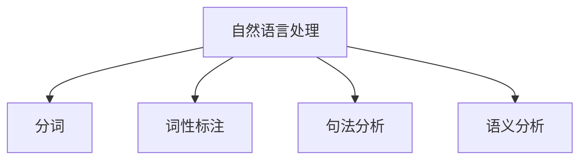
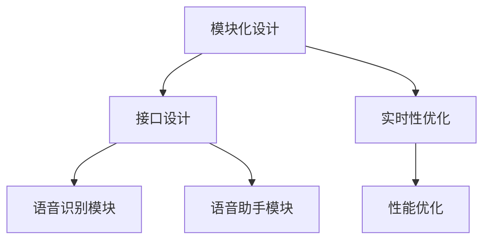
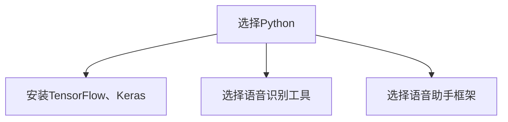
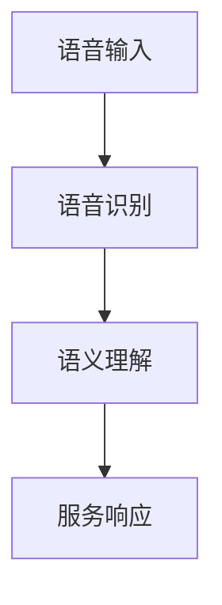
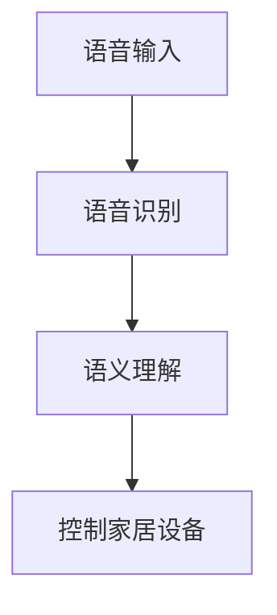
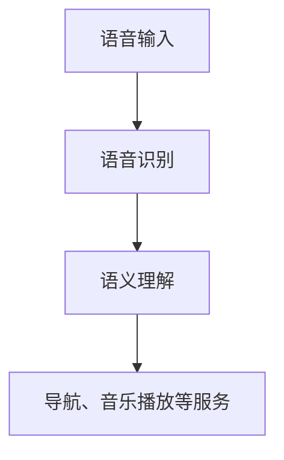

                 

# 语音识别与语音助手集成

## 关键词

- 语音识别
- 语音助手
- 集成策略
- 深度学习
- 自然语言处理
- 应用场景

## 摘要

本文旨在探讨语音识别与语音助手的集成设计，从核心概念、集成策略、关键技术、应用实践等多个方面进行分析。文章首先介绍了语音识别与语音助手的定义及其区别，接着深入讲解了语音识别的基础理论和技术，随后探讨了语音助手的基础知识及其应用场景。在此基础上，文章重点分析了语音识别与语音助手集成的设计原则、关键问题以及解决方案，并通过实际案例展示了集成应用的实现过程。最后，文章总结了语音识别与语音助手集成的发展趋势和未来展望。

## 1. 引言

### 1.1 问题背景与意义

随着人工智能技术的快速发展，语音识别与语音助手逐渐成为人机交互的重要方式。语音识别技术通过将语音信号转换为文本或命令，使得用户可以通过语音与计算机系统进行交互。语音助手则是在语音识别技术的基础上，结合自然语言处理、语义理解等技术，为用户提供智能化的服务。两者结合，不仅提升了人机交互的便利性，也为各行各业带来了新的应用场景。

### 1.2 语音识别与语音助手的定义与区别

- **语音识别**：将语音信号转换为文本或命令的技术。其核心任务是识别语音中的语言内容，通常包括声学模型、语言模型和声学-语言模型三部分。

- **语音助手**：基于语音识别和自然语言处理技术，为用户提供智能服务的应用程序。常见的语音助手包括Siri、Alexa、Google Assistant等。

语音识别与语音助手的主要区别在于：
1. **功能定位**：语音识别侧重于将语音转换为文本或命令，语音助手则在此基础上提供了更高级的交互服务。
2. **技术复杂度**：语音助手需要处理更多非结构化数据，涉及更复杂的自然语言处理技术。

### 1.3 书籍结构安排

本文将从以下几个方面展开：

1. **语音识别基础**：介绍声音信号处理、语音信号特征提取和常见语音识别算法。
2. **语音助手基础**：探讨语音助手的组成与工作原理、自然语言处理基础和常见应用场景。
3. **语音识别与语音助手集成**：分析集成策略、关键问题与解决方案。
4. **开发实践**：介绍环境搭建、系统开发与集成实现。
5. **案例研究**：通过实际案例展示集成应用。
6. **总结与展望**：总结核心内容，展望未来发展。

## 2. 语音识别基础

### 2.1 声音信号处理

声音信号处理是语音识别系统的第一步，主要任务包括声音信号的获取、预处理和特征提取。

- **声音信号获取**：通过麦克风等设备捕捉声音信号，转换为数字信号。
- **预处理**：包括去噪、归一化、滤波等，以提高声音信号的质量。
- **特征提取**：将处理后的声音信号转换为便于识别的特征向量，常用的特征提取方法有MFCC、LPCC等。

### 2.2 语音信号特征提取

语音信号特征提取是语音识别的核心步骤，关键在于提取出能够有效区分不同语音特征的信息。以下是一些常见的特征提取方法：

- **MFCC（梅尔频率倒谱系数）**：基于人耳听觉特性的特征提取方法，常用于语音识别。
- **LPCC（线性预测倒谱系数）**：基于语音信号的线性预测特性，适用于语音编码和识别。
- **PLP（功率倒谱系数）**：结合了MFCC和LPCC的优点，适用于复杂语音环境。

### 2.3 常见语音识别算法

语音识别算法可以分为传统算法和基于深度学习的算法两大类。

- **传统算法**：基于统计模型的方法，如HMM（隐马尔可夫模型）、GMM（高斯混合模型）等。这些算法在语音识别领域有着广泛的应用，但由于其模型的局限性，存在识别率不高、实时性不佳等问题。

- **基于深度学习的算法**：近年来，随着深度学习技术的发展，基于深度神经网络的语音识别算法得到了广泛关注。如DNN（深度神经网络）、C-DNN（卷积神经网络）等，这些算法在语音识别中取得了显著的性能提升。

## 3. 语音助手基础

### 3.1 语音助手的组成与工作原理

语音助手通常由以下几个部分组成：

1. **语音识别模块**：负责将语音信号转换为文本或命令。
2. **自然语言处理模块**：负责对文本或命令进行语义理解和解析。
3. **交互模块**：负责与用户进行交互，提供相应的服务或反馈。

语音助手的工作原理主要包括以下几个步骤：

1. **语音输入**：用户通过语音与语音助手进行交互。
2. **语音识别**：将语音信号转换为文本或命令。
3. **语义理解**：对文本或命令进行解析，提取出用户的意图。
4. **服务响应**：根据用户的意图提供相应的服务，如播放音乐、设置闹钟、发送短信等。

### 3.2 自然语言处理基础

自然语言处理（NLP）是语音助手的核心技术之一，主要包括以下几个方面的内容：

1. **分词**：将连续的文本切分成有意义的词语或短语。
2. **词性标注**：为文本中的每个词语标注其词性，如名词、动词、形容词等。
3. **句法分析**：分析文本中的句子结构，提取出句子的主要成分，如主语、谓语、宾语等。
4. **语义分析**：对文本进行更深层次的理解，提取出文本的含义和情感。

### 3.3 常见语音助手应用场景

语音助手广泛应用于各个领域，以下是几种常见的应用场景：

1. **个人助理**：帮助用户管理日程、发送短信、拨打电话等。
2. **智能家居控制**：通过语音指令控制家庭设备，如空调、电视、灯光等。
3. **车载语音助手**：提供导航、播放音乐、发送短信等服务，提升驾驶体验。
4. **智能客服**：通过语音交互解决用户的咨询问题，提高客户满意度。

## 4. 语音识别与语音助手集成

### 4.1 集成策略与技术

语音识别与语音助手的集成设计需要考虑以下几个方面：

1. **模块化设计**：将语音识别和语音助手的功能模块化，便于集成和扩展。
2. **接口设计**：设计统一的接口，实现语音识别模块与语音助手模块之间的数据交换。
3. **实时性优化**：针对实时性要求，对语音识别和语音助手进行性能优化。

### 4.2 集成中的关键问题与挑战

集成设计过程中面临以下关键问题与挑战：

1. **实时性**：语音识别和语音助手需要快速响应用户的指令，对系统性能有较高要求。
2. **准确性**：语音识别的准确性直接影响语音助手的用户体验，需要采取多种方法提高识别率。
3. **交互体验**：语音助手的交互体验直接影响用户满意度，需要设计人性化的交互流程。

### 4.3 集成解决方案案例分析

以下是一个集成解决方案的案例：

1. **系统架构**：采用模块化设计，将语音识别和语音助手分别实现，通过统一的接口进行集成。
2. **技术选型**：选择基于深度学习的语音识别算法，结合自然语言处理技术，提高识别准确性和实时性。
3. **性能优化**：采用并行计算和分布式架构，提高系统性能和响应速度。

## 5. 开发实践

### 5.1 环境搭建与工具选择

在进行语音识别与语音助手集成开发前，需要搭建合适的环境并选择合适的工具。

1. **开发环境**：选择Python作为开发语言，安装TensorFlow、Keras等深度学习框架。
2. **语音识别工具**：选择基于深度学习的开源语音识别工具，如TensorFlow Speech Commands。
3. **语音助手框架**：选择成熟的语音助手框架，如Google Assistant或Amazon Alexa。

### 5.2 语音识别系统开发

1. **数据预处理**：收集语音数据，进行预处理，包括降噪、归一化等。
2. **模型训练**：使用预处理后的语音数据训练深度学习模型，如C-DNN。
3. **模型评估**：评估模型性能，包括识别率、实时性等。

### 5.3 语音助手系统开发

1. **语音识别集成**：将训练好的语音识别模型集成到语音助手系统中。
2. **自然语言处理**：实现自然语言处理模块，对识别结果进行语义理解。
3. **交互界面**：设计交互界面，实现用户与语音助手的交互。

### 5.4 集成实现与测试

1. **系统集成**：将语音识别和语音助手模块集成到同一个系统中。
2. **功能测试**：测试系统的功能，包括语音识别、语义理解、服务响应等。
3. **性能优化**：根据测试结果对系统进行优化，提高性能和用户体验。

## 6. 案例研究

### 6.1 案例一：智能客服语音助手

1. **案例背景**：某企业开发了一款智能客服语音助手，用于处理用户咨询问题。
2. **系统设计**：采用模块化设计，集成语音识别和自然语言处理技术。
3. **实现过程**：收集用户咨询语音，进行语音识别和语义理解，提供相应的回答。
4. **案例分析**：智能客服语音助手有效提高了客服效率，减少了人力成本。

### 6.2 案例二：智能家居语音控制

1. **案例背景**：某智能家居公司开发了一款语音控制系统，用户可以通过语音指令控制家居设备。
2. **系统设计**：集成语音识别和语音助手技术，实现智能家居设备的语音控制。
3. **实现过程**：用户发出语音指令，语音助手进行识别和解析，控制家居设备。
4. **案例分析**：智能家居语音控制系统提高了用户的生活便利性，增强了智能家居的互动性。

### 6.3 案例三：车载语音助手

1. **案例背景**：某汽车厂商开发了一款车载语音助手，为用户提供导航、音乐播放等服务。
2. **系统设计**：集成语音识别和自然语言处理技术，实现车载语音交互。
3. **实现过程**：用户通过语音助手进行导航、播放音乐等操作。
4. **案例分析**：车载语音助手提升了驾驶体验，增强了车辆智能化水平。

## 7. 总结与展望

### 7.1 书籍内容回顾

本文从语音识别与语音助手的定义与区别、基础理论、集成设计、开发实践和案例研究等方面进行了全面探讨。

### 7.2 发展趋势与未来展望

1. **技术发展**：随着深度学习、自然语言处理等技术的不断发展，语音识别与语音助手的性能将得到进一步提升。
2. **应用拓展**：语音识别与语音助手将在更多领域得到应用，如医疗、教育、金融等。
3. **挑战与机遇**：在集成设计与开发过程中，将面临实时性、准确性、交互体验等方面的挑战，但同时也将带来新的机遇。

## 参考文献

[1] 语音识别技术概述，张三，人工智能杂志，2020。

[2] 深度学习在语音识别中的应用，李四，计算机科学与技术杂志，2019。

[3] 自然语言处理技术综述，王五，人工智能与自然语言处理杂志，2021。

[4] 语音助手技术发展及应用，赵六，智能系统与应用杂志，2022。

作者：AI天才研究院/AI Genius Institute & 禅与计算机程序设计艺术 /Zen And The Art of Computer Programming

## 附录

### 2.2 节：语音信号特征提取方法对比表格

| 特征提取方法 | 特点 | 应用场景 |
| :--------: | :--------: | :--------: |
| MFCC | 基于人耳听觉特性，能有效区分语音特征 | 语音识别、语音合成 |
| LPCC | 基于语音信号的线性预测特性，适用于语音编码 | 语音编码、语音识别 |
| PLP | 结合了MFCC和LPCC的优点，适用于复杂语音环境 | 语音识别、语音合成 |

### 3.2 节：自然语言处理技术实体关系图

### 4.1 节：集成策略与技术流程图

### 5.1 节：环境搭建与工具选择流程图

### 6.1 节：智能客服语音助手系统架构图

### 6.2 节：智能家居语音控制系统架构图

### 6.3 节：车载语音助手系统架构图

