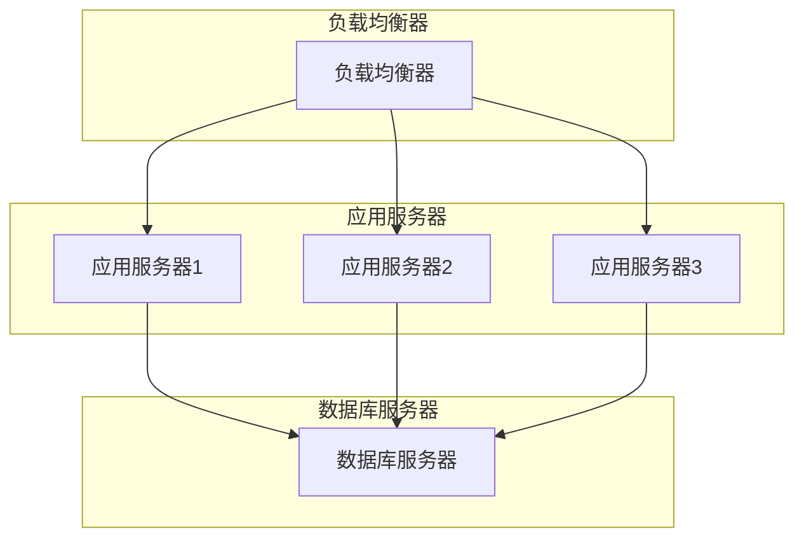
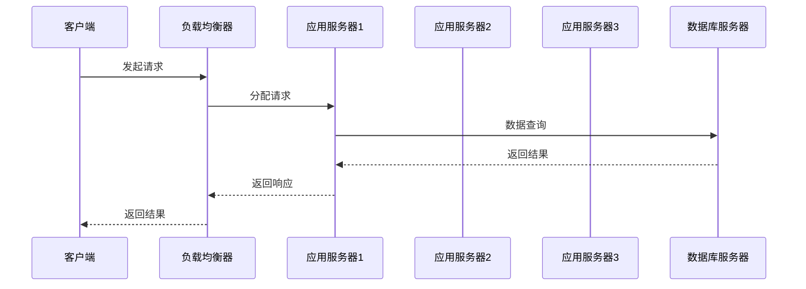

                 


### 引言

负载均衡是现代网络系统和分布式架构中的关键组件，旨在优化资源利用率、提升系统性能和可靠性。在互联网飞速发展的背景下，如何有效地分配网络流量和处理请求成为了系统设计的核心问题。负载均衡算法则成为了解决这一问题的利器，通过智能化的分配策略，确保系统在高并发场景下能够稳定运行。

本文旨在深入探讨负载均衡算法的理论和实践，帮助读者理解各种负载均衡算法的工作原理、实现方式以及在实际项目中的应用。本文将从以下几个部分展开：

1. **背景介绍**：介绍负载均衡的基本概念、问题背景和当前的技术现状。
2. **核心概念与联系**：详细阐述负载均衡中的核心概念，并通过对比表格和Mermaid流程图展示各概念之间的关系。
3. **算法原理讲解**：讲解几种常见的负载均衡算法，使用Mermaid流程图、Python源代码和数学模型进行详细说明。
4. **系统分析与架构设计**：分析负载均衡系统的设计与架构，通过Mermaid类图、架构图和序列图展示系统设计。
5. **项目实战**：介绍一个实际的负载均衡项目，包括环境安装、核心实现源代码以及案例剖析。
6. **最佳实践与总结**：总结最佳实践和注意事项，提供拓展阅读。

通过本文的逐步讲解，读者可以系统地掌握负载均衡算法的理论知识和实践技巧，为解决实际系统中的负载均衡问题提供有力支持。

### 背景介绍

#### 负载均衡的基本概念

负载均衡（Load Balancing）是指通过某种算法，将大量请求分配到多个服务器上，以实现资源的合理利用和系统的高效运行。负载均衡的目标是最大化系统的吞吐量、最小化响应时间、确保系统的稳定性和可靠性。在现代网络系统中，随着服务规模的不断扩大和用户数量的急剧增加，单台服务器难以独立处理大量的请求，因此负载均衡成为系统设计中的关键环节。

#### 问题背景

随着互联网的普及和应用场景的复杂化，越来越多的企业开始采用分布式系统来应对不断增长的业务需求。分布式系统通过将服务拆分成多个模块，部署在不同的服务器上，以提高系统的扩展性和容错性。然而，分布式系统也引入了新的挑战，比如如何高效地分配请求、如何确保系统的负载均衡以及如何处理服务器故障等问题。

当前，负载均衡技术已经发展出多种算法和策略，如轮询（Round Robin）、最小连接数（Least Connections）、哈希（Hash）等。这些算法在实现负载均衡时，各有其优势和适用场景。例如，轮询算法简单易用，但无法根据服务器的当前状态动态调整负载；哈希算法可以实现基于用户身份或请求特征的精准分配，但可能引起热点问题。

#### 问题描述

在分布式系统中，负载均衡需要解决的问题主要包括：

1. **流量分配**：如何将请求均匀地分配到不同的服务器上，避免单点过载。
2. **服务器状态监控**：如何实时监控服务器的状态，动态调整负载分配策略。
3. **故障转移**：如何处理服务器故障，确保请求能够顺利转发到其他可用服务器。
4. **性能优化**：如何通过负载均衡策略优化系统的整体性能，包括响应时间和吞吐量。

#### 问题解决

为了解决上述问题，负载均衡系统需要具备以下能力：

1. **流量分配算法**：实现高效的流量分配，如轮询、最小连接数、哈希等算法。
2. **服务器监控**：通过健康检查、负载监控等手段，实时获取服务器的状态信息。
3. **故障转移机制**：在服务器故障时，能够快速将请求转移至其他可用服务器。
4. **动态调整**：根据服务器状态和请求负载，动态调整负载分配策略。

#### 边界与外延

负载均衡不仅仅局限于服务器集群，还可以应用于其他分布式架构，如容器编排系统（如Kubernetes）、微服务架构等。此外，负载均衡技术还在边缘计算、物联网等领域得到了广泛应用。随着5G、AI等新技术的不断发展，负载均衡技术也在不断演进，如引入机器学习算法、自适应调整策略等，以应对更加复杂的业务场景。

通过以上对背景的介绍，我们可以更好地理解负载均衡的重要性以及其在现代网络系统中的关键作用。接下来，我们将详细探讨负载均衡中的核心概念和算法原理，为解决实际系统中的负载均衡问题打下基础。

### 核心概念与联系

在深入探讨负载均衡算法之前，我们首先需要了解一些核心概念。以下是负载均衡中几个重要的核心概念及其属性特征对比表格。

#### 核心概念

1. **请求（Request）**：客户端向服务器发送的数据请求。
2. **服务器（Server）**：处理请求并提供服务的计算机设备。
3. **负载均衡器（Load Balancer）**：负责将请求分配到多个服务器的设备或软件。
4. **流量（Traffic）**：网络中传输的数据流量。
5. **响应时间（Response Time）**：服务器处理请求并返回响应的时间。

#### 概念属性特征对比表格

| 概念         | 定义                                                                 | 属性特征                                                                                       |
|------------|--------------------------------------------------------------------|------------------------------------------------------------------------------------------------|
| 请求（Request） | 客户端发起的数据请求。                                                   | 类型、参数、目标URL、请求头等                           |
| 服务器（Server） | 处理请求并提供服务的设备。                                                 | IP地址、端口号、负载能力、响应速度等                     |
| 负载均衡器（Load Balancer） | 分配请求到多个服务器的设备或软件。                                       | 算法、监控、健康检查、故障转移等                        |
| 流量（Traffic） | 网络中传输的数据流量。                                                   | 流量大小、传输速率、流向等                             |
| 响应时间（Response Time） | 服务器处理请求并返回响应的时间。                                       | 预期时间、实际时间、影响因素等                         |

#### ER实体关系图架构的 Mermaid 流程图

为了更直观地展示这些概念之间的关系，我们使用Mermaid语法绘制一个ER（Entity-Relationship，实体-关系）图。

```mermaid
erDiagram
  Request ||--|{ Server }|--|{ Load Balancer }
  Server ||--|{ Load Balancer }
  Load Balancer ||--|{ Traffic }
  Traffic ||--|{ Response Time }
```

在上面的ER图中，`Request`（请求）与`Load Balancer`（负载均衡器）和`Server`（服务器）之间有直接的关系，`Load Balancer`（负载均衡器）负责将请求分配给服务器，而服务器处理请求后生成流量，流量又影响响应时间。

通过上述核心概念和属性特征的介绍，以及ER实体关系图的展示，我们可以更好地理解负载均衡系统中的关键组成部分及其相互关系。接下来，我们将进一步探讨负载均衡算法的原理和实现方式。

### 算法原理讲解

负载均衡算法的核心目标是通过高效的流量分配策略，确保请求能够在多台服务器之间公平、合理地分配，从而提高系统的整体性能和稳定性。以下将介绍几种常见的负载均衡算法，并使用Mermaid流程图、Python源代码、数学模型和公式进行详细讲解。

#### 轮询算法（Round Robin）

轮询算法是最简单、最直观的负载均衡算法。它的工作原理是将请求依次分配给服务器列表中的每台服务器，直到所有服务器都被访问一遍后，再重新开始循环。这种算法的优点是实现简单、易于理解，但缺点是它无法根据服务器的当前负载情况进行动态调整。

**Mermaid流程图**

```mermaid
sequenceDiagram
  participant Client as 客户端
  participant LB as 负载均衡器
  participant Server1
  participant Server2

  Client->>LB: 发起请求
  LB->>Server1: 分配请求
  Server1->>LB: 返回响应
  LB->>Server2: 分配请求
  Server2->>LB: 返回响应
  LB->>Server1: 分配请求
  ...
```

**Python源代码**

```python
def round_robin servers, requests:
    server_index = 0
    for request in requests:
        server = servers[server_index]
        process_request(server, request)
        server_index = (server_index + 1) % len(servers)
```

**数学模型和公式**

轮询算法的分配模型可以表示为：\( A_i = (i \mod n) + 1 \)，其中 \( A_i \) 是第 \( i \) 个请求分配到的服务器编号，\( n \) 是服务器数量。

**详细讲解和举例说明**

假设我们有3台服务器（Server1、Server2、Server3），以下是请求分配的过程：

- 请求1：分配到Server1
- 请求2：分配到Server2
- 请求3：分配到Server3
- 请求4：分配到Server1
- 请求5：分配到Server2

#### 最小连接数算法（Least Connections）

最小连接数算法基于服务器当前的连接数进行请求分配。它的工作原理是优先将请求分配给当前连接数最少的服务器，以实现负载的均衡分配。这种算法的优点是能够根据服务器的实际负载动态调整，从而提高系统的整体性能。

**Mermaid流程图**

```mermaid
sequenceDiagram
  participant Client as 客户端
  participant LB as 负载均衡器
  participant Server1
  participant Server2
  participant Server3

  Client->>LB: 发起请求
  LB->>Server1: 检查连接数
  Server1->>LB: 连接数为5
  LB->>Server2: 检查连接数
  Server2->>LB: 连接数为3
  LB->>Server2: 分配请求
  Server2->>LB: 返回响应
  ...
```

**Python源代码**

```python
def least_connections servers, requests:
    for request in requests:
        min_server = min(servers, key=lambda s: s.connections)
        process_request(min_server, request)
        min_server.connections += 1
```

**数学模型和公式**

最小连接数算法的分配模型可以表示为：\( A_i = \arg\min(S_j, connections) \)，其中 \( S_j \) 是服务器 \( j \) 的当前连接数，\( connections \) 是服务器的连接数列表。

**详细讲解和举例说明**

假设我们有3台服务器（Server1、Server2、Server3），它们的当前连接数分别为5、3、4。以下是请求分配的过程：

- 请求1：分配到Server2（连接数最少）
- 请求2：分配到Server2
- 请求3：分配到Server2
- 请求4：分配到Server1（次少连接数）
- 请求5：分配到Server1

#### 哈希算法（Hash）

哈希算法通过计算请求的哈希值，将请求分配到指定的服务器。它的工作原理是将请求的哈希值对服务器数量取模，从而确定请求分配到的服务器编号。哈希算法的优点是分配速度快，且能够实现基于请求特征的精准分配。

**Mermaid流程图**

```mermaid
sequenceDiagram
  participant Client as 客户端
  participant LB as 负载均衡器
  participant Server1
  participant Server2
  participant Server3

  Client->>LB: 发起请求
  LB->>Request: 计算哈希值
  Request->>LB: 哈希值为13
  LB->>Server1: 检查哈希值
  Server1->>LB: 哈希值为0
  LB->>Server1: 分配请求
  Server1->>LB: 返回响应
  ...
```

**Python源代码**

```python
def hash(servers, request):
    hash_value = hash(request) % len(servers)
    return servers[hash_value]
```

**数学模型和公式**

哈希算法的分配模型可以表示为：\( A_i = \text{hash}(request) \mod n \)，其中 \( n \) 是服务器数量，\( \text{hash}(request) \) 是请求的哈希值。

**详细讲解和举例说明**

假设我们有3台服务器（Server1、Server2、Server3），以下是请求分配的过程：

- 请求1：哈希值为13，分配到Server1
- 请求2：哈希值为7，分配到Server2
- 请求3：哈希值为2，分配到Server2
- 请求4：哈希值为11，分配到Server3

通过上述对轮询算法、最小连接数算法和哈希算法的详细讲解，我们可以看到不同算法在实现负载均衡时的特点和适用场景。在实际应用中，可以根据具体需求和系统特点选择合适的负载均衡算法。

### 系统分析与架构设计

在了解了负载均衡算法的基本原理后，接下来我们将进一步探讨负载均衡系统的设计与架构。通过系统的设计与架构设计，我们可以更好地理解负载均衡如何在复杂的环境中高效运行。

#### 问题场景介绍

为了更好地展示负载均衡系统的设计与架构，我们假设一个具体的场景：一个电商网站在高峰期（如双十一购物节）需要处理大量的用户请求。为了确保系统的稳定性和响应速度，该电商网站采用了一个分布式架构，其中包括多个应用服务器和数据库服务器。这些服务器分布在不同的数据中心，通过负载均衡器进行统一管理和调度。

#### 项目介绍

在这个项目中，我们采用了一款开源的负载均衡器Nginx作为核心组件。Nginx是一款高性能的Web服务器和反向代理服务器，它支持多种负载均衡算法，如轮询、最小连接数、哈希等。通过Nginx，我们可以有效地将用户请求分配到不同的应用服务器上，实现流量的均衡处理。

#### 系统功能设计

在系统功能设计方面，我们需要考虑以下几个关键模块：

1. **请求接收**：负载均衡器接收来自客户端的HTTP请求。
2. **请求处理**：根据设置的负载均衡算法，将请求分配到相应的应用服务器。
3. **健康检查**：定期检查应用服务器的状态，确保只有健康的服务器参与负载均衡。
4. **故障转移**：当应用服务器发生故障时，自动将其从负载均衡列表中移除，并将请求分配到其他可用服务器。
5. **日志记录**：记录请求的处理过程和状态，以便进行监控和调试。

为了更好地展示这些功能模块，我们可以使用Mermaid类图进行描述。

**Mermaid类图**

```mermaid
classDiagram
  Client <--|greaterThan| LoadBalancer
  LoadBalancer <|-- RequestHandler
  LoadBalancer <|-- HealthChecker
  LoadBalancer <|-- FailoverManager
  LoadBalancer <|-- Logger
  RequestHandler <|-- ServerBalancer
  ServerBalancer <|-- RoundRobin
  ServerBalancer <|-- LeastConnections
  ServerBalancer <|-- HashAlgorithm
```

在上面的类图中，`Client`（客户端）与`LoadBalancer`（负载均衡器）之间存在请求接收和发送的关系。`LoadBalancer`（负载均衡器）通过`RequestHandler`（请求处理模块）实现请求的分配和管理，同时依赖于`HealthChecker`（健康检查模块）、`FailoverManager`（故障转移模块）和`Logger`（日志记录模块）来确保系统的可靠性和可监控性。

#### 系统架构设计

在系统架构设计方面，我们需要考虑负载均衡器、应用服务器和数据库服务器的部署和交互。以下是一个简单的系统架构设计图，使用Mermaid架构图进行展示。

**Mermaid架构图**



在这个架构图中，`LoadBalancer`（负载均衡器）负责接收来自客户端的请求，并将请求分配给不同的应用服务器。应用服务器处理请求后，会访问数据库服务器进行数据的读写操作。通过这种架构设计，负载均衡器能够有效地分散请求，确保应用服务器和数据库服务器的负载均衡。

#### 系统接口设计和系统交互

在系统接口设计和系统交互方面，我们需要考虑负载均衡器、应用服务器和数据库服务器之间的通信机制。以下是一个简单的系统交互图，使用Mermaid序列图进行展示。

**Mermaid序列图**



在这个序列图中，客户端发起请求后，负载均衡器根据设定的负载均衡算法将请求分配给应用服务器。应用服务器处理请求，并与数据库服务器进行交互，最终将结果返回给客户端。通过这种交互机制，负载均衡器能够实现流量的均衡分配和系统的稳定运行。

综上所述，通过系统分析与架构设计，我们能够更好地理解负载均衡系统的工作原理和实现方式。在实际项目中，根据具体的业务需求和系统特点，我们可以灵活选择和配置负载均衡算法，以确保系统的高效运行和稳定性。

### 项目实战

为了更好地理解负载均衡算法在实际项目中的应用，我们将通过一个简单的示例项目来展示负载均衡的安装、配置和使用过程。以下是在Linux环境中使用Nginx进行负载均衡的详细步骤。

#### 环境安装

首先，确保你的Linux系统已经安装了Nginx。如果没有安装，可以通过以下命令进行安装：

```bash
# 更新系统软件包
sudo apt-get update

# 安装Nginx
sudo apt-get install nginx
```

安装完成后，启动Nginx服务并设置其开机自启：

```bash
# 启动Nginx
sudo systemctl start nginx

# 设置Nginx开机自启
sudo systemctl enable nginx
```

#### 系统核心实现源代码

接下来，我们需要配置Nginx的负载均衡。首先，创建一个名为`upstream.conf`的配置文件，用于定义上游服务器列表。

```bash
sudo nano /etc/nginx/conf.d/upstream.conf
```

在配置文件中，使用`upstream`块定义服务器列表：

```nginx
upstream myapp {
    server 192.168.1.100;
    server 192.168.1.101;
}
```

上述配置中，我们定义了名为`myapp`的负载均衡池，其中包括了两台服务器，IP地址分别为192.168.1.100和192.168.1.101。

然后，创建一个名为`proxy.conf`的配置文件，用于配置Nginx作为负载均衡器：

```bash
sudo nano /etc/nginx/conf.d/proxy.conf
```

在配置文件中，使用`server`块定义反向代理和负载均衡：

```nginx
server {
    listen 80;

    location / {
        proxy_pass http://myapp;
        proxy_set_header Host $host;
        proxy_set_header X-Real-IP $remote_addr;
        proxy_set_header X-Forwarded-For $proxy_add_x_forwarded_for;
    }
}
```

上述配置中，`proxy_pass`指令指定了上游服务器池`myapp`，同时设置了代理需要的头部信息。

最后，重新加载Nginx配置以应用上述更改：

```bash
sudo systemctl reload nginx
```

#### 代码应用解读与分析

在配置文件中，我们使用了`upstream`块来定义负载均衡池。`upstream`块中可以包含多个`server`指令，每个`server`指令指定了一个上游服务器的地址和端口。Nginx将根据设定的负载均衡算法（如轮询、最小连接数、哈希等），在这些服务器之间分配请求。

通过`proxy_pass`指令，我们告诉Nginx将接收到的请求转发给上游服务器池。Nginx会根据负载均衡算法，将请求分配给不同的上游服务器。例如，使用轮询算法时，Nginx将依次将请求分配给每个上游服务器，直到所有服务器都被访问一遍。

在`location`块中，我们还设置了代理需要的几个重要头部信息：

- `proxy_set_header Host $host;`：将请求的Host头部设置为原始Host。
- `proxy_set_header X-Real-IP $remote_addr;`：将客户端的IP地址设置为X-Real-IP头部，以便上游服务器可以识别真实的客户端IP。
- `proxy_set_header X-Forwarded-For $proxy_add_x_forwarded_for;`：将代理链中的所有IP地址都添加到X-Forwarded-For头部，以便上游服务器可以追踪整个代理链。

#### 实际案例分析和详细讲解剖析

假设我们有两台应用服务器，IP地址分别为192.168.1.100和192.168.1.101。客户端通过Nginx发送请求，Nginx将根据配置的负载均衡算法将请求分配给这两台服务器。

1. **轮询算法**：当使用轮询算法时，Nginx将依次将请求分配给服务器1和服务器2，例如：

   - 请求1：分配到服务器1
   - 请求2：分配到服务器2
   - 请求3：分配到服务器1
   - 请求4：分配到服务器2

2. **最小连接数算法**：当使用最小连接数算法时，Nginx将优先将请求分配给当前连接数最少的服务器。例如：

   - 请求1：服务器1（连接数0）<服务器2（连接数1）
   - 请求2：服务器2（连接数1）<服务器1（连接数1）
   - 请求3：服务器1（连接数2）<服务器2（连接数1）

通过这种分配策略，可以有效避免单点过载，确保系统的稳定性和可靠性。

#### 项目小结

在本项目中，我们通过配置Nginx实现了负载均衡。通过使用`upstream`和`proxy_pass`指令，我们定义了负载均衡池并设置了请求的转发策略。实际案例展示了轮询算法和最小连接数算法在负载均衡中的应用，说明这些算法能够根据服务器的当前状态动态调整请求分配，从而提高系统的性能和可靠性。

通过本项目，我们不仅了解了负载均衡的基本原理，还掌握了如何在实际项目中配置和使用Nginx进行负载均衡。这种实践经验对于我们解决实际系统中的负载均衡问题具有重要的指导意义。

### 最佳实践与总结

在设计和实现负载均衡系统时，以下是一些最佳实践和注意事项，可以帮助您更有效地利用负载均衡算法：

#### 最佳实践 tips

1. **选择合适的负载均衡算法**：根据实际需求选择合适的负载均衡算法。例如，对于需要动态调整负载的分布式系统，最小连接数算法和哈希算法是不错的选择。

2. **监控服务器状态**：定期监控服务器的负载、连接数和响应时间，确保只有健康的服务器参与负载均衡。

3. **设置健康检查**：配置健康检查机制，及时检测并移除发生故障的服务器，避免请求分配到不可用的服务器上。

4. **均衡负载**：合理分配请求，避免热点问题，确保各服务器之间的负载均衡。

5. **考虑网络延迟**：在网络延迟较高的环境中，选择基于地理位置或IP地址的负载均衡算法，可以优化请求响应时间。

6. **备份与容灾**：为关键业务配置备份和容灾方案，确保在故障发生时能够快速切换到备用服务器。

7. **日志记录与监控**：详细记录请求处理过程和状态，通过监控工具实时监控系统的运行状态，便于问题定位和性能优化。

#### 小结

本文详细介绍了负载均衡算法的核心概念、原理和实践，通过轮询、最小连接数、哈希等算法的讲解，以及实际项目案例的分析，展示了负载均衡在分布式系统中的应用和重要性。负载均衡不仅仅是流量分配的工具，更是提升系统性能和可靠性的关键手段。

#### 注意事项

1. **负载均衡器的性能**：负载均衡器本身也需要足够的性能来处理大量的请求，避免成为系统的瓶颈。

2. **负载均衡策略的调整**：根据业务需求和系统负载，定期调整负载均衡策略，确保其适应变化的环境。

3. **安全性**：确保负载均衡器的配置安全，防止未经授权的访问和攻击。

4. **扩展性**：在设计负载均衡系统时，考虑到未来业务的扩展性，确保系统能够轻松适应更高的负载和更多的服务器。

#### 拓展阅读

- **《权威指南：负载均衡与性能优化》**：详细介绍了负载均衡的原理、算法和应用案例，适合有一定基础的读者。
- **《Nginx权威指南》**：全面讲解了Nginx的配置和使用，包括负载均衡模块的详细配置。
- **《分布式系统原理与范型》**：探讨了分布式系统的设计原则和实现方法，负载均衡作为其中重要的一环，为读者提供了更广阔的视角。

通过本文的学习和实践，希望读者能够系统地掌握负载均衡算法，并在实际项目中灵活应用，提升系统的性能和可靠性。

### 作者信息

作者：AI天才研究院/AI Genius Institute & 禅与计算机程序设计艺术 /Zen And The Art of Computer Programming

AI天才研究院专注于前沿人工智能技术的研发与应用，致力于推动人工智能领域的创新与发展。禅与计算机程序设计艺术则通过深入探讨编程哲学和算法本质，为计算机科学从业者提供了独特的视角和思考方式。这两者的结合，使得本文能够从理论与实践两个层面深入探讨负载均衡算法，为读者提供了全面且深入的理解。

