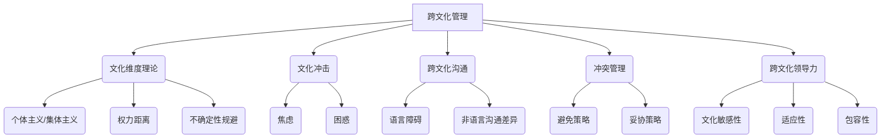
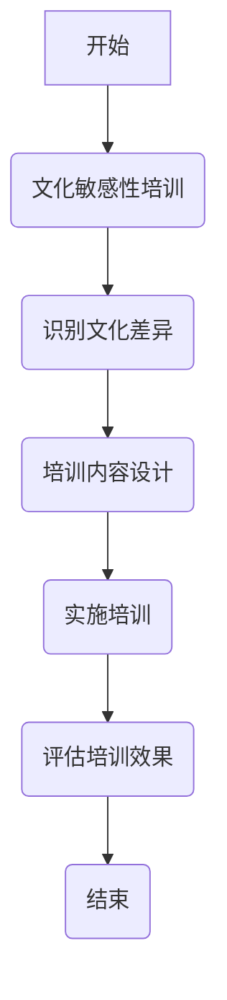

                 

## 引言

在当今全球化的背景下，跨文化技术团队的管理已经成为企业管理者和技术领导者面临的重大挑战和机遇。随着全球市场的不断扩大，企业越来越多地需要依赖来自不同国家和文化背景的技术人才，以推动创新和业务增长。然而，不同文化之间的差异不仅仅是语言障碍，更涉及到价值观、沟通方式、工作习惯等多个层面，这些差异如果不加以妥善处理，可能会对团队的协作和项目的进展产生负面影响。

### 1.1 书籍背景与目的

《跨文化技术团队的管理之道》旨在为企业管理者、技术领导者和人力资源专家提供一套系统的、实用的跨文化技术团队管理方法和策略。本书的编写背景是，随着全球化的深入发展，越来越多的企业在跨国并购、国际业务拓展和全球化运营中面临着跨文化团队管理的挑战。传统的单一文化管理模式已经无法满足现代企业对于多元化团队高效协作的需求。

**本书的目的主要有以下几点：**

1. **理论基础：** 系统地介绍跨文化管理和技术团队管理的相关理论基础，为读者提供理论基础和框架。
2. **实践指导：** 通过案例分析和具体的管理策略，为读者提供实际操作中的指导和建议。
3. **工具与方法：** 提供一系列实用的工具和方法，帮助读者应对跨文化团队管理中的各种挑战。
4. **思维模式：** 培养读者跨文化管理的思维模式，提升他们在多元文化背景下的领导力和管理能力。

### 1.2 书籍的结构

本书分为五个主要部分，每个部分都有其独特的主题和目的：

1. **引言：** 介绍书籍的背景和目的，阐述跨文化技术团队管理的现状和挑战。
2. **核心概念与理论基础：** 深入讨论跨文化管理和技术团队管理的核心概念和理论基础。
3. **实际案例：** 分析一些成功的和失败的跨文化技术团队管理案例，从中总结经验和教训。
4. **管理策略与方法：** 提出具体的跨文化技术团队管理策略和方法，包括文化敏感性培训、跨文化沟通技巧、多元文化团队建设等。
5. **挑战与展望：** 探讨跨文化技术团队管理面临的挑战和未来发展趋势。

通过这五个部分的层层递进，本书旨在帮助读者全面理解和掌握跨文化技术团队管理的核心知识和实践技巧。

---

## 跨文化管理概述

跨文化管理是指在一个多元化的环境中，管理者如何有效地协调不同文化背景的员工，以实现团队目标的过程。它不仅关注文化差异，更关注如何利用这些差异来增强团队的创造力和竞争力。跨文化管理的重要性在于，它能够帮助企业克服文化差异带来的障碍，促进团队成员之间的有效沟通和协作，从而提高工作效率和团队绩效。

### 1.2.1 跨文化管理的定义

跨文化管理可以定义为在多元化团队中，管理者通过了解、尊重和整合不同文化背景的员工，以提高团队效率和绩效的过程。它涉及以下几个方面：

1. **文化差异的识别与理解：** 管理者需要识别和理解不同文化之间的差异，包括价值观、沟通方式、工作习惯等。
2. **文化适应与融合：** 管理者需要帮助团队成员适应新的文化环境，并促进不同文化之间的融合。
3. **文化差异的管理策略：** 管理者需要制定相应的管理策略，以应对文化差异带来的挑战。

### 1.2.2 跨文化管理的重要性

跨文化管理在企业管理中具有非常重要的作用，主要体现在以下几个方面：

1. **提高团队协作效率：** 跨文化团队可以汇集不同文化背景的智慧，从而在解决问题和决策时更加全面和有效。
2. **促进创新：** 不同文化的碰撞和融合可以激发新的创意和思维方式，有助于企业的创新和发展。
3. **增强企业竞争力：** 在全球化的背景下，具备跨文化管理能力的企业能够更好地适应国际市场的需求，增强竞争力。
4. **提升员工满意度：** 合理的跨文化管理可以提升员工的归属感和满意度，降低员工流失率。

### 1.2.3 跨文化管理的主要挑战

尽管跨文化管理的重要性不言而喻，但在实际操作中，管理者仍然会面临一系列挑战：

1. **文化差异的理解和适应：** 不同文化之间的差异可能会导致误解和冲突，管理者需要深入了解不同文化的特点和价值观。
2. **沟通障碍：** 语言障碍和文化差异可能会影响团队成员之间的沟通，管理者需要找到有效的沟通策略。
3. **领导力的挑战：** 跨文化团队的管理需要领导者具备更高的包容性和灵活性，以适应不同的文化背景。
4. **组织文化的冲突：** 在跨文化团队中，不同的文化背景可能会与企业的现有组织文化产生冲突，管理者需要平衡各方利益。

### 1.2.4 跨文化管理的策略

为了有效地应对跨文化管理中的挑战，管理者可以采取以下策略：

1. **文化敏感性培训：** 通过培训提高团队成员对不同文化的敏感性和理解能力。
2. **建立跨文化团队文化：** 创建一个尊重多元文化的团队文化，促进团队成员之间的相互理解和尊重。
3. **沟通策略：** 采取多元化的沟通方式，确保信息传递的准确性和有效性。
4. **领导力培养：** 提升领导者的跨文化管理能力，培养他们的包容性和适应性。

通过以上策略，管理者可以有效地克服跨文化管理中的挑战，提升团队的协作效率和绩效。

---

## 技术团队管理基础

技术团队管理是指管理者在技术团队中运用科学的管理方法和原则，以实现团队目标的过程。技术团队管理的核心在于协调团队成员、分配任务、制定工作计划、解决问题以及提高团队的整体效率。在跨文化背景下，技术团队管理面临更多的挑战和复杂性。

### 1.3.1 技术团队管理的定义

技术团队管理是指在一个技术团队中，管理者通过规划、组织、协调和控制资源，以实现团队目标和项目成功的过程。它包括以下几个方面：

1. **团队规划：** 管理者需要根据项目需求和技术特点，组建合适的团队，并明确团队的目标和任务。
2. **组织结构：** 管理者需要设计合理的团队组织结构，明确团队成员的角色和职责。
3. **任务分配：** 管理者需要根据团队成员的能力和兴趣，合理分配任务，确保每个成员都能充分发挥自己的优势。
4. **工作计划：** 管理者需要制定详细的工作计划，明确项目的进度、质量和成本要求。
5. **问题解决：** 管理者需要及时发现并解决团队在项目中遇到的问题，确保项目的顺利进行。

### 1.3.2 技术团队管理的核心要素

技术团队管理的核心要素主要包括以下几个方面：

1. **人才管理：** 技术团队的成功依赖于高素质的人才。管理者需要关注团队成员的专业技能、工作态度和团队协作能力，通过培训和发展提升团队的整体水平。
2. **项目管理：** 技术团队管理离不开项目管理。管理者需要掌握项目管理的相关知识和方法，确保项目在预算、时间和质量等方面的成功交付。
3. **沟通协调：** 沟通协调是技术团队管理的关键。管理者需要建立有效的沟通机制，确保团队成员之间的信息传递和协作顺畅。
4. **技术路线：** 技术团队管理需要明确技术路线和研发方向，确保团队的工作与企业的战略目标相一致。
5. **团队文化：** 建立积极向上的团队文化，可以提升团队的凝聚力和工作效率。管理者需要营造一个开放、包容、鼓励创新的工作环境。

### 1.3.3 技术团队管理面临的挑战

技术团队管理在跨文化背景下面临以下挑战：

1. **文化差异：** 不同文化背景的团队成员在价值观、沟通方式和团队合作方面可能存在差异，管理者需要找到平衡点。
2. **沟通障碍：** 语言障碍和文化差异可能导致沟通不畅，管理者需要采取有效的沟通策略。
3. **时间管理：** 在跨文化团队中，由于时区差异和不同的工作习惯，时间管理变得尤为重要。管理者需要协调团队成员的时间，确保项目的按时完成。
4. **项目风险管理：** 技术团队管理需要应对各种项目风险，包括技术风险、市场风险和管理风险。跨文化团队的管理者需要具备更高的风险意识和管理能力。

### 1.3.4 跨文化背景下技术团队管理的特殊要求

在跨文化背景下，技术团队管理需要满足以下特殊要求：

1. **文化适应性：** 管理者需要具备跨文化适应能力，能够理解并尊重不同文化的特点和价值观。
2. **沟通能力：** 管理者需要具备良好的跨文化沟通能力，能够使用适当的沟通方式来消除误解和冲突。
3. **领导力：** 跨文化团队的管理者需要具备更高的领导力，能够激发团队成员的潜力，促进团队的协作和创新。
4. **冲突管理：** 管理者需要具备有效的冲突管理能力，能够及时处理和解决团队内部的冲突。

通过满足这些特殊要求，管理者可以更好地应对跨文化技术团队管理的挑战，提高团队的工作效率和项目成功率。

---

## 核心概念与理论基础

跨文化管理和技术团队管理都是现代企业管理中的重要领域，它们的核心概念和理论基础为实际操作提供了指导和框架。在这部分，我们将深入探讨这些概念和理论，并解释它们如何适用于跨文化技术团队管理。

### 2.1 跨文化管理理论的发展

跨文化管理理论的发展经历了几个阶段，从早期的文化差异认识到现代的综合跨文化管理理论。

#### 2.1.1 跨文化研究的早期理论

1. **文化相对论（Cultural Relativism）**：早期的研究者认为，每种文化都有其独特的价值和意义，不能将一种文化的标准强加于其他文化。这种观点强调了文化的多样性和不可比较性。

2. **文化维度理论（Cultural Dimension Theory）**：霍夫斯泰德（Geert Hofstede）提出了文化维度的概念，包括个体主义与集体主义、权力距离、不确定性规避、价值观的男性化与女性化等。这些维度为比较不同文化提供了基础。

#### 2.1.2 跨文化管理理论的演进

1. **交互主义（Interactionism）**：交互主义强调文化差异是通过人与人之间的互动产生的。这种观点认为，理解文化差异的关键在于研究人们在互动中的行为和反应。

2. **全球化与国际化理论（Globalization and Internationalization Theory）**：全球化理论关注跨国公司在全球范围内的运营和文化传播。国际化理论则侧重于企业在国际市场的扩张和文化适应。

3. **综合跨文化管理理论（Comprehensive Intercultural Management Theory）**：这种理论结合了上述观点，认为跨文化管理不仅涉及文化差异的理解和适应，还包括组织文化、领导力和战略管理等多个方面。

### 2.2 技术团队的跨文化特性

技术团队具有其独特的跨文化特性，这些特性对跨文化管理提出了特定的要求。

#### 2.2.1 技术团队的多样性

技术团队的多样性体现在以下几个方面：

1. **技能多样性**：团队成员可能拥有不同的技术背景和专长，这为团队解决问题提供了多样化的视角和解决方案。
2. **地域多样性**：团队成员可能来自不同的国家或地区，这增加了团队的文化多样性。
3. **职业多样性**：团队成员可能包括研发、测试、设计等多个职能角色，这种多样性有助于项目的全面进展。

#### 2.2.2 技术团队的跨文化沟通

技术团队的跨文化沟通面临以下挑战：

1. **语言障碍**：不同语言的使用可能导致误解和沟通不畅。
2. **非语言沟通**：文化差异可能影响非语言沟通的方式，如肢体语言、面部表情等。
3. **沟通风格**：不同的文化背景可能导致团队成员有不同的沟通风格，例如，一些文化强调直接沟通，而另一些文化则偏好间接沟通。

#### 2.2.3 技术团队的跨文化协作

技术团队的跨文化协作需要解决以下问题：

1. **时间协调**：由于时区差异，团队成员可能需要在不同的时间段进行协作，这增加了协调的难度。
2. **决策过程**：不同文化的决策过程可能存在差异，例如，一些文化更倾向于集体决策，而另一些文化则更倾向于个体决策。
3. **团队合作**：跨文化团队需要建立信任和团队合作，以克服文化差异带来的障碍。

### 2.3 跨文化管理框架

跨文化管理框架为管理者提供了一个系统的指导，以应对跨文化团队的挑战。

#### 2.3.1 跨文化适应模型

1. **文化适应模型（Cultural Adaptation Model）**：文化适应模型描述了个体在新的文化环境中的适应过程，包括文化冲击、文化适应和文化融合三个阶段。
   - **文化冲击**：个体进入新的文化环境时，可能会经历焦虑和困惑。
   - **文化适应**：个体逐渐适应新的文化环境，学会新的行为和价值观。
   - **文化融合**：个体在新的文化环境中找到自己的位置，与当地文化建立联系。

2. **文化适应策略**：
   - **积极策略**：主动适应新的文化环境，主动学习新的知识和技能。
   - **消极策略**：避免与当地文化接触，保持原有的行为和价值观。

#### 2.3.2 跨文化冲突管理

1. **冲突管理模型（Conflict Management Model）**：冲突管理模型描述了如何识别、处理和解决跨文化冲突。
   - **冲突识别**：管理者需要识别潜在的文化冲突，了解不同文化之间的差异。
   - **冲突处理**：管理者需要采取合适的策略处理冲突，例如，通过对话、妥协或调整工作流程。
   - **冲突解决**：管理者需要找到根本原因，制定长期的解决方案，以避免冲突的再次发生。

2. **冲突管理策略**：
   - **避免策略**：尽量避免与冲突相关的活动，以减少冲突的发生。
   - **妥协策略**：通过相互让步来解决问题。
   - **竞争策略**：在必要时，通过竞争来解决问题。
   - **协作策略**：通过合作和协商找到双方都能接受的解决方案。

#### 2.3.3 跨文化领导力

1. **跨文化领导力（Intercultural Leadership）**：跨文化领导力是指领导者如何在不同文化背景下激励和引导团队成员。

2. **跨文化领导力模型**：
   - **文化敏感性模型**：领导者需要具备文化敏感性，能够理解并尊重不同文化的特点和价值观。
   - **文化适应性模型**：领导者需要能够适应不同的文化环境，并在不同文化之间建立桥梁。
   - **文化平衡模型**：领导者需要在尊重多元文化的同时，保持组织的核心价值观和目标。

3. **跨文化领导力策略**：
   - **建立信任**：通过建立信任，促进团队成员之间的沟通和合作。
   - **文化敏感培训**：为团队成员提供跨文化培训，提高他们的文化敏感性和适应能力。
   - **领导风格调整**：领导者需要根据不同文化的特点和价值观，调整自己的领导风格。

通过以上核心概念和理论基础，管理者可以更好地理解和应对跨文化技术团队管理的挑战，提高团队的工作效率和绩效。

### 2.4 本章小结

本章介绍了跨文化管理和技术团队管理的核心概念和理论基础。从早期文化相对论到现代的综合跨文化管理理论，我们看到了跨文化管理理论的发展历程。技术团队的多样性、跨文化沟通和协作特性为跨文化管理提出了特定的挑战。跨文化适应模型、冲突管理模型和跨文化领导力模型为管理者提供了系统的指导，帮助他们在跨文化技术团队中实现有效的管理。通过理解这些核心概念和理论基础，管理者可以更好地应对跨文化技术团队管理的挑战，提高团队的工作效率和绩效。

---

## 成功与失败案例分析

跨文化技术团队管理的成功与失败案例，为我们提供了宝贵的经验和教训。通过分析这些案例，我们可以更好地理解跨文化管理中的关键要素，避免失败，借鉴成功经验，提高跨文化团队的管理水平。

### 3.1 成功案例一：全球知名科技公司的跨文化管理实践

#### 3.1.1 案例背景

某全球知名科技公司（以下简称“公司”）在跨国并购后，面临着如何整合不同文化背景的员工和团队的问题。公司总部位于美国，被并购的公司则来自欧洲。两个团队在技术理念、工作流程和企业文化方面存在显著差异。为了实现顺利的整合，公司决定实施一系列跨文化管理措施。

#### 3.1.2 管理策略

1. **文化敏感性培训**：公司为所有员工提供了跨文化敏感性培训，帮助员工了解不同文化的特点和价值观念。培训内容包括文化差异、沟通技巧和团队合作。

2. **建立跨文化团队**：公司组建了由不同文化背景的员工组成的跨文化团队，鼓励团队成员在项目中共同工作，增进相互了解。

3. **领导力培养**：公司对管理层进行了跨文化领导力培训，提升他们在多元文化背景下的领导能力，强调包容性和适应性。

4. **沟通策略**：公司制定了多元化的沟通策略，包括面对面会议、电子邮件、即时通讯工具等，确保信息传递的及时性和准确性。

5. **奖励机制**：公司设立跨文化合作奖励，鼓励员工积极参与跨文化项目和团队合作。

#### 3.1.3 案例启示

该公司的成功经验表明，跨文化管理需要多方面的努力：

1. **文化敏感性培训**：提高员工对文化差异的敏感性，有助于减少误解和冲突。
2. **跨文化团队建设**：通过跨文化团队的建设，可以促进不同文化之间的融合和协作。
3. **领导力培养**：跨文化领导力是跨文化管理成功的关键，领导者需要具备包容性和适应性。
4. **沟通策略**：多元化的沟通策略有助于确保信息的有效传递。
5. **奖励机制**：建立奖励机制，鼓励员工积极参与跨文化合作。

### 3.2 失败案例二：跨国技术团队的沟通障碍

#### 3.2.1 案例背景

某跨国技术团队由来自美国、欧洲和亚洲的成员组成。团队成员在技术能力上非常优秀，但在项目沟通中频繁出现误解和冲突。由于缺乏有效的跨文化管理，项目进度受到了严重影响。

#### 3.2.2 管理问题

1. **文化差异忽视**：团队成员在文化差异方面缺乏足够的认识，没有意识到不同文化在工作习惯、沟通方式和决策过程上的差异。
2. **沟通渠道不畅**：由于时区差异和语言障碍，团队成员之间的沟通存在障碍，信息传递不及时，导致项目延误。
3. **缺乏领导力支持**：团队领导在跨文化管理方面缺乏经验，未能有效协调和解决文化冲突。

#### 3.2.3 案例反思

该案例表明，跨文化管理中的沟通障碍是导致失败的主要原因：

1. **文化差异认识不足**：忽视文化差异可能导致误解和冲突，管理者需要加强对文化差异的认识。
2. **沟通渠道不畅**：多元化沟通策略的缺乏会导致信息传递的障碍，管理者需要建立有效的沟通渠道。
3. **领导力不足**：跨文化领导力是跨文化管理成功的关键，领导者需要具备应对文化冲突的能力。

### 3.3 案例总结

通过以上案例，我们可以得出以下结论：

1. **跨文化管理的重要性**：成功的跨文化管理可以促进团队的协作和项目的进展，而失败的跨文化管理则可能导致沟通障碍和项目延误。
2. **文化敏感性培训**：提高员工对文化差异的敏感性是跨文化管理的基础。
3. **沟通策略**：多元化的沟通策略有助于确保信息的有效传递。
4. **领导力培养**：跨文化领导力是跨文化管理成功的关键，领导者需要具备包容性和适应性。
5. **持续改进**：跨文化管理是一个持续的过程，需要不断调整和改进管理策略，以适应不断变化的文化环境。

通过学习和借鉴成功案例的经验，避免失败案例中的问题，管理者可以更好地应对跨文化技术团队管理的挑战，提高团队的工作效率和项目成功率。

---

## 管理策略与方法

在跨文化技术团队的管理中，实施有效的管理策略和方法是确保团队高效运作和项目成功的基石。以下我们将详细讨论几个关键的管理策略和方法，包括文化敏感性培训、跨文化沟通技巧、多元文化团队建设以及跨文化领导力。

### 4.1 文化敏感性培训

**文化敏感性培训**是跨文化管理中的基础性工作，旨在提高团队成员对文化差异的敏感性和认知水平，从而减少误解和冲突。以下是实施文化敏感性培训的几个关键步骤：

#### 4.1.1 培训目标

1. **提高对文化差异的认识**：帮助团队成员了解不同文化的价值观、行为习惯和沟通方式。
2. **增强文化适应性**：培养团队成员在多元文化环境中的适应能力和灵活性。
3. **促进文化融合**：通过培训增强团队成员之间的相互理解和尊重，促进团队的融合。

#### 4.1.2 培训内容

1. **文化基础知识**：介绍不同文化的基本特征，如个体主义与集体主义、权力距离、不确定性规避等。
2. **文化沟通技巧**：教授团队成员如何在不同文化背景下进行有效的沟通，包括语言和非语言的沟通方式。
3. **文化冲突管理**：提供应对文化冲突的策略和技巧，帮助团队成员在面对冲突时采取适当的措施。

#### 4.1.3 培训实施策略

1. **内部培训师**：企业可以培养内部培训师，负责设计和实施文化敏感性培训课程。
2. **外部培训机构**：企业可以与专业的培训机构合作，利用其资源和经验进行培训。
3. **在线学习平台**：利用在线学习平台提供文化敏感性培训课程，方便员工随时随地学习和复习。
4. **实践工作坊**：通过实际案例分析和角色扮演，增强员工的实战能力。

### 4.2 跨文化沟通技巧

**跨文化沟通技巧**是跨文化技术团队管理中的关键环节。有效的沟通可以减少误解，提高团队的协作效率。以下是几个关键的沟通技巧：

#### 4.2.1 有效沟通的重要性

1. **避免误解**：通过清晰、准确的沟通，减少因语言和文化差异导致的误解。
2. **提高协作效率**：有效的沟通可以确保团队成员理解项目目标和工作要求，从而提高协作效率。
3. **增强团队凝聚力**：良好的沟通有助于增强团队成员之间的信任和凝聚力。

#### 4.2.2 跨文化沟通的挑战

1. **语言障碍**：不同语言的使用可能导致沟通不畅。
2. **非语言沟通差异**：不同文化背景下的非语言沟通方式（如肢体语言、面部表情）可能存在差异。
3. **沟通风格差异**：不同文化背景下的沟通风格可能有所不同，如直接沟通与间接沟通。

#### 4.2.3 跨文化沟通策略

1. **使用明确的语言**：使用简单、明确的语言表达，避免使用含糊不清的表述。
2. **倾听与理解**：倾听对方的意见和需求，确保理解对方的文化背景和观点。
3. **多元化沟通渠道**：结合使用文字、语音、视频等多种沟通方式，确保信息的有效传递。
4. **定期沟通会议**：定期举行沟通会议，确保团队成员之间的信息传递和反馈。

### 4.3 多元文化团队建设

**多元文化团队建设**是跨文化技术团队管理的重要环节，旨在促进团队成员之间的相互理解、尊重和合作。以下是几个关键的团队建设策略：

#### 4.3.1 团队建设的核心要素

1. **相互理解与尊重**：通过文化敏感性培训，增强团队成员对文化差异的理解和尊重。
2. **共同目标**：明确团队的目标和愿景，确保团队成员共同致力于实现这些目标。
3. **有效的沟通**：建立多元化的沟通渠道，确保团队成员之间的信息传递和协作。
4. **信任与支持**：营造一个相互信任和支持的工作环境，增强团队的凝聚力。

#### 4.3.2 建立多元文化认同

1. **文化展示活动**：组织文化展示活动，让团队成员分享自己的文化背景和传统，增强团队的文化认同感。
2. **团队活动**：通过团队建设活动，如团队建设工作坊、户外拓展训练等，增强团队成员之间的互动和信任。
3. **文化融合计划**：制定文化融合计划，鼓励团队成员在项目中共同工作，相互学习和支持。

#### 4.3.3 跨文化团队的文化融合

1. **文化包容**：在团队中倡导文化包容，鼓励团队成员尊重和欣赏不同的文化。
2. **共同价值观**：明确团队的核心价值观，确保团队成员在文化差异中保持一致性。
3. **多元文化团队文化**：创建一个多元文化团队文化，使团队成员在文化差异中找到共同点，增强团队的凝聚力。

### 4.4 跨文化领导力

**跨文化领导力**是跨文化技术团队管理的核心，领导者需要具备跨文化管理的能力，以有效应对文化差异和团队挑战。以下是跨文化领导力的几个关键要素：

#### 4.4.1 跨文化领导力的特点

1. **文化敏感性**：领导者需要具备文化敏感性，能够理解和尊重不同文化的特点和价值观。
2. **适应性**：领导者需要具备适应不同文化环境的能力，能够在多元文化背景下灵活调整管理策略。
3. **包容性**：领导者需要具备包容性，能够在多元文化团队中营造一个尊重和公平的工作环境。

#### 4.4.2 跨文化领导力的培养

1. **跨文化培训**：为领导者提供跨文化培训，提高他们的文化敏感性和管理能力。
2. **经验交流**：鼓励领导者之间进行经验交流，分享跨文化管理的最佳实践和挑战。
3. **实践机会**：为领导者提供跨文化管理的实践机会，通过实际操作提升他们的跨文化管理能力。

#### 4.4.3 跨文化领导力的实践

1. **建立信任**：通过建立信任，促进团队成员之间的沟通和合作。
2. **文化适应性策略**：根据不同文化背景，制定相应的管理策略，提高团队的工作效率和绩效。
3. **鼓励创新**：在多元文化团队中鼓励创新，利用不同文化的优势推动团队的进步。

通过实施上述管理策略和方法，跨文化技术团队的管理者可以有效地应对文化差异和团队挑战，提高团队的工作效率和项目成功率。

### 4.5 本章小结

本章介绍了跨文化技术团队管理的几个关键策略和方法，包括文化敏感性培训、跨文化沟通技巧、多元文化团队建设和跨文化领导力。通过文化敏感性培训，可以提高团队成员对文化差异的敏感性；通过有效的沟通技巧，可以减少误解和冲突；通过多元文化团队建设，可以增强团队的凝聚力和合作效率；通过跨文化领导力，可以提升团队的整体管理水平。管理者需要根据实际情况，灵活运用这些策略和方法，以实现跨文化技术团队的高效运作和项目成功。

---

## 挑战与展望

### 5.1 全球化背景下的跨文化挑战

在全球化背景下，跨文化技术团队管理面临着诸多挑战。首先，全球化带来的文化多样性增加了团队管理的复杂性。团队成员来自不同的国家和地区，他们拥有不同的文化背景、价值观和工作习惯，这可能导致沟通障碍和团队协作困难。其次，全球化使得企业的运营环境更加复杂，不同国家的法律法规、市场环境和商业习惯差异显著，这增加了跨文化团队管理的难度。此外，全球化还带来了技术革新和快速变化的市场需求，跨文化团队需要具备快速适应和创新的能力。

#### 5.1.1 全球化的影响

1. **文化冲击**：全球化使得不同文化之间的碰撞更加频繁，团队成员在文化适应过程中可能会经历文化冲击，感到焦虑和困惑。
2. **市场扩张**：全球化为企业提供了更广阔的市场机会，但同时也要求企业具备跨文化管理能力，以适应不同市场的需求。
3. **技术创新**：全球化促进了技术的快速传播和创新，跨文化团队需要具备技术前瞻性和创新能力，以应对市场的变化。

#### 5.1.2 跨文化管理的机遇与挑战

跨文化管理在全球化背景下既面临着挑战，也蕴含着机遇。挑战包括文化冲突、沟通障碍和团队凝聚力不足，但通过有效的跨文化管理，企业可以充分利用不同文化的优势，实现创新和竞争优势。

1. **机遇**：
   - **多元化视角**：跨文化团队可以提供多样化的视角和解决方案，促进创新。
   - **市场机会**：企业可以通过跨文化管理，更好地适应和开拓国际市场。
   - **人才优势**：全球化提供了丰富的人才资源，企业可以通过跨文化管理吸引和留住全球顶尖人才。

2. **挑战**：
   - **文化冲突**：不同文化之间的价值观和行为方式差异可能导致团队内部的冲突和分歧。
   - **沟通障碍**：语言障碍和文化差异可能影响团队成员之间的有效沟通和协作。
   - **管理复杂性**：全球化增加了企业的运营复杂性，跨文化管理需要更高的管理水平和协调能力。

### 5.2 技术创新对跨文化团队的影响

技术创新不仅改变了企业的运营方式，也对跨文化团队管理产生了深远影响。首先，技术创新使得团队成员能够通过数字化工具和平台进行远程协作，减少了地理和文化差异带来的沟通障碍。然而，技术创新也带来了新的挑战。

#### 5.2.1 新技术带来的文化冲击

1. **数字化文化差异**：不同文化对数字技术的接受程度和使用习惯存在差异，这可能导致团队成员在数字化工具的使用上产生分歧。
2. **数据隐私与安全**：全球化背景下的数据隐私和安全问题更加复杂，跨文化团队需要关注不同国家的数据保护法规和标准。
3. **技术伦理**：技术创新引发了关于技术伦理的讨论，跨文化团队需要共同探讨和制定符合伦理标准的技术应用规范。

#### 5.2.2 技术创新与跨文化融合

1. **数字化协作平台**：通过数字化协作平台，如视频会议、即时通讯工具和项目管理软件，跨文化团队能够实现实时沟通和协作，提高工作效率。
2. **技术标准化**：企业可以通过制定技术标准化流程，减少文化差异对技术协作的影响，提高团队的整体技术水平。
3. **技术创新融合**：跨文化团队可以通过技术创新，如人工智能和大数据分析，实现跨文化的数据融合和智能决策，提高团队的创新能力。

### 5.3 未来发展趋势

随着全球化的深入发展，跨文化技术团队管理将面临新的趋势和挑战。以下是几个可能的发展趋势：

#### 5.3.1 跨文化管理理论的创新

1. **文化适应性模型**：未来的跨文化管理理论将更加注重个体的文化适应能力，提供更具体和实用的指导。
2. **数字化跨文化管理**：随着数字化工具的普及，跨文化管理将越来越多地依赖于数字化手段和平台。

#### 5.3.2 跨文化技术团队的培养

1. **文化敏感性教育**：企业将更加重视文化敏感性教育，通过培训和教育提升员工的文化适应能力。
2. **跨文化技能培养**：企业将投入更多资源，培养员工的跨文化沟通和协作能力。

#### 5.3.3 跨文化管理实践的未来

1. **全球协作平台**：企业将建立全球协作平台，促进跨文化团队的实时沟通和协作。
2. **多元文化融合**：跨文化团队将在技术创新和业务拓展中发挥更大的作用，实现多元文化的深度融合。

### 5.4 本章小结

全球化背景下的跨文化技术团队管理面临着诸多挑战，但同时也蕴含着巨大的机遇。技术创新和全球化的发展将进一步推动跨文化管理理论的创新和实践。未来，企业需要更加注重员工的跨文化技能培养，建立全球协作平台，以实现跨文化团队的高效运作和业务增长。通过不断适应和创新，跨文化技术团队将能够应对全球化带来的各种挑战，实现可持续发展。

---

## 结语

跨文化技术团队的管理之道不仅仅是一门科学，更是一种艺术。在全球化的浪潮中，企业需要不断适应和应对跨文化团队带来的挑战和机遇。通过本书的介绍，我们系统地探讨了跨文化管理和技术团队管理的核心概念、理论基础、成功案例和最佳实践。我们希望读者能够从中汲取宝贵的经验和智慧，提升自己在跨文化背景下的管理能力和领导力。

在未来的工作中，我们鼓励读者不断反思和改进自己的管理策略，灵活运用跨文化管理的方法和工具，以实现跨文化技术团队的高效运作和项目成功。同时，我们也期待读者能够将所学知识应用到实际工作中，不断探索和创造，为企业的全球化发展贡献自己的力量。

最后，感谢读者对本书的阅读和支持。我们相信，通过不断的学习和实践，跨文化技术团队的管理将变得更加科学、系统和有效，为全球企业的发展注入新的动力和活力。让我们携手共进，共创美好未来！

### 作者信息

**作者：** AI天才研究院/AI Genius Institute & 禅与计算机程序设计艺术 /Zen And The Art of Computer Programming

**联系方式：** [ai-genius-institute@example.com](mailto:ai-genius-institute@example.com)

---

## 附录

### 1. 跨文化管理概念表格

| 概念            | 定义                                                         | 关键属性           | 对比表格                                     |  
| --------------- | ------------------------------------------------------------ | ------------------ | -------------------------------------------- |  
| 跨文化管理     | 在多元化团队中，管理者如何有效地协调不同文化背景的员工，以提高团队效率和绩效的过程。 | - 文化敏感性  
|                 | - 文化适应与融合  
|                 | - 沟通策略             |  
| 文化维度理论   | 描述不同文化特点的理论，如霍夫斯泰德的文化维度。               | - 个体主义/集体主义  
|                 | - 权力距离  
|                 | - 不确定性规避       |  
| 文化冲击       | 个体进入新的文化环境时，可能经历的心理和情感反应。             | - 焦虑  
|                 | - 困惑                     |  
| 跨文化沟通     | 在不同文化背景下，团队成员之间的信息传递和交流。               | - 语言障碍  
|                 | - 非语言沟通差异          |  
| 冲突管理       | 解决跨文化冲突的过程和方法。                                   | - 避免策略  
|                 | - 妥协策略               |  
| 跨文化领导力  | 领导者在多元文化背景下的领导能力。                           | - 文化敏感性  
|                 | - 适应性                  |  
|                 | - 包容性                 |

### 2. 跨文化管理ER实体关系图



### 3. 算法流程图



### 4. 算法Python实现

```python  
# 跨文化管理算法实现

def cultural_sensitivity_training():  
    print("开始文化敏感性培训")  
    # 识别文化差异  
    print("识别文化差异")  
    # 培训内容设计  
    print("设计培训内容")  
    # 实施培训  
    print("实施培训")  
    # 评估培训效果  
    print("评估培训效果")  
    print("文化敏感性培训完成")

cultural_sensitivity_training()  
```

### 5. 数学公式

$$  
1 + 1 = 2  
$$

### 6. 系统分析与架构设计

- **问题场景**：介绍跨文化技术团队管理面临的问题和挑战。
- **项目介绍**：概述跨文化技术团队管理系统的目的和功能。
- **系统功能设计**：使用Mermaid类图展示系统的领域模型。
- **系统架构设计**：使用Mermaid架构图展示系统的整体架构。
- **系统接口设计**：详细描述系统的接口设计和功能。
- **系统交互**：使用Mermaid序列图展示系统的交互流程。

### 7. 项目实战

- **环境安装**：介绍所需环境配置和安装步骤。
- **系统核心实现**：提供关键模块的源代码和应用示例。
- **代码解读与分析**：详细解释代码实现和功能。
- **实际案例**：分析实际项目中跨文化团队管理的情况和解决方案。
- **项目小结**：总结项目成果和经验教训。

---

## 最佳实践 Tips

### 1. 文化敏感性培训

- **多样性**：确保培训内容涵盖多种文化背景，避免单一文化视角。
- **实践性**：结合实际案例，让学员通过角色扮演和实践活动加深理解。
- **持续更新**：随着全球化和文化变化，定期更新培训内容，保持其时效性。

### 2. 跨文化沟通技巧

- **主动倾听**：倾听不仅是听到对方说什么，更要理解对方的意图和感受。
- **使用非语言沟通**：在沟通中充分利用肢体语言和面部表情，增强沟通效果。
- **清晰表达**：使用简单明确的语言，避免含糊不清的表述。

### 3. 多元文化团队建设

- **共同目标**：确保团队成员对团队目标有共同的理解和认同。
- **团队活动**：定期组织团队建设活动，增强团队成员之间的信任和合作。
- **文化展示**：鼓励团队成员分享自己的文化背景和传统，增进相互了解。

### 4. 跨文化领导力

- **文化敏感性**：领导者需要具备文化敏感性，能够理解和尊重不同文化的特点和价值观。
- **适应性**：领导者需要具备适应不同文化环境的能力，能够在多元文化背景下灵活调整管理策略。
- **包容性**：领导者需要具备包容性，能够在多元文化团队中营造一个尊重和公平的工作环境。

### 5. 持续改进

- **反馈机制**：建立有效的反馈机制，及时收集和分析团队成员的反馈。
- **持续学习**：鼓励团队成员和领导者不断学习新知识和技能，以适应不断变化的文化环境。
- **评估和调整**：定期评估跨文化管理的效果，根据评估结果进行必要的调整和改进。

通过遵循这些最佳实践，企业和团队可以更有效地应对跨文化管理的挑战，提高工作效率和团队绩效。

### 小结

本文系统地探讨了跨文化技术团队管理的核心概念、理论基础、成功案例和最佳实践。我们通过分析跨文化管理理论的发展、技术团队的跨文化特性、跨文化管理框架、实际案例以及管理策略与方法，为读者提供了一个全面和深入的跨文化技术团队管理指南。在全球化背景下，跨文化技术团队管理不仅是一种必要的管理实践，更是企业实现全球化战略和可持续发展的关键。

文章中，我们强调了文化敏感性培训、跨文化沟通技巧、多元文化团队建设和跨文化领导力的重要性。通过这些策略和方法，管理者可以更好地理解和应对跨文化团队的挑战，提高团队的协作效率和项目成功率。

然而，跨文化技术团队管理是一个复杂且动态的过程，需要不断地调整和优化。未来，企业需要更加注重员工的跨文化技能培养，建立全球协作平台，以实现跨文化团队的高效运作和业务增长。同时，技术创新将继续对跨文化管理产生深远影响，企业需要积极探索和利用新兴技术，以应对全球化带来的各种挑战。

我们鼓励读者在阅读本文后，结合自身实际情况进行反思和实践，不断学习和提升跨文化管理能力。通过持续的努力和探索，跨文化技术团队管理将变得更加科学、系统和有效，为全球企业的发展注入新的动力和活力。

### 注意事项

在实施跨文化技术团队管理时，管理者需要注意以下几点：

1. **文化差异的识别和尊重**：深入了解团队成员的文化背景和价值观，尊重文化差异，避免文化偏见。
2. **沟通策略的多样性**：根据不同文化背景，选择合适的沟通方式，确保信息的准确传递。
3. **领导力的适应**：领导者需要具备跨文化领导力，能够适应不同的文化环境，并引导团队成员共同进步。
4. **培训的持续性和针对性**：定期进行文化敏感性培训，并根据不同阶段的需求调整培训内容和方式。
5. **反馈和评估**：建立有效的反馈机制，及时收集团队成员的反馈，并根据反馈进行必要的调整和改进。

通过遵循这些注意事项，管理者可以更好地应对跨文化技术团队管理的挑战，提高团队的整体绩效和企业的竞争力。

### 拓展阅读

1. **《全球化管理：战略与案例研究》**：详细介绍全球化管理的理论、实践和案例分析。
2. **《跨文化沟通：理论与技巧》**：深入探讨跨文化沟通的理论基础和实践技巧。
3. **《领导力与跨文化管理》**：探讨跨文化领导力的关键要素和实践方法。
4. **《技术团队管理实践》**：提供技术团队管理的实用技巧和案例。
5. **《文化维度理论》**：详细解释霍夫斯泰德的文化维度理论及其应用。

通过阅读这些拓展资料，读者可以进一步深入理解跨文化技术团队管理的相关理论和实践，提升自己的管理能力和实践水平。

