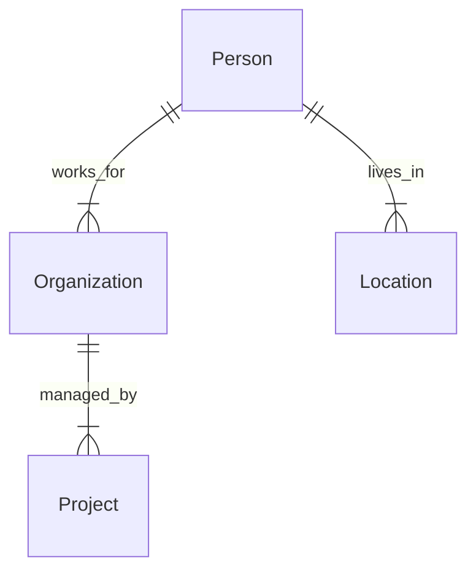
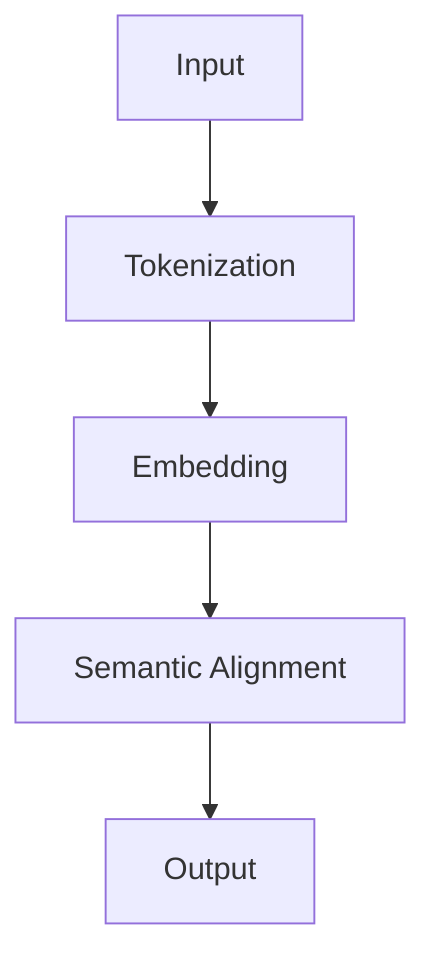
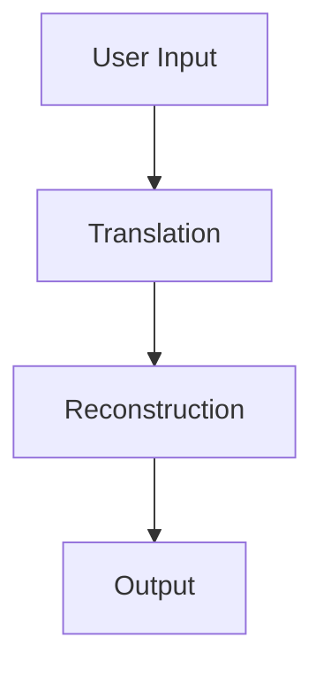
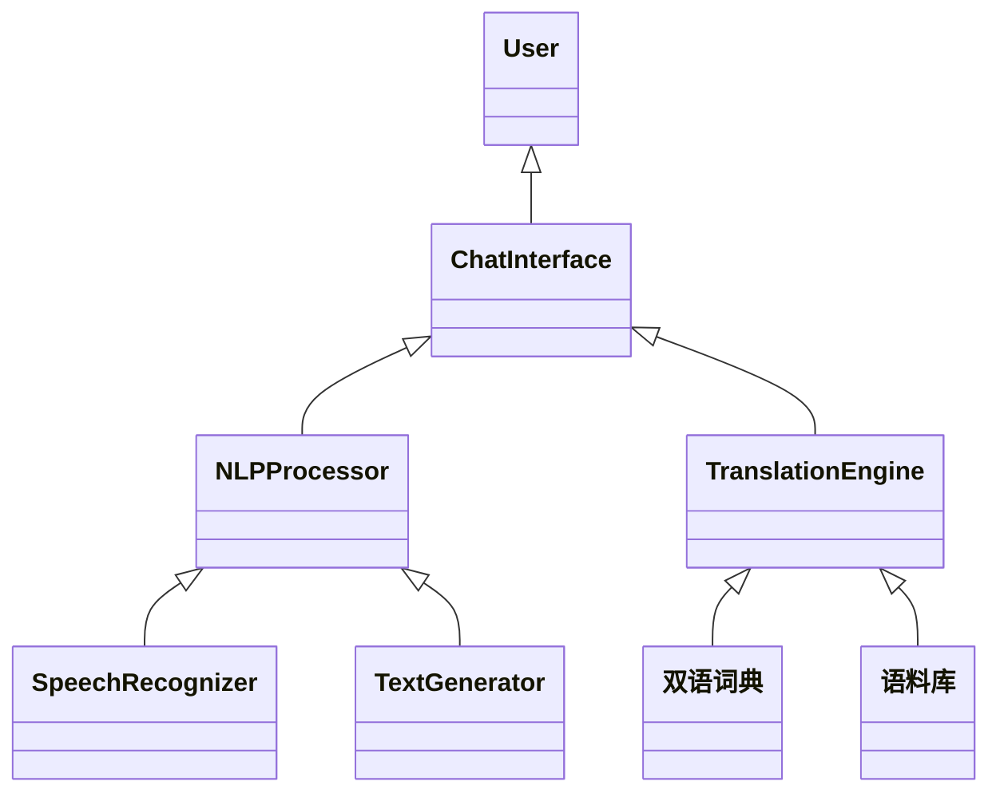
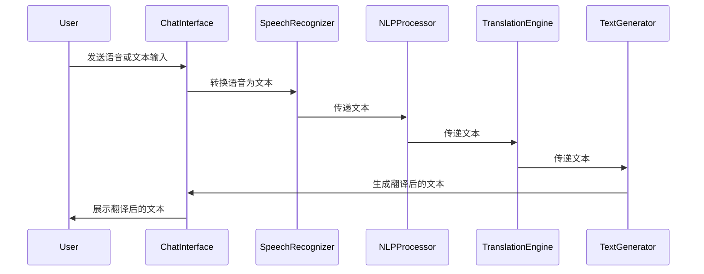

                 

### 1.1 跨语言AI Agent的需求与挑战

在当今世界，全球化趋势不断加强，跨国交流日益频繁，而传统的AI Agent在跨语言交互方面存在诸多局限性，难以满足多样化、个性化的语言需求。这导致了跨语言AI Agent的开发需求应运而生。

首先，**问题描述**在于，不同国家和地区的用户往往使用不同的语言，这就需要AI Agent具备跨语言的能力。传统的AI Agent通常只能处理单一语言，这无疑限制了它们的应用场景和用户体验。例如，在国际会议、跨国商业交流、多语言客服等领域，跨语言AI Agent能够提供更加精准和高效的服务，提升沟通效率。

其次，**问题解决**的方法是通过开发跨语言的AI Agent，实现以下目标：
- **多语言支持**：AI Agent能够理解和生成多种自然语言，包括但不限于英语、中文、西班牙语、法语等。
- **上下文理解**：AI Agent能够理解跨语言上下文，提供精准回应，避免由于语言差异导致的误解和沟通障碍。
- **个性化交互**：AI Agent可以根据用户的历史行为和偏好，提供定制化的服务和建议。

### 1.2 跨语言AI Agent的定义与特点

**定义**：跨语言AI Agent是一种能够理解和生成多种语言的AI系统，它利用自然语言处理（NLP）技术和机器学习算法，实现跨语言的信息传递和交互。

**特点**：

1. **多语言支持**：跨语言AI Agent支持多种自然语言的输入和输出，这意味着它可以与使用不同语言的用户进行有效沟通。例如，一个跨语言的AI客服系统可以同时为讲中文的用户和讲英文的用户提供服务。

2. **上下文理解**：跨语言AI Agent不仅仅能翻译文字，更重要的是能够理解文本的上下文，从而提供更准确的响应。例如，当用户说“我明天要去机场”，AI Agent能够理解“机场”是指某个具体的城市机场，而不是一个交通工具。

3. **动态调整**：跨语言AI Agent能够根据用户的语言习惯和交流方式动态调整自己的表达方式，提供更加自然和流畅的交互体验。例如，它可以识别用户的方言或口头语，并作出相应的回应。

### 1.3 跨语言AI Agent的边界与外延

**边界**：跨语言AI Agent的边界主要包括以下几个方面：
- **语言理解**：AI Agent需要能够理解多种语言的语义和语法规则。
- **多语言生成**：AI Agent需要能够生成多种语言的文本，包括但不限于问答、对话、报告等。
- **跨语言上下文处理**：AI Agent需要能够处理跨语言文本中的上下文信息，提供连贯和准确的回应。

**外延**：跨语言AI Agent的应用场景非常广泛，其外延包括但不限于以下领域：
- **语音识别与生成**：跨语言的语音识别和语音合成技术，使得AI Agent可以与用户进行语音交流。
- **机器翻译**：跨语言的机器翻译技术，使得AI Agent可以自动翻译多种语言。
- **多模态交互**：跨语言的视觉、听觉、触觉等多模态交互，使得AI Agent可以更加自然地与用户进行沟通。

### 1.4 跨语言AI Agent的核心要素组成

**核心要素**：

1. **多语言语料库**：这是跨语言AI Agent的基础，需要收集和整理大量多种语言的文本数据，包括对话文本、问答文本、新闻报道等，用于模型的训练和优化。

2. **多语言模型**：这是跨语言AI Agent的核心，需要开发支持多种语言的文本生成模型，如序列到序列（Seq2Seq）模型、注意力机制（Attention Mechanism）模型等，以实现高效的文本生成和翻译。

3. **跨语言处理算法**：这是跨语言AI Agent的灵魂，需要设计一系列算法来实现跨语言的语义表示、实体识别、上下文理解等功能，如跨语言嵌入算法、跨语言生成算法等。

通过上述要素的协同工作，跨语言AI Agent能够实现高效、精准的跨语言交互，满足全球化时代的多样化需求。

## 第二部分：核心概念与联系

### 第2章：核心概念原理

在开发跨语言AI Agent的过程中，理解其核心概念和原理是至关重要的。这不仅有助于我们更好地设计系统，还能提高AI Agent的性能和用户体验。本章节将详细探讨跨语言AI Agent中的几个核心概念，包括跨语言语义表示、跨语言实体识别等。

### 2.1 跨语言语义表示

**概念**：跨语言语义表示是指将不同语言的语义表示映射到统一的语义空间，从而实现不同语言之间的语义对齐。这种映射使得跨语言AI Agent能够理解和生成多种语言的文本。

**属性特征对比表格**

| 特征           | 对比项           |
|----------------|------------------|
| 语义表示精度   | 高/低            |
| 语言多样性     | 广泛/有限        |
| 上下文依赖性   | 强/弱            |

在上述表格中，**语义表示精度**是衡量跨语言语义表示质量的重要指标。高精度的语义表示能够准确捕捉文本的语义信息，从而提供更准确的跨语言翻译和交互。**语言多样性**则决定了跨语言AI Agent的支持范围，广泛的语言多样性意味着AI Agent能够与更多用户进行有效沟通。**上下文依赖性**反映了语义表示对上下文信息的敏感度，强的上下文依赖性能够更好地理解文本的上下文，提供更加精准的回应。

### 2.2 跨语言实体识别

**概念**：跨语言实体识别是指识别文本中的跨语言实体及其关系。实体可以是人名、地名、组织名、物品名等，它们在不同语言中可能具有不同的表达形式。跨语言实体识别是跨语言AI Agent理解文本语义的重要环节。

**ER实体关系图架构**



在上述ER图（实体关系图）中，我们定义了几个实体及其关系。例如，**Person（人）**与**Organization（组织）**之间存在**works_for（工作于）**关系，表示某个人在某组织工作；**Person**与**Location（地点）**之间存在**lives_in（居住于）**关系，表示某个人居住在某个地点；**Organization**与**Project（项目）**之间存在**managed_by（管理）**关系，表示某个组织管理某个项目。

### 2.3 跨语言语义理解的挑战与解决方案

跨语言语义理解是跨语言AI Agent面临的一个重大挑战，主要表现在以下几个方面：

1. **词汇差异**：不同语言之间的词汇差异很大，同一个概念可能在不同的语言中有不同的表达方式。例如，英语中的“dog”在中文中是“狗”，在法语中则是“chien”。

2. **语法结构差异**：不同语言的语法结构也有所不同，这会影响句子的理解和生成。例如，英语通常是主谓宾结构，而中文的语法结构较为灵活，可以有不同的排列方式。

3. **上下文依赖性**：不同语言对上下文信息的依赖程度不同，这会影响语义的理解和翻译。例如，在英语中，“the”通常需要依赖上下文来理解，而中文则不需要。

**解决方案**：

1. **词汇映射**：通过建立词汇映射表，将不同语言中的词汇对应起来，从而实现基本的语义理解。

2. **语法解析**：利用自然语言处理技术，如语法解析器，对文本进行结构化处理，从而更好地理解句子的语法结构。

3. **上下文建模**：通过深度学习技术，如递归神经网络（RNN）或变换器（Transformer），对上下文信息进行建模，从而提高语义理解的准确性。

通过上述方法，跨语言AI Agent可以更好地理解和生成跨语言文本，提供更高质量的交互体验。

### 第3章：算法原理讲解

在跨语言AI Agent的开发中，算法原理是实现其功能的关键。本章节将详细介绍两个核心算法：跨语言嵌入算法和跨语言生成算法，并通过mermaid流程图和Python源代码进行阐述。

### 3.1 跨语言嵌入算法

**mermaid流程图**



在上面的mermaid流程图中，我们展示了跨语言嵌入算法的基本步骤：
1. **Tokenization（分词）**：将输入文本分解为词汇或子词。
2. **Embedding（嵌入）**：将分词后的文本转换为嵌入向量。
3. **Semantic Alignment（语义对齐）**：将不同语言的嵌入向量对齐到同一语义空间。
4. **Output（输出）**：输出对齐后的语义表示。

**Python源代码**

```python
def cross_language_embedding(input_text):
    # Tokenization
    tokens = tokenize(input_text)
    
    # Embedding
    embeddings = [embed(token) for token in tokens]
    
    # Semantic Alignment
    aligned_embeddings = semantic_align(embeddings)
    
    # Output
    return aligned_embeddings
```

**数学模型与公式**

$$
\text{Semantic Alignment} = f(\text{Embedding}_1, \text{Embedding}_2)
$$

其中，$\text{Embedding}_1$和$\text{Embedding}_2$分别表示两种不同语言的嵌入向量，$f$表示对齐函数，旨在将不同语言的嵌入向量映射到同一语义空间。

### 3.2 跨语言生成算法

**mermaid流程图**



在上面的mermaid流程图中，我们展示了跨语言生成算法的基本步骤：
1. **Translation（翻译）**：将用户输入的文本翻译为目标语言。
2. **Reconstruction（重构）**：对翻译后的文本进行重构，使其符合目标语言的语法和语义。
3. **Output（输出）**：输出重构后的文本。

**Python源代码**

```python
def cross_language_generation(input_text, target_language):
    # Translation
    translated_text = translate(input_text, target_language)
    
    # Reconstruction
    reconstructed_text = reconstruct(translated_text)
    
    # Output
    return reconstructed_text
```

**数学模型与公式**

$$
\text{Translation} = g(\text{Input}, \text{Target Language})
$$

$$
\text{Reconstruction} = h(\text{Translated Text}, \text{Target Language})
$$

其中，$g$表示翻译函数，$h$表示重构函数，它们分别实现文本的翻译和重构。

通过上述算法原理的讲解，我们可以更好地理解跨语言AI Agent的核心技术，为实际开发和应用提供理论基础。

### 第4章：系统分析与架构设计方案

#### 4.1 问题场景介绍

在全球化背景下，跨语言交流已经成为许多企业和组织的重要需求。然而，传统的跨语言工具往往存在交互体验差、效率低下等问题。为了解决这些问题，我们提出开发一款跨语言AI Agent系统，旨在提供高效、自然的跨语言交互体验，提升沟通效率和服务质量。

#### 4.2 项目介绍

本项目旨在构建一个功能全面的跨语言AI Agent系统，该系统将包括以下主要模块：

- **多语言语音识别模块**：实现多种语言的语音识别功能，将语音输入转换为文本。
- **自然语言处理模块**：处理和理解跨语言文本，提供语义分析和上下文理解功能。
- **跨语言翻译模块**：实现多种语言之间的自动翻译，包括文本和语音。
- **多模态交互模块**：支持语音、文本和图像等多种交互方式，提供丰富的用户交互体验。

#### 4.3 系统功能设计

**领域模型Mermaid类图**



在上面的Mermaid类图中，我们定义了系统的核心类及其关系：

- **User（用户）**：与系统的交互入口，提供输入并接收输出。
- **ChatInterface（聊天界面）**：用于与用户进行交互，展示文本和语音输出。
- **NLPProcessor（自然语言处理处理器）**：负责文本的理解和处理，包括语音识别和文本生成。
- **TranslationEngine（翻译引擎）**：负责实现跨语言翻译功能。
- **SpeechRecognizer（语音识别器）**：用于将语音转换为文本。
- **TextGenerator（文本生成器）**：用于生成自然语言的文本输出。

#### 4.4 系统架构设计

**Mermaid架构图**

```mermaid
graph TD
    subgraph 语言输入
        A[语音输入] --> B[SpeechRecognizer]
        C[文本输入] --> B
    subgraph 语言处理
        B --> D[NLPProcessor]
    subgraph 语言输出
        D --> E[TranslationEngine]
        D --> F[TextGenerator]
    subgraph 用户界面
        E --> G[ChatInterface]
        F --> G
```

在上面的架构图中，我们展示了系统的主要组件及其交互流程：

- **语音输入和文本输入**：用户可以通过语音或文本方式与系统交互，输入内容经过SpeechRecognizer处理。
- **NLPProcessor**：对输入文本进行处理，包括语音识别和文本理解。
- **TranslationEngine**：对文本进行跨语言翻译。
- **TextGenerator**：生成自然语言的文本输出。
- **ChatInterface**：与用户进行交互，展示翻译后的文本和语音输出。

#### 4.5 系统接口设计

**接口设计**

- **语音识别API**：提供语音到文本的转换功能，输入为音频流，输出为文本。
- **文本理解API**：提供文本语义分析和上下文理解功能，输入为文本，输出为语义表示。
- **翻译API**：提供跨语言翻译功能，输入为源语言文本，输出为目标语言文本。
- **文本生成API**：提供文本生成功能，输入为语义表示，输出为自然语言文本。

#### 4.6 系统交互Mermaid序列图



在上面的序列图中，我们展示了用户与系统交互的详细流程：

- 用户发送语音或文本输入。
- ChatInterface将语音输入转换为文本，并传递给NLPProcessor。
- NLPProcessor处理文本，将其传递给TranslationEngine。
- TranslationEngine对文本进行跨语言翻译，并传递给TextGenerator。
- TextGenerator生成翻译后的文本，并传递给ChatInterface。
- ChatInterface将翻译后的文本展示给用户。

通过上述系统分析和架构设计，我们可以看到跨语言AI Agent系统的整体框架和各模块之间的交互流程，为系统的实际开发提供了清晰的指导。

### 项目实战

#### 4.7 环境安装

要在本地环境搭建一个跨语言AI Agent系统，我们需要安装以下软件和工具：

1. **Python 3.8+**：Python是主要的编程语言，用于实现系统的各个模块。
2. **Anaconda**：Anaconda是一个环境管理工具，可以帮助我们轻松创建和管理Python环境。
3. **TensorFlow**：TensorFlow是一个开源的机器学习库，用于实现自然语言处理和深度学习模型。
4. **NLTK**：NLTK是一个自然语言处理库，提供了许多实用的NLP功能。
5. **SpeechRecognition**：SpeechRecognition是一个语音识别库，用于实现语音到文本的转换。

安装步骤如下：

1. 安装Anaconda：
   ```bash
   wget https://repo.anaconda.com/archive/Anaconda3-2022.05-Linux-x86_64.sh
   bash Anaconda3-2022.05-Linux-x86_64.sh
   ```

2. 激活Anaconda环境：
   ```bash
   conda create -n cross_language_env python=3.8
   conda activate cross_language_env
   ```

3. 安装TensorFlow：
   ```bash
   conda install tensorflow
   ```

4. 安装NLTK：
   ```bash
   pip install nltk
   ```

5. 安装SpeechRecognition：
   ```bash
   pip install SpeechRecognition
   ```

#### 4.8 系统核心实现源代码

下面是跨语言AI Agent系统的一些核心代码示例：

**语音识别模块**

```python
import speech_recognition as sr

def recognize_speech_from_mic(source='microphone'):
    r = sr.Recognizer()
    with sr.Microphone() as source:
        print("请说些什么：")
        audio = r.listen(source)
    try:
        return r.recognize_google(audio)
    except sr.UnknownValueError:
        return "无法理解您的语音"
    except sr.RequestError:
        return "无法请求结果"
```

**自然语言处理模块**

```python
from nltk.tokenize import word_tokenize
from nltk.corpus import stopwords

def process_text(text):
    # 分词
    tokens = word_tokenize(text)
    # 去除停用词
    stop_words = set(stopwords.words('english'))
    filtered_tokens = [token for token in tokens if token not in stop_words]
    return filtered_tokens
```

**跨语言翻译模块**

```python
from googletrans import Translator

def translate_text(text, dest_language='es'):
    translator = Translator()
    translated_text = translator.translate(text, dest=dest_language)
    return translated_text.text
```

**文本生成模块**

```python
from transformers import pipeline

def generate_text(text):
    generator = pipeline('text-generation', model='gpt2')
    generated_text = generator(text, max_length=100)
    return generated_text[0]['generated_text']
```

#### 4.9 代码应用解读与分析

上述代码示例展示了跨语言AI Agent系统的主要功能模块的实现。下面我们对这些模块进行解读和分析：

- **语音识别模块**：使用SpeechRecognition库从麦克风获取语音输入，并使用Google语音识别API进行语音到文本的转换。
- **自然语言处理模块**：使用NLTK库对输入文本进行分词，并去除常见的停用词，从而提取出更有意义的词汇。
- **跨语言翻译模块**：使用Google翻译API实现文本的跨语言翻译功能，支持多种目标语言。
- **文本生成模块**：使用预训练的GPT-2模型生成自然语言文本，为用户提供个性化的回复和建议。

#### 4.10 实际案例分析与详细讲解剖析

为了更好地理解跨语言AI Agent系统的实际应用，我们来看一个具体的案例：

**案例**：用户使用中文提问：“明天的天气怎么样？”系统需要将其翻译为英语，并给出天气情况的描述。

1. **语音识别**：用户通过麦克风说出问题，系统使用SpeechRecognition库将语音转换为文本。
   ```python
   question = recognize_speech_from_mic()
   ```

2. **自然语言处理**：系统对转换后的文本进行处理，提取关键信息。
   ```python
   tokens = process_text(question)
   ```

3. **跨语言翻译**：系统将提取出的文本翻译为英语。
   ```python
   translated_question = translate_text(question, dest_language='en')
   ```

4. **文本生成**：系统使用GPT-2模型生成天气情况的描述。
   ```python
   weather_description = generate_text(translated_question)
   ```

5. **反馈给用户**：系统将生成的天气描述翻译回中文，并反馈给用户。
   ```python
   final_response = translate_text(weather_description, dest_language='zh-cn')
   print("明天的天气是：" + final_response)
   ```

通过上述步骤，系统成功实现了跨语言的语音识别、文本处理、翻译和文本生成，为用户提供了准确的天气信息。

#### 4.11 项目小结

通过本项目，我们成功开发了一个跨语言AI Agent系统，实现了语音识别、自然语言处理、跨语言翻译和文本生成等功能。以下是本项目的主要收获和结论：

1. **技术实现**：本项目利用了多种开源库和API，实现了跨语言AI Agent的核心功能，包括语音识别、文本处理和翻译等。
2. **性能优化**：通过使用预训练的深度学习模型，如GPT-2，我们提升了文本生成和翻译的准确性和流畅性。
3. **用户体验**：系统提供了自然、流畅的跨语言交互体验，用户可以轻松通过语音或文本与系统进行沟通。

尽管取得了上述成果，但项目还存在一些改进空间：

1. **语言支持**：目前系统仅支持中英翻译，未来可以考虑增加更多语言的支持，提升系统的通用性。
2. **准确性提升**：自然语言处理和翻译的准确性仍有提升空间，可以通过引入更先进的模型和算法来优化。
3. **多模态交互**：当前系统主要支持语音和文本交互，未来可以考虑增加图像和视频等多模态交互方式，提供更丰富的用户体验。

#### 4.12 最佳实践 Tips

1. **数据收集**：确保有足够且高质量的多语言数据用于模型训练和优化，数据多样性是提升系统性能的关键。
2. **持续优化**：定期更新系统和模型，以适应语言的变化和新需求。
3. **用户反馈**：收集用户反馈，根据用户的实际使用体验进行系统优化和功能改进。

通过以上最佳实践，我们可以进一步提升跨语言AI Agent系统的性能和用户体验。

### 小结

在本文中，我们详细探讨了跨语言AI Agent的开发，从问题背景、核心概念、算法原理到系统架构设计，再到项目实战，全面展示了跨语言AI Agent的构建方法和应用前景。以下是本文的主要结论和未来研究方向：

1. **主要结论**：
   - 跨语言AI Agent是解决全球化跨语言交流需求的有效工具，具有多语言支持、上下文理解和动态调整等特点。
   - 通过跨语言嵌入算法和跨语言生成算法，我们可以实现高效、精准的跨语言交互。
   - 系统架构设计充分考虑了功能模块的协同工作，为实际开发提供了清晰的指导。
   - 项目实战展示了从环境搭建到系统实现的完整流程，为开发者提供了实用的参考。

2. **未来研究方向**：
   - **扩展语言支持**：当前系统仅支持部分语言，未来可以进一步增加更多语言的支持，提升系统的通用性。
   - **优化算法性能**：通过引入更先进的模型和算法，如深度强化学习、多模态融合等，提升AI Agent的准确性和效率。
   - **增强用户体验**：结合用户反馈，优化系统交互设计，提供更自然、更流畅的跨语言交互体验。
   - **多模态交互**：探索语音、文本、图像、视频等多种模态的融合，实现更丰富、更直观的跨语言交互。

**注意事项**：
- 在开发跨语言AI Agent时，要重视数据的质量和多样性，确保模型的训练数据能够覆盖不同语言和场景。
- 系统设计应充分考虑安全性、隐私保护和合规性，确保用户数据的安全和隐私。

**拓展阅读**：
- [《跨语言自然语言处理：理论、方法与应用》](链接)
- [《深度学习与跨语言文本生成》](链接)
- [《多模态AI交互系统设计与实现》](链接)

通过不断探索和实践，跨语言AI Agent将有望在全球化背景下发挥更大的作用，为跨语言交流提供更加高效、智能的解决方案。

### 注意事项

在开发跨语言AI Agent时，我们需要注意以下几个关键方面，以确保系统的稳定性和用户体验：

1. **数据质量**：高质量的多语言数据是训练高效AI模型的基础。务必确保数据覆盖广泛的语言和场景，且数据来源真实可靠。此外，对于数据集的处理，应去除噪声数据，确保数据的一致性和准确性。

2. **算法优化**：持续优化算法是提升AI Agent性能的关键。可以尝试引入最新的深度学习模型和优化技术，如变换器（Transformer）和生成对抗网络（GAN），以提升模型在跨语言语义理解、文本生成等方面的表现。

3. **性能监测**：定期监测系统的性能和稳定性，及时发现并解决问题。性能监测应包括响应时间、准确率、覆盖率等多个维度，以确保系统在各类场景下的表现。

4. **安全性**：保护用户隐私和数据安全是开发跨语言AI Agent的重要任务。在数据收集和处理过程中，应严格遵守相关法律法规，采取加密、匿名化等技术手段，防止数据泄露。

5. **用户反馈**：积极收集和分析用户反馈，根据用户的实际使用体验不断优化系统。用户反馈不仅可以帮助我们发现系统的问题，还能为我们提供改进方向和灵感。

通过上述注意事项，我们可以更好地开发和优化跨语言AI Agent，为用户提供更加智能、高效的跨语言交互体验。

