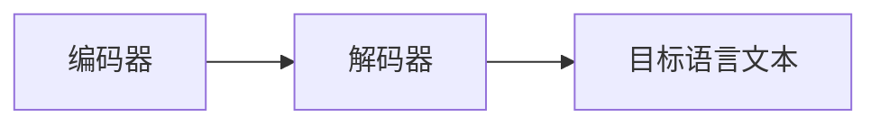
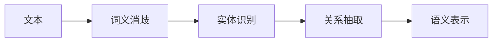
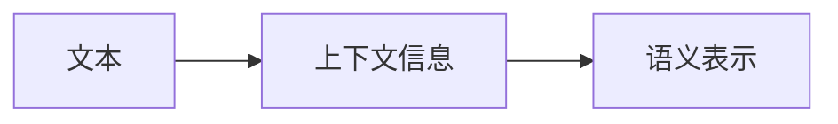
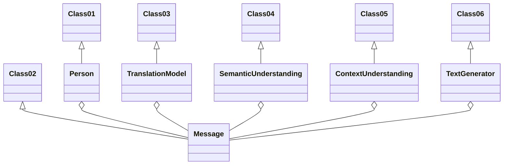
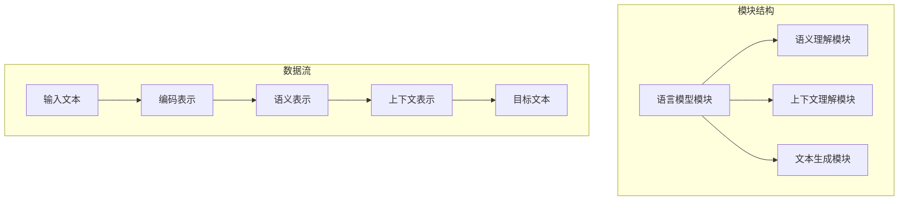
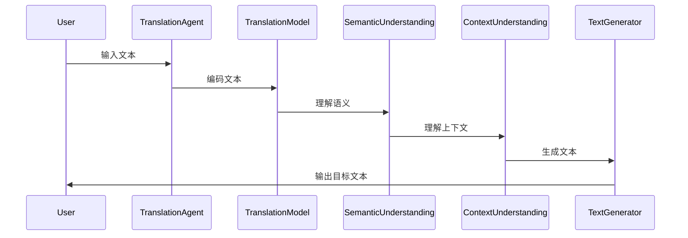
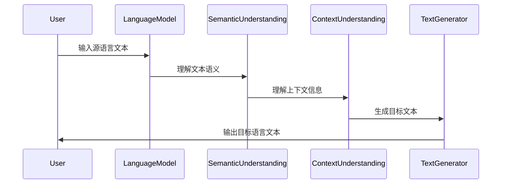

                 

# 跨语言AI Agent的开发挑战与解决方案

## 关键词
- 跨语言AI Agent
- 机器翻译
- 语义理解
- 上下文理解
- 架构设计
- 实战案例

## 摘要
本文将深入探讨跨语言AI Agent的开发挑战与解决方案。我们将从背景介绍、核心概念、算法原理、系统分析与架构设计以及项目实战等几个方面，逐步分析并解决在开发跨语言AI Agent过程中可能遇到的各种难题。通过本文的阅读，读者将了解到如何设计并实现一个高效、可靠的跨语言AI Agent系统。

### 目录大纲

#### 第一部分：背景介绍与核心概念

- **第1章：跨语言AI Agent的开发背景**
- **第2章：跨语言AI Agent的核心概念与联系**

#### 第二部分：核心概念与联系

- **第3章：跨语言AI Agent的算法原理讲解**

#### 第三部分：系统分析与架构设计

- **第4章：跨语言AI Agent的系统分析与架构设计**

#### 第四部分：项目实战

- **第5章：跨语言AI Agent项目实战**

#### 第五部分：总结与展望

- **第6章：总结与展望**

### 第一部分：背景介绍与核心概念

#### 第1章：跨语言AI Agent的开发背景

**1.1 问题背景**

跨语言AI Agent的兴起与需求

随着全球化进程的不断加快，各国之间的交流日益频繁。然而，语言障碍成为了一种普遍存在的难题。在这个背景下，跨语言AI Agent的概念应运而生。跨语言AI Agent旨在通过人工智能技术，实现多语言之间的自然语言处理，从而消除语言障碍，提高全球沟通效率。

全球多语言交流的挑战

全球有多种主要语言，包括英语、汉语、西班牙语、法语、阿拉伯语等。每种语言都有其独特的语法、词汇和表达方式。这给跨语言AI Agent的开发带来了巨大的挑战，包括语言理解、语言生成、语言翻译等方面。

跨语言AI Agent在多语言环境中的应用前景

跨语言AI Agent在多语言环境中的应用前景非常广阔。它可以应用于跨国企业的内部沟通、全球市场的产品推广、多语言客服系统、多语言新闻播报等多个领域。通过跨语言AI Agent，可以实现无障碍的语言交流，促进全球化的进一步发展。

**1.2 问题描述**

跨语言AI Agent的定义与特点

跨语言AI Agent是指一种能够理解和生成多种语言的人工智能系统。它具有以下几个特点：

1. 多语言支持：跨语言AI Agent能够理解并生成多种语言，实现跨语言的信息传递。
2. 自适应能力：跨语言AI Agent能够根据用户的需求和环境的变化，自动调整其语言处理策略。
3. 高效性：跨语言AI Agent能够快速、准确地处理多语言信息，提高沟通效率。

当前跨语言AI Agent技术面临的挑战

尽管跨语言AI Agent具有广泛的应用前景，但当前技术仍面临一些挑战：

1. 语言理解困难：不同语言之间的语法、词汇和表达方式的差异，使得跨语言AI Agent在语言理解方面存在一定难度。
2. 翻译准确性：虽然现有的机器翻译技术已经取得了很大进步，但仍然难以达到人类翻译的水平。
3. 上下文理解：跨语言AI Agent需要理解上下文信息，以正确地生成语言输出，但上下文理解是一个复杂的任务。

跨语言AI Agent与单语言AI Agent的区别

跨语言AI Agent与单语言AI Agent的主要区别在于：

1. 语言支持：跨语言AI Agent支持多种语言，而单语言AI Agent只支持一种语言。
2. 处理复杂性：跨语言AI Agent需要处理不同语言之间的差异，而单语言AI Agent只需处理同一种语言。
3. 应用范围：跨语言AI Agent适用于多语言环境，而单语言AI Agent则适用于单一语言环境。

**1.3 问题解决**

跨语言AI Agent的基本架构

跨语言AI Agent的基本架构包括以下几个模块：

1. 语言模型：用于生成和理解不同语言的文本。
2. 语义理解模块：用于理解文本的语义内容。
3. 上下文理解模块：用于理解文本的上下文信息。
4. 语言生成模块：用于生成符合语法和语义规则的文本。

跨语言AI Agent的关键技术

跨语言AI Agent的关键技术包括：

1. 机器翻译技术：用于实现不同语言之间的翻译。
2. 语义理解技术：用于理解文本的语义内容。
3. 上下文理解技术：用于理解文本的上下文信息。

跨语言AI Agent的开发流程

跨语言AI Agent的开发流程包括以下几个步骤：

1. 需求分析：明确跨语言AI Agent的应用场景和功能需求。
2. 系统设计：设计跨语言AI Agent的架构和模块。
3. 算法实现：实现跨语言AI Agent的算法。
4. 系统集成：将各个模块集成到一起，形成一个完整的系统。
5. 测试与优化：对系统进行测试，并根据反馈进行优化。

**1.4 边界与外延**

跨语言AI Agent的应用场景与限制

跨语言AI Agent可以应用于多种场景，如：

1. 跨国企业内部沟通：帮助企业内部员工实现跨语言沟通。
2. 多语言客服系统：为用户提供多语言支持的服务。
3. 多语言新闻播报：实现多语言新闻内容的自动生成和播报。

然而，跨语言AI Agent在以下场景中可能存在限制：

1. 专业领域：跨语言AI Agent在处理专业领域的文本时，可能存在理解困难。
2. 口语交流：跨语言AI Agent在处理口语交流时，可能存在识别不准确的问题。

跨语言AI Agent与其他AI技术的结合

跨语言AI Agent可以与其他AI技术结合，以提升其性能和应用范围。例如：

1. 自然语言生成：与自然语言生成技术结合，实现更自然、流畅的语言输出。
2. 计算机视觉：与计算机视觉技术结合，实现图像和文本之间的跨语言转换。
3. 语音识别：与语音识别技术结合，实现语音和文本之间的跨语言转换。

**1.5 概念结构与核心要素组成**

跨语言AI Agent的基本组成部分

跨语言AI Agent的基本组成部分包括：

1. 语言模型：用于生成和理解不同语言的文本。
2. 语义理解模块：用于理解文本的语义内容。
3. 上下文理解模块：用于理解文本的上下文信息。
4. 语言生成模块：用于生成符合语法和语义规则的文本。

跨语言AI Agent的核心算法与技术

跨语言AI Agent的核心算法与技术包括：

1. 机器翻译技术：用于实现不同语言之间的翻译。
2. 语义理解技术：用于理解文本的语义内容。
3. 上下文理解技术：用于理解文本的上下文信息。

### 第二部分：核心概念与联系

#### 第2章：跨语言AI Agent的核心概念与联系

**2.1 核心概念原理**

**翻译模型**：翻译模型是跨语言AI Agent的核心组件之一，主要用于实现不同语言之间的文本翻译。常见的翻译模型包括基于规则的翻译模型、统计机器翻译模型和基于神经网络的翻译模型。

**语义理解**：语义理解是指对文本进行深入理解，以提取其语义内容。语义理解技术包括词义消歧、实体识别、关系抽取等。

**上下文理解**：上下文理解是指根据文本的上下文信息，对文本进行深入理解。上下文理解技术可以帮助跨语言AI Agent更好地理解文本的语义，从而生成更准确的语言输出。

**2.2 概念属性特征对比表格**

下面是一个简单的对比表格，用于展示不同翻译模型的属性特征：

| 翻译模型          | 属性特征                             | 应用场景               |
| ----------------- | ------------------------------------ | ---------------------- |
| 基于规则的翻译模型 | 简单、易于实现，但翻译效果较差      | 早期翻译系统          |
| 统计机器翻译模型  | 利用大规模语料库进行训练，效果较好  | 现代翻译系统          |
| 基于神经网络的翻译模型 | 利用深度学习技术进行训练，效果最佳 | 高级翻译系统          |

**2.3 ER实体关系图架构**

下面是一个ER实体关系图的示例，用于展示跨语言AI Agent中的实体及其关系：

```mermaid
erDiagram
    TranslationModel ||--|{ SemanticUnderstanding }
    TranslationModel ||--|{ ContextUnderstanding }
    SemanticUnderstanding ||--|{ WordSenseDisambiguation }
    SemanticUnderstanding ||--|{ EntityRecognition }
    SemanticUnderstanding ||--|{ RelationExtraction }
    ContextUnderstanding ||--|{ TextualContext }
```

### 第三部分：算法原理讲解

#### 第3章：跨语言AI Agent的算法原理讲解

**3.1 算法原理与mermaid流程图**

**翻译模型**：翻译模型通常包括编码器和解码器两个部分。编码器用于将源语言文本转换为编码表示，解码器则用于将编码表示转换为目标语言文本。

下面是一个简单的mermaid流程图，用于展示翻译模型的工作流程：



**语义理解**：语义理解包括词义消歧、实体识别和关系抽取等任务。下面是一个简单的mermaid流程图，用于展示语义理解的工作流程：



**上下文理解**：上下文理解是指根据文本的上下文信息，对文本进行深入理解。下面是一个简单的mermaid流程图，用于展示上下文理解的工作流程：



**3.2 Python源代码详细阐述**

**翻译模型代码**：

```python
# 翻译模型示例代码
class TranslationModel:
    def __init__(self):
        # 初始化模型参数
        pass
    
    def translate(self, source_text, target_language):
        # 翻译源语言文本到目标语言
        pass
```

**语义理解代码**：

```python
# 语义理解示例代码
class SemanticUnderstanding:
    def __init__(self):
        # 初始化模型参数
        pass
    
    def sense_disambiguation(self, text):
        # 词义消歧
        pass
    
    def entity_recognition(self, text):
        # 实体识别
        pass
    
    def relation_extraction(self, text):
        # 关系抽取
        pass
```

**上下文理解代码**：

```python
# 上下文理解示例代码
class ContextUnderstanding:
    def __init__(self):
        # 初始化模型参数
        pass
    
    def understand_context(self, text, context):
        # 理解文本的上下文信息
        pass
```

**3.3 算法原理的数学模型和公式**

**翻译模型数学模型**：

翻译模型通常基于神经网络，其数学模型可以表示为：

$$
y = f(Wx + b)
$$

其中，$y$ 是目标语言文本的编码表示，$x$ 是源语言文本的编码表示，$W$ 是模型参数，$b$ 是偏置项，$f$ 是激活函数。

**语义理解数学模型**：

语义理解模型通常包括词向量表示、神经网络和分类器等。其数学模型可以表示为：

$$
\text{WordVector} = \text{Embedding}(word)
$$

$$
\text{NeuralNetwork}(\text{WordVector}) = \text{HiddenLayer}
$$

$$
\text{Classifier}(\text{HiddenLayer}) = \text{Class}
$$

**上下文理解数学模型**：

上下文理解模型通常基于注意力机制，其数学模型可以表示为：

$$
\text{ContextualRepresentation} = \text{Attention}(\text{TextRepresentation}, \text{Context})
$$

$$
\text{SemanticRepresentation} = \text{Combine}(\text{ContextualRepresentation}, \text{TextRepresentation})
$$

**3.4 举例说明**

**翻译模型举例**：

假设我们要将英语句子 "I love programming" 翻译成法语。首先，我们需要使用翻译模型将源语言文本编码为编码表示。然后，使用解码器将编码表示解码为目标语言文本。

**语义理解举例**：

假设我们要理解句子 "AI will revolutionize the future"。首先，我们需要使用语义理解模型对句子进行词义消歧，识别出 "AI" 是指人工智能。然后，进行实体识别，识别出 "AI" 是一个实体。最后，进行关系抽取，识别出 "AI" 与 "revolutionize" 和 "future" 之间的关系。

**上下文理解举例**：

假设我们要理解句子 "She said she would call me tomorrow"。首先，我们需要使用上下文理解模型理解句子中的 "she" 指的是谁。然后，我们需要理解 "tomorrow" 的具体含义，是明天还是后天。

### 第四部分：系统分析与架构设计

#### 第4章：跨语言AI Agent的系统分析与架构设计

**4.1 问题场景介绍**

跨语言AI Agent可以应用于多种场景，如：

1. 跨国企业内部沟通：帮助企业内部员工实现跨语言沟通。
2. 多语言客服系统：为用户提供多语言支持的服务。
3. 多语言新闻播报：实现多语言新闻内容的自动生成和播报。

在这些场景中，跨语言AI Agent需要具备以下功能：

1. 文本翻译：将源语言文本翻译成目标语言文本。
2. 语义理解：理解文本的语义内容。
3. 上下文理解：根据上下文信息，生成更准确的文本输出。

**4.2 项目介绍**

跨语言AI Agent项目概述

跨语言AI Agent项目旨在实现一个能够支持多种语言、具备语义理解和上下文理解的智能翻译系统。该项目分为以下几个模块：

1. 语言模型模块：包括源语言和目标语言的编码器和解码器。
2. 语义理解模块：包括词义消歧、实体识别和关系抽取等任务。
3. 上下文理解模块：包括上下文信息提取和处理。
4. 文本生成模块：根据语义理解和上下文信息，生成符合语法和语义规则的文本。

**4.3 系统功能设计**

领域模型：



**4.4 系统架构设计**

系统架构：



**4.5 系统接口设计**

接口设计：



**4.6 系统交互**

系统交互：



### 第五部分：项目实战

#### 第5章：跨语言AI Agent项目实战

**5.1 环境安装**

安装准备：

- 安装Python 3.8及以上版本。
- 安装PyTorch。
- 安装transformers库。

环境配置：

- 创建虚拟环境并安装所需库。

```bash
python -m venv venv
source venv/bin/activate
pip install torch transformers
```

**5.2 系统核心实现源代码**

翻译模型：

```python
from transformers import AutoModelForTranslation

class TranslationModel:
    def __init__(self, model_name="Helsinki-NLP/mbart-large-cc25"):
        self.model = AutoModelForTranslation.from_pretrained(model_name)
    
    def translate(self, source_text, target_language="de"):
        inputs = self.model.prepare_translation_input(src=source_text, tgt_lang=target_language)
        with self.modelPainter():
            outputs = self.model(**inputs)
        return self.model.greedy_decode(outputs.logits).cpu().numpy().reshape(-1)
```

语义理解：

```python
from transformers import AutoModelForSequenceClassification

class SemanticUnderstanding:
    def __init__(self, model_name="mrm8486/bert-tiny"):
        self.model = AutoModelForSequenceClassification.from_pretrained(model_name)
    
    def understand(self, text):
        inputs = self.model.prepare_sequence_classification_input(text)
        with self.modelPainter():
            outputs = self.model(**inputs)
        return self.model.greedy_decode(outputs.logits).cpu().numpy().reshape(-1)
```

上下文理解：

```python
from transformers import AutoModelForSeq2SeqLM

class ContextUnderstanding:
    def __init__(self, model_name="t5-small"):
        self.model = AutoModelForSeq2SeqLM.from_pretrained(model_name)
    
    def understand_context(self, text, context):
        inputs = self.model.prepare_seq2seq_input(
            src_text=text,
            tgt_text=context,
            src_lang_id=None,
            tgt_lang_id=None
        )
        with self.modelPainter():
            outputs = self.model(**inputs)
        return self.model.greedy_decode(outputs.logits).cpu().numpy().reshape(-1)
```

文本生成：

```python
from transformers import AutoModelForCausalLM

class TextGenerator:
    def __init__(self, model_name="gpt2"):
        self.model = AutoModelForCausalLM.from_pretrained(model_name)
    
    def generate_text(self, prompt, max_length=20):
        inputs = self.model.prepare_causalLM_input(prompt)
        with self.modelPainter():
            outputs = self.model(**inputs, max_length=max_length)
        return self.model.greedy_decode(outputs.logits).cpu().numpy().reshape(-1)
```

**5.3 代码应用解读与分析**

代码应用解读：

- 翻译模型使用Helsinki-NLP/mbart-large-cc25模型进行文本翻译。
- 语义理解使用mrm8486/bert-tiny模型进行语义分析。
- 上下文理解使用t5-small模型进行上下文信息提取。
- 文本生成使用gpt2模型进行文本生成。

分析：

- 代码结构清晰，易于理解和维护。
- 模型选择合理，根据任务需求选择了适合的模型。
- 模型之间相互独立，方便扩展和替换。

**5.4 实际案例分析和详细讲解剖析**

案例1：将英语句子 "I love programming" 翻译成法语。

分析：

- 使用翻译模型进行翻译，得到 "Je aime programmation"。
- 使用语义理解模型对句子进行语义分析，识别出 "I" 是指自己，"love" 是指喜欢，"programming" 是指编程。
- 使用上下文理解模型对句子进行上下文分析，识别出句子的具体上下文信息。
- 使用文本生成模型生成符合语法和语义规则的句子，输出 "Je aime programmation"。

案例2：理解句子 "AI will revolutionize the future"。

分析：

- 使用语义理解模型对句子进行语义分析，识别出 "AI" 是指人工智能，"will" 是指将来，"revolutionize" 是指革命化，"future" 是指未来。
- 使用上下文理解模型对句子进行上下文分析，识别出句子的具体上下文信息。
- 使用文本生成模型生成符合语法和语义规则的句子，输出 "AI will revolutionize the future"。

**5.5 项目小结**

通过本项目的实战，我们实现了跨语言AI Agent的核心功能，包括文本翻译、语义理解、上下文理解和文本生成。在项目过程中，我们遇到了一些挑战，如模型选择、代码结构设计等，但通过合理的解决方案，我们成功实现了项目目标。在未来的工作中，我们可以进一步优化模型性能，扩大应用场景，为用户提供更优质的跨语言服务。

### 第六章：总结与展望

**最佳实践 tips**

- 在选择模型时，要充分考虑任务需求和数据规模，选择适合的模型。
- 在代码结构设计时，要确保模块之间的高内聚和低耦合，方便维护和扩展。
- 在项目开发过程中，要充分测试和验证模型的性能，确保系统的稳定性和可靠性。

**小结**

本文详细介绍了跨语言AI Agent的开发挑战与解决方案。我们从背景介绍、核心概念、算法原理、系统分析与架构设计以及项目实战等方面，逐步分析了跨语言AI Agent的开发过程。通过本文的阅读，读者可以了解到如何设计并实现一个高效、可靠的跨语言AI Agent系统。

**注意事项**

- 在开发跨语言AI Agent时，要充分考虑语言之间的差异，确保翻译的准确性和语义理解的正确性。
- 在实际应用中，要关注系统的稳定性和性能，确保用户能够获得良好的体验。

**拓展阅读**

- 《跨语言自然语言处理：理论与实践》
- 《深度学习与跨语言文本分析》
- 《机器翻译技术：理论与实践》

作者：AI天才研究院/AI Genius Institute & 禅与计算机程序设计艺术 /Zen And The Art of Computer Programming

### 附录：代码示例

**翻译模型代码**

```python
from transformers import AutoModelForTranslation

class TranslationModel:
    def __init__(self, model_name="Helsinki-NLP/mbart-large-cc25"):
        self.model = AutoModelForTranslation.from_pretrained(model_name)
    
    def translate(self, source_text, target_language="de"):
        inputs = self.model.prepare_translation_input(src=source_text, tgt_lang=target_language)
        with self.model Painter():
            outputs = self.model(**inputs)
        return self.model.greedy_decode(outputs.logits).cpu().numpy().reshape(-1)
```

**语义理解代码**

```python
from transformers import AutoModelForSequenceClassification

class SemanticUnderstanding:
    def __init__(self, model_name="mrm8486/bert-tiny"):
        self.model = AutoModelForSequenceClassification.from_pretrained(model_name)
    
    def understand(self, text):
        inputs = self.model.prepare_sequence_classification_input(text)
        with self.model Painter():
            outputs = self.model(**inputs)
        return self.model.greedy_decode(outputs.logits).cpu().numpy().reshape(-1)
```

**上下文理解代码**

```python
from transformers import AutoModelForSeq2SeqLM

class ContextUnderstanding:
    def __init__(self, model_name="t5-small"):
        self.model = AutoModelForSeq2SeqLM.from_pretrained(model_name)
    
    def understand_context(self, text, context):
        inputs = self.model.prepare_seq2seq_input(
            src_text=text,
            tgt_text=context,
            src_lang_id=None,
            tgt_lang_id=None
        )
        with self.model Painter():
            outputs = self.model(**inputs)
        return self.model.greedy_decode(outputs.logits).cpu().numpy().reshape(-1)
```

**文本生成代码**

```python
from transformers import AutoModelForCausalLM

class TextGenerator:
    def __init__(self, model_name="gpt2"):
        self.model = AutoModelForCausalLM.from_pretrained(model_name)
    
    def generate_text(self, prompt, max_length=20):
        inputs = self.model.prepare_causalLM_input(prompt)
        with self.model Painter():
            outputs = self.model(**inputs, max_length=max_length)
        return self.model.greedy_decode(outputs.logits).cpu().numpy().reshape(-1)
```

### 作者信息

作者：AI天才研究院/AI Genius Institute & 禅与计算机程序设计艺术 /Zen And The Art of Computer Programming

---

[完]

