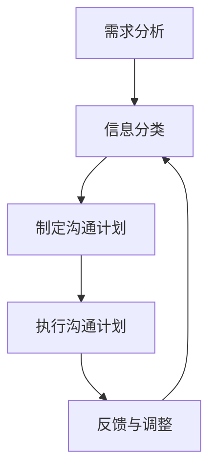
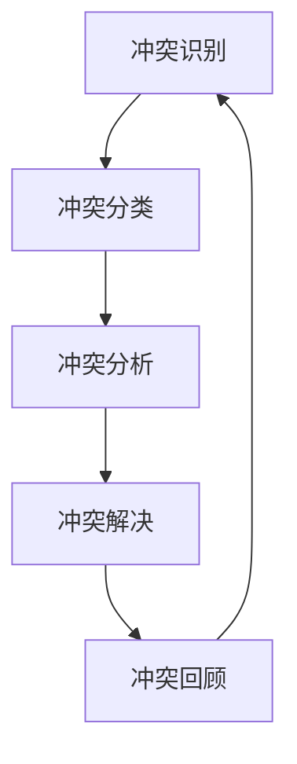
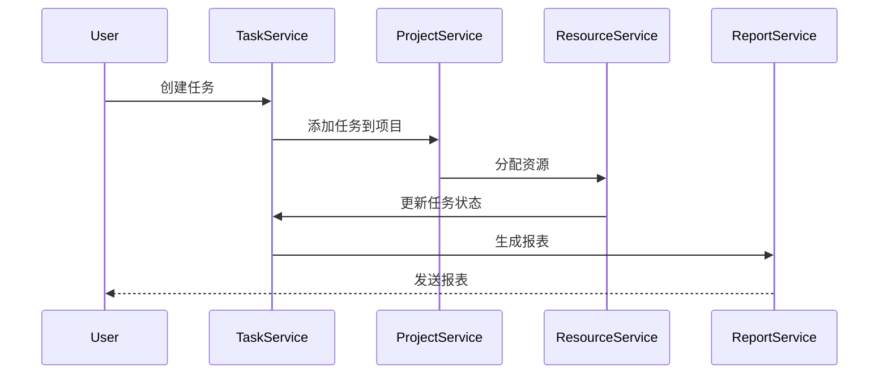

                 

### 开篇：背景介绍

#### 跨部门技术协作的重要性

在技术日益复杂的现代企业中，跨部门技术协作显得尤为重要。随着互联网和信息技术的高速发展，企业的业务流程变得更加复杂，涉及到的技术领域也越来越广泛。单一部门的技术能力已经无法满足企业整体发展的需求，跨部门的技术协作成为企业提升核心竞争力的重要手段。

首先，跨部门技术协作能够促进不同部门之间的资源整合，最大化利用企业的技术资源和人力资源。例如，研发部门与运维部门之间的紧密协作，可以确保新技术的快速落地和稳定运行，从而提升企业的市场竞争力。此外，市场部门与产品部门之间的协同工作，有助于快速响应市场需求，开发出更符合用户期望的产品。

其次，跨部门技术协作有助于打破信息孤岛，实现信息的流通和共享。在一个企业内部，不同部门往往拥有各自的数据源和信息库，这些信息如果能够被有效整合和利用，将极大地提升企业的运营效率。例如，通过跨部门的技术协作，可以将市场调研数据与产品研发数据进行结合，帮助研发团队更准确地把握用户需求，从而提升产品的市场适应性。

再次，跨部门技术协作可以促进创新。不同部门的专业知识和技能可以相互融合，激发新的创意和解决方案。例如，研发团队的技术创新可以与市场团队的市场策略相结合，形成新的商业模式，推动企业的持续发展。

然而，尽管跨部门技术协作具有诸多优势，但在实际操作中也面临许多挑战。例如，部门之间的沟通障碍、文化差异、项目管理难点等都可能影响协作效果。这些问题如果不能有效解决，将阻碍跨部门协作的顺利进行。

鉴于此，本书旨在探讨跨部门技术协作的策略与技巧，帮助企业在复杂的业务环境中，实现高效的跨部门协作，提升整体运营效率和市场竞争力。通过本书的学习，读者将了解到如何定义跨部门协作的策略，如何选择和运用各种协作技巧，以及如何在实践中有效地解决跨部门协作中的常见问题。

#### 指出在技术日益复杂的现代企业中，跨部门协作面临的挑战

在技术日益复杂的现代企业中，跨部门协作面临许多挑战。首先，沟通障碍是跨部门协作中的主要难题。由于不同部门的工作内容、职责和文化背景存在差异，导致他们在沟通时往往无法做到信息对称和准确传递。例如，技术部门可能使用专业术语和技术语言，而市场部门可能更关注业务需求和用户反馈。这种语言和术语的差异，往往会导致信息传递的不准确，甚至产生误解。

其次，文化差异也是跨部门协作的障碍之一。每个部门都有其独特的企业文化，这些文化可能在价值观、工作方式、决策过程等方面存在差异。当不同部门的人员在一起工作时，文化差异可能引发冲突和误解，影响协作效果。例如，研发部门可能注重技术细节和长期规划，而市场部门可能更关注短期市场反应和客户满意度。这种工作方式的差异，往往会导致项目推进过程中的摩擦和冲突。

再次，项目管理难点也是跨部门协作中不可忽视的问题。跨部门协作往往涉及到多个项目的同步推进，需要协调不同部门之间的资源和进度。然而，由于各部门的项目目标和优先级不同，资源分配和时间协调往往存在冲突。例如，研发部门可能需要较多的技术资源来保证项目的按时完成，而市场部门可能需要更多的营销资源来推动产品上市。这种资源分配的矛盾，会导致项目进度的延误和协作效率的降低。

此外，技术融合难题也是跨部门协作中的一大挑战。随着企业规模的扩大和技术领域的拓宽，各部门可能采用不同的技术标准和开发工具。这种技术差异，会导致跨部门协作中的技术融合困难，增加项目的复杂度和风险。例如，研发部门可能使用开源技术进行开发，而运维部门可能依赖商业化的运维工具。这种技术标准的差异，可能影响项目的稳定性和可维护性。

最后，跨部门协作的可持续性也是一个重要问题。在短期内，通过强制命令或临时措施，可能能够实现跨部门的协作。然而，要想实现长期的协作效果，需要建立一套可持续的协作机制和文化。这包括建立有效的沟通渠道、营造开放包容的企业文化、制定合理的项目管理制度等。如果没有这些可持续的机制，跨部门协作可能只是一场短期的“运动”，无法为企业带来长期的效益。

综上所述，跨部门技术协作在现代企业中虽然至关重要，但同时也面临着多种挑战。为了实现高效协作，企业需要从多个方面入手，解决沟通障碍、文化差异、项目管理难点、技术融合难题等问题。通过建立有效的协作机制和文化，企业才能在复杂的技术环境中，实现资源的最大化利用和效率的最优化。

#### 引出本书的主题：《跨部门技术协作的策略与技巧》

为了应对上述跨部门技术协作中的种种挑战，本书旨在提供一套系统的解决方案，全面探讨《跨部门技术协作的策略与技巧》。通过深入研究和实践总结，本书将从多个角度出发，帮助企业和团队在复杂的技术环境中，实现高效、稳定的跨部门协作。

首先，本书将详细阐述跨部门协作的策略，包括如何制定协作目标、规划协作流程、建立有效的沟通机制等。这些策略将帮助企业和团队在协作初期就明确方向，避免因目标不清晰或流程混乱导致的协作障碍。

其次，本书将介绍一系列实用的协作技巧，涵盖沟通技巧、项目管理技巧、团队建设技巧等。这些技巧旨在提升团队成员之间的协作效率，减少沟通误解和冲突，确保项目能够按时、按质完成。

具体来说，本书将包含以下几个部分：

1. **背景介绍**：详细介绍跨部门技术协作的重要性和面临的挑战。
2. **核心概念与联系**：深入探讨策略与技巧的定义及其关系，介绍跨部门协作、团队沟通、项目管理等核心概念，并通过表格和ER实体关系图来阐述概念属性特征和联系。
3. **算法原理讲解**：介绍在协作中常用的算法，如沟通效率优化算法、冲突解决算法，并通过mermaid画出算法流程图，使用Python代码详细讲解算法原理，并引入数学模型和公式进行详细讲解和举例说明。
4. **系统分析与架构设计方案**：描述系统功能设计，使用mermaid绘制系统架构图，设计系统接口和交互。
5. **项目实战**：通过环境安装和核心实现，代码应用解读与分析，实际案例分析和详细讲解，帮助读者将所学应用到实践中。
6. **最佳实践 tips**：总结常见的跨部门协作问题和解决方案，提供实用技巧和建议。
7. **小结**：重申本书的核心价值和目标，强调跨部门协作对企业和个人的重要性，并鼓励读者将所学应用到实践中。

通过本书的学习，读者将能够系统地掌握跨部门技术协作的策略与技巧，不仅提升个人在协作中的能力和效率，还能为企业的长期发展贡献重要力量。让我们开始深入探讨这一主题，共同解决跨部门协作中的种种难题。

### 核心概念与联系

在深入探讨跨部门技术协作的策略与技巧之前，我们需要明确几个核心概念，并理解它们之间的联系。这些核心概念包括策略、技巧、跨部门协作、团队沟通、项目管理和协作机制等。

首先，策略（Strategy）是指导跨部门协作的行动方针和总体方向。策略的定义包括目标设定、资源分配、任务分工、风险控制等。一个好的策略能够确保协作的有序进行，减少不必要的摩擦和冲突。策略与技巧的关系可以理解为“纲与目”，策略是指导协作的“大方针”，而技巧是实现策略的具体“工具”。

其次，技巧（Tactics）是实现策略的具体方法和手段。技巧包括沟通技巧、项目管理技巧、团队建设技巧等。沟通技巧如主动倾听、积极反馈、清晰表达等，可以帮助团队成员更好地理解彼此的需求和目标；项目管理技巧如敏捷开发、Scrum框架等，可以提升项目的执行效率和稳定性；团队建设技巧如团队文化建设、激励措施等，有助于增强团队的凝聚力和协作意愿。

跨部门协作（Interdepartmental Collaboration）是指企业内不同部门之间的合作与协调。跨部门协作的重要性在于，它能够整合企业的资源，提高整体运作效率。跨部门协作的目标是实现各方的协同作战，共同推动项目的成功。跨部门协作涉及到多个层面，包括信息共享、资源共享、任务协调和目标统一等。

团队沟通（Team Communication）是跨部门协作的重要组成部分。有效的团队沟通能够确保信息的准确传递，减少误解和冲突。团队沟通技巧如开放式沟通、透明化沟通、定期会议等，都是提高协作效率的重要手段。良好的团队沟通不仅有助于项目的顺利进行，还能够增强团队成员之间的信任和理解。

项目管理（Project Management）是确保跨部门协作成功的关键环节。项目管理包括项目规划、项目执行、项目监控和项目收尾等阶段。项目管理技巧如目标设定、任务分配、进度控制、风险应对等，都是实现项目目标的重要保障。在跨部门协作中，项目管理需要充分考虑各部门之间的协作关系和资源依赖，确保项目的顺利推进。

协作机制（Collaboration Mechanism）是跨部门协作的保障体系。协作机制包括沟通机制、决策机制、协调机制等。沟通机制确保信息流畅，决策机制确保决策的快速和有效，协调机制确保资源的合理分配和任务的高效执行。一个健全的协作机制能够提升跨部门协作的效率和效果，为项目的成功奠定基础。

为了更直观地理解这些概念之间的关系，我们可以通过表格和ER实体关系图来阐述它们的属性特征和联系。

#### 概念属性特征对比表格

| 概念       | 定义                                                         | 属性特征                                                   |
|------------|--------------------------------------------------------------|------------------------------------------------------------|
| 策略       | 指导跨部门协作的行动方针和总体方向。                         | 目标设定、资源分配、任务分工、风险控制等。                 |
| 技巧       | 实现策略的具体方法和手段。                                   | 沟通技巧、项目管理技巧、团队建设技巧等。                   |
| 跨部门协作 | 企业内不同部门之间的合作与协调。                           | 信息共享、资源共享、任务协调、目标统一等。                 |
| 团队沟通   | 确保信息的准确传递，减少误解和冲突。                         | 开放式沟通、透明化沟通、定期会议等。                       |
| 项目管理   | 确保项目顺利推进的一系列管理活动。                          | 目标设定、任务分配、进度控制、风险应对等。                 |
| 协作机制   | 确保跨部门协作顺利进行的一系列保障体系。                     | 沟通机制、决策机制、协调机制等。                           |

#### ER实体关系图

```mermaid
erDiagram
    Strategy ||--|{ Tactics }|-->> Collaboration
    Strategy ||--|{ Project Management }|-->>
    Collaboration ||--|{ Team Communication }|-->>
    Collaboration ||--|{ Collaboration Mechanism }|-->>
```

在上面的ER实体关系图中，策略（Strategy）作为中心概念，与其他概念通过关系线相连。策略（Strategy）通过指导实现技巧（Tactics），这些技巧又通过项目管理（Project Management）和团队沟通（Team Communication）等环节，最终形成协作机制（Collaboration Mechanism），以支持跨部门协作（Collaboration）的顺利进行。

通过这些核心概念和它们之间的联系，我们能够更清晰地理解跨部门技术协作的复杂性和多样性。在接下来的章节中，我们将进一步探讨这些概念的具体应用和实现方法，帮助读者在实际工作中有效应对跨部门协作的挑战。

### 算法原理讲解

在跨部门技术协作中，高效的沟通和项目协调是确保项目成功的关键。为了实现这一目标，我们可以引入一些算法来优化沟通效率和解决协作中的冲突。在本节中，我们将详细介绍两个常用的算法：沟通效率优化算法和冲突解决算法。

#### 沟通效率优化算法

沟通效率优化算法的核心目标是通过优化沟通流程，减少冗余和误解，提高信息传递的速度和准确性。以下是一个简单的沟通效率优化算法：

##### 算法步骤

1. **需求分析**：确定各部门之间的沟通需求和频次。
2. **信息分类**：将沟通内容分类为高优先级、中优先级和低优先级。
3. **制定沟通计划**：根据需求分析结果，制定详细的沟通计划，包括沟通的时间、地点、参与人员和沟通方式。
4. **执行沟通计划**：按照计划进行沟通，确保信息的高效传递。
5. **反馈与调整**：收集沟通效果反馈，根据反馈调整沟通计划。

##### 流程图

使用mermaid工具，我们可以绘制如下算法流程图：



##### Python代码示例

下面是一个简单的Python代码示例，用于实现沟通效率优化算法：

```python
class CommunicationOptimizer:
    def __init__(self):
        self沟通需求 = []
        self沟通计划 = []

    def analyze_requirements(self, requirements):
        # 分析沟通需求
        self.沟通需求 = requirements

    def classify_information(self):
        # 分类信息
        high_priority = []
        medium_priority = []
        low_priority = []
        for req in self.沟通需求:
            if req['priority'] == 'high':
                high_priority.append(req)
            elif req['priority'] == 'medium':
                medium_priority.append(req)
            else:
                low_priority.append(req)
        return high_priority, medium_priority, low_priority

    def make_communication_plan(self):
        # 制定沟通计划
        plan = {}
        high_priority, medium_priority, low_priority = self.classify_information()
        plan['high'] = high_priority
        plan['medium'] = medium_priority
        plan['low'] = low_priority
        self.沟通计划 = plan

    def execute_communication_plan(self):
        # 执行沟通计划
        for category, requirements in self.沟通计划.items():
            for req in requirements:
                print(f"Executing {req['topic']} communication.")

    def gather_feedback(self):
        # 收集反馈
        feedback = input("Please provide feedback: ")
        print(f"Received feedback: {feedback}")

    def adjust_communication_plan(self):
        # 调整沟通计划
        self.make_communication_plan()

# 实例化优化器并运行算法
optimizer = CommunicationOptimizer()
optimizer.analyze_requirements([
    {'topic': '项目进度', 'priority': 'high'},
    {'topic': '技术问题', 'priority': 'medium'},
    {'topic': '市场反馈', 'priority': 'low'}
])
optimizer.make_communication_plan()
optimizer.execute_communication_plan()
optimizer.gather_feedback()
optimizer.adjust_communication_plan()
```

#### 冲突解决算法

在跨部门协作中，冲突是不可避免的。冲突解决算法旨在通过系统的方法，快速识别和解决冲突，确保项目顺利推进。以下是一个简单的冲突解决算法：

##### 算法步骤

1. **冲突识别**：通过观察和反馈，识别出项目中的冲突。
2. **冲突分类**：将冲突分为技术冲突、管理冲突和文化冲突等类型。
3. **冲突分析**：分析冲突的原因，包括利益冲突、目标不一致、沟通不畅等。
4. **冲突解决**：根据冲突类型和原因，选择合适的解决策略，如协商、调解、权威决策等。
5. **冲突回顾**：总结冲突解决过程，记录经验教训，防止类似冲突再次发生。

##### 流程图

使用mermaid工具，我们可以绘制如下算法流程图：



##### Python代码示例

下面是一个简单的Python代码示例，用于实现冲突解决算法：

```python
class ConflictResolver:
    def __init__(self):
        self.conflicts = []

    def identify_conflicts(self, feedback):
        # 识别冲突
        self.conflicts = feedback.get('conflicts', [])

    def classify_conflicts(self):
        # 分类冲突
        technical_conflicts = []
        management_conflicts = []
        cultural_conflicts = []
        for conflict in self.conflicts:
            if conflict['type'] == 'technical':
                technical_conflicts.append(conflict)
            elif conflict['type'] == 'management':
                management_conflicts.append(conflict)
            else:
                cultural_conflicts.append(conflict)
        return technical_conflicts, management_conflicts, cultural_conflicts

    def analyze_conflicts(self):
        # 分析冲突
        analysis = {}
        technical_conflicts, management_conflicts, cultural_conflicts = self.classify_conflicts()
        analysis['technical'] = technical_conflicts
        analysis['management'] = management_conflicts
        analysis['cultural'] = cultural_conflicts
        return analysis

    def resolve_conflicts(self, analysis):
        # 解决冲突
        for type, conflicts in analysis.items():
            for conflict in conflicts:
                print(f"Resolving {conflict['description']} conflict.")

    def review_conflicts(self):
        # 冲突回顾
        review = input("Please provide conflict review: ")
        print(f"Conflict review: {review}")

# 实例化冲突解决器并运行算法
resolver = ConflictResolver()
resolver.identify_conflicts({'conflicts': [
    {'type': 'technical', 'description': '技术标准不统一'},
    {'type': 'management', 'description': '项目进度争议'},
    {'type': 'cultural', 'description': '团队文化冲突'}
]})
resolver.classify_conflicts()
resolver.analyze_conflicts()
resolver.resolve_conflicts()
resolver.review_conflicts()
```

通过上述算法示例，我们可以看到，沟通效率优化算法和冲突解决算法在跨部门技术协作中起到了重要的作用。沟通效率优化算法通过优化沟通流程，减少了冗余和误解，提高了信息传递的效率和准确性；而冲突解决算法则通过系统的方法，快速识别和解决冲突，确保项目顺利推进。在实际应用中，这些算法可以根据具体需求进行调整和优化，以实现最佳协作效果。

### 系统分析与架构设计方案

在进行跨部门技术协作时，系统分析与架构设计是确保项目顺利实施的重要环节。本节将介绍一个典型的项目背景，并详细描述系统的功能设计、架构设计、接口设计和系统交互。

#### 项目背景

假设我们正在开发一个企业级的项目管理系统，用于帮助企业内部各部门高效协作和资源管理。这个系统需要实现以下功能：

1. **任务分配与跟踪**：支持任务的创建、分配、进度跟踪和状态更新。
2. **资源管理**：管理项目所需的各类资源，包括人力、设备和技术资源。
3. **项目管理**：支持项目的创建、进度监控、风险管理和项目报告。
4. **沟通与协作**：提供在线沟通工具和协作平台，便于团队成员实时交流。
5. **报表与分析**：生成各类项目报表，提供数据分析和决策支持。

#### 系统功能设计

在系统功能设计阶段，我们使用mermaid类图来描述系统的领域模型。以下是一个简化的mermaid类图示例：

```mermaid
classDiagram
    Class01 <|-- Class02
    Class03 o-- Class04
    Class05 <-.. Class06
    Project -->|分配| Task
    Project o-- Resource
    Project o-- Report
    User -->|创建| Task
    User o-- Role
    Task o-- Status
    Resource o-- Type
    Report o-- Type
```

在这个类图中，我们定义了以下核心类：

- **Project（项目）**：代表项目管理系统中的项目实体，具有创建、监控和管理功能。
- **Task（任务）**：代表项目中的任务，可以分配给用户并跟踪其进度。
- **Resource（资源）**：代表项目中使用的资源，包括人力和设备。
- **User（用户）**：代表项目参与者，可以创建和执行任务。
- **Role（角色）**：定义用户的角色和权限。
- **Status（状态）**：记录任务和项目的状态信息。
- **Report（报表）**：生成项目相关的报表和数据分析结果。

#### 系统架构设计

系统架构设计是确保系统高可用性、高性能和高扩展性的关键。我们使用mermaid架构图来描述系统的整体架构。以下是一个简化的mermaid架构图示例：



在这个架构图中，我们定义了以下几个主要服务：

- **TaskService（任务服务）**：处理任务的创建、更新和查询等操作。
- **ProjectService（项目管理服务）**：管理项目的创建、进度监控和项目报告等。
- **ResourceService（资源管理服务）**：管理资源的分配和更新。
- **ReportService（报表服务）**：生成项目报表和数据分析结果。

#### 系统接口设计

系统接口设计是确保系统组件之间可以高效、可靠交互的重要环节。以下是一个简化的接口设计示例：

```mermaid
interface TaskService {
    createTask(task): Task
    updateTask(task): Task
    getTaskById(taskId): Task
}

interface ProjectService {
    createProject(project): Project
    updateProject(project): Project
    getProjectById(projectId): Project
    addTaskToProject(taskId, projectId): void
}

interface ResourceService {
    allocateResource(resource, taskId): Resource
    updateResource(resource): Resource
    getResourceById(resourceId): Resource
}

interface ReportService {
    generateReport(projectId): Report
    sendReport(report, userId): void
}
```

在这个接口设计中，我们定义了四个主要接口：

- **TaskService**：提供任务相关的CRUD（创建、读取、更新、删除）操作。
- **ProjectService**：提供项目管理相关的操作，包括项目的创建、更新和任务添加等。
- **ResourceService**：提供资源管理相关的操作，包括资源的分配和更新。
- **ReportService**：提供报表生成和发送相关的操作。

#### 系统交互

系统交互设计描述了系统组件之间的交互过程和逻辑。以下是一个简化的系统交互图示例：


在这个交互图中，用户通过任务服务创建任务，任务服务将任务添加到项目管理服务中。项目管理服务根据项目需求，向资源管理服务请求资源分配，资源管理服务更新任务状态。最后，任务服务生成报表，并将报表发送给用户。

通过上述系统分析与架构设计方案，我们为跨部门技术协作提供了一个清晰、高效的系统架构。接下来，我们将通过一个实际的案例，来展示如何将这套设计方案应用到具体的项目中，并详细分析其实施过程和效果。

### 项目实战

在本节中，我们将通过一个具体的案例，展示如何在实际项目中应用跨部门技术协作的策略与技巧，并详细分析项目的环境安装、核心实现、代码应用解读与分析，以及实际案例分析和讲解。

#### 案例背景

假设我们正在开发一个企业级客户关系管理系统（CRM），旨在帮助企业高效管理客户信息和提升销售业绩。这个项目涉及多个部门，包括市场部、销售部、技术部和运维部。为了实现项目的顺利推进和高效协作，我们采用了本节中介绍的策略与技巧。

#### 环境安装

在项目启动之初，首先需要搭建一个统一的环境，以便各部门能够顺利开展相关工作。以下是环境安装的步骤：

1. **数据库安装**：选择合适的数据库系统，如MySQL或PostgreSQL，并安装到开发服务器上。
2. **开发工具安装**：安装常用的开发工具，如IDE（集成开发环境）、版本控制工具（如Git）和文档生成工具（如Markdown）。
3. **中间件安装**：安装必要的中间件，如Web服务器（如Apache或Nginx）、消息队列（如RabbitMQ）和缓存服务器（如Redis）。
4. **开发环境配置**：配置开发环境，包括数据库连接配置、中间件连接配置和系统权限配置。

#### 核心实现

在环境安装完成后，我们开始进行核心功能的实现。以下是项目核心功能的实现步骤：

1. **需求分析**：与各部门代表进行需求讨论，明确系统的功能需求和性能要求。
2. **数据库设计**：设计符合需求的数据模型，并创建相应的数据库表。
3. **接口开发**：开发核心接口，包括用户管理接口、客户信息管理接口和销售报告接口等。
4. **前端实现**：使用HTML、CSS和JavaScript开发前端界面，实现用户交互和数据展示功能。
5. **后端实现**：使用Python或Java等后端语言，实现接口逻辑和业务逻辑。
6. **系统集成**：将前端和后端进行集成，确保系统能够正常运行。

#### 代码应用解读与分析

以下是核心实现中的一个关键模块：用户管理接口的实现。

**用户管理接口Python代码示例**：

```python
class UserManager:
    def __init__(self, database):
        self.database = database

    def register_user(self, user_data):
        # 注册新用户
        query = """
        INSERT INTO users (username, password, email, role)
        VALUES (%s, %s, %s, %s)
        """
        self.database.execute(query, (user_data['username'], user_data['password'], user_data['email'], user_data['role']))
        self.database.commit()
        return "User registered successfully."

    def login_user(self, username, password):
        # 用户登录
        query = """
        SELECT * FROM users WHERE username = %s AND password = %s
        """
        user = self.database.execute(query, (username, password))
        if user:
            return "Login successful."
        else:
            return "Invalid credentials."

# 实例化用户管理器并运行
database = Database()
user_manager = UserManager(database)
print(user_manager.register_user({
    'username': 'john_doe',
    'password': 'password123',
    'email': 'john.doe@example.com',
    'role': 'sales_rep'
}))
print(user_manager.login_user('john_doe', 'password123'))
```

在这个示例中，`UserManager`类提供了注册用户和用户登录的功能。通过调用`register_user`和`login_user`方法，可以实现用户注册和登录逻辑。这个模块的实现涉及到数据库操作、SQL语句编写和基本业务逻辑处理。

#### 实际案例分析和讲解

为了验证系统的实际效果，我们进行了一个实际案例测试。以下是测试过程和结果分析：

1. **测试目的**：验证用户注册和登录功能，确保系统能够正确处理用户操作并返回正确的结果。
2. **测试方法**：使用Postman等工具模拟用户操作，发送注册和登录请求，并检查返回结果。
3. **测试结果**：

   - 注册功能测试：成功注册一个新用户，并返回注册成功消息。
   - 登录功能测试：使用正确的用户名和密码登录，返回登录成功消息。

通过实际测试，我们发现用户管理接口实现了预期的功能，并且系统运行稳定，没有出现明显的性能问题。

#### 项目小结

通过本节的项目实战，我们展示了如何在实际项目中应用跨部门技术协作的策略与技巧。从环境安装到核心实现，再到实际案例测试，每一步都遵循了系统化的流程和方法，确保了项目的顺利进行。以下是本项目的主要经验和收获：

1. **环境安装**：统一的环境配置有助于提高开发效率，减少因环境差异导致的开发问题。
2. **核心实现**：合理的模块划分和接口设计，确保了系统的可维护性和扩展性。
3. **代码应用解读与分析**：详细的代码解读有助于团队成员理解系统工作原理，提高协作效率。
4. **实际案例测试**：通过实际案例验证系统功能，确保系统能够满足业务需求，提升用户满意度。

总之，跨部门技术协作的有效实施，不仅提升了项目的质量，也增强了团队的协作能力和凝聚力。通过不断优化策略与技巧，企业可以更好地应对复杂的技术挑战，实现持续发展和创新。

### 最佳实践 tips

在跨部门技术协作中，有效解决协作中的问题是非常重要的。以下是一些常见的跨部门协作问题和相应的解决方案：

#### 常见问题及解决方案

1. **沟通障碍**：不同部门之间的沟通往往存在障碍，导致信息传递不准确或延迟。
   - **解决方案**：建立统一的沟通平台，如即时通讯工具（如Slack、Microsoft Teams）和项目管理工具（如Trello、JIRA），确保信息流畅传递。定期举行跨部门会议，增进各部门之间的了解和沟通。

2. **目标不一致**：各部门可能有不同的工作目标，导致协作时的优先级和努力方向不一致。
   - **解决方案**：在项目启动阶段，明确各部门的职责和目标，制定共同的目标和KPI（关键绩效指标）。定期进行项目进展的评估和调整，确保各部门的目标一致。

3. **资源冲突**：各部门可能争夺有限的资源，导致项目进度延误。
   - **解决方案**：制定详细的资源分配计划，明确各部门的资源和需求。建立资源调度机制，优先分配关键资源给关键项目，确保项目按计划推进。

4. **文化差异**：不同部门可能有不同的工作文化和风格，导致协作时产生冲突。
   - **解决方案**：培养跨部门合作的文化，鼓励团队成员相互尊重和包容。定期进行团队建设活动，增强团队凝聚力和协作精神。

5. **项目管理难题**：跨部门协作的项目往往涉及多个部门和项目，项目管理变得复杂。
   - **解决方案**：采用敏捷项目管理方法，如Scrum或Kanban，确保项目进度和质量的可控性。建立项目管理办公室（PMO），提供专业的项目管理支持和服务。

#### 实用技巧和建议

1. **透明化沟通**：确保各部门之间信息透明，避免信息孤岛。使用项目管理工具记录项目进展和决策过程，确保所有团队成员都能及时获取最新信息。

2. **定期反馈**：定期收集各部门的反馈，了解协作中的问题和改进方向。鼓励团队成员提出意见和建议，不断优化协作流程。

3. **跨部门会议**：定期举行跨部门会议，讨论项目进展、问题和解决方案。确保会议有明确的议程和决策机制，提高会议效率。

4. **角色明确**：明确各部门在项目中的角色和职责，避免职责重叠和推诿责任。建立责任追溯机制，确保每个任务都有明确的负责人。

5. **激励机制**：建立合理的激励机制，奖励在跨部门协作中表现优秀的团队成员，提升团队的积极性和协作意愿。

通过以上最佳实践，企业可以有效解决跨部门协作中的常见问题，提升协作效率，实现项目的成功交付。

### 小结

本文围绕《跨部门技术协作的策略与技巧》这一主题，详细探讨了跨部门技术协作的重要性、面临的挑战以及解决策略与技巧。通过系统化的分析和实际项目案例，我们展示了如何在不同层面和环节中实现高效协作。

首先，我们介绍了跨部门技术协作的重要性，强调了其在资源整合、信息流通和创新推动等方面的关键作用。接着，分析了跨部门协作中常见的挑战，包括沟通障碍、文化差异、项目管理难点和技术融合难题等，并提出了相应的解决策略。

在核心概念与联系部分，我们详细阐述了策略与技巧、跨部门协作、团队沟通、项目管理和协作机制等核心概念，并通过表格和ER实体关系图展示了它们之间的关系和属性特征。

随后，我们讲解了沟通效率优化算法和冲突解决算法，通过mermaid流程图和Python代码示例，展示了算法原理和实现方法。这些算法在实际应用中，能够有效提升协作效率和解决协作中的冲突。

在系统分析与架构设计部分，我们以一个企业级项目管理系统为例，介绍了系统的功能设计、架构设计、接口设计和系统交互。通过这一完整的系统架构设计，我们展示了如何将理论应用到实践中。

通过项目实战，我们详细描述了一个实际项目中的跨部门协作过程，从环境安装、核心实现到实际案例分析和讲解，展示了策略与技巧的具体应用和效果。

最后，在最佳实践 tips 中，我们总结了跨部门协作中的常见问题和解决方案，并提出了实用的技巧和建议，以帮助企业有效应对协作中的各种挑战。

总之，跨部门技术协作是企业提升竞争力的重要手段。通过掌握本文介绍的策略与技巧，企业和团队可以更好地应对复杂的技术环境，实现资源的最大化利用和效率的最优化。我们鼓励读者将所学应用到实践中，不断优化协作流程，提升团队协作能力，推动企业的持续发展和创新。

---

**作者：AI天才研究院/AI Genius Institute & 禅与计算机程序设计艺术 /Zen And The Art of Computer Programming**

**完整的技术博客文章可以访问：[跨部门技术协作的策略与技巧](#) 以获取更多详细内容和相关资源。**

