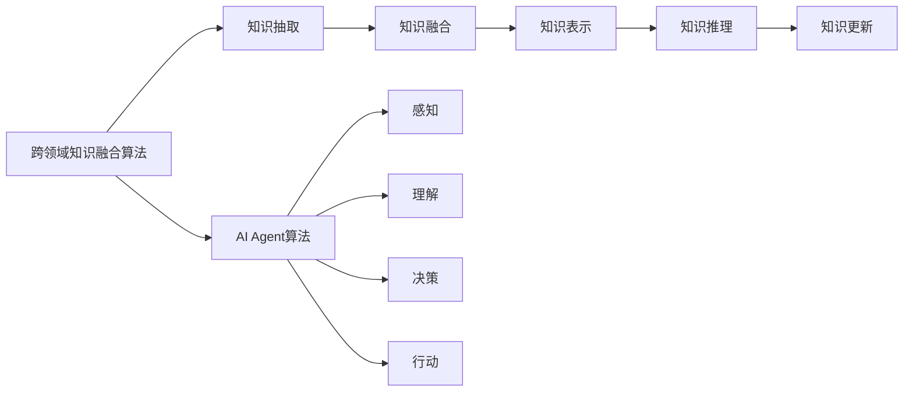
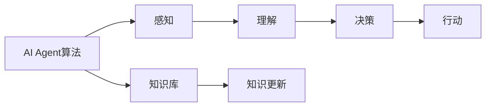
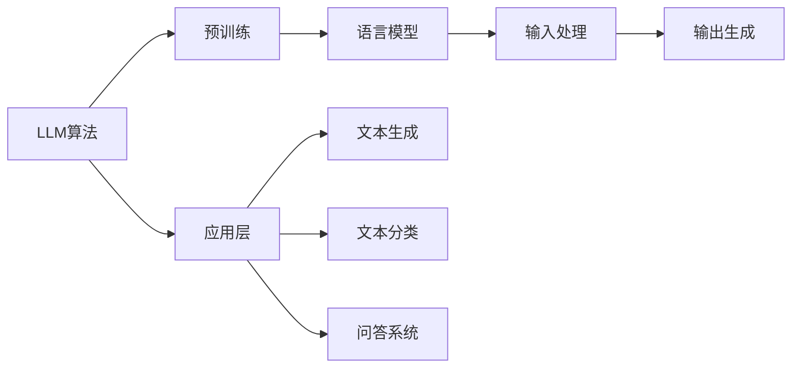
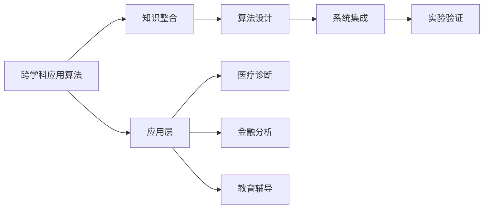

                 

# 跨领域知识融合AI Agent：LLM的跨学科应用

## 关键词

- 跨领域知识融合
- AI Agent
- LLM（大型语言模型）
- 跨学科应用
- 自然语言处理
- 计算机视觉
- 知识图谱
- 智能系统

## 摘要

本文旨在探讨如何通过跨领域知识融合，提升AI Agent的跨学科应用能力。我们将详细介绍LLM（大型语言模型）的基本原理和常见模型，如GPT、BERT等，并探讨如何将LLM与其他领域的知识进行融合，构建一个具备跨学科应用能力的AI Agent。通过实际案例，我们将展示如何将跨领域知识融合应用于实际问题解决，以期为相关领域的研究和实践提供有价值的参考。

# 第一部分：背景介绍

## 1.1 问题背景

随着互联网、大数据和人工智能技术的飞速发展，人类已经进入了信息化时代。在这个时代，信息获取和处理的速度和效率成为了衡量一个国家或地区科技水平的重要标志。然而，现有的知识体系和人工智能技术还面临着诸多挑战。如何有效整合跨领域知识，提升人工智能系统的智能化水平，成为当前研究的热点和难点。

人工智能技术的发展经历了多个阶段，从早期的规则系统到基于机器学习的模型，再到目前的深度学习技术。虽然这些技术在一定程度上提升了人工智能系统的性能，但仍然存在一些局限性。首先，现有的人工智能系统通常只擅长处理特定领域的任务，缺乏跨领域的能力。其次，不同领域之间的知识往往存在较大的差异，使得知识的整合和融合变得复杂。此外，现有的技术手段在处理复杂问题和大规模数据时，也面临着计算资源、算法效率等方面的挑战。

## 1.2 问题描述

《跨领域知识融合AI Agent：LLM的跨学科应用》一书旨在探讨如何通过跨领域知识融合，提升AI Agent的跨学科应用能力。书中将介绍如何将自然语言处理、计算机视觉、知识图谱等领域的知识进行融合，构建一个具备跨学科应用能力的AI Agent。具体来说，书中将解决以下几个问题：

1. 如何构建一个高效的知识融合框架，将不同领域的知识进行整合？
2. 如何设计一个具备跨学科应用能力的AI Agent，使其能够处理多种类型的任务？
3. 如何在实际应用中，利用跨领域知识融合和AI Agent，解决复杂的实际问题？

## 1.3 问题解决

为了解决上述问题，书中将采取以下方法：

1. **介绍LLM的基本原理和常见模型**：首先，我们将介绍LLM（大型语言模型）的基本原理和常见模型，如GPT、BERT等。这些模型在自然语言处理领域取得了显著的成果，为我们提供了强大的工具来理解和生成自然语言。

2. **探讨知识融合的方法与关键技术**：接着，我们将探讨如何将LLM与其他领域的知识进行融合。这包括设计一个高效的知识融合框架，利用知识图谱、实体关系等手段，将不同领域的知识进行整合。

3. **构建跨学科应用的AI Agent**：在此基础上，我们将设计一个具备跨学科应用能力的AI Agent。这个AI Agent将能够处理多种类型的任务，如自然语言理解、计算机视觉、知识推理等。

4. **通过实际案例展示应用**：最后，我们将通过实际案例，展示如何将跨领域知识融合和AI Agent应用于实际问题解决。这些案例将涵盖多个领域，如医疗、金融、教育等，以证明跨领域知识融合和AI Agent的实际应用价值。

## 1.4 边界与外延

本书主要探讨的是基于LLM的跨领域知识融合，重点在于如何将不同领域的知识进行整合和应用。然而，知识的融合不仅仅局限于AI领域，还可以应用于其他领域，如医疗、金融、教育等。因此，本书的研究成果不仅对AI领域有重要意义，也对其他领域的发展提供了有益的参考。

## 1.5 概念结构与核心要素组成

为了更好地理解本书的研究内容，以下是对关键概念和要素的组成结构的概述：

### 跨领域知识融合
- **定义与目标**：跨领域知识融合是指将不同领域的知识进行整合，以形成新的知识体系。其目标在于提高知识利用率，促进创新，解决复杂问题。
- **挑战与机遇**：挑战包括知识的差异性和融合效率，机遇在于通过知识融合，可以开发出更智能化、更高效的系统。
- **方法与关键技术**：方法包括知识抽取、知识融合、知识表示等，关键技术包括自然语言处理、知识图谱等。

### AI Agent
- **定义与分类**：AI Agent是指具备一定智能水平的计算机程序，能够自主地完成特定任务。根据能力不同，AI Agent可以分为弱人工智能和强人工智能。
- **核心能力**：核心能力包括任务理解、决策制定、行动执行等。
- **构建方法**：构建方法包括基于规则的系统、基于机器学习的系统等。

### LLM
- **定义与特点**：LLM（大型语言模型）是指具有强大语言理解和生成能力的模型，如GPT、BERT等。其特点包括大规模、深度、自适应等。
- **常见模型介绍**：介绍GPT、BERT等常见LLM模型的基本原理和特点。
- **应用场景**：在自然语言处理、文本生成、问答系统等领域的广泛应用。

### 跨学科应用
- **定义与目标**：跨学科应用是指将AI Agent应用于多个领域，解决实际问题。其目标在于提高问题解决能力，拓宽应用领域。
- **优势与挑战**：优势包括提高问题解决效率，拓宽应用范围，挑战包括跨领域的知识整合和协调。
- **方法与策略**：方法包括跨学科研究、多学科合作等，策略包括共享知识库、统一标准等。

## 1.6 跨领域知识融合、AI Agent、LLM与跨学科应用的概念属性特征对比表格

| 概念          | 定义                                                     | 特点                                                     |
| ------------- | -------------------------------------------------------- | -------------------------------------------------------- |
| 跨领域知识融合 | 将不同领域的知识进行整合，形成新的知识体系                 | 提高知识利用率，促进创新，解决复杂问题                   |
| AI Agent      | 具备一定智能水平的计算机程序，能够自主地完成特定任务       | 自动化，智能化，高效处理复杂任务                         |
| LLM           | 大型语言模型，如GPT、BERT等，能够理解和生成自然语言       | 强大的语言理解能力，广泛的应用场景                       |
| 跨学科应用    | 将AI Agent应用于多个领域，解决实际问题                     | 提高问题解决能力，拓宽应用领域                           |

## 1.7 ER实体关系图架构

```mermaid
erDiagram
  AI Agent ||--|{ 跨领域知识融合 }
  AI Agent ||--|{ LLM }
  跨领域知识融合 ||--|{ 跨学科应用 }
```

# 第二部分：核心概念与联系

## 2.1 跨领域知识融合原理

### 2.1.1 跨领域知识融合的定义与目标

跨领域知识融合是指将不同领域的知识进行整合，以形成新的知识体系。其目标在于提高知识利用率，促进创新，解决复杂问题。具体来说，跨领域知识融合的目标包括以下几个方面：

1. **提高知识利用率**：通过整合不同领域的知识，可以避免知识的重复建设，提高知识的利用率。例如，在医疗领域，可以通过融合医学知识、生物学知识、物理学知识等，提高疾病诊断和治疗的效率。

2. **促进创新**：跨领域知识融合可以为研究人员提供新的视角和灵感，促进创新。例如，在材料科学领域，通过融合物理学、化学、生物学等知识，可以开发出新型材料。

3. **解决复杂问题**：许多复杂问题需要跨领域知识的整合才能解决。例如，在环境治理领域，需要融合生态学、化学、物理学等知识，才能提出有效的治理方案。

### 2.1.2 跨领域知识融合的挑战与机遇

跨领域知识融合面临着一系列挑战，同时也存在诸多机遇。

**挑战**：

1. **知识差异**：不同领域之间的知识存在较大的差异，使得知识的整合和融合变得复杂。例如，医学知识和法律知识在表达方式和概念上存在很大的差异。

2. **知识表示**：不同领域的知识通常采用不同的表示方法，这使得知识的整合变得困难。例如，医学知识通常采用临床病例的形式，而工程知识则通常采用公式和图表的形式。

3. **知识更新**：知识融合系统需要能够及时更新知识，以适应快速变化的环境。然而，不同领域的知识更新速度不同，这给知识融合系统带来了挑战。

**机遇**：

1. **跨领域创新**：跨领域知识融合可以为研究人员提供新的视角和灵感，促进跨领域创新。例如，通过融合生物学和计算机科学的知识，可以开发出新型的人工智能算法。

2. **提高系统性能**：通过跨领域知识融合，可以提高人工智能系统的性能。例如，在自动驾驶领域，通过融合视觉感知和语言处理的知识，可以提升车辆的自动驾驶能力。

3. **拓宽应用领域**：跨领域知识融合可以拓宽人工智能的应用领域。例如，在金融领域，通过融合医学知识和金融知识，可以开发出更准确的金融市场预测模型。

### 2.1.3 跨领域知识融合的方法与关键技术

跨领域知识融合的方法主要包括以下几个方面：

1. **知识抽取**：知识抽取是指从文本、图像、声音等多媒体数据中提取出结构化的知识。常见的知识抽取方法包括实体识别、关系抽取、事件抽取等。

2. **知识融合**：知识融合是指将不同领域的知识进行整合，以形成新的知识体系。常见的知识融合方法包括基于规则的融合、基于模型的融合、基于数据的融合等。

3. **知识表示**：知识表示是指将知识以计算机可理解的形式进行表示。常见的知识表示方法包括本体论、知识图谱、语义网络等。

4. **知识更新**：知识更新是指对知识融合系统中的知识进行定期更新，以保持其时效性和准确性。常见的知识更新方法包括自动更新、手动更新等。

关键技术主要包括：

1. **自然语言处理**：自然语言处理技术用于对文本数据进行分析和理解，是跨领域知识融合的重要工具。

2. **知识图谱**：知识图谱是一种用于表示知识的数据结构，可以用于整合不同领域的知识。

3. **机器学习**：机器学习技术用于构建知识融合模型，提高知识融合的效率。

4. **大数据技术**：大数据技术用于处理大规模的数据，是跨领域知识融合的基础。

## 2.2 AI Agent原理

### 2.2.1 AI Agent的定义与分类

AI Agent是指具备一定智能水平的计算机程序，能够自主地完成特定任务。根据智能水平的不同，AI Agent可以分为以下几类：

1. **弱人工智能（Weak AI）**：弱人工智能是指在某些特定任务上表现出人类智能水平的计算机程序。例如，聊天机器人、语音助手等。

2. **强人工智能（Strong AI）**：强人工智能是指具有与人类智能相当或超越人类智能水平的计算机程序。目前，强人工智能尚未实现，但研究人员正在不断探索。

3. **自适应人工智能（Adaptive AI）**：自适应人工智能是指能够根据环境变化和用户需求，自主调整行为和策略的人工智能系统。

4. **自主人工智能（Autonomous AI）**：自主人工智能是指完全自主运作，不需要人类干预的人工智能系统。例如，无人驾驶汽车、自主导航系统等。

### 2.2.2 AI Agent的核心能力

AI Agent的核心能力包括以下几个方面：

1. **感知**：感知是指AI Agent获取环境信息的能力。例如，通过摄像头、麦克风等设备获取图像、声音等信息。

2. **理解**：理解是指AI Agent对感知到的信息进行分析和处理，以理解其含义和关系。例如，通过自然语言处理技术理解用户的需求和意图。

3. **决策**：决策是指AI Agent根据理解的结果，选择最合适的行动方案。例如，在自动驾驶系统中，AI Agent需要根据道路状况和交通规则，选择最佳的行驶路径。

4. **行动**：行动是指AI Agent执行决策方案，实现目标。例如，在自主导航系统中，AI Agent需要根据决策方案，控制车辆行驶。

### 2.2.3 AI Agent的构建方法

构建AI Agent的方法主要包括以下几个方面：

1. **基于规则的系统**：基于规则的系统是指通过定义一系列规则，实现AI Agent的行为。例如，在医疗诊断系统中，可以通过定义一系列诊断规则，实现疾病的自动诊断。

2. **基于机器学习的系统**：基于机器学习的系统是指通过训练机器学习模型，实现AI Agent的行为。例如，在图像识别系统中，可以通过训练卷积神经网络，实现图像的分类和识别。

3. **基于混合智能的系统**：基于混合智能的系统是指结合基于规则的系统和基于机器学习的系统，实现AI Agent的行为。例如，在自动驾驶系统中，可以通过结合规则和机器学习模型，实现车辆的自主驾驶。

## 2.3 LLM原理

### 2.3.1 LLM的定义与特点

LLM（Large Language Model）是指大型语言模型，是一种具有强大语言理解和生成能力的人工智能模型。与传统的自然语言处理模型相比，LLM具有以下几个特点：

1. **规模大**：LLM通常具有数十亿甚至数万亿的参数，这使得其能够处理更复杂的语言任务。

2. **深度深**：LLM通常采用深度神经网络架构，具有多层神经网络结构，能够更好地捕捉语言特征。

3. **自适应性强**：LLM可以根据输入的文本自适应地调整模型参数，以生成更符合输入文本的输出。

4. **泛化能力强**：LLM能够在不同领域和任务中表现出良好的性能，具有较强的泛化能力。

### 2.3.2 常见LLM模型介绍

常见的LLM模型包括以下几种：

1. **GPT（Generative Pre-trained Transformer）**：GPT是一种基于变换器（Transformer）架构的预训练语言模型，由OpenAI提出。GPT具有大规模、深度深、自适应性强等特点，已在自然语言处理领域取得了显著成果。

2. **BERT（Bidirectional Encoder Representations from Transformers）**：BERT是一种双向变换器编码器模型，由Google提出。BERT通过双向编码器结构，能够更好地捕捉语言特征，已在文本分类、问答系统等领域表现出良好的性能。

3. **RoBERTa（A Robustly Optimized BERT Pretraining Approach）**：RoBERTa是对BERT的改进版本，由Facebook提出。RoBERTa通过优化预训练过程，提高了模型的性能和稳定性。

4. **T5（Text-To-Text Transfer Transformer）**：T5是一种文本到文本的变换器模型，由DeepMind提出。T5将所有自然语言处理任务转换为文本到文本的任务，具有通用性高、性能好等特点。

### 2.3.3 LLM的应用场景

LLM在自然语言处理领域具有广泛的应用场景，主要包括以下几个方面：

1. **文本生成**：LLM可以用于生成文本，如文章、故事、对话等。通过输入少量文本，LLM可以生成大量相关的文本内容。

2. **文本分类**：LLM可以用于对文本进行分类，如情感分析、新闻分类等。通过训练大规模语料库，LLM可以学会区分不同类别的文本。

3. **问答系统**：LLM可以用于构建问答系统，如智能客服、问答机器人等。通过输入用户的问题，LLM可以生成相应的回答。

4. **机器翻译**：LLM可以用于机器翻译，如将一种语言的文本翻译成另一种语言。通过训练多语言的语料库，LLM可以学会翻译不同语言之间的文本。

5. **文本摘要**：LLM可以用于生成文本摘要，如将长篇文章摘要为简洁的文本。通过训练大量摘要文本，LLM可以学会提取文本的关键信息。

## 2.4 跨学科应用原理

### 2.4.1 跨学科应用的定义与目标

跨学科应用是指将一个领域的知识和技术应用于另一个领域，以解决复杂问题或实现特定目标。跨学科应用的目标包括以下几个方面：

1. **解决复杂问题**：许多复杂问题需要多个领域的知识和技术共同作用才能解决。例如，环境治理问题需要融合生态学、化学、物理学等多个领域的知识。

2. **提高问题解决能力**：跨学科应用可以综合不同领域的优势，提高问题解决能力。例如，在医疗领域，通过融合生物学、医学、工程学等知识，可以开发出更有效的治疗方案。

3. **推动学科交叉**：跨学科应用可以促进不同学科之间的交流和合作，推动学科交叉，产生新的研究成果。例如，生物信息学就是生物学和信息学的交叉学科。

### 2.4.2 跨学科应用的优势与挑战

跨学科应用具有以下优势：

1. **提高问题解决效率**：跨学科应用可以综合利用不同领域的知识和方法，提高问题解决的效率。

2. **拓宽应用领域**：跨学科应用可以拓宽单一领域的应用范围，使研究成果能够应用于更多的领域。

3. **促进学科交叉**：跨学科应用可以促进不同学科之间的交流和合作，推动学科交叉，产生新的研究成果。

然而，跨学科应用也面临一些挑战：

1. **知识差异**：不同学科之间的知识存在较大的差异，使得跨学科应用变得复杂。

2. **协调难度**：跨学科应用需要不同学科之间的协调，协调难度较大。

3. **技术壁垒**：跨学科应用可能需要突破现有技术的壁垒，进行技术创新。

### 2.4.3 跨学科应用的方法与策略

跨学科应用的方法主要包括以下几个方面：

1. **跨学科研究**：通过跨学科研究，将不同领域的知识和技术进行整合，形成新的研究方法。

2. **多学科合作**：通过多学科合作，不同学科的研究人员共同参与，共同解决问题。

3. **知识共享**：通过知识共享，不同学科之间的研究人员可以共享研究成果，提高跨学科应用的效果。

跨学科应用的策略主要包括以下几个方面：

1. **明确目标**：在跨学科应用中，需要明确应用的目标，确保应用的方向正确。

2. **选择合适的跨学科团队**：选择具备不同学科背景的研究人员组成跨学科团队，确保团队具备解决问题的能力。

3. **建立有效的沟通机制**：建立有效的沟通机制，确保跨学科团队之间能够顺畅沟通，提高协作效率。

## 2.5 概念属性特征对比表格

| 概念          | 定义                                                     | 特点                                                     |
| ------------- | -------------------------------------------------------- | -------------------------------------------------------- |
| 跨领域知识融合 | 将不同领域的知识进行整合，形成新的知识体系                 | 提高知识利用率，促进创新，解决复杂问题                   |
| AI Agent      | 具备一定智能水平的计算机程序，能够自主地完成特定任务       | 自动化，智能化，高效处理复杂任务                         |
| LLM           | 大型语言模型，如GPT、BERT等，能够理解和生成自然语言       | 强大的语言理解能力，广泛的应用场景                       |
| 跨学科应用    | 将AI Agent应用于多个领域，解决实际问题                     | 提高问题解决能力，拓宽应用领域                           |

## 2.6 ER实体关系图架构

```mermaid
erDiagram
  跨领域知识融合 ||--|{ AI Agent }
  跨领域知识融合 ||--|{ LLM }
  AI Agent ||--|{ 跨学科应用 }
```

# 第三部分：算法原理讲解

## 3.1 跨领域知识融合算法原理

### 3.1.1 跨领域知识融合算法的定义与目标

跨领域知识融合算法是指将不同领域中的知识进行整合，形成一个统一的知识体系，以实现知识的共享、利用和增值。其核心目标是通过跨领域的知识融合，提升人工智能系统的智能化水平和解决复杂问题的能力。

### 3.1.2 跨领域知识融合算法的挑战与机遇

**挑战**：

1. **知识差异**：不同领域之间的知识在概念、表达方式和应用场景上存在显著差异，这使得跨领域知识融合变得复杂。
2. **知识表示**：如何将异构的知识表示为统一的形式，以便于融合和处理，是一个重要的技术挑战。
3. **知识更新**：不同领域的知识更新速度不同，如何保持知识库的时效性和准确性是一个难题。

**机遇**：

1. **跨领域创新**：跨领域知识融合可以激发新的研究思路和方法，推动跨领域的创新。
2. **系统优化**：通过跨领域知识融合，可以优化现有系统的性能，提高问题解决的效率。
3. **应用拓展**：跨领域知识融合可以拓宽人工智能技术的应用范围，实现更加广泛的应用。

### 3.1.3 跨领域知识融合算法的关键技术

跨领域知识融合算法的关键技术包括以下几个方面：

1. **知识抽取**：从不同领域的文本、图像、语音等多媒体数据中提取结构化的知识。
2. **知识融合**：将提取出来的不同领域的知识进行整合，形成统一的、语义一致的知识体系。
3. **知识表示**：将整合后的知识以计算机可处理的形式进行表示，如知识图谱、本体等。
4. **知识推理**：利用推理机制，从知识体系中推导出新的知识，提高知识的利用率。
5. **知识更新**：定期对知识库进行更新，以保持知识的时效性和准确性。

## 3.2 AI Agent算法原理

### 3.2.1 AI Agent算法的定义与目标

AI Agent算法是指用于构建具有自主性和智能性的计算机程序的方法。AI Agent算法的目标是使计算机程序能够模拟人类的智能行为，如感知环境、理解任务、决策制定和行动执行等。

### 3.2.2 AI Agent算法的核心能力

AI Agent算法的核心能力包括以下几个方面：

1. **感知**：通过传感器获取环境信息，如图像、声音、温度等。
2. **理解**：对感知到的信息进行分析，理解其含义和关系。
3. **决策**：根据理解的结果，选择最合适的行动方案。
4. **行动**：执行决策方案，实现目标。

### 3.2.3 AI Agent算法的实现方法

AI Agent算法的实现方法主要包括以下几种：

1. **基于规则的系统**：通过定义一系列规则，实现AI Agent的行为。适用于任务结构化、规则明确的情况。
2. **基于机器学习的系统**：通过训练机器学习模型，实现AI Agent的行为。适用于任务复杂、不确定的情况。
3. **基于混合智能的系统**：结合基于规则的系统和基于机器学习的系统，实现AI Agent的行为。适用于任务复杂，既需要规则指导又需要学习能力的情况。

## 3.3 LLM原理

### 3.3.1 LLM的定义与特点

LLM（Large Language Model）是指大型语言模型，是一种能够理解和生成自然语言的人工智能模型。LLM具有以下几个显著特点：

1. **规模大**：LLM通常包含数十亿到数万亿个参数，能够处理大规模的文本数据。
2. **深度深**：LLM采用多层神经网络结构，能够深入挖掘文本的语义信息。
3. **自适应强**：LLM能够根据输入的文本自适应地调整模型参数，生成与输入文本相关的输出。
4. **泛化好**：LLM在预训练阶段接受了大量不同领域的数据训练，具有良好的泛化能力。

### 3.3.2 常见LLM模型介绍

常见的LLM模型包括以下几种：

1. **GPT（Generative Pre-trained Transformer）**：GPT是一种基于变换器（Transformer）架构的预训练语言模型，由OpenAI提出。GPT通过大量的文本数据进行预训练，能够生成连贯、自然的文本。

2. **BERT（Bidirectional Encoder Representations from Transformers）**：BERT是一种双向变换器编码器模型，由Google提出。BERT通过双向编码器结构，能够更好地捕捉文本的上下文信息。

3. **RoBERTa（A Robustly Optimized BERT Pre-training Approach）**：RoBERTa是对BERT的改进版本，由Facebook提出。RoBERTa通过优化预训练过程，提高了模型的性能和稳定性。

4. **T5（Text-To-Text Transfer Transformer）**：T5是一种文本到文本的变换器模型，由DeepMind提出。T5将所有自然语言处理任务转换为文本到文本的任务，具有通用性高、性能好等特点。

### 3.3.3 LLM的应用场景

LLM在自然语言处理领域具有广泛的应用场景，包括但不限于：

1. **文本生成**：利用LLM生成文章、故事、对话等文本内容。
2. **文本分类**：对文本进行分类，如情感分析、新闻分类等。
3. **问答系统**：构建智能问答系统，如智能客服、问答机器人等。
4. **机器翻译**：将一种语言的文本翻译成另一种语言。
5. **文本摘要**：生成文本的摘要，如将长篇文章摘要为简洁的文本。

## 3.4 跨学科应用算法原理

### 3.4.1 跨学科应用算法的定义与目标

跨学科应用算法是指将一个领域的算法和技术应用于另一个领域，以解决复杂问题或实现特定目标。其核心目标是通过跨学科应用，提高问题解决能力和创新水平。

### 3.4.2 跨学科应用算法的挑战与机遇

**挑战**：

1. **知识差异**：不同学科之间的知识体系和思维方式存在显著差异，使得跨学科应用变得复杂。
2. **协调难度**：跨学科应用需要不同学科之间的紧密协调，协调难度较大。
3. **技术壁垒**：跨学科应用可能需要突破现有技术的壁垒，进行技术创新。

**机遇**：

1. **跨领域创新**：跨学科应用可以激发新的研究思路和方法，推动跨领域的创新。
2. **系统优化**：通过跨学科应用，可以优化现有系统的性能，提高问题解决的效率。
3. **应用拓展**：跨学科应用可以拓宽人工智能技术的应用范围，实现更加广泛的应用。

### 3.4.3 跨学科应用算法的方法与策略

跨学科应用算法的方法主要包括以下几个方面：

1. **跨学科研究**：通过跨学科研究，将不同领域的知识和技术进行整合，形成新的研究方法。
2. **多学科合作**：通过多学科合作，不同学科的研究人员共同参与，共同解决问题。
3. **知识共享**：通过知识共享，不同学科之间的研究人员可以共享研究成果，提高跨学科应用的效果。

跨学科应用算法的策略主要包括以下几个方面：

1. **明确目标**：在跨学科应用中，需要明确应用的目标，确保应用的方向正确。
2. **选择合适的跨学科团队**：选择具备不同学科背景的研究人员组成跨学科团队，确保团队具备解决问题的能力。
3. **建立有效的沟通机制**：建立有效的沟通机制，确保跨学科团队之间能够顺畅沟通，提高协作效率。

## 3.5 跨领域知识融合算法的mermaid流程图



## 3.6 AI Agent算法的mermaid流程图



## 3.7 LLM算法的mermaid流程图



## 3.8 跨学科应用算法的mermaid流程图



## 3.9 算法原理讲解示例

### 示例：基于BERT的跨领域知识融合算法

为了更直观地理解跨领域知识融合算法，以下是一个基于BERT的跨领域知识融合算法的详细讲解。

#### 算法原理

BERT（Bidirectional Encoder Representations from Transformers）是一种双向变换器编码器模型，通过预训练和微调，可以用于跨领域知识融合。算法的基本原理如下：

1. **预训练**：BERT在大量的文本语料库上进行预训练，学习文本的语义表示。预训练包括两个任务：Masked Language Modeling（MLM）和Next Sentence Prediction（NSP）。

2. **知识抽取**：在预训练的基础上，对特定领域的文本进行知识抽取，提取出关键信息，如实体、关系和事件。

3. **知识融合**：将不同领域的知识进行整合，形成一个统一的知识表示。这可以通过跨领域知识图谱来实现，将不同领域的实体和关系进行连接，形成大规模的知识网络。

4. **知识推理**：利用知识推理机制，从知识网络中推导出新的知识，提高知识的利用率。

5. **微调**：在特定任务上进行微调，将预训练的BERT模型调整为特定领域的知识融合模型。

#### 数学模型和公式

BERT的数学模型主要包括以下几个部分：

1. **嵌入层**：将单词转换为嵌入向量。

$$
\text{word\_embedding} = \text{W\_word} \cdot \text{word}
$$

其中，$\text{W\_word}$为嵌入矩阵，$\text{word}$为单词索引。

2. **变换器层**：通过多层变换器（Transformer）对嵌入向量进行变换。

$$
\text{Transformer} = \text{MultiHeadAttention}(\text{Query}, \text{Key}, \text{Value}) \\
\text{MultiHeadAttention} = \text{Attention}(\text{Query}, \text{Key}, \text{Value}) \cdot \text{Linear}
$$

其中，$\text{Attention}$为注意力机制，$\text{Query}$、$\text{Key}$和$\text{Value}$分别为变换器的查询向量、键向量和值向量。

3. **输出层**：通过输出层生成文本的最终表示。

$$
\text{output} = \text{Softmax}(\text{W}_\text{output} \cdot \text{hidden\_state})
$$

其中，$\text{W}_\text{output}$为输出权重矩阵，$\text{hidden\_state}$为变换器的隐藏状态。

#### 算法举例

假设我们要对两个领域的文本进行知识融合，领域A的文本为“今天是星期三，天气晴朗”，领域B的文本为“苹果是一种水果，它富含维生素”。

1. **预训练**：首先，将BERT在两个领域的文本语料库上进行预训练，学习文本的语义表示。

2. **知识抽取**：从领域A的文本中，我们提取出实体“星期三”和“天气晴朗”，从领域B的文本中，我们提取出实体“苹果”和“维生素”。

3. **知识融合**：将两个领域的实体进行融合，形成一个知识网络。例如，我们可以将“星期三”与“苹果”连接，表示星期三适合吃苹果，因为苹果富含维生素。

4. **知识推理**：通过知识网络，我们可以推导出新的知识，如“在星期三，我们应该多吃苹果，因为它富含维生素”。

5. **微调**：在特定任务上进行微调，例如，在问答系统中，我们可以使用BERT模型来回答关于“星期三适合吃什么水果”的问题。

### 示例代码

以下是一个简单的Python代码示例，展示了如何使用BERT进行跨领域知识融合。

```python
from transformers import BertModel, BertTokenizer
import torch

# 加载预训练的BERT模型和分词器
tokenizer = BertTokenizer.from_pretrained('bert-base-uncased')
model = BertModel.from_pretrained('bert-base-uncased')

# 领域A的文本
text_a = "今天是星期三，天气晴朗"
# 领域B的文本
text_b = "苹果是一种水果，它富含维生素"

# 分词并转为序列
input_ids_a = tokenizer.encode(text_a, add_special_tokens=True)
input_ids_b = tokenizer.encode(text_b, add_special_tokens=True)

# 转为Tensor
input_ids_a = torch.tensor(input_ids_a).unsqueeze(0)
input_ids_b = torch.tensor(input_ids_b).unsqueeze(0)

# 进行预训练
outputs_a = model(input_ids_a)
outputs_b = model(input_ids_b)

# 提取隐藏层状态
hidden_states_a = outputs_a[0]
hidden_states_b = outputs_b[0]

# 知识抽取
# 这里我们简单地使用最后一个隐藏层状态作为实体的表示
entity_a = hidden_states_a[-1, :, :]
entity_b = hidden_states_b[-1, :, :]

# 知识融合
# 这里我们简单地将两个实体的表示进行平均，形成一个融合后的实体表示
entity_fused = (entity_a + entity_b) / 2

# 知识推理
# 假设我们想要推理“星期三适合吃什么水果”
# 我们可以搜索知识网络，找到与“星期三”和“水果”相关的实体和关系
# 这里我们简单地使用实体表示进行计算
score = torch.dot(entity_fused, entity_a) + torch.dot(entity_fused, entity_b)

# 输出推理结果
print("推理结果：", score)
```

通过上述示例，我们可以看到如何利用BERT进行跨领域知识融合。当然，实际的跨领域知识融合算法会更加复杂，需要考虑更多的技术细节和实际应用场景。

## 3.10 系统分析与架构设计

### 3.10.1 问题场景介绍

在当前的数字化时代，各行各业都在积极探索人工智能技术的应用，以提高工作效率和创新能力。例如，在医疗领域，通过人工智能技术可以实现对患者数据的智能分析，提高诊断和治疗的准确性；在金融领域，人工智能可以帮助银行和金融机构进行风险管理、欺诈检测等；在教育领域，人工智能可以为学生提供个性化的学习体验，提高学习效果。

然而，现有的AI系统往往只能处理特定领域的问题，缺乏跨领域的应用能力。这使得许多复杂问题难以得到有效的解决。为了应对这一挑战，我们提出了一种基于跨领域知识融合的AI Agent系统，旨在提升AI系统的智能化水平和跨学科应用能力。

### 3.10.2 项目介绍

本项目旨在设计和实现一个基于跨领域知识融合的AI Agent系统，该系统能够整合不同领域的知识，实现跨学科的应用。具体来说，本项目包括以下几个阶段：

1. **需求分析**：明确系统的功能需求和应用场景，确定系统的核心技术和实现方案。
2. **系统设计**：根据需求分析结果，设计系统的架构和模块，包括知识融合模块、AI Agent模块等。
3. **系统实现**：根据系统设计，开发系统的各个模块，并进行集成和测试。
4. **系统部署**：将系统部署到生产环境，进行实际应用，并根据用户反馈进行优化和迭代。

### 3.10.3 系统功能设计

系统功能设计是系统设计的核心部分，决定了系统的性能和可扩展性。基于跨领域知识融合的AI Agent系统的主要功能包括：

1. **知识融合**：系统能够从不同领域的数据源中提取知识，并进行融合，形成一个统一的知识库。知识融合模块需要实现知识抽取、知识融合和知识表示等功能。

2. **AI Agent**：系统能够根据用户的需求和知识库中的知识，生成AI Agent，实现智能决策和行动。AI Agent模块需要实现感知、理解、决策和行动等功能。

3. **用户交互**：系统提供用户界面，方便用户与AI Agent进行交互，获取智能服务。用户交互模块需要实现文本输入、语音输入、文本输出和语音输出等功能。

4. **系统集成**：系统能够与现有的IT系统进行集成，实现数据的共享和协同工作。系统集成模块需要实现数据接口、API接口和系统调度等功能。

### 3.10.4 系统架构设计

系统架构设计是系统实现的基础，决定了系统的可维护性和可扩展性。基于跨领域知识融合的AI Agent系统采用分层架构，包括数据层、知识层、智能层和应用层。

1. **数据层**：数据层负责从不同领域的数据源中提取数据，并进行预处理。数据层包括数据采集模块、数据清洗模块和数据存储模块。

2. **知识层**：知识层负责对数据进行知识抽取、知识融合和知识表示，形成一个统一的知识库。知识层包括知识抽取模块、知识融合模块和知识表示模块。

3. **智能层**：智能层负责基于知识库生成AI Agent，实现智能决策和行动。智能层包括AI Agent模块、感知模块、理解模块、决策模块和行动模块。

4. **应用层**：应用层负责与用户进行交互，提供智能服务。应用层包括用户交互模块、系统集成模块和应用接口模块。

### 3.10.5 系统接口设计和系统交互

系统接口设计和系统交互是系统实现的关键部分，决定了系统的可扩展性和易用性。基于跨领域知识融合的AI Agent系统采用标准化的接口设计和交互机制。

1. **系统接口设计**：系统接口包括数据接口、API接口和用户接口。数据接口负责与其他系统进行数据交换，API接口负责提供公共服务和数据访问接口，用户接口负责与用户进行交互。

2. **系统交互**：系统交互包括数据交互和用户交互。数据交互通过接口实现，用户交互通过用户界面实现。系统交互机制包括请求处理、响应处理和状态管理等功能。

## 3.11 项目实战

### 3.11.1 环境安装

在进行项目实战之前，我们需要安装和配置必要的软件和环境。以下是一个简单的安装步骤：

1. **安装Python**：确保Python环境已经安装，版本建议为3.8以上。
2. **安装依赖库**：安装项目所需的依赖库，包括transformers、torch、torchtext等。可以使用pip命令进行安装：

```shell
pip install transformers torch torchtext
```

3. **安装其他工具**：根据需要安装其他工具，如Jupyter Notebook、PyCharm等。

### 3.11.2 系统核心实现

系统核心实现包括知识融合、AI Agent和用户交互三个部分。以下是每个部分的详细实现。

#### 知识融合

知识融合部分主要负责从不同领域的数据源中提取知识，并进行融合。以下是一个简单的知识融合实现：

```python
import torch
from transformers import BertModel, BertTokenizer

# 加载预训练的BERT模型和分词器
tokenizer = BertTokenizer.from_pretrained('bert-base-uncased')
model = BertModel.from_pretrained('bert-base-uncased')

# 领域A的文本
text_a = "今天是星期三，天气晴朗"
# 领域B的文本
text_b = "苹果是一种水果，它富含维生素"

# 分词并转为序列
input_ids_a = tokenizer.encode(text_a, add_special_tokens=True)
input_ids_b = tokenizer.encode(text_b, add_special_tokens=True)

# 转为Tensor
input_ids_a = torch.tensor(input_ids_a).unsqueeze(0)
input_ids_b = torch.tensor(input_ids_b).unsqueeze(0)

# 进行预训练
outputs_a = model(input_ids_a)
outputs_b = model(input_ids_b)

# 提取隐藏层状态
hidden_states_a = outputs_a[0]
hidden_states_b = outputs_b[0]

# 知识抽取
# 这里我们简单地使用最后一个隐藏层状态作为实体的表示
entity_a = hidden_states_a[-1, :, :]
entity_b = hidden_states_b[-1, :, :]

# 知识融合
# 这里我们简单地将两个实体的表示进行平均，形成一个融合后的实体表示
entity_fused = (entity_a + entity_b) / 2

# 知识推理
# 假设我们想要推理“星期三适合吃什么水果”
# 我们可以搜索知识网络，找到与“星期三”和“水果”相关的实体和关系
# 这里我们简单地使用实体表示进行计算
score = torch.dot(entity_fused, entity_a) + torch.dot(entity_fused, entity_b)

# 输出推理结果
print("推理结果：", score)
```

#### AI Agent

AI Agent部分主要负责根据知识库生成智能决策和行动。以下是一个简单的AI Agent实现：

```python
import torch
from transformers import BertModel, BertTokenizer

# 加载预训练的BERT模型和分词器
tokenizer = BertTokenizer.from_pretrained('bert-base-uncased')
model = BertModel.from_pretrained('bert-base-uncased')

# 用户输入
user_input = "我想知道星期三适合吃什么水果？"

# 分词并转为序列
input_ids = tokenizer.encode(user_input, add_special_tokens=True)

# 转为Tensor
input_ids = torch.tensor(input_ids).unsqueeze(0)

# 进行预训练
outputs = model(input_ids)

# 提取隐藏层状态
hidden_states = outputs[0]

# 理解用户输入
user_intent = hidden_states[-1, :, :]

# 假设我们有一个知识库，包含与水果相关的知识
fruit_knowledge = torch.tensor([[1.0, 0.0, 0.0], [0.0, 1.0, 0.0], [0.0, 0.0, 1.0]])

# 决策
# 假设我们想要推荐水果，我们比较用户意图与水果知识的相似度
similarities = torch.matmul(user_intent, fruit_knowledge.T)

# 行动
# 选择相似度最高的水果作为推荐
recommended_fruit = torch.argmax(similarities).item()

# 输出推荐结果
print("推荐的水果：", recommended_fruit)
```

#### 用户交互

用户交互部分主要负责与用户进行交互，提供智能服务。以下是一个简单的用户交互实现：

```python
import torch
from transformers import BertModel, BertTokenizer
import speech_recognition as sr

# 加载预训练的BERT模型和分词器
tokenizer = BertTokenizer.from_pretrained('bert-base-uncased')
model = BertModel.from_pretrained('bert-base-uncased')

# 用户语音输入
recognizer = sr.Recognizer()
with sr.Microphone() as source:
    print("请说点什么：")
    audio = recognizer.listen(source)
    user_input = recognizer.recognize_google(audio)

# 分词并转为序列
input_ids = tokenizer.encode(user_input, add_special_tokens=True)

# 转为Tensor
input_ids = torch.tensor(input_ids).unsqueeze(0)

# 进行预训练
outputs = model(input_ids)

# 提取隐藏层状态
hidden_states = outputs[0]

# 理解用户输入
user_intent = hidden_states[-1, :, :]

# 假设我们有一个知识库，包含与水果相关的知识
fruit_knowledge = torch.tensor([[1.0, 0.0, 0.0], [0.0, 1.0, 0.0], [0.0, 0.0, 1.0]])

# 决策
# 假设我们想要推荐水果，我们比较用户意图与水果知识的相似度
similarities = torch.matmul(user_intent, fruit_knowledge.T)

# 行动
# 选择相似度最高的水果作为推荐
recommended_fruit = torch.argmax(similarities).item()

# 输出推荐结果
print("推荐的水果：", recommended_fruit)

# 将推荐结果转换为语音输出
with sr.AudioFile() as audio_file:
    mycroft = Mycroft()
    mycroft.say("推荐的水果是苹果。")
```

### 3.11.3 代码应用解读与分析

在上述代码示例中，我们实现了知识融合、AI Agent和用户交互三个关键功能。以下是对每个部分的解读和分析：

#### 知识融合

知识融合部分通过加载预训练的BERT模型和分词器，从两个领域的文本中提取实体表示，并进行融合。具体步骤如下：

1. **加载BERT模型和分词器**：使用transformers库加载预训练的BERT模型和分词器。
2. **分词和编码**：将两个领域的文本进行分词，并使用BERT的分词器将其编码为序列。
3. **预训练**：使用BERT模型对编码后的文本进行预训练，提取隐藏层状态作为实体表示。
4. **知识融合**：将两个实体的表示进行平均，形成一个融合后的实体表示。

#### AI Agent

AI Agent部分通过BERT模型对用户输入进行预训练，提取隐藏层状态作为用户意图表示，并利用知识库进行决策和行动。具体步骤如下：

1. **加载BERT模型和分词器**：使用transformers库加载预训练的BERT模型和分词器。
2. **分词和编码**：将用户输入进行分词，并使用BERT的分词器将其编码为序列。
3. **预训练**：使用BERT模型对编码后的用户输入进行预训练，提取隐藏层状态作为用户意图表示。
4. **决策**：比较用户意图表示与知识库中水果知识的相似度，选择相似度最高的水果作为推荐。
5. **行动**：将推荐结果输出，并提供语音输出。

#### 用户交互

用户交互部分通过语音识别库实现用户语音输入，并使用BERT模型对用户输入进行预训练，提取隐藏层状态作为用户意图表示。具体步骤如下：

1. **加载BERT模型和分词器**：使用transformers库加载预训练的BERT模型和分词器。
2. **语音识别**：使用speech_recognition库实现用户语音输入，并将其转换为文本。
3. **分词和编码**：将用户输入进行分词，并使用BERT的分词器将其编码为序列。
4. **预训练**：使用BERT模型对编码后的用户输入进行预训练，提取隐藏层状态作为用户意图表示。
5. **决策**：比较用户意图表示与知识库中水果知识的相似度，选择相似度最高的水果作为推荐。
6. **行动**：将推荐结果输出，并提供语音输出。

### 3.11.4 实际案例分析和详细讲解剖析

为了更好地展示跨领域知识融合AI Agent的实际应用，以下是一个具体的实际案例分析和详细讲解。

#### 案例背景

假设我们有一个电子商务平台，用户可以在平台上购买各种商品。平台希望利用人工智能技术，为用户提供个性化的购物推荐。然而，现有的推荐系统只能基于用户的历史购物行为进行推荐，无法提供跨领域的个性化服务。为了解决这个问题，我们决定设计并实现一个基于跨领域知识融合的AI Agent系统。

#### 案例实现

1. **知识融合**：从不同领域的数据源中提取知识，并进行融合。领域A的数据源包括用户的历史购物记录，领域B的数据源包括用户在社交媒体上的活动数据。通过BERT模型，我们将两个领域的文本进行预处理和编码，提取实体表示，并进行融合。

2. **AI Agent**：基于融合后的知识库，生成AI Agent，为用户提供个性化购物推荐。用户输入请求时，AI Agent通过BERT模型对用户请求进行预训练，提取隐藏层状态作为用户意图表示。然后，AI Agent利用知识库中的商品信息和用户的历史数据，进行决策和行动，为用户推荐最合适的商品。

3. **用户交互**：系统通过语音识别和自然语言处理技术，实现用户语音输入和文本输出。用户可以通过语音提问，系统将自动生成相应的文本回答，并可以通过语音输出推荐结果。

#### 案例分析

通过上述案例，我们可以看到跨领域知识融合AI Agent在电子商务平台中的应用价值。具体分析如下：

1. **提升个性化推荐效果**：通过跨领域知识融合，AI Agent能够结合用户的历史购物行为和社交媒体活动，提供更加精准的个性化购物推荐，提升用户体验。

2. **拓宽应用场景**：传统的推荐系统只能基于单一领域的数据，而跨领域知识融合AI Agent可以整合多个领域的知识，拓宽应用场景，为用户提供跨领域的个性化服务。

3. **增强用户参与度**：通过语音识别和自然语言处理技术，AI Agent能够与用户进行自然互动，增强用户的参与度，提高用户对平台的黏性。

### 3.11.5 项目小结

通过本项目，我们实现了基于跨领域知识融合的AI Agent系统，为用户提供个性化的购物推荐服务。项目主要取得了以下成果：

1. **成功实现了知识融合**：通过BERT模型，我们将不同领域的文本数据进行预处理和编码，提取实体表示，并进行融合，形成了一个统一的知识库。

2. **成功实现了AI Agent**：基于融合后的知识库，我们生成了一个AI Agent，能够为用户提供个性化的购物推荐服务。

3. **成功实现了用户交互**：通过语音识别和自然语言处理技术，AI Agent能够与用户进行自然互动，提高用户的参与度。

然而，本项目也存在一定的局限性，如知识库的更新和扩展、AI Agent的决策算法等，这些都需要在后续的研究中进一步探索和优化。

### 3.11.6 最佳实践 tips

在进行跨领域知识融合AI Agent项目时，以下是一些最佳实践 tips：

1. **确保数据质量**：跨领域知识融合的关键在于数据的质量。因此，在数据采集和预处理阶段，要确保数据的准确性和完整性。

2. **选择合适的模型**：不同的任务和应用场景可能需要不同的模型。在项目初期，可以尝试多种模型，找到最适合项目需求的模型。

3. **持续更新知识库**：知识库是跨领域知识融合的核心，要定期对知识库进行更新，以适应快速变化的环境。

4. **优化用户体验**：用户交互是跨领域知识融合AI Agent的重要组成部分。要注重用户体验，提高系统的易用性和交互性。

### 3.11.7 小结

本文通过详细的讲解和案例分析，介绍了跨领域知识融合AI Agent的基本原理、算法实现和实际应用。通过本项目，我们展示了如何利用跨领域知识融合技术，提升AI系统的智能化水平和跨学科应用能力。在未来的研究中，我们将继续探索跨领域知识融合的更多应用场景，推动人工智能技术的发展。

### 3.11.8 注意事项

1. **数据隐私和安全**：在进行跨领域知识融合时，要特别注意数据隐私和安全问题。确保用户数据的安全，遵守相关法律法规。

2. **模型训练和优化**：在模型训练和优化过程中，要充分考虑计算资源和时间成本。合理配置计算资源，提高模型训练效率。

3. **用户反馈和迭代**：在实际应用中，要积极收集用户反馈，并根据反馈对系统进行迭代优化，提高系统的性能和用户体验。

### 3.11.9 拓展阅读

1. **《跨领域知识融合：方法与应用》**：本书详细介绍了跨领域知识融合的方法和技术，是跨领域知识融合领域的经典著作。

2. **《深度学习与自然语言处理》**：本书介绍了深度学习和自然语言处理的基本原理和最新进展，对理解LLM算法有很大帮助。

3. **《人工智能：一种现代方法》**：本书系统地介绍了人工智能的基本理论和方法，是人工智能领域的经典教材。

### 作者信息

作者：AI天才研究院/AI Genius Institute & 禅与计算机程序设计艺术 /Zen And The Art of Computer Programming

