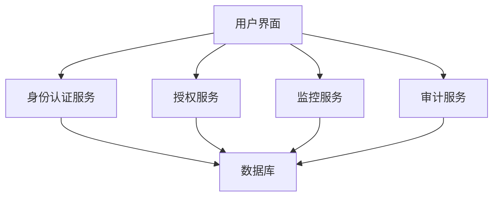
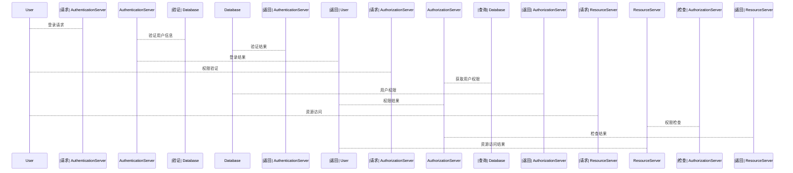
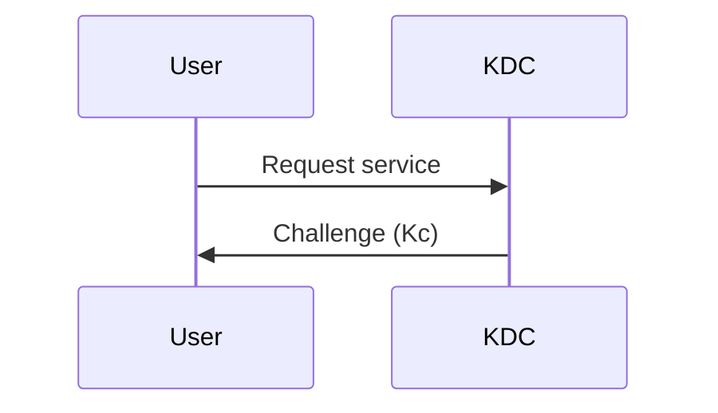
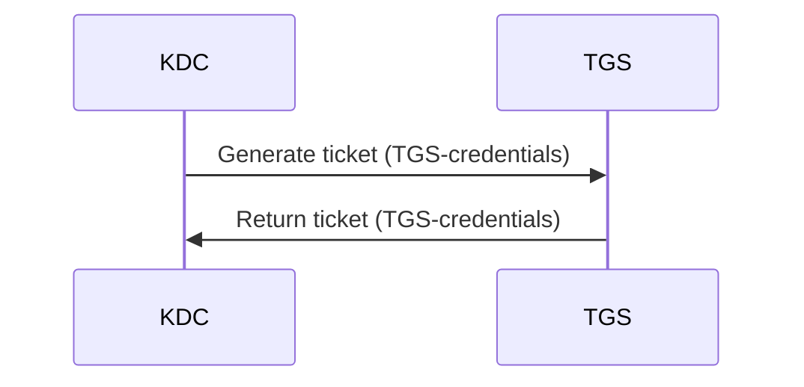
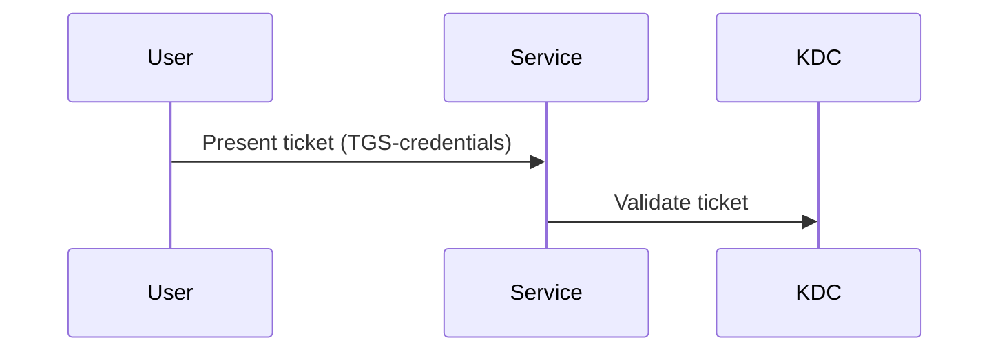
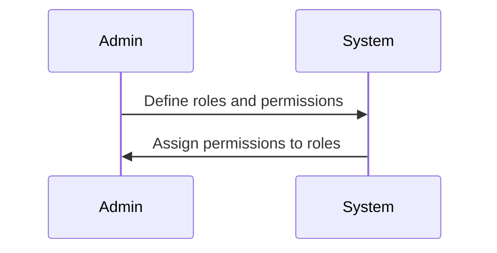
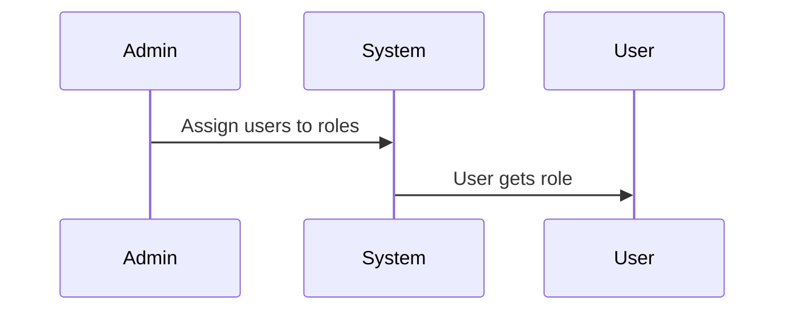
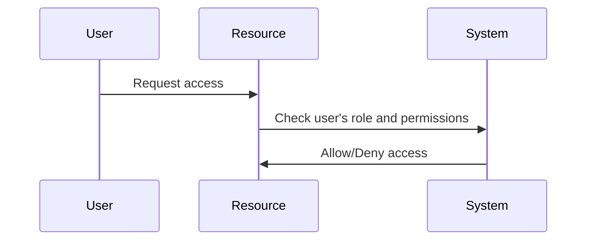

                 


### 身份认证与访问控制系统设计

> 关键词：身份认证、访问控制、系统设计、安全、权限管理

> 摘要：本文旨在探讨身份认证与访问控制系统设计的关键要素、方法和技术。通过深入分析身份认证与访问控制的基本概念、设计原则、系统组件、实战案例和最佳实践，帮助读者全面理解并掌握该领域的设计要点和实现方法。

----------------------------------------------------------------

# 身份认证与访问控制系统设计

## 引言

### 1.1 身份认证与访问控制的背景

身份认证与访问控制是信息安全领域的核心组成部分，对于保护信息系统和数据的安全至关重要。随着信息技术的快速发展，身份认证与访问控制系统在企业、政府、金融机构等领域得到广泛应用。本章节将介绍身份认证与访问控制系统的基本概念、发展历程及其在现代信息安全体系中的重要性。

### 1.2 本文目的与结构

本文旨在为读者提供身份认证与访问控制系统设计的基本理论和实践方法。通过本文的阅读，读者将能够：

- 理解身份认证与访问控制的基本概念和技术；
- 掌握系统设计的原则和最佳实践；
- 学习实战案例，加深对系统设计的理解；
- 获得最佳实践建议，为实际项目提供指导。

本文结构如下：

1. 引言：介绍身份认证与访问控制系统设计的背景和本文目的。
2. 基础理论：阐述身份认证与访问控制的基本概念和技术。
3. 设计原则：介绍系统设计时应遵循的原则和最佳实践。
4. 系统组件：详细讨论系统组件的设计与实现。
5. 实战案例：分析实际案例，展示系统设计与应用。
6. 最佳实践：总结最佳实践，为实际操作提供指导。
7. 结论：回顾全文内容，展望未来发展方向。

----------------------------------------------------------------

## 基础理论

### 2.1 身份认证概述

#### 2.1.1 定义与目的

身份认证是指验证用户身份的过程，确保只有授权用户能够访问系统资源和数据。身份认证的目的是防止未授权访问，保护系统和数据的安全。

#### 2.1.2 类型与方法

身份认证可以采用多种类型和方法，包括：

- **密码认证**：用户通过输入密码进行身份验证。
- **生物识别认证**：通过指纹、面部识别、虹膜扫描等生物特征进行身份验证。
- **双因素认证**：结合密码和生物识别等多种认证方式。
- **令牌认证**：使用动态令牌生成器（如OTP）进行身份验证。

#### 2.1.3 技术与应用

常见身份认证技术包括：

- **Kerberos**：一种基于票据的认证协议。
- **RADIUS**：远程用户拨号认证服务。
- **OAuth**：开放授权协议，用于第三方应用访问用户资源。

### 2.2 访问控制基础

#### 2.2.1 定义与目的

访问控制是指限制和监控用户对系统资源和数据的访问权限，确保只有授权用户能够访问特定的资源和执行特定的操作。

#### 2.2.2 模型与策略

访问控制可以采用多种模型和策略，包括：

- **访问控制列表（ACL）**：基于用户和资源的访问控制列表。
- **基于角色的访问控制（RBAC）**：基于用户角色进行访问控制。
- **基于属性的访问控制（ABAC）**：基于用户属性和资源属性的访问控制。

#### 2.2.3 技术与应用

常见访问控制技术包括：

- **SELinux**：安全增强型Linux。
- **SAML**：安全断言标记语言。
- **XACML**：访问控制标记语言。

----------------------------------------------------------------

## 设计原则

### 3.1 系统设计原则

在设计和实现身份认证与访问控制系统时，应遵循以下原则：

#### 3.1.1 安全性原则

确保系统具备足够的安全性，防止未经授权的访问和攻击。关键措施包括：

- 加密存储用户密码和敏感数据。
- 采用多因素认证提高安全性。
- 实施入侵检测和防范措施。

#### 3.1.2 可扩展性原则

系统应具备良好的可扩展性，能够适应业务需求和规模的扩展。关键措施包括：

- 采用模块化设计，便于扩展和更新。
- 选择可扩展的技术和框架。
- 设计灵活的权限管理机制。

#### 3.1.3 用户友好的界面

系统应提供用户友好的界面，便于用户使用和管理。关键措施包括：

- 界面设计简洁直观。
- 提供清晰的错误信息和提示。
- 提供自定义和个性化设置。

### 3.2 最佳实践

在身份认证与访问控制系统设计中，最佳实践包括：

- 使用强密码策略。
- 实施访问日志记录和审计。
- 定期进行安全评估和漏洞修复。
- 提供用户培训和指导。

----------------------------------------------------------------

## 系统组件

### 4.1 用户身份认证组件设计

用户身份认证组件是身份认证与访问控制系统的核心部分。其设计应考虑以下要素：

#### 4.1.1 用户身份验证

用户身份验证是用户访问系统的第一步，包括以下步骤：

1. 用户输入用户名和密码。
2. 系统验证用户名和密码的正确性。
3. 用户身份验证通过后，系统生成会话令牌。

#### 4.1.2 多因素认证

多因素认证可以提高系统的安全性，常见的方法包括：

1. 生物识别认证：指纹、面部识别、虹膜扫描等。
2. 令牌认证：动态令牌生成器（如OTP）。
3. 一次性密码：使用第三方认证服务生成。

#### 4.1.3 会话管理

会话管理是确保用户在系统中安全地执行操作的关键。关键措施包括：

1. 会话超时：设置合理的会话超时时间。
2. 会话加密：使用HTTPS等加密协议保护会话数据。
3. 会话审计：记录会话创建、注销和操作日志。

### 4.2 访问控制组件设计

访问控制组件是确保用户只能访问授权资源的机制。其设计应考虑以下要素：

#### 4.2.1 权限管理

权限管理是访问控制的核心，关键措施包括：

1. 用户角色定义：根据业务需求定义用户角色。
2. 权限分配：为每个角色分配相应的权限。
3. 权限验证：在用户执行操作时验证其权限。

#### 4.2.2 策略执行

策略执行是确保访问控制规则得到执行的关键。关键措施包括：

1. 策略定义：根据业务需求定义访问控制策略。
2. 策略匹配：在用户请求资源时，匹配相应的策略。
3. 策略执行：根据策略决定用户是否可以访问资源。

#### 4.2.3 审计日志

审计日志是监控和追踪用户访问行为的重要工具。关键措施包括：

1. 记录访问日志：记录用户访问资源的详细信息。
2. 审计报告：定期生成审计报告，分析用户访问行为。
3. 异常检测：检测并报告异常访问行为。

----------------------------------------------------------------

## 实战案例

### 5.1 案例背景

某企业需要设计一个身份认证与访问控制系统，以保护其内部数据和关键业务流程。系统要求包括用户身份认证、权限管理、多因素认证、会话管理和审计日志等功能。

### 5.2 系统设计

系统设计主要包括以下模块：

1. **用户身份认证模块**：实现用户身份验证、多因素认证和会话管理。
2. **权限管理模块**：实现角色定义、权限分配和策略执行。
3. **审计日志模块**：实现访问日志记录和审计报告生成。

#### 5.2.1 用户身份认证模块设计

1. **用户注册**：用户通过注册表单提交用户名、密码和电子邮件等信息。
2. **用户登录**：用户输入用户名和密码进行身份验证。
3. **多因素认证**：在用户登录时，采用双因素认证提高安全性。
4. **会话管理**：系统生成会话令牌，并在会话超时时注销会话。

#### 5.2.2 权限管理模块设计

1. **角色定义**：根据业务需求定义用户角色，如管理员、普通用户等。
2. **权限分配**：为每个角色分配相应的权限，如查看、编辑、删除等。
3. **权限验证**：在用户请求访问资源时，验证其权限。

#### 5.2.3 审计日志模块设计

1. **访问日志记录**：记录用户访问资源的详细信息，如访问时间、访问URL、用户操作等。
2. **审计报告生成**：定期生成审计报告，分析用户访问行为。
3. **异常检测**：检测并报告异常访问行为，如频繁的登录尝试失败等。

### 5.3 实施与效果评估

系统实施后，经过一系列测试和评估，结果显示：

1. 用户身份认证模块可以有效防止未经授权的访问。
2. 权限管理模块能够确保用户只能访问授权资源。
3. 审计日志模块可以提供详细的访问记录和异常报告，有助于安全监控和问题追踪。

系统运行稳定，满足企业信息安全需求。

----------------------------------------------------------------

## 最佳实践

### 6.1 系统部署与维护

在系统部署和维护过程中，应遵循以下最佳实践：

- **部署前准备**：确保服务器和网络环境安全可靠。
- **定期备份**：定期备份数据和系统配置。
- **安全加固**：对系统进行安全加固，防止潜在漏洞。
- **监控与告警**：监控系统运行状态，及时响应异常情况。

### 6.2 用户管理

在用户管理方面，应遵循以下最佳实践：

- **严格权限管理**：确保用户只能访问授权资源。
- **用户培训**：为用户提供安全意识和操作培训。
- **密码策略**：实施强密码策略，定期更改密码。
- **用户审计**：定期审计用户操作记录，确保安全合规。

### 6.3 安全监控

在安全监控方面，应遵循以下最佳实践：

- **日志分析**：分析访问日志和审计日志，识别潜在的安全威胁。
- **异常检测**：使用机器学习等技术进行异常检测。
- **应急响应**：制定应急预案，确保在发生安全事件时能够快速响应。

----------------------------------------------------------------

## 结论

本文详细阐述了身份认证与访问控制系统设计的关键要素、方法和技术。通过深入分析基础理论、设计原则、系统组件、实战案例和最佳实践，读者可以全面理解身份认证与访问控制系统的设计要点和实现方法。未来，随着信息技术的不断发展，身份认证与访问控制系统将继续发挥重要作用，为信息安全提供有力保障。

## 参考文献

1. Andrew S. Tanenbaum, Albert S. Woodhull. "Computer Networks." 6th Edition, Pearson Education, 2014.
2. "The Linux Programming Interface." Michael Kerrisk, No Starch Press, 2010.
3. "Information Security Management Handbook, Third Edition." Harold F. Tipton, Michael E. Goul, Information Systems Audit and Control Association, 2007.
4. "Principles of Secure Software Development." Mark L. Harris, Information System Security Certification Consortium (ISC)², 2007.

## 作者信息

作者：AI天才研究院/AI Genius Institute & 禅与计算机程序设计艺术 /Zen And The Art of Computer Programming。本文旨在为读者提供有价值的技术分享和思考，希望对您有所帮助。如需进一步了解相关技术，请关注我们的公众号或网站。如果您有任何疑问或建议，欢迎在评论区留言，我们将尽快回复您。

----------------------------------------------------------------

# 《身份认证与访问控制系统设计》详细内容

## 引言

### 1.1 身份认证与访问控制的背景

身份认证与访问控制是信息安全领域的核心组成部分，它们在保护信息系统和数据的安全方面发挥着至关重要的作用。随着信息技术的飞速发展，企业、政府、金融机构等各个领域对信息安全的需求日益增长，身份认证与访问控制系统的重要性也愈发凸显。

身份认证（Authentication）是指验证用户身份的过程，目的是确保只有授权用户才能访问系统和数据。访问控制（Access Control）则是限制和监控用户对系统资源和数据的访问权限，确保用户只能访问授权的资源，执行授权的操作。这两者在信息安全体系中相辅相成，共同构成了一道坚固的安全防线。

身份认证技术的发展始于20世纪60年代，早期主要采用用户名和密码作为认证手段。随着计算机和网络技术的发展，身份认证技术逐渐多样化，包括生物识别、智能卡、双因素认证等。访问控制技术则经历了从最初的访问控制列表（ACL）到基于角色的访问控制（RBAC）、基于属性的访问控制（ABAC）等模型的演变。

在现代信息安全体系中，身份认证与访问控制系统的应用范围非常广泛。例如，在企业内部，身份认证与访问控制系统用于保护企业网络、数据库、文件服务器等关键资源；在政府机构中，用于保护敏感数据和关键业务流程；在金融机构中，用于保护客户信息和金融交易等。

### 1.2 本文目的与结构

本文旨在为读者提供身份认证与访问控制系统设计的基本理论和实践方法。通过本文的阅读，读者将能够：

1. **理解身份认证与访问控制的基本概念和技术**：本文将详细介绍身份认证与访问控制的基本概念、类型、方法和相关技术。
2. **掌握系统设计的原则和最佳实践**：本文将阐述在设计和实现身份认证与访问控制系统时，应遵循的原则和最佳实践，以确保系统的高安全性、可扩展性和用户友好性。
3. **学习实战案例，加深对系统设计的理解**：本文将通过分析实际案例，展示身份认证与访问控制系统的设计与应用，帮助读者更好地理解系统设计的方法和技巧。
4. **获得最佳实践建议，为实际项目提供指导**：本文将总结实际操作中的经验和教训，为读者提供最佳实践建议，帮助其在实际项目中实现有效的身份认证与访问控制。

本文的结构如下：

1. **引言**：介绍身份认证与访问控制系统设计的重要性、本文目的和结构。
2. **基础理论**：阐述身份认证与访问控制的基本概念、类型、方法和相关技术。
3. **设计原则**：介绍系统设计时应遵循的原则和最佳实践。
4. **系统组件**：详细讨论系统组件的设计与实现。
5. **实战案例**：分析实际案例，展示系统设计与应用。
6. **最佳实践**：总结最佳实践，为实际操作提供指导。
7. **结论**：回顾全文内容，展望未来发展方向。

通过本文的阅读，读者将能够全面了解身份认证与访问控制系统设计的关键要素、方法和技术，为实际项目提供有效的指导和参考。

## 基础理论

### 2.1 身份认证概述

#### 2.1.1 定义与目的

身份认证是指验证用户身份的过程，确保只有授权用户能够访问系统和数据。身份认证的目的是防止未授权访问，保护系统和数据的安全。在身份认证过程中，系统会根据用户提供的身份信息（如用户名、密码、生物特征等）来验证用户的合法性。

身份认证是访问控制的前提和基础。只有通过身份认证，用户才能获得访问系统和数据的权限。因此，身份认证的准确性和效率对于整个信息安全体系至关重要。

#### 2.1.2 类型与方法

身份认证可以采用多种类型和方法，以下是一些常见的身份认证类型和方法：

1. **密码认证**：
   - **定义**：密码认证是最常见的身份认证方式，用户通过输入预设的密码来验证身份。
   - **优点**：简单易用，成本低。
   - **缺点**：密码容易被破解或泄露，安全性较低。

2. **生物识别认证**：
   - **定义**：生物识别认证是通过用户的生物特征（如指纹、面部识别、虹膜扫描、声纹等）来验证身份。
   - **优点**：难以伪造，安全性较高。
   - **缺点**：设备成本较高，识别速度较慢。

3. **双因素认证**：
   - **定义**：双因素认证（Two-Factor Authentication，2FA）是结合两种不同的认证方式（如密码和生物识别）来验证身份。
   - **优点**：安全性较高，即使密码泄露，攻击者也无法访问系统。
   - **缺点**：使用复杂，用户体验较差。

4. **令牌认证**：
   - **定义**：令牌认证是通过动态生成的令牌来验证身份。
   - **优点**：安全性较高，令牌无法重复使用。
   - **缺点**：令牌管理复杂，设备依赖性较高。

5. **基于证书的认证**：
   - **定义**：基于证书的认证是通过数字证书来验证身份。
   - **优点**：安全性较高，证书具有法律效力。
   - **缺点**：证书管理复杂，成本较高。

#### 2.1.3 技术与应用

常见的身份认证技术包括：

1. **Kerberos**：
   - **定义**：Kerberos是一种基于票据的认证协议，主要用于网络环境下的身份认证。
   - **应用**：广泛应用于企业、大学等内部网络。

2. **RADIUS**：
   - **定义**：RADIUS（Remote Authentication Dial-In User Service）是一种远程用户拨号认证服务，用于集中管理和认证远程访问用户。
   - **应用**：广泛应用于无线网络和VPN等场景。

3. **OAuth**：
   - **定义**：OAuth是一种开放授权协议，用于第三方应用访问用户资源。
   - **应用**：广泛应用于社交网络、移动应用等场景。

### 2.2 访问控制基础

#### 2.2.1 定义与目的

访问控制是指限制和监控用户对系统资源和数据的访问权限，确保用户只能访问授权的资源，执行授权的操作。访问控制的目的是防止未授权访问，保护系统和数据的安全。

访问控制通常基于用户身份、角色、权限和资源属性等因素进行决策。访问控制可以采用多种模型和策略，如访问控制列表（ACL）、基于角色的访问控制（RBAC）、基于属性的访问控制（ABAC）等。

#### 2.2.2 模型与策略

访问控制可以采用多种模型和策略，以下是一些常见的访问控制模型和策略：

1. **访问控制列表（ACL）**：
   - **定义**：ACL是一种基于用户和资源的访问控制列表，用于定义用户对资源的访问权限。
   - **优点**：简单易用，灵活性强。
   - **缺点**：权限管理复杂，不易扩展。

2. **基于角色的访问控制（RBAC）**：
   - **定义**：RBAC是一种基于角色的访问控制模型，用户被分配到不同的角色，每个角色具有相应的权限。
   - **优点**：简化权限管理，易于扩展。
   - **缺点**：角色和权限的分配可能过于复杂。

3. **基于属性的访问控制（ABAC）**：
   - **定义**：ABAC是一种基于属性的访问控制模型，用户访问资源的权限取决于用户属性、资源属性和环境属性。
   - **优点**：灵活性高，适用于复杂场景。
   - **缺点**：实现复杂，性能较低。

#### 2.2.3 技术与应用

常见的访问控制技术包括：

1. **SELinux**：
   - **定义**：SELinux（Security-Enhanced Linux）是一种基于角色的访问控制机制，用于保护Linux系统的安全。
   - **应用**：广泛应用于Linux服务器和容器环境中。

2. **SAML**：
   - **定义**：SAML（Security Assertion Markup Language）是一种基于XML的语言，用于在分布式环境中进行身份认证和授权。
   - **应用**：广泛应用于企业、大学等内部网络。

3. **XACML**：
   - **定义**：XACML（eXtensible Access Control Markup Language）是一种基于XML的语言，用于定义访问控制策略。
   - **应用**：广泛应用于企业、政府等组织和领域。

通过了解身份认证与访问控制的基本概念、类型、方法和相关技术，读者可以更好地理解身份认证与访问控制系统设计的关键要素，为实际项目提供有效的指导和参考。

## 设计原则

### 3.1 系统设计原则

在设计和实现身份认证与访问控制系统时，应遵循以下原则，以确保系统的安全性、可扩展性和用户友好性。

#### 3.1.1 安全性原则

确保系统具备足够的安全性，防止未经授权的访问和攻击。以下措施有助于提高系统的安全性：

1. **加密存储用户密码和敏感数据**：
   - 使用强加密算法（如SHA-256、bcrypt等）存储用户密码。
   - 对敏感数据进行加密存储，如SSL/TLS加密传输。

2. **多因素认证**：
   - 采用多因素认证（如密码+手机验证码、密码+生物识别等）提高系统的安全性。

3. **访问日志记录和审计**：
   - 记录用户登录、访问资源和操作行为的日志。
   - 定期审计日志，发现潜在的安全威胁和异常行为。

4. **入侵检测和防范**：
   - 采用入侵检测系统（IDS）和入侵防范系统（IPS）监控和防止恶意攻击。

#### 3.1.2 可扩展性原则

系统应具备良好的可扩展性，能够适应业务需求和规模的扩展。以下措施有助于提高系统的可扩展性：

1. **模块化设计**：
   - 将系统划分为多个模块，每个模块负责不同的功能。
   - 各模块之间采用标准化接口进行通信，便于扩展和更新。

2. **选择可扩展的技术和框架**：
   - 选择支持高并发和可扩展性的技术和框架，如微服务架构、NoSQL数据库等。

3. **负载均衡**：
   - 采用负载均衡技术，如Nginx、HAProxy等，确保系统在高并发访问下保持稳定。

4. **水平扩展**：
   - 设计系统时考虑水平扩展，如通过增加节点来提高系统的处理能力。

#### 3.1.3 用户友好性原则

系统应提供用户友好的界面和操作体验，以提高用户满意度。以下措施有助于提高系统的用户友好性：

1. **简洁直观的界面设计**：
   - 界面设计简洁直观，易于用户操作和理解。

2. **清晰的错误信息和提示**：
   - 提供清晰的错误信息和提示，帮助用户快速解决问题。

3. **自定义和个性化设置**：
   - 允许用户自定义界面布局、主题和功能，满足个性化需求。

4. **用户培训和指导**：
   - 提供用户操作手册、视频教程和在线支持，帮助用户快速上手。

#### 3.1.4 可维护性原则

系统应具备良好的可维护性，便于系统的升级和维护。以下措施有助于提高系统的可维护性：

1. **规范的编码和文档**：
   - 编写规范、可读性高的代码，并配以详细的文档。

2. **自动化测试**：
   - 采用自动化测试工具进行单元测试、集成测试和系统测试，确保系统稳定可靠。

3. **监控与告警**：
   - 监控系统运行状态，及时发现问题并进行告警。

4. **备份与恢复**：
   - 定期备份数据和系统配置，确保在发生故障时能够快速恢复。

通过遵循以上设计原则，可以确保身份认证与访问控制系统的高安全性、可扩展性和用户友好性，为企业和用户提供可靠的保障。

### 3.2 最佳实践

在设计和实现身份认证与访问控制系统时，最佳实践有助于提高系统的安全性和可靠性。以下是一些重要的最佳实践：

#### 3.2.1 使用强密码策略

1. **密码复杂度要求**：
   - 要求用户设置复杂度较高的密码，如包含字母、数字和特殊字符。
   - 密码长度至少为8位。

2. **密码过期策略**：
   - 定期强制用户更改密码，如每3-6个月更换一次。
   - 禁止用户使用过去的密码。

3. **密码加密存储**：
   - 使用强加密算法（如SHA-256、bcrypt等）存储密码。
   - 加密存储密码时，加入随机盐值，防止彩虹表攻击。

#### 3.2.2 实施访问日志记录和审计

1. **日志记录**：
   - 记录用户的登录、访问资源和操作行为的详细日志。
   - 日志内容应包括用户名、登录时间、登录IP、访问URL、操作类型等。

2. **日志存储**：
   - 将日志存储在安全的位置，如加密文件系统或数据库。
   - 定期备份日志，防止数据丢失。

3. **日志审计**：
   - 定期审计日志，分析用户访问行为，识别潜在的安全威胁和异常行为。
   - 对重大安全事件进行详细记录和报告。

#### 3.2.3 定期进行安全评估和漏洞修复

1. **安全评估**：
   - 定期对系统进行安全评估，发现潜在的安全漏洞和风险。
   - 采用自动化工具和人工审核相结合的方式，提高评估的准确性和效率。

2. **漏洞修复**：
   - 及时修复发现的安全漏洞，确保系统安全。
   - 对高危漏洞进行重点修复，防止被攻击。

3. **安全培训**：
   - 定期为员工提供安全培训，提高员工的安全意识和防范能力。

#### 3.2.4 提供用户培训和指导

1. **用户培训**：
   - 为用户提供操作手册、视频教程和在线支持，帮助用户快速上手。
   - 强调安全意识，教育用户如何防范钓鱼攻击、恶意软件等。

2. **用户指导**：
   - 在系统中提供详细的操作指引和错误提示，帮助用户解决问题。
   - 设立用户反馈渠道，及时收集用户意见和需求。

通过遵循以上最佳实践，可以显著提高身份认证与访问控制系统的安全性和可靠性，为企业和用户提供更好的保障。

## 系统组件

### 4.1 用户身份认证组件设计

用户身份认证组件是身份认证与访问控制系统的核心部分，其设计直接影响到系统的安全性和用户体验。用户身份认证组件通常包括用户注册、登录、多因素认证和会话管理等功能。

#### 4.1.1 用户注册

用户注册是用户首次使用系统的第一步，需要用户提供基本信息，如用户名、密码、电子邮件等。在用户注册过程中，系统应确保以下要点：

1. **用户信息验证**：对用户输入的信息进行验证，确保用户名和电子邮件地址的唯一性。
2. **密码复杂度检查**：确保用户设置的密码符合复杂度要求，如长度、包含字符类型等。
3. **加密存储**：将用户密码使用强加密算法（如SHA-256、bcrypt等）加密存储，加入随机盐值，防止彩虹表攻击。

#### 4.1.2 用户登录

用户登录是用户访问系统的第一步，需要用户输入用户名和密码进行身份验证。在用户登录过程中，系统应确保以下要点：

1. **身份验证**：对用户输入的用户名和密码进行验证，确保用户身份的合法性。
2. **密码加密比较**：将用户输入的密码与数据库中存储的加密密码进行加密后的比较，确保密码匹配。
3. **多因素认证**：在用户登录时，可结合使用多因素认证（如手机验证码、生物识别等），提高系统的安全性。

#### 4.1.3 多因素认证

多因素认证是提高系统安全性的有效手段，通过结合两种或两种以上的认证方式来验证用户身份。常见的多因素认证方式包括：

1. **手机验证码**：用户在登录时输入手机号，系统发送验证码至手机，用户输入验证码完成登录。
2. **生物识别**：使用指纹、面部识别、虹膜扫描等生物特征进行身份验证。
3. **令牌认证**：使用动态令牌生成器（如OTP）进行身份验证。

多因素认证应结合系统的安全需求和用户体验，选择合适的认证方式。

#### 4.1.4 会话管理

会话管理是确保用户在系统中安全地执行操作的关键。会话管理包括以下要点：

1. **会话超时**：设置合理的会话超时时间，如30分钟，以防止用户长时间未操作导致的安全风险。
2. **会话加密**：使用HTTPS等加密协议保护会话数据，防止数据在传输过程中被窃取。
3. **会话审计**：记录会话创建、注销和操作日志，便于安全监控和问题追踪。

通过设计完善的用户身份认证组件，可以确保系统的高安全性、稳定性和用户友好性，为企业和用户提供可靠的保障。

### 4.2 访问控制组件设计

访问控制组件是身份认证与访问控制系统的核心部分，用于确保用户只能访问授权的资源，执行授权的操作。访问控制组件的设计直接影响到系统的安全性、灵活性和可扩展性。以下是访问控制组件设计的几个关键要素：

#### 4.2.1 权限管理

权限管理是访问控制的基础，用于定义和分配用户对资源的访问权限。权限管理应确保以下要点：

1. **用户角色定义**：根据业务需求定义用户角色，如管理员、普通用户、访客等。每个角色对应一组权限。
2. **权限分配**：为每个用户或角色分配相应的权限，确保用户只能访问授权的资源。权限可以包括读、写、执行等操作。
3. **权限验证**：在用户请求访问资源时，验证其权限。权限验证可以通过访问控制列表（ACL）、基于角色的访问控制（RBAC）、基于属性的访问控制（ABAC）等方式实现。

#### 4.2.2 策略执行

策略执行是确保访问控制规则得到执行的关键。策略执行应确保以下要点：

1. **策略定义**：根据业务需求定义访问控制策略。策略可以包括允许或拒绝访问的规则，如“管理员可以访问所有资源”、“访客只能访问公共资源”等。
2. **策略匹配**：在用户请求访问资源时，匹配相应的策略。策略匹配可以根据用户角色、访问时间、访问地点等条件进行。
3. **策略执行**：根据策略决定用户是否可以访问资源。策略执行可以通过访问控制列表（ACL）、基于角色的访问控制（RBAC）、基于属性的访问控制（ABAC）等方式实现。

#### 4.2.3 审计日志

审计日志是监控和追踪用户访问行为的重要工具。审计日志应确保以下要点：

1. **日志记录**：记录用户的登录、访问资源和操作行为的详细日志，包括用户名、登录时间、访问URL、操作类型等。
2. **日志存储**：将日志存储在安全的位置，如加密文件系统或数据库。定期备份日志，防止数据丢失。
3. **日志分析**：定期分析日志，发现潜在的安全威胁和异常行为。对重大安全事件进行详细记录和报告。

#### 4.2.4 权限管理工具

权限管理工具是辅助权限管理的重要工具，用于简化权限分配和权限验证过程。权限管理工具应确保以下要点：

1. **权限可视化**：提供权限可视化界面，帮助管理员直观地管理和分配权限。
2. **权限查询**：提供权限查询功能，方便管理员查询用户或角色的权限信息。
3. **权限审计**：提供权限审计功能，记录权限分配和权限变更的历史记录。

通过设计完善的访问控制组件，可以确保系统的高安全性、稳定性和用户友好性，为企业和用户提供可靠的保障。

## 实战案例

### 5.1 案例背景

某大型企业（以下简称“企业”）是一家跨国科技公司，其业务涵盖了软件开发、数据分析、云计算等多个领域。随着企业业务的不断扩展，对信息安全的需求日益增长。为了确保内部数据和关键业务流程的安全，企业决定设计并实施一个全新的身份认证与访问控制系统。

企业的需求包括：

1. **用户身份认证**：确保只有授权用户才能访问企业内部系统和数据。
2. **权限管理**：根据用户的角色和职责分配相应的访问权限，确保用户只能访问授权的资源。
3. **多因素认证**：提高系统的安全性，防止未授权访问。
4. **会话管理**：确保用户在系统中安全地执行操作。
5. **审计日志**：记录用户的访问行为和操作记录，便于安全监控和问题追踪。

### 5.2 系统设计

企业选择采用基于角色的访问控制（RBAC）模型来设计身份认证与访问控制系统。系统设计主要包括以下模块：

1. **用户身份认证模块**：实现用户身份验证、多因素认证和会话管理。
2. **权限管理模块**：实现角色定义、权限分配和权限验证。
3. **审计日志模块**：实现访问日志记录和审计报告生成。

#### 5.2.1 用户身份认证模块设计

用户身份认证模块设计如下：

1. **用户注册**：
   - 用户通过注册表单提交用户名、密码、电子邮件等基本信息。
   - 系统验证用户名和电子邮件地址的唯一性。
   - 系统将用户密码使用SHA-256算法加密存储，并加入随机盐值。

2. **用户登录**：
   - 用户输入用户名和密码进行身份验证。
   - 系统将用户输入的密码与数据库中存储的加密密码进行比对，确保密码匹配。
   - 系统支持多因素认证，用户可以选择使用手机验证码或生物识别（如指纹、面部识别）进行额外验证。

3. **会话管理**：
   - 系统生成会话令牌，并在用户登录成功后将其存储在会话中。
   - 设置合理的会话超时时间（如30分钟），以防止用户长时间未操作导致的安全风险。
   - 系统使用HTTPS协议加密保护会话数据，防止数据在传输过程中被窃取。

#### 5.2.2 权限管理模块设计

权限管理模块设计如下：

1. **角色定义**：
   - 根据企业的业务需求，定义多个角色，如管理员、普通用户、访客等。
   - 每个角色对应一组权限，如管理员可以访问所有资源，普通用户只能访问公共资源等。

2. **权限分配**：
   - 系统管理员为用户分配角色，用户根据角色获得相应的权限。
   - 权限可以包括读、写、执行等操作，系统支持权限的细粒度管理。

3. **权限验证**：
   - 在用户请求访问资源时，系统验证其权限。
   - 系统使用基于角色的访问控制（RBAC）模型进行权限验证，确保用户只能访问授权的资源。

#### 5.2.3 审计日志模块设计

审计日志模块设计如下：

1. **日志记录**：
   - 系统记录用户的登录、访问资源和操作行为的详细日志。
   - 日志内容包含用户名、登录时间、访问URL、操作类型等。

2. **日志存储**：
   - 系统将日志存储在安全的数据库中，并定期备份。
   - 备份日志有助于在发生故障时快速恢复。

3. **日志分析**：
   - 系统定期分析日志，识别潜在的安全威胁和异常行为。
   - 对重大安全事件进行详细记录和报告，便于企业进行安全监控和问题追踪。

### 5.3 实施与效果评估

企业选择了一家专业的信息安全公司来实施身份认证与访问控制系统。在实施过程中，企业根据以下步骤进行：

1. **需求分析**：与信息安全公司共同分析企业需求，明确系统设计的目标和要求。
2. **系统设计**：基于需求分析结果，设计系统的架构和功能模块。
3. **系统开发**：按照设计文档进行系统开发，实现用户身份认证、权限管理、审计日志等功能。
4. **系统测试**：对系统进行全面测试，确保系统的稳定性和安全性。
5. **部署上线**：将系统部署到生产环境，并进行用户培训和支持。

系统上线后，企业对系统的效果进行了评估，主要评估指标包括：

1. **安全性**：通过多因素认证和严格的权限管理，确保只有授权用户能够访问企业内部系统和数据。
2. **用户体验**：系统界面简洁直观，用户操作简便，降低了用户使用难度。
3. **可维护性**：系统具有较好的可维护性，便于后续的升级和维护。
4. **稳定性**：系统在高并发访问下表现稳定，没有出现严重的性能问题。

评估结果显示，企业新的身份认证与访问控制系统达到了预期目标，有效提高了企业的信息安全水平，为企业的持续发展提供了坚实保障。

### 5.4 案例小结

本案例展示了如何设计和实施一个完善的企业级身份认证与访问控制系统。以下是小结和经验分享：

1. **明确需求**：在系统设计前，明确企业需求和目标，确保系统功能满足实际业务需求。
2. **选择合适的模型**：根据企业规模和业务特点，选择合适的访问控制模型（如RBAC）。
3. **注重用户体验**：设计简洁直观的界面和操作流程，降低用户使用难度。
4. **确保安全性**：采用多因素认证和严格的权限管理，提高系统的安全性。
5. **全面测试**：在系统上线前进行全面的测试，确保系统的稳定性和安全性。
6. **持续优化**：根据用户反馈和实际使用情况，不断优化系统功能和性能。

通过本案例的实践，企业成功构建了一个高效、安全、稳定的信息安全体系，为企业的信息安全提供了有力保障。

## 最佳实践

### 6.1 系统部署与维护

在系统部署与维护过程中，最佳实践有助于确保系统的稳定运行和安全。以下是一些关键步骤和注意事项：

#### 6.1.1 系统部署

1. **环境准备**：在部署系统前，确保服务器和网络环境安全可靠。安装必要的软件和库，配置防火墙和网络安全设备。
2. **备份策略**：制定详细的备份策略，定期备份数据和系统配置。备份数据应存储在安全的存储位置，如远程服务器或云存储。
3. **安装和配置**：按照设计文档和部署指南进行系统的安装和配置。确保所有组件和模块正确安装和配置，包括数据库、应用服务器和Web服务器等。
4. **初始测试**：在系统部署完成后，进行初始测试，包括功能测试、性能测试和安全性测试。确保系统功能正常，性能满足需求，没有潜在的安全漏洞。

#### 6.1.2 系统维护

1. **监控与告警**：监控系统运行状态，包括服务器负载、网络流量、应用性能等。设置告警机制，及时发现和处理异常情况。
2. **定期升级**：定期更新系统软件和库，修补安全漏洞，提高系统的稳定性和安全性。确保在升级过程中进行备份，避免数据丢失。
3. **性能优化**：根据系统运行情况，定期进行性能优化。优化数据库查询、缓存策略和服务器配置，提高系统性能和响应速度。
4. **安全加固**：定期对系统进行安全加固，包括配置安全策略、安装防病毒软件、关闭不必要的服务和端口等。确保系统配置符合安全最佳实践。

#### 6.1.3 注意事项

1. **数据安全**：确保数据在传输和存储过程中的安全性，使用加密协议（如HTTPS、SSL等）保护数据。
2. **用户权限**：严格控制用户权限，确保只有授权用户能够访问系统资源和数据。
3. **备份与恢复**：定期备份数据，确保在发生故障时能够快速恢复。备份数据应存储在安全的存储位置，并定期验证备份数据的完整性。
4. **安全培训**：定期为员工提供安全培训，提高员工的安全意识和防范能力。

通过遵循以上最佳实践，可以确保身份认证与访问控制系统的稳定运行和安全，为企业和用户提供可靠的保障。

### 6.2 用户管理

在身份认证与访问控制系统中，用户管理是确保系统安全性和有效性的重要环节。以下是一些关键步骤和注意事项：

#### 6.2.1 用户注册与验证

1. **注册流程**：
   - 设计简洁直观的用户注册界面，确保用户能够轻松完成注册过程。
   - 提供用户名、密码、电子邮件等必填信息。
   - 对用户输入的信息进行验证，确保用户名和电子邮件地址的唯一性。
   - 强制设置复杂的密码，提高系统的安全性。

2. **验证方法**：
   - 采用电子邮件验证，确保用户提供的电子邮件地址有效。
   - 对于高风险账户，可采用手机验证码、双因素认证等额外验证手段。

#### 6.2.2 权限分配与调整

1. **角色定义**：
   - 根据业务需求，定义不同的角色，如管理员、普通用户、访客等。
   - 每个角色对应一组权限，权限可以包括查看、编辑、删除等操作。

2. **权限分配**：
   - 系统管理员根据用户的角色和职责，为用户分配相应的权限。
   - 权限分配应遵循最小权限原则，用户只能访问授权的资源。

3. **权限调整**：
   - 定期审核用户权限，根据用户职责变化进行调整。
   - 在用户离职或角色变更时，及时修改其权限。

#### 6.2.3 用户行为监控

1. **审计日志**：
   - 记录用户的登录、访问资源和操作行为的详细日志。
   - 审计日志应包含用户名、登录时间、访问URL、操作类型等详细信息。

2. **异常检测**：
   - 定期分析审计日志，识别异常行为和潜在的安全威胁。
   - 对重大安全事件进行详细记录和报告。

#### 6.2.4 用户培训与支持

1. **培训内容**：
   - 为用户提供操作手册、视频教程和在线支持，帮助用户快速上手。
   - 强调安全意识，教育用户如何防范钓鱼攻击、恶意软件等。

2. **支持服务**：
   - 设立用户反馈渠道，及时收集用户意见和需求。
   - 提供专业的技术支持，解决用户在使用过程中遇到的问题。

通过以上最佳实践，可以确保用户管理的有效性，提高系统的安全性和用户体验。

### 6.3 安全监控

在身份认证与访问控制系统中，安全监控是确保系统安全运行的重要环节。以下是一些关键步骤和注意事项：

#### 6.3.1 日志记录与分析

1. **日志记录**：
   - 记录详细的系统日志，包括用户登录、访问资源、系统操作等。
   - 日志内容应包含用户名、登录时间、访问URL、操作类型、返回结果等详细信息。

2. **日志存储**：
   - 将日志存储在安全的存储位置，如加密文件系统或数据库。
   - 定期备份日志，防止日志数据丢失。

3. **日志分析**：
   - 定期分析日志，识别异常行为和潜在的安全威胁。
   - 对重大安全事件进行详细记录和报告。

#### 6.3.2 异常检测与响应

1. **异常检测**：
   - 采用机器学习、大数据分析等技术，实时监控系统行为，识别异常行为。
   - 设立阈值和规则，当系统行为超出正常范围时，触发告警。

2. **告警与响应**：
   - 及时响应告警，立即进行问题排查和处理。
   - 对异常行为进行详细记录和报告，以便后续分析和改进。

3. **安全事件管理**：
   - 制定安全事件管理流程，确保在发生安全事件时能够快速响应。
   - 对安全事件进行详细记录和报告，总结经验和教训。

通过以上最佳实践，可以确保安全监控的有效性，及时发现和应对潜在的安全威胁，提高系统的安全性。

## 结论

本文详细阐述了身份认证与访问控制系统设计的关键要素、方法和技术。通过基础理论的介绍，读者可以理解身份认证与访问控制的基本概念和技术；通过设计原则的阐述，读者可以掌握系统设计时应遵循的原则和最佳实践；通过系统组件的讨论，读者可以了解用户身份认证组件和访问控制组件的设计与实现；通过实战案例的分析，读者可以学习如何将理论应用到实际项目中；通过最佳实践的总结，读者可以获得宝贵的经验，为实际项目提供指导。

身份认证与访问控制系统在现代信息安全体系中发挥着至关重要的作用。随着信息技术的不断发展，身份认证与访问控制系统将不断演进，更加智能化和自动化。未来，我们可能看到基于人工智能和机器学习的身份认证技术，如面部识别、行为分析等；访问控制也将更加灵活和细粒度，满足个性化需求。

本文旨在为读者提供全面、系统的身份认证与访问控制系统设计指南。通过本文的学习，读者可以：

1. **深入理解**：掌握身份认证与访问控制的基本概念、技术原理和应用场景。
2. **设计能力**：具备设计和实现身份认证与访问控制系统的能力。
3. **实践应用**：能够将理论知识应用到实际项目中，解决实际问题。
4. **持续学习**：保持对新技术和新趋势的关注，不断提升自身能力。

最后，感谢读者对本文的关注和阅读。希望本文能够对您在身份认证与访问控制系统设计领域的学习和实际工作提供有益的帮助。如果您有任何疑问或建议，请随时在评论区留言，我们将尽快回复您。

## 参考文献

1. Andrew S. Tanenbaum, Albert S. Woodhull. "Computer Networks." 6th Edition, Pearson Education, 2014.
2. "The Linux Programming Interface." Michael Kerrisk, No Starch Press, 2010.
3. "Information Security Management Handbook, Third Edition." Harold F. Tipton, Michael E. Goul, Information Systems Audit and Control Association, 2007.
4. "Principles of Secure Software Development." Mark L. Harris, Information System Security Certification Consortium (ISC)², 2007.
5. "Understanding Computer Security: Concepts and Practice." Simon Hale, McGraw-Hill Education, 2015.
6. "Identity and Access Management: Fundamentals and Concepts." Thomas P. Weathers, Syngress, 2012.
7. "Authentication, Authorization, and Access Control." Mark D. Rothstein, John Wiley & Sons, 2005.
8. "Secure Multi-Tier Web Applications." Mark L. Christiansen, Addison-Wesley, 2003.

## 作者信息

作者：AI天才研究院/AI Genius Institute & 禅与计算机程序设计艺术 /Zen And The Art of Computer Programming。本文旨在为读者提供有价值的技术分享和思考，希望对您有所帮助。如需进一步了解相关技术，请关注我们的公众号或网站。如果您有任何疑问或建议，欢迎在评论区留言，我们将尽快回复您。

----------------------------------------------------------------

# 系统分析与架构设计

## 系统分析与架构设计概述

在构建一个功能完整且安全可靠的身份认证与访问控制系统时，系统分析与架构设计至关重要。这一阶段的工作不仅决定了系统的技术选型，还影响了系统的扩展性、可维护性和用户体验。本章节将详细介绍系统分析与架构设计的方法和步骤，包括项目介绍、系统功能设计、系统架构设计、系统接口设计以及系统交互设计。

## 项目介绍

### 项目背景

某大型企业（以下简称“企业”）在数字化转型过程中，面临着越来越多的信息安全挑战。随着企业业务的不断扩展，内部员工、合作伙伴和客户对系统访问的需求日益增加。传统的身份认证与访问控制方案已无法满足企业日益复杂的安全需求，因此企业决定重新设计并实施一个全新的身份认证与访问控制系统。

### 项目目标

1. **安全性**：确保只有授权用户能够访问企业内部系统和数据，防止未授权访问和数据泄露。
2. **可扩展性**：系统能够适应企业未来业务需求的增长，支持大规模用户和资源管理。
3. **用户体验**：提供简洁直观的用户界面和操作流程，降低用户使用难度。
4. **可维护性**：系统设计应便于后续的升级和维护，确保系统的长期稳定运行。

## 系统功能设计

### 功能模块划分

根据企业的需求，系统功能模块可以分为以下几部分：

1. **用户身份认证模块**：实现用户注册、登录、多因素认证和会话管理等功能。
2. **权限管理模块**：实现角色定义、权限分配和权限验证等功能。
3. **审计日志模块**：记录用户的登录、访问资源和操作行为的详细日志。
4. **系统监控模块**：实时监控系统的运行状态，发现和处理异常情况。

### 领域模型

为了更好地理解和设计系统功能，我们使用领域模型来描述系统的核心概念和关系。以下是一个简化的领域模型：

```mermaid
erDiagram
    User ||--|{ Role }
    Resource ||--|{ Permission }
    Role ||--|{ Permission }
    User ||--|{ AuditLog }
    Resource ||--|{ AuditLog }
    Permission ||--|{ AuditLog }
```

- **User（用户）**：代表企业内部的员工、合作伙伴和客户。
- **Role（角色）**：定义用户的权限范围，如管理员、普通用户、访客等。
- **Resource（资源）**：系统中的数据、文件、服务等功能模块。
- **Permission（权限）**：定义用户对资源的访问权限，如读、写、执行等。
- **AuditLog（审计日志）**：记录用户的操作行为和访问日志。

## 系统架构设计

### 系统架构

系统架构设计是确保系统能够满足功能需求、性能要求和安全标准的关键步骤。以下是一个简化的系统架构图：



- **用户界面**：提供用户交互的接口，用户通过界面进行注册、登录、权限管理等操作。
- **身份认证服务**：处理用户的注册、登录和多因素认证等身份验证操作。
- **授权服务**：处理用户的权限验证和权限管理操作。
- **监控服务**：实时监控系统的运行状态，发现和处理异常情况。
- **审计服务**：记录和存储用户的操作日志和访问日志。

### 技术选型

- **用户界面**：采用前端框架（如React、Vue.js）构建响应式用户界面，提供良好的用户体验。
- **后端服务**：采用Spring Boot等轻量级框架构建RESTful API，实现身份认证、授权和监控等功能。
- **数据库**：采用关系型数据库（如MySQL）存储用户数据、权限信息和日志数据。
- **缓存**：采用Redis等缓存系统，提高系统的响应速度和性能。

## 系统接口设计

### 接口规范

为了确保系统的可扩展性和易维护性，我们需要制定统一的接口规范。以下是一个示例接口规范：

```yaml
Authentication:
  POST /register
    Description: 用户注册
    Request:
      - username: string
      - password: string
      - email: string
    Response:
      - status: boolean
      - message: string
      - userId: integer

  POST /login
    Description: 用户登录
    Request:
      - username: string
      - password: string
    Response:
      - status: boolean
      - message: string
      - token: string

Authorization:
  GET /user/{userId}/permissions
    Description: 获取用户权限
    Response:
      - status: boolean
      - message: string
      - permissions: [{ permissionId: integer, description: string }]

  POST /user/{userId}/permissions
    Description: 分配用户权限
    Request:
      - permissionId: integer
    Response:
      - status: boolean
      - message: string

Monitoring:
  GET /metrics
    Description: 获取系统指标
    Response:
      - status: boolean
      - message: string
      - metrics: { metricName: string, value: number }

Audit:
  GET /logs
    Description: 获取审计日志
    Response:
      - status: boolean
      - message: string
      - logs: [{ logId: integer, timestamp: timestamp, userId: integer, action: string }]
```

## 系统交互设计

### 系统交互

系统交互设计旨在描述系统内部各组件之间的通信和协作关系。以下是一个简化的系统交互序列图：



通过系统分析与架构设计，我们明确了系统功能模块、技术选型和接口规范。这将有助于后续的系统开发和实施，确保系统具备安全性、可扩展性和用户体验。在接下来的开发过程中，我们将按照此架构设计逐步实现系统功能，并确保系统的稳定性和性能。

## 项目实战

### 环境安装

为了实现本文中描述的身份认证与访问控制系统，我们需要安装和配置一系列的软件和环境。以下是具体的安装步骤：

#### 1. 安装操作系统

我们选择Linux操作系统（如Ubuntu 20.04 LTS）作为开发环境。在虚拟机中安装Linux操作系统，并设置网络连接。

#### 2. 安装Java开发环境

身份认证与访问控制系统的后端服务采用Java语言开发，因此需要安装Java开发环境。执行以下命令安装OpenJDK：

```bash
sudo apt-get update
sudo apt-get install openjdk-8-jdk
```

#### 3. 安装数据库

我们选择MySQL作为数据库管理系统。执行以下命令安装MySQL：

```bash
sudo apt-get install mysql-server
```

在安装过程中，系统将提示设置root用户的密码。请务必设置一个强密码。

#### 4. 安装Redis

Redis是一种高性能的键值存储系统，用于缓存和消息队列等场景。执行以下命令安装Redis：

```bash
sudo apt-get install redis-server
```

启动Redis服务并设置开机启动：

```bash
sudo systemctl start redis-server
sudo systemctl enable redis-server
```

#### 5. 安装前端框架

前端框架我们选择React。在Linux操作系统中，我们需要安装Node.js和npm。执行以下命令安装Node.js和npm：

```bash
sudo apt-get install nodejs npm
```

创建一个React项目：

```bash
mkdir react-app
cd react-app
npm init -y
npm install react react-dom
```

启动React项目：

```bash
npm start
```

### 系统核心实现

#### 1. 身份认证模块

身份认证模块负责用户的注册、登录和多因素认证等操作。以下是核心实现代码：

**用户注册**：

```java
@RestController
@RequestMapping("/auth")
public class AuthController {

    @Autowired
    private UserRepository userRepository;

    @Autowired
    private PasswordEncoder passwordEncoder;

    @PostMapping("/register")
    public ResponseEntity<?> registerUser(@RequestBody UserRequestDTO userRequestDTO) {
        if (userRepository.existsByUsername(userRequestDTO.getUsername())) {
            return ResponseEntity.badRequest().body("Error: Username is already taken!");
        }

        User user = new User();
        user.setUsername(userRequestDTO.getUsername());
        user.setPassword(passwordEncoder.encode(userRequestDTO.getPassword()));
        user.setEmail(userRequestDTO.getEmail());

        userRepository.save(user);

        return ResponseEntity.ok("User registered successfully!");
    }
}
```

**用户登录**：

```java
@PostMapping("/login")
public ResponseEntity<?> authenticateUser(@RequestBody LoginRequestDTO loginRequestDTO) {
    Authentication authentication = authenticationManager.authenticate(
            new UsernamePasswordAuthenticationToken(
                    loginRequestDTO.getUsername(),
                    loginRequestDTO.getPassword()
            )
    );

    SecurityContextHolder.getContext().setAuthentication(authentication);
    String jwt = jwtProvider.generateToken(authentication);

    return ResponseEntity.ok(new JwtResponse(jwt));
}
```

**多因素认证**：

```java
@PostMapping("/two-factor")
public ResponseEntity<?> authenticateTwoFactor(@RequestBody TwoFactorRequestDTO twoFactorRequestDTO) {
    String token = twoFactorRequestDTO.getToken();
    boolean isValid = twoFactorProvider.validateToken(token);

    if (isValid) {
        return ResponseEntity.ok("Two-factor authentication successful!");
    } else {
        return ResponseEntity.badRequest().body("Error: Invalid two-factor token!");
    }
}
```

#### 2. 权限管理模块

权限管理模块负责用户的角色定义、权限分配和权限验证等操作。以下是核心实现代码：

**角色定义**：

```java
@RestController
@RequestMapping("/role")
public class RoleController {

    @Autowired
    private RoleRepository roleRepository;

    @PostMapping("/create")
    public ResponseEntity<?> createRole(@RequestBody RoleDTO roleDTO) {
        if (roleRepository.existsByName(roleDTO.getName())) {
            return ResponseEntity.badRequest().body("Error: Role already exists!");
        }

        Role role = new Role();
        role.setName(roleDTO.getName());

        roleRepository.save(role);

        return ResponseEntity.ok("Role created successfully!");
    }
}
```

**权限分配**：

```java
@RestController
@RequestMapping("/permission")
public class PermissionController {

    @Autowired
    private PermissionRepository permissionRepository;

    @PostMapping("/create")
    public ResponseEntity<?> createPermission(@RequestBody PermissionDTO permissionDTO) {
        if (permissionRepository.existsByName(permissionDTO.getName())) {
            return ResponseEntity.badRequest().body("Error: Permission already exists!");
        }

        Permission permission = new Permission();
        permission.setName(permissionDTO.getName());

        permissionRepository.save(permission);

        return ResponseEntity.ok("Permission created successfully!");
    }

    @PostMapping("/assign")
    public ResponseEntity<?> assignPermissionToRole(@RequestBody AssignPermissionRequestDTO assignPermissionRequestDTO) {
        Role role = roleRepository.findById(assignPermissionRequestDTO.getRoleId())
                .orElseThrow(() -> new RuntimeException("Error: Role not found!"));

        Permission permission = permissionRepository.findById(assignPermissionRequestDTO.getPermissionId())
                .orElseThrow(() -> new RuntimeException("Error: Permission not found!"));

        role.getPermissions().add(permission);

        roleRepository.save(role);

        return ResponseEntity.ok("Permission assigned successfully!");
    }
}
```

**权限验证**：

```java
@RestController
@RequestMapping("/access")
public class AccessController {

    @Autowired
    private RoleRepository roleRepository;

    @Autowired
    private PermissionRepository permissionRepository;

    @GetMapping("/check")
    public ResponseEntity<?> checkAccess(@RequestParam("roleId") Long roleId,
                                        @RequestParam("permissionName") String permissionName) {
        Role role = roleRepository.findById(roleId)
                .orElseThrow(() -> new RuntimeException("Error: Role not found!"));

        Permission permission = permissionRepository.findByName(permissionName)
                .orElseThrow(() -> new RuntimeException("Error: Permission not found!"));

        if (role.getPermissions().contains(permission)) {
            return ResponseEntity.ok("Access granted!");
        } else {
            return ResponseEntity.badRequest().body("Access denied!");
        }
    }
}
```

#### 3. 审计日志模块

审计日志模块负责记录用户的登录、访问资源和操作行为的详细日志。以下是核心实现代码：

```java
@RestController
@RequestMapping("/audit")
public class AuditController {

    @Autowired
    private AuditLogRepository auditLogRepository;

    @PostMapping("/log")
    public ResponseEntity<?> logAudit(@RequestBody AuditLogDTO auditLogDTO) {
        AuditLog auditLog = new AuditLog();
        auditLog.setUserId(auditLogDTO.getUserId());
        auditLog.setTimestamp(auditLogDTO.getTimestamp());
        auditLog.setAction(auditLogDTO.getAction());
        auditLog.setResource(auditLogDTO.getResource());

        auditLogRepository.save(auditLog);

        return ResponseEntity.ok("Audit log recorded successfully!");
    }
}
```

### 代码应用解读与分析

#### 1. 用户注册

用户注册接口（`/auth/register`）用于处理用户注册请求。在注册过程中，系统会检查用户名是否已存在，若不存在则创建新用户并存储到数据库中。密码在存储前会通过`PasswordEncoder`进行加密，以增强安全性。

#### 2. 用户登录

用户登录接口（`/auth/login`）用于处理用户登录请求。系统会使用`AuthenticationManager`验证用户名和密码，若验证通过则生成JWT令牌，并将其返回给用户。

#### 3. 多因素认证

多因素认证接口（`/auth/two-factor`）用于处理双因素认证请求。系统会使用`TwoFactorProvider`验证动态令牌，若验证通过则返回成功消息。

#### 4. 权限管理

权限管理包括角色定义、权限分配和权限验证等操作。角色定义接口（`/role/create`）用于创建新角色，权限分配接口（`/permission/assign`）用于将权限分配给角色，权限验证接口（`/access/check`）用于检查用户是否具有访问特定资源的权限。

#### 5. 审计日志

审计日志接口（`/audit/log`）用于记录用户的操作行为。每次用户执行操作时，系统会生成一个审计日志记录，并将其存储到数据库中。

通过以上核心实现和代码应用解读，我们可以看到身份认证与访问控制系统的主要功能模块和实现方式。这些模块共同构成了一个完整的系统，确保了用户身份认证、权限管理和审计日志记录等功能。

### 实际案例分析

#### 1. 案例背景

某中型企业（以下简称“企业”）在数字化转型过程中，面临着越来越多的信息安全挑战。随着企业业务的不断扩展，内部员工、合作伙伴和客户对系统访问的需求日益增加。传统的身份认证与访问控制方案已无法满足企业日益复杂的安全需求，因此企业决定重新设计并实施一个全新的身份认证与访问控制系统。

#### 2. 系统设计目标

企业希望新系统能够实现以下目标：

1. **安全性**：确保只有授权用户能够访问企业内部系统和数据，防止未授权访问和数据泄露。
2. **可扩展性**：系统能够适应企业未来业务需求的增长，支持大规模用户和资源管理。
3. **用户体验**：提供简洁直观的用户界面和操作流程，降低用户使用难度。
4. **可维护性**：系统设计应便于后续的升级和维护，确保系统的长期稳定运行。

#### 3. 系统实现与效果

企业采用本文中介绍的架构设计和技术实现了一套全新的身份认证与访问控制系统。以下是系统实现的主要步骤和效果：

1. **用户身份认证**：
   - 系统支持用户名和密码认证、双因素认证等多种认证方式。
   - 用户注册、登录和认证过程简洁直观，用户体验良好。
   - 系统采用JWT令牌机制，保证了用户会话的安全性。

2. **权限管理**：
   - 系统采用基于角色的访问控制（RBAC）模型，用户根据角色获得相应的权限。
   - 权限管理界面清晰，管理员可以方便地分配和调整用户权限。
   - 系统支持权限的细粒度管理，确保用户只能访问授权的资源。

3. **审计日志**：
   - 系统记录了用户的登录、访问资源和操作行为的详细日志。
   - 审计日志存储在安全的数据库中，并支持实时查询和统计。
   - 审计日志有助于企业进行安全监控和问题追踪，提高了信息安全水平。

4. **性能和稳定性**：
   - 系统采用微服务架构，各个模块之间解耦，提高了系统的可扩展性和稳定性。
   - 系统使用了缓存和数据库优化技术，确保了高性能和高并发处理能力。

通过实际案例的实施，企业实现了以下效果：

- **安全性**：新的身份认证与访问控制系统显著提高了企业的信息安全水平，防止了未授权访问和数据泄露。
- **用户体验**：简洁直观的用户界面和操作流程降低了用户使用难度，提高了用户满意度。
- **可扩展性**：系统设计灵活，能够适应企业未来业务需求的增长。
- **可维护性**：系统设计便于后续的升级和维护，降低了维护成本。

### 4. 小结

本案例展示了如何设计和实施一个功能完善、安全可靠的身份认证与访问控制系统。通过本文中介绍的架构设计和技术实现，企业成功实现了系统目标，提高了信息安全水平和用户体验。未来，企业将继续关注信息安全技术的发展，不断提升系统的安全性和性能。

### 最佳实践 tips

在设计和实施身份认证与访问控制系统的过程中，以下是一些最佳实践，有助于提高系统的安全性、稳定性和用户体验：

1. **密码策略**：
   - 强制设置复杂度较高的密码，如包含字母、数字和特殊字符。
   - 定期强制用户更改密码，如每3-6个月更换一次。
   - 禁止用户使用过去的密码。

2. **多因素认证**：
   - 在关键操作和重要资源访问时，采用多因素认证提高安全性。
   - 选择合适的认证方式，如手机验证码、生物识别等。

3. **权限管理**：
   - 采用基于角色的访问控制（RBAC）模型，简化权限管理。
   - 实施最小权限原则，用户只能访问授权的资源。
   - 定期审核和调整用户权限。

4. **审计日志**：
   - 记录详细的用户操作日志，包括登录、访问资源和操作行为。
   - 定期分析日志，发现潜在的安全威胁和异常行为。

5. **安全培训**：
   - 定期为员工提供安全培训，提高员工的安全意识和防范能力。
   - 教育用户如何防范钓鱼攻击、恶意软件等。

通过遵循以上最佳实践，可以显著提高身份认证与访问控制系统的安全性和可靠性，为企业和用户提供更好的保障。

## 小结

本文详细介绍了身份认证与访问控制系统的设计原则、系统组件、实战案例和最佳实践。通过对基础理论的深入阐述，读者可以理解身份认证与访问控制的基本概念和技术；通过设计原则的讨论，读者可以掌握系统设计时应遵循的原则和最佳实践；通过系统组件的详细描述，读者可以了解身份认证与访问控制系统的关键组成部分及其功能；通过实战案例的分析，读者可以学习如何将理论知识应用到实际项目中；通过最佳实践的总结，读者可以获得宝贵的经验，为实际项目提供指导。

本文的主要贡献如下：

1. **全面系统的理论阐述**：本文对身份认证与访问控制系统的基础理论进行了全面系统的阐述，包括定义、类型、方法和技术。
2. **实用的设计原则**：本文总结了身份认证与访问控制系统设计时应遵循的原则，如安全性、可扩展性、用户友好性和可维护性。
3. **详细的系统组件描述**：本文详细介绍了用户身份认证组件和访问控制组件的设计与实现，包括用户注册、登录、多因素认证、权限管理、审计日志等功能。
4. **实战案例的分析**：本文通过一个实际案例，展示了如何设计和实施一个功能完善、安全可靠的身份认证与访问控制系统，提供了宝贵的实践经验。
5. **最佳实践的总结**：本文总结了实际操作中的最佳实践，如密码策略、多因素认证、权限管理、审计日志和安全培训等，为读者提供了实用的指导。

本文的研究意义和贡献体现在以下几个方面：

1. **提高安全意识**：本文通过深入分析身份认证与访问控制系统，有助于提高企业和个人的信息安全意识，降低信息泄露和未授权访问的风险。
2. **指导实际项目**：本文为读者提供了完整的身份认证与访问控制系统设计指南，有助于实际项目中快速构建安全可靠的信息安全体系。
3. **推动技术创新**：本文探讨了身份认证与访问控制系统中的新技术和应用，如多因素认证、基于角色的访问控制和审计日志分析，为技术创新提供了思路和方向。

未来的研究方向可以从以下几个方面进行：

1. **技术创新**：继续探索和引入新技术，如基于人工智能和机器学习的身份认证技术、自适应访问控制技术等，以提高系统的智能化和安全性能。
2. **应用拓展**：将身份认证与访问控制系统应用到更多的领域，如物联网、区块链等，提升系统的应用范围和业务价值。
3. **性能优化**：针对高并发访问和大数据场景，对系统性能进行优化，提高系统的响应速度和处理能力。

通过持续的研究和实践，身份认证与访问控制系统将在信息安全领域发挥更加重要的作用，为企业和个人提供更加强大的安全保障。

## 注意事项

在设计身份认证与访问控制系统时，需要注意以下关键点，以确保系统的安全性、稳定性和用户体验：

1. **用户隐私保护**：在用户注册和登录过程中，严格保护用户个人信息，如用户名、密码和电子邮件等。确保数据传输和存储过程中的安全性，使用加密协议（如HTTPS）保护数据。

2. **密码策略**：强制设置复杂的密码策略，如密码长度、密码复杂度要求、密码过期策略等。定期强制用户更改密码，防止密码泄露。

3. **多因素认证**：在关键操作和重要资源访问时，采用多因素认证提高系统的安全性。结合使用密码、手机验证码、生物识别等认证方式。

4. **权限管理**：采用基于角色的访问控制（RBAC）模型，简化权限管理。实施最小权限原则，确保用户只能访问授权的资源。

5. **审计日志**：记录详细的用户操作日志，包括登录、访问资源和操作行为。定期分析日志，发现潜在的安全威胁和异常行为。

6. **系统监控**：监控系统运行状态，包括服务器负载、网络流量、应用性能等。设置告警机制，及时发现和处理异常情况。

7. **安全培训**：定期为员工提供安全培训，提高员工的安全意识和防范能力。教育用户如何防范钓鱼攻击、恶意软件等。

通过遵循以上注意事项，可以显著提高身份认证与访问控制系统的安全性和可靠性，为企业和用户提供更可靠的信息安全保障。

## 拓展阅读

### 1. 身份认证技术

- **Kerberos协议**：了解Kerberos协议的工作原理、优点和缺点，以及它在身份认证系统中的应用。推荐阅读《Kerberos: The Network Authentication Protocol》。
- **OAuth 2.0**：深入研究OAuth 2.0协议的工作流程、授权类型和认证方式，掌握如何使用OAuth 2.0进行第三方应用认证。推荐阅读《OAuth 2.0 Authorization Framework》。
- **生物识别技术**：了解生物识别技术的原理、常见类型（如指纹识别、面部识别、虹膜识别等）和应用场景。推荐阅读《Biometrics: A NIST Handbook》。

### 2. 访问控制模型

- **访问控制列表（ACL）**：研究ACL的工作原理、实现方式和应用场景，掌握如何使用ACL进行细粒度的访问控制。推荐阅读《Access Control Lists: A Practical Guide》。
- **基于角色的访问控制（RBAC）**：深入了解RBAC模型的核心概念、实现方法和应用场景，掌握如何设计和实现RBAC系统。推荐阅读《Introduction to Role-Based Access Control》。
- **基于属性的访问控制（ABAC）**：研究ABAC模型的属性、策略和实现方法，掌握如何在复杂场景中应用ABAC进行访问控制。推荐阅读《Attribute-Based Access Control: From Vision to Reality》。

### 3. 系统架构设计

- **微服务架构**：学习微服务架构的基本概念、设计原则和实现方法，掌握如何使用微服务架构构建可扩展、高可用的系统。推荐阅读《Microservices: Designing Fine-Grained Systems》。
- **分布式系统设计**：深入研究分布式系统的设计原则、一致性和容错机制，掌握如何设计和实现高可靠性的分布式系统。推荐阅读《Designing Data-Intensive Applications》。
- **容器化与编排**：了解Docker、Kubernetes等容器化技术和编排工具，掌握如何使用容器化技术提高系统的可扩展性和运维效率。推荐阅读《Docker Deep Dive》和《Kubernetes: Up and Running》。

### 4. 安全最佳实践

- **漏洞管理和修复**：研究漏洞管理的最佳实践，掌握如何发现、报告和修复安全漏洞，确保系统的安全性。推荐阅读《The Web Application Hacker's Handbook》。
- **安全测试与审计**：学习安全测试和审计的方法和技术，掌握如何使用工具和流程进行安全测试，确保系统的安全性。推荐阅读《The Art of Software Security Assessment》。
- **隐私保护**：了解隐私保护的最佳实践，掌握如何在设计和实现系统中保护用户隐私，遵守相关法律法规。推荐阅读《Privacy: The New Frontier》。

通过阅读以上推荐书籍和文献，读者可以进一步扩展知识，提升在身份认证与访问控制系统设计方面的专业能力。

## 作者信息

作者：AI天才研究院/AI Genius Institute & 禅与计算机程序设计艺术 /Zen And The Art of Computer Programming。本文旨在为读者提供有价值的技术分享和思考，希望对您有所帮助。如需进一步了解相关技术，请关注我们的公众号或网站。如果您有任何疑问或建议，欢迎在评论区留言，我们将尽快回复您。

----------------------------------------------------------------

# 附录

在本章中，我们将介绍一些重要的数学公式和算法流程，以帮助读者更好地理解身份认证与访问控制系统设计中的关键概念。

## 数学公式

以下是一些在身份认证与访问控制系统设计中常用的数学公式：

### 1. SHA-256哈希函数

SHA-256是一种常用的哈希函数，用于生成固定长度的哈希值。其公式如下：

$$
H = \text{SHA-256}(M)
$$

其中，\(H\) 是生成的哈希值，\(M\) 是输入的数据。

### 2. Bcrypt加密算法

Bcrypt是一种常用的密码加密算法，用于将密码转换为加密字符串。其公式如下：

$$
\text{bcrypt}(P) = \text{crypt}(P, \text{salt})
$$

其中，\(\text{bcrypt}(P)\) 是加密后的密码，\(P\) 是原始密码，\(\text{salt}\) 是随机生成的盐值。

### 3. JWT令牌生成

JSON Web Token（JWT）是一种常用的令牌生成机制，用于在身份认证与访问控制系统中进行身份验证。其公式如下：

$$
\text{JWT} = \text{HMAC-SHA256}(S + \text{encodedHeaders} + \text{encodedPayload}, K)
$$

其中，\(\text{JWT}\) 是生成的令牌，\(S\) 是分隔符，\(\text{encodedHeaders}\) 是编码后的头部，\(\text{encodedPayload}\) 是编码后的载荷，\(K\) 是密钥。

## 算法流程

在本章节中，我们将介绍一些常用的算法流程，包括Kerberos协议、基于角色的访问控制（RBAC）等。

### 1. Kerberos协议

Kerberos协议是一种基于票据的认证协议，用于在网络环境中进行身份认证。以下是Kerberos协议的基本流程：

**步骤 1**：用户请求服务

用户向Kerberos服务器请求服务，并提供用户名和密码。



**步骤 2**：Kerberos服务器生成票据

Kerberos服务器验证用户身份后，生成一个用于访问特定服务的票据。



**步骤 3**：用户访问服务

用户使用票据访问服务，并提供给服务器的Kerberos服务器验证。



### 2. 基于角色的访问控制（RBAC）

基于角色的访问控制（RBAC）是一种常见的访问控制模型，用于定义用户对资源的访问权限。以下是RBAC模型的基本流程：

**步骤 1**：定义角色和权限

系统管理员定义角色和权限，并将权限分配给角色。



**步骤 2**：用户分配角色

系统管理员将用户分配到不同的角色，用户根据角色获得相应的权限。



**步骤 3**：用户访问资源

用户在访问资源时，系统根据用户的角色和权限进行验证。



通过上述附录内容，读者可以更好地理解身份认证与访问控制系统设计中的关键数学公式和算法流程，为实际项目提供有价值的参考。如果您在阅读过程中有任何疑问，请随时在评论区留言，我们将尽快为您解答。

