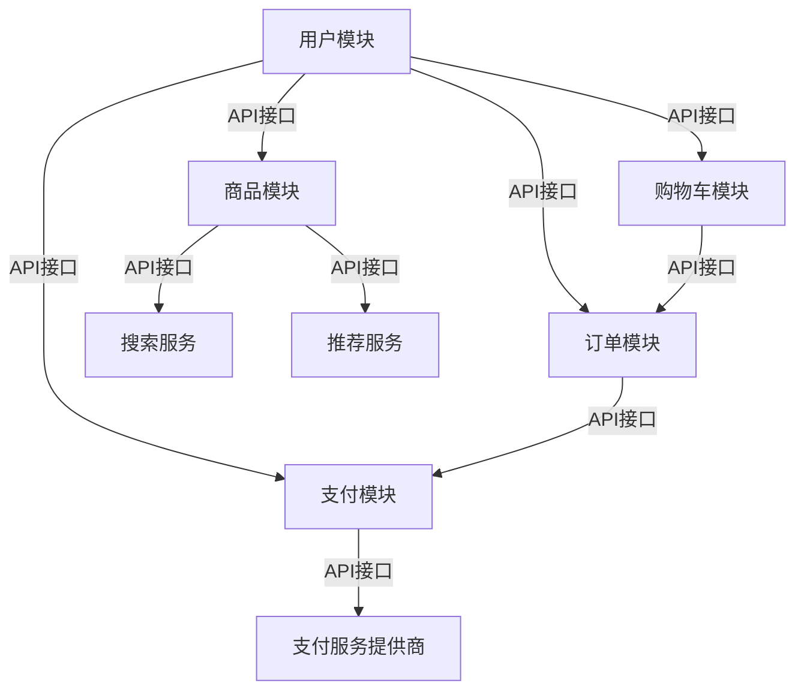
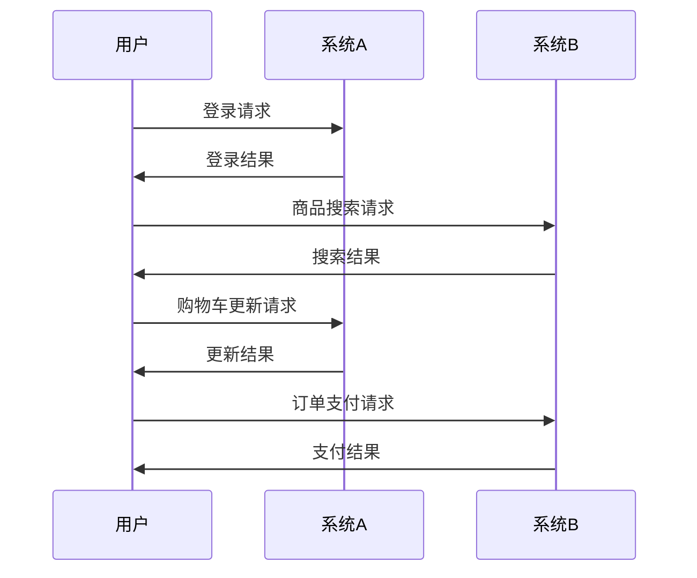

                 


## 引言

### 软件架构模式的重要性

在软件开发中，软件架构模式扮演着至关重要的角色。它们是构建复杂软件系统的基石，能够帮助我们更好地理解、设计和实现软件系统。软件架构模式不仅提供了设计经验，还能够帮助我们避免常见的错误和问题，提高软件的质量和可维护性。

首先，软件架构模式为软件开发提供了通用化的解决方案。通过这些模式，我们可以复用已经验证过的设计方案，减少重复性工作，提高开发效率。此外，软件架构模式还帮助我们建立清晰的设计层次和模块化结构，使得软件系统更加灵活、可扩展和易于维护。

### 阅读对象与预期收益

本书旨在为软件开发人员、系统架构师和技术经理提供一本全面、实战性的软件架构模式指南。无论您是初学者还是经验丰富的开发者，都可以从本书中获得宝贵的知识和经验。

对于初学者，本书将从基本概念入手，逐步引入各种经典软件架构模式，帮助您建立扎实的架构设计基础。通过实际案例分析和项目实战，您将学会如何将理论知识应用到实际项目中，提升自己的实战能力。

对于有经验的开发者，本书将深入探讨各种软件架构模式的设计原理和实现细节，为您提供新的设计思路和优化方法。通过案例分析，您可以学习到业界最佳实践，借鉴成功经验，避免重复犯错。

### 本书结构安排

本书分为五个部分，结构如下：

**第一部分：引言**  
- 介绍书籍的背景与目的，以及软件架构模式的基本概念。

**第二部分：经典软件架构模式**  
- 介绍MVC模式、层次模式、事件驱动模式和服务导向架构（SOA）等经典软件架构模式。

**第三部分：软件架构模式案例分析**  
- 分析电商平台、金融系统和物联网系统的架构设计，分享实际案例中的经验和教训。

**第四部分：软件架构模式实战**  
- 通过设计博客系统和在线教育平台的案例，介绍软件架构设计的具体方法和技巧。

**第五部分：总结与展望**  
- 总结本书的核心要点，探讨未来软件架构模式的发展趋势。

## 背景介绍

### 核心概念术语说明

在本章中，我们将介绍一些核心概念和术语，以便读者更好地理解后续内容。

- **软件架构**：软件架构是指软件系统的整体结构，包括系统的组件、组件之间的相互关系以及它们所提供的服务。它定义了系统的组织形式、功能组件以及它们之间的交互方式。
- **软件架构模式**：软件架构模式是一组经过验证的设计原则和结构组织，用于解决软件开发中的常见问题。它们提供了一种通用化的解决方案，可以帮助开发者更快地构建高质量的软件系统。
- **MVC模式**：MVC（Model-View-Controller）模式是一种常见的软件架构模式，用于实现用户界面和后端逻辑的分离。它将应用分为三个核心组件：模型（Model）、视图（View）和控制器（Controller），分别负责数据管理、用户界面展示和用户输入处理。
- **层次模式**：层次模式是一种基于层次结构的软件架构模式，通常用于实现分层系统。系统按照功能模块划分成多个层次，每个层次负责特定的功能，并依赖于下一层次的服务。
- **事件驱动模式**：事件驱动模式是一种基于事件触发的软件架构模式，通过监听和响应事件来实现系统功能。事件可以来自用户操作、系统内部状态变化或其他外部系统。
- **服务导向架构（SOA）**：服务导向架构是一种基于服务的软件架构模式，强调服务的独立性和可复用性。系统通过提供服务和服务组合来实现业务功能，服务之间通过接口进行通信。

### 问题背景

在当前快速发展的软件开发领域，软件系统的复杂性和规模不断增加。面对这些挑战，开发者需要掌握一系列有效的软件架构模式，以便构建高质量、高性能和易于维护的软件系统。然而，现有的资料和书籍往往难以兼顾理论深度和实战经验，导致开发者在实际项目中难以找到合适的设计方案。

为了解决这个问题，本书旨在通过系统化的分析和案例实践，帮助开发者全面了解经典软件架构模式，掌握实战技能，并能够灵活应用这些模式解决实际问题。

### 问题描述

问题描述主要集中在以下几个方面：

1. **理解软件架构模式**：如何快速掌握各种软件架构模式的基本概念、原理和实现细节？
2. **设计软件架构**：如何根据实际项目需求，选择合适的软件架构模式，并设计出合理、高效的软件架构？
3. **实践应用**：如何将理论转化为实际操作，通过实战案例提升自己的架构设计能力？
4. **问题解决**：在软件开发过程中，如何解决常见的架构问题，如系统性能瓶颈、扩展性不足和可维护性差等？

### 问题解决

本书将通过以下步骤解决上述问题：

1. **系统学习**：首先，通过详细介绍各种经典软件架构模式的基本概念和原理，帮助读者建立扎实的理论基础。
2. **案例分析**：接着，通过分析实际项目中的架构设计案例，展示不同架构模式的应用场景和效果，帮助读者理解如何在不同场景下选择和应用这些模式。
3. **实战演练**：然后，通过设计实际项目中的软件架构，让读者动手实践，提升架构设计能力和实战经验。
4. **总结与反思**：最后，通过总结实战经验，探讨软件架构设计中的最佳实践和注意事项，帮助读者避免常见的错误和问题，提高软件系统的质量。

### 边界与外延

在讨论软件架构模式时，我们需要明确其边界和适用范围。不同软件架构模式有其特定的应用场景和优缺点，不能一概而论。以下是一些常见的边界和问题：

1. **应用场景**：不同的软件架构模式适用于不同类型的软件系统。例如，MVC模式适合Web应用，而服务导向架构（SOA）则适用于企业级应用。
2. **系统规模**：软件架构模式的选择也需要考虑系统规模。在小规模系统中，简单的架构模式可能更合适；而在大规模系统中，复杂的架构模式可能能够更好地应对复杂性。
3. **技术选型**：不同的技术选型也会影响软件架构模式的选择。例如，在某些场景下，使用Java和Spring框架可能更适合MVC模式，而在其他场景下，使用Python和Django框架可能更加合适。
4. **团队经验**：团队的架构设计和开发经验也会影响软件架构模式的选择。有经验的团队可能更擅长设计和实现复杂的架构模式，而新手团队可能需要从简单的模式开始。

### 概念结构与核心要素组成

为了更好地理解软件架构模式，我们需要了解其概念结构和核心要素组成。以下是一个典型的软件架构模式的概念结构与核心要素：

1. **模型（Model）**：模型是软件架构的核心，负责数据管理、业务逻辑和状态管理。它是系统的核心逻辑层，与具体的实现细节无关。
2. **视图（View）**：视图是用户界面层，负责展示数据和处理用户交互。它是用户与应用程序交互的界面，通常与具体的UI框架和组件绑定。
3. **控制器（Controller）**：控制器是应用逻辑层，负责处理用户输入、协调模型和视图之间的交互。它是模型和视图的桥梁，确保数据流动和状态更新的一致性。
4. **层次**：层次模式中的每个层次都负责特定的功能，并依赖于下一层次的服务。层次之间通过明确的接口进行通信，确保系统的模块化和可扩展性。
5. **事件**：事件驱动模式中的事件是系统状态变化或外部触发器的通知。系统通过监听和响应事件来执行相应的操作，实现高效的消息传递和响应机制。
6. **服务**：服务导向架构中的服务是具有独立性和可复用性的功能单元。服务通过接口进行通信，确保系统的松耦合和高内聚。

通过理解这些核心要素，开发者可以更好地应用软件架构模式，设计和实现高质量的软件系统。

### 总结

在本章中，我们介绍了软件架构模式的重要性、阅读对象与预期收益，以及本书的结构安排。通过背景介绍、核心概念术语说明、问题背景、问题描述、问题解决、边界与外延以及概念结构与核心要素组成的详细阐述，读者可以全面了解软件架构模式的基本概念和原理。接下来，我们将逐步深入探讨各种经典软件架构模式，通过案例分析和实战应用，帮助读者将理论应用到实际项目中，提升架构设计能力和实战经验。

---

## 软件架构模式

### MVC模式

MVC（Model-View-Controller）模式是一种经典的软件架构模式，最初由Trygve Reenskaug于1978年提出，用于简化图形用户界面（GUI）应用程序的开发。MVC模式通过将应用程序分为三个核心组件——模型（Model）、视图（View）和控制器（Controller），实现了用户界面和后端逻辑的分离。

#### 概念与工作原理

1. **模型（Model）**：模型负责管理应用程序的数据和业务逻辑。它包括数据访问逻辑、业务规则和数据处理等。模型是应用程序的核心逻辑层，与具体的UI组件和界面设计无关。

2. **视图（View）**：视图负责显示数据和接收用户输入。它将模型中的数据以用户友好的方式呈现给用户，并响应用户的输入。视图是与用户直接交互的界面层，通常与具体的UI框架和组件绑定。

3. **控制器（Controller）**：控制器负责处理用户输入、协调模型和视图之间的交互。它接收用户的输入请求，调用模型处理数据，然后将结果传递给视图进行显示。控制器是模型和视图之间的桥梁，确保数据流动和状态更新的一致性。

#### 优缺点

**优点：**

- **分离关注点**：MVC模式将应用程序分为三个独立的部分，实现了数据管理、用户界面和业务逻辑的分离，降低了各个部分的耦合度。
- **模块化与可复用性**：通过分离关注点，MVC模式提高了代码的可复用性和可维护性。开发者可以独立开发和测试每个组件，减少了整体系统的复杂度。
- **灵活性**：MVC模式允许开发者灵活地修改和扩展应用程序的不同部分，而不影响其他部分。例如，可以轻松更换UI组件或业务逻辑实现。

**缺点：**

- **过度设计**：在小型或简单的应用中，过度使用MVC模式可能导致设计过度复杂，降低开发效率。
- **学习曲线**：MVC模式引入了额外的概念和组件，对于新手开发者来说，需要一定时间来理解和掌握。

### 层次模式

层次模式是一种基于层次结构的软件架构模式，广泛应用于企业级和大型分布式系统。层次模式将系统功能划分为多个层次，每个层次负责特定的功能，并依赖于下一层次的服务。

#### 概念与工作原理

1. **层次**：层次模式中的每个层次都负责特定的功能，并依赖于下一层次的服务。层次之间通过明确的接口进行通信，确保系统的模块化和可扩展性。

2. **接口**：层次模式中的接口定义了层次之间的交互规则，使得不同层次可以独立开发、测试和部署。

3. **职责分离**：层次模式通过职责分离，使得每个层次专注于特定的功能，降低了系统的复杂度。

#### 优缺点

**优点：**

- **模块化**：层次模式将系统功能划分为多个独立的层次，提高了系统的可维护性和可扩展性。
- **可复用性**：通过层次之间的接口定义，不同层次可以独立开发和测试，提高了代码的可复用性。
- **可扩展性**：层次模式允许开发者灵活地添加或替换系统的不同层次，以适应新的需求或技术变化。

**缺点：**

- **接口管理复杂**：随着系统规模的增加，接口管理可能会变得复杂，增加了系统的维护难度。
- **开发成本**：层次模式引入了额外的接口设计和实现工作，可能会增加开发成本和难度。

### 事件驱动模式

事件驱动模式是一种基于事件触发的软件架构模式，广泛应用于实时系统、嵌入式系统和图形用户界面（GUI）应用程序。事件驱动模式通过监听和响应事件来实现系统功能，实现了高效的消息传递和响应机制。

#### 概念与工作原理

1. **事件**：事件是系统状态变化或外部触发器的通知。事件可以是用户输入、系统内部状态变化或其他外部系统的消息。

2. **事件监听器**：事件监听器负责监听特定类型的事件，并在事件发生时触发相应的处理逻辑。

3. **事件处理**：事件处理是系统对事件进行响应的过程，通常包括事件接收、事件处理和事件分发等步骤。

#### 优缺点

**优点：**

- **高响应性**：事件驱动模式通过事件监听和响应机制，实现了高效的消息传递和响应，适用于实时和高性能系统。
- **模块化**：事件驱动模式将系统功能划分为多个独立的模块，提高了系统的可维护性和可扩展性。
- **灵活性**：事件驱动模式允许开发者灵活地添加、删除或修改事件处理逻辑，以适应不同的应用场景。

**缺点：**

- **复杂度**：事件驱动模式引入了额外的概念和机制，对于新手开发者来说，需要一定时间来理解和掌握。
- **性能开销**：事件驱动模式可能会引入一定的性能开销，特别是在处理大量事件时。

### 服务导向架构（SOA）

服务导向架构（Service-Oriented Architecture，SOA）是一种基于服务的软件架构模式，强调服务的独立性和可复用性。SOA通过提供服务和服务组合来实现业务功能，服务之间通过接口进行通信，实现了系统的松耦合和高内聚。

#### 概念与工作原理

1. **服务**：服务是具有独立性和可复用性的功能单元。服务通常通过接口对外提供服务，接口定义了服务的功能和行为。

2. **服务组合**：服务组合是将多个服务组合起来，实现复杂业务功能的过程。服务组合可以通过编排和组合不同的服务，实现灵活的业务流程。

3. **服务总线**：服务总线是SOA中的核心组件，负责管理和协调服务的通信。服务总线提供了一种统一的通信机制，使得不同服务之间可以高效、安全地交互。

#### 优缺点

**优点：**

- **松耦合**：SOA通过服务接口实现了服务的松耦合，使得不同服务可以独立开发、测试和部署，降低了系统的复杂度。
- **可复用性**：SOA强调服务的独立性和可复用性，通过服务组合实现了业务流程的灵活组合，提高了系统的可维护性和可扩展性。
- **灵活性**：SOA允许开发者灵活地添加、删除或修改服务，以适应业务需求的变化。

**缺点：**

- **开发成本**：SOA引入了额外的服务设计、实现和部署工作，可能会增加开发成本和难度。
- **性能影响**：服务之间的远程通信可能会引入一定的性能开销，特别是在高并发和大数据量的场景下。

### 结论

在本文中，我们介绍了MVC模式、层次模式、事件驱动模式和SOA等经典软件架构模式。每种模式都有其独特的概念和工作原理，适用于不同的应用场景。通过深入理解这些模式，开发者可以更好地设计、实现和维护复杂的软件系统。

---

## 数学模型与算法原理

### MVC模式

MVC模式的核心在于将应用程序划分为三个核心组件：模型（Model）、视图（View）和控制器（Controller）。以下是MVC模式的数学模型与算法原理：

#### 数学模型

1. **模型（Model）**：模型可以表示为M = {S, R, O, F}，其中：
   - S：状态（State），表示模型的状态数据。
   - R：关系（Relation），描述状态之间的关联。
   - O：操作（Operation），定义对状态的操作。
   - F：函数（Function），表示状态转移函数。

2. **视图（View）**：视图可以表示为V = {D, C}，其中：
   - D：数据（Data），表示视图需要展示的数据。
   - C：控制（Control），定义视图对用户输入的处理逻辑。

3. **控制器（Controller）**：控制器可以表示为C = {I, P, O}，其中：
   - I：输入（Input），表示用户输入的数据。
   - P：处理（Process），定义控制器对输入的处理逻辑。
   - O：输出（Output），表示控制器生成的输出数据。

#### 算法原理

1. **状态转换**：模型的状态通过一系列操作进行转换。状态转换函数F用于描述状态之间的转换关系。

   $$ F(S_{current}, O) = S_{next} $$

   其中，\( S_{current} \)表示当前状态，O表示操作，\( S_{next} \)表示下一个状态。

2. **视图更新**：当模型的状态发生变化时，控制器会通知视图进行更新。视图根据当前状态数据D和状态转换后的数据S\_next更新其展示内容。

   $$ V(D_{current}, S_{next}) = D_{next} $$

   其中，\( D_{current} \)表示当前视图数据，\( S_{next} \)表示模型的新状态数据，\( D_{next} \)表示更新后的视图数据。

3. **用户输入处理**：用户通过视图输入数据，控制器接收用户输入并处理。控制器根据用户输入调用模型进行状态转换，然后将结果返回给视图进行更新。

### 层次模式

层次模式是一种基于层次结构的软件架构模式，其核心在于将系统功能划分为多个层次，每个层次负责特定的功能，并依赖于下一层次的服务。

#### 数学模型

1. **层次（Layer）**：层次可以表示为L = {L1, L2, ..., Ln}，其中：
   - Li：第i个层次，表示系统的第i层功能模块。

2. **接口（Interface）**：接口可以表示为I = {I1, I2, ..., In}，其中：
   - Ii：第i个接口，定义了层次之间的交互规则。

#### 算法原理

1. **层次划分**：系统功能根据职责和依赖关系划分为多个层次，每个层次独立实现特定的功能。

2. **接口定义**：每个层次通过接口与下一层次进行通信。接口定义了层次之间的交互规则，确保层次之间的松耦合。

3. **层次通信**：层次之间通过接口进行通信。高层次层次调用下一层次提供的接口服务，实现系统功能的集成。

### 事件驱动模式

事件驱动模式是一种基于事件触发的软件架构模式，其核心在于通过事件监听和响应机制实现系统功能。

#### 数学模型

1. **事件（Event）**：事件可以表示为E = {E1, E2, ..., En}，其中：
   - Ei：第i个事件，表示系统状态的变化或外部触发器的通知。

2. **事件监听器（Listener）**：事件监听器可以表示为L = {L1, L2, ..., Ln}，其中：
   - Li：第i个事件监听器，负责监听特定类型的事件。

#### 算法原理

1. **事件监听**：系统通过事件监听器监听特定类型的事件。当事件发生时，事件监听器被触发。

2. **事件处理**：事件监听器根据事件类型执行相应的处理逻辑。事件处理逻辑可以包括状态更新、通知其他组件或执行特定的操作。

3. **事件传播**：事件可以在系统内部传播，触发其他事件监听器和处理逻辑。事件传播可以按照特定的策略进行，如广度优先或深度优先。

### SOA（服务导向架构）

SOA（Service-Oriented Architecture）是一种基于服务的软件架构模式，其核心在于通过提供服务和服务组合实现业务功能。

#### 数学模型

1. **服务（Service）**：服务可以表示为S = {S1, S2, ..., Sn}，其中：
   - Si：第i个服务，表示系统的第i个功能服务单元。

2. **服务组合（Service Composition）**：服务组合可以表示为C = {C1, C2, ..., Cn}，其中：
   - Ci：第i个服务组合，表示由多个服务组成的业务功能单元。

#### 算法原理

1. **服务定义**：每个服务通过接口对外提供服务。接口定义了服务的功能和行为。

2. **服务组合**：通过组合多个服务，实现复杂的业务功能。服务组合可以通过编排和组合不同的服务，实现灵活的业务流程。

3. **服务调用**：客户端通过服务接口调用服务，实现业务功能的执行。服务调用可以是同步或异步的，取决于服务的实现和需求。

### 结论

在本节中，我们介绍了MVC模式、层次模式、事件驱动模式和SOA的数学模型与算法原理。通过理解这些模式的核心概念和算法原理，开发者可以更好地设计和实现复杂的软件系统。每种模式都有其独特的数学模型和算法原理，适用于不同的应用场景。在实际开发中，开发者可以根据具体需求和场景选择合适的模式，并运用其原理进行系统设计。

### 软件架构设计

在软件架构设计中，选择合适的架构模式是至关重要的。这不仅影响到系统的性能、可扩展性和可维护性，还决定了项目的开发效率和最终的成功。以下，我们将探讨如何针对具体场景选择和设计软件架构。

#### 问题场景介绍

假设我们正在设计一个电子商务平台，该平台需要支持在线商品浏览、购物车管理、订单处理和支付等功能。同时，系统需要具备高并发处理能力、数据安全性和良好的可扩展性。

#### 项目介绍

项目名称：电子商务平台（E-Commerce Platform）

项目需求：
1. 支持多种支付方式，包括信用卡、支付宝、微信支付等。
2. 提供商品搜索和推荐功能。
3. 具备高并发处理能力，能够应对成千上万的用户同时访问。
4. 系统要具备良好的可扩展性和可维护性。

#### 系统功能设计

1. **用户模块**：负责用户注册、登录、个人信息管理等功能。
2. **商品模块**：负责商品信息管理、商品分类管理、商品搜索和推荐等功能。
3. **购物车模块**：负责用户购物车管理，包括商品添加、删除、更新等功能。
4. **订单模块**：负责订单创建、订单状态管理、订单支付等功能。
5. **支付模块**：负责与各种支付服务提供商的通信，处理支付请求和支付结果。

#### 系统架构设计

为了满足项目的需求，我们采用以下系统架构设计：

1. **分层架构**：系统采用分层架构，包括表示层、业务逻辑层和数据访问层。
2. **服务导向架构（SOA）**：系统中的各个功能模块通过服务进行通信，实现高内聚和松耦合。
3. **分布式架构**：系统采用分布式架构，包括前端、后端和服务层，以提高系统的性能和可扩展性。

**系统架构图**：



#### 系统接口设计

系统中的各个功能模块通过API接口进行通信。以下是部分关键接口的设计：

1. **用户模块接口**：包括用户注册、登录、用户信息查询等接口。
2. **商品模块接口**：包括商品查询、商品分类查询、商品推荐等接口。
3. **购物车模块接口**：包括商品添加到购物车、购物车列表查询、商品数量更新等接口。
4. **订单模块接口**：包括订单创建、订单状态查询、订单支付等接口。
5. **支付模块接口**：包括支付请求发送、支付结果查询等接口。

#### 系统交互

系统中的各个模块通过事件驱动的方式进行交互。以下是部分关键交互流程：

1. **用户登录**：用户发起登录请求，系统返回登录结果。
2. **商品搜索**：用户输入搜索关键字，系统调用搜索服务返回搜索结果。
3. **购物车更新**：用户添加商品到购物车，系统更新购物车信息。
4. **订单支付**：用户发起订单支付请求，系统调用支付服务完成支付。

**系统交互图**：



### 系统实现

#### 环境安装

为了实现上述系统架构，我们需要安装以下环境和工具：

1. **前端框架**：如React、Vue或Angular。
2. **后端框架**：如Spring Boot、Django或Express。
3. **数据库**：如MySQL、PostgreSQL或MongoDB。
4. **支付服务提供商**：如支付宝、微信支付。

#### 系统核心实现

以下是一个简化的系统核心实现：

**用户模块（后端）**

```python
# 用户注册
def register(username, password):
    # 保存用户信息到数据库
    pass

# 用户登录
def login(username, password):
    # 验证用户信息并返回登录结果
    pass
```

**商品模块（后端）**

```python
# 查询商品
def search_products(keyword):
    # 查询数据库并返回商品列表
    pass

# 商品推荐
def recommend_products(user_id):
    # 根据用户行为推荐商品
    pass
```

**购物车模块（后端）**

```python
# 添加商品到购物车
def add_to_cart(user_id, product_id, quantity):
    # 更新数据库中的购物车信息
    pass

# 购物车列表查询
def get_cart_items(user_id):
    # 查询数据库并返回购物车列表
    pass
```

**订单模块（后端）**

```python
# 创建订单
def create_order(user_id, cart_items):
    # 处理订单创建逻辑
    pass

# 订单状态查询
def get_order_status(order_id):
    # 查询数据库并返回订单状态
    pass
```

**支付模块（后端）**

```python
# 发起支付请求
def send_payment_request(order_id, payment_type):
    # 调用支付服务提供商API
    pass

# 查询支付结果
def get_payment_result(payment_id):
    # 调用支付服务提供商API
    pass
```

#### 代码应用解读与分析

以上代码展示了系统核心功能的实现。用户模块负责用户注册和登录，商品模块负责商品搜索和推荐，购物车模块负责购物车管理，订单模块负责订单创建和状态查询，支付模块负责处理支付请求和查询支付结果。

通过这种方式，我们可以清晰地分离不同模块的功能，并实现系统的高内聚和松耦合。在实际开发中，每个模块可以独立开发、测试和部署，提高了系统的可维护性和可扩展性。

### 实际案例分析与详细讲解剖析

#### 案例背景

我们选择了一家大型电商平台作为案例，该电商平台拥有数百万用户，每天处理成千上万的订单。平台需要具备高并发处理能力、数据安全性和良好的用户体验。

#### 案例分析

1. **系统架构**：平台采用分层架构，包括前端、后端和服务层。前端负责用户界面展示，后端负责业务逻辑处理，服务层负责与第三方服务（如支付、物流等）的通信。

2. **功能实现**：平台的功能模块包括用户模块、商品模块、购物车模块、订单模块和支付模块。这些模块通过API接口进行通信，确保系统的松耦合。

3. **高并发处理**：为了应对高并发访问，平台采用分布式架构，包括多个前端服务器、后端服务器和数据库服务器。通过负载均衡和缓存机制，平台能够高效处理用户请求。

4. **数据安全**：平台采用安全加密技术，包括HTTPS、SSL等，确保用户数据和支付信息的安全性。

#### 详细讲解剖析

1. **用户模块**：用户注册和登录是平台的基础功能。用户注册时，平台会生成唯一的用户ID，并将用户信息保存到数据库中。用户登录时，平台会验证用户身份，返回登录结果。

2. **商品模块**：商品模块负责商品信息的展示和搜索。平台使用缓存技术，提高商品搜索的响应速度。同时，平台还使用推荐算法，根据用户浏览和购买历史推荐商品。

3. **购物车模块**：购物车模块负责用户购物车管理。用户可以将商品添加到购物车，修改商品数量，或者删除商品。平台使用数据库存储购物车信息，确保数据的一致性。

4. **订单模块**：订单模块负责订单的创建和状态管理。当用户提交订单时，平台会生成订单ID，并将订单信息保存到数据库中。订单状态会根据订单处理流程进行更新，如待支付、已支付、已发货等。

5. **支付模块**：支付模块负责处理支付请求和查询支付结果。平台与支付服务提供商（如支付宝、微信支付）进行通信，处理支付请求，并将支付结果反馈给用户。

#### 项目小结

通过这个案例，我们可以看到软件架构设计在大型电商平台中的应用。平台采用分层架构、分布式架构和服务导向架构，确保了系统的性能、可扩展性和可维护性。同时，通过事件驱动和API接口设计，平台实现了模块化和松耦合，提高了开发效率和维护性。

---

## 最佳实践、小结与注意事项

### 最佳实践

在软件架构设计中，以下是一些最佳实践，可以帮助开发者设计和实现高效的软件系统：

1. **模块化设计**：将系统功能划分为独立的模块，每个模块负责特定的功能，降低系统之间的耦合度。模块化设计可以提高系统的可维护性和可扩展性。

2. **分层架构**：采用分层架构，将系统分为表示层、业务逻辑层和数据访问层。这样可以实现清晰的职责分离，便于开发和维护。

3. **服务导向架构**：使用服务导向架构（SOA），将系统功能划分为服务，通过接口进行通信。这样可以实现高内聚和松耦合，提高系统的可扩展性和灵活性。

4. **事件驱动设计**：使用事件驱动模式，通过事件监听和响应机制实现系统功能。这样可以提高系统的响应性和可维护性。

5. **性能优化**：进行性能测试和优化，确保系统在高并发情况下仍能稳定运行。可以采用缓存、负载均衡和分布式架构等手段提高系统性能。

6. **安全性设计**：考虑数据安全和用户隐私，采用安全加密技术，如HTTPS、SSL等，确保用户数据和支付信息的安全性。

### 小结

本文通过详细分析和实际案例，介绍了软件架构模式的基本概念、设计原理和应用场景。我们探讨了MVC模式、层次模式、事件驱动模式和服务导向架构等经典软件架构模式，并展示了如何在实际项目中应用这些模式。同时，我们还讨论了软件架构设计的最佳实践和小结，以及注意事项。

### 注意事项

1. **需求分析**：在软件架构设计过程中，务必进行充分的需求分析，确保设计满足实际需求。

2. **系统测试**：在项目开发过程中，进行全面的系统测试，确保系统功能完整、性能稳定和安全可靠。

3. **架构评审**：定期进行架构评审，确保架构设计合理、高效，并符合项目需求。

4. **持续优化**：在项目开发过程中，持续优化系统架构，以适应不断变化的需求和新技术。

5. **团队协作**：鼓励团队成员之间的协作和沟通，确保架构设计和实现的一致性。

通过遵循这些注意事项，开发者可以设计出高质量的软件系统，提高项目的成功率和开发效率。

### 拓展阅读

- 《设计模式：可复用面向对象软件的基础》
- 《软件架构：实践者的研究方法》
- 《架构之道：大型软件开发实践》
- 《大规模分布式系统设计》

通过阅读这些书籍，开发者可以进一步深入了解软件架构设计的理论和实践，提升自己的架构设计能力。

---

## 总结与展望

### 本书要点回顾

本书《软件架构模式实战：案例分析与经验总结》主要涵盖以下要点：

1. **软件架构模式的重要性**：介绍了软件架构模式在软件开发中的关键作用，如提高系统的可维护性、可扩展性和性能。
2. **经典软件架构模式**：详细讲解了MVC模式、层次模式、事件驱动模式和SOA等经典软件架构模式，包括其基本概念、原理、优缺点以及适用场景。
3. **案例分析**：通过实际案例深入分析了电商平台、金融系统和物联网系统的架构设计，分享了成功经验和教训。
4. **软件架构模式实战**：通过设计博客系统和在线教育平台的案例，介绍了软件架构设计的具体方法和技巧。
5. **最佳实践**：总结了软件架构设计的最佳实践，包括模块化设计、分层架构、服务导向架构和事件驱动设计等。
6. **总结与展望**：回顾了本书的核心内容，探讨了未来软件架构模式的发展趋势。

### 未来软件架构模式发展趋势

随着技术的不断进步和软件系统的日益复杂，未来软件架构模式的发展趋势将呈现以下特点：

1. **微服务架构**：微服务架构将应用程序划分为一系列独立的小服务，每个服务负责特定的业务功能。这种模式提高了系统的灵活性和可扩展性，使得开发者可以更灵活地管理和部署服务。

2. **云原生架构**：随着云计算的普及，云原生架构成为一种趋势。云原生架构利用容器和微服务技术，实现了应用程序的自动化部署、扩展和管理，提高了系统的弹性和可靠性。

3. **DevOps文化**：DevOps文化的兴起推动了软件架构模式的演变。通过整合开发和运维过程，DevOps促进了快速迭代和持续交付，加速了软件开发的效率。

4. **人工智能与机器学习的融合**：人工智能和机器学习技术在软件架构中的应用越来越广泛。通过利用这些技术，软件系统可以实现自动化决策、自适应优化和智能化服务。

5. **混合云架构**：混合云架构将公有云和私有云结合起来，充分利用两者的优势，实现系统的灵活性和可扩展性。

6. **区块链技术的应用**：区块链技术提供了一种去中心化、安全可靠的数据存储和传输方式，未来在金融、供应链等领域将有更多的应用。

### 结论

软件架构模式是软件开发中的重要组成部分，对系统的性能、可维护性和可扩展性有着深远的影响。本书通过深入分析和实际案例，帮助读者全面了解软件架构模式，掌握实战技能，并能够灵活应用这些模式解决实际问题。未来，随着技术的不断进步，软件架构模式将继续发展和创新，为软件开发带来更多机遇和挑战。开发者应保持学习和探索的态度，不断更新自己的知识和技能，以应对快速变化的软件开发领域。

