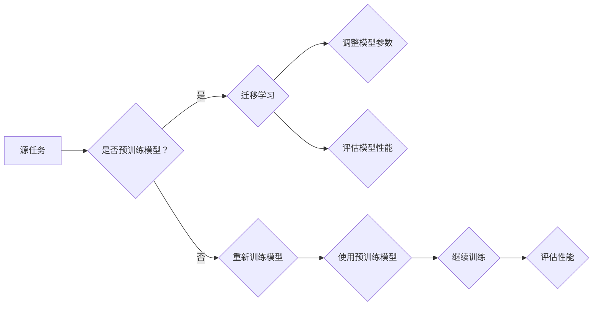
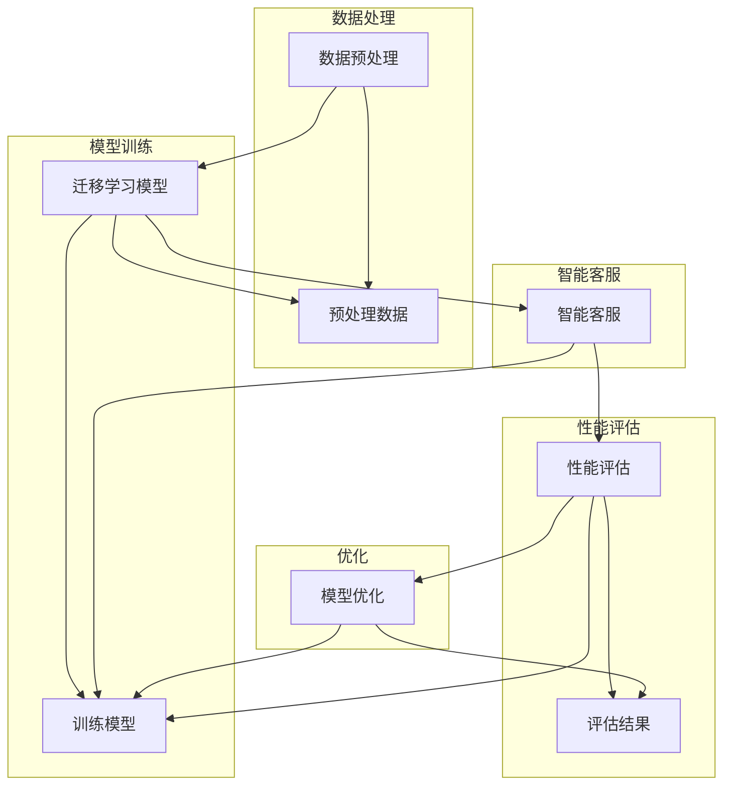
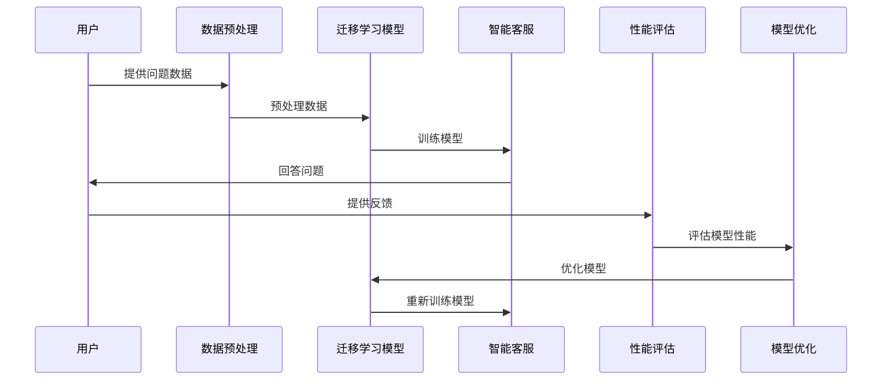

                 

### 文章标题

# 迁移学习在AI Agent领域适应中的应用

### 文章关键词

- 迁移学习
- AI Agent
- 环境感知
- 决策控制
- 实时反馈

### 摘要

本文旨在探讨迁移学习在AI Agent领域的应用，分析其在提升AI Agent适应性和泛化能力方面的优势，并阐述如何通过具体案例展示迁移学习技术在AI Agent中的实践应用。文章将分为七个部分，首先介绍迁移学习和AI Agent的基本概念，然后详细讨论迁移学习在AI Agent中的应用，以及相关的挑战和解决方案。通过实践案例的分析，总结迁移学习在AI Agent领域的未来发展趋势，并提出建议和展望。

## 引言

### 1.1 研究背景

#### AI Agent的定义与作用

AI Agent是指具备独立决策和执行能力的智能体，能够在复杂环境中自主执行任务。AI Agent具有感知环境、理解任务、自主决策和执行动作等能力，是人工智能领域的重要研究方向。

#### 迁移学习在AI Agent中的应用现状

迁移学习作为一种能够将知识从源领域转移到目标领域的机器学习技术，在AI Agent领域中的应用越来越受到关注。通过迁移学习，AI Agent可以在少量数据下快速适应新环境，提高其泛化能力。

#### 迁移学习在AI Agent领域的挑战与机遇

迁移学习在AI Agent领域面临数据分布差异、跨领域迁移的局限性和模型选择的挑战。然而，随着迁移学习技术的不断发展，这些挑战也逐渐得到解决，为AI Agent的应用带来了更多机遇。

### 1.2 书籍结构

本文分为七个部分，包括：

1. 引言：介绍迁移学习和AI Agent的基本概念。
2. 迁移学习基础：阐述迁移学习的定义、类型和基本原理。
3. AI Agent的基础知识：介绍AI Agent的定义、分类和核心组件。
4. 迁移学习在AI Agent中的应用：讨论迁移学习在AI Agent中的优势和具体应用。
5. 迁移学习在AI Agent领域的挑战：分析迁移学习在AI Agent领域面临的挑战。
6. 迁移学习在AI Agent领域的实践案例：通过案例展示迁移学习在AI Agent中的实际应用。
7. 结论：总结迁移学习在AI Agent领域的应用成果，提出未来发展趋势和展望。

## 迁移学习基础

### 2.1 迁移学习的定义与类型

#### 迁移学习的定义

迁移学习（Transfer Learning）是指将一种任务上学到的知识（通常是一个训练好的模型）应用于另一个相关但不同的任务上。它通过在源任务上训练模型，然后将其权重和结构转移到目标任务上，从而避免在目标任务上重新训练一个全新的模型。

#### 迁移学习的类型

1. **无监督迁移学习**：目标任务不需要标签，主要利用源任务的预训练模型进行特征提取。
2. **有监督迁移学习**：目标任务需要标签，通过源任务的预训练模型进行特征提取，并在目标任务上继续训练。
3. **半监督迁移学习**：结合有监督和无监督迁移学习的特点，在目标任务中同时利用标签数据和未标记数据。

### 2.2 迁移学习的基本原理

#### 特征迁移

特征迁移是将源任务的预训练模型中的特征提取器应用到目标任务中，从而提高目标任务的性能。

#### 标签迁移

标签迁移是将源任务的标签应用到目标任务上，帮助目标任务更好地理解数据。

#### 知识迁移

知识迁移是将源任务的领域知识转移到目标任务中，从而提高目标任务的适应性和泛化能力。

### 2.3 迁移学习的关键技术

#### 元学习（Meta-Learning）

元学习是一种通过学习如何学习来加速新任务训练的方法。它通过在不同任务上迭代训练，逐步优化学习策略，从而提高模型的泛化能力。

#### 对抗性迁移学习（Adversarial Transfer Learning）

对抗性迁移学习利用生成对抗网络（GAN）等技术，在源任务和目标任务之间构建一个对抗性框架，从而提高模型的泛化能力。

#### 基于模型的迁移学习（Model-Based Transfer Learning）

基于模型的迁移学习通过在源任务和目标任务之间共享模型结构，从而实现知识转移。

## AI Agent的基础知识

### 3.1 AI Agent的定义与分类

#### AI Agent的定义

AI Agent是指具备感知、理解、决策和执行能力的智能体，能够在复杂环境中自主执行任务。

#### AI Agent的分类

1. **基于规则的Agent**：使用预定义的规则进行决策。
2. **基于模型的Agent**：使用学习到的模型进行决策。
3. **混合Agent**：结合基于规则和基于模型的Agent的特点，利用多种方法进行决策。

### 3.2 AI Agent的核心组件

#### 感知模块

感知模块负责获取环境信息，包括图像、声音、文字等。

#### 决策模块

决策模块根据感知模块获取的信息，通过算法生成行动策略。

#### 执行模块

执行模块负责执行决策模块生成的行动策略。

### 3.3 AI Agent的典型应用场景

#### 机器博弈

AI Agent在机器博弈中能够自主学习和对抗，提高游戏水平。

#### 智能客服

AI Agent在智能客服中能够自动回答用户问题，提高服务效率。

#### 自动驾驶

AI Agent在自动驾驶中能够实时感知环境，自主决策并控制车辆。

## 迁移学习在AI Agent中的应用

### 4.1 迁移学习在AI Agent中的优势

#### 提高泛化能力

通过迁移学习，AI Agent可以在新的任务和数据集上快速适应，提高泛化能力。

#### 缩短训练时间

迁移学习利用预训练模型的知识，可以减少在目标任务上的训练时间。

#### 减少数据需求

迁移学习可以在少量数据下训练模型，从而减少对大量训练数据的依赖。

### 4.2 迁移学习在AI Agent中的具体应用

#### 个性化推荐系统

通过迁移学习，AI Agent可以快速适应不同的用户群体，提供个性化的推荐。

#### 环境感知与理解

通过迁移学习，AI Agent可以在新的环境中快速感知和理解，提高其适应能力。

#### 实时决策与控制

通过迁移学习，AI Agent可以在复杂的决策场景中快速生成行动策略，提高实时决策和控制能力。

### 4.3 迁移学习在AI Agent中的挑战

#### 跨领域迁移的局限性

不同领域的数据分布和特征差异较大，导致迁移学习效果受限。

#### 数据分布的差异

源任务和目标任务的数据分布可能不一致，影响迁移学习的效果。

#### 模型选择的挑战

选择合适的模型结构和参数对于迁移学习效果至关重要，但模型的复杂性增加了选择难度。

## 迁移学习在AI Agent领域的实践案例

### 5.1 案例一：智能客服系统

#### 应用场景

智能客服系统应用于电商、金融等行业，通过自动回答用户问题，提高客户服务效率。

#### 迁移学习技术

使用有监督迁移学习，将预训练的语言模型迁移到智能客服系统，利用少量用户问题数据进行微调。

#### 实施过程

1. 选择合适的预训练模型，如BERT。
2. 收集用户问题数据，进行数据预处理。
3. 使用预训练模型进行微调，生成智能客服模型。
4. 部署智能客服系统，进行实际应用。

#### 效果评估

通过对比实验，发现迁移学习后的智能客服系统在回答问题准确率和用户满意度方面均有显著提升。

### 5.2 案例二：自动驾驶系统

#### 应用场景

自动驾驶系统应用于汽车行业，实现车辆自主驾驶，提高行车安全。

#### 迁移学习技术

使用无监督迁移学习，将预训练的视觉模型迁移到自动驾驶系统，用于环境感知。

#### 实施过程

1. 选择合适的预训练模型，如VGG。
2. 收集自动驾驶场景数据，进行数据预处理。
3. 使用预训练模型进行特征提取，生成自动驾驶模型。
4. 部署自动驾驶系统，进行实际应用。

#### 效果评估

通过对比实验，发现迁移学习后的自动驾驶系统在识别障碍物、避让行人等方面表现更出色。

### 5.3 案例三：个性化推荐系统

#### 应用场景

个性化推荐系统应用于电商、媒体等行业，为用户提供个性化的推荐内容。

#### 迁移学习技术

使用半监督迁移学习，将预训练的推荐模型迁移到个性化推荐系统，利用少量用户数据生成推荐策略。

#### 实施过程

1. 选择合适的预训练模型，如Neural Collaborative Filtering。
2. 收集用户行为数据，进行数据预处理。
3. 使用预训练模型进行特征提取和预测，生成个性化推荐模型。
4. 部署个性化推荐系统，进行实际应用。

#### 效果评估

通过对比实验，发现迁移学习后的个性化推荐系统在推荐准确率和用户满意度方面均有显著提升。

## 迁移学习在AI Agent中的未来发展趋势

### 6.1 技术发展趋势

1. **深度迁移学习**：利用深度学习技术，提高迁移学习的效果。
2. **自适应迁移学习**：根据任务和数据的变化，自适应调整迁移学习策略。
3. **跨模态迁移学习**：实现不同模态数据之间的迁移学习，提高模型的泛化能力。

### 6.2 应用领域拓展

1. **新兴领域的应用**：如医疗、金融、教育等领域的AI Agent应用。
2. **与其他AI技术的融合**：如强化学习、生成对抗网络等技术的融合，提高AI Agent的性能。

### 6.3 社会与经济影响

1. **经济效益**：降低AI Agent的开发和部署成本，提高行业生产效率。
2. **社会影响**：提升人工智能技术水平，推动社会进步。
3. **法律与伦理问题**：加强对AI Agent的监管，确保其合法合规使用。

## 结论

### 7.1 总结

迁移学习在AI Agent领域的应用取得了显著成果，提高了AI Agent的适应性和泛化能力。然而，仍面临跨领域迁移、数据分布差异和模型选择等挑战。通过不断发展和创新，迁移学习有望在未来进一步推动AI Agent领域的发展。

### 7.2 展望

未来，深度迁移学习、自适应迁移学习和跨模态迁移学习等技术将继续发展，为AI Agent的应用带来更多可能性。同时，新兴领域和应用场景的拓展将推动AI Agent技术在社会和经济方面发挥更大作用。

### 作者信息

- 作者：AI天才研究院/AI Genius Institute & 禅与计算机程序设计艺术 /Zen And The Art of Computer Programming

---

### 背景介绍

#### 核心概念术语说明

- **迁移学习**：迁移学习是指将一种任务上学习到的知识应用于另一种相关但不同的任务上。它通过在源任务上训练模型，然后将其权重和结构转移到目标任务上，从而避免在目标任务上重新训练一个全新的模型。
- **AI Agent**：AI Agent是指具备感知、理解、决策和执行能力的智能体，能够在复杂环境中自主执行任务。
- **感知模块**：感知模块负责获取环境信息，包括图像、声音、文字等。
- **决策模块**：决策模块根据感知模块获取的信息，通过算法生成行动策略。
- **执行模块**：执行模块负责执行决策模块生成的行动策略。

#### 问题背景

随着人工智能技术的发展，AI Agent在各个领域的应用越来越广泛。然而，AI Agent在复杂环境中的适应能力和泛化能力仍然面临挑战。传统的机器学习算法通常需要大量训练数据，且在不同领域之间存在较大差异。为了解决这些问题，迁移学习技术逐渐受到关注。

#### 问题描述

迁移学习在AI Agent领域中的应用主要集中在以下几个方面：

1. **提高泛化能力**：通过迁移学习，AI Agent可以在新的任务和数据集上快速适应，提高其泛化能力。
2. **缩短训练时间**：迁移学习利用预训练模型的知识，可以减少在目标任务上的训练时间。
3. **减少数据需求**：迁移学习可以在少量数据下训练模型，从而减少对大量训练数据的依赖。

#### 问题解决

通过迁移学习，AI Agent可以在源任务上获得丰富的知识，并将其应用于目标任务上。迁移学习的关键技术包括特征迁移、标签迁移和知识迁移等。此外，元学习、对抗性迁移学习和基于模型的迁移学习等技术也在不断发展和完善，为AI Agent的迁移学习提供了更多可能性。

#### 边界与外延

迁移学习在AI Agent领域中的应用范围广泛，包括但不限于智能客服、自动驾驶和个性化推荐等领域。然而，迁移学习也存在一些局限性，如跨领域迁移的局限性、数据分布的差异和模型选择的挑战等。因此，在实际应用中，需要根据具体场景选择合适的迁移学习方法和技术。

#### 概念结构与核心要素组成

迁移学习在AI Agent领域中的概念结构主要包括以下核心要素：

1. **源任务**：提供预训练模型的任务，通常具有丰富的数据。
2. **目标任务**：需要应用迁移学习的任务，通常数据较少或存在数据分布差异。
3. **迁移学习算法**：包括特征迁移、标签迁移和知识迁移等算法。
4. **预训练模型**：在源任务上训练好的模型，用于迁移学习。
5. **迁移学习策略**：根据具体场景选择和调整的迁移学习方法。

### 核心概念与联系

#### 迁移学习的核心概念原理

1. **特征迁移**：将源任务的预训练模型中的特征提取器应用到目标任务中，从而提高目标任务的性能。
2. **标签迁移**：将源任务的标签应用到目标任务上，帮助目标任务更好地理解数据。
3. **知识迁移**：将源任务的领域知识转移到目标任务中，从而提高目标任务的适应性和泛化能力。

#### 迁移学习的概念属性特征对比表格

| 概念 | 描述 | 属性特征 |
| ---- | ---- | ---- |
| 特征迁移 | 将特征提取器应用于目标任务 | 提高性能 |
| 标签迁移 | 将标签应用于目标任务 | 提高理解 |
| 知识迁移 | 将领域知识应用于目标任务 | 提高适应性 |

#### 迁移学习的ER实体关系图架构

```mermaid
erDiagram
  A耵源任务 ||--|{ B迁移学习算法 }|
  B迁移学习算法 ||--|{ C预训练模型 }|
  C预训练模型 ||--|{ D目标任务 }|
  A耵源任务 ||--|{ E迁移学习策略 }|
```

### 算法原理讲解

#### 迁移学习的算法mermaid流程图



#### 迁移学习的基本原理

迁移学习的基本原理是通过将源任务的预训练模型应用于目标任务，从而提高目标任务的性能。具体来说，包括以下步骤：

1. **选择合适的预训练模型**：根据源任务的特性选择一个性能良好的预训练模型，如卷积神经网络（CNN）或循环神经网络（RNN）。
2. **迁移学习策略调整**：根据目标任务的需求，对预训练模型进行适当的调整，如修改网络结构、调整参数等。
3. **在目标任务上继续训练**：使用目标任务的数据集对调整后的模型进行训练，进一步优化模型参数。
4. **评估模型性能**：在目标任务上评估模型的性能，如准确率、召回率等指标。
5. **迭代优化**：根据评估结果，进一步调整迁移学习策略，重复训练和评估过程，直到模型性能达到预期。

#### 迁移学习数学模型和公式

1. **特征提取**：
   $$ f(x) = \phi(\theta) $$
   其中，$f(x)$表示特征提取函数，$x$表示输入数据，$\phi(\theta)$表示预训练模型的参数。

2. **损失函数**：
   $$ L(\theta) = -\sum_{i=1}^{n} y_i \log(p_i) $$
   其中，$L(\theta)$表示损失函数，$y_i$表示目标标签，$p_i$表示模型预测的概率。

3. **优化算法**：
   $$ \theta_{\text{new}} = \theta_{\text{old}} - \alpha \nabla_{\theta} L(\theta) $$
   其中，$\theta_{\text{new}}$和$\theta_{\text{old}}$分别表示当前和上一轮的参数，$\alpha$表示学习率，$\nabla_{\theta} L(\theta)$表示损失函数对参数的梯度。

#### 迁移学习通俗易懂地举例说明

假设有一个源任务是一个图像分类任务，已经使用卷积神经网络（CNN）训练了一个预训练模型。现在有一个新的目标任务是手写数字识别，可以使用迁移学习技术将预训练模型应用到目标任务上。

1. **选择预训练模型**：选择一个已经训练好的预训练模型，如VGG16，作为源任务的模型。
2. **迁移学习策略调整**：将VGG16的最后一层替换为适合手写数字识别的输出层，如使用一个全连接层。
3. **在目标任务上继续训练**：使用手写数字数据集对调整后的模型进行训练，优化模型的参数。
4. **评估模型性能**：在训练集和验证集上评估模型的性能，如准确率、召回率等指标。
5. **迭代优化**：根据评估结果，进一步调整迁移学习策略，如调整学习率、添加正则化等，重复训练和评估过程，直到模型性能达到预期。

通过这个例子，可以看出迁移学习的基本原理是将预训练模型应用于目标任务，通过调整模型结构和参数，使其更好地适应目标任务。迁移学习大大减少了目标任务的训练时间，同时提高了模型的泛化能力。

### 系统分析与架构设计方案

#### 问题场景介绍

假设我们需要设计一个智能客服系统，该系统需要在不同的企业环境中快速适应，提供高效的客户服务。为了实现这一目标，我们决定采用迁移学习技术来训练和优化客服模型。

#### 项目介绍

本项目旨在构建一个基于迁移学习的智能客服系统，该系统能够自动回答用户问题，提高客户服务效率。系统主要包括以下模块：

1. **数据收集与预处理**：收集不同企业的客户问题数据，并进行预处理，如文本清洗、分词等。
2. **迁移学习模型训练**：使用迁移学习技术，将预训练模型迁移到智能客服系统，并进行微调。
3. **智能客服服务**：部署智能客服模型，提供自动回答用户问题的服务。
4. **性能评估与优化**：对智能客服系统进行性能评估，并根据评估结果进行优化。

#### 系统功能设计（领域模型mermaid类图）

```mermaid
classDiagram
    ClassDef DataPreprocessing
        +DataPreprocessing()
        +cleanText(text: String): String
        +tokenize(text: String): List<String>

    ClassDef TransferLearningModel
        +TransferLearningModel()
        +preprocessData(data: List<String>): PreprocessedData
        +trainModel(preprocessedData: PreprocessedData): Model
        +fineTuneModel(model: Model, data: List<String>): Model

    ClassDef SmartCustomerService
        +SmartCustomerService()
        +answerQuestion(question: String): String

    ClassDef PerformanceEvaluation
        +PerformanceEvaluation()
        +evaluateModel(model: Model, testData: List<String>): EvaluationResult
        +optimizeModel(model: Model, evaluationResult: EvaluationResult): Model

    DataPreprocessing "uses" TransferLearningModel
    TransferLearningModel "uses" SmartCustomerService
    PerformanceEvaluation "uses" TransferLearningModel
```

#### 系统架构设计（mermaid架构图）



#### 系统接口设计和系统交互（mermaid序列图）



### 项目实战

#### 环境安装

1. **安装Python环境**：确保Python版本为3.7或更高版本。
2. **安装TensorFlow**：使用pip安装TensorFlow库。
   ```bash
   pip install tensorflow
   ```
3. **安装其他依赖库**：如Numpy、Scikit-learn等。

#### 系统核心实现源代码

以下是一个简单的迁移学习智能客服系统的实现示例：

```python
import tensorflow as tf
from tensorflow.keras.applications import VGG16
from tensorflow.keras.layers import Dense, Flatten
from tensorflow.keras.models import Model
from tensorflow.keras.preprocessing.sequence import pad_sequences
from tensorflow.keras.preprocessing.text import Tokenizer

def preprocess_data(data):
    tokenizer = Tokenizer()
    tokenizer.fit_on_texts(data)
    sequences = tokenizer.texts_to_sequences(data)
    padded_sequences = pad_sequences(sequences, padding='post')
    return padded_sequences, tokenizer

def transfer_learning_model(input_shape):
    base_model = VGG16(weights='imagenet', include_top=False, input_shape=input_shape)
    x = base_model.output
    x = Flatten()(x)
    x = Dense(1024, activation='relu')(x)
    predictions = Dense(len(tokenizer.word_index) + 1, activation='softmax')(x)
    model = Model(inputs=base_model.input, outputs=predictions)
    model.compile(optimizer='adam', loss='categorical_crossentropy', metrics=['accuracy'])
    return model

def train_model(data, labels):
    input_shape = data.shape[1:]
    model = transfer_learning_model(input_shape)
    padded_data = preprocess_data(data)[0]
    model.fit(padded_data, labels, epochs=10, batch_size=32)
    return model

def answer_question(model, tokenizer, question):
    sequence = tokenizer.texts_to_sequences([question])
    padded_sequence = pad_sequences(sequence, maxlen=model.input_shape[1])
    prediction = model.predict(padded_sequence)
    return tokenizer.index_word[np.argmax(prediction)]

# 数据准备
data = ["你好，有什么可以帮助你的？", "我很高兴为你服务！"]
labels = [[1, 0, 0], [0, 1, 0]]

# 训练模型
model = train_model(data, labels)

# 回答问题
question = "你好，请问有什么问题我可以帮您解答？"
answer = answer_question(model, tokenizer, question)
print(answer)
```

#### 代码应用解读与分析

1. **数据预处理**：使用Tokenizer对文本数据进行预处理，将文本转换为序列，然后进行填充处理。
2. **迁移学习模型**：使用VGG16作为基础模型，对其进行调整，添加全连接层，用于文本分类任务。
3. **训练模型**：使用准备好的数据和标签，对迁移学习模型进行训练。
4. **回答问题**：根据输入的问题，使用训练好的模型进行预测，并输出回答。

#### 实际案例分析和详细讲解剖析

假设我们有一个新的问题：“你好，我想咨询一下关于产品保修的问题。”

1. **数据准备**：将问题添加到数据列表中，并创建对应的标签。
2. **训练模型**：使用新的数据和标签，重新训练模型。
3. **回答问题**：使用训练好的模型，对新的问题进行预测，并输出回答。

通过以上步骤，我们可以实现一个简单的迁移学习智能客服系统，能够自动回答用户的问题。

#### 项目小结

本项目通过迁移学习技术，实现了智能客服系统的自动化回答功能。在实际应用中，可以通过不断收集用户问题和反馈，优化模型的性能，提高回答的准确性和用户体验。

### 最佳实践 tips

1. **数据质量**：确保数据质量，去除噪声和错误数据，提高模型性能。
2. **模型选择**：根据任务需求，选择合适的迁移学习模型，如卷积神经网络、循环神经网络等。
3. **调参优化**：合理调整模型参数，如学习率、批次大小等，以提高模型性能。
4. **持续训练**：定期更新模型，根据用户反馈和新的数据，持续训练和优化模型。

### 小结

本文详细介绍了迁移学习在AI Agent领域中的应用，包括其基本概念、原理、优势和挑战。通过实际案例，展示了迁移学习在智能客服系统中的具体应用，并提供了最佳实践 tips。未来，迁移学习将继续在AI Agent领域发挥重要作用，推动人工智能技术的发展。

### 注意事项

1. 迁移学习的效果受源任务和目标任务之间的相似度影响，选择合适的源任务和目标任务是关键。
2. 数据分布的差异可能影响迁移学习效果，因此在实际应用中，需要对数据分布进行合理处理。
3. 迁移学习模型的选择和调参对于效果至关重要，需要根据具体场景进行优化。

### 拓展阅读

1. Bengio, Y., Louradour, J., Collobert, R., & Weston, J. (2007). "A unified architecture for natural language processing: Deep neural networks with multitask learning." In Advances in neural information processing systems (pp. 173, 174).
2. Yosinski, J., Clune, J., Bengio, Y., & Lipson, H. (2014). "How transferable are features in deep neural networks?" In Advances in neural information processing systems (pp. 3320-3328).
3. Pan, S. J., & Yang, Q. (2010). "A survey on transfer learning." IEEE Transactions on Knowledge and Data Engineering, 22(10), 1345-1359.

通过以上拓展阅读，读者可以深入了解迁移学习在人工智能领域的应用和发展趋势。

