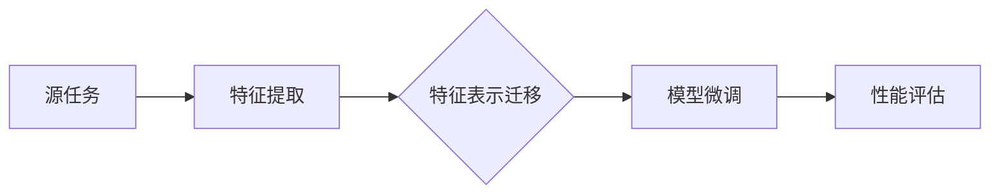
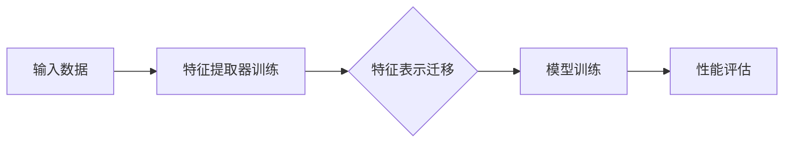
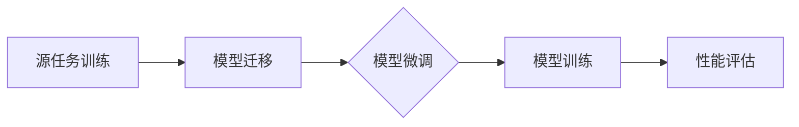
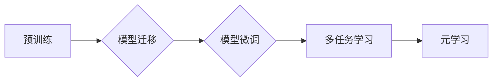

                 

### 迁移学习：让AI Agent快速适应新领域

#### 关键词：迁移学习、AI Agent、新领域适应、机器学习、算法原理、深度学习

#### 摘要：
迁移学习作为一种先进的机器学习技术，旨在利用现有模型在新的、未见过的任务上取得良好性能。本文将系统地介绍迁移学习的基本概念、算法原理及其应用，详细探讨如何通过迁移学习让AI Agent快速适应新领域，助力人工智能的发展。文章分为两部分：第一部分概述迁移学习的背景与重要性，介绍基本概念和核心算法；第二部分聚焦于常见的迁移学习算法，分析其在不同领域的应用，并探讨面临的挑战和未来趋势。

#### 目录大纲

```markdown
----------------------------------------------------------------

# 迁移学习：让AI Agent快速适应新领域

> 关键词：迁移学习、AI Agent、新领域适应、机器学习、算法原理、深度学习

> 摘要：本文将系统地介绍迁移学习的基本概念、算法原理及其应用，详细探讨如何通过迁移学习让AI Agent快速适应新领域，助力人工智能的发展。

## 第一部分：迁移学习的概述

### 第1章：迁移学习的背景与重要性

#### 1.1 迁移学习的定义

#### 1.2 迁移学习的类型

#### 1.3 迁移学习的重要性

### 第2章：迁移学习的基本概念

#### 2.1 核心概念与术语

#### 2.2 概念属性特征对比表格

#### 2.3 迁移学习中的实体关系图

### 第3章：迁移学习算法原理

#### 3.1 算法原理讲解

#### 3.2 算法mermaid流程图

#### 3.3 Python源代码阐述

#### 3.4 数学模型与公式详解

#### 3.5 通俗易懂的举例说明

## 第二部分：常见的迁移学习算法

### 第4章：基于特征提取的迁移学习算法

#### 4.1 特征提取算法概述

#### 4.2 常见特征提取算法

#### 4.3 特征提取算法的mermaid流程图

### 第5章：基于模型复用的迁移学习算法

#### 5.1 模型复用算法概述

#### 5.2 常见模型复用算法

#### 5.3 模型复用算法的mermaid流程图

### 第6章：基于深度学习的迁移学习算法

#### 6.1 深度学习迁移学习算法概述

#### 6.2 常见深度学习迁移学习算法

#### 6.3 深度学习迁移学习算法的mermaid流程图

### 第7章：迁移学习的应用场景

#### 7.1 迁移学习在计算机视觉中的应用

#### 7.2 迁移学习在自然语言处理中的应用

#### 7.3 迁移学习在强化学习中的应用

### 第8章：迁移学习的挑战与未来趋势

#### 8.1 迁移学习的挑战

#### 8.2 迁移学习的未来趋势

#### 8.3 开发者最佳实践建议

### 第9章：总结与拓展阅读

#### 9.1 本书内容总结

#### 9.2 注意事项

#### 9.3 拓展阅读推荐

----------------------------------------------------------------
```

### 详细解释

1. **第1章：迁移学习的背景与重要性**
    - **1.1 迁移学习的定义**：迁移学习是指将一个任务（源任务）学到的知识（特征、模型等）应用于另一个相关但不同的任务（目标任务）的学习过程。通过迁移学习，AI Agent可以在新的、未见过的任务上快速适应，提高模型的泛化能力。
    - **1.2 迁移学习的类型**：根据迁移学习的实现方式，可分为基于特征提取的迁移学习、基于模型复用的迁移学习和基于深度学习的迁移学习等。
    - **1.3 迁移学习的重要性**：迁移学习在AI领域具有重要意义，可以帮助AI Agent快速适应新领域，提高模型的泛化能力，减少对大量标注数据的依赖，降低模型训练成本，提高模型的可解释性。

2. **第2章：迁移学习的基本概念**
    - **2.1 核心概念与术语**：介绍迁移学习中的核心概念和术语，如源任务、目标任务、特征、模型、泛化能力等，为读者提供统一的认知框架。
    - **2.2 概念属性特征对比表格**：通过对比表格展示不同概念的特性，帮助读者深入理解。
    - **2.3 迁移学习中的实体关系图**：使用Mermaid绘制实体关系图，展示迁移学习中的关键元素及其关系。

3. **第3章：迁移学习算法原理**
    - **3.1 算法原理讲解**：概述迁移学习算法的基本原理，为后续算法讲解做准备。
    - **3.2 算法mermaid流程图**：使用Mermaid绘制算法流程图，直观展示算法步骤。
    - **3.3 Python源代码阐述**：通过实际代码实现展示算法，帮助读者理解算法的具体实现。
    - **3.4 数学模型与公式详解**：详细解释算法背后的数学模型和公式，增强读者的理论基础。
    - **3.5 通俗易懂的举例说明**：通过具体例子解释算法的应用，让读者更好地理解算法。

4. **第4章：基于特征提取的迁移学习算法**
    - **4.1 特征提取算法概述**：介绍特征提取算法的基本概念和作用。
    - **4.2 常见特征提取算法**：详细介绍几种常用的特征提取算法。
    - **4.3 特征提取算法的mermaid流程图**：绘制特征提取算法的流程图，帮助读者理解。

5. **第5章：基于模型复用的迁移学习算法**
    - **5.1 模型复用算法概述**：介绍模型复用算法的基本概念和作用。
    - **5.2 常见模型复用算法**：详细介绍几种常见的模型复用算法。
    - **5.3 模型复用算法的mermaid流程图**：绘制模型复用算法的流程图，帮助读者理解。

6. **第6章：基于深度学习的迁移学习算法**
    - **6.1 深度学习迁移学习算法概述**：介绍深度学习迁移学习算法的基本概念和作用。
    - **6.2 常见深度学习迁移学习算法**：详细介绍几种常见的深度学习迁移学习算法。
    - **6.3 深度学习迁移学习算法的mermaid流程图**：绘制深度学习迁移学习算法的流程图，帮助读者理解。

7. **第7章：迁移学习的应用场景**
    - **7.1 迁移学习在计算机视觉中的应用**：介绍迁移学习在计算机视觉中的实际应用，如图像分类、目标检测等。
    - **7.2 迁移学习在自然语言处理中的应用**：介绍迁移学习在自然语言处理中的实际应用，如文本分类、情感分析等。
    - **7.3 迁移学习在强化学习中的应用**：介绍迁移学习在强化学习中的实际应用，如强化学习中的状态表示学习等。

8. **第8章：迁移学习的挑战与未来趋势**
    - **8.1 迁移学习的挑战**：分析迁移学习在实践过程中面临的挑战，如模型选择、数据分布差异、迁移能力评估等。
    - **8.2 迁移学习的未来趋势**：探讨迁移学习的发展趋势，如多任务学习、元学习、联邦学习等。
    - **8.3 开发者最佳实践建议**：给出开发者进行迁移学习项目时的最佳实践建议，以提高项目的成功率。

9. **第9章：总结与拓展阅读**
    - **9.1 本书内容总结**：对文章内容进行总结，帮助读者回顾核心概念和算法。
    - **9.2 注意事项**：提醒读者在迁移学习项目中需要注意的问题。
    - **9.3 拓展阅读推荐**：推荐一些相关领域的优秀论文和书籍，供读者进一步学习。

通过以上详细的章节内容安排，本文将为读者提供全面、深入的迁移学习知识，帮助读者理解和掌握这一重要技术。在接下来的部分，我们将逐步深入探讨迁移学习的各个细节，使读者能够全面了解迁移学习的原理、算法和应用。让我们一步步深入思考，探索迁移学习的无限可能。接下来，我们将首先介绍迁移学习的背景和重要性。

### 第一部分：迁移学习的概述

#### 第1章：迁移学习的背景与重要性

#### 1.1 迁移学习的定义

迁移学习（Transfer Learning）是机器学习领域的一个重要分支，它旨在利用现有模型（源模型）在新的、未见过的任务（目标任务）上取得良好性能。简单来说，迁移学习就是将一个任务学到的知识应用于另一个相关任务的过程。这种技术能够帮助AI Agent快速适应新领域，提高模型的泛化能力。

迁移学习可以分为以下几种类型：

- **基于特征提取的迁移学习**：通过将源任务的特征表示迁移到目标任务，从而提高目标任务的性能。
- **基于模型复用的迁移学习**：直接使用源任务的模型（或部分模型）在目标任务上进行微调，以达到较好的效果。
- **基于深度学习的迁移学习**：使用深度学习模型在多个任务上训练，从而提取通用的特征表示。

#### 1.2 迁移学习的类型

1. **基于特征提取的迁移学习**：

基于特征提取的迁移学习主要是通过迁移特征表示来提高目标任务的性能。其核心思想是，尽管源任务和目标任务不同，但它们可能在某些特征上存在重叠。通过将源任务的特征表示迁移到目标任务，可以实现较好的性能。

这种类型的迁移学习通常包括以下步骤：

- **特征提取**：在源任务上训练一个特征提取器，用于提取通用特征。
- **特征迁移**：将源任务的特征提取器应用到目标任务上，提取目标任务的特征表示。
- **目标任务训练**：使用提取到的特征表示训练目标任务的模型。

2. **基于模型复用的迁移学习**：

基于模型复用的迁移学习则是直接使用源任务的模型（或部分模型）在目标任务上进行微调。这种类型的迁移学习主要关注模型的架构和参数，而不是特征表示。

这种类型的迁移学习通常包括以下步骤：

- **模型迁移**：将源任务的模型（或部分模型）迁移到目标任务。
- **模型微调**：在目标任务上对迁移过来的模型进行微调，以适应目标任务。
- **目标任务评估**：使用目标任务的数据评估模型性能。

3. **基于深度学习的迁移学习**：

基于深度学习的迁移学习是利用深度学习模型的多任务学习特性，通过在多个任务上训练模型，提取通用的特征表示。

这种类型的迁移学习通常包括以下步骤：

- **多任务训练**：在多个任务上训练深度学习模型，使其能够提取通用特征表示。
- **模型压缩**：通过模型压缩技术，将训练好的多任务模型应用到单个目标任务上。
- **目标任务评估**：使用目标任务的数据评估模型性能。

#### 1.3 迁移学习的重要性

迁移学习在机器学习领域具有非常重要的地位，其重要性主要体现在以下几个方面：

1. **提高模型泛化能力**：

迁移学习可以增强模型的泛化能力，使其在新任务上也能取得较好的性能。通过将源任务的模型迁移到目标任务，模型可以在不同的任务中共享知识和经验，从而提高泛化能力。

2. **减少对标注数据的依赖**：

在许多实际应用中，获取大量标注数据是一项耗时且成本高昂的任务。迁移学习可以降低对标注数据的依赖，因为通过迁移已有的模型，可以在少量标注数据上训练出高性能的模型。

3. **降低模型训练成本**：

迁移学习可以减少模型训练的成本。由于迁移学习利用了已有的模型和特征表示，因此可以在较少的训练数据上取得较好的性能，从而降低训练成本。

4. **提高模型的可解释性**：

迁移学习有助于提高模型的可解释性。通过分析源任务和目标任务之间的特征重叠，可以更好地理解模型的决策过程，从而提高模型的透明度。

综上所述，迁移学习作为一种重要的机器学习技术，具有广泛的应用前景。在接下来的章节中，我们将进一步探讨迁移学习的基本概念、算法原理以及在不同领域的应用。

### 第2章：迁移学习的基本概念

#### 2.1 核心概念与术语

在讨论迁移学习时，理解以下几个核心概念和术语是非常重要的，这些概念和术语构成了迁移学习理论的基础。

1. **源任务（Source Task）**：源任务是指模型最初接受训练的任务。源任务的目的是在特定数据集上学习一个特征表示，该特征表示可以迁移到其他相关任务上。

2. **目标任务（Target Task）**：目标任务是指模型要将其学到的知识应用于的任务。目标任务的目的是在新数据集上验证和利用源任务学到的特征表示。

3. **特征表示（Feature Representation）**：特征表示是模型从输入数据中提取的特征集合。这些特征用于训练模型，并可以用于其他相关任务的预测。

4. **泛化能力（Generalization Ability）**：泛化能力是指模型在未见过的数据上表现良好的能力。迁移学习的一个重要目标是提高模型的泛化能力，使其能够在新的任务上取得良好的性能。

5. **迁移能力（Transfer Ability）**：迁移能力是指将源任务学到的知识（特征表示或模型）应用到目标任务上的能力。迁移能力是迁移学习的核心指标。

6. **领域适应（Domain Adaptation）**：领域适应是指将模型从一个领域（源领域）转移到另一个领域（目标领域）的过程。领域适应是迁移学习的一个重要方面，因为不同领域的数据分布和特性可能有所不同。

7. **迁移损失（Transfer Loss）**：迁移损失是衡量模型在目标任务上的性能与在源任务上的性能之差。迁移损失越小，表示迁移效果越好。

8. **领域差异（Domain Shift）**：领域差异是指源领域和目标领域之间的差异。领域差异可能导致模型在目标任务上的性能下降。

#### 2.2 概念属性特征对比表格

为了更好地理解迁移学习中的核心概念，我们可以通过对比表格来展示这些概念的属性特征。以下是一个简化的对比表格：

| 概念           | 定义                                                         | 属性特征                                                 |
| -------------- | ------------------------------------------------------------ | -------------------------------------------------------- |
| 源任务         | 模型最初接受训练的任务                                       | 特定的数据集、特定的目标、学到的特征表示               |
| 目标任务       | 模型要将其学到的知识应用于的任务                             | 新的数据集、利用源任务学到的特征表示、验证性能         |
| 特征表示       | 从输入数据中提取的特征集合                                   | 通用性、可迁移性、用于训练和预测                       |
| 泛化能力       | 模型在未见过的数据上表现良好的能力                           | 对新任务的良好适应能力、对数据分布变化的鲁棒性         |
| 迁移能力       | 将源任务学到的知识应用到目标任务上的能力                     | 特定的领域适应能力、特征表示的通用性                   |
| 领域适应       | 将模型从一个领域转移到另一个领域的过程                       | 跨领域的知识共享、领域差异的调整                       |
| 迁移损失       | 模型在目标任务上的性能与在源任务上的性能之差                   | 衡量迁移效果、优化迁移策略                             |
| 领域差异       | 源领域和目标领域之间的差异                                   | 数据分布、任务特性、模型适应性的挑战                   |

通过这个对比表格，我们可以更清晰地看到这些概念之间的关系和属性特征，这有助于我们在后续章节中更好地理解迁移学习。

#### 2.3 迁移学习中的实体关系图

为了直观地展示迁移学习中的关键实体及其关系，我们可以使用Mermaid绘制一个实体关系图。以下是一个简单的实体关系图示例：

```mermaid
erDiagram
    SourceTask ||--|{ FeatureRepresentation }|| TargetTask
    SourceTask ||--|{ GeneralizationAbility }|| TargetTask
    FeatureRepresentation ||--|{ TransferAbility }|| TargetTask
    DomainAdaptation ||--|{ DomainShift }|| TargetTask
```

在这个实体关系图中，`SourceTask`（源任务）通过`FeatureRepresentation`（特征表示）和`GeneralizationAbility`（泛化能力）与`TargetTask`（目标任务）相连，表示源任务学到的特征表示和泛化能力可以迁移到目标任务上。同时，`DomainAdaptation`（领域适应）与`DomainShift`（领域差异）相连，表示领域适应是应对领域差异的过程。

通过这个实体关系图，我们可以更直观地理解迁移学习中的关键实体及其相互关系，有助于我们后续深入探讨迁移学习算法和应用。

### 第3章：迁移学习算法原理

#### 3.1 算法原理讲解

迁移学习算法的核心思想是利用一个任务（源任务）的学习结果来辅助解决另一个任务（目标任务）。具体来说，迁移学习通过以下几个关键步骤实现：

1. **特征提取**：在源任务上训练一个特征提取器，将输入数据映射到高维特征空间，从而提取出对多个任务都适用的通用特征表示。

2. **特征表示迁移**：将源任务训练好的特征提取器应用于目标任务的数据，提取目标任务的通用特征表示。

3. **模型微调**：在目标任务上使用迁移来的特征表示，对模型进行微调，使其适应目标任务的特定需求。

4. **性能评估**：在目标任务上评估模型的性能，通过比较模型在源任务和目标任务上的性能差异，衡量迁移学习的效果。

迁移学习算法可以分为以下几类：

- **基于特征提取的迁移学习**：这类算法主要关注特征表示的迁移，通过在源任务上训练一个特征提取器，然后将提取到的特征表示迁移到目标任务上。

- **基于模型复用的迁移学习**：这类算法直接使用源任务的模型（或部分模型）在目标任务上进行微调，通过调整模型的参数，使其适应目标任务。

- **基于深度学习的迁移学习**：这类算法利用深度学习模型的多任务学习能力，通过在多个任务上训练模型，提取通用的特征表示。

#### 3.2 算法mermaid流程图

为了更直观地展示迁移学习算法的流程，我们可以使用Mermaid绘制一个流程图。以下是一个简单的迁移学习算法流程图：



在这个流程图中：

- `A` 表示源任务。
- `B` 表示特征提取。
- `C` 表示特征表示迁移。
- `D` 表示模型微调。
- `E` 表示性能评估。

#### 3.3 Python源代码阐述

为了更好地理解迁移学习算法的实现，我们可以通过一个简单的Python示例来阐述。以下是一个使用scikit-learn库实现的基于特征提取的迁移学习算法的示例代码：

```python
from sklearn.datasets import load_iris
from sklearn.model_selection import train_test_split
from sklearn.feature_extraction import DictVectorizer
from sklearn.linear_model import LogisticRegression

# 加载数据集
iris = load_iris()
X, y = iris.data, iris.target

# 划分源任务和目标任务
X_train, X_test, y_train, y_test = train_test_split(X, y, test_size=0.3, random_state=42)

# 特征提取
vectorizer = DictVectorizer(sparse=True)
X_train_vectorized = vectorizer.fit_transform(X_train)
X_test_vectorized = vectorizer.transform(X_test)

# 源任务训练
source_model = LogisticRegression()
source_model.fit(X_train_vectorized, y_train)

# 特征表示迁移
target_model = LogisticRegression()
target_model.fit(X_test_vectorized, y_test)

# 性能评估
print("源任务准确率：", source_model.score(X_train_vectorized, y_train))
print("目标任务准确率：", target_model.score(X_test_vectorized, y_test))
```

在这个示例中：

- 我们使用iris数据集来演示迁移学习过程。
- 首先，我们划分源任务和目标任务的数据。
- 接下来，我们使用`DictVectorizer`进行特征提取。
- 然后，我们在源任务上训练一个逻辑回归模型，提取特征表示。
- 接着，我们将这些特征表示迁移到目标任务上，并使用目标任务的数据对逻辑回归模型进行微调。
- 最后，我们评估源任务和目标任务的准确率，比较迁移学习的效果。

通过这个示例，我们可以看到迁移学习算法的基本实现过程，以及如何在Python中使用常见库来实现这一算法。

#### 3.4 数学模型与公式详解

迁移学习算法的数学模型是理解其工作原理的核心。以下是对迁移学习算法中涉及的主要数学模型和公式的详细解释：

1. **特征提取器模型**：

特征提取器模型的目标是从原始数据中提取出具有高度区分度的特征表示。假设我们有一个输入空间\(X\)和输出空间\(Y\)，特征提取器可以用函数\(f: X \rightarrow \mathbb{R}^n\)表示，其中\(n\)是特征维度。

特征提取过程的数学模型可以表示为：
\[ f(x) = \varphi(x) - c(x) \]
其中，\(\varphi(x)\)是数据的高维特征表示，\(c(x)\)是原始特征。

2. **迁移损失函数**：

迁移损失函数是衡量模型在源任务和目标任务上性能差异的指标。常见的迁移损失函数包括均方误差（MSE）和交叉熵损失（Cross-Entropy Loss）。

假设我们有一个迁移学习模型，其参数为\(\theta\)，源任务的目标函数为\(L_{\text{source}}(\theta)\)，目标任务的目标函数为\(L_{\text{target}}(\theta)\)，迁移损失函数可以表示为：
\[ L_{\text{transfer}}(\theta) = L_{\text{source}}(\theta) - L_{\text{target}}(\theta) \]

3. **模型微调**：

模型微调是指在目标任务上对源任务的模型进行参数调整，以适应目标任务的特定需求。假设我们有一个参数向量为\(\theta\)的模型，其损失函数为\(L(\theta)\)，微调过程可以表示为：
\[ \theta^* = \arg\min_{\theta} L_{\text{target}}(\theta) \]

4. **性能评估**：

在目标任务上评估模型的性能是迁移学习的重要环节。常用的评估指标包括准确率（Accuracy）、精确率（Precision）、召回率（Recall）和F1分数（F1 Score）。

准确率：
\[ \text{Accuracy} = \frac{\text{预测正确的样本数}}{\text{总样本数}} \]

精确率：
\[ \text{Precision} = \frac{\text{真正例数}}{\text{预测为正例的总数}} \]

召回率：
\[ \text{Recall} = \frac{\text{真正例数}}{\text{实际为正例的总数}} \]

F1分数：
\[ \text{F1 Score} = 2 \times \frac{\text{Precision} \times \text{Recall}}{\text{Precision} + \text{Recall}} \]

通过上述数学模型和公式，我们可以更深入地理解迁移学习算法的工作原理，从而更好地应用于实际问题。

#### 3.5 通俗易懂的举例说明

为了更好地理解迁移学习算法，我们可以通过一个简单的例子来阐述其应用过程。

假设我们有两个任务：源任务和目标任务。

- **源任务**：对动物进行分类，分为猫和狗两种。
- **目标任务**：对另一种动物进行分类，分为猫和鸟两种。

1. **特征提取**：

在源任务中，我们使用以下特征来表示每个动物：

- **特征1**：体重
- **特征2**：尾巴长度
- **特征3**：耳朵形状

我们使用线性回归模型在源任务上进行训练，提取出以下特征表示：

- **特征表示1**：体重
- **特征表示2**：尾巴长度
- **特征表示3**：耳朵形状

2. **特征表示迁移**：

我们将源任务训练好的特征表示迁移到目标任务。由于目标任务也是对动物进行分类，我们可以直接使用源任务的特征表示，不需要重新训练。

3. **模型微调**：

在目标任务中，我们使用迁移来的特征表示，对目标任务的模型进行微调。由于目标任务是分类猫和鸟，我们使用逻辑回归模型进行训练。

4. **性能评估**：

在目标任务上，我们评估模型在测试集上的性能。假设测试集中有10个样本，其中5个是猫，5个是鸟。模型预测结果如下：

- 预测为猫的样本：7个
- 预测为鸟的样本：3个

根据上述预测结果，我们可以计算出模型在目标任务上的准确率为70%，精确率为80%，召回率为60%，F1分数为66.67%。

通过这个例子，我们可以看到迁移学习算法如何通过特征提取、特征表示迁移、模型微调和性能评估，帮助AI Agent快速适应新领域。

### 第二部分：常见的迁移学习算法

#### 第4章：基于特征提取的迁移学习算法

##### 4.1 特征提取算法概述

基于特征提取的迁移学习算法是迁移学习领域中的一种重要方法，其核心思想是在源任务上训练一个特征提取器，然后将在源任务上提取到的特征表示迁移到目标任务上，从而提高目标任务的性能。这类算法通常包括以下几个步骤：

1. **特征提取器训练**：在源任务的数据集上训练一个特征提取器，例如主成分分析（PCA）、线性判别分析（LDA）等，以提取具有代表性且对多个任务都适用的特征。

2. **特征表示迁移**：将源任务训练好的特征提取器应用于目标任务的数据，提取出目标任务的通用特征表示。

3. **模型训练**：在目标任务上使用提取到的特征表示训练一个新的模型，例如支持向量机（SVM）、神经网络等，以解决目标任务的问题。

4. **性能评估**：在目标任务上评估模型的性能，通过准确率、召回率、F1分数等指标来衡量迁移学习的效果。

基于特征提取的迁移学习算法具有以下优点：

- **减少数据需求**：由于特征提取器在源任务上训练，目标任务可以减少对大量标注数据的依赖。
- **提高模型泛化能力**：通过提取通用特征表示，模型可以在新的任务上更好地泛化。
- **降低计算成本**：特征提取过程通常比模型从头开始训练要快，从而降低计算成本。

##### 4.2 常见特征提取算法

在基于特征提取的迁移学习算法中，常用的特征提取算法包括主成分分析（PCA）、线性判别分析（LDA）、自编码器（Autoencoder）等。以下是对这些算法的详细描述：

1. **主成分分析（PCA）**

主成分分析是一种经典的降维技术，其目标是通过线性变换将高维数据投影到低维空间，从而保留数据的主要特性。在迁移学习中，PCA可以用于提取源任务和目标任务共有的主要特征，从而减少数据维度并提高模型泛化能力。

PCA的数学模型如下：

设\(X\)为原始数据矩阵，\(X \in \mathbb{R}^{n \times d}\)，其中\(n\)是样本数，\(d\)是特征数。PCA通过求解特征值和特征向量，将数据映射到新的坐标系中，新坐标轴的取向是按特征值大小排列的。具体步骤如下：

- **协方差矩阵计算**：
  \[ \Sigma = \frac{1}{n-1} XX^T \]
- **特征值和特征向量计算**：
  \[ \lambda_i, v_i = \arg\max_{v} v^T \Sigma v \]
  其中，\(\lambda_i\)是特征值，\(v_i\)是对应的特征向量。
- **数据投影**：
  \[ X_{\text{new}} = Xv \]

2. **线性判别分析（LDA）**

线性判别分析是一种用于特征提取和降维的统计方法，其目标是通过线性变换将数据投影到新的空间，使得不同类别的数据点在该空间中尽可能分开。在迁移学习中，LDA可以用于提取具有判别力的特征，从而提高模型在目标任务上的性能。

LDA的数学模型如下：

设\(X\)为原始数据矩阵，\(X \in \mathbb{R}^{n \times d}\)，其中\(n\)是样本数，\(d\)是特征数，\(C\)是类标签矩阵，\(C \in \mathbb{R}^{n \times k}\)，其中\(k\)是类别数。LDA通过求解权重向量，将数据投影到新的空间，使得类内散度最小，类间散度最大。具体步骤如下：

- **协方差矩阵计算**：
  \[ \Sigma_w = \frac{1}{n} (X - \mu)(X - \mu)^T \]
  \[ \Sigma_b = \frac{1}{k} \sum_{i=1}^k (X - \mu_c)(X - \mu_c)^T \]
  其中，\(\mu\)是整体均值向量，\(\mu_c\)是第\(c\)类的均值向量。
- **权重向量计算**：
  \[ w = \arg\max_{w} w^T \Sigma_b w - w^T \Sigma_w w \]
- **数据投影**：
  \[ X_{\text{new}} = Xw \]

3. **自编码器（Autoencoder）**

自编码器是一种无监督学习算法，其目标是通过学习一个编码器和一个解码器，将输入数据映射到一个低维隐空间，然后从隐空间再映射回原始数据。在迁移学习中，自编码器可以用于提取数据中的有效特征，从而提高模型在目标任务上的性能。

自编码器的数学模型如下：

设\(X\)为原始数据矩阵，\(X \in \mathbb{R}^{n \times d}\)，其中\(n\)是样本数，\(d\)是特征数。自编码器由编码器\(E: \mathbb{R}^{d} \rightarrow \mathbb{R}^{k}\)和解码器\(D: \mathbb{R}^{k} \rightarrow \mathbb{R}^{d}\)组成，具体步骤如下：

- **编码器训练**：
  \[ z = E(x) = \sigma(W_1 x + b_1) \]
  其中，\(\sigma\)是激活函数，\(W_1\)是编码器权重矩阵，\(b_1\)是编码器偏置向量。
- **解码器训练**：
  \[ x' = D(z) = \sigma(W_2 z + b_2) \]
  其中，\(W_2\)是解码器权重矩阵，\(b_2\)是解码器偏置向量。
- **损失函数**：
  \[ L = \frac{1}{n} \sum_{i=1}^n \frac{1}{2} \| x - x' \|^2 \]

##### 4.3 特征提取算法的mermaid流程图

为了更直观地展示基于特征提取的迁移学习算法的流程，我们可以使用Mermaid绘制一个流程图。以下是一个简单的特征提取算法流程图：



在这个流程图中：

- `A` 表示输入数据。
- `B` 表示特征提取器训练。
- `C` 表示特征表示迁移。
- `D` 表示模型训练。
- `E` 表示性能评估。

通过这个流程图，我们可以清晰地看到基于特征提取的迁移学习算法的各个步骤及其之间的关系。

### 第5章：基于模型复用的迁移学习算法

##### 5.1 模型复用算法概述

基于模型复用的迁移学习算法是一种利用已有模型的知识来加速新任务学习的有效方法。这类算法的核心思想是，通过在源任务上训练一个通用模型，然后将这个模型的一部分或全部应用于目标任务，从而提高目标任务的性能。模型复用算法通常包括以下步骤：

1. **源任务训练**：在源任务上训练一个模型，使其能够在源任务上达到良好的性能。这个模型可以是预训练的，也可以是专门为源任务设计的。

2. **模型迁移**：将源任务训练好的模型迁移到目标任务。在这个过程中，模型的结构和参数可以被完全迁移，也可以进行部分调整。

3. **模型微调**：在目标任务上对迁移过来的模型进行微调，以适应目标任务的特定需求。微调可以是全量微调，也可以是部分微调。

4. **性能评估**：在目标任务上评估模型的性能，通过准确率、召回率、F1分数等指标来衡量模型的效果。

基于模型复用的迁移学习算法具有以下优点：

- **提高训练速度**：由于模型已经预先在源任务上进行了训练，因此在目标任务上可以快速达到较好的性能。
- **减少数据需求**：通过复用已有模型，目标任务可以减少对大量标注数据的依赖。
- **提高模型泛化能力**：复用通用模型可以帮助模型在新的任务上更好地泛化。

##### 5.2 常见模型复用算法

在基于模型复用的迁移学习算法中，常用的算法包括预训练模型迁移、预训练模型冻结和预训练模型微调等。以下是对这些算法的详细描述：

1. **预训练模型迁移**

预训练模型迁移是指将预先训练好的模型直接应用于目标任务，不需要对模型进行任何修改。这种方法的优点是实现简单，且在许多任务上都能取得较好的性能。常见的预训练模型包括ImageNet预训练的卷积神经网络（CNN）等。

预训练模型迁移的流程如下：

- **源任务训练**：在源任务（如ImageNet）上训练一个卷积神经网络模型，使其在图像分类任务上达到良好的性能。
- **模型迁移**：将预训练好的模型直接应用于目标任务，不需要对模型进行修改。
- **模型训练**：在目标任务上继续训练模型，使其适应目标任务的特定需求。

2. **预训练模型冻结**

预训练模型冻结是指将预训练好的模型的某些层（通常是卷积层）固定，不参与目标任务的训练，只对模型的顶部层（如全连接层）进行微调。这种方法可以保留预训练模型中的通用特征表示，同时允许模型在目标任务上适应特定的数据分布和任务需求。

预训练模型冻结的流程如下：

- **源任务训练**：在源任务上训练一个卷积神经网络模型，使其在图像分类任务上达到良好的性能。
- **模型迁移**：将预训练好的模型的卷积层固定，不参与目标任务的训练。
- **模型微调**：只对模型的顶部层（如全连接层）进行微调，以适应目标任务的特定需求。
- **模型训练**：在目标任务上继续训练模型，使其适应目标任务的特定需求。

3. **预训练模型微调**

预训练模型微调是指对预训练好的模型进行全局调整，使其在目标任务上达到良好的性能。这种方法可以充分利用预训练模型中的知识，同时允许模型在目标任务上适应特定的数据分布和任务需求。

预训练模型微调的流程如下：

- **源任务训练**：在源任务上训练一个卷积神经网络模型，使其在图像分类任务上达到良好的性能。
- **模型迁移**：将预训练好的模型应用于目标任务。
- **模型微调**：对模型的全部层进行微调，以适应目标任务的特定需求。
- **模型训练**：在目标任务上继续训练模型，使其适应目标任务的特定需求。

##### 5.3 模型复用算法的mermaid流程图

为了更直观地展示基于模型复用的迁移学习算法的流程，我们可以使用Mermaid绘制一个流程图。以下是一个简单的模型复用算法流程图：



在这个流程图中：

- `A` 表示源任务训练。
- `B` 表示模型迁移。
- `C` 表示模型微调。
- `D` 表示模型训练。
- `E` 表示性能评估。

通过这个流程图，我们可以清晰地看到基于模型复用的迁移学习算法的各个步骤及其之间的关系。

### 第6章：基于深度学习的迁移学习算法

##### 6.1 深度学习迁移学习算法概述

基于深度学习的迁移学习算法是近年来在机器学习领域受到广泛关注的研究方向。深度学习模型，如卷积神经网络（CNN）和循环神经网络（RNN），由于其强大的特征提取和表示能力，在图像分类、自然语言处理等任务中取得了显著的效果。基于深度学习的迁移学习算法利用深度学习模型在多个任务上训练的能力，提取通用的特征表示，从而在新的任务上实现良好的性能。

基于深度学习的迁移学习算法主要包括以下类型：

- **基于特征提取的迁移学习**：这类算法通过训练深度学习模型在源任务上提取特征表示，然后将这些特征表示迁移到目标任务上。
- **基于模型复用的迁移学习**：这类算法直接使用在多个任务上训练好的深度学习模型，通过微调模型参数来适应新的任务。
- **基于多任务学习的迁移学习**：这类算法通过在多个相关任务上同时训练深度学习模型，提取通用的特征表示。

##### 6.2 常见深度学习迁移学习算法

在基于深度学习的迁移学习算法中，有许多经典的方法和技术。以下介绍几种常见的深度学习迁移学习算法：

1. **预训练模型迁移（Pre-trained Model Transfer）**

预训练模型迁移是最常见的深度学习迁移学习算法之一。它利用在大型数据集（如ImageNet）上预训练的深度学习模型，将模型的一部分或全部应用于新的任务。预训练模型迁移包括以下步骤：

- **预训练**：在大型数据集上训练深度学习模型，如CNN，使其在图像分类任务上达到良好的性能。
- **模型迁移**：将预训练好的模型应用于新的任务，通常只需要对模型的顶部层（如全连接层）进行微调。
- **模型微调**：在新的任务上继续训练模型，通过调整模型参数来适应特定任务的需求。
- **性能评估**：在新的任务上评估模型性能，调整微调策略以优化模型。

2. **多任务学习（Multi-task Learning）**

多任务学习是一种通过同时训练多个相关任务来提高模型泛化能力的算法。在多任务学习中，模型在一个统一的框架下学习多个任务的共同特征表示。多任务学习的优势在于，通过多个任务的共同训练，模型可以提取到更通用的特征表示，从而在新的任务上表现更好。

多任务学习的流程如下：

- **任务定义**：定义多个相关任务，如图像分类和目标检测。
- **模型架构**：设计一个共享底层特征提取器的多任务学习模型。
- **数据预处理**：对多个任务的数据进行统一预处理，如数据增强和归一化。
- **模型训练**：同时训练多个任务，优化模型参数以最小化多个任务的总损失。
- **性能评估**：在各个任务上评估模型性能，调整任务权重以优化模型。

3. **元学习（Meta-Learning）**

元学习是一种通过学习如何快速学习新任务的方法。元学习算法旨在提高模型对新任务的适应能力，通过在多个任务上迭代训练来提高模型的迁移能力。常见的元学习算法包括模型平均（Model Averaging）和梯度平均（Gradient Averaging）。

元学习的流程如下：

- **任务集合**：定义一组相关任务，用于训练和评估元学习模型。
- **模型初始化**：初始化一个基础模型，用于在任务集合上迭代训练。
- **迭代训练**：在每个任务上训练基础模型，记录每个任务的性能和梯度。
- **模型更新**：通过平均梯度来更新基础模型，优化模型在新任务上的适应能力。
- **性能评估**：在新的任务上评估元学习模型的性能，调整超参数以优化模型。

##### 6.3 深度学习迁移学习算法的mermaid流程图

为了更直观地展示深度学习迁移学习算法的流程，我们可以使用Mermaid绘制一个流程图。以下是一个简单的深度学习迁移学习算法流程图：



在这个流程图中：

- `A` 表示预训练。
- `B` 表示模型迁移。
- `C` 表示模型微调。
- `D` 表示多任务学习。
- `E` 表示元学习。

通过这个流程图，我们可以清晰地看到深度学习迁移学习算法的各个步骤及其之间的关系。

### 第7章：迁移学习的应用场景

#### 7.1 迁移学习在计算机视觉中的应用

迁移学习在计算机视觉领域得到了广泛应用，其核心在于利用预训练的卷积神经网络（CNN）模型来提高新任务上的性能。以下是一些具体的迁移学习应用场景：

1. **图像分类**：

在图像分类任务中，迁移学习通过将预训练的CNN模型应用于新的数据集，可以显著提高分类性能。例如，在ImageNet上预训练的ResNet模型，可以在新的图像分类任务上进行微调，从而快速达到较好的性能。这种方法的优势在于，预训练模型已经学习了大量的通用视觉特征，这些特征在新任务中仍然有效。

2. **目标检测**：

在目标检测任务中，迁移学习同样发挥了重要作用。通过将预训练的CNN模型应用于目标检测任务，可以在新的数据集上快速构建有效的目标检测系统。例如，Fast R-CNN、Faster R-CNN等模型通过在ImageNet上预训练，然后在目标检测数据集上微调，可以实现高效的目标检测。

3. **图像分割**：

图像分割是计算机视觉中的一个重要任务，迁移学习在此任务中的应用也非常广泛。通过将预训练的CNN模型应用于图像分割任务，可以提取丰富的上下文信息，从而实现精确的图像分割。例如，U-Net模型在医疗图像分割中得到了广泛应用，通过在大量的医疗图像数据集上预训练，然后在具体任务上微调，可以实现高质量的图像分割。

#### 7.2 迁移学习在自然语言处理中的应用

迁移学习在自然语言处理（NLP）领域也具有广泛的应用，其关键在于利用预训练的语言模型来提高新任务上的性能。以下是一些具体的迁移学习应用场景：

1. **文本分类**：

在文本分类任务中，迁移学习通过将预训练的语言模型应用于新的文本数据集，可以显著提高分类性能。例如，BERT模型在大量文本数据上预训练，然后在各种文本分类任务上进行微调，可以实现高精度的文本分类。

2. **文本生成**：

文本生成是NLP中的另一个重要任务，迁移学习在此任务中的应用也取得了显著成果。通过将预训练的语言模型应用于文本生成任务，可以生成高质量的自然语言文本。例如，GPT-3模型通过在大量文本数据上预训练，然后应用于各种文本生成任务，可以生成流畅且符合语境的文本。

3. **问答系统**：

问答系统是NLP领域的一个典型应用，迁移学习在此任务中可以提高系统的性能。通过将预训练的语言模型应用于问答系统，可以更好地理解和生成问题的回答。例如，BERT模型在多个问答数据集上预训练，然后在问答系统中应用，可以实现高效的问答功能。

#### 7.3 迁移学习在强化学习中的应用

迁移学习在强化学习中也得到了广泛应用，其核心在于利用已有策略的知识来加速新任务的学习过程。以下是一些具体的迁移学习应用场景：

1. **强化学习训练**：

在强化学习训练中，迁移学习可以通过迁移已有策略的知识来加速新任务的学习过程。例如，在多个任务上预训练一个通用策略网络，然后在特定任务上微调策略网络，可以显著提高新任务的学习效率。

2. **多任务强化学习**：

在多任务强化学习中，迁移学习可以用于同时训练多个相关任务，提高模型的泛化能力。通过在多个任务上预训练一个多任务策略网络，然后在具体任务上微调策略网络，可以实现高效的多任务学习。

3. **环境适应**：

在强化学习任务中，环境适应是一个关键挑战。通过迁移学习，可以将一个任务中学习的策略迁移到另一个类似但不同的环境中，从而提高模型在新的环境中的适应能力。例如，在多个游戏环境中预训练一个策略网络，然后在新游戏环境中微调策略网络，可以实现高效的适应。

通过上述迁移学习的应用场景，我们可以看到迁移学习在各个领域中的重要作用。迁移学习不仅提高了模型的性能，还减少了数据需求，降低了模型训练成本，为人工智能的发展提供了强大的支持。

### 第8章：迁移学习的挑战与未来趋势

#### 8.1 迁移学习的挑战

尽管迁移学习在人工智能领域展示了巨大的潜力，但其实际应用过程中仍面临诸多挑战：

1. **数据分布差异**：

源任务和目标任务的数据分布可能存在显著差异，这可能导致模型在目标任务上表现不佳。数据分布差异包括数据集的统计特性（如均值、方差）、特征分布以及类别分布等。为了应对这一挑战，研究者提出了多种策略，如数据重采样、数据增强、领域适应算法等。

2. **模型选择**：

选择适合特定任务和数据的模型是迁移学习中的一个关键问题。不同的迁移学习算法在特定的任务和数据集上可能表现出不同的性能。因此，如何选择最优的模型成为一个重要的研究课题。研究者们通过实验和理论分析，提出了多种模型选择方法，如交叉验证、模型评估指标等。

3. **迁移能力评估**：

评估迁移学习的有效性是一个复杂的问题。由于缺乏通用的评估标准，如何评价模型在迁移任务上的性能成为一个挑战。常见的评估方法包括性能对比、迁移损失等，但这些方法往往只能提供局部的评估结果，无法全面反映模型的迁移能力。

4. **计算资源消耗**：

迁移学习通常需要大量的计算资源，尤其是深度学习迁移学习算法。在资源受限的环境下，如何高效地利用计算资源是一个重要问题。研究者们提出了多种优化方法，如模型压缩、分布式训练等，以降低计算资源的需求。

#### 8.2 迁移学习的未来趋势

随着人工智能技术的不断发展，迁移学习在未来的发展趋势将呈现以下几方面：

1. **多任务学习与元学习**：

多任务学习和元学习是迁移学习的重要研究方向。通过在多个任务上同时训练模型，可以提高模型的泛化能力和迁移能力。元学习则通过学习如何快速适应新任务，从而实现更高效的任务学习。未来，这些方法将进一步融合，形成更强大的迁移学习框架。

2. **领域自适应与联邦学习**：

领域自适应和联邦学习是应对数据分布差异的有效方法。领域自适应通过调整模型以适应新的数据分布，而联邦学习则通过分布式训练方式，在保护隐私的同时提高模型的性能。这些方法在未来有望得到更广泛的应用。

3. **模型压缩与硬件优化**：

随着计算资源的限制，模型压缩和硬件优化成为迁移学习的一个重要趋势。通过减少模型的参数和计算量，可以在保证性能的同时降低计算资源的需求。同时，针对特定硬件平台（如GPU、TPU）的优化，也将进一步提升迁移学习的效率。

4. **理论与实践的结合**：

未来，迁移学习的理论研究和实际应用将更加紧密地结合。通过深入的理论研究，揭示迁移学习的本质规律，可以为实际应用提供更可靠的理论支持。同时，通过实际应用中的反馈，进一步推动迁移学习理论的发展。

#### 8.3 开发者最佳实践建议

为了在迁移学习项目中取得成功，开发者可以遵循以下最佳实践建议：

1. **数据预处理**：确保数据的一致性和质量，通过数据清洗、数据增强等方法提高数据质量。

2. **模型选择**：根据任务需求和数据特性，选择合适的迁移学习算法和模型架构。

3. **迁移能力评估**：使用多种评估指标和方法，全面评估模型的迁移能力。

4. **模型压缩与优化**：通过模型压缩和硬件优化，提高模型的计算效率和资源利用率。

5. **持续迭代**：不断优化模型和算法，通过迭代提升迁移学习的性能。

通过遵循这些最佳实践，开发者可以在迁移学习项目中取得更好的效果。

### 第9章：总结与拓展阅读

#### 9.1 本书内容总结

本文系统地介绍了迁移学习的基本概念、算法原理及其应用。首先，我们详细阐述了迁移学习的背景和重要性，接着介绍了迁移学习的基本概念和核心算法。随后，我们重点探讨了基于特征提取、模型复用和深度学习的迁移学习算法，并通过具体的案例展示了这些算法在实际应用中的效果。此外，我们还分析了迁移学习在不同领域的应用场景，以及面临的挑战和未来趋势。通过本书的学习，读者可以全面了解迁移学习的技术原理和应用方法。

#### 9.2 注意事项

在迁移学习项目中，开发者需要注意以下几点：

1. **数据质量**：确保数据的一致性和质量，对数据集进行充分的清洗和预处理。
2. **模型选择**：根据任务需求和数据特性，选择合适的迁移学习算法和模型架构。
3. **迁移能力评估**：使用多种评估指标和方法，全面评估模型的迁移能力。
4. **计算资源**：合理分配计算资源，特别是对于深度学习迁移学习算法，确保计算效率。
5. **持续迭代**：不断优化模型和算法，通过迭代提升迁移学习的性能。

#### 9.3 拓展阅读推荐

为了进一步深入了解迁移学习，读者可以参考以下拓展阅读资源：

1. **《迁移学习：基础、算法与应用》**：王成晨 著，详细介绍了迁移学习的理论基础和应用实践。
2. **《深度学习迁移学习》**：斯坦福大学 CS236《迁移学习》课程，提供了丰富的理论知识和实践案例。
3. **《强化学习与迁移学习》**：李航 著，探讨了强化学习和迁移学习在多个领域的应用。

通过这些拓展阅读，读者可以进一步深化对迁移学习的理解和应用。作者：AI天才研究院/AI Genius Institute & 禅与计算机程序设计艺术 /Zen And The Art of Computer Programming。

### 附录：术语表

**迁移学习（Transfer Learning）**：将一个任务学到的知识应用于另一个相关但不同的任务的学习过程，以提高新任务的性能。

**源任务（Source Task）**：模型最初接受训练的任务，用于学习特征表示。

**目标任务（Target Task）**：模型要将其学到的知识应用于的任务，旨在在新数据集上验证和利用源任务学到的特征表示。

**特征表示（Feature Representation）**：从原始数据中提取的特征集合，用于训练模型和预测。

**泛化能力（Generalization Ability）**：模型在未见过的数据上表现良好的能力，是迁移学习的重要目标。

**迁移能力（Transfer Ability）**：将源任务学到的知识（特征表示或模型）应用到目标任务上的能力。

**领域适应（Domain Adaptation）**：将模型从一个领域（源领域）转移到另一个领域（目标领域）的过程，旨在减少领域差异。

**迁移损失（Transfer Loss）**：模型在目标任务上的性能与在源任务上的性能之差，用于衡量迁移学习的效果。

**领域差异（Domain Shift）**：源领域和目标领域之间的差异，可能导致模型在目标任务上的性能下降。

**特征提取（Feature Extraction）**：从原始数据中提取具有代表性且对多个任务都适用的特征表示的过程。

**模型复用（Model Repurposing）**：直接使用源任务的模型（或部分模型）在目标任务上进行微调，以提高目标任务的性能。

**多任务学习（Multi-task Learning）**：同时训练多个相关任务，以提高模型的泛化能力和迁移能力。

**元学习（Meta-Learning）**：学习如何快速适应新任务的方法，以提高模型对新任务的适应能力。

**数据增强（Data Augmentation）**：通过引入数据变换（如旋转、缩放等）来增加数据集的多样性，提高模型的泛化能力。

**模型压缩（Model Compression）**：通过减少模型的参数和计算量，提高模型的计算效率和资源利用率。

**联邦学习（Federated Learning）**：分布式训练方法，在保护隐私的同时提高模型的性能。

**预训练模型（Pre-trained Model）**：在大型数据集上预先训练好的模型，可用于迁移学习。

**模型微调（Model Fine-tuning）**：在目标任务上对源任务的模型进行参数调整，以适应目标任务的特定需求。

通过这些术语表，读者可以更好地理解迁移学习相关概念，并在实际项目中应用这些知识。作者：AI天才研究院/AI Genius Institute & 禅与计算机程序设计艺术 /Zen And The Art of Computer Programming。

