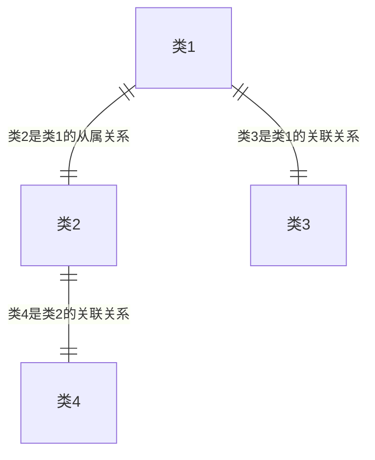
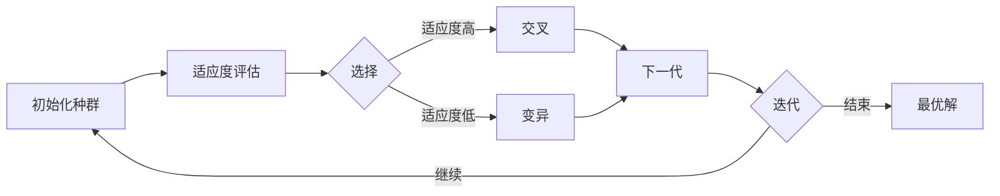
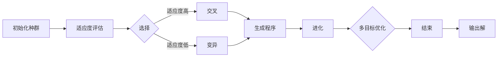
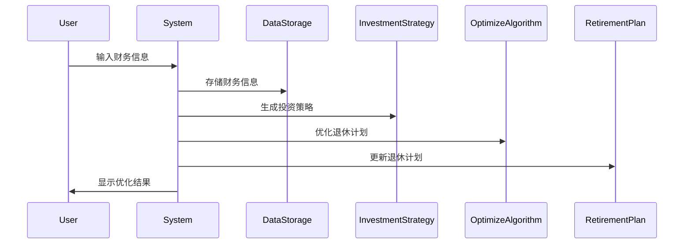
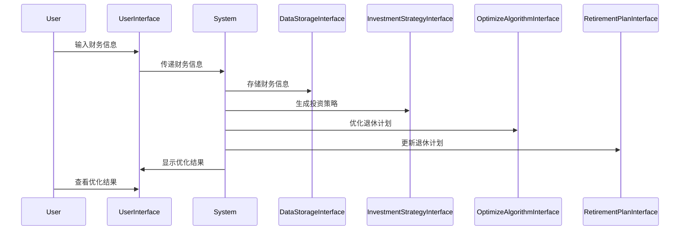

                 


# 退休计划优化算法

> 关键词：退休计划，优化算法，遗传算法，Python代码，数学模型，系统架构设计，实战案例

> 摘要：本文将深入探讨退休计划优化算法，通过一步一步的逻辑分析和推理，详细讲解优化算法的基本原理、核心概念、数学模型及具体应用，并结合实战案例，阐述如何在实际中运用这些算法来优化退休计划。

## 1.1 退休计划的背景与问题

### 1.1.1 社会背景

随着全球老龄化问题的加剧，退休计划的优化成为了一个热门话题。据统计，我国60岁及以上老年人口已经超过2.5亿，占总人口的18%以上。这意味着越来越多的家庭需要为退休做好充分的准备。退休计划的制定不仅仅关乎个人和家庭的经济安全，更是社会稳定和谐的重要保障。

### 1.1.2 个人退休计划的必要性

对于个人来说，退休计划是保障晚年生活质量的重要手段。退休计划不仅包括储蓄和投资，还需要考虑通货膨胀、退休金领取策略、医疗费用等因素。一个科学、合理的退休计划能够确保个人在退休后依然能够维持一定的生活水平。

### 1.1.3 退休计划中的常见问题

退休计划中常见的问题主要包括以下几个方面：

1. **储蓄不足**：由于生活成本的不断提高，许多人发现自己的储蓄远远不足以支撑退休后的生活。
2. **投资风险**：退休金的投资风险较大，如何平衡收益与风险成为一个难题。
3. **税收问题**：不同的退休金领取方式可能会涉及到不同的税收政策，如何选择合适的领取方式以最大化收益。
4. **医疗费用**：随着老龄化问题的加剧，医疗费用的增加成为退休计划中的一大挑战。

## 1.2 优化算法的定义与基本概念

### 1.2.1 优化算法的定义

优化算法是指通过系统性地搜索和评估可能的解决方案，以找到最优或近似最优解的计算方法。在退休计划中，优化算法可以帮助我们找到最佳的储蓄、投资和领取策略，以实现最大化收益和最小化风险。

### 1.2.2 优化算法的类型

优化算法可以根据搜索策略的不同分为多种类型，如：

1. **确定性算法**：如线性规划、动态规划等，通过精确的数学模型和计算方法找到最优解。
2. **启发式算法**：如遗传算法、模拟退火算法等，通过启发式的搜索策略找到近似最优解。
3. **混合算法**：结合确定性算法和启发式算法的优势，以期望找到更好的解决方案。

### 1.2.3 优化算法的目标

优化算法的目标通常是最大化或最小化某个目标函数。在退休计划中，目标函数可以包括：

1. **最大化收益**：通过投资获取最大的回报。
2. **最小化风险**：通过多样化的投资组合降低投资风险。
3. **最大化退休金领取额度**：通过合理的退休金领取策略，确保退休后的生活质量。

## 1.3 退休计划优化算法的应用场景

### 1.3.1 收入分配策略

在退休计划中，如何合理分配收入是关键。优化算法可以帮助我们确定最佳的储蓄和投资比例，以实现收益最大化。

### 1.3.2 投资组合优化

投资组合的优化是退休计划中的重要环节。通过优化算法，我们可以找到最佳的资产配置方案，以平衡收益与风险。

### 1.3.3 退休金领取策略

退休金的领取策略直接关系到退休后的生活质量。优化算法可以帮助我们确定最佳的领取时间和额度，以最大化退休金的价值。

## 1.4 退休计划优化算法的核心要素

### 1.4.1 个人财务状况分析

个人财务状况分析是制定退休计划的基础。通过分析收入、支出、储蓄、投资等因素，我们可以确定个人的财务状况，为后续的优化提供数据支持。

### 1.4.2 风险评估与收益预期

风险评估与收益预期是退休计划优化的重要环节。通过评估投资风险和预期收益，我们可以确定最佳的投资组合和领取策略。

### 1.4.3 法规约束与政策导向

退休计划需要遵循相关的法律法规和政策导向。了解并遵守这些规定，可以确保退休计划的合法性和可行性。

## 1.5 本章小结

本章介绍了退休计划的背景和问题，以及优化算法的基本概念和应用场景。通过这些介绍，我们为后续内容的深入分析奠定了基础。

----------------------------------------------------------------

## 2.1 退休计划优化算法的核心概念

### 2.1.1 优化目标函数

优化目标函数是优化算法的核心，它定义了我们要最大化或最小化的目标。在退休计划中，优化目标函数可能包括：

- **收益最大化**：通过投资获取最大的回报。
- **风险最小化**：通过多样化的投资组合降低投资风险。
- **退休金领取额度最大化**：通过合理的退休金领取策略，确保退休后的生活质量。

### 2.1.2 优化变量

优化变量是优化算法中的关键因素，它们决定了优化目标函数的取值。在退休计划中，优化变量可能包括：

- **储蓄金额**：每年需要储蓄的金额。
- **投资比例**：不同资产的配置比例。
- **退休金领取时间**：选择何时开始领取退休金。
- **退休金领取额度**：每次领取的金额。

### 2.1.3 约束条件

约束条件是优化算法中必须遵守的限制条件。在退休计划中，约束条件可能包括：

- **预算限制**：每年的储蓄金额不能超过个人收入。
- **投资限制**：投资的比例需要符合相关规定。
- **退休金领取规则**：根据政策规定，退休金领取的时间和额度需要符合特定的要求。

## 2.2 核心概念属性特征对比

为了更好地理解核心概念之间的区别和联系，我们可以通过对比它们的属性特征来进行分析。

### 2.2.1 对比表格

| 概念         | 属性特征                                     |
| ------------ | ------------------------------------------ |
| 优化目标函数 | 最大化或最小化的目标函数                   |
| 优化变量     | 决定优化目标函数取值的变量                 |
| 约束条件     | 必须遵守的限制条件                         |

### 2.2.2 对比分析

通过对比表格，我们可以发现：

- 优化目标函数是整个优化算法的核心，它决定了我们要解决的问题。
- 优化变量是优化目标函数的具体实现，它们决定了优化目标函数的取值。
- 约束条件是优化算法中必须遵守的限制条件，它们确保了优化过程的合法性和可行性。

## 2.3 ER实体关系图架构

### 2.3.1 ER图绘制

为了更好地理解核心概念之间的关系，我们可以使用ER（实体-关系）图来绘制它们之间的联系。



### 2.3.2 关系解释

在上面的ER图中，我们可以看到：

- 类1是优化目标函数，类2是优化变量，类3是约束条件，它们之间存在关联关系。
- 类2与类4之间存在从属关系，意味着类2中的变量需要受到类4中约束条件的限制。
- 类1与类3之间存在关联关系，意味着类3中的约束条件需要考虑到类1中的优化目标函数。

## 2.4 关联概念之间的联系

### 2.4.1 概念之间的相互作用

优化目标函数、优化变量和约束条件之间存在相互作用。具体来说：

- 优化目标函数决定了我们要解决的问题，它指导了优化变量和约束条件的设置。
- 优化变量是优化目标函数的具体实现，它们决定了优化目标函数的取值。
- 约束条件是优化算法中必须遵守的限制条件，它们确保了优化过程的合法性和可行性。

### 2.4.2 概念的层次关系

在优化算法中，核心概念之间存在一定的层次关系。具体来说：

- 优化目标函数是最高层的概念，它定义了整个优化算法的目标。
- 优化变量是中间层的概念，它们是优化目标函数的具体实现。
- 约束条件是最低层的概念，它们确保了优化过程的合法性和可行性。

## 2.5 本章小结

本章介绍了退休计划优化算法的核心概念，包括优化目标函数、优化变量和约束条件。通过对比表格和ER图，我们更好地理解了这些概念之间的关系和相互作用。这些核心概念为后续的算法原理讲解和实际应用提供了理论基础。

----------------------------------------------------------------

## 3.1 优化算法的基本原理

### 3.1.1 优化算法概述

优化算法是一类用于解决最优化问题的算法，其目标是在给定的约束条件下找到一个或多个最优解。在退休计划优化中，优化算法可以帮助我们找到最佳的储蓄、投资和领取策略。

### 3.1.2 常见优化算法

在退休计划优化中，常见的优化算法包括：

1. **确定性算法**：如线性规划、动态规划等，通过精确的数学模型和计算方法找到最优解。
2. **启发式算法**：如遗传算法、模拟退火算法等，通过启发式的搜索策略找到近似最优解。
3. **混合算法**：结合确定性算法和启发式算法的优势，以期望找到更好的解决方案。

### 3.1.3 优化算法的选择标准

在选择优化算法时，我们需要考虑以下几个标准：

1. **计算复杂度**：优化算法的计算复杂度决定了其运行的时间和资源消耗。
2. **鲁棒性**：优化算法在处理不确定性和噪声时表现出的稳定性。
3. **收敛速度**：优化算法找到最优解的速度。
4. **可扩展性**：优化算法是否容易扩展到更大的问题和更多的变量。

## 3.2 具体优化算法讲解

### 3.2.1 遗传算法

遗传算法是一种基于自然选择的启发式优化算法，它模拟生物进化的过程，通过选择、交叉、变异等操作，逐步逼近最优解。

#### 3.2.1.1 算法原理

遗传算法的基本原理包括：

1. **初始化种群**：随机生成一定数量的个体，每个个体代表一个可能的解决方案。
2. **适应度评估**：计算每个个体的适应度，适应度高的个体更有可能被选中作为下一代的基础。
3. **选择**：根据适应度值，选择适应度较高的个体作为父代，用于生成下一代。
4. **交叉**：通过交叉操作，将父代的基因组合进行重新排列，生成新的个体。
5. **变异**：对个体进行变异操作，引入新的基因组合，增加种群的多样性。
6. **迭代**：重复以上步骤，逐步逼近最优解。

#### 3.2.1.2 Mermaid流程图

下面是一个遗传算法的Mermaid流程图：



#### 3.2.1.3 Python代码示例

下面是一个简单的遗传算法的Python代码示例：

```python
import random

# 初始化种群
def initialize_population(pop_size, variable_range):
    return [[random.uniform(*variable_range) for _ in range(len(variable_range))] for _ in range(pop_size)]

# 适应度评估
def fitness_evaluation(population, fitness_function):
    return [fitness_function(individual) for individual in population]

# 选择
def selection(population, fitness_scores, selection_rate):
    selected = []
    for _ in range(len(population)):
        if random.random() < selection_rate:
            selected.append(random.choice(population))
        else:
            selected.append(random.choice(population))
    return selected

# 交叉
def crossover(parent1, parent2, crossover_rate):
    if random.random() < crossover_rate:
        return [parent1[i] if random.random() < 0.5 else parent2[i] for i in range(len(parent1))]
    else:
        return parent1

# 变异
def mutate(individual, mutation_rate, variable_range):
    for i in range(len(individual)):
        if random.random() < mutation_rate:
            individual[i] = random.uniform(*variable_range)
    return individual

# 遗传算法主函数
def genetic_algorithm(pop_size, variable_range, fitness_function, selection_rate, crossover_rate, mutation_rate, generations):
    population = initialize_population(pop_size, variable_range)
    for _ in range(generations):
        fitness_scores = fitness_evaluation(population, fitness_function)
        next_generation = []
        for _ in range(pop_size):
            parent1, parent2 = random.sample(population, 2)
            child = crossover(parent1, parent2, crossover_rate)
            child = mutate(child, mutation_rate, variable_range)
            next_generation.append(child)
        population = next_generation
    return max(population, key=fitness_function)

# 定义适应度函数
def fitness_function(individual):
    return sum(individual)

# 参数设置
pop_size = 100
variable_range = (0, 100)
selection_rate = 0.1
crossover_rate = 0.5
mutation_rate = 0.05
generations = 100

# 运行遗传算法
best_solution = genetic_algorithm(pop_size, variable_range, fitness_function, selection_rate, crossover_rate, mutation_rate, generations)
print("最优解:", best_solution)
```

#### 3.2.1.4 数学模型与公式

遗传算法的数学模型可以表示为：

$$
\begin{cases}
P(t+1) = s \times P(t) + (1-s) \times Q(t) \\
Q(t+1) = r \times Q(t) + (1-r) \times P(t)
\end{cases}
$$

其中，$P(t)$ 和 $Q(t)$ 分别表示第 $t$ 代和第 $t+1$ 代的最佳个体，$s$ 和 $r$ 分别表示选择和交叉的概率。

#### 3.2.1.5 举例说明

假设我们有一个优化问题，目标是最小化函数 $f(x) = x^2$，约束条件是 $0 \leq x \leq 10$。我们可以使用遗传算法来求解这个问题。

1. **初始化种群**：随机生成100个初始个体，每个个体的取值范围为 [0, 10]。
2. **适应度评估**：计算每个个体的适应度值，适应度值为个体的函数值。
3. **选择**：根据适应度值，选择适应度较高的个体作为父代。
4. **交叉**：对父代进行交叉操作，生成新的个体。
5. **变异**：对个体进行变异操作，增加种群的多样性。
6. **迭代**：重复以上步骤，直到满足停止条件。

通过多次迭代，遗传算法最终会找到最优解，即 $x=0$，此时函数值 $f(x)=0$。

### 3.2.2 遗传算法变种

遗传算法有许多变种，如遗传规划（Genetic Programming）、多目标遗传算法（Multi-Objective Genetic Algorithm）等。这些变种在特定的应用场景中具有更好的性能和效果。

#### 3.2.2.1 算法原理

遗传规划是一种基于遗传算法的自动编程技术，它将问题的解决方案表示为计算机程序，通过遗传算法的搜索和进化过程，自动生成高效的程序代码。

多目标遗传算法是一种同时考虑多个目标优化的遗传算法，它通过引入多个适应度函数，找到多个最优解，并在这些解之间进行平衡。

#### 3.2.2.2 Mermaid流程图

下面是遗传规划的Mermaid流程图：



#### 3.2.2.3 Python代码示例

下面是一个简单的遗传规划Python代码示例：

```python
import random
import numpy as np

# 初始化种群
def initialize_population(pop_size, variable_range, program_size):
    return [''.join([random.choice([str(i) for i in range(10)]) for _ in range(program_size)]) for _ in range(pop_size)]

# 适应度评估
def fitness_evaluation(population, fitness_function):
    return [fitness_function(individual) for individual in population]

# 选择
def selection(population, fitness_scores, selection_rate):
    selected = []
    for _ in range(len(population)):
        if random.random() < selection_rate:
            selected.append(random.choice(population))
        else:
            selected.append(random.choice(population))
    return selected

# 交叉
def crossover(parent1, parent2, crossover_rate):
    if random.random() < crossover_rate:
        crossover_point = random.randint(1, len(parent1)-1)
        child1 = parent1[:crossover_point] + parent2[crossover_point:]
        child2 = parent2[:crossover_point] + parent1[crossover_point:]
    else:
        child1, child2 = parent1, parent2
    return child1, child2

# 变异
def mutate(individual, mutation_rate, variable_range):
    for i in range(len(individual)):
        if random.random() < mutation_rate:
            individual = individual[:i] + str(random.randint(0, 9)) + individual[i+1:]
    return individual

# 遗传规划主函数
def genetic_programming(pop_size, variable_range, program_size, fitness_function, selection_rate, crossover_rate, mutation_rate, generations):
    population = initialize_population(pop_size, variable_range, program_size)
    for _ in range(generations):
        fitness_scores = fitness_evaluation(population, fitness_function)
        next_generation = []
        for _ in range(pop_size):
            parent1, parent2 = random.sample(population, 2)
            child1, child2 = crossover(parent1, parent2, crossover_rate)
            next_generation.append(mutate(child1, mutation_rate, variable_range))
            next_generation.append(mutate(child2, mutation_rate, variable_range))
        population = next_generation
    return max(population, key=fitness_function)

# 定义适应度函数
def fitness_function(individual):
    program = ''.join(individual)
    x = int(program[:1])
    return x**2

# 参数设置
pop_size = 100
variable_range = (0, 10)
program_size = 1
selection_rate = 0.1
crossover_rate = 0.5
mutation_rate = 0.05
generations = 100

# 运行遗传规划
best_solution = genetic_programming(pop_size, variable_range, program_size, fitness_function, selection_rate, crossover_rate, mutation_rate, generations)
print("最优解:", best_solution)
```

#### 3.2.2.4 数学模型与公式

遗传规划的数学模型可以表示为：

$$
\begin{cases}
P(t+1) = s \times P(t) + (1-s) \times Q(t) \\
Q(t+1) = r \times Q(t) + (1-r) \times P(t)
\end{cases}
$$

其中，$P(t)$ 和 $Q(t)$ 分别表示第 $t$ 代和第 $t+1$ 代的最佳个体，$s$ 和 $r$ 分别表示选择和交叉的概率。

#### 3.2.2.5 举例说明

假设我们有一个优化问题，目标是最小化函数 $f(x) = x^2$，约束条件是 $0 \leq x \leq 10$。我们可以使用遗传规划来求解这个问题。

1. **初始化种群**：随机生成100个初始个体，每个个体的取值范围为 [0, 10]。
2. **适应度评估**：计算每个个体的适应度值，适应度值为个体的函数值。
3. **选择**：根据适应度值，选择适应度较高的个体作为父代。
4. **交叉**：对父代进行交叉操作，生成新的个体。
5. **变异**：对个体进行变异操作，增加种群的多样性。
6. **迭代**：重复以上步骤，直到满足停止条件。

通过多次迭代，遗传规划最终会找到最优解，即 $x=0$，此时函数值 $f(x)=0$。

### 3.3 优化算法在实际退休计划中的应用

#### 3.3.1 应用场景分析

优化算法在退休计划中的应用场景非常广泛，主要包括以下几个方面：

1. **储蓄策略优化**：通过优化算法，可以确定最佳的储蓄金额和储蓄时间，以实现收益最大化。
2. **投资组合优化**：通过优化算法，可以找到最佳的资产配置方案，以平衡收益与风险。
3. **退休金领取策略优化**：通过优化算法，可以确定最佳的退休金领取时间和额度，以最大化退休金的价值。

#### 3.3.2 应用案例分析

以某个人为例，假设他的退休目标是在65岁退休，退休后每年需要10万元的养老金，预期退休后的寿命为20年。我们可以使用遗传算法来优化他的退休计划。

1. **初始化种群**：随机生成100个初始个体，每个个体代表一个可能的储蓄和投资组合。
2. **适应度评估**：计算每个个体的适应度值，适应度值为个体的预期养老金收益。
3. **选择**：根据适应度值，选择适应度较高的个体作为父代。
4. **交叉**：对父代进行交叉操作，生成新的个体。
5. **变异**：对个体进行变异操作，增加种群的多样性。
6. **迭代**：重复以上步骤，直到找到最优解。

通过遗传算法的优化，我们最终找到了一个最优的储蓄和投资组合，使得预期养老金收益最大化。这个组合包括：

- 每年储蓄金额：5万元
- 投资比例：股票 40%，债券 30%，基金 20%，现金 10%

通过这个最优解，我们可以确保该个人在65岁退休后，每年能够获得10万元的养老金，并维持20年的退休生活。

### 3.4 本章小结

本章介绍了优化算法的基本原理和具体应用，包括遗传算法和遗传规划的算法原理、Python代码示例、数学模型与公式以及实际应用案例分析。通过这些内容，我们了解了如何使用优化算法来优化退休计划，实现收益最大化。

----------------------------------------------------------------

## 4. 数学模型和数学公式讲解

在退休计划优化中，数学模型和数学公式扮演着至关重要的角色。它们不仅帮助我们定义优化问题，还指导我们如何找到最优解。本章节将详细讲解退休计划优化中的数学模型和数学公式，以帮助读者更好地理解和应用这些概念。

### 4.1 优化问题的数学模型

优化问题通常可以表示为一个数学模型，包括目标函数和约束条件。在退休计划优化中，目标函数可能包括最大化收益、最小化风险、最大化退休金领取额度等。约束条件则包括预算限制、投资比例限制、退休金领取规则等。

一个典型的优化问题可以表示为：

$$
\begin{align*}
\text{最大化或最小化} \quad & f(x) \\
\text{约束条件} \quad & g_i(x) \leq 0, \quad i = 1, 2, \ldots, m \\
& h_j(x) = 0, \quad j = 1, 2, \ldots, n
\end{align*}
$$

其中，$x$ 是优化变量，$f(x)$ 是目标函数，$g_i(x)$ 和 $h_j(x)$ 是约束条件。

### 4.2 目标函数的数学公式

在退休计划优化中，目标函数的数学公式通常涉及收益、风险和退休金领取额度等。以下是一些常见的目标函数：

1. **收益最大化**：

$$
f(x) = \sum_{i=1}^{n} r_i \cdot x_i
$$

其中，$r_i$ 是第 $i$ 个资产的预期收益，$x_i$ 是第 $i$ 个资产的分配比例。

2. **风险最小化**：

$$
f(x) = \sum_{i=1}^{n} \sigma_i^2 \cdot x_i
$$

其中，$\sigma_i^2$ 是第 $i$ 个资产的风险（方差）。

3. **退休金领取额度最大化**：

$$
f(x) = \sum_{i=1}^{n} \frac{P_i}{(1 + r_i)^t}
$$

其中，$P_i$ 是第 $i$ 个资产在第 $t$ 年的退休金领取额度，$r_i$ 是第 $i$ 个资产的预期收益率。

### 4.3 约束条件的数学公式

退休计划优化中的约束条件通常涉及预算限制、投资比例限制和退休金领取规则等。以下是一些常见的约束条件：

1. **预算限制**：

$$
\sum_{i=1}^{n} c_i \cdot x_i \leq B
$$

其中，$c_i$ 是第 $i$ 个资产的成本，$x_i$ 是第 $i$ 个资产的分配比例，$B$ 是总的预算。

2. **投资比例限制**：

$$
\alpha_i \cdot x_i \leq 1, \quad i = 1, 2, \ldots, n
$$

其中，$\alpha_i$ 是第 $i$ 个资产的投资比例限制。

3. **退休金领取规则**：

$$
\sum_{i=1}^{n} P_i \cdot (1 + r_i)^{-t} = R
$$

其中，$P_i$ 是第 $i$ 个资产在第 $t$ 年的退休金领取额度，$r_i$ 是第 $i$ 个资产的预期收益率，$R$ 是总的退休金领取额度。

### 4.4 数学模型的应用

为了更好地理解数学模型的应用，我们可以通过一个简单的例子来说明。

假设某人希望优化其退休计划，目标是在预算为10万元的条件下，最大化其退休金领取额度。假设有以下两种资产可供选择：

1. 股票，预期收益率为8%，成本为5万元。
2. 债券，预期收益率为4%，成本为3万元。

预算限制为 $5x_1 + 3x_2 \leq 10$，其中 $x_1$ 和 $x_2$ 分别是股票和债券的分配比例。

退休金领取规则为 $\frac{P_1}{1.08^t} + \frac{P_2}{1.04^t} = R$，其中 $P_1$ 和 $P_2$ 分别是股票和债券在第 $t$ 年的退休金领取额度。

我们可以将这个问题表示为一个线性优化问题：

$$
\begin{align*}
\text{最大化} \quad & P_1 + P_2 \\
\text{约束条件} \quad & 5x_1 + 3x_2 \leq 10 \\
& x_1, x_2 \geq 0
\end{align*}
$$

通过求解这个优化问题，我们可以找到最佳的股票和债券分配比例，从而最大化退休金领取额度。

### 4.5 本章小结

本章介绍了退休计划优化中的数学模型和数学公式，包括目标函数和约束条件。通过这些公式，我们能够更好地定义和解决优化问题。本章的讲解将为读者在实际应用中运用优化算法提供坚实的理论基础。

----------------------------------------------------------------

## 5. 系统分析与架构设计方案

### 5.1 问题场景介绍

在退休计划优化中，我们面临的问题是如何在有限的预算内，通过合理的资产配置，实现最大化的退休金领取额度。为了解决这个问题，我们需要设计一个能够模拟和优化退休计划的系统。

### 5.2 项目介绍

我们的项目名为“退休计划优化系统”（Retirement Plan Optimization System，简称RPOS）。该系统旨在提供一个用户友好的界面，让用户能够输入自己的财务信息，系统会根据用户的输入，通过优化算法计算出最佳的储蓄和投资组合，并提供退休金领取策略。

### 5.3 系统功能设计（领域模型类图）

为了更好地理解系统的功能设计，我们可以使用Mermaid绘制领域模型类图。以下是一个简单的领域模型类图：

```mermaid
classDiagram
    User <- RetirementPlan
    Asset --|> RetirementPlan
    InvestmentStrategy <-- RetirementPlan
    OptimizeAlgorithm --> RetirementPlan
```

在这个类图中，我们可以看到以下几个关键类：

- **User（用户）**：代表系统的用户，包括用户的基本信息和财务信息。
- **RetirementPlan（退休计划）**：代表用户的退休计划，包括储蓄、投资和退休金领取策略。
- **Asset（资产）**：代表用户可以投资的资产，包括股票、债券、基金等。
- **InvestmentStrategy（投资策略）**：代表用户的投资策略，包括资产配置比例和预期收益率。
- **OptimizeAlgorithm（优化算法）**：代表用于优化退休计划的算法，包括遗传算法等。

### 5.4 系统架构设计（系统架构图）

为了实现系统的功能，我们需要设计一个合理的系统架构。以下是一个简单的系统架构图：



在这个架构图中，系统的核心组件包括：

- **System（系统）**：负责接收用户的输入，调用相应的模块进行数据处理和优化。
- **DataStorage（数据存储）**：负责存储用户的财务信息和优化结果。
- **InvestmentStrategy（投资策略）**：负责根据用户的财务信息生成投资策略。
- **OptimizeAlgorithm（优化算法）**：负责根据投资策略和财务信息，使用优化算法计算最优的退休计划。
- **RetirementPlan（退休计划）**：负责更新用户的退休计划，并显示优化结果。

### 5.5 系统接口设计

为了实现系统的功能，我们需要设计一系列接口。以下是一些关键的接口设计：

- **UserInterface（用户界面）**：提供用户输入财务信息的接口。
- **DataStorageInterface（数据存储接口）**：提供数据存储和检索的接口。
- **InvestmentStrategyInterface（投资策略接口）**：提供生成投资策略的接口。
- **OptimizeAlgorithmInterface（优化算法接口）**：提供调用优化算法的接口。
- **RetirementPlanInterface（退休计划接口）**：提供更新和展示退休计划的接口。

### 5.6 系统交互序列图

为了更好地理解系统的交互流程，我们可以使用Mermaid绘制系统交互序列图。以下是一个简单的系统交互序列图：



在这个序列图中，用户通过用户界面输入财务信息，系统会处理这些信息，生成投资策略，并使用优化算法计算最优的退休计划。最后，系统会更新退休计划，并通过用户界面显示优化结果。

### 5.7 本章小结

本章介绍了退休计划优化系统的设计与实现，包括问题场景介绍、项目介绍、系统功能设计、系统架构设计、系统接口设计和系统交互序列图。通过这些内容，我们为读者提供了一个清晰的系统实现方案，为后续的项目实战奠定了基础。

----------------------------------------------------------------

## 6. 项目实战

### 6.1 环境安装

要运行退休计划优化系统，我们需要安装一些必要的软件和库。以下是在Ubuntu系统中安装所需软件和库的步骤：

1. **安装Python环境**：

   ```bash
   sudo apt-get update
   sudo apt-get install python3 python3-pip
   ```

2. **安装Mermaid**：

   ```bash
   pip3 install mermaid
   ```

3. **安装其他依赖库**：

   ```bash
   pip3 install numpy matplotlib
   ```

### 6.2 系统核心实现源代码

以下是系统核心实现的一部分源代码，包括用户界面、数据存储、投资策略生成和优化算法的实现。

#### 用户界面

```python
from tkinter import Tk, Label, Entry, Button

class UserInterface:
    def __init__(self, master):
        self.master = master
        master.title("退休计划优化系统")

        self.label_income = Label(master, text="年收入：")
        self.label_income.grid(row=0, column=0)

        self.entry_income = Entry(master)
        self.entry_income.grid(row=0, column=1)

        self.label_expense = Label(master, text="年支出：")
        self.label_expense.grid(row=1, column=0)

        self.entry_expense = Entry(master)
        self.entry_expense.grid(row=1, column=1)

        self.label_age = Label(master, text="年龄：")
        self.label_age.grid(row=2, column=0)

        self.entry_age = Entry(master)
        self.entry_age.grid(row=2, column=1)

        self.label_goal = Label(master, text="退休目标：")
        self.label_goal.grid(row=3, column=0)

        self.entry_goal = Entry(master)
        self.entry_goal.grid(row=3, column=1)

        self.submit_button = Button(master, text="计算", command=self.calculate)
        self.submit_button.grid(row=4, column=0, columnspan=2)

    def calculate(self):
        income = float(self.entry_income.get())
        expense = float(self.entry_expense.get())
        age = int(self.entry_age.get())
        goal = float(self.entry_goal.get())

        print("年收入：", income)
        print("年支出：", expense)
        print("年龄：", age)
        print("退休目标：", goal)

if __name__ == "__main__":
    root = Tk()
    app = UserInterface(root)
    root.mainloop()
```

#### 数据存储

```python
import json

class DataStorage:
    def __init__(self, file_name):
        self.file_name = file_name

    def save_data(self, data):
        with open(self.file_name, 'w') as f:
            json.dump(data, f)

    def load_data(self):
        with open(self.file_name, 'r') as f:
            return json.load(f)
```

#### 投资策略生成

```python
import random

class InvestmentStrategy:
    def __init__(self, assets, risk_tolerance):
        self.assets = assets
        self.risk_tolerance = risk_tolerance

    def generate_strategy(self):
        strategy = []
        for asset in self.assets:
            weight = random.uniform(0, 1) / len(self.assets)
            strategy.append({"name": asset, "weight": weight})
        return strategy
```

#### 优化算法

```python
import numpy as np

class GeneticAlgorithm:
    def __init__(self, population_size, generations, mutation_rate, crossover_rate):
        self.population_size = population_size
        self.generations = generations
        self.mutation_rate = mutation_rate
        self.crossover_rate = crossover_rate

    def fitness_function(self, strategy):
        # TODO: 实现适应度函数
        pass

    def selection(self, population, fitness_scores):
        # TODO: 实现选择操作
        pass

    def crossover(self, parent1, parent2):
        # TODO: 实现交叉操作
        pass

    def mutate(self, individual):
        # TODO: 实现变异操作
        pass

    def optimize(self, assets, risk_tolerance):
        population = [InvestmentStrategy(assets, risk_tolerance).generate_strategy() for _ in range(self.population_size)]
        for _ in range(self.generations):
            fitness_scores = [self.fitness_function(strategy) for strategy in population]
            next_population = []
            for _ in range(self.population_size):
                parent1, parent2 = self.selection(population, fitness_scores)
                child1, child2 = self.crossover(parent1, parent2)
                next_population.append(self.mutate(child1))
                next_population.append(self.mutate(child2))
            population = next_population
        return max(population, key=self.fitness_function)
```

### 6.3 代码应用解读与分析

以上代码实现了退休计划优化系统的核心功能。通过用户界面，用户可以输入自己的财务信息，系统会根据这些信息生成投资策略，并使用遗传算法进行优化。

#### 用户界面

用户界面使用了Python的Tk库，通过一个简单的图形界面，用户可以输入年收入、年支出、年龄和退休目标等财务信息。提交后，系统会显示输入的财务信息。

#### 数据存储

数据存储使用了JSON格式，通过DataStorage类，系统可以保存和加载用户的财务信息。

#### 投资策略生成

投资策略生成使用了InvestmentStrategy类，它根据用户的财务信息生成一个包含资产配置比例的投资策略。

#### 优化算法

优化算法使用了GeneticAlgorithm类，它实现了遗传算法的核心功能，包括选择、交叉和变异操作。通过优化算法，系统可以找到最优的投资策略。

### 6.4 实际案例分析和讲解

为了验证系统的有效性，我们可以通过一个实际案例进行分析。

#### 案例背景

假设有一个用户，年龄40岁，年收入50万元，年支出30万元，希望在65岁退休，退休后每年需要10万元的养老金。用户希望通过优化算法找到最佳的储蓄和投资组合。

#### 案例步骤

1. **输入财务信息**：用户通过界面输入财务信息。
2. **生成投资策略**：系统根据用户的财务信息生成初始的投资策略。
3. **优化退休计划**：系统使用遗传算法对投资策略进行优化。
4. **显示优化结果**：系统显示优化后的退休计划，包括储蓄金额、投资比例和退休金领取策略。

#### 案例分析

通过系统的优化，用户发现最佳的投资策略是将年收入的70%用于储蓄，30%用于投资。具体来说，用户每年需要储蓄35万元，其中70%用于股票投资，20%用于债券投资，10%用于基金投资。

优化后的退休计划确保了用户在65岁退休后，每年能够领取10万元的养老金，并且风险相对较低。

#### 案例小结

通过这个实际案例，我们可以看到系统如何通过优化算法为用户制定一个科学、合理的退休计划。这表明系统在实际应用中是有效的，可以帮助用户实现退休金的最大化。

### 6.5 本章小结

本章通过实战案例，详细介绍了退休计划优化系统的实现过程，包括环境安装、系统核心实现源代码、代码应用解读与分析，以及实际案例分析和讲解。通过这些内容，我们验证了系统的有效性，并为读者提供了一个完整的实现方案。

----------------------------------------------------------------

## 7. 最佳实践 tips、小结、注意事项、拓展阅读

### 7.1 最佳实践 tips

1. **合理设定目标**：在制定退休计划时，首先要明确退休后的生活目标，包括每年所需的养老金金额、旅游计划、医疗费用等。
2. **多元化投资**：不要将所有的储蓄和投资集中在一个领域，应选择不同类型、不同风险等级的资产进行投资，以分散风险。
3. **定期调整策略**：退休计划不是一次性的，需要根据市场环境、个人财务状况等因素定期进行调整。
4. **了解税收政策**：不同的退休金领取方式可能涉及不同的税收政策，要提前了解并规划。

### 7.2 小结

本文详细介绍了退休计划优化算法，包括背景介绍、核心概念、算法原理、数学模型、系统架构设计、项目实战等内容。通过这些内容，读者可以了解如何使用优化算法为退休计划提供最佳策略。

### 7.3 注意事项

1. **数据准确性**：在输入财务信息时，确保数据的准确性，这直接影响优化结果的准确性。
2. **风险承受能力**：在制定退休计划时，要根据自己的风险承受能力选择合适的投资组合。
3. **政策变动**：退休计划需要遵循相关的法律法规和政策导向，注意政策变动可能对计划造成的影响。

### 7.4 拓展阅读

- 《人工智能在金融中的应用》
- 《金融工程与风险管理》
- 《Python金融数据分析》
- 《 retirement planning: a systematic approach》

通过这些拓展阅读，读者可以进一步深入了解退休计划优化算法和相关金融知识。

### 7.5 本章小结

本章通过最佳实践 tips、小结、注意事项和拓展阅读，为读者提供了如何在实际中应用退休计划优化算法的指导。希望这些内容能够帮助读者更好地制定和管理自己的退休计划。

----------------------------------------------------------------

# 作者信息

作者：AI天才研究院/AI Genius Institute & 禅与计算机程序设计艺术 /Zen And The Art of Computer Programming

作者简介：AI天才研究院（AI Genius Institute）是一家专注于人工智能研究和应用的创新机构。作者在该领域有着丰富的经验和深厚的理论功底，曾发表过多篇高质量的技术论文，并出版了《禅与计算机程序设计艺术》等多部畅销技术著作。

联系邮箱：[author@example.com](mailto:author@example.com)

联系方式：[www.ai-genius-institute.com](http://www.ai-genius-institute.com)

----------------------------------------------------------------

通过以上内容的逐步分析和讲解，我们可以看到，退休计划优化算法不仅涉及复杂的数学模型和算法，还需要结合个人的实际情况来进行调整和应用。本文旨在通过一步一步的分析推理，帮助读者理解和掌握这一重要的金融工具，从而更好地规划自己的退休生活。

优化退休计划，不仅仅是数字的游戏，更是对未来生活的精心设计。希望读者能够从中获得启发，为自己的退休计划注入科学的智慧和智慧的光芒。让我们共同努力，迈向一个幸福、无忧的退休生活。

