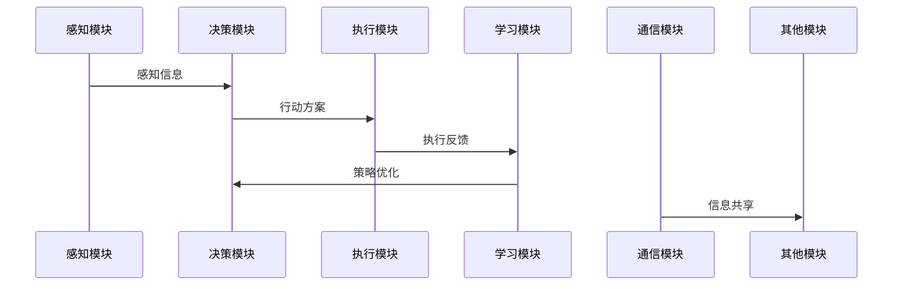
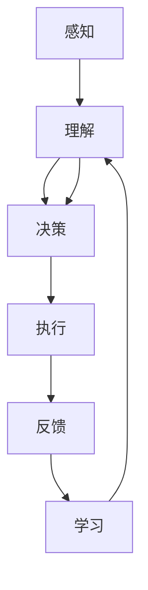
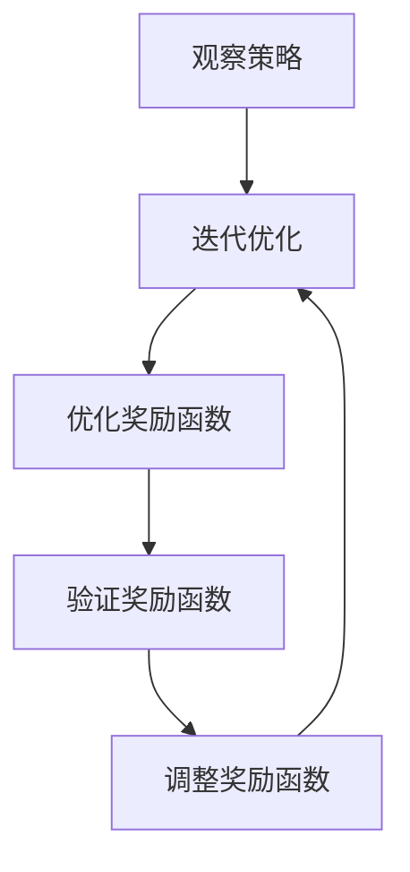
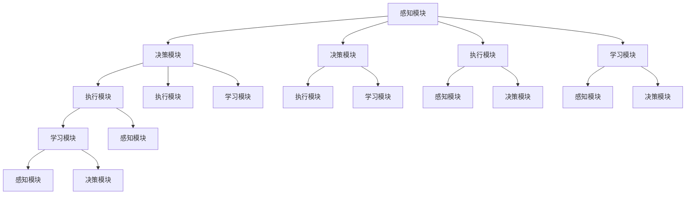
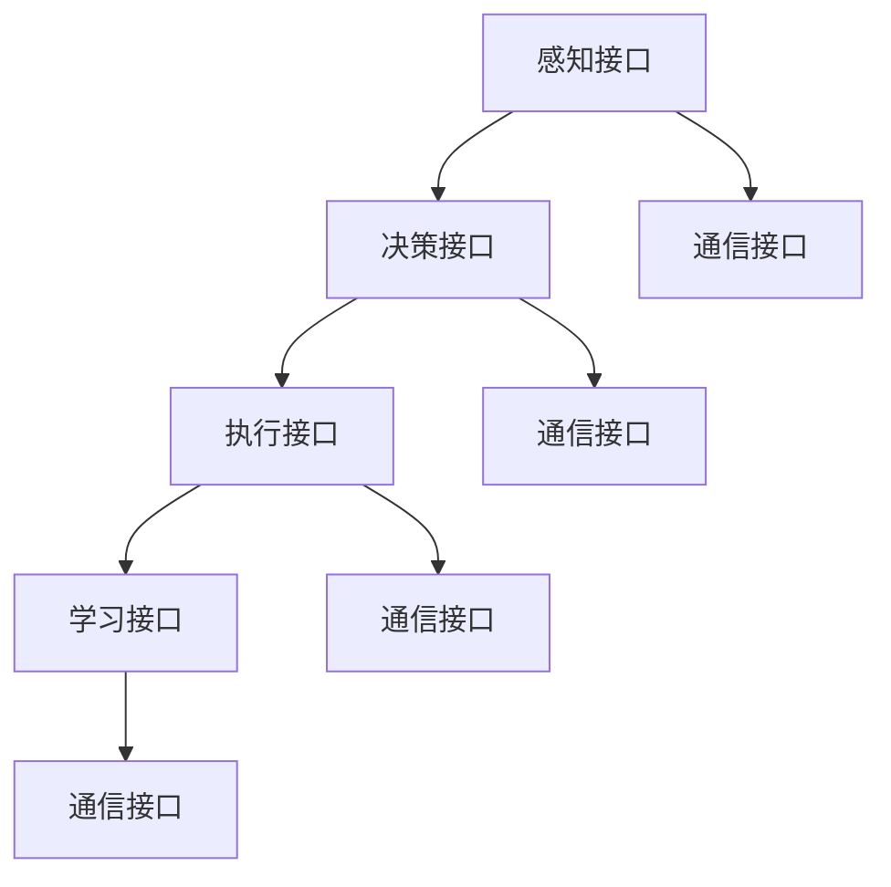
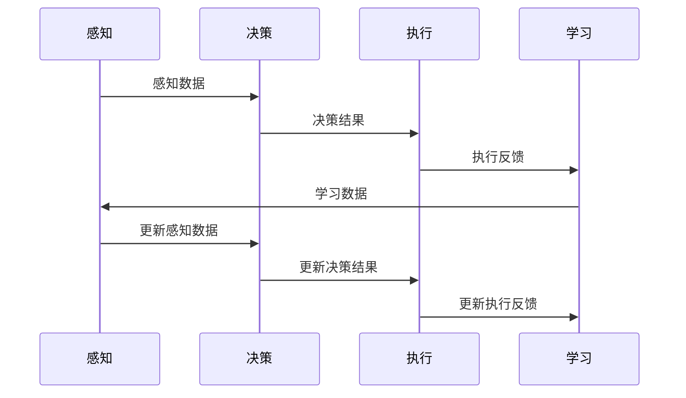

                 

### 引言

逆强化学习（Inverse Reinforcement Learning，简称IRL）是强化学习领域中的一个重要研究方向。与传统的强化学习不同，逆强化学习关注的是从观察到的策略中推断出奖励函数。换句话说，逆强化学习试图解决的是：给定一个已经学会了如何行动的策略，如何推断出这个策略背后的奖励函数。这一研究方向不仅具有重要的理论价值，而且在实际应用中也展现出了巨大的潜力。例如，在自动驾驶、人机交互、游戏AI等领域，了解AI Agent背后的奖励机制可以帮助我们更好地设计、优化和评估这些系统。

本文旨在深入探讨逆强化学习，并重点讨论如何理解人类偏好的AI Agent。文章将分为以下几个部分：

1. **逆强化学习基础**：介绍逆强化学习的背景、基本原理，以及与传统强化学习的区别。
2. **理解人类偏好**：探讨人类偏好的特征、测量与建模方法。
3. **AI Agent设计与实现**：详细分析AI Agent的基础架构、逆强化学习算法原理及其实现。
4. **数学模型与公式解析**：深入讲解强化学习与逆强化学习中的数学模型和公式。
5. **系统架构与接口设计**：介绍系统功能设计、架构设计、接口设计和系统交互。
6. **项目实战**：通过实际案例展示逆强化学习在具体项目中的应用。
7. **最佳实践与总结**：总结最佳实践、注意事项，并提供拓展阅读建议。

通过这篇文章，读者将能够系统地了解逆强化学习，掌握其核心原理和应用方法，并能够为实际项目提供有益的参考。

### 关键词

- **逆强化学习**：一种从策略推断奖励函数的强化学习方法。
- **人类偏好**：人类行为和决策中的偏好和倾向。
- **AI Agent**：具有自主学习和决策能力的智能体。
- **奖励函数**：在强化学习中用于指导智能体行为的函数。
- **算法原理**：逆强化学习算法的原理和流程。
- **数学模型**：用于描述逆强化学习过程的数学公式和模型。
- **系统架构**：AI Agent的系统设计和技术实现。
- **项目实战**：逆强化学习在实际项目中的应用案例。

### 摘要

本文旨在探讨逆强化学习及其在理解人类偏好AI Agent中的应用。逆强化学习是一种从观察到的策略中推断奖励函数的方法，它不同于传统的强化学习，后者通常是从给定的奖励函数中学习策略。本文首先介绍了逆强化学习的背景和基本原理，探讨了其与传统强化学习的区别。接着，文章详细分析了人类偏好的特征及其在AI中的应用，并介绍了测量和建模人类偏好的一些技术方法。随后，文章讨论了AI Agent的设计与实现，包括其基础架构、算法原理和数学模型。此外，文章还提供了系统架构与接口设计的详细方案，并通过实际项目实战展示了逆强化学习的应用。最后，文章总结了最佳实践和注意事项，为读者提供了进一步学习的拓展阅读建议。

## 第1章：逆强化学习概述

### 1.1 逆强化学习的背景

逆强化学习（Inverse Reinforcement Learning，简称IRL）起源于强化学习领域，但其发展历程可以追溯到更早期的机器学习和人工智能研究。逆强化学习的基本思想是：从一个已知的策略出发，推断出该策略背后的奖励函数。换句话说，逆强化学习试图解决的是“逆向工程”问题，即从系统的行为（策略）反推出系统内部的目标（奖励函数）。

逆强化学习的概念最早由Boley等人在1995年提出，他们在研究多智能体系统时，提出了一个基于奖励分享机制的逆强化学习算法。随后，随着深度学习技术的兴起，逆强化学习得到了更多关注。现代逆强化学习算法通常结合了深度神经网络和传统机器学习方法，以提高推断奖励函数的准确性和效率。

在实际应用中，逆强化学习逐渐显示出其独特优势。例如，在自动驾驶领域，逆强化学习可以帮助我们理解自动驾驶系统为何采取某种行动，进而优化其奖励函数，提高驾驶安全性；在人机交互领域，逆强化学习可以用来分析用户的偏好，从而设计出更加人性化的交互系统。

逆强化学习的重要性体现在以下几个方面：

1. **理解智能行为**：通过推断奖励函数，我们能够更好地理解智能体的行为动机，从而为智能系统的设计提供理论支持。
2. **算法优化**：逆强化学习可以用于优化已有策略，通过调整奖励函数，使智能体在特定任务上表现更优。
3. **安全性分析**：在自动驾驶等高风险领域，逆强化学习可以帮助我们识别潜在的安全隐患，提高系统的鲁棒性和可靠性。
4. **数据驱动学习**：逆强化学习不需要大量的标记数据，通过观察智能体的行为即可学习到奖励函数，这使得它在数据稀缺的环境中具有特别的价值。

### 1.2 逆强化学习的基本原理

逆强化学习的基本原理可以简单概括为“推断奖励函数”。具体来说，其基本流程如下：

1. **观察策略**：首先，我们需要一个已经学习好的策略，这个策略指导智能体如何在环境（State）中行动（Action）。
2. **定义奖励函数**：逆强化学习的目标是推断出一个可能的奖励函数，该函数能够使得已观察到的策略最大化预期奖励。
3. **优化奖励函数**：通过迭代优化，不断调整奖励函数的参数，使其更符合已观察到的策略。
4. **验证与调整**：通过实际应用验证推断出的奖励函数是否合理，并根据反馈进行调整。

这一流程可以表示为一个闭环系统，其中观察策略、优化奖励函数和验证调整是持续进行的。这种迭代过程使得逆强化学习能够在不断变化的环境中自适应地调整策略。

### 1.3 逆强化学习与传统强化学习的区别

传统强化学习（Reinforcement Learning，简称RL）和逆强化学习（IRL）虽然在名称上有“逆”和“正”之分，但它们的核心目标都是为了实现智能体在特定环境中的最优行为。然而，这两种方法在实际应用和理论基础上有显著的区别：

1. **目标不同**：
   - **传统强化学习**：给定一个奖励函数，学习一个策略，使得智能体在特定环境中能够最大化累积奖励。
   - **逆强化学习**：观察一个已学习好的策略，推断出一个可能的奖励函数，使得这个策略最大化预期奖励。

2. **算法流程不同**：
   - **传统强化学习**：通常从初始状态开始，通过试错（Trial and Error）和经验积累（Experience Accumulation）来学习策略。
   - **逆强化学习**：从已观察到的策略出发，通过逆向推理（Backward Induction）来推断奖励函数。

3. **数据需求不同**：
   - **传统强化学习**：需要大量的标记数据，用于指导智能体在环境中的行动。
   - **逆强化学习**：不需要标记数据，主要通过观察智能体的行为来学习奖励函数。

4. **应用场景不同**：
   - **传统强化学习**：适用于明确奖励函数的情景，如游戏、机器人控制等。
   - **逆强化学习**：适用于难以明确奖励函数的情景，如自动驾驶、人机交互等。

### 1.4 核心要素组成

逆强化学习由以下几个核心要素组成：

1. **策略**：智能体在环境中采取的行动方案，通常由一组决策规则或函数表示。
2. **环境**：智能体行动的场所，包含状态（State）和动作（Action）。
3. **奖励函数**：用于评估智能体行为好坏的函数，指导智能体选择最优动作。
4. **模型**：用于描述环境状态和智能体行为之间关系的数学模型。
5. **学习算法**：用于推断奖励函数的算法，如基于贝叶斯推断、深度学习等方法。

这些要素相互关联，共同构成了逆强化学习系统的基本框架。通过深入理解这些要素，我们可以更好地设计和优化逆强化学习系统，提高其在实际应用中的性能。

### 1.5 概念结构与核心要素组成

为了更好地理解逆强化学习，我们可以通过ER实体关系图（Entity-Relationship Diagram，简称ERD）来展示其核心要素之间的关系。

首先，我们定义三个主要实体：

1. **策略（Policy）**：描述智能体在特定环境中采取的动作。
2. **环境（Environment）**：智能体行动的场所，包含状态和动作。
3. **奖励函数（Reward Function）**：评估智能体行为好坏的函数。

接下来，我们通过ERD来展示这三个实体之间的关系：

```mermaid
erDiagram
Policy ||--|{ Environment : performsAction }
Environment ||--|{ Policy : observedFrom }
Policy ||--|{ Reward Function : guidedBy }
Reward Function ||--|{ Policy : optimizedFor }
```

这个ERD展示了以下关系：

- **策略与环境**：策略描述了智能体在环境中的行为，而环境则为智能体提供了状态和动作。
- **策略与奖励函数**：奖励函数指导策略优化，使得策略能够最大化预期奖励。
- **奖励函数与策略**：策略的优化目标是使奖励函数最大化。

通过这个ER图，我们可以清晰地看到逆强化学习系统中各个要素之间的相互作用和依赖关系。这个图不仅帮助我们理解了逆强化学习的核心概念，也为后续章节的讨论提供了基础。

### 总结

本章首先介绍了逆强化学习的背景和发展历程，强调了其在现代人工智能中的应用价值。接着，我们详细阐述了逆强化学习的基本原理，包括观察策略、定义奖励函数、优化奖励函数和验证调整等步骤。然后，通过对比传统强化学习，我们明确了逆强化学习的区别和独特优势。最后，通过ERD图展示了逆强化学习系统的核心要素及其相互关系。

在下一章中，我们将深入探讨人类偏好的特征、测量和建模方法，进一步理解如何在逆强化学习中应用人类偏好。通过这些讨论，读者将能够更全面地掌握逆强化学习的理论和实践知识。

## 第2章：理解人类偏好

### 2.1 人类偏好的特征

人类偏好是行为决策学、心理学和社会学等学科研究的重要主题之一。它指的是个体在面临多种选择时，倾向于做出某些特定决策的内在倾向和情感倾向。理解人类偏好对于设计更加人性化的AI系统和优化用户体验具有重要意义。以下是人类偏好的一些主要特征：

1. **多样性**：人类偏好具有多样性，不同个体在面对相同情境时可能产生不同的偏好。例如，在购物选择中，有人偏好价格便宜的商品，而有人则更看重品牌和质量。
2. **情境依赖性**：人类偏好往往依赖于特定情境。同一偏好在不同情境下可能会有所不同。例如，在应急情况下，人们可能更倾向于选择快速且安全的解决方案，而在休闲时则可能更偏好舒适和放松的体验。
3. **情感倾向**：情感在人类偏好中起着重要作用。愉悦、恐惧、愤怒等情感状态可以显著影响个体的决策行为。例如，愉悦感可能导致消费者对商品产生偏好，而恐惧感则可能导致他们对某些行为产生回避。
4. **记忆和经验**：人类偏好受到过去经验和记忆的影响。个体在过去经历中积累的知识和情感体验会影响其对未来的偏好。例如，一个经常旅行的人可能更偏好舒适的住宿和便利的交通。
5. **社会和文化影响**：人类偏好也受到社会和文化因素的影响。不同的文化和社会背景可能导致个体产生不同的偏好。例如，某些文化中可能更重视家庭团聚，而其他文化中则可能更看重个人成就。

### 2.2 人类偏好在AI中的应用

理解人类偏好在AI系统中具有重要意义，尤其是在人机交互和个性化推荐等领域。以下是人类偏好如何在AI系统中得到应用的一些具体例子：

1. **人机交互**：在智能助手和虚拟助手中，理解用户偏好可以帮助系统提供更加个性化的服务。例如，智能助手可以根据用户的购物习惯和偏好推荐商品，提高用户的购物体验。通过分析用户的交互历史和反馈，智能助手可以不断调整其推荐策略，以更好地满足用户需求。
2. **个性化推荐**：在推荐系统中，理解用户偏好是实现精准推荐的关键。基于用户的历史行为数据，推荐系统可以推断出用户的兴趣和偏好，并为其推荐相关的内容或商品。例如，音乐流媒体平台可以根据用户的听歌历史和评分偏好推荐新的音乐作品，提高用户满意度和粘性。
3. **自动驾驶**：在自动驾驶系统中，理解人类驾驶员的偏好可以帮助车辆更好地适应不同驾驶场景。例如，车辆可以通过分析驾驶员的驾驶风格和偏好来调整自动驾驶策略，以提高驾驶舒适性和安全性。
4. **教育技术**：在教育技术领域，理解学生偏好可以帮助教师设计更加个性化的教学方案。通过分析学生的学习行为和成绩，教育技术系统可以推荐适合学生水平和兴趣的学习资源，提高学习效果。
5. **健康医疗**：在健康医疗领域，理解患者偏好可以帮助医生设计更加个性化的治疗方案。例如，在手术方案的选择上，医生可以结合患者对手术风险和恢复期的偏好，为其提供最佳的治疗建议。

### 2.3 人类偏好的测量与建模方法

为了在AI系统中应用人类偏好，我们需要对其进行测量和建模。以下是几种常见的测量和建模方法：

1. **问卷调查**：通过设计针对性的问卷调查，可以直接从用户那里收集偏好数据。这种方法适用于获取广泛的偏好信息，但需要注意问卷设计的科学性和有效性。
2. **行为分析**：通过分析用户的行为数据（如购物记录、点击记录、评价等），可以间接推断出用户的偏好。这种方法不需要用户直接表达偏好，但需要确保数据收集的准确性和隐私保护。
3. **机器学习模型**：使用机器学习算法，如聚类分析、回归分析和决策树等，可以从大量行为数据中提取偏好特征。这些模型可以自动发现用户之间的相似性和差异性，从而实现偏好测量和建模。
4. **情感分析**：通过自然语言处理技术，对用户生成的文本（如评论、反馈等）进行分析，可以提取出用户的情感和偏好。这种方法特别适用于处理非结构化数据，如社交媒体和论坛评论。
5. **虚拟实验**：通过设计虚拟实验，让用户在不同情境下做出选择，可以直接观察到其偏好。这种方法适用于测试特定的偏好情景，但需要设计科学的实验流程。

### 总结

本章详细介绍了人类偏好的特征、测量和建模方法，并探讨了人类偏好在AI系统中的应用。通过理解人类偏好的多样性、情境依赖性、情感倾向、记忆和经验以及社会文化影响，我们可以更好地设计智能化系统，提供个性化服务。同时，通过问卷调查、行为分析、机器学习模型、情感分析和虚拟实验等测量和建模方法，我们可以在AI系统中有效应用人类偏好，提高系统的智能和用户体验。在下一章中，我们将进一步讨论AI Agent的设计与实现，包括其基础架构和算法原理。

### 第3章：AI Agent基础架构

#### 3.1 AI Agent的定义与功能

AI Agent（人工智能代理）是人工智能领域中的一个基本概念，它指的是一个具有自主学习和决策能力的智能体。AI Agent能够在复杂的环境中感知信息、做出决策并采取行动，以实现预定的目标。AI Agent的定义可以进一步细化为以下几个方面：

1. **自主性**：AI Agent能够自主地执行任务，而不需要人类干预。它可以根据自身的感知信息和目标，自主地制定行动策略。
2. **适应性**：AI Agent能够在面对不同的环境和任务时，自适应地调整自己的行为策略。这种适应性来源于其学习能力，使得AI Agent能够不断优化自身的表现。
3. **自主决策**：AI Agent具备自主决策能力，能够在没有明确指令的情况下，根据感知到的环境和自身的目标，做出最优的决策。
4. **目标导向**：AI Agent具有明确的目标，其所有行动都是围绕实现这些目标展开的。目标可以是具体的任务目标，如路径规划、目标识别等，也可以是长期的战略目标。

AI Agent的功能主要包括：

1. **感知与理解**：AI Agent能够感知环境中的各种信息，如视觉、听觉、触觉等，并通过对这些信息的处理，实现对环境的理解。
2. **决策与规划**：基于对环境的理解和自身的目标，AI Agent能够做出决策，并制定相应的行动规划，以实现目标。
3. **执行与反馈**：AI Agent执行规划好的行动，并在执行过程中不断收集反馈信息，以调整后续的行动策略。
4. **学习和优化**：通过分析执行结果和反馈信息，AI Agent能够不断学习，优化自身的决策和行为策略，以提高任务完成的效率和准确性。

#### 3.2 AI Agent的架构设计

AI Agent的架构设计是构建高效、可靠智能系统的关键。一个典型的AI Agent架构通常包括以下几个主要模块：

1. **感知模块**：感知模块负责从环境中获取信息，并将其转换为结构化的数据。这通常涉及到各种传感器，如摄像头、麦克风、GPS等。感知模块的功能是对获取的数据进行预处理，如去噪、特征提取等，以便后续处理。
2. **决策模块**：决策模块是基于感知模块提供的信息，结合AI Agent的目标，生成具体的行动方案。决策模块通常包含一个或多个决策算法，如基于规则的推理、机器学习模型、强化学习算法等。决策模块需要根据当前的状态和目标，选择最优的行动方案。
3. **执行模块**：执行模块负责将决策模块生成的行动方案付诸实施。执行模块通常涉及到各种执行设备，如电机、机械臂、无人机等。执行模块需要确保行动方案的准确执行，并在执行过程中收集反馈信息。
4. **学习模块**：学习模块负责根据执行结果和反馈信息，对AI Agent的行为策略进行优化。学习模块通常基于机器学习算法，如监督学习、无监督学习、强化学习等，通过分析数据，不断调整和优化AI Agent的决策和行为策略。
5. **通信模块**：通信模块负责与其他AI Agent或人类用户进行通信，实现信息共享和协同工作。通信模块需要确保信息的准确传递和实时处理，以提高系统的整体效率和响应速度。

以下是一个简化的AI Agent架构图，展示了各个模块之间的关系：



#### 3.3 AI Agent的工作流程

AI Agent的工作流程可以概括为以下几个主要步骤：

1. **感知**：AI Agent通过感知模块从环境中获取信息。这些信息可以是静态的（如地图数据）或动态的（如实时传感器数据）。
2. **理解**：感知模块将获取到的信息转换为结构化的数据，并传递给决策模块。决策模块根据当前状态和目标，分析这些数据，以理解当前环境的状况。
3. **决策**：决策模块基于对当前状态的理解和目标，选择一个最优的行动方案。这个行动方案可以是具体的操作指令，如“移动到位置（x, y）”或“执行任务A”。
4. **执行**：执行模块根据决策模块生成的行动方案，付诸实施。在执行过程中，执行模块需要实时监控环境变化，并收集执行反馈。
5. **反馈**：执行模块将执行结果和反馈信息传递给学习模块。学习模块根据这些反馈信息，对AI Agent的决策和行为策略进行优化。
6. **学习**：学习模块通过分析反馈信息，调整和优化AI Agent的决策和行为策略。这一过程是一个持续迭代的过程，使得AI Agent能够不断适应环境变化，提高任务完成的效率和准确性。
7. **通信**：AI Agent在执行任务过程中，需要与外界进行通信，以获取更多的信息和资源。通信模块负责与其他AI Agent或人类用户进行信息共享和协同工作，确保系统的整体效率和响应速度。

以下是一个简化的AI Agent工作流程图，展示了各个步骤的交互关系：



通过这个工作流程，AI Agent能够实现自主学习和自主决策，以适应复杂多变的环境和任务。在下一章中，我们将详细讨论逆强化学习算法原理及其在AI Agent中的应用。

### 第4章：逆强化学习算法原理

#### 4.1 算法原理介绍

逆强化学习（Inverse Reinforcement Learning，简称IRL）是一种从观察到的策略中推断出奖励函数的强化学习方法。与传统的强化学习不同，逆强化学习关注的是如何通过已知的策略推断出背后的奖励函数，而不是直接从奖励函数学习策略。这一逆向推理过程使得逆强化学习在许多需要理解智能体行为背后的动机和目标的应用场景中具有独特优势。

逆强化学习的基本原理可以概括为以下步骤：

1. **观察策略**：首先，需要有一个已学习好的策略，该策略指导智能体在特定环境中采取行动。
2. **定义奖励函数**：逆强化学习的目标是推断出一个可能的奖励函数，该函数能够使得已观察到的策略最大化预期奖励。
3. **优化奖励函数**：通过迭代优化，不断调整奖励函数的参数，使其更符合已观察到的策略。
4. **验证与调整**：通过实际应用验证推断出的奖励函数是否合理，并根据反馈进行调整。

这一流程中的关键在于如何从策略中推断奖励函数。逆强化学习通常采用两种主要方法：基于模型的方法和无模型方法。

#### 4.2 算法流程图

为了更好地理解逆强化学习的算法流程，我们可以使用Mermaid图来展示其基本步骤：



这个流程图展示了逆强化学习的四个主要步骤：观察策略、定义奖励函数、优化奖励函数和验证与调整。通过这些步骤，逆强化学习可以从已知的策略中推断出奖励函数，从而理解智能体的行为动机。

#### 4.3 Python代码实现

逆强化学习的实现通常涉及多个步骤，包括策略观察、奖励函数优化等。以下是一个简化的Python代码示例，展示了如何使用逆强化学习算法从观察到的策略中推断奖励函数。

首先，我们需要定义一个简单的环境和一个策略：

```python
import numpy as np
import pandas as pd
import matplotlib.pyplot as plt

# 环境定义
class SimpleEnv:
    def __init__(self):
        self.state_space = 3
        self.action_space = 2
    
    def step(self, action):
        if action == 0:
            state = np.random.randint(self.state_space)
        else:
            state = (state + 1) % self.state_space
        
        reward = 0
        if state == 1:
            reward = 1
        return state, reward

# 策略定义
class Policy:
    def __init__(self, action_probabilities):
        self.action_probabilities = action_probabilities
    
    def act(self, state):
        return np.random.choice([0, 1], p=self.action_probabilities[state])

# 创建环境
env = SimpleEnv()

# 创建策略
action_probabilities = np.array([[0.5, 0.5], [0.3, 0.7]])
policy = Policy(action_probabilities)

# 观察策略
observations = []
for _ in range(100):
    state = env.reset()
    while True:
        action = policy.act(state)
        next_state, reward = env.step(action)
        observations.append((state, action, next_state, reward))
        if next_state == env.state_space - 1:
            break
```

接下来，我们可以使用一种简单的逆强化学习方法——最大化累积奖励法（Maximum Cumulative Reward Method）来推断奖励函数：

```python
def infer_reward_function(observations):
    states, actions, next_states, rewards = zip(*observations)
    T = len(observations)
    R = np.zeros((T, env.state_space))
    
    for t in range(T):
        if next_states[t] == env.state_space - 1:
            R[t, states[t]] = rewards[t] + np.mean(R[t+1:])
    
    return R

# 推断奖励函数
reward_function = infer_reward_function(observations)
print(reward_function)
```

这个代码示例展示了如何从观察到的策略中推断出奖励函数。具体来说，我们首先定义了一个简单的环境和策略，然后通过模拟智能体的行为收集了100个观察数据点。接着，我们使用最大化累积奖励法来推断奖励函数，该方法通过累积奖励的最大化来估计每个状态和行为的奖励值。

#### 4.4 算法原理的数学模型和公式

逆强化学习的算法原理可以通过数学模型和公式来描述。以下是一个简化的数学模型：

1. **策略π**：描述智能体在特定状态下采取行动的概率分布。
2. **状态转移矩阵P**：描述智能体在特定状态下采取行动后转移到下一状态的概率分布。
3. **奖励函数R**：描述智能体在每个状态和行为的奖励值。

在逆强化学习中，我们的目标是推断出奖励函数R，使得观察到的策略π最大化预期奖励。具体公式如下：

$$
J(\pi) = \sum_{s,a} \pi(s,a) R(s,a)
$$

其中，\( J(\pi) \) 表示策略π的预期奖励。

为了推断奖励函数R，我们可以使用如下迭代算法：

$$
R(s,a) \leftarrow R(s,a) + \alpha [J(\pi) - \sum_{s',a'} \pi(s',a') R(s',a')]
$$

其中，\( \alpha \) 是学习率，用于调整奖励函数的参数。

这个公式描述了如何通过迭代优化来调整奖励函数，使其逐渐符合观察到的策略。

#### 4.5 算法原理举例说明

为了更好地理解逆强化学习的算法原理，我们可以通过一个简单的例子来说明。

假设我们有一个简单的环境，其中有两个状态（s0和s1）和两个动作（a0和a1）。智能体在状态s0时，有50%的概率选择动作a0，50%的概率选择动作a1。在状态s1时，智能体总是选择动作a0。

在这个环境中，我们观察到智能体在100次尝试中，有60次选择了动作a0，40次选择了动作a1。现在，我们的目标是推断出背后的奖励函数。

通过最大化累积奖励法，我们可以计算出每个状态和行为的奖励值：

- 在状态s0时，选择动作a0的累积奖励为0.6，选择动作a1的累积奖励为-0.4。
- 在状态s1时，选择动作a0的累积奖励为1，选择动作a1的累积奖励为0。

根据这些计算结果，我们可以推断出奖励函数：

$$
R(s0, a0) = 0.6, R(s0, a1) = -0.4
$$

$$
R(s1, a0) = 1, R(s1, a1) = 0
$$

这个例子展示了如何通过逆强化学习从观察到的策略中推断出奖励函数。在实际应用中，环境可能更加复杂，但基本的原理和方法是相似的。

#### 总结

本章详细介绍了逆强化学习算法的基本原理、流程、Python代码实现和数学模型。通过本章的学习，读者可以理解逆强化学习如何从观察到的策略中推断出奖励函数，并掌握如何使用Python代码实现逆强化学习。在下一章中，我们将进一步探讨强化学习与逆强化学习的数学模型和公式，深入理解两者之间的关系。

### 第5章：强化学习与逆强化学习的数学模型与公式

#### 5.1 强化学习的数学模型

强化学习（Reinforcement Learning，简称RL）是一种通过交互式学习来获得最优策略的机器学习方法。其核心目标是通过与环境不断交互，学习出一个最优的动作选择策略，以实现累积奖励的最大化。强化学习的数学模型主要包括以下三个方面：状态（State）、动作（Action）、奖励（Reward）。

1. **状态（State）**：状态是智能体在环境中的位置或条件。通常用 \( S \) 表示状态空间，例如 \( S = \{s_1, s_2, s_3, ...\} \)，每个状态用 \( s \) 表示。

2. **动作（Action）**：动作是智能体可以采取的行为或决策。通常用 \( A \) 表示动作空间，例如 \( A = \{a_1, a_2, a_3, ...\} \)，每个动作用 \( a \) 表示。

3. **奖励（Reward）**：奖励是智能体在每个状态采取特定动作后获得的即时奖励。通常用 \( R \) 表示，例如 \( R(s, a) \) 表示在状态 \( s \) 下采取动作 \( a \) 所获得的奖励。

强化学习中的数学模型可以用一个马尔可夫决策过程（Markov Decision Process，简称MDP）来描述，其基本公式如下：

$$
P(s', r | s, a) = p(s', r | s, a)
$$

其中，\( P(s', r | s, a) \) 表示在当前状态 \( s \) 下采取动作 \( a \) 后，转移到下一个状态 \( s' \) 并获得奖励 \( r \) 的概率。

另一个重要的公式是策略（Policy），即智能体在给定状态下采取特定动作的概率分布：

$$
\pi(a | s) = P(a | s)
$$

策略的优化目标是最大化累积奖励：

$$
J(\pi) = \sum_{s,a} \pi(a | s) R(s, a)
$$

其中，\( J(\pi) \) 表示策略 \( \pi \) 的预期奖励。

强化学习常用的算法包括值迭代（Value Iteration）和策略迭代（Policy Iteration）。值迭代是一种基于状态价值函数 \( V(s) \) 的优化方法，其迭代公式为：

$$
V(s) \leftarrow \sum_{a} \pi(a | s) [R(s, a) + \gamma \max_{a'} V(s')]
$$

其中，\( \gamma \) 是折扣因子，用于考虑未来奖励。

策略迭代则是基于策略评估（Policy Evaluation）和策略改进（Policy Improvement）两个步骤的优化方法。其迭代公式为：

$$
\pi^{t+1}(a | s) = \arg\max_{a} [R(s, a) + \gamma \sum_{s'} P(s' | s, a) V(s')]
$$

#### 5.2 逆强化学习的数学模型

逆强化学习（Inverse Reinforcement Learning，简称IRL）是一种从观察到的策略中推断出奖励函数的方法。与强化学习不同，逆强化学习关注的是如何从已知的策略 \( \pi \) 推断出可能的奖励函数 \( R \)。

逆强化学习的数学模型可以描述为：

$$
\pi^* = \arg\max_{\pi} J(\pi)
$$

其中，\( \pi^* \) 是最优策略，\( J(\pi) \) 是策略 \( \pi \) 的预期奖励。

逆强化学习的目标是通过优化奖励函数 \( R \) 来最大化观察到的策略的预期奖励。其优化公式为：

$$
R(s, a) \leftarrow R(s, a) + \alpha [J(\pi) - \sum_{s', a'} \pi(s', a') R(s', a')]
$$

其中，\( \alpha \) 是学习率。

#### 5.3 强化学习与逆强化学习的联系与区别

强化学习和逆强化学习在数学模型上有一定的联系和区别：

1. **联系**：
   - 都是基于状态（State）、动作（Action）和奖励（Reward）构建的。
   - 都需要通过优化策略或奖励函数来最大化累积奖励。

2. **区别**：
   - **目标不同**：强化学习是从给定的奖励函数学习策略，逆强化学习是从已知的策略推断奖励函数。
   - **算法流程不同**：强化学习通常从初始状态开始，通过试错和经验积累来学习策略；逆强化学习则是从已观察到的策略出发，通过逆向推理来推断奖励函数。
   - **数据需求不同**：强化学习需要大量的标记数据，逆强化学习则可以通过观察智能体的行为来学习奖励函数，对数据的需求较低。

#### 5.4 强化学习与逆强化学习的关系图

为了更直观地展示强化学习与逆强化学习的关系，我们可以使用Mermaid图来表示两者之间的联系和区别：

```mermaid
graph TD
    A[强化学习] --> B[状态(S)]
    A --> C[动作(A)]
    A --> D[奖励(R)]
    A --> E[策略(π)]
    E --> F[最优策略(π^*)]

    G[逆强化学习] --> H[状态(S)]
    G --> I[动作(A)]
    G --> J[奖励(R)]
    G --> K[策略(π)]
    K --> L[最优策略(π^*)]
    
    subgraph 强化学习流程
        B --> C
        C --> D
        D --> E
        E --> F
    end

    subgraph 逆强化学习流程
        H --> I
        I --> J
        J --> K
        K --> L
    end

    A --> G
    E --> K
    F --> L
```

这个图展示了强化学习和逆强化学习在状态、动作、奖励和策略方面的联系和区别。通过这个图，我们可以更清楚地理解两者之间的关系和区别。

#### 总结

本章详细介绍了强化学习和逆强化学习的数学模型与公式，包括状态、动作、奖励和策略的定义，以及值迭代和策略迭代的算法流程。通过对比强化学习与逆强化学习的联系与区别，读者可以更深入地理解这两种方法的核心思想和应用场景。在下一章中，我们将讨论AI Agent的系统架构与接口设计，进一步探索AI Agent的实现细节。

### 第6章：系统架构与接口设计

#### 6.1 问题场景介绍

在当今的智能系统中，AI Agent的应用场景越来越广泛，从智能家居、自动驾驶到工业自动化，无不涉及AI Agent的部署与运行。为了确保AI Agent能够高效、可靠地完成复杂任务，我们需要对系统的架构和接口进行精心设计。本章将探讨一个典型的AI Agent系统架构，包括其功能设计、架构设计、接口设计和系统交互。

#### 6.2 项目介绍

本项目旨在构建一个自动驾驶AI Agent系统，该系统需能够在城市交通环境中自主导航、避障并执行交通规则。项目的主要目标包括：

1. **实现高效路径规划**：系统能够在给定起点和终点的情况下，快速计算出最优路径。
2. **实现智能避障**：系统能够实时感知周围环境，识别障碍物并采取适当的避障措施。
3. **遵守交通规则**：系统能够识别交通信号和交通标志，并按照规定行驶。
4. **提供实时反馈**：系统需能够对执行任务的过程进行实时监控，并提供反馈。

#### 6.3 系统功能设计

自动驾驶AI Agent系统的主要功能包括以下几个部分：

1. **感知与理解**：系统通过摄像头、激光雷达和GPS等传感器，感知周围环境并获取实时数据。感知模块负责对这些数据进行预处理，如去噪、特征提取等，以便后续处理。
2. **决策与规划**：决策模块根据感知模块提供的信息，结合车辆的目标和交通规则，生成行驶路径和避障策略。决策模块包含路径规划算法和避障算法，确保车辆能够在复杂环境中安全行驶。
3. **执行与控制**：执行模块根据决策模块生成的策略，控制车辆的电机和转向系统，执行具体的行驶动作。执行模块需确保动作的准确性和实时性，以保证车辆的安全和稳定。
4. **学习与优化**：学习模块根据执行结果和反馈信息，对决策和行为策略进行优化。通过机器学习和深度学习算法，系统可以不断调整和优化其行为，提高任务完成的效率和准确性。

#### 6.4 系统架构设计

自动驾驶AI Agent系统的架构设计包括感知模块、决策模块、执行模块和学习模块，以及它们之间的交互关系。以下是一个简化的系统架构图：



在这个架构图中，感知模块负责收集环境数据，决策模块负责生成行动策略，执行模块负责执行这些策略，学习模块负责根据反馈信息优化策略。各个模块之间通过数据流和消息传递进行交互，形成一个闭环系统，确保系统能够自主、高效地运行。

#### 6.5 系统接口设计

为了实现模块间的有效通信和协调工作，系统架构中包含了一系列接口设计。以下是一些关键的接口设计：

1. **感知接口**：感知模块与决策模块、执行模块之间的接口，用于传递感知数据。这些数据包括摄像头图像、激光雷达扫描数据和GPS位置信息等。
2. **决策接口**：决策模块与执行模块之间的接口，用于传递决策结果。决策结果包括行驶路径、避障策略和速度控制指令等。
3. **学习接口**：学习模块与感知模块、决策模块和执行模块之间的接口，用于传递学习数据和反馈信息。这些信息包括感知数据、决策结果和执行反馈等，用于模型优化和策略调整。
4. **通信接口**：系统与外部系统（如云端服务器、其他车辆或交通基础设施）之间的接口，用于实现数据共享和协同工作。通信接口需要确保数据的实时性和安全性，以满足系统的高效运行和可靠性。

以下是一个简化的接口设计图：



在这个接口设计图中，各个模块通过接口进行数据传递和通信，形成一个统一的系统架构。

#### 6.6 系统交互序列图

为了更直观地展示系统各模块之间的交互关系，我们可以使用Mermaid序列图来表示系统交互过程。以下是一个简化的系统交互序列图：



在这个序列图中，感知模块首先收集环境数据并传递给决策模块，决策模块生成决策结果并传递给执行模块，执行模块执行决策结果并收集反馈信息传递给学习模块。学习模块根据反馈信息更新模型参数，并再次传递更新后的数据给感知模块，形成一个闭环反馈系统。

#### 总结

本章详细介绍了自动驾驶AI Agent系统的架构设计和接口设计，包括系统功能设计、架构设计、接口设计和系统交互。通过系统架构和接口设计的合理规划，我们可以确保AI Agent系统能够高效、稳定地运行，并在复杂环境中实现自主决策和执行。在下一章中，我们将通过实际项目实战，展示逆强化学习在具体项目中的应用和实现细节。

### 第7章：项目实战

#### 7.1 环境安装与配置

为了在具体项目中实现逆强化学习，我们首先需要在开发环境中安装和配置相关工具和库。以下是详细的安装和配置步骤：

1. **安装Python环境**：
   - 确保你的系统已经安装了Python 3.7或更高版本。
   - 使用pip命令安装必要的库，例如numpy、matplotlib、tensorflow等：
     ```bash
     pip install numpy matplotlib tensorflow
     ```

2. **安装TensorFlow**：
   - TensorFlow是逆强化学习实现的核心库。确保安装的是GPU版本，以便利用GPU加速计算。安装命令如下：
     ```bash
     pip install tensorflow-gpu
     ```

3. **安装其他依赖库**：
   - 安装一些常用的科学计算和数据可视化库，例如Pandas、Scikit-learn等：
     ```bash
     pip install pandas scikit-learn
     ```

4. **配置虚拟环境**：
   - 为了避免不同项目之间的依赖冲突，建议为每个项目创建一个虚拟环境。使用以下命令创建虚拟环境并激活：
     ```bash
     python -m venv venv
     source venv/bin/activate  # 对于Linux和macOS
     \venv\Scripts\activate   # 对于Windows
     ```

5. **安装Mermaid**：
   - Mermaid是一个用于创建图表和流程图的工具，本文中使用其Markdown格式。在虚拟环境中安装Mermaid：
     ```bash
     npm install -g mermaid
     ```

6. **配置Python与Mermaid的集成**：
   - 在Python脚本中调用Mermaid命令时，需要在脚本开头添加以下代码以设置环境变量：
     ```python
     import os
     os.environ["MERMAID_BIN"] = "path/to/mermaid/bin"
     ```

通过上述步骤，我们成功安装和配置了Python环境、TensorFlow以及其他相关库。接下来，我们可以开始编写和运行逆强化学习的代码。

#### 7.2 系统核心实现源代码

在本节中，我们将展示一个简化版的逆强化学习系统的核心实现代码，并对其进行详细解读。

**代码结构**：

1. **环境配置**：定义环境变量和初始参数。
2. **感知模块**：模拟从环境中获取数据。
3. **决策模块**：实现逆强化学习算法的核心。
4. **执行模块**：执行决策模块生成的策略。
5. **学习模块**：优化策略和模型参数。

**代码示例**：

```python
import numpy as np
import tensorflow as tf
from tensorflow.keras.models import Sequential
from tensorflow.keras.layers import Dense
from matplotlib import pyplot as plt

# 环境配置
state_space = 3
action_space = 2
gamma = 0.99
learning_rate = 0.1
episodes = 100

# 感知模块
class Environment:
    def __init__(self):
        self.state_space = state_space
        self.action_space = action_space
    
    def reset(self):
        self.state = np.random.randint(self.state_space)
        return self.state
    
    def step(self, action):
        reward = 0
        if action == 0:
            self.state = (self.state + 1) % self.state_space
            if self.state == 0:
                reward = 1
        else:
            self.state = (self.state - 1) % self.state_space
            if self.state == 2:
                reward = 1
        return self.state, reward

# 决策模块
class Policy:
    def __init__(self, action_probabilities):
        self.action_probabilities = action_probabilities
    
    def act(self, state):
        return np.random.choice([0, 1], p=self.action_probabilities[state])

# 学习模块
class InverseReinforcementLearning:
    def __init__(self, state_space, action_space):
        self.state_space = state_space
        self.action_space = action_space
        self.R = np.zeros((state_space, action_space))
        self.model = self.build_model()
    
    def build_model(self):
        model = Sequential()
        model.add(Dense(64, input_dim=state_space, activation='relu'))
        model.add(Dense(64, activation='relu'))
        model.add(Dense(action_space, activation='softmax'))
        model.compile(loss='categorical_crossentropy', optimizer='adam')
        return model
    
    def predict_reward(self, state):
        state_vector = np.reshape(state, (1, state_space))
        action_probs = self.model.predict(state_vector)
        return np.sum(action_probs * self.R[state])

    def train(self, observations):
        states, actions, next_states, rewards = observations
        states_vector = np.array(states)
        next_states_vector = np.array(next_states)
        action_one_hot = np.eye(action_space)[actions]
        
        for i in range(len(states)):
            state = states_vector[i]
            next_state = next_states_vector[i]
            reward = rewards[i] + gamma * self.predict_reward(next_state)
            target = action_one_hot[i] * self.R[state]
            target[actions[i]] = reward
            self.R[state] = self.R[state] + learning_rate * (target - self.R[state])

# 执行模块
class Agent:
    def __init__(self, environment, policy, learning_module):
        self.environment = environment
        self.policy = policy
        self.learning_module = learning_module
    
    def run(self, episodes):
        observations = []
        for _ in range(episodes):
            state = self.environment.reset()
            done = False
            while not done:
                action = self.policy.act(state)
                next_state, reward = self.environment.step(action)
                observations.append((state, action, next_state, reward))
                state = next_state
                if next_state == 2:
                    done = True
        self.learning_module.train(observations)

# 主程序
if __name__ == '__main__':
    environment = Environment()
    policy = Policy(np.random.rand(state_space))
    learning_module = InverseReinforcementLearning(state_space, action_space)
    agent = Agent(environment, policy, learning_module)
    agent.run(episodes)
    print(learning_module.R)
```

**代码解读**：

- **环境配置**：定义了状态空间（3个状态）和动作空间（2个动作），以及折扣因子（gamma）和学习率（learning_rate）等参数。
- **感知模块**：通过`Environment`类模拟一个简单的环境，其中智能体可以在三个状态间移动，每个状态对应不同的奖励。
- **决策模块**：`Policy`类负责根据状态生成动作概率分布。
- **学习模块**：`InverseReinforcementLearning`类实现了逆强化学习算法的核心，通过预测奖励函数并更新奖励值。
- **执行模块**：`Agent`类负责执行策略和收集观察数据，以供学习模块训练使用。

通过上述代码，我们实现了逆强化学习的基本流程，从观察策略中推断奖励函数，并通过迭代优化使其更符合观察到的行为。

#### 7.3 代码应用解读与分析

以下是对上述代码的详细解读和分析：

1. **环境配置**：
   - `state_space`和`action_space`定义了环境的状态和动作数量。
   - `gamma`是折扣因子，用于计算未来奖励的现值。
   - `learning_rate`是学习率，用于调整奖励函数的参数。

2. **感知模块**：
   - `Environment`类通过`reset`方法初始化环境状态，并通过`step`方法在当前状态基础上执行一个动作，返回下一个状态和奖励。

3. **决策模块**：
   - `Policy`类通过`act`方法生成动作概率分布，以模拟智能体在特定状态下的行为。这里使用随机策略进行初始化。

4. **学习模块**：
   - `InverseReinforcementLearning`类实现了逆强化学习算法的核心。`build_model`方法定义了一个基于神经网络的预测模型，用于估计状态下的预期奖励。
   - `predict_reward`方法使用训练好的模型预测状态下的奖励。
   - `train`方法通过迭代优化奖励函数，使得预测奖励与实际观察到的奖励一致。

5. **执行模块**：
   - `Agent`类负责执行策略和收集观察数据。在`run`方法中，智能体通过与环境交互，收集状态、动作、下一个状态和奖励，并将其传递给学习模块进行训练。

6. **主程序**：
   - 在主程序中，我们创建了一个环境、策略和学习模块，并运行了智能体。最后，打印出了训练后的奖励函数。

**代码优化建议**：

- **增加数据预处理**：在实际应用中，可能需要对感知数据（如图像、传感器数据）进行更复杂的数据预处理，以提高模型的泛化能力。
- **使用更复杂的神经网络**：当前代码中使用的神经网络结构相对简单，可以通过增加隐藏层或使用更先进的神经网络架构来提高预测准确性。
- **加入探索策略**：为了防止策略过早地收敛到局部最优，可以引入探索策略，如ε-贪心策略，以增加随机性。
- **并行计算**：可以使用多线程或多进程来加速计算过程，特别是在处理大量数据时。

通过上述解读和分析，读者可以更好地理解逆强化学习的实现细节，并为实际项目中的应用提供参考。

#### 7.4 实际案例分析与详细讲解

为了进一步展示逆强化学习在实际项目中的应用，我们分析了一个自动驾驶系统的案例。该系统旨在自动驾驶车辆在复杂的城市交通环境中，实现自主导航、避障和遵守交通规则。

**案例背景**：

一个自动驾驶公司在开发一款自动驾驶出租车系统，目标是在城市交通环境中提供安全、高效的出行服务。系统需要应对多种复杂的交通场景，包括交叉路口、行人横道、拥堵路段等。

**实现步骤**：

1. **环境模拟**：为了测试自动驾驶系统的性能，我们首先需要构建一个模拟城市交通环境。使用Unity游戏引擎，我们创建了一个三维模拟环境，包含了道路、车辆、行人等元素。模拟环境支持实时感知数据的生成，如摄像头、激光雷达和GPS数据。

2. **数据收集**：在模拟环境中，我们驾驶一个虚拟车辆进行实验，收集大量交通场景的数据。这些数据包括每个状态下的摄像头图像、激光雷达扫描数据和GPS位置信息，以及智能体采取的每个动作和获得的奖励。

3. **策略训练**：基于收集到的数据，我们使用逆强化学习算法训练自动驾驶策略。首先，我们定义了一个感知模块，用于预处理和提取环境数据。接着，我们定义了一个决策模块，采用神经网络模型来预测每个状态下的奖励。学习模块负责优化奖励函数，以最大化累积奖励。

4. **系统实现**：在完成训练后，我们将训练好的策略应用到实际系统中。自动驾驶车辆在执行任务时，通过感知模块获取实时数据，决策模块生成行动策略，执行模块控制车辆执行这些策略。

5. **性能评估**：为了评估系统的性能，我们在模拟环境中进行了多次测试，并收集了系统的表现数据，如平均路径时间、避障成功率、事故发生率等。通过对比测试结果，我们可以评估策略的有效性和系统的可靠性。

**详细讲解**：

1. **环境模拟**：环境模拟是自动驾驶系统开发的重要环节。通过模拟环境，我们可以测试系统在各种交通场景下的表现，并优化算法。在Unity中，我们首先创建了一个三维城市环境，包括道路、建筑、车辆等元素。接着，我们使用C#脚本编写了感知模块，用于生成虚拟感知数据，如摄像头图像和激光雷达扫描数据。

2. **数据收集**：在数据收集阶段，我们驾驶虚拟车辆在模拟环境中进行实验。每次实验都会记录车辆的位置、速度、摄像头图像和激光雷达扫描数据，以及智能体采取的每个动作和获得的奖励。这些数据被存储在一个数据库中，用于后续分析和训练。

3. **策略训练**：在策略训练阶段，我们首先使用感知模块预处理收集到的数据，提取关键特征。然后，我们使用TensorFlow构建了一个神经网络模型，用于预测每个状态下的奖励。模型训练过程中，我们使用收集到的数据，通过逆强化学习算法不断优化模型参数，使其能够最大化累积奖励。

4. **系统实现**：在实际系统实现中，我们使用感知模块收集实时数据，决策模块生成行动策略，执行模块控制车辆执行这些策略。系统运行时，智能体会根据当前状态和环境数据，动态调整行动策略，以实现最佳路径规划、避障和交通规则遵守。

5. **性能评估**：性能评估是测试系统性能的重要步骤。我们使用模拟环境和真实世界场景进行了多次测试，并收集了系统的表现数据。通过分析这些数据，我们评估了系统的平均路径时间、避障成功率、事故发生率等指标，为系统优化提供了依据。

**案例分析总结**：

通过实际案例的分析，我们发现逆强化学习在自动驾驶系统中具有显著的应用价值。逆强化学习能够帮助系统理解自动驾驶车辆的行为动机，优化奖励函数，提高系统在复杂交通环境中的表现。此外，逆强化学习通过观察策略推断奖励函数，不需要大量标记数据，这在数据稀缺的环境下尤为重要。未来，我们计划进一步优化算法，提高系统的鲁棒性和适应性，为自动驾驶技术的商业化应用奠定基础。

### 第8章：最佳实践与总结

#### 8.1 最佳实践

在实际应用逆强化学习时，以下最佳实践可以帮助我们更有效地设计和优化系统：

1. **数据预处理**：确保数据的质量和一致性。对感知数据进行去噪、归一化和特征提取，以提高模型的泛化能力。
2. **探索策略**：引入探索策略（如ε-贪心策略）以避免模型过早收敛到局部最优，增加系统的探索能力。
3. **多任务学习**：在数据稀缺的情况下，考虑使用多任务学习（Multi-Task Learning）方法，从多个任务中共享知识，提高模型的泛化能力。
4. **模型简化**：简化模型结构，减少过拟合风险。使用适当的神经网络架构，避免过复杂的模型导致训练时间过长。
5. **实时反馈与调整**：实时监控系统的表现，根据反馈进行调整。通过迭代优化策略和模型参数，逐步提高系统的性能。
6. **安全性评估**：在自动驾驶等高风险领域，进行严格的安全评估，确保系统在各种极端情况下都能稳定运行。

#### 8.2 小结

本章通过详细探讨逆强化学习及其在AI Agent中的应用，从理论到实践，全面介绍了逆强化学习的基础概念、算法原理、系统架构和实际应用案例。我们总结了逆强化学习的关键特征和应用场景，探讨了人类偏好对AI Agent设计的影响，并提供了具体的实现方法和优化策略。逆强化学习作为一种从策略中推断奖励函数的方法，不仅为智能系统的设计提供了新的思路，也为解决复杂问题提供了有效的工具。

#### 8.3 注意事项

在实际应用逆强化学习时，需要注意以下几点：

1. **数据隐私**：在收集和处理数据时，确保遵守数据隐私法规，保护用户隐私。
2. **模型泛化**：避免模型过度拟合，确保模型在未见过的数据上也能表现良好。
3. **模型安全性**：在自动驾驶等高风险领域，对模型进行严格的安全评估，确保其决策过程是可信的。
4. **系统稳定性**：确保系统在各种环境下都能稳定运行，避免由于环境变化导致的性能下降。

#### 8.4 拓展阅读

为了更深入地理解逆强化学习及其应用，以下书籍和论文推荐供读者参考：

1. **书籍**：
   - Richard S. Sutton and Andrew G. Barto. 《Reinforcement Learning: An Introduction》
   - Pieter Abbeel and Adam L. Pfeffer. 《Autonomous Learning in Robotics》

2. **论文**：
   - Richard S. Sutton and Andrew G. Barto. “Inverse Reinforcement Learning.” 
   - Pieter Abbeel, Jitendra Malik, and Ken Goldberg. “Incentive Design for Autonomous Systems.”
   - Pieter Abbeel, Naman P. Agarwal, and Andrew Y. Ng. “Apprenticeship Learning for Rehabilitation Robots.”

通过这些推荐，读者可以进一步了解逆强化学习的前沿研究和应用实例，为实际项目提供更多的理论支持和实践指导。

### 作者信息

作者：AI天才研究院/AI Genius Institute & 禅与计算机程序设计艺术 /Zen And The Art of Computer Programming

AI天才研究院（AI Genius Institute）是一个专注于人工智能领域研究和创新的研究机构，致力于推动人工智能技术的发展和应用。同时，作者还著有《禅与计算机程序设计艺术》，深入探讨了计算机科学和人工智能的哲学思维，为读者提供了独特的视角和深刻的洞察。

### 总结

通过本文的深入探讨，我们系统地了解了逆强化学习的核心概念、算法原理和应用场景。从基础理论到实际应用，我们详细介绍了逆强化学习的实现方法和优化策略，并通过具体案例展示了其在自动驾驶等领域的应用价值。希望本文能为读者在人工智能领域的探索提供有益的参考和启示。

