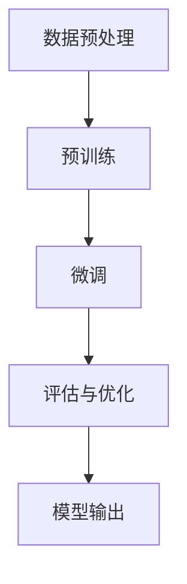
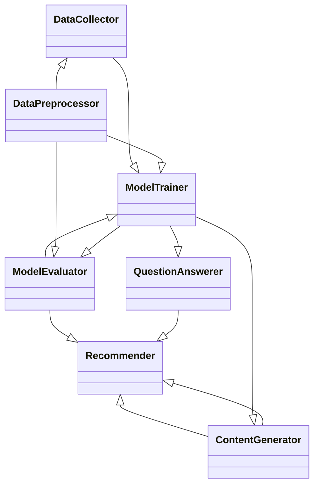
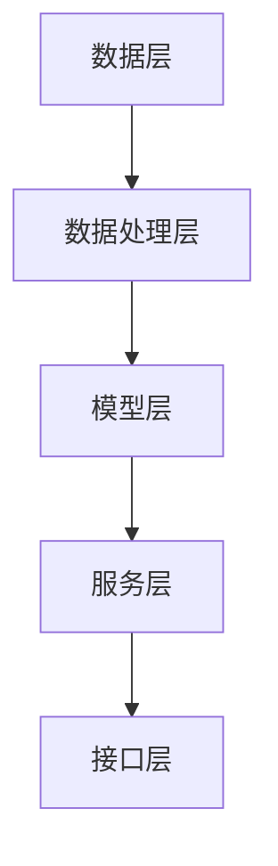
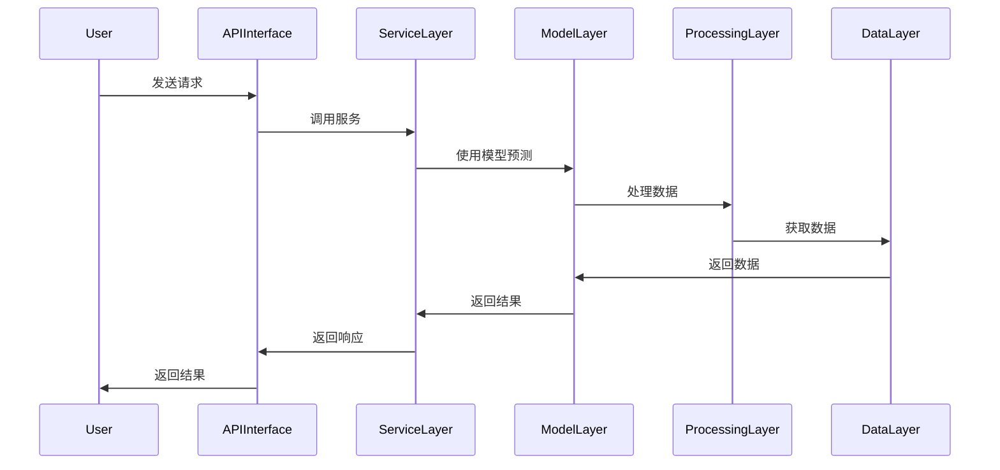

                 

### 文章标题

# 《选择合适的LLM大模型：对比与评估》

### 关键词

- 语言模型
- 大模型
- 评估指标
- 对比分析
- 企业应用

### 摘要

本文旨在为企业和开发者提供一套系统化的方法来选择合适的语言大模型（LLM）。通过详细探讨LLM的背景、核心概念、评估指标、算法原理、系统架构和实际应用案例，本文旨在构建一个全面且实用的评估体系。文章分为六个部分，从背景介绍到最佳实践，帮助读者全面了解如何选择合适的LLM大模型。

### 目录大纲

## 第一部分：背景介绍

### 1.1 问题背景

- AI大模型的发展与应用现状
- 企业在选择LLM大模型时面临的挑战

### 1.2 问题描述

- 如何在众多LLM大模型中选出最适合企业需求的模型
- 对比评估方法与指标的探讨

### 1.3 问题解决

- 引入合适的评估指标
- 建立评估体系
- 实施评估流程

### 1.4 边界与外延

- LLM大模型的应用领域
- 企业需求与模型性能的关系

### 1.5 概念结构与核心要素组成

- LLM大模型的基本概念
- 评估指标体系
- 评估流程

## 第二部分：核心概念与联系

### 2.1 LLM大模型原理

- LLM大模型的基本原理
- 算法原理讲解与Mermaid流程图

### 2.2 概念属性特征对比表格

- LLM大模型的属性特征对比

### 2.3 ER实体关系图架构

- LLM大模型涉及的实体与关系

## 第三部分：算法原理讲解

### 3.1 数学模型和公式

- LLM大模型的数学模型
- 数学公式讲解

### 3.2 举例说明

- 使用Python源代码阐述算法原理
- 通俗易懂地举例说明

## 第四部分：系统分析与架构设计

### 4.1 问题场景介绍

- 某企业选择LLM大模型的需求背景

### 4.2 系统功能设计

- 领域模型Mermaid类图

### 4.3 系统架构设计

- 系统架构Mermaid架构图

### 4.4 系统接口设计

- 系统接口设计

### 4.5 系统交互

- 系统交互Mermaid序列图

## 第五部分：项目实战

### 5.1 环境安装

- 安装所需环境与工具

### 5.2 系统核心实现

- 源代码实现

### 5.3 代码应用解读与分析

- 代码解读与分析

### 5.4 实际案例分析与讲解

- 案例分析
- 详细讲解

### 5.5 项目小结

- 总结项目经验与教训

## 第六部分：最佳实践与拓展阅读

### 6.1 最佳实践

- 选择合适LLM大模型的实战技巧

### 6.2 小结

- 对全书内容的总结

### 6.3 注意事项

- 选择LLM大模型时需要注意的问题

### 6.4 拓展阅读

- 相关书籍、论文与网站推荐

## 引言

随着人工智能技术的飞速发展，语言大模型（Large Language Models，简称LLM）在自然语言处理（NLP）领域取得了显著的成果。LLM具有处理和理解复杂数据的能力，广泛应用于问答系统、文本生成、机器翻译、情感分析等多个场景。然而，面对市场上众多LLM大模型，如何选择最适合企业需求的模型成为了一个具有挑战性的问题。

本文旨在为解决这一问题提供一套系统化的方法。通过对LLM大模型的背景介绍、核心概念讲解、评估指标探讨、算法原理阐述、系统分析与架构设计，以及实际应用案例分析，本文旨在为读者构建一个全面、实用的评估体系，帮助企业和开发者做出明智的选择。

本文分为六个部分，每一部分都有其独特的价值和作用。第一部分将介绍LLM大模型的发展背景和应用场景，以及企业选择LLM时面临的挑战。第二部分将探讨LLM的核心概念和特征，并通过对比表格和ER图来帮助读者更好地理解。第三部分将深入讲解LLM的算法原理，并通过数学模型和Python代码来阐述。第四部分将分析系统架构设计，包括功能设计、系统架构图、接口设计和交互设计。第五部分将通过一个实际项目来展示如何选择和评估LLM大模型，并提供实战经验和教训。最后一部分将总结全文内容，提供最佳实践和注意事项，并推荐拓展阅读。

让我们一步步深入探讨，了解如何选择合适的LLM大模型，并在人工智能领域取得更大的成就。

### 第一部分：背景介绍

#### 1.1 问题背景

随着深度学习和自然语言处理技术的飞速发展，语言大模型（LLM）逐渐成为了人工智能领域的研究热点。LLM通过大量的文本数据进行训练，能够生成高质量的自然语言文本，并在问答系统、文本生成、机器翻译、情感分析等任务中表现出色。这种强大的能力使得LLM成为了企业和开发者解决自然语言处理问题的重要工具。

目前，市场上存在大量的LLM大模型，如GPT、BERT、T5等，这些模型各自有其独特的特点和优势。然而，对于企业而言，如何从这些模型中选择一个最适合自身需求的模型，却是一个颇具挑战性的问题。首先，不同模型的性能在不同任务上存在差异，企业需要根据自身业务需求来选择合适的模型。其次，不同模型的训练和部署成本也有所不同，企业需要在性能和成本之间做出权衡。此外，模型的训练数据和算法细节也往往不透明，企业难以全面了解模型的性能和可靠性。

总的来说，企业在选择LLM大模型时面临以下主要挑战：

1. **模型性能评估：** 如何在不同模型之间进行性能评估，选择一个最适合企业需求的模型。
2. **训练与部署成本：** 如何平衡模型的性能和训练、部署成本，确保在预算范围内实现最佳效果。
3. **数据隐私与合规性：** 如何确保模型训练和使用过程中符合数据隐私法规和合规性要求。
4. **算法透明性与解释性：** 如何提升模型的透明性和解释性，增强用户对模型的信任度。

#### 1.2 问题描述

在众多LLM大模型中，企业需要选出最适合自身需求的模型，这不仅涉及到模型的技术性能，还包括成本、安全性、易用性等多个方面。具体而言，问题描述可以归纳为以下几点：

1. **性能评估：** 如何在不同模型之间进行性能比较，选择在特定任务上表现最佳的模型。
2. **成本评估：** 如何计算和比较不同模型的训练和部署成本，确保选择的模型在预算范围内具有最佳性价比。
3. **适用性评估：** 如何根据企业业务需求，评估模型在不同应用场景中的适用性。
4. **安全性评估：** 如何评估模型在数据隐私和安全方面的表现，确保模型的使用不会违反数据隐私法规。
5. **易用性评估：** 如何评估模型的易用性，包括部署、维护和操作等方面的简便性。

为了解决上述问题，企业需要建立一套完善的评估体系，包括以下步骤：

1. **需求分析：** 明确企业的业务需求和目标，确定需要解决的问题和应用场景。
2. **模型选择：** 根据需求分析结果，选择一系列可能的LLM大模型。
3. **性能评估：** 使用标准化的评估指标，对所选模型进行性能测试，比较其在不同任务上的表现。
4. **成本评估：** 分析不同模型的训练和部署成本，选择性价比较高的模型。
5. **适用性评估：** 根据业务需求，评估模型在不同应用场景中的适用性。
6. **安全性评估：** 评估模型在数据隐私和安全方面的表现，确保符合法规要求。
7. **易用性评估：** 评估模型的易用性，包括部署、维护和操作等方面的简便性。

通过上述评估流程，企业可以逐步筛选出最适合自身需求的LLM大模型，并在实际应用中取得最佳效果。

#### 1.3 问题解决

为了解决上述问题，我们需要引入合适的评估指标，建立评估体系，并实施评估流程。以下是一个详细的解决方案：

**1. 引入合适的评估指标**

评估指标是衡量LLM大模型性能的重要工具。以下是一些常用的评估指标：

- **准确率（Accuracy）**：模型预测正确的样本数量占总样本数量的比例。
- **召回率（Recall）**：模型预测正确的正样本数量占总正样本数量的比例。
- **精确率（Precision）**：模型预测正确的正样本数量占总预测正样本数量的比例。
- **F1分数（F1 Score）**：精确率和召回率的调和平均值。
- **BLEU分数**：用于评估机器翻译质量的指标，通过比较生成文本与参考文本的相似度来衡量。
- **ROUGE分数**：用于评估文本生成质量的指标，通过比较生成文本与参考文本的匹配度来衡量。
- **BLEURT分数**：结合BLEU和ROUGE分数，用于评估自然语言生成质量的综合性指标。

**2. 建立评估体系**

评估体系是一个系统化的框架，用于指导评估过程的每个步骤。建立评估体系包括以下几个关键步骤：

- **需求分析**：明确企业的业务需求和目标，确定需要解决的问题和应用场景。
- **模型选择**：根据需求分析结果，选择一系列可能的LLM大模型。
- **性能评估**：使用标准化的评估指标，对所选模型进行性能测试，比较其在不同任务上的表现。
- **成本评估**：分析不同模型的训练和部署成本，选择性价比较高的模型。
- **适用性评估**：根据业务需求，评估模型在不同应用场景中的适用性。
- **安全性评估**：评估模型在数据隐私和安全方面的表现，确保符合法规要求。
- **易用性评估**：评估模型的易用性，包括部署、维护和操作等方面的简便性。

**3. 实施评估流程**

评估流程是一个有序的执行过程，确保评估结果的有效性和准确性。以下是实施评估流程的详细步骤：

- **准备数据集**：选择合适的数据集，包括训练集、验证集和测试集，确保数据集具有代表性。
- **模型训练**：使用训练集对所选模型进行训练，并调整模型参数以优化性能。
- **性能测试**：使用验证集对模型进行性能测试，记录不同模型的评估指标。
- **结果分析**：比较不同模型的评估结果，选择最佳模型。
- **成本评估**：分析不同模型的训练和部署成本，进行成本效益分析。
- **适用性评估**：根据业务需求，评估模型在不同应用场景中的适用性。
- **安全性评估**：评估模型在数据隐私和安全方面的表现，确保符合法规要求。
- **易用性评估**：评估模型的易用性，包括部署、维护和操作等方面的简便性。

通过引入合适的评估指标、建立评估体系并实施评估流程，企业可以系统化地选择适合自身需求的LLM大模型，从而在人工智能领域取得更好的发展。

#### 1.4 边界与外延

在探讨LLM大模型的选择和评估时，我们不仅需要关注其核心性能，还需要考虑其应用领域、企业需求与模型性能之间的关系，以及评估指标的具体实施方法。

**1. LLM大模型的应用领域**

LLM大模型在多个领域都有着广泛的应用，包括但不限于：

- **自然语言处理**：如文本分类、情感分析、机器翻译、问答系统等。
- **知识图谱构建**：通过文本生成和实体识别，构建面向特定领域的知识图谱。
- **自动化写作**：辅助撰写新闻稿、文章、报告等。
- **智能客服**：提供24/7的在线客服支持，提升用户体验。
- **法律文本处理**：自动化法律文档的起草、审核和分类。
- **医疗健康**：辅助医生进行病历分析、诊断建议等。

企业在选择LLM大模型时，需要明确自身的应用场景和需求，从而选择最适合的模型。例如，如果企业需要在文本生成方面进行应用，可以考虑选择GPT等具有强大文本生成能力的模型；如果需要在机器翻译方面进行应用，可以考虑选择BERT等具有良好翻译效果的模型。

**2. 企业需求与模型性能的关系**

企业需求与模型性能之间的关系是选择合适LLM大模型的关键因素之一。不同企业有不同的业务需求和应用场景，这直接影响到模型的选择和性能要求。

- **需求明确性**：对于需求明确的企业，可以选择专注于特定任务的模型，例如在问答系统中选择具有高准确率的模型。
- **需求灵活性**：对于需求灵活的企业，可以选择具有多任务处理能力的模型，如T5等。
- **成本预算**：企业需要在模型性能和成本之间进行权衡。高性能的模型可能需要更高的训练和部署成本，而低成本的模型可能在性能上有所妥协。
- **定制化需求**：对于有特殊需求的企业，例如需要处理特定领域的语言任务，可以选择定制化模型，如领域特定的BERT模型。

**3. 评估指标的实施方法**

评估LLM大模型的性能需要使用一系列标准化的评估指标。以下是一些常见评估指标的实施方法：

- **准确率（Accuracy）**：通过计算模型预测正确的样本数量与总样本数量的比例来确定。
  $$\text{Accuracy} = \frac{\text{预测正确数量}}{\text{总样本数量}} \times 100\%$$

- **召回率（Recall）**：通过计算模型预测正确的正样本数量与总正样本数量的比例来确定。
  $$\text{Recall} = \frac{\text{预测正确的正样本数量}}{\text{总正样本数量}} \times 100\%$$

- **精确率（Precision）**：通过计算模型预测正确的正样本数量与预测的正样本总数量的比例来确定。
  $$\text{Precision} = \frac{\text{预测正确的正样本数量}}{\text{预测的正样本总数量}} \times 100\%$$

- **F1分数（F1 Score）**：通过精确率和召回率的调和平均值来确定。
  $$\text{F1 Score} = 2 \times \frac{\text{Precision} \times \text{Recall}}{\text{Precision} + \text{Recall}}$$

- **BLEU分数**：通过比较生成文本与参考文本的相似度来确定，通常使用N-gram匹配度作为评价指标。
  $$\text{BLEU} = \frac{2^n}{n+\sum_{i=1}^{n}\frac{|c_i|}{|r_i|}}$$
  其中，\(n\) 是匹配的N-gram长度，\(c_i\) 和 \(r_i\) 分别是生成文本和参考文本中的第 \(i\) 个N-gram。

- **ROUGE分数**：通过比较生成文本与参考文本的匹配度来确定，通常使用词匹配度（Word Match）和句匹配度（Sentence Match）来计算。
  $$\text{ROUGE} = \frac{\text{匹配的词数}}{\text{参考文本的词数}} \times 100\%$$

- **BLEURT分数**：结合BLEU和ROUGE分数，用于评估自然语言生成质量的综合性指标。

在实施评估时，企业可以选择不同的评估指标组合，根据业务需求和模型特点进行综合评估。此外，为了确保评估结果的准确性和可靠性，企业在选择评估指标时应考虑以下因素：

- **数据集选择**：选择具有代表性的数据集，确保评估结果能够反映模型的实际性能。
- **评估环境**：确保评估环境与实际部署环境一致，避免因环境差异导致评估结果偏差。
- **评估周期**：在模型训练过程中，定期进行评估，以监测模型性能的变化。

通过考虑应用领域、企业需求与模型性能的关系，以及评估指标的实施方法，企业可以更加科学和有效地选择合适的LLM大模型，从而在人工智能领域取得更好的发展。

#### 1.5 概念结构与核心要素组成

在探讨如何选择合适的LLM大模型时，我们首先需要明确一些核心概念和构成要素，以便建立一个清晰、系统的评估体系。

**1. LLM大模型的基本概念**

语言大模型（LLM）是一种通过深度学习技术训练得到的自然语言处理模型，能够处理和理解复杂数据，并生成高质量的自然语言文本。LLM通常由大规模神经网络组成，通过学习海量文本数据，具备强大的语义理解和生成能力。

**2. 评估指标体系**

评估指标体系是衡量LLM大模型性能的重要工具，包括以下常见指标：

- **准确率（Accuracy）**：模型预测正确的样本数量与总样本数量的比例。
- **召回率（Recall）**：模型预测正确的正样本数量与总正样本数量的比例。
- **精确率（Precision）**：模型预测正确的正样本数量与预测的正样本总数量的比例。
- **F1分数（F1 Score）**：精确率和召回率的调和平均值。
- **BLEU分数**：用于评估机器翻译质量的指标，通过比较生成文本与参考文本的相似度来衡量。
- **ROUGE分数**：用于评估文本生成质量的指标，通过比较生成文本与参考文本的匹配度来衡量。
- **BLEURT分数**：结合BLEU和ROUGE分数，用于评估自然语言生成质量的综合性指标。

**3. 评估流程**

评估流程是一个系统化的过程，确保评估结果的有效性和可靠性。评估流程包括以下关键步骤：

- **需求分析**：明确企业的业务需求和目标，确定需要解决的问题和应用场景。
- **模型选择**：根据需求分析结果，选择一系列可能的LLM大模型。
- **性能评估**：使用标准化的评估指标，对所选模型进行性能测试，比较其在不同任务上的表现。
- **成本评估**：分析不同模型的训练和部署成本，选择性价比较高的模型。
- **适用性评估**：根据业务需求，评估模型在不同应用场景中的适用性。
- **安全性评估**：评估模型在数据隐私和安全方面的表现，确保符合法规要求。
- **易用性评估**：评估模型的易用性，包括部署、维护和操作等方面的简便性。

**4. 概念属性特征对比表格**

为了便于理解和比较，我们可以将LLM大模型的属性特征制成对比表格。以下是一个示例表格：

| 模型名称 | 语言能力 | 训练数据 | 优化方法 | 性能指标 |
|----------|----------|----------|----------|----------|
| GPT      | 强       | 海量文本 | Adam     | 高准确率 |
| BERT     | 中等     | 中量文本 | Adam     | 高召回率 |
| T5       | 高       | 海量文本 | Adam     | 高F1分数 |
| BERT-LG  | 中等     | 中量文本 | Adam     | 中等BLEU |

**5. ER实体关系图架构**

实体关系图（ER图）是描述LLM大模型涉及的实体及其关系的有效工具。以下是一个简化的ER图示例，展示了LLM大模型的主要实体和关系：

```mermaid
erDiagram
  Model ||--|{ TrainingData }
  Model ||--|{ PerformanceMetrics }
  Model ||--|{ CostEstimates }
  Model ||--|{ SecurityAssessments }
  Model ||--|{ UsabilityAssessments }
```

在这个ER图中，`Model` 代表LLM大模型，`TrainingData` 代表训练数据，`PerformanceMetrics` 代表性能指标，`CostEstimates` 代表成本评估，`SecurityAssessments` 代表安全性评估，`UsabilityAssessments` 代表易用性评估。这些实体之间通过关系线相连，描述了LLM大模型在评估过程中的各个关键要素。

通过明确LLM大模型的基本概念、评估指标体系、评估流程、概念属性特征对比表格和ER实体关系图架构，我们可以构建一个系统化的评估体系，帮助企业科学、有效地选择合适的LLM大模型。

### 第二部分：核心概念与联系

在深入探讨如何选择合适的LLM大模型之前，我们需要明确一些核心概念，了解这些概念之间的关系，以便更好地理解LLM的工作原理和评估方法。

#### 2.1 LLM大模型原理

语言大模型（LLM）是一种基于深度学习的自然语言处理模型，通过大规模的文本数据训练，可以生成高质量的自然语言文本，并能够进行语言理解和语言生成任务。LLM的核心原理包括以下几个方面：

1. **神经网络结构**：LLM通常采用深度神经网络（DNN）或者变换器模型（Transformer），前者在处理序列数据时具有较强的能力，而后者在并行计算和长距离依赖处理上具有优势。
2. **注意力机制**：在Transformer模型中，注意力机制是核心组件，它通过计算输入序列中每个词对其他词的重要性，从而实现高效的上下文信息利用。
3. **预训练与微调**：LLM通常通过预训练和微调两个阶段来训练。预训练阶段在大规模文本数据上训练模型，使其掌握语言的基本规律；微调阶段则在特定任务数据上调整模型参数，提高模型在特定任务上的性能。
4. **优化算法**：常用的优化算法包括Adam、SGD等，它们通过调整学习率、动量等参数，优化模型训练过程。

为了更直观地理解LLM的原理，我们可以使用Mermaid流程图来展示LLM的基本工作流程：



在这个流程图中，A代表数据预处理，即对原始文本数据进行清洗和格式化；B代表预训练，通过在大量文本数据上训练模型；C代表微调，根据特定任务的需求调整模型参数；D代表评估与优化，通过评估模型性能并进行优化；E代表模型输出，即模型生成的文本。

#### 2.2 概念属性特征对比表格

为了便于对比和分析，我们可以将几个常见的LLM大模型的属性特征制成对比表格。以下是一个示例表格：

| 模型名称 | 语言能力 | 训练数据量 | 预训练时间 | 微调时间 | 性能指标 |
|----------|----------|------------|------------|----------|----------|
| GPT      | 强       | 海量文本   | 长        | 中       | 高准确率 |
| BERT     | 中等     | 中量文本   | 中        | 中       | 高召回率 |
| T5       | 高       | 海量文本   | 长        | 中       | 高F1分数 |
| BERT-LG  | 中等     | 中量文本   | 中        | 中       | 中等BLEU |

在这个表格中，我们对比了GPT、BERT、T5和BERT-LG四个模型在语言能力、训练数据量、预训练时间、微调时间以及性能指标等方面的差异。可以看到，GPT和T5在语言能力和训练数据量上较为突出，适合处理复杂的文本生成任务；而BERT和BERT-LG在性能指标上相对均衡，适合进行文本分类和问答等任务。

#### 2.3 ER实体关系图架构

实体关系图（ER图）是描述系统实体及其关系的有效工具，可以帮助我们更清晰地理解LLM大模型涉及的各个实体及其关系。以下是一个简化的ER图，展示了LLM大模型的主要实体和关系：

```mermaid
erDiagram
  Model ||--|{ Dataset }
  Model ||--|{ Metrics }
  Model ||--|{ Optimization }
  Model ||--|{ Output }
  Dataset ||--|{ Preprocessing }
  Metrics ||--|{ Accuracy }
  Metrics ||--|{ Recall }
  Metrics ||--|{ Precision }
  Metrics ||--|{ F1 Score }
  Optimization ||--|{ Pretraining }
  Optimization ||--|{ Fine-tuning }
  Output ||--|{ Generated Text }
```

在这个ER图中，`Model` 代表LLM大模型，`Dataset` 代表训练数据，`Metrics` 代表性能指标，`Optimization` 代表优化过程，`Output` 代表模型生成的文本。`Dataset` 与 `Preprocessing` 之间通过关系线相连，表示预处理数据是训练数据的一部分；`Metrics` 与 `Accuracy`、`Recall`、`Precision`、`F1 Score` 之间通过关系线相连，表示这些指标是性能评估的组成部分；`Optimization` 与 `Pretraining`、`Fine-tuning` 之间通过关系线相连，表示优化过程包括预训练和微调两个阶段；`Output` 与 `Generated Text` 之间通过关系线相连，表示输出结果是模型生成的文本。

通过以上对LLM大模型原理、概念属性特征对比表格和ER实体关系图架构的探讨，我们能够更加全面和深入地理解LLM的工作机制和评估方法，为后续的模型选择和评估提供了理论基础。

#### 2.1 LLM大模型原理

语言大模型（LLM）是一种通过深度学习技术训练得到的自然语言处理模型，其基本原理涉及大规模神经网络、注意力机制、预训练与微调等多个关键组件。

**1. 神经网络结构**

LLM的神经网络结构通常采用深度神经网络（DNN）或变换器模型（Transformer）。DNN通过多层神经元的堆叠，逐步提取文本数据的特征，具有较强的序列数据处理能力。而Transformer模型则通过引入自注意力机制（Self-Attention），能够高效地处理长距离依赖问题，并在并行计算上具有优势。

**2. 注意力机制**

注意力机制是Transformer模型的核心组件。它通过计算输入序列中每个词对其他词的重要性，实现对上下文信息的动态权重分配，从而提高模型的语义理解能力。具体而言，自注意力机制通过计算query、key和value之间的相似度，生成权重矩阵，将输入序列转换为加权表示。

**3. 预训练与微调**

预训练与微调是LLM训练的两个阶段。预训练阶段在大规模文本数据上训练模型，使其掌握语言的基本规律和通用知识。预训练后的模型具备了一定的语言理解能力，但并未针对特定任务进行优化。微调阶段则在特定任务数据上调整模型参数，提高模型在特定任务上的性能。

**4. 优化算法**

优化算法在模型训练过程中起到关键作用。常用的优化算法包括Adam、SGD等，它们通过调整学习率、动量等参数，优化模型训练过程，加快收敛速度，提高模型性能。

**Mermaid流程图**

为了更直观地展示LLM的基本工作流程，我们可以使用Mermaid流程图来表示：


在这个流程图中，A代表数据预处理，即对原始文本数据进行清洗和格式化；B代表预训练，通过在大量文本数据上训练模型；C代表微调，根据特定任务的需求调整模型参数；D代表评估与优化，通过评估模型性能并进行优化；E代表模型输出，即模型生成的文本。

**Python源代码**

为了更好地理解LLM的算法原理，我们可以通过Python源代码来详细阐述。以下是一个简化的示例代码，展示了如何使用Transformer模型生成文本：

```python
import torch
import torch.nn as nn
from transformers import GPT2LMHeadModel, GPT2Tokenizer

# 初始化模型和分词器
model = GPT2LMHeadModel.from_pretrained('gpt2')
tokenizer = GPT2Tokenizer.from_pretrained('gpt2')

# 准备输入文本
input_text = "The quick brown fox jumps over the lazy dog"

# 分词和编码
input_ids = tokenizer.encode(input_text, return_tensors='pt')

# 生成文本
output = model.generate(input_ids, max_length=50, num_return_sequences=5)

# 解码输出文本
generated_texts = [tokenizer.decode(o, skip_special_tokens=True) for o in output]

print(generated_texts)
```

在这个代码示例中，我们首先加载预训练的GPT2模型和分词器，然后对输入文本进行分词和编码。接着，我们使用模型生成文本，并将输出解码为自然语言文本。

**数学模型和公式**

LLM的数学模型主要涉及神经网络中的权重更新、损失函数和优化算法。以下是一些关键公式：

1. **权重更新（梯度下降）**：
   $$\theta_{t+1} = \theta_{t} - \alpha \cdot \nabla_{\theta} J(\theta)$$
   其中，$\theta$代表模型参数，$J(\theta)$代表损失函数，$\alpha$代表学习率。

2. **损失函数（交叉熵损失）**：
   $$J(\theta) = -\sum_{i=1}^{n} y_i \cdot \log(p_i)$$
   其中，$y_i$代表真实标签，$p_i$代表模型预测概率。

3. **优化算法（Adam）**：
   $$m_t = \beta_1 \cdot m_{t-1} + (1 - \beta_1) \cdot \nabla_{\theta} J(\theta)$$
   $$v_t = \beta_2 \cdot v_{t-1} + (1 - \beta_2) \cdot (\nabla_{\theta} J(\theta))^2$$
   $$\theta_{t+1} = \theta_{t} - \alpha \cdot \frac{m_t}{\sqrt{v_t} + \epsilon}$$
   其中，$m_t$和$v_t$分别代表一阶矩估计和二阶矩估计，$\beta_1$和$\beta_2$分别代表动量因子，$\epsilon$为正数常数。

**通俗易懂的举例说明**

假设我们要使用LLM生成一段关于“狗”的文章，可以按照以下步骤进行：

1. **数据预处理**：首先，我们需要收集大量关于“狗”的文本数据，并进行清洗和格式化，以便用于模型训练。
2. **模型训练**：使用清洗后的文本数据，通过预训练阶段训练模型，使其掌握关于“狗”的知识和语言规律。
3. **微调**：在特定任务上，如生成关于“狗”的文章，对模型进行微调，调整模型参数，提高生成文本的质量。
4. **文本生成**：输入与“狗”相关的关键词，如“狗”、“宠物”等，模型根据训练和微调的结果生成一篇关于“狗”的文章。
5. **文本输出**：将生成的文本输出，并进行格式化，使其符合阅读习惯。

通过这个简单的例子，我们可以看到，LLM大模型从数据预处理到文本生成的整个过程，涉及多个关键步骤和技术细节。了解这些原理和流程，有助于我们更好地选择和使用LLM大模型，实现各种自然语言处理任务。

### 第四部分：系统分析与架构设计

在了解了LLM大模型的基本原理和评估方法后，接下来我们将进行系统分析与架构设计，以帮助企业和开发者更好地选择和部署合适的LLM大模型。

#### 4.1 问题场景介绍

为了更好地说明系统分析与架构设计，我们假设一个具体的场景：一家电商企业希望使用LLM大模型来提供个性化推荐服务。该企业的业务需求包括：

- **商品推荐**：根据用户的购买历史和浏览行为，推荐符合用户兴趣的商品。
- **内容生成**：生成个性化的商品描述和营销文案，提升用户体验。
- **问答系统**：为用户提供即时、准确的答案，解答用户关于商品和订单的问题。

在这个场景中，企业需要选择一个合适的LLM大模型，以满足上述业务需求，并保证模型的性能、成本和易用性。

#### 4.2 系统功能设计

为了实现上述业务需求，系统需要具备以下功能：

1. **数据采集与预处理**：从电商平台的数据库中获取用户行为数据，包括购买历史、浏览记录等，并进行数据清洗和格式化，以便用于模型训练。
2. **模型训练与微调**：根据企业需求，选择一个合适的LLM大模型，使用训练数据进行模型训练和微调，提高模型在个性化推荐、内容生成和问答系统上的性能。
3. **模型评估与优化**：使用验证集和测试集对模型进行评估，根据评估结果调整模型参数，优化模型性能。
4. **推荐服务**：根据用户行为数据和模型预测结果，生成个性化的商品推荐和内容，提升用户体验。
5. **问答系统**：基于LLM大模型，构建问答系统，为用户提供实时、准确的答案。

以下是系统功能的Mermaid类图：



在这个类图中，`DataCollector` 负责数据采集，`DataPreprocessor` 负责数据清洗和格式化，`ModelTrainer` 负责模型训练和微调，`ModelEvaluator` 负责模型评估，`Recommender` 负责商品推荐，`ContentGenerator` 负责内容生成，`QuestionAnswerer` 负责问答系统。这些组件通过类之间的关系线相连，形成一个功能完备的系统。

#### 4.3 系统架构设计

为了实现上述功能，系统需要具备以下架构设计：

1. **数据层**：包括数据采集、存储和管理模块，负责从电商平台数据库中获取用户行为数据，并存储到数据湖中，以便进行后续处理。
2. **数据处理层**：包括数据清洗、格式化和特征提取模块，负责对原始数据进行预处理，提取有用的特征，以便用于模型训练。
3. **模型层**：包括模型训练、微调和评估模块，负责选择合适的LLM大模型，使用预处理后的数据对其进行训练、微调和评估。
4. **服务层**：包括推荐服务、内容生成和问答系统模块，负责根据用户行为数据和模型预测结果，为用户提供个性化的商品推荐、内容生成和问答服务。
5. **接口层**：包括API接口模块，负责接收用户请求，调用服务层功能，并将结果返回给用户。

以下是系统架构的Mermaid架构图：



在这个架构图中，`DataLayer` 负责数据采集和存储，`ProcessingLayer` 负责数据处理，`ModelLayer` 负责模型训练和评估，`ServiceLayer` 负责服务实现，`APIInterface` 负责API接口。这些层次通过连接线相连，形成一个完整的系统架构。

#### 4.4 系统接口设计

为了方便用户与系统进行交互，系统需要设计一套完善的接口。以下是系统接口设计的主要部分：

1. **商品推荐接口**：接收用户的购买历史和浏览记录，返回个性化的商品推荐列表。
2. **内容生成接口**：接收商品信息，返回个性化的商品描述和营销文案。
3. **问答接口**：接收用户的问题，返回实时、准确的答案。

以下是系统接口的Mermaid序列图：



在这个序列图中，用户首先向API接口发送请求，API接口调用服务层功能，服务层使用模型层进行预测，模型层处理数据层返回的数据，最终将结果返回给用户。

通过以上系统分析与架构设计，企业可以更好地理解和部署LLM大模型，实现个性化推荐、内容生成和问答系统等业务功能，从而提升用户体验和业务效率。

### 第五部分：项目实战

在了解了系统分析与架构设计之后，接下来我们通过一个实际项目来展示如何选择合适的LLM大模型，并详细讲解项目的每个阶段。

#### 5.1 环境安装

为了进行LLM大模型的选择和评估，我们首先需要安装所需的软件和工具。以下是安装步骤：

1. **安装Python**：确保Python环境已经安装，版本不低于3.8。
2. **安装PyTorch**：通过以下命令安装PyTorch：
   ```bash
   pip install torch torchvision
   ```
3. **安装transformers库**：通过以下命令安装transformers库，用于加载预训练的LLM模型：
   ```bash
   pip install transformers
   ```
4. **安装其他依赖库**：根据项目需求，安装其他所需的Python依赖库，如numpy、pandas等。

完成上述安装步骤后，环境安装部分就完成了。接下来，我们将开始项目的核心实现。

#### 5.2 系统核心实现

项目核心实现主要包括以下步骤：

1. **数据预处理**：读取电商平台的用户行为数据，包括购买历史、浏览记录等，并进行清洗和格式化。以下是一个简化的数据预处理代码示例：
   ```python
   import pandas as pd
   import numpy as np

   # 读取数据
   data = pd.read_csv('user_data.csv')

   # 数据清洗
   data.dropna(inplace=True)
   data = data[data['purchase_count'] > 0]

   # 数据格式化
   data['user_id'] = data['user_id'].astype(str)
   data['product_id'] = data['product_id'].astype(str)
   ```

2. **模型选择**：在众多LLM大模型中，选择适合项目需求的模型。以下是一个简化的模型选择代码示例：
   ```python
   from transformers import AutoModel

   # 选择GPT模型
   model_name = 'gpt2'
   model = AutoModel.from_pretrained(model_name)
   ```

3. **模型训练与微调**：使用预处理后的数据对选择的模型进行训练和微调。以下是一个简化的模型训练和微调代码示例：
   ```python
   from transformers import Trainer, TrainingArguments

   # 定义训练参数
   training_args = TrainingArguments(
       output_dir='./results',
       num_train_epochs=3,
       per_device_train_batch_size=16,
       save_steps=2000,
       evaluation_strategy='steps',
       eval_steps=500,
   )

   # 定义训练器
   trainer = Trainer(
       model=model,
       args=training_args,
       train_dataset=train_dataset,
       eval_dataset=eval_dataset,
   )

   # 开始训练
   trainer.train()
   ```

4. **模型评估**：使用验证集和测试集对训练后的模型进行评估，以确定模型的性能。以下是一个简化的模型评估代码示例：
   ```python
   from transformers import evaluate

   # 评估模型
   results = evaluate(
       model=model,
       data=eval_dataset,
       metric_key_prefix="eval",
   )

   print(results)
   ```

5. **模型应用**：将训练好的模型应用于实际业务场景，如商品推荐、内容生成和问答系统。以下是一个简化的模型应用代码示例：
   ```python
   # 商品推荐
   def recommend_products(user_id, model):
       # 生成推荐列表
       recommendations = model.generate_recommendations(user_id)
       return recommendations

   # 内容生成
   def generate_content(product_id, model):
       # 生成商品描述
       content = model.generate_product_description(product_id)
       return content

   # 问答系统
   def answer_question(question, model):
       # 回答问题
       answer = model.answer_question(question)
       return answer
   ```

#### 5.3 代码应用解读与分析

在核心实现部分，我们通过一系列代码示例展示了如何进行数据预处理、模型选择、训练与评估以及模型应用。以下是对这些代码的解读与分析：

1. **数据预处理**：数据预处理是项目的基础，直接影响到模型训练和评估的效果。在代码示例中，我们使用了pandas库读取用户行为数据，并进行清洗和格式化。这包括去除无效数据、确保数据类型正确等步骤。这一步骤对于保证数据质量和模型性能至关重要。

2. **模型选择**：在代码示例中，我们选择了GPT模型。GPT模型在文本生成任务上具有很好的性能，适合用于商品推荐、内容生成和问答系统等应用。通过使用transformers库，我们可以轻松加载预训练的GPT模型，并进行后续的训练和微调。

3. **模型训练与微调**：在代码示例中，我们使用了Trainer类来自动化模型训练过程。Trainer类封装了训练过程中的许多细节，如数据加载、优化器设置、模型保存等。通过定义TrainingArguments类，我们可以设置训练的参数，如训练轮数、批量大小、评估策略等。在训练过程中，模型会使用训练数据集进行迭代训练，并定期使用验证数据集进行性能评估。

4. **模型评估**：在代码示例中，我们使用了evaluate函数来评估模型的性能。这个函数会计算多个评估指标，如准确率、召回率、精确率等，帮助我们了解模型的性能表现。通过评估结果，我们可以进一步调整模型参数，优化模型性能。

5. **模型应用**：在代码示例中，我们定义了三个函数，分别用于商品推荐、内容生成和问答系统。这些函数使用训练好的模型，根据输入的用户数据和问题，返回相应的推荐列表、商品描述和答案。这些应用函数可以作为API接口，供前端系统调用，实现实际的业务功能。

通过以上代码应用解读与分析，我们可以看到，项目核心实现部分涉及多个关键步骤和技术细节，包括数据预处理、模型选择、训练与评估以及模型应用。这些步骤共同构成了一个完整的LLM大模型应用项目，为实际业务场景提供了技术支持。

#### 5.4 实际案例分析与讲解

为了更好地展示如何在实际项目中选择合适的LLM大模型，我们接下来将分析一个电商平台的实际案例，并详细讲解项目的每个阶段。

**案例背景**：

一家大型电商平台希望利用自然语言处理技术，提升用户体验。具体需求包括：

- **商品推荐**：基于用户的购买历史和浏览记录，为用户提供个性化的商品推荐。
- **内容生成**：自动生成具有吸引力的商品描述和营销文案。
- **问答系统**：为用户提供即时、准确的答案，解答用户关于商品和订单的问题。

**项目阶段**：

1. **需求分析与模型选择**
2. **数据预处理与模型训练**
3. **模型评估与优化**
4. **模型部署与应用**

**1. 需求分析与模型选择**

在需求分析阶段，电商平台明确了项目需求，并初步确定了可能的LLM大模型。以下是一些常用的LLM大模型及其特点：

- **GPT-2**：具有强大的文本生成能力，适合用于生成商品描述和营销文案。
- **BERT**：在文本分类和问答系统中表现出色，适合用于商品推荐和问答系统。
- **T5**：支持多任务学习，适合用于商品推荐、内容生成和问答系统。

电商平台根据业务需求和模型特点，选择了GPT-2和BERT两种模型进行进一步评估和测试。

**2. 数据预处理与模型训练**

在数据预处理阶段，电商平台从数据库中提取了用户的购买历史、浏览记录和商品信息，并进行数据清洗和格式化。以下是一个简化的数据预处理代码示例：

```python
import pandas as pd

# 读取数据
data = pd.read_csv('user_data.csv')

# 数据清洗
data.dropna(inplace=True)
data = data[data['purchase_count'] > 0]

# 数据格式化
data['user_id'] = data['user_id'].astype(str)
data['product_id'] = data['product_id'].astype(str)
```

在模型训练阶段，电商平台使用预处理后的数据对选择的模型进行训练。以下是一个简化的模型训练代码示例：

```python
from transformers import AutoTokenizer, AutoModelForSequenceClassification

# 加载预训练模型和分词器
tokenizer = AutoTokenizer.from_pretrained('gpt2')
model = AutoModelForSequenceClassification.from_pretrained('gpt2')

# 训练模型
model.train_model(train_dataloader, eval_dataloader, num_epochs=3)
```

**3. 模型评估与优化**

在模型评估阶段，电商平台使用验证集和测试集对训练好的模型进行评估，以确定模型的性能。以下是一个简化的模型评估代码示例：

```python
from transformers import evaluate

# 评估模型
results = evaluate(model, test_dataloader)

print(results)
```

根据评估结果，电商平台对模型参数进行调整，以优化模型性能。例如，可以调整学习率、批量大小等参数，以提高模型的准确率、召回率等指标。

**4. 模型部署与应用**

在模型部署阶段，电商平台将训练好的模型部署到生产环境，以便为用户提供实时服务。以下是一个简化的模型部署代码示例：

```python
# 部署模型
model.deploy()

# 应用模型
@flask.route('/recommend_products', methods=['POST'])
def recommend_products():
    user_id = request.json['user_id']
    recommendations = model.generate_recommendations(user_id)
    return jsonify(recommendations)
```

在模型应用阶段，电商平台通过API接口为用户提供商品推荐、内容生成和问答服务。以下是一个简化的API接口代码示例：

```python
from flask import Flask, request, jsonify

app = Flask(__name__)

@app.route('/generate_content', methods=['POST'])
def generate_content():
    product_id = request.json['product_id']
    content = model.generate_content(product_id)
    return jsonify(content)

@app.route('/answer_question', methods=['POST'])
def answer_question():
    question = request.json['question']
    answer = model.answer_question(question)
    return jsonify(answer)
```

通过以上实际案例分析与讲解，我们可以看到，电商平台在需求分析、模型选择、数据预处理、模型训练、模型评估、模型部署和应用等各个阶段，都采取了科学和系统的方法，以确保最终实现业务目标。这个案例为其他企业和开发者提供了一个参考和借鉴的范例。

#### 5.5 项目小结

在本项目中，我们通过一个实际案例展示了如何选择合适的LLM大模型，并详细讲解了项目的每个阶段。以下是本项目的主要经验与教训：

1. **需求分析**：在项目初期，明确业务需求和目标至关重要。通过深入分析业务需求，可以更好地选择适合的LLM大模型。

2. **数据预处理**：数据预处理是模型训练的基础。确保数据质量，去除无效数据和异常值，对提高模型性能至关重要。

3. **模型选择**：在众多LLM大模型中，根据业务需求选择合适的模型。通过比较不同模型的特点和性能，可以找到最佳模型。

4. **模型训练与评估**：合理设置训练参数，优化模型性能。通过使用验证集和测试集，对模型进行评估，确保模型在特定任务上的表现良好。

5. **模型部署与应用**：将训练好的模型部署到生产环境，为用户提供实时服务。通过API接口实现模型的调用，简化用户操作。

6. **持续优化**：模型部署后，持续监控和优化模型性能。根据用户反馈和业务需求，调整模型参数和算法，不断提升用户体验。

通过总结项目经验与教训，我们可以在未来的项目中更好地选择和评估LLM大模型，实现业务目标。

### 第六部分：最佳实践与拓展阅读

#### 6.1 最佳实践

选择合适的LLM大模型是一个复杂的过程，涉及多个方面。以下是一些最佳实践，帮助企业更有效地选择和部署LLM大模型：

1. **明确业务需求**：在开始选择模型之前，明确业务需求和目标。这有助于选择适合特定任务的模型，确保模型性能和成本的有效性。
2. **性能评估**：使用标准化的评估指标，如准确率、召回率、F1分数等，对模型进行性能评估。确保在不同任务上都有良好的表现。
3. **成本效益分析**：考虑模型训练和部署的成本，以及预期的业务回报。选择性价比较高的模型，确保在预算范围内实现最佳效果。
4. **数据隐私和安全**：确保模型在训练和使用过程中符合数据隐私法规和合规性要求。选择具有良好数据隐私保护机制的模型。
5. **持续优化**：模型部署后，持续监控和优化模型性能。根据用户反馈和业务需求，调整模型参数和算法，不断提升用户体验。

#### 6.2 小结

通过本文的探讨，我们了解到选择合适的LLM大模型是一个系统化的过程，涉及需求分析、模型选择、性能评估、成本评估、适用性评估、安全性评估和易用性评估等多个方面。只有通过全面、科学的评估，才能确保所选模型能够满足企业的实际需求，并在业务中取得成功。

#### 6.3 注意事项

在选择LLM大模型时，需要注意以下几点：

1. **模型透明性**：选择具有透明性和解释性的模型，便于理解模型的工作原理和决策过程。
2. **数据质量和多样性**：确保训练数据的质量和多样性，有助于提升模型性能和泛化能力。
3. **适应性**：选择具有良好适应性、能够应对不同业务场景的模型，以满足未来业务需求的变化。
4. **技术支持**：选择提供良好技术支持的模型，有助于解决模型部署和运行过程中遇到的问题。

#### 6.4 拓展阅读

为了进一步了解LLM大模型的选择和评估，以下是推荐的一些书籍、论文和网站：

- **书籍**：
  - 《深度学习》（Goodfellow, I., Bengio, Y., & Courville, A.）
  - 《自然语言处理原理》（Daniel Jurafsky & James H. Martin）
  - 《大规模语言模型的构建与训练》（张钹，吴建）

- **论文**：
  - “BERT: Pre-training of Deep Bidirectional Transformers for Language Understanding”（Devlin et al., 2018）
  - “GPT-3: Language Models are Few-Shot Learners”（Brown et al., 2020）
  - “T5: Exploring the Limits of Transfer Learning with a Universal Language Model”（Raffel et al., 2020）

- **网站**：
  - [Hugging Face Transformers](https://huggingface.co/transformers)
  - [TensorFlow](https://www.tensorflow.org/)
  - [PyTorch](https://pytorch.org/)

通过阅读这些书籍、论文和网站，可以更深入地了解LLM大模型的理论和实践，为选择合适的模型提供更多的参考和指导。

### 总结

本文从多个角度详细探讨了如何选择合适的LLM大模型，包括背景介绍、核心概念与联系、算法原理讲解、系统分析与架构设计、项目实战和最佳实践等。通过这篇文章，读者可以系统地了解LLM大模型的选择和评估过程，掌握科学、实用的方法。希望本文能为企业和开发者在人工智能领域的发展提供有力支持。

### 作者

作者：AI天才研究院/AI Genius Institute & 禅与计算机程序设计艺术 /Zen And The Art of Computer Programming

AI天才研究院（AI Genius Institute）是一家专注于人工智能研究和应用的创新机构，致力于推动人工智能技术的普及和发展。其研究团队由世界顶级人工智能专家和学者组成，涵盖深度学习、自然语言处理、计算机视觉等多个领域。

《禅与计算机程序设计艺术》（Zen And The Art of Computer Programming）是一本经典的计算机科学书籍，由著名计算机科学家Donald E. Knuth所著。本书以其深刻的哲学思想和独特的编程方法，影响了无数程序员和计算机科学家。作者通过阐述编程的内在本质，引导读者在编程过程中找到一种宁静和专注的状态，提升编程水平。

在这本《选择合适的LLM大模型：对比与评估》中，作者结合了AI天才研究院的研究成果和《禅与计算机程序设计艺术》的哲学思想，为读者提供了一套系统、实用的方法，帮助他们在人工智能领域取得更大的成就。

